Community composition during exponential and stationary phases
================
Cassandra Wattenburger
9/19/2022

``` r
# Clear working directory, load in packages, generate package info
rm(list=ls())

library("phyloseq")
library("vegan")
library("tidyverse")
library("lmerTest")
library("cowplot")

sessionInfo()
```

    ## R version 3.6.3 (2020-02-29)
    ## Platform: x86_64-pc-linux-gnu (64-bit)
    ## Running under: Ubuntu 18.04.4 LTS
    ## 
    ## Matrix products: default
    ## BLAS:   /usr/lib/x86_64-linux-gnu/blas/libblas.so.3.7.1
    ## LAPACK: /usr/lib/x86_64-linux-gnu/lapack/liblapack.so.3.7.1
    ## 
    ## locale:
    ##  [1] LC_CTYPE=en_US.UTF-8       LC_NUMERIC=C              
    ##  [3] LC_TIME=en_US.UTF-8        LC_COLLATE=en_US.UTF-8    
    ##  [5] LC_MONETARY=en_US.UTF-8    LC_MESSAGES=en_US.UTF-8   
    ##  [7] LC_PAPER=en_US.UTF-8       LC_NAME=C                 
    ##  [9] LC_ADDRESS=C               LC_TELEPHONE=C            
    ## [11] LC_MEASUREMENT=en_US.UTF-8 LC_IDENTIFICATION=C       
    ## 
    ## attached base packages:
    ## [1] stats     graphics  grDevices utils     datasets  methods   base     
    ## 
    ## other attached packages:
    ##  [1] cowplot_1.1.1   lmerTest_3.1-3  lme4_1.1-27.1   Matrix_1.5-3   
    ##  [5] forcats_0.5.1   stringr_1.5.0   dplyr_1.1.0     purrr_1.0.1    
    ##  [9] readr_2.1.0     tidyr_1.3.0     tibble_3.1.6    ggplot2_3.4.1  
    ## [13] tidyverse_1.3.1 vegan_2.5-7     lattice_0.20-41 permute_0.9-5  
    ## [17] phyloseq_1.30.0
    ## 
    ## loaded via a namespace (and not attached):
    ##  [1] nlme_3.1-147        fs_1.5.0            lubridate_1.8.0    
    ##  [4] httr_1.4.2          numDeriv_2016.8-1.1 tools_3.6.3        
    ##  [7] backports_1.3.0     utf8_1.2.2          R6_2.5.1           
    ## [10] DBI_1.1.1           BiocGenerics_0.32.0 mgcv_1.8-31        
    ## [13] colorspace_2.0-2    ade4_1.7-18         withr_2.5.0        
    ## [16] tidyselect_1.2.0    compiler_3.6.3      cli_3.6.0          
    ## [19] rvest_1.0.2         Biobase_2.46.0      xml2_1.3.2         
    ## [22] scales_1.2.1        digest_0.6.28       minqa_1.2.4        
    ## [25] rmarkdown_2.11      XVector_0.26.0      pkgconfig_2.0.3    
    ## [28] htmltools_0.5.4     dbplyr_2.1.1        fastmap_1.1.0      
    ## [31] rlang_1.0.6         readxl_1.3.1        rstudioapi_0.13    
    ## [34] generics_0.1.1      jsonlite_1.7.2      magrittr_2.0.1     
    ## [37] biomformat_1.14.0   Rcpp_1.0.8.3        munsell_0.5.0      
    ## [40] S4Vectors_0.24.4    Rhdf5lib_1.8.0      fansi_0.5.0        
    ## [43] ape_5.5             lifecycle_1.0.3     stringi_1.7.5      
    ## [46] yaml_2.2.1          MASS_7.3-51.6       zlibbioc_1.32.0    
    ## [49] rhdf5_2.30.1        plyr_1.8.6          grid_3.6.3         
    ## [52] parallel_3.6.3      crayon_1.4.2        Biostrings_2.54.0  
    ## [55] haven_2.4.3         splines_3.6.3       multtest_2.42.0    
    ## [58] hms_1.1.1           knitr_1.36          pillar_1.6.4       
    ## [61] igraph_1.2.8        boot_1.3-25         reshape2_1.4.4     
    ## [64] codetools_0.2-16    stats4_3.6.3        reprex_2.0.1       
    ## [67] glue_1.6.2          evaluate_0.14       data.table_1.14.2  
    ## [70] modelr_0.1.8        nloptr_1.2.2.3      vctrs_0.5.2        
    ## [73] tzdb_0.2.0          foreach_1.5.2       cellranger_1.1.0   
    ## [76] gtable_0.3.0        assertthat_0.2.1    xfun_0.28          
    ## [79] broom_0.7.10        survival_3.1-12     iterators_1.0.14   
    ## [82] IRanges_2.20.2      cluster_2.1.4       ellipsis_0.3.2

# Import and reformat data

  - metadata
  - rarefied phyloseq

<!-- end list -->

``` r
# Rarefied phyloseq
physeq <- readRDS("../data_intermediate/SFA2_physeq_rare.rds")

# Taxonomy (takes a long time to extract from phyloseq as data frame)
tax <- readRDS("../data_intermediate/SFA2_taxonomy.rds")
```

Label exponential and stationary phases:

``` r
meta <- data.frame(sample_data(physeq))
meta_expstat <- mutate(meta, phase = if_else(Day <= 9, "exponential", "stationary"))
physeq_expstat <- phyloseq(otu_table(physeq), tax_table(physeq), physeq@phy_tree, sample_data(meta_expstat))
```

# Alpha diversity

  - Each tp, each inoculant
  - richness, shannon, evenness

<!-- end list -->

``` r
# Extract data from phyloseq
count_expstat <- data.frame(otu_table(physeq_expstat)) %>% 
  rownames_to_column(var="ASV") %>% 
  gather(SampleID, count, -ASV)

# Combine
count_tax_meta <- inner_join(count_expstat, tax) %>% 
  inner_join(meta_expstat, by="SampleID") %>% 
  mutate(Inoculant = as_factor(Inoculant)) %>% 
  mutate(across(Domain:Species, ~as.character(.x))) %>% 
  filter(ASV != "445e8681c3c1a735760e6c394f5f4d0a") # remove spike-in
```

Calculate richness, Shannon’s, evenness (J):

J = H/log(S)

Where H is Shannon-Weaver index and S is richness.

``` r
# Reformat counts to be compatible with vegan
count_tax_meta_wide <- count_tax_meta %>% 
  select(ASV, SampleID, count) %>% 
  pivot_wider(names_from="ASV", values_from="count") %>% 
  column_to_rownames(var="SampleID")

# Calculate
shannon <- diversity(count_tax_meta_wide, "shannon")
richness <- specnumber(count_tax_meta_wide)
evenness <- shannon/log(richness)

# Add evennness values to data
even_df <- data.frame(evenness) %>% 
  rownames_to_column(var="SampleID")

alpha_df <- data.frame(richness) %>%
  rownames_to_column(var="SampleID") %>% 
  inner_join(even_df)

# Add Shannon's diversity index
alpha_df <- data.frame(shannon) %>% 
  rownames_to_column(var="SampleID") %>% 
  inner_join(alpha_df)

# Add metadata
alpha_df <- inner_join(alpha_df, meta_expstat) %>% 
  mutate(phase = as_factor(phase),
         phase = fct_relevel(phase, levels=c("pre", "post")))

# Sumarize pre and post level off
alpha_prepost <- alpha_df %>% 
  group_by(Inoculant, phase) %>% 
  summarize(richness = mean(richness, na.rm=TRUE),
            evenness = mean(evenness, na.rm=TRUE),
            shannon = mean(shannon, na.rm=TRUE))

# Summarize across replicates each day
alpha_day <- alpha_df %>% 
  group_by(Inoculant, Day, phase) %>% 
  summarize(richness = mean(richness, na.rm=TRUE),
            evenness = mean(evenness, na.rm=TRUE),
            shannon = mean(shannon, na.rm=TRUE))
```

Visualize:

``` r
# richness
alpha_prepost %>% 
  ggplot(aes(x=phase, y=richness, color=Inoculant)) +
  geom_point() + 
  geom_line(aes(group=Inoculant)) +
  theme_test()
```

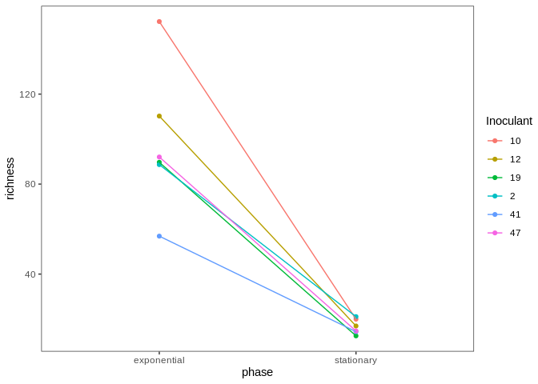<!-- -->

``` r
# Evenness
alpha_prepost %>% 
  ggplot(aes(x=phase, y=evenness, color=Inoculant)) +
  geom_point() + 
  geom_line(aes(group=Inoculant)) +
  theme_test()
```

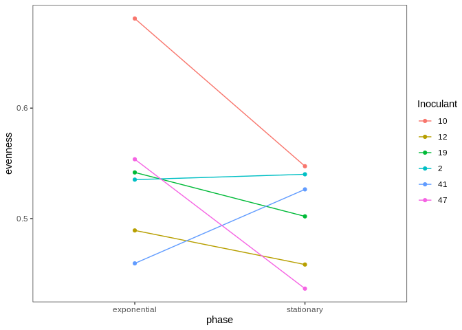<!-- -->

##### Statistics

Linear mixed model with random intercepts for Inoculant (equivalent to
paired t-test)

Richness:

``` r
rich_lmer <- lmer(log(richness) ~ phase + (1|Inoculant), alpha_prepost)
hist(resid(rich_lmer))
```

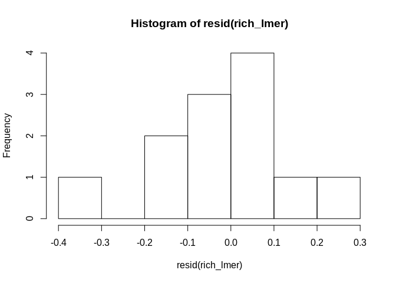<!-- -->

``` r
plot(predict(rich_lmer), resid(rich_lmer))
```

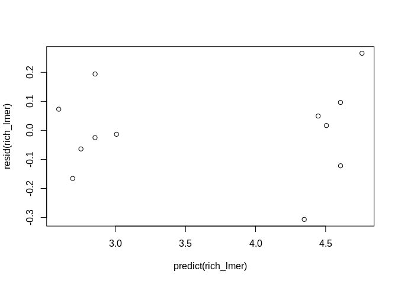<!-- -->

``` r
anova(rich_lmer)
```

    ## Type III Analysis of Variance Table with Satterthwaite's method
    ##       Sum Sq Mean Sq NumDF DenDF F value    Pr(>F)    
    ## phase 9.2135  9.2135     1     5  236.58 2.108e-05 ***
    ## ---
    ## Signif. codes:  0 '***' 0.001 '**' 0.01 '*' 0.05 '.' 0.1 ' ' 1

Evenness:

``` r
even_lmer <- lmer(evenness ~ phase + (1|Inoculant), alpha_prepost)
hist(resid(even_lmer))
```

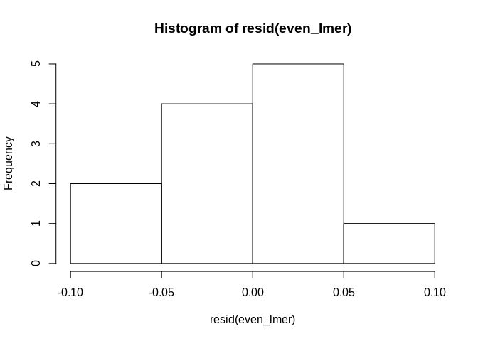<!-- -->

``` r
plot(predict(even_lmer), resid(even_lmer))
```

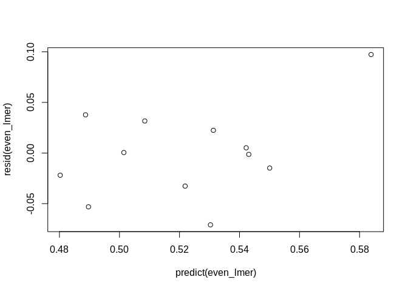<!-- -->

``` r
anova(even_lmer)
```

    ## Type III Analysis of Variance Table with Satterthwaite's method
    ##         Sum Sq  Mean Sq NumDF DenDF F value Pr(>F)
    ## phase 0.005197 0.005197     1     5  1.8383 0.2332

All data:

``` r
# richness
alpha_day %>% 
  ggplot(aes(x=Day, y=richness, color=Inoculant)) +
  geom_point() + 
  geom_line(aes(group=Inoculant)) +
  geom_vline(xintercept = 9, linetype=2) +
  theme_test()
```

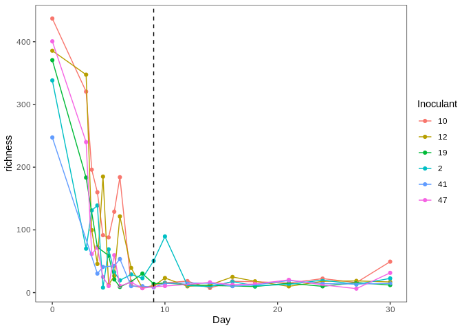<!-- -->

``` r
# Evenness
alpha_day %>% 
  ggplot(aes(x=Day, y=evenness, color=Inoculant)) +
  geom_point() + 
  geom_line(aes(group=Inoculant)) +
  geom_vline(xintercept = 9, linetype=2) +
  theme_test()
```

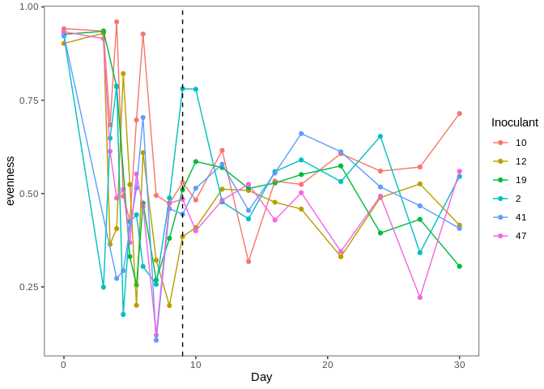<!-- -->

# Beta Diversity

``` r
# Set seed for permutational analyses
set.seed(2)
```

## Overall

NMDS ordination:

``` r
# Graph formatting to color time points
meta_format <- data.frame(sample_data(physeq)) %>% 
  mutate(leveloff = if_else(Day >=9, "pre", "post"),
         firstlast = if_else(Day==0, "start", if_else(Day==30, "end", "between")))
physeq_format <- phyloseq(physeq@otu_table, physeq@tax_table, physeq@phy_tree, sample_data(meta_format))

# Calculate wunifrac distance
wuni_dist <- distance(physeq_format, method="wunifrac")

# Ordinate 
# Using pcoa because no convergence with nmds
ord_pcoa <- ordinate(physeq_format, method="PCoA", distance=wuni_dist)

# Visualize
plot_ordination(physeq_format, ord_pcoa, color="Inoculant") +
  facet_wrap(~Day) +
  theme_test()
```

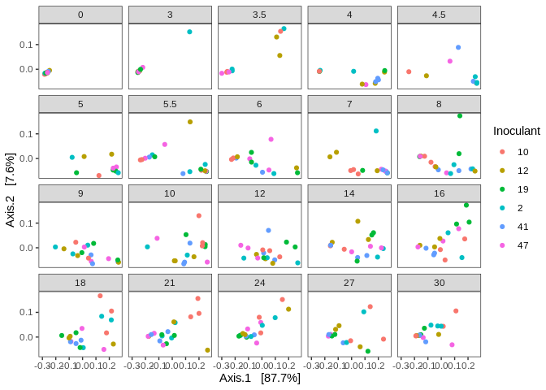<!-- -->

``` r
plot_ordination(physeq_format, ord_pcoa, color="firstlast") +
  facet_wrap(~Inoculant) +
  theme_test()
```

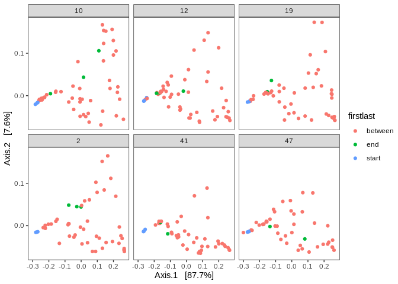<!-- -->

PermANOVA:

``` r
# Overall 
adonis(wuni_dist~Inoculant*Day, data=meta, permutations=999)
```

    ## 
    ## Call:
    ## adonis(formula = wuni_dist ~ Inoculant * Day, data = meta, permutations = 999) 
    ## 
    ## Permutation: free
    ## Number of permutations: 999
    ## 
    ## Terms added sequentially (first to last)
    ## 
    ##                Df SumsOfSqs   MeanSqs F.Model       R2 Pr(>F)    
    ## Inoculant       5    0.1538  0.030765  1.0092  0.01600  0.402    
    ## Day             1   -0.0105 -0.010465 -0.3433 -0.00109  0.999    
    ## Inoculant:Day   5    0.5969  0.119385  3.9163  0.06211  0.001 ***
    ## Residuals     291    8.8709  0.030484          0.92298           
    ## Total         302    9.6112                    1.00000           
    ## ---
    ## Signif. codes:  0 '***' 0.001 '**' 0.01 '*' 0.05 '.' 0.1 ' ' 1

``` r
# TP 0
meta_day0 <- meta %>% filter(Day==0)
physeq_day0 <- subset_samples(physeq, Day==0)
wuni_day0 <- distance(physeq_day0, method="wunifrac")
adonis(wuni_day0~Inoculant, data=meta_day0, permutations=999)
```

    ## 
    ## Call:
    ## adonis(formula = wuni_day0 ~ Inoculant, data = meta_day0, permutations = 999) 
    ## 
    ## Permutation: free
    ## Number of permutations: 999
    ## 
    ## Terms added sequentially (first to last)
    ## 
    ##           Df SumsOfSqs   MeanSqs F.Model      R2 Pr(>F)    
    ## Inoculant  5  0.034602 0.0069205  2.5156 0.51176  0.001 ***
    ## Residuals 12  0.033012 0.0027510         0.48824           
    ## Total     17  0.067615                   1.00000           
    ## ---
    ## Signif. codes:  0 '***' 0.001 '**' 0.01 '*' 0.05 '.' 0.1 ' ' 1

``` r
# TP 30
meta_day30 <- meta %>% filter(Day==30)
physeq_day30 <- subset_samples(physeq, Day==30)
wuni_day30 <- distance(physeq_day30, method="wunifrac")
adonis(wuni_day30~Inoculant, data=meta_day30, permutations=999)
```

    ## 
    ## Call:
    ## adonis(formula = wuni_day30 ~ Inoculant, data = meta_day30, permutations = 999) 
    ## 
    ## Permutation: free
    ## Number of permutations: 999
    ## 
    ## Terms added sequentially (first to last)
    ## 
    ##           Df SumsOfSqs  MeanSqs F.Model      R2 Pr(>F)
    ## Inoculant  5  0.070272 0.014054  1.0881 0.35234  0.365
    ## Residuals 10  0.129170 0.012917         0.64766       
    ## Total     15  0.199442                  1.00000

``` r
# Calculate weighted unifrac
wuni_expstat <- distance(physeq_expstat, method="wunifrac")

# Ordination
pcoa_expstat <- ordinate(physeq_expstat, method="PCoA")
plot_ordination(physeq_expstat, pcoa_expstat, color="phase") +
  facet_wrap(~Inoculant) +
  stat_ellipse(type="t") +
  theme_test()
```

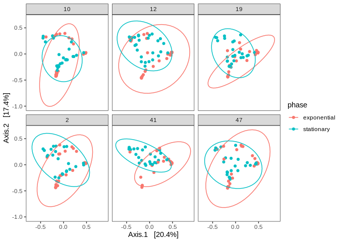<!-- -->

## Day 0

``` r
# Isolate day 0
physeq_day0 <- subset_samples(physeq_expstat, Day==0)

# Calculate weighted unifrac
wuni_day0 <- distance(physeq_day0, method="wunifrac")

# Ordination
pcoa_day0 <- ordinate(physeq_day0, method="PCoA")
plot_ordination(physeq_day0, pcoa_day0, color="Inoculant") +
  stat_ellipse(type="t") +
  theme_test()
```

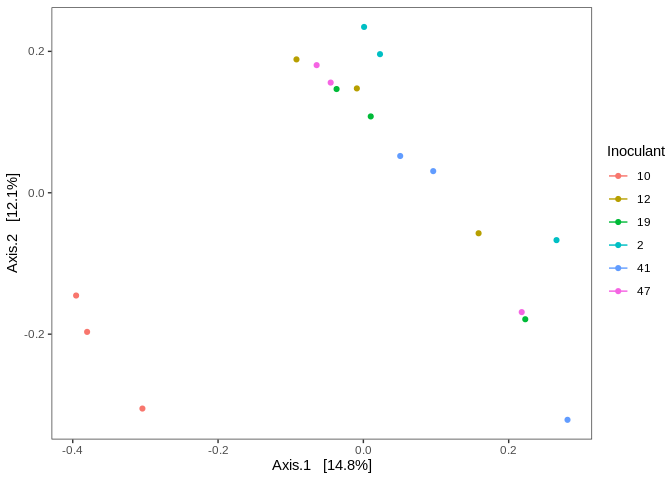<!-- -->

Permanova:

``` r
meta_day0 <- data.frame(sample_data(physeq_day0))
adonis(wuni_day0 ~ Inoculant, data=meta_day0, permutations=9999)                        
```

    ## 
    ## Call:
    ## adonis(formula = wuni_day0 ~ Inoculant, data = meta_day0, permutations = 9999) 
    ## 
    ## Permutation: free
    ## Number of permutations: 9999
    ## 
    ## Terms added sequentially (first to last)
    ## 
    ##           Df SumsOfSqs   MeanSqs F.Model      R2 Pr(>F)    
    ## Inoculant  5  0.034602 0.0069205  2.5156 0.51176  1e-04 ***
    ## Residuals 12  0.033012 0.0027510         0.48824           
    ## Total     17  0.067615                   1.00000           
    ## ---
    ## Signif. codes:  0 '***' 0.001 '**' 0.01 '*' 0.05 '.' 0.1 ' ' 1

## Day 30

``` r
# Isolate day 30
physeq_day30 <- subset_samples(physeq_expstat, Day==30 & Type=="Growth")

# Calculate weighted unifrac
wuni_day30 <- distance(physeq_day30, method="wunifrac")

# Ordination
pcoa_day30 <- ordinate(physeq_day30, method="PCoA")
plot_ordination(physeq_day30, pcoa_day30, color="Inoculant") +
  stat_ellipse(type="t") +
  theme_test()
```

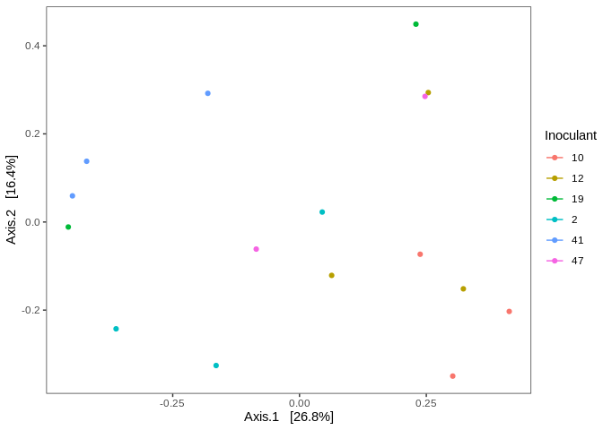<!-- -->

Permanova:

``` r
meta_day30 <- data.frame(sample_data(physeq_day30))
adonis(wuni_day30 ~ Inoculant, data=meta_day30, permutations=9999)                        
```

    ## 
    ## Call:
    ## adonis(formula = wuni_day30 ~ Inoculant, data = meta_day30, permutations = 9999) 
    ## 
    ## Permutation: free
    ## Number of permutations: 9999
    ## 
    ## Terms added sequentially (first to last)
    ## 
    ##           Df SumsOfSqs  MeanSqs F.Model      R2 Pr(>F)
    ## Inoculant  5  0.070272 0.014054  1.0881 0.35234 0.4156
    ## Residuals 10  0.129170 0.012917         0.64766       
    ## Total     15  0.199442                  1.00000

## Day 0 vs Day 30

Can we differentiate?

``` r
# Isolate first and final day of inubation
physeq_day030 <- subset_samples(physeq_expstat, Day==0 | Day==30)

# Calculate weighted unifrac
wuni_day030 <- distance(physeq_day030, method="wunifrac")

# PCoA ordination
pcoa_day030 <- ordinate(physeq_day030, method="PCoA")
plot_ordination(physeq_day030, pcoa_day030, color="Inoculant", shape="phase") +
  theme_test()
```

<!-- -->

Permanova:

``` r
meta_day030 <- data.frame(sample_data(physeq_day030))
adonis(wuni_day030 ~ Inoculant+Day+Inoculant*Day, data=meta_day030, strata=meta_day030$Inoculant, permutations = 9999)
```

    ## 
    ## Call:
    ## adonis(formula = wuni_day030 ~ Inoculant + Day + Inoculant *      Day, data = meta_day030, permutations = 9999, strata = meta_day030$Inoculant) 
    ## 
    ## Blocks:  strata 
    ## Permutation: free
    ## Number of permutations: 9999
    ## 
    ## Terms added sequentially (first to last)
    ## 
    ##               Df SumsOfSqs  MeanSqs F.Model      R2 Pr(>F)    
    ## Inoculant      5   0.04794 0.009589  1.3007 0.09654 0.0001 ***
    ## Day            1   0.22627 0.226275 30.6942 0.45565 0.0001 ***
    ## Inoculant:Day  5   0.06019 0.012039  1.6330 0.12121 0.1897    
    ## Residuals     22   0.16218 0.007372         0.32659           
    ## Total         33   0.49659                  1.00000           
    ## ---
    ## Signif. codes:  0 '***' 0.001 '**' 0.01 '*' 0.05 '.' 0.1 ' ' 1

## Day 0 vs 9

``` r
# Isolate beginning and last time point measured of stationary phase
physeq_day09 <- subset_samples(physeq_expstat, Day==0 | Day==9)

# Calculate weighted unifrac
wuni_day09 <- distance(physeq_day09, method="wunifrac")

# PCoA ordination
pcoa_day09 <- ordinate(physeq_day09, method="PCoA")
plot_ordination(physeq_day09, pcoa_day09, color="Day") +
  theme_test()
```

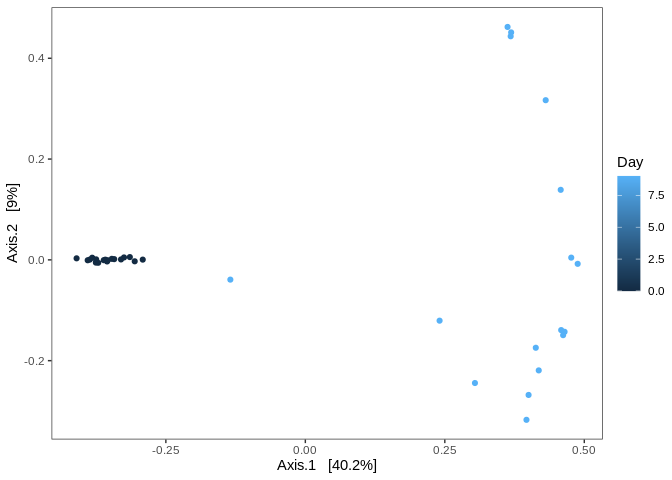<!-- -->

Permanova:

``` r
meta_day09 <- data.frame(sample_data(physeq_day09))
adonis(wuni_day09 ~ Day, data=meta_day09, strata=meta_day09$Inoculant, permutations = 9999)
```

    ## 
    ## Call:
    ## adonis(formula = wuni_day09 ~ Day, data = meta_day09, permutations = 9999,      strata = meta_day09$Inoculant) 
    ## 
    ## Blocks:  strata 
    ## Permutation: free
    ## Number of permutations: 9999
    ## 
    ## Terms added sequentially (first to last)
    ## 
    ##           Df SumsOfSqs MeanSqs F.Model      R2 Pr(>F)    
    ## Day        1   0.83796 0.83796  71.379 0.68385  1e-04 ***
    ## Residuals 33   0.38741 0.01174         0.31615           
    ## Total     34   1.22537                 1.00000           
    ## ---
    ## Signif. codes:  0 '***' 0.001 '**' 0.01 '*' 0.05 '.' 0.1 ' ' 1

## Day 9 vs 30

``` r
# Isolate beginning and last time point measured of dayionary phase
physeq_day930 <- subset_samples(physeq_expstat, Day==9 | Day==30)

# Calculate weighted unifrac
wuni_day930 <- distance(physeq_day930, method="wunifrac")

# PCoA ordination
pcoa_day930 <- ordinate(physeq_day930, method="PCoA")
plot_ordination(physeq_day930, pcoa_day930, color="Day") +
  theme_test()
```

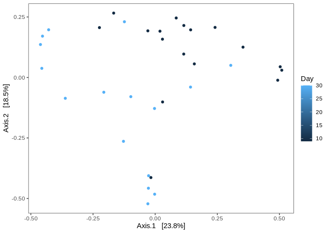<!-- -->

Permanova:

``` r
meta_day930 <- data.frame(sample_data(physeq_day930))
adonis(wuni_day930 ~ Day, data=meta_day930, strata=meta_day930$Inoculant, permutations = 9999)
```

    ## 
    ## Call:
    ## adonis(formula = wuni_day930 ~ Day, data = meta_day930, permutations = 9999,      strata = meta_day930$Inoculant) 
    ## 
    ## Blocks:  strata 
    ## Permutation: free
    ## Number of permutations: 9999
    ## 
    ## Terms added sequentially (first to last)
    ## 
    ##           Df SumsOfSqs  MeanSqs F.Model      R2 Pr(>F)   
    ## Day        1   0.16178 0.161781  9.6589 0.23756 0.0029 **
    ## Residuals 31   0.51923 0.016749         0.76244          
    ## Total     32   0.68101                  1.00000          
    ## ---
    ## Signif. codes:  0 '***' 0.001 '**' 0.01 '*' 0.05 '.' 0.1 ' ' 1

## Days 0, 9, 30

``` r
# Isolate beginning and last time point measured of day0ionary phase
physeq_day0930 <- subset_samples(physeq_expstat, Day==0 | Day==9 | Day==30)

# Calculate weighted unifrac
wuni_day0930 <- distance(physeq_day0930, method="wunifrac")

# PCoA ordination
pcoa_day0930 <- ordinate(physeq_day0930, method="PCoA")
plot_ordination(physeq_day0930, pcoa_day0930, color="Day") +
  theme_test()
```

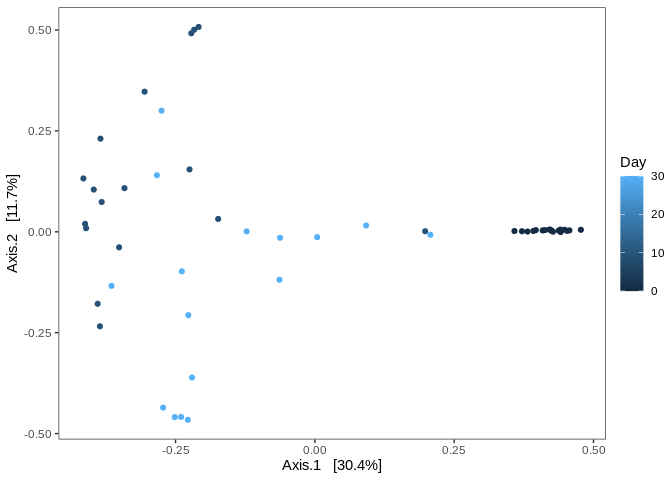<!-- -->

Permanova:

``` r
meta_day0930 <- data.frame(sample_data(physeq_day0930))
adonis(wuni_day0930 ~ Day, data=meta_day0930, strata=meta_day0930$Inoculant, permutations = 9999)
```

    ## 
    ## Call:
    ## adonis(formula = wuni_day0930 ~ Day, data = meta_day0930, permutations = 9999,      strata = meta_day0930$Inoculant) 
    ## 
    ## Blocks:  strata 
    ## Permutation: free
    ## Number of permutations: 9999
    ## 
    ## Terms added sequentially (first to last)
    ## 
    ##           Df SumsOfSqs  MeanSqs F.Model      R2 Pr(>F)  
    ## Day        1   0.09874 0.098743   3.663 0.06956 0.0656 .
    ## Residuals 49   1.32088 0.026957         0.93044         
    ## Total     50   1.41962                  1.00000         
    ## ---
    ## Signif. codes:  0 '***' 0.001 '**' 0.01 '*' 0.05 '.' 0.1 ' ' 1

## Day 0 vs. total respiration

Did the initial community structure impact CO2 respiration? Focusing on
axis 2 because of difference between inoculant 10 in both beta diversity
and total respiration.

Import respiration data:

``` r
# CO2
resp <- readRDS("../data_intermediate/SFA2_respiration.rds")

# Calculate total CO2, average per inoculant
resp_total <- resp %>% 
  group_by(Inoculant, Day) %>% 
  summarize(avg_mgco2 = mean(mgCO2)) %>% 
  ungroup() %>% 
  group_by(Inoculant) %>% 
  summarize(total_mgco2 = sum(avg_mgco2)) %>% 
  ungroup() %>% 
  filter(Inoculant != 0)
```

Isolate and average axis 2 of day 0 PCoA:

``` r
samids_day0 <- meta_day0$SampleID

pcoa_day0_ax2 <- pcoa_day0$vectors %>% 
  as.data.frame() %>% 
  select(Axis.2) %>% 
  rownames_to_column(var="SampleID") %>%
  inner_join(meta_day0) %>% 
  group_by(Inoculant) %>% # average inoculant replicates
  summarize(mean_axis2 = mean(Axis.2))
```

Combine total respiration and axis 2:

``` r
resp_axis2 <- inner_join(resp_total, pcoa_day0_ax2)
```

Visualize:

``` r
resp_axis2 %>% 
  ggplot(aes(x=mean_axis2, y=total_mgco2)) +
  geom_point() +
  geom_text(aes(label=Inoculant), hjust=1.2, vjust=1.2) +
  theme_test()
```

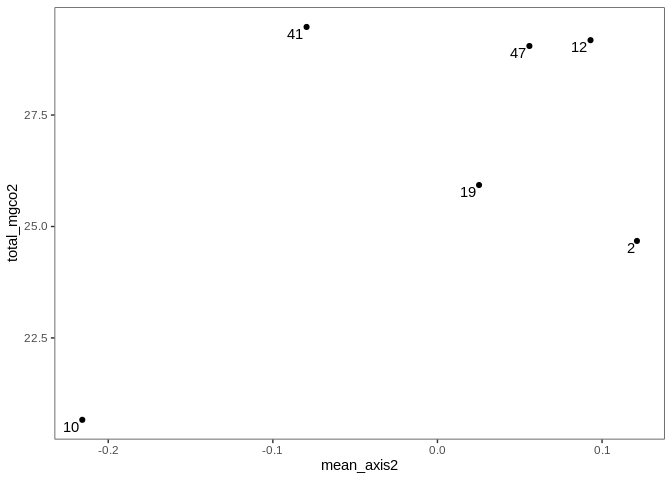<!-- -->

## Effect of time on each innoculant

``` r
# Inoculant 10
meta_inoc10 <- meta %>% filter(Inoculant==10)
physeq_inoc10 <- subset_samples(physeq, Inoculant==10)
wuni_inoc10 <- distance(physeq_inoc10, method="wunifrac")
ad10 <- adonis(wuni_inoc10~Day, data=meta_inoc10, permutations=999)
p10 <- ad10$aov.tab$`Pr(>F)`[1]

# Inoculant 41
meta_inoc41 <- meta %>% filter(Inoculant==41)
physeq_inoc41 <- subset_samples(physeq, Inoculant==41)
wuni_inoc41 <- distance(physeq_inoc41, method="wunifrac")
ad41 <- adonis(wuni_inoc41~Day, data=meta_inoc41, permutations=999)
p41 <- ad41$aov.tab$`Pr(>F)`[1]

# Inoculant 12
meta_inoc12 <- meta %>% filter(Inoculant==12)
physeq_inoc12 <- subset_samples(physeq, Inoculant==12)
wuni_inoc12 <- distance(physeq_inoc12, method="wunifrac")
adonis(wuni_inoc12~Day, data=meta_inoc12, permutations=999)
```

    ## 
    ## Call:
    ## adonis(formula = wuni_inoc12 ~ Day, data = meta_inoc12, permutations = 999) 
    ## 
    ## Permutation: free
    ## Number of permutations: 999
    ## 
    ## Terms added sequentially (first to last)
    ## 
    ##           Df SumsOfSqs  MeanSqs F.Model      R2 Pr(>F)
    ## Day        1   0.01943 0.019433 0.64061 0.01241  0.456
    ## Residuals 51   1.54713 0.030336         0.98759       
    ## Total     52   1.56657                  1.00000

``` r
ad12 <- adonis(wuni_inoc12~Day, data=meta_inoc12, permutations=999)
p12 <- ad12$aov.tab$`Pr(>F)`[1]

# Inoculant 2
meta_inoc2 <- meta %>% filter(Inoculant==2)
physeq_inoc2 <- subset_samples(physeq, Inoculant==2)
wuni_inoc2 <- distance(physeq_inoc2, method="wunifrac")
adonis(wuni_inoc2~Day, data=meta_inoc2, permutations=999)
```

    ## 
    ## Call:
    ## adonis(formula = wuni_inoc2 ~ Day, data = meta_inoc2, permutations = 999) 
    ## 
    ## Permutation: free
    ## Number of permutations: 999
    ## 
    ## Terms added sequentially (first to last)
    ## 
    ##           Df SumsOfSqs  MeanSqs F.Model      R2 Pr(>F)
    ## Day        1   0.00915 0.009151 0.27892 0.00578  0.726
    ## Residuals 48   1.57489 0.032810         0.99422       
    ## Total     49   1.58404                  1.00000

``` r
ad2 <- adonis(wuni_inoc2~Day, data=meta_inoc2, permutations=999)
p2 <- ad2$aov.tab$`Pr(>F)`[1]

# Inoculant 19
meta_inoc19 <- meta %>% filter(Inoculant==19)
physeq_inoc19 <- subset_samples(physeq, Inoculant==19)
wuni_inoc19 <- distance(physeq_inoc19, method="wunifrac")
adonis(wuni_inoc19~Day, data=meta_inoc19, permutations=999)
```

    ## 
    ## Call:
    ## adonis(formula = wuni_inoc19 ~ Day, data = meta_inoc19, permutations = 999) 
    ## 
    ## Permutation: free
    ## Number of permutations: 999
    ## 
    ## Terms added sequentially (first to last)
    ## 
    ##           Df SumsOfSqs   MeanSqs   F.Model       R2 Pr(>F)
    ## Day        1  -0.00244 -0.002440 -0.066494 -0.00136   0.98
    ## Residuals 49   1.79771  0.036688            1.00136       
    ## Total     50   1.79528                      1.00000

``` r
ad19 <- adonis(wuni_inoc19~Day, data=meta_inoc19, permutations=999)
p19 <- ad19$aov.tab$`Pr(>F)`[1]

# Inoculant 47
meta_inoc47 <- meta %>% filter(Inoculant==47)
physeq_inoc47 <- subset_samples(physeq, Inoculant==47)
wuni_inoc47 <- distance(physeq_inoc47, method="wunifrac")
adonis(wuni_inoc47~Day, data=meta_inoc47, permutations=999)
```

    ## 
    ## Call:
    ## adonis(formula = wuni_inoc47 ~ Day, data = meta_inoc47, permutations = 999) 
    ## 
    ## Permutation: free
    ## Number of permutations: 999
    ## 
    ## Terms added sequentially (first to last)
    ## 
    ##           Df SumsOfSqs   MeanSqs  F.Model       R2 Pr(>F)
    ## Day        1  -0.02213 -0.022130 -0.71027 -0.01534      1
    ## Residuals 47   1.46441  0.031158           1.01534       
    ## Total     48   1.44228                     1.00000

``` r
ad47 <- adonis(wuni_inoc47~Day, data=meta_inoc47, permutations=999)
p47 <- ad47$aov.tab$`Pr(>F)`[1]

# P adjust
p.adjust(c(p10, p2, p41, p47, p12, p19), method="fdr", n=6)
```

    ## [1] 0.006 1.000 0.033 1.000 0.920 1.000

# Phylogenetic dispersion

Weighted unifrac distances:

SLOW

``` r
# Calculate wunifrac distance
wuni_dist <- distance(physeq, method="wunifrac")

meta_sub <- select(meta, SampleID, Inoculant, Day)

# Reformat
wuni_df <- wuni_dist %>% 
  as.matrix() %>% 
  as.data.frame() %>%
  rownames_to_column(var="Sample1") %>% 
  pivot_longer(-Sample1, names_to = "Sample2", values_to = "wuni_dist")

wuni_df <- wuni_df[wuni_df$Sample1 != wuni_df$Sample2,] # remove self-comparisons
```

Remove duplicate comparisons:

SLOW STEP, run
manually

``` r
# Sort sample1 and sample2 to create a unique label for duplicates regardless of order in columns
all_labels <- as.character()
for (i in 1:nrow(wuni_df)) {
  string <- wuni_df[i,] %>% 
    select(Sample1, Sample2) %>% 
    as.character() %>% 
    sort()
  label <- paste0(string[1], string[2])
  all_labels <- append(all_labels, label)
}

wuni_df2 <- bind_cols(wuni_df, all_labels) %>% 
  select(wuni_dist, label=`...4`) %>% 
  distinct() %>% # remove duplicate pairwise comparisons!
  mutate(Sample1 = gsub("(sa[0-9]+)(sa[0-9]+)", "\\1", label),
         Sample2 = gsub("(sa[0-9]+)(sa[0-9]+)", "\\2", label)) %>% 
  select(Sample1, Sample2, wuni_dist)

# Save filtered data
saveRDS(wuni_df2, "../data_intermediate/SFA2_wunidist_slim.rds")
```

``` r
# Load data
wuni_df <- readRDS("../data_intermediate/SFA2_wunidist_slim.rds")
```

## Between replicates

Averaged distance between replicates of same inoculant and time point.

``` r
# Comparisons of interest
wuni_within <- data.frame()
for (i in unique(meta$Inoculant)) {
  for (d in unique(meta[meta$Inoculant==i,]$Day)) {
    sams <- filter(meta, Inoculant==i & Day==d) 
    sams <- sams$SampleID
    wuni_sub <- filter(wuni_df, Sample1 %in% sams & Sample2 %in% sams) # isolate samples of interest
    wuni_avg <- mean(wuni_sub$wuni_dist) # average
    this_row <- bind_cols(Inoculant=i, Day=d, wuni_dist=wuni_avg)
    wuni_within <- bind_rows(wuni_within, this_row)
  }
}

# Average across incoulants
wuni_within_avg <- wuni_within %>% 
  group_by(Day) %>% 
  summarize(wuni_dist = mean(wuni_dist, na.rm=TRUE)) %>% 
  ungroup() %>% 
  add_column(Inoculant="avg")
```

``` r
# Visualize
wuni_within %>% 
  ggplot(aes(x=Day, y=wuni_dist, color=Inoculant)) +
  geom_point() +
  geom_line() +
  geom_vline(xintercept=9, linetype=2) +
  facet_wrap(~Inoculant) +
  labs(y="Weighted unifrac distance (between replicates)") +
  theme_test()
```

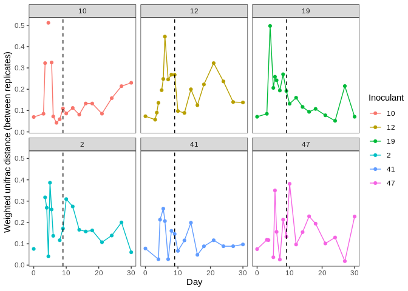<!-- -->

``` r
wuni_within %>% 
  ggplot(aes(x=Day, y=wuni_dist)) +
  geom_point() +
  geom_line(aes(group=Day)) +
  geom_vline(xintercept=9, linetype=2) +
  labs(y="Weighted unifrac distance (between replicates)") +
  theme_test()
```

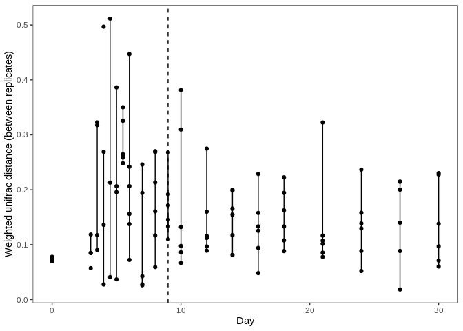<!-- -->

``` r
wuni_within_avg %>% 
  mutate(phase = if_else(Day <= 9, "exp", "stat")) %>% 
  ggplot(aes(x=Day, y=wuni_dist)) +
  geom_point() +
  geom_line() +
  geom_vline(xintercept=9, linetype=2) +
  geom_smooth(method="lm", aes(group=phase)) +
  labs(y="Weighted unifrac distance (between replicates)") +
  theme_test()
```

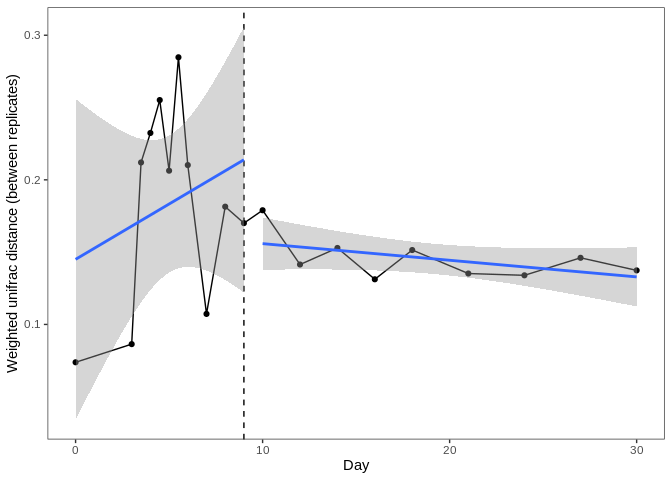<!-- -->

## Distance from day 0

``` r
# Extract comparisons to 0 and average distance for each replicate in time point/inoculant
wuni_day0 <- data.frame()
for (i in unique(meta_expstat$Inoculant)) {
  for (d in unique(meta_expstat[meta_expstat$Inoculant==i & meta_expstat$Day!=0,]$Day)) {
    for (r in unique(meta_expstat[meta_expstat$Inoculant==i & meta_expstat$Day==d,]$Replicate)) {
      sub_sams <- filter(meta, Inoculant==i & Replicate==r & Day==d)$SampleID
      day0_sams <- filter(meta, Inoculant==i & Day==0)$SampleID
      all_sams <- c(sub_sams, day0_sams)
      wuni_avg <- filter(wuni_df, Sample1 %in% all_sams & Sample2 %in% all_sams) %>%
        mutate(day0 = if_else(Sample1 %in% day0_sams | Sample2 %in% day0_sams, "yes", "no")) %>% 
        filter(day0=="yes") %>% # remove comparisons not made to day 0
        filter(!(Sample1 %in% day0_sams & Sample2 %in% day0_sams)) %>% # remove day 0 vs day 0
        summarize(wuni_dist = mean(wuni_dist)) # average distance between day 0 and replicate
      this_row <- bind_cols(Inoculant=i, Day=d, Replicate=r, wuni_dist=wuni_avg$wuni_dist)
      wuni_day0 <- bind_rows(wuni_day0, this_row)
    }
  }
}

# Average across inoculants
wuni_day0_avg <- wuni_day0 %>% 
  group_by(Day, Replicate) %>% 
  summarize(wuni_dist=mean(wuni_dist)) %>% 
  ungroup() %>% 
  add_column(Inoculant="avg")

# Combine
wuni_day0_all <- bind_rows(wuni_day0, wuni_day0_avg)
```

Visualize:

``` r
wuni_day0_all %>% 
  filter(Inoculant=="avg") %>% 
  #mutate(fade = if_else(Inoculant=="avg", "yes", "no")) %>% 
  ggplot(aes(x=Day, y=wuni_dist)) +
  geom_point(aes(group=Day)) +
  geom_line(aes(group=Day)) +
  geom_vline(xintercept=9, linetype=2) +
  labs(y="W.unifrac distance to day 0 (average of inoculants)") +
  theme_test() +
  theme(legend.position = "none")
```

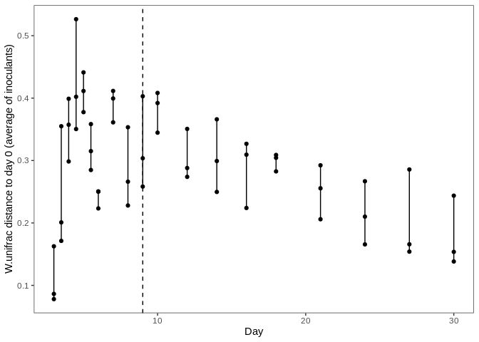<!-- -->

## Coefficient of variation (reps)

Within replicate variation

Calculate coeff. of variation for each timepoint:

``` r
# Coefficient of variation across replicates for each time point
wuni_cv_df <- data.frame()
for (i in unique(meta_expstat$Inoculant)) {
  for (d in unique(meta_expstat[meta_expstat$Inoculant==i,]$Day)) {
    sams <- filter(meta, Inoculant==i & Day==d) 
    sams <- sams$SampleID
    wuni_sub <- filter(wuni_df, Sample1 %in% sams & Sample2 %in% sams) # isolate reps
    wuni_cv <- (sd(wuni_sub$wuni_dist)/mean(wuni_sub$wuni_dist))*100 # calc coeff of var
    this_row <- bind_cols(Inoculant=i, Day=d, wuni_cv=wuni_cv)
    wuni_cv_df <- bind_rows(wuni_cv_df, this_row)
  }
}
wuni_cv_df <- na.omit(wuni_cv_df) %>% 
  inner_join(meta_expstat) %>%
  mutate(phase = fct_relevel(phase, c("pre", "post")))

# Average pre and post days
wuni_cv_prepost <- wuni_cv_df %>% 
  group_by(Inoculant, phase) %>%
  summarise(wuni_cv = mean(wuni_cv))
```

Visualize:

``` r
# All time points
wuni_cv_df %>% 
  group_by(Day) %>% 
  summarize(wuni_cv = mean(wuni_cv)) %>% 
  ggplot(aes(x=Day, y=wuni_cv)) + 
  geom_point() +
  geom_line() +
  #facet_wrap(~Inoculant) +
  #geom_line(aes(group=Inoculant)) +
  theme_test()
```

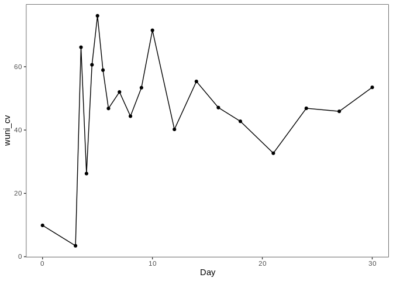<!-- -->

``` r
# Phases
wuni_cv_prepost %>% 

  ggplot(aes(x=phase, y=wuni_cv, color=Inoculant)) + 
  geom_point() +
  geom_line(aes(group=Inoculant)) +
  theme_test()
```

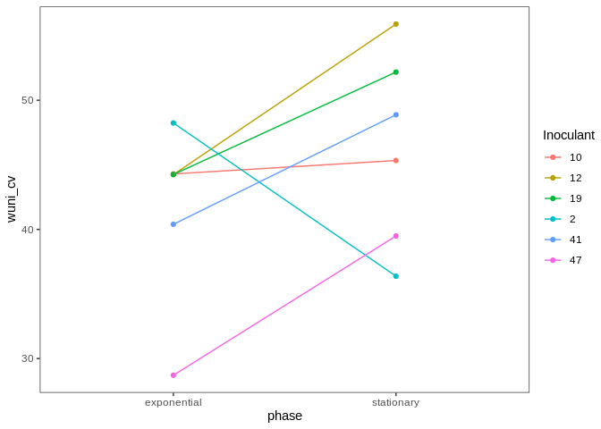<!-- -->

# Figures

## Alpha diversity

``` r
# richness
plot1 <- alpha_prepost %>% 
  ggplot(aes(x=phase, y=richness)) +
  geom_point() + 
  geom_line(aes(group=Inoculant)) +
  theme_test() +
  theme(axis.text=element_text(size=10),
      axis.title=element_blank())
plot1
```

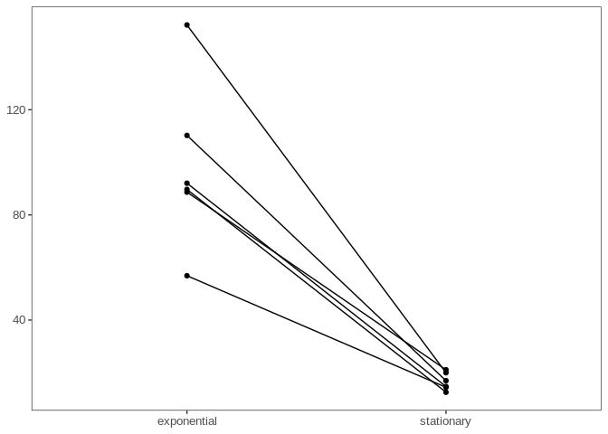<!-- -->

``` r
# Evenness
plot2 <- alpha_prepost %>% 
  ggplot(aes(x=phase, y=evenness)) +
  geom_point() + 
  geom_line(aes(group=Inoculant)) +
  theme_test() +
  theme(axis.text=element_text(size=10),
      axis.title=element_blank())
plot2
```

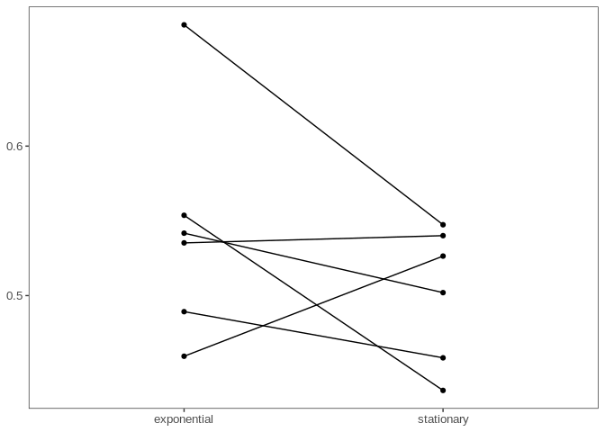<!-- -->

Combine:

``` r
plot_comb12 <- plot_grid(plot1, plot2, nrow=2)
plot_comb12
```

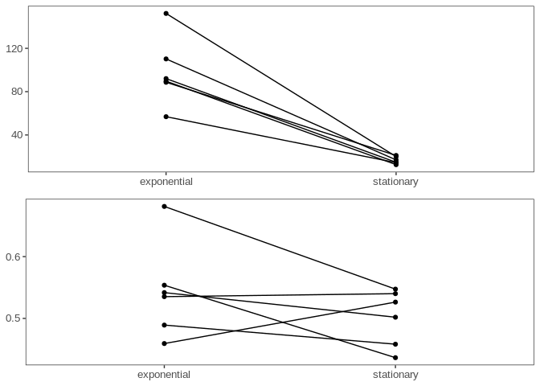<!-- -->

``` r
ggsave("../figures/supp_alpha.svg", height=120, width=90, units="mm", device="svg")
```

## Beta diversity

Supplement day 0, 9, 30:

``` r
# Extract ordination from pcoa class object
pcoa0930_df <- pcoa_day0930$vectors %>% 
  data.frame() %>% 
  select(Axis.1, Axis.2) %>% 
  rownames_to_column(var="SampleID") %>% 
  left_join(meta)

# Calculate ellipse
# Taken from: https://stackoverflow.com/questions/2397097/how-can-a-data-ellipse-be-superimposed-on-a-ggplot2-scatterplot
library(ellipse)
ell0930_df <- data.frame()
for(d in unique(pcoa0930_df$Day)){
    ell0930_df <- rbind(ell0930_df, cbind(as.data.frame(
      with(pcoa0930_df[pcoa0930_df$Day==d,],
           ellipse(cor(Axis.1, Axis.2), scale=c(sd(Axis.1),sd(Axis.2)), centre=c(mean(Axis.1), mean(Axis.2)))
           )), 
      Day=d))
}

# Visualize
pcoa0930_df <- pcoa0930_df %>% 
  mutate(Day=as.character(Day))

ell0930_df <- ell0930_df %>% 
  mutate(Day=as.character(Day))

day_colors <- c(`0`="#bcbcbc", `9`="#5b5b5b", `30`="black")

pcoa0930_df %>%
  ggplot(aes(x=Axis.1, y=Axis.2, color=Day, shape=Day)) +
  geom_path(data=ell0930_df, aes(x=x, y=y, colour=Day), size=1, linetype=2) +
  geom_point() +
  scale_color_manual(values=day_colors) +
  theme_test()
```

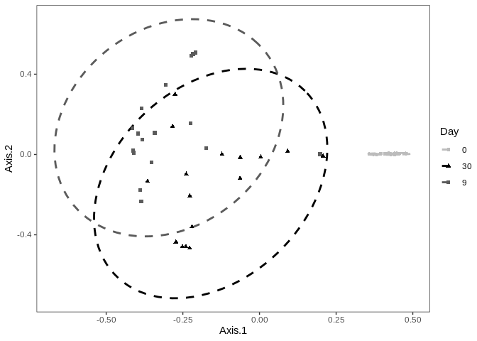<!-- -->

``` r
ggsave("../figures/supp_beta0930.svg", height=90, width=120, units="mm", device="svg")
```

# SCRAP

Supplement day 0 vs
30:

``` r
plot3 <- plot_ordination(physeq_day030, pcoa_day030, color="Inoculant", shape="phase") +
  theme_test()
plot3
```

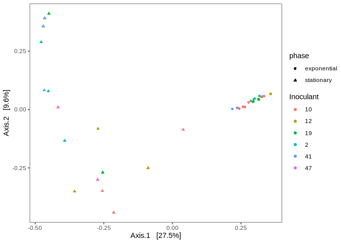<!-- -->

``` r
# WIP
#physeq_day030, pcoa_day030
# Extract ordination from pcoa class object
pcoa030_df <- pcoa_day030$vectors %>% 
  data.frame() %>% 
  select(Axis.1, Axis.2) %>% 
  rownames_to_column(var="SampleID") %>% 
  left_join(meta)

# Calculate ellipse
# Stolen from: https://stackoverflow.com/questions/2397097/how-can-a-data-ellipse-be-superimposed-on-a-ggplot2-scatterplot
library(ellipse)
df_ell <- data.frame()
for(d in unique(pcoa030_df$Day)){
    df_ell <- rbind(df_ell, cbind(as.data.frame(with(pcoa030_df[pcoa030_df$Day==d,],
                                           ellipse(cor(Axis.1, Axis.2),
                                                           scale=c(sd(Axis.1),sd(Axis.2)),                                                                   centre=c(mean(Axis.1), mean(Axis.2)))
                                           )), Day=d))
}

# Visualize
pcoa030_df <- pcoa030_df %>% 
  mutate(Day=as.character(Day))

df_ell <- df_ell %>% 
  mutate(Day=as.character(Day))

ggplot(data=pcoa030_df, aes(x=Axis.1, y=Axis.2, shape=Day)) +
  geom_path(data=df_ell, aes(x=x, y=y, group=Day), color="gray", size=1, linetype=2) +
  geom_point() +
  theme_test()
```

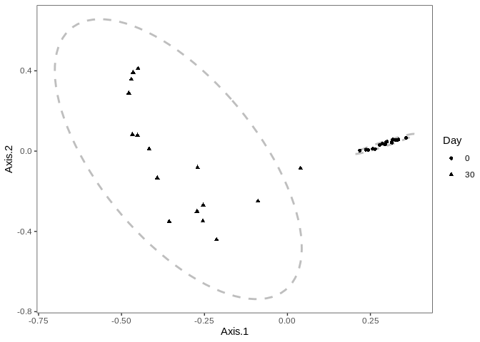<!-- -->

``` r
ggsave("../figures/supp_beta.svg", height=90, width=120, units="mm", device="svg")
```
