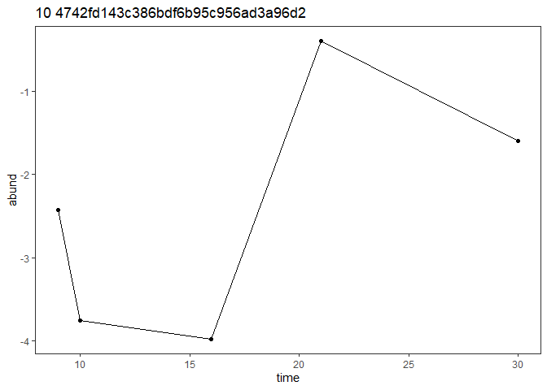

SFA - DESeq2
================
Cassandra Wattenburger
2023-06-12

``` r
# Clear working directory, load in packages, generate package info
rm(list=ls())

library("phyloseq")
library("DESeq2")
library("tidyverse")

sessionInfo()
```

    ## R version 4.2.1 (2022-06-23 ucrt)
    ## Platform: x86_64-w64-mingw32/x64 (64-bit)
    ## Running under: Windows 10 x64 (build 19044)
    ## 
    ## Matrix products: default
    ## 
    ## locale:
    ## [1] LC_COLLATE=English_United States.utf8 
    ## [2] LC_CTYPE=English_United States.utf8   
    ## [3] LC_MONETARY=English_United States.utf8
    ## [4] LC_NUMERIC=C                          
    ## [5] LC_TIME=English_United States.utf8    
    ## 
    ## attached base packages:
    ## [1] stats4    stats     graphics  grDevices utils     datasets  methods  
    ## [8] base     
    ## 
    ## other attached packages:
    ##  [1] lubridate_1.9.2             forcats_1.0.0              
    ##  [3] stringr_1.5.0               dplyr_1.1.2                
    ##  [5] purrr_1.0.1                 readr_2.1.4                
    ##  [7] tidyr_1.3.0                 tibble_3.2.1               
    ##  [9] ggplot2_3.4.2               tidyverse_2.0.0            
    ## [11] DESeq2_1.38.3               SummarizedExperiment_1.28.0
    ## [13] Biobase_2.58.0              MatrixGenerics_1.10.0      
    ## [15] matrixStats_1.0.0           GenomicRanges_1.50.2       
    ## [17] GenomeInfoDb_1.34.9         IRanges_2.32.0             
    ## [19] S4Vectors_0.36.2            BiocGenerics_0.44.0        
    ## [21] phyloseq_1.42.0            
    ## 
    ## loaded via a namespace (and not attached):
    ##  [1] nlme_3.1-157           bitops_1.0-7           bit64_4.0.5           
    ##  [4] RColorBrewer_1.1-3     httr_1.4.6             tools_4.2.1           
    ##  [7] utf8_1.2.3             R6_2.5.1               vegan_2.6-4           
    ## [10] DBI_1.1.3              mgcv_1.8-40            colorspace_2.1-0      
    ## [13] permute_0.9-7          rhdf5filters_1.10.1    ade4_1.7-22           
    ## [16] withr_2.5.0            tidyselect_1.2.0       bit_4.0.5             
    ## [19] compiler_4.2.1         cli_3.6.1              DelayedArray_0.23.2   
    ## [22] scales_1.2.1           digest_0.6.31          rmarkdown_2.22        
    ## [25] XVector_0.38.0         pkgconfig_2.0.3        htmltools_0.5.5       
    ## [28] fastmap_1.1.1          rlang_1.1.1            rstudioapi_0.14       
    ## [31] RSQLite_2.3.1          generics_0.1.3         jsonlite_1.8.5        
    ## [34] BiocParallel_1.32.6    RCurl_1.98-1.12        magrittr_2.0.3        
    ## [37] GenomeInfoDbData_1.2.9 biomformat_1.26.0      Matrix_1.4-1          
    ## [40] Rcpp_1.0.10            munsell_0.5.0          Rhdf5lib_1.20.0       
    ## [43] fansi_1.0.4            ape_5.7-1              lifecycle_1.0.3       
    ## [46] stringi_1.7.12         yaml_2.3.7             MASS_7.3-57           
    ## [49] zlibbioc_1.44.0        rhdf5_2.42.1           plyr_1.8.8            
    ## [52] grid_4.2.1             blob_1.2.4             parallel_4.2.1        
    ## [55] crayon_1.5.2           lattice_0.20-45        Biostrings_2.66.0     
    ## [58] splines_4.2.1          multtest_2.54.0        annotate_1.76.0       
    ## [61] hms_1.1.3              KEGGREST_1.38.0        locfit_1.5-9.8        
    ## [64] knitr_1.43             pillar_1.9.0           igraph_1.4.3          
    ## [67] geneplotter_1.76.0     reshape2_1.4.4         codetools_0.2-18      
    ## [70] XML_3.99-0.14          glue_1.6.2             evaluate_0.21         
    ## [73] data.table_1.14.8      tzdb_0.4.0             vctrs_0.6.2           
    ## [76] png_0.1-8              foreach_1.5.2          gtable_0.3.3          
    ## [79] cachem_1.0.8           xfun_0.39              xtable_1.8-4          
    ## [82] survival_3.3-1         iterators_1.0.14       AnnotationDbi_1.60.2  
    ## [85] memoise_2.0.1          cluster_2.1.3          timechange_0.2.0

Note: ran this script on personal computer with newer version R and
DESeq2 (couldn’t install onto R version on server)

# Import data

``` r
# Growth estimates
growth <- readRDS("SFA2_growth_estimates_pap2.rds")

# Unrarefied counts
physeq_raw <- readRDS("SFA2_physeq_unrare.rds")
```

Reformat and filter:

``` r
# Subset day 0 and 30, microcosms used for growth estimation
physeq030 <- subset_samples(physeq_raw, Type=="Growth" & Day %in% c(0,30))
physeq030
```

    ## phyloseq-class experiment-level object
    ## otu_table()   OTU Table:         [ 2904 taxa and 35 samples ]
    ## sample_data() Sample Data:       [ 35 samples by 10 sample variables ]
    ## tax_table()   Taxonomy Table:    [ 2904 taxa by 8 taxonomic ranks ]
    ## phy_tree()    Phylogenetic Tree: [ 2904 tips and 2900 internal nodes ]

``` r
# Day to factor
sample_data(physeq030)$Day <- as.factor(sample_data(physeq030)$Day)
```

# Differential Abundance

Day 0 vs day 30

## Inoculant 2

Reformat:

``` r
# Inoculant 2 samples
physeq_all2 <- subset_samples(physeq030, Inoculant=2)

# Remove 0 abundance taxa
physeq_all2 <- prune_taxa(taxa_sums(physeq_all2) > 0, physeq_all2)

# Add psuedo count of 1 to each sample and ASV (0s are a problem for DESeq2)
physeq_all2 <- transform_sample_counts(physeq_all2, function(x) x+1)
physeq_all2
```

    ## phyloseq-class experiment-level object
    ## otu_table()   OTU Table:         [ 2580 taxa and 35 samples ]
    ## sample_data() Sample Data:       [ 35 samples by 10 sample variables ]
    ## tax_table()   Taxonomy Table:    [ 2580 taxa by 8 taxonomic ranks ]
    ## phy_tree()    Phylogenetic Tree: [ 2580 tips and 2577 internal nodes ]

DESeq2 test:

``` r
# Create deseq2 object
deseq_all2 <- phyloseq_to_deseq2(physeq_all2, ~ Day)

# Test
test_all2 <-  DESeq(deseq_all2, test="Wald", fitType="parametric")

# Extract results
results_all2 <- results(test_all2, contrast=c("Day", "30", "0"))
alpha <- 0.05
results_all2sig  <-  results_all2[which(results_all2$padj < alpha),]
results_all2sig <-  cbind(as(results_all2sig, "data.frame"), as(tax_table(physeq_all2)[rownames(results_all2sig),], "matrix"))
```

Formatting:

``` r
growth2 <- growth %>% 
  filter(Inoculant==2) %>% 
  select(everything(), -label, -Inoculant, -c(Domain:Species))

# ASVs that grew
growth_asvs2 <- growth2 %>% 
  select(ASV) %>%  
  unique()

growth_asvs2 <- growth_asvs2$ASV
growth_asvs2
```

    ##  [1] "54444590383c6b25be49f2bbbc2c23a5" "f97fca58826d7ff487fc0db9560acb1f"
    ##  [3] "fed2377b60ef09790fc532bbbe2b4602" "0134683a521e4c34adf2d515cbbca84d"
    ##  [5] "7f96725a2b9a983019ac07aaceb2d258" "c2485d5222fb56a2c843f8b846960860"
    ##  [7] "ce39176bfe690a099dbdfa6bd02aa315" "fdc8d30ae52cbbd717577d34654bf2b6"
    ##  [9] "b23e8554b0788a1407e75a69f288670b" "1030f18ec1c231043abead5e7c3ac109"
    ## [11] "051dfbc5bbc06487f3c7441237975d4b" "7ed3d389f4fc84eb86051227087523ab"
    ## [13] "f45e2011ebad601b7c996218b5180745" "4cb003689801d84763adf7d2fa89b944"
    ## [15] "c37f1bf61cf5fcd52071fdce57d1e961" "c811c0a9f32bd8075f9421d6ece02a55"
    ## [17] "9ec63f22e09d853d4a9f6d8badfed019" "8ff129a7b05a57c02c864a9ad75e579e"
    ## [19] "4205b2d577048e1da9d9712f9476cd7b" "192e6760f106f92a4160be650f2ff3ab"
    ## [21] "8cb07fbe29ee2e7ef6f1aa341a345425" "09540b08717e7813a5112bd0ba253bf7"

``` r
# Formatting
results_all2sig <- results_all2sig %>% 
  mutate(gr_infer = if_else(ASV %in% growth_asvs2, "inferred", "not"))

# Add growth inferences
deseq2 <- results_all2sig %>% 
  left_join(growth2) %>% 
  add_column(Inoculant=2)
head(deseq2)
```

    ##   baseMean log2FoldChange     lfcSE      stat       pvalue         padj
    ## 1 4.889925      -2.786508 0.6374981 -4.371006 1.236753e-05 6.289154e-05
    ## 2 2.267297      -1.438156 0.5764219 -2.494971 1.259675e-02 2.149605e-02
    ## 3 5.616210      -3.009835 0.6681646 -4.504631 6.648841e-06 3.616755e-05
    ## 4 4.458363      -2.632759 0.6310433 -4.172074 3.018399e-05 1.370097e-04
    ## 5 2.498821      -1.615129 0.5810069 -2.779879 5.437909e-03 1.104880e-02
    ## 6 2.147365      -1.329749 0.5531848 -2.403806 1.622540e-02 2.627401e-02
    ##     Domain            Phylum           Class             Order
    ## 1 Bacteria Verrucomicrobiota      Chlamydiae      Chlamydiales
    ## 2 Bacteria Verrucomicrobiota      Chlamydiae      Chlamydiales
    ## 3 Bacteria   Patescibacteria Saccharimonadia Saccharimonadales
    ## 4 Bacteria   Patescibacteria Saccharimonadia Saccharimonadales
    ## 5 Bacteria   Patescibacteria Saccharimonadia Saccharimonadales
    ## 6 Bacteria   Patescibacteria Saccharimonadia Saccharimonadales
    ##                            Family                           Genus
    ## 1                    Simkaniaceae      Candidatus Rhabdochlamydia
    ## 2               Parachlamydiaceae          putative  Neochlamydia
    ## 3               Saccharimonadales               Saccharimonadales
    ## 4 unclassified  Saccharimonadales unclassified  Saccharimonadales
    ## 5               Saccharimonadales               Saccharimonadales
    ## 6               Saccharimonadales               Saccharimonadales
    ##                                    Species                              ASV
    ## 1 unclassified  Candidatus Rhabdochlamydia b2c05bb77b82316a291ca77839a1c7c7
    ## 2      unclassified putative  Neochlamydia 11d6778ca96e9b82afb683405b862a33
    ## 3                putative  uncultured soil 08b0de6c3e700902f86f2af0a0922dd2
    ## 4          unclassified  Saccharimonadales 0586697d841c41416eff576bb83ab4de
    ## 5                          uncultured soil b9c3ad24ac3686b281284ec71f58d89d
    ## 6           putative  uncultured bacterium 903a8577f73040b73ea9d63a280b2fe1
    ##   gr_infer slope yint  k  g start_pt end_pt start_day end_day start_abund
    ## 1      not    NA   NA NA NA       NA     NA        NA      NA          NA
    ## 2      not    NA   NA NA NA       NA     NA        NA      NA          NA
    ## 3      not    NA   NA NA NA       NA     NA        NA      NA          NA
    ## 4      not    NA   NA NA NA       NA     NA        NA      NA          NA
    ## 5      not    NA   NA NA NA       NA     NA        NA      NA          NA
    ## 6      not    NA   NA NA NA       NA     NA        NA      NA          NA
    ##   end_abund change_abund n16S genome_size phi npaths_actual nec_actual
    ## 1        NA           NA   NA          NA  NA            NA         NA
    ## 2        NA           NA   NA          NA  NA            NA         NA
    ## 3        NA           NA   NA          NA  NA            NA         NA
    ## 4        NA           NA   NA          NA  NA            NA         NA
    ## 5        NA           NA   NA          NA  NA            NA         NA
    ## 6        NA           NA   NA          NA  NA            NA         NA
    ##   confidence branch_length start_abund_corr end_abund_corr change_abund_corr
    ## 1         NA            NA               NA             NA                NA
    ## 2         NA            NA               NA             NA                NA
    ## 3         NA            NA               NA             NA                NA
    ## 4         NA            NA               NA             NA                NA
    ## 5         NA            NA               NA             NA                NA
    ## 6         NA            NA               NA             NA                NA
    ##   Inoculant
    ## 1         2
    ## 2         2
    ## 3         2
    ## 4         2
    ## 5         2
    ## 6         2

## Inoculant 10

Reformat:

``` r
# Inoculant 10 samples
physeq_all10 <- subset_samples(physeq030, Inoculant=10)

# Remove 0 abundance taxa
physeq_all10 <- prune_taxa(taxa_sums(physeq_all10) > 0, physeq_all10)

# Add psuedo count of 1 to each sample and ASV (0s are a problem for DESeq2)
physeq_all10 <- transform_sample_counts(physeq_all10, function(x) x+1)
physeq_all10
```

    ## phyloseq-class experiment-level object
    ## otu_table()   OTU Table:         [ 2580 taxa and 35 samples ]
    ## sample_data() Sample Data:       [ 35 samples by 10 sample variables ]
    ## tax_table()   Taxonomy Table:    [ 2580 taxa by 8 taxonomic ranks ]
    ## phy_tree()    Phylogenetic Tree: [ 2580 tips and 2577 internal nodes ]

DESeq2 test:

``` r
# Create deseq2 object
deseq_all10 <- phyloseq_to_deseq2(physeq_all10, ~ Day)

# Test
test_all10 <-  DESeq(deseq_all10, test="Wald", fitType="parametric")

# Extract results
results_all10 <- results(test_all10, contrast=c("Day", "30", "0"))
alpha <- 0.05
results_all10sig  <-  results_all10[which(results_all10$padj < alpha),]
results_all10sig <-  cbind(as(results_all10sig, "data.frame"), as(tax_table(physeq_all10)[rownames(results_all10sig),], "matrix"))
```

Formatting:

``` r
growth10 <- growth %>% 
  filter(Inoculant==10) %>% 
  select(everything(), -label, -Inoculant, -c(Domain:Species))

# ASVs that grew
growth_asvs10 <- growth10 %>% 
  select(ASV) %>%  
  unique()

growth_asvs10 <- growth_asvs10$ASV
growth_asvs10
```

    ##  [1] "ab7aedf2ef51264a4c188abe26643044" "06c720ffbf0839e2b78d2c140d7f7d95"
    ##  [3] "b98330a75fbab915bc79e6ad448cd913" "87ab930682e9bc3ae09a9cfd13c59e08"
    ##  [5] "32102f31db06d8a0411da55c4102a9f9" "fed2377b60ef09790fc532bbbe2b4602"
    ##  [7] "a8bdf0637c93e3f78ee95aed46214ad1" "0134683a521e4c34adf2d515cbbca84d"
    ##  [9] "1fe5dcc5236abc89073aebbb878fa295" "29be7b1a76d1f575ef3ee8d7cc10f0b1"
    ## [11] "d339714030beb24fe2481a677d0cdfc0" "6de915879721a0950858f260408f69dd"
    ## [13] "a8ea3b851d2843d532ef2868ac83580c" "70bbbcf0a95eee3a0c928f407472d95e"
    ## [15] "fbea10dcef8d02772c3c21ab42afd6f0" "66299d54f07127709ec61777905afb52"
    ## [17] "050da56b0915142eaf48eeb074fa7996" "e7718abd647cce8a73c0578806c3b3c4"
    ## [19] "1030f18ec1c231043abead5e7c3ac109" "f4841bc14823347ea59d20f772317f0b"
    ## [21] "5bf4db9bdfeaf2897b6933f81f1d00d2" "12e8eccada8699f0a5f1237312396428"
    ## [23] "61b7890313e0e24646ab5299adb1d276" "2c4a5db5a8703194a742576a8cf14beb"
    ## [25] "7dc8b65798a64ca797265973b6f1af03" "ccdbe81665ad54a1ec37916ed6bab783"
    ## [27] "10fc0bf26782d1f294fb01d6e1f54cc0" "91729bebad846efdc60f2a29803d36c2"
    ## [29] "bfa78ebe8b65befa5bf1e9df46c49ac3" "8a46d7e004e8b43a48bb642b29e3043a"
    ## [31] "531bac8a673ad4cbf09b400772a3c821" "b23e8554b0788a1407e75a69f288670b"
    ## [33] "870718ba091eb25085bdbd20ccf646f5" "7a616acbaf7666ac9bcd55f1bf770dc8"
    ## [35] "b7730b505efc6b02fb4929bcd128f6fb" "8ff129a7b05a57c02c864a9ad75e579e"
    ## [37] "8c5e0dfd6d3b805ae775fd1def6d22e7" "e1d831d337d52e5869c2941128d50e25"

``` r
# Formatting
results_all10sig <- results_all10sig %>% 
  mutate(gr_infer = if_else(ASV %in% growth_asvs10, "inferred", "not"))

# Add growth inferences
deseq10 <- results_all10sig %>% 
  left_join(growth10) %>% 
  add_column(Inoculant=10)
head(deseq10)
```

    ##   baseMean log2FoldChange     lfcSE      stat       pvalue         padj
    ## 1 4.889925      -2.786508 0.6374981 -4.371006 1.236753e-05 6.289154e-05
    ## 2 2.267297      -1.438156 0.5764219 -2.494971 1.259675e-02 2.149605e-02
    ## 3 5.616210      -3.009835 0.6681646 -4.504631 6.648841e-06 3.616755e-05
    ## 4 4.458363      -2.632759 0.6310433 -4.172074 3.018399e-05 1.370097e-04
    ## 5 2.498821      -1.615129 0.5810069 -2.779879 5.437909e-03 1.104880e-02
    ## 6 2.147365      -1.329749 0.5531848 -2.403806 1.622540e-02 2.627401e-02
    ##     Domain            Phylum           Class             Order
    ## 1 Bacteria Verrucomicrobiota      Chlamydiae      Chlamydiales
    ## 2 Bacteria Verrucomicrobiota      Chlamydiae      Chlamydiales
    ## 3 Bacteria   Patescibacteria Saccharimonadia Saccharimonadales
    ## 4 Bacteria   Patescibacteria Saccharimonadia Saccharimonadales
    ## 5 Bacteria   Patescibacteria Saccharimonadia Saccharimonadales
    ## 6 Bacteria   Patescibacteria Saccharimonadia Saccharimonadales
    ##                            Family                           Genus
    ## 1                    Simkaniaceae      Candidatus Rhabdochlamydia
    ## 2               Parachlamydiaceae          putative  Neochlamydia
    ## 3               Saccharimonadales               Saccharimonadales
    ## 4 unclassified  Saccharimonadales unclassified  Saccharimonadales
    ## 5               Saccharimonadales               Saccharimonadales
    ## 6               Saccharimonadales               Saccharimonadales
    ##                                    Species                              ASV
    ## 1 unclassified  Candidatus Rhabdochlamydia b2c05bb77b82316a291ca77839a1c7c7
    ## 2      unclassified putative  Neochlamydia 11d6778ca96e9b82afb683405b862a33
    ## 3                putative  uncultured soil 08b0de6c3e700902f86f2af0a0922dd2
    ## 4          unclassified  Saccharimonadales 0586697d841c41416eff576bb83ab4de
    ## 5                          uncultured soil b9c3ad24ac3686b281284ec71f58d89d
    ## 6           putative  uncultured bacterium 903a8577f73040b73ea9d63a280b2fe1
    ##   gr_infer slope yint  k  g start_pt end_pt start_day end_day start_abund
    ## 1      not    NA   NA NA NA       NA     NA        NA      NA          NA
    ## 2      not    NA   NA NA NA       NA     NA        NA      NA          NA
    ## 3      not    NA   NA NA NA       NA     NA        NA      NA          NA
    ## 4      not    NA   NA NA NA       NA     NA        NA      NA          NA
    ## 5      not    NA   NA NA NA       NA     NA        NA      NA          NA
    ## 6      not    NA   NA NA NA       NA     NA        NA      NA          NA
    ##   end_abund change_abund n16S genome_size phi npaths_actual nec_actual
    ## 1        NA           NA   NA          NA  NA            NA         NA
    ## 2        NA           NA   NA          NA  NA            NA         NA
    ## 3        NA           NA   NA          NA  NA            NA         NA
    ## 4        NA           NA   NA          NA  NA            NA         NA
    ## 5        NA           NA   NA          NA  NA            NA         NA
    ## 6        NA           NA   NA          NA  NA            NA         NA
    ##   confidence branch_length start_abund_corr end_abund_corr change_abund_corr
    ## 1         NA            NA               NA             NA                NA
    ## 2         NA            NA               NA             NA                NA
    ## 3         NA            NA               NA             NA                NA
    ## 4         NA            NA               NA             NA                NA
    ## 5         NA            NA               NA             NA                NA
    ## 6         NA            NA               NA             NA                NA
    ##   Inoculant
    ## 1        10
    ## 2        10
    ## 3        10
    ## 4        10
    ## 5        10
    ## 6        10

## Inoculant 12

Reformat:

``` r
# Inoculant 12 samples
physeq_all12 <- subset_samples(physeq030, Inoculant=12)

# Remove 0 abundance taxa
physeq_all12 <- prune_taxa(taxa_sums(physeq_all12) > 0, physeq_all12)

# Add psuedo count of 1 to each sample and ASV (0s are a problem for DESeq2)
physeq_all12 <- transform_sample_counts(physeq_all12, function(x) x+1)
physeq_all12
```

    ## phyloseq-class experiment-level object
    ## otu_table()   OTU Table:         [ 2580 taxa and 35 samples ]
    ## sample_data() Sample Data:       [ 35 samples by 10 sample variables ]
    ## tax_table()   Taxonomy Table:    [ 2580 taxa by 8 taxonomic ranks ]
    ## phy_tree()    Phylogenetic Tree: [ 2580 tips and 2577 internal nodes ]

DESeq2 test:

``` r
# Create deseq2 object
deseq_all12 <- phyloseq_to_deseq2(physeq_all12, ~ Day)

# Test
test_all12 <-  DESeq(deseq_all12, test="Wald", fitType="parametric")

# Extract results
results_all12 <- results(test_all12, contrast=c("Day", "30", "0"))
alpha <- 0.05
results_all12sig  <-  results_all12[which(results_all12$padj < alpha),]
results_all12sig <-  cbind(as(results_all12sig, "data.frame"), as(tax_table(physeq_all12)[rownames(results_all12sig),], "matrix"))
```

Formatting:

``` r
growth12 <- growth %>% 
  filter(Inoculant==12) %>% 
  select(everything(), -label, -Inoculant, -c(Domain:Species))

# ASVs that grew
growth_asvs12 <- growth12 %>% 
  select(ASV) %>%  
  unique()

growth_asvs12 <- growth_asvs12$ASV
growth_asvs12
```

    ##  [1] "8a6120adeee6a9e0124b14baa84ec3bc" "da35f69a8d578990784a7ebcf6e43851"
    ##  [3] "fed2377b60ef09790fc532bbbe2b4602" "f9c50cf6b7dc8a0c68eedbc1eab9a020"
    ##  [5] "0134683a521e4c34adf2d515cbbca84d" "30a0483ea3c97871b3c91f489fb13ece"
    ##  [7] "7f96725a2b9a983019ac07aaceb2d258" "fe3402396467672e5551c86604887b26"
    ##  [9] "14ed98f4bb544d3924cf0c5c36b5738a" "66299d54f07127709ec61777905afb52"
    ## [11] "c2485d5222fb56a2c843f8b846960860" "5d096318bfca5a9e34c622bd884c94de"
    ## [13] "ce39176bfe690a099dbdfa6bd02aa315" "4709541641d2822fbf3d4fc569ea98c0"
    ## [15] "fdc8d30ae52cbbd717577d34654bf2b6" "b23e8554b0788a1407e75a69f288670b"
    ## [17] "1030f18ec1c231043abead5e7c3ac109" "4a8b31ec62673d67371acd76b372dcae"
    ## [19] "f4841bc14823347ea59d20f772317f0b" "12e8eccada8699f0a5f1237312396428"
    ## [21] "0fcf25fdb201b1423f5b96e7829de0e7" "5906b37863a7a985418e910925a659ec"
    ## [23] "10fc0bf26782d1f294fb01d6e1f54cc0" "7ed3d389f4fc84eb86051227087523ab"
    ## [25] "88f1ffd1f7a364400d97e0b5a9181a1a" "f45e2011ebad601b7c996218b5180745"
    ## [27] "91729bebad846efdc60f2a29803d36c2" "ad2126adea37ddbf50325e1422a4227f"
    ## [29] "cc8c26c96876417206617cae4f12b322" "0bd1e10f3142d6c4b169fa41e8cdab14"
    ## [31] "8ff129a7b05a57c02c864a9ad75e579e" "39196c323dbdcc3375a3df2ecc21a646"
    ## [33] "09540b08717e7813a5112bd0ba253bf7" "104a2aec79dcec3769799af4a6719ace"

``` r
# Formatting
results_all12sig <- results_all12sig %>% 
  mutate(gr_infer = if_else(ASV %in% growth_asvs12, "inferred", "not"))

# Add growth inferences
deseq12 <- results_all12sig %>% 
  left_join(growth12) %>% 
  add_column(Inoculant=12)
head(deseq12)
```

    ##   baseMean log2FoldChange     lfcSE      stat       pvalue         padj
    ## 1 4.889925      -2.786508 0.6374981 -4.371006 1.236753e-05 6.289154e-05
    ## 2 2.267297      -1.438156 0.5764219 -2.494971 1.259675e-02 2.149605e-02
    ## 3 5.616210      -3.009835 0.6681646 -4.504631 6.648841e-06 3.616755e-05
    ## 4 4.458363      -2.632759 0.6310433 -4.172074 3.018399e-05 1.370097e-04
    ## 5 2.498821      -1.615129 0.5810069 -2.779879 5.437909e-03 1.104880e-02
    ## 6 2.147365      -1.329749 0.5531848 -2.403806 1.622540e-02 2.627401e-02
    ##     Domain            Phylum           Class             Order
    ## 1 Bacteria Verrucomicrobiota      Chlamydiae      Chlamydiales
    ## 2 Bacteria Verrucomicrobiota      Chlamydiae      Chlamydiales
    ## 3 Bacteria   Patescibacteria Saccharimonadia Saccharimonadales
    ## 4 Bacteria   Patescibacteria Saccharimonadia Saccharimonadales
    ## 5 Bacteria   Patescibacteria Saccharimonadia Saccharimonadales
    ## 6 Bacteria   Patescibacteria Saccharimonadia Saccharimonadales
    ##                            Family                           Genus
    ## 1                    Simkaniaceae      Candidatus Rhabdochlamydia
    ## 2               Parachlamydiaceae          putative  Neochlamydia
    ## 3               Saccharimonadales               Saccharimonadales
    ## 4 unclassified  Saccharimonadales unclassified  Saccharimonadales
    ## 5               Saccharimonadales               Saccharimonadales
    ## 6               Saccharimonadales               Saccharimonadales
    ##                                    Species                              ASV
    ## 1 unclassified  Candidatus Rhabdochlamydia b2c05bb77b82316a291ca77839a1c7c7
    ## 2      unclassified putative  Neochlamydia 11d6778ca96e9b82afb683405b862a33
    ## 3                putative  uncultured soil 08b0de6c3e700902f86f2af0a0922dd2
    ## 4          unclassified  Saccharimonadales 0586697d841c41416eff576bb83ab4de
    ## 5                          uncultured soil b9c3ad24ac3686b281284ec71f58d89d
    ## 6           putative  uncultured bacterium 903a8577f73040b73ea9d63a280b2fe1
    ##   gr_infer slope yint  k  g start_pt end_pt start_day end_day start_abund
    ## 1      not    NA   NA NA NA       NA     NA        NA      NA          NA
    ## 2      not    NA   NA NA NA       NA     NA        NA      NA          NA
    ## 3      not    NA   NA NA NA       NA     NA        NA      NA          NA
    ## 4      not    NA   NA NA NA       NA     NA        NA      NA          NA
    ## 5      not    NA   NA NA NA       NA     NA        NA      NA          NA
    ## 6      not    NA   NA NA NA       NA     NA        NA      NA          NA
    ##   end_abund change_abund n16S genome_size phi npaths_actual nec_actual
    ## 1        NA           NA   NA          NA  NA            NA         NA
    ## 2        NA           NA   NA          NA  NA            NA         NA
    ## 3        NA           NA   NA          NA  NA            NA         NA
    ## 4        NA           NA   NA          NA  NA            NA         NA
    ## 5        NA           NA   NA          NA  NA            NA         NA
    ## 6        NA           NA   NA          NA  NA            NA         NA
    ##   confidence branch_length start_abund_corr end_abund_corr change_abund_corr
    ## 1         NA            NA               NA             NA                NA
    ## 2         NA            NA               NA             NA                NA
    ## 3         NA            NA               NA             NA                NA
    ## 4         NA            NA               NA             NA                NA
    ## 5         NA            NA               NA             NA                NA
    ## 6         NA            NA               NA             NA                NA
    ##   Inoculant
    ## 1        12
    ## 2        12
    ## 3        12
    ## 4        12
    ## 5        12
    ## 6        12

## Inoculant 19

Reformat:

``` r
# Inoculant 19 samples
physeq_all19 <- subset_samples(physeq030, Inoculant=19)

# Remove 0 abundance taxa
physeq_all19 <- prune_taxa(taxa_sums(physeq_all19) > 0, physeq_all19)

# Add psuedo count of 1 to each sample and ASV (0s are a problem for DESeq2)
physeq_all19 <- transform_sample_counts(physeq_all19, function(x) x+1)
physeq_all19
```

    ## phyloseq-class experiment-level object
    ## otu_table()   OTU Table:         [ 2580 taxa and 35 samples ]
    ## sample_data() Sample Data:       [ 35 samples by 10 sample variables ]
    ## tax_table()   Taxonomy Table:    [ 2580 taxa by 8 taxonomic ranks ]
    ## phy_tree()    Phylogenetic Tree: [ 2580 tips and 2577 internal nodes ]

DESeq2 test:

``` r
# Create deseq2 object
deseq_all19 <- phyloseq_to_deseq2(physeq_all19, ~ Day)

# Test
test_all19 <-  DESeq(deseq_all19, test="Wald", fitType="parametric")

# Extract results
results_all19 <- results(test_all19, contrast=c("Day", "30", "0"))
alpha <- 0.05
results_all19sig  <-  results_all19[which(results_all19$padj < alpha),]
results_all19sig <-  cbind(as(results_all19sig, "data.frame"), as(tax_table(physeq_all19)[rownames(results_all19sig),], "matrix"))
```

Formatting:

``` r
growth19 <- growth %>% 
  filter(Inoculant==19) %>% 
  select(everything(), -label, -Inoculant, -c(Domain:Species))

# ASVs that grew
growth_asvs19 <- growth19 %>% 
  select(ASV) %>%  
  unique()

growth_asvs19 <- growth_asvs19$ASV
growth_asvs19
```

    ##  [1] "fed2377b60ef09790fc532bbbe2b4602" "192e6760f106f92a4160be650f2ff3ab"
    ##  [3] "8c5e0dfd6d3b805ae775fd1def6d22e7" "0134683a521e4c34adf2d515cbbca84d"
    ##  [5] "7f96725a2b9a983019ac07aaceb2d258" "d339714030beb24fe2481a677d0cdfc0"
    ##  [7] "4d0009900aead37d86f6c0a59ee97de3" "fdc8d30ae52cbbd717577d34654bf2b6"
    ##  [9] "1030f18ec1c231043abead5e7c3ac109" "f4841bc14823347ea59d20f772317f0b"
    ## [11] "12e8eccada8699f0a5f1237312396428" "ccdbe81665ad54a1ec37916ed6bab783"
    ## [13] "a2d7dd239855a7770426b23f26f8e10e" "7e0f0867a9706fdf2c5c16ee16e5b00d"
    ## [15] "b23e8554b0788a1407e75a69f288670b" "4205b2d577048e1da9d9712f9476cd7b"
    ## [17] "f5a06551cebff759adc2c8316734225b" "437a32718599a7c6a992f44b23c25d90"
    ## [19] "438ef58af72cb79f6a9220a0b79e976b"

``` r
# Formatting
results_all19sig <- results_all19sig %>% 
  mutate(gr_infer = if_else(ASV %in% growth_asvs19, "inferred", "not"))

# Add growth inferences
deseq19 <- results_all19sig %>% 
  left_join(growth19) %>% 
  add_column(Inoculant=19)
head(deseq19)
```

    ##   baseMean log2FoldChange     lfcSE      stat       pvalue         padj
    ## 1 4.889925      -2.786508 0.6374981 -4.371006 1.236753e-05 6.289154e-05
    ## 2 2.267297      -1.438156 0.5764219 -2.494971 1.259675e-02 2.149605e-02
    ## 3 5.616210      -3.009835 0.6681646 -4.504631 6.648841e-06 3.616755e-05
    ## 4 4.458363      -2.632759 0.6310433 -4.172074 3.018399e-05 1.370097e-04
    ## 5 2.498821      -1.615129 0.5810069 -2.779879 5.437909e-03 1.104880e-02
    ## 6 2.147365      -1.329749 0.5531848 -2.403806 1.622540e-02 2.627401e-02
    ##     Domain            Phylum           Class             Order
    ## 1 Bacteria Verrucomicrobiota      Chlamydiae      Chlamydiales
    ## 2 Bacteria Verrucomicrobiota      Chlamydiae      Chlamydiales
    ## 3 Bacteria   Patescibacteria Saccharimonadia Saccharimonadales
    ## 4 Bacteria   Patescibacteria Saccharimonadia Saccharimonadales
    ## 5 Bacteria   Patescibacteria Saccharimonadia Saccharimonadales
    ## 6 Bacteria   Patescibacteria Saccharimonadia Saccharimonadales
    ##                            Family                           Genus
    ## 1                    Simkaniaceae      Candidatus Rhabdochlamydia
    ## 2               Parachlamydiaceae          putative  Neochlamydia
    ## 3               Saccharimonadales               Saccharimonadales
    ## 4 unclassified  Saccharimonadales unclassified  Saccharimonadales
    ## 5               Saccharimonadales               Saccharimonadales
    ## 6               Saccharimonadales               Saccharimonadales
    ##                                    Species                              ASV
    ## 1 unclassified  Candidatus Rhabdochlamydia b2c05bb77b82316a291ca77839a1c7c7
    ## 2      unclassified putative  Neochlamydia 11d6778ca96e9b82afb683405b862a33
    ## 3                putative  uncultured soil 08b0de6c3e700902f86f2af0a0922dd2
    ## 4          unclassified  Saccharimonadales 0586697d841c41416eff576bb83ab4de
    ## 5                          uncultured soil b9c3ad24ac3686b281284ec71f58d89d
    ## 6           putative  uncultured bacterium 903a8577f73040b73ea9d63a280b2fe1
    ##   gr_infer slope yint  k  g start_pt end_pt start_day end_day start_abund
    ## 1      not    NA   NA NA NA       NA     NA        NA      NA          NA
    ## 2      not    NA   NA NA NA       NA     NA        NA      NA          NA
    ## 3      not    NA   NA NA NA       NA     NA        NA      NA          NA
    ## 4      not    NA   NA NA NA       NA     NA        NA      NA          NA
    ## 5      not    NA   NA NA NA       NA     NA        NA      NA          NA
    ## 6      not    NA   NA NA NA       NA     NA        NA      NA          NA
    ##   end_abund change_abund n16S genome_size phi npaths_actual nec_actual
    ## 1        NA           NA   NA          NA  NA            NA         NA
    ## 2        NA           NA   NA          NA  NA            NA         NA
    ## 3        NA           NA   NA          NA  NA            NA         NA
    ## 4        NA           NA   NA          NA  NA            NA         NA
    ## 5        NA           NA   NA          NA  NA            NA         NA
    ## 6        NA           NA   NA          NA  NA            NA         NA
    ##   confidence branch_length start_abund_corr end_abund_corr change_abund_corr
    ## 1         NA            NA               NA             NA                NA
    ## 2         NA            NA               NA             NA                NA
    ## 3         NA            NA               NA             NA                NA
    ## 4         NA            NA               NA             NA                NA
    ## 5         NA            NA               NA             NA                NA
    ## 6         NA            NA               NA             NA                NA
    ##   Inoculant
    ## 1        19
    ## 2        19
    ## 3        19
    ## 4        19
    ## 5        19
    ## 6        19

## Inoculant 41

Reformat:

``` r
# Inoculant 41 samples
physeq_all41 <- subset_samples(physeq030, Inoculant=41)

# Remove 0 abundance taxa
physeq_all41 <- prune_taxa(taxa_sums(physeq_all41) > 0, physeq_all41)

# Add psuedo count of 1 to each sample and ASV (0s are a problem for DESeq2)
physeq_all41 <- transform_sample_counts(physeq_all41, function(x) x+1)
physeq_all41
```

    ## phyloseq-class experiment-level object
    ## otu_table()   OTU Table:         [ 2580 taxa and 35 samples ]
    ## sample_data() Sample Data:       [ 35 samples by 10 sample variables ]
    ## tax_table()   Taxonomy Table:    [ 2580 taxa by 8 taxonomic ranks ]
    ## phy_tree()    Phylogenetic Tree: [ 2580 tips and 2577 internal nodes ]

DESeq2 test:

``` r
# Create deseq2 object
deseq_all41 <- phyloseq_to_deseq2(physeq_all41, ~ Day)

# Test
test_all41 <-  DESeq(deseq_all41, test="Wald", fitType="parametric")

# Extract results
results_all41 <- results(test_all41, contrast=c("Day", "30", "0"))
alpha <- 0.05
results_all41sig  <-  results_all41[which(results_all41$padj < alpha),]
results_all41sig <-  cbind(as(results_all41sig, "data.frame"), as(tax_table(physeq_all41)[rownames(results_all41sig),], "matrix"))
```

Formatting:

``` r
growth41 <- growth %>% 
  filter(Inoculant==41) %>% 
  select(everything(), -label, -Inoculant, -c(Domain:Species))

# ASVs that grew
growth_asvs41 <- growth41 %>% 
  select(ASV) %>%  
  unique()

growth_asvs41 <- growth_asvs41$ASV
growth_asvs41
```

    ##  [1] "c71e18918d973f123af9c73b280ed394" "4742fd143c386bdf6b95c956ad3a96d2"
    ##  [3] "fed2377b60ef09790fc532bbbe2b4602" "0924a26c9d8a025ebf484bcaa701d964"
    ##  [5] "0134683a521e4c34adf2d515cbbca84d" "831b6d90ca2a0445061c0f73da0edd10"
    ##  [7] "898b7023d1fe1d8b122d3c9f237571f2" "c6d1a011e0fc732e7ab58fea04143879"
    ##  [9] "fdc8d30ae52cbbd717577d34654bf2b6" "9ec63f22e09d853d4a9f6d8badfed019"
    ## [11] "1030f18ec1c231043abead5e7c3ac109" "bf1ec7af6ce99c9564284b2eb457837b"
    ## [13] "61b7890313e0e24646ab5299adb1d276" "ccdbe81665ad54a1ec37916ed6bab783"
    ## [15] "2fc4b2a4cf66323e3f29c22589942ed0" "b23e8554b0788a1407e75a69f288670b"
    ## [17] "192e6760f106f92a4160be650f2ff3ab" "b395f80b4600c403b0f6e8164d0b0426"
    ## [19] "4205b2d577048e1da9d9712f9476cd7b" "fa9bfdf1098ec99a73f104f85e5495fb"
    ## [21] "7a616acbaf7666ac9bcd55f1bf770dc8" "30a0483ea3c97871b3c91f489fb13ece"
    ## [23] "b15a70d812ab45c344648c2f6e5ea253"

``` r
# Formatting
results_all41sig <- results_all41sig %>% 
  mutate(gr_infer = if_else(ASV %in% growth_asvs41, "inferred", "not"))

# Add growth inferences
deseq41 <- results_all41sig %>% 
  left_join(growth41) %>% 
  add_column(Inoculant=41)
head(deseq41)
```

    ##   baseMean log2FoldChange     lfcSE      stat       pvalue         padj
    ## 1 4.889925      -2.786508 0.6374981 -4.371006 1.236753e-05 6.289154e-05
    ## 2 2.267297      -1.438156 0.5764219 -2.494971 1.259675e-02 2.149605e-02
    ## 3 5.616210      -3.009835 0.6681646 -4.504631 6.648841e-06 3.616755e-05
    ## 4 4.458363      -2.632759 0.6310433 -4.172074 3.018399e-05 1.370097e-04
    ## 5 2.498821      -1.615129 0.5810069 -2.779879 5.437909e-03 1.104880e-02
    ## 6 2.147365      -1.329749 0.5531848 -2.403806 1.622540e-02 2.627401e-02
    ##     Domain            Phylum           Class             Order
    ## 1 Bacteria Verrucomicrobiota      Chlamydiae      Chlamydiales
    ## 2 Bacteria Verrucomicrobiota      Chlamydiae      Chlamydiales
    ## 3 Bacteria   Patescibacteria Saccharimonadia Saccharimonadales
    ## 4 Bacteria   Patescibacteria Saccharimonadia Saccharimonadales
    ## 5 Bacteria   Patescibacteria Saccharimonadia Saccharimonadales
    ## 6 Bacteria   Patescibacteria Saccharimonadia Saccharimonadales
    ##                            Family                           Genus
    ## 1                    Simkaniaceae      Candidatus Rhabdochlamydia
    ## 2               Parachlamydiaceae          putative  Neochlamydia
    ## 3               Saccharimonadales               Saccharimonadales
    ## 4 unclassified  Saccharimonadales unclassified  Saccharimonadales
    ## 5               Saccharimonadales               Saccharimonadales
    ## 6               Saccharimonadales               Saccharimonadales
    ##                                    Species                              ASV
    ## 1 unclassified  Candidatus Rhabdochlamydia b2c05bb77b82316a291ca77839a1c7c7
    ## 2      unclassified putative  Neochlamydia 11d6778ca96e9b82afb683405b862a33
    ## 3                putative  uncultured soil 08b0de6c3e700902f86f2af0a0922dd2
    ## 4          unclassified  Saccharimonadales 0586697d841c41416eff576bb83ab4de
    ## 5                          uncultured soil b9c3ad24ac3686b281284ec71f58d89d
    ## 6           putative  uncultured bacterium 903a8577f73040b73ea9d63a280b2fe1
    ##   gr_infer slope yint  k  g start_pt end_pt start_day end_day start_abund
    ## 1      not    NA   NA NA NA       NA     NA        NA      NA          NA
    ## 2      not    NA   NA NA NA       NA     NA        NA      NA          NA
    ## 3      not    NA   NA NA NA       NA     NA        NA      NA          NA
    ## 4      not    NA   NA NA NA       NA     NA        NA      NA          NA
    ## 5      not    NA   NA NA NA       NA     NA        NA      NA          NA
    ## 6      not    NA   NA NA NA       NA     NA        NA      NA          NA
    ##   end_abund change_abund n16S genome_size phi npaths_actual nec_actual
    ## 1        NA           NA   NA          NA  NA            NA         NA
    ## 2        NA           NA   NA          NA  NA            NA         NA
    ## 3        NA           NA   NA          NA  NA            NA         NA
    ## 4        NA           NA   NA          NA  NA            NA         NA
    ## 5        NA           NA   NA          NA  NA            NA         NA
    ## 6        NA           NA   NA          NA  NA            NA         NA
    ##   confidence branch_length start_abund_corr end_abund_corr change_abund_corr
    ## 1         NA            NA               NA             NA                NA
    ## 2         NA            NA               NA             NA                NA
    ## 3         NA            NA               NA             NA                NA
    ## 4         NA            NA               NA             NA                NA
    ## 5         NA            NA               NA             NA                NA
    ## 6         NA            NA               NA             NA                NA
    ##   Inoculant
    ## 1        41
    ## 2        41
    ## 3        41
    ## 4        41
    ## 5        41
    ## 6        41

## Inoculant 47

Reformat:

``` r
# Inoculant 47 samples
physeq_all47 <- subset_samples(physeq030, Inoculant=47)

# Remove 0 abundance taxa
physeq_all47 <- prune_taxa(taxa_sums(physeq_all47) > 0, physeq_all47)

# Add psuedo count of 1 to each sample and ASV (0s are a problem for DESeq2)
physeq_all47 <- transform_sample_counts(physeq_all47, function(x) x+1)
physeq_all47
```

    ## phyloseq-class experiment-level object
    ## otu_table()   OTU Table:         [ 2580 taxa and 35 samples ]
    ## sample_data() Sample Data:       [ 35 samples by 10 sample variables ]
    ## tax_table()   Taxonomy Table:    [ 2580 taxa by 8 taxonomic ranks ]
    ## phy_tree()    Phylogenetic Tree: [ 2580 tips and 2577 internal nodes ]

DESeq2 test:

``` r
# Create deseq2 object
deseq_all47 <- phyloseq_to_deseq2(physeq_all47, ~ Day)

# Test
test_all47 <-  DESeq(deseq_all47, test="Wald", fitType="parametric")

# Extract results
results_all47 <- results(test_all47, contrast=c("Day", "30", "0"))
alpha <- 0.05
results_all47sig  <-  results_all47[which(results_all47$padj < alpha),]
results_all47sig <-  cbind(as(results_all47sig, "data.frame"), as(tax_table(physeq_all47)[rownames(results_all47sig),], "matrix"))
```

Formatting:

``` r
growth47 <- growth %>% 
  filter(Inoculant==47) %>% 
  select(everything(), -label, -Inoculant, -c(Domain:Species))

# ASVs that grew
growth_asvs47 <- growth47 %>% 
  select(ASV) %>%  
  unique()

growth_asvs47 <- growth_asvs47$ASV
growth_asvs47
```

    ##  [1] "5ce5182a13292aaa88c100640c03afca" "fed2377b60ef09790fc532bbbe2b4602"
    ##  [3] "0134683a521e4c34adf2d515cbbca84d" "7f96725a2b9a983019ac07aaceb2d258"
    ##  [5] "82d3a035ce9303f402d8ef173a380efd" "5475867a45b4225320683bd52b93b6f6"
    ##  [7] "67db8d7fb9b98b5c4f57b440a4b51c59" "e216b59c4ffa11e926fe794e297dc0e5"
    ##  [9] "0645cafa18449a79091091073f6c34bd" "5d096318bfca5a9e34c622bd884c94de"
    ## [11] "5c7f832a4224c7df613e8cfb1eb151a0" "1030f18ec1c231043abead5e7c3ac109"
    ## [13] "f4841bc14823347ea59d20f772317f0b" "9f1c6960cf389979a1b143fd4b604a08"
    ## [15] "7dc8b65798a64ca797265973b6f1af03" "a2d7dd239855a7770426b23f26f8e10e"
    ## [17] "10fc0bf26782d1f294fb01d6e1f54cc0" "88f1ffd1f7a364400d97e0b5a9181a1a"
    ## [19] "f8cd86f03cd372de40eef9d45e334db7" "5a3c5d6b37e66f3c5f4698ab57bb3225"
    ## [21] "4205b2d577048e1da9d9712f9476cd7b" "f9c50cf6b7dc8a0c68eedbc1eab9a020"
    ## [23] "192e6760f106f92a4160be650f2ff3ab" "fdc8d30ae52cbbd717577d34654bf2b6"
    ## [25] "870718ba091eb25085bdbd20ccf646f5" "8cb07fbe29ee2e7ef6f1aa341a345425"
    ## [27] "30a0483ea3c97871b3c91f489fb13ece" "8ff129a7b05a57c02c864a9ad75e579e"

``` r
# Formatting
results_all47sig <- results_all47sig %>% 
  mutate(gr_infer = if_else(ASV %in% growth_asvs47, "inferred", "not"))

# Add growth inferences
deseq47 <- results_all47sig %>% 
  left_join(growth47) %>% 
  add_column(Inoculant=47)
head(deseq47)
```

    ##   baseMean log2FoldChange     lfcSE      stat       pvalue         padj
    ## 1 4.889925      -2.786508 0.6374981 -4.371006 1.236753e-05 6.289154e-05
    ## 2 2.267297      -1.438156 0.5764219 -2.494971 1.259675e-02 2.149605e-02
    ## 3 5.616210      -3.009835 0.6681646 -4.504631 6.648841e-06 3.616755e-05
    ## 4 4.458363      -2.632759 0.6310433 -4.172074 3.018399e-05 1.370097e-04
    ## 5 2.498821      -1.615129 0.5810069 -2.779879 5.437909e-03 1.104880e-02
    ## 6 2.147365      -1.329749 0.5531848 -2.403806 1.622540e-02 2.627401e-02
    ##     Domain            Phylum           Class             Order
    ## 1 Bacteria Verrucomicrobiota      Chlamydiae      Chlamydiales
    ## 2 Bacteria Verrucomicrobiota      Chlamydiae      Chlamydiales
    ## 3 Bacteria   Patescibacteria Saccharimonadia Saccharimonadales
    ## 4 Bacteria   Patescibacteria Saccharimonadia Saccharimonadales
    ## 5 Bacteria   Patescibacteria Saccharimonadia Saccharimonadales
    ## 6 Bacteria   Patescibacteria Saccharimonadia Saccharimonadales
    ##                            Family                           Genus
    ## 1                    Simkaniaceae      Candidatus Rhabdochlamydia
    ## 2               Parachlamydiaceae          putative  Neochlamydia
    ## 3               Saccharimonadales               Saccharimonadales
    ## 4 unclassified  Saccharimonadales unclassified  Saccharimonadales
    ## 5               Saccharimonadales               Saccharimonadales
    ## 6               Saccharimonadales               Saccharimonadales
    ##                                    Species                              ASV
    ## 1 unclassified  Candidatus Rhabdochlamydia b2c05bb77b82316a291ca77839a1c7c7
    ## 2      unclassified putative  Neochlamydia 11d6778ca96e9b82afb683405b862a33
    ## 3                putative  uncultured soil 08b0de6c3e700902f86f2af0a0922dd2
    ## 4          unclassified  Saccharimonadales 0586697d841c41416eff576bb83ab4de
    ## 5                          uncultured soil b9c3ad24ac3686b281284ec71f58d89d
    ## 6           putative  uncultured bacterium 903a8577f73040b73ea9d63a280b2fe1
    ##   gr_infer slope yint  k  g start_pt end_pt start_day end_day start_abund
    ## 1      not    NA   NA NA NA       NA     NA        NA      NA          NA
    ## 2      not    NA   NA NA NA       NA     NA        NA      NA          NA
    ## 3      not    NA   NA NA NA       NA     NA        NA      NA          NA
    ## 4      not    NA   NA NA NA       NA     NA        NA      NA          NA
    ## 5      not    NA   NA NA NA       NA     NA        NA      NA          NA
    ## 6      not    NA   NA NA NA       NA     NA        NA      NA          NA
    ##   end_abund change_abund n16S genome_size phi npaths_actual nec_actual
    ## 1        NA           NA   NA          NA  NA            NA         NA
    ## 2        NA           NA   NA          NA  NA            NA         NA
    ## 3        NA           NA   NA          NA  NA            NA         NA
    ## 4        NA           NA   NA          NA  NA            NA         NA
    ## 5        NA           NA   NA          NA  NA            NA         NA
    ## 6        NA           NA   NA          NA  NA            NA         NA
    ##   confidence branch_length start_abund_corr end_abund_corr change_abund_corr
    ## 1         NA            NA               NA             NA                NA
    ## 2         NA            NA               NA             NA                NA
    ## 3         NA            NA               NA             NA                NA
    ## 4         NA            NA               NA             NA                NA
    ## 5         NA            NA               NA             NA                NA
    ## 6         NA            NA               NA             NA                NA
    ##   Inoculant
    ## 1        47
    ## 2        47
    ## 3        47
    ## 4        47
    ## 5        47
    ## 6        47

## Combine results

``` r
combined <- bind_rows(deseq2, deseq10) %>% 
  bind_rows(deseq12) %>% 
  bind_rows(deseq19) %>% 
  bind_rows(deseq41) %>% 
  bind_rows(deseq47) %>% 
  select(Inoculant, ASV, Domain:Species, baseMean:padj, gr_infer, k:g, start_day:end_day, start_abund_corr:change_abund_corr, n16S:genome_size)

combined
```

    ##      Inoculant                              ASV   Domain
    ## 1            2 b2c05bb77b82316a291ca77839a1c7c7 Bacteria
    ## 2            2 11d6778ca96e9b82afb683405b862a33 Bacteria
    ## 3            2 08b0de6c3e700902f86f2af0a0922dd2 Bacteria
    ## 4            2 0586697d841c41416eff576bb83ab4de Bacteria
    ## 5            2 b9c3ad24ac3686b281284ec71f58d89d Bacteria
    ## 6            2 903a8577f73040b73ea9d63a280b2fe1 Bacteria
    ## 7            2 183f40194efbf06386103cd73b44f9a3 Bacteria
    ## 8            2 2e67c0e6c2e758739cd455ec4f455d9d Bacteria
    ## 9            2 cab86f67b864636a2f383788f9fd397a Bacteria
    ## 10           2 88b16f81737093680bea25694e959c7c Bacteria
    ## 11           2 8ee0d89bcc51357cdda28e665ddfaa91 Bacteria
    ## 12           2 8876832bac66e5c2d2a3ba9eb52c5e31 Bacteria
    ## 13           2 05f00a6828f57d144c5040e94be6fe81 Bacteria
    ## 14           2 537a3a9224bd0e026679159839a653ba Bacteria
    ## 15           2 4d70285b21c1dc71272fdca37b01d460  Archaea
    ## 16           2 aa41440508c3a7d91b4daf14910d1016  Archaea
    ## 17           2 2a8bc7e4464488d16714dadd46d9f06a  Archaea
    ## 18           2 1a1ce7f829bedee9ab26afc5de28d7ca  Archaea
    ## 19           2 432d5785299f460220f255c23b60c042  Archaea
    ## 20           2 aff3897fa18906e4264c1ada90530161  Archaea
    ## 21           2 d30003d611c3cb171b30534578aca7e4  Archaea
    ## 22           2 639b0d62512f7fa229b5fa88279ec6d6 Bacteria
    ## 23           2 4709541641d2822fbf3d4fc569ea98c0 Bacteria
    ## 24           2 9e6bb8ecc1f831f4c3cd70d4534fdc89 Bacteria
    ## 25           2 71f93fbd33a43ef30621156298e0eddb Bacteria
    ## 26           2 b6ebb6d3d370dbc97c9c356f47030d9b Bacteria
    ## 27           2 7c91c5954d17fad5d66399e483b4cc2e Bacteria
    ## 28           2 bfbc6ea1be71f524ca69bea9b5109023 Bacteria
    ## 29           2 b3bdc8cabff97868c90a02a09001879e Bacteria
    ## 30           2 928a9d35eb707acf7b5bc0fb05881bd9 Bacteria
    ## 31           2 ea626aadea786b64d3f65ff2733d866e Bacteria
    ## 32           2 c24a17d6c274040d177ca92ffb4cb1e1 Bacteria
    ## 33           2 27c47847bc92788da336179dfd1147ff Bacteria
    ## 34           2 61e5935c5cf0215eeeaff5484fe821e8 Bacteria
    ## 35           2 d7d04c0a5ea0a5f748ed957cc59ad467 Bacteria
    ## 36           2 70f6578d7c5ed4c4a541ea067dbb3c1e Bacteria
    ## 37           2 61c306437b1d7bf7342f24216764e390 Bacteria
    ## 38           2 a7bf15ebba709c02d2378b44132016be Bacteria
    ## 39           2 6219b3aaa2c216626efa7895982b8514 Bacteria
    ## 40           2 f489adb97b113ccbb6055337cd329237 Bacteria
    ## 41           2 02a34f8f81deb808f3f5f950117d5fd9 Bacteria
    ## 42           2 4d6f14c8c3bc1a5a555ccb78ed3ada79 Bacteria
    ## 43           2 d424b739d0f234abaecf2860771b25b5 Bacteria
    ## 44           2 3a0fa746d28a4eced2794736d9f184ec Bacteria
    ## 45           2 3d0cec7f3c592f44f4aae0c627f5ce77 Bacteria
    ## 46           2 947d21f08a6fe21e56e2e9b9da38be4b Bacteria
    ## 47           2 c0007987e7c7fc63e8739d4b4b9c57c8 Bacteria
    ## 48           2 54444590383c6b25be49f2bbbc2c23a5 Bacteria
    ## 49           2 c2f668d1c575c262d726ea7313f702ee Bacteria
    ## 50           2 2819d4f0b9c416b36b386d093aa06ec2 Bacteria
    ## 51           2 6f980aeb442921b0b47f164e42437142 Bacteria
    ## 52           2 c22a78f94f77a9c2280d4629d50f1a04 Bacteria
    ## 53           2 4892e68a9e00e8ad75d0feae618169e0 Bacteria
    ## 54           2 4834acae47249995e6d45c020b93557f Bacteria
    ## 55           2 60f63ff70b82ed1131d6233949732070 Bacteria
    ## 56           2 98ec9a32c416e5dd3a530a622427ad83 Bacteria
    ## 57           2 0c3fdcdfc4fe2dfbb43242f64b42ad16 Bacteria
    ## 58           2 5ba53eec2179009b77812ef23bb28cb6 Bacteria
    ## 59           2 5ea16e0853b02f86c2868139a55ddbdc Bacteria
    ## 60           2 ac61bb2c2ff2bf7309f14aac6853d67d Bacteria
    ## 61           2 e8ef6e5837de3ecb835574ddc1ed175c Bacteria
    ## 62           2 dd0c6709e47925cbd699351450ebf663 Bacteria
    ## 63           2 9bc994e58b48feaef65f56d85a42c660 Bacteria
    ## 64           2 c318601d4a23e7c745da62afd5e50633 Bacteria
    ## 65           2 09e114a8aea76c3f0b3a32f38d951c26 Bacteria
    ## 66           2 14f2dc8b1c63f37e911af9fc24e9607b Bacteria
    ## 67           2 7c3579776de291d16ca5bee6ddc65b22 Bacteria
    ## 68           2 6eed9a340fad1b877ba6c762952fb3c0 Bacteria
    ## 69           2 7aa33b099bb188c18657bd785627d2b7 Bacteria
    ## 70           2 8e4503d00dd1f008892decd451497be9 Bacteria
    ## 71           2 7c0359a216650a0a80f9610b8f7c771a Bacteria
    ## 72           2 38459f4ea974bd558c33bc496153f2c2 Bacteria
    ## 73           2 6c6309db57984f22a50a2243eca376c9 Bacteria
    ## 74           2 b43b8066fd2950f431d478b11daa5bd0 Bacteria
    ## 75           2 bb16d4b05eba93b7e46c3072f828fc7b Bacteria
    ## 76           2 00678b7164be135901e2a105220d9a2a Bacteria
    ## 77           2 3cda30956de232a3687e0969e0da797b Bacteria
    ## 78           2 2f6993a096f56169bd6b43669eaba238 Bacteria
    ## 79           2 a689641b9c7a8452f50cd52733e1cb8b Bacteria
    ## 80           2 31552d4a2c65d027fc96a02dc31ace5f Bacteria
    ## 81           2 33520e3fba69922118470974ec13e73c Bacteria
    ## 82           2 e51c311a824cf2d0c4e4285e08bdd358 Bacteria
    ## 83           2 a1e66e32d2ee29faa9d2efcf8b07f5ce Bacteria
    ## 84           2 3a2e96914d2d496aabb05b80256434ba Bacteria
    ## 85           2 b137309e0b3d29ec06399ab4ce13a415 Bacteria
    ## 86           2 4a8b31ec62673d67371acd76b372dcae Bacteria
    ## 87           2 e635e128ece6b4c1b85a6f4d180c91dc Bacteria
    ## 88           2 e78e624c1bf709a07c689ece9b1120bd Bacteria
    ## 89           2 9ec63f22e09d853d4a9f6d8badfed019 Bacteria
    ## 90           2 29eb8e14ce61e9c4549de0f9cf200c19 Bacteria
    ## 91           2 e037fe715f83cff7fa385e5ab33e272f Bacteria
    ## 92           2 18ed48f71704e92347de548fd6738937 Bacteria
    ## 93           2 39f50468bc78d96e2dd6c3751b10db9f Bacteria
    ## 94           2 138cbb8fd3e60884d378671d4e45a8a5 Bacteria
    ## 95           2 34260a1f36ebcf1d1f00ba54a17fa9a7 Bacteria
    ## 96           2 1030f18ec1c231043abead5e7c3ac109 Bacteria
    ## 97           2 b395f80b4600c403b0f6e8164d0b0426 Bacteria
    ## 98           2 8ff129a7b05a57c02c864a9ad75e579e Bacteria
    ## 99           2 8f3e901c0b3cc714c3b8a6cc09ffa87e Bacteria
    ## 100          2 0bd1e10f3142d6c4b169fa41e8cdab14 Bacteria
    ## 101          2 8a7d85057eb3ce135e8cf167c4111507 Bacteria
    ## 102          2 6ecdcf278b4814754deac90323e7bd96 Bacteria
    ## 103          2 53a71ae4a8c228dbf71e5071cb183520 Bacteria
    ## 104          2 e9788a9ddf251fc93f10d75032f114eb Bacteria
    ## 105          2 a028d2379d8a260050097ba831815e04 Bacteria
    ## 106          2 e1d831d337d52e5869c2941128d50e25 Bacteria
    ## 107          2 b6579b7379a4384b5afd3d79e895bbf4 Bacteria
    ## 108          2 b7730b505efc6b02fb4929bcd128f6fb Bacteria
    ## 109          2 9230b6e870c44bbf1536ae96b5655895 Bacteria
    ## 110          2 f0cdc3c79a34dc1d7edcb0fda9720c16 Bacteria
    ## 111          2 b23e8554b0788a1407e75a69f288670b Bacteria
    ## 112          2 fdc8d30ae52cbbd717577d34654bf2b6 Bacteria
    ## 113          2 87a567e905f6ad852e3c5a864e9ea28c Bacteria
    ## 114          2 abd6be4de26edee548b7491383f7accb Bacteria
    ## 115          2 a3ff9c5ee2b457474436f588340d2967 Bacteria
    ## 116          2 ab0800cced00120fc269a5f7019c736e Bacteria
    ## 117          2 cf67f3649f8d474a74c2c165575220e5 Bacteria
    ## 118          2 75290b3e3b154a252d61d442d1cc7b23 Bacteria
    ## 119          2 68217c05336d8432858e67340651bbdf Bacteria
    ## 120          2 935a75c4fe23c917b6353330b9f2d7e2 Bacteria
    ## 121          2 48e830051e60821a32e7594bf0478c3e Bacteria
    ## 122          2 835eec172009f49d60bdcb1ab065292e Bacteria
    ## 123          2 d823a3d5cebaee91357474e933c0a6c9 Bacteria
    ## 124          2 e20a9935acce9e48ce1e733cb59ae5fa Bacteria
    ## 125          2 f85ae2bc0dfeb3851e7066622681657c Bacteria
    ## 126          2 d8879ca9a49d56d867a72dc883bd17e4 Bacteria
    ## 127          2 ea499961f25f202c4291398a7c334fb2 Bacteria
    ## 128          2 156f3032b3b0ea1f95f9561cb3aae514 Bacteria
    ## 129          2 fb68029afec1506af94a52f615a59b41 Bacteria
    ## 130          2 f712ff09e8c848b58ec966f7df9026eb Bacteria
    ## 131          2 44af4fc261283f660c9e915b0ba6f534 Bacteria
    ## 132          2 59753f0a7dedb6fe5eb7254b5f6822fd Bacteria
    ## 133          2 460077ac805848904c1b14eca408ccad Bacteria
    ## 134          2 4a9cfd707f149c03c81432d5059ad0d5 Bacteria
    ## 135          2 95d3a5492b8ca95561b5b75cffeeb956 Bacteria
    ## 136          2 2edcef6a923192e1a8a616d72497dfb0 Bacteria
    ## 137          2 0e506bc92584077572453e914715b845 Bacteria
    ## 138          2 8102074a457d940cb9c4b803e3eb0b02 Bacteria
    ## 139          2 e21402df21da61ebbaedfe0253c561cf Bacteria
    ## 140          2 5fe90147a3112d0536bf34c954ebd758 Bacteria
    ## 141          2 201f42172ba43e5f3c0f079c58214572 Bacteria
    ## 142          2 03cbb1201f4088dde0acacdec5754ed6 Bacteria
    ## 143          2 33c1c0067c32838a38b9d2ea9dec71e4 Bacteria
    ## 144          2 055da48b1b8fea43859eb39d1c421e72 Bacteria
    ## 145          2 1a79251b18a6df469ddccad2167f6bd8 Bacteria
    ## 146          2 47ad91dd7494846e6cf4c8743f2db952 Bacteria
    ## 147          2 bcea1a5bcf7647a01ebe1bd968f1dcfe Bacteria
    ## 148          2 ea7b59a6f0b03e6d1c358001b6962368 Bacteria
    ## 149          2 37812ba8e03ab3aeae57f5885051eac6 Bacteria
    ## 150          2 1cac52d1ef93a35ff991051fbb458b94 Bacteria
    ## 151          2 7294952ec8115524e12e068f641c972f Bacteria
    ## 152          2 0b7cc7a1682f020c751482f22509c68e Bacteria
    ## 153          2 d6ded53f89347e35e83d9b6c5897f025 Bacteria
    ## 154          2 870601fdece10d43ae30555c6c9b3709 Bacteria
    ## 155          2 999a0296bb480ccebf9ca9e63dd58e55 Bacteria
    ## 156          2 004a8d0e63a088348f8e72545a9dc87e Bacteria
    ## 157          2 e49eebe9c5898c524a7a41cecd12eba0 Bacteria
    ## 158          2 67247e1c3b2696128b61f15fa08c8d0f Bacteria
    ## 159          2 ff4f2db74b681b983e4d65a5a9a2aba6 Bacteria
    ## 160          2 6b27a5e1980a438194d10cd9ba778793 Bacteria
    ## 161          2 7e5c2d6c4951c7ccde7915005ad6bc00 Bacteria
    ## 162          2 3449f92f4dc4f3f12e3d824a17228a5d Bacteria
    ## 163          2 471d09dc78ef4c1c6e6b2b45b222e6ca Bacteria
    ## 164          2 89cc3e0c36ad377fce0c44e7c7739985 Bacteria
    ## 165          2 13e479df5562e8e93d620ac363eb9644 Bacteria
    ## 166          2 9a784eb3127ad0631440709c4742fe95 Bacteria
    ## 167          2 702de28e34f07f336690fe0cf0f63150 Bacteria
    ## 168          2 37852b0a2a8ec5a010513d3cf80e7feb Bacteria
    ## 169          2 aa44d7f44a01e0fdebb01106fff13b5e Bacteria
    ## 170          2 1d18d7d6425207e0c08c5ef65b930b2e Bacteria
    ## 171          2 14fce6c3f58b21cdac7bf24f7b9e2cf9 Bacteria
    ## 172          2 1f6a7e8f1025f37744f40419995f6bb5 Bacteria
    ## 173          2 2b02cb58c25b3af9958f95006f0c3e6b Bacteria
    ## 174          2 0786ba5c9df7e22182ce33776d883754 Bacteria
    ## 175          2 a6a039062844a7cb993b69ee5e8938c3 Bacteria
    ## 176          2 6f9a2c2b98eb273484861bc5c939508e Bacteria
    ## 177          2 9f06a441ae0ed73375fdb36eeb8c7c01 Bacteria
    ## 178          2 9ae59d32689b66286a501faee693f315 Bacteria
    ## 179          2 ef1f25e2e760ee2ffe7f30370d99c005 Bacteria
    ## 180          2 ee8cbddff95ba8bae53c3eb2da83b1ed Bacteria
    ## 181          2 2727a3bedfeafbae86e49c7fc79fc156 Bacteria
    ## 182          2 c2aa27a60b261b1facd4ae5b00484351 Bacteria
    ## 183          2 e4d01bd81f6d23eb8d411e4651784521 Bacteria
    ## 184          2 091167408fbeddd9648256680f7cc035 Bacteria
    ## 185          2 ee2af0167d696d0a57b0dc7c086b2532 Bacteria
    ## 186          2 8586c042bc11d2a8b532f2bc51dcfdec Bacteria
    ## 187          2 ff219455bc720bb1788243fd5adfc477 Bacteria
    ## 188          2 9ba36e03d31f85c4218578b63e05f151 Bacteria
    ## 189          2 51744a872e397aef72dbe662199d355d Bacteria
    ## 190          2 12b35e99db06df555775770bc35f0d9b Bacteria
    ## 191          2 5d605062cd992858eeab5012f5ec2a9d Bacteria
    ## 192          2 12131945048e9d8c3dd463ab13515666 Bacteria
    ## 193          2 7e15832fab32b88a62a70fc1d9240727 Bacteria
    ## 194          2 7d9eda2cf77fb2a683ec619a97cb7fca Bacteria
    ## 195          2 0061bd6eb7b975bbcdcb790e7718f160 Bacteria
    ## 196          2 810ba28cf3ec20607f04eeef8cb7e928 Bacteria
    ## 197          2 a9c331698dace6e686d4738f02baa132 Bacteria
    ## 198          2 dc72a5af11d016561976b16134daa868 Bacteria
    ## 199          2 5b2cfc56793961e235ee8ccd05e30c5e Bacteria
    ## 200          2 7c791b5277ebcd748a15dec8d2930a11 Bacteria
    ## 201          2 40fbbc18cc5853abb97ddaa7796c9641 Bacteria
    ## 202          2 40472086d16ea94d460c44afce8c46d7 Bacteria
    ## 203          2 162a41130382fa8d6f0a277fa1802f0b Bacteria
    ## 204          2 c4c33a61c7cf28d1328bb141b3d9302b Bacteria
    ## 205          2 eec9b2bc0a5bb4fcd681ab985fd77781 Bacteria
    ## 206          2 5642427acbd4e20b280bfb92a50d6c3d Bacteria
    ## 207          2 c2f7dcaefb968d1498c7345a7fd8a3bc Bacteria
    ## 208          2 419e2fa119feedeb860852b924af9990 Bacteria
    ## 209          2 34b0d0fdce6890be7320105d3352d83c Bacteria
    ## 210          2 13a90e13f16ee7d6152f68d20b3d5024 Bacteria
    ## 211          2 ba8421921ca6befd5a411b77a4a2c87c Bacteria
    ## 212          2 dfbc5afcfbb6074cd30f35a4dcc29b02 Bacteria
    ## 213          2 3c2e4a5526b7deaa6aec50ecccf70541 Bacteria
    ## 214          2 f7714c0a51d2503c7cc18d5b39d07a48 Bacteria
    ## 215          2 cca0209c79ae4b86f9da2b860321269b Bacteria
    ## 216          2 e2fbe3b113491361e1670e7726cc0af9 Bacteria
    ## 217          2 e6883f4fa58b40c2a323f4c5a33a55da Bacteria
    ## 218          2 3d0c86d3eb1d4d97960499bd4e177445 Bacteria
    ## 219          2 38096dcb2e89c0715966e6521f9c0beb Bacteria
    ## 220          2 9b29ad2681c4b00c19b8963e4c999588 Bacteria
    ## 221          2 3e8e0c7217ab272f977b68c3bc53d343 Bacteria
    ## 222          2 4e75995b03c588171b68664012cfe570 Bacteria
    ## 223          2 d55f48431d25cb25ed72dca06b6c1738 Bacteria
    ## 224          2 64fb8d0b80625ab48f9bb27557be3e1f Bacteria
    ## 225          2 3d532e181ce3b543514558df51f3fea4 Bacteria
    ## 226          2 7bed738d5b0379760ba9bef979caac4f Bacteria
    ## 227          2 d76a8a1c4f700ffda6ebb4478345f2a1 Bacteria
    ## 228          2 1ec47e844e5e4690671addc43d652ed6 Bacteria
    ## 229          2 924c2b6b12f53787e2c8a5203c40b048 Bacteria
    ## 230          2 b187e42865669ef82e7bfc7a493431f0 Bacteria
    ## 231          2 e7a678f5d34a25251a970b9e68787df0 Bacteria
    ## 232          2 d729e84c25c71201f9f53a9bc780f801 Bacteria
    ## 233          2 c7547f824508871b2636fe13e9edfeb4 Bacteria
    ## 234          2 c9810dc3c530eece4b5625efd2d1fced Bacteria
    ## 235          2 9c4434730d886cf9b330a2da221ae868 Bacteria
    ## 236          2 d5e5bdbeb165ab505104a8792ef8074a Bacteria
    ## 237          2 32aed329e15e5464d926e4a7030500c6 Bacteria
    ## 238          2 25a3c1fa5898b103b8a99f6925c3d946 Bacteria
    ## 239          2 b73866cfa84358c98b54bcdf50d768cd Bacteria
    ## 240          2 4a602f68f52331ba26bfb8a39d624688 Bacteria
    ## 241          2 43d897e7091dda58b046aff473ca7690 Bacteria
    ## 242          2 67ae1ba2f9c532d7e037d0b341bfed88 Bacteria
    ## 243          2 f433d6fcd3a631acd9c0a19438abf8dd Bacteria
    ## 244          2 9ecea9332a7bad44ba88c478e66cde0a Bacteria
    ## 245          2 e0d66ddb7a7a0c0814adc68727b81ebd Bacteria
    ## 246          2 c52d1ba6ebd01954ec8eee3a94f5cb68 Bacteria
    ## 247          2 357bb871c8581ee4ceba6179540dbf97 Bacteria
    ## 248          2 ed167eac0534f6a51208989ebe55c285 Bacteria
    ## 249          2 c16f1fb6eca5507de9547de9727dd75b Bacteria
    ## 250          2 730d78c249faf47233d8f3bffddbbc69 Bacteria
    ## 251          2 4a985c90f1ce188bf9930f815f4b57a7 Bacteria
    ## 252          2 b1341145bf6da68b930e411bb7329b4a Bacteria
    ## 253          2 eaa141a515078e35e8b26f0acd8e6b19 Bacteria
    ## 254          2 67a5f36f15f4f5b75e3cb9a7953530db Bacteria
    ## 255          2 c330fd63dd90be07e5fed791405a96c3 Bacteria
    ## 256          2 709c3c831aeedee41ae773e86485c89e Bacteria
    ## 257          2 c031277f8c208ac2f2f67000042d3a86 Bacteria
    ## 258          2 c909d77bd12314acb0c988bee6e07c73 Bacteria
    ## 259          2 d421ce1147c170a9419022739cbf01a1 Bacteria
    ## 260          2 4d41c31bf2a3b2c8e19f8b1f053b9408 Bacteria
    ## 261          2 1cb285af2e6d7a96b69416d8c8220ce0 Bacteria
    ## 262          2 e8c2c4f4e7229de6088886874a6d2a5e Bacteria
    ## 263          2 55b4aebff278b7792c4d15c3c79f068f Bacteria
    ## 264          2 50c579c95dd2082311fca0b0445a56f5 Bacteria
    ## 265          2 a26f87d2b1d2d8971184456514d437c3 Bacteria
    ## 266          2 a98bf38ac4b9eb40d8b04ab41ae169d0 Bacteria
    ## 267          2 ab7aedf2ef51264a4c188abe26643044 Bacteria
    ## 268          2 c5c15e9144480bb65670f0684da7dbb0 Bacteria
    ## 269          2 cf6cb1c71078a477b0c1f4459541bfea Bacteria
    ## 270          2 d1587fdb86cd536c82200b9f7b1d50f7 Bacteria
    ## 271          2 fd4c90cc99a687a4a61528a629f11a0b Bacteria
    ## 272          2 c9ee13b0795e7b22bd1b5a529826eff3 Bacteria
    ## 273          2 71ca664bb230f011ccead34bac63955f Bacteria
    ## 274          2 003b768564cec27e2f261280e2e87a35 Bacteria
    ## 275          2 ba080590f523747b054e0c4de7e0b4d1 Bacteria
    ## 276          2 0f87940dcce772e7b6e82accf07878b5 Bacteria
    ## 277          2 32f85a307c69f42ef97f1052d287603f Bacteria
    ## 278          2 a3bfee5b0feadda964f78df22fab0d79 Bacteria
    ## 279          2 d9ea157a570599f8a409e764b4fe9cd8 Bacteria
    ## 280          2 09319a9d6b33add08b1da3e94cb86cca Bacteria
    ## 281          2 2d2d1fc181cdba90336052e63cf0550f Bacteria
    ## 282          2 7fb6322443e8499aec9fe3406b1891f3 Bacteria
    ## 283          2 ba5e59c21d606be98c10a847c15a617b Bacteria
    ## 284          2 875b7aacae14017f0fb603927cc5cb5b Bacteria
    ## 285          2 7b22a284c907395aa576fb58a16c7472 Bacteria
    ## 286          2 3c39e8b3279e24e35beb47ebc3cc4393 Bacteria
    ## 287          2 13ff8953e23899bbd0c5ae7fcffdfe98 Bacteria
    ## 288          2 6ca6ec6cb2f90210e6ffdc887c8c68a3 Bacteria
    ## 289          2 b6af6d7220e0bb7c8e5a64fcb0d25946 Bacteria
    ## 290          2 cfcf96a232df5bdc9503f0a152852056 Bacteria
    ## 291          2 0962be45cee1b05dd6b1f6b10495c150 Bacteria
    ## 292          2 77f0d4b9d5678ace72e8f5af0baa70eb Bacteria
    ## 293          2 8207a646c0bee5db4f0c68d1b46b9143 Bacteria
    ## 294          2 f9f6f72633cff889f67cbfa6d1983f15 Bacteria
    ## 295          2 0a9cec3d90689577ba85072782a74667 Bacteria
    ## 296          2 dc1be606f0a67a228f768849723f1b77 Bacteria
    ## 297          2 345cc706bced5f7f01de122800e36433 Bacteria
    ## 298          2 8980e91b639137cba238b037816a7689 Bacteria
    ## 299          2 bb44612cc4354dc481a3eca80caf0488 Bacteria
    ## 300          2 e21fde9685fc1f79fe747533b571960d Bacteria
    ## 301          2 abe0a47ebcde89f697e94bba64e6a7d6 Bacteria
    ## 302          2 0ecf88326a0b98cdd3adde5527a878ca Bacteria
    ## 303          2 73cedc1e5097890be2b7ff67a713e5d5 Bacteria
    ## 304          2 27b5e7aeeff39542b8f6ee7139255093 Bacteria
    ## 305          2 c791fec451f8b026bbd16e7fe234a4de Bacteria
    ## 306          2 dafa90bdfed7c6235ba2dea3bb11a531 Bacteria
    ## 307          2 ca1ed6ec273cfe1c0d3c0ee6effa09f0 Bacteria
    ## 308          2 f302207085489e72cc8425d141a8a5ad Bacteria
    ## 309          2 32b9858fe18b6defdea015f5521de71d Bacteria
    ## 310          2 78c6f148037f1f9d35f4a9141d2a2a44 Bacteria
    ## 311          2 8cae26013c4cb1741fc0eb710a80ce05 Bacteria
    ## 312          2 f84cf8cf0c85fd7ae0f4e84848f0df9a Bacteria
    ## 313          2 890acf2cbfacc0bc4f3f4ba5944dfbcb Bacteria
    ## 314          2 0deea1f0942c45adde4ec29a1e79e56c Bacteria
    ## 315          2 28bb2cbbb5cfdf2c30d7f91ef1d7bcd5 Bacteria
    ## 316          2 4423bb5fbc4b6dc9ba36a01dc8d7ff32 Bacteria
    ## 317          2 80ba25be0b933f6c9b7f339f9a06e5e6 Bacteria
    ## 318          2 3d472b7dbbbe809917eb426be9fa1f8a Bacteria
    ## 319          2 daa84ed19c198f4f20b7e1bc06e7a6c8 Bacteria
    ## 320          2 8b804819c031813c401b12589510c7f8 Bacteria
    ## 321          2 9c5cddcc9eb5b6f8b545318ef2a9b65d Bacteria
    ## 322          2 f4841bc14823347ea59d20f772317f0b Bacteria
    ## 323          2 f1d654217de0ea8f30e83ba71cf09541 Bacteria
    ## 324          2 34ba4f7dce8af9cea225f8db4b81a744 Bacteria
    ## 325          2 86acff1c121a2df8ee4040fea5ca2cc9 Bacteria
    ## 326          2 58e44ca343b368e726ac02da2442cef3 Bacteria
    ## 327          2 b26878f7d8478d9020a57433eb4f678d Bacteria
    ## 328          2 c894a072b4cb1e868134a5a89c02720d Bacteria
    ## 329          2 ade3839c49109f0d84fb9a261582cc40 Bacteria
    ## 330          2 afa49969fa24fa4edc19f495ed9e93ff Bacteria
    ## 331          2 95e7c54b9fc44b813014ffd493e87a7c Bacteria
    ## 332          2 5700d1bea9b4056bb9a9a3141ec21e44 Bacteria
    ## 333          2 aec6065bb6ddc94d0c9f994fd79d5cbd Bacteria
    ## 334          2 1fa562ed70d6c85255c2f6ea8e911f9c Bacteria
    ## 335          2 a10780fe7eb36b0ce8d471303202035c Bacteria
    ## 336          2 399eb38d8361026b8f897470becd3f13 Bacteria
    ## 337          2 2b1f37de49100f646475d966dfaf4c65 Bacteria
    ## 338          2 8f829270b5d40c7014c1ee7626014307 Bacteria
    ## 339          2 4a108dbd7676c46ff379890b9ca724c5 Bacteria
    ## 340          2 1e2e06f5609fc686e09333b89111de4e Bacteria
    ## 341          2 d201b8835991f0b8a20559243b2c04d5 Bacteria
    ## 342          2 fc02a26365520200e5c533fdc59c0001 Bacteria
    ## 343          2 3266fdc8b40599be6ab8dd3cc9e95e8a Bacteria
    ## 344          2 c4c9a79bedd706a98b124000473da6c9 Bacteria
    ## 345          2 e59e8c2cc0ea99da3599ae78c5b14227 Bacteria
    ## 346          2 a83bd7f01581e11424568821970ab899 Bacteria
    ## 347          2 a0b7985f43fcceb086757dea7a222da5 Bacteria
    ## 348          2 5f606d7486f4e8e38010e9063c9335ff Bacteria
    ## 349          2 ce39176bfe690a099dbdfa6bd02aa315 Bacteria
    ## 350          2 5d096318bfca5a9e34c622bd884c94de Bacteria
    ## 351          2 1f852daabbf4bb48cbd8c1173eb12e65 Bacteria
    ## 352          2 65e81d253bac91622b86dea9d27b7437 Bacteria
    ## 353          2 050da56b0915142eaf48eeb074fa7996 Bacteria
    ## 354          2 af7965308173372defcec41f5b3005a9 Bacteria
    ## 355          2 71df7437d6f52f5a937672df4eae8184 Bacteria
    ## 356          2 cb4409f951c7ece737ca069914bc702a Bacteria
    ## 357          2 95e898eafa65ae23e41fb9445f0232ec Bacteria
    ## 358          2 e45fcda94446302facddfe200e06fa5e Bacteria
    ## 359          2 425a89eadae5c50bca1f36c16537b8ed Bacteria
    ## 360          2 de70bd3fc43f088e1d89e6bf781a5a77 Bacteria
    ## 361          2 4f3b118cd95e15180af34a26a20785f3 Bacteria
    ## 362          2 e9318b7b20a708a1d23e70ebd7b0eebf Bacteria
    ## 363          2 24d533f155f9a98dc0216924132f770c Bacteria
    ## 364          2 3d3851346e5460284f7b5c510f8bb548 Bacteria
    ## 365          2 e7718abd647cce8a73c0578806c3b3c4 Bacteria
    ## 366          2 fcfaa02b8df8d017d5e9760fadcaa787 Bacteria
    ## 367          2 b73f50f47eda0b00c711ccfb4fb432e5 Bacteria
    ## 368          2 887f1676177383e02cfc2e58dbf93beb Bacteria
    ## 369          2 d05953d97cde4b765b9affe9424546ed Bacteria
    ## 370          2 ca56fbef8c7bae23b9fffc2634a490fe Bacteria
    ## 371          2 3f59e5ba66953cd0e80b817759206c2a Bacteria
    ## 372          2 c78ad89f27caedd80ffc306438732b2b Bacteria
    ## 373          2 8253e31c5cd56f6040ee172327726f69 Bacteria
    ## 374          2 f17e8fb1b1ec8482bac1901204fcf79e Bacteria
    ## 375          2 0d3eb47b3c2e6f86df1351da18831113 Bacteria
    ## 376          2 bca32551be9d542dfc7e663c0e4346c2 Bacteria
    ## 377          2 634255d5b4dc0b6dff68626f1fd8e563 Bacteria
    ## 378          2 ae5ff16df70e1442be902402d1ed908d Bacteria
    ## 379          2 347ab342b8d4692a5c6866527a649da0 Bacteria
    ## 380          2 7c1f1fdaf3a12023e69a988b81a346b2 Bacteria
    ## 381          2 0056065d6e6677962bad4cde8057db85 Bacteria
    ## 382          2 45b15714dd85febe64d0bff45ff464d4 Bacteria
    ## 383          2 03dac52b38e5231f240d02abb1f0420b Bacteria
    ## 384          2 0182a88ac4810ac55690b808f371cc65 Bacteria
    ## 385          2 2c10002cf20124b4a5b595ecad27b1df Bacteria
    ## 386          2 d957638c07b18cbfa23387e67b56e59e Bacteria
    ## 387          2 b48844c4b413da2a291469b920d75ef2 Bacteria
    ## 388          2 8f96a671230b1aa4fb06a40db42c9b23 Bacteria
    ## 389          2 0645cafa18449a79091091073f6c34bd Bacteria
    ## 390          2 ebe55de7a55786e129b87242b27d50f2 Bacteria
    ## 391          2 44b20fca00316ab951def1aac464e559 Bacteria
    ## 392          2 92ebe88fb89ca9e8cdaf5543652c694c Bacteria
    ## 393          2 021b66fddd51ace056ebf51a1bd54831 Bacteria
    ## 394          2 a4ecd73b9457b3f2a49a7aa4e27bb71b Bacteria
    ## 395          2 85bf32e370c7f13a1fe3cacaee17f1f0 Bacteria
    ## 396          2 1698ff1cd2835d87461984d8ba151209 Bacteria
    ## 397          2 24b14ad67c20c923b10516da6c77afd0 Bacteria
    ## 398          2 dda589bf7a29ca782c614d8b402ab1ac Bacteria
    ## 399          2 5541c91abe6042e19e0ba063eff9f269 Bacteria
    ## 400          2 42b3defb8286115dfb7015a64d07c010 Bacteria
    ## 401          2 f2ae651e1f052eb05e1e2f0aa38fc8eb Bacteria
    ## 402          2 edf8d227b16dc90c3d9753684c5af15e Bacteria
    ## 403          2 bfa0fddfe7d41423f422726b05621d77 Bacteria
    ## 404          2 0889391abbeaef3979082e3207feec2b Bacteria
    ## 405          2 3be993787d189024cade480460b92f09 Bacteria
    ## 406          2 40e0d88f9263e0d5d2b8b6a58611ab16 Bacteria
    ## 407          2 f0978a2e8661a564127e46e215f1bc95 Bacteria
    ## 408          2 cc48a3ccaf0116f78f95881d2129a141 Bacteria
    ## 409          2 7ce1bb0a55e696b4db55e48d47e12fe0 Bacteria
    ## 410          2 6b98ea2efbc42af21301a453d06d7177 Bacteria
    ## 411          2 49ce7f498631a44989fb533f607911ba Bacteria
    ## 412          2 0aac093a186f9bc1beddfa21027db1e5 Bacteria
    ## 413          2 e0b6b3af3e1efff0da7016378fac99d6 Bacteria
    ## 414          2 61ac6e0002be0b6b6cceb0958316c327 Bacteria
    ## 415          2 066292c014fd4d8b71d5d040caba2f77 Bacteria
    ## 416          2 a6fb9d7d03878fc52d27e1f339ff1b3f Bacteria
    ## 417          2 37d3679fadc88c7e90b8450eb5e49119 Bacteria
    ## 418          2 914a8d0fca4e14da1ea1272e02892eb2 Bacteria
    ## 419          2 477bc4873ca936a5d9d7475654a564e1 Bacteria
    ## 420          2 1b486d499bd566354698051626670a55 Bacteria
    ## 421          2 7e17dcb708794499b3100d30a6e73d8c Bacteria
    ## 422          2 004f2c73e62ee45484787cb732d63a1b Bacteria
    ## 423          2 ae7507a1f864e85f60f528aa3f59b90d Bacteria
    ## 424          2 370fef3495214989b606289eb13d7d07 Bacteria
    ## 425          2 36329814d0f9d69b07f68c936f100480 Bacteria
    ## 426          2 d500d8fed247aa294dac027dd6ca41b1 Bacteria
    ## 427          2 62d21977abd3abc7e1e4086923520b42 Bacteria
    ## 428          2 9e41e20e39652629ecb6a784d0b66724 Bacteria
    ## 429          2 e5e73674a818dc2d9225ec049dbb8f4b Bacteria
    ## 430          2 cec3e46cc392fb2b6bf2a984736c11a3 Bacteria
    ## 431          2 7031724388249daee3f3cb798d99a615 Bacteria
    ## 432          2 9534f581b8e43c7ad0e5c63db7e846de Bacteria
    ## 433          2 c767331feec09880e2329e9e540b67de Bacteria
    ## 434          2 3a1cd503cf03eeebd7edf20b3643ccb7 Bacteria
    ## 435          2 3b11d448bb323852fd7ab5c4740e773d Bacteria
    ## 436          2 57a928d1871f6506aec61f0421de9a9f Bacteria
    ## 437          2 3d143ef029bbc5a3fa2196640f634386 Bacteria
    ## 438          2 3a89f3dcf6d1e1bd9d5301213ecd32bf Bacteria
    ## 439          2 95406431094280831774e1e70e43cb6e Bacteria
    ## 440          2 2c4c92f8d86b4bdd9cc873bbe512f9d9 Bacteria
    ## 441          2 efc10be6349ef0ea3de0f212335a324a Bacteria
    ## 442          2 d819221e6dedcab8111e17b47f899205 Bacteria
    ## 443          2 3a1ee3747f1ac5218fab11dae755a8cb Bacteria
    ## 444          2 da7f446ecf78cf4541e27c35150b1abf Bacteria
    ## 445          2 efed4722992a0fee737fd0960affc2fc Bacteria
    ## 446          2 ec22969f677ba0117482b71e6c2dc3f9 Bacteria
    ## 447          2 e1338f28bc6d99c4680f933ba0dad14b Bacteria
    ## 448          2 bc082801bd6862c921f621a6f827a874 Bacteria
    ## 449          2 4bfff2c6a78e290c4b0cce8aa100553a Bacteria
    ## 450          2 8b0127ea7b1dbbf5146b871e27e04421 Bacteria
    ## 451          2 417ded61108759ec4cc8facf1a804d97 Bacteria
    ## 452          2 1ee6f257fa8ad3e5815c941d63ce90be Bacteria
    ## 453          2 94927ab941fcc32d29b8197999c14d2f Bacteria
    ## 454          2 3993a4deb89cdc394197d15486dba0cd Bacteria
    ## 455          2 7481b571fd9bcd2ab71ddcac6f711301 Bacteria
    ## 456          2 49ad180e844e1e6f46a22cda467ebf2b Bacteria
    ## 457          2 30c6ee580500f66626b6ccd432e8dab9 Bacteria
    ## 458          2 ad4d37e11c126f35ce7c5d04f371da4b Bacteria
    ## 459          2 688e12314c08dd2bcf61d5a05e50b7fa Bacteria
    ## 460          2 4416f2b378ea8e275843af3b2f479793 Bacteria
    ## 461          2 aedd7835a690a2255e5174d5e511eed6 Bacteria
    ## 462          2 cd9c005385704d737523e674249b8e81 Bacteria
    ## 463          2 87bf057d3ba145adc25af624d95d6c1e Bacteria
    ## 464          2 3ed28c3b2c106d87dfe685ac1607c618 Bacteria
    ## 465          2 695b21d55f6a4c331220d3913e19257e Bacteria
    ## 466          2 4643178e5e947a54208d5bba90de3204 Bacteria
    ## 467          2 9f43fc94838d0d6c4cb6732a3618c224 Bacteria
    ## 468          2 b8f2bf01b27e59898f13da463ecae43e Bacteria
    ## 469          2 a947726f6d327d13cf9ca112b4a1b3fc Bacteria
    ## 470          2 9bbe9306dfac598827144941895dcb87 Bacteria
    ## 471          2 acb1f71aa81ea329ed70dc563737f35c Bacteria
    ## 472          2 290b5d51d66878c0cd641a2db06a26fb Bacteria
    ## 473          2 6ebbffd04a8813d2861a10a99638a1d3 Bacteria
    ## 474          2 65904f0bd8ba7fface93ed7ea4b85914 Bacteria
    ## 475          2 f0472be4a15c3087502ddd99cdbb25f1 Bacteria
    ## 476          2 398c3897f8a15cdbd37deaac7785d972 Bacteria
    ## 477          2 ef0f315019113d92cc5c7b4daa93df05 Bacteria
    ## 478          2 c10ce82c6803abd03d0355f0e032a095 Bacteria
    ## 479          2 6968298be8b106ab4b08abfb9d92a485 Bacteria
    ## 480          2 1bfedd6758330f433ae823c74a6ed6e7 Bacteria
    ## 481          2 632f8c3d8d6473ab563c74d49b1ff00d Bacteria
    ## 482          2 7d513fbe1890c1928bcaac6e3cac594d Bacteria
    ## 483          2 bfbacf57a83140c105d4be6786eceba5 Bacteria
    ## 484          2 33a4b049a1b9602c7c34bcb4a7f7af40 Bacteria
    ## 485          2 071bbc198c948e2ee56f7f2f34ca4d81 Bacteria
    ## 486          2 18daed9c8e8d1893ef96ab74bf65a5c6 Bacteria
    ## 487          2 989bbc3c78f1a73ec25d3710054daed6 Bacteria
    ## 488          2 dda959bb82cd902e77e498cbbfb23710 Bacteria
    ## 489          2 cb5b0e0d8745c9284bc448965986272c Bacteria
    ## 490          2 8891406e05fbcb0947c51c0fb58678f5 Bacteria
    ## 491          2 3ffe9e7d8f1ebfc7ca85903234475f2e Bacteria
    ## 492          2 6916fd4861f7e73cae075e46884bc7c2 Bacteria
    ## 493          2 bed3c6bd48a4fb8a710674aafc45b9cd Bacteria
    ## 494          2 eeb968a711d0ea2925c7c02bc3aa4dec Bacteria
    ## 495          2 2ec6e183c7bde60a6f2b52903064e128 Bacteria
    ## 496          2 28aa3bae67a470e50725add5fe5e5074 Bacteria
    ## 497          2 8fb40de28a1280582643dbe04659de32 Bacteria
    ## 498          2 1cb50e85aaca526f390e3bb3f5bc2442 Bacteria
    ## 499          2 ff7f13335302e757163b63399d902da7 Bacteria
    ## 500          2 aaf728172bbcb7e10c45b7882126cd92 Bacteria
    ## 501          2 dc3e079a5e29fc49dd15c8fb6d46e2f1 Bacteria
    ## 502          2 94ff7df69af5109052d407fd0bdd5c3e Bacteria
    ## 503          2 5a95a87f3e2ff900cd5f6e8a9f122496 Bacteria
    ## 504          2 844d04599aabec13aa463ade5a23aa5b Bacteria
    ## 505          2 9f1c6960cf389979a1b143fd4b604a08 Bacteria
    ## 506          2 182151cb6754e2e7ce93c6d95a42b7e2 Bacteria
    ## 507          2 440ced79463fd088d075cefe0cdf0a8c Bacteria
    ## 508          2 144b6e0b79d98c5ad330460bab9fa84d Bacteria
    ## 509          2 2fee5c7e962440534ef60da9faf7036e Bacteria
    ## 510          2 90988c41e73f400384d38e44f21b479e Bacteria
    ## 511          2 bf1ec7af6ce99c9564284b2eb457837b Bacteria
    ## 512          2 a49fff3aabfb57359eea195ec13f6894 Bacteria
    ## 513          2 c2ce26deaa748284bc7fa5fae5524411 Bacteria
    ## 514          2 5d05cb49859379463a30991b937c4322 Bacteria
    ## 515          2 016ca37d4a6e6cf6fc5b5d0cf396a271 Bacteria
    ## 516          2 52db16453b779d9b30a3cf4393d9f114 Bacteria
    ## 517          2 7caccdf08445deb31f09db9322be161f Bacteria
    ## 518          2 12d5d5e021af5f2aec5de5d894a74323 Bacteria
    ## 519          2 ff0a0dfabc15d83a570ab13a87dcb0e7 Bacteria
    ## 520          2 fde857a6acc0e8a41f6e704446b96363 Bacteria
    ## 521          2 a07eaff429e55031c2a060effa60459f Bacteria
    ## 522          2 bbe524c15a2dc02a7b649cd5edc8235f Bacteria
    ## 523          2 82eb62616fcc6841b972d03b7ebec993 Bacteria
    ## 524          2 f62c42e9ce656edaab045488784149fb Bacteria
    ## 525          2 02f52b7384b428a9582295059b86e9dd Bacteria
    ## 526          2 50b84965eaa41f8131ade646ea300ceb Bacteria
    ## 527          2 979fbbfb4303a9f2d076b44d13c82a4d Bacteria
    ## 528          2 759622b3d8983e1946403e010cc0ff3c Bacteria
    ## 529          2 f527e30289849cd64a5bc78062131ba2 Bacteria
    ## 530          2 4fb437572eb9450df35b2e2fbdcc5df3 Bacteria
    ## 531          2 31221f1fff04c9cd16d683eea4b1c080 Bacteria
    ## 532          2 68ffa00f148cf2846113f11b131657ba Bacteria
    ## 533          2 4075ddec4cd94f835c592ff67161848e Bacteria
    ## 534          2 08a6927df906c6fe48f92bb9f3320379 Bacteria
    ## 535          2 3370bc4c65ebac8225f65a2449e23098 Bacteria
    ## 536          2 0d3484a5b9c1a80a7b059d7dd2753e07 Bacteria
    ## 537          2 fffa7dfa305e4d96743f8de41f6a0daf Bacteria
    ## 538          2 88d13c8cb3cf3e259a6be9d6b272764c Bacteria
    ## 539          2 a85b11004c9fa03593e5bb80a017c4e5 Bacteria
    ## 540          2 1eb21ca86677464120004667bf26ef6d Bacteria
    ## 541          2 2b3891abc63834bd7be146e40415e38d Bacteria
    ## 542          2 c5ddae27b97f4fbd15b562d55e8894c2 Bacteria
    ## 543          2 51c80d3b584097bdbf0fa2fb06d132b5 Bacteria
    ## 544          2 0db0018404eb5c37ad775e97081a5e3c Bacteria
    ## 545          2 67866475a1502f21d759e152a01acc1d Bacteria
    ## 546          2 b5e59a2c0db3d5d4def57304add532c6 Bacteria
    ## 547          2 ebe11dabecd53e20600923ad5e29780b Bacteria
    ## 548          2 79fa5edf0f6123d3ea5c2c69b897fac1 Bacteria
    ## 549          2 8c4845c8b78f7ff34601439a9e5baea2 Bacteria
    ## 550          2 8b602825c4dddcef8f5a73e85d59f2a0 Bacteria
    ## 551          2 1891a37b8c69bef771c2268a0afe023a Bacteria
    ## 552          2 648172b66f3f234d81cb8a48442100d8 Bacteria
    ## 553          2 b0f23ee7368b8a94451a7616133467c1 Bacteria
    ## 554          2 3734e955643ccf79b2478cdcb1858300 Bacteria
    ## 555          2 a902319f509fa8601e279614ddb65c70 Bacteria
    ## 556          2 372dfdb374cf40efb639cdb272746245 Bacteria
    ## 557          2 465cf2e39f9e24106f5594897ea64526 Bacteria
    ## 558          2 e85dd26c7d211083d5f6be25bb65608a Bacteria
    ## 559          2 59d12dbe3fd62d60eff9d1b302223025 Bacteria
    ## 560          2 b76510ea216de5eb269e94d9e80b0282 Bacteria
    ## 561          2 0fea5d87063bd7e0375d0313b9de35d7 Bacteria
    ## 562          2 0d7ebbe5515775c3dbb87c1d545d6b99 Bacteria
    ## 563          2 558ae8e2adf451f3b9aad1ea745bf7bb Bacteria
    ## 564          2 73b02fdc3bb074319dc45278740e89a7 Bacteria
    ## 565          2 39faacbd92b7c2b6e6425d4b7f852c54 Bacteria
    ## 566          2 5b92e91980b3048c2b7c1578a0e92fbe Bacteria
    ## 567          2 01f660ce1b672e54b379037a251efce4 Bacteria
    ## 568          2 42b1dbc41d069cd6ed4246baafba03f1 Bacteria
    ## 569          2 4912a744b09338b0594872fcc8cae8da Bacteria
    ## 570          2 cd459198d5cd8dc8ddb1b6c6bae769ba Bacteria
    ## 571          2 5dfe30ee2f7bfd41aedf3a265775a941 Bacteria
    ## 572          2 7386a188d7be3e2cb8edf7fab754e43a Bacteria
    ## 573          2 ba4082b652b6b2268e1e46f3b8ee42ba Bacteria
    ## 574          2 f397b51acdf95c8f9d434c29054c172d Bacteria
    ## 575          2 67c814e88e109e7bc011d10aa192ef64 Bacteria
    ## 576          2 cf1520ac81d6b4f22200608353d52e35 Bacteria
    ## 577          2 ebc7df866a26dcfc9485738dbe069984 Bacteria
    ## 578          2 b4282f946840bb947676ce8a00246fb9 Bacteria
    ## 579          2 5f4384c41fe615d9dd4a90ed73e2657e Bacteria
    ## 580          2 4a74d0869f2fc5eaa341de6ac75f6148 Bacteria
    ## 581          2 c5f1491eb3f5aab90b70a2781723003c Bacteria
    ## 582          2 5b5b63a81c369e689ac4e49d0f772eb7 Bacteria
    ## 583          2 d6d44b0812f42558a9269f381b406349 Bacteria
    ## 584          2 31b0b9ad8f5950f8e8956066e5b93fa8 Bacteria
    ## 585          2 d2def91dbc6adf5067703b1687349dd6 Bacteria
    ## 586          2 3a374a2659d1340ad4824acb65e6f411 Bacteria
    ## 587          2 29d6c87db3526299e7ac00452cb274f4 Bacteria
    ## 588          2 2e68a815027113462aac556c113e0a14 Bacteria
    ## 589          2 4ddff4616b613d14932706c58e73ede8 Bacteria
    ## 590          2 3775103959807797ed30ac3c2ac9e801 Bacteria
    ## 591          2 2adf40c6d12e0a4835e56f612b64d1ad Bacteria
    ## 592          2 4cf7e73e910e25b24c69a3619d363d9b Bacteria
    ## 593          2 2006f1a5401662186422d80dcc47b3cb Bacteria
    ## 594          2 6b1f4e933162496fcebe250356b419c3 Bacteria
    ## 595          2 367b895a67897d6c04a691891078eaad Bacteria
    ## 596          2 f459e62d971bdd5ef4cd259723de6dee Bacteria
    ## 597          2 134fbeb04f4fa01dcd3f1fa6509c8a81 Bacteria
    ## 598          2 e9205f9de73e0f4d055983b64da09404 Bacteria
    ## 599          2 4d8c21467beec280b7d4df645b5ce903 Bacteria
    ## 600          2 af8db7d8e5abd37076b61815056378ce Bacteria
    ## 601          2 5c6e3a44aa6a4f697c299a11393f3c98 Bacteria
    ## 602          2 f9fce1f1da056884bbf2e7232d05d17a Bacteria
    ## 603          2 aee7227a263ffed89618a59fc85e23a9 Bacteria
    ## 604          2 2e8c3ba6c3c5f72adbb45828e5ab18c7 Bacteria
    ## 605          2 5ce5182a13292aaa88c100640c03afca Bacteria
    ## 606          2 6cb7788fd0a035397ea0bef2fbe482b4 Bacteria
    ## 607          2 c0995471850328ca911a20347581dffb Bacteria
    ## 608          2 4261fbc1e88028caea56341bd8d25450 Bacteria
    ## 609          2 8188561f38734ff9852a273603156921 Bacteria
    ## 610          2 9f963a028c1bad543b2615b1e67df115 Bacteria
    ## 611          2 7fc0b2831062a08665673622023b6c57 Bacteria
    ## 612          2 01d53af4888dfa6065e0577b5a28acdf Bacteria
    ## 613          2 d0dfdf6a1ab635b5e2961171e130f04e Bacteria
    ## 614          2 6161162922ac4a95e290453015858923 Bacteria
    ## 615          2 b1ed8603ad8ad3e0b4871e404c567e82 Bacteria
    ## 616          2 cea483e3dd0850b787463a28f7ef67a1 Bacteria
    ## 617          2 dc2e47ad8d50c1c3afaf2c7c04f92236 Bacteria
    ## 618          2 dfdd12e5808d12d30fcc41ad0ba7a1de Bacteria
    ## 619          2 8d8dcf05e0d05533674e24499d0846d6 Bacteria
    ## 620          2 54bb839ef4124f342acbdcdb8dcf2805 Bacteria
    ## 621          2 e01a31685fd9998241587dd09a6bf234 Bacteria
    ## 622          2 9dd9c5251435b9953d242e1fe1aa9d78 Bacteria
    ## 623          2 e02ed00a1da548e7e7300f28c74c3c34 Bacteria
    ## 624          2 14e25fb13149c5346a7dbe59b0b95eb8 Bacteria
    ## 625          2 c654d51490fdb8bdf337f0d888bbec16 Bacteria
    ## 626          2 cdd45e070e6fa410145b2aab72b87b2e Bacteria
    ## 627          2 9e5827380166ce89986b8d187cf4f1cb Bacteria
    ## 628          2 be9e9f028806aa016ae1f851e6a67640 Bacteria
    ## 629          2 cc57f48e0c5d9f5839d835333d920bcc Bacteria
    ## 630          2 2b1bbd0bf6772386b6fc7a1adba1e9e6 Bacteria
    ## 631          2 82578dc2821345e07399532d30e514b0 Bacteria
    ## 632          2 f7506124ad1554b909f896681f2a92bf Bacteria
    ## 633          2 a9428f7c930e2d1d2bf7fbb856456205 Bacteria
    ## 634          2 909554d4a05560388b12126bdad52afc Bacteria
    ## 635          2 63c3630a71722cee3f6c222aa2fc8a6a Bacteria
    ## 636          2 07f8f91bb6955f8a71220cadaee8fc02 Bacteria
    ## 637          2 6561402ca4eb960f1bdb5bb3d6bfaaf5 Bacteria
    ## 638          2 b61224cfaa783df5ed9a7d4aeef64cb2 Bacteria
    ## 639          2 f940955ec9bb26f7c58f95f385f85077 Bacteria
    ## 640          2 67e786df4bd7ffe42b17907db62caeee Bacteria
    ## 641          2 12cb376c08ad79b892ffcdf4a82d9eca Bacteria
    ## 642          2 89d44a6ab08931f5d8725e0dc22e9345 Bacteria
    ## 643          2 7d81b58739e06ef08787e07cacfb80d9 Bacteria
    ## 644          2 c21d95aab014aa93ab213ae44d881c9e Bacteria
    ## 645          2 19ee8f2cef672ad28bd12e3c3cd654df Bacteria
    ## 646          2 3de559968d785fbe3f7ff2f801996b1d Bacteria
    ## 647          2 eb590e692a4075a6bffab4b531419fec Bacteria
    ## 648          2 53fae66baa58875945bd92424634d1d7 Bacteria
    ## 649          2 8221222c106c21fececa1702646c6d84 Bacteria
    ## 650          2 9fd4191c5f0ba62d9d9c88f1044df17a Bacteria
    ## 651          2 ef080c60b69b757e657bd5c1e77985e3 Bacteria
    ## 652          2 8914c8eee073572a927c7dfe2555dbeb Bacteria
    ## 653          2 5ed19d3b60e28391ebfb7ec66e977b5a Bacteria
    ## 654          2 9897fc9003bf9cf036ce3eeeeb646f71 Bacteria
    ## 655          2 b393bb3f3258082269cc7e900c66a0a5 Bacteria
    ## 656          2 220e697d4c083e258f7ea17a3f28b3fe Bacteria
    ## 657          2 dce8f55fe15f4e2e2f3299963fa3005d Bacteria
    ## 658          2 93fe8ec9947ce060de2ec77985ddc23f Bacteria
    ## 659          2 bc9465ef770bc9b22855804a76dcccd1 Bacteria
    ## 660          2 88321dd53d60834474dd823510557ae8 Bacteria
    ## 661          2 10bcc8a80eea478843bf26c787728c88 Bacteria
    ## 662          2 88c05d1aeb14352de405843064d2468c Bacteria
    ## 663          2 e565361a3ce8a1f5e43f10b561da82fb Bacteria
    ## 664          2 53d0a67bb2f3674ccd370068b4940d1d Bacteria
    ## 665          2 f3ee6597e842fb1961db2a37c2b306fa Bacteria
    ## 666          2 7c22c487a89f33849f7a70fa6441bfd0 Bacteria
    ## 667          2 38aad11c53c7ee9fb5a2c1f6b7844014 Bacteria
    ## 668          2 059897bd001ab69d2fcd4b1e31b612c1 Bacteria
    ## 669          2 f451d509abd5e1185a536b2173a970fe Bacteria
    ## 670          2 16d5a0e188512461757610c8d65887f9 Bacteria
    ## 671          2 6a691845d5b54b05879efb271c5eaaf4 Bacteria
    ## 672          2 c2f884f47417267c233f5e314b289c80 Bacteria
    ## 673          2 ed9f56b4edff0fb0358fb8ad4b977f0e Bacteria
    ## 674          2 f75a41042fb8b274dd5fa023d1e6c903 Bacteria
    ## 675          2 e7338a12c1dd97eb3f43d553eb68aeac Bacteria
    ## 676          2 546f31c450f678c14fef66d691cd0f71 Bacteria
    ## 677          2 15ce9f5ef036da3c64ae57a7cc962b96 Bacteria
    ## 678          2 726298ad0edf72752b7b64910a0591fd Bacteria
    ## 679          2 f7a6d483305131887abd950819e5572e Bacteria
    ## 680          2 0b5abdf9c839870d5f48528aa693c3ae Bacteria
    ## 681          2 91729bebad846efdc60f2a29803d36c2 Bacteria
    ## 682          2 4557fd012f87c2d6c08f062dd4df8693 Bacteria
    ## 683          2 1da39a18dab8a2956e78edf189b21b1b Bacteria
    ## 684          2 bdbef59716b91b1d08772d28281a554a Bacteria
    ## 685          2 aee814094cd83724f2167fd0dd1e7943 Bacteria
    ## 686          2 fa868784a0f75592655c9cf0cabf9b67 Bacteria
    ## 687          2 cc8890af180c91d3d5286efd4ff13638 Bacteria
    ## 688          2 fef8cd045fc3a5ac68a7025fb04309aa Bacteria
    ## 689          2 2253a620bb64e19320920bccd41ff992 Bacteria
    ## 690          2 0c54fe9d7ac60775439012b1f13419d6 Bacteria
    ## 691          2 ab2dc6f6067c9c01bb230c9b2c1601be Bacteria
    ## 692          2 9168ad9815f976e060b860f67b9d2fba Bacteria
    ## 693          2 52b63595312678378adb6b7ed0a60945 Bacteria
    ## 694          2 8dd853aca83df0e20ff5281bbadc8955 Bacteria
    ## 695          2 7e133d24cb3e3e89a7d20de0bae42ff8 Bacteria
    ## 696          2 da39f3383d6938c544b9f81c4df85c30 Bacteria
    ## 697          2 f862a24fdabc203c04f9f235fd63ea38 Bacteria
    ## 698          2 88a33bf15af90cd4bb96d665859c1997 Bacteria
    ## 699          2 d9f667269f41f59a3e7f96daec223d5c Bacteria
    ## 700          2 fd1340d3cc9922f20353079f219cbddb Bacteria
    ## 701          2 0d1d8aa6cba500e13a347f5bfabb010c Bacteria
    ## 702          2 4ab1e88480d0cd258aafa4708ad90673 Bacteria
    ## 703          2 3d7979616cec66559aba26a319ab2f6b Bacteria
    ## 704          2 31b368cb73628512b522621e0501e28b Bacteria
    ## 705          2 779d83a399395cfb2bedd47b34715485 Bacteria
    ## 706          2 a68120c6a1dc0cbc54adb946fd95b1d7 Bacteria
    ## 707          2 12c2048462f5cf9462f9497d2c126020 Bacteria
    ## 708          2 bce7d1a34893bdb1efdb8cb116b12f1f Bacteria
    ## 709          2 39cbfd7db81eef85436197a1a1be5da3 Bacteria
    ## 710          2 bf52968f76250c0b31465871ebb0255c Bacteria
    ## 711          2 d2802791d717a2f434d614dd7586f7b4 Bacteria
    ## 712          2 8b23ca7341beec14378991a9bcc2b18f Bacteria
    ## 713          2 f9d27e7f5dc2a93516683910010a0311 Bacteria
    ## 714          2 d994f78301fed3d8e4e1ddd512fc4598 Bacteria
    ## 715          2 3425126a6c4bac07fc18b4be20b7cb78 Bacteria
    ## 716          2 7a2d91f4048f550fed347f91179b6978 Bacteria
    ## 717          2 ccb957c936018cddd98d378b1c3b12d6 Bacteria
    ## 718          2 99679a4cec05e01ea04dfa014921b0fc Bacteria
    ## 719          2 6d050a99a040a2584f1abde399db2cfe Bacteria
    ## 720          2 303e889970f54090f5e8b262d801f59b Bacteria
    ## 721          2 a8d81d6859a2d6a3ca8bebe64df54d5b Bacteria
    ## 722          2 936845304a7d5743c3b282208d4e1507 Bacteria
    ## 723          2 ac9cc78db12ff025a24dea1b3fe60a07 Bacteria
    ## 724          2 12943ad17e50b5d0795f27c2338437dd Bacteria
    ## 725          2 73091602ca4d7645f3f1ea0210b87930 Bacteria
    ## 726          2 682cc9be21420c616d196fb1445babc0 Bacteria
    ## 727          2 e19f6454b5785b7f3f86e34e745fb644 Bacteria
    ## 728          2 b170e3004e59ccb5e5491503d80169a8 Bacteria
    ## 729          2 4b4ad30424b802bef42c46425bd40c13 Bacteria
    ## 730          2 353240b3bd4acef04027cc43151012de Bacteria
    ## 731          2 e8b40a6237f5cf4325f7df5b897e14d5 Bacteria
    ## 732          2 7c7c50e38c99c8b7d8c5a3d9779bf63e Bacteria
    ## 733          2 62c06ca62bbc1a5cd4f70362baab173d Bacteria
    ## 734          2 23425d089edcaec232b6b11e2c2854c3 Bacteria
    ## 735          2 92cdde14f06d689f4cb2a4f7a063c156 Bacteria
    ## 736          2 70b0d1ff179054cbb90f5afb7f33c7ec Bacteria
    ## 737          2 10fa3227f9fc04aa88d00b3a2c51f983 Bacteria
    ## 738          2 74160741c1837b45cbc05455c178d7a6 Bacteria
    ## 739          2 cdbd0667445543961abaf19b65fc8b4c Bacteria
    ## 740          2 853c506d8435cf9e9a6f663225be81f2 Bacteria
    ## 741          2 dcfaa2aeeeb4fdf482458c7d0f0ef338 Bacteria
    ## 742          2 2927f0ff56abe1499f5dd9835f3f4939 Bacteria
    ## 743          2 10ebb55ba7861d009922dc41979839a6 Bacteria
    ## 744          2 2d8d940ecb7276c1c8acd2b74fe0c405 Bacteria
    ## 745          2 5327dedf2054fbc2bf400250cf4165a8 Bacteria
    ## 746          2 bdbae3be88ae2bba60381a5a0d936356 Bacteria
    ## 747          2 87e5425462063a7de40774fd88f7e1be Bacteria
    ## 748          2 b9f7f4288cf5a3cd2ff333b36b6348b8 Bacteria
    ## 749          2 bcc1063c272f41d2009c215d1c1049e2 Bacteria
    ## 750          2 eb16e4687f224777928af860bb69cb10 Bacteria
    ## 751          2 e64790d8831ea7a6093987b00b7708a8 Bacteria
    ## 752          2 533ddac7871afc795c66ea557b31abd7 Bacteria
    ## 753          2 4b7bf2f804d29a8ca9a058bc0e931cb6 Bacteria
    ## 754          2 5092eb0c2201915126c17fe1b7ba73f9 Bacteria
    ## 755          2 4f83392bb214585e87594a659d8a28c8 Bacteria
    ## 756          2 0096983b15064966265a72d5be62d75a Bacteria
    ## 757          2 f6488cf4ccc6be09efd1123d45db2457 Bacteria
    ## 758          2 908451b946c61d68f844b8d937fcfbee Bacteria
    ## 759          2 6dead60be1999e9068b6dcf2fc02806e Bacteria
    ## 760          2 50c0b007718da306461979dcbd90ff3e Bacteria
    ## 761          2 590f4b42ed51534b0478993983b1bfa0 Bacteria
    ## 762          2 f0ced08265760241a49d2af285ba08fb Bacteria
    ## 763          2 bcf76542357476f1efc4c4674e19d8db Bacteria
    ## 764          2 a5c1e956dfed29bcf775821dd085cdb1 Bacteria
    ## 765          2 f10b17793cf347b80ca0ce61769c8dce Bacteria
    ## 766          2 cb73f98e9af49eb10fb2c812535a90ea Bacteria
    ## 767          2 c75cea683905f6c5a78e54ddd0e8b8a1 Bacteria
    ## 768          2 cb5a87b60c8f0a1e60061e8dd95bc451 Bacteria
    ## 769          2 b97f1416c7998219727109c23faac70a Bacteria
    ## 770          2 bfa78ebe8b65befa5bf1e9df46c49ac3 Bacteria
    ## 771          2 3ba04a9af8b2c8e78a09c42faaec0bf4 Bacteria
    ## 772          2 167a9815e4fe8386b2dc657bd4fca11f Bacteria
    ## 773          2 3dcc600517a90eca563f89eeb10a1c43 Bacteria
    ## 774          2 4063f430cc70d21fb5833b94642bc86e Bacteria
    ## 775          2 ff024ebd0069f08cc6e2b7244fe3d109 Bacteria
    ## 776          2 0e9ff931da800e76fda1be6f4b8ae2b0 Bacteria
    ## 777          2 cee6c4a3e217a1cd4a522090f2ac22e4 Bacteria
    ## 778          2 e0aa9478739d772b2baa75fe1c9c6580 Bacteria
    ## 779          2 796829fd73f670902ccac2b18d8102e9 Bacteria
    ## 780          2 a7504ab3096d1b4592d12dce85d9e69d Bacteria
    ## 781          2 db6a89349a5231f9c9429cde552824fc Bacteria
    ## 782          2 897e304acfe3eb96455996971bd5a016 Bacteria
    ## 783          2 831b6d90ca2a0445061c0f73da0edd10 Bacteria
    ## 784          2 6b0009023b700b8c897fa13563217c6f Bacteria
    ## 785          2 f97fca58826d7ff487fc0db9560acb1f Bacteria
    ## 786          2 60f3dbfc839aa0491a97ec91cbb4c2f7 Bacteria
    ## 787          2 fe4ea14add4fcfb63b9842f9ed2c681b Bacteria
    ## 788          2 8b4ded22ab2d9cd8ca78bee24297ce9d Bacteria
    ## 789          2 3c09f219f083107e93ca0ffb0755f799 Bacteria
    ## 790          2 4d0009900aead37d86f6c0a59ee97de3 Bacteria
    ## 791          2 4e1f0ab74556a585fa3e3472d1572806 Bacteria
    ## 792          2 2909488ad0c3c3455f26e83c7b815373 Bacteria
    ## 793          2 2c574662d10f5b34e3b31cdbb9839ba2 Bacteria
    ## 794          2 7e30ad9c2c822ff8a809dcd01be77275 Bacteria
    ## 795          2 89646f4738b4536db53c5195586b7aad Bacteria
    ## 796          2 28c3a15c8ea6bd8a472bb859521d2862 Bacteria
    ## 797          2 703ad9d921d5ec019c7f344da727985b Bacteria
    ## 798          2 be036621fe10e4beaa1918df25bac40f Bacteria
    ## 799          2 4742fd143c386bdf6b95c956ad3a96d2 Bacteria
    ## 800          2 8cb07fbe29ee2e7ef6f1aa341a345425 Bacteria
    ## 801          2 b7259f8c6b0bdb0b6dd75800f8e31704 Bacteria
    ## 802          2 018be79a514c3f2049576013ac72ff89 Bacteria
    ## 803          2 8a6120adeee6a9e0124b14baa84ec3bc Bacteria
    ## 804          2 5ac648de770387cf1469586dd78a9679 Bacteria
    ## 805          2 401750ecd9ffee0cddbb034b17c3da91 Bacteria
    ## 806          2 d29fb01f75d7a4ef40842b87a8750e62 Bacteria
    ## 807          2 dd68f38f29f54f6e95af4247cea5d85b Bacteria
    ## 808          2 87e5b1f55d3513b3bcf703f46d468598 Bacteria
    ## 809          2 e89f36d410e8b7cac01d892fe088b5b8 Bacteria
    ## 810          2 181e90d1f7787cd64bd5cbf32d48a777 Bacteria
    ## 811          2 f9c50cf6b7dc8a0c68eedbc1eab9a020 Bacteria
    ## 812          2 867588f6ca23d8f7c473e0e2c42a4a93 Bacteria
    ## 813          2 870718ba091eb25085bdbd20ccf646f5 Bacteria
    ## 814          2 44ab9adde6a65ea4157fa4dc060f5985 Bacteria
    ## 815          2 7a616acbaf7666ac9bcd55f1bf770dc8 Bacteria
    ## 816          2 ac636d1b047f17b4360162901de50be0 Bacteria
    ## 817          2 0924a26c9d8a025ebf484bcaa701d964 Bacteria
    ## 818          2 9c914de0e734093968848584cd6bb008 Bacteria
    ## 819          2 ba19c4b008f4539b1c01b7a52fff1bf0 Bacteria
    ## 820          2 fed2377b60ef09790fc532bbbe2b4602 Bacteria
    ## 821          2 4205b2d577048e1da9d9712f9476cd7b Bacteria
    ## 822          2 a8bdf0637c93e3f78ee95aed46214ad1 Bacteria
    ## 823          2 ffe4d26d9cc82cd1a4c6263dbb507f3b Bacteria
    ## 824          2 049aaa43df06ab2bfaf49dbe04df2c18 Bacteria
    ## 825          2 39196c323dbdcc3375a3df2ecc21a646 Bacteria
    ## 826          2 473f965301c4db5c6140d2fb43c318de Bacteria
    ## 827          2 104a2aec79dcec3769799af4a6719ace Bacteria
    ## 828          2 0134683a521e4c34adf2d515cbbca84d Bacteria
    ## 829          2 365c090a7acf0e618f1de7bc7f2d659e Bacteria
    ## 830          2 82d3a035ce9303f402d8ef173a380efd Bacteria
    ## 831          2 0d3a6a64117c268282fb4ad07b74a4e3 Bacteria
    ## 832          2 7f96725a2b9a983019ac07aaceb2d258 Bacteria
    ## 833          2 40dd3956e2f78eff5aecd93bec25fb68 Bacteria
    ## 834          2 cb42c724ec950230cff7517f3f21e920 Bacteria
    ## 835          2 09540b08717e7813a5112bd0ba253bf7 Bacteria
    ## 836          2 db7203d983aa97ca0e78eadfc394c0ff Bacteria
    ## 837          2 849a79f347f7893e7fd7085cfed6a2fa Bacteria
    ## 838          2 b8fd34c489b5d856a87d454b99e224f8 Bacteria
    ## 839          2 ecf655108d918e23d77463fcd6f2f14f Bacteria
    ## 840          2 57d46908810b3867b65b29c3ec49a1a7 Bacteria
    ## 841          2 ed2d802025f342eb204b1e1666d28f4b Bacteria
    ## 842          2 3ea9b395d7ea72e4182e40df170ab442 Bacteria
    ## 843          2 8c5e0dfd6d3b805ae775fd1def6d22e7 Bacteria
    ## 844          2 c4aa9466436aac366e921601fab02209 Bacteria
    ## 845          2 c481f862f5df4b9fdcd06953d4c34081 Bacteria
    ## 846          2 ae5569ba4c21bdbb61897c2d741bbd60 Bacteria
    ## 847          2 0342642c2deb0c53cb02c9e8d32adc50 Bacteria
    ## 848          2 192e6760f106f92a4160be650f2ff3ab Bacteria
    ## 849          2 87f091ff3c3452897847de39258dc8f3 Bacteria
    ## 850          2 d8c037f2fa0d2afa52994eca5304a8d5 Bacteria
    ## 851          2 fca9557dee5045b488656b6228b94fd6 Bacteria
    ## 852          2 1fde73de201e461b1b0091ae00fa20e8 Bacteria
    ## 853          2 85138067d742c6168b7a27710081a216 Bacteria
    ## 854          2 99960aa125bbb55883b181e43e132e08 Bacteria
    ## 855          2 8a297290fb09daa67b1f54b08e7d4e7a Bacteria
    ## 856          2 4a90442b182e59bd620f77cafb6f9c8c Bacteria
    ## 857          2 62719075995c286b85211d4bd9e8ef73 Bacteria
    ## 858          2 7c24970ca1d8111d6979a357eeacb326 Bacteria
    ## 859          2 1a45ad777fd67d80119bdad1466f8eac Bacteria
    ## 860          2 6de915879721a0950858f260408f69dd Bacteria
    ## 861          2 97ba51cf4fa233b9d431f0b5879ac240 Bacteria
    ## 862          2 3bd5afbf4557625392ee52ae50395186 Bacteria
    ## 863          2 b336cfb8ff433731496d22b0b0456065 Bacteria
    ## 864          2 e020ded9b5f45745606924f9c8787e08 Bacteria
    ## 865          2 7a538553e64ca2bc8fddb12d6735395e Bacteria
    ## 866          2 478238dd6cb878c3efa5dab48fe709be Bacteria
    ## 867          2 e0dadd3743e8fd91bb63a13096da9f9d Bacteria
    ## 868          2 4ba6e407711349892970fd1380f30d4c Bacteria
    ## 869          2 9a93578780255445da5e7fd7645ae1ce Bacteria
    ## 870          2 fe3402396467672e5551c86604887b26 Bacteria
    ## 871          2 1b43196ebb6f5afc50b629c5b186b60f Bacteria
    ## 872          2 bd4498f4663266a18957b7606eec26c4 Bacteria
    ## 873          2 540749c6fc7ef3bb3646d002b799b223 Bacteria
    ## 874          2 8e278ca9716cec4509ce8f7cebb2fdf6 Bacteria
    ## 875          2 24d8ad01eac125c5c5faf75e09534110 Bacteria
    ## 876          2 f6ef56e156f4166c84ef0f6bc6e94536 Bacteria
    ## 877          2 45e6009cebc039e32200bcce4f148636 Bacteria
    ## 878          2 de63463e4f29765792237514a4a15bce Bacteria
    ## 879          2 654267b6e13391421e4a529bba2fd0bb Bacteria
    ## 880          2 76b3c8e769bef61e620552da043a3343 Bacteria
    ## 881          2 b323587187f6e1c04d9cf5a1ed66d993 Bacteria
    ## 882          2 2df6bb37f069a7b0fce22d91c8f26299 Bacteria
    ## 883          2 2df75c68991040fe694cac2d21adfc6b Bacteria
    ## 884          2 cebb9729f2ddc02e13944b74bb2b2062 Bacteria
    ## 885          2 6e39218ad145c9529c815c8a94fd6b09 Bacteria
    ## 886          2 80432a58c1ef3157a3134684307782f6 Bacteria
    ## 887          2 807a00b46f9f256e9d407ffedbc7df0a Bacteria
    ## 888          2 3886fe7ab1e61ad325c43e796d55feca Bacteria
    ## 889          2 03ca044c2ea05857b5192ed6c84e12a8 Bacteria
    ## 890          2 f69198f3e789b8ff2d05ddf2ac37dbee Bacteria
    ## 891          2 fc96556c2b564ee5f33f28c9f3c1945a Bacteria
    ## 892          2 988dc7b1475cb709f11d47594e925496 Bacteria
    ## 893          2 1a8912e11b1f8d38567c879d43e584cd Bacteria
    ## 894          2 63cb056f57be2ceaaf87933acf20381a Bacteria
    ## 895          2 da03831aaaeb970cdc16f940637c870a Bacteria
    ## 896          2 6b6995650eef8f6ff35b1d27f0b6d7e2 Bacteria
    ## 897          2 3b98f24d19a6c53b96ea9965fcbded96 Bacteria
    ## 898          2 1e7e9f1f1315b0b28081c13d2136e6d0 Bacteria
    ## 899          2 3c4192a7fd12d5c06e280e2d6c233d30 Bacteria
    ## 900          2 0544a1ae3a0f0a7c9c1154581437d881 Bacteria
    ## 901          2 6023a6747c0e03ec2e11cee3c877c9a1 Bacteria
    ## 902          2 4b24c5beb833d671838be4da7397ba9b Bacteria
    ## 903          2 8279f344b5b0226b3b2a6b31874e30e2 Bacteria
    ## 904          2 fa7228c48b934550011f212fa41a1e9a Bacteria
    ## 905          2 d6b932165dbe39aedddf8c597208aab9 Bacteria
    ## 906          2 cd60e8ec4ce8bb9d3c491c99758cbd8e Bacteria
    ## 907          2 94e506be494f36056b95a5b515b31f41 Bacteria
    ## 908          2 ce9c9724908d8dc6fd46a2611fe778d6 Bacteria
    ## 909          2 b2be9e4de6edcd59311ba7067c80dcbe Bacteria
    ## 910          2 6f49c5d93467509b21737e751363e671 Bacteria
    ## 911          2 ca0b99c0e918e8126349dae13af8edca Bacteria
    ## 912          2 6d13389d4e952aa6afecf318a5c2e5a8 Bacteria
    ## 913          2 6167bb83f2932d39e8b86ce662f8e3fa Bacteria
    ## 914          2 b745656e6afbde24a7f2ef08b1459edf Bacteria
    ## 915          2 e216b59c4ffa11e926fe794e297dc0e5 Bacteria
    ## 916          2 fbea10dcef8d02772c3c21ab42afd6f0 Bacteria
    ## 917          2 5133df81a6b75f31e6932b953498d46c Bacteria
    ## 918          2 966796ee68c7c799ea04ce19b49eff92 Bacteria
    ## 919          2 a605d428a8e8b0b437e46c3daeb14d0e Bacteria
    ## 920          2 0b23030401a8f06b59f496505b5f21b3 Bacteria
    ## 921          2 437a32718599a7c6a992f44b23c25d90 Bacteria
    ## 922          2 7ffd33f1048c8cdfb70c0b84076411d8 Bacteria
    ## 923          2 a0255c5f429f9a2bf473c567506d78cb Bacteria
    ## 924          2 d8ac25e7e4cfdb37f47dfd0dc03b843b Bacteria
    ## 925          2 9550b6dace3f6903861134c5af63aeab Bacteria
    ## 926          2 e19749cf0e2c589208173339ae158c15 Bacteria
    ## 927          2 c811c0a9f32bd8075f9421d6ece02a55 Bacteria
    ## 928          2 63b22ae31d4380eb41f3079ec6d98f7f Bacteria
    ## 929          2 3b837b590332efde5ae337b1d93c7bbc Bacteria
    ## 930          2 cc09b41db18b4a83f6d81efe6e8f50eb Bacteria
    ## 931          2 87016865c32ca6785148e53f17c74033 Bacteria
    ## 932          2 df22ca9ded858c42c6e300f951006556 Bacteria
    ## 933          2 5f5278672d433998e3921e4022519c02 Bacteria
    ## 934          2 66299d54f07127709ec61777905afb52 Bacteria
    ## 935          2 a8b6701383937db10589c7033b331bed Bacteria
    ## 936          2 c2485d5222fb56a2c843f8b846960860 Bacteria
    ## 937          2 f74800d5880a726c1c29e9d93f594a65 Bacteria
    ## 938          2 958ac631c0c4c11749b654056b6c1b2b Bacteria
    ## 939          2 c36c8e7460f79a7e8758dd018d2e934b Bacteria
    ## 940          2 2d7d8623a9791d3449ff53a8303a48fb Bacteria
    ## 941          2 809c072a8134a7397fd16471cde8b415 Bacteria
    ## 942          2 70bbbcf0a95eee3a0c928f407472d95e Bacteria
    ## 943          2 a8ea3b851d2843d532ef2868ac83580c Bacteria
    ## 944          2 62ec1e9e051a2317d191b170599a5854 Bacteria
    ## 945          2 4ddb0f9a5391aab08612ed56fee79139 Bacteria
    ## 946          2 b183579bad70cc1e21d11ca1049fbad2 Bacteria
    ## 947          2 898b7023d1fe1d8b122d3c9f237571f2 Bacteria
    ## 948          2 c60a2ad94aed1624d0eedd267b253161 Bacteria
    ## 949          2 1d20ae24e7110de19690f3319b38dd65 Bacteria
    ## 950          2 f6f0baba5d6775045e5b03069d1fa022 Bacteria
    ## 951          2 476539942a7711af0f44b42c7fb1ad2f Bacteria
    ## 952          2 f27d298991196fa82659a08f0e9bb36d Bacteria
    ## 953          2 1784059ce72a25d53558fc30c728d60f Bacteria
    ## 954          2 2417117f2eccbbe5db194ab06732ba3d Bacteria
    ## 955          2 ca6ede3c216b7b401473ba34d8e13b45 Bacteria
    ## 956          2 b33be9772faae4e9256882e5f0b9b6ab Bacteria
    ## 957          2 828945bae626849a9f11e35484006cc7 Bacteria
    ## 958          2 103d9f67b211965b564237dc0e16fcd8 Bacteria
    ## 959          2 4c06319e65d194d2a3128a604d4f29ff Bacteria
    ## 960          2 b478b4091f324addad35b30c088077ed Bacteria
    ## 961          2 f8cd86f03cd372de40eef9d45e334db7 Bacteria
    ## 962          2 349fbb91b8e89fd91996c10ea7b5049a Bacteria
    ## 963          2 68504467aed24d942ee22fa544356f18 Bacteria
    ## 964          2 6a341157ddffcd5aad793bca8a9adb91 Bacteria
    ## 965          2 67182e8b6586834bd2f696784a23e679 Bacteria
    ## 966          2 bdf06c6f87f25a2da12a28d93b20bc12 Bacteria
    ## 967          2 d4d221475a453ab90d5a2e5df834dcf6 Bacteria
    ## 968          2 6fcc82576dd89b14e5f3b56a90cbacf9 Bacteria
    ## 969          2 f3708c61d21b33726bb11be652e291e9 Bacteria
    ## 970          2 9ab102d2937b1f3322e33eae8ae9a1ef Bacteria
    ## 971          2 b0af2d30d6f9ebe55e73a72bf8e3afe8 Bacteria
    ## 972          2 882ee41398f4b08c5ecfab80690b0716 Bacteria
    ## 973          2 67db8d7fb9b98b5c4f57b440a4b51c59 Bacteria
    ## 974          2 7d276547b9b52b0217dfcff4a08a5228 Bacteria
    ## 975          2 5d30506f9c8f9fd2c9611148ee85111e Bacteria
    ## 976          2 677cce2a51e6f31fc7939e613adb5294 Bacteria
    ## 977          2 213a35841c84f7715b3cb224e3abb1a6 Bacteria
    ## 978          2 e69f557a825a42d9065f859b87564654 Bacteria
    ## 979          2 9e247bdeb73d8322db0a010c2d443403 Bacteria
    ## 980          2 305f3a9545caee733e5ece6a0ed1ae66 Bacteria
    ## 981          2 14ed98f4bb544d3924cf0c5c36b5738a Bacteria
    ## 982          2 9fb1f813659825eb839e5104e3e444fe Bacteria
    ## 983          2 9488d04b4a28856b713fcd29c10d8127 Bacteria
    ## 984          2 bc545391d4fdc7ed07f9892762168e81 Bacteria
    ## 985          2 ad71fd0558eab3de464ab719988dd221 Bacteria
    ## 986          2 0954090e91ff21ee98c891d0233ba705 Bacteria
    ## 987          2 bdc93d755acfec0b12e5451162285327 Bacteria
    ## 988          2 6683ade04d15703826ba7e6ff9a8db59 Bacteria
    ## 989          2 8b67555cc1c3112e5a3ca9463527c0f9 Bacteria
    ## 990          2 3b8903420e36e7cee94873a129a62c12 Bacteria
    ## 991          2 5475867a45b4225320683bd52b93b6f6 Bacteria
    ## 992          2 686adccb2f83882fbd46cd773e93d305 Bacteria
    ## 993          2 f8c8d8b97506908cdd610ac67e80674e Bacteria
    ## 994          2 d021d2bb04d88eb6e63453ec6bf9f3c8 Bacteria
    ## 995          2 efe3a4ccb56e867dfb3676b36d8529d4 Bacteria
    ## 996          2 68bb1ca9546f52baae6b972fd337ab2c Bacteria
    ## 997          2 866128cd98f4d36efd3d91708afbc187 Bacteria
    ## 998          2 019acc5f3387141cffd0f195058be9f7 Bacteria
    ## 999          2 1fd9f6fbf4ae89de52f37a5faa903938 Bacteria
    ## 1000         2 5cfa00221979ad44e92a8f6472bcb9f5 Bacteria
    ## 1001         2 5f68c167ef21e8c0d37032ac9f9fd7ba Bacteria
    ## 1002         2 ff4c1cf6547a7ca4a876f59f3f583c22 Bacteria
    ## 1003         2 ddf332b76cbfdd88129a3ea1bc9532e4 Bacteria
    ## 1004         2 05e04ce01ef4afa7f90a4e019b4f155a Bacteria
    ## 1005         2 ef2a3181b15b248e386d15b2d1fb5c5a Bacteria
    ## 1006         2 e3e6f486194e6a7eb76e2635374249bc Bacteria
    ## 1007         2 a740e7e7dabd56a5671e7f1fd6931996 Bacteria
    ## 1008         2 7ae53428e1d4e348e7259effcd036812 Bacteria
    ## 1009         2 cf9c4942aa10bbef07ce33e29c5d77c3 Bacteria
    ## 1010         2 8a8ccc49d1a21668e1bbcba5aa455dd7 Bacteria
    ## 1011         2 db8291139d245cd0cf94600b99d14939 Bacteria
    ## 1012         2 057c748c5cd2051b742eea174526ea45 Bacteria
    ## 1013         2 320a2a41bb5f30c3e6f60c8f9765f083 Bacteria
    ## 1014         2 12e30ea6e45de36973f95529b3e4c08d Bacteria
    ## 1015         2 2048ce08cf5e9d20bd9fe7bb7032e214 Bacteria
    ## 1016         2 ed57453bd567496ba664d393b4b37f5c Bacteria
    ## 1017         2 77b462b20768b52a39f7e1d825e10be9 Bacteria
    ## 1018         2 a6dcf4ab72b09ab9e2cf7163113916f9 Bacteria
    ## 1019         2 9fa0d2d55e8bcc87e04693937d67d96a Bacteria
    ## 1020         2 7fb9472223d578504303f34e09c957be Bacteria
    ## 1021         2 e48c3166dd910c8b3a03416e89a3e30e Bacteria
    ## 1022         2 fdcb6f98a664ad761825daa231629f35 Bacteria
    ## 1023         2 34ce7f048e37b412c528020f1bd4542b Bacteria
    ## 1024         2 b5b4ecc5210dd646f1c9cc0b700b6316 Bacteria
    ## 1025         2 8d5101c114894742cddadebf018d6f63 Bacteria
    ## 1026         2 7aac64e1f8228950cb15cffd36389e33 Bacteria
    ## 1027         2 76d79928ce4ff29d9a8d3f302890e38e Bacteria
    ## 1028         2 c9dbafb9f05249e04ea546219b3c9885 Bacteria
    ## 1029         2 6c6a20e01eb4c299012b80bfab4317b2 Bacteria
    ## 1030         2 1d6072634c8fbfe1070bd648d499ac80 Bacteria
    ## 1031         2 bf9c8f53da23e1dee06213fa7f4ee5f9 Bacteria
    ## 1032         2 c60f6033c185ee7fb7740ff3aca8403d Bacteria
    ## 1033         2 38047e948fd83ac4cca88b657b69604e Bacteria
    ## 1034         2 78819ac50a1fceae90896f0e82658c52 Bacteria
    ## 1035         2 877fa4387f8f09c08535e990547872cc Bacteria
    ## 1036         2 a35f931152198244bda734dbaae626a0 Bacteria
    ## 1037         2 469f588024b90e99464fdd4a33f846ee Bacteria
    ## 1038         2 d2095b57f67438729b9251e7bf91242c Bacteria
    ## 1039         2 6184386ef4245b2fad03c57f247b89a7 Bacteria
    ## 1040         2 fc31ae5b15bff2502da686885248652d Bacteria
    ## 1041         2 3bddb5b9530d0f52eacb5bc18f14ba58 Bacteria
    ## 1042         2 a4b384b3e25e6fcb340273b95c042edd Bacteria
    ## 1043         2 cfc9af253065ef8fb258a6b703636830 Bacteria
    ## 1044         2 a0b5ea6e41250dc612dbcbacbcfef743 Bacteria
    ## 1045         2 e5cf1fe91d70f355961b69fceac15f3a Bacteria
    ## 1046         2 6a154c6b042d19cafd7ec91f6ca31aa0 Bacteria
    ## 1047         2 3526a80639a7122c02aa2ff0534a1f30 Bacteria
    ## 1048         2 5fe1ba39a42d2855e69359b5606262ad Bacteria
    ## 1049         2 9e375c8061863b082d6f6f775175f61c Bacteria
    ## 1050         2 3348eefa96e6af0f697f145c60da22ce Bacteria
    ## 1051         2 dbab7b7da2cb1c70c90839a4e487755c Bacteria
    ## 1052         2 a6a38f48519ebcab61a4c6f600c7e117 Bacteria
    ## 1053         2 164fb607c04d048498192e14c470aaba Bacteria
    ## 1054         2 051dfbc5bbc06487f3c7441237975d4b Bacteria
    ## 1055         2 9c80794e9df8f11e36cff838a4a140be Bacteria
    ## 1056         2 843ac7ff22b92274b9599cdec9198923 Bacteria
    ## 1057         2 2f9015288667df8f7e71cd368eb23dfc Bacteria
    ## 1058         2 edcca25007142f213dc16748fe9bbdbc Bacteria
    ## 1059         2 afc24cf982fb1ae547d25f1b0ebe15c4 Bacteria
    ## 1060         2 6c31c452db2d4047d65d5209e112ba42 Bacteria
    ## 1061         2 ab0c2d3b222a964841b0286b8ae31e72 Bacteria
    ## 1062         2 b78eaf0341184832db1461f9ef464618 Bacteria
    ## 1063         2 5d4a8477801bc2f54c6a2a07947ac2a0 Bacteria
    ## 1064         2 4dac09573a742828c4f94d43f722032c Bacteria
    ## 1065         2 815bb0732574d6ef1eb15dc68ae412ee Bacteria
    ## 1066         2 c3903001650827ad3da72ac7e389ebca Bacteria
    ## 1067         2 32dcbd0d59d06739d73912d6e6564a9d Bacteria
    ## 1068         2 56a7539db37e78316d3e47306cb45331 Bacteria
    ## 1069         2 d76a8aa6fc048600c933d39ca96f29c8 Bacteria
    ## 1070         2 5b61dcf1a16bdcdad956fa17b2cdac0a Bacteria
    ## 1071         2 daff88b2eb79aa79ed14c0f64adbf645 Bacteria
    ## 1072         2 930514b568eb1b629701c05955ae6639 Bacteria
    ## 1073         2 59912b7a2771294f4cf0acc79cbfcd56 Bacteria
    ## 1074         2 8eb0f52d118a548dc3cc4b869c229d15 Bacteria
    ## 1075         2 a88ae00a82a4618c26f5ff64392c4504 Bacteria
    ## 1076         2 f35c4210dee714a68d5f9474e25facd9 Bacteria
    ## 1077         2 62de3549254e7c98881c7fbbaba2f488 Bacteria
    ## 1078         2 4fab3e000579f2db1092558f65602cf5 Bacteria
    ## 1079         2 978df387b90cc6809a55f86bdc6ee12b Bacteria
    ## 1080         2 0cd3795d341ec64721caefcd09e6e59e Bacteria
    ## 1081         2 0aed90fdb66a2693f8a443bdd2669d26 Bacteria
    ## 1082         2 9a449850cc7e80f19d910a49e2043196 Bacteria
    ## 1083         2 654c25a5410126f44085c58c5ac5e19c Bacteria
    ## 1084         2 4645f68b4378bc249697913f03c9c402 Bacteria
    ## 1085         2 b3916d623d0048614078dbd1b5c6d9f8 Bacteria
    ## 1086         2 7f812ee5408a2d2440fb11a84ec4b519 Bacteria
    ## 1087         2 5c7f832a4224c7df613e8cfb1eb151a0 Bacteria
    ## 1088         2 74740f1e45dd5a53913b659db24599dc Bacteria
    ## 1089         2 775887c185c99c122c0254f052f08b12 Bacteria
    ## 1090         2 c69975083c078a4000698514a12559fb Bacteria
    ## 1091         2 7be0d9f89ce840abb68a589ad99946eb Bacteria
    ## 1092         2 586aa9fff6b9add00540df666d678d61 Bacteria
    ## 1093         2 1d69089da7326555db409d7e965b903a Bacteria
    ## 1094         2 36e2ee8f482b849d21c26c3d6a33fc9d Bacteria
    ## 1095         2 88ae6a65d0620cd1ff5a87c72d24e66f Bacteria
    ## 1096         2 96e516c6b58b319538660ee66d57abcd Bacteria
    ## 1097         2 0d91c5a1f756f5e13a32d818129c3311 Bacteria
    ## 1098         2 b43c235d37348635040a7b98e8a6794c Bacteria
    ## 1099         2 7c574972bf61c43fb47b143aed9c9bcb Bacteria
    ## 1100         2 b6d66f304844c748d6ddc8b7e64da62b Bacteria
    ## 1101         2 ede15c20762882a0b8117bc2beaaffbc Bacteria
    ## 1102         2 72be2a9fa6429fae74f5bb36fc937f35 Bacteria
    ## 1103         2 4745e421a556dfd45b38fb39ec70f89a Bacteria
    ## 1104         2 0237e76527cab87e99cf7cca4dde79dc Bacteria
    ## 1105         2 7b9aa41b9aea642b954d8c7f2af95b11 Bacteria
    ## 1106         2 96b267c653bf0fc343432bb619bca33f Bacteria
    ## 1107         2 9544af957a484810bdafd503c27c1324 Bacteria
    ## 1108         2 ce01bc95f50d00e9a70167d3bb9c6499 Bacteria
    ## 1109         2 d93e203df08ab709e9bd3c1554561821 Bacteria
    ## 1110         2 763abc5f135e5202a9f60c7ba7df872e Bacteria
    ## 1111         2 d4fa9a1cf6a95f9e168522480be2845e Bacteria
    ## 1112         2 00aec9aba02a7f1d88f3897250a9f5dd Bacteria
    ## 1113         2 5415560e8730355ca944e05c1b558938 Bacteria
    ## 1114         2 1255a74d684eb7f17cb56fcad72f32de Bacteria
    ## 1115         2 53096f9913b8e74fed39762fafcf6d82 Bacteria
    ## 1116         2 0ec9f1520ce915527ca724ef3c2f677c Bacteria
    ## 1117         2 3bba69a48d1b82be4fea45130df9683b Bacteria
    ## 1118         2 6eb39a46f48bd0ee70a6a852dca72690 Bacteria
    ## 1119         2 fd5281694ec7cf5c428fc2a4f4bb175f Bacteria
    ## 1120         2 3338711357503babf20e946c7377adb0 Bacteria
    ## 1121         2 5c9f818b12cf440da958711e4d999cbd Bacteria
    ## 1122         2 3e8d132650b75eac79b9a956491ac9a9 Bacteria
    ## 1123         2 bb18d076b265ee8e5313c3571e6e2e95 Bacteria
    ## 1124         2 ea8b508cbe92f082680ed270927b777c Bacteria
    ## 1125         2 bb349e147b1b6a045df139f833b9ce31 Bacteria
    ## 1126         2 84a642023a39d68195d8c801266fb270 Bacteria
    ## 1127         2 65d30ad57618b9b8f8128ce9bee305aa Bacteria
    ## 1128         2 aa1b2290625cb807781625d8cc561125 Bacteria
    ## 1129         2 0c0706f09716b80a10d7c46235cf2966 Bacteria
    ## 1130         2 603ccb5844c4507f5a6f8106eedb0050 Bacteria
    ## 1131         2 147db2c3dad89c9f24bc9d4b7d7dea24 Bacteria
    ## 1132         2 dea51531a0b98cd74bd8bfc0ad1b88be Bacteria
    ## 1133         2 610b40b6bcbd4b0ee1f372c68f53312b Bacteria
    ## 1134         2 62a1f0e4300077af5e7a2dc369a25d2e Bacteria
    ## 1135         2 860878bc5522a670f02dd3c401c9e339 Bacteria
    ## 1136         2 a15ac6750d7e4d0c334966fd96e67ed9 Bacteria
    ## 1137         2 17f2d325f63cae46d08f3d386183dc02 Bacteria
    ## 1138         2 9a344637662eb04d5fa4bcf92b930c5a Bacteria
    ## 1139         2 5761e76ba7467e6c1a15362998e14f2b Bacteria
    ## 1140         2 aa021d325eadc8bb29ccb210e8f115ac Bacteria
    ## 1141         2 bf5f9d2bb1522945acbd9dd36ceac692 Bacteria
    ## 1142         2 1d9fa262cdfe6f307aed4d34d8089c92 Bacteria
    ## 1143         2 3ea7a563b43ec1773867e0309c0c4a86 Bacteria
    ## 1144         2 704d4921cca80e671db1af5657cff111 Bacteria
    ## 1145         2 16ff02391b6008e3c6bde9269eba51c6 Bacteria
    ## 1146         2 b99167591d70fef796092f955de10a67 Bacteria
    ## 1147         2 9864b7064068c02f31b9b1fbe33fb31d Bacteria
    ## 1148         2 e580de9ac327b859f4c9c169f3bd94b4 Bacteria
    ## 1149         2 99485bfed980944dadf1ca198bc4ad51 Bacteria
    ## 1150         2 8b11366e919bb2cd7e6634201656d4f1 Bacteria
    ## 1151         2 cf093e55e162a04b0a18a19ba3d8c785 Bacteria
    ## 1152         2 159641f19a1af9d81d8aab4fb79beaa7 Bacteria
    ## 1153         2 3dfe281478d897ed82259e51ad94bac1 Bacteria
    ## 1154         2 5f3005f48fdd57eed51755e37d2cd722 Bacteria
    ## 1155         2 de739e7ab059dfd220e4f4ee233c5d58 Bacteria
    ## 1156         2 79d632db4c8d5ab7140a263a4548e760 Bacteria
    ## 1157         2 b511381f89c1d6093c19b86c60d58089 Bacteria
    ## 1158         2 fc8eb090ef15e193402b032807d6494b Bacteria
    ## 1159         2 4ca870cc9b2b0ef92c8230d5e35336d9 Bacteria
    ## 1160         2 ab80e103bb60c7378e45eb97f675fc11 Bacteria
    ## 1161         2 25c896c50d980ccacbe425d2678cb39b Bacteria
    ## 1162         2 a40a91b22d45681152f785e8beffd2d8 Bacteria
    ## 1163         2 3fe84ae0355aab116037304cea8d7a6f Bacteria
    ## 1164         2 14ef02cb0eb2b662c7f5afac5f36f883 Bacteria
    ## 1165         2 e21395324a67f6598df142dfa76736ac Bacteria
    ## 1166         2 370e692a47cf3bee18c9d0d09c097dcb Bacteria
    ## 1167         2 8aa96abb120c72f22794e7d277a6347c Bacteria
    ## 1168         2 9d86aef28829ebe06d953b4bc8ea86a6 Bacteria
    ## 1169         2 834f31fc341aef8f44572cbd8f4cdd61 Bacteria
    ## 1170         2 f5d2c64056474107bb9965d46887e345 Bacteria
    ## 1171         2 771c56f142924f7973125bbdf7002777 Bacteria
    ## 1172         2 9fb04aea8e926c94338b4c3bef1a16b0 Bacteria
    ## 1173         2 8cdc26cad11a5fb0c56568467c513cdb Bacteria
    ## 1174         2 4d8dadac68721b0e9ecb386db36a51b3 Bacteria
    ## 1175         2 14f5fd526904f5e467f45a36953804fc Bacteria
    ## 1176         2 1bc5eb1e25f38ddb6b349e0175d036c1 Bacteria
    ## 1177         2 85e87d11d8c3c5fef9a541fb5ef5e4f3 Bacteria
    ## 1178         2 10fc0bf26782d1f294fb01d6e1f54cc0 Bacteria
    ## 1179         2 d72963c845f2c8213bb69ea8a0179552 Bacteria
    ## 1180         2 f37a63fd33ed98e7eeac8a9112d0b39d Bacteria
    ## 1181         2 c3c8820a39b7dcfd9a9d908f00eacbac Bacteria
    ## 1182         2 b232ae5b4f2e9f27ba27d8bd57dede68 Bacteria
    ## 1183         2 7ed3d389f4fc84eb86051227087523ab Bacteria
    ## 1184         2 f45e2011ebad601b7c996218b5180745 Bacteria
    ## 1185         2 a2d7dd239855a7770426b23f26f8e10e Bacteria
    ## 1186         2 88f1ffd1f7a364400d97e0b5a9181a1a Bacteria
    ## 1187         2 6c52bebb29ef76d80a225e405010f09b Bacteria
    ## 1188         2 22312653731680c6464ba04cef91bc11 Bacteria
    ## 1189         2 0c8f2cbe8a6c9763af281f40229c3947 Bacteria
    ## 1190         2 122fc7785bba2b1ef5dc4ce9f94b643d Bacteria
    ## 1191         2 0e0a7cdbc17b26c401b5448429032d22 Bacteria
    ## 1192         2 5338ba695657d8679f74ef13c40ff1df Bacteria
    ## 1193         2 2fc4b2a4cf66323e3f29c22589942ed0 Bacteria
    ## 1194         2 17ee8e396795a57df582f79b9761d812 Bacteria
    ## 1195         2 d95f7821d3e2182ee4b267bdabcfc8b2 Bacteria
    ## 1196         2 91a59ab786ebdf3d0b82d50b7aca9857 Bacteria
    ## 1197         2 236bcc8cfc4d450d4d98d969dc5754e2 Bacteria
    ## 1198         2 18cda10b5c53341ec193402913c9b86c Bacteria
    ## 1199         2 6a5a1b16e6812fd721afb4439b64d2ae Bacteria
    ## 1200         2 11123108826e9381f49ae3740684c5d7 Bacteria
    ## 1201         2 3beb84b8e0a78011df31acc9e8ffabf2 Bacteria
    ## 1202         2 af91ddbafad7da7a8ed2e66636c4b63b Bacteria
    ## 1203         2 662034096b55f34a2112b62d80a7805e Bacteria
    ## 1204         2 4a9493b6609722a3430218769cf9f396 Bacteria
    ## 1205         2 527ebab6c09002808a49f59828be65bb Bacteria
    ## 1206         2 6ab9d86fa350a69587d5508ec95a159e Bacteria
    ## 1207         2 ccdbe81665ad54a1ec37916ed6bab783 Bacteria
    ## 1208         2 3f8ed28c2ffc323815c48ab7541e994e Bacteria
    ## 1209         2 d311e98d5be2d5ddba642a670059ea2b Bacteria
    ## 1210         2 8b29ede01c23754daa19064ebd768e52 Bacteria
    ## 1211         2 5bf4db9bdfeaf2897b6933f81f1d00d2 Bacteria
    ## 1212         2 3db8069e6d658f69bc68fb6ddec86e6f Bacteria
    ## 1213         2 7aaade4d945c9f3ef5fbdfc07cd97eff Bacteria
    ## 1214         2 d0ba70c8ff99aafa0437ce87cfa79ba2 Bacteria
    ## 1215         2 6c9d028d8a6d660b26b624e4a2c94fa3 Bacteria
    ## 1216         2 23fbbc4088a3868a29d1160b5ba9d07b Bacteria
    ## 1217         2 e5b6565c88c49c2e01127019ce749239 Bacteria
    ## 1218         2 d887012b4c09397a4a73b8d55062eaae Bacteria
    ## 1219         2 6cf23fb4a5993daff8c44dd72430f9df Bacteria
    ## 1220         2 a18e6115d1897054e53af8e31382adc5 Bacteria
    ## 1221         2 872b93aae58ce7477965ac8902d75e21 Bacteria
    ## 1222         2 c9eb1aa54290e47505e6db7c394f2ce3 Bacteria
    ## 1223         2 89aecf718076f8f8534b17072dc28a53 Bacteria
    ## 1224         2 6d2676d9e509c87d1f7475f89358d125 Bacteria
    ## 1225         2 0fcf25fdb201b1423f5b96e7829de0e7 Bacteria
    ## 1226         2 7dc8b65798a64ca797265973b6f1af03 Bacteria
    ## 1227         2 a8d9b8918ad5a8f995f1febdbc36cd7a Bacteria
    ## 1228         2 420e0faa0514489bdd860d7e33763463 Bacteria
    ## 1229         2 f2120163f30be1b2fa2f41ec142cdde1 Bacteria
    ## 1230         2 fa9bfdf1098ec99a73f104f85e5495fb Bacteria
    ## 1231         2 e2159d12c77c0001badb57d2fc049bd7 Bacteria
    ## 1232         2 22c0acf3ad0280103e15054b61e0d589 Bacteria
    ## 1233         2 361579d7cf33fafd27d16972fc4a749b Bacteria
    ## 1234         2 58e5fec8de83853bba696cfbc722237d Bacteria
    ## 1235         2 a3502149fc0d2acbc8cc50994b2bcb9d Bacteria
    ## 1236         2 12e8eccada8699f0a5f1237312396428 Bacteria
    ## 1237         2 8b9dbf8e8f7e336a1cf6b283c866599d Bacteria
    ## 1238         2 0c23b15c76a4aff212ee5f29f91b22f7 Bacteria
    ## 1239         2 e8e4bb5f96eda199603b77a4b0c85c4e Bacteria
    ## 1240         2 e81e1a3a082d27b876c609c2cda78af1 Bacteria
    ## 1241         2 be19edaf6c66c772930381d6216d3d3b Bacteria
    ## 1242         2 16c153961157adb697c4653dd68c610b Bacteria
    ## 1243         2 467bc192da0a4f0665223ace5f33682e Bacteria
    ## 1244         2 e0066116bade029e912f5c232f75bb22 Bacteria
    ## 1245         2 4e54737019e059bdaefeb231fb6c83c7 Bacteria
    ## 1246         2 aac792a78f3e3715d0cafcb2fa05e1ac Bacteria
    ## 1247         2 e99e152069b40ffa57c4ad92d3d56190 Bacteria
    ## 1248         2 678de8ab1412980b2967c0ae5e7bd51a Bacteria
    ## 1249         2 4c45942d9a7a0f21022f0d082e93c3ca Bacteria
    ## 1250         2 0987840c438895d70c2cd362f64d9cc3 Bacteria
    ## 1251         2 6a34b62cd5e49c11e8aa2db83b264187 Bacteria
    ## 1252         2 5eedfb5d41e0a5d9f7f403f760b086e6 Bacteria
    ## 1253         2 c5f168b60d40882de673c6b1a3c95ccc Bacteria
    ## 1254         2 caa13705f270ab3407ebd7cdacbf20cf Bacteria
    ## 1255         2 25ad1976b835997537e3960fb9deefbf Bacteria
    ## 1256         2 63b788daf7724094227f7add92b0d65c Bacteria
    ## 1257         2 fa4f6fad406a783a30d8ba296097580b Bacteria
    ## 1258         2 a50f6c37819ecd6cd4350f43669b42a2 Bacteria
    ## 1259         2 977c99b314c1be94a51c948c371fecfb Bacteria
    ## 1260         2 57cc67c936af3fb9cc345d90d95a64a3 Bacteria
    ## 1261         2 6d7744e24b54716558bbedffe4507560 Bacteria
    ## 1262         2 a4c12793edf451c3307ca1052d2dc98c Bacteria
    ## 1263         2 8f77b65f5dc642f83f35bcfeb94ec7ef Bacteria
    ## 1264         2 eefc3fefe030dcb79804f631330421cc Bacteria
    ## 1265         2 e74ba038427d240ce0c15a39fd2f7d6b Bacteria
    ## 1266         2 f3a1aa3df33952ff22f43969e3c41152 Bacteria
    ## 1267         2 75f4893cc6ca0dd703ca8967b4ad7ede Bacteria
    ## 1268         2 65a5d536a1838f7891a3c015ece3e82d Bacteria
    ## 1269         2 e6e0d304783ef2a44eb6fd369543bad2 Bacteria
    ## 1270         2 c452ee3e43b6a234d4fa704640049f63 Bacteria
    ## 1271         2 7d2bf56c1f1e0c9f129b7dbf8da45e5d Bacteria
    ## 1272         2 6b9e69eac34a17a598a19b5990984510 Bacteria
    ## 1273         2 ba959cc71a6a48b707c091b592e5aa14 Bacteria
    ## 1274         2 1a9bb7cc46f4d3c65cbd47396adb06c3 Bacteria
    ## 1275         2 cd8cd8737fae9975c5cad88ed39b3bad Bacteria
    ## 1276         2 572fee6030a04526df4e42cde36ef268 Bacteria
    ## 1277         2 9229849a29b1490fd211d5594b00eef7 Bacteria
    ## 1278         2 f104bfab3f3a803a48fff15c8e1145a6 Bacteria
    ## 1279         2 f215641c521ed553c54bc0c0968ae1bd Bacteria
    ## 1280         2 6b84736e88b143372815df83cbe1dd5f Bacteria
    ## 1281         2 e722fb35fd1c49f6601f747bb6403f79 Bacteria
    ## 1282         2 136bca2a4f0e0662700e827c9e05ad02 Bacteria
    ## 1283         2 519f16aed16cb90eefd635c4b100cb02 Bacteria
    ## 1284         2 e2267bcb2b84763af241d74b26bad90c Bacteria
    ## 1285         2 2b2c627393b9021f2c8f81d1556e84fc Bacteria
    ## 1286         2 9d9b0bf99819db5926b01943fce707c2 Bacteria
    ## 1287         2 a36f5e2fb1f62815000ce03cda4b8773 Bacteria
    ## 1288         2 c2d8ef0159dbe62f3669dd6ade54488b Bacteria
    ## 1289         2 32c19ea8c6537fc693ab00998341dabc Bacteria
    ## 1290         2 06dc308928794bc907ddca2dafa8a884 Bacteria
    ## 1291         2 c54c65a6d3b4084265365af164821148 Bacteria
    ## 1292         2 15e32d90cd3d3eaf0ff459e692f4d4ca Bacteria
    ## 1293         2 a9a2aa85f576516060650aef42d855e4 Bacteria
    ## 1294         2 22b45300d8586d9283b35fe671c7bdb6 Bacteria
    ## 1295         2 6ff185f153d0283d0785f6aba23f03ed Bacteria
    ## 1296         2 31d68ddad81e3c9c6f06d91488d2f4fc Bacteria
    ## 1297         2 9629018408043b162463224980d4b6b4 Bacteria
    ## 1298         2 0d423206c979939d793646a9448eb9b4 Bacteria
    ## 1299         2 c3dad94126089c9c79234bad558d5e1d Bacteria
    ## 1300         2 bde986630f4a3632bc6ba21e5da496dd Bacteria
    ## 1301         2 25018c31e65f4337ff23c5cc9477abce Bacteria
    ## 1302         2 b057ab35188bd45614d04175b86ff461 Bacteria
    ## 1303         2 b870df391eed2576e88dba42972bc0a8 Bacteria
    ## 1304         2 21a5ffa69ba90b2fe3b7eced5b6e9561 Bacteria
    ## 1305         2 525951042187d5f598d78ea10f30b45f Bacteria
    ## 1306         2 a30cd2c43814ee9b4458a5e7850b444f Bacteria
    ## 1307         2 81f76e1c0daf45ab10567f027741e7ab Bacteria
    ## 1308         2 ffe5e2e1f524812838f7d057aa4b8089 Bacteria
    ## 1309         2 7efeabe4c2d212aeb27ef1c8d7dbade3 Bacteria
    ## 1310         2 002049fda4e96e63ad8e955654f3f57a Bacteria
    ## 1311         2 7f300b282505bf87a470fd1f3a7b20dc Bacteria
    ## 1312         2 91685019441ece81ce5a009d03cb52cb Bacteria
    ## 1313         2 737cd36ee84e541c88a54e117abaea56 Bacteria
    ## 1314         2 5288e9f66bba116e0254753a1e9779a9 Bacteria
    ## 1315         2 926dffc1642da0274e7518f0fe5e073b Bacteria
    ## 1316         2 91ef274ec624b54eb6975690623063f0 Bacteria
    ## 1317         2 f176a3d8e5750b5b421d0a4016f7f26a Bacteria
    ## 1318         2 f1d1195ce6e8935ecf19d9ed87ecf9cc Bacteria
    ## 1319         2 b2eeab65c12a80fd4ffffaa3e52b0928 Bacteria
    ## 1320         2 c38c05db9e6fd60a62f8e24b5e1a3bd5 Bacteria
    ## 1321         2 502763674799f34dbe025ed3b47f46f8 Bacteria
    ## 1322         2 accddc7d342fd37f5a2a244d34d4bc4d Bacteria
    ## 1323         2 a2e9c27b81385bf916d10ccbb0e5bca7 Bacteria
    ## 1324         2 2da1d79d3bc5254a9b074afa3fc96185 Bacteria
    ## 1325         2 7308f17369933bf1488ac77e8ab10e30 Bacteria
    ## 1326         2 cc13dc147a2d2769d3cb01b11260df4e Bacteria
    ## 1327         2 f26b305d5fd1025d70615be07e4e4219 Bacteria
    ## 1328         2 7b3730772644edb96b2b2fd4ad9fe3a0 Bacteria
    ## 1329         2 ae2e2259c22ecd75cdd86a5731ab41f1 Bacteria
    ## 1330         2 fad83a52aca2f957775ddc903ecfe6b7 Bacteria
    ## 1331         2 a756a1e0aed1da13a14deb6f6409e019 Bacteria
    ## 1332         2 e2c4ebf1e7c5f8da85dad7ebbd09f0f7 Bacteria
    ## 1333         2 c6f2849768b8dd46dec37c6e9726aa6f Bacteria
    ## 1334         2 d6d52bd20564351174e3228bc0b8f76c Bacteria
    ## 1335         2 b6129f8db51f62d10d9f1a905bad04e7 Bacteria
    ## 1336         2 11e0bef237f158f148fa76c44256d6c9 Bacteria
    ## 1337         2 9b80f9a0654140c4a484a93b8939b15e Bacteria
    ## 1338         2 5dd5af2f8b5df2d8d0fffcb1436cefe1 Bacteria
    ## 1339         2 50022efe4237837ec27f668afe99459d Bacteria
    ## 1340         2 2c532a61626cb0df9fd4eb6d1f2491ba Bacteria
    ## 1341         2 92b17c5961767437d739ea152eb2bdb0 Bacteria
    ## 1342         2 b7c686bc45c1bf6cc785f75d64843bb0 Bacteria
    ## 1343         2 d959782920ed1780e1117633334ff995 Bacteria
    ## 1344         2 c3e0ea8457d6177a8db363199fcaec94 Bacteria
    ## 1345         2 a0add12543ca1679b9b83c636f557a2e Bacteria
    ## 1346         2 f7288062181dac6c47a648e4490e406e Bacteria
    ## 1347         2 5316fb5dc112c2a23fdb8e594d908769 Bacteria
    ## 1348         2 8a46e36146289d9dda5d086273d198d2 Bacteria
    ## 1349         2 e52b8489febf41a2839ade5da4b9f547 Bacteria
    ## 1350         2 56649c3ef6144d2167facff2cf4546ec Bacteria
    ## 1351         2 0521af4071138c52824ff1332f7bd17f Bacteria
    ## 1352         2 7f67f879751cbc13b24ca6b84e6f4180 Bacteria
    ## 1353         2 e539c699a9589ed45f7d04f15ce409b8 Bacteria
    ## 1354         2 10c4b2cdbe7050bea8d2a672d1ba505e Bacteria
    ## 1355         2 ec56671b10687de7c1c8f165abec8f06 Bacteria
    ## 1356         2 450e4751096919aef797b16c81a1fb1e Bacteria
    ## 1357         2 8bd7f8b80618330f26bc8b6714b1d52a Bacteria
    ## 1358         2 b3ef7a916efb264b978091d24b660f41 Bacteria
    ## 1359         2 114ad1dfeb1b692b189dc31ebd5fea4d Bacteria
    ## 1360         2 9c417278f51eda74e4c709d1e5906295 Bacteria
    ## 1361         2 6269c980c8f018298e84ced03c65c6db Bacteria
    ## 1362         2 fedf089f222f856e554897a04361a1fe Bacteria
    ## 1363         2 e25e6a98d66018b9d505bd86d48a3131 Bacteria
    ## 1364         2 041a387b64144ec8df49e199eb5ba6af Bacteria
    ## 1365         2 9dfbffb34aecab146bfc17ec5a78a19c Bacteria
    ## 1366         2 b0a7bc44b2afc0981d00df25d55c9e71 Bacteria
    ## 1367         2 08d1044ce85617b44762d67d995bd34b Bacteria
    ## 1368         2 5537a1221c6481726f6140027d80c56d Bacteria
    ## 1369         2 b5842975f77eab32e2a0e334ce188b57 Bacteria
    ## 1370         2 a60deaf8b0dc111ac95ea32d31561513 Bacteria
    ## 1371         2 edb4136eb1c58a5ff03c20429095f0c3 Bacteria
    ## 1372         2 9c9bb59ef4df2a4d0bf300871f856c17 Bacteria
    ## 1373         2 b9c62c93709a052b5ce854f65f05a6b3 Bacteria
    ## 1374         2 b1ebb4ac766bc6c9f66c24bdd4b0d53d Bacteria
    ## 1375         2 ff7f309a84adf898097efa05a250a186 Bacteria
    ## 1376         2 92c2eb078ad5d0bbe5a2a31b21ea2cc0 Bacteria
    ## 1377         2 7e62b45f8acca0eaa79379dfba8bd3cb Bacteria
    ## 1378         2 ff2a73681d638d3404591b82a7844bcd Bacteria
    ## 1379         2 4af90e36fe7ae3e6b18a23748d8dd45b Bacteria
    ## 1380         2 b05894a15856428e7d1603e6ca1d4d0b Bacteria
    ## 1381         2 9706d1812d144bf7ff9e70930f3d67c5 Bacteria
    ## 1382         2 4a03b39059d30c9e881b840555df8386 Bacteria
    ## 1383         2 3ebf102a26227c68e5d2fa722efe65b8 Bacteria
    ## 1384         2 7b1c1867c607b0f5610b84fabe33f32c Bacteria
    ## 1385         2 096484996152cb64f83fa1ae7697992b Bacteria
    ## 1386         2 d803d570015590b01001a8380aec79fb Bacteria
    ## 1387         2 572be523760e7400bae45da7725e4f7b Bacteria
    ## 1388         2 ca965dba8b822adaade54a820dd9c422 Bacteria
    ## 1389         2 e930637ea37ea1c83323df7d2201d9cd Bacteria
    ## 1390         2 ed033544b18d44a23711ac02aa90d3c0 Bacteria
    ## 1391         2 93de51ed56660b35f35ca33bb9c08ab9 Bacteria
    ## 1392         2 2c2bbeef51d0447cd01850ab01932c88 Bacteria
    ## 1393         2 f7186188e6e2e11bd58947c1a55df4dd Bacteria
    ## 1394         2 cbaf0c06321d42f5c0c5133de725d2d7 Bacteria
    ## 1395         2 212116e1c0e1b59e026c1de22615a8f3 Bacteria
    ## 1396         2 7e7af9223590abdf0b8e2dd9468055e2 Bacteria
    ## 1397         2 d8b259eadc6ab851c23c415a287a3f15 Bacteria
    ## 1398         2 962ce5c74aa0303e6cda1f9d5515eacc Bacteria
    ## 1399         2 53020625fafd1f03aa8622c8a1c4ab54 Bacteria
    ## 1400         2 4a4e605fefb8a25ded446bd416d8b374 Bacteria
    ## 1401         2 840c0e41bf1bc5bb9b8ebe58f1a695be Bacteria
    ## 1402         2 7de082fc101c850efa9dec870c654e0a Bacteria
    ## 1403         2 88c1c268c9c4460ac7c97a3bfafc0cd3 Bacteria
    ## 1404         2 799bb444956ee9be4226a23fbc51b65e Bacteria
    ## 1405         2 62db216e7a4363e26ba6179472d03f7a Bacteria
    ## 1406         2 ab8b22d72d68b61e57d78d4f10de001a Bacteria
    ## 1407         2 69de7f89a216ca2cd269028bda0b7e5a Bacteria
    ## 1408         2 9c4347684d75deb3ab40fcddda94c34e Bacteria
    ## 1409         2 d76fef1bee27a3289fca8d37c6127883 Bacteria
    ## 1410         2 543f4bf6fefe273610562afb79b12878 Bacteria
    ## 1411         2 4e24dbbee904c8ff6bd830d359354ddc Bacteria
    ## 1412         2 f0ff8177e3a95b765f9fdd8d1a426db3 Bacteria
    ## 1413         2 eebe1def27393a47818a7765bd9b6783 Bacteria
    ## 1414         2 29c038768881243ac18782a5de0af6cd Bacteria
    ## 1415         2 d93cb727fc1513f6c35b7c18422cb64a Bacteria
    ## 1416         2 fe2e316aacf3ec46fce0a9af5d144ec0 Bacteria
    ## 1417         2 ee1df757a4ea3e008ea20ad5cd6db475 Bacteria
    ## 1418         2 603fe685b936d970777eb94334bc91f8 Bacteria
    ## 1419         2 66466fbbec5639b878b57fc787d33325 Bacteria
    ## 1420         2 fcf5e103d692805326859d1ddeb4bf21 Bacteria
    ## 1421         2 4cb003689801d84763adf7d2fa89b944 Bacteria
    ## 1422         2 0316e067b9da5277c04554f649dc0a35 Bacteria
    ## 1423         2 f6130475403bcd20670cfd03f3641ee6 Bacteria
    ## 1424         2 e4156b81e15ee5207293b61b50d45eac Bacteria
    ## 1425         2 da463e4d570790af7e0ca88700bdcc79 Bacteria
    ## 1426         2 c37f1bf61cf5fcd52071fdce57d1e961 Bacteria
    ## 1427         2 3c1fd87c850714c88ee3d61a97877c73 Bacteria
    ## 1428         2 85f4d253e496f40aac470a1ec8356d3c Bacteria
    ## 1429         2 b666c47fc940daa7f8897526e2cf4a27 Bacteria
    ## 1430         2 724247af391856510ae86003039eb5db Bacteria
    ## 1431         2 78469db6947be38f170f1c0d6f14b4e1 Bacteria
    ## 1432         2 7fe77eb5a5a764bbdf4809563cc533db Bacteria
    ## 1433         2 01955b90808ae43e6f5287704fd9047f Bacteria
    ## 1434         2 5a64df979831bee06e0654e2cc27f043 Bacteria
    ## 1435         2 8a46d7e004e8b43a48bb642b29e3043a Bacteria
    ## 1436         2 531bac8a673ad4cbf09b400772a3c821 Bacteria
    ## 1437         2 ef0565374dfb1adc0956f08cf9f4159b Bacteria
    ## 1438         2 6d4616f090062b970d5939e7a8601b58 Bacteria
    ## 1439        10 b2c05bb77b82316a291ca77839a1c7c7 Bacteria
    ## 1440        10 11d6778ca96e9b82afb683405b862a33 Bacteria
    ## 1441        10 08b0de6c3e700902f86f2af0a0922dd2 Bacteria
    ## 1442        10 0586697d841c41416eff576bb83ab4de Bacteria
    ## 1443        10 b9c3ad24ac3686b281284ec71f58d89d Bacteria
    ## 1444        10 903a8577f73040b73ea9d63a280b2fe1 Bacteria
    ## 1445        10 183f40194efbf06386103cd73b44f9a3 Bacteria
    ## 1446        10 2e67c0e6c2e758739cd455ec4f455d9d Bacteria
    ## 1447        10 cab86f67b864636a2f383788f9fd397a Bacteria
    ## 1448        10 88b16f81737093680bea25694e959c7c Bacteria
    ## 1449        10 8ee0d89bcc51357cdda28e665ddfaa91 Bacteria
    ## 1450        10 8876832bac66e5c2d2a3ba9eb52c5e31 Bacteria
    ## 1451        10 05f00a6828f57d144c5040e94be6fe81 Bacteria
    ## 1452        10 537a3a9224bd0e026679159839a653ba Bacteria
    ## 1453        10 4d70285b21c1dc71272fdca37b01d460  Archaea
    ## 1454        10 aa41440508c3a7d91b4daf14910d1016  Archaea
    ## 1455        10 2a8bc7e4464488d16714dadd46d9f06a  Archaea
    ## 1456        10 1a1ce7f829bedee9ab26afc5de28d7ca  Archaea
    ## 1457        10 432d5785299f460220f255c23b60c042  Archaea
    ## 1458        10 aff3897fa18906e4264c1ada90530161  Archaea
    ## 1459        10 d30003d611c3cb171b30534578aca7e4  Archaea
    ## 1460        10 639b0d62512f7fa229b5fa88279ec6d6 Bacteria
    ## 1461        10 4709541641d2822fbf3d4fc569ea98c0 Bacteria
    ## 1462        10 9e6bb8ecc1f831f4c3cd70d4534fdc89 Bacteria
    ## 1463        10 71f93fbd33a43ef30621156298e0eddb Bacteria
    ## 1464        10 b6ebb6d3d370dbc97c9c356f47030d9b Bacteria
    ## 1465        10 7c91c5954d17fad5d66399e483b4cc2e Bacteria
    ## 1466        10 bfbc6ea1be71f524ca69bea9b5109023 Bacteria
    ## 1467        10 b3bdc8cabff97868c90a02a09001879e Bacteria
    ## 1468        10 928a9d35eb707acf7b5bc0fb05881bd9 Bacteria
    ## 1469        10 ea626aadea786b64d3f65ff2733d866e Bacteria
    ## 1470        10 c24a17d6c274040d177ca92ffb4cb1e1 Bacteria
    ## 1471        10 27c47847bc92788da336179dfd1147ff Bacteria
    ## 1472        10 61e5935c5cf0215eeeaff5484fe821e8 Bacteria
    ## 1473        10 d7d04c0a5ea0a5f748ed957cc59ad467 Bacteria
    ## 1474        10 70f6578d7c5ed4c4a541ea067dbb3c1e Bacteria
    ## 1475        10 61c306437b1d7bf7342f24216764e390 Bacteria
    ## 1476        10 a7bf15ebba709c02d2378b44132016be Bacteria
    ## 1477        10 6219b3aaa2c216626efa7895982b8514 Bacteria
    ## 1478        10 f489adb97b113ccbb6055337cd329237 Bacteria
    ## 1479        10 02a34f8f81deb808f3f5f950117d5fd9 Bacteria
    ## 1480        10 4d6f14c8c3bc1a5a555ccb78ed3ada79 Bacteria
    ## 1481        10 d424b739d0f234abaecf2860771b25b5 Bacteria
    ## 1482        10 3a0fa746d28a4eced2794736d9f184ec Bacteria
    ## 1483        10 3d0cec7f3c592f44f4aae0c627f5ce77 Bacteria
    ## 1484        10 947d21f08a6fe21e56e2e9b9da38be4b Bacteria
    ## 1485        10 c0007987e7c7fc63e8739d4b4b9c57c8 Bacteria
    ## 1486        10 54444590383c6b25be49f2bbbc2c23a5 Bacteria
    ## 1487        10 c2f668d1c575c262d726ea7313f702ee Bacteria
    ## 1488        10 2819d4f0b9c416b36b386d093aa06ec2 Bacteria
    ## 1489        10 6f980aeb442921b0b47f164e42437142 Bacteria
    ## 1490        10 c22a78f94f77a9c2280d4629d50f1a04 Bacteria
    ## 1491        10 4892e68a9e00e8ad75d0feae618169e0 Bacteria
    ## 1492        10 4834acae47249995e6d45c020b93557f Bacteria
    ## 1493        10 60f63ff70b82ed1131d6233949732070 Bacteria
    ## 1494        10 98ec9a32c416e5dd3a530a622427ad83 Bacteria
    ## 1495        10 0c3fdcdfc4fe2dfbb43242f64b42ad16 Bacteria
    ## 1496        10 5ba53eec2179009b77812ef23bb28cb6 Bacteria
    ## 1497        10 5ea16e0853b02f86c2868139a55ddbdc Bacteria
    ## 1498        10 ac61bb2c2ff2bf7309f14aac6853d67d Bacteria
    ## 1499        10 e8ef6e5837de3ecb835574ddc1ed175c Bacteria
    ## 1500        10 dd0c6709e47925cbd699351450ebf663 Bacteria
    ## 1501        10 9bc994e58b48feaef65f56d85a42c660 Bacteria
    ## 1502        10 c318601d4a23e7c745da62afd5e50633 Bacteria
    ## 1503        10 09e114a8aea76c3f0b3a32f38d951c26 Bacteria
    ## 1504        10 14f2dc8b1c63f37e911af9fc24e9607b Bacteria
    ## 1505        10 7c3579776de291d16ca5bee6ddc65b22 Bacteria
    ## 1506        10 6eed9a340fad1b877ba6c762952fb3c0 Bacteria
    ## 1507        10 7aa33b099bb188c18657bd785627d2b7 Bacteria
    ## 1508        10 8e4503d00dd1f008892decd451497be9 Bacteria
    ## 1509        10 7c0359a216650a0a80f9610b8f7c771a Bacteria
    ## 1510        10 38459f4ea974bd558c33bc496153f2c2 Bacteria
    ## 1511        10 6c6309db57984f22a50a2243eca376c9 Bacteria
    ## 1512        10 b43b8066fd2950f431d478b11daa5bd0 Bacteria
    ## 1513        10 bb16d4b05eba93b7e46c3072f828fc7b Bacteria
    ## 1514        10 00678b7164be135901e2a105220d9a2a Bacteria
    ## 1515        10 3cda30956de232a3687e0969e0da797b Bacteria
    ## 1516        10 2f6993a096f56169bd6b43669eaba238 Bacteria
    ## 1517        10 a689641b9c7a8452f50cd52733e1cb8b Bacteria
    ## 1518        10 31552d4a2c65d027fc96a02dc31ace5f Bacteria
    ## 1519        10 33520e3fba69922118470974ec13e73c Bacteria
    ## 1520        10 e51c311a824cf2d0c4e4285e08bdd358 Bacteria
    ## 1521        10 a1e66e32d2ee29faa9d2efcf8b07f5ce Bacteria
    ## 1522        10 3a2e96914d2d496aabb05b80256434ba Bacteria
    ## 1523        10 b137309e0b3d29ec06399ab4ce13a415 Bacteria
    ## 1524        10 4a8b31ec62673d67371acd76b372dcae Bacteria
    ## 1525        10 e635e128ece6b4c1b85a6f4d180c91dc Bacteria
    ## 1526        10 e78e624c1bf709a07c689ece9b1120bd Bacteria
    ## 1527        10 9ec63f22e09d853d4a9f6d8badfed019 Bacteria
    ## 1528        10 29eb8e14ce61e9c4549de0f9cf200c19 Bacteria
    ## 1529        10 e037fe715f83cff7fa385e5ab33e272f Bacteria
    ## 1530        10 18ed48f71704e92347de548fd6738937 Bacteria
    ## 1531        10 39f50468bc78d96e2dd6c3751b10db9f Bacteria
    ## 1532        10 138cbb8fd3e60884d378671d4e45a8a5 Bacteria
    ## 1533        10 34260a1f36ebcf1d1f00ba54a17fa9a7 Bacteria
    ## 1534        10 1030f18ec1c231043abead5e7c3ac109 Bacteria
    ## 1535        10 b395f80b4600c403b0f6e8164d0b0426 Bacteria
    ## 1536        10 8ff129a7b05a57c02c864a9ad75e579e Bacteria
    ## 1537        10 8f3e901c0b3cc714c3b8a6cc09ffa87e Bacteria
    ## 1538        10 0bd1e10f3142d6c4b169fa41e8cdab14 Bacteria
    ## 1539        10 8a7d85057eb3ce135e8cf167c4111507 Bacteria
    ## 1540        10 6ecdcf278b4814754deac90323e7bd96 Bacteria
    ## 1541        10 53a71ae4a8c228dbf71e5071cb183520 Bacteria
    ## 1542        10 e9788a9ddf251fc93f10d75032f114eb Bacteria
    ## 1543        10 a028d2379d8a260050097ba831815e04 Bacteria
    ## 1544        10 e1d831d337d52e5869c2941128d50e25 Bacteria
    ## 1545        10 b6579b7379a4384b5afd3d79e895bbf4 Bacteria
    ## 1546        10 b7730b505efc6b02fb4929bcd128f6fb Bacteria
    ## 1547        10 9230b6e870c44bbf1536ae96b5655895 Bacteria
    ## 1548        10 f0cdc3c79a34dc1d7edcb0fda9720c16 Bacteria
    ## 1549        10 b23e8554b0788a1407e75a69f288670b Bacteria
    ## 1550        10 fdc8d30ae52cbbd717577d34654bf2b6 Bacteria
    ## 1551        10 87a567e905f6ad852e3c5a864e9ea28c Bacteria
    ## 1552        10 abd6be4de26edee548b7491383f7accb Bacteria
    ## 1553        10 a3ff9c5ee2b457474436f588340d2967 Bacteria
    ## 1554        10 ab0800cced00120fc269a5f7019c736e Bacteria
    ## 1555        10 cf67f3649f8d474a74c2c165575220e5 Bacteria
    ## 1556        10 75290b3e3b154a252d61d442d1cc7b23 Bacteria
    ## 1557        10 68217c05336d8432858e67340651bbdf Bacteria
    ## 1558        10 935a75c4fe23c917b6353330b9f2d7e2 Bacteria
    ## 1559        10 48e830051e60821a32e7594bf0478c3e Bacteria
    ## 1560        10 835eec172009f49d60bdcb1ab065292e Bacteria
    ## 1561        10 d823a3d5cebaee91357474e933c0a6c9 Bacteria
    ## 1562        10 e20a9935acce9e48ce1e733cb59ae5fa Bacteria
    ## 1563        10 f85ae2bc0dfeb3851e7066622681657c Bacteria
    ## 1564        10 d8879ca9a49d56d867a72dc883bd17e4 Bacteria
    ## 1565        10 ea499961f25f202c4291398a7c334fb2 Bacteria
    ## 1566        10 156f3032b3b0ea1f95f9561cb3aae514 Bacteria
    ## 1567        10 fb68029afec1506af94a52f615a59b41 Bacteria
    ## 1568        10 f712ff09e8c848b58ec966f7df9026eb Bacteria
    ## 1569        10 44af4fc261283f660c9e915b0ba6f534 Bacteria
    ## 1570        10 59753f0a7dedb6fe5eb7254b5f6822fd Bacteria
    ## 1571        10 460077ac805848904c1b14eca408ccad Bacteria
    ## 1572        10 4a9cfd707f149c03c81432d5059ad0d5 Bacteria
    ## 1573        10 95d3a5492b8ca95561b5b75cffeeb956 Bacteria
    ## 1574        10 2edcef6a923192e1a8a616d72497dfb0 Bacteria
    ## 1575        10 0e506bc92584077572453e914715b845 Bacteria
    ## 1576        10 8102074a457d940cb9c4b803e3eb0b02 Bacteria
    ## 1577        10 e21402df21da61ebbaedfe0253c561cf Bacteria
    ## 1578        10 5fe90147a3112d0536bf34c954ebd758 Bacteria
    ## 1579        10 201f42172ba43e5f3c0f079c58214572 Bacteria
    ## 1580        10 03cbb1201f4088dde0acacdec5754ed6 Bacteria
    ## 1581        10 33c1c0067c32838a38b9d2ea9dec71e4 Bacteria
    ## 1582        10 055da48b1b8fea43859eb39d1c421e72 Bacteria
    ## 1583        10 1a79251b18a6df469ddccad2167f6bd8 Bacteria
    ## 1584        10 47ad91dd7494846e6cf4c8743f2db952 Bacteria
    ## 1585        10 bcea1a5bcf7647a01ebe1bd968f1dcfe Bacteria
    ## 1586        10 ea7b59a6f0b03e6d1c358001b6962368 Bacteria
    ## 1587        10 37812ba8e03ab3aeae57f5885051eac6 Bacteria
    ## 1588        10 1cac52d1ef93a35ff991051fbb458b94 Bacteria
    ## 1589        10 7294952ec8115524e12e068f641c972f Bacteria
    ## 1590        10 0b7cc7a1682f020c751482f22509c68e Bacteria
    ## 1591        10 d6ded53f89347e35e83d9b6c5897f025 Bacteria
    ## 1592        10 870601fdece10d43ae30555c6c9b3709 Bacteria
    ## 1593        10 999a0296bb480ccebf9ca9e63dd58e55 Bacteria
    ## 1594        10 004a8d0e63a088348f8e72545a9dc87e Bacteria
    ## 1595        10 e49eebe9c5898c524a7a41cecd12eba0 Bacteria
    ## 1596        10 67247e1c3b2696128b61f15fa08c8d0f Bacteria
    ## 1597        10 ff4f2db74b681b983e4d65a5a9a2aba6 Bacteria
    ## 1598        10 6b27a5e1980a438194d10cd9ba778793 Bacteria
    ## 1599        10 7e5c2d6c4951c7ccde7915005ad6bc00 Bacteria
    ## 1600        10 3449f92f4dc4f3f12e3d824a17228a5d Bacteria
    ## 1601        10 471d09dc78ef4c1c6e6b2b45b222e6ca Bacteria
    ## 1602        10 89cc3e0c36ad377fce0c44e7c7739985 Bacteria
    ## 1603        10 13e479df5562e8e93d620ac363eb9644 Bacteria
    ## 1604        10 9a784eb3127ad0631440709c4742fe95 Bacteria
    ## 1605        10 702de28e34f07f336690fe0cf0f63150 Bacteria
    ## 1606        10 37852b0a2a8ec5a010513d3cf80e7feb Bacteria
    ## 1607        10 aa44d7f44a01e0fdebb01106fff13b5e Bacteria
    ## 1608        10 1d18d7d6425207e0c08c5ef65b930b2e Bacteria
    ## 1609        10 14fce6c3f58b21cdac7bf24f7b9e2cf9 Bacteria
    ## 1610        10 1f6a7e8f1025f37744f40419995f6bb5 Bacteria
    ## 1611        10 2b02cb58c25b3af9958f95006f0c3e6b Bacteria
    ## 1612        10 0786ba5c9df7e22182ce33776d883754 Bacteria
    ## 1613        10 a6a039062844a7cb993b69ee5e8938c3 Bacteria
    ## 1614        10 6f9a2c2b98eb273484861bc5c939508e Bacteria
    ## 1615        10 9f06a441ae0ed73375fdb36eeb8c7c01 Bacteria
    ## 1616        10 9ae59d32689b66286a501faee693f315 Bacteria
    ## 1617        10 ef1f25e2e760ee2ffe7f30370d99c005 Bacteria
    ## 1618        10 ee8cbddff95ba8bae53c3eb2da83b1ed Bacteria
    ## 1619        10 2727a3bedfeafbae86e49c7fc79fc156 Bacteria
    ## 1620        10 c2aa27a60b261b1facd4ae5b00484351 Bacteria
    ## 1621        10 e4d01bd81f6d23eb8d411e4651784521 Bacteria
    ## 1622        10 091167408fbeddd9648256680f7cc035 Bacteria
    ## 1623        10 ee2af0167d696d0a57b0dc7c086b2532 Bacteria
    ## 1624        10 8586c042bc11d2a8b532f2bc51dcfdec Bacteria
    ## 1625        10 ff219455bc720bb1788243fd5adfc477 Bacteria
    ## 1626        10 9ba36e03d31f85c4218578b63e05f151 Bacteria
    ## 1627        10 51744a872e397aef72dbe662199d355d Bacteria
    ## 1628        10 12b35e99db06df555775770bc35f0d9b Bacteria
    ## 1629        10 5d605062cd992858eeab5012f5ec2a9d Bacteria
    ## 1630        10 12131945048e9d8c3dd463ab13515666 Bacteria
    ## 1631        10 7e15832fab32b88a62a70fc1d9240727 Bacteria
    ## 1632        10 7d9eda2cf77fb2a683ec619a97cb7fca Bacteria
    ## 1633        10 0061bd6eb7b975bbcdcb790e7718f160 Bacteria
    ## 1634        10 810ba28cf3ec20607f04eeef8cb7e928 Bacteria
    ## 1635        10 a9c331698dace6e686d4738f02baa132 Bacteria
    ## 1636        10 dc72a5af11d016561976b16134daa868 Bacteria
    ## 1637        10 5b2cfc56793961e235ee8ccd05e30c5e Bacteria
    ## 1638        10 7c791b5277ebcd748a15dec8d2930a11 Bacteria
    ## 1639        10 40fbbc18cc5853abb97ddaa7796c9641 Bacteria
    ## 1640        10 40472086d16ea94d460c44afce8c46d7 Bacteria
    ## 1641        10 162a41130382fa8d6f0a277fa1802f0b Bacteria
    ## 1642        10 c4c33a61c7cf28d1328bb141b3d9302b Bacteria
    ## 1643        10 eec9b2bc0a5bb4fcd681ab985fd77781 Bacteria
    ## 1644        10 5642427acbd4e20b280bfb92a50d6c3d Bacteria
    ## 1645        10 c2f7dcaefb968d1498c7345a7fd8a3bc Bacteria
    ## 1646        10 419e2fa119feedeb860852b924af9990 Bacteria
    ## 1647        10 34b0d0fdce6890be7320105d3352d83c Bacteria
    ## 1648        10 13a90e13f16ee7d6152f68d20b3d5024 Bacteria
    ## 1649        10 ba8421921ca6befd5a411b77a4a2c87c Bacteria
    ## 1650        10 dfbc5afcfbb6074cd30f35a4dcc29b02 Bacteria
    ## 1651        10 3c2e4a5526b7deaa6aec50ecccf70541 Bacteria
    ## 1652        10 f7714c0a51d2503c7cc18d5b39d07a48 Bacteria
    ## 1653        10 cca0209c79ae4b86f9da2b860321269b Bacteria
    ## 1654        10 e2fbe3b113491361e1670e7726cc0af9 Bacteria
    ## 1655        10 e6883f4fa58b40c2a323f4c5a33a55da Bacteria
    ## 1656        10 3d0c86d3eb1d4d97960499bd4e177445 Bacteria
    ## 1657        10 38096dcb2e89c0715966e6521f9c0beb Bacteria
    ## 1658        10 9b29ad2681c4b00c19b8963e4c999588 Bacteria
    ## 1659        10 3e8e0c7217ab272f977b68c3bc53d343 Bacteria
    ## 1660        10 4e75995b03c588171b68664012cfe570 Bacteria
    ## 1661        10 d55f48431d25cb25ed72dca06b6c1738 Bacteria
    ## 1662        10 64fb8d0b80625ab48f9bb27557be3e1f Bacteria
    ## 1663        10 3d532e181ce3b543514558df51f3fea4 Bacteria
    ## 1664        10 7bed738d5b0379760ba9bef979caac4f Bacteria
    ## 1665        10 d76a8a1c4f700ffda6ebb4478345f2a1 Bacteria
    ## 1666        10 1ec47e844e5e4690671addc43d652ed6 Bacteria
    ## 1667        10 924c2b6b12f53787e2c8a5203c40b048 Bacteria
    ## 1668        10 b187e42865669ef82e7bfc7a493431f0 Bacteria
    ## 1669        10 e7a678f5d34a25251a970b9e68787df0 Bacteria
    ## 1670        10 d729e84c25c71201f9f53a9bc780f801 Bacteria
    ## 1671        10 c7547f824508871b2636fe13e9edfeb4 Bacteria
    ## 1672        10 c9810dc3c530eece4b5625efd2d1fced Bacteria
    ## 1673        10 9c4434730d886cf9b330a2da221ae868 Bacteria
    ## 1674        10 d5e5bdbeb165ab505104a8792ef8074a Bacteria
    ## 1675        10 32aed329e15e5464d926e4a7030500c6 Bacteria
    ## 1676        10 25a3c1fa5898b103b8a99f6925c3d946 Bacteria
    ## 1677        10 b73866cfa84358c98b54bcdf50d768cd Bacteria
    ## 1678        10 4a602f68f52331ba26bfb8a39d624688 Bacteria
    ## 1679        10 43d897e7091dda58b046aff473ca7690 Bacteria
    ## 1680        10 67ae1ba2f9c532d7e037d0b341bfed88 Bacteria
    ## 1681        10 f433d6fcd3a631acd9c0a19438abf8dd Bacteria
    ## 1682        10 9ecea9332a7bad44ba88c478e66cde0a Bacteria
    ## 1683        10 e0d66ddb7a7a0c0814adc68727b81ebd Bacteria
    ## 1684        10 c52d1ba6ebd01954ec8eee3a94f5cb68 Bacteria
    ## 1685        10 357bb871c8581ee4ceba6179540dbf97 Bacteria
    ## 1686        10 ed167eac0534f6a51208989ebe55c285 Bacteria
    ## 1687        10 c16f1fb6eca5507de9547de9727dd75b Bacteria
    ## 1688        10 730d78c249faf47233d8f3bffddbbc69 Bacteria
    ## 1689        10 4a985c90f1ce188bf9930f815f4b57a7 Bacteria
    ## 1690        10 b1341145bf6da68b930e411bb7329b4a Bacteria
    ## 1691        10 eaa141a515078e35e8b26f0acd8e6b19 Bacteria
    ## 1692        10 67a5f36f15f4f5b75e3cb9a7953530db Bacteria
    ## 1693        10 c330fd63dd90be07e5fed791405a96c3 Bacteria
    ## 1694        10 709c3c831aeedee41ae773e86485c89e Bacteria
    ## 1695        10 c031277f8c208ac2f2f67000042d3a86 Bacteria
    ## 1696        10 c909d77bd12314acb0c988bee6e07c73 Bacteria
    ## 1697        10 d421ce1147c170a9419022739cbf01a1 Bacteria
    ## 1698        10 4d41c31bf2a3b2c8e19f8b1f053b9408 Bacteria
    ## 1699        10 1cb285af2e6d7a96b69416d8c8220ce0 Bacteria
    ## 1700        10 e8c2c4f4e7229de6088886874a6d2a5e Bacteria
    ## 1701        10 55b4aebff278b7792c4d15c3c79f068f Bacteria
    ## 1702        10 50c579c95dd2082311fca0b0445a56f5 Bacteria
    ## 1703        10 a26f87d2b1d2d8971184456514d437c3 Bacteria
    ## 1704        10 a98bf38ac4b9eb40d8b04ab41ae169d0 Bacteria
    ## 1705        10 ab7aedf2ef51264a4c188abe26643044 Bacteria
    ## 1706        10 c5c15e9144480bb65670f0684da7dbb0 Bacteria
    ## 1707        10 cf6cb1c71078a477b0c1f4459541bfea Bacteria
    ## 1708        10 d1587fdb86cd536c82200b9f7b1d50f7 Bacteria
    ## 1709        10 fd4c90cc99a687a4a61528a629f11a0b Bacteria
    ## 1710        10 c9ee13b0795e7b22bd1b5a529826eff3 Bacteria
    ## 1711        10 71ca664bb230f011ccead34bac63955f Bacteria
    ## 1712        10 003b768564cec27e2f261280e2e87a35 Bacteria
    ## 1713        10 ba080590f523747b054e0c4de7e0b4d1 Bacteria
    ## 1714        10 0f87940dcce772e7b6e82accf07878b5 Bacteria
    ## 1715        10 32f85a307c69f42ef97f1052d287603f Bacteria
    ## 1716        10 a3bfee5b0feadda964f78df22fab0d79 Bacteria
    ## 1717        10 d9ea157a570599f8a409e764b4fe9cd8 Bacteria
    ## 1718        10 09319a9d6b33add08b1da3e94cb86cca Bacteria
    ## 1719        10 2d2d1fc181cdba90336052e63cf0550f Bacteria
    ## 1720        10 7fb6322443e8499aec9fe3406b1891f3 Bacteria
    ## 1721        10 ba5e59c21d606be98c10a847c15a617b Bacteria
    ## 1722        10 875b7aacae14017f0fb603927cc5cb5b Bacteria
    ## 1723        10 7b22a284c907395aa576fb58a16c7472 Bacteria
    ## 1724        10 3c39e8b3279e24e35beb47ebc3cc4393 Bacteria
    ## 1725        10 13ff8953e23899bbd0c5ae7fcffdfe98 Bacteria
    ## 1726        10 6ca6ec6cb2f90210e6ffdc887c8c68a3 Bacteria
    ## 1727        10 b6af6d7220e0bb7c8e5a64fcb0d25946 Bacteria
    ## 1728        10 cfcf96a232df5bdc9503f0a152852056 Bacteria
    ## 1729        10 0962be45cee1b05dd6b1f6b10495c150 Bacteria
    ## 1730        10 77f0d4b9d5678ace72e8f5af0baa70eb Bacteria
    ## 1731        10 8207a646c0bee5db4f0c68d1b46b9143 Bacteria
    ## 1732        10 f9f6f72633cff889f67cbfa6d1983f15 Bacteria
    ## 1733        10 0a9cec3d90689577ba85072782a74667 Bacteria
    ## 1734        10 dc1be606f0a67a228f768849723f1b77 Bacteria
    ## 1735        10 345cc706bced5f7f01de122800e36433 Bacteria
    ## 1736        10 8980e91b639137cba238b037816a7689 Bacteria
    ## 1737        10 bb44612cc4354dc481a3eca80caf0488 Bacteria
    ## 1738        10 e21fde9685fc1f79fe747533b571960d Bacteria
    ## 1739        10 abe0a47ebcde89f697e94bba64e6a7d6 Bacteria
    ## 1740        10 0ecf88326a0b98cdd3adde5527a878ca Bacteria
    ## 1741        10 73cedc1e5097890be2b7ff67a713e5d5 Bacteria
    ## 1742        10 27b5e7aeeff39542b8f6ee7139255093 Bacteria
    ## 1743        10 c791fec451f8b026bbd16e7fe234a4de Bacteria
    ## 1744        10 dafa90bdfed7c6235ba2dea3bb11a531 Bacteria
    ## 1745        10 ca1ed6ec273cfe1c0d3c0ee6effa09f0 Bacteria
    ## 1746        10 f302207085489e72cc8425d141a8a5ad Bacteria
    ## 1747        10 32b9858fe18b6defdea015f5521de71d Bacteria
    ## 1748        10 78c6f148037f1f9d35f4a9141d2a2a44 Bacteria
    ## 1749        10 8cae26013c4cb1741fc0eb710a80ce05 Bacteria
    ## 1750        10 f84cf8cf0c85fd7ae0f4e84848f0df9a Bacteria
    ## 1751        10 890acf2cbfacc0bc4f3f4ba5944dfbcb Bacteria
    ## 1752        10 0deea1f0942c45adde4ec29a1e79e56c Bacteria
    ## 1753        10 28bb2cbbb5cfdf2c30d7f91ef1d7bcd5 Bacteria
    ## 1754        10 4423bb5fbc4b6dc9ba36a01dc8d7ff32 Bacteria
    ## 1755        10 80ba25be0b933f6c9b7f339f9a06e5e6 Bacteria
    ## 1756        10 3d472b7dbbbe809917eb426be9fa1f8a Bacteria
    ## 1757        10 daa84ed19c198f4f20b7e1bc06e7a6c8 Bacteria
    ## 1758        10 8b804819c031813c401b12589510c7f8 Bacteria
    ## 1759        10 9c5cddcc9eb5b6f8b545318ef2a9b65d Bacteria
    ## 1760        10 f4841bc14823347ea59d20f772317f0b Bacteria
    ## 1761        10 f1d654217de0ea8f30e83ba71cf09541 Bacteria
    ## 1762        10 34ba4f7dce8af9cea225f8db4b81a744 Bacteria
    ## 1763        10 86acff1c121a2df8ee4040fea5ca2cc9 Bacteria
    ## 1764        10 58e44ca343b368e726ac02da2442cef3 Bacteria
    ## 1765        10 b26878f7d8478d9020a57433eb4f678d Bacteria
    ## 1766        10 c894a072b4cb1e868134a5a89c02720d Bacteria
    ## 1767        10 ade3839c49109f0d84fb9a261582cc40 Bacteria
    ## 1768        10 afa49969fa24fa4edc19f495ed9e93ff Bacteria
    ## 1769        10 95e7c54b9fc44b813014ffd493e87a7c Bacteria
    ## 1770        10 5700d1bea9b4056bb9a9a3141ec21e44 Bacteria
    ## 1771        10 aec6065bb6ddc94d0c9f994fd79d5cbd Bacteria
    ## 1772        10 1fa562ed70d6c85255c2f6ea8e911f9c Bacteria
    ## 1773        10 a10780fe7eb36b0ce8d471303202035c Bacteria
    ## 1774        10 399eb38d8361026b8f897470becd3f13 Bacteria
    ## 1775        10 2b1f37de49100f646475d966dfaf4c65 Bacteria
    ## 1776        10 8f829270b5d40c7014c1ee7626014307 Bacteria
    ## 1777        10 4a108dbd7676c46ff379890b9ca724c5 Bacteria
    ## 1778        10 1e2e06f5609fc686e09333b89111de4e Bacteria
    ## 1779        10 d201b8835991f0b8a20559243b2c04d5 Bacteria
    ## 1780        10 fc02a26365520200e5c533fdc59c0001 Bacteria
    ## 1781        10 3266fdc8b40599be6ab8dd3cc9e95e8a Bacteria
    ## 1782        10 c4c9a79bedd706a98b124000473da6c9 Bacteria
    ## 1783        10 e59e8c2cc0ea99da3599ae78c5b14227 Bacteria
    ## 1784        10 a83bd7f01581e11424568821970ab899 Bacteria
    ## 1785        10 a0b7985f43fcceb086757dea7a222da5 Bacteria
    ## 1786        10 5f606d7486f4e8e38010e9063c9335ff Bacteria
    ## 1787        10 ce39176bfe690a099dbdfa6bd02aa315 Bacteria
    ## 1788        10 5d096318bfca5a9e34c622bd884c94de Bacteria
    ## 1789        10 1f852daabbf4bb48cbd8c1173eb12e65 Bacteria
    ## 1790        10 65e81d253bac91622b86dea9d27b7437 Bacteria
    ## 1791        10 050da56b0915142eaf48eeb074fa7996 Bacteria
    ## 1792        10 af7965308173372defcec41f5b3005a9 Bacteria
    ## 1793        10 71df7437d6f52f5a937672df4eae8184 Bacteria
    ## 1794        10 cb4409f951c7ece737ca069914bc702a Bacteria
    ## 1795        10 95e898eafa65ae23e41fb9445f0232ec Bacteria
    ## 1796        10 e45fcda94446302facddfe200e06fa5e Bacteria
    ## 1797        10 425a89eadae5c50bca1f36c16537b8ed Bacteria
    ## 1798        10 de70bd3fc43f088e1d89e6bf781a5a77 Bacteria
    ## 1799        10 4f3b118cd95e15180af34a26a20785f3 Bacteria
    ## 1800        10 e9318b7b20a708a1d23e70ebd7b0eebf Bacteria
    ## 1801        10 24d533f155f9a98dc0216924132f770c Bacteria
    ## 1802        10 3d3851346e5460284f7b5c510f8bb548 Bacteria
    ## 1803        10 e7718abd647cce8a73c0578806c3b3c4 Bacteria
    ## 1804        10 fcfaa02b8df8d017d5e9760fadcaa787 Bacteria
    ## 1805        10 b73f50f47eda0b00c711ccfb4fb432e5 Bacteria
    ## 1806        10 887f1676177383e02cfc2e58dbf93beb Bacteria
    ## 1807        10 d05953d97cde4b765b9affe9424546ed Bacteria
    ## 1808        10 ca56fbef8c7bae23b9fffc2634a490fe Bacteria
    ## 1809        10 3f59e5ba66953cd0e80b817759206c2a Bacteria
    ## 1810        10 c78ad89f27caedd80ffc306438732b2b Bacteria
    ## 1811        10 8253e31c5cd56f6040ee172327726f69 Bacteria
    ## 1812        10 f17e8fb1b1ec8482bac1901204fcf79e Bacteria
    ## 1813        10 0d3eb47b3c2e6f86df1351da18831113 Bacteria
    ## 1814        10 bca32551be9d542dfc7e663c0e4346c2 Bacteria
    ## 1815        10 634255d5b4dc0b6dff68626f1fd8e563 Bacteria
    ## 1816        10 ae5ff16df70e1442be902402d1ed908d Bacteria
    ## 1817        10 347ab342b8d4692a5c6866527a649da0 Bacteria
    ## 1818        10 7c1f1fdaf3a12023e69a988b81a346b2 Bacteria
    ## 1819        10 0056065d6e6677962bad4cde8057db85 Bacteria
    ## 1820        10 45b15714dd85febe64d0bff45ff464d4 Bacteria
    ## 1821        10 03dac52b38e5231f240d02abb1f0420b Bacteria
    ## 1822        10 0182a88ac4810ac55690b808f371cc65 Bacteria
    ## 1823        10 2c10002cf20124b4a5b595ecad27b1df Bacteria
    ## 1824        10 d957638c07b18cbfa23387e67b56e59e Bacteria
    ## 1825        10 b48844c4b413da2a291469b920d75ef2 Bacteria
    ## 1826        10 8f96a671230b1aa4fb06a40db42c9b23 Bacteria
    ## 1827        10 0645cafa18449a79091091073f6c34bd Bacteria
    ## 1828        10 ebe55de7a55786e129b87242b27d50f2 Bacteria
    ## 1829        10 44b20fca00316ab951def1aac464e559 Bacteria
    ## 1830        10 92ebe88fb89ca9e8cdaf5543652c694c Bacteria
    ## 1831        10 021b66fddd51ace056ebf51a1bd54831 Bacteria
    ## 1832        10 a4ecd73b9457b3f2a49a7aa4e27bb71b Bacteria
    ## 1833        10 85bf32e370c7f13a1fe3cacaee17f1f0 Bacteria
    ## 1834        10 1698ff1cd2835d87461984d8ba151209 Bacteria
    ## 1835        10 24b14ad67c20c923b10516da6c77afd0 Bacteria
    ## 1836        10 dda589bf7a29ca782c614d8b402ab1ac Bacteria
    ## 1837        10 5541c91abe6042e19e0ba063eff9f269 Bacteria
    ## 1838        10 42b3defb8286115dfb7015a64d07c010 Bacteria
    ## 1839        10 f2ae651e1f052eb05e1e2f0aa38fc8eb Bacteria
    ## 1840        10 edf8d227b16dc90c3d9753684c5af15e Bacteria
    ## 1841        10 bfa0fddfe7d41423f422726b05621d77 Bacteria
    ## 1842        10 0889391abbeaef3979082e3207feec2b Bacteria
    ## 1843        10 3be993787d189024cade480460b92f09 Bacteria
    ## 1844        10 40e0d88f9263e0d5d2b8b6a58611ab16 Bacteria
    ## 1845        10 f0978a2e8661a564127e46e215f1bc95 Bacteria
    ## 1846        10 cc48a3ccaf0116f78f95881d2129a141 Bacteria
    ## 1847        10 7ce1bb0a55e696b4db55e48d47e12fe0 Bacteria
    ## 1848        10 6b98ea2efbc42af21301a453d06d7177 Bacteria
    ## 1849        10 49ce7f498631a44989fb533f607911ba Bacteria
    ## 1850        10 0aac093a186f9bc1beddfa21027db1e5 Bacteria
    ## 1851        10 e0b6b3af3e1efff0da7016378fac99d6 Bacteria
    ## 1852        10 61ac6e0002be0b6b6cceb0958316c327 Bacteria
    ## 1853        10 066292c014fd4d8b71d5d040caba2f77 Bacteria
    ## 1854        10 a6fb9d7d03878fc52d27e1f339ff1b3f Bacteria
    ## 1855        10 37d3679fadc88c7e90b8450eb5e49119 Bacteria
    ## 1856        10 914a8d0fca4e14da1ea1272e02892eb2 Bacteria
    ## 1857        10 477bc4873ca936a5d9d7475654a564e1 Bacteria
    ## 1858        10 1b486d499bd566354698051626670a55 Bacteria
    ## 1859        10 7e17dcb708794499b3100d30a6e73d8c Bacteria
    ## 1860        10 004f2c73e62ee45484787cb732d63a1b Bacteria
    ## 1861        10 ae7507a1f864e85f60f528aa3f59b90d Bacteria
    ## 1862        10 370fef3495214989b606289eb13d7d07 Bacteria
    ## 1863        10 36329814d0f9d69b07f68c936f100480 Bacteria
    ## 1864        10 d500d8fed247aa294dac027dd6ca41b1 Bacteria
    ## 1865        10 62d21977abd3abc7e1e4086923520b42 Bacteria
    ## 1866        10 9e41e20e39652629ecb6a784d0b66724 Bacteria
    ## 1867        10 e5e73674a818dc2d9225ec049dbb8f4b Bacteria
    ## 1868        10 cec3e46cc392fb2b6bf2a984736c11a3 Bacteria
    ## 1869        10 7031724388249daee3f3cb798d99a615 Bacteria
    ## 1870        10 9534f581b8e43c7ad0e5c63db7e846de Bacteria
    ## 1871        10 c767331feec09880e2329e9e540b67de Bacteria
    ## 1872        10 3a1cd503cf03eeebd7edf20b3643ccb7 Bacteria
    ## 1873        10 3b11d448bb323852fd7ab5c4740e773d Bacteria
    ## 1874        10 57a928d1871f6506aec61f0421de9a9f Bacteria
    ## 1875        10 3d143ef029bbc5a3fa2196640f634386 Bacteria
    ## 1876        10 3a89f3dcf6d1e1bd9d5301213ecd32bf Bacteria
    ## 1877        10 95406431094280831774e1e70e43cb6e Bacteria
    ## 1878        10 2c4c92f8d86b4bdd9cc873bbe512f9d9 Bacteria
    ## 1879        10 efc10be6349ef0ea3de0f212335a324a Bacteria
    ## 1880        10 d819221e6dedcab8111e17b47f899205 Bacteria
    ## 1881        10 3a1ee3747f1ac5218fab11dae755a8cb Bacteria
    ## 1882        10 da7f446ecf78cf4541e27c35150b1abf Bacteria
    ## 1883        10 efed4722992a0fee737fd0960affc2fc Bacteria
    ## 1884        10 ec22969f677ba0117482b71e6c2dc3f9 Bacteria
    ## 1885        10 e1338f28bc6d99c4680f933ba0dad14b Bacteria
    ## 1886        10 bc082801bd6862c921f621a6f827a874 Bacteria
    ## 1887        10 4bfff2c6a78e290c4b0cce8aa100553a Bacteria
    ## 1888        10 8b0127ea7b1dbbf5146b871e27e04421 Bacteria
    ## 1889        10 417ded61108759ec4cc8facf1a804d97 Bacteria
    ## 1890        10 1ee6f257fa8ad3e5815c941d63ce90be Bacteria
    ## 1891        10 94927ab941fcc32d29b8197999c14d2f Bacteria
    ## 1892        10 3993a4deb89cdc394197d15486dba0cd Bacteria
    ## 1893        10 7481b571fd9bcd2ab71ddcac6f711301 Bacteria
    ## 1894        10 49ad180e844e1e6f46a22cda467ebf2b Bacteria
    ## 1895        10 30c6ee580500f66626b6ccd432e8dab9 Bacteria
    ## 1896        10 ad4d37e11c126f35ce7c5d04f371da4b Bacteria
    ## 1897        10 688e12314c08dd2bcf61d5a05e50b7fa Bacteria
    ## 1898        10 4416f2b378ea8e275843af3b2f479793 Bacteria
    ## 1899        10 aedd7835a690a2255e5174d5e511eed6 Bacteria
    ## 1900        10 cd9c005385704d737523e674249b8e81 Bacteria
    ## 1901        10 87bf057d3ba145adc25af624d95d6c1e Bacteria
    ## 1902        10 3ed28c3b2c106d87dfe685ac1607c618 Bacteria
    ## 1903        10 695b21d55f6a4c331220d3913e19257e Bacteria
    ## 1904        10 4643178e5e947a54208d5bba90de3204 Bacteria
    ## 1905        10 9f43fc94838d0d6c4cb6732a3618c224 Bacteria
    ## 1906        10 b8f2bf01b27e59898f13da463ecae43e Bacteria
    ## 1907        10 a947726f6d327d13cf9ca112b4a1b3fc Bacteria
    ## 1908        10 9bbe9306dfac598827144941895dcb87 Bacteria
    ## 1909        10 acb1f71aa81ea329ed70dc563737f35c Bacteria
    ## 1910        10 290b5d51d66878c0cd641a2db06a26fb Bacteria
    ## 1911        10 6ebbffd04a8813d2861a10a99638a1d3 Bacteria
    ## 1912        10 65904f0bd8ba7fface93ed7ea4b85914 Bacteria
    ## 1913        10 f0472be4a15c3087502ddd99cdbb25f1 Bacteria
    ## 1914        10 398c3897f8a15cdbd37deaac7785d972 Bacteria
    ## 1915        10 ef0f315019113d92cc5c7b4daa93df05 Bacteria
    ## 1916        10 c10ce82c6803abd03d0355f0e032a095 Bacteria
    ## 1917        10 6968298be8b106ab4b08abfb9d92a485 Bacteria
    ## 1918        10 1bfedd6758330f433ae823c74a6ed6e7 Bacteria
    ## 1919        10 632f8c3d8d6473ab563c74d49b1ff00d Bacteria
    ## 1920        10 7d513fbe1890c1928bcaac6e3cac594d Bacteria
    ## 1921        10 bfbacf57a83140c105d4be6786eceba5 Bacteria
    ## 1922        10 33a4b049a1b9602c7c34bcb4a7f7af40 Bacteria
    ## 1923        10 071bbc198c948e2ee56f7f2f34ca4d81 Bacteria
    ## 1924        10 18daed9c8e8d1893ef96ab74bf65a5c6 Bacteria
    ## 1925        10 989bbc3c78f1a73ec25d3710054daed6 Bacteria
    ## 1926        10 dda959bb82cd902e77e498cbbfb23710 Bacteria
    ## 1927        10 cb5b0e0d8745c9284bc448965986272c Bacteria
    ## 1928        10 8891406e05fbcb0947c51c0fb58678f5 Bacteria
    ## 1929        10 3ffe9e7d8f1ebfc7ca85903234475f2e Bacteria
    ## 1930        10 6916fd4861f7e73cae075e46884bc7c2 Bacteria
    ## 1931        10 bed3c6bd48a4fb8a710674aafc45b9cd Bacteria
    ## 1932        10 eeb968a711d0ea2925c7c02bc3aa4dec Bacteria
    ## 1933        10 2ec6e183c7bde60a6f2b52903064e128 Bacteria
    ## 1934        10 28aa3bae67a470e50725add5fe5e5074 Bacteria
    ## 1935        10 8fb40de28a1280582643dbe04659de32 Bacteria
    ## 1936        10 1cb50e85aaca526f390e3bb3f5bc2442 Bacteria
    ## 1937        10 ff7f13335302e757163b63399d902da7 Bacteria
    ## 1938        10 aaf728172bbcb7e10c45b7882126cd92 Bacteria
    ## 1939        10 dc3e079a5e29fc49dd15c8fb6d46e2f1 Bacteria
    ## 1940        10 94ff7df69af5109052d407fd0bdd5c3e Bacteria
    ## 1941        10 5a95a87f3e2ff900cd5f6e8a9f122496 Bacteria
    ## 1942        10 844d04599aabec13aa463ade5a23aa5b Bacteria
    ## 1943        10 9f1c6960cf389979a1b143fd4b604a08 Bacteria
    ## 1944        10 182151cb6754e2e7ce93c6d95a42b7e2 Bacteria
    ## 1945        10 440ced79463fd088d075cefe0cdf0a8c Bacteria
    ## 1946        10 144b6e0b79d98c5ad330460bab9fa84d Bacteria
    ## 1947        10 2fee5c7e962440534ef60da9faf7036e Bacteria
    ## 1948        10 90988c41e73f400384d38e44f21b479e Bacteria
    ## 1949        10 bf1ec7af6ce99c9564284b2eb457837b Bacteria
    ## 1950        10 a49fff3aabfb57359eea195ec13f6894 Bacteria
    ## 1951        10 c2ce26deaa748284bc7fa5fae5524411 Bacteria
    ## 1952        10 5d05cb49859379463a30991b937c4322 Bacteria
    ## 1953        10 016ca37d4a6e6cf6fc5b5d0cf396a271 Bacteria
    ## 1954        10 52db16453b779d9b30a3cf4393d9f114 Bacteria
    ## 1955        10 7caccdf08445deb31f09db9322be161f Bacteria
    ## 1956        10 12d5d5e021af5f2aec5de5d894a74323 Bacteria
    ## 1957        10 ff0a0dfabc15d83a570ab13a87dcb0e7 Bacteria
    ## 1958        10 fde857a6acc0e8a41f6e704446b96363 Bacteria
    ## 1959        10 a07eaff429e55031c2a060effa60459f Bacteria
    ## 1960        10 bbe524c15a2dc02a7b649cd5edc8235f Bacteria
    ## 1961        10 82eb62616fcc6841b972d03b7ebec993 Bacteria
    ## 1962        10 f62c42e9ce656edaab045488784149fb Bacteria
    ## 1963        10 02f52b7384b428a9582295059b86e9dd Bacteria
    ## 1964        10 50b84965eaa41f8131ade646ea300ceb Bacteria
    ## 1965        10 979fbbfb4303a9f2d076b44d13c82a4d Bacteria
    ## 1966        10 759622b3d8983e1946403e010cc0ff3c Bacteria
    ## 1967        10 f527e30289849cd64a5bc78062131ba2 Bacteria
    ## 1968        10 4fb437572eb9450df35b2e2fbdcc5df3 Bacteria
    ## 1969        10 31221f1fff04c9cd16d683eea4b1c080 Bacteria
    ## 1970        10 68ffa00f148cf2846113f11b131657ba Bacteria
    ## 1971        10 4075ddec4cd94f835c592ff67161848e Bacteria
    ## 1972        10 08a6927df906c6fe48f92bb9f3320379 Bacteria
    ## 1973        10 3370bc4c65ebac8225f65a2449e23098 Bacteria
    ## 1974        10 0d3484a5b9c1a80a7b059d7dd2753e07 Bacteria
    ## 1975        10 fffa7dfa305e4d96743f8de41f6a0daf Bacteria
    ## 1976        10 88d13c8cb3cf3e259a6be9d6b272764c Bacteria
    ## 1977        10 a85b11004c9fa03593e5bb80a017c4e5 Bacteria
    ## 1978        10 1eb21ca86677464120004667bf26ef6d Bacteria
    ## 1979        10 2b3891abc63834bd7be146e40415e38d Bacteria
    ## 1980        10 c5ddae27b97f4fbd15b562d55e8894c2 Bacteria
    ## 1981        10 51c80d3b584097bdbf0fa2fb06d132b5 Bacteria
    ## 1982        10 0db0018404eb5c37ad775e97081a5e3c Bacteria
    ## 1983        10 67866475a1502f21d759e152a01acc1d Bacteria
    ## 1984        10 b5e59a2c0db3d5d4def57304add532c6 Bacteria
    ## 1985        10 ebe11dabecd53e20600923ad5e29780b Bacteria
    ## 1986        10 79fa5edf0f6123d3ea5c2c69b897fac1 Bacteria
    ## 1987        10 8c4845c8b78f7ff34601439a9e5baea2 Bacteria
    ## 1988        10 8b602825c4dddcef8f5a73e85d59f2a0 Bacteria
    ## 1989        10 1891a37b8c69bef771c2268a0afe023a Bacteria
    ## 1990        10 648172b66f3f234d81cb8a48442100d8 Bacteria
    ## 1991        10 b0f23ee7368b8a94451a7616133467c1 Bacteria
    ## 1992        10 3734e955643ccf79b2478cdcb1858300 Bacteria
    ## 1993        10 a902319f509fa8601e279614ddb65c70 Bacteria
    ## 1994        10 372dfdb374cf40efb639cdb272746245 Bacteria
    ## 1995        10 465cf2e39f9e24106f5594897ea64526 Bacteria
    ## 1996        10 e85dd26c7d211083d5f6be25bb65608a Bacteria
    ## 1997        10 59d12dbe3fd62d60eff9d1b302223025 Bacteria
    ## 1998        10 b76510ea216de5eb269e94d9e80b0282 Bacteria
    ## 1999        10 0fea5d87063bd7e0375d0313b9de35d7 Bacteria
    ## 2000        10 0d7ebbe5515775c3dbb87c1d545d6b99 Bacteria
    ## 2001        10 558ae8e2adf451f3b9aad1ea745bf7bb Bacteria
    ## 2002        10 73b02fdc3bb074319dc45278740e89a7 Bacteria
    ## 2003        10 39faacbd92b7c2b6e6425d4b7f852c54 Bacteria
    ## 2004        10 5b92e91980b3048c2b7c1578a0e92fbe Bacteria
    ## 2005        10 01f660ce1b672e54b379037a251efce4 Bacteria
    ## 2006        10 42b1dbc41d069cd6ed4246baafba03f1 Bacteria
    ## 2007        10 4912a744b09338b0594872fcc8cae8da Bacteria
    ## 2008        10 cd459198d5cd8dc8ddb1b6c6bae769ba Bacteria
    ## 2009        10 5dfe30ee2f7bfd41aedf3a265775a941 Bacteria
    ## 2010        10 7386a188d7be3e2cb8edf7fab754e43a Bacteria
    ## 2011        10 ba4082b652b6b2268e1e46f3b8ee42ba Bacteria
    ## 2012        10 f397b51acdf95c8f9d434c29054c172d Bacteria
    ## 2013        10 67c814e88e109e7bc011d10aa192ef64 Bacteria
    ## 2014        10 cf1520ac81d6b4f22200608353d52e35 Bacteria
    ## 2015        10 ebc7df866a26dcfc9485738dbe069984 Bacteria
    ## 2016        10 b4282f946840bb947676ce8a00246fb9 Bacteria
    ## 2017        10 5f4384c41fe615d9dd4a90ed73e2657e Bacteria
    ## 2018        10 4a74d0869f2fc5eaa341de6ac75f6148 Bacteria
    ## 2019        10 c5f1491eb3f5aab90b70a2781723003c Bacteria
    ## 2020        10 5b5b63a81c369e689ac4e49d0f772eb7 Bacteria
    ## 2021        10 d6d44b0812f42558a9269f381b406349 Bacteria
    ## 2022        10 31b0b9ad8f5950f8e8956066e5b93fa8 Bacteria
    ## 2023        10 d2def91dbc6adf5067703b1687349dd6 Bacteria
    ## 2024        10 3a374a2659d1340ad4824acb65e6f411 Bacteria
    ## 2025        10 29d6c87db3526299e7ac00452cb274f4 Bacteria
    ## 2026        10 2e68a815027113462aac556c113e0a14 Bacteria
    ## 2027        10 4ddff4616b613d14932706c58e73ede8 Bacteria
    ## 2028        10 3775103959807797ed30ac3c2ac9e801 Bacteria
    ## 2029        10 2adf40c6d12e0a4835e56f612b64d1ad Bacteria
    ## 2030        10 4cf7e73e910e25b24c69a3619d363d9b Bacteria
    ## 2031        10 2006f1a5401662186422d80dcc47b3cb Bacteria
    ## 2032        10 6b1f4e933162496fcebe250356b419c3 Bacteria
    ## 2033        10 367b895a67897d6c04a691891078eaad Bacteria
    ## 2034        10 f459e62d971bdd5ef4cd259723de6dee Bacteria
    ## 2035        10 134fbeb04f4fa01dcd3f1fa6509c8a81 Bacteria
    ## 2036        10 e9205f9de73e0f4d055983b64da09404 Bacteria
    ## 2037        10 4d8c21467beec280b7d4df645b5ce903 Bacteria
    ## 2038        10 af8db7d8e5abd37076b61815056378ce Bacteria
    ## 2039        10 5c6e3a44aa6a4f697c299a11393f3c98 Bacteria
    ## 2040        10 f9fce1f1da056884bbf2e7232d05d17a Bacteria
    ## 2041        10 aee7227a263ffed89618a59fc85e23a9 Bacteria
    ## 2042        10 2e8c3ba6c3c5f72adbb45828e5ab18c7 Bacteria
    ## 2043        10 5ce5182a13292aaa88c100640c03afca Bacteria
    ## 2044        10 6cb7788fd0a035397ea0bef2fbe482b4 Bacteria
    ## 2045        10 c0995471850328ca911a20347581dffb Bacteria
    ## 2046        10 4261fbc1e88028caea56341bd8d25450 Bacteria
    ## 2047        10 8188561f38734ff9852a273603156921 Bacteria
    ## 2048        10 9f963a028c1bad543b2615b1e67df115 Bacteria
    ## 2049        10 7fc0b2831062a08665673622023b6c57 Bacteria
    ## 2050        10 01d53af4888dfa6065e0577b5a28acdf Bacteria
    ## 2051        10 d0dfdf6a1ab635b5e2961171e130f04e Bacteria
    ## 2052        10 6161162922ac4a95e290453015858923 Bacteria
    ## 2053        10 b1ed8603ad8ad3e0b4871e404c567e82 Bacteria
    ## 2054        10 cea483e3dd0850b787463a28f7ef67a1 Bacteria
    ## 2055        10 dc2e47ad8d50c1c3afaf2c7c04f92236 Bacteria
    ## 2056        10 dfdd12e5808d12d30fcc41ad0ba7a1de Bacteria
    ## 2057        10 8d8dcf05e0d05533674e24499d0846d6 Bacteria
    ## 2058        10 54bb839ef4124f342acbdcdb8dcf2805 Bacteria
    ## 2059        10 e01a31685fd9998241587dd09a6bf234 Bacteria
    ## 2060        10 9dd9c5251435b9953d242e1fe1aa9d78 Bacteria
    ## 2061        10 e02ed00a1da548e7e7300f28c74c3c34 Bacteria
    ## 2062        10 14e25fb13149c5346a7dbe59b0b95eb8 Bacteria
    ## 2063        10 c654d51490fdb8bdf337f0d888bbec16 Bacteria
    ## 2064        10 cdd45e070e6fa410145b2aab72b87b2e Bacteria
    ## 2065        10 9e5827380166ce89986b8d187cf4f1cb Bacteria
    ## 2066        10 be9e9f028806aa016ae1f851e6a67640 Bacteria
    ## 2067        10 cc57f48e0c5d9f5839d835333d920bcc Bacteria
    ## 2068        10 2b1bbd0bf6772386b6fc7a1adba1e9e6 Bacteria
    ## 2069        10 82578dc2821345e07399532d30e514b0 Bacteria
    ## 2070        10 f7506124ad1554b909f896681f2a92bf Bacteria
    ## 2071        10 a9428f7c930e2d1d2bf7fbb856456205 Bacteria
    ## 2072        10 909554d4a05560388b12126bdad52afc Bacteria
    ## 2073        10 63c3630a71722cee3f6c222aa2fc8a6a Bacteria
    ## 2074        10 07f8f91bb6955f8a71220cadaee8fc02 Bacteria
    ## 2075        10 6561402ca4eb960f1bdb5bb3d6bfaaf5 Bacteria
    ## 2076        10 b61224cfaa783df5ed9a7d4aeef64cb2 Bacteria
    ## 2077        10 f940955ec9bb26f7c58f95f385f85077 Bacteria
    ## 2078        10 67e786df4bd7ffe42b17907db62caeee Bacteria
    ## 2079        10 12cb376c08ad79b892ffcdf4a82d9eca Bacteria
    ## 2080        10 89d44a6ab08931f5d8725e0dc22e9345 Bacteria
    ## 2081        10 7d81b58739e06ef08787e07cacfb80d9 Bacteria
    ## 2082        10 c21d95aab014aa93ab213ae44d881c9e Bacteria
    ## 2083        10 19ee8f2cef672ad28bd12e3c3cd654df Bacteria
    ## 2084        10 3de559968d785fbe3f7ff2f801996b1d Bacteria
    ## 2085        10 eb590e692a4075a6bffab4b531419fec Bacteria
    ## 2086        10 53fae66baa58875945bd92424634d1d7 Bacteria
    ## 2087        10 8221222c106c21fececa1702646c6d84 Bacteria
    ## 2088        10 9fd4191c5f0ba62d9d9c88f1044df17a Bacteria
    ## 2089        10 ef080c60b69b757e657bd5c1e77985e3 Bacteria
    ## 2090        10 8914c8eee073572a927c7dfe2555dbeb Bacteria
    ## 2091        10 5ed19d3b60e28391ebfb7ec66e977b5a Bacteria
    ## 2092        10 9897fc9003bf9cf036ce3eeeeb646f71 Bacteria
    ## 2093        10 b393bb3f3258082269cc7e900c66a0a5 Bacteria
    ## 2094        10 220e697d4c083e258f7ea17a3f28b3fe Bacteria
    ## 2095        10 dce8f55fe15f4e2e2f3299963fa3005d Bacteria
    ## 2096        10 93fe8ec9947ce060de2ec77985ddc23f Bacteria
    ## 2097        10 bc9465ef770bc9b22855804a76dcccd1 Bacteria
    ## 2098        10 88321dd53d60834474dd823510557ae8 Bacteria
    ## 2099        10 10bcc8a80eea478843bf26c787728c88 Bacteria
    ## 2100        10 88c05d1aeb14352de405843064d2468c Bacteria
    ## 2101        10 e565361a3ce8a1f5e43f10b561da82fb Bacteria
    ## 2102        10 53d0a67bb2f3674ccd370068b4940d1d Bacteria
    ## 2103        10 f3ee6597e842fb1961db2a37c2b306fa Bacteria
    ## 2104        10 7c22c487a89f33849f7a70fa6441bfd0 Bacteria
    ## 2105        10 38aad11c53c7ee9fb5a2c1f6b7844014 Bacteria
    ## 2106        10 059897bd001ab69d2fcd4b1e31b612c1 Bacteria
    ## 2107        10 f451d509abd5e1185a536b2173a970fe Bacteria
    ## 2108        10 16d5a0e188512461757610c8d65887f9 Bacteria
    ## 2109        10 6a691845d5b54b05879efb271c5eaaf4 Bacteria
    ## 2110        10 c2f884f47417267c233f5e314b289c80 Bacteria
    ## 2111        10 ed9f56b4edff0fb0358fb8ad4b977f0e Bacteria
    ## 2112        10 f75a41042fb8b274dd5fa023d1e6c903 Bacteria
    ## 2113        10 e7338a12c1dd97eb3f43d553eb68aeac Bacteria
    ## 2114        10 546f31c450f678c14fef66d691cd0f71 Bacteria
    ## 2115        10 15ce9f5ef036da3c64ae57a7cc962b96 Bacteria
    ## 2116        10 726298ad0edf72752b7b64910a0591fd Bacteria
    ## 2117        10 f7a6d483305131887abd950819e5572e Bacteria
    ## 2118        10 0b5abdf9c839870d5f48528aa693c3ae Bacteria
    ## 2119        10 91729bebad846efdc60f2a29803d36c2 Bacteria
    ## 2120        10 4557fd012f87c2d6c08f062dd4df8693 Bacteria
    ## 2121        10 1da39a18dab8a2956e78edf189b21b1b Bacteria
    ## 2122        10 bdbef59716b91b1d08772d28281a554a Bacteria
    ## 2123        10 aee814094cd83724f2167fd0dd1e7943 Bacteria
    ## 2124        10 fa868784a0f75592655c9cf0cabf9b67 Bacteria
    ## 2125        10 cc8890af180c91d3d5286efd4ff13638 Bacteria
    ## 2126        10 fef8cd045fc3a5ac68a7025fb04309aa Bacteria
    ## 2127        10 2253a620bb64e19320920bccd41ff992 Bacteria
    ## 2128        10 0c54fe9d7ac60775439012b1f13419d6 Bacteria
    ## 2129        10 ab2dc6f6067c9c01bb230c9b2c1601be Bacteria
    ## 2130        10 9168ad9815f976e060b860f67b9d2fba Bacteria
    ## 2131        10 52b63595312678378adb6b7ed0a60945 Bacteria
    ## 2132        10 8dd853aca83df0e20ff5281bbadc8955 Bacteria
    ## 2133        10 7e133d24cb3e3e89a7d20de0bae42ff8 Bacteria
    ## 2134        10 da39f3383d6938c544b9f81c4df85c30 Bacteria
    ## 2135        10 f862a24fdabc203c04f9f235fd63ea38 Bacteria
    ## 2136        10 88a33bf15af90cd4bb96d665859c1997 Bacteria
    ## 2137        10 d9f667269f41f59a3e7f96daec223d5c Bacteria
    ## 2138        10 fd1340d3cc9922f20353079f219cbddb Bacteria
    ## 2139        10 0d1d8aa6cba500e13a347f5bfabb010c Bacteria
    ## 2140        10 4ab1e88480d0cd258aafa4708ad90673 Bacteria
    ## 2141        10 3d7979616cec66559aba26a319ab2f6b Bacteria
    ## 2142        10 31b368cb73628512b522621e0501e28b Bacteria
    ## 2143        10 779d83a399395cfb2bedd47b34715485 Bacteria
    ## 2144        10 a68120c6a1dc0cbc54adb946fd95b1d7 Bacteria
    ## 2145        10 12c2048462f5cf9462f9497d2c126020 Bacteria
    ## 2146        10 bce7d1a34893bdb1efdb8cb116b12f1f Bacteria
    ## 2147        10 39cbfd7db81eef85436197a1a1be5da3 Bacteria
    ## 2148        10 bf52968f76250c0b31465871ebb0255c Bacteria
    ## 2149        10 d2802791d717a2f434d614dd7586f7b4 Bacteria
    ## 2150        10 8b23ca7341beec14378991a9bcc2b18f Bacteria
    ## 2151        10 f9d27e7f5dc2a93516683910010a0311 Bacteria
    ## 2152        10 d994f78301fed3d8e4e1ddd512fc4598 Bacteria
    ## 2153        10 3425126a6c4bac07fc18b4be20b7cb78 Bacteria
    ## 2154        10 7a2d91f4048f550fed347f91179b6978 Bacteria
    ## 2155        10 ccb957c936018cddd98d378b1c3b12d6 Bacteria
    ## 2156        10 99679a4cec05e01ea04dfa014921b0fc Bacteria
    ## 2157        10 6d050a99a040a2584f1abde399db2cfe Bacteria
    ## 2158        10 303e889970f54090f5e8b262d801f59b Bacteria
    ## 2159        10 a8d81d6859a2d6a3ca8bebe64df54d5b Bacteria
    ## 2160        10 936845304a7d5743c3b282208d4e1507 Bacteria
    ## 2161        10 ac9cc78db12ff025a24dea1b3fe60a07 Bacteria
    ## 2162        10 12943ad17e50b5d0795f27c2338437dd Bacteria
    ## 2163        10 73091602ca4d7645f3f1ea0210b87930 Bacteria
    ## 2164        10 682cc9be21420c616d196fb1445babc0 Bacteria
    ## 2165        10 e19f6454b5785b7f3f86e34e745fb644 Bacteria
    ## 2166        10 b170e3004e59ccb5e5491503d80169a8 Bacteria
    ## 2167        10 4b4ad30424b802bef42c46425bd40c13 Bacteria
    ## 2168        10 353240b3bd4acef04027cc43151012de Bacteria
    ## 2169        10 e8b40a6237f5cf4325f7df5b897e14d5 Bacteria
    ## 2170        10 7c7c50e38c99c8b7d8c5a3d9779bf63e Bacteria
    ## 2171        10 62c06ca62bbc1a5cd4f70362baab173d Bacteria
    ## 2172        10 23425d089edcaec232b6b11e2c2854c3 Bacteria
    ## 2173        10 92cdde14f06d689f4cb2a4f7a063c156 Bacteria
    ## 2174        10 70b0d1ff179054cbb90f5afb7f33c7ec Bacteria
    ## 2175        10 10fa3227f9fc04aa88d00b3a2c51f983 Bacteria
    ## 2176        10 74160741c1837b45cbc05455c178d7a6 Bacteria
    ## 2177        10 cdbd0667445543961abaf19b65fc8b4c Bacteria
    ## 2178        10 853c506d8435cf9e9a6f663225be81f2 Bacteria
    ## 2179        10 dcfaa2aeeeb4fdf482458c7d0f0ef338 Bacteria
    ## 2180        10 2927f0ff56abe1499f5dd9835f3f4939 Bacteria
    ## 2181        10 10ebb55ba7861d009922dc41979839a6 Bacteria
    ## 2182        10 2d8d940ecb7276c1c8acd2b74fe0c405 Bacteria
    ## 2183        10 5327dedf2054fbc2bf400250cf4165a8 Bacteria
    ## 2184        10 bdbae3be88ae2bba60381a5a0d936356 Bacteria
    ## 2185        10 87e5425462063a7de40774fd88f7e1be Bacteria
    ## 2186        10 b9f7f4288cf5a3cd2ff333b36b6348b8 Bacteria
    ## 2187        10 bcc1063c272f41d2009c215d1c1049e2 Bacteria
    ## 2188        10 eb16e4687f224777928af860bb69cb10 Bacteria
    ## 2189        10 e64790d8831ea7a6093987b00b7708a8 Bacteria
    ## 2190        10 533ddac7871afc795c66ea557b31abd7 Bacteria
    ## 2191        10 4b7bf2f804d29a8ca9a058bc0e931cb6 Bacteria
    ## 2192        10 5092eb0c2201915126c17fe1b7ba73f9 Bacteria
    ## 2193        10 4f83392bb214585e87594a659d8a28c8 Bacteria
    ## 2194        10 0096983b15064966265a72d5be62d75a Bacteria
    ## 2195        10 f6488cf4ccc6be09efd1123d45db2457 Bacteria
    ## 2196        10 908451b946c61d68f844b8d937fcfbee Bacteria
    ## 2197        10 6dead60be1999e9068b6dcf2fc02806e Bacteria
    ## 2198        10 50c0b007718da306461979dcbd90ff3e Bacteria
    ## 2199        10 590f4b42ed51534b0478993983b1bfa0 Bacteria
    ## 2200        10 f0ced08265760241a49d2af285ba08fb Bacteria
    ## 2201        10 bcf76542357476f1efc4c4674e19d8db Bacteria
    ## 2202        10 a5c1e956dfed29bcf775821dd085cdb1 Bacteria
    ## 2203        10 f10b17793cf347b80ca0ce61769c8dce Bacteria
    ## 2204        10 cb73f98e9af49eb10fb2c812535a90ea Bacteria
    ## 2205        10 c75cea683905f6c5a78e54ddd0e8b8a1 Bacteria
    ## 2206        10 cb5a87b60c8f0a1e60061e8dd95bc451 Bacteria
    ## 2207        10 b97f1416c7998219727109c23faac70a Bacteria
    ## 2208        10 bfa78ebe8b65befa5bf1e9df46c49ac3 Bacteria
    ## 2209        10 3ba04a9af8b2c8e78a09c42faaec0bf4 Bacteria
    ## 2210        10 167a9815e4fe8386b2dc657bd4fca11f Bacteria
    ## 2211        10 3dcc600517a90eca563f89eeb10a1c43 Bacteria
    ## 2212        10 4063f430cc70d21fb5833b94642bc86e Bacteria
    ## 2213        10 ff024ebd0069f08cc6e2b7244fe3d109 Bacteria
    ## 2214        10 0e9ff931da800e76fda1be6f4b8ae2b0 Bacteria
    ## 2215        10 cee6c4a3e217a1cd4a522090f2ac22e4 Bacteria
    ## 2216        10 e0aa9478739d772b2baa75fe1c9c6580 Bacteria
    ## 2217        10 796829fd73f670902ccac2b18d8102e9 Bacteria
    ## 2218        10 a7504ab3096d1b4592d12dce85d9e69d Bacteria
    ## 2219        10 db6a89349a5231f9c9429cde552824fc Bacteria
    ## 2220        10 897e304acfe3eb96455996971bd5a016 Bacteria
    ## 2221        10 831b6d90ca2a0445061c0f73da0edd10 Bacteria
    ## 2222        10 6b0009023b700b8c897fa13563217c6f Bacteria
    ## 2223        10 f97fca58826d7ff487fc0db9560acb1f Bacteria
    ## 2224        10 60f3dbfc839aa0491a97ec91cbb4c2f7 Bacteria
    ## 2225        10 fe4ea14add4fcfb63b9842f9ed2c681b Bacteria
    ## 2226        10 8b4ded22ab2d9cd8ca78bee24297ce9d Bacteria
    ## 2227        10 3c09f219f083107e93ca0ffb0755f799 Bacteria
    ## 2228        10 4d0009900aead37d86f6c0a59ee97de3 Bacteria
    ## 2229        10 4e1f0ab74556a585fa3e3472d1572806 Bacteria
    ## 2230        10 2909488ad0c3c3455f26e83c7b815373 Bacteria
    ## 2231        10 2c574662d10f5b34e3b31cdbb9839ba2 Bacteria
    ## 2232        10 7e30ad9c2c822ff8a809dcd01be77275 Bacteria
    ## 2233        10 89646f4738b4536db53c5195586b7aad Bacteria
    ## 2234        10 28c3a15c8ea6bd8a472bb859521d2862 Bacteria
    ## 2235        10 703ad9d921d5ec019c7f344da727985b Bacteria
    ## 2236        10 be036621fe10e4beaa1918df25bac40f Bacteria
    ## 2237        10 4742fd143c386bdf6b95c956ad3a96d2 Bacteria
    ## 2238        10 8cb07fbe29ee2e7ef6f1aa341a345425 Bacteria
    ## 2239        10 b7259f8c6b0bdb0b6dd75800f8e31704 Bacteria
    ## 2240        10 018be79a514c3f2049576013ac72ff89 Bacteria
    ## 2241        10 8a6120adeee6a9e0124b14baa84ec3bc Bacteria
    ## 2242        10 5ac648de770387cf1469586dd78a9679 Bacteria
    ## 2243        10 401750ecd9ffee0cddbb034b17c3da91 Bacteria
    ## 2244        10 d29fb01f75d7a4ef40842b87a8750e62 Bacteria
    ## 2245        10 dd68f38f29f54f6e95af4247cea5d85b Bacteria
    ## 2246        10 87e5b1f55d3513b3bcf703f46d468598 Bacteria
    ## 2247        10 e89f36d410e8b7cac01d892fe088b5b8 Bacteria
    ## 2248        10 181e90d1f7787cd64bd5cbf32d48a777 Bacteria
    ## 2249        10 f9c50cf6b7dc8a0c68eedbc1eab9a020 Bacteria
    ## 2250        10 867588f6ca23d8f7c473e0e2c42a4a93 Bacteria
    ## 2251        10 870718ba091eb25085bdbd20ccf646f5 Bacteria
    ## 2252        10 44ab9adde6a65ea4157fa4dc060f5985 Bacteria
    ## 2253        10 7a616acbaf7666ac9bcd55f1bf770dc8 Bacteria
    ## 2254        10 ac636d1b047f17b4360162901de50be0 Bacteria
    ## 2255        10 0924a26c9d8a025ebf484bcaa701d964 Bacteria
    ## 2256        10 9c914de0e734093968848584cd6bb008 Bacteria
    ## 2257        10 ba19c4b008f4539b1c01b7a52fff1bf0 Bacteria
    ## 2258        10 fed2377b60ef09790fc532bbbe2b4602 Bacteria
    ## 2259        10 4205b2d577048e1da9d9712f9476cd7b Bacteria
    ## 2260        10 a8bdf0637c93e3f78ee95aed46214ad1 Bacteria
    ## 2261        10 ffe4d26d9cc82cd1a4c6263dbb507f3b Bacteria
    ## 2262        10 049aaa43df06ab2bfaf49dbe04df2c18 Bacteria
    ## 2263        10 39196c323dbdcc3375a3df2ecc21a646 Bacteria
    ## 2264        10 473f965301c4db5c6140d2fb43c318de Bacteria
    ## 2265        10 104a2aec79dcec3769799af4a6719ace Bacteria
    ## 2266        10 0134683a521e4c34adf2d515cbbca84d Bacteria
    ## 2267        10 365c090a7acf0e618f1de7bc7f2d659e Bacteria
    ## 2268        10 82d3a035ce9303f402d8ef173a380efd Bacteria
    ## 2269        10 0d3a6a64117c268282fb4ad07b74a4e3 Bacteria
    ## 2270        10 7f96725a2b9a983019ac07aaceb2d258 Bacteria
    ## 2271        10 40dd3956e2f78eff5aecd93bec25fb68 Bacteria
    ## 2272        10 cb42c724ec950230cff7517f3f21e920 Bacteria
    ## 2273        10 09540b08717e7813a5112bd0ba253bf7 Bacteria
    ## 2274        10 db7203d983aa97ca0e78eadfc394c0ff Bacteria
    ## 2275        10 849a79f347f7893e7fd7085cfed6a2fa Bacteria
    ## 2276        10 b8fd34c489b5d856a87d454b99e224f8 Bacteria
    ## 2277        10 ecf655108d918e23d77463fcd6f2f14f Bacteria
    ## 2278        10 57d46908810b3867b65b29c3ec49a1a7 Bacteria
    ## 2279        10 ed2d802025f342eb204b1e1666d28f4b Bacteria
    ## 2280        10 3ea9b395d7ea72e4182e40df170ab442 Bacteria
    ## 2281        10 8c5e0dfd6d3b805ae775fd1def6d22e7 Bacteria
    ## 2282        10 c4aa9466436aac366e921601fab02209 Bacteria
    ## 2283        10 c481f862f5df4b9fdcd06953d4c34081 Bacteria
    ## 2284        10 ae5569ba4c21bdbb61897c2d741bbd60 Bacteria
    ## 2285        10 0342642c2deb0c53cb02c9e8d32adc50 Bacteria
    ## 2286        10 192e6760f106f92a4160be650f2ff3ab Bacteria
    ## 2287        10 87f091ff3c3452897847de39258dc8f3 Bacteria
    ## 2288        10 d8c037f2fa0d2afa52994eca5304a8d5 Bacteria
    ## 2289        10 fca9557dee5045b488656b6228b94fd6 Bacteria
    ## 2290        10 1fde73de201e461b1b0091ae00fa20e8 Bacteria
    ## 2291        10 85138067d742c6168b7a27710081a216 Bacteria
    ## 2292        10 99960aa125bbb55883b181e43e132e08 Bacteria
    ## 2293        10 8a297290fb09daa67b1f54b08e7d4e7a Bacteria
    ## 2294        10 4a90442b182e59bd620f77cafb6f9c8c Bacteria
    ## 2295        10 62719075995c286b85211d4bd9e8ef73 Bacteria
    ## 2296        10 7c24970ca1d8111d6979a357eeacb326 Bacteria
    ## 2297        10 1a45ad777fd67d80119bdad1466f8eac Bacteria
    ## 2298        10 6de915879721a0950858f260408f69dd Bacteria
    ## 2299        10 97ba51cf4fa233b9d431f0b5879ac240 Bacteria
    ## 2300        10 3bd5afbf4557625392ee52ae50395186 Bacteria
    ## 2301        10 b336cfb8ff433731496d22b0b0456065 Bacteria
    ## 2302        10 e020ded9b5f45745606924f9c8787e08 Bacteria
    ## 2303        10 7a538553e64ca2bc8fddb12d6735395e Bacteria
    ## 2304        10 478238dd6cb878c3efa5dab48fe709be Bacteria
    ## 2305        10 e0dadd3743e8fd91bb63a13096da9f9d Bacteria
    ## 2306        10 4ba6e407711349892970fd1380f30d4c Bacteria
    ## 2307        10 9a93578780255445da5e7fd7645ae1ce Bacteria
    ## 2308        10 fe3402396467672e5551c86604887b26 Bacteria
    ## 2309        10 1b43196ebb6f5afc50b629c5b186b60f Bacteria
    ## 2310        10 bd4498f4663266a18957b7606eec26c4 Bacteria
    ## 2311        10 540749c6fc7ef3bb3646d002b799b223 Bacteria
    ## 2312        10 8e278ca9716cec4509ce8f7cebb2fdf6 Bacteria
    ## 2313        10 24d8ad01eac125c5c5faf75e09534110 Bacteria
    ## 2314        10 f6ef56e156f4166c84ef0f6bc6e94536 Bacteria
    ## 2315        10 45e6009cebc039e32200bcce4f148636 Bacteria
    ## 2316        10 de63463e4f29765792237514a4a15bce Bacteria
    ## 2317        10 654267b6e13391421e4a529bba2fd0bb Bacteria
    ## 2318        10 76b3c8e769bef61e620552da043a3343 Bacteria
    ## 2319        10 b323587187f6e1c04d9cf5a1ed66d993 Bacteria
    ## 2320        10 2df6bb37f069a7b0fce22d91c8f26299 Bacteria
    ## 2321        10 2df75c68991040fe694cac2d21adfc6b Bacteria
    ## 2322        10 cebb9729f2ddc02e13944b74bb2b2062 Bacteria
    ## 2323        10 6e39218ad145c9529c815c8a94fd6b09 Bacteria
    ## 2324        10 80432a58c1ef3157a3134684307782f6 Bacteria
    ## 2325        10 807a00b46f9f256e9d407ffedbc7df0a Bacteria
    ## 2326        10 3886fe7ab1e61ad325c43e796d55feca Bacteria
    ## 2327        10 03ca044c2ea05857b5192ed6c84e12a8 Bacteria
    ## 2328        10 f69198f3e789b8ff2d05ddf2ac37dbee Bacteria
    ## 2329        10 fc96556c2b564ee5f33f28c9f3c1945a Bacteria
    ## 2330        10 988dc7b1475cb709f11d47594e925496 Bacteria
    ## 2331        10 1a8912e11b1f8d38567c879d43e584cd Bacteria
    ## 2332        10 63cb056f57be2ceaaf87933acf20381a Bacteria
    ## 2333        10 da03831aaaeb970cdc16f940637c870a Bacteria
    ## 2334        10 6b6995650eef8f6ff35b1d27f0b6d7e2 Bacteria
    ## 2335        10 3b98f24d19a6c53b96ea9965fcbded96 Bacteria
    ## 2336        10 1e7e9f1f1315b0b28081c13d2136e6d0 Bacteria
    ## 2337        10 3c4192a7fd12d5c06e280e2d6c233d30 Bacteria
    ## 2338        10 0544a1ae3a0f0a7c9c1154581437d881 Bacteria
    ## 2339        10 6023a6747c0e03ec2e11cee3c877c9a1 Bacteria
    ## 2340        10 4b24c5beb833d671838be4da7397ba9b Bacteria
    ## 2341        10 8279f344b5b0226b3b2a6b31874e30e2 Bacteria
    ## 2342        10 fa7228c48b934550011f212fa41a1e9a Bacteria
    ## 2343        10 d6b932165dbe39aedddf8c597208aab9 Bacteria
    ## 2344        10 cd60e8ec4ce8bb9d3c491c99758cbd8e Bacteria
    ## 2345        10 94e506be494f36056b95a5b515b31f41 Bacteria
    ## 2346        10 ce9c9724908d8dc6fd46a2611fe778d6 Bacteria
    ## 2347        10 b2be9e4de6edcd59311ba7067c80dcbe Bacteria
    ## 2348        10 6f49c5d93467509b21737e751363e671 Bacteria
    ## 2349        10 ca0b99c0e918e8126349dae13af8edca Bacteria
    ## 2350        10 6d13389d4e952aa6afecf318a5c2e5a8 Bacteria
    ## 2351        10 6167bb83f2932d39e8b86ce662f8e3fa Bacteria
    ## 2352        10 b745656e6afbde24a7f2ef08b1459edf Bacteria
    ## 2353        10 e216b59c4ffa11e926fe794e297dc0e5 Bacteria
    ## 2354        10 fbea10dcef8d02772c3c21ab42afd6f0 Bacteria
    ## 2355        10 5133df81a6b75f31e6932b953498d46c Bacteria
    ## 2356        10 966796ee68c7c799ea04ce19b49eff92 Bacteria
    ## 2357        10 a605d428a8e8b0b437e46c3daeb14d0e Bacteria
    ## 2358        10 0b23030401a8f06b59f496505b5f21b3 Bacteria
    ## 2359        10 437a32718599a7c6a992f44b23c25d90 Bacteria
    ## 2360        10 7ffd33f1048c8cdfb70c0b84076411d8 Bacteria
    ## 2361        10 a0255c5f429f9a2bf473c567506d78cb Bacteria
    ## 2362        10 d8ac25e7e4cfdb37f47dfd0dc03b843b Bacteria
    ## 2363        10 9550b6dace3f6903861134c5af63aeab Bacteria
    ## 2364        10 e19749cf0e2c589208173339ae158c15 Bacteria
    ## 2365        10 c811c0a9f32bd8075f9421d6ece02a55 Bacteria
    ## 2366        10 63b22ae31d4380eb41f3079ec6d98f7f Bacteria
    ## 2367        10 3b837b590332efde5ae337b1d93c7bbc Bacteria
    ## 2368        10 cc09b41db18b4a83f6d81efe6e8f50eb Bacteria
    ## 2369        10 87016865c32ca6785148e53f17c74033 Bacteria
    ## 2370        10 df22ca9ded858c42c6e300f951006556 Bacteria
    ## 2371        10 5f5278672d433998e3921e4022519c02 Bacteria
    ## 2372        10 66299d54f07127709ec61777905afb52 Bacteria
    ## 2373        10 a8b6701383937db10589c7033b331bed Bacteria
    ## 2374        10 c2485d5222fb56a2c843f8b846960860 Bacteria
    ## 2375        10 f74800d5880a726c1c29e9d93f594a65 Bacteria
    ## 2376        10 958ac631c0c4c11749b654056b6c1b2b Bacteria
    ## 2377        10 c36c8e7460f79a7e8758dd018d2e934b Bacteria
    ## 2378        10 2d7d8623a9791d3449ff53a8303a48fb Bacteria
    ## 2379        10 809c072a8134a7397fd16471cde8b415 Bacteria
    ## 2380        10 70bbbcf0a95eee3a0c928f407472d95e Bacteria
    ## 2381        10 a8ea3b851d2843d532ef2868ac83580c Bacteria
    ## 2382        10 62ec1e9e051a2317d191b170599a5854 Bacteria
    ## 2383        10 4ddb0f9a5391aab08612ed56fee79139 Bacteria
    ## 2384        10 b183579bad70cc1e21d11ca1049fbad2 Bacteria
    ## 2385        10 898b7023d1fe1d8b122d3c9f237571f2 Bacteria
    ## 2386        10 c60a2ad94aed1624d0eedd267b253161 Bacteria
    ## 2387        10 1d20ae24e7110de19690f3319b38dd65 Bacteria
    ## 2388        10 f6f0baba5d6775045e5b03069d1fa022 Bacteria
    ## 2389        10 476539942a7711af0f44b42c7fb1ad2f Bacteria
    ## 2390        10 f27d298991196fa82659a08f0e9bb36d Bacteria
    ## 2391        10 1784059ce72a25d53558fc30c728d60f Bacteria
    ## 2392        10 2417117f2eccbbe5db194ab06732ba3d Bacteria
    ## 2393        10 ca6ede3c216b7b401473ba34d8e13b45 Bacteria
    ## 2394        10 b33be9772faae4e9256882e5f0b9b6ab Bacteria
    ## 2395        10 828945bae626849a9f11e35484006cc7 Bacteria
    ## 2396        10 103d9f67b211965b564237dc0e16fcd8 Bacteria
    ## 2397        10 4c06319e65d194d2a3128a604d4f29ff Bacteria
    ## 2398        10 b478b4091f324addad35b30c088077ed Bacteria
    ## 2399        10 f8cd86f03cd372de40eef9d45e334db7 Bacteria
    ## 2400        10 349fbb91b8e89fd91996c10ea7b5049a Bacteria
    ## 2401        10 68504467aed24d942ee22fa544356f18 Bacteria
    ## 2402        10 6a341157ddffcd5aad793bca8a9adb91 Bacteria
    ## 2403        10 67182e8b6586834bd2f696784a23e679 Bacteria
    ## 2404        10 bdf06c6f87f25a2da12a28d93b20bc12 Bacteria
    ## 2405        10 d4d221475a453ab90d5a2e5df834dcf6 Bacteria
    ## 2406        10 6fcc82576dd89b14e5f3b56a90cbacf9 Bacteria
    ## 2407        10 f3708c61d21b33726bb11be652e291e9 Bacteria
    ## 2408        10 9ab102d2937b1f3322e33eae8ae9a1ef Bacteria
    ## 2409        10 b0af2d30d6f9ebe55e73a72bf8e3afe8 Bacteria
    ## 2410        10 882ee41398f4b08c5ecfab80690b0716 Bacteria
    ## 2411        10 67db8d7fb9b98b5c4f57b440a4b51c59 Bacteria
    ## 2412        10 7d276547b9b52b0217dfcff4a08a5228 Bacteria
    ## 2413        10 5d30506f9c8f9fd2c9611148ee85111e Bacteria
    ## 2414        10 677cce2a51e6f31fc7939e613adb5294 Bacteria
    ## 2415        10 213a35841c84f7715b3cb224e3abb1a6 Bacteria
    ## 2416        10 e69f557a825a42d9065f859b87564654 Bacteria
    ## 2417        10 9e247bdeb73d8322db0a010c2d443403 Bacteria
    ## 2418        10 305f3a9545caee733e5ece6a0ed1ae66 Bacteria
    ## 2419        10 14ed98f4bb544d3924cf0c5c36b5738a Bacteria
    ## 2420        10 9fb1f813659825eb839e5104e3e444fe Bacteria
    ## 2421        10 9488d04b4a28856b713fcd29c10d8127 Bacteria
    ## 2422        10 bc545391d4fdc7ed07f9892762168e81 Bacteria
    ## 2423        10 ad71fd0558eab3de464ab719988dd221 Bacteria
    ## 2424        10 0954090e91ff21ee98c891d0233ba705 Bacteria
    ## 2425        10 bdc93d755acfec0b12e5451162285327 Bacteria
    ## 2426        10 6683ade04d15703826ba7e6ff9a8db59 Bacteria
    ## 2427        10 8b67555cc1c3112e5a3ca9463527c0f9 Bacteria
    ## 2428        10 3b8903420e36e7cee94873a129a62c12 Bacteria
    ## 2429        10 5475867a45b4225320683bd52b93b6f6 Bacteria
    ## 2430        10 686adccb2f83882fbd46cd773e93d305 Bacteria
    ## 2431        10 f8c8d8b97506908cdd610ac67e80674e Bacteria
    ## 2432        10 d021d2bb04d88eb6e63453ec6bf9f3c8 Bacteria
    ## 2433        10 efe3a4ccb56e867dfb3676b36d8529d4 Bacteria
    ## 2434        10 68bb1ca9546f52baae6b972fd337ab2c Bacteria
    ## 2435        10 866128cd98f4d36efd3d91708afbc187 Bacteria
    ## 2436        10 019acc5f3387141cffd0f195058be9f7 Bacteria
    ## 2437        10 1fd9f6fbf4ae89de52f37a5faa903938 Bacteria
    ## 2438        10 5cfa00221979ad44e92a8f6472bcb9f5 Bacteria
    ## 2439        10 5f68c167ef21e8c0d37032ac9f9fd7ba Bacteria
    ## 2440        10 ff4c1cf6547a7ca4a876f59f3f583c22 Bacteria
    ## 2441        10 ddf332b76cbfdd88129a3ea1bc9532e4 Bacteria
    ## 2442        10 05e04ce01ef4afa7f90a4e019b4f155a Bacteria
    ## 2443        10 ef2a3181b15b248e386d15b2d1fb5c5a Bacteria
    ## 2444        10 e3e6f486194e6a7eb76e2635374249bc Bacteria
    ## 2445        10 a740e7e7dabd56a5671e7f1fd6931996 Bacteria
    ## 2446        10 7ae53428e1d4e348e7259effcd036812 Bacteria
    ## 2447        10 cf9c4942aa10bbef07ce33e29c5d77c3 Bacteria
    ## 2448        10 8a8ccc49d1a21668e1bbcba5aa455dd7 Bacteria
    ## 2449        10 db8291139d245cd0cf94600b99d14939 Bacteria
    ## 2450        10 057c748c5cd2051b742eea174526ea45 Bacteria
    ## 2451        10 320a2a41bb5f30c3e6f60c8f9765f083 Bacteria
    ## 2452        10 12e30ea6e45de36973f95529b3e4c08d Bacteria
    ## 2453        10 2048ce08cf5e9d20bd9fe7bb7032e214 Bacteria
    ## 2454        10 ed57453bd567496ba664d393b4b37f5c Bacteria
    ## 2455        10 77b462b20768b52a39f7e1d825e10be9 Bacteria
    ## 2456        10 a6dcf4ab72b09ab9e2cf7163113916f9 Bacteria
    ## 2457        10 9fa0d2d55e8bcc87e04693937d67d96a Bacteria
    ## 2458        10 7fb9472223d578504303f34e09c957be Bacteria
    ## 2459        10 e48c3166dd910c8b3a03416e89a3e30e Bacteria
    ## 2460        10 fdcb6f98a664ad761825daa231629f35 Bacteria
    ## 2461        10 34ce7f048e37b412c528020f1bd4542b Bacteria
    ## 2462        10 b5b4ecc5210dd646f1c9cc0b700b6316 Bacteria
    ## 2463        10 8d5101c114894742cddadebf018d6f63 Bacteria
    ## 2464        10 7aac64e1f8228950cb15cffd36389e33 Bacteria
    ## 2465        10 76d79928ce4ff29d9a8d3f302890e38e Bacteria
    ## 2466        10 c9dbafb9f05249e04ea546219b3c9885 Bacteria
    ## 2467        10 6c6a20e01eb4c299012b80bfab4317b2 Bacteria
    ## 2468        10 1d6072634c8fbfe1070bd648d499ac80 Bacteria
    ## 2469        10 bf9c8f53da23e1dee06213fa7f4ee5f9 Bacteria
    ## 2470        10 c60f6033c185ee7fb7740ff3aca8403d Bacteria
    ## 2471        10 38047e948fd83ac4cca88b657b69604e Bacteria
    ## 2472        10 78819ac50a1fceae90896f0e82658c52 Bacteria
    ## 2473        10 877fa4387f8f09c08535e990547872cc Bacteria
    ## 2474        10 a35f931152198244bda734dbaae626a0 Bacteria
    ## 2475        10 469f588024b90e99464fdd4a33f846ee Bacteria
    ## 2476        10 d2095b57f67438729b9251e7bf91242c Bacteria
    ## 2477        10 6184386ef4245b2fad03c57f247b89a7 Bacteria
    ## 2478        10 fc31ae5b15bff2502da686885248652d Bacteria
    ## 2479        10 3bddb5b9530d0f52eacb5bc18f14ba58 Bacteria
    ## 2480        10 a4b384b3e25e6fcb340273b95c042edd Bacteria
    ## 2481        10 cfc9af253065ef8fb258a6b703636830 Bacteria
    ## 2482        10 a0b5ea6e41250dc612dbcbacbcfef743 Bacteria
    ## 2483        10 e5cf1fe91d70f355961b69fceac15f3a Bacteria
    ## 2484        10 6a154c6b042d19cafd7ec91f6ca31aa0 Bacteria
    ## 2485        10 3526a80639a7122c02aa2ff0534a1f30 Bacteria
    ## 2486        10 5fe1ba39a42d2855e69359b5606262ad Bacteria
    ## 2487        10 9e375c8061863b082d6f6f775175f61c Bacteria
    ## 2488        10 3348eefa96e6af0f697f145c60da22ce Bacteria
    ## 2489        10 dbab7b7da2cb1c70c90839a4e487755c Bacteria
    ## 2490        10 a6a38f48519ebcab61a4c6f600c7e117 Bacteria
    ## 2491        10 164fb607c04d048498192e14c470aaba Bacteria
    ## 2492        10 051dfbc5bbc06487f3c7441237975d4b Bacteria
    ## 2493        10 9c80794e9df8f11e36cff838a4a140be Bacteria
    ## 2494        10 843ac7ff22b92274b9599cdec9198923 Bacteria
    ## 2495        10 2f9015288667df8f7e71cd368eb23dfc Bacteria
    ## 2496        10 edcca25007142f213dc16748fe9bbdbc Bacteria
    ## 2497        10 afc24cf982fb1ae547d25f1b0ebe15c4 Bacteria
    ## 2498        10 6c31c452db2d4047d65d5209e112ba42 Bacteria
    ## 2499        10 ab0c2d3b222a964841b0286b8ae31e72 Bacteria
    ## 2500        10 b78eaf0341184832db1461f9ef464618 Bacteria
    ## 2501        10 5d4a8477801bc2f54c6a2a07947ac2a0 Bacteria
    ## 2502        10 4dac09573a742828c4f94d43f722032c Bacteria
    ## 2503        10 815bb0732574d6ef1eb15dc68ae412ee Bacteria
    ## 2504        10 c3903001650827ad3da72ac7e389ebca Bacteria
    ## 2505        10 32dcbd0d59d06739d73912d6e6564a9d Bacteria
    ## 2506        10 56a7539db37e78316d3e47306cb45331 Bacteria
    ## 2507        10 d76a8aa6fc048600c933d39ca96f29c8 Bacteria
    ## 2508        10 5b61dcf1a16bdcdad956fa17b2cdac0a Bacteria
    ## 2509        10 daff88b2eb79aa79ed14c0f64adbf645 Bacteria
    ## 2510        10 930514b568eb1b629701c05955ae6639 Bacteria
    ## 2511        10 59912b7a2771294f4cf0acc79cbfcd56 Bacteria
    ## 2512        10 8eb0f52d118a548dc3cc4b869c229d15 Bacteria
    ## 2513        10 a88ae00a82a4618c26f5ff64392c4504 Bacteria
    ## 2514        10 f35c4210dee714a68d5f9474e25facd9 Bacteria
    ## 2515        10 62de3549254e7c98881c7fbbaba2f488 Bacteria
    ## 2516        10 4fab3e000579f2db1092558f65602cf5 Bacteria
    ## 2517        10 978df387b90cc6809a55f86bdc6ee12b Bacteria
    ## 2518        10 0cd3795d341ec64721caefcd09e6e59e Bacteria
    ## 2519        10 0aed90fdb66a2693f8a443bdd2669d26 Bacteria
    ## 2520        10 9a449850cc7e80f19d910a49e2043196 Bacteria
    ## 2521        10 654c25a5410126f44085c58c5ac5e19c Bacteria
    ## 2522        10 4645f68b4378bc249697913f03c9c402 Bacteria
    ## 2523        10 b3916d623d0048614078dbd1b5c6d9f8 Bacteria
    ## 2524        10 7f812ee5408a2d2440fb11a84ec4b519 Bacteria
    ## 2525        10 5c7f832a4224c7df613e8cfb1eb151a0 Bacteria
    ## 2526        10 74740f1e45dd5a53913b659db24599dc Bacteria
    ## 2527        10 775887c185c99c122c0254f052f08b12 Bacteria
    ## 2528        10 c69975083c078a4000698514a12559fb Bacteria
    ## 2529        10 7be0d9f89ce840abb68a589ad99946eb Bacteria
    ## 2530        10 586aa9fff6b9add00540df666d678d61 Bacteria
    ## 2531        10 1d69089da7326555db409d7e965b903a Bacteria
    ## 2532        10 36e2ee8f482b849d21c26c3d6a33fc9d Bacteria
    ## 2533        10 88ae6a65d0620cd1ff5a87c72d24e66f Bacteria
    ## 2534        10 96e516c6b58b319538660ee66d57abcd Bacteria
    ## 2535        10 0d91c5a1f756f5e13a32d818129c3311 Bacteria
    ## 2536        10 b43c235d37348635040a7b98e8a6794c Bacteria
    ## 2537        10 7c574972bf61c43fb47b143aed9c9bcb Bacteria
    ## 2538        10 b6d66f304844c748d6ddc8b7e64da62b Bacteria
    ## 2539        10 ede15c20762882a0b8117bc2beaaffbc Bacteria
    ## 2540        10 72be2a9fa6429fae74f5bb36fc937f35 Bacteria
    ## 2541        10 4745e421a556dfd45b38fb39ec70f89a Bacteria
    ## 2542        10 0237e76527cab87e99cf7cca4dde79dc Bacteria
    ## 2543        10 7b9aa41b9aea642b954d8c7f2af95b11 Bacteria
    ## 2544        10 96b267c653bf0fc343432bb619bca33f Bacteria
    ## 2545        10 9544af957a484810bdafd503c27c1324 Bacteria
    ## 2546        10 ce01bc95f50d00e9a70167d3bb9c6499 Bacteria
    ## 2547        10 d93e203df08ab709e9bd3c1554561821 Bacteria
    ## 2548        10 763abc5f135e5202a9f60c7ba7df872e Bacteria
    ## 2549        10 d4fa9a1cf6a95f9e168522480be2845e Bacteria
    ## 2550        10 00aec9aba02a7f1d88f3897250a9f5dd Bacteria
    ## 2551        10 5415560e8730355ca944e05c1b558938 Bacteria
    ## 2552        10 1255a74d684eb7f17cb56fcad72f32de Bacteria
    ## 2553        10 53096f9913b8e74fed39762fafcf6d82 Bacteria
    ## 2554        10 0ec9f1520ce915527ca724ef3c2f677c Bacteria
    ## 2555        10 3bba69a48d1b82be4fea45130df9683b Bacteria
    ## 2556        10 6eb39a46f48bd0ee70a6a852dca72690 Bacteria
    ## 2557        10 fd5281694ec7cf5c428fc2a4f4bb175f Bacteria
    ## 2558        10 3338711357503babf20e946c7377adb0 Bacteria
    ## 2559        10 5c9f818b12cf440da958711e4d999cbd Bacteria
    ## 2560        10 3e8d132650b75eac79b9a956491ac9a9 Bacteria
    ## 2561        10 bb18d076b265ee8e5313c3571e6e2e95 Bacteria
    ## 2562        10 ea8b508cbe92f082680ed270927b777c Bacteria
    ## 2563        10 bb349e147b1b6a045df139f833b9ce31 Bacteria
    ## 2564        10 84a642023a39d68195d8c801266fb270 Bacteria
    ## 2565        10 65d30ad57618b9b8f8128ce9bee305aa Bacteria
    ## 2566        10 aa1b2290625cb807781625d8cc561125 Bacteria
    ## 2567        10 0c0706f09716b80a10d7c46235cf2966 Bacteria
    ## 2568        10 603ccb5844c4507f5a6f8106eedb0050 Bacteria
    ## 2569        10 147db2c3dad89c9f24bc9d4b7d7dea24 Bacteria
    ## 2570        10 dea51531a0b98cd74bd8bfc0ad1b88be Bacteria
    ## 2571        10 610b40b6bcbd4b0ee1f372c68f53312b Bacteria
    ## 2572        10 62a1f0e4300077af5e7a2dc369a25d2e Bacteria
    ## 2573        10 860878bc5522a670f02dd3c401c9e339 Bacteria
    ## 2574        10 a15ac6750d7e4d0c334966fd96e67ed9 Bacteria
    ## 2575        10 17f2d325f63cae46d08f3d386183dc02 Bacteria
    ## 2576        10 9a344637662eb04d5fa4bcf92b930c5a Bacteria
    ## 2577        10 5761e76ba7467e6c1a15362998e14f2b Bacteria
    ## 2578        10 aa021d325eadc8bb29ccb210e8f115ac Bacteria
    ## 2579        10 bf5f9d2bb1522945acbd9dd36ceac692 Bacteria
    ## 2580        10 1d9fa262cdfe6f307aed4d34d8089c92 Bacteria
    ## 2581        10 3ea7a563b43ec1773867e0309c0c4a86 Bacteria
    ## 2582        10 704d4921cca80e671db1af5657cff111 Bacteria
    ## 2583        10 16ff02391b6008e3c6bde9269eba51c6 Bacteria
    ## 2584        10 b99167591d70fef796092f955de10a67 Bacteria
    ## 2585        10 9864b7064068c02f31b9b1fbe33fb31d Bacteria
    ## 2586        10 e580de9ac327b859f4c9c169f3bd94b4 Bacteria
    ## 2587        10 99485bfed980944dadf1ca198bc4ad51 Bacteria
    ## 2588        10 8b11366e919bb2cd7e6634201656d4f1 Bacteria
    ## 2589        10 cf093e55e162a04b0a18a19ba3d8c785 Bacteria
    ## 2590        10 159641f19a1af9d81d8aab4fb79beaa7 Bacteria
    ## 2591        10 3dfe281478d897ed82259e51ad94bac1 Bacteria
    ## 2592        10 5f3005f48fdd57eed51755e37d2cd722 Bacteria
    ## 2593        10 de739e7ab059dfd220e4f4ee233c5d58 Bacteria
    ## 2594        10 79d632db4c8d5ab7140a263a4548e760 Bacteria
    ## 2595        10 b511381f89c1d6093c19b86c60d58089 Bacteria
    ## 2596        10 fc8eb090ef15e193402b032807d6494b Bacteria
    ## 2597        10 4ca870cc9b2b0ef92c8230d5e35336d9 Bacteria
    ## 2598        10 ab80e103bb60c7378e45eb97f675fc11 Bacteria
    ## 2599        10 25c896c50d980ccacbe425d2678cb39b Bacteria
    ## 2600        10 a40a91b22d45681152f785e8beffd2d8 Bacteria
    ## 2601        10 3fe84ae0355aab116037304cea8d7a6f Bacteria
    ## 2602        10 14ef02cb0eb2b662c7f5afac5f36f883 Bacteria
    ## 2603        10 e21395324a67f6598df142dfa76736ac Bacteria
    ## 2604        10 370e692a47cf3bee18c9d0d09c097dcb Bacteria
    ## 2605        10 8aa96abb120c72f22794e7d277a6347c Bacteria
    ## 2606        10 9d86aef28829ebe06d953b4bc8ea86a6 Bacteria
    ## 2607        10 834f31fc341aef8f44572cbd8f4cdd61 Bacteria
    ## 2608        10 f5d2c64056474107bb9965d46887e345 Bacteria
    ## 2609        10 771c56f142924f7973125bbdf7002777 Bacteria
    ## 2610        10 9fb04aea8e926c94338b4c3bef1a16b0 Bacteria
    ## 2611        10 8cdc26cad11a5fb0c56568467c513cdb Bacteria
    ## 2612        10 4d8dadac68721b0e9ecb386db36a51b3 Bacteria
    ## 2613        10 14f5fd526904f5e467f45a36953804fc Bacteria
    ## 2614        10 1bc5eb1e25f38ddb6b349e0175d036c1 Bacteria
    ## 2615        10 85e87d11d8c3c5fef9a541fb5ef5e4f3 Bacteria
    ## 2616        10 10fc0bf26782d1f294fb01d6e1f54cc0 Bacteria
    ## 2617        10 d72963c845f2c8213bb69ea8a0179552 Bacteria
    ## 2618        10 f37a63fd33ed98e7eeac8a9112d0b39d Bacteria
    ## 2619        10 c3c8820a39b7dcfd9a9d908f00eacbac Bacteria
    ## 2620        10 b232ae5b4f2e9f27ba27d8bd57dede68 Bacteria
    ## 2621        10 7ed3d389f4fc84eb86051227087523ab Bacteria
    ## 2622        10 f45e2011ebad601b7c996218b5180745 Bacteria
    ## 2623        10 a2d7dd239855a7770426b23f26f8e10e Bacteria
    ## 2624        10 88f1ffd1f7a364400d97e0b5a9181a1a Bacteria
    ## 2625        10 6c52bebb29ef76d80a225e405010f09b Bacteria
    ## 2626        10 22312653731680c6464ba04cef91bc11 Bacteria
    ## 2627        10 0c8f2cbe8a6c9763af281f40229c3947 Bacteria
    ## 2628        10 122fc7785bba2b1ef5dc4ce9f94b643d Bacteria
    ## 2629        10 0e0a7cdbc17b26c401b5448429032d22 Bacteria
    ## 2630        10 5338ba695657d8679f74ef13c40ff1df Bacteria
    ## 2631        10 2fc4b2a4cf66323e3f29c22589942ed0 Bacteria
    ## 2632        10 17ee8e396795a57df582f79b9761d812 Bacteria
    ## 2633        10 d95f7821d3e2182ee4b267bdabcfc8b2 Bacteria
    ## 2634        10 91a59ab786ebdf3d0b82d50b7aca9857 Bacteria
    ## 2635        10 236bcc8cfc4d450d4d98d969dc5754e2 Bacteria
    ## 2636        10 18cda10b5c53341ec193402913c9b86c Bacteria
    ## 2637        10 6a5a1b16e6812fd721afb4439b64d2ae Bacteria
    ## 2638        10 11123108826e9381f49ae3740684c5d7 Bacteria
    ## 2639        10 3beb84b8e0a78011df31acc9e8ffabf2 Bacteria
    ## 2640        10 af91ddbafad7da7a8ed2e66636c4b63b Bacteria
    ## 2641        10 662034096b55f34a2112b62d80a7805e Bacteria
    ## 2642        10 4a9493b6609722a3430218769cf9f396 Bacteria
    ## 2643        10 527ebab6c09002808a49f59828be65bb Bacteria
    ## 2644        10 6ab9d86fa350a69587d5508ec95a159e Bacteria
    ## 2645        10 ccdbe81665ad54a1ec37916ed6bab783 Bacteria
    ## 2646        10 3f8ed28c2ffc323815c48ab7541e994e Bacteria
    ## 2647        10 d311e98d5be2d5ddba642a670059ea2b Bacteria
    ## 2648        10 8b29ede01c23754daa19064ebd768e52 Bacteria
    ## 2649        10 5bf4db9bdfeaf2897b6933f81f1d00d2 Bacteria
    ## 2650        10 3db8069e6d658f69bc68fb6ddec86e6f Bacteria
    ## 2651        10 7aaade4d945c9f3ef5fbdfc07cd97eff Bacteria
    ## 2652        10 d0ba70c8ff99aafa0437ce87cfa79ba2 Bacteria
    ## 2653        10 6c9d028d8a6d660b26b624e4a2c94fa3 Bacteria
    ## 2654        10 23fbbc4088a3868a29d1160b5ba9d07b Bacteria
    ## 2655        10 e5b6565c88c49c2e01127019ce749239 Bacteria
    ## 2656        10 d887012b4c09397a4a73b8d55062eaae Bacteria
    ## 2657        10 6cf23fb4a5993daff8c44dd72430f9df Bacteria
    ## 2658        10 a18e6115d1897054e53af8e31382adc5 Bacteria
    ## 2659        10 872b93aae58ce7477965ac8902d75e21 Bacteria
    ## 2660        10 c9eb1aa54290e47505e6db7c394f2ce3 Bacteria
    ## 2661        10 89aecf718076f8f8534b17072dc28a53 Bacteria
    ## 2662        10 6d2676d9e509c87d1f7475f89358d125 Bacteria
    ## 2663        10 0fcf25fdb201b1423f5b96e7829de0e7 Bacteria
    ## 2664        10 7dc8b65798a64ca797265973b6f1af03 Bacteria
    ## 2665        10 a8d9b8918ad5a8f995f1febdbc36cd7a Bacteria
    ## 2666        10 420e0faa0514489bdd860d7e33763463 Bacteria
    ## 2667        10 f2120163f30be1b2fa2f41ec142cdde1 Bacteria
    ## 2668        10 fa9bfdf1098ec99a73f104f85e5495fb Bacteria
    ## 2669        10 e2159d12c77c0001badb57d2fc049bd7 Bacteria
    ## 2670        10 22c0acf3ad0280103e15054b61e0d589 Bacteria
    ## 2671        10 361579d7cf33fafd27d16972fc4a749b Bacteria
    ## 2672        10 58e5fec8de83853bba696cfbc722237d Bacteria
    ## 2673        10 a3502149fc0d2acbc8cc50994b2bcb9d Bacteria
    ## 2674        10 12e8eccada8699f0a5f1237312396428 Bacteria
    ## 2675        10 8b9dbf8e8f7e336a1cf6b283c866599d Bacteria
    ## 2676        10 0c23b15c76a4aff212ee5f29f91b22f7 Bacteria
    ## 2677        10 e8e4bb5f96eda199603b77a4b0c85c4e Bacteria
    ## 2678        10 e81e1a3a082d27b876c609c2cda78af1 Bacteria
    ## 2679        10 be19edaf6c66c772930381d6216d3d3b Bacteria
    ## 2680        10 16c153961157adb697c4653dd68c610b Bacteria
    ## 2681        10 467bc192da0a4f0665223ace5f33682e Bacteria
    ## 2682        10 e0066116bade029e912f5c232f75bb22 Bacteria
    ## 2683        10 4e54737019e059bdaefeb231fb6c83c7 Bacteria
    ## 2684        10 aac792a78f3e3715d0cafcb2fa05e1ac Bacteria
    ## 2685        10 e99e152069b40ffa57c4ad92d3d56190 Bacteria
    ## 2686        10 678de8ab1412980b2967c0ae5e7bd51a Bacteria
    ## 2687        10 4c45942d9a7a0f21022f0d082e93c3ca Bacteria
    ## 2688        10 0987840c438895d70c2cd362f64d9cc3 Bacteria
    ## 2689        10 6a34b62cd5e49c11e8aa2db83b264187 Bacteria
    ## 2690        10 5eedfb5d41e0a5d9f7f403f760b086e6 Bacteria
    ## 2691        10 c5f168b60d40882de673c6b1a3c95ccc Bacteria
    ## 2692        10 caa13705f270ab3407ebd7cdacbf20cf Bacteria
    ## 2693        10 25ad1976b835997537e3960fb9deefbf Bacteria
    ## 2694        10 63b788daf7724094227f7add92b0d65c Bacteria
    ## 2695        10 fa4f6fad406a783a30d8ba296097580b Bacteria
    ## 2696        10 a50f6c37819ecd6cd4350f43669b42a2 Bacteria
    ## 2697        10 977c99b314c1be94a51c948c371fecfb Bacteria
    ## 2698        10 57cc67c936af3fb9cc345d90d95a64a3 Bacteria
    ## 2699        10 6d7744e24b54716558bbedffe4507560 Bacteria
    ## 2700        10 a4c12793edf451c3307ca1052d2dc98c Bacteria
    ## 2701        10 8f77b65f5dc642f83f35bcfeb94ec7ef Bacteria
    ## 2702        10 eefc3fefe030dcb79804f631330421cc Bacteria
    ## 2703        10 e74ba038427d240ce0c15a39fd2f7d6b Bacteria
    ## 2704        10 f3a1aa3df33952ff22f43969e3c41152 Bacteria
    ## 2705        10 75f4893cc6ca0dd703ca8967b4ad7ede Bacteria
    ## 2706        10 65a5d536a1838f7891a3c015ece3e82d Bacteria
    ## 2707        10 e6e0d304783ef2a44eb6fd369543bad2 Bacteria
    ## 2708        10 c452ee3e43b6a234d4fa704640049f63 Bacteria
    ## 2709        10 7d2bf56c1f1e0c9f129b7dbf8da45e5d Bacteria
    ## 2710        10 6b9e69eac34a17a598a19b5990984510 Bacteria
    ## 2711        10 ba959cc71a6a48b707c091b592e5aa14 Bacteria
    ## 2712        10 1a9bb7cc46f4d3c65cbd47396adb06c3 Bacteria
    ## 2713        10 cd8cd8737fae9975c5cad88ed39b3bad Bacteria
    ## 2714        10 572fee6030a04526df4e42cde36ef268 Bacteria
    ## 2715        10 9229849a29b1490fd211d5594b00eef7 Bacteria
    ## 2716        10 f104bfab3f3a803a48fff15c8e1145a6 Bacteria
    ## 2717        10 f215641c521ed553c54bc0c0968ae1bd Bacteria
    ## 2718        10 6b84736e88b143372815df83cbe1dd5f Bacteria
    ## 2719        10 e722fb35fd1c49f6601f747bb6403f79 Bacteria
    ## 2720        10 136bca2a4f0e0662700e827c9e05ad02 Bacteria
    ## 2721        10 519f16aed16cb90eefd635c4b100cb02 Bacteria
    ## 2722        10 e2267bcb2b84763af241d74b26bad90c Bacteria
    ## 2723        10 2b2c627393b9021f2c8f81d1556e84fc Bacteria
    ## 2724        10 9d9b0bf99819db5926b01943fce707c2 Bacteria
    ## 2725        10 a36f5e2fb1f62815000ce03cda4b8773 Bacteria
    ## 2726        10 c2d8ef0159dbe62f3669dd6ade54488b Bacteria
    ## 2727        10 32c19ea8c6537fc693ab00998341dabc Bacteria
    ## 2728        10 06dc308928794bc907ddca2dafa8a884 Bacteria
    ## 2729        10 c54c65a6d3b4084265365af164821148 Bacteria
    ## 2730        10 15e32d90cd3d3eaf0ff459e692f4d4ca Bacteria
    ## 2731        10 a9a2aa85f576516060650aef42d855e4 Bacteria
    ## 2732        10 22b45300d8586d9283b35fe671c7bdb6 Bacteria
    ## 2733        10 6ff185f153d0283d0785f6aba23f03ed Bacteria
    ## 2734        10 31d68ddad81e3c9c6f06d91488d2f4fc Bacteria
    ## 2735        10 9629018408043b162463224980d4b6b4 Bacteria
    ## 2736        10 0d423206c979939d793646a9448eb9b4 Bacteria
    ## 2737        10 c3dad94126089c9c79234bad558d5e1d Bacteria
    ## 2738        10 bde986630f4a3632bc6ba21e5da496dd Bacteria
    ## 2739        10 25018c31e65f4337ff23c5cc9477abce Bacteria
    ## 2740        10 b057ab35188bd45614d04175b86ff461 Bacteria
    ## 2741        10 b870df391eed2576e88dba42972bc0a8 Bacteria
    ## 2742        10 21a5ffa69ba90b2fe3b7eced5b6e9561 Bacteria
    ## 2743        10 525951042187d5f598d78ea10f30b45f Bacteria
    ## 2744        10 a30cd2c43814ee9b4458a5e7850b444f Bacteria
    ## 2745        10 81f76e1c0daf45ab10567f027741e7ab Bacteria
    ## 2746        10 ffe5e2e1f524812838f7d057aa4b8089 Bacteria
    ## 2747        10 7efeabe4c2d212aeb27ef1c8d7dbade3 Bacteria
    ## 2748        10 002049fda4e96e63ad8e955654f3f57a Bacteria
    ## 2749        10 7f300b282505bf87a470fd1f3a7b20dc Bacteria
    ## 2750        10 91685019441ece81ce5a009d03cb52cb Bacteria
    ## 2751        10 737cd36ee84e541c88a54e117abaea56 Bacteria
    ## 2752        10 5288e9f66bba116e0254753a1e9779a9 Bacteria
    ## 2753        10 926dffc1642da0274e7518f0fe5e073b Bacteria
    ## 2754        10 91ef274ec624b54eb6975690623063f0 Bacteria
    ## 2755        10 f176a3d8e5750b5b421d0a4016f7f26a Bacteria
    ## 2756        10 f1d1195ce6e8935ecf19d9ed87ecf9cc Bacteria
    ## 2757        10 b2eeab65c12a80fd4ffffaa3e52b0928 Bacteria
    ## 2758        10 c38c05db9e6fd60a62f8e24b5e1a3bd5 Bacteria
    ## 2759        10 502763674799f34dbe025ed3b47f46f8 Bacteria
    ## 2760        10 accddc7d342fd37f5a2a244d34d4bc4d Bacteria
    ## 2761        10 a2e9c27b81385bf916d10ccbb0e5bca7 Bacteria
    ## 2762        10 2da1d79d3bc5254a9b074afa3fc96185 Bacteria
    ## 2763        10 7308f17369933bf1488ac77e8ab10e30 Bacteria
    ## 2764        10 cc13dc147a2d2769d3cb01b11260df4e Bacteria
    ## 2765        10 f26b305d5fd1025d70615be07e4e4219 Bacteria
    ## 2766        10 7b3730772644edb96b2b2fd4ad9fe3a0 Bacteria
    ## 2767        10 ae2e2259c22ecd75cdd86a5731ab41f1 Bacteria
    ## 2768        10 fad83a52aca2f957775ddc903ecfe6b7 Bacteria
    ## 2769        10 a756a1e0aed1da13a14deb6f6409e019 Bacteria
    ## 2770        10 e2c4ebf1e7c5f8da85dad7ebbd09f0f7 Bacteria
    ## 2771        10 c6f2849768b8dd46dec37c6e9726aa6f Bacteria
    ## 2772        10 d6d52bd20564351174e3228bc0b8f76c Bacteria
    ## 2773        10 b6129f8db51f62d10d9f1a905bad04e7 Bacteria
    ## 2774        10 11e0bef237f158f148fa76c44256d6c9 Bacteria
    ## 2775        10 9b80f9a0654140c4a484a93b8939b15e Bacteria
    ## 2776        10 5dd5af2f8b5df2d8d0fffcb1436cefe1 Bacteria
    ## 2777        10 50022efe4237837ec27f668afe99459d Bacteria
    ## 2778        10 2c532a61626cb0df9fd4eb6d1f2491ba Bacteria
    ## 2779        10 92b17c5961767437d739ea152eb2bdb0 Bacteria
    ## 2780        10 b7c686bc45c1bf6cc785f75d64843bb0 Bacteria
    ## 2781        10 d959782920ed1780e1117633334ff995 Bacteria
    ## 2782        10 c3e0ea8457d6177a8db363199fcaec94 Bacteria
    ## 2783        10 a0add12543ca1679b9b83c636f557a2e Bacteria
    ## 2784        10 f7288062181dac6c47a648e4490e406e Bacteria
    ## 2785        10 5316fb5dc112c2a23fdb8e594d908769 Bacteria
    ## 2786        10 8a46e36146289d9dda5d086273d198d2 Bacteria
    ## 2787        10 e52b8489febf41a2839ade5da4b9f547 Bacteria
    ## 2788        10 56649c3ef6144d2167facff2cf4546ec Bacteria
    ## 2789        10 0521af4071138c52824ff1332f7bd17f Bacteria
    ## 2790        10 7f67f879751cbc13b24ca6b84e6f4180 Bacteria
    ## 2791        10 e539c699a9589ed45f7d04f15ce409b8 Bacteria
    ## 2792        10 10c4b2cdbe7050bea8d2a672d1ba505e Bacteria
    ## 2793        10 ec56671b10687de7c1c8f165abec8f06 Bacteria
    ## 2794        10 450e4751096919aef797b16c81a1fb1e Bacteria
    ## 2795        10 8bd7f8b80618330f26bc8b6714b1d52a Bacteria
    ## 2796        10 b3ef7a916efb264b978091d24b660f41 Bacteria
    ## 2797        10 114ad1dfeb1b692b189dc31ebd5fea4d Bacteria
    ## 2798        10 9c417278f51eda74e4c709d1e5906295 Bacteria
    ## 2799        10 6269c980c8f018298e84ced03c65c6db Bacteria
    ## 2800        10 fedf089f222f856e554897a04361a1fe Bacteria
    ## 2801        10 e25e6a98d66018b9d505bd86d48a3131 Bacteria
    ## 2802        10 041a387b64144ec8df49e199eb5ba6af Bacteria
    ## 2803        10 9dfbffb34aecab146bfc17ec5a78a19c Bacteria
    ## 2804        10 b0a7bc44b2afc0981d00df25d55c9e71 Bacteria
    ## 2805        10 08d1044ce85617b44762d67d995bd34b Bacteria
    ## 2806        10 5537a1221c6481726f6140027d80c56d Bacteria
    ## 2807        10 b5842975f77eab32e2a0e334ce188b57 Bacteria
    ## 2808        10 a60deaf8b0dc111ac95ea32d31561513 Bacteria
    ## 2809        10 edb4136eb1c58a5ff03c20429095f0c3 Bacteria
    ## 2810        10 9c9bb59ef4df2a4d0bf300871f856c17 Bacteria
    ## 2811        10 b9c62c93709a052b5ce854f65f05a6b3 Bacteria
    ## 2812        10 b1ebb4ac766bc6c9f66c24bdd4b0d53d Bacteria
    ## 2813        10 ff7f309a84adf898097efa05a250a186 Bacteria
    ## 2814        10 92c2eb078ad5d0bbe5a2a31b21ea2cc0 Bacteria
    ## 2815        10 7e62b45f8acca0eaa79379dfba8bd3cb Bacteria
    ## 2816        10 ff2a73681d638d3404591b82a7844bcd Bacteria
    ## 2817        10 4af90e36fe7ae3e6b18a23748d8dd45b Bacteria
    ## 2818        10 b05894a15856428e7d1603e6ca1d4d0b Bacteria
    ## 2819        10 9706d1812d144bf7ff9e70930f3d67c5 Bacteria
    ## 2820        10 4a03b39059d30c9e881b840555df8386 Bacteria
    ## 2821        10 3ebf102a26227c68e5d2fa722efe65b8 Bacteria
    ## 2822        10 7b1c1867c607b0f5610b84fabe33f32c Bacteria
    ## 2823        10 096484996152cb64f83fa1ae7697992b Bacteria
    ## 2824        10 d803d570015590b01001a8380aec79fb Bacteria
    ## 2825        10 572be523760e7400bae45da7725e4f7b Bacteria
    ## 2826        10 ca965dba8b822adaade54a820dd9c422 Bacteria
    ## 2827        10 e930637ea37ea1c83323df7d2201d9cd Bacteria
    ## 2828        10 ed033544b18d44a23711ac02aa90d3c0 Bacteria
    ## 2829        10 93de51ed56660b35f35ca33bb9c08ab9 Bacteria
    ## 2830        10 2c2bbeef51d0447cd01850ab01932c88 Bacteria
    ## 2831        10 f7186188e6e2e11bd58947c1a55df4dd Bacteria
    ## 2832        10 cbaf0c06321d42f5c0c5133de725d2d7 Bacteria
    ## 2833        10 212116e1c0e1b59e026c1de22615a8f3 Bacteria
    ## 2834        10 7e7af9223590abdf0b8e2dd9468055e2 Bacteria
    ## 2835        10 d8b259eadc6ab851c23c415a287a3f15 Bacteria
    ## 2836        10 962ce5c74aa0303e6cda1f9d5515eacc Bacteria
    ## 2837        10 53020625fafd1f03aa8622c8a1c4ab54 Bacteria
    ## 2838        10 4a4e605fefb8a25ded446bd416d8b374 Bacteria
    ## 2839        10 840c0e41bf1bc5bb9b8ebe58f1a695be Bacteria
    ## 2840        10 7de082fc101c850efa9dec870c654e0a Bacteria
    ## 2841        10 88c1c268c9c4460ac7c97a3bfafc0cd3 Bacteria
    ## 2842        10 799bb444956ee9be4226a23fbc51b65e Bacteria
    ## 2843        10 62db216e7a4363e26ba6179472d03f7a Bacteria
    ## 2844        10 ab8b22d72d68b61e57d78d4f10de001a Bacteria
    ## 2845        10 69de7f89a216ca2cd269028bda0b7e5a Bacteria
    ## 2846        10 9c4347684d75deb3ab40fcddda94c34e Bacteria
    ## 2847        10 d76fef1bee27a3289fca8d37c6127883 Bacteria
    ## 2848        10 543f4bf6fefe273610562afb79b12878 Bacteria
    ## 2849        10 4e24dbbee904c8ff6bd830d359354ddc Bacteria
    ## 2850        10 f0ff8177e3a95b765f9fdd8d1a426db3 Bacteria
    ## 2851        10 eebe1def27393a47818a7765bd9b6783 Bacteria
    ## 2852        10 29c038768881243ac18782a5de0af6cd Bacteria
    ## 2853        10 d93cb727fc1513f6c35b7c18422cb64a Bacteria
    ## 2854        10 fe2e316aacf3ec46fce0a9af5d144ec0 Bacteria
    ## 2855        10 ee1df757a4ea3e008ea20ad5cd6db475 Bacteria
    ## 2856        10 603fe685b936d970777eb94334bc91f8 Bacteria
    ## 2857        10 66466fbbec5639b878b57fc787d33325 Bacteria
    ## 2858        10 fcf5e103d692805326859d1ddeb4bf21 Bacteria
    ## 2859        10 4cb003689801d84763adf7d2fa89b944 Bacteria
    ## 2860        10 0316e067b9da5277c04554f649dc0a35 Bacteria
    ## 2861        10 f6130475403bcd20670cfd03f3641ee6 Bacteria
    ## 2862        10 e4156b81e15ee5207293b61b50d45eac Bacteria
    ## 2863        10 da463e4d570790af7e0ca88700bdcc79 Bacteria
    ## 2864        10 c37f1bf61cf5fcd52071fdce57d1e961 Bacteria
    ## 2865        10 3c1fd87c850714c88ee3d61a97877c73 Bacteria
    ## 2866        10 85f4d253e496f40aac470a1ec8356d3c Bacteria
    ## 2867        10 b666c47fc940daa7f8897526e2cf4a27 Bacteria
    ## 2868        10 724247af391856510ae86003039eb5db Bacteria
    ## 2869        10 78469db6947be38f170f1c0d6f14b4e1 Bacteria
    ## 2870        10 7fe77eb5a5a764bbdf4809563cc533db Bacteria
    ## 2871        10 01955b90808ae43e6f5287704fd9047f Bacteria
    ## 2872        10 5a64df979831bee06e0654e2cc27f043 Bacteria
    ## 2873        10 8a46d7e004e8b43a48bb642b29e3043a Bacteria
    ## 2874        10 531bac8a673ad4cbf09b400772a3c821 Bacteria
    ## 2875        10 ef0565374dfb1adc0956f08cf9f4159b Bacteria
    ## 2876        10 6d4616f090062b970d5939e7a8601b58 Bacteria
    ## 2877        12 b2c05bb77b82316a291ca77839a1c7c7 Bacteria
    ## 2878        12 11d6778ca96e9b82afb683405b862a33 Bacteria
    ## 2879        12 08b0de6c3e700902f86f2af0a0922dd2 Bacteria
    ## 2880        12 0586697d841c41416eff576bb83ab4de Bacteria
    ## 2881        12 b9c3ad24ac3686b281284ec71f58d89d Bacteria
    ## 2882        12 903a8577f73040b73ea9d63a280b2fe1 Bacteria
    ## 2883        12 183f40194efbf06386103cd73b44f9a3 Bacteria
    ## 2884        12 2e67c0e6c2e758739cd455ec4f455d9d Bacteria
    ## 2885        12 cab86f67b864636a2f383788f9fd397a Bacteria
    ## 2886        12 88b16f81737093680bea25694e959c7c Bacteria
    ## 2887        12 8ee0d89bcc51357cdda28e665ddfaa91 Bacteria
    ## 2888        12 8876832bac66e5c2d2a3ba9eb52c5e31 Bacteria
    ## 2889        12 05f00a6828f57d144c5040e94be6fe81 Bacteria
    ## 2890        12 537a3a9224bd0e026679159839a653ba Bacteria
    ## 2891        12 4d70285b21c1dc71272fdca37b01d460  Archaea
    ## 2892        12 aa41440508c3a7d91b4daf14910d1016  Archaea
    ## 2893        12 2a8bc7e4464488d16714dadd46d9f06a  Archaea
    ## 2894        12 1a1ce7f829bedee9ab26afc5de28d7ca  Archaea
    ## 2895        12 432d5785299f460220f255c23b60c042  Archaea
    ## 2896        12 aff3897fa18906e4264c1ada90530161  Archaea
    ## 2897        12 d30003d611c3cb171b30534578aca7e4  Archaea
    ## 2898        12 639b0d62512f7fa229b5fa88279ec6d6 Bacteria
    ## 2899        12 4709541641d2822fbf3d4fc569ea98c0 Bacteria
    ## 2900        12 9e6bb8ecc1f831f4c3cd70d4534fdc89 Bacteria
    ## 2901        12 71f93fbd33a43ef30621156298e0eddb Bacteria
    ## 2902        12 b6ebb6d3d370dbc97c9c356f47030d9b Bacteria
    ## 2903        12 7c91c5954d17fad5d66399e483b4cc2e Bacteria
    ## 2904        12 bfbc6ea1be71f524ca69bea9b5109023 Bacteria
    ## 2905        12 b3bdc8cabff97868c90a02a09001879e Bacteria
    ## 2906        12 928a9d35eb707acf7b5bc0fb05881bd9 Bacteria
    ## 2907        12 ea626aadea786b64d3f65ff2733d866e Bacteria
    ## 2908        12 c24a17d6c274040d177ca92ffb4cb1e1 Bacteria
    ## 2909        12 27c47847bc92788da336179dfd1147ff Bacteria
    ## 2910        12 61e5935c5cf0215eeeaff5484fe821e8 Bacteria
    ## 2911        12 d7d04c0a5ea0a5f748ed957cc59ad467 Bacteria
    ## 2912        12 70f6578d7c5ed4c4a541ea067dbb3c1e Bacteria
    ## 2913        12 61c306437b1d7bf7342f24216764e390 Bacteria
    ## 2914        12 a7bf15ebba709c02d2378b44132016be Bacteria
    ## 2915        12 6219b3aaa2c216626efa7895982b8514 Bacteria
    ## 2916        12 f489adb97b113ccbb6055337cd329237 Bacteria
    ## 2917        12 02a34f8f81deb808f3f5f950117d5fd9 Bacteria
    ## 2918        12 4d6f14c8c3bc1a5a555ccb78ed3ada79 Bacteria
    ## 2919        12 d424b739d0f234abaecf2860771b25b5 Bacteria
    ## 2920        12 3a0fa746d28a4eced2794736d9f184ec Bacteria
    ## 2921        12 3d0cec7f3c592f44f4aae0c627f5ce77 Bacteria
    ## 2922        12 947d21f08a6fe21e56e2e9b9da38be4b Bacteria
    ## 2923        12 c0007987e7c7fc63e8739d4b4b9c57c8 Bacteria
    ## 2924        12 54444590383c6b25be49f2bbbc2c23a5 Bacteria
    ## 2925        12 c2f668d1c575c262d726ea7313f702ee Bacteria
    ## 2926        12 2819d4f0b9c416b36b386d093aa06ec2 Bacteria
    ## 2927        12 6f980aeb442921b0b47f164e42437142 Bacteria
    ## 2928        12 c22a78f94f77a9c2280d4629d50f1a04 Bacteria
    ## 2929        12 4892e68a9e00e8ad75d0feae618169e0 Bacteria
    ## 2930        12 4834acae47249995e6d45c020b93557f Bacteria
    ## 2931        12 60f63ff70b82ed1131d6233949732070 Bacteria
    ## 2932        12 98ec9a32c416e5dd3a530a622427ad83 Bacteria
    ## 2933        12 0c3fdcdfc4fe2dfbb43242f64b42ad16 Bacteria
    ## 2934        12 5ba53eec2179009b77812ef23bb28cb6 Bacteria
    ## 2935        12 5ea16e0853b02f86c2868139a55ddbdc Bacteria
    ## 2936        12 ac61bb2c2ff2bf7309f14aac6853d67d Bacteria
    ## 2937        12 e8ef6e5837de3ecb835574ddc1ed175c Bacteria
    ## 2938        12 dd0c6709e47925cbd699351450ebf663 Bacteria
    ## 2939        12 9bc994e58b48feaef65f56d85a42c660 Bacteria
    ## 2940        12 c318601d4a23e7c745da62afd5e50633 Bacteria
    ## 2941        12 09e114a8aea76c3f0b3a32f38d951c26 Bacteria
    ## 2942        12 14f2dc8b1c63f37e911af9fc24e9607b Bacteria
    ## 2943        12 7c3579776de291d16ca5bee6ddc65b22 Bacteria
    ## 2944        12 6eed9a340fad1b877ba6c762952fb3c0 Bacteria
    ## 2945        12 7aa33b099bb188c18657bd785627d2b7 Bacteria
    ## 2946        12 8e4503d00dd1f008892decd451497be9 Bacteria
    ## 2947        12 7c0359a216650a0a80f9610b8f7c771a Bacteria
    ## 2948        12 38459f4ea974bd558c33bc496153f2c2 Bacteria
    ## 2949        12 6c6309db57984f22a50a2243eca376c9 Bacteria
    ## 2950        12 b43b8066fd2950f431d478b11daa5bd0 Bacteria
    ## 2951        12 bb16d4b05eba93b7e46c3072f828fc7b Bacteria
    ## 2952        12 00678b7164be135901e2a105220d9a2a Bacteria
    ## 2953        12 3cda30956de232a3687e0969e0da797b Bacteria
    ## 2954        12 2f6993a096f56169bd6b43669eaba238 Bacteria
    ## 2955        12 a689641b9c7a8452f50cd52733e1cb8b Bacteria
    ## 2956        12 31552d4a2c65d027fc96a02dc31ace5f Bacteria
    ## 2957        12 33520e3fba69922118470974ec13e73c Bacteria
    ## 2958        12 e51c311a824cf2d0c4e4285e08bdd358 Bacteria
    ## 2959        12 a1e66e32d2ee29faa9d2efcf8b07f5ce Bacteria
    ## 2960        12 3a2e96914d2d496aabb05b80256434ba Bacteria
    ## 2961        12 b137309e0b3d29ec06399ab4ce13a415 Bacteria
    ## 2962        12 4a8b31ec62673d67371acd76b372dcae Bacteria
    ## 2963        12 e635e128ece6b4c1b85a6f4d180c91dc Bacteria
    ## 2964        12 e78e624c1bf709a07c689ece9b1120bd Bacteria
    ## 2965        12 9ec63f22e09d853d4a9f6d8badfed019 Bacteria
    ## 2966        12 29eb8e14ce61e9c4549de0f9cf200c19 Bacteria
    ## 2967        12 e037fe715f83cff7fa385e5ab33e272f Bacteria
    ## 2968        12 18ed48f71704e92347de548fd6738937 Bacteria
    ## 2969        12 39f50468bc78d96e2dd6c3751b10db9f Bacteria
    ## 2970        12 138cbb8fd3e60884d378671d4e45a8a5 Bacteria
    ## 2971        12 34260a1f36ebcf1d1f00ba54a17fa9a7 Bacteria
    ## 2972        12 1030f18ec1c231043abead5e7c3ac109 Bacteria
    ## 2973        12 b395f80b4600c403b0f6e8164d0b0426 Bacteria
    ## 2974        12 8ff129a7b05a57c02c864a9ad75e579e Bacteria
    ## 2975        12 8f3e901c0b3cc714c3b8a6cc09ffa87e Bacteria
    ## 2976        12 0bd1e10f3142d6c4b169fa41e8cdab14 Bacteria
    ## 2977        12 8a7d85057eb3ce135e8cf167c4111507 Bacteria
    ## 2978        12 6ecdcf278b4814754deac90323e7bd96 Bacteria
    ## 2979        12 53a71ae4a8c228dbf71e5071cb183520 Bacteria
    ## 2980        12 e9788a9ddf251fc93f10d75032f114eb Bacteria
    ## 2981        12 a028d2379d8a260050097ba831815e04 Bacteria
    ## 2982        12 e1d831d337d52e5869c2941128d50e25 Bacteria
    ## 2983        12 b6579b7379a4384b5afd3d79e895bbf4 Bacteria
    ## 2984        12 b7730b505efc6b02fb4929bcd128f6fb Bacteria
    ## 2985        12 9230b6e870c44bbf1536ae96b5655895 Bacteria
    ## 2986        12 f0cdc3c79a34dc1d7edcb0fda9720c16 Bacteria
    ## 2987        12 b23e8554b0788a1407e75a69f288670b Bacteria
    ## 2988        12 fdc8d30ae52cbbd717577d34654bf2b6 Bacteria
    ## 2989        12 87a567e905f6ad852e3c5a864e9ea28c Bacteria
    ## 2990        12 abd6be4de26edee548b7491383f7accb Bacteria
    ## 2991        12 a3ff9c5ee2b457474436f588340d2967 Bacteria
    ## 2992        12 ab0800cced00120fc269a5f7019c736e Bacteria
    ## 2993        12 cf67f3649f8d474a74c2c165575220e5 Bacteria
    ## 2994        12 75290b3e3b154a252d61d442d1cc7b23 Bacteria
    ## 2995        12 68217c05336d8432858e67340651bbdf Bacteria
    ## 2996        12 935a75c4fe23c917b6353330b9f2d7e2 Bacteria
    ## 2997        12 48e830051e60821a32e7594bf0478c3e Bacteria
    ## 2998        12 835eec172009f49d60bdcb1ab065292e Bacteria
    ## 2999        12 d823a3d5cebaee91357474e933c0a6c9 Bacteria
    ## 3000        12 e20a9935acce9e48ce1e733cb59ae5fa Bacteria
    ## 3001        12 f85ae2bc0dfeb3851e7066622681657c Bacteria
    ## 3002        12 d8879ca9a49d56d867a72dc883bd17e4 Bacteria
    ## 3003        12 ea499961f25f202c4291398a7c334fb2 Bacteria
    ## 3004        12 156f3032b3b0ea1f95f9561cb3aae514 Bacteria
    ## 3005        12 fb68029afec1506af94a52f615a59b41 Bacteria
    ## 3006        12 f712ff09e8c848b58ec966f7df9026eb Bacteria
    ## 3007        12 44af4fc261283f660c9e915b0ba6f534 Bacteria
    ## 3008        12 59753f0a7dedb6fe5eb7254b5f6822fd Bacteria
    ## 3009        12 460077ac805848904c1b14eca408ccad Bacteria
    ## 3010        12 4a9cfd707f149c03c81432d5059ad0d5 Bacteria
    ## 3011        12 95d3a5492b8ca95561b5b75cffeeb956 Bacteria
    ## 3012        12 2edcef6a923192e1a8a616d72497dfb0 Bacteria
    ## 3013        12 0e506bc92584077572453e914715b845 Bacteria
    ## 3014        12 8102074a457d940cb9c4b803e3eb0b02 Bacteria
    ## 3015        12 e21402df21da61ebbaedfe0253c561cf Bacteria
    ## 3016        12 5fe90147a3112d0536bf34c954ebd758 Bacteria
    ## 3017        12 201f42172ba43e5f3c0f079c58214572 Bacteria
    ## 3018        12 03cbb1201f4088dde0acacdec5754ed6 Bacteria
    ## 3019        12 33c1c0067c32838a38b9d2ea9dec71e4 Bacteria
    ## 3020        12 055da48b1b8fea43859eb39d1c421e72 Bacteria
    ## 3021        12 1a79251b18a6df469ddccad2167f6bd8 Bacteria
    ## 3022        12 47ad91dd7494846e6cf4c8743f2db952 Bacteria
    ## 3023        12 bcea1a5bcf7647a01ebe1bd968f1dcfe Bacteria
    ## 3024        12 ea7b59a6f0b03e6d1c358001b6962368 Bacteria
    ## 3025        12 37812ba8e03ab3aeae57f5885051eac6 Bacteria
    ## 3026        12 1cac52d1ef93a35ff991051fbb458b94 Bacteria
    ## 3027        12 7294952ec8115524e12e068f641c972f Bacteria
    ## 3028        12 0b7cc7a1682f020c751482f22509c68e Bacteria
    ## 3029        12 d6ded53f89347e35e83d9b6c5897f025 Bacteria
    ## 3030        12 870601fdece10d43ae30555c6c9b3709 Bacteria
    ## 3031        12 999a0296bb480ccebf9ca9e63dd58e55 Bacteria
    ## 3032        12 004a8d0e63a088348f8e72545a9dc87e Bacteria
    ## 3033        12 e49eebe9c5898c524a7a41cecd12eba0 Bacteria
    ## 3034        12 67247e1c3b2696128b61f15fa08c8d0f Bacteria
    ## 3035        12 ff4f2db74b681b983e4d65a5a9a2aba6 Bacteria
    ## 3036        12 6b27a5e1980a438194d10cd9ba778793 Bacteria
    ## 3037        12 7e5c2d6c4951c7ccde7915005ad6bc00 Bacteria
    ## 3038        12 3449f92f4dc4f3f12e3d824a17228a5d Bacteria
    ## 3039        12 471d09dc78ef4c1c6e6b2b45b222e6ca Bacteria
    ## 3040        12 89cc3e0c36ad377fce0c44e7c7739985 Bacteria
    ## 3041        12 13e479df5562e8e93d620ac363eb9644 Bacteria
    ## 3042        12 9a784eb3127ad0631440709c4742fe95 Bacteria
    ## 3043        12 702de28e34f07f336690fe0cf0f63150 Bacteria
    ## 3044        12 37852b0a2a8ec5a010513d3cf80e7feb Bacteria
    ## 3045        12 aa44d7f44a01e0fdebb01106fff13b5e Bacteria
    ## 3046        12 1d18d7d6425207e0c08c5ef65b930b2e Bacteria
    ## 3047        12 14fce6c3f58b21cdac7bf24f7b9e2cf9 Bacteria
    ## 3048        12 1f6a7e8f1025f37744f40419995f6bb5 Bacteria
    ## 3049        12 2b02cb58c25b3af9958f95006f0c3e6b Bacteria
    ## 3050        12 0786ba5c9df7e22182ce33776d883754 Bacteria
    ## 3051        12 a6a039062844a7cb993b69ee5e8938c3 Bacteria
    ## 3052        12 6f9a2c2b98eb273484861bc5c939508e Bacteria
    ## 3053        12 9f06a441ae0ed73375fdb36eeb8c7c01 Bacteria
    ## 3054        12 9ae59d32689b66286a501faee693f315 Bacteria
    ## 3055        12 ef1f25e2e760ee2ffe7f30370d99c005 Bacteria
    ## 3056        12 ee8cbddff95ba8bae53c3eb2da83b1ed Bacteria
    ## 3057        12 2727a3bedfeafbae86e49c7fc79fc156 Bacteria
    ## 3058        12 c2aa27a60b261b1facd4ae5b00484351 Bacteria
    ## 3059        12 e4d01bd81f6d23eb8d411e4651784521 Bacteria
    ## 3060        12 091167408fbeddd9648256680f7cc035 Bacteria
    ## 3061        12 ee2af0167d696d0a57b0dc7c086b2532 Bacteria
    ## 3062        12 8586c042bc11d2a8b532f2bc51dcfdec Bacteria
    ## 3063        12 ff219455bc720bb1788243fd5adfc477 Bacteria
    ## 3064        12 9ba36e03d31f85c4218578b63e05f151 Bacteria
    ## 3065        12 51744a872e397aef72dbe662199d355d Bacteria
    ## 3066        12 12b35e99db06df555775770bc35f0d9b Bacteria
    ## 3067        12 5d605062cd992858eeab5012f5ec2a9d Bacteria
    ## 3068        12 12131945048e9d8c3dd463ab13515666 Bacteria
    ## 3069        12 7e15832fab32b88a62a70fc1d9240727 Bacteria
    ## 3070        12 7d9eda2cf77fb2a683ec619a97cb7fca Bacteria
    ## 3071        12 0061bd6eb7b975bbcdcb790e7718f160 Bacteria
    ## 3072        12 810ba28cf3ec20607f04eeef8cb7e928 Bacteria
    ## 3073        12 a9c331698dace6e686d4738f02baa132 Bacteria
    ## 3074        12 dc72a5af11d016561976b16134daa868 Bacteria
    ## 3075        12 5b2cfc56793961e235ee8ccd05e30c5e Bacteria
    ## 3076        12 7c791b5277ebcd748a15dec8d2930a11 Bacteria
    ## 3077        12 40fbbc18cc5853abb97ddaa7796c9641 Bacteria
    ## 3078        12 40472086d16ea94d460c44afce8c46d7 Bacteria
    ## 3079        12 162a41130382fa8d6f0a277fa1802f0b Bacteria
    ## 3080        12 c4c33a61c7cf28d1328bb141b3d9302b Bacteria
    ## 3081        12 eec9b2bc0a5bb4fcd681ab985fd77781 Bacteria
    ## 3082        12 5642427acbd4e20b280bfb92a50d6c3d Bacteria
    ## 3083        12 c2f7dcaefb968d1498c7345a7fd8a3bc Bacteria
    ## 3084        12 419e2fa119feedeb860852b924af9990 Bacteria
    ## 3085        12 34b0d0fdce6890be7320105d3352d83c Bacteria
    ## 3086        12 13a90e13f16ee7d6152f68d20b3d5024 Bacteria
    ## 3087        12 ba8421921ca6befd5a411b77a4a2c87c Bacteria
    ## 3088        12 dfbc5afcfbb6074cd30f35a4dcc29b02 Bacteria
    ## 3089        12 3c2e4a5526b7deaa6aec50ecccf70541 Bacteria
    ## 3090        12 f7714c0a51d2503c7cc18d5b39d07a48 Bacteria
    ## 3091        12 cca0209c79ae4b86f9da2b860321269b Bacteria
    ## 3092        12 e2fbe3b113491361e1670e7726cc0af9 Bacteria
    ## 3093        12 e6883f4fa58b40c2a323f4c5a33a55da Bacteria
    ## 3094        12 3d0c86d3eb1d4d97960499bd4e177445 Bacteria
    ## 3095        12 38096dcb2e89c0715966e6521f9c0beb Bacteria
    ## 3096        12 9b29ad2681c4b00c19b8963e4c999588 Bacteria
    ## 3097        12 3e8e0c7217ab272f977b68c3bc53d343 Bacteria
    ## 3098        12 4e75995b03c588171b68664012cfe570 Bacteria
    ## 3099        12 d55f48431d25cb25ed72dca06b6c1738 Bacteria
    ## 3100        12 64fb8d0b80625ab48f9bb27557be3e1f Bacteria
    ## 3101        12 3d532e181ce3b543514558df51f3fea4 Bacteria
    ## 3102        12 7bed738d5b0379760ba9bef979caac4f Bacteria
    ## 3103        12 d76a8a1c4f700ffda6ebb4478345f2a1 Bacteria
    ## 3104        12 1ec47e844e5e4690671addc43d652ed6 Bacteria
    ## 3105        12 924c2b6b12f53787e2c8a5203c40b048 Bacteria
    ## 3106        12 b187e42865669ef82e7bfc7a493431f0 Bacteria
    ## 3107        12 e7a678f5d34a25251a970b9e68787df0 Bacteria
    ## 3108        12 d729e84c25c71201f9f53a9bc780f801 Bacteria
    ## 3109        12 c7547f824508871b2636fe13e9edfeb4 Bacteria
    ## 3110        12 c9810dc3c530eece4b5625efd2d1fced Bacteria
    ## 3111        12 9c4434730d886cf9b330a2da221ae868 Bacteria
    ## 3112        12 d5e5bdbeb165ab505104a8792ef8074a Bacteria
    ## 3113        12 32aed329e15e5464d926e4a7030500c6 Bacteria
    ## 3114        12 25a3c1fa5898b103b8a99f6925c3d946 Bacteria
    ## 3115        12 b73866cfa84358c98b54bcdf50d768cd Bacteria
    ## 3116        12 4a602f68f52331ba26bfb8a39d624688 Bacteria
    ## 3117        12 43d897e7091dda58b046aff473ca7690 Bacteria
    ## 3118        12 67ae1ba2f9c532d7e037d0b341bfed88 Bacteria
    ## 3119        12 f433d6fcd3a631acd9c0a19438abf8dd Bacteria
    ## 3120        12 9ecea9332a7bad44ba88c478e66cde0a Bacteria
    ## 3121        12 e0d66ddb7a7a0c0814adc68727b81ebd Bacteria
    ## 3122        12 c52d1ba6ebd01954ec8eee3a94f5cb68 Bacteria
    ## 3123        12 357bb871c8581ee4ceba6179540dbf97 Bacteria
    ## 3124        12 ed167eac0534f6a51208989ebe55c285 Bacteria
    ## 3125        12 c16f1fb6eca5507de9547de9727dd75b Bacteria
    ## 3126        12 730d78c249faf47233d8f3bffddbbc69 Bacteria
    ## 3127        12 4a985c90f1ce188bf9930f815f4b57a7 Bacteria
    ## 3128        12 b1341145bf6da68b930e411bb7329b4a Bacteria
    ## 3129        12 eaa141a515078e35e8b26f0acd8e6b19 Bacteria
    ## 3130        12 67a5f36f15f4f5b75e3cb9a7953530db Bacteria
    ## 3131        12 c330fd63dd90be07e5fed791405a96c3 Bacteria
    ## 3132        12 709c3c831aeedee41ae773e86485c89e Bacteria
    ## 3133        12 c031277f8c208ac2f2f67000042d3a86 Bacteria
    ## 3134        12 c909d77bd12314acb0c988bee6e07c73 Bacteria
    ## 3135        12 d421ce1147c170a9419022739cbf01a1 Bacteria
    ## 3136        12 4d41c31bf2a3b2c8e19f8b1f053b9408 Bacteria
    ## 3137        12 1cb285af2e6d7a96b69416d8c8220ce0 Bacteria
    ## 3138        12 e8c2c4f4e7229de6088886874a6d2a5e Bacteria
    ## 3139        12 55b4aebff278b7792c4d15c3c79f068f Bacteria
    ## 3140        12 50c579c95dd2082311fca0b0445a56f5 Bacteria
    ## 3141        12 a26f87d2b1d2d8971184456514d437c3 Bacteria
    ## 3142        12 a98bf38ac4b9eb40d8b04ab41ae169d0 Bacteria
    ## 3143        12 ab7aedf2ef51264a4c188abe26643044 Bacteria
    ## 3144        12 c5c15e9144480bb65670f0684da7dbb0 Bacteria
    ## 3145        12 cf6cb1c71078a477b0c1f4459541bfea Bacteria
    ## 3146        12 d1587fdb86cd536c82200b9f7b1d50f7 Bacteria
    ## 3147        12 fd4c90cc99a687a4a61528a629f11a0b Bacteria
    ## 3148        12 c9ee13b0795e7b22bd1b5a529826eff3 Bacteria
    ## 3149        12 71ca664bb230f011ccead34bac63955f Bacteria
    ## 3150        12 003b768564cec27e2f261280e2e87a35 Bacteria
    ## 3151        12 ba080590f523747b054e0c4de7e0b4d1 Bacteria
    ## 3152        12 0f87940dcce772e7b6e82accf07878b5 Bacteria
    ## 3153        12 32f85a307c69f42ef97f1052d287603f Bacteria
    ## 3154        12 a3bfee5b0feadda964f78df22fab0d79 Bacteria
    ## 3155        12 d9ea157a570599f8a409e764b4fe9cd8 Bacteria
    ## 3156        12 09319a9d6b33add08b1da3e94cb86cca Bacteria
    ## 3157        12 2d2d1fc181cdba90336052e63cf0550f Bacteria
    ## 3158        12 7fb6322443e8499aec9fe3406b1891f3 Bacteria
    ## 3159        12 ba5e59c21d606be98c10a847c15a617b Bacteria
    ## 3160        12 875b7aacae14017f0fb603927cc5cb5b Bacteria
    ## 3161        12 7b22a284c907395aa576fb58a16c7472 Bacteria
    ## 3162        12 3c39e8b3279e24e35beb47ebc3cc4393 Bacteria
    ## 3163        12 13ff8953e23899bbd0c5ae7fcffdfe98 Bacteria
    ## 3164        12 6ca6ec6cb2f90210e6ffdc887c8c68a3 Bacteria
    ## 3165        12 b6af6d7220e0bb7c8e5a64fcb0d25946 Bacteria
    ## 3166        12 cfcf96a232df5bdc9503f0a152852056 Bacteria
    ## 3167        12 0962be45cee1b05dd6b1f6b10495c150 Bacteria
    ## 3168        12 77f0d4b9d5678ace72e8f5af0baa70eb Bacteria
    ## 3169        12 8207a646c0bee5db4f0c68d1b46b9143 Bacteria
    ## 3170        12 f9f6f72633cff889f67cbfa6d1983f15 Bacteria
    ## 3171        12 0a9cec3d90689577ba85072782a74667 Bacteria
    ## 3172        12 dc1be606f0a67a228f768849723f1b77 Bacteria
    ## 3173        12 345cc706bced5f7f01de122800e36433 Bacteria
    ## 3174        12 8980e91b639137cba238b037816a7689 Bacteria
    ## 3175        12 bb44612cc4354dc481a3eca80caf0488 Bacteria
    ## 3176        12 e21fde9685fc1f79fe747533b571960d Bacteria
    ## 3177        12 abe0a47ebcde89f697e94bba64e6a7d6 Bacteria
    ## 3178        12 0ecf88326a0b98cdd3adde5527a878ca Bacteria
    ## 3179        12 73cedc1e5097890be2b7ff67a713e5d5 Bacteria
    ## 3180        12 27b5e7aeeff39542b8f6ee7139255093 Bacteria
    ## 3181        12 c791fec451f8b026bbd16e7fe234a4de Bacteria
    ## 3182        12 dafa90bdfed7c6235ba2dea3bb11a531 Bacteria
    ## 3183        12 ca1ed6ec273cfe1c0d3c0ee6effa09f0 Bacteria
    ## 3184        12 f302207085489e72cc8425d141a8a5ad Bacteria
    ## 3185        12 32b9858fe18b6defdea015f5521de71d Bacteria
    ## 3186        12 78c6f148037f1f9d35f4a9141d2a2a44 Bacteria
    ## 3187        12 8cae26013c4cb1741fc0eb710a80ce05 Bacteria
    ## 3188        12 f84cf8cf0c85fd7ae0f4e84848f0df9a Bacteria
    ## 3189        12 890acf2cbfacc0bc4f3f4ba5944dfbcb Bacteria
    ## 3190        12 0deea1f0942c45adde4ec29a1e79e56c Bacteria
    ## 3191        12 28bb2cbbb5cfdf2c30d7f91ef1d7bcd5 Bacteria
    ## 3192        12 4423bb5fbc4b6dc9ba36a01dc8d7ff32 Bacteria
    ## 3193        12 80ba25be0b933f6c9b7f339f9a06e5e6 Bacteria
    ## 3194        12 3d472b7dbbbe809917eb426be9fa1f8a Bacteria
    ## 3195        12 daa84ed19c198f4f20b7e1bc06e7a6c8 Bacteria
    ## 3196        12 8b804819c031813c401b12589510c7f8 Bacteria
    ## 3197        12 9c5cddcc9eb5b6f8b545318ef2a9b65d Bacteria
    ## 3198        12 f4841bc14823347ea59d20f772317f0b Bacteria
    ## 3199        12 f1d654217de0ea8f30e83ba71cf09541 Bacteria
    ## 3200        12 34ba4f7dce8af9cea225f8db4b81a744 Bacteria
    ## 3201        12 86acff1c121a2df8ee4040fea5ca2cc9 Bacteria
    ## 3202        12 58e44ca343b368e726ac02da2442cef3 Bacteria
    ## 3203        12 b26878f7d8478d9020a57433eb4f678d Bacteria
    ## 3204        12 c894a072b4cb1e868134a5a89c02720d Bacteria
    ## 3205        12 ade3839c49109f0d84fb9a261582cc40 Bacteria
    ## 3206        12 afa49969fa24fa4edc19f495ed9e93ff Bacteria
    ## 3207        12 95e7c54b9fc44b813014ffd493e87a7c Bacteria
    ## 3208        12 5700d1bea9b4056bb9a9a3141ec21e44 Bacteria
    ## 3209        12 aec6065bb6ddc94d0c9f994fd79d5cbd Bacteria
    ## 3210        12 1fa562ed70d6c85255c2f6ea8e911f9c Bacteria
    ## 3211        12 a10780fe7eb36b0ce8d471303202035c Bacteria
    ## 3212        12 399eb38d8361026b8f897470becd3f13 Bacteria
    ## 3213        12 2b1f37de49100f646475d966dfaf4c65 Bacteria
    ## 3214        12 8f829270b5d40c7014c1ee7626014307 Bacteria
    ## 3215        12 4a108dbd7676c46ff379890b9ca724c5 Bacteria
    ## 3216        12 1e2e06f5609fc686e09333b89111de4e Bacteria
    ## 3217        12 d201b8835991f0b8a20559243b2c04d5 Bacteria
    ## 3218        12 fc02a26365520200e5c533fdc59c0001 Bacteria
    ## 3219        12 3266fdc8b40599be6ab8dd3cc9e95e8a Bacteria
    ## 3220        12 c4c9a79bedd706a98b124000473da6c9 Bacteria
    ## 3221        12 e59e8c2cc0ea99da3599ae78c5b14227 Bacteria
    ## 3222        12 a83bd7f01581e11424568821970ab899 Bacteria
    ## 3223        12 a0b7985f43fcceb086757dea7a222da5 Bacteria
    ## 3224        12 5f606d7486f4e8e38010e9063c9335ff Bacteria
    ## 3225        12 ce39176bfe690a099dbdfa6bd02aa315 Bacteria
    ## 3226        12 5d096318bfca5a9e34c622bd884c94de Bacteria
    ## 3227        12 1f852daabbf4bb48cbd8c1173eb12e65 Bacteria
    ## 3228        12 65e81d253bac91622b86dea9d27b7437 Bacteria
    ## 3229        12 050da56b0915142eaf48eeb074fa7996 Bacteria
    ## 3230        12 af7965308173372defcec41f5b3005a9 Bacteria
    ## 3231        12 71df7437d6f52f5a937672df4eae8184 Bacteria
    ## 3232        12 cb4409f951c7ece737ca069914bc702a Bacteria
    ## 3233        12 95e898eafa65ae23e41fb9445f0232ec Bacteria
    ## 3234        12 e45fcda94446302facddfe200e06fa5e Bacteria
    ## 3235        12 425a89eadae5c50bca1f36c16537b8ed Bacteria
    ## 3236        12 de70bd3fc43f088e1d89e6bf781a5a77 Bacteria
    ## 3237        12 4f3b118cd95e15180af34a26a20785f3 Bacteria
    ## 3238        12 e9318b7b20a708a1d23e70ebd7b0eebf Bacteria
    ## 3239        12 24d533f155f9a98dc0216924132f770c Bacteria
    ## 3240        12 3d3851346e5460284f7b5c510f8bb548 Bacteria
    ## 3241        12 e7718abd647cce8a73c0578806c3b3c4 Bacteria
    ## 3242        12 fcfaa02b8df8d017d5e9760fadcaa787 Bacteria
    ## 3243        12 b73f50f47eda0b00c711ccfb4fb432e5 Bacteria
    ## 3244        12 887f1676177383e02cfc2e58dbf93beb Bacteria
    ## 3245        12 d05953d97cde4b765b9affe9424546ed Bacteria
    ## 3246        12 ca56fbef8c7bae23b9fffc2634a490fe Bacteria
    ## 3247        12 3f59e5ba66953cd0e80b817759206c2a Bacteria
    ## 3248        12 c78ad89f27caedd80ffc306438732b2b Bacteria
    ## 3249        12 8253e31c5cd56f6040ee172327726f69 Bacteria
    ## 3250        12 f17e8fb1b1ec8482bac1901204fcf79e Bacteria
    ## 3251        12 0d3eb47b3c2e6f86df1351da18831113 Bacteria
    ## 3252        12 bca32551be9d542dfc7e663c0e4346c2 Bacteria
    ## 3253        12 634255d5b4dc0b6dff68626f1fd8e563 Bacteria
    ## 3254        12 ae5ff16df70e1442be902402d1ed908d Bacteria
    ## 3255        12 347ab342b8d4692a5c6866527a649da0 Bacteria
    ## 3256        12 7c1f1fdaf3a12023e69a988b81a346b2 Bacteria
    ## 3257        12 0056065d6e6677962bad4cde8057db85 Bacteria
    ## 3258        12 45b15714dd85febe64d0bff45ff464d4 Bacteria
    ## 3259        12 03dac52b38e5231f240d02abb1f0420b Bacteria
    ## 3260        12 0182a88ac4810ac55690b808f371cc65 Bacteria
    ## 3261        12 2c10002cf20124b4a5b595ecad27b1df Bacteria
    ## 3262        12 d957638c07b18cbfa23387e67b56e59e Bacteria
    ## 3263        12 b48844c4b413da2a291469b920d75ef2 Bacteria
    ## 3264        12 8f96a671230b1aa4fb06a40db42c9b23 Bacteria
    ## 3265        12 0645cafa18449a79091091073f6c34bd Bacteria
    ## 3266        12 ebe55de7a55786e129b87242b27d50f2 Bacteria
    ## 3267        12 44b20fca00316ab951def1aac464e559 Bacteria
    ## 3268        12 92ebe88fb89ca9e8cdaf5543652c694c Bacteria
    ## 3269        12 021b66fddd51ace056ebf51a1bd54831 Bacteria
    ## 3270        12 a4ecd73b9457b3f2a49a7aa4e27bb71b Bacteria
    ## 3271        12 85bf32e370c7f13a1fe3cacaee17f1f0 Bacteria
    ## 3272        12 1698ff1cd2835d87461984d8ba151209 Bacteria
    ## 3273        12 24b14ad67c20c923b10516da6c77afd0 Bacteria
    ## 3274        12 dda589bf7a29ca782c614d8b402ab1ac Bacteria
    ## 3275        12 5541c91abe6042e19e0ba063eff9f269 Bacteria
    ## 3276        12 42b3defb8286115dfb7015a64d07c010 Bacteria
    ## 3277        12 f2ae651e1f052eb05e1e2f0aa38fc8eb Bacteria
    ## 3278        12 edf8d227b16dc90c3d9753684c5af15e Bacteria
    ## 3279        12 bfa0fddfe7d41423f422726b05621d77 Bacteria
    ## 3280        12 0889391abbeaef3979082e3207feec2b Bacteria
    ## 3281        12 3be993787d189024cade480460b92f09 Bacteria
    ## 3282        12 40e0d88f9263e0d5d2b8b6a58611ab16 Bacteria
    ## 3283        12 f0978a2e8661a564127e46e215f1bc95 Bacteria
    ## 3284        12 cc48a3ccaf0116f78f95881d2129a141 Bacteria
    ## 3285        12 7ce1bb0a55e696b4db55e48d47e12fe0 Bacteria
    ## 3286        12 6b98ea2efbc42af21301a453d06d7177 Bacteria
    ## 3287        12 49ce7f498631a44989fb533f607911ba Bacteria
    ## 3288        12 0aac093a186f9bc1beddfa21027db1e5 Bacteria
    ## 3289        12 e0b6b3af3e1efff0da7016378fac99d6 Bacteria
    ## 3290        12 61ac6e0002be0b6b6cceb0958316c327 Bacteria
    ## 3291        12 066292c014fd4d8b71d5d040caba2f77 Bacteria
    ## 3292        12 a6fb9d7d03878fc52d27e1f339ff1b3f Bacteria
    ## 3293        12 37d3679fadc88c7e90b8450eb5e49119 Bacteria
    ## 3294        12 914a8d0fca4e14da1ea1272e02892eb2 Bacteria
    ## 3295        12 477bc4873ca936a5d9d7475654a564e1 Bacteria
    ## 3296        12 1b486d499bd566354698051626670a55 Bacteria
    ## 3297        12 7e17dcb708794499b3100d30a6e73d8c Bacteria
    ## 3298        12 004f2c73e62ee45484787cb732d63a1b Bacteria
    ## 3299        12 ae7507a1f864e85f60f528aa3f59b90d Bacteria
    ## 3300        12 370fef3495214989b606289eb13d7d07 Bacteria
    ## 3301        12 36329814d0f9d69b07f68c936f100480 Bacteria
    ## 3302        12 d500d8fed247aa294dac027dd6ca41b1 Bacteria
    ## 3303        12 62d21977abd3abc7e1e4086923520b42 Bacteria
    ## 3304        12 9e41e20e39652629ecb6a784d0b66724 Bacteria
    ## 3305        12 e5e73674a818dc2d9225ec049dbb8f4b Bacteria
    ## 3306        12 cec3e46cc392fb2b6bf2a984736c11a3 Bacteria
    ## 3307        12 7031724388249daee3f3cb798d99a615 Bacteria
    ## 3308        12 9534f581b8e43c7ad0e5c63db7e846de Bacteria
    ## 3309        12 c767331feec09880e2329e9e540b67de Bacteria
    ## 3310        12 3a1cd503cf03eeebd7edf20b3643ccb7 Bacteria
    ## 3311        12 3b11d448bb323852fd7ab5c4740e773d Bacteria
    ## 3312        12 57a928d1871f6506aec61f0421de9a9f Bacteria
    ## 3313        12 3d143ef029bbc5a3fa2196640f634386 Bacteria
    ## 3314        12 3a89f3dcf6d1e1bd9d5301213ecd32bf Bacteria
    ## 3315        12 95406431094280831774e1e70e43cb6e Bacteria
    ## 3316        12 2c4c92f8d86b4bdd9cc873bbe512f9d9 Bacteria
    ## 3317        12 efc10be6349ef0ea3de0f212335a324a Bacteria
    ## 3318        12 d819221e6dedcab8111e17b47f899205 Bacteria
    ## 3319        12 3a1ee3747f1ac5218fab11dae755a8cb Bacteria
    ## 3320        12 da7f446ecf78cf4541e27c35150b1abf Bacteria
    ## 3321        12 efed4722992a0fee737fd0960affc2fc Bacteria
    ## 3322        12 ec22969f677ba0117482b71e6c2dc3f9 Bacteria
    ## 3323        12 e1338f28bc6d99c4680f933ba0dad14b Bacteria
    ## 3324        12 bc082801bd6862c921f621a6f827a874 Bacteria
    ## 3325        12 4bfff2c6a78e290c4b0cce8aa100553a Bacteria
    ## 3326        12 8b0127ea7b1dbbf5146b871e27e04421 Bacteria
    ## 3327        12 417ded61108759ec4cc8facf1a804d97 Bacteria
    ## 3328        12 1ee6f257fa8ad3e5815c941d63ce90be Bacteria
    ## 3329        12 94927ab941fcc32d29b8197999c14d2f Bacteria
    ## 3330        12 3993a4deb89cdc394197d15486dba0cd Bacteria
    ## 3331        12 7481b571fd9bcd2ab71ddcac6f711301 Bacteria
    ## 3332        12 49ad180e844e1e6f46a22cda467ebf2b Bacteria
    ## 3333        12 30c6ee580500f66626b6ccd432e8dab9 Bacteria
    ## 3334        12 ad4d37e11c126f35ce7c5d04f371da4b Bacteria
    ## 3335        12 688e12314c08dd2bcf61d5a05e50b7fa Bacteria
    ## 3336        12 4416f2b378ea8e275843af3b2f479793 Bacteria
    ## 3337        12 aedd7835a690a2255e5174d5e511eed6 Bacteria
    ## 3338        12 cd9c005385704d737523e674249b8e81 Bacteria
    ## 3339        12 87bf057d3ba145adc25af624d95d6c1e Bacteria
    ## 3340        12 3ed28c3b2c106d87dfe685ac1607c618 Bacteria
    ## 3341        12 695b21d55f6a4c331220d3913e19257e Bacteria
    ## 3342        12 4643178e5e947a54208d5bba90de3204 Bacteria
    ## 3343        12 9f43fc94838d0d6c4cb6732a3618c224 Bacteria
    ## 3344        12 b8f2bf01b27e59898f13da463ecae43e Bacteria
    ## 3345        12 a947726f6d327d13cf9ca112b4a1b3fc Bacteria
    ## 3346        12 9bbe9306dfac598827144941895dcb87 Bacteria
    ## 3347        12 acb1f71aa81ea329ed70dc563737f35c Bacteria
    ## 3348        12 290b5d51d66878c0cd641a2db06a26fb Bacteria
    ## 3349        12 6ebbffd04a8813d2861a10a99638a1d3 Bacteria
    ## 3350        12 65904f0bd8ba7fface93ed7ea4b85914 Bacteria
    ## 3351        12 f0472be4a15c3087502ddd99cdbb25f1 Bacteria
    ## 3352        12 398c3897f8a15cdbd37deaac7785d972 Bacteria
    ## 3353        12 ef0f315019113d92cc5c7b4daa93df05 Bacteria
    ## 3354        12 c10ce82c6803abd03d0355f0e032a095 Bacteria
    ## 3355        12 6968298be8b106ab4b08abfb9d92a485 Bacteria
    ## 3356        12 1bfedd6758330f433ae823c74a6ed6e7 Bacteria
    ## 3357        12 632f8c3d8d6473ab563c74d49b1ff00d Bacteria
    ## 3358        12 7d513fbe1890c1928bcaac6e3cac594d Bacteria
    ## 3359        12 bfbacf57a83140c105d4be6786eceba5 Bacteria
    ## 3360        12 33a4b049a1b9602c7c34bcb4a7f7af40 Bacteria
    ## 3361        12 071bbc198c948e2ee56f7f2f34ca4d81 Bacteria
    ## 3362        12 18daed9c8e8d1893ef96ab74bf65a5c6 Bacteria
    ## 3363        12 989bbc3c78f1a73ec25d3710054daed6 Bacteria
    ## 3364        12 dda959bb82cd902e77e498cbbfb23710 Bacteria
    ## 3365        12 cb5b0e0d8745c9284bc448965986272c Bacteria
    ## 3366        12 8891406e05fbcb0947c51c0fb58678f5 Bacteria
    ## 3367        12 3ffe9e7d8f1ebfc7ca85903234475f2e Bacteria
    ## 3368        12 6916fd4861f7e73cae075e46884bc7c2 Bacteria
    ## 3369        12 bed3c6bd48a4fb8a710674aafc45b9cd Bacteria
    ## 3370        12 eeb968a711d0ea2925c7c02bc3aa4dec Bacteria
    ## 3371        12 2ec6e183c7bde60a6f2b52903064e128 Bacteria
    ## 3372        12 28aa3bae67a470e50725add5fe5e5074 Bacteria
    ## 3373        12 8fb40de28a1280582643dbe04659de32 Bacteria
    ## 3374        12 1cb50e85aaca526f390e3bb3f5bc2442 Bacteria
    ## 3375        12 ff7f13335302e757163b63399d902da7 Bacteria
    ## 3376        12 aaf728172bbcb7e10c45b7882126cd92 Bacteria
    ## 3377        12 dc3e079a5e29fc49dd15c8fb6d46e2f1 Bacteria
    ## 3378        12 94ff7df69af5109052d407fd0bdd5c3e Bacteria
    ## 3379        12 5a95a87f3e2ff900cd5f6e8a9f122496 Bacteria
    ## 3380        12 844d04599aabec13aa463ade5a23aa5b Bacteria
    ## 3381        12 9f1c6960cf389979a1b143fd4b604a08 Bacteria
    ## 3382        12 182151cb6754e2e7ce93c6d95a42b7e2 Bacteria
    ## 3383        12 440ced79463fd088d075cefe0cdf0a8c Bacteria
    ## 3384        12 144b6e0b79d98c5ad330460bab9fa84d Bacteria
    ## 3385        12 2fee5c7e962440534ef60da9faf7036e Bacteria
    ## 3386        12 90988c41e73f400384d38e44f21b479e Bacteria
    ## 3387        12 bf1ec7af6ce99c9564284b2eb457837b Bacteria
    ## 3388        12 a49fff3aabfb57359eea195ec13f6894 Bacteria
    ## 3389        12 c2ce26deaa748284bc7fa5fae5524411 Bacteria
    ## 3390        12 5d05cb49859379463a30991b937c4322 Bacteria
    ## 3391        12 016ca37d4a6e6cf6fc5b5d0cf396a271 Bacteria
    ## 3392        12 52db16453b779d9b30a3cf4393d9f114 Bacteria
    ## 3393        12 7caccdf08445deb31f09db9322be161f Bacteria
    ## 3394        12 12d5d5e021af5f2aec5de5d894a74323 Bacteria
    ## 3395        12 ff0a0dfabc15d83a570ab13a87dcb0e7 Bacteria
    ## 3396        12 fde857a6acc0e8a41f6e704446b96363 Bacteria
    ## 3397        12 a07eaff429e55031c2a060effa60459f Bacteria
    ## 3398        12 bbe524c15a2dc02a7b649cd5edc8235f Bacteria
    ## 3399        12 82eb62616fcc6841b972d03b7ebec993 Bacteria
    ## 3400        12 f62c42e9ce656edaab045488784149fb Bacteria
    ## 3401        12 02f52b7384b428a9582295059b86e9dd Bacteria
    ## 3402        12 50b84965eaa41f8131ade646ea300ceb Bacteria
    ## 3403        12 979fbbfb4303a9f2d076b44d13c82a4d Bacteria
    ## 3404        12 759622b3d8983e1946403e010cc0ff3c Bacteria
    ## 3405        12 f527e30289849cd64a5bc78062131ba2 Bacteria
    ## 3406        12 4fb437572eb9450df35b2e2fbdcc5df3 Bacteria
    ## 3407        12 31221f1fff04c9cd16d683eea4b1c080 Bacteria
    ## 3408        12 68ffa00f148cf2846113f11b131657ba Bacteria
    ## 3409        12 4075ddec4cd94f835c592ff67161848e Bacteria
    ## 3410        12 08a6927df906c6fe48f92bb9f3320379 Bacteria
    ## 3411        12 3370bc4c65ebac8225f65a2449e23098 Bacteria
    ## 3412        12 0d3484a5b9c1a80a7b059d7dd2753e07 Bacteria
    ## 3413        12 fffa7dfa305e4d96743f8de41f6a0daf Bacteria
    ## 3414        12 88d13c8cb3cf3e259a6be9d6b272764c Bacteria
    ## 3415        12 a85b11004c9fa03593e5bb80a017c4e5 Bacteria
    ## 3416        12 1eb21ca86677464120004667bf26ef6d Bacteria
    ## 3417        12 2b3891abc63834bd7be146e40415e38d Bacteria
    ## 3418        12 c5ddae27b97f4fbd15b562d55e8894c2 Bacteria
    ## 3419        12 51c80d3b584097bdbf0fa2fb06d132b5 Bacteria
    ## 3420        12 0db0018404eb5c37ad775e97081a5e3c Bacteria
    ## 3421        12 67866475a1502f21d759e152a01acc1d Bacteria
    ## 3422        12 b5e59a2c0db3d5d4def57304add532c6 Bacteria
    ## 3423        12 ebe11dabecd53e20600923ad5e29780b Bacteria
    ## 3424        12 79fa5edf0f6123d3ea5c2c69b897fac1 Bacteria
    ## 3425        12 8c4845c8b78f7ff34601439a9e5baea2 Bacteria
    ## 3426        12 8b602825c4dddcef8f5a73e85d59f2a0 Bacteria
    ## 3427        12 1891a37b8c69bef771c2268a0afe023a Bacteria
    ## 3428        12 648172b66f3f234d81cb8a48442100d8 Bacteria
    ## 3429        12 b0f23ee7368b8a94451a7616133467c1 Bacteria
    ## 3430        12 3734e955643ccf79b2478cdcb1858300 Bacteria
    ## 3431        12 a902319f509fa8601e279614ddb65c70 Bacteria
    ## 3432        12 372dfdb374cf40efb639cdb272746245 Bacteria
    ## 3433        12 465cf2e39f9e24106f5594897ea64526 Bacteria
    ## 3434        12 e85dd26c7d211083d5f6be25bb65608a Bacteria
    ## 3435        12 59d12dbe3fd62d60eff9d1b302223025 Bacteria
    ## 3436        12 b76510ea216de5eb269e94d9e80b0282 Bacteria
    ## 3437        12 0fea5d87063bd7e0375d0313b9de35d7 Bacteria
    ## 3438        12 0d7ebbe5515775c3dbb87c1d545d6b99 Bacteria
    ## 3439        12 558ae8e2adf451f3b9aad1ea745bf7bb Bacteria
    ## 3440        12 73b02fdc3bb074319dc45278740e89a7 Bacteria
    ## 3441        12 39faacbd92b7c2b6e6425d4b7f852c54 Bacteria
    ## 3442        12 5b92e91980b3048c2b7c1578a0e92fbe Bacteria
    ## 3443        12 01f660ce1b672e54b379037a251efce4 Bacteria
    ## 3444        12 42b1dbc41d069cd6ed4246baafba03f1 Bacteria
    ## 3445        12 4912a744b09338b0594872fcc8cae8da Bacteria
    ## 3446        12 cd459198d5cd8dc8ddb1b6c6bae769ba Bacteria
    ## 3447        12 5dfe30ee2f7bfd41aedf3a265775a941 Bacteria
    ## 3448        12 7386a188d7be3e2cb8edf7fab754e43a Bacteria
    ## 3449        12 ba4082b652b6b2268e1e46f3b8ee42ba Bacteria
    ## 3450        12 f397b51acdf95c8f9d434c29054c172d Bacteria
    ## 3451        12 67c814e88e109e7bc011d10aa192ef64 Bacteria
    ## 3452        12 cf1520ac81d6b4f22200608353d52e35 Bacteria
    ## 3453        12 ebc7df866a26dcfc9485738dbe069984 Bacteria
    ## 3454        12 b4282f946840bb947676ce8a00246fb9 Bacteria
    ## 3455        12 5f4384c41fe615d9dd4a90ed73e2657e Bacteria
    ## 3456        12 4a74d0869f2fc5eaa341de6ac75f6148 Bacteria
    ## 3457        12 c5f1491eb3f5aab90b70a2781723003c Bacteria
    ## 3458        12 5b5b63a81c369e689ac4e49d0f772eb7 Bacteria
    ## 3459        12 d6d44b0812f42558a9269f381b406349 Bacteria
    ## 3460        12 31b0b9ad8f5950f8e8956066e5b93fa8 Bacteria
    ## 3461        12 d2def91dbc6adf5067703b1687349dd6 Bacteria
    ## 3462        12 3a374a2659d1340ad4824acb65e6f411 Bacteria
    ## 3463        12 29d6c87db3526299e7ac00452cb274f4 Bacteria
    ## 3464        12 2e68a815027113462aac556c113e0a14 Bacteria
    ## 3465        12 4ddff4616b613d14932706c58e73ede8 Bacteria
    ## 3466        12 3775103959807797ed30ac3c2ac9e801 Bacteria
    ## 3467        12 2adf40c6d12e0a4835e56f612b64d1ad Bacteria
    ## 3468        12 4cf7e73e910e25b24c69a3619d363d9b Bacteria
    ## 3469        12 2006f1a5401662186422d80dcc47b3cb Bacteria
    ## 3470        12 6b1f4e933162496fcebe250356b419c3 Bacteria
    ## 3471        12 367b895a67897d6c04a691891078eaad Bacteria
    ## 3472        12 f459e62d971bdd5ef4cd259723de6dee Bacteria
    ## 3473        12 134fbeb04f4fa01dcd3f1fa6509c8a81 Bacteria
    ## 3474        12 e9205f9de73e0f4d055983b64da09404 Bacteria
    ## 3475        12 4d8c21467beec280b7d4df645b5ce903 Bacteria
    ## 3476        12 af8db7d8e5abd37076b61815056378ce Bacteria
    ## 3477        12 5c6e3a44aa6a4f697c299a11393f3c98 Bacteria
    ## 3478        12 f9fce1f1da056884bbf2e7232d05d17a Bacteria
    ## 3479        12 aee7227a263ffed89618a59fc85e23a9 Bacteria
    ## 3480        12 2e8c3ba6c3c5f72adbb45828e5ab18c7 Bacteria
    ## 3481        12 5ce5182a13292aaa88c100640c03afca Bacteria
    ## 3482        12 6cb7788fd0a035397ea0bef2fbe482b4 Bacteria
    ## 3483        12 c0995471850328ca911a20347581dffb Bacteria
    ## 3484        12 4261fbc1e88028caea56341bd8d25450 Bacteria
    ## 3485        12 8188561f38734ff9852a273603156921 Bacteria
    ## 3486        12 9f963a028c1bad543b2615b1e67df115 Bacteria
    ## 3487        12 7fc0b2831062a08665673622023b6c57 Bacteria
    ## 3488        12 01d53af4888dfa6065e0577b5a28acdf Bacteria
    ## 3489        12 d0dfdf6a1ab635b5e2961171e130f04e Bacteria
    ## 3490        12 6161162922ac4a95e290453015858923 Bacteria
    ## 3491        12 b1ed8603ad8ad3e0b4871e404c567e82 Bacteria
    ## 3492        12 cea483e3dd0850b787463a28f7ef67a1 Bacteria
    ## 3493        12 dc2e47ad8d50c1c3afaf2c7c04f92236 Bacteria
    ## 3494        12 dfdd12e5808d12d30fcc41ad0ba7a1de Bacteria
    ## 3495        12 8d8dcf05e0d05533674e24499d0846d6 Bacteria
    ## 3496        12 54bb839ef4124f342acbdcdb8dcf2805 Bacteria
    ## 3497        12 e01a31685fd9998241587dd09a6bf234 Bacteria
    ## 3498        12 9dd9c5251435b9953d242e1fe1aa9d78 Bacteria
    ## 3499        12 e02ed00a1da548e7e7300f28c74c3c34 Bacteria
    ## 3500        12 14e25fb13149c5346a7dbe59b0b95eb8 Bacteria
    ## 3501        12 c654d51490fdb8bdf337f0d888bbec16 Bacteria
    ## 3502        12 cdd45e070e6fa410145b2aab72b87b2e Bacteria
    ## 3503        12 9e5827380166ce89986b8d187cf4f1cb Bacteria
    ## 3504        12 be9e9f028806aa016ae1f851e6a67640 Bacteria
    ## 3505        12 cc57f48e0c5d9f5839d835333d920bcc Bacteria
    ## 3506        12 2b1bbd0bf6772386b6fc7a1adba1e9e6 Bacteria
    ## 3507        12 82578dc2821345e07399532d30e514b0 Bacteria
    ## 3508        12 f7506124ad1554b909f896681f2a92bf Bacteria
    ## 3509        12 a9428f7c930e2d1d2bf7fbb856456205 Bacteria
    ## 3510        12 909554d4a05560388b12126bdad52afc Bacteria
    ## 3511        12 63c3630a71722cee3f6c222aa2fc8a6a Bacteria
    ## 3512        12 07f8f91bb6955f8a71220cadaee8fc02 Bacteria
    ## 3513        12 6561402ca4eb960f1bdb5bb3d6bfaaf5 Bacteria
    ## 3514        12 b61224cfaa783df5ed9a7d4aeef64cb2 Bacteria
    ## 3515        12 f940955ec9bb26f7c58f95f385f85077 Bacteria
    ## 3516        12 67e786df4bd7ffe42b17907db62caeee Bacteria
    ## 3517        12 12cb376c08ad79b892ffcdf4a82d9eca Bacteria
    ## 3518        12 89d44a6ab08931f5d8725e0dc22e9345 Bacteria
    ## 3519        12 7d81b58739e06ef08787e07cacfb80d9 Bacteria
    ## 3520        12 c21d95aab014aa93ab213ae44d881c9e Bacteria
    ## 3521        12 19ee8f2cef672ad28bd12e3c3cd654df Bacteria
    ## 3522        12 3de559968d785fbe3f7ff2f801996b1d Bacteria
    ## 3523        12 eb590e692a4075a6bffab4b531419fec Bacteria
    ## 3524        12 53fae66baa58875945bd92424634d1d7 Bacteria
    ## 3525        12 8221222c106c21fececa1702646c6d84 Bacteria
    ## 3526        12 9fd4191c5f0ba62d9d9c88f1044df17a Bacteria
    ## 3527        12 ef080c60b69b757e657bd5c1e77985e3 Bacteria
    ## 3528        12 8914c8eee073572a927c7dfe2555dbeb Bacteria
    ## 3529        12 5ed19d3b60e28391ebfb7ec66e977b5a Bacteria
    ## 3530        12 9897fc9003bf9cf036ce3eeeeb646f71 Bacteria
    ## 3531        12 b393bb3f3258082269cc7e900c66a0a5 Bacteria
    ## 3532        12 220e697d4c083e258f7ea17a3f28b3fe Bacteria
    ## 3533        12 dce8f55fe15f4e2e2f3299963fa3005d Bacteria
    ## 3534        12 93fe8ec9947ce060de2ec77985ddc23f Bacteria
    ## 3535        12 bc9465ef770bc9b22855804a76dcccd1 Bacteria
    ## 3536        12 88321dd53d60834474dd823510557ae8 Bacteria
    ## 3537        12 10bcc8a80eea478843bf26c787728c88 Bacteria
    ## 3538        12 88c05d1aeb14352de405843064d2468c Bacteria
    ## 3539        12 e565361a3ce8a1f5e43f10b561da82fb Bacteria
    ## 3540        12 53d0a67bb2f3674ccd370068b4940d1d Bacteria
    ## 3541        12 f3ee6597e842fb1961db2a37c2b306fa Bacteria
    ## 3542        12 7c22c487a89f33849f7a70fa6441bfd0 Bacteria
    ## 3543        12 38aad11c53c7ee9fb5a2c1f6b7844014 Bacteria
    ## 3544        12 059897bd001ab69d2fcd4b1e31b612c1 Bacteria
    ## 3545        12 f451d509abd5e1185a536b2173a970fe Bacteria
    ## 3546        12 16d5a0e188512461757610c8d65887f9 Bacteria
    ## 3547        12 6a691845d5b54b05879efb271c5eaaf4 Bacteria
    ## 3548        12 c2f884f47417267c233f5e314b289c80 Bacteria
    ## 3549        12 ed9f56b4edff0fb0358fb8ad4b977f0e Bacteria
    ## 3550        12 f75a41042fb8b274dd5fa023d1e6c903 Bacteria
    ## 3551        12 e7338a12c1dd97eb3f43d553eb68aeac Bacteria
    ## 3552        12 546f31c450f678c14fef66d691cd0f71 Bacteria
    ## 3553        12 15ce9f5ef036da3c64ae57a7cc962b96 Bacteria
    ## 3554        12 726298ad0edf72752b7b64910a0591fd Bacteria
    ## 3555        12 f7a6d483305131887abd950819e5572e Bacteria
    ## 3556        12 0b5abdf9c839870d5f48528aa693c3ae Bacteria
    ## 3557        12 91729bebad846efdc60f2a29803d36c2 Bacteria
    ## 3558        12 4557fd012f87c2d6c08f062dd4df8693 Bacteria
    ## 3559        12 1da39a18dab8a2956e78edf189b21b1b Bacteria
    ## 3560        12 bdbef59716b91b1d08772d28281a554a Bacteria
    ## 3561        12 aee814094cd83724f2167fd0dd1e7943 Bacteria
    ## 3562        12 fa868784a0f75592655c9cf0cabf9b67 Bacteria
    ## 3563        12 cc8890af180c91d3d5286efd4ff13638 Bacteria
    ## 3564        12 fef8cd045fc3a5ac68a7025fb04309aa Bacteria
    ## 3565        12 2253a620bb64e19320920bccd41ff992 Bacteria
    ## 3566        12 0c54fe9d7ac60775439012b1f13419d6 Bacteria
    ## 3567        12 ab2dc6f6067c9c01bb230c9b2c1601be Bacteria
    ## 3568        12 9168ad9815f976e060b860f67b9d2fba Bacteria
    ## 3569        12 52b63595312678378adb6b7ed0a60945 Bacteria
    ## 3570        12 8dd853aca83df0e20ff5281bbadc8955 Bacteria
    ## 3571        12 7e133d24cb3e3e89a7d20de0bae42ff8 Bacteria
    ## 3572        12 da39f3383d6938c544b9f81c4df85c30 Bacteria
    ## 3573        12 f862a24fdabc203c04f9f235fd63ea38 Bacteria
    ## 3574        12 88a33bf15af90cd4bb96d665859c1997 Bacteria
    ## 3575        12 d9f667269f41f59a3e7f96daec223d5c Bacteria
    ## 3576        12 fd1340d3cc9922f20353079f219cbddb Bacteria
    ## 3577        12 0d1d8aa6cba500e13a347f5bfabb010c Bacteria
    ## 3578        12 4ab1e88480d0cd258aafa4708ad90673 Bacteria
    ## 3579        12 3d7979616cec66559aba26a319ab2f6b Bacteria
    ## 3580        12 31b368cb73628512b522621e0501e28b Bacteria
    ## 3581        12 779d83a399395cfb2bedd47b34715485 Bacteria
    ## 3582        12 a68120c6a1dc0cbc54adb946fd95b1d7 Bacteria
    ## 3583        12 12c2048462f5cf9462f9497d2c126020 Bacteria
    ## 3584        12 bce7d1a34893bdb1efdb8cb116b12f1f Bacteria
    ## 3585        12 39cbfd7db81eef85436197a1a1be5da3 Bacteria
    ## 3586        12 bf52968f76250c0b31465871ebb0255c Bacteria
    ## 3587        12 d2802791d717a2f434d614dd7586f7b4 Bacteria
    ## 3588        12 8b23ca7341beec14378991a9bcc2b18f Bacteria
    ## 3589        12 f9d27e7f5dc2a93516683910010a0311 Bacteria
    ## 3590        12 d994f78301fed3d8e4e1ddd512fc4598 Bacteria
    ## 3591        12 3425126a6c4bac07fc18b4be20b7cb78 Bacteria
    ## 3592        12 7a2d91f4048f550fed347f91179b6978 Bacteria
    ## 3593        12 ccb957c936018cddd98d378b1c3b12d6 Bacteria
    ## 3594        12 99679a4cec05e01ea04dfa014921b0fc Bacteria
    ## 3595        12 6d050a99a040a2584f1abde399db2cfe Bacteria
    ## 3596        12 303e889970f54090f5e8b262d801f59b Bacteria
    ## 3597        12 a8d81d6859a2d6a3ca8bebe64df54d5b Bacteria
    ## 3598        12 936845304a7d5743c3b282208d4e1507 Bacteria
    ## 3599        12 ac9cc78db12ff025a24dea1b3fe60a07 Bacteria
    ## 3600        12 12943ad17e50b5d0795f27c2338437dd Bacteria
    ## 3601        12 73091602ca4d7645f3f1ea0210b87930 Bacteria
    ## 3602        12 682cc9be21420c616d196fb1445babc0 Bacteria
    ## 3603        12 e19f6454b5785b7f3f86e34e745fb644 Bacteria
    ## 3604        12 b170e3004e59ccb5e5491503d80169a8 Bacteria
    ## 3605        12 4b4ad30424b802bef42c46425bd40c13 Bacteria
    ## 3606        12 353240b3bd4acef04027cc43151012de Bacteria
    ## 3607        12 e8b40a6237f5cf4325f7df5b897e14d5 Bacteria
    ## 3608        12 7c7c50e38c99c8b7d8c5a3d9779bf63e Bacteria
    ## 3609        12 62c06ca62bbc1a5cd4f70362baab173d Bacteria
    ## 3610        12 23425d089edcaec232b6b11e2c2854c3 Bacteria
    ## 3611        12 92cdde14f06d689f4cb2a4f7a063c156 Bacteria
    ## 3612        12 70b0d1ff179054cbb90f5afb7f33c7ec Bacteria
    ## 3613        12 10fa3227f9fc04aa88d00b3a2c51f983 Bacteria
    ## 3614        12 74160741c1837b45cbc05455c178d7a6 Bacteria
    ## 3615        12 cdbd0667445543961abaf19b65fc8b4c Bacteria
    ## 3616        12 853c506d8435cf9e9a6f663225be81f2 Bacteria
    ## 3617        12 dcfaa2aeeeb4fdf482458c7d0f0ef338 Bacteria
    ## 3618        12 2927f0ff56abe1499f5dd9835f3f4939 Bacteria
    ## 3619        12 10ebb55ba7861d009922dc41979839a6 Bacteria
    ## 3620        12 2d8d940ecb7276c1c8acd2b74fe0c405 Bacteria
    ## 3621        12 5327dedf2054fbc2bf400250cf4165a8 Bacteria
    ## 3622        12 bdbae3be88ae2bba60381a5a0d936356 Bacteria
    ## 3623        12 87e5425462063a7de40774fd88f7e1be Bacteria
    ## 3624        12 b9f7f4288cf5a3cd2ff333b36b6348b8 Bacteria
    ## 3625        12 bcc1063c272f41d2009c215d1c1049e2 Bacteria
    ## 3626        12 eb16e4687f224777928af860bb69cb10 Bacteria
    ## 3627        12 e64790d8831ea7a6093987b00b7708a8 Bacteria
    ## 3628        12 533ddac7871afc795c66ea557b31abd7 Bacteria
    ## 3629        12 4b7bf2f804d29a8ca9a058bc0e931cb6 Bacteria
    ## 3630        12 5092eb0c2201915126c17fe1b7ba73f9 Bacteria
    ## 3631        12 4f83392bb214585e87594a659d8a28c8 Bacteria
    ## 3632        12 0096983b15064966265a72d5be62d75a Bacteria
    ## 3633        12 f6488cf4ccc6be09efd1123d45db2457 Bacteria
    ## 3634        12 908451b946c61d68f844b8d937fcfbee Bacteria
    ## 3635        12 6dead60be1999e9068b6dcf2fc02806e Bacteria
    ## 3636        12 50c0b007718da306461979dcbd90ff3e Bacteria
    ## 3637        12 590f4b42ed51534b0478993983b1bfa0 Bacteria
    ## 3638        12 f0ced08265760241a49d2af285ba08fb Bacteria
    ## 3639        12 bcf76542357476f1efc4c4674e19d8db Bacteria
    ## 3640        12 a5c1e956dfed29bcf775821dd085cdb1 Bacteria
    ## 3641        12 f10b17793cf347b80ca0ce61769c8dce Bacteria
    ## 3642        12 cb73f98e9af49eb10fb2c812535a90ea Bacteria
    ## 3643        12 c75cea683905f6c5a78e54ddd0e8b8a1 Bacteria
    ## 3644        12 cb5a87b60c8f0a1e60061e8dd95bc451 Bacteria
    ## 3645        12 b97f1416c7998219727109c23faac70a Bacteria
    ## 3646        12 bfa78ebe8b65befa5bf1e9df46c49ac3 Bacteria
    ## 3647        12 3ba04a9af8b2c8e78a09c42faaec0bf4 Bacteria
    ## 3648        12 167a9815e4fe8386b2dc657bd4fca11f Bacteria
    ## 3649        12 3dcc600517a90eca563f89eeb10a1c43 Bacteria
    ## 3650        12 4063f430cc70d21fb5833b94642bc86e Bacteria
    ## 3651        12 ff024ebd0069f08cc6e2b7244fe3d109 Bacteria
    ## 3652        12 0e9ff931da800e76fda1be6f4b8ae2b0 Bacteria
    ## 3653        12 cee6c4a3e217a1cd4a522090f2ac22e4 Bacteria
    ## 3654        12 e0aa9478739d772b2baa75fe1c9c6580 Bacteria
    ## 3655        12 796829fd73f670902ccac2b18d8102e9 Bacteria
    ## 3656        12 a7504ab3096d1b4592d12dce85d9e69d Bacteria
    ## 3657        12 db6a89349a5231f9c9429cde552824fc Bacteria
    ## 3658        12 897e304acfe3eb96455996971bd5a016 Bacteria
    ## 3659        12 831b6d90ca2a0445061c0f73da0edd10 Bacteria
    ## 3660        12 6b0009023b700b8c897fa13563217c6f Bacteria
    ## 3661        12 f97fca58826d7ff487fc0db9560acb1f Bacteria
    ## 3662        12 60f3dbfc839aa0491a97ec91cbb4c2f7 Bacteria
    ## 3663        12 fe4ea14add4fcfb63b9842f9ed2c681b Bacteria
    ## 3664        12 8b4ded22ab2d9cd8ca78bee24297ce9d Bacteria
    ## 3665        12 3c09f219f083107e93ca0ffb0755f799 Bacteria
    ## 3666        12 4d0009900aead37d86f6c0a59ee97de3 Bacteria
    ## 3667        12 4e1f0ab74556a585fa3e3472d1572806 Bacteria
    ## 3668        12 2909488ad0c3c3455f26e83c7b815373 Bacteria
    ## 3669        12 2c574662d10f5b34e3b31cdbb9839ba2 Bacteria
    ## 3670        12 7e30ad9c2c822ff8a809dcd01be77275 Bacteria
    ## 3671        12 89646f4738b4536db53c5195586b7aad Bacteria
    ## 3672        12 28c3a15c8ea6bd8a472bb859521d2862 Bacteria
    ## 3673        12 703ad9d921d5ec019c7f344da727985b Bacteria
    ## 3674        12 be036621fe10e4beaa1918df25bac40f Bacteria
    ## 3675        12 4742fd143c386bdf6b95c956ad3a96d2 Bacteria
    ## 3676        12 8cb07fbe29ee2e7ef6f1aa341a345425 Bacteria
    ## 3677        12 b7259f8c6b0bdb0b6dd75800f8e31704 Bacteria
    ## 3678        12 018be79a514c3f2049576013ac72ff89 Bacteria
    ## 3679        12 8a6120adeee6a9e0124b14baa84ec3bc Bacteria
    ## 3680        12 5ac648de770387cf1469586dd78a9679 Bacteria
    ## 3681        12 401750ecd9ffee0cddbb034b17c3da91 Bacteria
    ## 3682        12 d29fb01f75d7a4ef40842b87a8750e62 Bacteria
    ## 3683        12 dd68f38f29f54f6e95af4247cea5d85b Bacteria
    ## 3684        12 87e5b1f55d3513b3bcf703f46d468598 Bacteria
    ## 3685        12 e89f36d410e8b7cac01d892fe088b5b8 Bacteria
    ## 3686        12 181e90d1f7787cd64bd5cbf32d48a777 Bacteria
    ## 3687        12 f9c50cf6b7dc8a0c68eedbc1eab9a020 Bacteria
    ## 3688        12 867588f6ca23d8f7c473e0e2c42a4a93 Bacteria
    ## 3689        12 870718ba091eb25085bdbd20ccf646f5 Bacteria
    ## 3690        12 44ab9adde6a65ea4157fa4dc060f5985 Bacteria
    ## 3691        12 7a616acbaf7666ac9bcd55f1bf770dc8 Bacteria
    ## 3692        12 ac636d1b047f17b4360162901de50be0 Bacteria
    ## 3693        12 0924a26c9d8a025ebf484bcaa701d964 Bacteria
    ## 3694        12 9c914de0e734093968848584cd6bb008 Bacteria
    ## 3695        12 ba19c4b008f4539b1c01b7a52fff1bf0 Bacteria
    ## 3696        12 fed2377b60ef09790fc532bbbe2b4602 Bacteria
    ## 3697        12 4205b2d577048e1da9d9712f9476cd7b Bacteria
    ## 3698        12 a8bdf0637c93e3f78ee95aed46214ad1 Bacteria
    ## 3699        12 ffe4d26d9cc82cd1a4c6263dbb507f3b Bacteria
    ## 3700        12 049aaa43df06ab2bfaf49dbe04df2c18 Bacteria
    ## 3701        12 39196c323dbdcc3375a3df2ecc21a646 Bacteria
    ## 3702        12 473f965301c4db5c6140d2fb43c318de Bacteria
    ## 3703        12 104a2aec79dcec3769799af4a6719ace Bacteria
    ## 3704        12 0134683a521e4c34adf2d515cbbca84d Bacteria
    ## 3705        12 365c090a7acf0e618f1de7bc7f2d659e Bacteria
    ## 3706        12 82d3a035ce9303f402d8ef173a380efd Bacteria
    ## 3707        12 0d3a6a64117c268282fb4ad07b74a4e3 Bacteria
    ## 3708        12 7f96725a2b9a983019ac07aaceb2d258 Bacteria
    ## 3709        12 40dd3956e2f78eff5aecd93bec25fb68 Bacteria
    ## 3710        12 cb42c724ec950230cff7517f3f21e920 Bacteria
    ## 3711        12 09540b08717e7813a5112bd0ba253bf7 Bacteria
    ## 3712        12 db7203d983aa97ca0e78eadfc394c0ff Bacteria
    ## 3713        12 849a79f347f7893e7fd7085cfed6a2fa Bacteria
    ## 3714        12 b8fd34c489b5d856a87d454b99e224f8 Bacteria
    ## 3715        12 ecf655108d918e23d77463fcd6f2f14f Bacteria
    ## 3716        12 57d46908810b3867b65b29c3ec49a1a7 Bacteria
    ## 3717        12 ed2d802025f342eb204b1e1666d28f4b Bacteria
    ## 3718        12 3ea9b395d7ea72e4182e40df170ab442 Bacteria
    ## 3719        12 8c5e0dfd6d3b805ae775fd1def6d22e7 Bacteria
    ## 3720        12 c4aa9466436aac366e921601fab02209 Bacteria
    ## 3721        12 c481f862f5df4b9fdcd06953d4c34081 Bacteria
    ## 3722        12 ae5569ba4c21bdbb61897c2d741bbd60 Bacteria
    ## 3723        12 0342642c2deb0c53cb02c9e8d32adc50 Bacteria
    ## 3724        12 192e6760f106f92a4160be650f2ff3ab Bacteria
    ## 3725        12 87f091ff3c3452897847de39258dc8f3 Bacteria
    ## 3726        12 d8c037f2fa0d2afa52994eca5304a8d5 Bacteria
    ## 3727        12 fca9557dee5045b488656b6228b94fd6 Bacteria
    ## 3728        12 1fde73de201e461b1b0091ae00fa20e8 Bacteria
    ## 3729        12 85138067d742c6168b7a27710081a216 Bacteria
    ## 3730        12 99960aa125bbb55883b181e43e132e08 Bacteria
    ## 3731        12 8a297290fb09daa67b1f54b08e7d4e7a Bacteria
    ## 3732        12 4a90442b182e59bd620f77cafb6f9c8c Bacteria
    ## 3733        12 62719075995c286b85211d4bd9e8ef73 Bacteria
    ## 3734        12 7c24970ca1d8111d6979a357eeacb326 Bacteria
    ## 3735        12 1a45ad777fd67d80119bdad1466f8eac Bacteria
    ## 3736        12 6de915879721a0950858f260408f69dd Bacteria
    ## 3737        12 97ba51cf4fa233b9d431f0b5879ac240 Bacteria
    ## 3738        12 3bd5afbf4557625392ee52ae50395186 Bacteria
    ## 3739        12 b336cfb8ff433731496d22b0b0456065 Bacteria
    ## 3740        12 e020ded9b5f45745606924f9c8787e08 Bacteria
    ## 3741        12 7a538553e64ca2bc8fddb12d6735395e Bacteria
    ## 3742        12 478238dd6cb878c3efa5dab48fe709be Bacteria
    ## 3743        12 e0dadd3743e8fd91bb63a13096da9f9d Bacteria
    ## 3744        12 4ba6e407711349892970fd1380f30d4c Bacteria
    ## 3745        12 9a93578780255445da5e7fd7645ae1ce Bacteria
    ## 3746        12 fe3402396467672e5551c86604887b26 Bacteria
    ## 3747        12 1b43196ebb6f5afc50b629c5b186b60f Bacteria
    ## 3748        12 bd4498f4663266a18957b7606eec26c4 Bacteria
    ## 3749        12 540749c6fc7ef3bb3646d002b799b223 Bacteria
    ## 3750        12 8e278ca9716cec4509ce8f7cebb2fdf6 Bacteria
    ## 3751        12 24d8ad01eac125c5c5faf75e09534110 Bacteria
    ## 3752        12 f6ef56e156f4166c84ef0f6bc6e94536 Bacteria
    ## 3753        12 45e6009cebc039e32200bcce4f148636 Bacteria
    ## 3754        12 de63463e4f29765792237514a4a15bce Bacteria
    ## 3755        12 654267b6e13391421e4a529bba2fd0bb Bacteria
    ## 3756        12 76b3c8e769bef61e620552da043a3343 Bacteria
    ## 3757        12 b323587187f6e1c04d9cf5a1ed66d993 Bacteria
    ## 3758        12 2df6bb37f069a7b0fce22d91c8f26299 Bacteria
    ## 3759        12 2df75c68991040fe694cac2d21adfc6b Bacteria
    ## 3760        12 cebb9729f2ddc02e13944b74bb2b2062 Bacteria
    ## 3761        12 6e39218ad145c9529c815c8a94fd6b09 Bacteria
    ## 3762        12 80432a58c1ef3157a3134684307782f6 Bacteria
    ## 3763        12 807a00b46f9f256e9d407ffedbc7df0a Bacteria
    ## 3764        12 3886fe7ab1e61ad325c43e796d55feca Bacteria
    ## 3765        12 03ca044c2ea05857b5192ed6c84e12a8 Bacteria
    ## 3766        12 f69198f3e789b8ff2d05ddf2ac37dbee Bacteria
    ## 3767        12 fc96556c2b564ee5f33f28c9f3c1945a Bacteria
    ## 3768        12 988dc7b1475cb709f11d47594e925496 Bacteria
    ## 3769        12 1a8912e11b1f8d38567c879d43e584cd Bacteria
    ## 3770        12 63cb056f57be2ceaaf87933acf20381a Bacteria
    ## 3771        12 da03831aaaeb970cdc16f940637c870a Bacteria
    ## 3772        12 6b6995650eef8f6ff35b1d27f0b6d7e2 Bacteria
    ## 3773        12 3b98f24d19a6c53b96ea9965fcbded96 Bacteria
    ## 3774        12 1e7e9f1f1315b0b28081c13d2136e6d0 Bacteria
    ## 3775        12 3c4192a7fd12d5c06e280e2d6c233d30 Bacteria
    ## 3776        12 0544a1ae3a0f0a7c9c1154581437d881 Bacteria
    ## 3777        12 6023a6747c0e03ec2e11cee3c877c9a1 Bacteria
    ## 3778        12 4b24c5beb833d671838be4da7397ba9b Bacteria
    ## 3779        12 8279f344b5b0226b3b2a6b31874e30e2 Bacteria
    ## 3780        12 fa7228c48b934550011f212fa41a1e9a Bacteria
    ## 3781        12 d6b932165dbe39aedddf8c597208aab9 Bacteria
    ## 3782        12 cd60e8ec4ce8bb9d3c491c99758cbd8e Bacteria
    ## 3783        12 94e506be494f36056b95a5b515b31f41 Bacteria
    ## 3784        12 ce9c9724908d8dc6fd46a2611fe778d6 Bacteria
    ## 3785        12 b2be9e4de6edcd59311ba7067c80dcbe Bacteria
    ## 3786        12 6f49c5d93467509b21737e751363e671 Bacteria
    ## 3787        12 ca0b99c0e918e8126349dae13af8edca Bacteria
    ## 3788        12 6d13389d4e952aa6afecf318a5c2e5a8 Bacteria
    ## 3789        12 6167bb83f2932d39e8b86ce662f8e3fa Bacteria
    ## 3790        12 b745656e6afbde24a7f2ef08b1459edf Bacteria
    ## 3791        12 e216b59c4ffa11e926fe794e297dc0e5 Bacteria
    ## 3792        12 fbea10dcef8d02772c3c21ab42afd6f0 Bacteria
    ## 3793        12 5133df81a6b75f31e6932b953498d46c Bacteria
    ## 3794        12 966796ee68c7c799ea04ce19b49eff92 Bacteria
    ## 3795        12 a605d428a8e8b0b437e46c3daeb14d0e Bacteria
    ## 3796        12 0b23030401a8f06b59f496505b5f21b3 Bacteria
    ## 3797        12 437a32718599a7c6a992f44b23c25d90 Bacteria
    ## 3798        12 7ffd33f1048c8cdfb70c0b84076411d8 Bacteria
    ## 3799        12 a0255c5f429f9a2bf473c567506d78cb Bacteria
    ## 3800        12 d8ac25e7e4cfdb37f47dfd0dc03b843b Bacteria
    ## 3801        12 9550b6dace3f6903861134c5af63aeab Bacteria
    ## 3802        12 e19749cf0e2c589208173339ae158c15 Bacteria
    ## 3803        12 c811c0a9f32bd8075f9421d6ece02a55 Bacteria
    ## 3804        12 63b22ae31d4380eb41f3079ec6d98f7f Bacteria
    ## 3805        12 3b837b590332efde5ae337b1d93c7bbc Bacteria
    ## 3806        12 cc09b41db18b4a83f6d81efe6e8f50eb Bacteria
    ## 3807        12 87016865c32ca6785148e53f17c74033 Bacteria
    ## 3808        12 df22ca9ded858c42c6e300f951006556 Bacteria
    ## 3809        12 5f5278672d433998e3921e4022519c02 Bacteria
    ## 3810        12 66299d54f07127709ec61777905afb52 Bacteria
    ## 3811        12 a8b6701383937db10589c7033b331bed Bacteria
    ## 3812        12 c2485d5222fb56a2c843f8b846960860 Bacteria
    ## 3813        12 f74800d5880a726c1c29e9d93f594a65 Bacteria
    ## 3814        12 958ac631c0c4c11749b654056b6c1b2b Bacteria
    ## 3815        12 c36c8e7460f79a7e8758dd018d2e934b Bacteria
    ## 3816        12 2d7d8623a9791d3449ff53a8303a48fb Bacteria
    ## 3817        12 809c072a8134a7397fd16471cde8b415 Bacteria
    ## 3818        12 70bbbcf0a95eee3a0c928f407472d95e Bacteria
    ## 3819        12 a8ea3b851d2843d532ef2868ac83580c Bacteria
    ## 3820        12 62ec1e9e051a2317d191b170599a5854 Bacteria
    ## 3821        12 4ddb0f9a5391aab08612ed56fee79139 Bacteria
    ## 3822        12 b183579bad70cc1e21d11ca1049fbad2 Bacteria
    ## 3823        12 898b7023d1fe1d8b122d3c9f237571f2 Bacteria
    ## 3824        12 c60a2ad94aed1624d0eedd267b253161 Bacteria
    ## 3825        12 1d20ae24e7110de19690f3319b38dd65 Bacteria
    ## 3826        12 f6f0baba5d6775045e5b03069d1fa022 Bacteria
    ## 3827        12 476539942a7711af0f44b42c7fb1ad2f Bacteria
    ## 3828        12 f27d298991196fa82659a08f0e9bb36d Bacteria
    ## 3829        12 1784059ce72a25d53558fc30c728d60f Bacteria
    ## 3830        12 2417117f2eccbbe5db194ab06732ba3d Bacteria
    ## 3831        12 ca6ede3c216b7b401473ba34d8e13b45 Bacteria
    ## 3832        12 b33be9772faae4e9256882e5f0b9b6ab Bacteria
    ## 3833        12 828945bae626849a9f11e35484006cc7 Bacteria
    ## 3834        12 103d9f67b211965b564237dc0e16fcd8 Bacteria
    ## 3835        12 4c06319e65d194d2a3128a604d4f29ff Bacteria
    ## 3836        12 b478b4091f324addad35b30c088077ed Bacteria
    ## 3837        12 f8cd86f03cd372de40eef9d45e334db7 Bacteria
    ## 3838        12 349fbb91b8e89fd91996c10ea7b5049a Bacteria
    ## 3839        12 68504467aed24d942ee22fa544356f18 Bacteria
    ## 3840        12 6a341157ddffcd5aad793bca8a9adb91 Bacteria
    ## 3841        12 67182e8b6586834bd2f696784a23e679 Bacteria
    ## 3842        12 bdf06c6f87f25a2da12a28d93b20bc12 Bacteria
    ## 3843        12 d4d221475a453ab90d5a2e5df834dcf6 Bacteria
    ## 3844        12 6fcc82576dd89b14e5f3b56a90cbacf9 Bacteria
    ## 3845        12 f3708c61d21b33726bb11be652e291e9 Bacteria
    ## 3846        12 9ab102d2937b1f3322e33eae8ae9a1ef Bacteria
    ## 3847        12 b0af2d30d6f9ebe55e73a72bf8e3afe8 Bacteria
    ## 3848        12 882ee41398f4b08c5ecfab80690b0716 Bacteria
    ## 3849        12 67db8d7fb9b98b5c4f57b440a4b51c59 Bacteria
    ## 3850        12 7d276547b9b52b0217dfcff4a08a5228 Bacteria
    ## 3851        12 5d30506f9c8f9fd2c9611148ee85111e Bacteria
    ## 3852        12 677cce2a51e6f31fc7939e613adb5294 Bacteria
    ## 3853        12 213a35841c84f7715b3cb224e3abb1a6 Bacteria
    ## 3854        12 e69f557a825a42d9065f859b87564654 Bacteria
    ## 3855        12 9e247bdeb73d8322db0a010c2d443403 Bacteria
    ## 3856        12 305f3a9545caee733e5ece6a0ed1ae66 Bacteria
    ## 3857        12 14ed98f4bb544d3924cf0c5c36b5738a Bacteria
    ## 3858        12 9fb1f813659825eb839e5104e3e444fe Bacteria
    ## 3859        12 9488d04b4a28856b713fcd29c10d8127 Bacteria
    ## 3860        12 bc545391d4fdc7ed07f9892762168e81 Bacteria
    ## 3861        12 ad71fd0558eab3de464ab719988dd221 Bacteria
    ## 3862        12 0954090e91ff21ee98c891d0233ba705 Bacteria
    ## 3863        12 bdc93d755acfec0b12e5451162285327 Bacteria
    ## 3864        12 6683ade04d15703826ba7e6ff9a8db59 Bacteria
    ## 3865        12 8b67555cc1c3112e5a3ca9463527c0f9 Bacteria
    ## 3866        12 3b8903420e36e7cee94873a129a62c12 Bacteria
    ## 3867        12 5475867a45b4225320683bd52b93b6f6 Bacteria
    ## 3868        12 686adccb2f83882fbd46cd773e93d305 Bacteria
    ## 3869        12 f8c8d8b97506908cdd610ac67e80674e Bacteria
    ## 3870        12 d021d2bb04d88eb6e63453ec6bf9f3c8 Bacteria
    ## 3871        12 efe3a4ccb56e867dfb3676b36d8529d4 Bacteria
    ## 3872        12 68bb1ca9546f52baae6b972fd337ab2c Bacteria
    ## 3873        12 866128cd98f4d36efd3d91708afbc187 Bacteria
    ## 3874        12 019acc5f3387141cffd0f195058be9f7 Bacteria
    ## 3875        12 1fd9f6fbf4ae89de52f37a5faa903938 Bacteria
    ## 3876        12 5cfa00221979ad44e92a8f6472bcb9f5 Bacteria
    ## 3877        12 5f68c167ef21e8c0d37032ac9f9fd7ba Bacteria
    ## 3878        12 ff4c1cf6547a7ca4a876f59f3f583c22 Bacteria
    ## 3879        12 ddf332b76cbfdd88129a3ea1bc9532e4 Bacteria
    ## 3880        12 05e04ce01ef4afa7f90a4e019b4f155a Bacteria
    ## 3881        12 ef2a3181b15b248e386d15b2d1fb5c5a Bacteria
    ## 3882        12 e3e6f486194e6a7eb76e2635374249bc Bacteria
    ## 3883        12 a740e7e7dabd56a5671e7f1fd6931996 Bacteria
    ## 3884        12 7ae53428e1d4e348e7259effcd036812 Bacteria
    ## 3885        12 cf9c4942aa10bbef07ce33e29c5d77c3 Bacteria
    ## 3886        12 8a8ccc49d1a21668e1bbcba5aa455dd7 Bacteria
    ## 3887        12 db8291139d245cd0cf94600b99d14939 Bacteria
    ## 3888        12 057c748c5cd2051b742eea174526ea45 Bacteria
    ## 3889        12 320a2a41bb5f30c3e6f60c8f9765f083 Bacteria
    ## 3890        12 12e30ea6e45de36973f95529b3e4c08d Bacteria
    ## 3891        12 2048ce08cf5e9d20bd9fe7bb7032e214 Bacteria
    ## 3892        12 ed57453bd567496ba664d393b4b37f5c Bacteria
    ## 3893        12 77b462b20768b52a39f7e1d825e10be9 Bacteria
    ## 3894        12 a6dcf4ab72b09ab9e2cf7163113916f9 Bacteria
    ## 3895        12 9fa0d2d55e8bcc87e04693937d67d96a Bacteria
    ## 3896        12 7fb9472223d578504303f34e09c957be Bacteria
    ## 3897        12 e48c3166dd910c8b3a03416e89a3e30e Bacteria
    ## 3898        12 fdcb6f98a664ad761825daa231629f35 Bacteria
    ## 3899        12 34ce7f048e37b412c528020f1bd4542b Bacteria
    ## 3900        12 b5b4ecc5210dd646f1c9cc0b700b6316 Bacteria
    ## 3901        12 8d5101c114894742cddadebf018d6f63 Bacteria
    ## 3902        12 7aac64e1f8228950cb15cffd36389e33 Bacteria
    ## 3903        12 76d79928ce4ff29d9a8d3f302890e38e Bacteria
    ## 3904        12 c9dbafb9f05249e04ea546219b3c9885 Bacteria
    ## 3905        12 6c6a20e01eb4c299012b80bfab4317b2 Bacteria
    ## 3906        12 1d6072634c8fbfe1070bd648d499ac80 Bacteria
    ## 3907        12 bf9c8f53da23e1dee06213fa7f4ee5f9 Bacteria
    ## 3908        12 c60f6033c185ee7fb7740ff3aca8403d Bacteria
    ## 3909        12 38047e948fd83ac4cca88b657b69604e Bacteria
    ## 3910        12 78819ac50a1fceae90896f0e82658c52 Bacteria
    ## 3911        12 877fa4387f8f09c08535e990547872cc Bacteria
    ## 3912        12 a35f931152198244bda734dbaae626a0 Bacteria
    ## 3913        12 469f588024b90e99464fdd4a33f846ee Bacteria
    ## 3914        12 d2095b57f67438729b9251e7bf91242c Bacteria
    ## 3915        12 6184386ef4245b2fad03c57f247b89a7 Bacteria
    ## 3916        12 fc31ae5b15bff2502da686885248652d Bacteria
    ## 3917        12 3bddb5b9530d0f52eacb5bc18f14ba58 Bacteria
    ## 3918        12 a4b384b3e25e6fcb340273b95c042edd Bacteria
    ## 3919        12 cfc9af253065ef8fb258a6b703636830 Bacteria
    ## 3920        12 a0b5ea6e41250dc612dbcbacbcfef743 Bacteria
    ## 3921        12 e5cf1fe91d70f355961b69fceac15f3a Bacteria
    ## 3922        12 6a154c6b042d19cafd7ec91f6ca31aa0 Bacteria
    ## 3923        12 3526a80639a7122c02aa2ff0534a1f30 Bacteria
    ## 3924        12 5fe1ba39a42d2855e69359b5606262ad Bacteria
    ## 3925        12 9e375c8061863b082d6f6f775175f61c Bacteria
    ## 3926        12 3348eefa96e6af0f697f145c60da22ce Bacteria
    ## 3927        12 dbab7b7da2cb1c70c90839a4e487755c Bacteria
    ## 3928        12 a6a38f48519ebcab61a4c6f600c7e117 Bacteria
    ## 3929        12 164fb607c04d048498192e14c470aaba Bacteria
    ## 3930        12 051dfbc5bbc06487f3c7441237975d4b Bacteria
    ## 3931        12 9c80794e9df8f11e36cff838a4a140be Bacteria
    ## 3932        12 843ac7ff22b92274b9599cdec9198923 Bacteria
    ## 3933        12 2f9015288667df8f7e71cd368eb23dfc Bacteria
    ## 3934        12 edcca25007142f213dc16748fe9bbdbc Bacteria
    ## 3935        12 afc24cf982fb1ae547d25f1b0ebe15c4 Bacteria
    ## 3936        12 6c31c452db2d4047d65d5209e112ba42 Bacteria
    ## 3937        12 ab0c2d3b222a964841b0286b8ae31e72 Bacteria
    ## 3938        12 b78eaf0341184832db1461f9ef464618 Bacteria
    ## 3939        12 5d4a8477801bc2f54c6a2a07947ac2a0 Bacteria
    ## 3940        12 4dac09573a742828c4f94d43f722032c Bacteria
    ## 3941        12 815bb0732574d6ef1eb15dc68ae412ee Bacteria
    ## 3942        12 c3903001650827ad3da72ac7e389ebca Bacteria
    ## 3943        12 32dcbd0d59d06739d73912d6e6564a9d Bacteria
    ## 3944        12 56a7539db37e78316d3e47306cb45331 Bacteria
    ## 3945        12 d76a8aa6fc048600c933d39ca96f29c8 Bacteria
    ## 3946        12 5b61dcf1a16bdcdad956fa17b2cdac0a Bacteria
    ## 3947        12 daff88b2eb79aa79ed14c0f64adbf645 Bacteria
    ## 3948        12 930514b568eb1b629701c05955ae6639 Bacteria
    ## 3949        12 59912b7a2771294f4cf0acc79cbfcd56 Bacteria
    ## 3950        12 8eb0f52d118a548dc3cc4b869c229d15 Bacteria
    ## 3951        12 a88ae00a82a4618c26f5ff64392c4504 Bacteria
    ## 3952        12 f35c4210dee714a68d5f9474e25facd9 Bacteria
    ## 3953        12 62de3549254e7c98881c7fbbaba2f488 Bacteria
    ## 3954        12 4fab3e000579f2db1092558f65602cf5 Bacteria
    ## 3955        12 978df387b90cc6809a55f86bdc6ee12b Bacteria
    ## 3956        12 0cd3795d341ec64721caefcd09e6e59e Bacteria
    ## 3957        12 0aed90fdb66a2693f8a443bdd2669d26 Bacteria
    ## 3958        12 9a449850cc7e80f19d910a49e2043196 Bacteria
    ## 3959        12 654c25a5410126f44085c58c5ac5e19c Bacteria
    ## 3960        12 4645f68b4378bc249697913f03c9c402 Bacteria
    ## 3961        12 b3916d623d0048614078dbd1b5c6d9f8 Bacteria
    ## 3962        12 7f812ee5408a2d2440fb11a84ec4b519 Bacteria
    ## 3963        12 5c7f832a4224c7df613e8cfb1eb151a0 Bacteria
    ## 3964        12 74740f1e45dd5a53913b659db24599dc Bacteria
    ## 3965        12 775887c185c99c122c0254f052f08b12 Bacteria
    ## 3966        12 c69975083c078a4000698514a12559fb Bacteria
    ## 3967        12 7be0d9f89ce840abb68a589ad99946eb Bacteria
    ## 3968        12 586aa9fff6b9add00540df666d678d61 Bacteria
    ## 3969        12 1d69089da7326555db409d7e965b903a Bacteria
    ## 3970        12 36e2ee8f482b849d21c26c3d6a33fc9d Bacteria
    ## 3971        12 88ae6a65d0620cd1ff5a87c72d24e66f Bacteria
    ## 3972        12 96e516c6b58b319538660ee66d57abcd Bacteria
    ## 3973        12 0d91c5a1f756f5e13a32d818129c3311 Bacteria
    ## 3974        12 b43c235d37348635040a7b98e8a6794c Bacteria
    ## 3975        12 7c574972bf61c43fb47b143aed9c9bcb Bacteria
    ## 3976        12 b6d66f304844c748d6ddc8b7e64da62b Bacteria
    ## 3977        12 ede15c20762882a0b8117bc2beaaffbc Bacteria
    ## 3978        12 72be2a9fa6429fae74f5bb36fc937f35 Bacteria
    ## 3979        12 4745e421a556dfd45b38fb39ec70f89a Bacteria
    ## 3980        12 0237e76527cab87e99cf7cca4dde79dc Bacteria
    ## 3981        12 7b9aa41b9aea642b954d8c7f2af95b11 Bacteria
    ## 3982        12 96b267c653bf0fc343432bb619bca33f Bacteria
    ## 3983        12 9544af957a484810bdafd503c27c1324 Bacteria
    ## 3984        12 ce01bc95f50d00e9a70167d3bb9c6499 Bacteria
    ## 3985        12 d93e203df08ab709e9bd3c1554561821 Bacteria
    ## 3986        12 763abc5f135e5202a9f60c7ba7df872e Bacteria
    ## 3987        12 d4fa9a1cf6a95f9e168522480be2845e Bacteria
    ## 3988        12 00aec9aba02a7f1d88f3897250a9f5dd Bacteria
    ## 3989        12 5415560e8730355ca944e05c1b558938 Bacteria
    ## 3990        12 1255a74d684eb7f17cb56fcad72f32de Bacteria
    ## 3991        12 53096f9913b8e74fed39762fafcf6d82 Bacteria
    ## 3992        12 0ec9f1520ce915527ca724ef3c2f677c Bacteria
    ## 3993        12 3bba69a48d1b82be4fea45130df9683b Bacteria
    ## 3994        12 6eb39a46f48bd0ee70a6a852dca72690 Bacteria
    ## 3995        12 fd5281694ec7cf5c428fc2a4f4bb175f Bacteria
    ## 3996        12 3338711357503babf20e946c7377adb0 Bacteria
    ## 3997        12 5c9f818b12cf440da958711e4d999cbd Bacteria
    ## 3998        12 3e8d132650b75eac79b9a956491ac9a9 Bacteria
    ## 3999        12 bb18d076b265ee8e5313c3571e6e2e95 Bacteria
    ##                            Phylum                          Class
    ## 1               Verrucomicrobiota                     Chlamydiae
    ## 2               Verrucomicrobiota                     Chlamydiae
    ## 3                 Patescibacteria                Saccharimonadia
    ## 4                 Patescibacteria                Saccharimonadia
    ## 5                 Patescibacteria                Saccharimonadia
    ## 6                 Patescibacteria                Saccharimonadia
    ## 7                 Patescibacteria                  Parcubacteria
    ## 8                 Patescibacteria                  Parcubacteria
    ## 9                 Patescibacteria                  Parcubacteria
    ## 10                Patescibacteria                  Parcubacteria
    ## 11                Patescibacteria                  Parcubacteria
    ## 12                   Dependentiae                       Babeliae
    ## 13                 Fibrobacterota                  Fibrobacteria
    ## 14                 Fibrobacterota                  Fibrobacteria
    ## 15                  Crenarchaeota                Nitrososphaeria
    ## 16                  Crenarchaeota                Nitrososphaeria
    ## 17                  Crenarchaeota                Nitrososphaeria
    ## 18                  Crenarchaeota                Nitrososphaeria
    ## 19                  Crenarchaeota                Nitrososphaeria
    ## 20                  Crenarchaeota                Nitrososphaeria
    ## 21                  Crenarchaeota                Nitrososphaeria
    ## 22              Entotheonellaeota                 Entotheonellia
    ## 23                  Cyanobacteria               Vampirivibrionia
    ## 24               Bdellovibrionota                Bdellovibrionia
    ## 25                  Spirochaetota                   Spirochaetia
    ## 26                Acidobacteriota                 Acidobacteriae
    ## 27                Acidobacteriota                 Acidobacteriae
    ## 28                Acidobacteriota                 Acidobacteriae
    ## 29                Acidobacteriota                 Acidobacteriae
    ## 30                Acidobacteriota                 Acidobacteriae
    ## 31                Acidobacteriota                 Acidobacteriae
    ## 32                Acidobacteriota                 Acidobacteriae
    ## 33                Acidobacteriota                 Acidobacteriae
    ## 34                Acidobacteriota                 Acidobacteriae
    ## 35                Acidobacteriota                 Acidobacteriae
    ## 36                Acidobacteriota                 Acidobacteriae
    ## 37                Acidobacteriota                 Acidobacteriae
    ## 38                Acidobacteriota                 Acidobacteriae
    ## 39                Acidobacteriota                 Acidobacteriae
    ## 40                Acidobacteriota                 Acidobacteriae
    ## 41                Acidobacteriota                 Acidobacteriae
    ## 42                Acidobacteriota                 Acidobacteriae
    ## 43                Acidobacteriota                 Acidobacteriae
    ## 44                Acidobacteriota                 Acidobacteriae
    ## 45                Acidobacteriota                 Acidobacteriae
    ## 46                Acidobacteriota                 Acidobacteriae
    ## 47                Acidobacteriota                    Subgroup 11
    ## 48                Acidobacteriota                    Subgroup 11
    ## 49                Acidobacteriota                    Subgroup 11
    ## 50                Acidobacteriota                    Subgroup 11
    ## 51                Acidobacteriota                 Acidobacteriae
    ## 52                Acidobacteriota                 Acidobacteriae
    ## 53                Acidobacteriota                 Acidobacteriae
    ## 54                Acidobacteriota                 Acidobacteriae
    ## 55                Acidobacteriota                 Acidobacteriae
    ## 56                Acidobacteriota                 Acidobacteriae
    ## 57                Acidobacteriota                 Acidobacteriae
    ## 58                Acidobacteriota                 Acidobacteriae
    ## 59                Acidobacteriota                 Acidobacteriae
    ## 60                Acidobacteriota                 Acidobacteriae
    ## 61                Acidobacteriota                 Acidobacteriae
    ## 62                Acidobacteriota                 Acidobacteriae
    ## 63                Acidobacteriota                 Acidobacteriae
    ## 64                Acidobacteriota                 Acidobacteriae
    ## 65                Acidobacteriota                 Acidobacteriae
    ## 66                Acidobacteriota                 Acidobacteriae
    ## 67                Acidobacteriota                 Acidobacteriae
    ## 68                Acidobacteriota                 Acidobacteriae
    ## 69                Acidobacteriota                 Acidobacteriae
    ## 70                Acidobacteriota                 Acidobacteriae
    ## 71                Acidobacteriota                 Acidobacteriae
    ## 72                Acidobacteriota                     Subgroup 5
    ## 73                Acidobacteriota                     Subgroup 5
    ## 74                Acidobacteriota                     Subgroup 5
    ## 75                Acidobacteriota                     Subgroup 5
    ## 76                Acidobacteriota                     Subgroup 5
    ## 77                Acidobacteriota                     Subgroup 5
    ## 78                Acidobacteriota                     Subgroup 5
    ## 79                Acidobacteriota                     Subgroup 5
    ## 80                Acidobacteriota                     Subgroup 5
    ## 81                Acidobacteriota                     Subgroup 5
    ## 82              Methylomirabilota               Methylomirabilia
    ## 83              Methylomirabilota               Methylomirabilia
    ## 84                     Firmicutes                  Negativicutes
    ## 85                     Firmicutes             Desulfitobacteriia
    ## 86                     Firmicutes                     Clostridia
    ## 87                     Firmicutes                        Bacilli
    ## 88                     Firmicutes                        Bacilli
    ## 89                     Firmicutes                        Bacilli
    ## 90                     Firmicutes                        Bacilli
    ## 91                     Firmicutes                        Bacilli
    ## 92                     Firmicutes                        Bacilli
    ## 93                     Firmicutes                        Bacilli
    ## 94                     Firmicutes                        Bacilli
    ## 95                     Firmicutes                        Bacilli
    ## 96                     Firmicutes                        Bacilli
    ## 97                     Firmicutes                        Bacilli
    ## 98                     Firmicutes                        Bacilli
    ## 99                     Firmicutes                        Bacilli
    ## 100                    Firmicutes                        Bacilli
    ## 101                    Firmicutes                        Bacilli
    ## 102                    Firmicutes                        Bacilli
    ## 103                    Firmicutes                        Bacilli
    ## 104                    Firmicutes                        Bacilli
    ## 105                    Firmicutes                        Bacilli
    ## 106                    Firmicutes                        Bacilli
    ## 107                    Firmicutes                        Bacilli
    ## 108                    Firmicutes                        Bacilli
    ## 109                    Firmicutes                        Bacilli
    ## 110                    Firmicutes                        Bacilli
    ## 111                    Firmicutes                        Bacilli
    ## 112                    Firmicutes                        Bacilli
    ## 113              Latescibacterota                Latescibacteria
    ## 114              Latescibacterota                Latescibacteria
    ## 115               Acidobacteriota            Thermoanaerobaculia
    ## 116               Acidobacteriota            Thermoanaerobaculia
    ## 117                  Nitrospirota         Thermodesulfovibrionia
    ## 118                  Bacteroidota                    Bacteroidia
    ## 119                  Bacteroidota                    Bacteroidia
    ## 120                  Bacteroidota                    Bacteroidia
    ## 121                  Bacteroidota                    Bacteroidia
    ## 122                  Bacteroidota                    Bacteroidia
    ## 123                  Bacteroidota                    Bacteroidia
    ## 124                  Bacteroidota                    Bacteroidia
    ## 125                  Bacteroidota                    Bacteroidia
    ## 126                  Bacteroidota                    Bacteroidia
    ## 127                  Bacteroidota                    Bacteroidia
    ## 128                  Bacteroidota                    Bacteroidia
    ## 129                  Bacteroidota                    Bacteroidia
    ## 130                  Bacteroidota                    Bacteroidia
    ## 131                  Bacteroidota                    Bacteroidia
    ## 132                  Bacteroidota                    Bacteroidia
    ## 133                  Bacteroidota                    Bacteroidia
    ## 134                  Bacteroidota                    Bacteroidia
    ## 135                  Bacteroidota                    Bacteroidia
    ## 136                  Bacteroidota                    Bacteroidia
    ## 137                  Bacteroidota                    Bacteroidia
    ## 138                  Bacteroidota                    Bacteroidia
    ## 139                  Bacteroidota                    Bacteroidia
    ## 140                  Bacteroidota                    Bacteroidia
    ## 141                  Bacteroidota                    Bacteroidia
    ## 142                  Bacteroidota                    Bacteroidia
    ## 143                  Bacteroidota                    Bacteroidia
    ## 144                  Bacteroidota                    Bacteroidia
    ## 145                  Bacteroidota                    Bacteroidia
    ## 146                  Bacteroidota                    Bacteroidia
    ## 147                  Bacteroidota                    Bacteroidia
    ## 148                  Bacteroidota                    Bacteroidia
    ## 149                  Bacteroidota                    Bacteroidia
    ## 150                  Bacteroidota                    Bacteroidia
    ## 151                  Bacteroidota                    Bacteroidia
    ## 152                  Bacteroidota                    Bacteroidia
    ## 153                  Bacteroidota                    Bacteroidia
    ## 154                  Bacteroidota                    Bacteroidia
    ## 155                  Bacteroidota                    Bacteroidia
    ## 156                  Bacteroidota                    Bacteroidia
    ## 157                  Bacteroidota                    Bacteroidia
    ## 158                  Bacteroidota                    Bacteroidia
    ## 159                  Bacteroidota                    Bacteroidia
    ## 160                  Bacteroidota                    Bacteroidia
    ## 161                  Bacteroidota                    Bacteroidia
    ## 162                  Bacteroidota                    Bacteroidia
    ## 163                  Bacteroidota                    Bacteroidia
    ## 164                  Bacteroidota                    Bacteroidia
    ## 165                  Bacteroidota                    Bacteroidia
    ## 166                  Bacteroidota                    Bacteroidia
    ## 167                  Bacteroidota                    Bacteroidia
    ## 168                  Bacteroidota                    Bacteroidia
    ## 169                  Bacteroidota                    Bacteroidia
    ## 170                  Bacteroidota                    Bacteroidia
    ## 171                  Bacteroidota                    Bacteroidia
    ## 172                  Bacteroidota                    Bacteroidia
    ## 173                  Bacteroidota                    Bacteroidia
    ## 174                  Bacteroidota                    Bacteroidia
    ## 175                  Bacteroidota                    Bacteroidia
    ## 176                  Bacteroidota                    Bacteroidia
    ## 177                  Bacteroidota                    Bacteroidia
    ## 178                  Bacteroidota                    Bacteroidia
    ## 179                  Bacteroidota                    Bacteroidia
    ## 180                  Bacteroidota                    Bacteroidia
    ## 181                  Bacteroidota                    Bacteroidia
    ## 182                  Bacteroidota                    Bacteroidia
    ## 183                  Bacteroidota                    Bacteroidia
    ## 184                  Bacteroidota                    Bacteroidia
    ## 185                  Bacteroidota                    Bacteroidia
    ## 186                  Bacteroidota                    Bacteroidia
    ## 187                  Bacteroidota                    Bacteroidia
    ## 188                  Bacteroidota                    Bacteroidia
    ## 189                  Bacteroidota                    Bacteroidia
    ## 190                  Bacteroidota                    Bacteroidia
    ## 191                  Bacteroidota                    Bacteroidia
    ## 192                  Bacteroidota                    Bacteroidia
    ## 193                  Bacteroidota                    Bacteroidia
    ## 194                  Bacteroidota                    Bacteroidia
    ## 195                  Bacteroidota                    Bacteroidia
    ## 196                  Bacteroidota                    Bacteroidia
    ## 197                  Bacteroidota                    Bacteroidia
    ## 198                  Bacteroidota                    Bacteroidia
    ## 199                  Bacteroidota                    Bacteroidia
    ## 200                  Bacteroidota                    Bacteroidia
    ## 201                  Bacteroidota                    Bacteroidia
    ## 202                  Bacteroidota                    Bacteroidia
    ## 203                  Bacteroidota                    Bacteroidia
    ## 204                  Bacteroidota                    Bacteroidia
    ## 205                  Bacteroidota                    Bacteroidia
    ## 206                  Bacteroidota                    Bacteroidia
    ## 207                  Bacteroidota                    Bacteroidia
    ## 208                  Bacteroidota                    Bacteroidia
    ## 209                  Bacteroidota                    Bacteroidia
    ## 210                  Bacteroidota                    Bacteroidia
    ## 211                  Bacteroidota                    Bacteroidia
    ## 212                  Bacteroidota                    Bacteroidia
    ## 213                  Bacteroidota                    Bacteroidia
    ## 214                  Bacteroidota                    Bacteroidia
    ## 215                  Bacteroidota                    Bacteroidia
    ## 216                  Bacteroidota                    Bacteroidia
    ## 217                  Bacteroidota                    Bacteroidia
    ## 218                  Bacteroidota                    Bacteroidia
    ## 219                  Bacteroidota                    Bacteroidia
    ## 220                  Bacteroidota                    Bacteroidia
    ## 221                  Bacteroidota                    Bacteroidia
    ## 222                  Bacteroidota                    Bacteroidia
    ## 223                  Bacteroidota                    Bacteroidia
    ## 224                  Bacteroidota                    Bacteroidia
    ## 225                  Bacteroidota                    Bacteroidia
    ## 226                  Bacteroidota                    Bacteroidia
    ## 227                  Bacteroidota                    Bacteroidia
    ## 228                  Bacteroidota                    Bacteroidia
    ## 229                  Bacteroidota                    Bacteroidia
    ## 230                  Bacteroidota                    Bacteroidia
    ## 231                  Bacteroidota                    Bacteroidia
    ## 232                  Bacteroidota                    Bacteroidia
    ## 233                  Bacteroidota                    Bacteroidia
    ## 234                  Bacteroidota                    Bacteroidia
    ## 235                  Bacteroidota                    Bacteroidia
    ## 236                  Bacteroidota                    Bacteroidia
    ## 237                  Bacteroidota                         SJA-28
    ## 238                  Bacteroidota                         SJA-28
    ## 239                  Bacteroidota                      Kryptonia
    ## 240                  Bacteroidota                      Kryptonia
    ## 241                  Bacteroidota                   Kapabacteria
    ## 242                  Bacteroidota                   Kapabacteria
    ## 243                  Bacteroidota                   Kapabacteria
    ## 244               Acidobacteriota               Vicinamibacteria
    ## 245               Acidobacteriota               Vicinamibacteria
    ## 246               Acidobacteriota               Vicinamibacteria
    ## 247               Acidobacteriota               Vicinamibacteria
    ## 248               Acidobacteriota               Vicinamibacteria
    ## 249               Acidobacteriota               Vicinamibacteria
    ## 250               Acidobacteriota               Vicinamibacteria
    ## 251               Acidobacteriota               Vicinamibacteria
    ## 252               Acidobacteriota               Vicinamibacteria
    ## 253               Acidobacteriota               Vicinamibacteria
    ## 254               Acidobacteriota               Vicinamibacteria
    ## 255               Acidobacteriota               Vicinamibacteria
    ## 256               Acidobacteriota               Vicinamibacteria
    ## 257               Acidobacteriota               Vicinamibacteria
    ## 258               Acidobacteriota               Vicinamibacteria
    ## 259               Acidobacteriota               Vicinamibacteria
    ## 260               Acidobacteriota               Vicinamibacteria
    ## 261               Acidobacteriota               Vicinamibacteria
    ## 262               Acidobacteriota               Vicinamibacteria
    ## 263               Acidobacteriota               Vicinamibacteria
    ## 264               Acidobacteriota               Vicinamibacteria
    ## 265               Acidobacteriota               Vicinamibacteria
    ## 266               Acidobacteriota               Vicinamibacteria
    ## 267               Acidobacteriota               Vicinamibacteria
    ## 268               Acidobacteriota               Vicinamibacteria
    ## 269               Acidobacteriota               Vicinamibacteria
    ## 270               Acidobacteriota               Vicinamibacteria
    ## 271               Acidobacteriota               Vicinamibacteria
    ## 272               Acidobacteriota               Vicinamibacteria
    ## 273               Acidobacteriota               Vicinamibacteria
    ## 274               Acidobacteriota               Vicinamibacteria
    ## 275               Acidobacteriota               Vicinamibacteria
    ## 276               Acidobacteriota               Vicinamibacteria
    ## 277               Acidobacteriota               Vicinamibacteria
    ## 278               Acidobacteriota               Vicinamibacteria
    ## 279               Acidobacteriota               Vicinamibacteria
    ## 280               Acidobacteriota               Vicinamibacteria
    ## 281               Acidobacteriota               Vicinamibacteria
    ## 282               Acidobacteriota               Vicinamibacteria
    ## 283               Acidobacteriota               Vicinamibacteria
    ## 284               Acidobacteriota               Vicinamibacteria
    ## 285               Acidobacteriota               Vicinamibacteria
    ## 286               Acidobacteriota               Vicinamibacteria
    ## 287               Acidobacteriota               Vicinamibacteria
    ## 288               Acidobacteriota               Vicinamibacteria
    ## 289               Acidobacteriota               Vicinamibacteria
    ## 290               Acidobacteriota               Vicinamibacteria
    ## 291               Acidobacteriota               Vicinamibacteria
    ## 292               Acidobacteriota               Vicinamibacteria
    ## 293               Acidobacteriota               Vicinamibacteria
    ## 294               Acidobacteriota               Vicinamibacteria
    ## 295               Acidobacteriota               Vicinamibacteria
    ## 296               Acidobacteriota               Vicinamibacteria
    ## 297               Acidobacteriota               Vicinamibacteria
    ## 298               Acidobacteriota               Vicinamibacteria
    ## 299               Acidobacteriota               Vicinamibacteria
    ## 300               Acidobacteriota               Vicinamibacteria
    ## 301               Acidobacteriota               Vicinamibacteria
    ## 302               Acidobacteriota               Vicinamibacteria
    ## 303               Acidobacteriota               Vicinamibacteria
    ## 304               Acidobacteriota               Vicinamibacteria
    ## 305               Acidobacteriota               Vicinamibacteria
    ## 306               Acidobacteriota               Vicinamibacteria
    ## 307               Acidobacteriota               Vicinamibacteria
    ## 308               Acidobacteriota               Vicinamibacteria
    ## 309               Acidobacteriota               Vicinamibacteria
    ## 310               Acidobacteriota               Vicinamibacteria
    ## 311               Acidobacteriota               Vicinamibacteria
    ## 312               Acidobacteriota               Vicinamibacteria
    ## 313               Acidobacteriota               Vicinamibacteria
    ## 314               Acidobacteriota               Vicinamibacteria
    ## 315               Acidobacteriota               Vicinamibacteria
    ## 316               Acidobacteriota               Vicinamibacteria
    ## 317               Acidobacteriota               Vicinamibacteria
    ## 318               Acidobacteriota               Vicinamibacteria
    ## 319                   Myxococcota                    bacteriap25
    ## 320                  Nitrospirota                    Nitrospiria
    ## 321                  Nitrospirota                    Nitrospiria
    ## 322               Gemmatimonadota               Gemmatimonadetes
    ## 323               Gemmatimonadota               Gemmatimonadetes
    ## 324               Gemmatimonadota               Gemmatimonadetes
    ## 325               Gemmatimonadota               Gemmatimonadetes
    ## 326               Gemmatimonadota               Gemmatimonadetes
    ## 327               Gemmatimonadota               Gemmatimonadetes
    ## 328               Gemmatimonadota               Gemmatimonadetes
    ## 329               Gemmatimonadota               Gemmatimonadetes
    ## 330               Gemmatimonadota               Gemmatimonadetes
    ## 331               Gemmatimonadota               Gemmatimonadetes
    ## 332               Gemmatimonadota               Gemmatimonadetes
    ## 333               Gemmatimonadota               Gemmatimonadetes
    ## 334               Gemmatimonadota       BD2-11 terrestrial group
    ## 335               Gemmatimonadota               Gemmatimonadetes
    ## 336               Gemmatimonadota               Gemmatimonadetes
    ## 337               Gemmatimonadota               Gemmatimonadetes
    ## 338                   Sumerlaeota                     Sumerlaeia
    ## 339                Armatimonadota                 Fimbriimonadia
    ## 340                Armatimonadota                  Armatimonadia
    ## 341                Armatimonadota               Chthonomonadetes
    ## 342                Armatimonadota               Chthonomonadetes
    ## 343                   Chloroflexi                    Gitt-GS-136
    ## 344                   Chloroflexi                         KD4-96
    ## 345                   Chloroflexi                         KD4-96
    ## 346                   Chloroflexi                         KD4-96
    ## 347                   Chloroflexi                         KD4-96
    ## 348                   Chloroflexi                         KD4-96
    ## 349                   Chloroflexi                         KD4-96
    ## 350                   Chloroflexi                         KD4-96
    ## 351                   Chloroflexi                         KD4-96
    ## 352                   Chloroflexi                         KD4-96
    ## 353                   Chloroflexi                         KD4-96
    ## 354                   Chloroflexi                         KD4-96
    ## 355                   Chloroflexi                         KD4-96
    ## 356                   Chloroflexi                         KD4-96
    ## 357                   Chloroflexi                         KD4-96
    ## 358                   Chloroflexi                         KD4-96
    ## 359                   Chloroflexi                         KD4-96
    ## 360                Armatimonadota                     uncultured
    ## 361                Armatimonadota                     uncultured
    ## 362                   Chloroflexi                Ktedonobacteria
    ## 363                   Chloroflexi                Ktedonobacteria
    ## 364                   Chloroflexi                Ktedonobacteria
    ## 365                   Chloroflexi                Ktedonobacteria
    ## 366                   Chloroflexi                Ktedonobacteria
    ## 367                   Chloroflexi                   Chloroflexia
    ## 368                   Chloroflexi                   Chloroflexia
    ## 369                   Chloroflexi                   Chloroflexia
    ## 370                   Chloroflexi                Ktedonobacteria
    ## 371                   Chloroflexi                Dehalococcoidia
    ## 372                   Chloroflexi                Dehalococcoidia
    ## 373                   Chloroflexi                Dehalococcoidia
    ## 374                   Chloroflexi                Dehalococcoidia
    ## 375                   Chloroflexi                           TK10
    ## 376                   Chloroflexi                           TK10
    ## 377                   Chloroflexi                           TK10
    ## 378                   Chloroflexi                           TK10
    ## 379                   Chloroflexi                           TK10
    ## 380                   Chloroflexi                           TK10
    ## 381                   Chloroflexi                           TK10
    ## 382                   Chloroflexi                           TK10
    ## 383                   Chloroflexi                   Anaerolineae
    ## 384                   Chloroflexi                   Anaerolineae
    ## 385                   Chloroflexi                   Anaerolineae
    ## 386                   Chloroflexi                   Anaerolineae
    ## 387                   Chloroflexi                   Anaerolineae
    ## 388                   Chloroflexi                   Anaerolineae
    ## 389                   Chloroflexi                   Anaerolineae
    ## 390                   Chloroflexi                   Anaerolineae
    ## 391                   Chloroflexi                   Anaerolineae
    ## 392                   Chloroflexi                   Anaerolineae
    ## 393                   Chloroflexi                   Anaerolineae
    ## 394                   Chloroflexi                   Anaerolineae
    ## 395               Acidobacteriota                    Subgroup 25
    ## 396               Acidobacteriota               Vicinamibacteria
    ## 397               Acidobacteriota               Vicinamibacteria
    ## 398               Acidobacteriota               Vicinamibacteria
    ## 399               Acidobacteriota               Vicinamibacteria
    ## 400               Acidobacteriota               Vicinamibacteria
    ## 401               Acidobacteriota               Vicinamibacteria
    ## 402               Planctomycetota                   Pla4 lineage
    ## 403               Planctomycetota                   Pla4 lineage
    ## 404               Planctomycetota                   Pla4 lineage
    ## 405               Planctomycetota                   Pla4 lineage
    ## 406               Planctomycetota                         BD7-11
    ## 407               Planctomycetota                         BD7-11
    ## 408               Planctomycetota                         BD7-11
    ## 409               Planctomycetota                         BD7-11
    ## 410               Planctomycetota                         BD7-11
    ## 411               Planctomycetota                   Pla3 lineage
    ## 412               Planctomycetota                   Pla4 lineage
    ## 413               Planctomycetota                   Pla4 lineage
    ## 414               Planctomycetota                   Pla4 lineage
    ## 415               Planctomycetota                   Pla4 lineage
    ## 416               Planctomycetota                  Phycisphaerae
    ## 417               Planctomycetota                  Phycisphaerae
    ## 418               Planctomycetota                  Phycisphaerae
    ## 419               Planctomycetota                  Phycisphaerae
    ## 420               Planctomycetota                  Phycisphaerae
    ## 421               Planctomycetota                  Phycisphaerae
    ## 422               Planctomycetota                  Phycisphaerae
    ## 423               Planctomycetota                  Phycisphaerae
    ## 424               Planctomycetota                  Phycisphaerae
    ## 425               Planctomycetota                  Phycisphaerae
    ## 426               Planctomycetota                  Phycisphaerae
    ## 427               Planctomycetota                  Phycisphaerae
    ## 428               Planctomycetota                  Phycisphaerae
    ## 429               Planctomycetota                  Phycisphaerae
    ## 430               Planctomycetota                  Phycisphaerae
    ## 431               Planctomycetota                  Phycisphaerae
    ## 432               Planctomycetota                  Phycisphaerae
    ## 433               Planctomycetota                  Phycisphaerae
    ## 434               Planctomycetota                  Phycisphaerae
    ## 435               Planctomycetota                  Phycisphaerae
    ## 436               Planctomycetota                  Phycisphaerae
    ## 437               Planctomycetota                  Phycisphaerae
    ## 438               Planctomycetota                  Phycisphaerae
    ## 439               Planctomycetota                  Phycisphaerae
    ## 440               Planctomycetota                  Phycisphaerae
    ## 441               Planctomycetota                  Phycisphaerae
    ## 442               Planctomycetota                  Phycisphaerae
    ## 443               Planctomycetota                  Phycisphaerae
    ## 444               Planctomycetota                  Phycisphaerae
    ## 445               Planctomycetota                  Phycisphaerae
    ## 446               Planctomycetota                  Phycisphaerae
    ## 447               Planctomycetota                  Phycisphaerae
    ## 448               Planctomycetota                  Phycisphaerae
    ## 449               Planctomycetota                 Planctomycetes
    ## 450               Planctomycetota                 Planctomycetes
    ## 451               Planctomycetota                 Planctomycetes
    ## 452               Planctomycetota                 Planctomycetes
    ## 453               Planctomycetota                 Planctomycetes
    ## 454               Planctomycetota                 Planctomycetes
    ## 455               Planctomycetota                 Planctomycetes
    ## 456               Planctomycetota                 Planctomycetes
    ## 457               Planctomycetota                 Planctomycetes
    ## 458               Planctomycetota                 Planctomycetes
    ## 459               Planctomycetota                 Planctomycetes
    ## 460               Planctomycetota                 Planctomycetes
    ## 461               Planctomycetota                 Planctomycetes
    ## 462               Planctomycetota                 Planctomycetes
    ## 463               Planctomycetota                 Planctomycetes
    ## 464               Planctomycetota                 Planctomycetes
    ## 465               Planctomycetota                 Planctomycetes
    ## 466               Planctomycetota                 Planctomycetes
    ## 467               Planctomycetota                 Planctomycetes
    ## 468               Planctomycetota                 Planctomycetes
    ## 469               Planctomycetota                 Planctomycetes
    ## 470               Planctomycetota                 Planctomycetes
    ## 471               Planctomycetota                 Planctomycetes
    ## 472               Planctomycetota                 Planctomycetes
    ## 473               Planctomycetota                 Planctomycetes
    ## 474               Planctomycetota                 Planctomycetes
    ## 475               Planctomycetota                 Planctomycetes
    ## 476               Planctomycetota                 Planctomycetes
    ## 477               Planctomycetota                 Planctomycetes
    ## 478               Planctomycetota                 Planctomycetes
    ## 479               Planctomycetota                 Planctomycetes
    ## 480               Planctomycetota                 Planctomycetes
    ## 481               Planctomycetota                 Planctomycetes
    ## 482               Planctomycetota                 Planctomycetes
    ## 483               Planctomycetota                 Planctomycetes
    ## 484               Planctomycetota                 Planctomycetes
    ## 485               Planctomycetota                 Planctomycetes
    ## 486               Planctomycetota                 Planctomycetes
    ## 487               Planctomycetota                 Planctomycetes
    ## 488               Planctomycetota                 Planctomycetes
    ## 489               Planctomycetota                 Planctomycetes
    ## 490               Planctomycetota                 Planctomycetes
    ## 491               Planctomycetota                 Planctomycetes
    ## 492               Planctomycetota                 Planctomycetes
    ## 493               Planctomycetota                 Planctomycetes
    ## 494               Planctomycetota                 Planctomycetes
    ## 495               Planctomycetota                 Planctomycetes
    ## 496               Planctomycetota                 Planctomycetes
    ## 497               Planctomycetota                 Planctomycetes
    ## 498               Planctomycetota                 Planctomycetes
    ## 499               Planctomycetota                 Planctomycetes
    ## 500               Planctomycetota                 Planctomycetes
    ## 501               Planctomycetota                 Planctomycetes
    ## 502               Planctomycetota                 Planctomycetes
    ## 503               Planctomycetota                 Planctomycetes
    ## 504               Planctomycetota                 Planctomycetes
    ## 505               Planctomycetota                 Planctomycetes
    ## 506               Planctomycetota                 Planctomycetes
    ## 507               Planctomycetota                 Planctomycetes
    ## 508               Planctomycetota                 Planctomycetes
    ## 509               Planctomycetota                 Planctomycetes
    ## 510               Planctomycetota                 Planctomycetes
    ## 511               Planctomycetota                 Planctomycetes
    ## 512               Planctomycetota                 Planctomycetes
    ## 513               Planctomycetota                 Planctomycetes
    ## 514               Planctomycetota                 Planctomycetes
    ## 515               Planctomycetota                 Planctomycetes
    ## 516               Planctomycetota                 Planctomycetes
    ## 517               Planctomycetota                 Planctomycetes
    ## 518               Planctomycetota                 Planctomycetes
    ## 519               Planctomycetota                 Planctomycetes
    ## 520               Planctomycetota                 Planctomycetes
    ## 521               Planctomycetota                 Planctomycetes
    ## 522               Planctomycetota                 Planctomycetes
    ## 523               Planctomycetota                 Planctomycetes
    ## 524               Planctomycetota                 Planctomycetes
    ## 525               Planctomycetota                 Planctomycetes
    ## 526               Planctomycetota                 Planctomycetes
    ## 527               Planctomycetota                 Planctomycetes
    ## 528               Planctomycetota                 Planctomycetes
    ## 529               Planctomycetota                 Planctomycetes
    ## 530               Planctomycetota                 Planctomycetes
    ## 531               Planctomycetota                      vadinHA49
    ## 532               Planctomycetota                      vadinHA49
    ## 533               Planctomycetota                      vadinHA49
    ## 534               Planctomycetota                          OM190
    ## 535               Planctomycetota                          OM190
    ## 536               Planctomycetota                          OM190
    ## 537               Planctomycetota  unclassified  Planctomycetota
    ## 538               Planctomycetota  unclassified  Planctomycetota
    ## 539               Planctomycetota                          OM190
    ## 540               Planctomycetota                          OM190
    ## 541               Planctomycetota                          OM190
    ## 542               Planctomycetota                          OM190
    ## 543               Planctomycetota                          OM190
    ## 544               Planctomycetota                          OM190
    ## 545               Planctomycetota                          OM190
    ## 546               Planctomycetota                          OM190
    ## 547               Acidobacteriota                 Blastocatellia
    ## 548               Acidobacteriota                 Blastocatellia
    ## 549               Acidobacteriota                 Blastocatellia
    ## 550               Acidobacteriota                 Blastocatellia
    ## 551               Acidobacteriota                 Blastocatellia
    ## 552               Acidobacteriota                 Blastocatellia
    ## 553               Acidobacteriota                 Blastocatellia
    ## 554               Acidobacteriota                 Blastocatellia
    ## 555               Acidobacteriota                 Blastocatellia
    ## 556               Acidobacteriota                 Blastocatellia
    ## 557               Acidobacteriota                 Blastocatellia
    ## 558               Acidobacteriota                 Blastocatellia
    ## 559               Acidobacteriota                 Blastocatellia
    ## 560               Acidobacteriota                 Blastocatellia
    ## 561               Acidobacteriota                 Blastocatellia
    ## 562               Acidobacteriota                 Blastocatellia
    ## 563               Acidobacteriota                 Blastocatellia
    ## 564               Acidobacteriota                 Blastocatellia
    ## 565               Acidobacteriota                 Blastocatellia
    ## 566               Acidobacteriota                 Blastocatellia
    ## 567               Acidobacteriota                 Blastocatellia
    ## 568               Acidobacteriota                 Blastocatellia
    ## 569               Acidobacteriota                 Blastocatellia
    ## 570              Latescibacterota unclassified  Latescibacterota
    ## 571              Latescibacterota unclassified  Latescibacterota
    ## 572              Latescibacterota               Latescibacterota
    ## 573              Latescibacterota unclassified  Latescibacterota
    ## 574              Latescibacterota               Latescibacterota
    ## 575              Latescibacterota               Latescibacterota
    ## 576              Latescibacterota               Latescibacterota
    ## 577              Latescibacterota               Latescibacterota
    ## 578              Latescibacterota               Latescibacterota
    ## 579              Latescibacterota unclassified  Latescibacterota
    ## 580              Latescibacterota unclassified  Latescibacterota
    ## 581              Latescibacterota               Latescibacterota
    ## 582              Latescibacterota unclassified  Latescibacterota
    ## 583              Latescibacterota unclassified  Latescibacterota
    ## 584              Latescibacterota               Latescibacterota
    ## 585              Latescibacterota               Latescibacterota
    ## 586              Latescibacterota unclassified  Latescibacterota
    ## 587              Latescibacterota               Latescibacterota
    ## 588              Latescibacterota               Latescibacterota
    ## 589              Latescibacterota               Latescibacterota
    ## 590              Latescibacterota unclassified  Latescibacterota
    ## 591              Latescibacterota               Latescibacterota
    ## 592              Latescibacterota unclassified  Latescibacterota
    ## 593              Latescibacterota               Latescibacterota
    ## 594              Latescibacterota               Latescibacterota
    ## 595              Latescibacterota               Latescibacterota
    ## 596              Latescibacterota               Latescibacterota
    ## 597               Acidobacteriota                    Subgroup 22
    ## 598               Acidobacteriota                    Subgroup 22
    ## 599               Acidobacteriota                    Subgroup 22
    ## 600               Acidobacteriota                    Subgroup 22
    ## 601               Acidobacteriota                    Subgroup 22
    ## 602               Acidobacteriota                    Subgroup 22
    ## 603               Acidobacteriota                    Subgroup 22
    ## 604               Acidobacteriota            Thermoanaerobaculia
    ## 605               Acidobacteriota            Thermoanaerobaculia
    ## 606               Acidobacteriota                     Holophagae
    ## 607               Acidobacteriota                     Holophagae
    ## 608               Acidobacteriota                     Holophagae
    ## 609               Acidobacteriota                     Holophagae
    ## 610               Acidobacteriota                     Holophagae
    ## 611               Acidobacteriota                     Holophagae
    ## 612               Acidobacteriota                     Holophagae
    ## 613               Acidobacteriota                     Holophagae
    ## 614               Acidobacteriota                     Holophagae
    ## 615               Acidobacteriota                     Holophagae
    ## 616               Acidobacteriota                     Holophagae
    ## 617               Acidobacteriota                     Holophagae
    ## 618               Acidobacteriota                     Holophagae
    ## 619               Acidobacteriota                     Holophagae
    ## 620               Acidobacteriota                     Holophagae
    ## 621               Acidobacteriota                     Holophagae
    ## 622               Acidobacteriota                     Holophagae
    ## 623               Acidobacteriota                     Holophagae
    ## 624               Acidobacteriota                     Holophagae
    ## 625               Acidobacteriota                     Holophagae
    ## 626              Bdellovibrionota                    Oligoflexia
    ## 627              Bdellovibrionota                    Oligoflexia
    ## 628              Bdellovibrionota                    Oligoflexia
    ## 629              Bdellovibrionota                    Oligoflexia
    ## 630              Bdellovibrionota                    Oligoflexia
    ## 631               Acidobacteriota                    Subgroup 22
    ## 632               Acidobacteriota                    Subgroup 22
    ## 633                Proteobacteria            Gammaproteobacteria
    ## 634                Proteobacteria            Gammaproteobacteria
    ## 635                Proteobacteria            Gammaproteobacteria
    ## 636                Proteobacteria            Gammaproteobacteria
    ## 637                Proteobacteria            Gammaproteobacteria
    ## 638                Proteobacteria            Gammaproteobacteria
    ## 639                Proteobacteria            Gammaproteobacteria
    ## 640                Proteobacteria            Gammaproteobacteria
    ## 641                Proteobacteria            Gammaproteobacteria
    ## 642                Proteobacteria            Gammaproteobacteria
    ## 643                Proteobacteria            Gammaproteobacteria
    ## 644                Proteobacteria            Gammaproteobacteria
    ## 645                Proteobacteria            Gammaproteobacteria
    ## 646                Proteobacteria            Gammaproteobacteria
    ## 647                Proteobacteria            Gammaproteobacteria
    ## 648                Proteobacteria            Gammaproteobacteria
    ## 649                Proteobacteria            Gammaproteobacteria
    ## 650                Proteobacteria            Gammaproteobacteria
    ## 651                Proteobacteria            Gammaproteobacteria
    ## 652                Proteobacteria            Gammaproteobacteria
    ## 653                Proteobacteria            Gammaproteobacteria
    ## 654                Proteobacteria            Gammaproteobacteria
    ## 655                Proteobacteria            Gammaproteobacteria
    ## 656                Proteobacteria            Gammaproteobacteria
    ## 657                Proteobacteria            Gammaproteobacteria
    ## 658                Proteobacteria            Gammaproteobacteria
    ## 659                Proteobacteria            Gammaproteobacteria
    ## 660                Proteobacteria            Gammaproteobacteria
    ## 661                Proteobacteria            Gammaproteobacteria
    ## 662                Proteobacteria            Gammaproteobacteria
    ## 663                Proteobacteria            Gammaproteobacteria
    ## 664                Proteobacteria            Gammaproteobacteria
    ## 665                Proteobacteria            Gammaproteobacteria
    ## 666                Proteobacteria            Gammaproteobacteria
    ## 667                Proteobacteria            Gammaproteobacteria
    ## 668                Proteobacteria            Gammaproteobacteria
    ## 669                Proteobacteria            Gammaproteobacteria
    ## 670                Proteobacteria            Gammaproteobacteria
    ## 671                Proteobacteria            Gammaproteobacteria
    ## 672                Proteobacteria            Gammaproteobacteria
    ## 673                Proteobacteria            Gammaproteobacteria
    ## 674                Proteobacteria            Gammaproteobacteria
    ## 675                Proteobacteria            Gammaproteobacteria
    ## 676                Proteobacteria            Gammaproteobacteria
    ## 677                Proteobacteria            Gammaproteobacteria
    ## 678                Proteobacteria            Gammaproteobacteria
    ## 679                Proteobacteria            Gammaproteobacteria
    ## 680                Proteobacteria            Gammaproteobacteria
    ## 681                Proteobacteria            Gammaproteobacteria
    ## 682                Proteobacteria            Gammaproteobacteria
    ## 683                Proteobacteria            Gammaproteobacteria
    ## 684                Proteobacteria            Gammaproteobacteria
    ## 685                Proteobacteria            Gammaproteobacteria
    ## 686                Proteobacteria            Gammaproteobacteria
    ## 687                Proteobacteria            Gammaproteobacteria
    ## 688                Proteobacteria            Gammaproteobacteria
    ## 689                Proteobacteria            Gammaproteobacteria
    ## 690                Proteobacteria            Gammaproteobacteria
    ## 691                Proteobacteria            Gammaproteobacteria
    ## 692                Proteobacteria            Gammaproteobacteria
    ## 693                Proteobacteria            Gammaproteobacteria
    ## 694                Proteobacteria            Gammaproteobacteria
    ## 695                Proteobacteria            Gammaproteobacteria
    ## 696                Proteobacteria            Gammaproteobacteria
    ## 697                Proteobacteria            Gammaproteobacteria
    ## 698                Proteobacteria            Gammaproteobacteria
    ## 699                Proteobacteria            Gammaproteobacteria
    ## 700                Proteobacteria            Gammaproteobacteria
    ## 701                Proteobacteria            Gammaproteobacteria
    ## 702                Proteobacteria            Gammaproteobacteria
    ## 703                Proteobacteria            Gammaproteobacteria
    ## 704                Proteobacteria            Gammaproteobacteria
    ## 705                Proteobacteria            Gammaproteobacteria
    ## 706                Proteobacteria            Gammaproteobacteria
    ## 707                Proteobacteria            Gammaproteobacteria
    ## 708                Proteobacteria            Gammaproteobacteria
    ## 709                Proteobacteria            Gammaproteobacteria
    ## 710                Proteobacteria            Gammaproteobacteria
    ## 711                Proteobacteria            Gammaproteobacteria
    ## 712                Proteobacteria            Gammaproteobacteria
    ## 713                Proteobacteria            Gammaproteobacteria
    ## 714                Proteobacteria            Gammaproteobacteria
    ## 715                Proteobacteria            Gammaproteobacteria
    ## 716                Proteobacteria            Gammaproteobacteria
    ## 717                Proteobacteria            Gammaproteobacteria
    ## 718                Proteobacteria            Gammaproteobacteria
    ## 719                Proteobacteria            Gammaproteobacteria
    ## 720                Proteobacteria            Gammaproteobacteria
    ## 721                Proteobacteria            Gammaproteobacteria
    ## 722                Proteobacteria            Gammaproteobacteria
    ## 723                Proteobacteria            Gammaproteobacteria
    ## 724                Proteobacteria            Gammaproteobacteria
    ## 725                Proteobacteria            Gammaproteobacteria
    ## 726                Proteobacteria            Gammaproteobacteria
    ## 727                Proteobacteria            Gammaproteobacteria
    ## 728                Proteobacteria            Gammaproteobacteria
    ## 729                Proteobacteria            Gammaproteobacteria
    ## 730                Proteobacteria            Gammaproteobacteria
    ## 731                Proteobacteria            Gammaproteobacteria
    ## 732                Proteobacteria            Gammaproteobacteria
    ## 733                Proteobacteria            Gammaproteobacteria
    ## 734                Proteobacteria            Gammaproteobacteria
    ## 735                Proteobacteria            Gammaproteobacteria
    ## 736                Proteobacteria            Gammaproteobacteria
    ## 737                Proteobacteria            Gammaproteobacteria
    ## 738                Proteobacteria            Gammaproteobacteria
    ## 739                Proteobacteria            Gammaproteobacteria
    ## 740                Proteobacteria            Gammaproteobacteria
    ## 741                Proteobacteria            Gammaproteobacteria
    ## 742                Proteobacteria            Gammaproteobacteria
    ## 743                Proteobacteria            Gammaproteobacteria
    ## 744                Proteobacteria            Gammaproteobacteria
    ## 745                Proteobacteria            Gammaproteobacteria
    ## 746                Proteobacteria            Gammaproteobacteria
    ## 747                Proteobacteria            Gammaproteobacteria
    ## 748                Proteobacteria            Gammaproteobacteria
    ## 749                Proteobacteria            Gammaproteobacteria
    ## 750                Proteobacteria            Gammaproteobacteria
    ## 751                Proteobacteria            Gammaproteobacteria
    ## 752                Proteobacteria            Gammaproteobacteria
    ## 753                Proteobacteria            Gammaproteobacteria
    ## 754                Proteobacteria            Gammaproteobacteria
    ## 755                Proteobacteria            Gammaproteobacteria
    ## 756                Proteobacteria            Gammaproteobacteria
    ## 757                Proteobacteria            Gammaproteobacteria
    ## 758                Proteobacteria            Gammaproteobacteria
    ## 759                Proteobacteria            Gammaproteobacteria
    ## 760                Proteobacteria            Gammaproteobacteria
    ## 761                Proteobacteria            Gammaproteobacteria
    ## 762                Proteobacteria            Gammaproteobacteria
    ## 763                Proteobacteria            Gammaproteobacteria
    ## 764                Proteobacteria            Gammaproteobacteria
    ## 765                Proteobacteria            Gammaproteobacteria
    ## 766                Proteobacteria            Gammaproteobacteria
    ## 767                Proteobacteria            Gammaproteobacteria
    ## 768                Proteobacteria            Gammaproteobacteria
    ## 769                Proteobacteria            Gammaproteobacteria
    ## 770                Proteobacteria            Gammaproteobacteria
    ## 771                Proteobacteria            Gammaproteobacteria
    ## 772                Proteobacteria            Gammaproteobacteria
    ## 773                Proteobacteria            Gammaproteobacteria
    ## 774                Proteobacteria            Gammaproteobacteria
    ## 775                Proteobacteria            Gammaproteobacteria
    ## 776                Proteobacteria            Gammaproteobacteria
    ## 777                Proteobacteria            Gammaproteobacteria
    ## 778                Proteobacteria            Gammaproteobacteria
    ## 779                Proteobacteria            Gammaproteobacteria
    ## 780                Proteobacteria            Gammaproteobacteria
    ## 781                Proteobacteria            Gammaproteobacteria
    ## 782                Proteobacteria            Gammaproteobacteria
    ## 783              Actinobacteriota                 Coriobacteriia
    ## 784              Actinobacteriota                 Actinobacteria
    ## 785              Actinobacteriota                 Actinobacteria
    ## 786              Actinobacteriota                 Actinobacteria
    ## 787              Actinobacteriota                 Actinobacteria
    ## 788              Actinobacteriota                 Actinobacteria
    ## 789              Actinobacteriota                 Actinobacteria
    ## 790              Actinobacteriota                 Actinobacteria
    ## 791              Actinobacteriota                 Actinobacteria
    ## 792              Actinobacteriota                 Actinobacteria
    ## 793              Actinobacteriota                 Actinobacteria
    ## 794              Actinobacteriota                 Actinobacteria
    ## 795              Actinobacteriota                 Actinobacteria
    ## 796              Actinobacteriota                 Actinobacteria
    ## 797              Actinobacteriota                 Actinobacteria
    ## 798              Actinobacteriota                 Actinobacteria
    ## 799              Actinobacteriota                 Actinobacteria
    ## 800              Actinobacteriota                 Actinobacteria
    ## 801              Actinobacteriota                 Actinobacteria
    ## 802              Actinobacteriota                 Actinobacteria
    ## 803              Actinobacteriota                 Actinobacteria
    ## 804              Actinobacteriota                 Actinobacteria
    ## 805              Actinobacteriota                 Actinobacteria
    ## 806              Actinobacteriota                 Actinobacteria
    ## 807              Actinobacteriota                 Actinobacteria
    ## 808              Actinobacteriota                 Actinobacteria
    ## 809              Actinobacteriota                 Actinobacteria
    ## 810              Actinobacteriota                 Actinobacteria
    ## 811              Actinobacteriota                 Actinobacteria
    ## 812              Actinobacteriota                 Actinobacteria
    ## 813              Actinobacteriota                 Actinobacteria
    ## 814              Actinobacteriota                 Actinobacteria
    ## 815              Actinobacteriota                 Actinobacteria
    ## 816              Actinobacteriota                 Actinobacteria
    ## 817              Actinobacteriota                 Actinobacteria
    ## 818              Actinobacteriota                 Actinobacteria
    ## 819              Actinobacteriota                 Actinobacteria
    ## 820              Actinobacteriota                 Actinobacteria
    ## 821              Actinobacteriota                 Actinobacteria
    ## 822              Actinobacteriota                 Actinobacteria
    ## 823              Actinobacteriota                 Actinobacteria
    ## 824              Actinobacteriota                 Actinobacteria
    ## 825              Actinobacteriota                 Actinobacteria
    ## 826              Actinobacteriota                 Actinobacteria
    ## 827              Actinobacteriota                 Actinobacteria
    ## 828              Actinobacteriota                 Actinobacteria
    ## 829              Actinobacteriota                 Actinobacteria
    ## 830              Actinobacteriota                 Actinobacteria
    ## 831              Actinobacteriota                 Actinobacteria
    ## 832              Actinobacteriota                 Actinobacteria
    ## 833              Actinobacteriota                 Actinobacteria
    ## 834              Actinobacteriota                 Actinobacteria
    ## 835              Actinobacteriota                 Actinobacteria
    ## 836              Actinobacteriota                 Actinobacteria
    ## 837              Actinobacteriota                 Actinobacteria
    ## 838              Actinobacteriota                 Actinobacteria
    ## 839              Actinobacteriota                 Actinobacteria
    ## 840              Actinobacteriota                 Actinobacteria
    ## 841              Actinobacteriota                 Actinobacteria
    ## 842              Actinobacteriota                 Actinobacteria
    ## 843              Actinobacteriota                 Actinobacteria
    ## 844              Actinobacteriota                 Actinobacteria
    ## 845              Actinobacteriota                 Actinobacteria
    ## 846              Actinobacteriota                 Actinobacteria
    ## 847              Actinobacteriota                 Actinobacteria
    ## 848              Actinobacteriota                 Actinobacteria
    ## 849              Actinobacteriota                 Actinobacteria
    ## 850              Actinobacteriota                 Actinobacteria
    ## 851              Actinobacteriota                 Actinobacteria
    ## 852              Actinobacteriota                 Actinobacteria
    ## 853              Actinobacteriota                 Actinobacteria
    ## 854              Actinobacteriota                 Actinobacteria
    ## 855              Actinobacteriota                 Actinobacteria
    ## 856              Actinobacteriota                 Actinobacteria
    ## 857              Actinobacteriota                 Actinobacteria
    ## 858              Actinobacteriota                 Actinobacteria
    ## 859              Actinobacteriota                 Actinobacteria
    ## 860              Actinobacteriota                      MB-A2-108
    ## 861              Actinobacteriota                      MB-A2-108
    ## 862              Actinobacteriota                      MB-A2-108
    ## 863              Actinobacteriota                      MB-A2-108
    ## 864              Actinobacteriota                      MB-A2-108
    ## 865              Actinobacteriota                      MB-A2-108
    ## 866              Actinobacteriota                      MB-A2-108
    ## 867              Actinobacteriota                      MB-A2-108
    ## 868              Actinobacteriota                      MB-A2-108
    ## 869              Actinobacteriota                      MB-A2-108
    ## 870              Actinobacteriota                      MB-A2-108
    ## 871              Actinobacteriota                 Acidimicrobiia
    ## 872              Actinobacteriota                 Acidimicrobiia
    ## 873              Actinobacteriota                 Acidimicrobiia
    ## 874              Actinobacteriota                 Acidimicrobiia
    ## 875              Actinobacteriota                 Acidimicrobiia
    ## 876              Actinobacteriota                 Acidimicrobiia
    ## 877              Actinobacteriota                 Acidimicrobiia
    ## 878              Actinobacteriota                 Acidimicrobiia
    ## 879              Actinobacteriota                 Acidimicrobiia
    ## 880              Actinobacteriota                 Acidimicrobiia
    ## 881              Actinobacteriota                 Acidimicrobiia
    ## 882              Actinobacteriota                 Acidimicrobiia
    ## 883              Actinobacteriota                 Acidimicrobiia
    ## 884              Actinobacteriota                 Acidimicrobiia
    ## 885              Actinobacteriota                 Acidimicrobiia
    ## 886              Actinobacteriota                 Acidimicrobiia
    ## 887              Actinobacteriota                 Acidimicrobiia
    ## 888              Actinobacteriota                 Acidimicrobiia
    ## 889              Actinobacteriota                 Acidimicrobiia
    ## 890              Actinobacteriota                 Acidimicrobiia
    ## 891              Actinobacteriota                 Acidimicrobiia
    ## 892              Actinobacteriota                 Acidimicrobiia
    ## 893              Actinobacteriota                 Acidimicrobiia
    ## 894              Actinobacteriota                 Acidimicrobiia
    ## 895              Actinobacteriota                 Acidimicrobiia
    ## 896              Actinobacteriota                 Acidimicrobiia
    ## 897              Actinobacteriota                 Acidimicrobiia
    ## 898              Actinobacteriota                 Acidimicrobiia
    ## 899              Actinobacteriota                 Acidimicrobiia
    ## 900              Actinobacteriota                 Acidimicrobiia
    ## 901              Actinobacteriota                 Acidimicrobiia
    ## 902              Actinobacteriota                 Acidimicrobiia
    ## 903              Actinobacteriota                 Acidimicrobiia
    ## 904              Actinobacteriota                 Acidimicrobiia
    ## 905              Actinobacteriota                 Acidimicrobiia
    ## 906              Actinobacteriota                 Acidimicrobiia
    ## 907              Actinobacteriota                 Acidimicrobiia
    ## 908              Actinobacteriota                 Acidimicrobiia
    ## 909              Actinobacteriota                 Acidimicrobiia
    ## 910              Actinobacteriota                 Acidimicrobiia
    ## 911              Actinobacteriota                 Acidimicrobiia
    ## 912              Actinobacteriota                Thermoleophilia
    ## 913              Actinobacteriota                Thermoleophilia
    ## 914              Actinobacteriota                Thermoleophilia
    ## 915              Actinobacteriota                Thermoleophilia
    ## 916              Actinobacteriota                Thermoleophilia
    ## 917              Actinobacteriota                Thermoleophilia
    ## 918              Actinobacteriota                Thermoleophilia
    ## 919              Actinobacteriota                Thermoleophilia
    ## 920              Actinobacteriota                Thermoleophilia
    ## 921              Actinobacteriota                Thermoleophilia
    ## 922              Actinobacteriota                Thermoleophilia
    ## 923              Actinobacteriota                Thermoleophilia
    ## 924              Actinobacteriota                Thermoleophilia
    ## 925              Actinobacteriota                Thermoleophilia
    ## 926              Actinobacteriota                Thermoleophilia
    ## 927              Actinobacteriota                Thermoleophilia
    ## 928              Actinobacteriota                Thermoleophilia
    ## 929              Actinobacteriota                Thermoleophilia
    ## 930              Actinobacteriota                Thermoleophilia
    ## 931              Actinobacteriota                Thermoleophilia
    ## 932              Actinobacteriota                Thermoleophilia
    ## 933              Actinobacteriota                Thermoleophilia
    ## 934              Actinobacteriota                Thermoleophilia
    ## 935              Actinobacteriota                Thermoleophilia
    ## 936              Actinobacteriota                Thermoleophilia
    ## 937              Actinobacteriota                Thermoleophilia
    ## 938              Actinobacteriota                Thermoleophilia
    ## 939              Actinobacteriota                Thermoleophilia
    ## 940              Actinobacteriota                Thermoleophilia
    ## 941              Actinobacteriota                Thermoleophilia
    ## 942              Actinobacteriota                Thermoleophilia
    ## 943              Actinobacteriota                Thermoleophilia
    ## 944              Actinobacteriota                Thermoleophilia
    ## 945              Actinobacteriota                Thermoleophilia
    ## 946              Actinobacteriota                Thermoleophilia
    ## 947              Actinobacteriota                Thermoleophilia
    ## 948              Actinobacteriota                Thermoleophilia
    ## 949              Actinobacteriota                Thermoleophilia
    ## 950              Actinobacteriota                Thermoleophilia
    ## 951              Actinobacteriota                Thermoleophilia
    ## 952              Actinobacteriota                Thermoleophilia
    ## 953              Actinobacteriota                Thermoleophilia
    ## 954              Actinobacteriota                Thermoleophilia
    ## 955              Actinobacteriota                Thermoleophilia
    ## 956              Actinobacteriota                Thermoleophilia
    ## 957              Actinobacteriota                Thermoleophilia
    ## 958              Actinobacteriota                Thermoleophilia
    ## 959              Actinobacteriota                Thermoleophilia
    ## 960              Actinobacteriota                Thermoleophilia
    ## 961              Actinobacteriota                Thermoleophilia
    ## 962              Actinobacteriota                Thermoleophilia
    ## 963              Actinobacteriota                Thermoleophilia
    ## 964              Actinobacteriota                Thermoleophilia
    ## 965              Actinobacteriota                Thermoleophilia
    ## 966              Actinobacteriota                Thermoleophilia
    ## 967              Actinobacteriota                Thermoleophilia
    ## 968              Actinobacteriota                Thermoleophilia
    ## 969              Actinobacteriota                Thermoleophilia
    ## 970              Actinobacteriota                Thermoleophilia
    ## 971              Actinobacteriota                Thermoleophilia
    ## 972              Actinobacteriota                Thermoleophilia
    ## 973              Actinobacteriota                Thermoleophilia
    ## 974              Actinobacteriota                Thermoleophilia
    ## 975              Actinobacteriota                Thermoleophilia
    ## 976              Actinobacteriota                Thermoleophilia
    ## 977              Actinobacteriota                Thermoleophilia
    ## 978              Actinobacteriota                Thermoleophilia
    ## 979              Actinobacteriota                Thermoleophilia
    ## 980              Actinobacteriota                Thermoleophilia
    ## 981              Actinobacteriota                Thermoleophilia
    ## 982              Actinobacteriota                Thermoleophilia
    ## 983              Actinobacteriota                Thermoleophilia
    ## 984              Actinobacteriota                Thermoleophilia
    ## 985              Actinobacteriota                Thermoleophilia
    ## 986              Actinobacteriota                Thermoleophilia
    ## 987              Actinobacteriota                Thermoleophilia
    ## 988              Actinobacteriota                Thermoleophilia
    ## 989              Actinobacteriota                Thermoleophilia
    ## 990              Actinobacteriota                Thermoleophilia
    ## 991              Actinobacteriota                Thermoleophilia
    ## 992              Actinobacteriota                Thermoleophilia
    ## 993              Actinobacteriota                Thermoleophilia
    ## 994              Actinobacteriota                Thermoleophilia
    ## 995              Actinobacteriota                Thermoleophilia
    ## 996              Actinobacteriota                Thermoleophilia
    ## 997              Actinobacteriota                Thermoleophilia
    ## 998              Actinobacteriota                Thermoleophilia
    ## 999              Actinobacteriota                Thermoleophilia
    ## 1000              Elusimicrobiota                    Lineage IIa
    ## 1001              Elusimicrobiota                    Lineage IIa
    ## 1002              Elusimicrobiota                    Lineage IIb
    ## 1003              Elusimicrobiota                    Lineage IIb
    ## 1004              Elusimicrobiota                  Elusimicrobia
    ## 1005              Elusimicrobiota                  Elusimicrobia
    ## 1006              Elusimicrobiota                  Elusimicrobia
    ## 1007              Elusimicrobiota                  Elusimicrobia
    ## 1008              Elusimicrobiota                  Elusimicrobia
    ## 1009            Methylomirabilota               Methylomirabilia
    ## 1010            Methylomirabilota               Methylomirabilia
    ## 1011            Methylomirabilota               Methylomirabilia
    ## 1012            Methylomirabilota               Methylomirabilia
    ## 1013            Methylomirabilota               Methylomirabilia
    ## 1014            Methylomirabilota               Methylomirabilia
    ## 1015            Methylomirabilota               Methylomirabilia
    ## 1016            Methylomirabilota               Methylomirabilia
    ## 1017            Methylomirabilota               Methylomirabilia
    ## 1018                  Myxococcota                      Polyangia
    ## 1019                  Myxococcota                      Polyangia
    ## 1020                  Myxococcota                      Polyangia
    ## 1021                  Myxococcota                      Polyangia
    ## 1022                  Myxococcota                      Polyangia
    ## 1023                  Myxococcota                      Polyangia
    ## 1024                  Myxococcota                      Polyangia
    ## 1025                  Myxococcota                      Polyangia
    ## 1026                  Myxococcota                      Polyangia
    ## 1027                  Myxococcota                      Polyangia
    ## 1028                  Myxococcota                      Polyangia
    ## 1029                  Myxococcota                      Polyangia
    ## 1030                  Myxococcota                      Polyangia
    ## 1031                  Myxococcota                      Polyangia
    ## 1032                  Myxococcota                      Polyangia
    ## 1033                  Myxococcota                      Polyangia
    ## 1034                  Myxococcota                      Polyangia
    ## 1035                  Myxococcota                      Polyangia
    ## 1036                  Myxococcota                      Polyangia
    ## 1037                  Myxococcota                      Polyangia
    ## 1038                  Myxococcota                      Polyangia
    ## 1039                  Myxococcota                      Polyangia
    ## 1040                  Myxococcota                      Polyangia
    ## 1041                  Myxococcota                      Polyangia
    ## 1042                  Myxococcota                     Myxococcia
    ## 1043                  Myxococcota                     Myxococcia
    ## 1044 SAR324 clade(Marine group B)   SAR324 clade(Marine group B)
    ## 1045                        NB1-j                          NB1-j
    ## 1046                        NB1-j                          NB1-j
    ## 1047                        NB1-j            unclassified  NB1-j
    ## 1048                  Myxococcota                     Myxococcia
    ## 1049                  Myxococcota                     Myxococcia
    ## 1050                  Myxococcota                     Myxococcia
    ## 1051                  Myxococcota                     Myxococcia
    ## 1052                  Myxococcota                     Myxococcia
    ## 1053                  Myxococcota                     Myxococcia
    ## 1054                  Myxococcota                     Myxococcia
    ## 1055                  Myxococcota                     Myxococcia
    ## 1056                  Myxococcota                      Polyangia
    ## 1057             Bdellovibrionota                    Oligoflexia
    ## 1058                       MBNT15                         MBNT15
    ## 1059             Desulfobacterota                     uncultured
    ## 1060             Desulfobacterota                     uncultured
    ## 1061                  Myxococcota                    bacteriap25
    ## 1062                  Myxococcota                    bacteriap25
    ## 1063             Desulfobacterota                     uncultured
    ## 1064             Desulfobacterota                     uncultured
    ## 1065             Desulfobacterota                     uncultured
    ## 1066             Desulfobacterota                     uncultured
    ## 1067             putative  MBNT15  unclassified putative  MBNT15
    ## 1068                       MBNT15                         MBNT15
    ## 1069                       MBNT15                         MBNT15
    ## 1070                  Myxococcota                      Polyangia
    ## 1071                  Myxococcota                      Polyangia
    ## 1072                  Myxococcota                      Polyangia
    ## 1073                  Myxococcota                      Polyangia
    ## 1074                  Myxococcota                      Polyangia
    ## 1075                  Myxococcota                      Polyangia
    ## 1076                  Myxococcota                      Polyangia
    ## 1077                  Myxococcota                      Polyangia
    ## 1078                  Myxococcota                      Polyangia
    ## 1079                  Myxococcota                      Polyangia
    ## 1080                  Myxococcota                      Polyangia
    ## 1081                  Myxococcota                      Polyangia
    ## 1082                  Myxococcota                      Polyangia
    ## 1083                  Myxococcota                      Polyangia
    ## 1084                  Myxococcota                      Polyangia
    ## 1085             Desulfobacterota                  Desulfobulbia
    ## 1086             Desulfobacterota               Desulfuromonadia
    ## 1087             Desulfobacterota               Desulfuromonadia
    ## 1088             Desulfobacterota               Desulfuromonadia
    ## 1089             Desulfobacterota               Desulfuromonadia
    ## 1090             Desulfobacterota               Desulfuromonadia
    ## 1091             Desulfobacterota               Desulfuromonadia
    ## 1092             Desulfobacterota               Desulfuromonadia
    ## 1093             Desulfobacterota               Desulfuromonadia
    ## 1094             Desulfobacterota               Desulfuromonadia
    ## 1095             Desulfobacterota               Desulfuromonadia
    ## 1096             Desulfobacterota               Desulfuromonadia
    ## 1097             Desulfobacterota               Desulfuromonadia
    ## 1098             Desulfobacterota               Desulfuromonadia
    ## 1099             Desulfobacterota               Desulfuromonadia
    ## 1100             Desulfobacterota               Desulfuromonadia
    ## 1101             Desulfobacterota               Desulfuromonadia
    ## 1102             Desulfobacterota               Desulfuromonadia
    ## 1103             Desulfobacterota               Desulfuromonadia
    ## 1104             Desulfobacterota               Desulfuromonadia
    ## 1105             Desulfobacterota               Desulfuromonadia
    ## 1106             Desulfobacterota               Desulfuromonadia
    ## 1107             Desulfobacterota               Desulfuromonadia
    ## 1108             Desulfobacterota               Desulfuromonadia
    ## 1109             Desulfobacterota               Desulfuromonadia
    ## 1110             Desulfobacterota               Desulfuromonadia
    ## 1111             Desulfobacterota               Desulfuromonadia
    ## 1112             Bdellovibrionota                    Oligoflexia
    ## 1113             Bdellovibrionota                    Oligoflexia
    ## 1114                 Nitrospirota                         4-29-1
    ## 1115               Proteobacteria            Alphaproteobacteria
    ## 1116               Proteobacteria            Alphaproteobacteria
    ## 1117               Proteobacteria            Alphaproteobacteria
    ## 1118               Proteobacteria            Alphaproteobacteria
    ## 1119               Proteobacteria            Alphaproteobacteria
    ## 1120               Proteobacteria            Alphaproteobacteria
    ## 1121               Proteobacteria            Alphaproteobacteria
    ## 1122               Proteobacteria            Alphaproteobacteria
    ## 1123               Proteobacteria            Alphaproteobacteria
    ## 1124               Proteobacteria            Alphaproteobacteria
    ## 1125               Proteobacteria            Alphaproteobacteria
    ## 1126               Proteobacteria            Alphaproteobacteria
    ## 1127               Proteobacteria            Alphaproteobacteria
    ## 1128               Proteobacteria            Alphaproteobacteria
    ## 1129               Proteobacteria            Alphaproteobacteria
    ## 1130               Proteobacteria            Alphaproteobacteria
    ## 1131               Proteobacteria            Alphaproteobacteria
    ## 1132               Proteobacteria            Alphaproteobacteria
    ## 1133               Proteobacteria            Alphaproteobacteria
    ## 1134               Proteobacteria            Alphaproteobacteria
    ## 1135               Proteobacteria            Alphaproteobacteria
    ## 1136               Proteobacteria            Alphaproteobacteria
    ## 1137               Proteobacteria            Alphaproteobacteria
    ## 1138               Proteobacteria            Alphaproteobacteria
    ## 1139               Proteobacteria            Alphaproteobacteria
    ## 1140               Proteobacteria            Alphaproteobacteria
    ## 1141               Proteobacteria            Alphaproteobacteria
    ## 1142               Proteobacteria            Alphaproteobacteria
    ## 1143               Proteobacteria            Alphaproteobacteria
    ## 1144               Proteobacteria            Alphaproteobacteria
    ## 1145               Proteobacteria            Alphaproteobacteria
    ## 1146               Proteobacteria            Alphaproteobacteria
    ## 1147               Proteobacteria            Alphaproteobacteria
    ## 1148               Proteobacteria            Alphaproteobacteria
    ## 1149               Proteobacteria            Alphaproteobacteria
    ## 1150               Proteobacteria            Alphaproteobacteria
    ## 1151               Proteobacteria            Alphaproteobacteria
    ## 1152               Proteobacteria            Alphaproteobacteria
    ## 1153               Proteobacteria            Alphaproteobacteria
    ## 1154               Proteobacteria            Alphaproteobacteria
    ## 1155               Proteobacteria            Alphaproteobacteria
    ## 1156               Proteobacteria            Alphaproteobacteria
    ## 1157               Proteobacteria            Alphaproteobacteria
    ## 1158               Proteobacteria            Alphaproteobacteria
    ## 1159               Proteobacteria            Alphaproteobacteria
    ## 1160               Proteobacteria            Alphaproteobacteria
    ## 1161               Proteobacteria            Alphaproteobacteria
    ## 1162               Proteobacteria            Alphaproteobacteria
    ## 1163               Proteobacteria            Alphaproteobacteria
    ## 1164               Proteobacteria            Alphaproteobacteria
    ## 1165               Proteobacteria            Alphaproteobacteria
    ## 1166               Proteobacteria            Alphaproteobacteria
    ## 1167               Proteobacteria            Alphaproteobacteria
    ## 1168               Proteobacteria            Alphaproteobacteria
    ## 1169               Proteobacteria            Alphaproteobacteria
    ## 1170               Proteobacteria            Alphaproteobacteria
    ## 1171               Proteobacteria            Alphaproteobacteria
    ## 1172               Proteobacteria            Alphaproteobacteria
    ## 1173               Proteobacteria            Alphaproteobacteria
    ## 1174               Proteobacteria            Alphaproteobacteria
    ## 1175               Proteobacteria            Alphaproteobacteria
    ## 1176               Proteobacteria            Alphaproteobacteria
    ## 1177               Proteobacteria            Alphaproteobacteria
    ## 1178               Proteobacteria            Alphaproteobacteria
    ## 1179               Proteobacteria            Alphaproteobacteria
    ## 1180               Proteobacteria            Alphaproteobacteria
    ## 1181               Proteobacteria            Alphaproteobacteria
    ## 1182               Proteobacteria            Alphaproteobacteria
    ## 1183               Proteobacteria            Alphaproteobacteria
    ## 1184               Proteobacteria            Alphaproteobacteria
    ## 1185               Proteobacteria            Alphaproteobacteria
    ## 1186               Proteobacteria            Alphaproteobacteria
    ## 1187               Proteobacteria            Alphaproteobacteria
    ## 1188               Proteobacteria            Alphaproteobacteria
    ## 1189               Proteobacteria            Alphaproteobacteria
    ## 1190               Proteobacteria            Alphaproteobacteria
    ## 1191               Proteobacteria            Alphaproteobacteria
    ## 1192               Proteobacteria            Alphaproteobacteria
    ## 1193               Proteobacteria            Alphaproteobacteria
    ## 1194               Proteobacteria            Alphaproteobacteria
    ## 1195               Proteobacteria            Alphaproteobacteria
    ## 1196               Proteobacteria            Alphaproteobacteria
    ## 1197               Proteobacteria            Alphaproteobacteria
    ## 1198               Proteobacteria            Alphaproteobacteria
    ## 1199               Proteobacteria            Alphaproteobacteria
    ## 1200               Proteobacteria            Alphaproteobacteria
    ## 1201               Proteobacteria            Alphaproteobacteria
    ## 1202               Proteobacteria            Alphaproteobacteria
    ## 1203               Proteobacteria            Alphaproteobacteria
    ## 1204               Proteobacteria            Alphaproteobacteria
    ## 1205               Proteobacteria            Alphaproteobacteria
    ## 1206               Proteobacteria            Alphaproteobacteria
    ## 1207               Proteobacteria            Alphaproteobacteria
    ## 1208               Proteobacteria            Alphaproteobacteria
    ## 1209               Proteobacteria            Alphaproteobacteria
    ## 1210               Proteobacteria            Alphaproteobacteria
    ## 1211               Proteobacteria            Alphaproteobacteria
    ## 1212               Proteobacteria            Alphaproteobacteria
    ## 1213               Proteobacteria            Alphaproteobacteria
    ## 1214               Proteobacteria            Alphaproteobacteria
    ## 1215               Proteobacteria            Alphaproteobacteria
    ## 1216               Proteobacteria            Alphaproteobacteria
    ## 1217               Proteobacteria            Alphaproteobacteria
    ## 1218               Proteobacteria            Alphaproteobacteria
    ## 1219               Proteobacteria            Alphaproteobacteria
    ## 1220               Proteobacteria            Alphaproteobacteria
    ## 1221               Proteobacteria            Alphaproteobacteria
    ## 1222               Proteobacteria            Alphaproteobacteria
    ## 1223               Proteobacteria            Alphaproteobacteria
    ## 1224               Proteobacteria            Alphaproteobacteria
    ## 1225               Proteobacteria            Alphaproteobacteria
    ## 1226               Proteobacteria            Alphaproteobacteria
    ## 1227                 Nitrospirota                         4-29-1
    ## 1228                 Nitrospirota                         4-29-1
    ## 1229                 Nitrospirota                         4-29-1
    ## 1230               Proteobacteria            Alphaproteobacteria
    ## 1231               Proteobacteria            Alphaproteobacteria
    ## 1232               Proteobacteria            Alphaproteobacteria
    ## 1233               Proteobacteria            Alphaproteobacteria
    ## 1234               Proteobacteria            Alphaproteobacteria
    ## 1235               Proteobacteria            Alphaproteobacteria
    ## 1236               Proteobacteria            Alphaproteobacteria
    ## 1237               Proteobacteria            Alphaproteobacteria
    ## 1238               Proteobacteria            Alphaproteobacteria
    ## 1239               Proteobacteria            Alphaproteobacteria
    ## 1240               Proteobacteria            Alphaproteobacteria
    ## 1241               Proteobacteria            Alphaproteobacteria
    ## 1242               Proteobacteria            Alphaproteobacteria
    ## 1243               Proteobacteria            Alphaproteobacteria
    ## 1244               Proteobacteria            Alphaproteobacteria
    ## 1245               Proteobacteria            Alphaproteobacteria
    ## 1246               Proteobacteria            Alphaproteobacteria
    ## 1247               Proteobacteria            Alphaproteobacteria
    ## 1248               Proteobacteria            Alphaproteobacteria
    ## 1249               Proteobacteria            Alphaproteobacteria
    ## 1250               Proteobacteria            Alphaproteobacteria
    ## 1251               Proteobacteria            Alphaproteobacteria
    ## 1252               Proteobacteria            Alphaproteobacteria
    ## 1253               Proteobacteria            Alphaproteobacteria
    ## 1254               Proteobacteria            Alphaproteobacteria
    ## 1255               Proteobacteria            Alphaproteobacteria
    ## 1256               Proteobacteria            Gammaproteobacteria
    ## 1257               Proteobacteria            Gammaproteobacteria
    ## 1258             Bdellovibrionota                Bdellovibrionia
    ## 1259             Bdellovibrionota                Bdellovibrionia
    ## 1260                  Myxococcota                    bacteriap25
    ## 1261                  Myxococcota                    bacteriap25
    ## 1262            Verrucomicrobiota               Verrucomicrobiae
    ## 1263            Verrucomicrobiota               Verrucomicrobiae
    ## 1264            Verrucomicrobiota               Verrucomicrobiae
    ## 1265            Verrucomicrobiota               Verrucomicrobiae
    ## 1266            Verrucomicrobiota               Verrucomicrobiae
    ## 1267            Verrucomicrobiota               Verrucomicrobiae
    ## 1268            Verrucomicrobiota               Verrucomicrobiae
    ## 1269            Verrucomicrobiota               Verrucomicrobiae
    ## 1270            Verrucomicrobiota               Verrucomicrobiae
    ## 1271            Verrucomicrobiota               Verrucomicrobiae
    ## 1272            Verrucomicrobiota               Verrucomicrobiae
    ## 1273            Verrucomicrobiota               Verrucomicrobiae
    ## 1274            Verrucomicrobiota               Verrucomicrobiae
    ## 1275            Verrucomicrobiota               Verrucomicrobiae
    ## 1276            Verrucomicrobiota               Verrucomicrobiae
    ## 1277            Verrucomicrobiota               Verrucomicrobiae
    ## 1278            Verrucomicrobiota               Verrucomicrobiae
    ## 1279            Verrucomicrobiota               Verrucomicrobiae
    ## 1280            Verrucomicrobiota               Verrucomicrobiae
    ## 1281            Verrucomicrobiota               Verrucomicrobiae
    ## 1282            Verrucomicrobiota               Verrucomicrobiae
    ## 1283            Verrucomicrobiota               Verrucomicrobiae
    ## 1284            Verrucomicrobiota               Verrucomicrobiae
    ## 1285            Verrucomicrobiota               Verrucomicrobiae
    ## 1286            Verrucomicrobiota               Verrucomicrobiae
    ## 1287            Verrucomicrobiota               Verrucomicrobiae
    ## 1288            Verrucomicrobiota               Verrucomicrobiae
    ## 1289            Verrucomicrobiota               Verrucomicrobiae
    ## 1290            Verrucomicrobiota               Verrucomicrobiae
    ## 1291            Verrucomicrobiota               Verrucomicrobiae
    ## 1292            Verrucomicrobiota               Verrucomicrobiae
    ## 1293            Verrucomicrobiota               Verrucomicrobiae
    ## 1294            Verrucomicrobiota               Verrucomicrobiae
    ## 1295            Verrucomicrobiota               Verrucomicrobiae
    ## 1296            Verrucomicrobiota               Verrucomicrobiae
    ## 1297            Verrucomicrobiota               Verrucomicrobiae
    ## 1298            Verrucomicrobiota               Verrucomicrobiae
    ## 1299            Verrucomicrobiota               Verrucomicrobiae
    ## 1300            Verrucomicrobiota               Verrucomicrobiae
    ## 1301            Verrucomicrobiota               Verrucomicrobiae
    ## 1302            Verrucomicrobiota               Verrucomicrobiae
    ## 1303            Verrucomicrobiota               Verrucomicrobiae
    ## 1304            Verrucomicrobiota               Verrucomicrobiae
    ## 1305            Verrucomicrobiota               Verrucomicrobiae
    ## 1306            Verrucomicrobiota               Verrucomicrobiae
    ## 1307            Verrucomicrobiota               Verrucomicrobiae
    ## 1308            Verrucomicrobiota               Verrucomicrobiae
    ## 1309            Verrucomicrobiota               Verrucomicrobiae
    ## 1310            Verrucomicrobiota               Verrucomicrobiae
    ## 1311            Verrucomicrobiota               Verrucomicrobiae
    ## 1312            Verrucomicrobiota               Verrucomicrobiae
    ## 1313            Verrucomicrobiota               Verrucomicrobiae
    ## 1314            Verrucomicrobiota               Verrucomicrobiae
    ## 1315            Verrucomicrobiota               Verrucomicrobiae
    ## 1316            Verrucomicrobiota               Verrucomicrobiae
    ## 1317            Verrucomicrobiota               Verrucomicrobiae
    ## 1318            Verrucomicrobiota               Verrucomicrobiae
    ## 1319            Verrucomicrobiota               Verrucomicrobiae
    ## 1320            Verrucomicrobiota               Verrucomicrobiae
    ## 1321            Verrucomicrobiota               Verrucomicrobiae
    ## 1322            Verrucomicrobiota               Verrucomicrobiae
    ## 1323            Verrucomicrobiota               Verrucomicrobiae
    ## 1324            Verrucomicrobiota               Verrucomicrobiae
    ## 1325            Verrucomicrobiota               Verrucomicrobiae
    ## 1326            Verrucomicrobiota               Verrucomicrobiae
    ## 1327            Verrucomicrobiota               Verrucomicrobiae
    ## 1328            Verrucomicrobiota               Verrucomicrobiae
    ## 1329            Verrucomicrobiota               Verrucomicrobiae
    ## 1330            Verrucomicrobiota               Verrucomicrobiae
    ## 1331            Verrucomicrobiota               Verrucomicrobiae
    ## 1332            Verrucomicrobiota               Verrucomicrobiae
    ## 1333            Verrucomicrobiota               Verrucomicrobiae
    ## 1334            Verrucomicrobiota               Verrucomicrobiae
    ## 1335            Verrucomicrobiota               Verrucomicrobiae
    ## 1336            Verrucomicrobiota               Verrucomicrobiae
    ## 1337            Verrucomicrobiota               Verrucomicrobiae
    ## 1338            Verrucomicrobiota               Verrucomicrobiae
    ## 1339            Verrucomicrobiota               Verrucomicrobiae
    ## 1340            Verrucomicrobiota               Verrucomicrobiae
    ## 1341            Verrucomicrobiota               Verrucomicrobiae
    ## 1342            Verrucomicrobiota               Verrucomicrobiae
    ## 1343            Verrucomicrobiota               Verrucomicrobiae
    ## 1344            Verrucomicrobiota               Verrucomicrobiae
    ## 1345            Verrucomicrobiota               Verrucomicrobiae
    ## 1346            Verrucomicrobiota               Verrucomicrobiae
    ## 1347            Verrucomicrobiota               Verrucomicrobiae
    ## 1348            Verrucomicrobiota               Verrucomicrobiae
    ## 1349            Verrucomicrobiota               Verrucomicrobiae
    ## 1350            Verrucomicrobiota               Verrucomicrobiae
    ## 1351            Verrucomicrobiota               Verrucomicrobiae
    ## 1352            Verrucomicrobiota               Verrucomicrobiae
    ## 1353            Verrucomicrobiota               Verrucomicrobiae
    ## 1354            Verrucomicrobiota               Verrucomicrobiae
    ## 1355            Verrucomicrobiota               Verrucomicrobiae
    ## 1356            Verrucomicrobiota               Verrucomicrobiae
    ## 1357            Verrucomicrobiota               Verrucomicrobiae
    ## 1358            Verrucomicrobiota               Verrucomicrobiae
    ## 1359            Verrucomicrobiota               Verrucomicrobiae
    ## 1360            Verrucomicrobiota               Verrucomicrobiae
    ## 1361            Verrucomicrobiota               Verrucomicrobiae
    ## 1362            Verrucomicrobiota               Verrucomicrobiae
    ## 1363            Verrucomicrobiota               Verrucomicrobiae
    ## 1364            Verrucomicrobiota               Verrucomicrobiae
    ## 1365            Verrucomicrobiota               Verrucomicrobiae
    ## 1366            Verrucomicrobiota               Verrucomicrobiae
    ## 1367            Verrucomicrobiota               Verrucomicrobiae
    ## 1368            Verrucomicrobiota               Verrucomicrobiae
    ## 1369            Verrucomicrobiota               Verrucomicrobiae
    ## 1370            Verrucomicrobiota               Verrucomicrobiae
    ## 1371            Verrucomicrobiota               Verrucomicrobiae
    ## 1372            Verrucomicrobiota               Verrucomicrobiae
    ## 1373            Verrucomicrobiota               Verrucomicrobiae
    ## 1374            Verrucomicrobiota               Verrucomicrobiae
    ## 1375            Verrucomicrobiota               Verrucomicrobiae
    ## 1376            Verrucomicrobiota               Verrucomicrobiae
    ## 1377            Verrucomicrobiota               Verrucomicrobiae
    ## 1378            Verrucomicrobiota               Verrucomicrobiae
    ## 1379            Verrucomicrobiota               Verrucomicrobiae
    ## 1380            Verrucomicrobiota               Verrucomicrobiae
    ## 1381            Verrucomicrobiota               Verrucomicrobiae
    ## 1382            Verrucomicrobiota               Verrucomicrobiae
    ## 1383            Verrucomicrobiota               Verrucomicrobiae
    ## 1384            Verrucomicrobiota               Verrucomicrobiae
    ## 1385            Verrucomicrobiota               Verrucomicrobiae
    ## 1386            Verrucomicrobiota               Verrucomicrobiae
    ## 1387            Verrucomicrobiota               Verrucomicrobiae
    ## 1388            Verrucomicrobiota               Verrucomicrobiae
    ## 1389            Verrucomicrobiota               Verrucomicrobiae
    ## 1390            Verrucomicrobiota               Verrucomicrobiae
    ## 1391            Verrucomicrobiota               Verrucomicrobiae
    ## 1392            Verrucomicrobiota               Verrucomicrobiae
    ## 1393            Verrucomicrobiota               Verrucomicrobiae
    ## 1394            Verrucomicrobiota               Verrucomicrobiae
    ## 1395            Verrucomicrobiota               Verrucomicrobiae
    ## 1396            Verrucomicrobiota               Verrucomicrobiae
    ## 1397            Verrucomicrobiota               Verrucomicrobiae
    ## 1398            Verrucomicrobiota               Verrucomicrobiae
    ## 1399            Verrucomicrobiota               Verrucomicrobiae
    ## 1400            Verrucomicrobiota               Verrucomicrobiae
    ## 1401            Verrucomicrobiota               Verrucomicrobiae
    ## 1402            Verrucomicrobiota               Verrucomicrobiae
    ## 1403            Verrucomicrobiota               Verrucomicrobiae
    ## 1404            Verrucomicrobiota               Verrucomicrobiae
    ## 1405            Verrucomicrobiota               Verrucomicrobiae
    ## 1406            Verrucomicrobiota               Verrucomicrobiae
    ## 1407            Verrucomicrobiota               Verrucomicrobiae
    ## 1408            Verrucomicrobiota               Verrucomicrobiae
    ## 1409            Verrucomicrobiota               Verrucomicrobiae
    ## 1410            Verrucomicrobiota               Verrucomicrobiae
    ## 1411            Verrucomicrobiota               Verrucomicrobiae
    ## 1412            Verrucomicrobiota               Verrucomicrobiae
    ## 1413            Verrucomicrobiota               Verrucomicrobiae
    ## 1414            Verrucomicrobiota               Verrucomicrobiae
    ## 1415            Verrucomicrobiota               Verrucomicrobiae
    ## 1416            Verrucomicrobiota               Verrucomicrobiae
    ## 1417            Verrucomicrobiota               Verrucomicrobiae
    ## 1418            Verrucomicrobiota               Verrucomicrobiae
    ## 1419            Verrucomicrobiota               Verrucomicrobiae
    ## 1420            Verrucomicrobiota               Verrucomicrobiae
    ## 1421            Verrucomicrobiota               Verrucomicrobiae
    ## 1422            Verrucomicrobiota               Verrucomicrobiae
    ## 1423            Verrucomicrobiota               Verrucomicrobiae
    ## 1424            Verrucomicrobiota               Verrucomicrobiae
    ## 1425            Verrucomicrobiota               Verrucomicrobiae
    ## 1426            Verrucomicrobiota               Verrucomicrobiae
    ## 1427            Verrucomicrobiota               Verrucomicrobiae
    ## 1428            Verrucomicrobiota               Verrucomicrobiae
    ## 1429            Verrucomicrobiota               Verrucomicrobiae
    ## 1430            Verrucomicrobiota               Verrucomicrobiae
    ## 1431            Verrucomicrobiota               Verrucomicrobiae
    ## 1432            Verrucomicrobiota               Verrucomicrobiae
    ## 1433            Verrucomicrobiota               Verrucomicrobiae
    ## 1434            Verrucomicrobiota               Verrucomicrobiae
    ## 1435            Verrucomicrobiota               Verrucomicrobiae
    ## 1436            Verrucomicrobiota               Verrucomicrobiae
    ## 1437            Verrucomicrobiota               Verrucomicrobiae
    ## 1438            Verrucomicrobiota               Verrucomicrobiae
    ## 1439            Verrucomicrobiota                     Chlamydiae
    ## 1440            Verrucomicrobiota                     Chlamydiae
    ## 1441              Patescibacteria                Saccharimonadia
    ## 1442              Patescibacteria                Saccharimonadia
    ## 1443              Patescibacteria                Saccharimonadia
    ## 1444              Patescibacteria                Saccharimonadia
    ## 1445              Patescibacteria                  Parcubacteria
    ## 1446              Patescibacteria                  Parcubacteria
    ## 1447              Patescibacteria                  Parcubacteria
    ## 1448              Patescibacteria                  Parcubacteria
    ## 1449              Patescibacteria                  Parcubacteria
    ## 1450                 Dependentiae                       Babeliae
    ## 1451               Fibrobacterota                  Fibrobacteria
    ## 1452               Fibrobacterota                  Fibrobacteria
    ## 1453                Crenarchaeota                Nitrososphaeria
    ## 1454                Crenarchaeota                Nitrososphaeria
    ## 1455                Crenarchaeota                Nitrososphaeria
    ## 1456                Crenarchaeota                Nitrososphaeria
    ## 1457                Crenarchaeota                Nitrososphaeria
    ## 1458                Crenarchaeota                Nitrososphaeria
    ## 1459                Crenarchaeota                Nitrososphaeria
    ## 1460            Entotheonellaeota                 Entotheonellia
    ## 1461                Cyanobacteria               Vampirivibrionia
    ## 1462             Bdellovibrionota                Bdellovibrionia
    ## 1463                Spirochaetota                   Spirochaetia
    ## 1464              Acidobacteriota                 Acidobacteriae
    ## 1465              Acidobacteriota                 Acidobacteriae
    ## 1466              Acidobacteriota                 Acidobacteriae
    ## 1467              Acidobacteriota                 Acidobacteriae
    ## 1468              Acidobacteriota                 Acidobacteriae
    ## 1469              Acidobacteriota                 Acidobacteriae
    ## 1470              Acidobacteriota                 Acidobacteriae
    ## 1471              Acidobacteriota                 Acidobacteriae
    ## 1472              Acidobacteriota                 Acidobacteriae
    ## 1473              Acidobacteriota                 Acidobacteriae
    ## 1474              Acidobacteriota                 Acidobacteriae
    ## 1475              Acidobacteriota                 Acidobacteriae
    ## 1476              Acidobacteriota                 Acidobacteriae
    ## 1477              Acidobacteriota                 Acidobacteriae
    ## 1478              Acidobacteriota                 Acidobacteriae
    ## 1479              Acidobacteriota                 Acidobacteriae
    ## 1480              Acidobacteriota                 Acidobacteriae
    ## 1481              Acidobacteriota                 Acidobacteriae
    ## 1482              Acidobacteriota                 Acidobacteriae
    ## 1483              Acidobacteriota                 Acidobacteriae
    ## 1484              Acidobacteriota                 Acidobacteriae
    ## 1485              Acidobacteriota                    Subgroup 11
    ## 1486              Acidobacteriota                    Subgroup 11
    ## 1487              Acidobacteriota                    Subgroup 11
    ## 1488              Acidobacteriota                    Subgroup 11
    ## 1489              Acidobacteriota                 Acidobacteriae
    ## 1490              Acidobacteriota                 Acidobacteriae
    ## 1491              Acidobacteriota                 Acidobacteriae
    ## 1492              Acidobacteriota                 Acidobacteriae
    ## 1493              Acidobacteriota                 Acidobacteriae
    ## 1494              Acidobacteriota                 Acidobacteriae
    ## 1495              Acidobacteriota                 Acidobacteriae
    ## 1496              Acidobacteriota                 Acidobacteriae
    ## 1497              Acidobacteriota                 Acidobacteriae
    ## 1498              Acidobacteriota                 Acidobacteriae
    ## 1499              Acidobacteriota                 Acidobacteriae
    ## 1500              Acidobacteriota                 Acidobacteriae
    ## 1501              Acidobacteriota                 Acidobacteriae
    ## 1502              Acidobacteriota                 Acidobacteriae
    ## 1503              Acidobacteriota                 Acidobacteriae
    ## 1504              Acidobacteriota                 Acidobacteriae
    ## 1505              Acidobacteriota                 Acidobacteriae
    ## 1506              Acidobacteriota                 Acidobacteriae
    ## 1507              Acidobacteriota                 Acidobacteriae
    ## 1508              Acidobacteriota                 Acidobacteriae
    ## 1509              Acidobacteriota                 Acidobacteriae
    ## 1510              Acidobacteriota                     Subgroup 5
    ## 1511              Acidobacteriota                     Subgroup 5
    ## 1512              Acidobacteriota                     Subgroup 5
    ## 1513              Acidobacteriota                     Subgroup 5
    ## 1514              Acidobacteriota                     Subgroup 5
    ## 1515              Acidobacteriota                     Subgroup 5
    ## 1516              Acidobacteriota                     Subgroup 5
    ## 1517              Acidobacteriota                     Subgroup 5
    ## 1518              Acidobacteriota                     Subgroup 5
    ## 1519              Acidobacteriota                     Subgroup 5
    ## 1520            Methylomirabilota               Methylomirabilia
    ## 1521            Methylomirabilota               Methylomirabilia
    ## 1522                   Firmicutes                  Negativicutes
    ## 1523                   Firmicutes             Desulfitobacteriia
    ## 1524                   Firmicutes                     Clostridia
    ## 1525                   Firmicutes                        Bacilli
    ## 1526                   Firmicutes                        Bacilli
    ## 1527                   Firmicutes                        Bacilli
    ## 1528                   Firmicutes                        Bacilli
    ## 1529                   Firmicutes                        Bacilli
    ## 1530                   Firmicutes                        Bacilli
    ## 1531                   Firmicutes                        Bacilli
    ## 1532                   Firmicutes                        Bacilli
    ## 1533                   Firmicutes                        Bacilli
    ## 1534                   Firmicutes                        Bacilli
    ## 1535                   Firmicutes                        Bacilli
    ## 1536                   Firmicutes                        Bacilli
    ## 1537                   Firmicutes                        Bacilli
    ## 1538                   Firmicutes                        Bacilli
    ## 1539                   Firmicutes                        Bacilli
    ## 1540                   Firmicutes                        Bacilli
    ## 1541                   Firmicutes                        Bacilli
    ## 1542                   Firmicutes                        Bacilli
    ## 1543                   Firmicutes                        Bacilli
    ## 1544                   Firmicutes                        Bacilli
    ## 1545                   Firmicutes                        Bacilli
    ## 1546                   Firmicutes                        Bacilli
    ## 1547                   Firmicutes                        Bacilli
    ## 1548                   Firmicutes                        Bacilli
    ## 1549                   Firmicutes                        Bacilli
    ## 1550                   Firmicutes                        Bacilli
    ## 1551             Latescibacterota                Latescibacteria
    ## 1552             Latescibacterota                Latescibacteria
    ## 1553              Acidobacteriota            Thermoanaerobaculia
    ## 1554              Acidobacteriota            Thermoanaerobaculia
    ## 1555                 Nitrospirota         Thermodesulfovibrionia
    ## 1556                 Bacteroidota                    Bacteroidia
    ## 1557                 Bacteroidota                    Bacteroidia
    ## 1558                 Bacteroidota                    Bacteroidia
    ## 1559                 Bacteroidota                    Bacteroidia
    ## 1560                 Bacteroidota                    Bacteroidia
    ## 1561                 Bacteroidota                    Bacteroidia
    ## 1562                 Bacteroidota                    Bacteroidia
    ## 1563                 Bacteroidota                    Bacteroidia
    ## 1564                 Bacteroidota                    Bacteroidia
    ## 1565                 Bacteroidota                    Bacteroidia
    ## 1566                 Bacteroidota                    Bacteroidia
    ## 1567                 Bacteroidota                    Bacteroidia
    ## 1568                 Bacteroidota                    Bacteroidia
    ## 1569                 Bacteroidota                    Bacteroidia
    ## 1570                 Bacteroidota                    Bacteroidia
    ## 1571                 Bacteroidota                    Bacteroidia
    ## 1572                 Bacteroidota                    Bacteroidia
    ## 1573                 Bacteroidota                    Bacteroidia
    ## 1574                 Bacteroidota                    Bacteroidia
    ## 1575                 Bacteroidota                    Bacteroidia
    ## 1576                 Bacteroidota                    Bacteroidia
    ## 1577                 Bacteroidota                    Bacteroidia
    ## 1578                 Bacteroidota                    Bacteroidia
    ## 1579                 Bacteroidota                    Bacteroidia
    ## 1580                 Bacteroidota                    Bacteroidia
    ## 1581                 Bacteroidota                    Bacteroidia
    ## 1582                 Bacteroidota                    Bacteroidia
    ## 1583                 Bacteroidota                    Bacteroidia
    ## 1584                 Bacteroidota                    Bacteroidia
    ## 1585                 Bacteroidota                    Bacteroidia
    ## 1586                 Bacteroidota                    Bacteroidia
    ## 1587                 Bacteroidota                    Bacteroidia
    ## 1588                 Bacteroidota                    Bacteroidia
    ## 1589                 Bacteroidota                    Bacteroidia
    ## 1590                 Bacteroidota                    Bacteroidia
    ## 1591                 Bacteroidota                    Bacteroidia
    ## 1592                 Bacteroidota                    Bacteroidia
    ## 1593                 Bacteroidota                    Bacteroidia
    ## 1594                 Bacteroidota                    Bacteroidia
    ## 1595                 Bacteroidota                    Bacteroidia
    ## 1596                 Bacteroidota                    Bacteroidia
    ## 1597                 Bacteroidota                    Bacteroidia
    ## 1598                 Bacteroidota                    Bacteroidia
    ## 1599                 Bacteroidota                    Bacteroidia
    ## 1600                 Bacteroidota                    Bacteroidia
    ## 1601                 Bacteroidota                    Bacteroidia
    ## 1602                 Bacteroidota                    Bacteroidia
    ## 1603                 Bacteroidota                    Bacteroidia
    ## 1604                 Bacteroidota                    Bacteroidia
    ## 1605                 Bacteroidota                    Bacteroidia
    ## 1606                 Bacteroidota                    Bacteroidia
    ## 1607                 Bacteroidota                    Bacteroidia
    ## 1608                 Bacteroidota                    Bacteroidia
    ## 1609                 Bacteroidota                    Bacteroidia
    ## 1610                 Bacteroidota                    Bacteroidia
    ## 1611                 Bacteroidota                    Bacteroidia
    ## 1612                 Bacteroidota                    Bacteroidia
    ## 1613                 Bacteroidota                    Bacteroidia
    ## 1614                 Bacteroidota                    Bacteroidia
    ## 1615                 Bacteroidota                    Bacteroidia
    ## 1616                 Bacteroidota                    Bacteroidia
    ## 1617                 Bacteroidota                    Bacteroidia
    ## 1618                 Bacteroidota                    Bacteroidia
    ## 1619                 Bacteroidota                    Bacteroidia
    ## 1620                 Bacteroidota                    Bacteroidia
    ## 1621                 Bacteroidota                    Bacteroidia
    ## 1622                 Bacteroidota                    Bacteroidia
    ## 1623                 Bacteroidota                    Bacteroidia
    ## 1624                 Bacteroidota                    Bacteroidia
    ## 1625                 Bacteroidota                    Bacteroidia
    ## 1626                 Bacteroidota                    Bacteroidia
    ## 1627                 Bacteroidota                    Bacteroidia
    ## 1628                 Bacteroidota                    Bacteroidia
    ## 1629                 Bacteroidota                    Bacteroidia
    ## 1630                 Bacteroidota                    Bacteroidia
    ## 1631                 Bacteroidota                    Bacteroidia
    ## 1632                 Bacteroidota                    Bacteroidia
    ## 1633                 Bacteroidota                    Bacteroidia
    ## 1634                 Bacteroidota                    Bacteroidia
    ## 1635                 Bacteroidota                    Bacteroidia
    ## 1636                 Bacteroidota                    Bacteroidia
    ## 1637                 Bacteroidota                    Bacteroidia
    ## 1638                 Bacteroidota                    Bacteroidia
    ## 1639                 Bacteroidota                    Bacteroidia
    ## 1640                 Bacteroidota                    Bacteroidia
    ## 1641                 Bacteroidota                    Bacteroidia
    ## 1642                 Bacteroidota                    Bacteroidia
    ## 1643                 Bacteroidota                    Bacteroidia
    ## 1644                 Bacteroidota                    Bacteroidia
    ## 1645                 Bacteroidota                    Bacteroidia
    ## 1646                 Bacteroidota                    Bacteroidia
    ## 1647                 Bacteroidota                    Bacteroidia
    ## 1648                 Bacteroidota                    Bacteroidia
    ## 1649                 Bacteroidota                    Bacteroidia
    ## 1650                 Bacteroidota                    Bacteroidia
    ## 1651                 Bacteroidota                    Bacteroidia
    ## 1652                 Bacteroidota                    Bacteroidia
    ## 1653                 Bacteroidota                    Bacteroidia
    ## 1654                 Bacteroidota                    Bacteroidia
    ## 1655                 Bacteroidota                    Bacteroidia
    ## 1656                 Bacteroidota                    Bacteroidia
    ## 1657                 Bacteroidota                    Bacteroidia
    ## 1658                 Bacteroidota                    Bacteroidia
    ## 1659                 Bacteroidota                    Bacteroidia
    ## 1660                 Bacteroidota                    Bacteroidia
    ## 1661                 Bacteroidota                    Bacteroidia
    ## 1662                 Bacteroidota                    Bacteroidia
    ## 1663                 Bacteroidota                    Bacteroidia
    ## 1664                 Bacteroidota                    Bacteroidia
    ## 1665                 Bacteroidota                    Bacteroidia
    ## 1666                 Bacteroidota                    Bacteroidia
    ## 1667                 Bacteroidota                    Bacteroidia
    ## 1668                 Bacteroidota                    Bacteroidia
    ## 1669                 Bacteroidota                    Bacteroidia
    ## 1670                 Bacteroidota                    Bacteroidia
    ## 1671                 Bacteroidota                    Bacteroidia
    ## 1672                 Bacteroidota                    Bacteroidia
    ## 1673                 Bacteroidota                    Bacteroidia
    ## 1674                 Bacteroidota                    Bacteroidia
    ## 1675                 Bacteroidota                         SJA-28
    ## 1676                 Bacteroidota                         SJA-28
    ## 1677                 Bacteroidota                      Kryptonia
    ## 1678                 Bacteroidota                      Kryptonia
    ## 1679                 Bacteroidota                   Kapabacteria
    ## 1680                 Bacteroidota                   Kapabacteria
    ## 1681                 Bacteroidota                   Kapabacteria
    ## 1682              Acidobacteriota               Vicinamibacteria
    ## 1683              Acidobacteriota               Vicinamibacteria
    ## 1684              Acidobacteriota               Vicinamibacteria
    ## 1685              Acidobacteriota               Vicinamibacteria
    ## 1686              Acidobacteriota               Vicinamibacteria
    ## 1687              Acidobacteriota               Vicinamibacteria
    ## 1688              Acidobacteriota               Vicinamibacteria
    ## 1689              Acidobacteriota               Vicinamibacteria
    ## 1690              Acidobacteriota               Vicinamibacteria
    ## 1691              Acidobacteriota               Vicinamibacteria
    ## 1692              Acidobacteriota               Vicinamibacteria
    ## 1693              Acidobacteriota               Vicinamibacteria
    ## 1694              Acidobacteriota               Vicinamibacteria
    ## 1695              Acidobacteriota               Vicinamibacteria
    ## 1696              Acidobacteriota               Vicinamibacteria
    ## 1697              Acidobacteriota               Vicinamibacteria
    ## 1698              Acidobacteriota               Vicinamibacteria
    ## 1699              Acidobacteriota               Vicinamibacteria
    ## 1700              Acidobacteriota               Vicinamibacteria
    ## 1701              Acidobacteriota               Vicinamibacteria
    ## 1702              Acidobacteriota               Vicinamibacteria
    ## 1703              Acidobacteriota               Vicinamibacteria
    ## 1704              Acidobacteriota               Vicinamibacteria
    ## 1705              Acidobacteriota               Vicinamibacteria
    ## 1706              Acidobacteriota               Vicinamibacteria
    ## 1707              Acidobacteriota               Vicinamibacteria
    ## 1708              Acidobacteriota               Vicinamibacteria
    ## 1709              Acidobacteriota               Vicinamibacteria
    ## 1710              Acidobacteriota               Vicinamibacteria
    ## 1711              Acidobacteriota               Vicinamibacteria
    ## 1712              Acidobacteriota               Vicinamibacteria
    ## 1713              Acidobacteriota               Vicinamibacteria
    ## 1714              Acidobacteriota               Vicinamibacteria
    ## 1715              Acidobacteriota               Vicinamibacteria
    ## 1716              Acidobacteriota               Vicinamibacteria
    ## 1717              Acidobacteriota               Vicinamibacteria
    ## 1718              Acidobacteriota               Vicinamibacteria
    ## 1719              Acidobacteriota               Vicinamibacteria
    ## 1720              Acidobacteriota               Vicinamibacteria
    ## 1721              Acidobacteriota               Vicinamibacteria
    ## 1722              Acidobacteriota               Vicinamibacteria
    ## 1723              Acidobacteriota               Vicinamibacteria
    ## 1724              Acidobacteriota               Vicinamibacteria
    ## 1725              Acidobacteriota               Vicinamibacteria
    ## 1726              Acidobacteriota               Vicinamibacteria
    ## 1727              Acidobacteriota               Vicinamibacteria
    ## 1728              Acidobacteriota               Vicinamibacteria
    ## 1729              Acidobacteriota               Vicinamibacteria
    ## 1730              Acidobacteriota               Vicinamibacteria
    ## 1731              Acidobacteriota               Vicinamibacteria
    ## 1732              Acidobacteriota               Vicinamibacteria
    ## 1733              Acidobacteriota               Vicinamibacteria
    ## 1734              Acidobacteriota               Vicinamibacteria
    ## 1735              Acidobacteriota               Vicinamibacteria
    ## 1736              Acidobacteriota               Vicinamibacteria
    ## 1737              Acidobacteriota               Vicinamibacteria
    ## 1738              Acidobacteriota               Vicinamibacteria
    ## 1739              Acidobacteriota               Vicinamibacteria
    ## 1740              Acidobacteriota               Vicinamibacteria
    ## 1741              Acidobacteriota               Vicinamibacteria
    ## 1742              Acidobacteriota               Vicinamibacteria
    ## 1743              Acidobacteriota               Vicinamibacteria
    ## 1744              Acidobacteriota               Vicinamibacteria
    ## 1745              Acidobacteriota               Vicinamibacteria
    ## 1746              Acidobacteriota               Vicinamibacteria
    ## 1747              Acidobacteriota               Vicinamibacteria
    ## 1748              Acidobacteriota               Vicinamibacteria
    ## 1749              Acidobacteriota               Vicinamibacteria
    ## 1750              Acidobacteriota               Vicinamibacteria
    ## 1751              Acidobacteriota               Vicinamibacteria
    ## 1752              Acidobacteriota               Vicinamibacteria
    ## 1753              Acidobacteriota               Vicinamibacteria
    ## 1754              Acidobacteriota               Vicinamibacteria
    ## 1755              Acidobacteriota               Vicinamibacteria
    ## 1756              Acidobacteriota               Vicinamibacteria
    ## 1757                  Myxococcota                    bacteriap25
    ## 1758                 Nitrospirota                    Nitrospiria
    ## 1759                 Nitrospirota                    Nitrospiria
    ## 1760              Gemmatimonadota               Gemmatimonadetes
    ## 1761              Gemmatimonadota               Gemmatimonadetes
    ## 1762              Gemmatimonadota               Gemmatimonadetes
    ## 1763              Gemmatimonadota               Gemmatimonadetes
    ## 1764              Gemmatimonadota               Gemmatimonadetes
    ## 1765              Gemmatimonadota               Gemmatimonadetes
    ## 1766              Gemmatimonadota               Gemmatimonadetes
    ## 1767              Gemmatimonadota               Gemmatimonadetes
    ## 1768              Gemmatimonadota               Gemmatimonadetes
    ## 1769              Gemmatimonadota               Gemmatimonadetes
    ## 1770              Gemmatimonadota               Gemmatimonadetes
    ## 1771              Gemmatimonadota               Gemmatimonadetes
    ## 1772              Gemmatimonadota       BD2-11 terrestrial group
    ## 1773              Gemmatimonadota               Gemmatimonadetes
    ## 1774              Gemmatimonadota               Gemmatimonadetes
    ## 1775              Gemmatimonadota               Gemmatimonadetes
    ## 1776                  Sumerlaeota                     Sumerlaeia
    ## 1777               Armatimonadota                 Fimbriimonadia
    ## 1778               Armatimonadota                  Armatimonadia
    ## 1779               Armatimonadota               Chthonomonadetes
    ## 1780               Armatimonadota               Chthonomonadetes
    ## 1781                  Chloroflexi                    Gitt-GS-136
    ## 1782                  Chloroflexi                         KD4-96
    ## 1783                  Chloroflexi                         KD4-96
    ## 1784                  Chloroflexi                         KD4-96
    ## 1785                  Chloroflexi                         KD4-96
    ## 1786                  Chloroflexi                         KD4-96
    ## 1787                  Chloroflexi                         KD4-96
    ## 1788                  Chloroflexi                         KD4-96
    ## 1789                  Chloroflexi                         KD4-96
    ## 1790                  Chloroflexi                         KD4-96
    ## 1791                  Chloroflexi                         KD4-96
    ## 1792                  Chloroflexi                         KD4-96
    ## 1793                  Chloroflexi                         KD4-96
    ## 1794                  Chloroflexi                         KD4-96
    ## 1795                  Chloroflexi                         KD4-96
    ## 1796                  Chloroflexi                         KD4-96
    ## 1797                  Chloroflexi                         KD4-96
    ## 1798               Armatimonadota                     uncultured
    ## 1799               Armatimonadota                     uncultured
    ## 1800                  Chloroflexi                Ktedonobacteria
    ## 1801                  Chloroflexi                Ktedonobacteria
    ## 1802                  Chloroflexi                Ktedonobacteria
    ## 1803                  Chloroflexi                Ktedonobacteria
    ## 1804                  Chloroflexi                Ktedonobacteria
    ## 1805                  Chloroflexi                   Chloroflexia
    ## 1806                  Chloroflexi                   Chloroflexia
    ## 1807                  Chloroflexi                   Chloroflexia
    ## 1808                  Chloroflexi                Ktedonobacteria
    ## 1809                  Chloroflexi                Dehalococcoidia
    ## 1810                  Chloroflexi                Dehalococcoidia
    ## 1811                  Chloroflexi                Dehalococcoidia
    ## 1812                  Chloroflexi                Dehalococcoidia
    ## 1813                  Chloroflexi                           TK10
    ## 1814                  Chloroflexi                           TK10
    ## 1815                  Chloroflexi                           TK10
    ## 1816                  Chloroflexi                           TK10
    ## 1817                  Chloroflexi                           TK10
    ## 1818                  Chloroflexi                           TK10
    ## 1819                  Chloroflexi                           TK10
    ## 1820                  Chloroflexi                           TK10
    ## 1821                  Chloroflexi                   Anaerolineae
    ## 1822                  Chloroflexi                   Anaerolineae
    ## 1823                  Chloroflexi                   Anaerolineae
    ## 1824                  Chloroflexi                   Anaerolineae
    ## 1825                  Chloroflexi                   Anaerolineae
    ## 1826                  Chloroflexi                   Anaerolineae
    ## 1827                  Chloroflexi                   Anaerolineae
    ## 1828                  Chloroflexi                   Anaerolineae
    ## 1829                  Chloroflexi                   Anaerolineae
    ## 1830                  Chloroflexi                   Anaerolineae
    ## 1831                  Chloroflexi                   Anaerolineae
    ## 1832                  Chloroflexi                   Anaerolineae
    ## 1833              Acidobacteriota                    Subgroup 25
    ## 1834              Acidobacteriota               Vicinamibacteria
    ## 1835              Acidobacteriota               Vicinamibacteria
    ## 1836              Acidobacteriota               Vicinamibacteria
    ## 1837              Acidobacteriota               Vicinamibacteria
    ## 1838              Acidobacteriota               Vicinamibacteria
    ## 1839              Acidobacteriota               Vicinamibacteria
    ## 1840              Planctomycetota                   Pla4 lineage
    ## 1841              Planctomycetota                   Pla4 lineage
    ## 1842              Planctomycetota                   Pla4 lineage
    ## 1843              Planctomycetota                   Pla4 lineage
    ## 1844              Planctomycetota                         BD7-11
    ## 1845              Planctomycetota                         BD7-11
    ## 1846              Planctomycetota                         BD7-11
    ## 1847              Planctomycetota                         BD7-11
    ## 1848              Planctomycetota                         BD7-11
    ## 1849              Planctomycetota                   Pla3 lineage
    ## 1850              Planctomycetota                   Pla4 lineage
    ## 1851              Planctomycetota                   Pla4 lineage
    ## 1852              Planctomycetota                   Pla4 lineage
    ## 1853              Planctomycetota                   Pla4 lineage
    ## 1854              Planctomycetota                  Phycisphaerae
    ## 1855              Planctomycetota                  Phycisphaerae
    ## 1856              Planctomycetota                  Phycisphaerae
    ## 1857              Planctomycetota                  Phycisphaerae
    ## 1858              Planctomycetota                  Phycisphaerae
    ## 1859              Planctomycetota                  Phycisphaerae
    ## 1860              Planctomycetota                  Phycisphaerae
    ## 1861              Planctomycetota                  Phycisphaerae
    ## 1862              Planctomycetota                  Phycisphaerae
    ## 1863              Planctomycetota                  Phycisphaerae
    ## 1864              Planctomycetota                  Phycisphaerae
    ## 1865              Planctomycetota                  Phycisphaerae
    ## 1866              Planctomycetota                  Phycisphaerae
    ## 1867              Planctomycetota                  Phycisphaerae
    ## 1868              Planctomycetota                  Phycisphaerae
    ## 1869              Planctomycetota                  Phycisphaerae
    ## 1870              Planctomycetota                  Phycisphaerae
    ## 1871              Planctomycetota                  Phycisphaerae
    ## 1872              Planctomycetota                  Phycisphaerae
    ## 1873              Planctomycetota                  Phycisphaerae
    ## 1874              Planctomycetota                  Phycisphaerae
    ## 1875              Planctomycetota                  Phycisphaerae
    ## 1876              Planctomycetota                  Phycisphaerae
    ## 1877              Planctomycetota                  Phycisphaerae
    ## 1878              Planctomycetota                  Phycisphaerae
    ## 1879              Planctomycetota                  Phycisphaerae
    ## 1880              Planctomycetota                  Phycisphaerae
    ## 1881              Planctomycetota                  Phycisphaerae
    ## 1882              Planctomycetota                  Phycisphaerae
    ## 1883              Planctomycetota                  Phycisphaerae
    ## 1884              Planctomycetota                  Phycisphaerae
    ## 1885              Planctomycetota                  Phycisphaerae
    ## 1886              Planctomycetota                  Phycisphaerae
    ## 1887              Planctomycetota                 Planctomycetes
    ## 1888              Planctomycetota                 Planctomycetes
    ## 1889              Planctomycetota                 Planctomycetes
    ## 1890              Planctomycetota                 Planctomycetes
    ## 1891              Planctomycetota                 Planctomycetes
    ## 1892              Planctomycetota                 Planctomycetes
    ## 1893              Planctomycetota                 Planctomycetes
    ## 1894              Planctomycetota                 Planctomycetes
    ## 1895              Planctomycetota                 Planctomycetes
    ## 1896              Planctomycetota                 Planctomycetes
    ## 1897              Planctomycetota                 Planctomycetes
    ## 1898              Planctomycetota                 Planctomycetes
    ## 1899              Planctomycetota                 Planctomycetes
    ## 1900              Planctomycetota                 Planctomycetes
    ## 1901              Planctomycetota                 Planctomycetes
    ## 1902              Planctomycetota                 Planctomycetes
    ## 1903              Planctomycetota                 Planctomycetes
    ## 1904              Planctomycetota                 Planctomycetes
    ## 1905              Planctomycetota                 Planctomycetes
    ## 1906              Planctomycetota                 Planctomycetes
    ## 1907              Planctomycetota                 Planctomycetes
    ## 1908              Planctomycetota                 Planctomycetes
    ## 1909              Planctomycetota                 Planctomycetes
    ## 1910              Planctomycetota                 Planctomycetes
    ## 1911              Planctomycetota                 Planctomycetes
    ## 1912              Planctomycetota                 Planctomycetes
    ## 1913              Planctomycetota                 Planctomycetes
    ## 1914              Planctomycetota                 Planctomycetes
    ## 1915              Planctomycetota                 Planctomycetes
    ## 1916              Planctomycetota                 Planctomycetes
    ## 1917              Planctomycetota                 Planctomycetes
    ## 1918              Planctomycetota                 Planctomycetes
    ## 1919              Planctomycetota                 Planctomycetes
    ## 1920              Planctomycetota                 Planctomycetes
    ## 1921              Planctomycetota                 Planctomycetes
    ## 1922              Planctomycetota                 Planctomycetes
    ## 1923              Planctomycetota                 Planctomycetes
    ## 1924              Planctomycetota                 Planctomycetes
    ## 1925              Planctomycetota                 Planctomycetes
    ## 1926              Planctomycetota                 Planctomycetes
    ## 1927              Planctomycetota                 Planctomycetes
    ## 1928              Planctomycetota                 Planctomycetes
    ## 1929              Planctomycetota                 Planctomycetes
    ## 1930              Planctomycetota                 Planctomycetes
    ## 1931              Planctomycetota                 Planctomycetes
    ## 1932              Planctomycetota                 Planctomycetes
    ## 1933              Planctomycetota                 Planctomycetes
    ## 1934              Planctomycetota                 Planctomycetes
    ## 1935              Planctomycetota                 Planctomycetes
    ## 1936              Planctomycetota                 Planctomycetes
    ## 1937              Planctomycetota                 Planctomycetes
    ## 1938              Planctomycetota                 Planctomycetes
    ## 1939              Planctomycetota                 Planctomycetes
    ## 1940              Planctomycetota                 Planctomycetes
    ## 1941              Planctomycetota                 Planctomycetes
    ## 1942              Planctomycetota                 Planctomycetes
    ## 1943              Planctomycetota                 Planctomycetes
    ## 1944              Planctomycetota                 Planctomycetes
    ## 1945              Planctomycetota                 Planctomycetes
    ## 1946              Planctomycetota                 Planctomycetes
    ## 1947              Planctomycetota                 Planctomycetes
    ## 1948              Planctomycetota                 Planctomycetes
    ## 1949              Planctomycetota                 Planctomycetes
    ## 1950              Planctomycetota                 Planctomycetes
    ## 1951              Planctomycetota                 Planctomycetes
    ## 1952              Planctomycetota                 Planctomycetes
    ## 1953              Planctomycetota                 Planctomycetes
    ## 1954              Planctomycetota                 Planctomycetes
    ## 1955              Planctomycetota                 Planctomycetes
    ## 1956              Planctomycetota                 Planctomycetes
    ## 1957              Planctomycetota                 Planctomycetes
    ## 1958              Planctomycetota                 Planctomycetes
    ## 1959              Planctomycetota                 Planctomycetes
    ## 1960              Planctomycetota                 Planctomycetes
    ## 1961              Planctomycetota                 Planctomycetes
    ## 1962              Planctomycetota                 Planctomycetes
    ## 1963              Planctomycetota                 Planctomycetes
    ## 1964              Planctomycetota                 Planctomycetes
    ## 1965              Planctomycetota                 Planctomycetes
    ## 1966              Planctomycetota                 Planctomycetes
    ## 1967              Planctomycetota                 Planctomycetes
    ## 1968              Planctomycetota                 Planctomycetes
    ## 1969              Planctomycetota                      vadinHA49
    ## 1970              Planctomycetota                      vadinHA49
    ## 1971              Planctomycetota                      vadinHA49
    ## 1972              Planctomycetota                          OM190
    ## 1973              Planctomycetota                          OM190
    ## 1974              Planctomycetota                          OM190
    ## 1975              Planctomycetota  unclassified  Planctomycetota
    ## 1976              Planctomycetota  unclassified  Planctomycetota
    ## 1977              Planctomycetota                          OM190
    ## 1978              Planctomycetota                          OM190
    ## 1979              Planctomycetota                          OM190
    ## 1980              Planctomycetota                          OM190
    ## 1981              Planctomycetota                          OM190
    ## 1982              Planctomycetota                          OM190
    ## 1983              Planctomycetota                          OM190
    ## 1984              Planctomycetota                          OM190
    ## 1985              Acidobacteriota                 Blastocatellia
    ## 1986              Acidobacteriota                 Blastocatellia
    ## 1987              Acidobacteriota                 Blastocatellia
    ## 1988              Acidobacteriota                 Blastocatellia
    ## 1989              Acidobacteriota                 Blastocatellia
    ## 1990              Acidobacteriota                 Blastocatellia
    ## 1991              Acidobacteriota                 Blastocatellia
    ## 1992              Acidobacteriota                 Blastocatellia
    ## 1993              Acidobacteriota                 Blastocatellia
    ## 1994              Acidobacteriota                 Blastocatellia
    ## 1995              Acidobacteriota                 Blastocatellia
    ## 1996              Acidobacteriota                 Blastocatellia
    ## 1997              Acidobacteriota                 Blastocatellia
    ## 1998              Acidobacteriota                 Blastocatellia
    ## 1999              Acidobacteriota                 Blastocatellia
    ## 2000              Acidobacteriota                 Blastocatellia
    ## 2001              Acidobacteriota                 Blastocatellia
    ## 2002              Acidobacteriota                 Blastocatellia
    ## 2003              Acidobacteriota                 Blastocatellia
    ## 2004              Acidobacteriota                 Blastocatellia
    ## 2005              Acidobacteriota                 Blastocatellia
    ## 2006              Acidobacteriota                 Blastocatellia
    ## 2007              Acidobacteriota                 Blastocatellia
    ## 2008             Latescibacterota unclassified  Latescibacterota
    ## 2009             Latescibacterota unclassified  Latescibacterota
    ## 2010             Latescibacterota               Latescibacterota
    ## 2011             Latescibacterota unclassified  Latescibacterota
    ## 2012             Latescibacterota               Latescibacterota
    ## 2013             Latescibacterota               Latescibacterota
    ## 2014             Latescibacterota               Latescibacterota
    ## 2015             Latescibacterota               Latescibacterota
    ## 2016             Latescibacterota               Latescibacterota
    ## 2017             Latescibacterota unclassified  Latescibacterota
    ## 2018             Latescibacterota unclassified  Latescibacterota
    ## 2019             Latescibacterota               Latescibacterota
    ## 2020             Latescibacterota unclassified  Latescibacterota
    ## 2021             Latescibacterota unclassified  Latescibacterota
    ## 2022             Latescibacterota               Latescibacterota
    ## 2023             Latescibacterota               Latescibacterota
    ## 2024             Latescibacterota unclassified  Latescibacterota
    ## 2025             Latescibacterota               Latescibacterota
    ## 2026             Latescibacterota               Latescibacterota
    ## 2027             Latescibacterota               Latescibacterota
    ## 2028             Latescibacterota unclassified  Latescibacterota
    ## 2029             Latescibacterota               Latescibacterota
    ## 2030             Latescibacterota unclassified  Latescibacterota
    ## 2031             Latescibacterota               Latescibacterota
    ## 2032             Latescibacterota               Latescibacterota
    ## 2033             Latescibacterota               Latescibacterota
    ## 2034             Latescibacterota               Latescibacterota
    ## 2035              Acidobacteriota                    Subgroup 22
    ## 2036              Acidobacteriota                    Subgroup 22
    ## 2037              Acidobacteriota                    Subgroup 22
    ## 2038              Acidobacteriota                    Subgroup 22
    ## 2039              Acidobacteriota                    Subgroup 22
    ## 2040              Acidobacteriota                    Subgroup 22
    ## 2041              Acidobacteriota                    Subgroup 22
    ## 2042              Acidobacteriota            Thermoanaerobaculia
    ## 2043              Acidobacteriota            Thermoanaerobaculia
    ## 2044              Acidobacteriota                     Holophagae
    ## 2045              Acidobacteriota                     Holophagae
    ## 2046              Acidobacteriota                     Holophagae
    ## 2047              Acidobacteriota                     Holophagae
    ## 2048              Acidobacteriota                     Holophagae
    ## 2049              Acidobacteriota                     Holophagae
    ## 2050              Acidobacteriota                     Holophagae
    ## 2051              Acidobacteriota                     Holophagae
    ## 2052              Acidobacteriota                     Holophagae
    ## 2053              Acidobacteriota                     Holophagae
    ## 2054              Acidobacteriota                     Holophagae
    ## 2055              Acidobacteriota                     Holophagae
    ## 2056              Acidobacteriota                     Holophagae
    ## 2057              Acidobacteriota                     Holophagae
    ## 2058              Acidobacteriota                     Holophagae
    ## 2059              Acidobacteriota                     Holophagae
    ## 2060              Acidobacteriota                     Holophagae
    ## 2061              Acidobacteriota                     Holophagae
    ## 2062              Acidobacteriota                     Holophagae
    ## 2063              Acidobacteriota                     Holophagae
    ## 2064             Bdellovibrionota                    Oligoflexia
    ## 2065             Bdellovibrionota                    Oligoflexia
    ## 2066             Bdellovibrionota                    Oligoflexia
    ## 2067             Bdellovibrionota                    Oligoflexia
    ## 2068             Bdellovibrionota                    Oligoflexia
    ## 2069              Acidobacteriota                    Subgroup 22
    ## 2070              Acidobacteriota                    Subgroup 22
    ## 2071               Proteobacteria            Gammaproteobacteria
    ## 2072               Proteobacteria            Gammaproteobacteria
    ## 2073               Proteobacteria            Gammaproteobacteria
    ## 2074               Proteobacteria            Gammaproteobacteria
    ## 2075               Proteobacteria            Gammaproteobacteria
    ## 2076               Proteobacteria            Gammaproteobacteria
    ## 2077               Proteobacteria            Gammaproteobacteria
    ## 2078               Proteobacteria            Gammaproteobacteria
    ## 2079               Proteobacteria            Gammaproteobacteria
    ## 2080               Proteobacteria            Gammaproteobacteria
    ## 2081               Proteobacteria            Gammaproteobacteria
    ## 2082               Proteobacteria            Gammaproteobacteria
    ## 2083               Proteobacteria            Gammaproteobacteria
    ## 2084               Proteobacteria            Gammaproteobacteria
    ## 2085               Proteobacteria            Gammaproteobacteria
    ## 2086               Proteobacteria            Gammaproteobacteria
    ## 2087               Proteobacteria            Gammaproteobacteria
    ## 2088               Proteobacteria            Gammaproteobacteria
    ## 2089               Proteobacteria            Gammaproteobacteria
    ## 2090               Proteobacteria            Gammaproteobacteria
    ## 2091               Proteobacteria            Gammaproteobacteria
    ## 2092               Proteobacteria            Gammaproteobacteria
    ## 2093               Proteobacteria            Gammaproteobacteria
    ## 2094               Proteobacteria            Gammaproteobacteria
    ## 2095               Proteobacteria            Gammaproteobacteria
    ## 2096               Proteobacteria            Gammaproteobacteria
    ## 2097               Proteobacteria            Gammaproteobacteria
    ## 2098               Proteobacteria            Gammaproteobacteria
    ## 2099               Proteobacteria            Gammaproteobacteria
    ## 2100               Proteobacteria            Gammaproteobacteria
    ## 2101               Proteobacteria            Gammaproteobacteria
    ## 2102               Proteobacteria            Gammaproteobacteria
    ## 2103               Proteobacteria            Gammaproteobacteria
    ## 2104               Proteobacteria            Gammaproteobacteria
    ## 2105               Proteobacteria            Gammaproteobacteria
    ## 2106               Proteobacteria            Gammaproteobacteria
    ## 2107               Proteobacteria            Gammaproteobacteria
    ## 2108               Proteobacteria            Gammaproteobacteria
    ## 2109               Proteobacteria            Gammaproteobacteria
    ## 2110               Proteobacteria            Gammaproteobacteria
    ## 2111               Proteobacteria            Gammaproteobacteria
    ## 2112               Proteobacteria            Gammaproteobacteria
    ## 2113               Proteobacteria            Gammaproteobacteria
    ## 2114               Proteobacteria            Gammaproteobacteria
    ## 2115               Proteobacteria            Gammaproteobacteria
    ## 2116               Proteobacteria            Gammaproteobacteria
    ## 2117               Proteobacteria            Gammaproteobacteria
    ## 2118               Proteobacteria            Gammaproteobacteria
    ## 2119               Proteobacteria            Gammaproteobacteria
    ## 2120               Proteobacteria            Gammaproteobacteria
    ## 2121               Proteobacteria            Gammaproteobacteria
    ## 2122               Proteobacteria            Gammaproteobacteria
    ## 2123               Proteobacteria            Gammaproteobacteria
    ## 2124               Proteobacteria            Gammaproteobacteria
    ## 2125               Proteobacteria            Gammaproteobacteria
    ## 2126               Proteobacteria            Gammaproteobacteria
    ## 2127               Proteobacteria            Gammaproteobacteria
    ## 2128               Proteobacteria            Gammaproteobacteria
    ## 2129               Proteobacteria            Gammaproteobacteria
    ## 2130               Proteobacteria            Gammaproteobacteria
    ## 2131               Proteobacteria            Gammaproteobacteria
    ## 2132               Proteobacteria            Gammaproteobacteria
    ## 2133               Proteobacteria            Gammaproteobacteria
    ## 2134               Proteobacteria            Gammaproteobacteria
    ## 2135               Proteobacteria            Gammaproteobacteria
    ## 2136               Proteobacteria            Gammaproteobacteria
    ## 2137               Proteobacteria            Gammaproteobacteria
    ## 2138               Proteobacteria            Gammaproteobacteria
    ## 2139               Proteobacteria            Gammaproteobacteria
    ## 2140               Proteobacteria            Gammaproteobacteria
    ## 2141               Proteobacteria            Gammaproteobacteria
    ## 2142               Proteobacteria            Gammaproteobacteria
    ## 2143               Proteobacteria            Gammaproteobacteria
    ## 2144               Proteobacteria            Gammaproteobacteria
    ## 2145               Proteobacteria            Gammaproteobacteria
    ## 2146               Proteobacteria            Gammaproteobacteria
    ## 2147               Proteobacteria            Gammaproteobacteria
    ## 2148               Proteobacteria            Gammaproteobacteria
    ## 2149               Proteobacteria            Gammaproteobacteria
    ## 2150               Proteobacteria            Gammaproteobacteria
    ## 2151               Proteobacteria            Gammaproteobacteria
    ## 2152               Proteobacteria            Gammaproteobacteria
    ## 2153               Proteobacteria            Gammaproteobacteria
    ## 2154               Proteobacteria            Gammaproteobacteria
    ## 2155               Proteobacteria            Gammaproteobacteria
    ## 2156               Proteobacteria            Gammaproteobacteria
    ## 2157               Proteobacteria            Gammaproteobacteria
    ## 2158               Proteobacteria            Gammaproteobacteria
    ## 2159               Proteobacteria            Gammaproteobacteria
    ## 2160               Proteobacteria            Gammaproteobacteria
    ## 2161               Proteobacteria            Gammaproteobacteria
    ## 2162               Proteobacteria            Gammaproteobacteria
    ## 2163               Proteobacteria            Gammaproteobacteria
    ## 2164               Proteobacteria            Gammaproteobacteria
    ## 2165               Proteobacteria            Gammaproteobacteria
    ## 2166               Proteobacteria            Gammaproteobacteria
    ## 2167               Proteobacteria            Gammaproteobacteria
    ## 2168               Proteobacteria            Gammaproteobacteria
    ## 2169               Proteobacteria            Gammaproteobacteria
    ## 2170               Proteobacteria            Gammaproteobacteria
    ## 2171               Proteobacteria            Gammaproteobacteria
    ## 2172               Proteobacteria            Gammaproteobacteria
    ## 2173               Proteobacteria            Gammaproteobacteria
    ## 2174               Proteobacteria            Gammaproteobacteria
    ## 2175               Proteobacteria            Gammaproteobacteria
    ## 2176               Proteobacteria            Gammaproteobacteria
    ## 2177               Proteobacteria            Gammaproteobacteria
    ## 2178               Proteobacteria            Gammaproteobacteria
    ## 2179               Proteobacteria            Gammaproteobacteria
    ## 2180               Proteobacteria            Gammaproteobacteria
    ## 2181               Proteobacteria            Gammaproteobacteria
    ## 2182               Proteobacteria            Gammaproteobacteria
    ## 2183               Proteobacteria            Gammaproteobacteria
    ## 2184               Proteobacteria            Gammaproteobacteria
    ## 2185               Proteobacteria            Gammaproteobacteria
    ## 2186               Proteobacteria            Gammaproteobacteria
    ## 2187               Proteobacteria            Gammaproteobacteria
    ## 2188               Proteobacteria            Gammaproteobacteria
    ## 2189               Proteobacteria            Gammaproteobacteria
    ## 2190               Proteobacteria            Gammaproteobacteria
    ## 2191               Proteobacteria            Gammaproteobacteria
    ## 2192               Proteobacteria            Gammaproteobacteria
    ## 2193               Proteobacteria            Gammaproteobacteria
    ## 2194               Proteobacteria            Gammaproteobacteria
    ## 2195               Proteobacteria            Gammaproteobacteria
    ## 2196               Proteobacteria            Gammaproteobacteria
    ## 2197               Proteobacteria            Gammaproteobacteria
    ## 2198               Proteobacteria            Gammaproteobacteria
    ## 2199               Proteobacteria            Gammaproteobacteria
    ## 2200               Proteobacteria            Gammaproteobacteria
    ## 2201               Proteobacteria            Gammaproteobacteria
    ## 2202               Proteobacteria            Gammaproteobacteria
    ## 2203               Proteobacteria            Gammaproteobacteria
    ## 2204               Proteobacteria            Gammaproteobacteria
    ## 2205               Proteobacteria            Gammaproteobacteria
    ## 2206               Proteobacteria            Gammaproteobacteria
    ## 2207               Proteobacteria            Gammaproteobacteria
    ## 2208               Proteobacteria            Gammaproteobacteria
    ## 2209               Proteobacteria            Gammaproteobacteria
    ## 2210               Proteobacteria            Gammaproteobacteria
    ## 2211               Proteobacteria            Gammaproteobacteria
    ## 2212               Proteobacteria            Gammaproteobacteria
    ## 2213               Proteobacteria            Gammaproteobacteria
    ## 2214               Proteobacteria            Gammaproteobacteria
    ## 2215               Proteobacteria            Gammaproteobacteria
    ## 2216               Proteobacteria            Gammaproteobacteria
    ## 2217               Proteobacteria            Gammaproteobacteria
    ## 2218               Proteobacteria            Gammaproteobacteria
    ## 2219               Proteobacteria            Gammaproteobacteria
    ## 2220               Proteobacteria            Gammaproteobacteria
    ## 2221             Actinobacteriota                 Coriobacteriia
    ## 2222             Actinobacteriota                 Actinobacteria
    ## 2223             Actinobacteriota                 Actinobacteria
    ## 2224             Actinobacteriota                 Actinobacteria
    ## 2225             Actinobacteriota                 Actinobacteria
    ## 2226             Actinobacteriota                 Actinobacteria
    ## 2227             Actinobacteriota                 Actinobacteria
    ## 2228             Actinobacteriota                 Actinobacteria
    ## 2229             Actinobacteriota                 Actinobacteria
    ## 2230             Actinobacteriota                 Actinobacteria
    ## 2231             Actinobacteriota                 Actinobacteria
    ## 2232             Actinobacteriota                 Actinobacteria
    ## 2233             Actinobacteriota                 Actinobacteria
    ## 2234             Actinobacteriota                 Actinobacteria
    ## 2235             Actinobacteriota                 Actinobacteria
    ## 2236             Actinobacteriota                 Actinobacteria
    ## 2237             Actinobacteriota                 Actinobacteria
    ## 2238             Actinobacteriota                 Actinobacteria
    ## 2239             Actinobacteriota                 Actinobacteria
    ## 2240             Actinobacteriota                 Actinobacteria
    ## 2241             Actinobacteriota                 Actinobacteria
    ## 2242             Actinobacteriota                 Actinobacteria
    ## 2243             Actinobacteriota                 Actinobacteria
    ## 2244             Actinobacteriota                 Actinobacteria
    ## 2245             Actinobacteriota                 Actinobacteria
    ## 2246             Actinobacteriota                 Actinobacteria
    ## 2247             Actinobacteriota                 Actinobacteria
    ## 2248             Actinobacteriota                 Actinobacteria
    ## 2249             Actinobacteriota                 Actinobacteria
    ## 2250             Actinobacteriota                 Actinobacteria
    ## 2251             Actinobacteriota                 Actinobacteria
    ## 2252             Actinobacteriota                 Actinobacteria
    ## 2253             Actinobacteriota                 Actinobacteria
    ## 2254             Actinobacteriota                 Actinobacteria
    ## 2255             Actinobacteriota                 Actinobacteria
    ## 2256             Actinobacteriota                 Actinobacteria
    ## 2257             Actinobacteriota                 Actinobacteria
    ## 2258             Actinobacteriota                 Actinobacteria
    ## 2259             Actinobacteriota                 Actinobacteria
    ## 2260             Actinobacteriota                 Actinobacteria
    ## 2261             Actinobacteriota                 Actinobacteria
    ## 2262             Actinobacteriota                 Actinobacteria
    ## 2263             Actinobacteriota                 Actinobacteria
    ## 2264             Actinobacteriota                 Actinobacteria
    ## 2265             Actinobacteriota                 Actinobacteria
    ## 2266             Actinobacteriota                 Actinobacteria
    ## 2267             Actinobacteriota                 Actinobacteria
    ## 2268             Actinobacteriota                 Actinobacteria
    ## 2269             Actinobacteriota                 Actinobacteria
    ## 2270             Actinobacteriota                 Actinobacteria
    ## 2271             Actinobacteriota                 Actinobacteria
    ## 2272             Actinobacteriota                 Actinobacteria
    ## 2273             Actinobacteriota                 Actinobacteria
    ## 2274             Actinobacteriota                 Actinobacteria
    ## 2275             Actinobacteriota                 Actinobacteria
    ## 2276             Actinobacteriota                 Actinobacteria
    ## 2277             Actinobacteriota                 Actinobacteria
    ## 2278             Actinobacteriota                 Actinobacteria
    ## 2279             Actinobacteriota                 Actinobacteria
    ## 2280             Actinobacteriota                 Actinobacteria
    ## 2281             Actinobacteriota                 Actinobacteria
    ## 2282             Actinobacteriota                 Actinobacteria
    ## 2283             Actinobacteriota                 Actinobacteria
    ## 2284             Actinobacteriota                 Actinobacteria
    ## 2285             Actinobacteriota                 Actinobacteria
    ## 2286             Actinobacteriota                 Actinobacteria
    ## 2287             Actinobacteriota                 Actinobacteria
    ## 2288             Actinobacteriota                 Actinobacteria
    ## 2289             Actinobacteriota                 Actinobacteria
    ## 2290             Actinobacteriota                 Actinobacteria
    ## 2291             Actinobacteriota                 Actinobacteria
    ## 2292             Actinobacteriota                 Actinobacteria
    ## 2293             Actinobacteriota                 Actinobacteria
    ## 2294             Actinobacteriota                 Actinobacteria
    ## 2295             Actinobacteriota                 Actinobacteria
    ## 2296             Actinobacteriota                 Actinobacteria
    ## 2297             Actinobacteriota                 Actinobacteria
    ## 2298             Actinobacteriota                      MB-A2-108
    ## 2299             Actinobacteriota                      MB-A2-108
    ## 2300             Actinobacteriota                      MB-A2-108
    ## 2301             Actinobacteriota                      MB-A2-108
    ## 2302             Actinobacteriota                      MB-A2-108
    ## 2303             Actinobacteriota                      MB-A2-108
    ## 2304             Actinobacteriota                      MB-A2-108
    ## 2305             Actinobacteriota                      MB-A2-108
    ## 2306             Actinobacteriota                      MB-A2-108
    ## 2307             Actinobacteriota                      MB-A2-108
    ## 2308             Actinobacteriota                      MB-A2-108
    ## 2309             Actinobacteriota                 Acidimicrobiia
    ## 2310             Actinobacteriota                 Acidimicrobiia
    ## 2311             Actinobacteriota                 Acidimicrobiia
    ## 2312             Actinobacteriota                 Acidimicrobiia
    ## 2313             Actinobacteriota                 Acidimicrobiia
    ## 2314             Actinobacteriota                 Acidimicrobiia
    ## 2315             Actinobacteriota                 Acidimicrobiia
    ## 2316             Actinobacteriota                 Acidimicrobiia
    ## 2317             Actinobacteriota                 Acidimicrobiia
    ## 2318             Actinobacteriota                 Acidimicrobiia
    ## 2319             Actinobacteriota                 Acidimicrobiia
    ## 2320             Actinobacteriota                 Acidimicrobiia
    ## 2321             Actinobacteriota                 Acidimicrobiia
    ## 2322             Actinobacteriota                 Acidimicrobiia
    ## 2323             Actinobacteriota                 Acidimicrobiia
    ## 2324             Actinobacteriota                 Acidimicrobiia
    ## 2325             Actinobacteriota                 Acidimicrobiia
    ## 2326             Actinobacteriota                 Acidimicrobiia
    ## 2327             Actinobacteriota                 Acidimicrobiia
    ## 2328             Actinobacteriota                 Acidimicrobiia
    ## 2329             Actinobacteriota                 Acidimicrobiia
    ## 2330             Actinobacteriota                 Acidimicrobiia
    ## 2331             Actinobacteriota                 Acidimicrobiia
    ## 2332             Actinobacteriota                 Acidimicrobiia
    ## 2333             Actinobacteriota                 Acidimicrobiia
    ## 2334             Actinobacteriota                 Acidimicrobiia
    ## 2335             Actinobacteriota                 Acidimicrobiia
    ## 2336             Actinobacteriota                 Acidimicrobiia
    ## 2337             Actinobacteriota                 Acidimicrobiia
    ## 2338             Actinobacteriota                 Acidimicrobiia
    ## 2339             Actinobacteriota                 Acidimicrobiia
    ## 2340             Actinobacteriota                 Acidimicrobiia
    ## 2341             Actinobacteriota                 Acidimicrobiia
    ## 2342             Actinobacteriota                 Acidimicrobiia
    ## 2343             Actinobacteriota                 Acidimicrobiia
    ## 2344             Actinobacteriota                 Acidimicrobiia
    ## 2345             Actinobacteriota                 Acidimicrobiia
    ## 2346             Actinobacteriota                 Acidimicrobiia
    ## 2347             Actinobacteriota                 Acidimicrobiia
    ## 2348             Actinobacteriota                 Acidimicrobiia
    ## 2349             Actinobacteriota                 Acidimicrobiia
    ## 2350             Actinobacteriota                Thermoleophilia
    ## 2351             Actinobacteriota                Thermoleophilia
    ## 2352             Actinobacteriota                Thermoleophilia
    ## 2353             Actinobacteriota                Thermoleophilia
    ## 2354             Actinobacteriota                Thermoleophilia
    ## 2355             Actinobacteriota                Thermoleophilia
    ## 2356             Actinobacteriota                Thermoleophilia
    ## 2357             Actinobacteriota                Thermoleophilia
    ## 2358             Actinobacteriota                Thermoleophilia
    ## 2359             Actinobacteriota                Thermoleophilia
    ## 2360             Actinobacteriota                Thermoleophilia
    ## 2361             Actinobacteriota                Thermoleophilia
    ## 2362             Actinobacteriota                Thermoleophilia
    ## 2363             Actinobacteriota                Thermoleophilia
    ## 2364             Actinobacteriota                Thermoleophilia
    ## 2365             Actinobacteriota                Thermoleophilia
    ## 2366             Actinobacteriota                Thermoleophilia
    ## 2367             Actinobacteriota                Thermoleophilia
    ## 2368             Actinobacteriota                Thermoleophilia
    ## 2369             Actinobacteriota                Thermoleophilia
    ## 2370             Actinobacteriota                Thermoleophilia
    ## 2371             Actinobacteriota                Thermoleophilia
    ## 2372             Actinobacteriota                Thermoleophilia
    ## 2373             Actinobacteriota                Thermoleophilia
    ## 2374             Actinobacteriota                Thermoleophilia
    ## 2375             Actinobacteriota                Thermoleophilia
    ## 2376             Actinobacteriota                Thermoleophilia
    ## 2377             Actinobacteriota                Thermoleophilia
    ## 2378             Actinobacteriota                Thermoleophilia
    ## 2379             Actinobacteriota                Thermoleophilia
    ## 2380             Actinobacteriota                Thermoleophilia
    ## 2381             Actinobacteriota                Thermoleophilia
    ## 2382             Actinobacteriota                Thermoleophilia
    ## 2383             Actinobacteriota                Thermoleophilia
    ## 2384             Actinobacteriota                Thermoleophilia
    ## 2385             Actinobacteriota                Thermoleophilia
    ## 2386             Actinobacteriota                Thermoleophilia
    ## 2387             Actinobacteriota                Thermoleophilia
    ## 2388             Actinobacteriota                Thermoleophilia
    ## 2389             Actinobacteriota                Thermoleophilia
    ## 2390             Actinobacteriota                Thermoleophilia
    ## 2391             Actinobacteriota                Thermoleophilia
    ## 2392             Actinobacteriota                Thermoleophilia
    ## 2393             Actinobacteriota                Thermoleophilia
    ## 2394             Actinobacteriota                Thermoleophilia
    ## 2395             Actinobacteriota                Thermoleophilia
    ## 2396             Actinobacteriota                Thermoleophilia
    ## 2397             Actinobacteriota                Thermoleophilia
    ## 2398             Actinobacteriota                Thermoleophilia
    ## 2399             Actinobacteriota                Thermoleophilia
    ## 2400             Actinobacteriota                Thermoleophilia
    ## 2401             Actinobacteriota                Thermoleophilia
    ## 2402             Actinobacteriota                Thermoleophilia
    ## 2403             Actinobacteriota                Thermoleophilia
    ## 2404             Actinobacteriota                Thermoleophilia
    ## 2405             Actinobacteriota                Thermoleophilia
    ## 2406             Actinobacteriota                Thermoleophilia
    ## 2407             Actinobacteriota                Thermoleophilia
    ## 2408             Actinobacteriota                Thermoleophilia
    ## 2409             Actinobacteriota                Thermoleophilia
    ## 2410             Actinobacteriota                Thermoleophilia
    ## 2411             Actinobacteriota                Thermoleophilia
    ## 2412             Actinobacteriota                Thermoleophilia
    ## 2413             Actinobacteriota                Thermoleophilia
    ## 2414             Actinobacteriota                Thermoleophilia
    ## 2415             Actinobacteriota                Thermoleophilia
    ## 2416             Actinobacteriota                Thermoleophilia
    ## 2417             Actinobacteriota                Thermoleophilia
    ## 2418             Actinobacteriota                Thermoleophilia
    ## 2419             Actinobacteriota                Thermoleophilia
    ## 2420             Actinobacteriota                Thermoleophilia
    ## 2421             Actinobacteriota                Thermoleophilia
    ## 2422             Actinobacteriota                Thermoleophilia
    ## 2423             Actinobacteriota                Thermoleophilia
    ## 2424             Actinobacteriota                Thermoleophilia
    ## 2425             Actinobacteriota                Thermoleophilia
    ## 2426             Actinobacteriota                Thermoleophilia
    ## 2427             Actinobacteriota                Thermoleophilia
    ## 2428             Actinobacteriota                Thermoleophilia
    ## 2429             Actinobacteriota                Thermoleophilia
    ## 2430             Actinobacteriota                Thermoleophilia
    ## 2431             Actinobacteriota                Thermoleophilia
    ## 2432             Actinobacteriota                Thermoleophilia
    ## 2433             Actinobacteriota                Thermoleophilia
    ## 2434             Actinobacteriota                Thermoleophilia
    ## 2435             Actinobacteriota                Thermoleophilia
    ## 2436             Actinobacteriota                Thermoleophilia
    ## 2437             Actinobacteriota                Thermoleophilia
    ## 2438              Elusimicrobiota                    Lineage IIa
    ## 2439              Elusimicrobiota                    Lineage IIa
    ## 2440              Elusimicrobiota                    Lineage IIb
    ## 2441              Elusimicrobiota                    Lineage IIb
    ## 2442              Elusimicrobiota                  Elusimicrobia
    ## 2443              Elusimicrobiota                  Elusimicrobia
    ## 2444              Elusimicrobiota                  Elusimicrobia
    ## 2445              Elusimicrobiota                  Elusimicrobia
    ## 2446              Elusimicrobiota                  Elusimicrobia
    ## 2447            Methylomirabilota               Methylomirabilia
    ## 2448            Methylomirabilota               Methylomirabilia
    ## 2449            Methylomirabilota               Methylomirabilia
    ## 2450            Methylomirabilota               Methylomirabilia
    ## 2451            Methylomirabilota               Methylomirabilia
    ## 2452            Methylomirabilota               Methylomirabilia
    ## 2453            Methylomirabilota               Methylomirabilia
    ## 2454            Methylomirabilota               Methylomirabilia
    ## 2455            Methylomirabilota               Methylomirabilia
    ## 2456                  Myxococcota                      Polyangia
    ## 2457                  Myxococcota                      Polyangia
    ## 2458                  Myxococcota                      Polyangia
    ## 2459                  Myxococcota                      Polyangia
    ## 2460                  Myxococcota                      Polyangia
    ## 2461                  Myxococcota                      Polyangia
    ## 2462                  Myxococcota                      Polyangia
    ## 2463                  Myxococcota                      Polyangia
    ## 2464                  Myxococcota                      Polyangia
    ## 2465                  Myxococcota                      Polyangia
    ## 2466                  Myxococcota                      Polyangia
    ## 2467                  Myxococcota                      Polyangia
    ## 2468                  Myxococcota                      Polyangia
    ## 2469                  Myxococcota                      Polyangia
    ## 2470                  Myxococcota                      Polyangia
    ## 2471                  Myxococcota                      Polyangia
    ## 2472                  Myxococcota                      Polyangia
    ## 2473                  Myxococcota                      Polyangia
    ## 2474                  Myxococcota                      Polyangia
    ## 2475                  Myxococcota                      Polyangia
    ## 2476                  Myxococcota                      Polyangia
    ## 2477                  Myxococcota                      Polyangia
    ## 2478                  Myxococcota                      Polyangia
    ## 2479                  Myxococcota                      Polyangia
    ## 2480                  Myxococcota                     Myxococcia
    ## 2481                  Myxococcota                     Myxococcia
    ## 2482 SAR324 clade(Marine group B)   SAR324 clade(Marine group B)
    ## 2483                        NB1-j                          NB1-j
    ## 2484                        NB1-j                          NB1-j
    ## 2485                        NB1-j            unclassified  NB1-j
    ## 2486                  Myxococcota                     Myxococcia
    ## 2487                  Myxococcota                     Myxococcia
    ## 2488                  Myxococcota                     Myxococcia
    ## 2489                  Myxococcota                     Myxococcia
    ## 2490                  Myxococcota                     Myxococcia
    ## 2491                  Myxococcota                     Myxococcia
    ## 2492                  Myxococcota                     Myxococcia
    ## 2493                  Myxococcota                     Myxococcia
    ## 2494                  Myxococcota                      Polyangia
    ## 2495             Bdellovibrionota                    Oligoflexia
    ## 2496                       MBNT15                         MBNT15
    ## 2497             Desulfobacterota                     uncultured
    ## 2498             Desulfobacterota                     uncultured
    ## 2499                  Myxococcota                    bacteriap25
    ## 2500                  Myxococcota                    bacteriap25
    ## 2501             Desulfobacterota                     uncultured
    ## 2502             Desulfobacterota                     uncultured
    ## 2503             Desulfobacterota                     uncultured
    ## 2504             Desulfobacterota                     uncultured
    ## 2505             putative  MBNT15  unclassified putative  MBNT15
    ## 2506                       MBNT15                         MBNT15
    ## 2507                       MBNT15                         MBNT15
    ## 2508                  Myxococcota                      Polyangia
    ## 2509                  Myxococcota                      Polyangia
    ## 2510                  Myxococcota                      Polyangia
    ## 2511                  Myxococcota                      Polyangia
    ## 2512                  Myxococcota                      Polyangia
    ## 2513                  Myxococcota                      Polyangia
    ## 2514                  Myxococcota                      Polyangia
    ## 2515                  Myxococcota                      Polyangia
    ## 2516                  Myxococcota                      Polyangia
    ## 2517                  Myxococcota                      Polyangia
    ## 2518                  Myxococcota                      Polyangia
    ## 2519                  Myxococcota                      Polyangia
    ## 2520                  Myxococcota                      Polyangia
    ## 2521                  Myxococcota                      Polyangia
    ## 2522                  Myxococcota                      Polyangia
    ## 2523             Desulfobacterota                  Desulfobulbia
    ## 2524             Desulfobacterota               Desulfuromonadia
    ## 2525             Desulfobacterota               Desulfuromonadia
    ## 2526             Desulfobacterota               Desulfuromonadia
    ## 2527             Desulfobacterota               Desulfuromonadia
    ## 2528             Desulfobacterota               Desulfuromonadia
    ## 2529             Desulfobacterota               Desulfuromonadia
    ## 2530             Desulfobacterota               Desulfuromonadia
    ## 2531             Desulfobacterota               Desulfuromonadia
    ## 2532             Desulfobacterota               Desulfuromonadia
    ## 2533             Desulfobacterota               Desulfuromonadia
    ## 2534             Desulfobacterota               Desulfuromonadia
    ## 2535             Desulfobacterota               Desulfuromonadia
    ## 2536             Desulfobacterota               Desulfuromonadia
    ## 2537             Desulfobacterota               Desulfuromonadia
    ## 2538             Desulfobacterota               Desulfuromonadia
    ## 2539             Desulfobacterota               Desulfuromonadia
    ## 2540             Desulfobacterota               Desulfuromonadia
    ## 2541             Desulfobacterota               Desulfuromonadia
    ## 2542             Desulfobacterota               Desulfuromonadia
    ## 2543             Desulfobacterota               Desulfuromonadia
    ## 2544             Desulfobacterota               Desulfuromonadia
    ## 2545             Desulfobacterota               Desulfuromonadia
    ## 2546             Desulfobacterota               Desulfuromonadia
    ## 2547             Desulfobacterota               Desulfuromonadia
    ## 2548             Desulfobacterota               Desulfuromonadia
    ## 2549             Desulfobacterota               Desulfuromonadia
    ## 2550             Bdellovibrionota                    Oligoflexia
    ## 2551             Bdellovibrionota                    Oligoflexia
    ## 2552                 Nitrospirota                         4-29-1
    ## 2553               Proteobacteria            Alphaproteobacteria
    ## 2554               Proteobacteria            Alphaproteobacteria
    ## 2555               Proteobacteria            Alphaproteobacteria
    ## 2556               Proteobacteria            Alphaproteobacteria
    ## 2557               Proteobacteria            Alphaproteobacteria
    ## 2558               Proteobacteria            Alphaproteobacteria
    ## 2559               Proteobacteria            Alphaproteobacteria
    ## 2560               Proteobacteria            Alphaproteobacteria
    ## 2561               Proteobacteria            Alphaproteobacteria
    ## 2562               Proteobacteria            Alphaproteobacteria
    ## 2563               Proteobacteria            Alphaproteobacteria
    ## 2564               Proteobacteria            Alphaproteobacteria
    ## 2565               Proteobacteria            Alphaproteobacteria
    ## 2566               Proteobacteria            Alphaproteobacteria
    ## 2567               Proteobacteria            Alphaproteobacteria
    ## 2568               Proteobacteria            Alphaproteobacteria
    ## 2569               Proteobacteria            Alphaproteobacteria
    ## 2570               Proteobacteria            Alphaproteobacteria
    ## 2571               Proteobacteria            Alphaproteobacteria
    ## 2572               Proteobacteria            Alphaproteobacteria
    ## 2573               Proteobacteria            Alphaproteobacteria
    ## 2574               Proteobacteria            Alphaproteobacteria
    ## 2575               Proteobacteria            Alphaproteobacteria
    ## 2576               Proteobacteria            Alphaproteobacteria
    ## 2577               Proteobacteria            Alphaproteobacteria
    ## 2578               Proteobacteria            Alphaproteobacteria
    ## 2579               Proteobacteria            Alphaproteobacteria
    ## 2580               Proteobacteria            Alphaproteobacteria
    ## 2581               Proteobacteria            Alphaproteobacteria
    ## 2582               Proteobacteria            Alphaproteobacteria
    ## 2583               Proteobacteria            Alphaproteobacteria
    ## 2584               Proteobacteria            Alphaproteobacteria
    ## 2585               Proteobacteria            Alphaproteobacteria
    ## 2586               Proteobacteria            Alphaproteobacteria
    ## 2587               Proteobacteria            Alphaproteobacteria
    ## 2588               Proteobacteria            Alphaproteobacteria
    ## 2589               Proteobacteria            Alphaproteobacteria
    ## 2590               Proteobacteria            Alphaproteobacteria
    ## 2591               Proteobacteria            Alphaproteobacteria
    ## 2592               Proteobacteria            Alphaproteobacteria
    ## 2593               Proteobacteria            Alphaproteobacteria
    ## 2594               Proteobacteria            Alphaproteobacteria
    ## 2595               Proteobacteria            Alphaproteobacteria
    ## 2596               Proteobacteria            Alphaproteobacteria
    ## 2597               Proteobacteria            Alphaproteobacteria
    ## 2598               Proteobacteria            Alphaproteobacteria
    ## 2599               Proteobacteria            Alphaproteobacteria
    ## 2600               Proteobacteria            Alphaproteobacteria
    ## 2601               Proteobacteria            Alphaproteobacteria
    ## 2602               Proteobacteria            Alphaproteobacteria
    ## 2603               Proteobacteria            Alphaproteobacteria
    ## 2604               Proteobacteria            Alphaproteobacteria
    ## 2605               Proteobacteria            Alphaproteobacteria
    ## 2606               Proteobacteria            Alphaproteobacteria
    ## 2607               Proteobacteria            Alphaproteobacteria
    ## 2608               Proteobacteria            Alphaproteobacteria
    ## 2609               Proteobacteria            Alphaproteobacteria
    ## 2610               Proteobacteria            Alphaproteobacteria
    ## 2611               Proteobacteria            Alphaproteobacteria
    ## 2612               Proteobacteria            Alphaproteobacteria
    ## 2613               Proteobacteria            Alphaproteobacteria
    ## 2614               Proteobacteria            Alphaproteobacteria
    ## 2615               Proteobacteria            Alphaproteobacteria
    ## 2616               Proteobacteria            Alphaproteobacteria
    ## 2617               Proteobacteria            Alphaproteobacteria
    ## 2618               Proteobacteria            Alphaproteobacteria
    ## 2619               Proteobacteria            Alphaproteobacteria
    ## 2620               Proteobacteria            Alphaproteobacteria
    ## 2621               Proteobacteria            Alphaproteobacteria
    ## 2622               Proteobacteria            Alphaproteobacteria
    ## 2623               Proteobacteria            Alphaproteobacteria
    ## 2624               Proteobacteria            Alphaproteobacteria
    ## 2625               Proteobacteria            Alphaproteobacteria
    ## 2626               Proteobacteria            Alphaproteobacteria
    ## 2627               Proteobacteria            Alphaproteobacteria
    ## 2628               Proteobacteria            Alphaproteobacteria
    ## 2629               Proteobacteria            Alphaproteobacteria
    ## 2630               Proteobacteria            Alphaproteobacteria
    ## 2631               Proteobacteria            Alphaproteobacteria
    ## 2632               Proteobacteria            Alphaproteobacteria
    ## 2633               Proteobacteria            Alphaproteobacteria
    ## 2634               Proteobacteria            Alphaproteobacteria
    ## 2635               Proteobacteria            Alphaproteobacteria
    ## 2636               Proteobacteria            Alphaproteobacteria
    ## 2637               Proteobacteria            Alphaproteobacteria
    ## 2638               Proteobacteria            Alphaproteobacteria
    ## 2639               Proteobacteria            Alphaproteobacteria
    ## 2640               Proteobacteria            Alphaproteobacteria
    ## 2641               Proteobacteria            Alphaproteobacteria
    ## 2642               Proteobacteria            Alphaproteobacteria
    ## 2643               Proteobacteria            Alphaproteobacteria
    ## 2644               Proteobacteria            Alphaproteobacteria
    ## 2645               Proteobacteria            Alphaproteobacteria
    ## 2646               Proteobacteria            Alphaproteobacteria
    ## 2647               Proteobacteria            Alphaproteobacteria
    ## 2648               Proteobacteria            Alphaproteobacteria
    ## 2649               Proteobacteria            Alphaproteobacteria
    ## 2650               Proteobacteria            Alphaproteobacteria
    ## 2651               Proteobacteria            Alphaproteobacteria
    ## 2652               Proteobacteria            Alphaproteobacteria
    ## 2653               Proteobacteria            Alphaproteobacteria
    ## 2654               Proteobacteria            Alphaproteobacteria
    ## 2655               Proteobacteria            Alphaproteobacteria
    ## 2656               Proteobacteria            Alphaproteobacteria
    ## 2657               Proteobacteria            Alphaproteobacteria
    ## 2658               Proteobacteria            Alphaproteobacteria
    ## 2659               Proteobacteria            Alphaproteobacteria
    ## 2660               Proteobacteria            Alphaproteobacteria
    ## 2661               Proteobacteria            Alphaproteobacteria
    ## 2662               Proteobacteria            Alphaproteobacteria
    ## 2663               Proteobacteria            Alphaproteobacteria
    ## 2664               Proteobacteria            Alphaproteobacteria
    ## 2665                 Nitrospirota                         4-29-1
    ## 2666                 Nitrospirota                         4-29-1
    ## 2667                 Nitrospirota                         4-29-1
    ## 2668               Proteobacteria            Alphaproteobacteria
    ## 2669               Proteobacteria            Alphaproteobacteria
    ## 2670               Proteobacteria            Alphaproteobacteria
    ## 2671               Proteobacteria            Alphaproteobacteria
    ## 2672               Proteobacteria            Alphaproteobacteria
    ## 2673               Proteobacteria            Alphaproteobacteria
    ## 2674               Proteobacteria            Alphaproteobacteria
    ## 2675               Proteobacteria            Alphaproteobacteria
    ## 2676               Proteobacteria            Alphaproteobacteria
    ## 2677               Proteobacteria            Alphaproteobacteria
    ## 2678               Proteobacteria            Alphaproteobacteria
    ## 2679               Proteobacteria            Alphaproteobacteria
    ## 2680               Proteobacteria            Alphaproteobacteria
    ## 2681               Proteobacteria            Alphaproteobacteria
    ## 2682               Proteobacteria            Alphaproteobacteria
    ## 2683               Proteobacteria            Alphaproteobacteria
    ## 2684               Proteobacteria            Alphaproteobacteria
    ## 2685               Proteobacteria            Alphaproteobacteria
    ## 2686               Proteobacteria            Alphaproteobacteria
    ## 2687               Proteobacteria            Alphaproteobacteria
    ## 2688               Proteobacteria            Alphaproteobacteria
    ## 2689               Proteobacteria            Alphaproteobacteria
    ## 2690               Proteobacteria            Alphaproteobacteria
    ## 2691               Proteobacteria            Alphaproteobacteria
    ## 2692               Proteobacteria            Alphaproteobacteria
    ## 2693               Proteobacteria            Alphaproteobacteria
    ## 2694               Proteobacteria            Gammaproteobacteria
    ## 2695               Proteobacteria            Gammaproteobacteria
    ## 2696             Bdellovibrionota                Bdellovibrionia
    ## 2697             Bdellovibrionota                Bdellovibrionia
    ## 2698                  Myxococcota                    bacteriap25
    ## 2699                  Myxococcota                    bacteriap25
    ## 2700            Verrucomicrobiota               Verrucomicrobiae
    ## 2701            Verrucomicrobiota               Verrucomicrobiae
    ## 2702            Verrucomicrobiota               Verrucomicrobiae
    ## 2703            Verrucomicrobiota               Verrucomicrobiae
    ## 2704            Verrucomicrobiota               Verrucomicrobiae
    ## 2705            Verrucomicrobiota               Verrucomicrobiae
    ## 2706            Verrucomicrobiota               Verrucomicrobiae
    ## 2707            Verrucomicrobiota               Verrucomicrobiae
    ## 2708            Verrucomicrobiota               Verrucomicrobiae
    ## 2709            Verrucomicrobiota               Verrucomicrobiae
    ## 2710            Verrucomicrobiota               Verrucomicrobiae
    ## 2711            Verrucomicrobiota               Verrucomicrobiae
    ## 2712            Verrucomicrobiota               Verrucomicrobiae
    ## 2713            Verrucomicrobiota               Verrucomicrobiae
    ## 2714            Verrucomicrobiota               Verrucomicrobiae
    ## 2715            Verrucomicrobiota               Verrucomicrobiae
    ## 2716            Verrucomicrobiota               Verrucomicrobiae
    ## 2717            Verrucomicrobiota               Verrucomicrobiae
    ## 2718            Verrucomicrobiota               Verrucomicrobiae
    ## 2719            Verrucomicrobiota               Verrucomicrobiae
    ## 2720            Verrucomicrobiota               Verrucomicrobiae
    ## 2721            Verrucomicrobiota               Verrucomicrobiae
    ## 2722            Verrucomicrobiota               Verrucomicrobiae
    ## 2723            Verrucomicrobiota               Verrucomicrobiae
    ## 2724            Verrucomicrobiota               Verrucomicrobiae
    ## 2725            Verrucomicrobiota               Verrucomicrobiae
    ## 2726            Verrucomicrobiota               Verrucomicrobiae
    ## 2727            Verrucomicrobiota               Verrucomicrobiae
    ## 2728            Verrucomicrobiota               Verrucomicrobiae
    ## 2729            Verrucomicrobiota               Verrucomicrobiae
    ## 2730            Verrucomicrobiota               Verrucomicrobiae
    ## 2731            Verrucomicrobiota               Verrucomicrobiae
    ## 2732            Verrucomicrobiota               Verrucomicrobiae
    ## 2733            Verrucomicrobiota               Verrucomicrobiae
    ## 2734            Verrucomicrobiota               Verrucomicrobiae
    ## 2735            Verrucomicrobiota               Verrucomicrobiae
    ## 2736            Verrucomicrobiota               Verrucomicrobiae
    ## 2737            Verrucomicrobiota               Verrucomicrobiae
    ## 2738            Verrucomicrobiota               Verrucomicrobiae
    ## 2739            Verrucomicrobiota               Verrucomicrobiae
    ## 2740            Verrucomicrobiota               Verrucomicrobiae
    ## 2741            Verrucomicrobiota               Verrucomicrobiae
    ## 2742            Verrucomicrobiota               Verrucomicrobiae
    ## 2743            Verrucomicrobiota               Verrucomicrobiae
    ## 2744            Verrucomicrobiota               Verrucomicrobiae
    ## 2745            Verrucomicrobiota               Verrucomicrobiae
    ## 2746            Verrucomicrobiota               Verrucomicrobiae
    ## 2747            Verrucomicrobiota               Verrucomicrobiae
    ## 2748            Verrucomicrobiota               Verrucomicrobiae
    ## 2749            Verrucomicrobiota               Verrucomicrobiae
    ## 2750            Verrucomicrobiota               Verrucomicrobiae
    ## 2751            Verrucomicrobiota               Verrucomicrobiae
    ## 2752            Verrucomicrobiota               Verrucomicrobiae
    ## 2753            Verrucomicrobiota               Verrucomicrobiae
    ## 2754            Verrucomicrobiota               Verrucomicrobiae
    ## 2755            Verrucomicrobiota               Verrucomicrobiae
    ## 2756            Verrucomicrobiota               Verrucomicrobiae
    ## 2757            Verrucomicrobiota               Verrucomicrobiae
    ## 2758            Verrucomicrobiota               Verrucomicrobiae
    ## 2759            Verrucomicrobiota               Verrucomicrobiae
    ## 2760            Verrucomicrobiota               Verrucomicrobiae
    ## 2761            Verrucomicrobiota               Verrucomicrobiae
    ## 2762            Verrucomicrobiota               Verrucomicrobiae
    ## 2763            Verrucomicrobiota               Verrucomicrobiae
    ## 2764            Verrucomicrobiota               Verrucomicrobiae
    ## 2765            Verrucomicrobiota               Verrucomicrobiae
    ## 2766            Verrucomicrobiota               Verrucomicrobiae
    ## 2767            Verrucomicrobiota               Verrucomicrobiae
    ## 2768            Verrucomicrobiota               Verrucomicrobiae
    ## 2769            Verrucomicrobiota               Verrucomicrobiae
    ## 2770            Verrucomicrobiota               Verrucomicrobiae
    ## 2771            Verrucomicrobiota               Verrucomicrobiae
    ## 2772            Verrucomicrobiota               Verrucomicrobiae
    ## 2773            Verrucomicrobiota               Verrucomicrobiae
    ## 2774            Verrucomicrobiota               Verrucomicrobiae
    ## 2775            Verrucomicrobiota               Verrucomicrobiae
    ## 2776            Verrucomicrobiota               Verrucomicrobiae
    ## 2777            Verrucomicrobiota               Verrucomicrobiae
    ## 2778            Verrucomicrobiota               Verrucomicrobiae
    ## 2779            Verrucomicrobiota               Verrucomicrobiae
    ## 2780            Verrucomicrobiota               Verrucomicrobiae
    ## 2781            Verrucomicrobiota               Verrucomicrobiae
    ## 2782            Verrucomicrobiota               Verrucomicrobiae
    ## 2783            Verrucomicrobiota               Verrucomicrobiae
    ## 2784            Verrucomicrobiota               Verrucomicrobiae
    ## 2785            Verrucomicrobiota               Verrucomicrobiae
    ## 2786            Verrucomicrobiota               Verrucomicrobiae
    ## 2787            Verrucomicrobiota               Verrucomicrobiae
    ## 2788            Verrucomicrobiota               Verrucomicrobiae
    ## 2789            Verrucomicrobiota               Verrucomicrobiae
    ## 2790            Verrucomicrobiota               Verrucomicrobiae
    ## 2791            Verrucomicrobiota               Verrucomicrobiae
    ## 2792            Verrucomicrobiota               Verrucomicrobiae
    ## 2793            Verrucomicrobiota               Verrucomicrobiae
    ## 2794            Verrucomicrobiota               Verrucomicrobiae
    ## 2795            Verrucomicrobiota               Verrucomicrobiae
    ## 2796            Verrucomicrobiota               Verrucomicrobiae
    ## 2797            Verrucomicrobiota               Verrucomicrobiae
    ## 2798            Verrucomicrobiota               Verrucomicrobiae
    ## 2799            Verrucomicrobiota               Verrucomicrobiae
    ## 2800            Verrucomicrobiota               Verrucomicrobiae
    ## 2801            Verrucomicrobiota               Verrucomicrobiae
    ## 2802            Verrucomicrobiota               Verrucomicrobiae
    ## 2803            Verrucomicrobiota               Verrucomicrobiae
    ## 2804            Verrucomicrobiota               Verrucomicrobiae
    ## 2805            Verrucomicrobiota               Verrucomicrobiae
    ## 2806            Verrucomicrobiota               Verrucomicrobiae
    ## 2807            Verrucomicrobiota               Verrucomicrobiae
    ## 2808            Verrucomicrobiota               Verrucomicrobiae
    ## 2809            Verrucomicrobiota               Verrucomicrobiae
    ## 2810            Verrucomicrobiota               Verrucomicrobiae
    ## 2811            Verrucomicrobiota               Verrucomicrobiae
    ## 2812            Verrucomicrobiota               Verrucomicrobiae
    ## 2813            Verrucomicrobiota               Verrucomicrobiae
    ## 2814            Verrucomicrobiota               Verrucomicrobiae
    ## 2815            Verrucomicrobiota               Verrucomicrobiae
    ## 2816            Verrucomicrobiota               Verrucomicrobiae
    ## 2817            Verrucomicrobiota               Verrucomicrobiae
    ## 2818            Verrucomicrobiota               Verrucomicrobiae
    ## 2819            Verrucomicrobiota               Verrucomicrobiae
    ## 2820            Verrucomicrobiota               Verrucomicrobiae
    ## 2821            Verrucomicrobiota               Verrucomicrobiae
    ## 2822            Verrucomicrobiota               Verrucomicrobiae
    ## 2823            Verrucomicrobiota               Verrucomicrobiae
    ## 2824            Verrucomicrobiota               Verrucomicrobiae
    ## 2825            Verrucomicrobiota               Verrucomicrobiae
    ## 2826            Verrucomicrobiota               Verrucomicrobiae
    ## 2827            Verrucomicrobiota               Verrucomicrobiae
    ## 2828            Verrucomicrobiota               Verrucomicrobiae
    ## 2829            Verrucomicrobiota               Verrucomicrobiae
    ## 2830            Verrucomicrobiota               Verrucomicrobiae
    ## 2831            Verrucomicrobiota               Verrucomicrobiae
    ## 2832            Verrucomicrobiota               Verrucomicrobiae
    ## 2833            Verrucomicrobiota               Verrucomicrobiae
    ## 2834            Verrucomicrobiota               Verrucomicrobiae
    ## 2835            Verrucomicrobiota               Verrucomicrobiae
    ## 2836            Verrucomicrobiota               Verrucomicrobiae
    ## 2837            Verrucomicrobiota               Verrucomicrobiae
    ## 2838            Verrucomicrobiota               Verrucomicrobiae
    ## 2839            Verrucomicrobiota               Verrucomicrobiae
    ## 2840            Verrucomicrobiota               Verrucomicrobiae
    ## 2841            Verrucomicrobiota               Verrucomicrobiae
    ## 2842            Verrucomicrobiota               Verrucomicrobiae
    ## 2843            Verrucomicrobiota               Verrucomicrobiae
    ## 2844            Verrucomicrobiota               Verrucomicrobiae
    ## 2845            Verrucomicrobiota               Verrucomicrobiae
    ## 2846            Verrucomicrobiota               Verrucomicrobiae
    ## 2847            Verrucomicrobiota               Verrucomicrobiae
    ## 2848            Verrucomicrobiota               Verrucomicrobiae
    ## 2849            Verrucomicrobiota               Verrucomicrobiae
    ## 2850            Verrucomicrobiota               Verrucomicrobiae
    ## 2851            Verrucomicrobiota               Verrucomicrobiae
    ## 2852            Verrucomicrobiota               Verrucomicrobiae
    ## 2853            Verrucomicrobiota               Verrucomicrobiae
    ## 2854            Verrucomicrobiota               Verrucomicrobiae
    ## 2855            Verrucomicrobiota               Verrucomicrobiae
    ## 2856            Verrucomicrobiota               Verrucomicrobiae
    ## 2857            Verrucomicrobiota               Verrucomicrobiae
    ## 2858            Verrucomicrobiota               Verrucomicrobiae
    ## 2859            Verrucomicrobiota               Verrucomicrobiae
    ## 2860            Verrucomicrobiota               Verrucomicrobiae
    ## 2861            Verrucomicrobiota               Verrucomicrobiae
    ## 2862            Verrucomicrobiota               Verrucomicrobiae
    ## 2863            Verrucomicrobiota               Verrucomicrobiae
    ## 2864            Verrucomicrobiota               Verrucomicrobiae
    ## 2865            Verrucomicrobiota               Verrucomicrobiae
    ## 2866            Verrucomicrobiota               Verrucomicrobiae
    ## 2867            Verrucomicrobiota               Verrucomicrobiae
    ## 2868            Verrucomicrobiota               Verrucomicrobiae
    ## 2869            Verrucomicrobiota               Verrucomicrobiae
    ## 2870            Verrucomicrobiota               Verrucomicrobiae
    ## 2871            Verrucomicrobiota               Verrucomicrobiae
    ## 2872            Verrucomicrobiota               Verrucomicrobiae
    ## 2873            Verrucomicrobiota               Verrucomicrobiae
    ## 2874            Verrucomicrobiota               Verrucomicrobiae
    ## 2875            Verrucomicrobiota               Verrucomicrobiae
    ## 2876            Verrucomicrobiota               Verrucomicrobiae
    ## 2877            Verrucomicrobiota                     Chlamydiae
    ## 2878            Verrucomicrobiota                     Chlamydiae
    ## 2879              Patescibacteria                Saccharimonadia
    ## 2880              Patescibacteria                Saccharimonadia
    ## 2881              Patescibacteria                Saccharimonadia
    ## 2882              Patescibacteria                Saccharimonadia
    ## 2883              Patescibacteria                  Parcubacteria
    ## 2884              Patescibacteria                  Parcubacteria
    ## 2885              Patescibacteria                  Parcubacteria
    ## 2886              Patescibacteria                  Parcubacteria
    ## 2887              Patescibacteria                  Parcubacteria
    ## 2888                 Dependentiae                       Babeliae
    ## 2889               Fibrobacterota                  Fibrobacteria
    ## 2890               Fibrobacterota                  Fibrobacteria
    ## 2891                Crenarchaeota                Nitrososphaeria
    ## 2892                Crenarchaeota                Nitrososphaeria
    ## 2893                Crenarchaeota                Nitrososphaeria
    ## 2894                Crenarchaeota                Nitrososphaeria
    ## 2895                Crenarchaeota                Nitrososphaeria
    ## 2896                Crenarchaeota                Nitrososphaeria
    ## 2897                Crenarchaeota                Nitrososphaeria
    ## 2898            Entotheonellaeota                 Entotheonellia
    ## 2899                Cyanobacteria               Vampirivibrionia
    ## 2900             Bdellovibrionota                Bdellovibrionia
    ## 2901                Spirochaetota                   Spirochaetia
    ## 2902              Acidobacteriota                 Acidobacteriae
    ## 2903              Acidobacteriota                 Acidobacteriae
    ## 2904              Acidobacteriota                 Acidobacteriae
    ## 2905              Acidobacteriota                 Acidobacteriae
    ## 2906              Acidobacteriota                 Acidobacteriae
    ## 2907              Acidobacteriota                 Acidobacteriae
    ## 2908              Acidobacteriota                 Acidobacteriae
    ## 2909              Acidobacteriota                 Acidobacteriae
    ## 2910              Acidobacteriota                 Acidobacteriae
    ## 2911              Acidobacteriota                 Acidobacteriae
    ## 2912              Acidobacteriota                 Acidobacteriae
    ## 2913              Acidobacteriota                 Acidobacteriae
    ## 2914              Acidobacteriota                 Acidobacteriae
    ## 2915              Acidobacteriota                 Acidobacteriae
    ## 2916              Acidobacteriota                 Acidobacteriae
    ## 2917              Acidobacteriota                 Acidobacteriae
    ## 2918              Acidobacteriota                 Acidobacteriae
    ## 2919              Acidobacteriota                 Acidobacteriae
    ## 2920              Acidobacteriota                 Acidobacteriae
    ## 2921              Acidobacteriota                 Acidobacteriae
    ## 2922              Acidobacteriota                 Acidobacteriae
    ## 2923              Acidobacteriota                    Subgroup 11
    ## 2924              Acidobacteriota                    Subgroup 11
    ## 2925              Acidobacteriota                    Subgroup 11
    ## 2926              Acidobacteriota                    Subgroup 11
    ## 2927              Acidobacteriota                 Acidobacteriae
    ## 2928              Acidobacteriota                 Acidobacteriae
    ## 2929              Acidobacteriota                 Acidobacteriae
    ## 2930              Acidobacteriota                 Acidobacteriae
    ## 2931              Acidobacteriota                 Acidobacteriae
    ## 2932              Acidobacteriota                 Acidobacteriae
    ## 2933              Acidobacteriota                 Acidobacteriae
    ## 2934              Acidobacteriota                 Acidobacteriae
    ## 2935              Acidobacteriota                 Acidobacteriae
    ## 2936              Acidobacteriota                 Acidobacteriae
    ## 2937              Acidobacteriota                 Acidobacteriae
    ## 2938              Acidobacteriota                 Acidobacteriae
    ## 2939              Acidobacteriota                 Acidobacteriae
    ## 2940              Acidobacteriota                 Acidobacteriae
    ## 2941              Acidobacteriota                 Acidobacteriae
    ## 2942              Acidobacteriota                 Acidobacteriae
    ## 2943              Acidobacteriota                 Acidobacteriae
    ## 2944              Acidobacteriota                 Acidobacteriae
    ## 2945              Acidobacteriota                 Acidobacteriae
    ## 2946              Acidobacteriota                 Acidobacteriae
    ## 2947              Acidobacteriota                 Acidobacteriae
    ## 2948              Acidobacteriota                     Subgroup 5
    ## 2949              Acidobacteriota                     Subgroup 5
    ## 2950              Acidobacteriota                     Subgroup 5
    ## 2951              Acidobacteriota                     Subgroup 5
    ## 2952              Acidobacteriota                     Subgroup 5
    ## 2953              Acidobacteriota                     Subgroup 5
    ## 2954              Acidobacteriota                     Subgroup 5
    ## 2955              Acidobacteriota                     Subgroup 5
    ## 2956              Acidobacteriota                     Subgroup 5
    ## 2957              Acidobacteriota                     Subgroup 5
    ## 2958            Methylomirabilota               Methylomirabilia
    ## 2959            Methylomirabilota               Methylomirabilia
    ## 2960                   Firmicutes                  Negativicutes
    ## 2961                   Firmicutes             Desulfitobacteriia
    ## 2962                   Firmicutes                     Clostridia
    ## 2963                   Firmicutes                        Bacilli
    ## 2964                   Firmicutes                        Bacilli
    ## 2965                   Firmicutes                        Bacilli
    ## 2966                   Firmicutes                        Bacilli
    ## 2967                   Firmicutes                        Bacilli
    ## 2968                   Firmicutes                        Bacilli
    ## 2969                   Firmicutes                        Bacilli
    ## 2970                   Firmicutes                        Bacilli
    ## 2971                   Firmicutes                        Bacilli
    ## 2972                   Firmicutes                        Bacilli
    ## 2973                   Firmicutes                        Bacilli
    ## 2974                   Firmicutes                        Bacilli
    ## 2975                   Firmicutes                        Bacilli
    ## 2976                   Firmicutes                        Bacilli
    ## 2977                   Firmicutes                        Bacilli
    ## 2978                   Firmicutes                        Bacilli
    ## 2979                   Firmicutes                        Bacilli
    ## 2980                   Firmicutes                        Bacilli
    ## 2981                   Firmicutes                        Bacilli
    ## 2982                   Firmicutes                        Bacilli
    ## 2983                   Firmicutes                        Bacilli
    ## 2984                   Firmicutes                        Bacilli
    ## 2985                   Firmicutes                        Bacilli
    ## 2986                   Firmicutes                        Bacilli
    ## 2987                   Firmicutes                        Bacilli
    ## 2988                   Firmicutes                        Bacilli
    ## 2989             Latescibacterota                Latescibacteria
    ## 2990             Latescibacterota                Latescibacteria
    ## 2991              Acidobacteriota            Thermoanaerobaculia
    ## 2992              Acidobacteriota            Thermoanaerobaculia
    ## 2993                 Nitrospirota         Thermodesulfovibrionia
    ## 2994                 Bacteroidota                    Bacteroidia
    ## 2995                 Bacteroidota                    Bacteroidia
    ## 2996                 Bacteroidota                    Bacteroidia
    ## 2997                 Bacteroidota                    Bacteroidia
    ## 2998                 Bacteroidota                    Bacteroidia
    ## 2999                 Bacteroidota                    Bacteroidia
    ## 3000                 Bacteroidota                    Bacteroidia
    ## 3001                 Bacteroidota                    Bacteroidia
    ## 3002                 Bacteroidota                    Bacteroidia
    ## 3003                 Bacteroidota                    Bacteroidia
    ## 3004                 Bacteroidota                    Bacteroidia
    ## 3005                 Bacteroidota                    Bacteroidia
    ## 3006                 Bacteroidota                    Bacteroidia
    ## 3007                 Bacteroidota                    Bacteroidia
    ## 3008                 Bacteroidota                    Bacteroidia
    ## 3009                 Bacteroidota                    Bacteroidia
    ## 3010                 Bacteroidota                    Bacteroidia
    ## 3011                 Bacteroidota                    Bacteroidia
    ## 3012                 Bacteroidota                    Bacteroidia
    ## 3013                 Bacteroidota                    Bacteroidia
    ## 3014                 Bacteroidota                    Bacteroidia
    ## 3015                 Bacteroidota                    Bacteroidia
    ## 3016                 Bacteroidota                    Bacteroidia
    ## 3017                 Bacteroidota                    Bacteroidia
    ## 3018                 Bacteroidota                    Bacteroidia
    ## 3019                 Bacteroidota                    Bacteroidia
    ## 3020                 Bacteroidota                    Bacteroidia
    ## 3021                 Bacteroidota                    Bacteroidia
    ## 3022                 Bacteroidota                    Bacteroidia
    ## 3023                 Bacteroidota                    Bacteroidia
    ## 3024                 Bacteroidota                    Bacteroidia
    ## 3025                 Bacteroidota                    Bacteroidia
    ## 3026                 Bacteroidota                    Bacteroidia
    ## 3027                 Bacteroidota                    Bacteroidia
    ## 3028                 Bacteroidota                    Bacteroidia
    ## 3029                 Bacteroidota                    Bacteroidia
    ## 3030                 Bacteroidota                    Bacteroidia
    ## 3031                 Bacteroidota                    Bacteroidia
    ## 3032                 Bacteroidota                    Bacteroidia
    ## 3033                 Bacteroidota                    Bacteroidia
    ## 3034                 Bacteroidota                    Bacteroidia
    ## 3035                 Bacteroidota                    Bacteroidia
    ## 3036                 Bacteroidota                    Bacteroidia
    ## 3037                 Bacteroidota                    Bacteroidia
    ## 3038                 Bacteroidota                    Bacteroidia
    ## 3039                 Bacteroidota                    Bacteroidia
    ## 3040                 Bacteroidota                    Bacteroidia
    ## 3041                 Bacteroidota                    Bacteroidia
    ## 3042                 Bacteroidota                    Bacteroidia
    ## 3043                 Bacteroidota                    Bacteroidia
    ## 3044                 Bacteroidota                    Bacteroidia
    ## 3045                 Bacteroidota                    Bacteroidia
    ## 3046                 Bacteroidota                    Bacteroidia
    ## 3047                 Bacteroidota                    Bacteroidia
    ## 3048                 Bacteroidota                    Bacteroidia
    ## 3049                 Bacteroidota                    Bacteroidia
    ## 3050                 Bacteroidota                    Bacteroidia
    ## 3051                 Bacteroidota                    Bacteroidia
    ## 3052                 Bacteroidota                    Bacteroidia
    ## 3053                 Bacteroidota                    Bacteroidia
    ## 3054                 Bacteroidota                    Bacteroidia
    ## 3055                 Bacteroidota                    Bacteroidia
    ## 3056                 Bacteroidota                    Bacteroidia
    ## 3057                 Bacteroidota                    Bacteroidia
    ## 3058                 Bacteroidota                    Bacteroidia
    ## 3059                 Bacteroidota                    Bacteroidia
    ## 3060                 Bacteroidota                    Bacteroidia
    ## 3061                 Bacteroidota                    Bacteroidia
    ## 3062                 Bacteroidota                    Bacteroidia
    ## 3063                 Bacteroidota                    Bacteroidia
    ## 3064                 Bacteroidota                    Bacteroidia
    ## 3065                 Bacteroidota                    Bacteroidia
    ## 3066                 Bacteroidota                    Bacteroidia
    ## 3067                 Bacteroidota                    Bacteroidia
    ## 3068                 Bacteroidota                    Bacteroidia
    ## 3069                 Bacteroidota                    Bacteroidia
    ## 3070                 Bacteroidota                    Bacteroidia
    ## 3071                 Bacteroidota                    Bacteroidia
    ## 3072                 Bacteroidota                    Bacteroidia
    ## 3073                 Bacteroidota                    Bacteroidia
    ## 3074                 Bacteroidota                    Bacteroidia
    ## 3075                 Bacteroidota                    Bacteroidia
    ## 3076                 Bacteroidota                    Bacteroidia
    ## 3077                 Bacteroidota                    Bacteroidia
    ## 3078                 Bacteroidota                    Bacteroidia
    ## 3079                 Bacteroidota                    Bacteroidia
    ## 3080                 Bacteroidota                    Bacteroidia
    ## 3081                 Bacteroidota                    Bacteroidia
    ## 3082                 Bacteroidota                    Bacteroidia
    ## 3083                 Bacteroidota                    Bacteroidia
    ## 3084                 Bacteroidota                    Bacteroidia
    ## 3085                 Bacteroidota                    Bacteroidia
    ## 3086                 Bacteroidota                    Bacteroidia
    ## 3087                 Bacteroidota                    Bacteroidia
    ## 3088                 Bacteroidota                    Bacteroidia
    ## 3089                 Bacteroidota                    Bacteroidia
    ## 3090                 Bacteroidota                    Bacteroidia
    ## 3091                 Bacteroidota                    Bacteroidia
    ## 3092                 Bacteroidota                    Bacteroidia
    ## 3093                 Bacteroidota                    Bacteroidia
    ## 3094                 Bacteroidota                    Bacteroidia
    ## 3095                 Bacteroidota                    Bacteroidia
    ## 3096                 Bacteroidota                    Bacteroidia
    ## 3097                 Bacteroidota                    Bacteroidia
    ## 3098                 Bacteroidota                    Bacteroidia
    ## 3099                 Bacteroidota                    Bacteroidia
    ## 3100                 Bacteroidota                    Bacteroidia
    ## 3101                 Bacteroidota                    Bacteroidia
    ## 3102                 Bacteroidota                    Bacteroidia
    ## 3103                 Bacteroidota                    Bacteroidia
    ## 3104                 Bacteroidota                    Bacteroidia
    ## 3105                 Bacteroidota                    Bacteroidia
    ## 3106                 Bacteroidota                    Bacteroidia
    ## 3107                 Bacteroidota                    Bacteroidia
    ## 3108                 Bacteroidota                    Bacteroidia
    ## 3109                 Bacteroidota                    Bacteroidia
    ## 3110                 Bacteroidota                    Bacteroidia
    ## 3111                 Bacteroidota                    Bacteroidia
    ## 3112                 Bacteroidota                    Bacteroidia
    ## 3113                 Bacteroidota                         SJA-28
    ## 3114                 Bacteroidota                         SJA-28
    ## 3115                 Bacteroidota                      Kryptonia
    ## 3116                 Bacteroidota                      Kryptonia
    ## 3117                 Bacteroidota                   Kapabacteria
    ## 3118                 Bacteroidota                   Kapabacteria
    ## 3119                 Bacteroidota                   Kapabacteria
    ## 3120              Acidobacteriota               Vicinamibacteria
    ## 3121              Acidobacteriota               Vicinamibacteria
    ## 3122              Acidobacteriota               Vicinamibacteria
    ## 3123              Acidobacteriota               Vicinamibacteria
    ## 3124              Acidobacteriota               Vicinamibacteria
    ## 3125              Acidobacteriota               Vicinamibacteria
    ## 3126              Acidobacteriota               Vicinamibacteria
    ## 3127              Acidobacteriota               Vicinamibacteria
    ## 3128              Acidobacteriota               Vicinamibacteria
    ## 3129              Acidobacteriota               Vicinamibacteria
    ## 3130              Acidobacteriota               Vicinamibacteria
    ## 3131              Acidobacteriota               Vicinamibacteria
    ## 3132              Acidobacteriota               Vicinamibacteria
    ## 3133              Acidobacteriota               Vicinamibacteria
    ## 3134              Acidobacteriota               Vicinamibacteria
    ## 3135              Acidobacteriota               Vicinamibacteria
    ## 3136              Acidobacteriota               Vicinamibacteria
    ## 3137              Acidobacteriota               Vicinamibacteria
    ## 3138              Acidobacteriota               Vicinamibacteria
    ## 3139              Acidobacteriota               Vicinamibacteria
    ## 3140              Acidobacteriota               Vicinamibacteria
    ## 3141              Acidobacteriota               Vicinamibacteria
    ## 3142              Acidobacteriota               Vicinamibacteria
    ## 3143              Acidobacteriota               Vicinamibacteria
    ## 3144              Acidobacteriota               Vicinamibacteria
    ## 3145              Acidobacteriota               Vicinamibacteria
    ## 3146              Acidobacteriota               Vicinamibacteria
    ## 3147              Acidobacteriota               Vicinamibacteria
    ## 3148              Acidobacteriota               Vicinamibacteria
    ## 3149              Acidobacteriota               Vicinamibacteria
    ## 3150              Acidobacteriota               Vicinamibacteria
    ## 3151              Acidobacteriota               Vicinamibacteria
    ## 3152              Acidobacteriota               Vicinamibacteria
    ## 3153              Acidobacteriota               Vicinamibacteria
    ## 3154              Acidobacteriota               Vicinamibacteria
    ## 3155              Acidobacteriota               Vicinamibacteria
    ## 3156              Acidobacteriota               Vicinamibacteria
    ## 3157              Acidobacteriota               Vicinamibacteria
    ## 3158              Acidobacteriota               Vicinamibacteria
    ## 3159              Acidobacteriota               Vicinamibacteria
    ## 3160              Acidobacteriota               Vicinamibacteria
    ## 3161              Acidobacteriota               Vicinamibacteria
    ## 3162              Acidobacteriota               Vicinamibacteria
    ## 3163              Acidobacteriota               Vicinamibacteria
    ## 3164              Acidobacteriota               Vicinamibacteria
    ## 3165              Acidobacteriota               Vicinamibacteria
    ## 3166              Acidobacteriota               Vicinamibacteria
    ## 3167              Acidobacteriota               Vicinamibacteria
    ## 3168              Acidobacteriota               Vicinamibacteria
    ## 3169              Acidobacteriota               Vicinamibacteria
    ## 3170              Acidobacteriota               Vicinamibacteria
    ## 3171              Acidobacteriota               Vicinamibacteria
    ## 3172              Acidobacteriota               Vicinamibacteria
    ## 3173              Acidobacteriota               Vicinamibacteria
    ## 3174              Acidobacteriota               Vicinamibacteria
    ## 3175              Acidobacteriota               Vicinamibacteria
    ## 3176              Acidobacteriota               Vicinamibacteria
    ## 3177              Acidobacteriota               Vicinamibacteria
    ## 3178              Acidobacteriota               Vicinamibacteria
    ## 3179              Acidobacteriota               Vicinamibacteria
    ## 3180              Acidobacteriota               Vicinamibacteria
    ## 3181              Acidobacteriota               Vicinamibacteria
    ## 3182              Acidobacteriota               Vicinamibacteria
    ## 3183              Acidobacteriota               Vicinamibacteria
    ## 3184              Acidobacteriota               Vicinamibacteria
    ## 3185              Acidobacteriota               Vicinamibacteria
    ## 3186              Acidobacteriota               Vicinamibacteria
    ## 3187              Acidobacteriota               Vicinamibacteria
    ## 3188              Acidobacteriota               Vicinamibacteria
    ## 3189              Acidobacteriota               Vicinamibacteria
    ## 3190              Acidobacteriota               Vicinamibacteria
    ## 3191              Acidobacteriota               Vicinamibacteria
    ## 3192              Acidobacteriota               Vicinamibacteria
    ## 3193              Acidobacteriota               Vicinamibacteria
    ## 3194              Acidobacteriota               Vicinamibacteria
    ## 3195                  Myxococcota                    bacteriap25
    ## 3196                 Nitrospirota                    Nitrospiria
    ## 3197                 Nitrospirota                    Nitrospiria
    ## 3198              Gemmatimonadota               Gemmatimonadetes
    ## 3199              Gemmatimonadota               Gemmatimonadetes
    ## 3200              Gemmatimonadota               Gemmatimonadetes
    ## 3201              Gemmatimonadota               Gemmatimonadetes
    ## 3202              Gemmatimonadota               Gemmatimonadetes
    ## 3203              Gemmatimonadota               Gemmatimonadetes
    ## 3204              Gemmatimonadota               Gemmatimonadetes
    ## 3205              Gemmatimonadota               Gemmatimonadetes
    ## 3206              Gemmatimonadota               Gemmatimonadetes
    ## 3207              Gemmatimonadota               Gemmatimonadetes
    ## 3208              Gemmatimonadota               Gemmatimonadetes
    ## 3209              Gemmatimonadota               Gemmatimonadetes
    ## 3210              Gemmatimonadota       BD2-11 terrestrial group
    ## 3211              Gemmatimonadota               Gemmatimonadetes
    ## 3212              Gemmatimonadota               Gemmatimonadetes
    ## 3213              Gemmatimonadota               Gemmatimonadetes
    ## 3214                  Sumerlaeota                     Sumerlaeia
    ## 3215               Armatimonadota                 Fimbriimonadia
    ## 3216               Armatimonadota                  Armatimonadia
    ## 3217               Armatimonadota               Chthonomonadetes
    ## 3218               Armatimonadota               Chthonomonadetes
    ## 3219                  Chloroflexi                    Gitt-GS-136
    ## 3220                  Chloroflexi                         KD4-96
    ## 3221                  Chloroflexi                         KD4-96
    ## 3222                  Chloroflexi                         KD4-96
    ## 3223                  Chloroflexi                         KD4-96
    ## 3224                  Chloroflexi                         KD4-96
    ## 3225                  Chloroflexi                         KD4-96
    ## 3226                  Chloroflexi                         KD4-96
    ## 3227                  Chloroflexi                         KD4-96
    ## 3228                  Chloroflexi                         KD4-96
    ## 3229                  Chloroflexi                         KD4-96
    ## 3230                  Chloroflexi                         KD4-96
    ## 3231                  Chloroflexi                         KD4-96
    ## 3232                  Chloroflexi                         KD4-96
    ## 3233                  Chloroflexi                         KD4-96
    ## 3234                  Chloroflexi                         KD4-96
    ## 3235                  Chloroflexi                         KD4-96
    ## 3236               Armatimonadota                     uncultured
    ## 3237               Armatimonadota                     uncultured
    ## 3238                  Chloroflexi                Ktedonobacteria
    ## 3239                  Chloroflexi                Ktedonobacteria
    ## 3240                  Chloroflexi                Ktedonobacteria
    ## 3241                  Chloroflexi                Ktedonobacteria
    ## 3242                  Chloroflexi                Ktedonobacteria
    ## 3243                  Chloroflexi                   Chloroflexia
    ## 3244                  Chloroflexi                   Chloroflexia
    ## 3245                  Chloroflexi                   Chloroflexia
    ## 3246                  Chloroflexi                Ktedonobacteria
    ## 3247                  Chloroflexi                Dehalococcoidia
    ## 3248                  Chloroflexi                Dehalococcoidia
    ## 3249                  Chloroflexi                Dehalococcoidia
    ## 3250                  Chloroflexi                Dehalococcoidia
    ## 3251                  Chloroflexi                           TK10
    ## 3252                  Chloroflexi                           TK10
    ## 3253                  Chloroflexi                           TK10
    ## 3254                  Chloroflexi                           TK10
    ## 3255                  Chloroflexi                           TK10
    ## 3256                  Chloroflexi                           TK10
    ## 3257                  Chloroflexi                           TK10
    ## 3258                  Chloroflexi                           TK10
    ## 3259                  Chloroflexi                   Anaerolineae
    ## 3260                  Chloroflexi                   Anaerolineae
    ## 3261                  Chloroflexi                   Anaerolineae
    ## 3262                  Chloroflexi                   Anaerolineae
    ## 3263                  Chloroflexi                   Anaerolineae
    ## 3264                  Chloroflexi                   Anaerolineae
    ## 3265                  Chloroflexi                   Anaerolineae
    ## 3266                  Chloroflexi                   Anaerolineae
    ## 3267                  Chloroflexi                   Anaerolineae
    ## 3268                  Chloroflexi                   Anaerolineae
    ## 3269                  Chloroflexi                   Anaerolineae
    ## 3270                  Chloroflexi                   Anaerolineae
    ## 3271              Acidobacteriota                    Subgroup 25
    ## 3272              Acidobacteriota               Vicinamibacteria
    ## 3273              Acidobacteriota               Vicinamibacteria
    ## 3274              Acidobacteriota               Vicinamibacteria
    ## 3275              Acidobacteriota               Vicinamibacteria
    ## 3276              Acidobacteriota               Vicinamibacteria
    ## 3277              Acidobacteriota               Vicinamibacteria
    ## 3278              Planctomycetota                   Pla4 lineage
    ## 3279              Planctomycetota                   Pla4 lineage
    ## 3280              Planctomycetota                   Pla4 lineage
    ## 3281              Planctomycetota                   Pla4 lineage
    ## 3282              Planctomycetota                         BD7-11
    ## 3283              Planctomycetota                         BD7-11
    ## 3284              Planctomycetota                         BD7-11
    ## 3285              Planctomycetota                         BD7-11
    ## 3286              Planctomycetota                         BD7-11
    ## 3287              Planctomycetota                   Pla3 lineage
    ## 3288              Planctomycetota                   Pla4 lineage
    ## 3289              Planctomycetota                   Pla4 lineage
    ## 3290              Planctomycetota                   Pla4 lineage
    ## 3291              Planctomycetota                   Pla4 lineage
    ## 3292              Planctomycetota                  Phycisphaerae
    ## 3293              Planctomycetota                  Phycisphaerae
    ## 3294              Planctomycetota                  Phycisphaerae
    ## 3295              Planctomycetota                  Phycisphaerae
    ## 3296              Planctomycetota                  Phycisphaerae
    ## 3297              Planctomycetota                  Phycisphaerae
    ## 3298              Planctomycetota                  Phycisphaerae
    ## 3299              Planctomycetota                  Phycisphaerae
    ## 3300              Planctomycetota                  Phycisphaerae
    ## 3301              Planctomycetota                  Phycisphaerae
    ## 3302              Planctomycetota                  Phycisphaerae
    ## 3303              Planctomycetota                  Phycisphaerae
    ## 3304              Planctomycetota                  Phycisphaerae
    ## 3305              Planctomycetota                  Phycisphaerae
    ## 3306              Planctomycetota                  Phycisphaerae
    ## 3307              Planctomycetota                  Phycisphaerae
    ## 3308              Planctomycetota                  Phycisphaerae
    ## 3309              Planctomycetota                  Phycisphaerae
    ## 3310              Planctomycetota                  Phycisphaerae
    ## 3311              Planctomycetota                  Phycisphaerae
    ## 3312              Planctomycetota                  Phycisphaerae
    ## 3313              Planctomycetota                  Phycisphaerae
    ## 3314              Planctomycetota                  Phycisphaerae
    ## 3315              Planctomycetota                  Phycisphaerae
    ## 3316              Planctomycetota                  Phycisphaerae
    ## 3317              Planctomycetota                  Phycisphaerae
    ## 3318              Planctomycetota                  Phycisphaerae
    ## 3319              Planctomycetota                  Phycisphaerae
    ## 3320              Planctomycetota                  Phycisphaerae
    ## 3321              Planctomycetota                  Phycisphaerae
    ## 3322              Planctomycetota                  Phycisphaerae
    ## 3323              Planctomycetota                  Phycisphaerae
    ## 3324              Planctomycetota                  Phycisphaerae
    ## 3325              Planctomycetota                 Planctomycetes
    ## 3326              Planctomycetota                 Planctomycetes
    ## 3327              Planctomycetota                 Planctomycetes
    ## 3328              Planctomycetota                 Planctomycetes
    ## 3329              Planctomycetota                 Planctomycetes
    ## 3330              Planctomycetota                 Planctomycetes
    ## 3331              Planctomycetota                 Planctomycetes
    ## 3332              Planctomycetota                 Planctomycetes
    ## 3333              Planctomycetota                 Planctomycetes
    ## 3334              Planctomycetota                 Planctomycetes
    ## 3335              Planctomycetota                 Planctomycetes
    ## 3336              Planctomycetota                 Planctomycetes
    ## 3337              Planctomycetota                 Planctomycetes
    ## 3338              Planctomycetota                 Planctomycetes
    ## 3339              Planctomycetota                 Planctomycetes
    ## 3340              Planctomycetota                 Planctomycetes
    ## 3341              Planctomycetota                 Planctomycetes
    ## 3342              Planctomycetota                 Planctomycetes
    ## 3343              Planctomycetota                 Planctomycetes
    ## 3344              Planctomycetota                 Planctomycetes
    ## 3345              Planctomycetota                 Planctomycetes
    ## 3346              Planctomycetota                 Planctomycetes
    ## 3347              Planctomycetota                 Planctomycetes
    ## 3348              Planctomycetota                 Planctomycetes
    ## 3349              Planctomycetota                 Planctomycetes
    ## 3350              Planctomycetota                 Planctomycetes
    ## 3351              Planctomycetota                 Planctomycetes
    ## 3352              Planctomycetota                 Planctomycetes
    ## 3353              Planctomycetota                 Planctomycetes
    ## 3354              Planctomycetota                 Planctomycetes
    ## 3355              Planctomycetota                 Planctomycetes
    ## 3356              Planctomycetota                 Planctomycetes
    ## 3357              Planctomycetota                 Planctomycetes
    ## 3358              Planctomycetota                 Planctomycetes
    ## 3359              Planctomycetota                 Planctomycetes
    ## 3360              Planctomycetota                 Planctomycetes
    ## 3361              Planctomycetota                 Planctomycetes
    ## 3362              Planctomycetota                 Planctomycetes
    ## 3363              Planctomycetota                 Planctomycetes
    ## 3364              Planctomycetota                 Planctomycetes
    ## 3365              Planctomycetota                 Planctomycetes
    ## 3366              Planctomycetota                 Planctomycetes
    ## 3367              Planctomycetota                 Planctomycetes
    ## 3368              Planctomycetota                 Planctomycetes
    ## 3369              Planctomycetota                 Planctomycetes
    ## 3370              Planctomycetota                 Planctomycetes
    ## 3371              Planctomycetota                 Planctomycetes
    ## 3372              Planctomycetota                 Planctomycetes
    ## 3373              Planctomycetota                 Planctomycetes
    ## 3374              Planctomycetota                 Planctomycetes
    ## 3375              Planctomycetota                 Planctomycetes
    ## 3376              Planctomycetota                 Planctomycetes
    ## 3377              Planctomycetota                 Planctomycetes
    ## 3378              Planctomycetota                 Planctomycetes
    ## 3379              Planctomycetota                 Planctomycetes
    ## 3380              Planctomycetota                 Planctomycetes
    ## 3381              Planctomycetota                 Planctomycetes
    ## 3382              Planctomycetota                 Planctomycetes
    ## 3383              Planctomycetota                 Planctomycetes
    ## 3384              Planctomycetota                 Planctomycetes
    ## 3385              Planctomycetota                 Planctomycetes
    ## 3386              Planctomycetota                 Planctomycetes
    ## 3387              Planctomycetota                 Planctomycetes
    ## 3388              Planctomycetota                 Planctomycetes
    ## 3389              Planctomycetota                 Planctomycetes
    ## 3390              Planctomycetota                 Planctomycetes
    ## 3391              Planctomycetota                 Planctomycetes
    ## 3392              Planctomycetota                 Planctomycetes
    ## 3393              Planctomycetota                 Planctomycetes
    ## 3394              Planctomycetota                 Planctomycetes
    ## 3395              Planctomycetota                 Planctomycetes
    ## 3396              Planctomycetota                 Planctomycetes
    ## 3397              Planctomycetota                 Planctomycetes
    ## 3398              Planctomycetota                 Planctomycetes
    ## 3399              Planctomycetota                 Planctomycetes
    ## 3400              Planctomycetota                 Planctomycetes
    ## 3401              Planctomycetota                 Planctomycetes
    ## 3402              Planctomycetota                 Planctomycetes
    ## 3403              Planctomycetota                 Planctomycetes
    ## 3404              Planctomycetota                 Planctomycetes
    ## 3405              Planctomycetota                 Planctomycetes
    ## 3406              Planctomycetota                 Planctomycetes
    ## 3407              Planctomycetota                      vadinHA49
    ## 3408              Planctomycetota                      vadinHA49
    ## 3409              Planctomycetota                      vadinHA49
    ## 3410              Planctomycetota                          OM190
    ## 3411              Planctomycetota                          OM190
    ## 3412              Planctomycetota                          OM190
    ## 3413              Planctomycetota  unclassified  Planctomycetota
    ## 3414              Planctomycetota  unclassified  Planctomycetota
    ## 3415              Planctomycetota                          OM190
    ## 3416              Planctomycetota                          OM190
    ## 3417              Planctomycetota                          OM190
    ## 3418              Planctomycetota                          OM190
    ## 3419              Planctomycetota                          OM190
    ## 3420              Planctomycetota                          OM190
    ## 3421              Planctomycetota                          OM190
    ## 3422              Planctomycetota                          OM190
    ## 3423              Acidobacteriota                 Blastocatellia
    ## 3424              Acidobacteriota                 Blastocatellia
    ## 3425              Acidobacteriota                 Blastocatellia
    ## 3426              Acidobacteriota                 Blastocatellia
    ## 3427              Acidobacteriota                 Blastocatellia
    ## 3428              Acidobacteriota                 Blastocatellia
    ## 3429              Acidobacteriota                 Blastocatellia
    ## 3430              Acidobacteriota                 Blastocatellia
    ## 3431              Acidobacteriota                 Blastocatellia
    ## 3432              Acidobacteriota                 Blastocatellia
    ## 3433              Acidobacteriota                 Blastocatellia
    ## 3434              Acidobacteriota                 Blastocatellia
    ## 3435              Acidobacteriota                 Blastocatellia
    ## 3436              Acidobacteriota                 Blastocatellia
    ## 3437              Acidobacteriota                 Blastocatellia
    ## 3438              Acidobacteriota                 Blastocatellia
    ## 3439              Acidobacteriota                 Blastocatellia
    ## 3440              Acidobacteriota                 Blastocatellia
    ## 3441              Acidobacteriota                 Blastocatellia
    ## 3442              Acidobacteriota                 Blastocatellia
    ## 3443              Acidobacteriota                 Blastocatellia
    ## 3444              Acidobacteriota                 Blastocatellia
    ## 3445              Acidobacteriota                 Blastocatellia
    ## 3446             Latescibacterota unclassified  Latescibacterota
    ## 3447             Latescibacterota unclassified  Latescibacterota
    ## 3448             Latescibacterota               Latescibacterota
    ## 3449             Latescibacterota unclassified  Latescibacterota
    ## 3450             Latescibacterota               Latescibacterota
    ## 3451             Latescibacterota               Latescibacterota
    ## 3452             Latescibacterota               Latescibacterota
    ## 3453             Latescibacterota               Latescibacterota
    ## 3454             Latescibacterota               Latescibacterota
    ## 3455             Latescibacterota unclassified  Latescibacterota
    ## 3456             Latescibacterota unclassified  Latescibacterota
    ## 3457             Latescibacterota               Latescibacterota
    ## 3458             Latescibacterota unclassified  Latescibacterota
    ## 3459             Latescibacterota unclassified  Latescibacterota
    ## 3460             Latescibacterota               Latescibacterota
    ## 3461             Latescibacterota               Latescibacterota
    ## 3462             Latescibacterota unclassified  Latescibacterota
    ## 3463             Latescibacterota               Latescibacterota
    ## 3464             Latescibacterota               Latescibacterota
    ## 3465             Latescibacterota               Latescibacterota
    ## 3466             Latescibacterota unclassified  Latescibacterota
    ## 3467             Latescibacterota               Latescibacterota
    ## 3468             Latescibacterota unclassified  Latescibacterota
    ## 3469             Latescibacterota               Latescibacterota
    ## 3470             Latescibacterota               Latescibacterota
    ## 3471             Latescibacterota               Latescibacterota
    ## 3472             Latescibacterota               Latescibacterota
    ## 3473              Acidobacteriota                    Subgroup 22
    ## 3474              Acidobacteriota                    Subgroup 22
    ## 3475              Acidobacteriota                    Subgroup 22
    ## 3476              Acidobacteriota                    Subgroup 22
    ## 3477              Acidobacteriota                    Subgroup 22
    ## 3478              Acidobacteriota                    Subgroup 22
    ## 3479              Acidobacteriota                    Subgroup 22
    ## 3480              Acidobacteriota            Thermoanaerobaculia
    ## 3481              Acidobacteriota            Thermoanaerobaculia
    ## 3482              Acidobacteriota                     Holophagae
    ## 3483              Acidobacteriota                     Holophagae
    ## 3484              Acidobacteriota                     Holophagae
    ## 3485              Acidobacteriota                     Holophagae
    ## 3486              Acidobacteriota                     Holophagae
    ## 3487              Acidobacteriota                     Holophagae
    ## 3488              Acidobacteriota                     Holophagae
    ## 3489              Acidobacteriota                     Holophagae
    ## 3490              Acidobacteriota                     Holophagae
    ## 3491              Acidobacteriota                     Holophagae
    ## 3492              Acidobacteriota                     Holophagae
    ## 3493              Acidobacteriota                     Holophagae
    ## 3494              Acidobacteriota                     Holophagae
    ## 3495              Acidobacteriota                     Holophagae
    ## 3496              Acidobacteriota                     Holophagae
    ## 3497              Acidobacteriota                     Holophagae
    ## 3498              Acidobacteriota                     Holophagae
    ## 3499              Acidobacteriota                     Holophagae
    ## 3500              Acidobacteriota                     Holophagae
    ## 3501              Acidobacteriota                     Holophagae
    ## 3502             Bdellovibrionota                    Oligoflexia
    ## 3503             Bdellovibrionota                    Oligoflexia
    ## 3504             Bdellovibrionota                    Oligoflexia
    ## 3505             Bdellovibrionota                    Oligoflexia
    ## 3506             Bdellovibrionota                    Oligoflexia
    ## 3507              Acidobacteriota                    Subgroup 22
    ## 3508              Acidobacteriota                    Subgroup 22
    ## 3509               Proteobacteria            Gammaproteobacteria
    ## 3510               Proteobacteria            Gammaproteobacteria
    ## 3511               Proteobacteria            Gammaproteobacteria
    ## 3512               Proteobacteria            Gammaproteobacteria
    ## 3513               Proteobacteria            Gammaproteobacteria
    ## 3514               Proteobacteria            Gammaproteobacteria
    ## 3515               Proteobacteria            Gammaproteobacteria
    ## 3516               Proteobacteria            Gammaproteobacteria
    ## 3517               Proteobacteria            Gammaproteobacteria
    ## 3518               Proteobacteria            Gammaproteobacteria
    ## 3519               Proteobacteria            Gammaproteobacteria
    ## 3520               Proteobacteria            Gammaproteobacteria
    ## 3521               Proteobacteria            Gammaproteobacteria
    ## 3522               Proteobacteria            Gammaproteobacteria
    ## 3523               Proteobacteria            Gammaproteobacteria
    ## 3524               Proteobacteria            Gammaproteobacteria
    ## 3525               Proteobacteria            Gammaproteobacteria
    ## 3526               Proteobacteria            Gammaproteobacteria
    ## 3527               Proteobacteria            Gammaproteobacteria
    ## 3528               Proteobacteria            Gammaproteobacteria
    ## 3529               Proteobacteria            Gammaproteobacteria
    ## 3530               Proteobacteria            Gammaproteobacteria
    ## 3531               Proteobacteria            Gammaproteobacteria
    ## 3532               Proteobacteria            Gammaproteobacteria
    ## 3533               Proteobacteria            Gammaproteobacteria
    ## 3534               Proteobacteria            Gammaproteobacteria
    ## 3535               Proteobacteria            Gammaproteobacteria
    ## 3536               Proteobacteria            Gammaproteobacteria
    ## 3537               Proteobacteria            Gammaproteobacteria
    ## 3538               Proteobacteria            Gammaproteobacteria
    ## 3539               Proteobacteria            Gammaproteobacteria
    ## 3540               Proteobacteria            Gammaproteobacteria
    ## 3541               Proteobacteria            Gammaproteobacteria
    ## 3542               Proteobacteria            Gammaproteobacteria
    ## 3543               Proteobacteria            Gammaproteobacteria
    ## 3544               Proteobacteria            Gammaproteobacteria
    ## 3545               Proteobacteria            Gammaproteobacteria
    ## 3546               Proteobacteria            Gammaproteobacteria
    ## 3547               Proteobacteria            Gammaproteobacteria
    ## 3548               Proteobacteria            Gammaproteobacteria
    ## 3549               Proteobacteria            Gammaproteobacteria
    ## 3550               Proteobacteria            Gammaproteobacteria
    ## 3551               Proteobacteria            Gammaproteobacteria
    ## 3552               Proteobacteria            Gammaproteobacteria
    ## 3553               Proteobacteria            Gammaproteobacteria
    ## 3554               Proteobacteria            Gammaproteobacteria
    ## 3555               Proteobacteria            Gammaproteobacteria
    ## 3556               Proteobacteria            Gammaproteobacteria
    ## 3557               Proteobacteria            Gammaproteobacteria
    ## 3558               Proteobacteria            Gammaproteobacteria
    ## 3559               Proteobacteria            Gammaproteobacteria
    ## 3560               Proteobacteria            Gammaproteobacteria
    ## 3561               Proteobacteria            Gammaproteobacteria
    ## 3562               Proteobacteria            Gammaproteobacteria
    ## 3563               Proteobacteria            Gammaproteobacteria
    ## 3564               Proteobacteria            Gammaproteobacteria
    ## 3565               Proteobacteria            Gammaproteobacteria
    ## 3566               Proteobacteria            Gammaproteobacteria
    ## 3567               Proteobacteria            Gammaproteobacteria
    ## 3568               Proteobacteria            Gammaproteobacteria
    ## 3569               Proteobacteria            Gammaproteobacteria
    ## 3570               Proteobacteria            Gammaproteobacteria
    ## 3571               Proteobacteria            Gammaproteobacteria
    ## 3572               Proteobacteria            Gammaproteobacteria
    ## 3573               Proteobacteria            Gammaproteobacteria
    ## 3574               Proteobacteria            Gammaproteobacteria
    ## 3575               Proteobacteria            Gammaproteobacteria
    ## 3576               Proteobacteria            Gammaproteobacteria
    ## 3577               Proteobacteria            Gammaproteobacteria
    ## 3578               Proteobacteria            Gammaproteobacteria
    ## 3579               Proteobacteria            Gammaproteobacteria
    ## 3580               Proteobacteria            Gammaproteobacteria
    ## 3581               Proteobacteria            Gammaproteobacteria
    ## 3582               Proteobacteria            Gammaproteobacteria
    ## 3583               Proteobacteria            Gammaproteobacteria
    ## 3584               Proteobacteria            Gammaproteobacteria
    ## 3585               Proteobacteria            Gammaproteobacteria
    ## 3586               Proteobacteria            Gammaproteobacteria
    ## 3587               Proteobacteria            Gammaproteobacteria
    ## 3588               Proteobacteria            Gammaproteobacteria
    ## 3589               Proteobacteria            Gammaproteobacteria
    ## 3590               Proteobacteria            Gammaproteobacteria
    ## 3591               Proteobacteria            Gammaproteobacteria
    ## 3592               Proteobacteria            Gammaproteobacteria
    ## 3593               Proteobacteria            Gammaproteobacteria
    ## 3594               Proteobacteria            Gammaproteobacteria
    ## 3595               Proteobacteria            Gammaproteobacteria
    ## 3596               Proteobacteria            Gammaproteobacteria
    ## 3597               Proteobacteria            Gammaproteobacteria
    ## 3598               Proteobacteria            Gammaproteobacteria
    ## 3599               Proteobacteria            Gammaproteobacteria
    ## 3600               Proteobacteria            Gammaproteobacteria
    ## 3601               Proteobacteria            Gammaproteobacteria
    ## 3602               Proteobacteria            Gammaproteobacteria
    ## 3603               Proteobacteria            Gammaproteobacteria
    ## 3604               Proteobacteria            Gammaproteobacteria
    ## 3605               Proteobacteria            Gammaproteobacteria
    ## 3606               Proteobacteria            Gammaproteobacteria
    ## 3607               Proteobacteria            Gammaproteobacteria
    ## 3608               Proteobacteria            Gammaproteobacteria
    ## 3609               Proteobacteria            Gammaproteobacteria
    ## 3610               Proteobacteria            Gammaproteobacteria
    ## 3611               Proteobacteria            Gammaproteobacteria
    ## 3612               Proteobacteria            Gammaproteobacteria
    ## 3613               Proteobacteria            Gammaproteobacteria
    ## 3614               Proteobacteria            Gammaproteobacteria
    ## 3615               Proteobacteria            Gammaproteobacteria
    ## 3616               Proteobacteria            Gammaproteobacteria
    ## 3617               Proteobacteria            Gammaproteobacteria
    ## 3618               Proteobacteria            Gammaproteobacteria
    ## 3619               Proteobacteria            Gammaproteobacteria
    ## 3620               Proteobacteria            Gammaproteobacteria
    ## 3621               Proteobacteria            Gammaproteobacteria
    ## 3622               Proteobacteria            Gammaproteobacteria
    ## 3623               Proteobacteria            Gammaproteobacteria
    ## 3624               Proteobacteria            Gammaproteobacteria
    ## 3625               Proteobacteria            Gammaproteobacteria
    ## 3626               Proteobacteria            Gammaproteobacteria
    ## 3627               Proteobacteria            Gammaproteobacteria
    ## 3628               Proteobacteria            Gammaproteobacteria
    ## 3629               Proteobacteria            Gammaproteobacteria
    ## 3630               Proteobacteria            Gammaproteobacteria
    ## 3631               Proteobacteria            Gammaproteobacteria
    ## 3632               Proteobacteria            Gammaproteobacteria
    ## 3633               Proteobacteria            Gammaproteobacteria
    ## 3634               Proteobacteria            Gammaproteobacteria
    ## 3635               Proteobacteria            Gammaproteobacteria
    ## 3636               Proteobacteria            Gammaproteobacteria
    ## 3637               Proteobacteria            Gammaproteobacteria
    ## 3638               Proteobacteria            Gammaproteobacteria
    ## 3639               Proteobacteria            Gammaproteobacteria
    ## 3640               Proteobacteria            Gammaproteobacteria
    ## 3641               Proteobacteria            Gammaproteobacteria
    ## 3642               Proteobacteria            Gammaproteobacteria
    ## 3643               Proteobacteria            Gammaproteobacteria
    ## 3644               Proteobacteria            Gammaproteobacteria
    ## 3645               Proteobacteria            Gammaproteobacteria
    ## 3646               Proteobacteria            Gammaproteobacteria
    ## 3647               Proteobacteria            Gammaproteobacteria
    ## 3648               Proteobacteria            Gammaproteobacteria
    ## 3649               Proteobacteria            Gammaproteobacteria
    ## 3650               Proteobacteria            Gammaproteobacteria
    ## 3651               Proteobacteria            Gammaproteobacteria
    ## 3652               Proteobacteria            Gammaproteobacteria
    ## 3653               Proteobacteria            Gammaproteobacteria
    ## 3654               Proteobacteria            Gammaproteobacteria
    ## 3655               Proteobacteria            Gammaproteobacteria
    ## 3656               Proteobacteria            Gammaproteobacteria
    ## 3657               Proteobacteria            Gammaproteobacteria
    ## 3658               Proteobacteria            Gammaproteobacteria
    ## 3659             Actinobacteriota                 Coriobacteriia
    ## 3660             Actinobacteriota                 Actinobacteria
    ## 3661             Actinobacteriota                 Actinobacteria
    ## 3662             Actinobacteriota                 Actinobacteria
    ## 3663             Actinobacteriota                 Actinobacteria
    ## 3664             Actinobacteriota                 Actinobacteria
    ## 3665             Actinobacteriota                 Actinobacteria
    ## 3666             Actinobacteriota                 Actinobacteria
    ## 3667             Actinobacteriota                 Actinobacteria
    ## 3668             Actinobacteriota                 Actinobacteria
    ## 3669             Actinobacteriota                 Actinobacteria
    ## 3670             Actinobacteriota                 Actinobacteria
    ## 3671             Actinobacteriota                 Actinobacteria
    ## 3672             Actinobacteriota                 Actinobacteria
    ## 3673             Actinobacteriota                 Actinobacteria
    ## 3674             Actinobacteriota                 Actinobacteria
    ## 3675             Actinobacteriota                 Actinobacteria
    ## 3676             Actinobacteriota                 Actinobacteria
    ## 3677             Actinobacteriota                 Actinobacteria
    ## 3678             Actinobacteriota                 Actinobacteria
    ## 3679             Actinobacteriota                 Actinobacteria
    ## 3680             Actinobacteriota                 Actinobacteria
    ## 3681             Actinobacteriota                 Actinobacteria
    ## 3682             Actinobacteriota                 Actinobacteria
    ## 3683             Actinobacteriota                 Actinobacteria
    ## 3684             Actinobacteriota                 Actinobacteria
    ## 3685             Actinobacteriota                 Actinobacteria
    ## 3686             Actinobacteriota                 Actinobacteria
    ## 3687             Actinobacteriota                 Actinobacteria
    ## 3688             Actinobacteriota                 Actinobacteria
    ## 3689             Actinobacteriota                 Actinobacteria
    ## 3690             Actinobacteriota                 Actinobacteria
    ## 3691             Actinobacteriota                 Actinobacteria
    ## 3692             Actinobacteriota                 Actinobacteria
    ## 3693             Actinobacteriota                 Actinobacteria
    ## 3694             Actinobacteriota                 Actinobacteria
    ## 3695             Actinobacteriota                 Actinobacteria
    ## 3696             Actinobacteriota                 Actinobacteria
    ## 3697             Actinobacteriota                 Actinobacteria
    ## 3698             Actinobacteriota                 Actinobacteria
    ## 3699             Actinobacteriota                 Actinobacteria
    ## 3700             Actinobacteriota                 Actinobacteria
    ## 3701             Actinobacteriota                 Actinobacteria
    ## 3702             Actinobacteriota                 Actinobacteria
    ## 3703             Actinobacteriota                 Actinobacteria
    ## 3704             Actinobacteriota                 Actinobacteria
    ## 3705             Actinobacteriota                 Actinobacteria
    ## 3706             Actinobacteriota                 Actinobacteria
    ## 3707             Actinobacteriota                 Actinobacteria
    ## 3708             Actinobacteriota                 Actinobacteria
    ## 3709             Actinobacteriota                 Actinobacteria
    ## 3710             Actinobacteriota                 Actinobacteria
    ## 3711             Actinobacteriota                 Actinobacteria
    ## 3712             Actinobacteriota                 Actinobacteria
    ## 3713             Actinobacteriota                 Actinobacteria
    ## 3714             Actinobacteriota                 Actinobacteria
    ## 3715             Actinobacteriota                 Actinobacteria
    ## 3716             Actinobacteriota                 Actinobacteria
    ## 3717             Actinobacteriota                 Actinobacteria
    ## 3718             Actinobacteriota                 Actinobacteria
    ## 3719             Actinobacteriota                 Actinobacteria
    ## 3720             Actinobacteriota                 Actinobacteria
    ## 3721             Actinobacteriota                 Actinobacteria
    ## 3722             Actinobacteriota                 Actinobacteria
    ## 3723             Actinobacteriota                 Actinobacteria
    ## 3724             Actinobacteriota                 Actinobacteria
    ## 3725             Actinobacteriota                 Actinobacteria
    ## 3726             Actinobacteriota                 Actinobacteria
    ## 3727             Actinobacteriota                 Actinobacteria
    ## 3728             Actinobacteriota                 Actinobacteria
    ## 3729             Actinobacteriota                 Actinobacteria
    ## 3730             Actinobacteriota                 Actinobacteria
    ## 3731             Actinobacteriota                 Actinobacteria
    ## 3732             Actinobacteriota                 Actinobacteria
    ## 3733             Actinobacteriota                 Actinobacteria
    ## 3734             Actinobacteriota                 Actinobacteria
    ## 3735             Actinobacteriota                 Actinobacteria
    ## 3736             Actinobacteriota                      MB-A2-108
    ## 3737             Actinobacteriota                      MB-A2-108
    ## 3738             Actinobacteriota                      MB-A2-108
    ## 3739             Actinobacteriota                      MB-A2-108
    ## 3740             Actinobacteriota                      MB-A2-108
    ## 3741             Actinobacteriota                      MB-A2-108
    ## 3742             Actinobacteriota                      MB-A2-108
    ## 3743             Actinobacteriota                      MB-A2-108
    ## 3744             Actinobacteriota                      MB-A2-108
    ## 3745             Actinobacteriota                      MB-A2-108
    ## 3746             Actinobacteriota                      MB-A2-108
    ## 3747             Actinobacteriota                 Acidimicrobiia
    ## 3748             Actinobacteriota                 Acidimicrobiia
    ## 3749             Actinobacteriota                 Acidimicrobiia
    ## 3750             Actinobacteriota                 Acidimicrobiia
    ## 3751             Actinobacteriota                 Acidimicrobiia
    ## 3752             Actinobacteriota                 Acidimicrobiia
    ## 3753             Actinobacteriota                 Acidimicrobiia
    ## 3754             Actinobacteriota                 Acidimicrobiia
    ## 3755             Actinobacteriota                 Acidimicrobiia
    ## 3756             Actinobacteriota                 Acidimicrobiia
    ## 3757             Actinobacteriota                 Acidimicrobiia
    ## 3758             Actinobacteriota                 Acidimicrobiia
    ## 3759             Actinobacteriota                 Acidimicrobiia
    ## 3760             Actinobacteriota                 Acidimicrobiia
    ## 3761             Actinobacteriota                 Acidimicrobiia
    ## 3762             Actinobacteriota                 Acidimicrobiia
    ## 3763             Actinobacteriota                 Acidimicrobiia
    ## 3764             Actinobacteriota                 Acidimicrobiia
    ## 3765             Actinobacteriota                 Acidimicrobiia
    ## 3766             Actinobacteriota                 Acidimicrobiia
    ## 3767             Actinobacteriota                 Acidimicrobiia
    ## 3768             Actinobacteriota                 Acidimicrobiia
    ## 3769             Actinobacteriota                 Acidimicrobiia
    ## 3770             Actinobacteriota                 Acidimicrobiia
    ## 3771             Actinobacteriota                 Acidimicrobiia
    ## 3772             Actinobacteriota                 Acidimicrobiia
    ## 3773             Actinobacteriota                 Acidimicrobiia
    ## 3774             Actinobacteriota                 Acidimicrobiia
    ## 3775             Actinobacteriota                 Acidimicrobiia
    ## 3776             Actinobacteriota                 Acidimicrobiia
    ## 3777             Actinobacteriota                 Acidimicrobiia
    ## 3778             Actinobacteriota                 Acidimicrobiia
    ## 3779             Actinobacteriota                 Acidimicrobiia
    ## 3780             Actinobacteriota                 Acidimicrobiia
    ## 3781             Actinobacteriota                 Acidimicrobiia
    ## 3782             Actinobacteriota                 Acidimicrobiia
    ## 3783             Actinobacteriota                 Acidimicrobiia
    ## 3784             Actinobacteriota                 Acidimicrobiia
    ## 3785             Actinobacteriota                 Acidimicrobiia
    ## 3786             Actinobacteriota                 Acidimicrobiia
    ## 3787             Actinobacteriota                 Acidimicrobiia
    ## 3788             Actinobacteriota                Thermoleophilia
    ## 3789             Actinobacteriota                Thermoleophilia
    ## 3790             Actinobacteriota                Thermoleophilia
    ## 3791             Actinobacteriota                Thermoleophilia
    ## 3792             Actinobacteriota                Thermoleophilia
    ## 3793             Actinobacteriota                Thermoleophilia
    ## 3794             Actinobacteriota                Thermoleophilia
    ## 3795             Actinobacteriota                Thermoleophilia
    ## 3796             Actinobacteriota                Thermoleophilia
    ## 3797             Actinobacteriota                Thermoleophilia
    ## 3798             Actinobacteriota                Thermoleophilia
    ## 3799             Actinobacteriota                Thermoleophilia
    ## 3800             Actinobacteriota                Thermoleophilia
    ## 3801             Actinobacteriota                Thermoleophilia
    ## 3802             Actinobacteriota                Thermoleophilia
    ## 3803             Actinobacteriota                Thermoleophilia
    ## 3804             Actinobacteriota                Thermoleophilia
    ## 3805             Actinobacteriota                Thermoleophilia
    ## 3806             Actinobacteriota                Thermoleophilia
    ## 3807             Actinobacteriota                Thermoleophilia
    ## 3808             Actinobacteriota                Thermoleophilia
    ## 3809             Actinobacteriota                Thermoleophilia
    ## 3810             Actinobacteriota                Thermoleophilia
    ## 3811             Actinobacteriota                Thermoleophilia
    ## 3812             Actinobacteriota                Thermoleophilia
    ## 3813             Actinobacteriota                Thermoleophilia
    ## 3814             Actinobacteriota                Thermoleophilia
    ## 3815             Actinobacteriota                Thermoleophilia
    ## 3816             Actinobacteriota                Thermoleophilia
    ## 3817             Actinobacteriota                Thermoleophilia
    ## 3818             Actinobacteriota                Thermoleophilia
    ## 3819             Actinobacteriota                Thermoleophilia
    ## 3820             Actinobacteriota                Thermoleophilia
    ## 3821             Actinobacteriota                Thermoleophilia
    ## 3822             Actinobacteriota                Thermoleophilia
    ## 3823             Actinobacteriota                Thermoleophilia
    ## 3824             Actinobacteriota                Thermoleophilia
    ## 3825             Actinobacteriota                Thermoleophilia
    ## 3826             Actinobacteriota                Thermoleophilia
    ## 3827             Actinobacteriota                Thermoleophilia
    ## 3828             Actinobacteriota                Thermoleophilia
    ## 3829             Actinobacteriota                Thermoleophilia
    ## 3830             Actinobacteriota                Thermoleophilia
    ## 3831             Actinobacteriota                Thermoleophilia
    ## 3832             Actinobacteriota                Thermoleophilia
    ## 3833             Actinobacteriota                Thermoleophilia
    ## 3834             Actinobacteriota                Thermoleophilia
    ## 3835             Actinobacteriota                Thermoleophilia
    ## 3836             Actinobacteriota                Thermoleophilia
    ## 3837             Actinobacteriota                Thermoleophilia
    ## 3838             Actinobacteriota                Thermoleophilia
    ## 3839             Actinobacteriota                Thermoleophilia
    ## 3840             Actinobacteriota                Thermoleophilia
    ## 3841             Actinobacteriota                Thermoleophilia
    ## 3842             Actinobacteriota                Thermoleophilia
    ## 3843             Actinobacteriota                Thermoleophilia
    ## 3844             Actinobacteriota                Thermoleophilia
    ## 3845             Actinobacteriota                Thermoleophilia
    ## 3846             Actinobacteriota                Thermoleophilia
    ## 3847             Actinobacteriota                Thermoleophilia
    ## 3848             Actinobacteriota                Thermoleophilia
    ## 3849             Actinobacteriota                Thermoleophilia
    ## 3850             Actinobacteriota                Thermoleophilia
    ## 3851             Actinobacteriota                Thermoleophilia
    ## 3852             Actinobacteriota                Thermoleophilia
    ## 3853             Actinobacteriota                Thermoleophilia
    ## 3854             Actinobacteriota                Thermoleophilia
    ## 3855             Actinobacteriota                Thermoleophilia
    ## 3856             Actinobacteriota                Thermoleophilia
    ## 3857             Actinobacteriota                Thermoleophilia
    ## 3858             Actinobacteriota                Thermoleophilia
    ## 3859             Actinobacteriota                Thermoleophilia
    ## 3860             Actinobacteriota                Thermoleophilia
    ## 3861             Actinobacteriota                Thermoleophilia
    ## 3862             Actinobacteriota                Thermoleophilia
    ## 3863             Actinobacteriota                Thermoleophilia
    ## 3864             Actinobacteriota                Thermoleophilia
    ## 3865             Actinobacteriota                Thermoleophilia
    ## 3866             Actinobacteriota                Thermoleophilia
    ## 3867             Actinobacteriota                Thermoleophilia
    ## 3868             Actinobacteriota                Thermoleophilia
    ## 3869             Actinobacteriota                Thermoleophilia
    ## 3870             Actinobacteriota                Thermoleophilia
    ## 3871             Actinobacteriota                Thermoleophilia
    ## 3872             Actinobacteriota                Thermoleophilia
    ## 3873             Actinobacteriota                Thermoleophilia
    ## 3874             Actinobacteriota                Thermoleophilia
    ## 3875             Actinobacteriota                Thermoleophilia
    ## 3876              Elusimicrobiota                    Lineage IIa
    ## 3877              Elusimicrobiota                    Lineage IIa
    ## 3878              Elusimicrobiota                    Lineage IIb
    ## 3879              Elusimicrobiota                    Lineage IIb
    ## 3880              Elusimicrobiota                  Elusimicrobia
    ## 3881              Elusimicrobiota                  Elusimicrobia
    ## 3882              Elusimicrobiota                  Elusimicrobia
    ## 3883              Elusimicrobiota                  Elusimicrobia
    ## 3884              Elusimicrobiota                  Elusimicrobia
    ## 3885            Methylomirabilota               Methylomirabilia
    ## 3886            Methylomirabilota               Methylomirabilia
    ## 3887            Methylomirabilota               Methylomirabilia
    ## 3888            Methylomirabilota               Methylomirabilia
    ## 3889            Methylomirabilota               Methylomirabilia
    ## 3890            Methylomirabilota               Methylomirabilia
    ## 3891            Methylomirabilota               Methylomirabilia
    ## 3892            Methylomirabilota               Methylomirabilia
    ## 3893            Methylomirabilota               Methylomirabilia
    ## 3894                  Myxococcota                      Polyangia
    ## 3895                  Myxococcota                      Polyangia
    ## 3896                  Myxococcota                      Polyangia
    ## 3897                  Myxococcota                      Polyangia
    ## 3898                  Myxococcota                      Polyangia
    ## 3899                  Myxococcota                      Polyangia
    ## 3900                  Myxococcota                      Polyangia
    ## 3901                  Myxococcota                      Polyangia
    ## 3902                  Myxococcota                      Polyangia
    ## 3903                  Myxococcota                      Polyangia
    ## 3904                  Myxococcota                      Polyangia
    ## 3905                  Myxococcota                      Polyangia
    ## 3906                  Myxococcota                      Polyangia
    ## 3907                  Myxococcota                      Polyangia
    ## 3908                  Myxococcota                      Polyangia
    ## 3909                  Myxococcota                      Polyangia
    ## 3910                  Myxococcota                      Polyangia
    ## 3911                  Myxococcota                      Polyangia
    ## 3912                  Myxococcota                      Polyangia
    ## 3913                  Myxococcota                      Polyangia
    ## 3914                  Myxococcota                      Polyangia
    ## 3915                  Myxococcota                      Polyangia
    ## 3916                  Myxococcota                      Polyangia
    ## 3917                  Myxococcota                      Polyangia
    ## 3918                  Myxococcota                     Myxococcia
    ## 3919                  Myxococcota                     Myxococcia
    ## 3920 SAR324 clade(Marine group B)   SAR324 clade(Marine group B)
    ## 3921                        NB1-j                          NB1-j
    ## 3922                        NB1-j                          NB1-j
    ## 3923                        NB1-j            unclassified  NB1-j
    ## 3924                  Myxococcota                     Myxococcia
    ## 3925                  Myxococcota                     Myxococcia
    ## 3926                  Myxococcota                     Myxococcia
    ## 3927                  Myxococcota                     Myxococcia
    ## 3928                  Myxococcota                     Myxococcia
    ## 3929                  Myxococcota                     Myxococcia
    ## 3930                  Myxococcota                     Myxococcia
    ## 3931                  Myxococcota                     Myxococcia
    ## 3932                  Myxococcota                      Polyangia
    ## 3933             Bdellovibrionota                    Oligoflexia
    ## 3934                       MBNT15                         MBNT15
    ## 3935             Desulfobacterota                     uncultured
    ## 3936             Desulfobacterota                     uncultured
    ## 3937                  Myxococcota                    bacteriap25
    ## 3938                  Myxococcota                    bacteriap25
    ## 3939             Desulfobacterota                     uncultured
    ## 3940             Desulfobacterota                     uncultured
    ## 3941             Desulfobacterota                     uncultured
    ## 3942             Desulfobacterota                     uncultured
    ## 3943             putative  MBNT15  unclassified putative  MBNT15
    ## 3944                       MBNT15                         MBNT15
    ## 3945                       MBNT15                         MBNT15
    ## 3946                  Myxococcota                      Polyangia
    ## 3947                  Myxococcota                      Polyangia
    ## 3948                  Myxococcota                      Polyangia
    ## 3949                  Myxococcota                      Polyangia
    ## 3950                  Myxococcota                      Polyangia
    ## 3951                  Myxococcota                      Polyangia
    ## 3952                  Myxococcota                      Polyangia
    ## 3953                  Myxococcota                      Polyangia
    ## 3954                  Myxococcota                      Polyangia
    ## 3955                  Myxococcota                      Polyangia
    ## 3956                  Myxococcota                      Polyangia
    ## 3957                  Myxococcota                      Polyangia
    ## 3958                  Myxococcota                      Polyangia
    ## 3959                  Myxococcota                      Polyangia
    ## 3960                  Myxococcota                      Polyangia
    ## 3961             Desulfobacterota                  Desulfobulbia
    ## 3962             Desulfobacterota               Desulfuromonadia
    ## 3963             Desulfobacterota               Desulfuromonadia
    ## 3964             Desulfobacterota               Desulfuromonadia
    ## 3965             Desulfobacterota               Desulfuromonadia
    ## 3966             Desulfobacterota               Desulfuromonadia
    ## 3967             Desulfobacterota               Desulfuromonadia
    ## 3968             Desulfobacterota               Desulfuromonadia
    ## 3969             Desulfobacterota               Desulfuromonadia
    ## 3970             Desulfobacterota               Desulfuromonadia
    ## 3971             Desulfobacterota               Desulfuromonadia
    ## 3972             Desulfobacterota               Desulfuromonadia
    ## 3973             Desulfobacterota               Desulfuromonadia
    ## 3974             Desulfobacterota               Desulfuromonadia
    ## 3975             Desulfobacterota               Desulfuromonadia
    ## 3976             Desulfobacterota               Desulfuromonadia
    ## 3977             Desulfobacterota               Desulfuromonadia
    ## 3978             Desulfobacterota               Desulfuromonadia
    ## 3979             Desulfobacterota               Desulfuromonadia
    ## 3980             Desulfobacterota               Desulfuromonadia
    ## 3981             Desulfobacterota               Desulfuromonadia
    ## 3982             Desulfobacterota               Desulfuromonadia
    ## 3983             Desulfobacterota               Desulfuromonadia
    ## 3984             Desulfobacterota               Desulfuromonadia
    ## 3985             Desulfobacterota               Desulfuromonadia
    ## 3986             Desulfobacterota               Desulfuromonadia
    ## 3987             Desulfobacterota               Desulfuromonadia
    ## 3988             Bdellovibrionota                    Oligoflexia
    ## 3989             Bdellovibrionota                    Oligoflexia
    ## 3990                 Nitrospirota                         4-29-1
    ## 3991               Proteobacteria            Alphaproteobacteria
    ## 3992               Proteobacteria            Alphaproteobacteria
    ## 3993               Proteobacteria            Alphaproteobacteria
    ## 3994               Proteobacteria            Alphaproteobacteria
    ## 3995               Proteobacteria            Alphaproteobacteria
    ## 3996               Proteobacteria            Alphaproteobacteria
    ## 3997               Proteobacteria            Alphaproteobacteria
    ## 3998               Proteobacteria            Alphaproteobacteria
    ## 3999               Proteobacteria            Alphaproteobacteria
    ##                                   Order                          Family
    ## 1                          Chlamydiales                    Simkaniaceae
    ## 2                          Chlamydiales               Parachlamydiaceae
    ## 3                     Saccharimonadales               Saccharimonadales
    ## 4                     Saccharimonadales unclassified  Saccharimonadales
    ## 5                     Saccharimonadales               Saccharimonadales
    ## 6                     Saccharimonadales               Saccharimonadales
    ## 7          Candidatus Zambryskibacteria    Candidatus Zambryskibacteria
    ## 8          Candidatus Zambryskibacteria    Candidatus Zambryskibacteria
    ## 9                         Parcubacteria                   Parcubacteria
    ## 10                        Parcubacteria                   Parcubacteria
    ## 11                        Parcubacteria                   Parcubacteria
    ## 12                           Babeliales                  Vermiphilaceae
    ## 13                      Fibrobacterales                Fibrobacteraceae
    ## 14                      Fibrobacterales                Fibrobacteraceae
    ## 15                    Nitrososphaerales              Nitrososphaeraceae
    ## 16                    Nitrososphaerales              Nitrososphaeraceae
    ## 17                    Nitrososphaerales              Nitrososphaeraceae
    ## 18                    Nitrososphaerales              Nitrososphaeraceae
    ## 19                    Nitrososphaerales              Nitrososphaeraceae
    ## 20                    Nitrososphaerales              Nitrososphaeraceae
    ## 21                    Nitrososphaerales              Nitrososphaeraceae
    ## 22                     Entotheonellales               Entotheonellaceae
    ## 23                    Obscuribacterales              Obscuribacteraceae
    ## 24                    Bacteriovoracales              Bacteriovoracaceae
    ## 25                       Spirochaetales                 Spirochaetaceae
    ## 26                       Solibacterales                 Solibacteraceae
    ## 27                       Solibacterales                 Solibacteraceae
    ## 28                       Solibacterales                 Solibacteraceae
    ## 29                       Solibacterales                 Solibacteraceae
    ## 30                       Solibacterales                 Solibacteraceae
    ## 31                       Solibacterales                 Solibacteraceae
    ## 32                       Solibacterales                 Solibacteraceae
    ## 33                       Solibacterales                 Solibacteraceae
    ## 34                       Solibacterales                 Solibacteraceae
    ## 35                       Solibacterales                 Solibacteraceae
    ## 36                       Solibacterales                 Solibacteraceae
    ## 37                       Solibacterales                 Solibacteraceae
    ## 38                       Bryobacterales                 Bryobacteraceae
    ## 39                       Bryobacterales                 Bryobacteraceae
    ## 40                       Bryobacterales                 Bryobacteraceae
    ## 41                       Bryobacterales                 Bryobacteraceae
    ## 42                       Bryobacterales                 Bryobacteraceae
    ## 43                       Bryobacterales                 Bryobacteraceae
    ## 44                       Bryobacterales                 Bryobacteraceae
    ## 45                       Acidobacteriae                  Acidobacteriae
    ## 46                       Bryobacterales                 Bryobacteraceae
    ## 47                          Subgroup 11                     Subgroup 11
    ## 48                          Subgroup 11                     Subgroup 11
    ## 49                          Subgroup 11                     Subgroup 11
    ## 50                          Subgroup 11                     Subgroup 11
    ## 51                           Subgroup 2        unclassified  Subgroup 2
    ## 52                           Subgroup 2                      Subgroup 2
    ## 53                           Subgroup 2                      Subgroup 2
    ## 54                          Subgroup 15                     Subgroup 15
    ## 55                     Acidobacteriales  Acidobacteriaceae (Subgroup 1)
    ## 56                     Acidobacteriales                 Koribacteraceae
    ## 57                     Acidobacteriales  Acidobacteriaceae (Subgroup 1)
    ## 58                     Acidobacteriales  Acidobacteriaceae (Subgroup 1)
    ## 59                     Acidobacteriales  Acidobacteriaceae (Subgroup 1)
    ## 60                     Acidobacteriales  Acidobacteriaceae (Subgroup 1)
    ## 61                     Acidobacteriales  Acidobacteriaceae (Subgroup 1)
    ## 62                     Acidobacteriales  Acidobacteriaceae (Subgroup 1)
    ## 63                     Acidobacteriales  Acidobacteriaceae (Subgroup 1)
    ## 64                     Acidobacteriales                 Koribacteraceae
    ## 65                     Acidobacteriales                      uncultured
    ## 66                     Acidobacteriales                      uncultured
    ## 67                     Acidobacteriales                      uncultured
    ## 68                     Acidobacteriales                      uncultured
    ## 69                     Acidobacteriales                      uncultured
    ## 70                     Acidobacteriales                      uncultured
    ## 71                     Acidobacteriales                      uncultured
    ## 72                           Subgroup 5                      Subgroup 5
    ## 73             unclassified  Subgroup 5        unclassified  Subgroup 5
    ## 74                           Subgroup 5                      Subgroup 5
    ## 75                           Subgroup 5                      Subgroup 5
    ## 76             unclassified  Subgroup 5        unclassified  Subgroup 5
    ## 77                           Subgroup 5                      Subgroup 5
    ## 78                           Subgroup 5                      Subgroup 5
    ## 79                           Subgroup 5                      Subgroup 5
    ## 80                           Subgroup 5                      Subgroup 5
    ## 81             unclassified  Subgroup 5        unclassified  Subgroup 5
    ## 82                      Rokubacteriales                            WX65
    ## 83                      Rokubacteriales                            WX65
    ## 84       Veillonellales-Selenomonadales                   Sporomusaceae
    ## 85                 Desulfitobacteriales           Desulfitobacteriaceae
    ## 86                        Clostridiales                  Clostridiaceae
    ## 87                           Bacillales                     Bacillaceae
    ## 88                           Bacillales                  Planococcaceae
    ## 89                           Bacillales                     Bacillaceae
    ## 90                     Staphylococcales               Staphylococcaceae
    ## 91                           Bacillales                     Bacillaceae
    ## 92                           Bacillales                     Bacillaceae
    ## 93                           Bacillales        putative  Planococcaceae
    ## 94                      Paenibacillales                Paenibacillaceae
    ## 95                      Paenibacillales                Paenibacillaceae
    ## 96                      Paenibacillales                Paenibacillaceae
    ## 97                      Paenibacillales                Paenibacillaceae
    ## 98                      Paenibacillales                Paenibacillaceae
    ## 99                      Paenibacillales                Paenibacillaceae
    ## 100                     Paenibacillales                Paenibacillaceae
    ## 101                     Paenibacillales                Paenibacillaceae
    ## 102                     Brevibacillales                Brevibacillaceae
    ## 103                     Paenibacillales                Paenibacillaceae
    ## 104                     Paenibacillales                Paenibacillaceae
    ## 105                     Paenibacillales                Paenibacillaceae
    ## 106                          Bacillales                     Bacillaceae
    ## 107                          Bacillales                     Bacillaceae
    ## 108                          Bacillales                     Bacillaceae
    ## 109                          Bacillales                     Bacillaceae
    ## 110                          Bacillales                     Bacillaceae
    ## 111                          Bacillales                     Bacillaceae
    ## 112                          Bacillales                     Bacillaceae
    ## 113                   Latescibacterales              Latescibacteraceae
    ## 114                   Latescibacterales              Latescibacteraceae
    ## 115               Thermoanaerobaculales          Thermoanaerobaculaceae
    ## 116               Thermoanaerobaculales          Thermoanaerobaculaceae
    ## 117                          uncultured        unclassified  uncultured
    ## 118                        Cytophagales                 Microscillaceae
    ## 119                        Cytophagales                 Microscillaceae
    ## 120                        Cytophagales                 Microscillaceae
    ## 121                        Cytophagales                 Microscillaceae
    ## 122                        Cytophagales                 Microscillaceae
    ## 123                        Cytophagales                 Microscillaceae
    ## 124                        Cytophagales                 Microscillaceae
    ## 125                        Cytophagales                 Microscillaceae
    ## 126                        Cytophagales                 Microscillaceae
    ## 127                        Cytophagales                 Microscillaceae
    ## 128                        Cytophagales                 Microscillaceae
    ## 129                        Cytophagales                 Microscillaceae
    ## 130                        Cytophagales                 Microscillaceae
    ## 131                        Cytophagales                 Microscillaceae
    ## 132                        Cytophagales                 Microscillaceae
    ## 133                        Cytophagales                 Microscillaceae
    ## 134                        Cytophagales                 Microscillaceae
    ## 135                        Cytophagales                 Microscillaceae
    ## 136                        Cytophagales                 Microscillaceae
    ## 137                        Cytophagales                 Microscillaceae
    ## 138                        Cytophagales                 Microscillaceae
    ## 139                        Cytophagales                   Spirosomaceae
    ## 140                  Sphingobacteriales                         AKYH767
    ## 141                  Sphingobacteriales                         AKYH767
    ## 142                     Chitinophagales                      uncultured
    ## 143                     Chitinophagales                Chitinophagaceae
    ## 144                     Chitinophagales                Chitinophagaceae
    ## 145                     Chitinophagales                Chitinophagaceae
    ## 146                     Chitinophagales                Chitinophagaceae
    ## 147                     Chitinophagales                Chitinophagaceae
    ## 148                     Chitinophagales                Chitinophagaceae
    ## 149                     Chitinophagales                Chitinophagaceae
    ## 150                     Chitinophagales                Chitinophagaceae
    ## 151                     Chitinophagales                Chitinophagaceae
    ## 152                     Chitinophagales                Chitinophagaceae
    ## 153                     Chitinophagales                Chitinophagaceae
    ## 154                     Chitinophagales                Chitinophagaceae
    ## 155                     Chitinophagales                Chitinophagaceae
    ## 156                     Chitinophagales                Chitinophagaceae
    ## 157                     Chitinophagales                Chitinophagaceae
    ## 158                     Chitinophagales                Chitinophagaceae
    ## 159                     Chitinophagales                Chitinophagaceae
    ## 160                     Chitinophagales                Chitinophagaceae
    ## 161                     Chitinophagales                Chitinophagaceae
    ## 162                     Chitinophagales                Chitinophagaceae
    ## 163                     Chitinophagales                Chitinophagaceae
    ## 164                     Chitinophagales                Chitinophagaceae
    ## 165                     Chitinophagales                Chitinophagaceae
    ## 166                     Chitinophagales                Chitinophagaceae
    ## 167                     Chitinophagales                Chitinophagaceae
    ## 168                     Chitinophagales                Chitinophagaceae
    ## 169                     Chitinophagales                Chitinophagaceae
    ## 170                     Chitinophagales                Chitinophagaceae
    ## 171                     Chitinophagales                Chitinophagaceae
    ## 172                     Chitinophagales                Chitinophagaceae
    ## 173                     Chitinophagales                Chitinophagaceae
    ## 174                     Chitinophagales                Chitinophagaceae
    ## 175                     Chitinophagales                  Saprospiraceae
    ## 176                     Chitinophagales                  Saprospiraceae
    ## 177                     Chitinophagales                  Saprospiraceae
    ## 178                     Chitinophagales                  Saprospiraceae
    ## 179                     Chitinophagales                Chitinophagaceae
    ## 180                     Chitinophagales                Chitinophagaceae
    ## 181                     Chitinophagales                Chitinophagaceae
    ## 182                     Chitinophagales                Chitinophagaceae
    ## 183                     Chitinophagales                      uncultured
    ## 184                     Chitinophagales                Chitinophagaceae
    ## 185                     Chitinophagales                Chitinophagaceae
    ## 186                     Chitinophagales                Chitinophagaceae
    ## 187                     Chitinophagales                Chitinophagaceae
    ## 188                     Chitinophagales                Chitinophagaceae
    ## 189                     Chitinophagales                           37-13
    ## 190                     Chitinophagales                           37-13
    ## 191                     Chitinophagales                           37-13
    ## 192                  Sphingobacteriales            NS11-12 marine group
    ## 193           Bacteroidetes VC2.1 Bac22       Bacteroidetes VC2.1 Bac22
    ## 194                  Sphingobacteriales                          S15-21
    ## 195                  Sphingobacteriales                         AKYH767
    ## 196                  Sphingobacteriales                         AKYH767
    ## 197                  Sphingobacteriales                         AKYH767
    ## 198                  Sphingobacteriales                         AKYH767
    ## 199                  Sphingobacteriales                         AKYH767
    ## 200                  Sphingobacteriales                         AKYH767
    ## 201                  Sphingobacteriales                         AKYH767
    ## 202                  Sphingobacteriales                         AKYH767
    ## 203                  Sphingobacteriales               putative  AKYH767
    ## 204                  Sphingobacteriales                         AKYH767
    ## 205                  Sphingobacteriales                         AKYH767
    ## 206                  Sphingobacteriales                          KD3-93
    ## 207                  Sphingobacteriales                      env.OPS 17
    ## 208                  Sphingobacteriales                      env.OPS 17
    ## 209                  Sphingobacteriales                      env.OPS 17
    ## 210                  Sphingobacteriales                      env.OPS 17
    ## 211                  Sphingobacteriales                      env.OPS 17
    ## 212                  Sphingobacteriales                      env.OPS 17
    ## 213                  Sphingobacteriales                      env.OPS 17
    ## 214                  Sphingobacteriales                      env.OPS 17
    ## 215                  Sphingobacteriales             Sphingobacteriaceae
    ## 216                  Sphingobacteriales             Sphingobacteriaceae
    ## 217                  Sphingobacteriales             Sphingobacteriaceae
    ## 218                  Sphingobacteriales                         AKYH767
    ## 219                       Bacteroidales              Prolixibacteraceae
    ## 220                       Bacteroidales              Prolixibacteraceae
    ## 221                       Bacteroidales              Prolixibacteraceae
    ## 222                       Bacteroidales              Prolixibacteraceae
    ## 223                    Flavobacteriales               Flavobacteriaceae
    ## 224                    Flavobacteriales               Flavobacteriaceae
    ## 225                    Flavobacteriales               Flavobacteriaceae
    ## 226                    Flavobacteriales               Flavobacteriaceae
    ## 227                    Flavobacteriales               Flavobacteriaceae
    ## 228                    Flavobacteriales               Flavobacteriaceae
    ## 229                    Flavobacteriales               Flavobacteriaceae
    ## 230                    Flavobacteriales               Flavobacteriaceae
    ## 231                    Flavobacteriales               Flavobacteriaceae
    ## 232                    Flavobacteriales               Flavobacteriaceae
    ## 233                    Flavobacteriales               Flavobacteriaceae
    ## 234                    Flavobacteriales                   Weeksellaceae
    ## 235                        Cytophagales               Hymenobacteraceae
    ## 236                        Cytophagales               Hymenobacteraceae
    ## 237                              SJA-28                          SJA-28
    ## 238                              SJA-28                          SJA-28
    ## 239                        Kryptoniales                           BSV26
    ## 240                        Kryptoniales                           BSV26
    ## 241                     Kapabacteriales                 Kapabacteriales
    ## 242                     Kapabacteriales                 Kapabacteriales
    ## 243                     Kapabacteriales                 Kapabacteriales
    ## 244                  Vicinamibacterales   putative  Vicinamibacteraceae
    ## 245                  Vicinamibacterales   putative  Vicinamibacteraceae
    ## 246                  Vicinamibacterales   putative  Vicinamibacteraceae
    ## 247                  Vicinamibacterales                      uncultured
    ## 248                  Vicinamibacterales                      uncultured
    ## 249                  Vicinamibacterales                      uncultured
    ## 250                  Vicinamibacterales                      uncultured
    ## 251                  Vicinamibacterales                      uncultured
    ## 252                  Vicinamibacterales                      uncultured
    ## 253                  Vicinamibacterales                      uncultured
    ## 254                  Vicinamibacterales                      uncultured
    ## 255                  Vicinamibacterales                      uncultured
    ## 256                  Vicinamibacterales                      uncultured
    ## 257                  Vicinamibacterales                      uncultured
    ## 258                  Vicinamibacterales                      uncultured
    ## 259                  Vicinamibacterales                      uncultured
    ## 260                  Vicinamibacterales                      uncultured
    ## 261                  Vicinamibacterales                      uncultured
    ## 262                  Vicinamibacterales                      uncultured
    ## 263                  Vicinamibacterales                      uncultured
    ## 264                  Vicinamibacterales                      uncultured
    ## 265                  Vicinamibacterales                      uncultured
    ## 266                  Vicinamibacterales                      uncultured
    ## 267                  Vicinamibacterales                      uncultured
    ## 268                  Vicinamibacterales                      uncultured
    ## 269                  Vicinamibacterales                      uncultured
    ## 270                  Vicinamibacterales                      uncultured
    ## 271                  Vicinamibacterales                      uncultured
    ## 272                  Vicinamibacterales             Vicinamibacteraceae
    ## 273                  Vicinamibacterales   putative  Vicinamibacteraceae
    ## 274                  Vicinamibacterales             Vicinamibacteraceae
    ## 275                  Vicinamibacterales   putative  Vicinamibacteraceae
    ## 276                  Vicinamibacterales             Vicinamibacteraceae
    ## 277                  Vicinamibacterales             Vicinamibacteraceae
    ## 278                  Vicinamibacterales   putative  Vicinamibacteraceae
    ## 279                  Vicinamibacterales             Vicinamibacteraceae
    ## 280                  Vicinamibacterales             Vicinamibacteraceae
    ## 281                  Vicinamibacterales             Vicinamibacteraceae
    ## 282                  Vicinamibacterales             Vicinamibacteraceae
    ## 283                  Vicinamibacterales             Vicinamibacteraceae
    ## 284                  Vicinamibacterales             Vicinamibacteraceae
    ## 285                  Vicinamibacterales             Vicinamibacteraceae
    ## 286                  Vicinamibacterales             Vicinamibacteraceae
    ## 287                  Vicinamibacterales             Vicinamibacteraceae
    ## 288                  Vicinamibacterales             Vicinamibacteraceae
    ## 289                  Vicinamibacterales             Vicinamibacteraceae
    ## 290                  Vicinamibacterales             Vicinamibacteraceae
    ## 291                  Vicinamibacterales             Vicinamibacteraceae
    ## 292                  Vicinamibacterales                      uncultured
    ## 293                  Vicinamibacterales                      uncultured
    ## 294                  Vicinamibacterales                      uncultured
    ## 295                  Vicinamibacterales                      uncultured
    ## 296                  Vicinamibacterales                      uncultured
    ## 297                  Vicinamibacterales                      uncultured
    ## 298                  Vicinamibacterales                      uncultured
    ## 299                  Vicinamibacterales                      uncultured
    ## 300                  Vicinamibacterales                      uncultured
    ## 301                  Vicinamibacterales                      uncultured
    ## 302                  Vicinamibacterales                      uncultured
    ## 303                  Vicinamibacterales                      uncultured
    ## 304                  Vicinamibacterales                      uncultured
    ## 305                  Vicinamibacterales                      uncultured
    ## 306                  Vicinamibacterales                      uncultured
    ## 307                  Vicinamibacterales                      uncultured
    ## 308                  Vicinamibacterales                      uncultured
    ## 309                  Vicinamibacterales                      uncultured
    ## 310                  Vicinamibacterales                      uncultured
    ## 311                  Vicinamibacterales                      uncultured
    ## 312                  Vicinamibacterales                      uncultured
    ## 313                  Vicinamibacterales                      uncultured
    ## 314                  Vicinamibacterales                      uncultured
    ## 315                  Vicinamibacterales                      uncultured
    ## 316                  Vicinamibacterales                      uncultured
    ## 317                  Vicinamibacterales                      uncultured
    ## 318                  Vicinamibacterales                      uncultured
    ## 319                         bacteriap25                     bacteriap25
    ## 320                       Nitrospirales                  Nitrospiraceae
    ## 321                       Nitrospirales                  Nitrospiraceae
    ## 322                    Gemmatimonadales               Gemmatimonadaceae
    ## 323                    Gemmatimonadales               Gemmatimonadaceae
    ## 324                    Gemmatimonadales               Gemmatimonadaceae
    ## 325                    Gemmatimonadales               Gemmatimonadaceae
    ## 326                    Gemmatimonadales               Gemmatimonadaceae
    ## 327                    Gemmatimonadales               Gemmatimonadaceae
    ## 328                    Gemmatimonadales               Gemmatimonadaceae
    ## 329                    Gemmatimonadales               Gemmatimonadaceae
    ## 330                    Gemmatimonadales               Gemmatimonadaceae
    ## 331                    Gemmatimonadales               Gemmatimonadaceae
    ## 332                    Gemmatimonadales               Gemmatimonadaceae
    ## 333                    Gemmatimonadales               Gemmatimonadaceae
    ## 334            BD2-11 terrestrial group        BD2-11 terrestrial group
    ## 335                    Gemmatimonadales               Gemmatimonadaceae
    ## 336                    Gemmatimonadales               Gemmatimonadaceae
    ## 337                    Gemmatimonadales               Gemmatimonadaceae
    ## 338                        Sumerlaeales                   Sumerlaeaceae
    ## 339                    Fimbriimonadales               Fimbriimonadaceae
    ## 340                     Armatimonadales                 Armatimonadales
    ## 341                    Chthonomonadales                Chthonomonadales
    ## 342                    Chthonomonadales                Chthonomonadales
    ## 343           unclassified  Gitt-GS-136       unclassified  Gitt-GS-136
    ## 344                              KD4-96                          KD4-96
    ## 345                              KD4-96                          KD4-96
    ## 346                              KD4-96                          KD4-96
    ## 347                              KD4-96                          KD4-96
    ## 348                              KD4-96                          KD4-96
    ## 349                unclassified  KD4-96            unclassified  KD4-96
    ## 350                unclassified  KD4-96            unclassified  KD4-96
    ## 351                unclassified  KD4-96            unclassified  KD4-96
    ## 352                unclassified  KD4-96            unclassified  KD4-96
    ## 353                unclassified  KD4-96            unclassified  KD4-96
    ## 354                unclassified  KD4-96            unclassified  KD4-96
    ## 355                              KD4-96                          KD4-96
    ## 356                unclassified  KD4-96            unclassified  KD4-96
    ## 357                              KD4-96                          KD4-96
    ## 358                unclassified  KD4-96            unclassified  KD4-96
    ## 359                              KD4-96                          KD4-96
    ## 360                          uncultured                      uncultured
    ## 361                          uncultured                      uncultured
    ## 362                               C0119             unclassified  C0119
    ## 363                               C0119                           C0119
    ## 364                               C0119                           C0119
    ## 365                               C0119             unclassified  C0119
    ## 366                               C0119                           C0119
    ## 367                   Thermomicrobiales                        AKYG1722
    ## 368                   Thermomicrobiales                    JG30-KF-CM45
    ## 369                   Thermomicrobiales                    JG30-KF-CM45
    ## 370                   Ktedonobacterales              Ktedonobacteraceae
    ## 371                        SAR202 clade                    SAR202 clade
    ## 372                                FW22                            FW22
    ## 373                                S085                            S085
    ## 374                                S085                            S085
    ## 375                  unclassified  TK10              unclassified  TK10
    ## 376                  unclassified  TK10              unclassified  TK10
    ## 377                  unclassified  TK10              unclassified  TK10
    ## 378                                TK10                            TK10
    ## 379                                TK10                            TK10
    ## 380                                TK10                            TK10
    ## 381                                TK10                            TK10
    ## 382                  unclassified  TK10              unclassified  TK10
    ## 383                      Anaerolineales                 Anaerolineaceae
    ## 384                      Anaerolineales                 Anaerolineaceae
    ## 385                      Anaerolineales                 Anaerolineaceae
    ## 386                      Anaerolineales                 Anaerolineaceae
    ## 387                             SBR1031                         SBR1031
    ## 388                             SBR1031                             A4b
    ## 389                             SBR1031                         SBR1031
    ## 390                             SBR1031                         SBR1031
    ## 391                         RBG-13-54-9                     RBG-13-54-9
    ## 392                         RBG-13-54-9       unclassified  RBG-13-54-9
    ## 393                         RBG-13-54-9                     RBG-13-54-9
    ## 394                         RBG-13-54-9                     RBG-13-54-9
    ## 395           unclassified  Subgroup 25       unclassified  Subgroup 25
    ## 396                         Subgroup 17                     Subgroup 17
    ## 397                         Subgroup 17       unclassified  Subgroup 17
    ## 398                         Subgroup 17                     Subgroup 17
    ## 399                         Subgroup 17       unclassified  Subgroup 17
    ## 400                         Subgroup 17       unclassified  Subgroup 17
    ## 401                         Subgroup 17       unclassified  Subgroup 17
    ## 402                        Pla4 lineage                    Pla4 lineage
    ## 403                        Pla4 lineage                    Pla4 lineage
    ## 404                        Pla4 lineage                    Pla4 lineage
    ## 405                        Pla4 lineage                    Pla4 lineage
    ## 406                              BD7-11                          BD7-11
    ## 407                              BD7-11                          BD7-11
    ## 408                              BD7-11                          BD7-11
    ## 409                              BD7-11                          BD7-11
    ## 410                              BD7-11                          BD7-11
    ## 411                        Pla3 lineage                    Pla3 lineage
    ## 412                        Pla4 lineage                    Pla4 lineage
    ## 413                        Pla4 lineage                    Pla4 lineage
    ## 414                        Pla4 lineage                    Pla4 lineage
    ## 415          unclassified  Pla4 lineage      unclassified  Pla4 lineage
    ## 416                    Tepidisphaerales            CPla-3 termite group
    ## 417                    Tepidisphaerales            CPla-3 termite group
    ## 418                    Tepidisphaerales            CPla-3 termite group
    ## 419                    Tepidisphaerales            CPla-3 termite group
    ## 420                    Tepidisphaerales            CPla-3 termite group
    ## 421                    Tepidisphaerales            CPla-3 termite group
    ## 422                    Tepidisphaerales            CPla-3 termite group
    ## 423                    Tepidisphaerales            CPla-3 termite group
    ## 424                     Phycisphaerales                Phycisphaeraceae
    ## 425                    Tepidisphaerales               WD2101 soil group
    ## 426                    Tepidisphaerales               WD2101 soil group
    ## 427                    Tepidisphaerales               WD2101 soil group
    ## 428                    Tepidisphaerales               WD2101 soil group
    ## 429                    Tepidisphaerales               WD2101 soil group
    ## 430                    Tepidisphaerales               WD2101 soil group
    ## 431                    Tepidisphaerales               WD2101 soil group
    ## 432                    Tepidisphaerales               WD2101 soil group
    ## 433                    Tepidisphaerales               WD2101 soil group
    ## 434                    Tepidisphaerales               WD2101 soil group
    ## 435                    Tepidisphaerales               WD2101 soil group
    ## 436                    Tepidisphaerales               WD2101 soil group
    ## 437                    Tepidisphaerales               WD2101 soil group
    ## 438                    Tepidisphaerales               WD2101 soil group
    ## 439                    Tepidisphaerales               WD2101 soil group
    ## 440                    Tepidisphaerales               WD2101 soil group
    ## 441                    Tepidisphaerales               WD2101 soil group
    ## 442                    Tepidisphaerales               WD2101 soil group
    ## 443                    Tepidisphaerales               WD2101 soil group
    ## 444                    Tepidisphaerales               WD2101 soil group
    ## 445                    Tepidisphaerales               WD2101 soil group
    ## 446                        Pla1 lineage                    Pla1 lineage
    ## 447                        Pla1 lineage                    Pla1 lineage
    ## 448                     Phycisphaerales         AKAU3564 sediment group
    ## 449                          Gemmatales                     Gemmataceae
    ## 450                          Gemmatales                     Gemmataceae
    ## 451                          Gemmatales                     Gemmataceae
    ## 452                          Gemmatales                     Gemmataceae
    ## 453                          Gemmatales                     Gemmataceae
    ## 454                          Gemmatales                     Gemmataceae
    ## 455                          Gemmatales                     Gemmataceae
    ## 456                          Gemmatales                     Gemmataceae
    ## 457                          Gemmatales                     Gemmataceae
    ## 458                          Gemmatales                     Gemmataceae
    ## 459                          Gemmatales                     Gemmataceae
    ## 460                          Gemmatales                     Gemmataceae
    ## 461                          Gemmatales                     Gemmataceae
    ## 462                          Gemmatales                     Gemmataceae
    ## 463                          Gemmatales                     Gemmataceae
    ## 464                          Gemmatales                     Gemmataceae
    ## 465                          Gemmatales                     Gemmataceae
    ## 466                          Gemmatales                     Gemmataceae
    ## 467                          Gemmatales                     Gemmataceae
    ## 468                          Gemmatales                     Gemmataceae
    ## 469                          Gemmatales                     Gemmataceae
    ## 470                          Gemmatales                     Gemmataceae
    ## 471                          Gemmatales                     Gemmataceae
    ## 472                          Gemmatales                     Gemmataceae
    ## 473                          Gemmatales                     Gemmataceae
    ## 474                          Gemmatales                     Gemmataceae
    ## 475                          Gemmatales                     Gemmataceae
    ## 476                          Gemmatales                     Gemmataceae
    ## 477                          Gemmatales                     Gemmataceae
    ## 478                          Gemmatales                     Gemmataceae
    ## 479                          Gemmatales                     Gemmataceae
    ## 480                          Gemmatales                     Gemmataceae
    ## 481                          Gemmatales                     Gemmataceae
    ## 482                          Gemmatales                     Gemmataceae
    ## 483                          Gemmatales                     Gemmataceae
    ## 484                          Gemmatales                     Gemmataceae
    ## 485                          Gemmatales                     Gemmataceae
    ## 486                          Gemmatales                     Gemmataceae
    ## 487                          Gemmatales                     Gemmataceae
    ## 488                          Gemmatales                     Gemmataceae
    ## 489                          Gemmatales                     Gemmataceae
    ## 490                          Gemmatales                     Gemmataceae
    ## 491                          Gemmatales                     Gemmataceae
    ## 492                          Gemmatales                     Gemmataceae
    ## 493                          Gemmatales                     Gemmataceae
    ## 494                          Gemmatales                     Gemmataceae
    ## 495                          Gemmatales                     Gemmataceae
    ## 496                          Gemmatales                     Gemmataceae
    ## 497                       Isosphaerales                  Isosphaeraceae
    ## 498                       Isosphaerales                  Isosphaeraceae
    ## 499                       Isosphaerales                  Isosphaeraceae
    ## 500                       Isosphaerales                  Isosphaeraceae
    ## 501                       Isosphaerales                  Isosphaeraceae
    ## 502                          Gemmatales                     Gemmataceae
    ## 503                          uncultured                      uncultured
    ## 504                        Pirellulales                   Pirellulaceae
    ## 505                        Pirellulales                   Pirellulaceae
    ## 506                        Pirellulales                   Pirellulaceae
    ## 507                        Pirellulales                   Pirellulaceae
    ## 508                        Pirellulales                   Pirellulaceae
    ## 509                        Pirellulales                   Pirellulaceae
    ## 510                        Pirellulales                   Pirellulaceae
    ## 511                        Pirellulales                   Pirellulaceae
    ## 512                        Pirellulales                   Pirellulaceae
    ## 513                        Pirellulales                   Pirellulaceae
    ## 514                        Pirellulales                   Pirellulaceae
    ## 515                        Pirellulales                   Pirellulaceae
    ## 516                        Pirellulales                   Pirellulaceae
    ## 517                        Pirellulales                   Pirellulaceae
    ## 518                        Pirellulales                   Pirellulaceae
    ## 519                        Pirellulales                   Pirellulaceae
    ## 520                        Pirellulales                   Pirellulaceae
    ## 521                        Pirellulales                   Pirellulaceae
    ## 522                        Pirellulales                   Pirellulaceae
    ## 523                    Planctomycetales                      uncultured
    ## 524                    Planctomycetales                      uncultured
    ## 525                    Planctomycetales                      uncultured
    ## 526                    Planctomycetales                      uncultured
    ## 527                    Planctomycetales                      uncultured
    ## 528                    Planctomycetales                      uncultured
    ## 529                    Planctomycetales                      uncultured
    ## 530                    Planctomycetales               Rubinisphaeraceae
    ## 531                           vadinHA49                       vadinHA49
    ## 532                           vadinHA49                       vadinHA49
    ## 533                           vadinHA49                       vadinHA49
    ## 534                 unclassified  OM190             unclassified  OM190
    ## 535                               OM190                           OM190
    ## 536                               OM190                           OM190
    ## 537       unclassified  Planctomycetota   unclassified  Planctomycetota
    ## 538       unclassified  Planctomycetota   unclassified  Planctomycetota
    ## 539                               OM190                           OM190
    ## 540                               OM190                           OM190
    ## 541                               OM190                           OM190
    ## 542                               OM190                           OM190
    ## 543                               OM190                           OM190
    ## 544                               OM190                           OM190
    ## 545                 unclassified  OM190             unclassified  OM190
    ## 546                               OM190                           OM190
    ## 547                     Pyrinomonadales                Pyrinomonadaceae
    ## 548                     Pyrinomonadales                Pyrinomonadaceae
    ## 549                     Pyrinomonadales                Pyrinomonadaceae
    ## 550                     Pyrinomonadales                Pyrinomonadaceae
    ## 551                     Pyrinomonadales                Pyrinomonadaceae
    ## 552                     Pyrinomonadales                Pyrinomonadaceae
    ## 553                    Blastocatellales               Blastocatellaceae
    ## 554                    Blastocatellales               Blastocatellaceae
    ## 555                    Blastocatellales               Blastocatellaceae
    ## 556                    Blastocatellales               Blastocatellaceae
    ## 557                    Blastocatellales               Blastocatellaceae
    ## 558                    Blastocatellales               Blastocatellaceae
    ## 559                    Blastocatellales               Blastocatellaceae
    ## 560                    Blastocatellales               Blastocatellaceae
    ## 561                    Blastocatellales               Blastocatellaceae
    ## 562                    Blastocatellales               Blastocatellaceae
    ## 563                    Blastocatellales               Blastocatellaceae
    ## 564                    Blastocatellales               Blastocatellaceae
    ## 565                    Blastocatellales               Blastocatellaceae
    ## 566                    Blastocatellales               Blastocatellaceae
    ## 567                    Blastocatellales               Blastocatellaceae
    ## 568                               11-24                           11-24
    ## 569                               11-24                           11-24
    ## 570      unclassified  Latescibacterota  unclassified  Latescibacterota
    ## 571      unclassified  Latescibacterota  unclassified  Latescibacterota
    ## 572                    Latescibacterota                Latescibacterota
    ## 573      unclassified  Latescibacterota  unclassified  Latescibacterota
    ## 574                    Latescibacterota                Latescibacterota
    ## 575                    Latescibacterota                Latescibacterota
    ## 576                    Latescibacterota                Latescibacterota
    ## 577                    Latescibacterota                Latescibacterota
    ## 578                    Latescibacterota                Latescibacterota
    ## 579      unclassified  Latescibacterota  unclassified  Latescibacterota
    ## 580      unclassified  Latescibacterota  unclassified  Latescibacterota
    ## 581                    Latescibacterota                Latescibacterota
    ## 582      unclassified  Latescibacterota  unclassified  Latescibacterota
    ## 583      unclassified  Latescibacterota  unclassified  Latescibacterota
    ## 584                    Latescibacterota                Latescibacterota
    ## 585                    Latescibacterota                Latescibacterota
    ## 586      unclassified  Latescibacterota  unclassified  Latescibacterota
    ## 587                    Latescibacterota                Latescibacterota
    ## 588                    Latescibacterota                Latescibacterota
    ## 589                    Latescibacterota                Latescibacterota
    ## 590      unclassified  Latescibacterota  unclassified  Latescibacterota
    ## 591                    Latescibacterota                Latescibacterota
    ## 592      unclassified  Latescibacterota  unclassified  Latescibacterota
    ## 593                    Latescibacterota                Latescibacterota
    ## 594                    Latescibacterota                Latescibacterota
    ## 595                    Latescibacterota                Latescibacterota
    ## 596                    Latescibacterota                Latescibacterota
    ## 597           unclassified  Subgroup 22       unclassified  Subgroup 22
    ## 598                         Subgroup 22                     Subgroup 22
    ## 599                         Subgroup 22                     Subgroup 22
    ## 600                         Subgroup 22                     Subgroup 22
    ## 601                         Subgroup 22                     Subgroup 22
    ## 602                         Subgroup 22                     Subgroup 22
    ## 603                         Subgroup 22                     Subgroup 22
    ## 604               Thermoanaerobaculales          Thermoanaerobaculaceae
    ## 605               Thermoanaerobaculales          Thermoanaerobaculaceae
    ## 606                          Subgroup 7                      Subgroup 7
    ## 607                          Subgroup 7                      Subgroup 7
    ## 608                          Subgroup 7                      Subgroup 7
    ## 609                          Subgroup 7        unclassified  Subgroup 7
    ## 610                          Subgroup 7        unclassified  Subgroup 7
    ## 611                          Subgroup 7                      Subgroup 7
    ## 612                          Subgroup 7                      Subgroup 7
    ## 613                          Subgroup 7        unclassified  Subgroup 7
    ## 614                          Subgroup 7        unclassified  Subgroup 7
    ## 615                          Subgroup 7        unclassified  Subgroup 7
    ## 616                          Subgroup 7                      Subgroup 7
    ## 617                          Subgroup 7        unclassified  Subgroup 7
    ## 618                          Subgroup 7        unclassified  Subgroup 7
    ## 619                          Subgroup 7        unclassified  Subgroup 7
    ## 620                          Subgroup 7        unclassified  Subgroup 7
    ## 621                          Subgroup 7        unclassified  Subgroup 7
    ## 622                          Subgroup 7                      Subgroup 7
    ## 623                          Subgroup 7        unclassified  Subgroup 7
    ## 624                        Holophagales                   Holophagaceae
    ## 625                        Holophagales                   Holophagaceae
    ## 626                           0319-6G20                       0319-6G20
    ## 627                           0319-6G20                       0319-6G20
    ## 628                           0319-6G20                       0319-6G20
    ## 629                           0319-6G20                       0319-6G20
    ## 630                           0319-6G20                       0319-6G20
    ## 631                         Subgroup 22                     Subgroup 22
    ## 632           unclassified  Subgroup 22       unclassified  Subgroup 22
    ## 633                     Pseudomonadales                Pseudomonadaceae
    ## 634                     Pseudomonadales                Pseudomonadaceae
    ## 635                     Pseudomonadales                Pseudomonadaceae
    ## 636                     Pseudomonadales                Pseudomonadaceae
    ## 637                     Pseudomonadales                Pseudomonadaceae
    ## 638                     Pseudomonadales                Pseudomonadaceae
    ## 639                     Pseudomonadales                Pseudomonadaceae
    ## 640                     Pseudomonadales                Pseudomonadaceae
    ## 641                    Enterobacterales              Enterobacteriaceae
    ## 642                    Enterobacterales                     Erwiniaceae
    ## 643                     Burkholderiales               Nitrosomonadaceae
    ## 644                     Burkholderiales               Nitrosomonadaceae
    ## 645                     Burkholderiales               Nitrosomonadaceae
    ## 646                     Burkholderiales               Nitrosomonadaceae
    ## 647                     Burkholderiales               Nitrosomonadaceae
    ## 648                     Burkholderiales               Nitrosomonadaceae
    ## 649                     Burkholderiales               Nitrosomonadaceae
    ## 650                     Burkholderiales               Nitrosomonadaceae
    ## 651                     Burkholderiales               Nitrosomonadaceae
    ## 652                     Burkholderiales               Nitrosomonadaceae
    ## 653                     Burkholderiales               Nitrosomonadaceae
    ## 654                     Burkholderiales               Nitrosomonadaceae
    ## 655                     Burkholderiales                         TRA3-20
    ## 656                     Burkholderiales                         TRA3-20
    ## 657                     Burkholderiales                         TRA3-20
    ## 658                     Burkholderiales               Nitrosomonadaceae
    ## 659                     Burkholderiales                         TRA3-20
    ## 660                     Burkholderiales                         TRA3-20
    ## 661                     Burkholderiales                  putative  A21b
    ## 662                     Burkholderiales                  Sutterellaceae
    ## 663                     Burkholderiales                  Sutterellaceae
    ## 664                     Burkholderiales                Burkholderiaceae
    ## 665                     Burkholderiales                Burkholderiaceae
    ## 666                     Burkholderiales                Burkholderiaceae
    ## 667                     Burkholderiales                  Rhodocyclaceae
    ## 668                     Burkholderiales                Burkholderiaceae
    ## 669                     Burkholderiales                Oxalobacteraceae
    ## 670                     Burkholderiales                 Gallionellaceae
    ## 671                     Burkholderiales                  Rhodocyclaceae
    ## 672                     Burkholderiales                  Rhodocyclaceae
    ## 673                     Burkholderiales                  Rhodocyclaceae
    ## 674                     Burkholderiales                  Comamonadaceae
    ## 675                     Burkholderiales                  Comamonadaceae
    ## 676                     Burkholderiales                  Comamonadaceae
    ## 677                     Burkholderiales                  Comamonadaceae
    ## 678                     Burkholderiales                  Comamonadaceae
    ## 679                     Burkholderiales                  Comamonadaceae
    ## 680                     Burkholderiales                  Comamonadaceae
    ## 681                     Burkholderiales                  Comamonadaceae
    ## 682                     Burkholderiales                  Comamonadaceae
    ## 683                     Burkholderiales                  Comamonadaceae
    ## 684                     Burkholderiales                  Comamonadaceae
    ## 685                     Burkholderiales                  Comamonadaceae
    ## 686                     Burkholderiales                  Comamonadaceae
    ## 687                     Burkholderiales                  Comamonadaceae
    ## 688                     Burkholderiales                  Comamonadaceae
    ## 689                     Burkholderiales                  Comamonadaceae
    ## 690                     Burkholderiales               Nitrosomonadaceae
    ## 691                     Burkholderiales               Nitrosomonadaceae
    ## 692                     Burkholderiales               Nitrosomonadaceae
    ## 693                     Burkholderiales               Nitrosomonadaceae
    ## 694                     Burkholderiales               Nitrosomonadaceae
    ## 695                     Burkholderiales               Nitrosomonadaceae
    ## 696                     Burkholderiales               Nitrosomonadaceae
    ## 697                     Burkholderiales                          B1-7BS
    ## 698                     Burkholderiales                          B1-7BS
    ## 699                     Burkholderiales               Nitrosomonadaceae
    ## 700                     Burkholderiales               Nitrosomonadaceae
    ## 701                     Burkholderiales                          B1-7BS
    ## 702                     Burkholderiales               Nitrosomonadaceae
    ## 703                     Burkholderiales               Nitrosomonadaceae
    ## 704                     Burkholderiales                            A21b
    ## 705                     Burkholderiales                            A21b
    ## 706                     Burkholderiales                            A21b
    ## 707                     Burkholderiales                            A21b
    ## 708                     Burkholderiales                            A21b
    ## 709                     Burkholderiales                            A21b
    ## 710                     Burkholderiales                            A21b
    ## 711                     Burkholderiales                         SC-I-84
    ## 712                     Burkholderiales                         SC-I-84
    ## 713                     Burkholderiales                         SC-I-84
    ## 714                     Burkholderiales                         SC-I-84
    ## 715                     Burkholderiales                         SC-I-84
    ## 716                     Burkholderiales                         SC-I-84
    ## 717                     Burkholderiales                         SC-I-84
    ## 718                     Burkholderiales                         SC-I-84
    ## 719                     Burkholderiales                         SC-I-84
    ## 720                     Burkholderiales                         SC-I-84
    ## 721                     Burkholderiales                         SC-I-84
    ## 722                     Burkholderiales                         SC-I-84
    ## 723                     Burkholderiales                         SC-I-84
    ## 724                     Burkholderiales                         SC-I-84
    ## 725                     Burkholderiales                         SC-I-84
    ## 726                     Burkholderiales                         SC-I-84
    ## 727                     Burkholderiales                         SC-I-84
    ## 728                     Burkholderiales                         SC-I-84
    ## 729                     Burkholderiales                         SC-I-84
    ## 730                     Burkholderiales                         SC-I-84
    ## 731                     Burkholderiales                         SC-I-84
    ## 732                     Burkholderiales                         SC-I-84
    ## 733                     Burkholderiales                         SC-I-84
    ## 734                     Burkholderiales                         SC-I-84
    ## 735                     Burkholderiales                         SC-I-84
    ## 736                     Burkholderiales                         SC-I-84
    ## 737                     Burkholderiales                         SC-I-84
    ## 738                     Burkholderiales                         SC-I-84
    ## 739                     Burkholderiales                         SC-I-84
    ## 740                     Burkholderiales                         SC-I-84
    ## 741                     Cellvibrionales              Spongiibacteraceae
    ## 742                         KI89A clade                     KI89A clade
    ## 743                         KI89A clade       unclassified  KI89A clade
    ## 744                     Cellvibrionales                      Halieaceae
    ## 745                     Pseudomonadales                   Moraxellaceae
    ## 746  Gammaproteobacteria Incertae Sedis                  Unknown Family
    ## 747                              PLTA13            unclassified  PLTA13
    ## 748                              PLTA13                          PLTA13
    ## 749                  Steroidobacterales             Steroidobacteraceae
    ## 750                  Steroidobacterales             Steroidobacteraceae
    ## 751                  Steroidobacterales             Steroidobacteraceae
    ## 752                  Steroidobacterales             Steroidobacteraceae
    ## 753                  Steroidobacterales             Steroidobacteraceae
    ## 754                               WD260                           WD260
    ## 755                          JG36-GS-52                      JG36-GS-52
    ## 756                  Steroidobacterales                     Woeseiaceae
    ## 757                              CCM19a                          CCM19a
    ## 758                     Pseudomonadales                   Moraxellaceae
    ## 759                         KF-JG30-C25       unclassified  KF-JG30-C25
    ## 760                               CCD24             unclassified  CCD24
    ## 761                     Xanthomonadales                Xanthomonadaceae
    ## 762                     Xanthomonadales              Rhodanobacteraceae
    ## 763                     Xanthomonadales              Rhodanobacteraceae
    ## 764                     Xanthomonadales              Rhodanobacteraceae
    ## 765                     Xanthomonadales                Xanthomonadaceae
    ## 766                     Xanthomonadales                Xanthomonadaceae
    ## 767                     Xanthomonadales                Xanthomonadaceae
    ## 768                     Xanthomonadales                Xanthomonadaceae
    ## 769                     Xanthomonadales                Xanthomonadaceae
    ## 770                     Xanthomonadales              Rhodanobacteraceae
    ## 771                     Xanthomonadales              Rhodanobacteraceae
    ## 772                     Xanthomonadales              Rhodanobacteraceae
    ## 773                     Xanthomonadales              Rhodanobacteraceae
    ## 774                     Xanthomonadales              Rhodanobacteraceae
    ## 775                    Salinisphaerales                  Solimonadaceae
    ## 776                        JG36-TzT-191                    JG36-TzT-191
    ## 777  Gammaproteobacteria Incertae Sedis                  Unknown Family
    ## 778  Gammaproteobacteria Incertae Sedis                  Unknown Family
    ## 779  Gammaproteobacteria Incertae Sedis                  Unknown Family
    ## 780  Gammaproteobacteria Incertae Sedis                  Unknown Family
    ## 781  Gammaproteobacteria Incertae Sedis                  Unknown Family
    ## 782                               R7C24             unclassified  R7C24
    ## 783                               OPB41             unclassified  OPB41
    ## 784                          Frankiales                 Acidothermaceae
    ## 785                          Frankiales                 Acidothermaceae
    ## 786                          Frankiales                 Acidothermaceae
    ## 787                          Frankiales                 Acidothermaceae
    ## 788                          Frankiales                 Acidothermaceae
    ## 789                 Streptosporangiales            Streptosporangiaceae
    ## 790                 Streptosporangiales            Streptosporangiaceae
    ## 791                 Propionibacteriales                 Nocardioidaceae
    ## 792                 Propionibacteriales                 Nocardioidaceae
    ## 793                 Propionibacteriales                 Nocardioidaceae
    ## 794                 Propionibacteriales                 Nocardioidaceae
    ## 795                 Propionibacteriales                 Nocardioidaceae
    ## 796                 Propionibacteriales                 Nocardioidaceae
    ## 797                 Propionibacteriales                 Nocardioidaceae
    ## 798                   Corynebacteriales                    Nocardiaceae
    ## 799                   Corynebacteriales                Mycobacteriaceae
    ## 800                   Corynebacteriales                Mycobacteriaceae
    ## 801                   Corynebacteriales                Mycobacteriaceae
    ## 802                   Corynebacteriales                Mycobacteriaceae
    ## 803                   Corynebacteriales                Mycobacteriaceae
    ## 804                   Corynebacteriales                Mycobacteriaceae
    ## 805                   Corynebacteriales              Corynebacteriaceae
    ## 806                   Corynebacteriales              Corynebacteriaceae
    ## 807                       Micrococcales              Intrasporangiaceae
    ## 808                       Micrococcales              Intrasporangiaceae
    ## 809                       Micrococcales              Intrasporangiaceae
    ## 810                       Micrococcales               Cellulomonadaceae
    ## 811                       Micrococcales     unclassified  Micrococcales
    ## 812                       Micrococcales           Promicromonosporaceae
    ## 813                       Micrococcales           Promicromonosporaceae
    ## 814                       Micrococcales               Microbacteriaceae
    ## 815                       Micrococcales               Microbacteriaceae
    ## 816                       Micrococcales               Microbacteriaceae
    ## 817                       Micrococcales               Microbacteriaceae
    ## 818                       Micrococcales               Microbacteriaceae
    ## 819                       Micrococcales               Microbacteriaceae
    ## 820                       Micrococcales               Microbacteriaceae
    ## 821                       Micrococcales               Microbacteriaceae
    ## 822                       Micrococcales                  Micrococcaceae
    ## 823                       Micrococcales                  Micrococcaceae
    ## 824                 Propionibacteriales                 Nocardioidaceae
    ## 825                    Streptomycetales               Streptomycetaceae
    ## 826                    Streptomycetales               Streptomycetaceae
    ## 827                    Streptomycetales               Streptomycetaceae
    ## 828                    Streptomycetales               Streptomycetaceae
    ## 829                    Streptomycetales               Streptomycetaceae
    ## 830                    Streptomycetales               Streptomycetaceae
    ## 831                    Streptomycetales               Streptomycetaceae
    ## 832                    Streptomycetales               Streptomycetaceae
    ## 833                    Streptomycetales               Streptomycetaceae
    ## 834                    Streptomycetales               Streptomycetaceae
    ## 835                    Streptomycetales               Streptomycetaceae
    ## 836                    Streptomycetales               Streptomycetaceae
    ## 837                    Streptomycetales               Streptomycetaceae
    ## 838                    Streptomycetales               Streptomycetaceae
    ## 839                    Streptomycetales               Streptomycetaceae
    ## 840                    Streptomycetales               Streptomycetaceae
    ## 841                          Frankiales                     Frankiaceae
    ## 842                          Frankiales                     Frankiaceae
    ## 843                   Micromonosporales              Micromonosporaceae
    ## 844                   Micromonosporales              Micromonosporaceae
    ## 845                   Micromonosporales              Micromonosporaceae
    ## 846                   Micromonosporales              Micromonosporaceae
    ## 847                   Micromonosporales              Micromonosporaceae
    ## 848                   Micromonosporales              Micromonosporaceae
    ## 849                   Micromonosporales              Micromonosporaceae
    ## 850                   Micromonosporales              Micromonosporaceae
    ## 851                   Micromonosporales              Micromonosporaceae
    ## 852                   Micromonosporales              Micromonosporaceae
    ## 853                          Frankiales                 Nakamurellaceae
    ## 854                          Frankiales                 Nakamurellaceae
    ## 855                          Frankiales                 Nakamurellaceae
    ## 856                          Frankiales                 Sporichthyaceae
    ## 857                          Frankiales                 Sporichthyaceae
    ## 858                          Frankiales       putative  Sporichthyaceae
    ## 859                          Frankiales            putative  uncultured
    ## 860                           MB-A2-108                       MB-A2-108
    ## 861                           MB-A2-108                       MB-A2-108
    ## 862             unclassified  MB-A2-108         unclassified  MB-A2-108
    ## 863                           MB-A2-108                       MB-A2-108
    ## 864                           MB-A2-108                       MB-A2-108
    ## 865                           MB-A2-108                       MB-A2-108
    ## 866                           MB-A2-108                       MB-A2-108
    ## 867             unclassified  MB-A2-108         unclassified  MB-A2-108
    ## 868                           MB-A2-108                       MB-A2-108
    ## 869                           MB-A2-108                       MB-A2-108
    ## 870                           MB-A2-108                       MB-A2-108
    ## 871                      Microtrichales                      uncultured
    ## 872                      Microtrichales                 Microtrichaceae
    ## 873                           IMCC26256         unclassified  IMCC26256
    ## 874                           IMCC26256                       IMCC26256
    ## 875                           IMCC26256         unclassified  IMCC26256
    ## 876                           IMCC26256         unclassified  IMCC26256
    ## 877                           IMCC26256                       IMCC26256
    ## 878                           IMCC26256         unclassified  IMCC26256
    ## 879                           IMCC26256                       IMCC26256
    ## 880                           IMCC26256         unclassified  IMCC26256
    ## 881                           IMCC26256                       IMCC26256
    ## 882                           IMCC26256                       IMCC26256
    ## 883                           IMCC26256         unclassified  IMCC26256
    ## 884                           IMCC26256         unclassified  IMCC26256
    ## 885                           IMCC26256                       IMCC26256
    ## 886                           IMCC26256                       IMCC26256
    ## 887                          uncultured                      uncultured
    ## 888                          uncultured                      uncultured
    ## 889                      Microtrichales              Ilumatobacteraceae
    ## 890                      Microtrichales              Ilumatobacteraceae
    ## 891                      Microtrichales              Ilumatobacteraceae
    ## 892                      Microtrichales              Ilumatobacteraceae
    ## 893                      Microtrichales              Ilumatobacteraceae
    ## 894                      Microtrichales              Ilumatobacteraceae
    ## 895                      Microtrichales              Ilumatobacteraceae
    ## 896                      Microtrichales              Ilumatobacteraceae
    ## 897                      Microtrichales              Ilumatobacteraceae
    ## 898                      Microtrichales              Ilumatobacteraceae
    ## 899                      Microtrichales              Ilumatobacteraceae
    ## 900                      Microtrichales              Ilumatobacteraceae
    ## 901                      Microtrichales              Ilumatobacteraceae
    ## 902                      Microtrichales              Ilumatobacteraceae
    ## 903                      Microtrichales              Ilumatobacteraceae
    ## 904        unclassified  Acidimicrobiia    unclassified  Acidimicrobiia
    ## 905                      Microtrichales                       Iamiaceae
    ## 906                      Microtrichales    unclassified  Microtrichales
    ## 907                      Microtrichales                      uncultured
    ## 908                      Microtrichales                       Iamiaceae
    ## 909                      Microtrichales    unclassified  Microtrichales
    ## 910                      Microtrichales    unclassified  Microtrichales
    ## 911                      Microtrichales    unclassified  Microtrichales
    ## 912                 Solirubrobacterales                           67-14
    ## 913                 Solirubrobacterales                           67-14
    ## 914                 Solirubrobacterales                           67-14
    ## 915                 Solirubrobacterales                           67-14
    ## 916                 Solirubrobacterales                           67-14
    ## 917                          uncultured                      uncultured
    ## 918                          uncultured                      uncultured
    ## 919                 Solirubrobacterales                           67-14
    ## 920                 Solirubrobacterales                           67-14
    ## 921                 Solirubrobacterales                           67-14
    ## 922                 Solirubrobacterales                           67-14
    ## 923                 Solirubrobacterales                           67-14
    ## 924                 Solirubrobacterales                           67-14
    ## 925                 Solirubrobacterales            Solirubrobacteraceae
    ## 926                 Solirubrobacterales            Solirubrobacteraceae
    ## 927                 Solirubrobacterales            Solirubrobacteraceae
    ## 928                 Solirubrobacterales            Solirubrobacteraceae
    ## 929                 Solirubrobacterales            Solirubrobacteraceae
    ## 930                 Solirubrobacterales            Solirubrobacteraceae
    ## 931                 Solirubrobacterales            Solirubrobacteraceae
    ## 932                 Solirubrobacterales            Solirubrobacteraceae
    ## 933                 Solirubrobacterales            Solirubrobacteraceae
    ## 934                 Solirubrobacterales            Solirubrobacteraceae
    ## 935                 Solirubrobacterales            Solirubrobacteraceae
    ## 936                 Solirubrobacterales            Solirubrobacteraceae
    ## 937                 Solirubrobacterales            Solirubrobacteraceae
    ## 938                 Solirubrobacterales                           67-14
    ## 939                          Gaiellales                      uncultured
    ## 940                          Gaiellales                      uncultured
    ## 941                          Gaiellales                      uncultured
    ## 942                          Gaiellales                      uncultured
    ## 943                          Gaiellales            putative  uncultured
    ## 944                          Gaiellales        unclassified  Gaiellales
    ## 945                          Gaiellales        unclassified  Gaiellales
    ## 946                          Gaiellales                     Gaiellaceae
    ## 947                          Gaiellales                      uncultured
    ## 948                          Gaiellales                      uncultured
    ## 949                          Gaiellales                     Gaiellaceae
    ## 950                          Gaiellales                     Gaiellaceae
    ## 951                          Gaiellales                     Gaiellaceae
    ## 952                          Gaiellales            putative  uncultured
    ## 953                          Gaiellales        unclassified  Gaiellales
    ## 954                          Gaiellales        unclassified  Gaiellales
    ## 955                          Gaiellales                      uncultured
    ## 956                          Gaiellales                      uncultured
    ## 957                          Gaiellales        unclassified  Gaiellales
    ## 958                          Gaiellales            putative  uncultured
    ## 959                          Gaiellales                      uncultured
    ## 960                          Gaiellales                      uncultured
    ## 961                          Gaiellales                     Gaiellaceae
    ## 962                          Gaiellales                     Gaiellaceae
    ## 963                          Gaiellales                     Gaiellaceae
    ## 964                          Gaiellales                     Gaiellaceae
    ## 965                          Gaiellales                     Gaiellaceae
    ## 966                          Gaiellales                     Gaiellaceae
    ## 967                          Gaiellales                     Gaiellaceae
    ## 968                          Gaiellales                     Gaiellaceae
    ## 969                          Gaiellales                     Gaiellaceae
    ## 970                          Gaiellales        unclassified  Gaiellales
    ## 971                          Gaiellales                      uncultured
    ## 972                          Gaiellales        unclassified  Gaiellales
    ## 973                          Gaiellales                      uncultured
    ## 974                          Gaiellales                      uncultured
    ## 975                          Gaiellales                      uncultured
    ## 976                          Gaiellales                      uncultured
    ## 977                          Gaiellales                      uncultured
    ## 978                          Gaiellales                      uncultured
    ## 979                          Gaiellales                      uncultured
    ## 980                          Gaiellales                      uncultured
    ## 981                          Gaiellales                      uncultured
    ## 982                          Gaiellales                      uncultured
    ## 983                          Gaiellales                      uncultured
    ## 984                          Gaiellales                      uncultured
    ## 985                          Gaiellales                      uncultured
    ## 986                          Gaiellales                      uncultured
    ## 987                          Gaiellales                      uncultured
    ## 988                          Gaiellales                      uncultured
    ## 989                          Gaiellales                      uncultured
    ## 990                          Gaiellales                     Gaiellaceae
    ## 991                          Gaiellales                     Gaiellaceae
    ## 992                          Gaiellales                     Gaiellaceae
    ## 993                          Gaiellales                     Gaiellaceae
    ## 994                          Gaiellales                      uncultured
    ## 995                          Gaiellales                      uncultured
    ## 996                          Gaiellales                      uncultured
    ## 997                          Gaiellales                      uncultured
    ## 998                          Gaiellales                      uncultured
    ## 999                          Gaiellales                      uncultured
    ## 1000                        Lineage IIa                     Lineage IIa
    ## 1001                        Lineage IIa                     Lineage IIa
    ## 1002                        Lineage IIb                     Lineage IIb
    ## 1003                        Lineage IIb                     Lineage IIb
    ## 1004                         Lineage IV                      Lineage IV
    ## 1005                         Lineage IV                      Lineage IV
    ## 1006                         Lineage IV                      Lineage IV
    ## 1007                         Lineage IV                      Lineage IV
    ## 1008                            FCPU453                         FCPU453
    ## 1009                    Rokubacteriales   unclassified  Rokubacteriales
    ## 1010                    Rokubacteriales                 Rokubacteriales
    ## 1011                    Rokubacteriales                 Rokubacteriales
    ## 1012                    Rokubacteriales   unclassified  Rokubacteriales
    ## 1013                    Rokubacteriales                 Rokubacteriales
    ## 1014                    Rokubacteriales                 Rokubacteriales
    ## 1015                    Rokubacteriales                 Rokubacteriales
    ## 1016                    Rokubacteriales                 Rokubacteriales
    ## 1017                    Rokubacteriales                 Rokubacteriales
    ## 1018                       Haliangiales                   Haliangiaceae
    ## 1019                       Haliangiales                   Haliangiaceae
    ## 1020                       Haliangiales                   Haliangiaceae
    ## 1021                       Haliangiales                   Haliangiaceae
    ## 1022                       Haliangiales                   Haliangiaceae
    ## 1023                       Haliangiales                   Haliangiaceae
    ## 1024                       Haliangiales                   Haliangiaceae
    ## 1025                       Haliangiales                   Haliangiaceae
    ## 1026                       Haliangiales                   Haliangiaceae
    ## 1027                       Haliangiales                   Haliangiaceae
    ## 1028                       Haliangiales                   Haliangiaceae
    ## 1029                       Haliangiales                   Haliangiaceae
    ## 1030                       Haliangiales                   Haliangiaceae
    ## 1031                       Haliangiales                   Haliangiaceae
    ## 1032                       Haliangiales                   Haliangiaceae
    ## 1033                       Haliangiales                   Haliangiaceae
    ## 1034                       Haliangiales                   Haliangiaceae
    ## 1035                       Haliangiales                   Haliangiaceae
    ## 1036                       Haliangiales                   Haliangiaceae
    ## 1037                       Haliangiales                   Haliangiaceae
    ## 1038                       Haliangiales                   Haliangiaceae
    ## 1039                       Haliangiales                   Haliangiaceae
    ## 1040                       Haliangiales                   Haliangiaceae
    ## 1041                       Haliangiales                   Haliangiaceae
    ## 1042                       Myxococcales                   Myxococcaceae
    ## 1043                       Myxococcales                   Myxococcaceae
    ## 1044       SAR324 clade(Marine group B)    SAR324 clade(Marine group B)
    ## 1045                              NB1-j                           NB1-j
    ## 1046                              NB1-j                           NB1-j
    ## 1047                unclassified  NB1-j             unclassified  NB1-j
    ## 1048                       Myxococcales           Anaeromyxobacteraceae
    ## 1049                       Myxococcales           Anaeromyxobacteraceae
    ## 1050                       Myxococcales                   Myxococcaceae
    ## 1051                       Myxococcales                   Myxococcaceae
    ## 1052                       Myxococcales                   Myxococcaceae
    ## 1053                       Myxococcales                   Myxococcaceae
    ## 1054                       Myxococcales                   Myxococcaceae
    ## 1055                       Myxococcales           Anaeromyxobacteraceae
    ## 1056                            Blfdi19                         Blfdi19
    ## 1057                          0319-6G20                       0319-6G20
    ## 1058                             MBNT15                          MBNT15
    ## 1059                         uncultured                      uncultured
    ## 1060                         uncultured                      uncultured
    ## 1061                        bacteriap25                     bacteriap25
    ## 1062          unclassified  bacteriap25       unclassified  bacteriap25
    ## 1063           unclassified  uncultured        unclassified  uncultured
    ## 1064                         uncultured                      uncultured
    ## 1065                         uncultured                      uncultured
    ## 1066           unclassified  uncultured        unclassified  uncultured
    ## 1067      unclassified putative  MBNT15   unclassified putative  MBNT15
    ## 1068                             MBNT15                          MBNT15
    ## 1069                             MBNT15                          MBNT15
    ## 1070                       Polyangiales                 Sandaracinaceae
    ## 1071                            mle1-27                         mle1-27
    ## 1072                       Polyangiales                         BIrii41
    ## 1073                       Polyangiales                         BIrii41
    ## 1074                       Polyangiales                         BIrii41
    ## 1075                       Polyangiales                         BIrii41
    ## 1076                       Polyangiales                         BIrii41
    ## 1077                       Polyangiales                   Polyangiaceae
    ## 1078                       Polyangiales                   Polyangiaceae
    ## 1079                       Polyangiales              Phaselicystidaceae
    ## 1080                       Polyangiales              Phaselicystidaceae
    ## 1081                       Polyangiales                   Polyangiaceae
    ## 1082                       Polyangiales                   Polyangiaceae
    ## 1083                            mle1-27                         mle1-27
    ## 1084                            mle1-27           unclassified  mle1-27
    ## 1085                    Desulfobulbales                Desulfobulbaceae
    ## 1086     unclassified  Desulfuromonadia  unclassified  Desulfuromonadia
    ## 1087                      Geobacterales                  Geobacteraceae
    ## 1088                      Geobacterales                  Geobacteraceae
    ## 1089                      Geobacterales                  Geobacteraceae
    ## 1090                      Geobacterales                  Geobacteraceae
    ## 1091                      Geobacterales                  Geobacteraceae
    ## 1092                      Geobacterales                  Geobacteraceae
    ## 1093                      Geobacterales                  Geobacteraceae
    ## 1094                      Geobacterales                  Geobacteraceae
    ## 1095                      Geobacterales                  Geobacteraceae
    ## 1096                      Geobacterales                  Geobacteraceae
    ## 1097                      Geobacterales                  Geobacteraceae
    ## 1098                      Geobacterales                  Geobacteraceae
    ## 1099                      Geobacterales                  Geobacteraceae
    ## 1100                      Geobacterales                  Geobacteraceae
    ## 1101                      Geobacterales                  Geobacteraceae
    ## 1102                      Geobacterales                  Geobacteraceae
    ## 1103                      Geobacterales                  Geobacteraceae
    ## 1104                      Geobacterales                  Geobacteraceae
    ## 1105                      Geobacterales                  Geobacteraceae
    ## 1106                      Geobacterales                  Geobacteraceae
    ## 1107                      Geobacterales                  Geobacteraceae
    ## 1108                      Geobacterales                  Geobacteraceae
    ## 1109                      Geobacterales                  Geobacteraceae
    ## 1110                      Geobacterales                  Geobacteraceae
    ## 1111                      Geobacterales                  Geobacteraceae
    ## 1112                          0319-6G20                       0319-6G20
    ## 1113                          0319-6G20         unclassified  0319-6G20
    ## 1114                             4-29-1                          4-29-1
    ## 1115                   Defluviicoccales               Defluviicoccaceae
    ## 1116                   Defluviicoccales               Defluviicoccaceae
    ## 1117                         uncultured                      uncultured
    ## 1118                         uncultured                      uncultured
    ## 1119                         uncultured        unclassified  uncultured
    ## 1120                          Dongiales                      Dongiaceae
    ## 1121                          Dongiales                      Dongiaceae
    ## 1122                    Acetobacterales                Acetobacteraceae
    ## 1123                    Acetobacterales                Acetobacteraceae
    ## 1124                    Acetobacterales                Acetobacteraceae
    ## 1125                    Acetobacterales                Acetobacteraceae
    ## 1126                       Tistrellales                 Geminicoccaceae
    ## 1127                       Tistrellales                 Geminicoccaceae
    ## 1128                       Tistrellales                 Geminicoccaceae
    ## 1129                         Elsterales                      uncultured
    ## 1130                         Elsterales                      uncultured
    ## 1131                         Elsterales                      uncultured
    ## 1132                         Elsterales                      uncultured
    ## 1133                         Elsterales                      uncultured
    ## 1134                         Elsterales                      uncultured
    ## 1135                         Elsterales                      uncultured
    ## 1136                         Elsterales                      uncultured
    ## 1137                         Elsterales                      uncultured
    ## 1138                         Elsterales                      uncultured
    ## 1139                         Elsterales                      uncultured
    ## 1140                         Elsterales                      uncultured
    ## 1141                         Elsterales                      uncultured
    ## 1142                         Elsterales                      uncultured
    ## 1143                         Elsterales                      uncultured
    ## 1144                         Elsterales                      uncultured
    ## 1145                         Elsterales                      uncultured
    ## 1146                         Elsterales                      uncultured
    ## 1147                      Reyranellales                  Reyranellaceae
    ## 1148                      Reyranellales                  Reyranellaceae
    ## 1149                      Reyranellales                  Reyranellaceae
    ## 1150                   Sphingomonadales               Sphingomonadaceae
    ## 1151                   Sphingomonadales               Sphingomonadaceae
    ## 1152                   Sphingomonadales               Sphingomonadaceae
    ## 1153                   Sphingomonadales               Sphingomonadaceae
    ## 1154                   Sphingomonadales               Sphingomonadaceae
    ## 1155                   Sphingomonadales               Sphingomonadaceae
    ## 1156                   Sphingomonadales               Sphingomonadaceae
    ## 1157                   Sphingomonadales               Sphingomonadaceae
    ## 1158                   Sphingomonadales               Sphingomonadaceae
    ## 1159                   Sphingomonadales               Sphingomonadaceae
    ## 1160                   Sphingomonadales               Sphingomonadaceae
    ## 1161                   Sphingomonadales               Sphingomonadaceae
    ## 1162                        Rhizobiales                      KF-JG30-B3
    ## 1163                        Rhizobiales                      KF-JG30-B3
    ## 1164                      Micropepsales                  Micropepsaceae
    ## 1165                      Micropepsales                  Micropepsaceae
    ## 1166                      Micropepsales                  Micropepsaceae
    ## 1167                      Micropepsales                  Micropepsaceae
    ## 1168                      Micropepsales                  Micropepsaceae
    ## 1169                      Micropepsales                  Micropepsaceae
    ## 1170                      Micropepsales                  Micropepsaceae
    ## 1171                      Micropepsales                  Micropepsaceae
    ## 1172                      Micropepsales                  Micropepsaceae
    ## 1173                        Rhizobiales                       Labraceae
    ## 1174                        Rhizobiales               Xanthobacteraceae
    ## 1175                        Rhizobiales               Xanthobacteraceae
    ## 1176                        Rhizobiales               Xanthobacteraceae
    ## 1177                        Rhizobiales               Xanthobacteraceae
    ## 1178                        Rhizobiales               Xanthobacteraceae
    ## 1179                        Rhizobiales               Xanthobacteraceae
    ## 1180                        Rhizobiales               Xanthobacteraceae
    ## 1181                        Rhizobiales               Xanthobacteraceae
    ## 1182                        Rhizobiales               Xanthobacteraceae
    ## 1183                        Rhizobiales               Xanthobacteraceae
    ## 1184                        Rhizobiales               Xanthobacteraceae
    ## 1185                        Rhizobiales               Xanthobacteraceae
    ## 1186                        Rhizobiales               Xanthobacteraceae
    ## 1187                        Rhizobiales               Xanthobacteraceae
    ## 1188                        Rhizobiales               Xanthobacteraceae
    ## 1189                        Rhizobiales               Xanthobacteraceae
    ## 1190                        Rhizobiales               Xanthobacteraceae
    ## 1191                        Rhizobiales               Xanthobacteraceae
    ## 1192                        Rhizobiales               Xanthobacteraceae
    ## 1193                        Rhizobiales               Xanthobacteraceae
    ## 1194                        Rhizobiales               Xanthobacteraceae
    ## 1195                        Rhizobiales               Xanthobacteraceae
    ## 1196                        Rhizobiales               Xanthobacteraceae
    ## 1197                        Rhizobiales               Xanthobacteraceae
    ## 1198                        Rhizobiales               Xanthobacteraceae
    ## 1199                        Rhizobiales               Xanthobacteraceae
    ## 1200                        Rhizobiales               Xanthobacteraceae
    ## 1201                        Rhizobiales               Xanthobacteraceae
    ## 1202                        Rhizobiales               Xanthobacteraceae
    ## 1203                        Rhizobiales               Xanthobacteraceae
    ## 1204                        Rhizobiales               Xanthobacteraceae
    ## 1205                        Rhizobiales               Xanthobacteraceae
    ## 1206                        Rhizobiales               Xanthobacteraceae
    ## 1207                        Rhizobiales               Xanthobacteraceae
    ## 1208                        Rhizobiales               Xanthobacteraceae
    ## 1209                        Rhizobiales               Xanthobacteraceae
    ## 1210                        Rhizobiales                Beijerinckiaceae
    ## 1211                        Rhizobiales                Beijerinckiaceae
    ## 1212                        Rhizobiales                Beijerinckiaceae
    ## 1213                        Rhizobiales                Beijerinckiaceae
    ## 1214                        Rhizobiales                Beijerinckiaceae
    ## 1215                        Rhizobiales                Beijerinckiaceae
    ## 1216                        Rhizobiales                Beijerinckiaceae
    ## 1217                        Rhizobiales                Beijerinckiaceae
    ## 1218                    Caulobacterales                Caulobacteraceae
    ## 1219                    Caulobacterales                Caulobacteraceae
    ## 1220                    Caulobacterales                Caulobacteraceae
    ## 1221                    Caulobacterales                Caulobacteraceae
    ## 1222                    Caulobacterales                Caulobacteraceae
    ## 1223                    Caulobacterales                Caulobacteraceae
    ## 1224                        Rhizobiales                      uncultured
    ## 1225                        Rhizobiales               Rhodomicrobiaceae
    ## 1226                        Rhizobiales               Rhodomicrobiaceae
    ## 1227                             4-29-1                          4-29-1
    ## 1228                             4-29-1                          4-29-1
    ## 1229                             4-29-1                          4-29-1
    ## 1230                        Rhizobiales               Hyphomicrobiaceae
    ## 1231                        Rhizobiales               Hyphomicrobiaceae
    ## 1232                        Rhizobiales               Hyphomicrobiaceae
    ## 1233                    Rhodobacterales                Rhodobacteraceae
    ## 1234                        Rhizobiales               Hyphomicrobiaceae
    ## 1235                        Rhizobiales              Methyloligellaceae
    ## 1236                        Rhizobiales              Methyloligellaceae
    ## 1237                        Rhizobiales               Xanthobacteraceae
    ## 1238                         uncultured                      uncultured
    ## 1239                        Rhizobiales                    Rhizobiaceae
    ## 1240                        Rhizobiales      Rhizobiales Incertae Sedis
    ## 1241                        Rhizobiales                     Devosiaceae
    ## 1242                        Rhizobiales      Rhizobiales Incertae Sedis
    ## 1243                        Rhizobiales                    Rhizobiaceae
    ## 1244                        Rhizobiales                    Rhizobiaceae
    ## 1245                        Rhizobiales                    Rhizobiaceae
    ## 1246                        Rhizobiales                    Rhizobiaceae
    ## 1247                        Rhizobiales                    Rhizobiaceae
    ## 1248                        Rhizobiales                    Rhizobiaceae
    ## 1249                        Rhizobiales                    Rhizobiaceae
    ## 1250                        Rhizobiales                    Rhizobiaceae
    ## 1251                        Rhizobiales       unclassified  Rhizobiales
    ## 1252                        Rhizobiales      Rhizobiales Incertae Sedis
    ## 1253                        Rhizobiales      Rhizobiales Incertae Sedis
    ## 1254                        Rhizobiales                Beijerinckiaceae
    ## 1255                        Rhizobiales                Beijerinckiaceae
    ## 1256               Acidiferrobacterales           Acidiferrobacteraceae
    ## 1257               Acidiferrobacterales           Acidiferrobacteraceae
    ## 1258                  Bdellovibrionales              Bdellovibrionaceae
    ## 1259                  Bdellovibrionales              Bdellovibrionaceae
    ## 1260                        bacteriap25                     bacteriap25
    ## 1261                        bacteriap25                     bacteriap25
    ## 1262                         Opitutales                     Opitutaceae
    ## 1263                         Opitutales                     Opitutaceae
    ## 1264                         Opitutales                     Opitutaceae
    ## 1265                         Opitutales                     Opitutaceae
    ## 1266                     Pedosphaerales                 Pedosphaeraceae
    ## 1267     unclassified  Verrucomicrobiae  unclassified  Verrucomicrobiae
    ## 1268     unclassified  Verrucomicrobiae  unclassified  Verrucomicrobiae
    ## 1269     unclassified  Verrucomicrobiae  unclassified  Verrucomicrobiae
    ## 1270                     Pedosphaerales                 Pedosphaeraceae
    ## 1271                     Pedosphaerales                 Pedosphaeraceae
    ## 1272                     Pedosphaerales                 Pedosphaeraceae
    ## 1273                     Pedosphaerales                 Pedosphaeraceae
    ## 1274                     Pedosphaerales                 Pedosphaeraceae
    ## 1275                     Pedosphaerales                 Pedosphaeraceae
    ## 1276                     Pedosphaerales                 Pedosphaeraceae
    ## 1277                     Pedosphaerales                 Pedosphaeraceae
    ## 1278                     Pedosphaerales                 Pedosphaeraceae
    ## 1279                     Pedosphaerales                 Pedosphaeraceae
    ## 1280                     Pedosphaerales                 Pedosphaeraceae
    ## 1281                     Pedosphaerales                 Pedosphaeraceae
    ## 1282                     Pedosphaerales                 Pedosphaeraceae
    ## 1283                     Pedosphaerales                 Pedosphaeraceae
    ## 1284                     Pedosphaerales                 Pedosphaeraceae
    ## 1285                     Pedosphaerales                 Pedosphaeraceae
    ## 1286                     Pedosphaerales                 Pedosphaeraceae
    ## 1287                     Pedosphaerales                 Pedosphaeraceae
    ## 1288                     Pedosphaerales                 Pedosphaeraceae
    ## 1289                     Pedosphaerales                 Pedosphaeraceae
    ## 1290                     Pedosphaerales                 Pedosphaeraceae
    ## 1291                     Pedosphaerales                 Pedosphaeraceae
    ## 1292                     Pedosphaerales                 Pedosphaeraceae
    ## 1293                     Pedosphaerales                 Pedosphaeraceae
    ## 1294                     Pedosphaerales                 Pedosphaeraceae
    ## 1295                     Pedosphaerales                 Pedosphaeraceae
    ## 1296                     Pedosphaerales                 Pedosphaeraceae
    ## 1297                     Pedosphaerales                 Pedosphaeraceae
    ## 1298                     Pedosphaerales                 Pedosphaeraceae
    ## 1299                     Pedosphaerales                 Pedosphaeraceae
    ## 1300                     Pedosphaerales                 Pedosphaeraceae
    ## 1301                     Pedosphaerales                 Pedosphaeraceae
    ## 1302                     Pedosphaerales                 Pedosphaeraceae
    ## 1303                     Pedosphaerales                 Pedosphaeraceae
    ## 1304                     Pedosphaerales                 Pedosphaeraceae
    ## 1305                     Pedosphaerales       putative  Pedosphaeraceae
    ## 1306                     Pedosphaerales                 Pedosphaeraceae
    ## 1307                     Pedosphaerales                 Pedosphaeraceae
    ## 1308                     Pedosphaerales                 Pedosphaeraceae
    ## 1309                     Pedosphaerales       putative  Pedosphaeraceae
    ## 1310                     Pedosphaerales                 Pedosphaeraceae
    ## 1311                     Pedosphaerales                 Pedosphaeraceae
    ## 1312                     Pedosphaerales                 Pedosphaeraceae
    ## 1313                     Pedosphaerales                 Pedosphaeraceae
    ## 1314                     Pedosphaerales                 Pedosphaeraceae
    ## 1315                     Pedosphaerales                 Pedosphaeraceae
    ## 1316                     Pedosphaerales                 Pedosphaeraceae
    ## 1317                     Pedosphaerales                 Pedosphaeraceae
    ## 1318                     Pedosphaerales                 Pedosphaeraceae
    ## 1319                     Pedosphaerales                 Pedosphaeraceae
    ## 1320                     Pedosphaerales                 Pedosphaeraceae
    ## 1321                     Pedosphaerales                 Pedosphaeraceae
    ## 1322                     Pedosphaerales                 Pedosphaeraceae
    ## 1323                     Pedosphaerales                 Pedosphaeraceae
    ## 1324                     Pedosphaerales                 Pedosphaeraceae
    ## 1325                     Pedosphaerales                 Pedosphaeraceae
    ## 1326                     Pedosphaerales                 Pedosphaeraceae
    ## 1327                     Pedosphaerales                 Pedosphaeraceae
    ## 1328                     Pedosphaerales                 Pedosphaeraceae
    ## 1329                     Pedosphaerales                 Pedosphaeraceae
    ## 1330                     Pedosphaerales                 Pedosphaeraceae
    ## 1331                     Pedosphaerales                 Pedosphaeraceae
    ## 1332                     Pedosphaerales                 Pedosphaeraceae
    ## 1333                     Pedosphaerales                 Pedosphaeraceae
    ## 1334                     Pedosphaerales                 Pedosphaeraceae
    ## 1335                     Pedosphaerales                 Pedosphaeraceae
    ## 1336                     Pedosphaerales                 Pedosphaeraceae
    ## 1337                     Pedosphaerales                 Pedosphaeraceae
    ## 1338                     Pedosphaerales                 Pedosphaeraceae
    ## 1339                     Pedosphaerales                 Pedosphaeraceae
    ## 1340                     Pedosphaerales                 Pedosphaeraceae
    ## 1341                     Pedosphaerales                 Pedosphaeraceae
    ## 1342                     Pedosphaerales                 Pedosphaeraceae
    ## 1343                     Pedosphaerales                 Pedosphaeraceae
    ## 1344                     Pedosphaerales       putative  Pedosphaeraceae
    ## 1345                     Pedosphaerales       putative  Pedosphaeraceae
    ## 1346                     Pedosphaerales                 Pedosphaeraceae
    ## 1347                     Pedosphaerales                 Pedosphaeraceae
    ## 1348                     Pedosphaerales                 Pedosphaeraceae
    ## 1349                     Pedosphaerales                 Pedosphaeraceae
    ## 1350                     Pedosphaerales                 Pedosphaeraceae
    ## 1351                     Pedosphaerales                 Pedosphaeraceae
    ## 1352                     Pedosphaerales                 Pedosphaeraceae
    ## 1353                     Pedosphaerales                 Pedosphaeraceae
    ## 1354                     Pedosphaerales                 Pedosphaeraceae
    ## 1355                     Pedosphaerales                 Pedosphaeraceae
    ## 1356                     Pedosphaerales                 Pedosphaeraceae
    ## 1357                     Pedosphaerales                 Pedosphaeraceae
    ## 1358                     Pedosphaerales                 Pedosphaeraceae
    ## 1359                     Pedosphaerales                 Pedosphaeraceae
    ## 1360                     Pedosphaerales                 Pedosphaeraceae
    ## 1361                     Pedosphaerales                 Pedosphaeraceae
    ## 1362                     Pedosphaerales                 Pedosphaeraceae
    ## 1363                     Pedosphaerales                 Pedosphaeraceae
    ## 1364                     Pedosphaerales                 Pedosphaeraceae
    ## 1365                     Pedosphaerales                 Pedosphaeraceae
    ## 1366                     Pedosphaerales                 Pedosphaeraceae
    ## 1367                     Pedosphaerales                 Pedosphaeraceae
    ## 1368                S-BQ2-57 soil group             S-BQ2-57 soil group
    ## 1369                S-BQ2-57 soil group             S-BQ2-57 soil group
    ## 1370                 Verrucomicrobiales                  Rubritaleaceae
    ## 1371                 Verrucomicrobiales                  Rubritaleaceae
    ## 1372                 Verrucomicrobiales             Verrucomicrobiaceae
    ## 1373                 Verrucomicrobiales             Verrucomicrobiaceae
    ## 1374                 Verrucomicrobiales             Verrucomicrobiaceae
    ## 1375                 Verrucomicrobiales             Verrucomicrobiaceae
    ## 1376                 Verrucomicrobiales             Verrucomicrobiaceae
    ## 1377                 Verrucomicrobiales             Verrucomicrobiaceae
    ## 1378                 Chthoniobacterales             Chthoniobacteraceae
    ## 1379                 Chthoniobacterales             Chthoniobacteraceae
    ## 1380                 Chthoniobacterales             Chthoniobacteraceae
    ## 1381                 Chthoniobacterales             Chthoniobacteraceae
    ## 1382                 Chthoniobacterales             Chthoniobacteraceae
    ## 1383                 Chthoniobacterales             Chthoniobacteraceae
    ## 1384                 Chthoniobacterales             Chthoniobacteraceae
    ## 1385                 Chthoniobacterales             Chthoniobacteraceae
    ## 1386                 Chthoniobacterales             Chthoniobacteraceae
    ## 1387                 Chthoniobacterales             Chthoniobacteraceae
    ## 1388                 Chthoniobacterales             Chthoniobacteraceae
    ## 1389                 Chthoniobacterales             Chthoniobacteraceae
    ## 1390                 Chthoniobacterales             Chthoniobacteraceae
    ## 1391                 Chthoniobacterales             Chthoniobacteraceae
    ## 1392                 Chthoniobacterales             Chthoniobacteraceae
    ## 1393                 Chthoniobacterales             Chthoniobacteraceae
    ## 1394                 Chthoniobacterales             Chthoniobacteraceae
    ## 1395                 Chthoniobacterales             Chthoniobacteraceae
    ## 1396                 Chthoniobacterales             Chthoniobacteraceae
    ## 1397                 Chthoniobacterales             Chthoniobacteraceae
    ## 1398                 Chthoniobacterales             Chthoniobacteraceae
    ## 1399                 Chthoniobacterales             Chthoniobacteraceae
    ## 1400                 Chthoniobacterales             Chthoniobacteraceae
    ## 1401                 Chthoniobacterales             Chthoniobacteraceae
    ## 1402                 Chthoniobacterales             Chthoniobacteraceae
    ## 1403                 Chthoniobacterales             Chthoniobacteraceae
    ## 1404                 Chthoniobacterales             Chthoniobacteraceae
    ## 1405                 Chthoniobacterales             Chthoniobacteraceae
    ## 1406                 Chthoniobacterales             Chthoniobacteraceae
    ## 1407                 Chthoniobacterales             Chthoniobacteraceae
    ## 1408                 Chthoniobacterales             Chthoniobacteraceae
    ## 1409                 Chthoniobacterales             Chthoniobacteraceae
    ## 1410                 Chthoniobacterales             Chthoniobacteraceae
    ## 1411                 Chthoniobacterales             Chthoniobacteraceae
    ## 1412                 Chthoniobacterales             Chthoniobacteraceae
    ## 1413                 Chthoniobacterales             Chthoniobacteraceae
    ## 1414                 Chthoniobacterales             Chthoniobacteraceae
    ## 1415                 Chthoniobacterales             Chthoniobacteraceae
    ## 1416                 Chthoniobacterales             Chthoniobacteraceae
    ## 1417                 Chthoniobacterales             Chthoniobacteraceae
    ## 1418                 Chthoniobacterales             Chthoniobacteraceae
    ## 1419                 Chthoniobacterales             Chthoniobacteraceae
    ## 1420                 Chthoniobacterales             Chthoniobacteraceae
    ## 1421                 Chthoniobacterales             Chthoniobacteraceae
    ## 1422                 Chthoniobacterales             Chthoniobacteraceae
    ## 1423                 Chthoniobacterales             Chthoniobacteraceae
    ## 1424                 Chthoniobacterales             Chthoniobacteraceae
    ## 1425                 Chthoniobacterales             Chthoniobacteraceae
    ## 1426                 Chthoniobacterales             Chthoniobacteraceae
    ## 1427                 Chthoniobacterales             Chthoniobacteraceae
    ## 1428                 Chthoniobacterales             Chthoniobacteraceae
    ## 1429                 Chthoniobacterales             Chthoniobacteraceae
    ## 1430                 Chthoniobacterales             Chthoniobacteraceae
    ## 1431                 Chthoniobacterales          Xiphinematobacteraceae
    ## 1432                 Chthoniobacterales          Xiphinematobacteraceae
    ## 1433                 Chthoniobacterales          Xiphinematobacteraceae
    ## 1434                 Chthoniobacterales          Xiphinematobacteraceae
    ## 1435                 Chthoniobacterales          Xiphinematobacteraceae
    ## 1436                 Chthoniobacterales          Xiphinematobacteraceae
    ## 1437                 Chthoniobacterales          Xiphinematobacteraceae
    ## 1438                 Chthoniobacterales             Chthoniobacteraceae
    ## 1439                       Chlamydiales                    Simkaniaceae
    ## 1440                       Chlamydiales               Parachlamydiaceae
    ## 1441                  Saccharimonadales               Saccharimonadales
    ## 1442                  Saccharimonadales unclassified  Saccharimonadales
    ## 1443                  Saccharimonadales               Saccharimonadales
    ## 1444                  Saccharimonadales               Saccharimonadales
    ## 1445       Candidatus Zambryskibacteria    Candidatus Zambryskibacteria
    ## 1446       Candidatus Zambryskibacteria    Candidatus Zambryskibacteria
    ## 1447                      Parcubacteria                   Parcubacteria
    ## 1448                      Parcubacteria                   Parcubacteria
    ## 1449                      Parcubacteria                   Parcubacteria
    ## 1450                         Babeliales                  Vermiphilaceae
    ## 1451                    Fibrobacterales                Fibrobacteraceae
    ## 1452                    Fibrobacterales                Fibrobacteraceae
    ## 1453                  Nitrososphaerales              Nitrososphaeraceae
    ## 1454                  Nitrososphaerales              Nitrososphaeraceae
    ## 1455                  Nitrososphaerales              Nitrososphaeraceae
    ## 1456                  Nitrososphaerales              Nitrososphaeraceae
    ## 1457                  Nitrososphaerales              Nitrososphaeraceae
    ## 1458                  Nitrososphaerales              Nitrososphaeraceae
    ## 1459                  Nitrososphaerales              Nitrososphaeraceae
    ## 1460                   Entotheonellales               Entotheonellaceae
    ## 1461                  Obscuribacterales              Obscuribacteraceae
    ## 1462                  Bacteriovoracales              Bacteriovoracaceae
    ## 1463                     Spirochaetales                 Spirochaetaceae
    ## 1464                     Solibacterales                 Solibacteraceae
    ## 1465                     Solibacterales                 Solibacteraceae
    ## 1466                     Solibacterales                 Solibacteraceae
    ## 1467                     Solibacterales                 Solibacteraceae
    ## 1468                     Solibacterales                 Solibacteraceae
    ## 1469                     Solibacterales                 Solibacteraceae
    ## 1470                     Solibacterales                 Solibacteraceae
    ## 1471                     Solibacterales                 Solibacteraceae
    ## 1472                     Solibacterales                 Solibacteraceae
    ## 1473                     Solibacterales                 Solibacteraceae
    ## 1474                     Solibacterales                 Solibacteraceae
    ## 1475                     Solibacterales                 Solibacteraceae
    ## 1476                     Bryobacterales                 Bryobacteraceae
    ## 1477                     Bryobacterales                 Bryobacteraceae
    ## 1478                     Bryobacterales                 Bryobacteraceae
    ## 1479                     Bryobacterales                 Bryobacteraceae
    ## 1480                     Bryobacterales                 Bryobacteraceae
    ## 1481                     Bryobacterales                 Bryobacteraceae
    ## 1482                     Bryobacterales                 Bryobacteraceae
    ## 1483                     Acidobacteriae                  Acidobacteriae
    ## 1484                     Bryobacterales                 Bryobacteraceae
    ## 1485                        Subgroup 11                     Subgroup 11
    ## 1486                        Subgroup 11                     Subgroup 11
    ## 1487                        Subgroup 11                     Subgroup 11
    ## 1488                        Subgroup 11                     Subgroup 11
    ## 1489                         Subgroup 2        unclassified  Subgroup 2
    ## 1490                         Subgroup 2                      Subgroup 2
    ## 1491                         Subgroup 2                      Subgroup 2
    ## 1492                        Subgroup 15                     Subgroup 15
    ## 1493                   Acidobacteriales  Acidobacteriaceae (Subgroup 1)
    ## 1494                   Acidobacteriales                 Koribacteraceae
    ## 1495                   Acidobacteriales  Acidobacteriaceae (Subgroup 1)
    ## 1496                   Acidobacteriales  Acidobacteriaceae (Subgroup 1)
    ## 1497                   Acidobacteriales  Acidobacteriaceae (Subgroup 1)
    ## 1498                   Acidobacteriales  Acidobacteriaceae (Subgroup 1)
    ## 1499                   Acidobacteriales  Acidobacteriaceae (Subgroup 1)
    ## 1500                   Acidobacteriales  Acidobacteriaceae (Subgroup 1)
    ## 1501                   Acidobacteriales  Acidobacteriaceae (Subgroup 1)
    ## 1502                   Acidobacteriales                 Koribacteraceae
    ## 1503                   Acidobacteriales                      uncultured
    ## 1504                   Acidobacteriales                      uncultured
    ## 1505                   Acidobacteriales                      uncultured
    ## 1506                   Acidobacteriales                      uncultured
    ## 1507                   Acidobacteriales                      uncultured
    ## 1508                   Acidobacteriales                      uncultured
    ## 1509                   Acidobacteriales                      uncultured
    ## 1510                         Subgroup 5                      Subgroup 5
    ## 1511           unclassified  Subgroup 5        unclassified  Subgroup 5
    ## 1512                         Subgroup 5                      Subgroup 5
    ## 1513                         Subgroup 5                      Subgroup 5
    ## 1514           unclassified  Subgroup 5        unclassified  Subgroup 5
    ## 1515                         Subgroup 5                      Subgroup 5
    ## 1516                         Subgroup 5                      Subgroup 5
    ## 1517                         Subgroup 5                      Subgroup 5
    ## 1518                         Subgroup 5                      Subgroup 5
    ## 1519           unclassified  Subgroup 5        unclassified  Subgroup 5
    ## 1520                    Rokubacteriales                            WX65
    ## 1521                    Rokubacteriales                            WX65
    ## 1522     Veillonellales-Selenomonadales                   Sporomusaceae
    ## 1523               Desulfitobacteriales           Desulfitobacteriaceae
    ## 1524                      Clostridiales                  Clostridiaceae
    ## 1525                         Bacillales                     Bacillaceae
    ## 1526                         Bacillales                  Planococcaceae
    ## 1527                         Bacillales                     Bacillaceae
    ## 1528                   Staphylococcales               Staphylococcaceae
    ## 1529                         Bacillales                     Bacillaceae
    ## 1530                         Bacillales                     Bacillaceae
    ## 1531                         Bacillales        putative  Planococcaceae
    ## 1532                    Paenibacillales                Paenibacillaceae
    ## 1533                    Paenibacillales                Paenibacillaceae
    ## 1534                    Paenibacillales                Paenibacillaceae
    ## 1535                    Paenibacillales                Paenibacillaceae
    ## 1536                    Paenibacillales                Paenibacillaceae
    ## 1537                    Paenibacillales                Paenibacillaceae
    ## 1538                    Paenibacillales                Paenibacillaceae
    ## 1539                    Paenibacillales                Paenibacillaceae
    ## 1540                    Brevibacillales                Brevibacillaceae
    ## 1541                    Paenibacillales                Paenibacillaceae
    ## 1542                    Paenibacillales                Paenibacillaceae
    ## 1543                    Paenibacillales                Paenibacillaceae
    ## 1544                         Bacillales                     Bacillaceae
    ## 1545                         Bacillales                     Bacillaceae
    ## 1546                         Bacillales                     Bacillaceae
    ## 1547                         Bacillales                     Bacillaceae
    ## 1548                         Bacillales                     Bacillaceae
    ## 1549                         Bacillales                     Bacillaceae
    ## 1550                         Bacillales                     Bacillaceae
    ## 1551                  Latescibacterales              Latescibacteraceae
    ## 1552                  Latescibacterales              Latescibacteraceae
    ## 1553              Thermoanaerobaculales          Thermoanaerobaculaceae
    ## 1554              Thermoanaerobaculales          Thermoanaerobaculaceae
    ## 1555                         uncultured        unclassified  uncultured
    ## 1556                       Cytophagales                 Microscillaceae
    ## 1557                       Cytophagales                 Microscillaceae
    ## 1558                       Cytophagales                 Microscillaceae
    ## 1559                       Cytophagales                 Microscillaceae
    ## 1560                       Cytophagales                 Microscillaceae
    ## 1561                       Cytophagales                 Microscillaceae
    ## 1562                       Cytophagales                 Microscillaceae
    ## 1563                       Cytophagales                 Microscillaceae
    ## 1564                       Cytophagales                 Microscillaceae
    ## 1565                       Cytophagales                 Microscillaceae
    ## 1566                       Cytophagales                 Microscillaceae
    ## 1567                       Cytophagales                 Microscillaceae
    ## 1568                       Cytophagales                 Microscillaceae
    ## 1569                       Cytophagales                 Microscillaceae
    ## 1570                       Cytophagales                 Microscillaceae
    ## 1571                       Cytophagales                 Microscillaceae
    ## 1572                       Cytophagales                 Microscillaceae
    ## 1573                       Cytophagales                 Microscillaceae
    ## 1574                       Cytophagales                 Microscillaceae
    ## 1575                       Cytophagales                 Microscillaceae
    ## 1576                       Cytophagales                 Microscillaceae
    ## 1577                       Cytophagales                   Spirosomaceae
    ## 1578                 Sphingobacteriales                         AKYH767
    ## 1579                 Sphingobacteriales                         AKYH767
    ## 1580                    Chitinophagales                      uncultured
    ## 1581                    Chitinophagales                Chitinophagaceae
    ## 1582                    Chitinophagales                Chitinophagaceae
    ## 1583                    Chitinophagales                Chitinophagaceae
    ## 1584                    Chitinophagales                Chitinophagaceae
    ## 1585                    Chitinophagales                Chitinophagaceae
    ## 1586                    Chitinophagales                Chitinophagaceae
    ## 1587                    Chitinophagales                Chitinophagaceae
    ## 1588                    Chitinophagales                Chitinophagaceae
    ## 1589                    Chitinophagales                Chitinophagaceae
    ## 1590                    Chitinophagales                Chitinophagaceae
    ## 1591                    Chitinophagales                Chitinophagaceae
    ## 1592                    Chitinophagales                Chitinophagaceae
    ## 1593                    Chitinophagales                Chitinophagaceae
    ## 1594                    Chitinophagales                Chitinophagaceae
    ## 1595                    Chitinophagales                Chitinophagaceae
    ## 1596                    Chitinophagales                Chitinophagaceae
    ## 1597                    Chitinophagales                Chitinophagaceae
    ## 1598                    Chitinophagales                Chitinophagaceae
    ## 1599                    Chitinophagales                Chitinophagaceae
    ## 1600                    Chitinophagales                Chitinophagaceae
    ## 1601                    Chitinophagales                Chitinophagaceae
    ## 1602                    Chitinophagales                Chitinophagaceae
    ## 1603                    Chitinophagales                Chitinophagaceae
    ## 1604                    Chitinophagales                Chitinophagaceae
    ## 1605                    Chitinophagales                Chitinophagaceae
    ## 1606                    Chitinophagales                Chitinophagaceae
    ## 1607                    Chitinophagales                Chitinophagaceae
    ## 1608                    Chitinophagales                Chitinophagaceae
    ## 1609                    Chitinophagales                Chitinophagaceae
    ## 1610                    Chitinophagales                Chitinophagaceae
    ## 1611                    Chitinophagales                Chitinophagaceae
    ## 1612                    Chitinophagales                Chitinophagaceae
    ## 1613                    Chitinophagales                  Saprospiraceae
    ## 1614                    Chitinophagales                  Saprospiraceae
    ## 1615                    Chitinophagales                  Saprospiraceae
    ## 1616                    Chitinophagales                  Saprospiraceae
    ## 1617                    Chitinophagales                Chitinophagaceae
    ## 1618                    Chitinophagales                Chitinophagaceae
    ## 1619                    Chitinophagales                Chitinophagaceae
    ## 1620                    Chitinophagales                Chitinophagaceae
    ## 1621                    Chitinophagales                      uncultured
    ## 1622                    Chitinophagales                Chitinophagaceae
    ## 1623                    Chitinophagales                Chitinophagaceae
    ## 1624                    Chitinophagales                Chitinophagaceae
    ## 1625                    Chitinophagales                Chitinophagaceae
    ## 1626                    Chitinophagales                Chitinophagaceae
    ## 1627                    Chitinophagales                           37-13
    ## 1628                    Chitinophagales                           37-13
    ## 1629                    Chitinophagales                           37-13
    ## 1630                 Sphingobacteriales            NS11-12 marine group
    ## 1631          Bacteroidetes VC2.1 Bac22       Bacteroidetes VC2.1 Bac22
    ## 1632                 Sphingobacteriales                          S15-21
    ## 1633                 Sphingobacteriales                         AKYH767
    ## 1634                 Sphingobacteriales                         AKYH767
    ## 1635                 Sphingobacteriales                         AKYH767
    ## 1636                 Sphingobacteriales                         AKYH767
    ## 1637                 Sphingobacteriales                         AKYH767
    ## 1638                 Sphingobacteriales                         AKYH767
    ## 1639                 Sphingobacteriales                         AKYH767
    ## 1640                 Sphingobacteriales                         AKYH767
    ## 1641                 Sphingobacteriales               putative  AKYH767
    ## 1642                 Sphingobacteriales                         AKYH767
    ## 1643                 Sphingobacteriales                         AKYH767
    ## 1644                 Sphingobacteriales                          KD3-93
    ## 1645                 Sphingobacteriales                      env.OPS 17
    ## 1646                 Sphingobacteriales                      env.OPS 17
    ## 1647                 Sphingobacteriales                      env.OPS 17
    ## 1648                 Sphingobacteriales                      env.OPS 17
    ## 1649                 Sphingobacteriales                      env.OPS 17
    ## 1650                 Sphingobacteriales                      env.OPS 17
    ## 1651                 Sphingobacteriales                      env.OPS 17
    ## 1652                 Sphingobacteriales                      env.OPS 17
    ## 1653                 Sphingobacteriales             Sphingobacteriaceae
    ## 1654                 Sphingobacteriales             Sphingobacteriaceae
    ## 1655                 Sphingobacteriales             Sphingobacteriaceae
    ## 1656                 Sphingobacteriales                         AKYH767
    ## 1657                      Bacteroidales              Prolixibacteraceae
    ## 1658                      Bacteroidales              Prolixibacteraceae
    ## 1659                      Bacteroidales              Prolixibacteraceae
    ## 1660                      Bacteroidales              Prolixibacteraceae
    ## 1661                   Flavobacteriales               Flavobacteriaceae
    ## 1662                   Flavobacteriales               Flavobacteriaceae
    ## 1663                   Flavobacteriales               Flavobacteriaceae
    ## 1664                   Flavobacteriales               Flavobacteriaceae
    ## 1665                   Flavobacteriales               Flavobacteriaceae
    ## 1666                   Flavobacteriales               Flavobacteriaceae
    ## 1667                   Flavobacteriales               Flavobacteriaceae
    ## 1668                   Flavobacteriales               Flavobacteriaceae
    ## 1669                   Flavobacteriales               Flavobacteriaceae
    ## 1670                   Flavobacteriales               Flavobacteriaceae
    ## 1671                   Flavobacteriales               Flavobacteriaceae
    ## 1672                   Flavobacteriales                   Weeksellaceae
    ## 1673                       Cytophagales               Hymenobacteraceae
    ## 1674                       Cytophagales               Hymenobacteraceae
    ## 1675                             SJA-28                          SJA-28
    ## 1676                             SJA-28                          SJA-28
    ## 1677                       Kryptoniales                           BSV26
    ## 1678                       Kryptoniales                           BSV26
    ## 1679                    Kapabacteriales                 Kapabacteriales
    ## 1680                    Kapabacteriales                 Kapabacteriales
    ## 1681                    Kapabacteriales                 Kapabacteriales
    ## 1682                 Vicinamibacterales   putative  Vicinamibacteraceae
    ## 1683                 Vicinamibacterales   putative  Vicinamibacteraceae
    ## 1684                 Vicinamibacterales   putative  Vicinamibacteraceae
    ## 1685                 Vicinamibacterales                      uncultured
    ## 1686                 Vicinamibacterales                      uncultured
    ## 1687                 Vicinamibacterales                      uncultured
    ## 1688                 Vicinamibacterales                      uncultured
    ## 1689                 Vicinamibacterales                      uncultured
    ## 1690                 Vicinamibacterales                      uncultured
    ## 1691                 Vicinamibacterales                      uncultured
    ## 1692                 Vicinamibacterales                      uncultured
    ## 1693                 Vicinamibacterales                      uncultured
    ## 1694                 Vicinamibacterales                      uncultured
    ## 1695                 Vicinamibacterales                      uncultured
    ## 1696                 Vicinamibacterales                      uncultured
    ## 1697                 Vicinamibacterales                      uncultured
    ## 1698                 Vicinamibacterales                      uncultured
    ## 1699                 Vicinamibacterales                      uncultured
    ## 1700                 Vicinamibacterales                      uncultured
    ## 1701                 Vicinamibacterales                      uncultured
    ## 1702                 Vicinamibacterales                      uncultured
    ## 1703                 Vicinamibacterales                      uncultured
    ## 1704                 Vicinamibacterales                      uncultured
    ## 1705                 Vicinamibacterales                      uncultured
    ## 1706                 Vicinamibacterales                      uncultured
    ## 1707                 Vicinamibacterales                      uncultured
    ## 1708                 Vicinamibacterales                      uncultured
    ## 1709                 Vicinamibacterales                      uncultured
    ## 1710                 Vicinamibacterales             Vicinamibacteraceae
    ## 1711                 Vicinamibacterales   putative  Vicinamibacteraceae
    ## 1712                 Vicinamibacterales             Vicinamibacteraceae
    ## 1713                 Vicinamibacterales   putative  Vicinamibacteraceae
    ## 1714                 Vicinamibacterales             Vicinamibacteraceae
    ## 1715                 Vicinamibacterales             Vicinamibacteraceae
    ## 1716                 Vicinamibacterales   putative  Vicinamibacteraceae
    ## 1717                 Vicinamibacterales             Vicinamibacteraceae
    ## 1718                 Vicinamibacterales             Vicinamibacteraceae
    ## 1719                 Vicinamibacterales             Vicinamibacteraceae
    ## 1720                 Vicinamibacterales             Vicinamibacteraceae
    ## 1721                 Vicinamibacterales             Vicinamibacteraceae
    ## 1722                 Vicinamibacterales             Vicinamibacteraceae
    ## 1723                 Vicinamibacterales             Vicinamibacteraceae
    ## 1724                 Vicinamibacterales             Vicinamibacteraceae
    ## 1725                 Vicinamibacterales             Vicinamibacteraceae
    ## 1726                 Vicinamibacterales             Vicinamibacteraceae
    ## 1727                 Vicinamibacterales             Vicinamibacteraceae
    ## 1728                 Vicinamibacterales             Vicinamibacteraceae
    ## 1729                 Vicinamibacterales             Vicinamibacteraceae
    ## 1730                 Vicinamibacterales                      uncultured
    ## 1731                 Vicinamibacterales                      uncultured
    ## 1732                 Vicinamibacterales                      uncultured
    ## 1733                 Vicinamibacterales                      uncultured
    ## 1734                 Vicinamibacterales                      uncultured
    ## 1735                 Vicinamibacterales                      uncultured
    ## 1736                 Vicinamibacterales                      uncultured
    ## 1737                 Vicinamibacterales                      uncultured
    ## 1738                 Vicinamibacterales                      uncultured
    ## 1739                 Vicinamibacterales                      uncultured
    ## 1740                 Vicinamibacterales                      uncultured
    ## 1741                 Vicinamibacterales                      uncultured
    ## 1742                 Vicinamibacterales                      uncultured
    ## 1743                 Vicinamibacterales                      uncultured
    ## 1744                 Vicinamibacterales                      uncultured
    ## 1745                 Vicinamibacterales                      uncultured
    ## 1746                 Vicinamibacterales                      uncultured
    ## 1747                 Vicinamibacterales                      uncultured
    ## 1748                 Vicinamibacterales                      uncultured
    ## 1749                 Vicinamibacterales                      uncultured
    ## 1750                 Vicinamibacterales                      uncultured
    ## 1751                 Vicinamibacterales                      uncultured
    ## 1752                 Vicinamibacterales                      uncultured
    ## 1753                 Vicinamibacterales                      uncultured
    ## 1754                 Vicinamibacterales                      uncultured
    ## 1755                 Vicinamibacterales                      uncultured
    ## 1756                 Vicinamibacterales                      uncultured
    ## 1757                        bacteriap25                     bacteriap25
    ## 1758                      Nitrospirales                  Nitrospiraceae
    ## 1759                      Nitrospirales                  Nitrospiraceae
    ## 1760                   Gemmatimonadales               Gemmatimonadaceae
    ## 1761                   Gemmatimonadales               Gemmatimonadaceae
    ## 1762                   Gemmatimonadales               Gemmatimonadaceae
    ## 1763                   Gemmatimonadales               Gemmatimonadaceae
    ## 1764                   Gemmatimonadales               Gemmatimonadaceae
    ## 1765                   Gemmatimonadales               Gemmatimonadaceae
    ## 1766                   Gemmatimonadales               Gemmatimonadaceae
    ## 1767                   Gemmatimonadales               Gemmatimonadaceae
    ## 1768                   Gemmatimonadales               Gemmatimonadaceae
    ## 1769                   Gemmatimonadales               Gemmatimonadaceae
    ## 1770                   Gemmatimonadales               Gemmatimonadaceae
    ## 1771                   Gemmatimonadales               Gemmatimonadaceae
    ## 1772           BD2-11 terrestrial group        BD2-11 terrestrial group
    ## 1773                   Gemmatimonadales               Gemmatimonadaceae
    ## 1774                   Gemmatimonadales               Gemmatimonadaceae
    ## 1775                   Gemmatimonadales               Gemmatimonadaceae
    ## 1776                       Sumerlaeales                   Sumerlaeaceae
    ## 1777                   Fimbriimonadales               Fimbriimonadaceae
    ## 1778                    Armatimonadales                 Armatimonadales
    ## 1779                   Chthonomonadales                Chthonomonadales
    ## 1780                   Chthonomonadales                Chthonomonadales
    ## 1781          unclassified  Gitt-GS-136       unclassified  Gitt-GS-136
    ## 1782                             KD4-96                          KD4-96
    ## 1783                             KD4-96                          KD4-96
    ## 1784                             KD4-96                          KD4-96
    ## 1785                             KD4-96                          KD4-96
    ## 1786                             KD4-96                          KD4-96
    ## 1787               unclassified  KD4-96            unclassified  KD4-96
    ## 1788               unclassified  KD4-96            unclassified  KD4-96
    ## 1789               unclassified  KD4-96            unclassified  KD4-96
    ## 1790               unclassified  KD4-96            unclassified  KD4-96
    ## 1791               unclassified  KD4-96            unclassified  KD4-96
    ## 1792               unclassified  KD4-96            unclassified  KD4-96
    ## 1793                             KD4-96                          KD4-96
    ## 1794               unclassified  KD4-96            unclassified  KD4-96
    ## 1795                             KD4-96                          KD4-96
    ## 1796               unclassified  KD4-96            unclassified  KD4-96
    ## 1797                             KD4-96                          KD4-96
    ## 1798                         uncultured                      uncultured
    ## 1799                         uncultured                      uncultured
    ## 1800                              C0119             unclassified  C0119
    ## 1801                              C0119                           C0119
    ## 1802                              C0119                           C0119
    ## 1803                              C0119             unclassified  C0119
    ## 1804                              C0119                           C0119
    ## 1805                  Thermomicrobiales                        AKYG1722
    ## 1806                  Thermomicrobiales                    JG30-KF-CM45
    ## 1807                  Thermomicrobiales                    JG30-KF-CM45
    ## 1808                  Ktedonobacterales              Ktedonobacteraceae
    ## 1809                       SAR202 clade                    SAR202 clade
    ## 1810                               FW22                            FW22
    ## 1811                               S085                            S085
    ## 1812                               S085                            S085
    ## 1813                 unclassified  TK10              unclassified  TK10
    ## 1814                 unclassified  TK10              unclassified  TK10
    ## 1815                 unclassified  TK10              unclassified  TK10
    ## 1816                               TK10                            TK10
    ## 1817                               TK10                            TK10
    ## 1818                               TK10                            TK10
    ## 1819                               TK10                            TK10
    ## 1820                 unclassified  TK10              unclassified  TK10
    ## 1821                     Anaerolineales                 Anaerolineaceae
    ## 1822                     Anaerolineales                 Anaerolineaceae
    ## 1823                     Anaerolineales                 Anaerolineaceae
    ## 1824                     Anaerolineales                 Anaerolineaceae
    ## 1825                            SBR1031                         SBR1031
    ## 1826                            SBR1031                             A4b
    ## 1827                            SBR1031                         SBR1031
    ## 1828                            SBR1031                         SBR1031
    ## 1829                        RBG-13-54-9                     RBG-13-54-9
    ## 1830                        RBG-13-54-9       unclassified  RBG-13-54-9
    ## 1831                        RBG-13-54-9                     RBG-13-54-9
    ## 1832                        RBG-13-54-9                     RBG-13-54-9
    ## 1833          unclassified  Subgroup 25       unclassified  Subgroup 25
    ## 1834                        Subgroup 17                     Subgroup 17
    ## 1835                        Subgroup 17       unclassified  Subgroup 17
    ## 1836                        Subgroup 17                     Subgroup 17
    ## 1837                        Subgroup 17       unclassified  Subgroup 17
    ## 1838                        Subgroup 17       unclassified  Subgroup 17
    ## 1839                        Subgroup 17       unclassified  Subgroup 17
    ## 1840                       Pla4 lineage                    Pla4 lineage
    ## 1841                       Pla4 lineage                    Pla4 lineage
    ## 1842                       Pla4 lineage                    Pla4 lineage
    ## 1843                       Pla4 lineage                    Pla4 lineage
    ## 1844                             BD7-11                          BD7-11
    ## 1845                             BD7-11                          BD7-11
    ## 1846                             BD7-11                          BD7-11
    ## 1847                             BD7-11                          BD7-11
    ## 1848                             BD7-11                          BD7-11
    ## 1849                       Pla3 lineage                    Pla3 lineage
    ## 1850                       Pla4 lineage                    Pla4 lineage
    ## 1851                       Pla4 lineage                    Pla4 lineage
    ## 1852                       Pla4 lineage                    Pla4 lineage
    ## 1853         unclassified  Pla4 lineage      unclassified  Pla4 lineage
    ## 1854                   Tepidisphaerales            CPla-3 termite group
    ## 1855                   Tepidisphaerales            CPla-3 termite group
    ## 1856                   Tepidisphaerales            CPla-3 termite group
    ## 1857                   Tepidisphaerales            CPla-3 termite group
    ## 1858                   Tepidisphaerales            CPla-3 termite group
    ## 1859                   Tepidisphaerales            CPla-3 termite group
    ## 1860                   Tepidisphaerales            CPla-3 termite group
    ## 1861                   Tepidisphaerales            CPla-3 termite group
    ## 1862                    Phycisphaerales                Phycisphaeraceae
    ## 1863                   Tepidisphaerales               WD2101 soil group
    ## 1864                   Tepidisphaerales               WD2101 soil group
    ## 1865                   Tepidisphaerales               WD2101 soil group
    ## 1866                   Tepidisphaerales               WD2101 soil group
    ## 1867                   Tepidisphaerales               WD2101 soil group
    ## 1868                   Tepidisphaerales               WD2101 soil group
    ## 1869                   Tepidisphaerales               WD2101 soil group
    ## 1870                   Tepidisphaerales               WD2101 soil group
    ## 1871                   Tepidisphaerales               WD2101 soil group
    ## 1872                   Tepidisphaerales               WD2101 soil group
    ## 1873                   Tepidisphaerales               WD2101 soil group
    ## 1874                   Tepidisphaerales               WD2101 soil group
    ## 1875                   Tepidisphaerales               WD2101 soil group
    ## 1876                   Tepidisphaerales               WD2101 soil group
    ## 1877                   Tepidisphaerales               WD2101 soil group
    ## 1878                   Tepidisphaerales               WD2101 soil group
    ## 1879                   Tepidisphaerales               WD2101 soil group
    ## 1880                   Tepidisphaerales               WD2101 soil group
    ## 1881                   Tepidisphaerales               WD2101 soil group
    ## 1882                   Tepidisphaerales               WD2101 soil group
    ## 1883                   Tepidisphaerales               WD2101 soil group
    ## 1884                       Pla1 lineage                    Pla1 lineage
    ## 1885                       Pla1 lineage                    Pla1 lineage
    ## 1886                    Phycisphaerales         AKAU3564 sediment group
    ## 1887                         Gemmatales                     Gemmataceae
    ## 1888                         Gemmatales                     Gemmataceae
    ## 1889                         Gemmatales                     Gemmataceae
    ## 1890                         Gemmatales                     Gemmataceae
    ## 1891                         Gemmatales                     Gemmataceae
    ## 1892                         Gemmatales                     Gemmataceae
    ## 1893                         Gemmatales                     Gemmataceae
    ## 1894                         Gemmatales                     Gemmataceae
    ## 1895                         Gemmatales                     Gemmataceae
    ## 1896                         Gemmatales                     Gemmataceae
    ## 1897                         Gemmatales                     Gemmataceae
    ## 1898                         Gemmatales                     Gemmataceae
    ## 1899                         Gemmatales                     Gemmataceae
    ## 1900                         Gemmatales                     Gemmataceae
    ## 1901                         Gemmatales                     Gemmataceae
    ## 1902                         Gemmatales                     Gemmataceae
    ## 1903                         Gemmatales                     Gemmataceae
    ## 1904                         Gemmatales                     Gemmataceae
    ## 1905                         Gemmatales                     Gemmataceae
    ## 1906                         Gemmatales                     Gemmataceae
    ## 1907                         Gemmatales                     Gemmataceae
    ## 1908                         Gemmatales                     Gemmataceae
    ## 1909                         Gemmatales                     Gemmataceae
    ## 1910                         Gemmatales                     Gemmataceae
    ## 1911                         Gemmatales                     Gemmataceae
    ## 1912                         Gemmatales                     Gemmataceae
    ## 1913                         Gemmatales                     Gemmataceae
    ## 1914                         Gemmatales                     Gemmataceae
    ## 1915                         Gemmatales                     Gemmataceae
    ## 1916                         Gemmatales                     Gemmataceae
    ## 1917                         Gemmatales                     Gemmataceae
    ## 1918                         Gemmatales                     Gemmataceae
    ## 1919                         Gemmatales                     Gemmataceae
    ## 1920                         Gemmatales                     Gemmataceae
    ## 1921                         Gemmatales                     Gemmataceae
    ## 1922                         Gemmatales                     Gemmataceae
    ## 1923                         Gemmatales                     Gemmataceae
    ## 1924                         Gemmatales                     Gemmataceae
    ## 1925                         Gemmatales                     Gemmataceae
    ## 1926                         Gemmatales                     Gemmataceae
    ## 1927                         Gemmatales                     Gemmataceae
    ## 1928                         Gemmatales                     Gemmataceae
    ## 1929                         Gemmatales                     Gemmataceae
    ## 1930                         Gemmatales                     Gemmataceae
    ## 1931                         Gemmatales                     Gemmataceae
    ## 1932                         Gemmatales                     Gemmataceae
    ## 1933                         Gemmatales                     Gemmataceae
    ## 1934                         Gemmatales                     Gemmataceae
    ## 1935                      Isosphaerales                  Isosphaeraceae
    ## 1936                      Isosphaerales                  Isosphaeraceae
    ## 1937                      Isosphaerales                  Isosphaeraceae
    ## 1938                      Isosphaerales                  Isosphaeraceae
    ## 1939                      Isosphaerales                  Isosphaeraceae
    ## 1940                         Gemmatales                     Gemmataceae
    ## 1941                         uncultured                      uncultured
    ## 1942                       Pirellulales                   Pirellulaceae
    ## 1943                       Pirellulales                   Pirellulaceae
    ## 1944                       Pirellulales                   Pirellulaceae
    ## 1945                       Pirellulales                   Pirellulaceae
    ## 1946                       Pirellulales                   Pirellulaceae
    ## 1947                       Pirellulales                   Pirellulaceae
    ## 1948                       Pirellulales                   Pirellulaceae
    ## 1949                       Pirellulales                   Pirellulaceae
    ## 1950                       Pirellulales                   Pirellulaceae
    ## 1951                       Pirellulales                   Pirellulaceae
    ## 1952                       Pirellulales                   Pirellulaceae
    ## 1953                       Pirellulales                   Pirellulaceae
    ## 1954                       Pirellulales                   Pirellulaceae
    ## 1955                       Pirellulales                   Pirellulaceae
    ## 1956                       Pirellulales                   Pirellulaceae
    ## 1957                       Pirellulales                   Pirellulaceae
    ## 1958                       Pirellulales                   Pirellulaceae
    ## 1959                       Pirellulales                   Pirellulaceae
    ## 1960                       Pirellulales                   Pirellulaceae
    ## 1961                   Planctomycetales                      uncultured
    ## 1962                   Planctomycetales                      uncultured
    ## 1963                   Planctomycetales                      uncultured
    ## 1964                   Planctomycetales                      uncultured
    ## 1965                   Planctomycetales                      uncultured
    ## 1966                   Planctomycetales                      uncultured
    ## 1967                   Planctomycetales                      uncultured
    ## 1968                   Planctomycetales               Rubinisphaeraceae
    ## 1969                          vadinHA49                       vadinHA49
    ## 1970                          vadinHA49                       vadinHA49
    ## 1971                          vadinHA49                       vadinHA49
    ## 1972                unclassified  OM190             unclassified  OM190
    ## 1973                              OM190                           OM190
    ## 1974                              OM190                           OM190
    ## 1975      unclassified  Planctomycetota   unclassified  Planctomycetota
    ## 1976      unclassified  Planctomycetota   unclassified  Planctomycetota
    ## 1977                              OM190                           OM190
    ## 1978                              OM190                           OM190
    ## 1979                              OM190                           OM190
    ## 1980                              OM190                           OM190
    ## 1981                              OM190                           OM190
    ## 1982                              OM190                           OM190
    ## 1983                unclassified  OM190             unclassified  OM190
    ## 1984                              OM190                           OM190
    ## 1985                    Pyrinomonadales                Pyrinomonadaceae
    ## 1986                    Pyrinomonadales                Pyrinomonadaceae
    ## 1987                    Pyrinomonadales                Pyrinomonadaceae
    ## 1988                    Pyrinomonadales                Pyrinomonadaceae
    ## 1989                    Pyrinomonadales                Pyrinomonadaceae
    ## 1990                    Pyrinomonadales                Pyrinomonadaceae
    ## 1991                   Blastocatellales               Blastocatellaceae
    ## 1992                   Blastocatellales               Blastocatellaceae
    ## 1993                   Blastocatellales               Blastocatellaceae
    ## 1994                   Blastocatellales               Blastocatellaceae
    ## 1995                   Blastocatellales               Blastocatellaceae
    ## 1996                   Blastocatellales               Blastocatellaceae
    ## 1997                   Blastocatellales               Blastocatellaceae
    ## 1998                   Blastocatellales               Blastocatellaceae
    ## 1999                   Blastocatellales               Blastocatellaceae
    ## 2000                   Blastocatellales               Blastocatellaceae
    ## 2001                   Blastocatellales               Blastocatellaceae
    ## 2002                   Blastocatellales               Blastocatellaceae
    ## 2003                   Blastocatellales               Blastocatellaceae
    ## 2004                   Blastocatellales               Blastocatellaceae
    ## 2005                   Blastocatellales               Blastocatellaceae
    ## 2006                              11-24                           11-24
    ## 2007                              11-24                           11-24
    ## 2008     unclassified  Latescibacterota  unclassified  Latescibacterota
    ## 2009     unclassified  Latescibacterota  unclassified  Latescibacterota
    ## 2010                   Latescibacterota                Latescibacterota
    ## 2011     unclassified  Latescibacterota  unclassified  Latescibacterota
    ## 2012                   Latescibacterota                Latescibacterota
    ## 2013                   Latescibacterota                Latescibacterota
    ## 2014                   Latescibacterota                Latescibacterota
    ## 2015                   Latescibacterota                Latescibacterota
    ## 2016                   Latescibacterota                Latescibacterota
    ## 2017     unclassified  Latescibacterota  unclassified  Latescibacterota
    ## 2018     unclassified  Latescibacterota  unclassified  Latescibacterota
    ## 2019                   Latescibacterota                Latescibacterota
    ## 2020     unclassified  Latescibacterota  unclassified  Latescibacterota
    ## 2021     unclassified  Latescibacterota  unclassified  Latescibacterota
    ## 2022                   Latescibacterota                Latescibacterota
    ## 2023                   Latescibacterota                Latescibacterota
    ## 2024     unclassified  Latescibacterota  unclassified  Latescibacterota
    ## 2025                   Latescibacterota                Latescibacterota
    ## 2026                   Latescibacterota                Latescibacterota
    ## 2027                   Latescibacterota                Latescibacterota
    ## 2028     unclassified  Latescibacterota  unclassified  Latescibacterota
    ## 2029                   Latescibacterota                Latescibacterota
    ## 2030     unclassified  Latescibacterota  unclassified  Latescibacterota
    ## 2031                   Latescibacterota                Latescibacterota
    ## 2032                   Latescibacterota                Latescibacterota
    ## 2033                   Latescibacterota                Latescibacterota
    ## 2034                   Latescibacterota                Latescibacterota
    ## 2035          unclassified  Subgroup 22       unclassified  Subgroup 22
    ## 2036                        Subgroup 22                     Subgroup 22
    ## 2037                        Subgroup 22                     Subgroup 22
    ## 2038                        Subgroup 22                     Subgroup 22
    ## 2039                        Subgroup 22                     Subgroup 22
    ## 2040                        Subgroup 22                     Subgroup 22
    ## 2041                        Subgroup 22                     Subgroup 22
    ## 2042              Thermoanaerobaculales          Thermoanaerobaculaceae
    ## 2043              Thermoanaerobaculales          Thermoanaerobaculaceae
    ## 2044                         Subgroup 7                      Subgroup 7
    ## 2045                         Subgroup 7                      Subgroup 7
    ## 2046                         Subgroup 7                      Subgroup 7
    ## 2047                         Subgroup 7        unclassified  Subgroup 7
    ## 2048                         Subgroup 7        unclassified  Subgroup 7
    ## 2049                         Subgroup 7                      Subgroup 7
    ## 2050                         Subgroup 7                      Subgroup 7
    ## 2051                         Subgroup 7        unclassified  Subgroup 7
    ## 2052                         Subgroup 7        unclassified  Subgroup 7
    ## 2053                         Subgroup 7        unclassified  Subgroup 7
    ## 2054                         Subgroup 7                      Subgroup 7
    ## 2055                         Subgroup 7        unclassified  Subgroup 7
    ## 2056                         Subgroup 7        unclassified  Subgroup 7
    ## 2057                         Subgroup 7        unclassified  Subgroup 7
    ## 2058                         Subgroup 7        unclassified  Subgroup 7
    ## 2059                         Subgroup 7        unclassified  Subgroup 7
    ## 2060                         Subgroup 7                      Subgroup 7
    ## 2061                         Subgroup 7        unclassified  Subgroup 7
    ## 2062                       Holophagales                   Holophagaceae
    ## 2063                       Holophagales                   Holophagaceae
    ## 2064                          0319-6G20                       0319-6G20
    ## 2065                          0319-6G20                       0319-6G20
    ## 2066                          0319-6G20                       0319-6G20
    ## 2067                          0319-6G20                       0319-6G20
    ## 2068                          0319-6G20                       0319-6G20
    ## 2069                        Subgroup 22                     Subgroup 22
    ## 2070          unclassified  Subgroup 22       unclassified  Subgroup 22
    ## 2071                    Pseudomonadales                Pseudomonadaceae
    ## 2072                    Pseudomonadales                Pseudomonadaceae
    ## 2073                    Pseudomonadales                Pseudomonadaceae
    ## 2074                    Pseudomonadales                Pseudomonadaceae
    ## 2075                    Pseudomonadales                Pseudomonadaceae
    ## 2076                    Pseudomonadales                Pseudomonadaceae
    ## 2077                    Pseudomonadales                Pseudomonadaceae
    ## 2078                    Pseudomonadales                Pseudomonadaceae
    ## 2079                   Enterobacterales              Enterobacteriaceae
    ## 2080                   Enterobacterales                     Erwiniaceae
    ## 2081                    Burkholderiales               Nitrosomonadaceae
    ## 2082                    Burkholderiales               Nitrosomonadaceae
    ## 2083                    Burkholderiales               Nitrosomonadaceae
    ## 2084                    Burkholderiales               Nitrosomonadaceae
    ## 2085                    Burkholderiales               Nitrosomonadaceae
    ## 2086                    Burkholderiales               Nitrosomonadaceae
    ## 2087                    Burkholderiales               Nitrosomonadaceae
    ## 2088                    Burkholderiales               Nitrosomonadaceae
    ## 2089                    Burkholderiales               Nitrosomonadaceae
    ## 2090                    Burkholderiales               Nitrosomonadaceae
    ## 2091                    Burkholderiales               Nitrosomonadaceae
    ## 2092                    Burkholderiales               Nitrosomonadaceae
    ## 2093                    Burkholderiales                         TRA3-20
    ## 2094                    Burkholderiales                         TRA3-20
    ## 2095                    Burkholderiales                         TRA3-20
    ## 2096                    Burkholderiales               Nitrosomonadaceae
    ## 2097                    Burkholderiales                         TRA3-20
    ## 2098                    Burkholderiales                         TRA3-20
    ## 2099                    Burkholderiales                  putative  A21b
    ## 2100                    Burkholderiales                  Sutterellaceae
    ## 2101                    Burkholderiales                  Sutterellaceae
    ## 2102                    Burkholderiales                Burkholderiaceae
    ## 2103                    Burkholderiales                Burkholderiaceae
    ## 2104                    Burkholderiales                Burkholderiaceae
    ## 2105                    Burkholderiales                  Rhodocyclaceae
    ## 2106                    Burkholderiales                Burkholderiaceae
    ## 2107                    Burkholderiales                Oxalobacteraceae
    ## 2108                    Burkholderiales                 Gallionellaceae
    ## 2109                    Burkholderiales                  Rhodocyclaceae
    ## 2110                    Burkholderiales                  Rhodocyclaceae
    ## 2111                    Burkholderiales                  Rhodocyclaceae
    ## 2112                    Burkholderiales                  Comamonadaceae
    ## 2113                    Burkholderiales                  Comamonadaceae
    ## 2114                    Burkholderiales                  Comamonadaceae
    ## 2115                    Burkholderiales                  Comamonadaceae
    ## 2116                    Burkholderiales                  Comamonadaceae
    ## 2117                    Burkholderiales                  Comamonadaceae
    ## 2118                    Burkholderiales                  Comamonadaceae
    ## 2119                    Burkholderiales                  Comamonadaceae
    ## 2120                    Burkholderiales                  Comamonadaceae
    ## 2121                    Burkholderiales                  Comamonadaceae
    ## 2122                    Burkholderiales                  Comamonadaceae
    ## 2123                    Burkholderiales                  Comamonadaceae
    ## 2124                    Burkholderiales                  Comamonadaceae
    ## 2125                    Burkholderiales                  Comamonadaceae
    ## 2126                    Burkholderiales                  Comamonadaceae
    ## 2127                    Burkholderiales                  Comamonadaceae
    ## 2128                    Burkholderiales               Nitrosomonadaceae
    ## 2129                    Burkholderiales               Nitrosomonadaceae
    ## 2130                    Burkholderiales               Nitrosomonadaceae
    ## 2131                    Burkholderiales               Nitrosomonadaceae
    ## 2132                    Burkholderiales               Nitrosomonadaceae
    ## 2133                    Burkholderiales               Nitrosomonadaceae
    ## 2134                    Burkholderiales               Nitrosomonadaceae
    ## 2135                    Burkholderiales                          B1-7BS
    ## 2136                    Burkholderiales                          B1-7BS
    ## 2137                    Burkholderiales               Nitrosomonadaceae
    ## 2138                    Burkholderiales               Nitrosomonadaceae
    ## 2139                    Burkholderiales                          B1-7BS
    ## 2140                    Burkholderiales               Nitrosomonadaceae
    ## 2141                    Burkholderiales               Nitrosomonadaceae
    ## 2142                    Burkholderiales                            A21b
    ## 2143                    Burkholderiales                            A21b
    ## 2144                    Burkholderiales                            A21b
    ## 2145                    Burkholderiales                            A21b
    ## 2146                    Burkholderiales                            A21b
    ## 2147                    Burkholderiales                            A21b
    ## 2148                    Burkholderiales                            A21b
    ## 2149                    Burkholderiales                         SC-I-84
    ## 2150                    Burkholderiales                         SC-I-84
    ## 2151                    Burkholderiales                         SC-I-84
    ## 2152                    Burkholderiales                         SC-I-84
    ## 2153                    Burkholderiales                         SC-I-84
    ## 2154                    Burkholderiales                         SC-I-84
    ## 2155                    Burkholderiales                         SC-I-84
    ## 2156                    Burkholderiales                         SC-I-84
    ## 2157                    Burkholderiales                         SC-I-84
    ## 2158                    Burkholderiales                         SC-I-84
    ## 2159                    Burkholderiales                         SC-I-84
    ## 2160                    Burkholderiales                         SC-I-84
    ## 2161                    Burkholderiales                         SC-I-84
    ## 2162                    Burkholderiales                         SC-I-84
    ## 2163                    Burkholderiales                         SC-I-84
    ## 2164                    Burkholderiales                         SC-I-84
    ## 2165                    Burkholderiales                         SC-I-84
    ## 2166                    Burkholderiales                         SC-I-84
    ## 2167                    Burkholderiales                         SC-I-84
    ## 2168                    Burkholderiales                         SC-I-84
    ## 2169                    Burkholderiales                         SC-I-84
    ## 2170                    Burkholderiales                         SC-I-84
    ## 2171                    Burkholderiales                         SC-I-84
    ## 2172                    Burkholderiales                         SC-I-84
    ## 2173                    Burkholderiales                         SC-I-84
    ## 2174                    Burkholderiales                         SC-I-84
    ## 2175                    Burkholderiales                         SC-I-84
    ## 2176                    Burkholderiales                         SC-I-84
    ## 2177                    Burkholderiales                         SC-I-84
    ## 2178                    Burkholderiales                         SC-I-84
    ## 2179                    Cellvibrionales              Spongiibacteraceae
    ## 2180                        KI89A clade                     KI89A clade
    ## 2181                        KI89A clade       unclassified  KI89A clade
    ## 2182                    Cellvibrionales                      Halieaceae
    ## 2183                    Pseudomonadales                   Moraxellaceae
    ## 2184 Gammaproteobacteria Incertae Sedis                  Unknown Family
    ## 2185                             PLTA13            unclassified  PLTA13
    ## 2186                             PLTA13                          PLTA13
    ## 2187                 Steroidobacterales             Steroidobacteraceae
    ## 2188                 Steroidobacterales             Steroidobacteraceae
    ## 2189                 Steroidobacterales             Steroidobacteraceae
    ## 2190                 Steroidobacterales             Steroidobacteraceae
    ## 2191                 Steroidobacterales             Steroidobacteraceae
    ## 2192                              WD260                           WD260
    ## 2193                         JG36-GS-52                      JG36-GS-52
    ## 2194                 Steroidobacterales                     Woeseiaceae
    ## 2195                             CCM19a                          CCM19a
    ## 2196                    Pseudomonadales                   Moraxellaceae
    ## 2197                        KF-JG30-C25       unclassified  KF-JG30-C25
    ## 2198                              CCD24             unclassified  CCD24
    ## 2199                    Xanthomonadales                Xanthomonadaceae
    ## 2200                    Xanthomonadales              Rhodanobacteraceae
    ## 2201                    Xanthomonadales              Rhodanobacteraceae
    ## 2202                    Xanthomonadales              Rhodanobacteraceae
    ## 2203                    Xanthomonadales                Xanthomonadaceae
    ## 2204                    Xanthomonadales                Xanthomonadaceae
    ## 2205                    Xanthomonadales                Xanthomonadaceae
    ## 2206                    Xanthomonadales                Xanthomonadaceae
    ## 2207                    Xanthomonadales                Xanthomonadaceae
    ## 2208                    Xanthomonadales              Rhodanobacteraceae
    ## 2209                    Xanthomonadales              Rhodanobacteraceae
    ## 2210                    Xanthomonadales              Rhodanobacteraceae
    ## 2211                    Xanthomonadales              Rhodanobacteraceae
    ## 2212                    Xanthomonadales              Rhodanobacteraceae
    ## 2213                   Salinisphaerales                  Solimonadaceae
    ## 2214                       JG36-TzT-191                    JG36-TzT-191
    ## 2215 Gammaproteobacteria Incertae Sedis                  Unknown Family
    ## 2216 Gammaproteobacteria Incertae Sedis                  Unknown Family
    ## 2217 Gammaproteobacteria Incertae Sedis                  Unknown Family
    ## 2218 Gammaproteobacteria Incertae Sedis                  Unknown Family
    ## 2219 Gammaproteobacteria Incertae Sedis                  Unknown Family
    ## 2220                              R7C24             unclassified  R7C24
    ## 2221                              OPB41             unclassified  OPB41
    ## 2222                         Frankiales                 Acidothermaceae
    ## 2223                         Frankiales                 Acidothermaceae
    ## 2224                         Frankiales                 Acidothermaceae
    ## 2225                         Frankiales                 Acidothermaceae
    ## 2226                         Frankiales                 Acidothermaceae
    ## 2227                Streptosporangiales            Streptosporangiaceae
    ## 2228                Streptosporangiales            Streptosporangiaceae
    ## 2229                Propionibacteriales                 Nocardioidaceae
    ## 2230                Propionibacteriales                 Nocardioidaceae
    ## 2231                Propionibacteriales                 Nocardioidaceae
    ## 2232                Propionibacteriales                 Nocardioidaceae
    ## 2233                Propionibacteriales                 Nocardioidaceae
    ## 2234                Propionibacteriales                 Nocardioidaceae
    ## 2235                Propionibacteriales                 Nocardioidaceae
    ## 2236                  Corynebacteriales                    Nocardiaceae
    ## 2237                  Corynebacteriales                Mycobacteriaceae
    ## 2238                  Corynebacteriales                Mycobacteriaceae
    ## 2239                  Corynebacteriales                Mycobacteriaceae
    ## 2240                  Corynebacteriales                Mycobacteriaceae
    ## 2241                  Corynebacteriales                Mycobacteriaceae
    ## 2242                  Corynebacteriales                Mycobacteriaceae
    ## 2243                  Corynebacteriales              Corynebacteriaceae
    ## 2244                  Corynebacteriales              Corynebacteriaceae
    ## 2245                      Micrococcales              Intrasporangiaceae
    ## 2246                      Micrococcales              Intrasporangiaceae
    ## 2247                      Micrococcales              Intrasporangiaceae
    ## 2248                      Micrococcales               Cellulomonadaceae
    ## 2249                      Micrococcales     unclassified  Micrococcales
    ## 2250                      Micrococcales           Promicromonosporaceae
    ## 2251                      Micrococcales           Promicromonosporaceae
    ## 2252                      Micrococcales               Microbacteriaceae
    ## 2253                      Micrococcales               Microbacteriaceae
    ## 2254                      Micrococcales               Microbacteriaceae
    ## 2255                      Micrococcales               Microbacteriaceae
    ## 2256                      Micrococcales               Microbacteriaceae
    ## 2257                      Micrococcales               Microbacteriaceae
    ## 2258                      Micrococcales               Microbacteriaceae
    ## 2259                      Micrococcales               Microbacteriaceae
    ## 2260                      Micrococcales                  Micrococcaceae
    ## 2261                      Micrococcales                  Micrococcaceae
    ## 2262                Propionibacteriales                 Nocardioidaceae
    ## 2263                   Streptomycetales               Streptomycetaceae
    ## 2264                   Streptomycetales               Streptomycetaceae
    ## 2265                   Streptomycetales               Streptomycetaceae
    ## 2266                   Streptomycetales               Streptomycetaceae
    ## 2267                   Streptomycetales               Streptomycetaceae
    ## 2268                   Streptomycetales               Streptomycetaceae
    ## 2269                   Streptomycetales               Streptomycetaceae
    ## 2270                   Streptomycetales               Streptomycetaceae
    ## 2271                   Streptomycetales               Streptomycetaceae
    ## 2272                   Streptomycetales               Streptomycetaceae
    ## 2273                   Streptomycetales               Streptomycetaceae
    ## 2274                   Streptomycetales               Streptomycetaceae
    ## 2275                   Streptomycetales               Streptomycetaceae
    ## 2276                   Streptomycetales               Streptomycetaceae
    ## 2277                   Streptomycetales               Streptomycetaceae
    ## 2278                   Streptomycetales               Streptomycetaceae
    ## 2279                         Frankiales                     Frankiaceae
    ## 2280                         Frankiales                     Frankiaceae
    ## 2281                  Micromonosporales              Micromonosporaceae
    ## 2282                  Micromonosporales              Micromonosporaceae
    ## 2283                  Micromonosporales              Micromonosporaceae
    ## 2284                  Micromonosporales              Micromonosporaceae
    ## 2285                  Micromonosporales              Micromonosporaceae
    ## 2286                  Micromonosporales              Micromonosporaceae
    ## 2287                  Micromonosporales              Micromonosporaceae
    ## 2288                  Micromonosporales              Micromonosporaceae
    ## 2289                  Micromonosporales              Micromonosporaceae
    ## 2290                  Micromonosporales              Micromonosporaceae
    ## 2291                         Frankiales                 Nakamurellaceae
    ## 2292                         Frankiales                 Nakamurellaceae
    ## 2293                         Frankiales                 Nakamurellaceae
    ## 2294                         Frankiales                 Sporichthyaceae
    ## 2295                         Frankiales                 Sporichthyaceae
    ## 2296                         Frankiales       putative  Sporichthyaceae
    ## 2297                         Frankiales            putative  uncultured
    ## 2298                          MB-A2-108                       MB-A2-108
    ## 2299                          MB-A2-108                       MB-A2-108
    ## 2300            unclassified  MB-A2-108         unclassified  MB-A2-108
    ## 2301                          MB-A2-108                       MB-A2-108
    ## 2302                          MB-A2-108                       MB-A2-108
    ## 2303                          MB-A2-108                       MB-A2-108
    ## 2304                          MB-A2-108                       MB-A2-108
    ## 2305            unclassified  MB-A2-108         unclassified  MB-A2-108
    ## 2306                          MB-A2-108                       MB-A2-108
    ## 2307                          MB-A2-108                       MB-A2-108
    ## 2308                          MB-A2-108                       MB-A2-108
    ## 2309                     Microtrichales                      uncultured
    ## 2310                     Microtrichales                 Microtrichaceae
    ## 2311                          IMCC26256         unclassified  IMCC26256
    ## 2312                          IMCC26256                       IMCC26256
    ## 2313                          IMCC26256         unclassified  IMCC26256
    ## 2314                          IMCC26256         unclassified  IMCC26256
    ## 2315                          IMCC26256                       IMCC26256
    ## 2316                          IMCC26256         unclassified  IMCC26256
    ## 2317                          IMCC26256                       IMCC26256
    ## 2318                          IMCC26256         unclassified  IMCC26256
    ## 2319                          IMCC26256                       IMCC26256
    ## 2320                          IMCC26256                       IMCC26256
    ## 2321                          IMCC26256         unclassified  IMCC26256
    ## 2322                          IMCC26256         unclassified  IMCC26256
    ## 2323                          IMCC26256                       IMCC26256
    ## 2324                          IMCC26256                       IMCC26256
    ## 2325                         uncultured                      uncultured
    ## 2326                         uncultured                      uncultured
    ## 2327                     Microtrichales              Ilumatobacteraceae
    ## 2328                     Microtrichales              Ilumatobacteraceae
    ## 2329                     Microtrichales              Ilumatobacteraceae
    ## 2330                     Microtrichales              Ilumatobacteraceae
    ## 2331                     Microtrichales              Ilumatobacteraceae
    ## 2332                     Microtrichales              Ilumatobacteraceae
    ## 2333                     Microtrichales              Ilumatobacteraceae
    ## 2334                     Microtrichales              Ilumatobacteraceae
    ## 2335                     Microtrichales              Ilumatobacteraceae
    ## 2336                     Microtrichales              Ilumatobacteraceae
    ## 2337                     Microtrichales              Ilumatobacteraceae
    ## 2338                     Microtrichales              Ilumatobacteraceae
    ## 2339                     Microtrichales              Ilumatobacteraceae
    ## 2340                     Microtrichales              Ilumatobacteraceae
    ## 2341                     Microtrichales              Ilumatobacteraceae
    ## 2342       unclassified  Acidimicrobiia    unclassified  Acidimicrobiia
    ## 2343                     Microtrichales                       Iamiaceae
    ## 2344                     Microtrichales    unclassified  Microtrichales
    ## 2345                     Microtrichales                      uncultured
    ## 2346                     Microtrichales                       Iamiaceae
    ## 2347                     Microtrichales    unclassified  Microtrichales
    ## 2348                     Microtrichales    unclassified  Microtrichales
    ## 2349                     Microtrichales    unclassified  Microtrichales
    ## 2350                Solirubrobacterales                           67-14
    ## 2351                Solirubrobacterales                           67-14
    ## 2352                Solirubrobacterales                           67-14
    ## 2353                Solirubrobacterales                           67-14
    ## 2354                Solirubrobacterales                           67-14
    ## 2355                         uncultured                      uncultured
    ## 2356                         uncultured                      uncultured
    ## 2357                Solirubrobacterales                           67-14
    ## 2358                Solirubrobacterales                           67-14
    ## 2359                Solirubrobacterales                           67-14
    ## 2360                Solirubrobacterales                           67-14
    ## 2361                Solirubrobacterales                           67-14
    ## 2362                Solirubrobacterales                           67-14
    ## 2363                Solirubrobacterales            Solirubrobacteraceae
    ## 2364                Solirubrobacterales            Solirubrobacteraceae
    ## 2365                Solirubrobacterales            Solirubrobacteraceae
    ## 2366                Solirubrobacterales            Solirubrobacteraceae
    ## 2367                Solirubrobacterales            Solirubrobacteraceae
    ## 2368                Solirubrobacterales            Solirubrobacteraceae
    ## 2369                Solirubrobacterales            Solirubrobacteraceae
    ## 2370                Solirubrobacterales            Solirubrobacteraceae
    ## 2371                Solirubrobacterales            Solirubrobacteraceae
    ## 2372                Solirubrobacterales            Solirubrobacteraceae
    ## 2373                Solirubrobacterales            Solirubrobacteraceae
    ## 2374                Solirubrobacterales            Solirubrobacteraceae
    ## 2375                Solirubrobacterales            Solirubrobacteraceae
    ## 2376                Solirubrobacterales                           67-14
    ## 2377                         Gaiellales                      uncultured
    ## 2378                         Gaiellales                      uncultured
    ## 2379                         Gaiellales                      uncultured
    ## 2380                         Gaiellales                      uncultured
    ## 2381                         Gaiellales            putative  uncultured
    ## 2382                         Gaiellales        unclassified  Gaiellales
    ## 2383                         Gaiellales        unclassified  Gaiellales
    ## 2384                         Gaiellales                     Gaiellaceae
    ## 2385                         Gaiellales                      uncultured
    ## 2386                         Gaiellales                      uncultured
    ## 2387                         Gaiellales                     Gaiellaceae
    ## 2388                         Gaiellales                     Gaiellaceae
    ## 2389                         Gaiellales                     Gaiellaceae
    ## 2390                         Gaiellales            putative  uncultured
    ## 2391                         Gaiellales        unclassified  Gaiellales
    ## 2392                         Gaiellales        unclassified  Gaiellales
    ## 2393                         Gaiellales                      uncultured
    ## 2394                         Gaiellales                      uncultured
    ## 2395                         Gaiellales        unclassified  Gaiellales
    ## 2396                         Gaiellales            putative  uncultured
    ## 2397                         Gaiellales                      uncultured
    ## 2398                         Gaiellales                      uncultured
    ## 2399                         Gaiellales                     Gaiellaceae
    ## 2400                         Gaiellales                     Gaiellaceae
    ## 2401                         Gaiellales                     Gaiellaceae
    ## 2402                         Gaiellales                     Gaiellaceae
    ## 2403                         Gaiellales                     Gaiellaceae
    ## 2404                         Gaiellales                     Gaiellaceae
    ## 2405                         Gaiellales                     Gaiellaceae
    ## 2406                         Gaiellales                     Gaiellaceae
    ## 2407                         Gaiellales                     Gaiellaceae
    ## 2408                         Gaiellales        unclassified  Gaiellales
    ## 2409                         Gaiellales                      uncultured
    ## 2410                         Gaiellales        unclassified  Gaiellales
    ## 2411                         Gaiellales                      uncultured
    ## 2412                         Gaiellales                      uncultured
    ## 2413                         Gaiellales                      uncultured
    ## 2414                         Gaiellales                      uncultured
    ## 2415                         Gaiellales                      uncultured
    ## 2416                         Gaiellales                      uncultured
    ## 2417                         Gaiellales                      uncultured
    ## 2418                         Gaiellales                      uncultured
    ## 2419                         Gaiellales                      uncultured
    ## 2420                         Gaiellales                      uncultured
    ## 2421                         Gaiellales                      uncultured
    ## 2422                         Gaiellales                      uncultured
    ## 2423                         Gaiellales                      uncultured
    ## 2424                         Gaiellales                      uncultured
    ## 2425                         Gaiellales                      uncultured
    ## 2426                         Gaiellales                      uncultured
    ## 2427                         Gaiellales                      uncultured
    ## 2428                         Gaiellales                     Gaiellaceae
    ## 2429                         Gaiellales                     Gaiellaceae
    ## 2430                         Gaiellales                     Gaiellaceae
    ## 2431                         Gaiellales                     Gaiellaceae
    ## 2432                         Gaiellales                      uncultured
    ## 2433                         Gaiellales                      uncultured
    ## 2434                         Gaiellales                      uncultured
    ## 2435                         Gaiellales                      uncultured
    ## 2436                         Gaiellales                      uncultured
    ## 2437                         Gaiellales                      uncultured
    ## 2438                        Lineage IIa                     Lineage IIa
    ## 2439                        Lineage IIa                     Lineage IIa
    ## 2440                        Lineage IIb                     Lineage IIb
    ## 2441                        Lineage IIb                     Lineage IIb
    ## 2442                         Lineage IV                      Lineage IV
    ## 2443                         Lineage IV                      Lineage IV
    ## 2444                         Lineage IV                      Lineage IV
    ## 2445                         Lineage IV                      Lineage IV
    ## 2446                            FCPU453                         FCPU453
    ## 2447                    Rokubacteriales   unclassified  Rokubacteriales
    ## 2448                    Rokubacteriales                 Rokubacteriales
    ## 2449                    Rokubacteriales                 Rokubacteriales
    ## 2450                    Rokubacteriales   unclassified  Rokubacteriales
    ## 2451                    Rokubacteriales                 Rokubacteriales
    ## 2452                    Rokubacteriales                 Rokubacteriales
    ## 2453                    Rokubacteriales                 Rokubacteriales
    ## 2454                    Rokubacteriales                 Rokubacteriales
    ## 2455                    Rokubacteriales                 Rokubacteriales
    ## 2456                       Haliangiales                   Haliangiaceae
    ## 2457                       Haliangiales                   Haliangiaceae
    ## 2458                       Haliangiales                   Haliangiaceae
    ## 2459                       Haliangiales                   Haliangiaceae
    ## 2460                       Haliangiales                   Haliangiaceae
    ## 2461                       Haliangiales                   Haliangiaceae
    ## 2462                       Haliangiales                   Haliangiaceae
    ## 2463                       Haliangiales                   Haliangiaceae
    ## 2464                       Haliangiales                   Haliangiaceae
    ## 2465                       Haliangiales                   Haliangiaceae
    ## 2466                       Haliangiales                   Haliangiaceae
    ## 2467                       Haliangiales                   Haliangiaceae
    ## 2468                       Haliangiales                   Haliangiaceae
    ## 2469                       Haliangiales                   Haliangiaceae
    ## 2470                       Haliangiales                   Haliangiaceae
    ## 2471                       Haliangiales                   Haliangiaceae
    ## 2472                       Haliangiales                   Haliangiaceae
    ## 2473                       Haliangiales                   Haliangiaceae
    ## 2474                       Haliangiales                   Haliangiaceae
    ## 2475                       Haliangiales                   Haliangiaceae
    ## 2476                       Haliangiales                   Haliangiaceae
    ## 2477                       Haliangiales                   Haliangiaceae
    ## 2478                       Haliangiales                   Haliangiaceae
    ## 2479                       Haliangiales                   Haliangiaceae
    ## 2480                       Myxococcales                   Myxococcaceae
    ## 2481                       Myxococcales                   Myxococcaceae
    ## 2482       SAR324 clade(Marine group B)    SAR324 clade(Marine group B)
    ## 2483                              NB1-j                           NB1-j
    ## 2484                              NB1-j                           NB1-j
    ## 2485                unclassified  NB1-j             unclassified  NB1-j
    ## 2486                       Myxococcales           Anaeromyxobacteraceae
    ## 2487                       Myxococcales           Anaeromyxobacteraceae
    ## 2488                       Myxococcales                   Myxococcaceae
    ## 2489                       Myxococcales                   Myxococcaceae
    ## 2490                       Myxococcales                   Myxococcaceae
    ## 2491                       Myxococcales                   Myxococcaceae
    ## 2492                       Myxococcales                   Myxococcaceae
    ## 2493                       Myxococcales           Anaeromyxobacteraceae
    ## 2494                            Blfdi19                         Blfdi19
    ## 2495                          0319-6G20                       0319-6G20
    ## 2496                             MBNT15                          MBNT15
    ## 2497                         uncultured                      uncultured
    ## 2498                         uncultured                      uncultured
    ## 2499                        bacteriap25                     bacteriap25
    ## 2500          unclassified  bacteriap25       unclassified  bacteriap25
    ## 2501           unclassified  uncultured        unclassified  uncultured
    ## 2502                         uncultured                      uncultured
    ## 2503                         uncultured                      uncultured
    ## 2504           unclassified  uncultured        unclassified  uncultured
    ## 2505      unclassified putative  MBNT15   unclassified putative  MBNT15
    ## 2506                             MBNT15                          MBNT15
    ## 2507                             MBNT15                          MBNT15
    ## 2508                       Polyangiales                 Sandaracinaceae
    ## 2509                            mle1-27                         mle1-27
    ## 2510                       Polyangiales                         BIrii41
    ## 2511                       Polyangiales                         BIrii41
    ## 2512                       Polyangiales                         BIrii41
    ## 2513                       Polyangiales                         BIrii41
    ## 2514                       Polyangiales                         BIrii41
    ## 2515                       Polyangiales                   Polyangiaceae
    ## 2516                       Polyangiales                   Polyangiaceae
    ## 2517                       Polyangiales              Phaselicystidaceae
    ## 2518                       Polyangiales              Phaselicystidaceae
    ## 2519                       Polyangiales                   Polyangiaceae
    ## 2520                       Polyangiales                   Polyangiaceae
    ## 2521                            mle1-27                         mle1-27
    ## 2522                            mle1-27           unclassified  mle1-27
    ## 2523                    Desulfobulbales                Desulfobulbaceae
    ## 2524     unclassified  Desulfuromonadia  unclassified  Desulfuromonadia
    ## 2525                      Geobacterales                  Geobacteraceae
    ## 2526                      Geobacterales                  Geobacteraceae
    ## 2527                      Geobacterales                  Geobacteraceae
    ## 2528                      Geobacterales                  Geobacteraceae
    ## 2529                      Geobacterales                  Geobacteraceae
    ## 2530                      Geobacterales                  Geobacteraceae
    ## 2531                      Geobacterales                  Geobacteraceae
    ## 2532                      Geobacterales                  Geobacteraceae
    ## 2533                      Geobacterales                  Geobacteraceae
    ## 2534                      Geobacterales                  Geobacteraceae
    ## 2535                      Geobacterales                  Geobacteraceae
    ## 2536                      Geobacterales                  Geobacteraceae
    ## 2537                      Geobacterales                  Geobacteraceae
    ## 2538                      Geobacterales                  Geobacteraceae
    ## 2539                      Geobacterales                  Geobacteraceae
    ## 2540                      Geobacterales                  Geobacteraceae
    ## 2541                      Geobacterales                  Geobacteraceae
    ## 2542                      Geobacterales                  Geobacteraceae
    ## 2543                      Geobacterales                  Geobacteraceae
    ## 2544                      Geobacterales                  Geobacteraceae
    ## 2545                      Geobacterales                  Geobacteraceae
    ## 2546                      Geobacterales                  Geobacteraceae
    ## 2547                      Geobacterales                  Geobacteraceae
    ## 2548                      Geobacterales                  Geobacteraceae
    ## 2549                      Geobacterales                  Geobacteraceae
    ## 2550                          0319-6G20                       0319-6G20
    ## 2551                          0319-6G20         unclassified  0319-6G20
    ## 2552                             4-29-1                          4-29-1
    ## 2553                   Defluviicoccales               Defluviicoccaceae
    ## 2554                   Defluviicoccales               Defluviicoccaceae
    ## 2555                         uncultured                      uncultured
    ## 2556                         uncultured                      uncultured
    ## 2557                         uncultured        unclassified  uncultured
    ## 2558                          Dongiales                      Dongiaceae
    ## 2559                          Dongiales                      Dongiaceae
    ## 2560                    Acetobacterales                Acetobacteraceae
    ## 2561                    Acetobacterales                Acetobacteraceae
    ## 2562                    Acetobacterales                Acetobacteraceae
    ## 2563                    Acetobacterales                Acetobacteraceae
    ## 2564                       Tistrellales                 Geminicoccaceae
    ## 2565                       Tistrellales                 Geminicoccaceae
    ## 2566                       Tistrellales                 Geminicoccaceae
    ## 2567                         Elsterales                      uncultured
    ## 2568                         Elsterales                      uncultured
    ## 2569                         Elsterales                      uncultured
    ## 2570                         Elsterales                      uncultured
    ## 2571                         Elsterales                      uncultured
    ## 2572                         Elsterales                      uncultured
    ## 2573                         Elsterales                      uncultured
    ## 2574                         Elsterales                      uncultured
    ## 2575                         Elsterales                      uncultured
    ## 2576                         Elsterales                      uncultured
    ## 2577                         Elsterales                      uncultured
    ## 2578                         Elsterales                      uncultured
    ## 2579                         Elsterales                      uncultured
    ## 2580                         Elsterales                      uncultured
    ## 2581                         Elsterales                      uncultured
    ## 2582                         Elsterales                      uncultured
    ## 2583                         Elsterales                      uncultured
    ## 2584                         Elsterales                      uncultured
    ## 2585                      Reyranellales                  Reyranellaceae
    ## 2586                      Reyranellales                  Reyranellaceae
    ## 2587                      Reyranellales                  Reyranellaceae
    ## 2588                   Sphingomonadales               Sphingomonadaceae
    ## 2589                   Sphingomonadales               Sphingomonadaceae
    ## 2590                   Sphingomonadales               Sphingomonadaceae
    ## 2591                   Sphingomonadales               Sphingomonadaceae
    ## 2592                   Sphingomonadales               Sphingomonadaceae
    ## 2593                   Sphingomonadales               Sphingomonadaceae
    ## 2594                   Sphingomonadales               Sphingomonadaceae
    ## 2595                   Sphingomonadales               Sphingomonadaceae
    ## 2596                   Sphingomonadales               Sphingomonadaceae
    ## 2597                   Sphingomonadales               Sphingomonadaceae
    ## 2598                   Sphingomonadales               Sphingomonadaceae
    ## 2599                   Sphingomonadales               Sphingomonadaceae
    ## 2600                        Rhizobiales                      KF-JG30-B3
    ## 2601                        Rhizobiales                      KF-JG30-B3
    ## 2602                      Micropepsales                  Micropepsaceae
    ## 2603                      Micropepsales                  Micropepsaceae
    ## 2604                      Micropepsales                  Micropepsaceae
    ## 2605                      Micropepsales                  Micropepsaceae
    ## 2606                      Micropepsales                  Micropepsaceae
    ## 2607                      Micropepsales                  Micropepsaceae
    ## 2608                      Micropepsales                  Micropepsaceae
    ## 2609                      Micropepsales                  Micropepsaceae
    ## 2610                      Micropepsales                  Micropepsaceae
    ## 2611                        Rhizobiales                       Labraceae
    ## 2612                        Rhizobiales               Xanthobacteraceae
    ## 2613                        Rhizobiales               Xanthobacteraceae
    ## 2614                        Rhizobiales               Xanthobacteraceae
    ## 2615                        Rhizobiales               Xanthobacteraceae
    ## 2616                        Rhizobiales               Xanthobacteraceae
    ## 2617                        Rhizobiales               Xanthobacteraceae
    ## 2618                        Rhizobiales               Xanthobacteraceae
    ## 2619                        Rhizobiales               Xanthobacteraceae
    ## 2620                        Rhizobiales               Xanthobacteraceae
    ## 2621                        Rhizobiales               Xanthobacteraceae
    ## 2622                        Rhizobiales               Xanthobacteraceae
    ## 2623                        Rhizobiales               Xanthobacteraceae
    ## 2624                        Rhizobiales               Xanthobacteraceae
    ## 2625                        Rhizobiales               Xanthobacteraceae
    ## 2626                        Rhizobiales               Xanthobacteraceae
    ## 2627                        Rhizobiales               Xanthobacteraceae
    ## 2628                        Rhizobiales               Xanthobacteraceae
    ## 2629                        Rhizobiales               Xanthobacteraceae
    ## 2630                        Rhizobiales               Xanthobacteraceae
    ## 2631                        Rhizobiales               Xanthobacteraceae
    ## 2632                        Rhizobiales               Xanthobacteraceae
    ## 2633                        Rhizobiales               Xanthobacteraceae
    ## 2634                        Rhizobiales               Xanthobacteraceae
    ## 2635                        Rhizobiales               Xanthobacteraceae
    ## 2636                        Rhizobiales               Xanthobacteraceae
    ## 2637                        Rhizobiales               Xanthobacteraceae
    ## 2638                        Rhizobiales               Xanthobacteraceae
    ## 2639                        Rhizobiales               Xanthobacteraceae
    ## 2640                        Rhizobiales               Xanthobacteraceae
    ## 2641                        Rhizobiales               Xanthobacteraceae
    ## 2642                        Rhizobiales               Xanthobacteraceae
    ## 2643                        Rhizobiales               Xanthobacteraceae
    ## 2644                        Rhizobiales               Xanthobacteraceae
    ## 2645                        Rhizobiales               Xanthobacteraceae
    ## 2646                        Rhizobiales               Xanthobacteraceae
    ## 2647                        Rhizobiales               Xanthobacteraceae
    ## 2648                        Rhizobiales                Beijerinckiaceae
    ## 2649                        Rhizobiales                Beijerinckiaceae
    ## 2650                        Rhizobiales                Beijerinckiaceae
    ## 2651                        Rhizobiales                Beijerinckiaceae
    ## 2652                        Rhizobiales                Beijerinckiaceae
    ## 2653                        Rhizobiales                Beijerinckiaceae
    ## 2654                        Rhizobiales                Beijerinckiaceae
    ## 2655                        Rhizobiales                Beijerinckiaceae
    ## 2656                    Caulobacterales                Caulobacteraceae
    ## 2657                    Caulobacterales                Caulobacteraceae
    ## 2658                    Caulobacterales                Caulobacteraceae
    ## 2659                    Caulobacterales                Caulobacteraceae
    ## 2660                    Caulobacterales                Caulobacteraceae
    ## 2661                    Caulobacterales                Caulobacteraceae
    ## 2662                        Rhizobiales                      uncultured
    ## 2663                        Rhizobiales               Rhodomicrobiaceae
    ## 2664                        Rhizobiales               Rhodomicrobiaceae
    ## 2665                             4-29-1                          4-29-1
    ## 2666                             4-29-1                          4-29-1
    ## 2667                             4-29-1                          4-29-1
    ## 2668                        Rhizobiales               Hyphomicrobiaceae
    ## 2669                        Rhizobiales               Hyphomicrobiaceae
    ## 2670                        Rhizobiales               Hyphomicrobiaceae
    ## 2671                    Rhodobacterales                Rhodobacteraceae
    ## 2672                        Rhizobiales               Hyphomicrobiaceae
    ## 2673                        Rhizobiales              Methyloligellaceae
    ## 2674                        Rhizobiales              Methyloligellaceae
    ## 2675                        Rhizobiales               Xanthobacteraceae
    ## 2676                         uncultured                      uncultured
    ## 2677                        Rhizobiales                    Rhizobiaceae
    ## 2678                        Rhizobiales      Rhizobiales Incertae Sedis
    ## 2679                        Rhizobiales                     Devosiaceae
    ## 2680                        Rhizobiales      Rhizobiales Incertae Sedis
    ## 2681                        Rhizobiales                    Rhizobiaceae
    ## 2682                        Rhizobiales                    Rhizobiaceae
    ## 2683                        Rhizobiales                    Rhizobiaceae
    ## 2684                        Rhizobiales                    Rhizobiaceae
    ## 2685                        Rhizobiales                    Rhizobiaceae
    ## 2686                        Rhizobiales                    Rhizobiaceae
    ## 2687                        Rhizobiales                    Rhizobiaceae
    ## 2688                        Rhizobiales                    Rhizobiaceae
    ## 2689                        Rhizobiales       unclassified  Rhizobiales
    ## 2690                        Rhizobiales      Rhizobiales Incertae Sedis
    ## 2691                        Rhizobiales      Rhizobiales Incertae Sedis
    ## 2692                        Rhizobiales                Beijerinckiaceae
    ## 2693                        Rhizobiales                Beijerinckiaceae
    ## 2694               Acidiferrobacterales           Acidiferrobacteraceae
    ## 2695               Acidiferrobacterales           Acidiferrobacteraceae
    ## 2696                  Bdellovibrionales              Bdellovibrionaceae
    ## 2697                  Bdellovibrionales              Bdellovibrionaceae
    ## 2698                        bacteriap25                     bacteriap25
    ## 2699                        bacteriap25                     bacteriap25
    ## 2700                         Opitutales                     Opitutaceae
    ## 2701                         Opitutales                     Opitutaceae
    ## 2702                         Opitutales                     Opitutaceae
    ## 2703                         Opitutales                     Opitutaceae
    ## 2704                     Pedosphaerales                 Pedosphaeraceae
    ## 2705     unclassified  Verrucomicrobiae  unclassified  Verrucomicrobiae
    ## 2706     unclassified  Verrucomicrobiae  unclassified  Verrucomicrobiae
    ## 2707     unclassified  Verrucomicrobiae  unclassified  Verrucomicrobiae
    ## 2708                     Pedosphaerales                 Pedosphaeraceae
    ## 2709                     Pedosphaerales                 Pedosphaeraceae
    ## 2710                     Pedosphaerales                 Pedosphaeraceae
    ## 2711                     Pedosphaerales                 Pedosphaeraceae
    ## 2712                     Pedosphaerales                 Pedosphaeraceae
    ## 2713                     Pedosphaerales                 Pedosphaeraceae
    ## 2714                     Pedosphaerales                 Pedosphaeraceae
    ## 2715                     Pedosphaerales                 Pedosphaeraceae
    ## 2716                     Pedosphaerales                 Pedosphaeraceae
    ## 2717                     Pedosphaerales                 Pedosphaeraceae
    ## 2718                     Pedosphaerales                 Pedosphaeraceae
    ## 2719                     Pedosphaerales                 Pedosphaeraceae
    ## 2720                     Pedosphaerales                 Pedosphaeraceae
    ## 2721                     Pedosphaerales                 Pedosphaeraceae
    ## 2722                     Pedosphaerales                 Pedosphaeraceae
    ## 2723                     Pedosphaerales                 Pedosphaeraceae
    ## 2724                     Pedosphaerales                 Pedosphaeraceae
    ## 2725                     Pedosphaerales                 Pedosphaeraceae
    ## 2726                     Pedosphaerales                 Pedosphaeraceae
    ## 2727                     Pedosphaerales                 Pedosphaeraceae
    ## 2728                     Pedosphaerales                 Pedosphaeraceae
    ## 2729                     Pedosphaerales                 Pedosphaeraceae
    ## 2730                     Pedosphaerales                 Pedosphaeraceae
    ## 2731                     Pedosphaerales                 Pedosphaeraceae
    ## 2732                     Pedosphaerales                 Pedosphaeraceae
    ## 2733                     Pedosphaerales                 Pedosphaeraceae
    ## 2734                     Pedosphaerales                 Pedosphaeraceae
    ## 2735                     Pedosphaerales                 Pedosphaeraceae
    ## 2736                     Pedosphaerales                 Pedosphaeraceae
    ## 2737                     Pedosphaerales                 Pedosphaeraceae
    ## 2738                     Pedosphaerales                 Pedosphaeraceae
    ## 2739                     Pedosphaerales                 Pedosphaeraceae
    ## 2740                     Pedosphaerales                 Pedosphaeraceae
    ## 2741                     Pedosphaerales                 Pedosphaeraceae
    ## 2742                     Pedosphaerales                 Pedosphaeraceae
    ## 2743                     Pedosphaerales       putative  Pedosphaeraceae
    ## 2744                     Pedosphaerales                 Pedosphaeraceae
    ## 2745                     Pedosphaerales                 Pedosphaeraceae
    ## 2746                     Pedosphaerales                 Pedosphaeraceae
    ## 2747                     Pedosphaerales       putative  Pedosphaeraceae
    ## 2748                     Pedosphaerales                 Pedosphaeraceae
    ## 2749                     Pedosphaerales                 Pedosphaeraceae
    ## 2750                     Pedosphaerales                 Pedosphaeraceae
    ## 2751                     Pedosphaerales                 Pedosphaeraceae
    ## 2752                     Pedosphaerales                 Pedosphaeraceae
    ## 2753                     Pedosphaerales                 Pedosphaeraceae
    ## 2754                     Pedosphaerales                 Pedosphaeraceae
    ## 2755                     Pedosphaerales                 Pedosphaeraceae
    ## 2756                     Pedosphaerales                 Pedosphaeraceae
    ## 2757                     Pedosphaerales                 Pedosphaeraceae
    ## 2758                     Pedosphaerales                 Pedosphaeraceae
    ## 2759                     Pedosphaerales                 Pedosphaeraceae
    ## 2760                     Pedosphaerales                 Pedosphaeraceae
    ## 2761                     Pedosphaerales                 Pedosphaeraceae
    ## 2762                     Pedosphaerales                 Pedosphaeraceae
    ## 2763                     Pedosphaerales                 Pedosphaeraceae
    ## 2764                     Pedosphaerales                 Pedosphaeraceae
    ## 2765                     Pedosphaerales                 Pedosphaeraceae
    ## 2766                     Pedosphaerales                 Pedosphaeraceae
    ## 2767                     Pedosphaerales                 Pedosphaeraceae
    ## 2768                     Pedosphaerales                 Pedosphaeraceae
    ## 2769                     Pedosphaerales                 Pedosphaeraceae
    ## 2770                     Pedosphaerales                 Pedosphaeraceae
    ## 2771                     Pedosphaerales                 Pedosphaeraceae
    ## 2772                     Pedosphaerales                 Pedosphaeraceae
    ## 2773                     Pedosphaerales                 Pedosphaeraceae
    ## 2774                     Pedosphaerales                 Pedosphaeraceae
    ## 2775                     Pedosphaerales                 Pedosphaeraceae
    ## 2776                     Pedosphaerales                 Pedosphaeraceae
    ## 2777                     Pedosphaerales                 Pedosphaeraceae
    ## 2778                     Pedosphaerales                 Pedosphaeraceae
    ## 2779                     Pedosphaerales                 Pedosphaeraceae
    ## 2780                     Pedosphaerales                 Pedosphaeraceae
    ## 2781                     Pedosphaerales                 Pedosphaeraceae
    ## 2782                     Pedosphaerales       putative  Pedosphaeraceae
    ## 2783                     Pedosphaerales       putative  Pedosphaeraceae
    ## 2784                     Pedosphaerales                 Pedosphaeraceae
    ## 2785                     Pedosphaerales                 Pedosphaeraceae
    ## 2786                     Pedosphaerales                 Pedosphaeraceae
    ## 2787                     Pedosphaerales                 Pedosphaeraceae
    ## 2788                     Pedosphaerales                 Pedosphaeraceae
    ## 2789                     Pedosphaerales                 Pedosphaeraceae
    ## 2790                     Pedosphaerales                 Pedosphaeraceae
    ## 2791                     Pedosphaerales                 Pedosphaeraceae
    ## 2792                     Pedosphaerales                 Pedosphaeraceae
    ## 2793                     Pedosphaerales                 Pedosphaeraceae
    ## 2794                     Pedosphaerales                 Pedosphaeraceae
    ## 2795                     Pedosphaerales                 Pedosphaeraceae
    ## 2796                     Pedosphaerales                 Pedosphaeraceae
    ## 2797                     Pedosphaerales                 Pedosphaeraceae
    ## 2798                     Pedosphaerales                 Pedosphaeraceae
    ## 2799                     Pedosphaerales                 Pedosphaeraceae
    ## 2800                     Pedosphaerales                 Pedosphaeraceae
    ## 2801                     Pedosphaerales                 Pedosphaeraceae
    ## 2802                     Pedosphaerales                 Pedosphaeraceae
    ## 2803                     Pedosphaerales                 Pedosphaeraceae
    ## 2804                     Pedosphaerales                 Pedosphaeraceae
    ## 2805                     Pedosphaerales                 Pedosphaeraceae
    ## 2806                S-BQ2-57 soil group             S-BQ2-57 soil group
    ## 2807                S-BQ2-57 soil group             S-BQ2-57 soil group
    ## 2808                 Verrucomicrobiales                  Rubritaleaceae
    ## 2809                 Verrucomicrobiales                  Rubritaleaceae
    ## 2810                 Verrucomicrobiales             Verrucomicrobiaceae
    ## 2811                 Verrucomicrobiales             Verrucomicrobiaceae
    ## 2812                 Verrucomicrobiales             Verrucomicrobiaceae
    ## 2813                 Verrucomicrobiales             Verrucomicrobiaceae
    ## 2814                 Verrucomicrobiales             Verrucomicrobiaceae
    ## 2815                 Verrucomicrobiales             Verrucomicrobiaceae
    ## 2816                 Chthoniobacterales             Chthoniobacteraceae
    ## 2817                 Chthoniobacterales             Chthoniobacteraceae
    ## 2818                 Chthoniobacterales             Chthoniobacteraceae
    ## 2819                 Chthoniobacterales             Chthoniobacteraceae
    ## 2820                 Chthoniobacterales             Chthoniobacteraceae
    ## 2821                 Chthoniobacterales             Chthoniobacteraceae
    ## 2822                 Chthoniobacterales             Chthoniobacteraceae
    ## 2823                 Chthoniobacterales             Chthoniobacteraceae
    ## 2824                 Chthoniobacterales             Chthoniobacteraceae
    ## 2825                 Chthoniobacterales             Chthoniobacteraceae
    ## 2826                 Chthoniobacterales             Chthoniobacteraceae
    ## 2827                 Chthoniobacterales             Chthoniobacteraceae
    ## 2828                 Chthoniobacterales             Chthoniobacteraceae
    ## 2829                 Chthoniobacterales             Chthoniobacteraceae
    ## 2830                 Chthoniobacterales             Chthoniobacteraceae
    ## 2831                 Chthoniobacterales             Chthoniobacteraceae
    ## 2832                 Chthoniobacterales             Chthoniobacteraceae
    ## 2833                 Chthoniobacterales             Chthoniobacteraceae
    ## 2834                 Chthoniobacterales             Chthoniobacteraceae
    ## 2835                 Chthoniobacterales             Chthoniobacteraceae
    ## 2836                 Chthoniobacterales             Chthoniobacteraceae
    ## 2837                 Chthoniobacterales             Chthoniobacteraceae
    ## 2838                 Chthoniobacterales             Chthoniobacteraceae
    ## 2839                 Chthoniobacterales             Chthoniobacteraceae
    ## 2840                 Chthoniobacterales             Chthoniobacteraceae
    ## 2841                 Chthoniobacterales             Chthoniobacteraceae
    ## 2842                 Chthoniobacterales             Chthoniobacteraceae
    ## 2843                 Chthoniobacterales             Chthoniobacteraceae
    ## 2844                 Chthoniobacterales             Chthoniobacteraceae
    ## 2845                 Chthoniobacterales             Chthoniobacteraceae
    ## 2846                 Chthoniobacterales             Chthoniobacteraceae
    ## 2847                 Chthoniobacterales             Chthoniobacteraceae
    ## 2848                 Chthoniobacterales             Chthoniobacteraceae
    ## 2849                 Chthoniobacterales             Chthoniobacteraceae
    ## 2850                 Chthoniobacterales             Chthoniobacteraceae
    ## 2851                 Chthoniobacterales             Chthoniobacteraceae
    ## 2852                 Chthoniobacterales             Chthoniobacteraceae
    ## 2853                 Chthoniobacterales             Chthoniobacteraceae
    ## 2854                 Chthoniobacterales             Chthoniobacteraceae
    ## 2855                 Chthoniobacterales             Chthoniobacteraceae
    ## 2856                 Chthoniobacterales             Chthoniobacteraceae
    ## 2857                 Chthoniobacterales             Chthoniobacteraceae
    ## 2858                 Chthoniobacterales             Chthoniobacteraceae
    ## 2859                 Chthoniobacterales             Chthoniobacteraceae
    ## 2860                 Chthoniobacterales             Chthoniobacteraceae
    ## 2861                 Chthoniobacterales             Chthoniobacteraceae
    ## 2862                 Chthoniobacterales             Chthoniobacteraceae
    ## 2863                 Chthoniobacterales             Chthoniobacteraceae
    ## 2864                 Chthoniobacterales             Chthoniobacteraceae
    ## 2865                 Chthoniobacterales             Chthoniobacteraceae
    ## 2866                 Chthoniobacterales             Chthoniobacteraceae
    ## 2867                 Chthoniobacterales             Chthoniobacteraceae
    ## 2868                 Chthoniobacterales             Chthoniobacteraceae
    ## 2869                 Chthoniobacterales          Xiphinematobacteraceae
    ## 2870                 Chthoniobacterales          Xiphinematobacteraceae
    ## 2871                 Chthoniobacterales          Xiphinematobacteraceae
    ## 2872                 Chthoniobacterales          Xiphinematobacteraceae
    ## 2873                 Chthoniobacterales          Xiphinematobacteraceae
    ## 2874                 Chthoniobacterales          Xiphinematobacteraceae
    ## 2875                 Chthoniobacterales          Xiphinematobacteraceae
    ## 2876                 Chthoniobacterales             Chthoniobacteraceae
    ## 2877                       Chlamydiales                    Simkaniaceae
    ## 2878                       Chlamydiales               Parachlamydiaceae
    ## 2879                  Saccharimonadales               Saccharimonadales
    ## 2880                  Saccharimonadales unclassified  Saccharimonadales
    ## 2881                  Saccharimonadales               Saccharimonadales
    ## 2882                  Saccharimonadales               Saccharimonadales
    ## 2883       Candidatus Zambryskibacteria    Candidatus Zambryskibacteria
    ## 2884       Candidatus Zambryskibacteria    Candidatus Zambryskibacteria
    ## 2885                      Parcubacteria                   Parcubacteria
    ## 2886                      Parcubacteria                   Parcubacteria
    ## 2887                      Parcubacteria                   Parcubacteria
    ## 2888                         Babeliales                  Vermiphilaceae
    ## 2889                    Fibrobacterales                Fibrobacteraceae
    ## 2890                    Fibrobacterales                Fibrobacteraceae
    ## 2891                  Nitrososphaerales              Nitrososphaeraceae
    ## 2892                  Nitrososphaerales              Nitrososphaeraceae
    ## 2893                  Nitrososphaerales              Nitrososphaeraceae
    ## 2894                  Nitrososphaerales              Nitrososphaeraceae
    ## 2895                  Nitrososphaerales              Nitrososphaeraceae
    ## 2896                  Nitrososphaerales              Nitrososphaeraceae
    ## 2897                  Nitrososphaerales              Nitrososphaeraceae
    ## 2898                   Entotheonellales               Entotheonellaceae
    ## 2899                  Obscuribacterales              Obscuribacteraceae
    ## 2900                  Bacteriovoracales              Bacteriovoracaceae
    ## 2901                     Spirochaetales                 Spirochaetaceae
    ## 2902                     Solibacterales                 Solibacteraceae
    ## 2903                     Solibacterales                 Solibacteraceae
    ## 2904                     Solibacterales                 Solibacteraceae
    ## 2905                     Solibacterales                 Solibacteraceae
    ## 2906                     Solibacterales                 Solibacteraceae
    ## 2907                     Solibacterales                 Solibacteraceae
    ## 2908                     Solibacterales                 Solibacteraceae
    ## 2909                     Solibacterales                 Solibacteraceae
    ## 2910                     Solibacterales                 Solibacteraceae
    ## 2911                     Solibacterales                 Solibacteraceae
    ## 2912                     Solibacterales                 Solibacteraceae
    ## 2913                     Solibacterales                 Solibacteraceae
    ## 2914                     Bryobacterales                 Bryobacteraceae
    ## 2915                     Bryobacterales                 Bryobacteraceae
    ## 2916                     Bryobacterales                 Bryobacteraceae
    ## 2917                     Bryobacterales                 Bryobacteraceae
    ## 2918                     Bryobacterales                 Bryobacteraceae
    ## 2919                     Bryobacterales                 Bryobacteraceae
    ## 2920                     Bryobacterales                 Bryobacteraceae
    ## 2921                     Acidobacteriae                  Acidobacteriae
    ## 2922                     Bryobacterales                 Bryobacteraceae
    ## 2923                        Subgroup 11                     Subgroup 11
    ## 2924                        Subgroup 11                     Subgroup 11
    ## 2925                        Subgroup 11                     Subgroup 11
    ## 2926                        Subgroup 11                     Subgroup 11
    ## 2927                         Subgroup 2        unclassified  Subgroup 2
    ## 2928                         Subgroup 2                      Subgroup 2
    ## 2929                         Subgroup 2                      Subgroup 2
    ## 2930                        Subgroup 15                     Subgroup 15
    ## 2931                   Acidobacteriales  Acidobacteriaceae (Subgroup 1)
    ## 2932                   Acidobacteriales                 Koribacteraceae
    ## 2933                   Acidobacteriales  Acidobacteriaceae (Subgroup 1)
    ## 2934                   Acidobacteriales  Acidobacteriaceae (Subgroup 1)
    ## 2935                   Acidobacteriales  Acidobacteriaceae (Subgroup 1)
    ## 2936                   Acidobacteriales  Acidobacteriaceae (Subgroup 1)
    ## 2937                   Acidobacteriales  Acidobacteriaceae (Subgroup 1)
    ## 2938                   Acidobacteriales  Acidobacteriaceae (Subgroup 1)
    ## 2939                   Acidobacteriales  Acidobacteriaceae (Subgroup 1)
    ## 2940                   Acidobacteriales                 Koribacteraceae
    ## 2941                   Acidobacteriales                      uncultured
    ## 2942                   Acidobacteriales                      uncultured
    ## 2943                   Acidobacteriales                      uncultured
    ## 2944                   Acidobacteriales                      uncultured
    ## 2945                   Acidobacteriales                      uncultured
    ## 2946                   Acidobacteriales                      uncultured
    ## 2947                   Acidobacteriales                      uncultured
    ## 2948                         Subgroup 5                      Subgroup 5
    ## 2949           unclassified  Subgroup 5        unclassified  Subgroup 5
    ## 2950                         Subgroup 5                      Subgroup 5
    ## 2951                         Subgroup 5                      Subgroup 5
    ## 2952           unclassified  Subgroup 5        unclassified  Subgroup 5
    ## 2953                         Subgroup 5                      Subgroup 5
    ## 2954                         Subgroup 5                      Subgroup 5
    ## 2955                         Subgroup 5                      Subgroup 5
    ## 2956                         Subgroup 5                      Subgroup 5
    ## 2957           unclassified  Subgroup 5        unclassified  Subgroup 5
    ## 2958                    Rokubacteriales                            WX65
    ## 2959                    Rokubacteriales                            WX65
    ## 2960     Veillonellales-Selenomonadales                   Sporomusaceae
    ## 2961               Desulfitobacteriales           Desulfitobacteriaceae
    ## 2962                      Clostridiales                  Clostridiaceae
    ## 2963                         Bacillales                     Bacillaceae
    ## 2964                         Bacillales                  Planococcaceae
    ## 2965                         Bacillales                     Bacillaceae
    ## 2966                   Staphylococcales               Staphylococcaceae
    ## 2967                         Bacillales                     Bacillaceae
    ## 2968                         Bacillales                     Bacillaceae
    ## 2969                         Bacillales        putative  Planococcaceae
    ## 2970                    Paenibacillales                Paenibacillaceae
    ## 2971                    Paenibacillales                Paenibacillaceae
    ## 2972                    Paenibacillales                Paenibacillaceae
    ## 2973                    Paenibacillales                Paenibacillaceae
    ## 2974                    Paenibacillales                Paenibacillaceae
    ## 2975                    Paenibacillales                Paenibacillaceae
    ## 2976                    Paenibacillales                Paenibacillaceae
    ## 2977                    Paenibacillales                Paenibacillaceae
    ## 2978                    Brevibacillales                Brevibacillaceae
    ## 2979                    Paenibacillales                Paenibacillaceae
    ## 2980                    Paenibacillales                Paenibacillaceae
    ## 2981                    Paenibacillales                Paenibacillaceae
    ## 2982                         Bacillales                     Bacillaceae
    ## 2983                         Bacillales                     Bacillaceae
    ## 2984                         Bacillales                     Bacillaceae
    ## 2985                         Bacillales                     Bacillaceae
    ## 2986                         Bacillales                     Bacillaceae
    ## 2987                         Bacillales                     Bacillaceae
    ## 2988                         Bacillales                     Bacillaceae
    ## 2989                  Latescibacterales              Latescibacteraceae
    ## 2990                  Latescibacterales              Latescibacteraceae
    ## 2991              Thermoanaerobaculales          Thermoanaerobaculaceae
    ## 2992              Thermoanaerobaculales          Thermoanaerobaculaceae
    ## 2993                         uncultured        unclassified  uncultured
    ## 2994                       Cytophagales                 Microscillaceae
    ## 2995                       Cytophagales                 Microscillaceae
    ## 2996                       Cytophagales                 Microscillaceae
    ## 2997                       Cytophagales                 Microscillaceae
    ## 2998                       Cytophagales                 Microscillaceae
    ## 2999                       Cytophagales                 Microscillaceae
    ## 3000                       Cytophagales                 Microscillaceae
    ## 3001                       Cytophagales                 Microscillaceae
    ## 3002                       Cytophagales                 Microscillaceae
    ## 3003                       Cytophagales                 Microscillaceae
    ## 3004                       Cytophagales                 Microscillaceae
    ## 3005                       Cytophagales                 Microscillaceae
    ## 3006                       Cytophagales                 Microscillaceae
    ## 3007                       Cytophagales                 Microscillaceae
    ## 3008                       Cytophagales                 Microscillaceae
    ## 3009                       Cytophagales                 Microscillaceae
    ## 3010                       Cytophagales                 Microscillaceae
    ## 3011                       Cytophagales                 Microscillaceae
    ## 3012                       Cytophagales                 Microscillaceae
    ## 3013                       Cytophagales                 Microscillaceae
    ## 3014                       Cytophagales                 Microscillaceae
    ## 3015                       Cytophagales                   Spirosomaceae
    ## 3016                 Sphingobacteriales                         AKYH767
    ## 3017                 Sphingobacteriales                         AKYH767
    ## 3018                    Chitinophagales                      uncultured
    ## 3019                    Chitinophagales                Chitinophagaceae
    ## 3020                    Chitinophagales                Chitinophagaceae
    ## 3021                    Chitinophagales                Chitinophagaceae
    ## 3022                    Chitinophagales                Chitinophagaceae
    ## 3023                    Chitinophagales                Chitinophagaceae
    ## 3024                    Chitinophagales                Chitinophagaceae
    ## 3025                    Chitinophagales                Chitinophagaceae
    ## 3026                    Chitinophagales                Chitinophagaceae
    ## 3027                    Chitinophagales                Chitinophagaceae
    ## 3028                    Chitinophagales                Chitinophagaceae
    ## 3029                    Chitinophagales                Chitinophagaceae
    ## 3030                    Chitinophagales                Chitinophagaceae
    ## 3031                    Chitinophagales                Chitinophagaceae
    ## 3032                    Chitinophagales                Chitinophagaceae
    ## 3033                    Chitinophagales                Chitinophagaceae
    ## 3034                    Chitinophagales                Chitinophagaceae
    ## 3035                    Chitinophagales                Chitinophagaceae
    ## 3036                    Chitinophagales                Chitinophagaceae
    ## 3037                    Chitinophagales                Chitinophagaceae
    ## 3038                    Chitinophagales                Chitinophagaceae
    ## 3039                    Chitinophagales                Chitinophagaceae
    ## 3040                    Chitinophagales                Chitinophagaceae
    ## 3041                    Chitinophagales                Chitinophagaceae
    ## 3042                    Chitinophagales                Chitinophagaceae
    ## 3043                    Chitinophagales                Chitinophagaceae
    ## 3044                    Chitinophagales                Chitinophagaceae
    ## 3045                    Chitinophagales                Chitinophagaceae
    ## 3046                    Chitinophagales                Chitinophagaceae
    ## 3047                    Chitinophagales                Chitinophagaceae
    ## 3048                    Chitinophagales                Chitinophagaceae
    ## 3049                    Chitinophagales                Chitinophagaceae
    ## 3050                    Chitinophagales                Chitinophagaceae
    ## 3051                    Chitinophagales                  Saprospiraceae
    ## 3052                    Chitinophagales                  Saprospiraceae
    ## 3053                    Chitinophagales                  Saprospiraceae
    ## 3054                    Chitinophagales                  Saprospiraceae
    ## 3055                    Chitinophagales                Chitinophagaceae
    ## 3056                    Chitinophagales                Chitinophagaceae
    ## 3057                    Chitinophagales                Chitinophagaceae
    ## 3058                    Chitinophagales                Chitinophagaceae
    ## 3059                    Chitinophagales                      uncultured
    ## 3060                    Chitinophagales                Chitinophagaceae
    ## 3061                    Chitinophagales                Chitinophagaceae
    ## 3062                    Chitinophagales                Chitinophagaceae
    ## 3063                    Chitinophagales                Chitinophagaceae
    ## 3064                    Chitinophagales                Chitinophagaceae
    ## 3065                    Chitinophagales                           37-13
    ## 3066                    Chitinophagales                           37-13
    ## 3067                    Chitinophagales                           37-13
    ## 3068                 Sphingobacteriales            NS11-12 marine group
    ## 3069          Bacteroidetes VC2.1 Bac22       Bacteroidetes VC2.1 Bac22
    ## 3070                 Sphingobacteriales                          S15-21
    ## 3071                 Sphingobacteriales                         AKYH767
    ## 3072                 Sphingobacteriales                         AKYH767
    ## 3073                 Sphingobacteriales                         AKYH767
    ## 3074                 Sphingobacteriales                         AKYH767
    ## 3075                 Sphingobacteriales                         AKYH767
    ## 3076                 Sphingobacteriales                         AKYH767
    ## 3077                 Sphingobacteriales                         AKYH767
    ## 3078                 Sphingobacteriales                         AKYH767
    ## 3079                 Sphingobacteriales               putative  AKYH767
    ## 3080                 Sphingobacteriales                         AKYH767
    ## 3081                 Sphingobacteriales                         AKYH767
    ## 3082                 Sphingobacteriales                          KD3-93
    ## 3083                 Sphingobacteriales                      env.OPS 17
    ## 3084                 Sphingobacteriales                      env.OPS 17
    ## 3085                 Sphingobacteriales                      env.OPS 17
    ## 3086                 Sphingobacteriales                      env.OPS 17
    ## 3087                 Sphingobacteriales                      env.OPS 17
    ## 3088                 Sphingobacteriales                      env.OPS 17
    ## 3089                 Sphingobacteriales                      env.OPS 17
    ## 3090                 Sphingobacteriales                      env.OPS 17
    ## 3091                 Sphingobacteriales             Sphingobacteriaceae
    ## 3092                 Sphingobacteriales             Sphingobacteriaceae
    ## 3093                 Sphingobacteriales             Sphingobacteriaceae
    ## 3094                 Sphingobacteriales                         AKYH767
    ## 3095                      Bacteroidales              Prolixibacteraceae
    ## 3096                      Bacteroidales              Prolixibacteraceae
    ## 3097                      Bacteroidales              Prolixibacteraceae
    ## 3098                      Bacteroidales              Prolixibacteraceae
    ## 3099                   Flavobacteriales               Flavobacteriaceae
    ## 3100                   Flavobacteriales               Flavobacteriaceae
    ## 3101                   Flavobacteriales               Flavobacteriaceae
    ## 3102                   Flavobacteriales               Flavobacteriaceae
    ## 3103                   Flavobacteriales               Flavobacteriaceae
    ## 3104                   Flavobacteriales               Flavobacteriaceae
    ## 3105                   Flavobacteriales               Flavobacteriaceae
    ## 3106                   Flavobacteriales               Flavobacteriaceae
    ## 3107                   Flavobacteriales               Flavobacteriaceae
    ## 3108                   Flavobacteriales               Flavobacteriaceae
    ## 3109                   Flavobacteriales               Flavobacteriaceae
    ## 3110                   Flavobacteriales                   Weeksellaceae
    ## 3111                       Cytophagales               Hymenobacteraceae
    ## 3112                       Cytophagales               Hymenobacteraceae
    ## 3113                             SJA-28                          SJA-28
    ## 3114                             SJA-28                          SJA-28
    ## 3115                       Kryptoniales                           BSV26
    ## 3116                       Kryptoniales                           BSV26
    ## 3117                    Kapabacteriales                 Kapabacteriales
    ## 3118                    Kapabacteriales                 Kapabacteriales
    ## 3119                    Kapabacteriales                 Kapabacteriales
    ## 3120                 Vicinamibacterales   putative  Vicinamibacteraceae
    ## 3121                 Vicinamibacterales   putative  Vicinamibacteraceae
    ## 3122                 Vicinamibacterales   putative  Vicinamibacteraceae
    ## 3123                 Vicinamibacterales                      uncultured
    ## 3124                 Vicinamibacterales                      uncultured
    ## 3125                 Vicinamibacterales                      uncultured
    ## 3126                 Vicinamibacterales                      uncultured
    ## 3127                 Vicinamibacterales                      uncultured
    ## 3128                 Vicinamibacterales                      uncultured
    ## 3129                 Vicinamibacterales                      uncultured
    ## 3130                 Vicinamibacterales                      uncultured
    ## 3131                 Vicinamibacterales                      uncultured
    ## 3132                 Vicinamibacterales                      uncultured
    ## 3133                 Vicinamibacterales                      uncultured
    ## 3134                 Vicinamibacterales                      uncultured
    ## 3135                 Vicinamibacterales                      uncultured
    ## 3136                 Vicinamibacterales                      uncultured
    ## 3137                 Vicinamibacterales                      uncultured
    ## 3138                 Vicinamibacterales                      uncultured
    ## 3139                 Vicinamibacterales                      uncultured
    ## 3140                 Vicinamibacterales                      uncultured
    ## 3141                 Vicinamibacterales                      uncultured
    ## 3142                 Vicinamibacterales                      uncultured
    ## 3143                 Vicinamibacterales                      uncultured
    ## 3144                 Vicinamibacterales                      uncultured
    ## 3145                 Vicinamibacterales                      uncultured
    ## 3146                 Vicinamibacterales                      uncultured
    ## 3147                 Vicinamibacterales                      uncultured
    ## 3148                 Vicinamibacterales             Vicinamibacteraceae
    ## 3149                 Vicinamibacterales   putative  Vicinamibacteraceae
    ## 3150                 Vicinamibacterales             Vicinamibacteraceae
    ## 3151                 Vicinamibacterales   putative  Vicinamibacteraceae
    ## 3152                 Vicinamibacterales             Vicinamibacteraceae
    ## 3153                 Vicinamibacterales             Vicinamibacteraceae
    ## 3154                 Vicinamibacterales   putative  Vicinamibacteraceae
    ## 3155                 Vicinamibacterales             Vicinamibacteraceae
    ## 3156                 Vicinamibacterales             Vicinamibacteraceae
    ## 3157                 Vicinamibacterales             Vicinamibacteraceae
    ## 3158                 Vicinamibacterales             Vicinamibacteraceae
    ## 3159                 Vicinamibacterales             Vicinamibacteraceae
    ## 3160                 Vicinamibacterales             Vicinamibacteraceae
    ## 3161                 Vicinamibacterales             Vicinamibacteraceae
    ## 3162                 Vicinamibacterales             Vicinamibacteraceae
    ## 3163                 Vicinamibacterales             Vicinamibacteraceae
    ## 3164                 Vicinamibacterales             Vicinamibacteraceae
    ## 3165                 Vicinamibacterales             Vicinamibacteraceae
    ## 3166                 Vicinamibacterales             Vicinamibacteraceae
    ## 3167                 Vicinamibacterales             Vicinamibacteraceae
    ## 3168                 Vicinamibacterales                      uncultured
    ## 3169                 Vicinamibacterales                      uncultured
    ## 3170                 Vicinamibacterales                      uncultured
    ## 3171                 Vicinamibacterales                      uncultured
    ## 3172                 Vicinamibacterales                      uncultured
    ## 3173                 Vicinamibacterales                      uncultured
    ## 3174                 Vicinamibacterales                      uncultured
    ## 3175                 Vicinamibacterales                      uncultured
    ## 3176                 Vicinamibacterales                      uncultured
    ## 3177                 Vicinamibacterales                      uncultured
    ## 3178                 Vicinamibacterales                      uncultured
    ## 3179                 Vicinamibacterales                      uncultured
    ## 3180                 Vicinamibacterales                      uncultured
    ## 3181                 Vicinamibacterales                      uncultured
    ## 3182                 Vicinamibacterales                      uncultured
    ## 3183                 Vicinamibacterales                      uncultured
    ## 3184                 Vicinamibacterales                      uncultured
    ## 3185                 Vicinamibacterales                      uncultured
    ## 3186                 Vicinamibacterales                      uncultured
    ## 3187                 Vicinamibacterales                      uncultured
    ## 3188                 Vicinamibacterales                      uncultured
    ## 3189                 Vicinamibacterales                      uncultured
    ## 3190                 Vicinamibacterales                      uncultured
    ## 3191                 Vicinamibacterales                      uncultured
    ## 3192                 Vicinamibacterales                      uncultured
    ## 3193                 Vicinamibacterales                      uncultured
    ## 3194                 Vicinamibacterales                      uncultured
    ## 3195                        bacteriap25                     bacteriap25
    ## 3196                      Nitrospirales                  Nitrospiraceae
    ## 3197                      Nitrospirales                  Nitrospiraceae
    ## 3198                   Gemmatimonadales               Gemmatimonadaceae
    ## 3199                   Gemmatimonadales               Gemmatimonadaceae
    ## 3200                   Gemmatimonadales               Gemmatimonadaceae
    ## 3201                   Gemmatimonadales               Gemmatimonadaceae
    ## 3202                   Gemmatimonadales               Gemmatimonadaceae
    ## 3203                   Gemmatimonadales               Gemmatimonadaceae
    ## 3204                   Gemmatimonadales               Gemmatimonadaceae
    ## 3205                   Gemmatimonadales               Gemmatimonadaceae
    ## 3206                   Gemmatimonadales               Gemmatimonadaceae
    ## 3207                   Gemmatimonadales               Gemmatimonadaceae
    ## 3208                   Gemmatimonadales               Gemmatimonadaceae
    ## 3209                   Gemmatimonadales               Gemmatimonadaceae
    ## 3210           BD2-11 terrestrial group        BD2-11 terrestrial group
    ## 3211                   Gemmatimonadales               Gemmatimonadaceae
    ## 3212                   Gemmatimonadales               Gemmatimonadaceae
    ## 3213                   Gemmatimonadales               Gemmatimonadaceae
    ## 3214                       Sumerlaeales                   Sumerlaeaceae
    ## 3215                   Fimbriimonadales               Fimbriimonadaceae
    ## 3216                    Armatimonadales                 Armatimonadales
    ## 3217                   Chthonomonadales                Chthonomonadales
    ## 3218                   Chthonomonadales                Chthonomonadales
    ## 3219          unclassified  Gitt-GS-136       unclassified  Gitt-GS-136
    ## 3220                             KD4-96                          KD4-96
    ## 3221                             KD4-96                          KD4-96
    ## 3222                             KD4-96                          KD4-96
    ## 3223                             KD4-96                          KD4-96
    ## 3224                             KD4-96                          KD4-96
    ## 3225               unclassified  KD4-96            unclassified  KD4-96
    ## 3226               unclassified  KD4-96            unclassified  KD4-96
    ## 3227               unclassified  KD4-96            unclassified  KD4-96
    ## 3228               unclassified  KD4-96            unclassified  KD4-96
    ## 3229               unclassified  KD4-96            unclassified  KD4-96
    ## 3230               unclassified  KD4-96            unclassified  KD4-96
    ## 3231                             KD4-96                          KD4-96
    ## 3232               unclassified  KD4-96            unclassified  KD4-96
    ## 3233                             KD4-96                          KD4-96
    ## 3234               unclassified  KD4-96            unclassified  KD4-96
    ## 3235                             KD4-96                          KD4-96
    ## 3236                         uncultured                      uncultured
    ## 3237                         uncultured                      uncultured
    ## 3238                              C0119             unclassified  C0119
    ## 3239                              C0119                           C0119
    ## 3240                              C0119                           C0119
    ## 3241                              C0119             unclassified  C0119
    ## 3242                              C0119                           C0119
    ## 3243                  Thermomicrobiales                        AKYG1722
    ## 3244                  Thermomicrobiales                    JG30-KF-CM45
    ## 3245                  Thermomicrobiales                    JG30-KF-CM45
    ## 3246                  Ktedonobacterales              Ktedonobacteraceae
    ## 3247                       SAR202 clade                    SAR202 clade
    ## 3248                               FW22                            FW22
    ## 3249                               S085                            S085
    ## 3250                               S085                            S085
    ## 3251                 unclassified  TK10              unclassified  TK10
    ## 3252                 unclassified  TK10              unclassified  TK10
    ## 3253                 unclassified  TK10              unclassified  TK10
    ## 3254                               TK10                            TK10
    ## 3255                               TK10                            TK10
    ## 3256                               TK10                            TK10
    ## 3257                               TK10                            TK10
    ## 3258                 unclassified  TK10              unclassified  TK10
    ## 3259                     Anaerolineales                 Anaerolineaceae
    ## 3260                     Anaerolineales                 Anaerolineaceae
    ## 3261                     Anaerolineales                 Anaerolineaceae
    ## 3262                     Anaerolineales                 Anaerolineaceae
    ## 3263                            SBR1031                         SBR1031
    ## 3264                            SBR1031                             A4b
    ## 3265                            SBR1031                         SBR1031
    ## 3266                            SBR1031                         SBR1031
    ## 3267                        RBG-13-54-9                     RBG-13-54-9
    ## 3268                        RBG-13-54-9       unclassified  RBG-13-54-9
    ## 3269                        RBG-13-54-9                     RBG-13-54-9
    ## 3270                        RBG-13-54-9                     RBG-13-54-9
    ## 3271          unclassified  Subgroup 25       unclassified  Subgroup 25
    ## 3272                        Subgroup 17                     Subgroup 17
    ## 3273                        Subgroup 17       unclassified  Subgroup 17
    ## 3274                        Subgroup 17                     Subgroup 17
    ## 3275                        Subgroup 17       unclassified  Subgroup 17
    ## 3276                        Subgroup 17       unclassified  Subgroup 17
    ## 3277                        Subgroup 17       unclassified  Subgroup 17
    ## 3278                       Pla4 lineage                    Pla4 lineage
    ## 3279                       Pla4 lineage                    Pla4 lineage
    ## 3280                       Pla4 lineage                    Pla4 lineage
    ## 3281                       Pla4 lineage                    Pla4 lineage
    ## 3282                             BD7-11                          BD7-11
    ## 3283                             BD7-11                          BD7-11
    ## 3284                             BD7-11                          BD7-11
    ## 3285                             BD7-11                          BD7-11
    ## 3286                             BD7-11                          BD7-11
    ## 3287                       Pla3 lineage                    Pla3 lineage
    ## 3288                       Pla4 lineage                    Pla4 lineage
    ## 3289                       Pla4 lineage                    Pla4 lineage
    ## 3290                       Pla4 lineage                    Pla4 lineage
    ## 3291         unclassified  Pla4 lineage      unclassified  Pla4 lineage
    ## 3292                   Tepidisphaerales            CPla-3 termite group
    ## 3293                   Tepidisphaerales            CPla-3 termite group
    ## 3294                   Tepidisphaerales            CPla-3 termite group
    ## 3295                   Tepidisphaerales            CPla-3 termite group
    ## 3296                   Tepidisphaerales            CPla-3 termite group
    ## 3297                   Tepidisphaerales            CPla-3 termite group
    ## 3298                   Tepidisphaerales            CPla-3 termite group
    ## 3299                   Tepidisphaerales            CPla-3 termite group
    ## 3300                    Phycisphaerales                Phycisphaeraceae
    ## 3301                   Tepidisphaerales               WD2101 soil group
    ## 3302                   Tepidisphaerales               WD2101 soil group
    ## 3303                   Tepidisphaerales               WD2101 soil group
    ## 3304                   Tepidisphaerales               WD2101 soil group
    ## 3305                   Tepidisphaerales               WD2101 soil group
    ## 3306                   Tepidisphaerales               WD2101 soil group
    ## 3307                   Tepidisphaerales               WD2101 soil group
    ## 3308                   Tepidisphaerales               WD2101 soil group
    ## 3309                   Tepidisphaerales               WD2101 soil group
    ## 3310                   Tepidisphaerales               WD2101 soil group
    ## 3311                   Tepidisphaerales               WD2101 soil group
    ## 3312                   Tepidisphaerales               WD2101 soil group
    ## 3313                   Tepidisphaerales               WD2101 soil group
    ## 3314                   Tepidisphaerales               WD2101 soil group
    ## 3315                   Tepidisphaerales               WD2101 soil group
    ## 3316                   Tepidisphaerales               WD2101 soil group
    ## 3317                   Tepidisphaerales               WD2101 soil group
    ## 3318                   Tepidisphaerales               WD2101 soil group
    ## 3319                   Tepidisphaerales               WD2101 soil group
    ## 3320                   Tepidisphaerales               WD2101 soil group
    ## 3321                   Tepidisphaerales               WD2101 soil group
    ## 3322                       Pla1 lineage                    Pla1 lineage
    ## 3323                       Pla1 lineage                    Pla1 lineage
    ## 3324                    Phycisphaerales         AKAU3564 sediment group
    ## 3325                         Gemmatales                     Gemmataceae
    ## 3326                         Gemmatales                     Gemmataceae
    ## 3327                         Gemmatales                     Gemmataceae
    ## 3328                         Gemmatales                     Gemmataceae
    ## 3329                         Gemmatales                     Gemmataceae
    ## 3330                         Gemmatales                     Gemmataceae
    ## 3331                         Gemmatales                     Gemmataceae
    ## 3332                         Gemmatales                     Gemmataceae
    ## 3333                         Gemmatales                     Gemmataceae
    ## 3334                         Gemmatales                     Gemmataceae
    ## 3335                         Gemmatales                     Gemmataceae
    ## 3336                         Gemmatales                     Gemmataceae
    ## 3337                         Gemmatales                     Gemmataceae
    ## 3338                         Gemmatales                     Gemmataceae
    ## 3339                         Gemmatales                     Gemmataceae
    ## 3340                         Gemmatales                     Gemmataceae
    ## 3341                         Gemmatales                     Gemmataceae
    ## 3342                         Gemmatales                     Gemmataceae
    ## 3343                         Gemmatales                     Gemmataceae
    ## 3344                         Gemmatales                     Gemmataceae
    ## 3345                         Gemmatales                     Gemmataceae
    ## 3346                         Gemmatales                     Gemmataceae
    ## 3347                         Gemmatales                     Gemmataceae
    ## 3348                         Gemmatales                     Gemmataceae
    ## 3349                         Gemmatales                     Gemmataceae
    ## 3350                         Gemmatales                     Gemmataceae
    ## 3351                         Gemmatales                     Gemmataceae
    ## 3352                         Gemmatales                     Gemmataceae
    ## 3353                         Gemmatales                     Gemmataceae
    ## 3354                         Gemmatales                     Gemmataceae
    ## 3355                         Gemmatales                     Gemmataceae
    ## 3356                         Gemmatales                     Gemmataceae
    ## 3357                         Gemmatales                     Gemmataceae
    ## 3358                         Gemmatales                     Gemmataceae
    ## 3359                         Gemmatales                     Gemmataceae
    ## 3360                         Gemmatales                     Gemmataceae
    ## 3361                         Gemmatales                     Gemmataceae
    ## 3362                         Gemmatales                     Gemmataceae
    ## 3363                         Gemmatales                     Gemmataceae
    ## 3364                         Gemmatales                     Gemmataceae
    ## 3365                         Gemmatales                     Gemmataceae
    ## 3366                         Gemmatales                     Gemmataceae
    ## 3367                         Gemmatales                     Gemmataceae
    ## 3368                         Gemmatales                     Gemmataceae
    ## 3369                         Gemmatales                     Gemmataceae
    ## 3370                         Gemmatales                     Gemmataceae
    ## 3371                         Gemmatales                     Gemmataceae
    ## 3372                         Gemmatales                     Gemmataceae
    ## 3373                      Isosphaerales                  Isosphaeraceae
    ## 3374                      Isosphaerales                  Isosphaeraceae
    ## 3375                      Isosphaerales                  Isosphaeraceae
    ## 3376                      Isosphaerales                  Isosphaeraceae
    ## 3377                      Isosphaerales                  Isosphaeraceae
    ## 3378                         Gemmatales                     Gemmataceae
    ## 3379                         uncultured                      uncultured
    ## 3380                       Pirellulales                   Pirellulaceae
    ## 3381                       Pirellulales                   Pirellulaceae
    ## 3382                       Pirellulales                   Pirellulaceae
    ## 3383                       Pirellulales                   Pirellulaceae
    ## 3384                       Pirellulales                   Pirellulaceae
    ## 3385                       Pirellulales                   Pirellulaceae
    ## 3386                       Pirellulales                   Pirellulaceae
    ## 3387                       Pirellulales                   Pirellulaceae
    ## 3388                       Pirellulales                   Pirellulaceae
    ## 3389                       Pirellulales                   Pirellulaceae
    ## 3390                       Pirellulales                   Pirellulaceae
    ## 3391                       Pirellulales                   Pirellulaceae
    ## 3392                       Pirellulales                   Pirellulaceae
    ## 3393                       Pirellulales                   Pirellulaceae
    ## 3394                       Pirellulales                   Pirellulaceae
    ## 3395                       Pirellulales                   Pirellulaceae
    ## 3396                       Pirellulales                   Pirellulaceae
    ## 3397                       Pirellulales                   Pirellulaceae
    ## 3398                       Pirellulales                   Pirellulaceae
    ## 3399                   Planctomycetales                      uncultured
    ## 3400                   Planctomycetales                      uncultured
    ## 3401                   Planctomycetales                      uncultured
    ## 3402                   Planctomycetales                      uncultured
    ## 3403                   Planctomycetales                      uncultured
    ## 3404                   Planctomycetales                      uncultured
    ## 3405                   Planctomycetales                      uncultured
    ## 3406                   Planctomycetales               Rubinisphaeraceae
    ## 3407                          vadinHA49                       vadinHA49
    ## 3408                          vadinHA49                       vadinHA49
    ## 3409                          vadinHA49                       vadinHA49
    ## 3410                unclassified  OM190             unclassified  OM190
    ## 3411                              OM190                           OM190
    ## 3412                              OM190                           OM190
    ## 3413      unclassified  Planctomycetota   unclassified  Planctomycetota
    ## 3414      unclassified  Planctomycetota   unclassified  Planctomycetota
    ## 3415                              OM190                           OM190
    ## 3416                              OM190                           OM190
    ## 3417                              OM190                           OM190
    ## 3418                              OM190                           OM190
    ## 3419                              OM190                           OM190
    ## 3420                              OM190                           OM190
    ## 3421                unclassified  OM190             unclassified  OM190
    ## 3422                              OM190                           OM190
    ## 3423                    Pyrinomonadales                Pyrinomonadaceae
    ## 3424                    Pyrinomonadales                Pyrinomonadaceae
    ## 3425                    Pyrinomonadales                Pyrinomonadaceae
    ## 3426                    Pyrinomonadales                Pyrinomonadaceae
    ## 3427                    Pyrinomonadales                Pyrinomonadaceae
    ## 3428                    Pyrinomonadales                Pyrinomonadaceae
    ## 3429                   Blastocatellales               Blastocatellaceae
    ## 3430                   Blastocatellales               Blastocatellaceae
    ## 3431                   Blastocatellales               Blastocatellaceae
    ## 3432                   Blastocatellales               Blastocatellaceae
    ## 3433                   Blastocatellales               Blastocatellaceae
    ## 3434                   Blastocatellales               Blastocatellaceae
    ## 3435                   Blastocatellales               Blastocatellaceae
    ## 3436                   Blastocatellales               Blastocatellaceae
    ## 3437                   Blastocatellales               Blastocatellaceae
    ## 3438                   Blastocatellales               Blastocatellaceae
    ## 3439                   Blastocatellales               Blastocatellaceae
    ## 3440                   Blastocatellales               Blastocatellaceae
    ## 3441                   Blastocatellales               Blastocatellaceae
    ## 3442                   Blastocatellales               Blastocatellaceae
    ## 3443                   Blastocatellales               Blastocatellaceae
    ## 3444                              11-24                           11-24
    ## 3445                              11-24                           11-24
    ## 3446     unclassified  Latescibacterota  unclassified  Latescibacterota
    ## 3447     unclassified  Latescibacterota  unclassified  Latescibacterota
    ## 3448                   Latescibacterota                Latescibacterota
    ## 3449     unclassified  Latescibacterota  unclassified  Latescibacterota
    ## 3450                   Latescibacterota                Latescibacterota
    ## 3451                   Latescibacterota                Latescibacterota
    ## 3452                   Latescibacterota                Latescibacterota
    ## 3453                   Latescibacterota                Latescibacterota
    ## 3454                   Latescibacterota                Latescibacterota
    ## 3455     unclassified  Latescibacterota  unclassified  Latescibacterota
    ## 3456     unclassified  Latescibacterota  unclassified  Latescibacterota
    ## 3457                   Latescibacterota                Latescibacterota
    ## 3458     unclassified  Latescibacterota  unclassified  Latescibacterota
    ## 3459     unclassified  Latescibacterota  unclassified  Latescibacterota
    ## 3460                   Latescibacterota                Latescibacterota
    ## 3461                   Latescibacterota                Latescibacterota
    ## 3462     unclassified  Latescibacterota  unclassified  Latescibacterota
    ## 3463                   Latescibacterota                Latescibacterota
    ## 3464                   Latescibacterota                Latescibacterota
    ## 3465                   Latescibacterota                Latescibacterota
    ## 3466     unclassified  Latescibacterota  unclassified  Latescibacterota
    ## 3467                   Latescibacterota                Latescibacterota
    ## 3468     unclassified  Latescibacterota  unclassified  Latescibacterota
    ## 3469                   Latescibacterota                Latescibacterota
    ## 3470                   Latescibacterota                Latescibacterota
    ## 3471                   Latescibacterota                Latescibacterota
    ## 3472                   Latescibacterota                Latescibacterota
    ## 3473          unclassified  Subgroup 22       unclassified  Subgroup 22
    ## 3474                        Subgroup 22                     Subgroup 22
    ## 3475                        Subgroup 22                     Subgroup 22
    ## 3476                        Subgroup 22                     Subgroup 22
    ## 3477                        Subgroup 22                     Subgroup 22
    ## 3478                        Subgroup 22                     Subgroup 22
    ## 3479                        Subgroup 22                     Subgroup 22
    ## 3480              Thermoanaerobaculales          Thermoanaerobaculaceae
    ## 3481              Thermoanaerobaculales          Thermoanaerobaculaceae
    ## 3482                         Subgroup 7                      Subgroup 7
    ## 3483                         Subgroup 7                      Subgroup 7
    ## 3484                         Subgroup 7                      Subgroup 7
    ## 3485                         Subgroup 7        unclassified  Subgroup 7
    ## 3486                         Subgroup 7        unclassified  Subgroup 7
    ## 3487                         Subgroup 7                      Subgroup 7
    ## 3488                         Subgroup 7                      Subgroup 7
    ## 3489                         Subgroup 7        unclassified  Subgroup 7
    ## 3490                         Subgroup 7        unclassified  Subgroup 7
    ## 3491                         Subgroup 7        unclassified  Subgroup 7
    ## 3492                         Subgroup 7                      Subgroup 7
    ## 3493                         Subgroup 7        unclassified  Subgroup 7
    ## 3494                         Subgroup 7        unclassified  Subgroup 7
    ## 3495                         Subgroup 7        unclassified  Subgroup 7
    ## 3496                         Subgroup 7        unclassified  Subgroup 7
    ## 3497                         Subgroup 7        unclassified  Subgroup 7
    ## 3498                         Subgroup 7                      Subgroup 7
    ## 3499                         Subgroup 7        unclassified  Subgroup 7
    ## 3500                       Holophagales                   Holophagaceae
    ## 3501                       Holophagales                   Holophagaceae
    ## 3502                          0319-6G20                       0319-6G20
    ## 3503                          0319-6G20                       0319-6G20
    ## 3504                          0319-6G20                       0319-6G20
    ## 3505                          0319-6G20                       0319-6G20
    ## 3506                          0319-6G20                       0319-6G20
    ## 3507                        Subgroup 22                     Subgroup 22
    ## 3508          unclassified  Subgroup 22       unclassified  Subgroup 22
    ## 3509                    Pseudomonadales                Pseudomonadaceae
    ## 3510                    Pseudomonadales                Pseudomonadaceae
    ## 3511                    Pseudomonadales                Pseudomonadaceae
    ## 3512                    Pseudomonadales                Pseudomonadaceae
    ## 3513                    Pseudomonadales                Pseudomonadaceae
    ## 3514                    Pseudomonadales                Pseudomonadaceae
    ## 3515                    Pseudomonadales                Pseudomonadaceae
    ## 3516                    Pseudomonadales                Pseudomonadaceae
    ## 3517                   Enterobacterales              Enterobacteriaceae
    ## 3518                   Enterobacterales                     Erwiniaceae
    ## 3519                    Burkholderiales               Nitrosomonadaceae
    ## 3520                    Burkholderiales               Nitrosomonadaceae
    ## 3521                    Burkholderiales               Nitrosomonadaceae
    ## 3522                    Burkholderiales               Nitrosomonadaceae
    ## 3523                    Burkholderiales               Nitrosomonadaceae
    ## 3524                    Burkholderiales               Nitrosomonadaceae
    ## 3525                    Burkholderiales               Nitrosomonadaceae
    ## 3526                    Burkholderiales               Nitrosomonadaceae
    ## 3527                    Burkholderiales               Nitrosomonadaceae
    ## 3528                    Burkholderiales               Nitrosomonadaceae
    ## 3529                    Burkholderiales               Nitrosomonadaceae
    ## 3530                    Burkholderiales               Nitrosomonadaceae
    ## 3531                    Burkholderiales                         TRA3-20
    ## 3532                    Burkholderiales                         TRA3-20
    ## 3533                    Burkholderiales                         TRA3-20
    ## 3534                    Burkholderiales               Nitrosomonadaceae
    ## 3535                    Burkholderiales                         TRA3-20
    ## 3536                    Burkholderiales                         TRA3-20
    ## 3537                    Burkholderiales                  putative  A21b
    ## 3538                    Burkholderiales                  Sutterellaceae
    ## 3539                    Burkholderiales                  Sutterellaceae
    ## 3540                    Burkholderiales                Burkholderiaceae
    ## 3541                    Burkholderiales                Burkholderiaceae
    ## 3542                    Burkholderiales                Burkholderiaceae
    ## 3543                    Burkholderiales                  Rhodocyclaceae
    ## 3544                    Burkholderiales                Burkholderiaceae
    ## 3545                    Burkholderiales                Oxalobacteraceae
    ## 3546                    Burkholderiales                 Gallionellaceae
    ## 3547                    Burkholderiales                  Rhodocyclaceae
    ## 3548                    Burkholderiales                  Rhodocyclaceae
    ## 3549                    Burkholderiales                  Rhodocyclaceae
    ## 3550                    Burkholderiales                  Comamonadaceae
    ## 3551                    Burkholderiales                  Comamonadaceae
    ## 3552                    Burkholderiales                  Comamonadaceae
    ## 3553                    Burkholderiales                  Comamonadaceae
    ## 3554                    Burkholderiales                  Comamonadaceae
    ## 3555                    Burkholderiales                  Comamonadaceae
    ## 3556                    Burkholderiales                  Comamonadaceae
    ## 3557                    Burkholderiales                  Comamonadaceae
    ## 3558                    Burkholderiales                  Comamonadaceae
    ## 3559                    Burkholderiales                  Comamonadaceae
    ## 3560                    Burkholderiales                  Comamonadaceae
    ## 3561                    Burkholderiales                  Comamonadaceae
    ## 3562                    Burkholderiales                  Comamonadaceae
    ## 3563                    Burkholderiales                  Comamonadaceae
    ## 3564                    Burkholderiales                  Comamonadaceae
    ## 3565                    Burkholderiales                  Comamonadaceae
    ## 3566                    Burkholderiales               Nitrosomonadaceae
    ## 3567                    Burkholderiales               Nitrosomonadaceae
    ## 3568                    Burkholderiales               Nitrosomonadaceae
    ## 3569                    Burkholderiales               Nitrosomonadaceae
    ## 3570                    Burkholderiales               Nitrosomonadaceae
    ## 3571                    Burkholderiales               Nitrosomonadaceae
    ## 3572                    Burkholderiales               Nitrosomonadaceae
    ## 3573                    Burkholderiales                          B1-7BS
    ## 3574                    Burkholderiales                          B1-7BS
    ## 3575                    Burkholderiales               Nitrosomonadaceae
    ## 3576                    Burkholderiales               Nitrosomonadaceae
    ## 3577                    Burkholderiales                          B1-7BS
    ## 3578                    Burkholderiales               Nitrosomonadaceae
    ## 3579                    Burkholderiales               Nitrosomonadaceae
    ## 3580                    Burkholderiales                            A21b
    ## 3581                    Burkholderiales                            A21b
    ## 3582                    Burkholderiales                            A21b
    ## 3583                    Burkholderiales                            A21b
    ## 3584                    Burkholderiales                            A21b
    ## 3585                    Burkholderiales                            A21b
    ## 3586                    Burkholderiales                            A21b
    ## 3587                    Burkholderiales                         SC-I-84
    ## 3588                    Burkholderiales                         SC-I-84
    ## 3589                    Burkholderiales                         SC-I-84
    ## 3590                    Burkholderiales                         SC-I-84
    ## 3591                    Burkholderiales                         SC-I-84
    ## 3592                    Burkholderiales                         SC-I-84
    ## 3593                    Burkholderiales                         SC-I-84
    ## 3594                    Burkholderiales                         SC-I-84
    ## 3595                    Burkholderiales                         SC-I-84
    ## 3596                    Burkholderiales                         SC-I-84
    ## 3597                    Burkholderiales                         SC-I-84
    ## 3598                    Burkholderiales                         SC-I-84
    ## 3599                    Burkholderiales                         SC-I-84
    ## 3600                    Burkholderiales                         SC-I-84
    ## 3601                    Burkholderiales                         SC-I-84
    ## 3602                    Burkholderiales                         SC-I-84
    ## 3603                    Burkholderiales                         SC-I-84
    ## 3604                    Burkholderiales                         SC-I-84
    ## 3605                    Burkholderiales                         SC-I-84
    ## 3606                    Burkholderiales                         SC-I-84
    ## 3607                    Burkholderiales                         SC-I-84
    ## 3608                    Burkholderiales                         SC-I-84
    ## 3609                    Burkholderiales                         SC-I-84
    ## 3610                    Burkholderiales                         SC-I-84
    ## 3611                    Burkholderiales                         SC-I-84
    ## 3612                    Burkholderiales                         SC-I-84
    ## 3613                    Burkholderiales                         SC-I-84
    ## 3614                    Burkholderiales                         SC-I-84
    ## 3615                    Burkholderiales                         SC-I-84
    ## 3616                    Burkholderiales                         SC-I-84
    ## 3617                    Cellvibrionales              Spongiibacteraceae
    ## 3618                        KI89A clade                     KI89A clade
    ## 3619                        KI89A clade       unclassified  KI89A clade
    ## 3620                    Cellvibrionales                      Halieaceae
    ## 3621                    Pseudomonadales                   Moraxellaceae
    ## 3622 Gammaproteobacteria Incertae Sedis                  Unknown Family
    ## 3623                             PLTA13            unclassified  PLTA13
    ## 3624                             PLTA13                          PLTA13
    ## 3625                 Steroidobacterales             Steroidobacteraceae
    ## 3626                 Steroidobacterales             Steroidobacteraceae
    ## 3627                 Steroidobacterales             Steroidobacteraceae
    ## 3628                 Steroidobacterales             Steroidobacteraceae
    ## 3629                 Steroidobacterales             Steroidobacteraceae
    ## 3630                              WD260                           WD260
    ## 3631                         JG36-GS-52                      JG36-GS-52
    ## 3632                 Steroidobacterales                     Woeseiaceae
    ## 3633                             CCM19a                          CCM19a
    ## 3634                    Pseudomonadales                   Moraxellaceae
    ## 3635                        KF-JG30-C25       unclassified  KF-JG30-C25
    ## 3636                              CCD24             unclassified  CCD24
    ## 3637                    Xanthomonadales                Xanthomonadaceae
    ## 3638                    Xanthomonadales              Rhodanobacteraceae
    ## 3639                    Xanthomonadales              Rhodanobacteraceae
    ## 3640                    Xanthomonadales              Rhodanobacteraceae
    ## 3641                    Xanthomonadales                Xanthomonadaceae
    ## 3642                    Xanthomonadales                Xanthomonadaceae
    ## 3643                    Xanthomonadales                Xanthomonadaceae
    ## 3644                    Xanthomonadales                Xanthomonadaceae
    ## 3645                    Xanthomonadales                Xanthomonadaceae
    ## 3646                    Xanthomonadales              Rhodanobacteraceae
    ## 3647                    Xanthomonadales              Rhodanobacteraceae
    ## 3648                    Xanthomonadales              Rhodanobacteraceae
    ## 3649                    Xanthomonadales              Rhodanobacteraceae
    ## 3650                    Xanthomonadales              Rhodanobacteraceae
    ## 3651                   Salinisphaerales                  Solimonadaceae
    ## 3652                       JG36-TzT-191                    JG36-TzT-191
    ## 3653 Gammaproteobacteria Incertae Sedis                  Unknown Family
    ## 3654 Gammaproteobacteria Incertae Sedis                  Unknown Family
    ## 3655 Gammaproteobacteria Incertae Sedis                  Unknown Family
    ## 3656 Gammaproteobacteria Incertae Sedis                  Unknown Family
    ## 3657 Gammaproteobacteria Incertae Sedis                  Unknown Family
    ## 3658                              R7C24             unclassified  R7C24
    ## 3659                              OPB41             unclassified  OPB41
    ## 3660                         Frankiales                 Acidothermaceae
    ## 3661                         Frankiales                 Acidothermaceae
    ## 3662                         Frankiales                 Acidothermaceae
    ## 3663                         Frankiales                 Acidothermaceae
    ## 3664                         Frankiales                 Acidothermaceae
    ## 3665                Streptosporangiales            Streptosporangiaceae
    ## 3666                Streptosporangiales            Streptosporangiaceae
    ## 3667                Propionibacteriales                 Nocardioidaceae
    ## 3668                Propionibacteriales                 Nocardioidaceae
    ## 3669                Propionibacteriales                 Nocardioidaceae
    ## 3670                Propionibacteriales                 Nocardioidaceae
    ## 3671                Propionibacteriales                 Nocardioidaceae
    ## 3672                Propionibacteriales                 Nocardioidaceae
    ## 3673                Propionibacteriales                 Nocardioidaceae
    ## 3674                  Corynebacteriales                    Nocardiaceae
    ## 3675                  Corynebacteriales                Mycobacteriaceae
    ## 3676                  Corynebacteriales                Mycobacteriaceae
    ## 3677                  Corynebacteriales                Mycobacteriaceae
    ## 3678                  Corynebacteriales                Mycobacteriaceae
    ## 3679                  Corynebacteriales                Mycobacteriaceae
    ## 3680                  Corynebacteriales                Mycobacteriaceae
    ## 3681                  Corynebacteriales              Corynebacteriaceae
    ## 3682                  Corynebacteriales              Corynebacteriaceae
    ## 3683                      Micrococcales              Intrasporangiaceae
    ## 3684                      Micrococcales              Intrasporangiaceae
    ## 3685                      Micrococcales              Intrasporangiaceae
    ## 3686                      Micrococcales               Cellulomonadaceae
    ## 3687                      Micrococcales     unclassified  Micrococcales
    ## 3688                      Micrococcales           Promicromonosporaceae
    ## 3689                      Micrococcales           Promicromonosporaceae
    ## 3690                      Micrococcales               Microbacteriaceae
    ## 3691                      Micrococcales               Microbacteriaceae
    ## 3692                      Micrococcales               Microbacteriaceae
    ## 3693                      Micrococcales               Microbacteriaceae
    ## 3694                      Micrococcales               Microbacteriaceae
    ## 3695                      Micrococcales               Microbacteriaceae
    ## 3696                      Micrococcales               Microbacteriaceae
    ## 3697                      Micrococcales               Microbacteriaceae
    ## 3698                      Micrococcales                  Micrococcaceae
    ## 3699                      Micrococcales                  Micrococcaceae
    ## 3700                Propionibacteriales                 Nocardioidaceae
    ## 3701                   Streptomycetales               Streptomycetaceae
    ## 3702                   Streptomycetales               Streptomycetaceae
    ## 3703                   Streptomycetales               Streptomycetaceae
    ## 3704                   Streptomycetales               Streptomycetaceae
    ## 3705                   Streptomycetales               Streptomycetaceae
    ## 3706                   Streptomycetales               Streptomycetaceae
    ## 3707                   Streptomycetales               Streptomycetaceae
    ## 3708                   Streptomycetales               Streptomycetaceae
    ## 3709                   Streptomycetales               Streptomycetaceae
    ## 3710                   Streptomycetales               Streptomycetaceae
    ## 3711                   Streptomycetales               Streptomycetaceae
    ## 3712                   Streptomycetales               Streptomycetaceae
    ## 3713                   Streptomycetales               Streptomycetaceae
    ## 3714                   Streptomycetales               Streptomycetaceae
    ## 3715                   Streptomycetales               Streptomycetaceae
    ## 3716                   Streptomycetales               Streptomycetaceae
    ## 3717                         Frankiales                     Frankiaceae
    ## 3718                         Frankiales                     Frankiaceae
    ## 3719                  Micromonosporales              Micromonosporaceae
    ## 3720                  Micromonosporales              Micromonosporaceae
    ## 3721                  Micromonosporales              Micromonosporaceae
    ## 3722                  Micromonosporales              Micromonosporaceae
    ## 3723                  Micromonosporales              Micromonosporaceae
    ## 3724                  Micromonosporales              Micromonosporaceae
    ## 3725                  Micromonosporales              Micromonosporaceae
    ## 3726                  Micromonosporales              Micromonosporaceae
    ## 3727                  Micromonosporales              Micromonosporaceae
    ## 3728                  Micromonosporales              Micromonosporaceae
    ## 3729                         Frankiales                 Nakamurellaceae
    ## 3730                         Frankiales                 Nakamurellaceae
    ## 3731                         Frankiales                 Nakamurellaceae
    ## 3732                         Frankiales                 Sporichthyaceae
    ## 3733                         Frankiales                 Sporichthyaceae
    ## 3734                         Frankiales       putative  Sporichthyaceae
    ## 3735                         Frankiales            putative  uncultured
    ## 3736                          MB-A2-108                       MB-A2-108
    ## 3737                          MB-A2-108                       MB-A2-108
    ## 3738            unclassified  MB-A2-108         unclassified  MB-A2-108
    ## 3739                          MB-A2-108                       MB-A2-108
    ## 3740                          MB-A2-108                       MB-A2-108
    ## 3741                          MB-A2-108                       MB-A2-108
    ## 3742                          MB-A2-108                       MB-A2-108
    ## 3743            unclassified  MB-A2-108         unclassified  MB-A2-108
    ## 3744                          MB-A2-108                       MB-A2-108
    ## 3745                          MB-A2-108                       MB-A2-108
    ## 3746                          MB-A2-108                       MB-A2-108
    ## 3747                     Microtrichales                      uncultured
    ## 3748                     Microtrichales                 Microtrichaceae
    ## 3749                          IMCC26256         unclassified  IMCC26256
    ## 3750                          IMCC26256                       IMCC26256
    ## 3751                          IMCC26256         unclassified  IMCC26256
    ## 3752                          IMCC26256         unclassified  IMCC26256
    ## 3753                          IMCC26256                       IMCC26256
    ## 3754                          IMCC26256         unclassified  IMCC26256
    ## 3755                          IMCC26256                       IMCC26256
    ## 3756                          IMCC26256         unclassified  IMCC26256
    ## 3757                          IMCC26256                       IMCC26256
    ## 3758                          IMCC26256                       IMCC26256
    ## 3759                          IMCC26256         unclassified  IMCC26256
    ## 3760                          IMCC26256         unclassified  IMCC26256
    ## 3761                          IMCC26256                       IMCC26256
    ## 3762                          IMCC26256                       IMCC26256
    ## 3763                         uncultured                      uncultured
    ## 3764                         uncultured                      uncultured
    ## 3765                     Microtrichales              Ilumatobacteraceae
    ## 3766                     Microtrichales              Ilumatobacteraceae
    ## 3767                     Microtrichales              Ilumatobacteraceae
    ## 3768                     Microtrichales              Ilumatobacteraceae
    ## 3769                     Microtrichales              Ilumatobacteraceae
    ## 3770                     Microtrichales              Ilumatobacteraceae
    ## 3771                     Microtrichales              Ilumatobacteraceae
    ## 3772                     Microtrichales              Ilumatobacteraceae
    ## 3773                     Microtrichales              Ilumatobacteraceae
    ## 3774                     Microtrichales              Ilumatobacteraceae
    ## 3775                     Microtrichales              Ilumatobacteraceae
    ## 3776                     Microtrichales              Ilumatobacteraceae
    ## 3777                     Microtrichales              Ilumatobacteraceae
    ## 3778                     Microtrichales              Ilumatobacteraceae
    ## 3779                     Microtrichales              Ilumatobacteraceae
    ## 3780       unclassified  Acidimicrobiia    unclassified  Acidimicrobiia
    ## 3781                     Microtrichales                       Iamiaceae
    ## 3782                     Microtrichales    unclassified  Microtrichales
    ## 3783                     Microtrichales                      uncultured
    ## 3784                     Microtrichales                       Iamiaceae
    ## 3785                     Microtrichales    unclassified  Microtrichales
    ## 3786                     Microtrichales    unclassified  Microtrichales
    ## 3787                     Microtrichales    unclassified  Microtrichales
    ## 3788                Solirubrobacterales                           67-14
    ## 3789                Solirubrobacterales                           67-14
    ## 3790                Solirubrobacterales                           67-14
    ## 3791                Solirubrobacterales                           67-14
    ## 3792                Solirubrobacterales                           67-14
    ## 3793                         uncultured                      uncultured
    ## 3794                         uncultured                      uncultured
    ## 3795                Solirubrobacterales                           67-14
    ## 3796                Solirubrobacterales                           67-14
    ## 3797                Solirubrobacterales                           67-14
    ## 3798                Solirubrobacterales                           67-14
    ## 3799                Solirubrobacterales                           67-14
    ## 3800                Solirubrobacterales                           67-14
    ## 3801                Solirubrobacterales            Solirubrobacteraceae
    ## 3802                Solirubrobacterales            Solirubrobacteraceae
    ## 3803                Solirubrobacterales            Solirubrobacteraceae
    ## 3804                Solirubrobacterales            Solirubrobacteraceae
    ## 3805                Solirubrobacterales            Solirubrobacteraceae
    ## 3806                Solirubrobacterales            Solirubrobacteraceae
    ## 3807                Solirubrobacterales            Solirubrobacteraceae
    ## 3808                Solirubrobacterales            Solirubrobacteraceae
    ## 3809                Solirubrobacterales            Solirubrobacteraceae
    ## 3810                Solirubrobacterales            Solirubrobacteraceae
    ## 3811                Solirubrobacterales            Solirubrobacteraceae
    ## 3812                Solirubrobacterales            Solirubrobacteraceae
    ## 3813                Solirubrobacterales            Solirubrobacteraceae
    ## 3814                Solirubrobacterales                           67-14
    ## 3815                         Gaiellales                      uncultured
    ## 3816                         Gaiellales                      uncultured
    ## 3817                         Gaiellales                      uncultured
    ## 3818                         Gaiellales                      uncultured
    ## 3819                         Gaiellales            putative  uncultured
    ## 3820                         Gaiellales        unclassified  Gaiellales
    ## 3821                         Gaiellales        unclassified  Gaiellales
    ## 3822                         Gaiellales                     Gaiellaceae
    ## 3823                         Gaiellales                      uncultured
    ## 3824                         Gaiellales                      uncultured
    ## 3825                         Gaiellales                     Gaiellaceae
    ## 3826                         Gaiellales                     Gaiellaceae
    ## 3827                         Gaiellales                     Gaiellaceae
    ## 3828                         Gaiellales            putative  uncultured
    ## 3829                         Gaiellales        unclassified  Gaiellales
    ## 3830                         Gaiellales        unclassified  Gaiellales
    ## 3831                         Gaiellales                      uncultured
    ## 3832                         Gaiellales                      uncultured
    ## 3833                         Gaiellales        unclassified  Gaiellales
    ## 3834                         Gaiellales            putative  uncultured
    ## 3835                         Gaiellales                      uncultured
    ## 3836                         Gaiellales                      uncultured
    ## 3837                         Gaiellales                     Gaiellaceae
    ## 3838                         Gaiellales                     Gaiellaceae
    ## 3839                         Gaiellales                     Gaiellaceae
    ## 3840                         Gaiellales                     Gaiellaceae
    ## 3841                         Gaiellales                     Gaiellaceae
    ## 3842                         Gaiellales                     Gaiellaceae
    ## 3843                         Gaiellales                     Gaiellaceae
    ## 3844                         Gaiellales                     Gaiellaceae
    ## 3845                         Gaiellales                     Gaiellaceae
    ## 3846                         Gaiellales        unclassified  Gaiellales
    ## 3847                         Gaiellales                      uncultured
    ## 3848                         Gaiellales        unclassified  Gaiellales
    ## 3849                         Gaiellales                      uncultured
    ## 3850                         Gaiellales                      uncultured
    ## 3851                         Gaiellales                      uncultured
    ## 3852                         Gaiellales                      uncultured
    ## 3853                         Gaiellales                      uncultured
    ## 3854                         Gaiellales                      uncultured
    ## 3855                         Gaiellales                      uncultured
    ## 3856                         Gaiellales                      uncultured
    ## 3857                         Gaiellales                      uncultured
    ## 3858                         Gaiellales                      uncultured
    ## 3859                         Gaiellales                      uncultured
    ## 3860                         Gaiellales                      uncultured
    ## 3861                         Gaiellales                      uncultured
    ## 3862                         Gaiellales                      uncultured
    ## 3863                         Gaiellales                      uncultured
    ## 3864                         Gaiellales                      uncultured
    ## 3865                         Gaiellales                      uncultured
    ## 3866                         Gaiellales                     Gaiellaceae
    ## 3867                         Gaiellales                     Gaiellaceae
    ## 3868                         Gaiellales                     Gaiellaceae
    ## 3869                         Gaiellales                     Gaiellaceae
    ## 3870                         Gaiellales                      uncultured
    ## 3871                         Gaiellales                      uncultured
    ## 3872                         Gaiellales                      uncultured
    ## 3873                         Gaiellales                      uncultured
    ## 3874                         Gaiellales                      uncultured
    ## 3875                         Gaiellales                      uncultured
    ## 3876                        Lineage IIa                     Lineage IIa
    ## 3877                        Lineage IIa                     Lineage IIa
    ## 3878                        Lineage IIb                     Lineage IIb
    ## 3879                        Lineage IIb                     Lineage IIb
    ## 3880                         Lineage IV                      Lineage IV
    ## 3881                         Lineage IV                      Lineage IV
    ## 3882                         Lineage IV                      Lineage IV
    ## 3883                         Lineage IV                      Lineage IV
    ## 3884                            FCPU453                         FCPU453
    ## 3885                    Rokubacteriales   unclassified  Rokubacteriales
    ## 3886                    Rokubacteriales                 Rokubacteriales
    ## 3887                    Rokubacteriales                 Rokubacteriales
    ## 3888                    Rokubacteriales   unclassified  Rokubacteriales
    ## 3889                    Rokubacteriales                 Rokubacteriales
    ## 3890                    Rokubacteriales                 Rokubacteriales
    ## 3891                    Rokubacteriales                 Rokubacteriales
    ## 3892                    Rokubacteriales                 Rokubacteriales
    ## 3893                    Rokubacteriales                 Rokubacteriales
    ## 3894                       Haliangiales                   Haliangiaceae
    ## 3895                       Haliangiales                   Haliangiaceae
    ## 3896                       Haliangiales                   Haliangiaceae
    ## 3897                       Haliangiales                   Haliangiaceae
    ## 3898                       Haliangiales                   Haliangiaceae
    ## 3899                       Haliangiales                   Haliangiaceae
    ## 3900                       Haliangiales                   Haliangiaceae
    ## 3901                       Haliangiales                   Haliangiaceae
    ## 3902                       Haliangiales                   Haliangiaceae
    ## 3903                       Haliangiales                   Haliangiaceae
    ## 3904                       Haliangiales                   Haliangiaceae
    ## 3905                       Haliangiales                   Haliangiaceae
    ## 3906                       Haliangiales                   Haliangiaceae
    ## 3907                       Haliangiales                   Haliangiaceae
    ## 3908                       Haliangiales                   Haliangiaceae
    ## 3909                       Haliangiales                   Haliangiaceae
    ## 3910                       Haliangiales                   Haliangiaceae
    ## 3911                       Haliangiales                   Haliangiaceae
    ## 3912                       Haliangiales                   Haliangiaceae
    ## 3913                       Haliangiales                   Haliangiaceae
    ## 3914                       Haliangiales                   Haliangiaceae
    ## 3915                       Haliangiales                   Haliangiaceae
    ## 3916                       Haliangiales                   Haliangiaceae
    ## 3917                       Haliangiales                   Haliangiaceae
    ## 3918                       Myxococcales                   Myxococcaceae
    ## 3919                       Myxococcales                   Myxococcaceae
    ## 3920       SAR324 clade(Marine group B)    SAR324 clade(Marine group B)
    ## 3921                              NB1-j                           NB1-j
    ## 3922                              NB1-j                           NB1-j
    ## 3923                unclassified  NB1-j             unclassified  NB1-j
    ## 3924                       Myxococcales           Anaeromyxobacteraceae
    ## 3925                       Myxococcales           Anaeromyxobacteraceae
    ## 3926                       Myxococcales                   Myxococcaceae
    ## 3927                       Myxococcales                   Myxococcaceae
    ## 3928                       Myxococcales                   Myxococcaceae
    ## 3929                       Myxococcales                   Myxococcaceae
    ## 3930                       Myxococcales                   Myxococcaceae
    ## 3931                       Myxococcales           Anaeromyxobacteraceae
    ## 3932                            Blfdi19                         Blfdi19
    ## 3933                          0319-6G20                       0319-6G20
    ## 3934                             MBNT15                          MBNT15
    ## 3935                         uncultured                      uncultured
    ## 3936                         uncultured                      uncultured
    ## 3937                        bacteriap25                     bacteriap25
    ## 3938          unclassified  bacteriap25       unclassified  bacteriap25
    ## 3939           unclassified  uncultured        unclassified  uncultured
    ## 3940                         uncultured                      uncultured
    ## 3941                         uncultured                      uncultured
    ## 3942           unclassified  uncultured        unclassified  uncultured
    ## 3943      unclassified putative  MBNT15   unclassified putative  MBNT15
    ## 3944                             MBNT15                          MBNT15
    ## 3945                             MBNT15                          MBNT15
    ## 3946                       Polyangiales                 Sandaracinaceae
    ## 3947                            mle1-27                         mle1-27
    ## 3948                       Polyangiales                         BIrii41
    ## 3949                       Polyangiales                         BIrii41
    ## 3950                       Polyangiales                         BIrii41
    ## 3951                       Polyangiales                         BIrii41
    ## 3952                       Polyangiales                         BIrii41
    ## 3953                       Polyangiales                   Polyangiaceae
    ## 3954                       Polyangiales                   Polyangiaceae
    ## 3955                       Polyangiales              Phaselicystidaceae
    ## 3956                       Polyangiales              Phaselicystidaceae
    ## 3957                       Polyangiales                   Polyangiaceae
    ## 3958                       Polyangiales                   Polyangiaceae
    ## 3959                            mle1-27                         mle1-27
    ## 3960                            mle1-27           unclassified  mle1-27
    ## 3961                    Desulfobulbales                Desulfobulbaceae
    ## 3962     unclassified  Desulfuromonadia  unclassified  Desulfuromonadia
    ## 3963                      Geobacterales                  Geobacteraceae
    ## 3964                      Geobacterales                  Geobacteraceae
    ## 3965                      Geobacterales                  Geobacteraceae
    ## 3966                      Geobacterales                  Geobacteraceae
    ## 3967                      Geobacterales                  Geobacteraceae
    ## 3968                      Geobacterales                  Geobacteraceae
    ## 3969                      Geobacterales                  Geobacteraceae
    ## 3970                      Geobacterales                  Geobacteraceae
    ## 3971                      Geobacterales                  Geobacteraceae
    ## 3972                      Geobacterales                  Geobacteraceae
    ## 3973                      Geobacterales                  Geobacteraceae
    ## 3974                      Geobacterales                  Geobacteraceae
    ## 3975                      Geobacterales                  Geobacteraceae
    ## 3976                      Geobacterales                  Geobacteraceae
    ## 3977                      Geobacterales                  Geobacteraceae
    ## 3978                      Geobacterales                  Geobacteraceae
    ## 3979                      Geobacterales                  Geobacteraceae
    ## 3980                      Geobacterales                  Geobacteraceae
    ## 3981                      Geobacterales                  Geobacteraceae
    ## 3982                      Geobacterales                  Geobacteraceae
    ## 3983                      Geobacterales                  Geobacteraceae
    ## 3984                      Geobacterales                  Geobacteraceae
    ## 3985                      Geobacterales                  Geobacteraceae
    ## 3986                      Geobacterales                  Geobacteraceae
    ## 3987                      Geobacterales                  Geobacteraceae
    ## 3988                          0319-6G20                       0319-6G20
    ## 3989                          0319-6G20         unclassified  0319-6G20
    ## 3990                             4-29-1                          4-29-1
    ## 3991                   Defluviicoccales               Defluviicoccaceae
    ## 3992                   Defluviicoccales               Defluviicoccaceae
    ## 3993                         uncultured                      uncultured
    ## 3994                         uncultured                      uncultured
    ## 3995                         uncultured        unclassified  uncultured
    ## 3996                          Dongiales                      Dongiaceae
    ## 3997                          Dongiales                      Dongiaceae
    ## 3998                    Acetobacterales                Acetobacteraceae
    ## 3999                    Acetobacterales                Acetobacteraceae
    ##                                                             Genus
    ## 1                                      Candidatus Rhabdochlamydia
    ## 2                                          putative  Neochlamydia
    ## 3                                               Saccharimonadales
    ## 4                                 unclassified  Saccharimonadales
    ## 5                                               Saccharimonadales
    ## 6                                               Saccharimonadales
    ## 7                                    Candidatus Zambryskibacteria
    ## 8                                    Candidatus Zambryskibacteria
    ## 9                                                   Parcubacteria
    ## 10                                                  Parcubacteria
    ## 11                                                  Parcubacteria
    ## 12                                                 Vermiphilaceae
    ## 13                                                     uncultured
    ## 14                                                     uncultured
    ## 15                                             Nitrososphaeraceae
    ## 16                             putative  Candidatus Nitrocosmicus
    ## 17                                       Candidatus Nitrocosmicus
    ## 18                                       Candidatus Nitrocosmicus
    ## 19                               unclassified  Nitrososphaeraceae
    ## 20                               unclassified  Nitrososphaeraceae
    ## 21                                             Nitrososphaeraceae
    ## 22                                              Entotheonellaceae
    ## 23                                       Candidatus Obscuribacter
    ## 24                                                     uncultured
    ## 25                                                     uncultured
    ## 26                                          Candidatus Solibacter
    ## 27                                          Candidatus Solibacter
    ## 28                                          Candidatus Solibacter
    ## 29                                          Candidatus Solibacter
    ## 30                                          Candidatus Solibacter
    ## 31                                          Candidatus Solibacter
    ## 32                                          Candidatus Solibacter
    ## 33                                          Candidatus Solibacter
    ## 34                                          Candidatus Solibacter
    ## 35                                          Candidatus Solibacter
    ## 36                                          Candidatus Solibacter
    ## 37                                          Candidatus Solibacter
    ## 38                                                     Bryobacter
    ## 39                                                     Bryobacter
    ## 40                                                     Bryobacter
    ## 41                                                     Bryobacter
    ## 42                                                     Bryobacter
    ## 43                                                     Bryobacter
    ## 44                                                     Bryobacter
    ## 45                                                  Paludibaculum
    ## 46                                                     Bryobacter
    ## 47                                                    Subgroup 11
    ## 48                                                    Subgroup 11
    ## 49                                                    Subgroup 11
    ## 50                                                    Subgroup 11
    ## 51                                       unclassified  Subgroup 2
    ## 52                                                     Subgroup 2
    ## 53                                                     Subgroup 2
    ## 54                                                    Subgroup 15
    ## 55                                                     uncultured
    ## 56                                          Candidatus Koribacter
    ## 57                                                Occallatibacter
    ## 58                                                Occallatibacter
    ## 59                                                   Edaphobacter
    ## 60                                                Terracidiphilus
    ## 61                   unclassified  Acidobacteriaceae (Subgroup 1)
    ## 62                                                Occallatibacter
    ## 63                   unclassified  Acidobacteriaceae (Subgroup 1)
    ## 64                                          Candidatus Koribacter
    ## 65                                       unclassified  uncultured
    ## 66                                       unclassified  uncultured
    ## 67                                       unclassified  uncultured
    ## 68                                       unclassified  uncultured
    ## 69                                                     uncultured
    ## 70                                                     uncultured
    ## 71                                       unclassified  uncultured
    ## 72                                                     Subgroup 5
    ## 73                                       unclassified  Subgroup 5
    ## 74                                                     Subgroup 5
    ## 75                                                     Subgroup 5
    ## 76                                       unclassified  Subgroup 5
    ## 77                                                     Subgroup 5
    ## 78                                                     Subgroup 5
    ## 79                                                     Subgroup 5
    ## 80                                                     Subgroup 5
    ## 81                                       unclassified  Subgroup 5
    ## 82                                                           WX65
    ## 83                                                           WX65
    ## 84                                                     uncultured
    ## 85                                              Desulfosporosinus
    ## 86                                   Clostridium sensu stricto 13
    ## 87                                                       Bacillus
    ## 88                                                 Lysinibacillus
    ## 89                                                       Bacillus
    ## 90                                                 Staphylococcus
    ## 91                                                       Bacillus
    ## 92                                                       Bacillus
    ## 93                          unclassified putative  Planococcaceae
    ## 94                                                  Paenibacillus
    ## 95                                                  Paenibacillus
    ## 96                                                  Paenibacillus
    ## 97                                                  Paenibacillus
    ## 98                                                  Paenibacillus
    ## 99                                                  Paenibacillus
    ## 100                                                 Paenibacillus
    ## 101                                                 Paenibacillus
    ## 102                                                 Brevibacillus
    ## 103                                                 Paenibacillus
    ## 104                                                 Paenibacillus
    ## 105                                                 Paenibacillus
    ## 106                                                      Bacillus
    ## 107                                                      Bacillus
    ## 108                                                      Bacillus
    ## 109                                            putative  Bacillus
    ## 110                                                      Bacillus
    ## 111                                                      Bacillus
    ## 112                                                      Bacillus
    ## 113                                            Latescibacteraceae
    ## 114                                            Latescibacteraceae
    ## 115                                                   Subgroup 10
    ## 116                                                   Subgroup 10
    ## 117                                      unclassified  uncultured
    ## 118                                                  Chryseolinea
    ## 119                                                    uncultured
    ## 120                                                    uncultured
    ## 121                                          putative  uncultured
    ## 122                                 unclassified  Microscillaceae
    ## 123                                                    uncultured
    ## 124                                                    uncultured
    ## 125                                                         OLB12
    ## 126                                                         OLB12
    ## 127                                                         OLB12
    ## 128                                                         OLB12
    ## 129                                                         OLB12
    ## 130                                                    uncultured
    ## 131                                                    uncultured
    ## 132                                                    uncultured
    ## 133                                                    uncultured
    ## 134                                                    uncultured
    ## 135                                                    uncultured
    ## 136                                                    uncultured
    ## 137                                          putative  uncultured
    ## 138                                          putative  uncultured
    ## 139                                                   Dyadobacter
    ## 140                                         unclassified  AKYH767
    ## 141                                                       AKYH767
    ## 142                                                    uncultured
    ## 143                                unclassified  Chitinophagaceae
    ## 144                                                    uncultured
    ## 145                                          putative  uncultured
    ## 146                                          putative  uncultured
    ## 147                                                          Puia
    ## 148                                                          Puia
    ## 149                                                    uncultured
    ## 150                                                    uncultured
    ## 151                                                    uncultured
    ## 152                                                    Terrimonas
    ## 153                                                    Terrimonas
    ## 154                                                 Dinghuibacter
    ## 155                                                    uncultured
    ## 156                                                    uncultured
    ## 157                                                    uncultured
    ## 158                                                    uncultured
    ## 159                                                    uncultured
    ## 160                                               Flavihumibacter
    ## 161                                                 Parafilimonas
    ## 162                                                 Parafilimonas
    ## 163                                               Ferruginibacter
    ## 164                                               Ferruginibacter
    ## 165                                          putative  uncultured
    ## 166                                               Ferruginibacter
    ## 167                                               Ferruginibacter
    ## 168                                               Ferruginibacter
    ## 169                                               Ferruginibacter
    ## 170                                               Ferruginibacter
    ## 171                                unclassified  Chitinophagaceae
    ## 172                                unclassified  Chitinophagaceae
    ## 173                                               Flavisolibacter
    ## 174                                                    uncultured
    ## 175                                                    uncultured
    ## 176                                                    uncultured
    ## 177                                                    uncultured
    ## 178                                                    uncultured
    ## 179                                                 Edaphobaculum
    ## 180                                                 Edaphobaculum
    ## 181                                                 Edaphobaculum
    ## 182                                                 Edaphobaculum
    ## 183                                                    uncultured
    ## 184                                                 Edaphobaculum
    ## 185                                                 Edaphobaculum
    ## 186                                                 Edaphobaculum
    ## 187                                              Aurantisolimonas
    ## 188                                              Aurantisolimonas
    ## 189                                                         37-13
    ## 190                                           unclassified  37-13
    ## 191                                           unclassified  37-13
    ## 192                                          NS11-12 marine group
    ## 193                                     Bacteroidetes VC2.1 Bac22
    ## 194                                                        S15-21
    ## 195                                                       AKYH767
    ## 196                                                       AKYH767
    ## 197                                                       AKYH767
    ## 198                                                       AKYH767
    ## 199                                         unclassified  AKYH767
    ## 200                                                       AKYH767
    ## 201                                                       AKYH767
    ## 202                                                       AKYH767
    ## 203                                unclassified putative  AKYH767
    ## 204                                                       AKYH767
    ## 205                                                       AKYH767
    ## 206                                          unclassified  KD3-93
    ## 207                                                    env.OPS 17
    ## 208                                      unclassified  env.OPS 17
    ## 209                                                    env.OPS 17
    ## 210                                                    env.OPS 17
    ## 211                                      unclassified  env.OPS 17
    ## 212                                      unclassified  env.OPS 17
    ## 213                                      unclassified  env.OPS 17
    ## 214                                                    env.OPS 17
    ## 215                                              Mucilaginibacter
    ## 216                                                    Pedobacter
    ## 217                                              Mucilaginibacter
    ## 218                                                       AKYH767
    ## 219                                                         BSV13
    ## 220                                                         BSV13
    ## 221                                                         BSV13
    ## 222                                                         BSV13
    ## 223                                                Flavobacterium
    ## 224                                                Flavobacterium
    ## 225                                                Flavobacterium
    ## 226                                                Flavobacterium
    ## 227                                                Flavobacterium
    ## 228                                                Flavobacterium
    ## 229                                                Flavobacterium
    ## 230                                                Flavobacterium
    ## 231                                                Flavobacterium
    ## 232                                                Flavobacterium
    ## 233                                                Flavobacterium
    ## 234                                              Chryseobacterium
    ## 235                                                 Adhaeribacter
    ## 236                                                 Adhaeribacter
    ## 237                                                        SJA-28
    ## 238                                                        SJA-28
    ## 239                                                         BSV26
    ## 240                                                         BSV26
    ## 241                                               Kapabacteriales
    ## 242                                               Kapabacteriales
    ## 243                                               Kapabacteriales
    ## 244                    unclassified putative  Vicinamibacteraceae
    ## 245                    unclassified putative  Vicinamibacteraceae
    ## 246                    unclassified putative  Vicinamibacteraceae
    ## 247                                                    uncultured
    ## 248                                                    uncultured
    ## 249                                                    uncultured
    ## 250                                                    uncultured
    ## 251                                                    uncultured
    ## 252                                                    uncultured
    ## 253                                                    uncultured
    ## 254                                                    uncultured
    ## 255                                                    uncultured
    ## 256                                                    uncultured
    ## 257                                                    uncultured
    ## 258                                                    uncultured
    ## 259                                                    uncultured
    ## 260                                      unclassified  uncultured
    ## 261                                                    uncultured
    ## 262                                                    uncultured
    ## 263                                      unclassified  uncultured
    ## 264                                      unclassified  uncultured
    ## 265                                      unclassified  uncultured
    ## 266                                      unclassified  uncultured
    ## 267                                      unclassified  uncultured
    ## 268                                      unclassified  uncultured
    ## 269                                                    uncultured
    ## 270                                      unclassified  uncultured
    ## 271                                      unclassified  uncultured
    ## 272                             unclassified  Vicinamibacteraceae
    ## 273                    unclassified putative  Vicinamibacteraceae
    ## 274                             unclassified  Vicinamibacteraceae
    ## 275                    unclassified putative  Vicinamibacteraceae
    ## 276                                           Vicinamibacteraceae
    ## 277                             unclassified  Vicinamibacteraceae
    ## 278                    unclassified putative  Vicinamibacteraceae
    ## 279                             unclassified  Vicinamibacteraceae
    ## 280                             unclassified  Vicinamibacteraceae
    ## 281                                           Vicinamibacteraceae
    ## 282                             unclassified  Vicinamibacteraceae
    ## 283                                           Vicinamibacteraceae
    ## 284                             unclassified  Vicinamibacteraceae
    ## 285                             unclassified  Vicinamibacteraceae
    ## 286                             unclassified  Vicinamibacteraceae
    ## 287                             unclassified  Vicinamibacteraceae
    ## 288                             unclassified  Vicinamibacteraceae
    ## 289                             unclassified  Vicinamibacteraceae
    ## 290                             unclassified  Vicinamibacteraceae
    ## 291                             unclassified  Vicinamibacteraceae
    ## 292                                      unclassified  uncultured
    ## 293                                      unclassified  uncultured
    ## 294                                                    uncultured
    ## 295                                                    uncultured
    ## 296                                                    uncultured
    ## 297                                      unclassified  uncultured
    ## 298                                      unclassified  uncultured
    ## 299                                                    uncultured
    ## 300                                                    uncultured
    ## 301                                      unclassified  uncultured
    ## 302                                      unclassified  uncultured
    ## 303                                      unclassified  uncultured
    ## 304                                                    uncultured
    ## 305                                                    uncultured
    ## 306                                                    uncultured
    ## 307                                      unclassified  uncultured
    ## 308                                      unclassified  uncultured
    ## 309                                      unclassified  uncultured
    ## 310                                      unclassified  uncultured
    ## 311                                                    uncultured
    ## 312                                                    uncultured
    ## 313                                                    uncultured
    ## 314                                      unclassified  uncultured
    ## 315                                                    uncultured
    ## 316                                                    uncultured
    ## 317                                                    uncultured
    ## 318                                      unclassified  uncultured
    ## 319                                                   bacteriap25
    ## 320                                                    Nitrospira
    ## 321                                                    Nitrospira
    ## 322                                                    uncultured
    ## 323                                                    uncultured
    ## 324                                                    uncultured
    ## 325                                                    uncultured
    ## 326                                                    uncultured
    ## 327                                                    uncultured
    ## 328                                                    uncultured
    ## 329                                                  Gemmatimonas
    ## 330                                                  Gemmatimonas
    ## 331                                                  Gemmatimonas
    ## 332                                                  Gemmatimonas
    ## 333                                                    uncultured
    ## 334                                      BD2-11 terrestrial group
    ## 335                                                    uncultured
    ## 336                                                    uncultured
    ## 337                                                    uncultured
    ## 338                                                     Sumerlaea
    ## 339                                             Fimbriimonadaceae
    ## 340                                               Armatimonadales
    ## 341                                              Chthonomonadales
    ## 342                                              Chthonomonadales
    ## 343                                     unclassified  Gitt-GS-136
    ## 344                                                        KD4-96
    ## 345                                                        KD4-96
    ## 346                                                        KD4-96
    ## 347                                                        KD4-96
    ## 348                                                        KD4-96
    ## 349                                          unclassified  KD4-96
    ## 350                                          unclassified  KD4-96
    ## 351                                          unclassified  KD4-96
    ## 352                                          unclassified  KD4-96
    ## 353                                          unclassified  KD4-96
    ## 354                                          unclassified  KD4-96
    ## 355                                                        KD4-96
    ## 356                                          unclassified  KD4-96
    ## 357                                                        KD4-96
    ## 358                                          unclassified  KD4-96
    ## 359                                                        KD4-96
    ## 360                                                    uncultured
    ## 361                                                    uncultured
    ## 362                                           unclassified  C0119
    ## 363                                                         C0119
    ## 364                                                         C0119
    ## 365                                           unclassified  C0119
    ## 366                                                         C0119
    ## 367                                                      AKYG1722
    ## 368                                    unclassified  JG30-KF-CM45
    ## 369                                    unclassified  JG30-KF-CM45
    ## 370                                                   JG30a-KF-32
    ## 371                                                  SAR202 clade
    ## 372                                                          FW22
    ## 373                                                          S085
    ## 374                                                          S085
    ## 375                                            unclassified  TK10
    ## 376                                            unclassified  TK10
    ## 377                                            unclassified  TK10
    ## 378                                                          TK10
    ## 379                                                          TK10
    ## 380                                                          TK10
    ## 381                                                          TK10
    ## 382                                            unclassified  TK10
    ## 383                                                    uncultured
    ## 384                                                   Anaerolinea
    ## 385                                                   Anaerolinea
    ## 386                                                    uncultured
    ## 387                                                       SBR1031
    ## 388                                                           A4b
    ## 389                                                       SBR1031
    ## 390                                                       SBR1031
    ## 391                                                   RBG-13-54-9
    ## 392                                     unclassified  RBG-13-54-9
    ## 393                                                   RBG-13-54-9
    ## 394                                                   RBG-13-54-9
    ## 395                                     unclassified  Subgroup 25
    ## 396                                                   Subgroup 17
    ## 397                                     unclassified  Subgroup 17
    ## 398                                                   Subgroup 17
    ## 399                                     unclassified  Subgroup 17
    ## 400                                     unclassified  Subgroup 17
    ## 401                                     unclassified  Subgroup 17
    ## 402                                                  Pla4 lineage
    ## 403                                                  Pla4 lineage
    ## 404                                                  Pla4 lineage
    ## 405                                                  Pla4 lineage
    ## 406                                                        BD7-11
    ## 407                                                        BD7-11
    ## 408                                                        BD7-11
    ## 409                                                        BD7-11
    ## 410                                                        BD7-11
    ## 411                                                  Pla3 lineage
    ## 412                                                  Pla4 lineage
    ## 413                                                  Pla4 lineage
    ## 414                                                  Pla4 lineage
    ## 415                                    unclassified  Pla4 lineage
    ## 416                                          CPla-3 termite group
    ## 417                                          CPla-3 termite group
    ## 418                                          CPla-3 termite group
    ## 419                                          CPla-3 termite group
    ## 420                            unclassified  CPla-3 termite group
    ## 421                                          CPla-3 termite group
    ## 422                                          CPla-3 termite group
    ## 423                                          CPla-3 termite group
    ## 424                                                        SM1A02
    ## 425                               unclassified  WD2101 soil group
    ## 426                                             WD2101 soil group
    ## 427                                             WD2101 soil group
    ## 428                                             WD2101 soil group
    ## 429                                             WD2101 soil group
    ## 430                               unclassified  WD2101 soil group
    ## 431                                             WD2101 soil group
    ## 432                                             WD2101 soil group
    ## 433                               unclassified  WD2101 soil group
    ## 434                               unclassified  WD2101 soil group
    ## 435                                             WD2101 soil group
    ## 436                                             WD2101 soil group
    ## 437                                             WD2101 soil group
    ## 438                                             WD2101 soil group
    ## 439                                             WD2101 soil group
    ## 440                               unclassified  WD2101 soil group
    ## 441                               unclassified  WD2101 soil group
    ## 442                               unclassified  WD2101 soil group
    ## 443                               unclassified  WD2101 soil group
    ## 444                               unclassified  WD2101 soil group
    ## 445                                             WD2101 soil group
    ## 446                                                  Pla1 lineage
    ## 447                                                  Pla1 lineage
    ## 448                         unclassified  AKAU3564 sediment group
    ## 449                                                    uncultured
    ## 450                                                    uncultured
    ## 451                                                    uncultured
    ## 452                                                    uncultured
    ## 453                                                    uncultured
    ## 454                                                    uncultured
    ## 455                                                    uncultured
    ## 456                                                    uncultured
    ## 457                                                    uncultured
    ## 458                                                    uncultured
    ## 459                                                    uncultured
    ## 460                                                    uncultured
    ## 461                                                    uncultured
    ## 462                                                    uncultured
    ## 463                                                    uncultured
    ## 464                                                    uncultured
    ## 465                                                    uncultured
    ## 466                                                    uncultured
    ## 467                                                    uncultured
    ## 468                                                    uncultured
    ## 469                                                    uncultured
    ## 470                                                    uncultured
    ## 471                                                    uncultured
    ## 472                                                    uncultured
    ## 473                                                    uncultured
    ## 474                                                    uncultured
    ## 475                                                    uncultured
    ## 476                                                    uncultured
    ## 477                                                    uncultured
    ## 478                                                    uncultured
    ## 479                                                    uncultured
    ## 480                                                    uncultured
    ## 481                                                    uncultured
    ## 482                                                    uncultured
    ## 483                                                    uncultured
    ## 484                                                    uncultured
    ## 485                                                       Gemmata
    ## 486                                                       Gemmata
    ## 487                                                       Gemmata
    ## 488                                                       Gemmata
    ## 489                                                       Gemmata
    ## 490                                                    uncultured
    ## 491                                     unclassified  Gemmataceae
    ## 492                                                  Zavarzinella
    ## 493                                                    uncultured
    ## 494                                                    uncultured
    ## 495                                                    uncultured
    ## 496                                                       Gemmata
    ## 497                                                    uncultured
    ## 498                                                    uncultured
    ## 499                                                    uncultured
    ## 500                                                   Aquisphaera
    ## 501                                                    uncultured
    ## 502                                                    uncultured
    ## 503                                                    uncultured
    ## 504                                                    uncultured
    ## 505                                                    uncultured
    ## 506                                                    uncultured
    ## 507                                                    uncultured
    ## 508                                                    uncultured
    ## 509                                                    uncultured
    ## 510                                                    uncultured
    ## 511                                                    uncultured
    ## 512                                                    uncultured
    ## 513                                                    uncultured
    ## 514                                                    uncultured
    ## 515                                                     Pirellula
    ## 516                                                     Pirellula
    ## 517                                                     Pirellula
    ## 518                                                     Pirellula
    ## 519                                                     Pirellula
    ## 520                                                     Pirellula
    ## 521                                                     Pirellula
    ## 522                                                     Pirellula
    ## 523                                      unclassified  uncultured
    ## 524                                      unclassified  uncultured
    ## 525                                                    uncultured
    ## 526                                                    uncultured
    ## 527                                                    uncultured
    ## 528                                      unclassified  uncultured
    ## 529                                                    uncultured
    ## 530                                                       SH-PL14
    ## 531                                                     vadinHA49
    ## 532                                                     vadinHA49
    ## 533                                                     vadinHA49
    ## 534                                           unclassified  OM190
    ## 535                                                         OM190
    ## 536                                                         OM190
    ## 537                                 unclassified  Planctomycetota
    ## 538                                 unclassified  Planctomycetota
    ## 539                                                         OM190
    ## 540                                                         OM190
    ## 541                                                         OM190
    ## 542                                                         OM190
    ## 543                                                         OM190
    ## 544                                                         OM190
    ## 545                                           unclassified  OM190
    ## 546                                                         OM190
    ## 547                                                          RB41
    ## 548                                                          RB41
    ## 549                                                          RB41
    ## 550                                                          RB41
    ## 551                                                          RB41
    ## 552                                                          RB41
    ## 553                                          putative  uncultured
    ## 554                                          putative  uncultured
    ## 555                               unclassified  Blastocatellaceae
    ## 556                               unclassified  Blastocatellaceae
    ## 557                               unclassified  Blastocatellaceae
    ## 558                                   putative  Stenotrophobacter
    ## 559                               unclassified  Blastocatellaceae
    ## 560                                               JGI 0001001-H03
    ## 561                               unclassified  Blastocatellaceae
    ## 562                                     putative  JGI 0001001-H03
    ## 563                               unclassified  Blastocatellaceae
    ## 564                                                    uncultured
    ## 565                               unclassified  Blastocatellaceae
    ## 566                                               JGI 0001001-H03
    ## 567                                          putative  uncultured
    ## 568                                                         11-24
    ## 569                                                         11-24
    ## 570                                unclassified  Latescibacterota
    ## 571                                unclassified  Latescibacterota
    ## 572                                              Latescibacterota
    ## 573                                unclassified  Latescibacterota
    ## 574                                              Latescibacterota
    ## 575                                              Latescibacterota
    ## 576                                              Latescibacterota
    ## 577                                              Latescibacterota
    ## 578                                              Latescibacterota
    ## 579                                unclassified  Latescibacterota
    ## 580                                unclassified  Latescibacterota
    ## 581                                              Latescibacterota
    ## 582                                unclassified  Latescibacterota
    ## 583                                unclassified  Latescibacterota
    ## 584                                              Latescibacterota
    ## 585                                              Latescibacterota
    ## 586                                unclassified  Latescibacterota
    ## 587                                              Latescibacterota
    ## 588                                              Latescibacterota
    ## 589                                              Latescibacterota
    ## 590                                unclassified  Latescibacterota
    ## 591                                              Latescibacterota
    ## 592                                unclassified  Latescibacterota
    ## 593                                              Latescibacterota
    ## 594                                              Latescibacterota
    ## 595                                              Latescibacterota
    ## 596                                              Latescibacterota
    ## 597                                     unclassified  Subgroup 22
    ## 598                                                   Subgroup 22
    ## 599                                                   Subgroup 22
    ## 600                                                   Subgroup 22
    ## 601                                                   Subgroup 22
    ## 602                                                   Subgroup 22
    ## 603                                                   Subgroup 22
    ## 604                                                   Subgroup 10
    ## 605                                                   Subgroup 10
    ## 606                                                    Subgroup 7
    ## 607                                                    Subgroup 7
    ## 608                                                    Subgroup 7
    ## 609                                      unclassified  Subgroup 7
    ## 610                                      unclassified  Subgroup 7
    ## 611                                                    Subgroup 7
    ## 612                                                    Subgroup 7
    ## 613                                      unclassified  Subgroup 7
    ## 614                                      unclassified  Subgroup 7
    ## 615                                      unclassified  Subgroup 7
    ## 616                                                    Subgroup 7
    ## 617                                      unclassified  Subgroup 7
    ## 618                                      unclassified  Subgroup 7
    ## 619                                      unclassified  Subgroup 7
    ## 620                                      unclassified  Subgroup 7
    ## 621                                      unclassified  Subgroup 7
    ## 622                                                    Subgroup 7
    ## 623                                      unclassified  Subgroup 7
    ## 624                                                      Geothrix
    ## 625                                                 Holophagaceae
    ## 626                                                     0319-6G20
    ## 627                                                     0319-6G20
    ## 628                                                     0319-6G20
    ## 629                                                     0319-6G20
    ## 630                                                     0319-6G20
    ## 631                                                   Subgroup 22
    ## 632                                     unclassified  Subgroup 22
    ## 633                                                   Pseudomonas
    ## 634                                                   Pseudomonas
    ## 635                                                   Pseudomonas
    ## 636                                                   Pseudomonas
    ## 637                                                   Pseudomonas
    ## 638                                                   Pseudomonas
    ## 639                                                   Pseudomonas
    ## 640                                                   Pseudomonas
    ## 641                              unclassified  Enterobacteriaceae
    ## 642                                             putative  Pantoea
    ## 643                                                          MND1
    ## 644                                                          MND1
    ## 645                                                          MND1
    ## 646                                                          MND1
    ## 647                                                          MND1
    ## 648                                                          MND1
    ## 649                                                          MND1
    ## 650                                                          MND1
    ## 651                                                          MND1
    ## 652                                                        GOUTA6
    ## 653                                                        GOUTA6
    ## 654                                                        GOUTA6
    ## 655                                         unclassified  TRA3-20
    ## 656                                         unclassified  TRA3-20
    ## 657                                         unclassified  TRA3-20
    ## 658                                                        GOUTA6
    ## 659                                         unclassified  TRA3-20
    ## 660                                         unclassified  TRA3-20
    ## 661                                   unclassified putative  A21b
    ## 662                                                    uncultured
    ## 663                                                    uncultured
    ## 664                                                     Ralstonia
    ## 665                                           putative  Ralstonia
    ## 666                    Burkholderia-Caballeronia-Paraburkholderia
    ## 667                                  unclassified  Rhodocyclaceae
    ## 668                    Burkholderia-Caballeronia-Paraburkholderia
    ## 669                                                      Massilia
    ## 670                                        putative  Sideroxydans
    ## 671                                                 Dechloromonas
    ## 672                                  unclassified  Rhodocyclaceae
    ## 673                                  unclassified  Rhodocyclaceae
    ## 674                                          putative  Rhodoferax
    ## 675                                  unclassified  Comamonadaceae
    ## 676                                          putative  Variovorax
    ## 677                                         putative  Rhizobacter
    ## 678                                  unclassified  Comamonadaceae
    ## 679                                  unclassified  Comamonadaceae
    ## 680                                  unclassified  Comamonadaceae
    ## 681                                  unclassified  Comamonadaceae
    ## 682                                                   Rhizobacter
    ## 683                                  unclassified  Comamonadaceae
    ## 684                                  unclassified  Comamonadaceae
    ## 685                                          putative  uncultured
    ## 686                                  unclassified  Comamonadaceae
    ## 687                                  unclassified  Comamonadaceae
    ## 688                                  unclassified  Comamonadaceae
    ## 689                                  unclassified  Comamonadaceae
    ## 690                                                     Ellin6067
    ## 691                                                     Ellin6067
    ## 692                                                     Ellin6067
    ## 693                                                     Ellin6067
    ## 694                                                     Ellin6067
    ## 695                                                     Ellin6067
    ## 696                                                     Ellin6067
    ## 697                                                        B1-7BS
    ## 698                                                        B1-7BS
    ## 699                                                        mle1-7
    ## 700                                                        mle1-7
    ## 701                                                        B1-7BS
    ## 702                                                        mle1-7
    ## 703                                                        mle1-7
    ## 704                                                          A21b
    ## 705                                            unclassified  A21b
    ## 706                                                          A21b
    ## 707                                                          A21b
    ## 708                                                          A21b
    ## 709                                            unclassified  A21b
    ## 710                                            unclassified  A21b
    ## 711                                                       SC-I-84
    ## 712                                         unclassified  SC-I-84
    ## 713                                         unclassified  SC-I-84
    ## 714                                         unclassified  SC-I-84
    ## 715                                         unclassified  SC-I-84
    ## 716                                                       SC-I-84
    ## 717                                                       SC-I-84
    ## 718                                         unclassified  SC-I-84
    ## 719                                         unclassified  SC-I-84
    ## 720                                         unclassified  SC-I-84
    ## 721                                         unclassified  SC-I-84
    ## 722                                         unclassified  SC-I-84
    ## 723                                         unclassified  SC-I-84
    ## 724                                                       SC-I-84
    ## 725                                         unclassified  SC-I-84
    ## 726                                         unclassified  SC-I-84
    ## 727                                                       SC-I-84
    ## 728                                         unclassified  SC-I-84
    ## 729                                                       SC-I-84
    ## 730                                         unclassified  SC-I-84
    ## 731                                         unclassified  SC-I-84
    ## 732                                         unclassified  SC-I-84
    ## 733                                                       SC-I-84
    ## 734                                         unclassified  SC-I-84
    ## 735                                         unclassified  SC-I-84
    ## 736                                                       SC-I-84
    ## 737                                                       SC-I-84
    ## 738                                         unclassified  SC-I-84
    ## 739                                         unclassified  SC-I-84
    ## 740                                                       SC-I-84
    ## 741                                                   BD1-7 clade
    ## 742                                                   KI89A clade
    ## 743                                     unclassified  KI89A clade
    ## 744                                    putative  OM60(NOR5) clade
    ## 745                                                 Acinetobacter
    ## 746                                       Candidatus Ovatusbacter
    ## 747                                          unclassified  PLTA13
    ## 748                                                        PLTA13
    ## 749                                                Steroidobacter
    ## 750                                                    uncultured
    ## 751                                                    uncultured
    ## 752                                                    uncultured
    ## 753                                                Steroidobacter
    ## 754                                                         WD260
    ## 755                                                    JG36-GS-52
    ## 756                                   JTB255 marine benthic group
    ## 757                                                        CCM19a
    ## 758                                                    uncultured
    ## 759                                     unclassified  KF-JG30-C25
    ## 760                                           unclassified  CCD24
    ## 761                                unclassified  Xanthomonadaceae
    ## 762                                                 Rhodanobacter
    ## 763                                                 Rhodanobacter
    ## 764                                                 Rhodanobacter
    ## 765                                                    Arenimonas
    ## 766                                                    Arenimonas
    ## 767                                                    Arenimonas
    ## 768                                                    Arenimonas
    ## 769                                                    Arenimonas
    ## 770                                                   Luteibacter
    ## 771                                                    Tahibacter
    ## 772                                                      Ahniella
    ## 773                                                      Ahniella
    ## 774                                                    Dokdonella
    ## 775                                               Polycyclovorans
    ## 776                                                  JG36-TzT-191
    ## 777                                                   Acidibacter
    ## 778                                                   Acidibacter
    ## 779                                                   Acidibacter
    ## 780                                                   Acidibacter
    ## 781                                                   Acidibacter
    ## 782                                           unclassified  R7C24
    ## 783                                           unclassified  OPB41
    ## 784                                                  Acidothermus
    ## 785                                                  Acidothermus
    ## 786                                                  Acidothermus
    ## 787                                                  Acidothermus
    ## 788                                                  Acidothermus
    ## 789                                             Sphaerisporangium
    ## 790                                             Streptosporangium
    ## 791                                                     Kribbella
    ## 792                                                  Nocardioides
    ## 793                                                  Nocardioides
    ## 794                                                  Nocardioides
    ## 795                                                  Nocardioides
    ## 796                                         putative  Marmoricola
    ## 797                                                   Marmoricola
    ## 798                                                      Nocardia
    ## 799                                                 Mycobacterium
    ## 800                                                 Mycobacterium
    ## 801                                                 Mycobacterium
    ## 802                                                 Mycobacterium
    ## 803                                                 Mycobacterium
    ## 804                                                 Mycobacterium
    ## 805                                               Corynebacterium
    ## 806                                               Corynebacterium
    ## 807                              unclassified  Intrasporangiaceae
    ## 808                                                   Terrabacter
    ## 809                              unclassified  Intrasporangiaceae
    ## 810                                                  Cellulomonas
    ## 811                                   unclassified  Micrococcales
    ## 812                                                  Isoptericola
    ## 813                                             Promicromonospora
    ## 814                               unclassified  Microbacteriaceae
    ## 815                                                     Leifsonia
    ## 816                                           putative  Leifsonia
    ## 817                               unclassified  Microbacteriaceae
    ## 818                               unclassified  Microbacteriaceae
    ## 819                               unclassified  Microbacteriaceae
    ## 820                                      putative  Curtobacterium
    ## 821                               unclassified  Microbacteriaceae
    ## 822                                  unclassified  Micrococcaceae
    ## 823                                  unclassified  Micrococcaceae
    ## 824                                                  Nocardioides
    ## 825                                                  Streptomyces
    ## 826                                                  Streptomyces
    ## 827                                                  Streptomyces
    ## 828                                                  Streptomyces
    ## 829                                                  Streptomyces
    ## 830                                                  Streptomyces
    ## 831                                                  Streptomyces
    ## 832                                                  Streptomyces
    ## 833                                                  Streptomyces
    ## 834                               unclassified  Streptomycetaceae
    ## 835                                                  Streptomyces
    ## 836                                                  Streptomyces
    ## 837                                                  Streptomyces
    ## 838                                                  Streptomyces
    ## 839                                                  Streptomyces
    ## 840                                                  Streptomyces
    ## 841                                              Jatrophihabitans
    ## 842                                              Jatrophihabitans
    ## 843                                                Micromonospora
    ## 844                              unclassified  Micromonosporaceae
    ## 845                              unclassified  Micromonosporaceae
    ## 846                                                 Luedemannella
    ## 847                                                Micromonospora
    ## 848                                                Micromonospora
    ## 849                                                      Hamadaea
    ## 850                                                      Hamadaea
    ## 851                              unclassified  Micromonosporaceae
    ## 852                                                    Longispora
    ## 853                                                   Nakamurella
    ## 854                                                   Nakamurella
    ## 855                                                   Nakamurella
    ## 856                                                    uncultured
    ## 857                                                    uncultured
    ## 858                        unclassified putative  Sporichthyaceae
    ## 859                             unclassified putative  uncultured
    ## 860                                                     MB-A2-108
    ## 861                                                     MB-A2-108
    ## 862                                       unclassified  MB-A2-108
    ## 863                                                     MB-A2-108
    ## 864                                                     MB-A2-108
    ## 865                                                     MB-A2-108
    ## 866                                                     MB-A2-108
    ## 867                                       unclassified  MB-A2-108
    ## 868                                                     MB-A2-108
    ## 869                                                     MB-A2-108
    ## 870                                                     MB-A2-108
    ## 871                                                    uncultured
    ## 872                                                    uncultured
    ## 873                                       unclassified  IMCC26256
    ## 874                                                     IMCC26256
    ## 875                                       unclassified  IMCC26256
    ## 876                                       unclassified  IMCC26256
    ## 877                                                     IMCC26256
    ## 878                                       unclassified  IMCC26256
    ## 879                                                     IMCC26256
    ## 880                                       unclassified  IMCC26256
    ## 881                                                     IMCC26256
    ## 882                                                     IMCC26256
    ## 883                                       unclassified  IMCC26256
    ## 884                                       unclassified  IMCC26256
    ## 885                                                     IMCC26256
    ## 886                                                     IMCC26256
    ## 887                                                    uncultured
    ## 888                                                    uncultured
    ## 889                                                 Ilumatobacter
    ## 890                                                    uncultured
    ## 891                                                 Ilumatobacter
    ## 892                                                    uncultured
    ## 893                                         CL500-29 marine group
    ## 894                                         CL500-29 marine group
    ## 895                                         CL500-29 marine group
    ## 896                                          putative  uncultured
    ## 897                                                    uncultured
    ## 898                                                    uncultured
    ## 899                                                    uncultured
    ## 900                                                    uncultured
    ## 901                                                    uncultured
    ## 902                                       putative  Ilumatobacter
    ## 903                                                    uncultured
    ## 904                                  unclassified  Acidimicrobiia
    ## 905                                                         Iamia
    ## 906                                  unclassified  Microtrichales
    ## 907                                                    uncultured
    ## 908                                                         Iamia
    ## 909                                  unclassified  Microtrichales
    ## 910                                  unclassified  Microtrichales
    ## 911                                  unclassified  Microtrichales
    ## 912                                                         67-14
    ## 913                                                         67-14
    ## 914                                           unclassified  67-14
    ## 915                                                         67-14
    ## 916                                           unclassified  67-14
    ## 917                                                    uncultured
    ## 918                                                    uncultured
    ## 919                                           unclassified  67-14
    ## 920                                                         67-14
    ## 921                                           unclassified  67-14
    ## 922                                           unclassified  67-14
    ## 923                                                         67-14
    ## 924                                                         67-14
    ## 925                                                  Conexibacter
    ## 926                                                  Conexibacter
    ## 927                                                  Conexibacter
    ## 928                                                  Conexibacter
    ## 929                                               Solirubrobacter
    ## 930                                                  Conexibacter
    ## 931                                                  Conexibacter
    ## 932                                                  Conexibacter
    ## 933                                                  Conexibacter
    ## 934                                                  Conexibacter
    ## 935                                                  Conexibacter
    ## 936                                                    uncultured
    ## 937                                          putative  uncultured
    ## 938                                           unclassified  67-14
    ## 939                                      unclassified  uncultured
    ## 940                                                    uncultured
    ## 941                                      unclassified  uncultured
    ## 942                                      unclassified  uncultured
    ## 943                             unclassified putative  uncultured
    ## 944                                      unclassified  Gaiellales
    ## 945                                      unclassified  Gaiellales
    ## 946                                                       Gaiella
    ## 947                                                    uncultured
    ## 948                                      unclassified  uncultured
    ## 949                                                       Gaiella
    ## 950                                                       Gaiella
    ## 951                                                       Gaiella
    ## 952                             unclassified putative  uncultured
    ## 953                                      unclassified  Gaiellales
    ## 954                                      unclassified  Gaiellales
    ## 955                                                    uncultured
    ## 956                                      unclassified  uncultured
    ## 957                                      unclassified  Gaiellales
    ## 958                             unclassified putative  uncultured
    ## 959                                      unclassified  uncultured
    ## 960                                      unclassified  uncultured
    ## 961                                                       Gaiella
    ## 962                                                       Gaiella
    ## 963                                                       Gaiella
    ## 964                                                       Gaiella
    ## 965                                                       Gaiella
    ## 966                                                       Gaiella
    ## 967                                                       Gaiella
    ## 968                                                       Gaiella
    ## 969                                                       Gaiella
    ## 970                                      unclassified  Gaiellales
    ## 971                                                    uncultured
    ## 972                                      unclassified  Gaiellales
    ## 973                                                    uncultured
    ## 974                                                    uncultured
    ## 975                                                    uncultured
    ## 976                                                    uncultured
    ## 977                                      unclassified  uncultured
    ## 978                                      unclassified  uncultured
    ## 979                                                    uncultured
    ## 980                                      unclassified  uncultured
    ## 981                                      unclassified  uncultured
    ## 982                                      unclassified  uncultured
    ## 983                                      unclassified  uncultured
    ## 984                                      unclassified  uncultured
    ## 985                                      unclassified  uncultured
    ## 986                                      unclassified  uncultured
    ## 987                                      unclassified  uncultured
    ## 988                                      unclassified  uncultured
    ## 989                                      unclassified  uncultured
    ## 990                                                       Gaiella
    ## 991                                                       Gaiella
    ## 992                                                       Gaiella
    ## 993                                                       Gaiella
    ## 994                                      unclassified  uncultured
    ## 995                                                    uncultured
    ## 996                                      unclassified  uncultured
    ## 997                                                    uncultured
    ## 998                                                    uncultured
    ## 999                                                    uncultured
    ## 1000                                                  Lineage IIa
    ## 1001                                                  Lineage IIa
    ## 1002                                                  Lineage IIb
    ## 1003                                                  Lineage IIb
    ## 1004                                                   Lineage IV
    ## 1005                                                   Lineage IV
    ## 1006                                                   Lineage IV
    ## 1007                                                   Lineage IV
    ## 1008                                                      FCPU453
    ## 1009                                unclassified  Rokubacteriales
    ## 1010                                              Rokubacteriales
    ## 1011                                              Rokubacteriales
    ## 1012                                unclassified  Rokubacteriales
    ## 1013                                              Rokubacteriales
    ## 1014                                              Rokubacteriales
    ## 1015                                              Rokubacteriales
    ## 1016                                              Rokubacteriales
    ## 1017                                              Rokubacteriales
    ## 1018                                                   Haliangium
    ## 1019                                                   Haliangium
    ## 1020                                                   Haliangium
    ## 1021                                                   Haliangium
    ## 1022                                                   Haliangium
    ## 1023                                                   Haliangium
    ## 1024                                                   Haliangium
    ## 1025                                                   Haliangium
    ## 1026                                                   Haliangium
    ## 1027                                                   Haliangium
    ## 1028                                                   Haliangium
    ## 1029                                                   Haliangium
    ## 1030                                                   Haliangium
    ## 1031                                                   Haliangium
    ## 1032                                                   Haliangium
    ## 1033                                                   Haliangium
    ## 1034                                                   Haliangium
    ## 1035                                                   Haliangium
    ## 1036                                                   Haliangium
    ## 1037                                                   Haliangium
    ## 1038                                                   Haliangium
    ## 1039                                                   Haliangium
    ## 1040                                                   Haliangium
    ## 1041                                                   Haliangium
    ## 1042                                                      P3OB-42
    ## 1043                                                      P3OB-42
    ## 1044                                 SAR324 clade(Marine group B)
    ## 1045                                                        NB1-j
    ## 1046                                                        NB1-j
    ## 1047                                          unclassified  NB1-j
    ## 1048                                             Anaeromyxobacter
    ## 1049                                             Anaeromyxobacter
    ## 1050                                                   uncultured
    ## 1051                                                   uncultured
    ## 1052                                                   uncultured
    ## 1053                                                   uncultured
    ## 1054                                  unclassified  Myxococcaceae
    ## 1055                                             Anaeromyxobacter
    ## 1056                                                      Blfdi19
    ## 1057                                                    0319-6G20
    ## 1058                                                       MBNT15
    ## 1059                                                   uncultured
    ## 1060                                                   uncultured
    ## 1061                                                  bacteriap25
    ## 1062                                    unclassified  bacteriap25
    ## 1063                                     unclassified  uncultured
    ## 1064                                                   uncultured
    ## 1065                                                   uncultured
    ## 1066                                     unclassified  uncultured
    ## 1067                                unclassified putative  MBNT15
    ## 1068                                                       MBNT15
    ## 1069                                                       MBNT15
    ## 1070                                                   uncultured
    ## 1071                                                      mle1-27
    ## 1072                                                      BIrii41
    ## 1073                                                      BIrii41
    ## 1074                                                      BIrii41
    ## 1075                                                      BIrii41
    ## 1076                                        unclassified  BIrii41
    ## 1077                                             Pajaroellobacter
    ## 1078                                             Pajaroellobacter
    ## 1079                                                Phaselicystis
    ## 1080                                                Phaselicystis
    ## 1081                                                   Minicystis
    ## 1082                                                   Minicystis
    ## 1083                                                      mle1-27
    ## 1084                                        unclassified  mle1-27
    ## 1085                                                Desulfobulbus
    ## 1086                               unclassified  Desulfuromonadia
    ## 1087                                                    Geobacter
    ## 1088                                                    Geobacter
    ## 1089                                 unclassified  Geobacteraceae
    ## 1090                                 unclassified  Geobacteraceae
    ## 1091                                 unclassified  Geobacteraceae
    ## 1092                                 unclassified  Geobacteraceae
    ## 1093                                 unclassified  Geobacteraceae
    ## 1094                                 unclassified  Geobacteraceae
    ## 1095                                 unclassified  Geobacteraceae
    ## 1096                                                    Geobacter
    ## 1097                                                    Geobacter
    ## 1098                                                   uncultured
    ## 1099                                         putative  uncultured
    ## 1100                                 unclassified  Geobacteraceae
    ## 1101                                                   uncultured
    ## 1102                                              Citrifermentans
    ## 1103                                                     Geotalea
    ## 1104                                                    Geobacter
    ## 1105                                          putative  Geobacter
    ## 1106                                                    Geobacter
    ## 1107                                                    Geobacter
    ## 1108                                          putative  Geobacter
    ## 1109                                                    Geobacter
    ## 1110                                          putative  Geobacter
    ## 1111                                                    Geobacter
    ## 1112                                                    0319-6G20
    ## 1113                                      unclassified  0319-6G20
    ## 1114                                                       4-29-1
    ## 1115                                               Defluviicoccus
    ## 1116                                               Defluviicoccus
    ## 1117                                                   uncultured
    ## 1118                                                   uncultured
    ## 1119                                     unclassified  uncultured
    ## 1120                                                       Dongia
    ## 1121                                                       Dongia
    ## 1122                                                   uncultured
    ## 1123                                                   uncultured
    ## 1124                                                   uncultured
    ## 1125                                                   uncultured
    ## 1126                                                   uncultured
    ## 1127                                     Candidatus Alysiosphaera
    ## 1128                                     Candidatus Alysiosphaera
    ## 1129                                     unclassified  uncultured
    ## 1130                                     unclassified  uncultured
    ## 1131                                     unclassified  uncultured
    ## 1132                                     unclassified  uncultured
    ## 1133                                                   uncultured
    ## 1134                                     unclassified  uncultured
    ## 1135                                     unclassified  uncultured
    ## 1136                                                   uncultured
    ## 1137                                     unclassified  uncultured
    ## 1138                                     unclassified  uncultured
    ## 1139                                                   uncultured
    ## 1140                                                   uncultured
    ## 1141                                                   uncultured
    ## 1142                                     unclassified  uncultured
    ## 1143                                                   uncultured
    ## 1144                                     unclassified  uncultured
    ## 1145                                                   uncultured
    ## 1146                                                   uncultured
    ## 1147                                                   Reyranella
    ## 1148                                                   Reyranella
    ## 1149                                                   Reyranella
    ## 1150                                                 Sphingomonas
    ## 1151                                                 Sphingomonas
    ## 1152                                                 Sphingomonas
    ## 1153                                                 Sphingomonas
    ## 1154                                                 Sphingomonas
    ## 1155                                                 Sphingomonas
    ## 1156                              unclassified  Sphingomonadaceae
    ## 1157                                              Novosphingobium
    ## 1158                                              Novosphingobium
    ## 1159                                              Parablastomonas
    ## 1160                                    putative  Novosphingobium
    ## 1161                                              Novosphingobium
    ## 1162                                     unclassified  KF-JG30-B3
    ## 1163                                     unclassified  KF-JG30-B3
    ## 1164                                                   uncultured
    ## 1165                                                   uncultured
    ## 1166                                                   uncultured
    ## 1167                                                   uncultured
    ## 1168                                                   uncultured
    ## 1169                                                   uncultured
    ## 1170                                                   uncultured
    ## 1171                                                   uncultured
    ## 1172                                                   uncultured
    ## 1173                                                       Labrys
    ## 1174                                         putative  uncultured
    ## 1175                                                   uncultured
    ## 1176                                         putative  uncultured
    ## 1177                              unclassified  Xanthobacteraceae
    ## 1178                                         putative  uncultured
    ## 1179                              unclassified  Xanthobacteraceae
    ## 1180                                         putative  uncultured
    ## 1181                                         putative  uncultured
    ## 1182                                         putative  uncultured
    ## 1183                                         putative  uncultured
    ## 1184                                         putative  uncultured
    ## 1185                                       putative  Pseudolabrys
    ## 1186                                         putative  uncultured
    ## 1187                                         putative  uncultured
    ## 1188                                         putative  uncultured
    ## 1189                                                   uncultured
    ## 1190                              unclassified  Xanthobacteraceae
    ## 1191                                                   uncultured
    ## 1192                                                   uncultured
    ## 1193                                         putative  uncultured
    ## 1194                                         putative  uncultured
    ## 1195                                         putative  uncultured
    ## 1196                                       putative  Pseudolabrys
    ## 1197                                                  Rhodoplanes
    ## 1198                              unclassified  Xanthobacteraceae
    ## 1199                                                 Pseudolabrys
    ## 1200                                                 Pseudolabrys
    ## 1201                                                 Pseudolabrys
    ## 1202                              unclassified  Xanthobacteraceae
    ## 1203                              unclassified  Xanthobacteraceae
    ## 1204                                                 Pseudolabrys
    ## 1205                                                   uncultured
    ## 1206                              unclassified  Xanthobacteraceae
    ## 1207                                     putative  Bradyrhizobium
    ## 1208                                               Bradyrhizobium
    ## 1209                              unclassified  Xanthobacteraceae
    ## 1210                                                   Roseiarcus
    ## 1211                               unclassified  Beijerinckiaceae
    ## 1212                                                     FFCH5858
    ## 1213                                            Psychroglaciecola
    ## 1214                                                   Microvirga
    ## 1215                                                        Bosea
    ## 1216                                                   Microvirga
    ## 1217                                                   Microvirga
    ## 1218                                             Phenylobacterium
    ## 1219                                                   uncultured
    ## 1220                                                  Caulobacter
    ## 1221                                             Phenylobacterium
    ## 1222                                             Phenylobacterium
    ## 1223                                             Phenylobacterium
    ## 1224                                     unclassified  uncultured
    ## 1225                                               Rhodomicrobium
    ## 1226                                               Rhodomicrobium
    ## 1227                                                       4-29-1
    ## 1228                                                       4-29-1
    ## 1229                                                       4-29-1
    ## 1230                                               Hyphomicrobium
    ## 1231                                               Hyphomicrobium
    ## 1232                                                Pedomicrobium
    ## 1233                                                  Amaricoccus
    ## 1234                                               Hyphomicrobium
    ## 1235                                         putative  uncultured
    ## 1236                                         putative  uncultured
    ## 1237                                            Xanthobacteraceae
    ## 1238                                                   uncultured
    ## 1239                                                      Ensifer
    ## 1240                                         putative  uncultured
    ## 1241                                            putative  Devosia
    ## 1242                                                   uncultured
    ## 1243           Allorhizobium-Neorhizobium-Pararhizobium-Rhizobium
    ## 1244           Allorhizobium-Neorhizobium-Pararhizobium-Rhizobium
    ## 1245                                      putative  Mesorhizobium
    ## 1246           Allorhizobium-Neorhizobium-Pararhizobium-Rhizobium
    ## 1247 putative  Allorhizobium-Neorhizobium-Pararhizobium-Rhizobium
    ## 1248                                                Mesorhizobium
    ## 1249                                                Mesorhizobium
    ## 1250                                   unclassified  Rhizobiaceae
    ## 1251                                    unclassified  Rhizobiales
    ## 1252                                                      Bauldia
    ## 1253                                                      Bauldia
    ## 1254                                                 Rhodoblastus
    ## 1255                               unclassified  Beijerinckiaceae
    ## 1256                                                Sulfurifustis
    ## 1257                                                Sulfurifustis
    ## 1258                                                 Bdellovibrio
    ## 1259                                                   OM27 clade
    ## 1260                                                  bacteriap25
    ## 1261                                                  bacteriap25
    ## 1262                                                     Opitutus
    ## 1263                                           putative  Opitutus
    ## 1264                                                Lacunisphaera
    ## 1265                                                Lacunisphaera
    ## 1266                                                       DEV114
    ## 1267                               unclassified  Verrucomicrobiae
    ## 1268                               unclassified  Verrucomicrobiae
    ## 1269                               unclassified  Verrucomicrobiae
    ## 1270                                unclassified  Pedosphaeraceae
    ## 1271                                unclassified  Pedosphaeraceae
    ## 1272                                unclassified  Pedosphaeraceae
    ## 1273                                unclassified  Pedosphaeraceae
    ## 1274                                              Pedosphaeraceae
    ## 1275                                              Pedosphaeraceae
    ## 1276                                                     Ellin516
    ## 1277                                                     Ellin516
    ## 1278                                                     Ellin516
    ## 1279                                                     Ellin516
    ## 1280                                unclassified  Pedosphaeraceae
    ## 1281                                              Pedosphaeraceae
    ## 1282                                unclassified  Pedosphaeraceae
    ## 1283                                                   uncultured
    ## 1284                                                   uncultured
    ## 1285                                                   uncultured
    ## 1286                                                   uncultured
    ## 1287                                                   uncultured
    ## 1288                                                   uncultured
    ## 1289                                                   uncultured
    ## 1290                                                   uncultured
    ## 1291                                                   uncultured
    ## 1292                                                   uncultured
    ## 1293                                                   uncultured
    ## 1294                                                   uncultured
    ## 1295                                                   uncultured
    ## 1296                                                   uncultured
    ## 1297                                                   uncultured
    ## 1298                                unclassified  Pedosphaeraceae
    ## 1299                                                   uncultured
    ## 1300                                                   uncultured
    ## 1301                                                   uncultured
    ## 1302                                                   uncultured
    ## 1303                                                   uncultured
    ## 1304                                                   uncultured
    ## 1305                       unclassified putative  Pedosphaeraceae
    ## 1306                                unclassified  Pedosphaeraceae
    ## 1307                                unclassified  Pedosphaeraceae
    ## 1308                                unclassified  Pedosphaeraceae
    ## 1309                       unclassified putative  Pedosphaeraceae
    ## 1310                                unclassified  Pedosphaeraceae
    ## 1311                                                   uncultured
    ## 1312                                unclassified  Pedosphaeraceae
    ## 1313                                                   uncultured
    ## 1314                                              Pedosphaeraceae
    ## 1315                                     putative  ADurb.Bin063-1
    ## 1316                                              Pedosphaeraceae
    ## 1317                                              Pedosphaeraceae
    ## 1318                                              Pedosphaeraceae
    ## 1319                                               ADurb.Bin063-1
    ## 1320                                               ADurb.Bin063-1
    ## 1321                                               ADurb.Bin063-1
    ## 1322                                               ADurb.Bin063-1
    ## 1323                                               ADurb.Bin063-1
    ## 1324                                               ADurb.Bin063-1
    ## 1325                                               ADurb.Bin063-1
    ## 1326                                     putative  ADurb.Bin063-1
    ## 1327                                     putative  ADurb.Bin063-1
    ## 1328                                     putative  ADurb.Bin063-1
    ## 1329                                     putative  ADurb.Bin063-1
    ## 1330                                               ADurb.Bin063-1
    ## 1331                                               ADurb.Bin063-1
    ## 1332                                               ADurb.Bin063-1
    ## 1333                                               ADurb.Bin063-1
    ## 1334                                               ADurb.Bin063-1
    ## 1335                                     putative  ADurb.Bin063-1
    ## 1336                                               ADurb.Bin063-1
    ## 1337                                               ADurb.Bin063-1
    ## 1338                                               ADurb.Bin063-1
    ## 1339                                     putative  ADurb.Bin063-1
    ## 1340                                               ADurb.Bin063-1
    ## 1341                                unclassified  Pedosphaeraceae
    ## 1342                                unclassified  Pedosphaeraceae
    ## 1343                                unclassified  Pedosphaeraceae
    ## 1344                       unclassified putative  Pedosphaeraceae
    ## 1345                       unclassified putative  Pedosphaeraceae
    ## 1346                                               ADurb.Bin063-1
    ## 1347                                               ADurb.Bin063-1
    ## 1348                                               ADurb.Bin063-1
    ## 1349                                               ADurb.Bin063-1
    ## 1350                                              Pedosphaeraceae
    ## 1351                                unclassified  Pedosphaeraceae
    ## 1352                                                     Ellin517
    ## 1353                                                     Ellin517
    ## 1354                                unclassified  Pedosphaeraceae
    ## 1355                                              Pedosphaeraceae
    ## 1356                                unclassified  Pedosphaeraceae
    ## 1357                                              Pedosphaeraceae
    ## 1358                                                       DEV008
    ## 1359                                                       DEV008
    ## 1360                                                       DEV008
    ## 1361                                                       DEV008
    ## 1362                                unclassified  Pedosphaeraceae
    ## 1363                                              Pedosphaeraceae
    ## 1364                                                     Ellin516
    ## 1365                                                  Pedosphaera
    ## 1366                                              Pedosphaeraceae
    ## 1367                                unclassified  Pedosphaeraceae
    ## 1368                                          S-BQ2-57 soil group
    ## 1369                                          S-BQ2-57 soil group
    ## 1370                                                Luteolibacter
    ## 1371                                                Luteolibacter
    ## 1372                                                   uncultured
    ## 1373                                                   uncultured
    ## 1374                                               Roseimicrobium
    ## 1375                            unclassified  Verrucomicrobiaceae
    ## 1376                                               Roseimicrobium
    ## 1377                                               Roseimicrobium
    ## 1378                                               Chthoniobacter
    ## 1379                                               Chthoniobacter
    ## 1380                                               Chthoniobacter
    ## 1381                                               Chthoniobacter
    ## 1382                                               Chthoniobacter
    ## 1383                                               Chthoniobacter
    ## 1384                                               Chthoniobacter
    ## 1385                                               Chthoniobacter
    ## 1386                                               Chthoniobacter
    ## 1387                                               Chthoniobacter
    ## 1388                                               Chthoniobacter
    ## 1389                                               Chthoniobacter
    ## 1390                                               Chthoniobacter
    ## 1391                                       Candidatus Udaeobacter
    ## 1392                                               Chthoniobacter
    ## 1393                                               Chthoniobacter
    ## 1394                                               Chthoniobacter
    ## 1395                                               Chthoniobacter
    ## 1396                                               Chthoniobacter
    ## 1397                                               Chthoniobacter
    ## 1398                                               Chthoniobacter
    ## 1399                                               Chthoniobacter
    ## 1400                                               Chthoniobacter
    ## 1401                                               Chthoniobacter
    ## 1402                                               Chthoniobacter
    ## 1403                                       Candidatus Udaeobacter
    ## 1404                                       Candidatus Udaeobacter
    ## 1405                                       Candidatus Udaeobacter
    ## 1406                                       Candidatus Udaeobacter
    ## 1407                                       Candidatus Udaeobacter
    ## 1408                                       Candidatus Udaeobacter
    ## 1409                                       Candidatus Udaeobacter
    ## 1410                                       Candidatus Udaeobacter
    ## 1411                                       Candidatus Udaeobacter
    ## 1412                                       Candidatus Udaeobacter
    ## 1413                                       Candidatus Udaeobacter
    ## 1414                                       Candidatus Udaeobacter
    ## 1415                                       Candidatus Udaeobacter
    ## 1416                                       Candidatus Udaeobacter
    ## 1417                                       Candidatus Udaeobacter
    ## 1418                                       Candidatus Udaeobacter
    ## 1419                                       Candidatus Udaeobacter
    ## 1420                                       Candidatus Udaeobacter
    ## 1421                                       Candidatus Udaeobacter
    ## 1422                                       Candidatus Udaeobacter
    ## 1423                                       Candidatus Udaeobacter
    ## 1424                                       Candidatus Udaeobacter
    ## 1425                                       Candidatus Udaeobacter
    ## 1426                                       Candidatus Udaeobacter
    ## 1427                                       Candidatus Udaeobacter
    ## 1428                                       Candidatus Udaeobacter
    ## 1429                                               Chthoniobacter
    ## 1430                                               Chthoniobacter
    ## 1431                                 Candidatus Xiphinematobacter
    ## 1432                                 Candidatus Xiphinematobacter
    ## 1433                                 Candidatus Xiphinematobacter
    ## 1434                                 Candidatus Xiphinematobacter
    ## 1435                                 Candidatus Xiphinematobacter
    ## 1436                                 Candidatus Xiphinematobacter
    ## 1437                                 Candidatus Xiphinematobacter
    ## 1438                                               Chthoniobacter
    ## 1439                                   Candidatus Rhabdochlamydia
    ## 1440                                       putative  Neochlamydia
    ## 1441                                            Saccharimonadales
    ## 1442                              unclassified  Saccharimonadales
    ## 1443                                            Saccharimonadales
    ## 1444                                            Saccharimonadales
    ## 1445                                 Candidatus Zambryskibacteria
    ## 1446                                 Candidatus Zambryskibacteria
    ## 1447                                                Parcubacteria
    ## 1448                                                Parcubacteria
    ## 1449                                                Parcubacteria
    ## 1450                                               Vermiphilaceae
    ## 1451                                                   uncultured
    ## 1452                                                   uncultured
    ## 1453                                           Nitrososphaeraceae
    ## 1454                           putative  Candidatus Nitrocosmicus
    ## 1455                                     Candidatus Nitrocosmicus
    ## 1456                                     Candidatus Nitrocosmicus
    ## 1457                             unclassified  Nitrososphaeraceae
    ## 1458                             unclassified  Nitrososphaeraceae
    ## 1459                                           Nitrososphaeraceae
    ## 1460                                            Entotheonellaceae
    ## 1461                                     Candidatus Obscuribacter
    ## 1462                                                   uncultured
    ## 1463                                                   uncultured
    ## 1464                                        Candidatus Solibacter
    ## 1465                                        Candidatus Solibacter
    ## 1466                                        Candidatus Solibacter
    ## 1467                                        Candidatus Solibacter
    ## 1468                                        Candidatus Solibacter
    ## 1469                                        Candidatus Solibacter
    ## 1470                                        Candidatus Solibacter
    ## 1471                                        Candidatus Solibacter
    ## 1472                                        Candidatus Solibacter
    ## 1473                                        Candidatus Solibacter
    ## 1474                                        Candidatus Solibacter
    ## 1475                                        Candidatus Solibacter
    ## 1476                                                   Bryobacter
    ## 1477                                                   Bryobacter
    ## 1478                                                   Bryobacter
    ## 1479                                                   Bryobacter
    ## 1480                                                   Bryobacter
    ## 1481                                                   Bryobacter
    ## 1482                                                   Bryobacter
    ## 1483                                                Paludibaculum
    ## 1484                                                   Bryobacter
    ## 1485                                                  Subgroup 11
    ## 1486                                                  Subgroup 11
    ## 1487                                                  Subgroup 11
    ## 1488                                                  Subgroup 11
    ## 1489                                     unclassified  Subgroup 2
    ## 1490                                                   Subgroup 2
    ## 1491                                                   Subgroup 2
    ## 1492                                                  Subgroup 15
    ## 1493                                                   uncultured
    ## 1494                                        Candidatus Koribacter
    ## 1495                                              Occallatibacter
    ## 1496                                              Occallatibacter
    ## 1497                                                 Edaphobacter
    ## 1498                                              Terracidiphilus
    ## 1499                 unclassified  Acidobacteriaceae (Subgroup 1)
    ## 1500                                              Occallatibacter
    ## 1501                 unclassified  Acidobacteriaceae (Subgroup 1)
    ## 1502                                        Candidatus Koribacter
    ## 1503                                     unclassified  uncultured
    ## 1504                                     unclassified  uncultured
    ## 1505                                     unclassified  uncultured
    ## 1506                                     unclassified  uncultured
    ## 1507                                                   uncultured
    ## 1508                                                   uncultured
    ## 1509                                     unclassified  uncultured
    ## 1510                                                   Subgroup 5
    ## 1511                                     unclassified  Subgroup 5
    ## 1512                                                   Subgroup 5
    ## 1513                                                   Subgroup 5
    ## 1514                                     unclassified  Subgroup 5
    ## 1515                                                   Subgroup 5
    ## 1516                                                   Subgroup 5
    ## 1517                                                   Subgroup 5
    ## 1518                                                   Subgroup 5
    ## 1519                                     unclassified  Subgroup 5
    ## 1520                                                         WX65
    ## 1521                                                         WX65
    ## 1522                                                   uncultured
    ## 1523                                            Desulfosporosinus
    ## 1524                                 Clostridium sensu stricto 13
    ## 1525                                                     Bacillus
    ## 1526                                               Lysinibacillus
    ## 1527                                                     Bacillus
    ## 1528                                               Staphylococcus
    ## 1529                                                     Bacillus
    ## 1530                                                     Bacillus
    ## 1531                        unclassified putative  Planococcaceae
    ## 1532                                                Paenibacillus
    ## 1533                                                Paenibacillus
    ## 1534                                                Paenibacillus
    ## 1535                                                Paenibacillus
    ## 1536                                                Paenibacillus
    ## 1537                                                Paenibacillus
    ## 1538                                                Paenibacillus
    ## 1539                                                Paenibacillus
    ## 1540                                                Brevibacillus
    ## 1541                                                Paenibacillus
    ## 1542                                                Paenibacillus
    ## 1543                                                Paenibacillus
    ## 1544                                                     Bacillus
    ## 1545                                                     Bacillus
    ## 1546                                                     Bacillus
    ## 1547                                           putative  Bacillus
    ## 1548                                                     Bacillus
    ## 1549                                                     Bacillus
    ## 1550                                                     Bacillus
    ## 1551                                           Latescibacteraceae
    ## 1552                                           Latescibacteraceae
    ## 1553                                                  Subgroup 10
    ## 1554                                                  Subgroup 10
    ## 1555                                     unclassified  uncultured
    ## 1556                                                 Chryseolinea
    ## 1557                                                   uncultured
    ## 1558                                                   uncultured
    ## 1559                                         putative  uncultured
    ## 1560                                unclassified  Microscillaceae
    ## 1561                                                   uncultured
    ## 1562                                                   uncultured
    ## 1563                                                        OLB12
    ## 1564                                                        OLB12
    ## 1565                                                        OLB12
    ## 1566                                                        OLB12
    ## 1567                                                        OLB12
    ## 1568                                                   uncultured
    ## 1569                                                   uncultured
    ## 1570                                                   uncultured
    ## 1571                                                   uncultured
    ## 1572                                                   uncultured
    ## 1573                                                   uncultured
    ## 1574                                                   uncultured
    ## 1575                                         putative  uncultured
    ## 1576                                         putative  uncultured
    ## 1577                                                  Dyadobacter
    ## 1578                                        unclassified  AKYH767
    ## 1579                                                      AKYH767
    ## 1580                                                   uncultured
    ## 1581                               unclassified  Chitinophagaceae
    ## 1582                                                   uncultured
    ## 1583                                         putative  uncultured
    ## 1584                                         putative  uncultured
    ## 1585                                                         Puia
    ## 1586                                                         Puia
    ## 1587                                                   uncultured
    ## 1588                                                   uncultured
    ## 1589                                                   uncultured
    ## 1590                                                   Terrimonas
    ## 1591                                                   Terrimonas
    ## 1592                                                Dinghuibacter
    ## 1593                                                   uncultured
    ## 1594                                                   uncultured
    ## 1595                                                   uncultured
    ## 1596                                                   uncultured
    ## 1597                                                   uncultured
    ## 1598                                              Flavihumibacter
    ## 1599                                                Parafilimonas
    ## 1600                                                Parafilimonas
    ## 1601                                              Ferruginibacter
    ## 1602                                              Ferruginibacter
    ## 1603                                         putative  uncultured
    ## 1604                                              Ferruginibacter
    ## 1605                                              Ferruginibacter
    ## 1606                                              Ferruginibacter
    ## 1607                                              Ferruginibacter
    ## 1608                                              Ferruginibacter
    ## 1609                               unclassified  Chitinophagaceae
    ## 1610                               unclassified  Chitinophagaceae
    ## 1611                                              Flavisolibacter
    ## 1612                                                   uncultured
    ## 1613                                                   uncultured
    ## 1614                                                   uncultured
    ## 1615                                                   uncultured
    ## 1616                                                   uncultured
    ## 1617                                                Edaphobaculum
    ## 1618                                                Edaphobaculum
    ## 1619                                                Edaphobaculum
    ## 1620                                                Edaphobaculum
    ## 1621                                                   uncultured
    ## 1622                                                Edaphobaculum
    ## 1623                                                Edaphobaculum
    ## 1624                                                Edaphobaculum
    ## 1625                                             Aurantisolimonas
    ## 1626                                             Aurantisolimonas
    ## 1627                                                        37-13
    ## 1628                                          unclassified  37-13
    ## 1629                                          unclassified  37-13
    ## 1630                                         NS11-12 marine group
    ## 1631                                    Bacteroidetes VC2.1 Bac22
    ## 1632                                                       S15-21
    ## 1633                                                      AKYH767
    ## 1634                                                      AKYH767
    ## 1635                                                      AKYH767
    ## 1636                                                      AKYH767
    ## 1637                                        unclassified  AKYH767
    ## 1638                                                      AKYH767
    ## 1639                                                      AKYH767
    ## 1640                                                      AKYH767
    ## 1641                               unclassified putative  AKYH767
    ## 1642                                                      AKYH767
    ## 1643                                                      AKYH767
    ## 1644                                         unclassified  KD3-93
    ## 1645                                                   env.OPS 17
    ## 1646                                     unclassified  env.OPS 17
    ## 1647                                                   env.OPS 17
    ## 1648                                                   env.OPS 17
    ## 1649                                     unclassified  env.OPS 17
    ## 1650                                     unclassified  env.OPS 17
    ## 1651                                     unclassified  env.OPS 17
    ## 1652                                                   env.OPS 17
    ## 1653                                             Mucilaginibacter
    ## 1654                                                   Pedobacter
    ## 1655                                             Mucilaginibacter
    ## 1656                                                      AKYH767
    ## 1657                                                        BSV13
    ## 1658                                                        BSV13
    ## 1659                                                        BSV13
    ## 1660                                                        BSV13
    ## 1661                                               Flavobacterium
    ## 1662                                               Flavobacterium
    ## 1663                                               Flavobacterium
    ## 1664                                               Flavobacterium
    ## 1665                                               Flavobacterium
    ## 1666                                               Flavobacterium
    ## 1667                                               Flavobacterium
    ## 1668                                               Flavobacterium
    ## 1669                                               Flavobacterium
    ## 1670                                               Flavobacterium
    ## 1671                                               Flavobacterium
    ## 1672                                             Chryseobacterium
    ## 1673                                                Adhaeribacter
    ## 1674                                                Adhaeribacter
    ## 1675                                                       SJA-28
    ## 1676                                                       SJA-28
    ## 1677                                                        BSV26
    ## 1678                                                        BSV26
    ## 1679                                              Kapabacteriales
    ## 1680                                              Kapabacteriales
    ## 1681                                              Kapabacteriales
    ## 1682                   unclassified putative  Vicinamibacteraceae
    ## 1683                   unclassified putative  Vicinamibacteraceae
    ## 1684                   unclassified putative  Vicinamibacteraceae
    ## 1685                                                   uncultured
    ## 1686                                                   uncultured
    ## 1687                                                   uncultured
    ## 1688                                                   uncultured
    ## 1689                                                   uncultured
    ## 1690                                                   uncultured
    ## 1691                                                   uncultured
    ## 1692                                                   uncultured
    ## 1693                                                   uncultured
    ## 1694                                                   uncultured
    ## 1695                                                   uncultured
    ## 1696                                                   uncultured
    ## 1697                                                   uncultured
    ## 1698                                     unclassified  uncultured
    ## 1699                                                   uncultured
    ## 1700                                                   uncultured
    ## 1701                                     unclassified  uncultured
    ## 1702                                     unclassified  uncultured
    ## 1703                                     unclassified  uncultured
    ## 1704                                     unclassified  uncultured
    ## 1705                                     unclassified  uncultured
    ## 1706                                     unclassified  uncultured
    ## 1707                                                   uncultured
    ## 1708                                     unclassified  uncultured
    ## 1709                                     unclassified  uncultured
    ## 1710                            unclassified  Vicinamibacteraceae
    ## 1711                   unclassified putative  Vicinamibacteraceae
    ## 1712                            unclassified  Vicinamibacteraceae
    ## 1713                   unclassified putative  Vicinamibacteraceae
    ## 1714                                          Vicinamibacteraceae
    ## 1715                            unclassified  Vicinamibacteraceae
    ## 1716                   unclassified putative  Vicinamibacteraceae
    ## 1717                            unclassified  Vicinamibacteraceae
    ## 1718                            unclassified  Vicinamibacteraceae
    ## 1719                                          Vicinamibacteraceae
    ## 1720                            unclassified  Vicinamibacteraceae
    ## 1721                                          Vicinamibacteraceae
    ## 1722                            unclassified  Vicinamibacteraceae
    ## 1723                            unclassified  Vicinamibacteraceae
    ## 1724                            unclassified  Vicinamibacteraceae
    ## 1725                            unclassified  Vicinamibacteraceae
    ## 1726                            unclassified  Vicinamibacteraceae
    ## 1727                            unclassified  Vicinamibacteraceae
    ## 1728                            unclassified  Vicinamibacteraceae
    ## 1729                            unclassified  Vicinamibacteraceae
    ## 1730                                     unclassified  uncultured
    ## 1731                                     unclassified  uncultured
    ## 1732                                                   uncultured
    ## 1733                                                   uncultured
    ## 1734                                                   uncultured
    ## 1735                                     unclassified  uncultured
    ## 1736                                     unclassified  uncultured
    ## 1737                                                   uncultured
    ## 1738                                                   uncultured
    ## 1739                                     unclassified  uncultured
    ## 1740                                     unclassified  uncultured
    ## 1741                                     unclassified  uncultured
    ## 1742                                                   uncultured
    ## 1743                                                   uncultured
    ## 1744                                                   uncultured
    ## 1745                                     unclassified  uncultured
    ## 1746                                     unclassified  uncultured
    ## 1747                                     unclassified  uncultured
    ## 1748                                     unclassified  uncultured
    ## 1749                                                   uncultured
    ## 1750                                                   uncultured
    ## 1751                                                   uncultured
    ## 1752                                     unclassified  uncultured
    ## 1753                                                   uncultured
    ## 1754                                                   uncultured
    ## 1755                                                   uncultured
    ## 1756                                     unclassified  uncultured
    ## 1757                                                  bacteriap25
    ## 1758                                                   Nitrospira
    ## 1759                                                   Nitrospira
    ## 1760                                                   uncultured
    ## 1761                                                   uncultured
    ## 1762                                                   uncultured
    ## 1763                                                   uncultured
    ## 1764                                                   uncultured
    ## 1765                                                   uncultured
    ## 1766                                                   uncultured
    ## 1767                                                 Gemmatimonas
    ## 1768                                                 Gemmatimonas
    ## 1769                                                 Gemmatimonas
    ## 1770                                                 Gemmatimonas
    ## 1771                                                   uncultured
    ## 1772                                     BD2-11 terrestrial group
    ## 1773                                                   uncultured
    ## 1774                                                   uncultured
    ## 1775                                                   uncultured
    ## 1776                                                    Sumerlaea
    ## 1777                                            Fimbriimonadaceae
    ## 1778                                              Armatimonadales
    ## 1779                                             Chthonomonadales
    ## 1780                                             Chthonomonadales
    ## 1781                                    unclassified  Gitt-GS-136
    ## 1782                                                       KD4-96
    ## 1783                                                       KD4-96
    ## 1784                                                       KD4-96
    ## 1785                                                       KD4-96
    ## 1786                                                       KD4-96
    ## 1787                                         unclassified  KD4-96
    ## 1788                                         unclassified  KD4-96
    ## 1789                                         unclassified  KD4-96
    ## 1790                                         unclassified  KD4-96
    ## 1791                                         unclassified  KD4-96
    ## 1792                                         unclassified  KD4-96
    ## 1793                                                       KD4-96
    ## 1794                                         unclassified  KD4-96
    ## 1795                                                       KD4-96
    ## 1796                                         unclassified  KD4-96
    ## 1797                                                       KD4-96
    ## 1798                                                   uncultured
    ## 1799                                                   uncultured
    ## 1800                                          unclassified  C0119
    ## 1801                                                        C0119
    ## 1802                                                        C0119
    ## 1803                                          unclassified  C0119
    ## 1804                                                        C0119
    ## 1805                                                     AKYG1722
    ## 1806                                   unclassified  JG30-KF-CM45
    ## 1807                                   unclassified  JG30-KF-CM45
    ## 1808                                                  JG30a-KF-32
    ## 1809                                                 SAR202 clade
    ## 1810                                                         FW22
    ## 1811                                                         S085
    ## 1812                                                         S085
    ## 1813                                           unclassified  TK10
    ## 1814                                           unclassified  TK10
    ## 1815                                           unclassified  TK10
    ## 1816                                                         TK10
    ## 1817                                                         TK10
    ## 1818                                                         TK10
    ## 1819                                                         TK10
    ## 1820                                           unclassified  TK10
    ## 1821                                                   uncultured
    ## 1822                                                  Anaerolinea
    ## 1823                                                  Anaerolinea
    ## 1824                                                   uncultured
    ## 1825                                                      SBR1031
    ## 1826                                                          A4b
    ## 1827                                                      SBR1031
    ## 1828                                                      SBR1031
    ## 1829                                                  RBG-13-54-9
    ## 1830                                    unclassified  RBG-13-54-9
    ## 1831                                                  RBG-13-54-9
    ## 1832                                                  RBG-13-54-9
    ## 1833                                    unclassified  Subgroup 25
    ## 1834                                                  Subgroup 17
    ## 1835                                    unclassified  Subgroup 17
    ## 1836                                                  Subgroup 17
    ## 1837                                    unclassified  Subgroup 17
    ## 1838                                    unclassified  Subgroup 17
    ## 1839                                    unclassified  Subgroup 17
    ## 1840                                                 Pla4 lineage
    ## 1841                                                 Pla4 lineage
    ## 1842                                                 Pla4 lineage
    ## 1843                                                 Pla4 lineage
    ## 1844                                                       BD7-11
    ## 1845                                                       BD7-11
    ## 1846                                                       BD7-11
    ## 1847                                                       BD7-11
    ## 1848                                                       BD7-11
    ## 1849                                                 Pla3 lineage
    ## 1850                                                 Pla4 lineage
    ## 1851                                                 Pla4 lineage
    ## 1852                                                 Pla4 lineage
    ## 1853                                   unclassified  Pla4 lineage
    ## 1854                                         CPla-3 termite group
    ## 1855                                         CPla-3 termite group
    ## 1856                                         CPla-3 termite group
    ## 1857                                         CPla-3 termite group
    ## 1858                           unclassified  CPla-3 termite group
    ## 1859                                         CPla-3 termite group
    ## 1860                                         CPla-3 termite group
    ## 1861                                         CPla-3 termite group
    ## 1862                                                       SM1A02
    ## 1863                              unclassified  WD2101 soil group
    ## 1864                                            WD2101 soil group
    ## 1865                                            WD2101 soil group
    ## 1866                                            WD2101 soil group
    ## 1867                                            WD2101 soil group
    ## 1868                              unclassified  WD2101 soil group
    ## 1869                                            WD2101 soil group
    ## 1870                                            WD2101 soil group
    ## 1871                              unclassified  WD2101 soil group
    ## 1872                              unclassified  WD2101 soil group
    ## 1873                                            WD2101 soil group
    ## 1874                                            WD2101 soil group
    ## 1875                                            WD2101 soil group
    ## 1876                                            WD2101 soil group
    ## 1877                                            WD2101 soil group
    ## 1878                              unclassified  WD2101 soil group
    ## 1879                              unclassified  WD2101 soil group
    ## 1880                              unclassified  WD2101 soil group
    ## 1881                              unclassified  WD2101 soil group
    ## 1882                              unclassified  WD2101 soil group
    ## 1883                                            WD2101 soil group
    ## 1884                                                 Pla1 lineage
    ## 1885                                                 Pla1 lineage
    ## 1886                        unclassified  AKAU3564 sediment group
    ## 1887                                                   uncultured
    ## 1888                                                   uncultured
    ## 1889                                                   uncultured
    ## 1890                                                   uncultured
    ## 1891                                                   uncultured
    ## 1892                                                   uncultured
    ## 1893                                                   uncultured
    ## 1894                                                   uncultured
    ## 1895                                                   uncultured
    ## 1896                                                   uncultured
    ## 1897                                                   uncultured
    ## 1898                                                   uncultured
    ## 1899                                                   uncultured
    ## 1900                                                   uncultured
    ## 1901                                                   uncultured
    ## 1902                                                   uncultured
    ## 1903                                                   uncultured
    ## 1904                                                   uncultured
    ## 1905                                                   uncultured
    ## 1906                                                   uncultured
    ## 1907                                                   uncultured
    ## 1908                                                   uncultured
    ## 1909                                                   uncultured
    ## 1910                                                   uncultured
    ## 1911                                                   uncultured
    ## 1912                                                   uncultured
    ## 1913                                                   uncultured
    ## 1914                                                   uncultured
    ## 1915                                                   uncultured
    ## 1916                                                   uncultured
    ## 1917                                                   uncultured
    ## 1918                                                   uncultured
    ## 1919                                                   uncultured
    ## 1920                                                   uncultured
    ## 1921                                                   uncultured
    ## 1922                                                   uncultured
    ## 1923                                                      Gemmata
    ## 1924                                                      Gemmata
    ## 1925                                                      Gemmata
    ## 1926                                                      Gemmata
    ## 1927                                                      Gemmata
    ## 1928                                                   uncultured
    ## 1929                                    unclassified  Gemmataceae
    ## 1930                                                 Zavarzinella
    ## 1931                                                   uncultured
    ## 1932                                                   uncultured
    ## 1933                                                   uncultured
    ## 1934                                                      Gemmata
    ## 1935                                                   uncultured
    ## 1936                                                   uncultured
    ## 1937                                                   uncultured
    ## 1938                                                  Aquisphaera
    ## 1939                                                   uncultured
    ## 1940                                                   uncultured
    ## 1941                                                   uncultured
    ## 1942                                                   uncultured
    ## 1943                                                   uncultured
    ## 1944                                                   uncultured
    ## 1945                                                   uncultured
    ## 1946                                                   uncultured
    ## 1947                                                   uncultured
    ## 1948                                                   uncultured
    ## 1949                                                   uncultured
    ## 1950                                                   uncultured
    ## 1951                                                   uncultured
    ## 1952                                                   uncultured
    ## 1953                                                    Pirellula
    ## 1954                                                    Pirellula
    ## 1955                                                    Pirellula
    ## 1956                                                    Pirellula
    ## 1957                                                    Pirellula
    ## 1958                                                    Pirellula
    ## 1959                                                    Pirellula
    ## 1960                                                    Pirellula
    ## 1961                                     unclassified  uncultured
    ## 1962                                     unclassified  uncultured
    ## 1963                                                   uncultured
    ## 1964                                                   uncultured
    ## 1965                                                   uncultured
    ## 1966                                     unclassified  uncultured
    ## 1967                                                   uncultured
    ## 1968                                                      SH-PL14
    ## 1969                                                    vadinHA49
    ## 1970                                                    vadinHA49
    ## 1971                                                    vadinHA49
    ## 1972                                          unclassified  OM190
    ## 1973                                                        OM190
    ## 1974                                                        OM190
    ## 1975                                unclassified  Planctomycetota
    ## 1976                                unclassified  Planctomycetota
    ## 1977                                                        OM190
    ## 1978                                                        OM190
    ## 1979                                                        OM190
    ## 1980                                                        OM190
    ## 1981                                                        OM190
    ## 1982                                                        OM190
    ## 1983                                          unclassified  OM190
    ## 1984                                                        OM190
    ## 1985                                                         RB41
    ## 1986                                                         RB41
    ## 1987                                                         RB41
    ## 1988                                                         RB41
    ## 1989                                                         RB41
    ## 1990                                                         RB41
    ## 1991                                         putative  uncultured
    ## 1992                                         putative  uncultured
    ## 1993                              unclassified  Blastocatellaceae
    ## 1994                              unclassified  Blastocatellaceae
    ## 1995                              unclassified  Blastocatellaceae
    ## 1996                                  putative  Stenotrophobacter
    ## 1997                              unclassified  Blastocatellaceae
    ## 1998                                              JGI 0001001-H03
    ## 1999                              unclassified  Blastocatellaceae
    ## 2000                                    putative  JGI 0001001-H03
    ## 2001                              unclassified  Blastocatellaceae
    ## 2002                                                   uncultured
    ## 2003                              unclassified  Blastocatellaceae
    ## 2004                                              JGI 0001001-H03
    ## 2005                                         putative  uncultured
    ## 2006                                                        11-24
    ## 2007                                                        11-24
    ## 2008                               unclassified  Latescibacterota
    ## 2009                               unclassified  Latescibacterota
    ## 2010                                             Latescibacterota
    ## 2011                               unclassified  Latescibacterota
    ## 2012                                             Latescibacterota
    ## 2013                                             Latescibacterota
    ## 2014                                             Latescibacterota
    ## 2015                                             Latescibacterota
    ## 2016                                             Latescibacterota
    ## 2017                               unclassified  Latescibacterota
    ## 2018                               unclassified  Latescibacterota
    ## 2019                                             Latescibacterota
    ## 2020                               unclassified  Latescibacterota
    ## 2021                               unclassified  Latescibacterota
    ## 2022                                             Latescibacterota
    ## 2023                                             Latescibacterota
    ## 2024                               unclassified  Latescibacterota
    ## 2025                                             Latescibacterota
    ## 2026                                             Latescibacterota
    ## 2027                                             Latescibacterota
    ## 2028                               unclassified  Latescibacterota
    ## 2029                                             Latescibacterota
    ## 2030                               unclassified  Latescibacterota
    ## 2031                                             Latescibacterota
    ## 2032                                             Latescibacterota
    ## 2033                                             Latescibacterota
    ## 2034                                             Latescibacterota
    ## 2035                                    unclassified  Subgroup 22
    ## 2036                                                  Subgroup 22
    ## 2037                                                  Subgroup 22
    ## 2038                                                  Subgroup 22
    ## 2039                                                  Subgroup 22
    ## 2040                                                  Subgroup 22
    ## 2041                                                  Subgroup 22
    ## 2042                                                  Subgroup 10
    ## 2043                                                  Subgroup 10
    ## 2044                                                   Subgroup 7
    ## 2045                                                   Subgroup 7
    ## 2046                                                   Subgroup 7
    ## 2047                                     unclassified  Subgroup 7
    ## 2048                                     unclassified  Subgroup 7
    ## 2049                                                   Subgroup 7
    ## 2050                                                   Subgroup 7
    ## 2051                                     unclassified  Subgroup 7
    ## 2052                                     unclassified  Subgroup 7
    ## 2053                                     unclassified  Subgroup 7
    ## 2054                                                   Subgroup 7
    ## 2055                                     unclassified  Subgroup 7
    ## 2056                                     unclassified  Subgroup 7
    ## 2057                                     unclassified  Subgroup 7
    ## 2058                                     unclassified  Subgroup 7
    ## 2059                                     unclassified  Subgroup 7
    ## 2060                                                   Subgroup 7
    ## 2061                                     unclassified  Subgroup 7
    ## 2062                                                     Geothrix
    ## 2063                                                Holophagaceae
    ## 2064                                                    0319-6G20
    ## 2065                                                    0319-6G20
    ## 2066                                                    0319-6G20
    ## 2067                                                    0319-6G20
    ## 2068                                                    0319-6G20
    ## 2069                                                  Subgroup 22
    ## 2070                                    unclassified  Subgroup 22
    ## 2071                                                  Pseudomonas
    ## 2072                                                  Pseudomonas
    ## 2073                                                  Pseudomonas
    ## 2074                                                  Pseudomonas
    ## 2075                                                  Pseudomonas
    ## 2076                                                  Pseudomonas
    ## 2077                                                  Pseudomonas
    ## 2078                                                  Pseudomonas
    ## 2079                             unclassified  Enterobacteriaceae
    ## 2080                                            putative  Pantoea
    ## 2081                                                         MND1
    ## 2082                                                         MND1
    ## 2083                                                         MND1
    ## 2084                                                         MND1
    ## 2085                                                         MND1
    ## 2086                                                         MND1
    ## 2087                                                         MND1
    ## 2088                                                         MND1
    ## 2089                                                         MND1
    ## 2090                                                       GOUTA6
    ## 2091                                                       GOUTA6
    ## 2092                                                       GOUTA6
    ## 2093                                        unclassified  TRA3-20
    ## 2094                                        unclassified  TRA3-20
    ## 2095                                        unclassified  TRA3-20
    ## 2096                                                       GOUTA6
    ## 2097                                        unclassified  TRA3-20
    ## 2098                                        unclassified  TRA3-20
    ## 2099                                  unclassified putative  A21b
    ## 2100                                                   uncultured
    ## 2101                                                   uncultured
    ## 2102                                                    Ralstonia
    ## 2103                                          putative  Ralstonia
    ## 2104                   Burkholderia-Caballeronia-Paraburkholderia
    ## 2105                                 unclassified  Rhodocyclaceae
    ## 2106                   Burkholderia-Caballeronia-Paraburkholderia
    ## 2107                                                     Massilia
    ## 2108                                       putative  Sideroxydans
    ## 2109                                                Dechloromonas
    ## 2110                                 unclassified  Rhodocyclaceae
    ## 2111                                 unclassified  Rhodocyclaceae
    ## 2112                                         putative  Rhodoferax
    ## 2113                                 unclassified  Comamonadaceae
    ## 2114                                         putative  Variovorax
    ## 2115                                        putative  Rhizobacter
    ## 2116                                 unclassified  Comamonadaceae
    ## 2117                                 unclassified  Comamonadaceae
    ## 2118                                 unclassified  Comamonadaceae
    ## 2119                                 unclassified  Comamonadaceae
    ## 2120                                                  Rhizobacter
    ## 2121                                 unclassified  Comamonadaceae
    ## 2122                                 unclassified  Comamonadaceae
    ## 2123                                         putative  uncultured
    ## 2124                                 unclassified  Comamonadaceae
    ## 2125                                 unclassified  Comamonadaceae
    ## 2126                                 unclassified  Comamonadaceae
    ## 2127                                 unclassified  Comamonadaceae
    ## 2128                                                    Ellin6067
    ## 2129                                                    Ellin6067
    ## 2130                                                    Ellin6067
    ## 2131                                                    Ellin6067
    ## 2132                                                    Ellin6067
    ## 2133                                                    Ellin6067
    ## 2134                                                    Ellin6067
    ## 2135                                                       B1-7BS
    ## 2136                                                       B1-7BS
    ## 2137                                                       mle1-7
    ## 2138                                                       mle1-7
    ## 2139                                                       B1-7BS
    ## 2140                                                       mle1-7
    ## 2141                                                       mle1-7
    ## 2142                                                         A21b
    ## 2143                                           unclassified  A21b
    ## 2144                                                         A21b
    ## 2145                                                         A21b
    ## 2146                                                         A21b
    ## 2147                                           unclassified  A21b
    ## 2148                                           unclassified  A21b
    ## 2149                                                      SC-I-84
    ## 2150                                        unclassified  SC-I-84
    ## 2151                                        unclassified  SC-I-84
    ## 2152                                        unclassified  SC-I-84
    ## 2153                                        unclassified  SC-I-84
    ## 2154                                                      SC-I-84
    ## 2155                                                      SC-I-84
    ## 2156                                        unclassified  SC-I-84
    ## 2157                                        unclassified  SC-I-84
    ## 2158                                        unclassified  SC-I-84
    ## 2159                                        unclassified  SC-I-84
    ## 2160                                        unclassified  SC-I-84
    ## 2161                                        unclassified  SC-I-84
    ## 2162                                                      SC-I-84
    ## 2163                                        unclassified  SC-I-84
    ## 2164                                        unclassified  SC-I-84
    ## 2165                                                      SC-I-84
    ## 2166                                        unclassified  SC-I-84
    ## 2167                                                      SC-I-84
    ## 2168                                        unclassified  SC-I-84
    ## 2169                                        unclassified  SC-I-84
    ## 2170                                        unclassified  SC-I-84
    ## 2171                                                      SC-I-84
    ## 2172                                        unclassified  SC-I-84
    ## 2173                                        unclassified  SC-I-84
    ## 2174                                                      SC-I-84
    ## 2175                                                      SC-I-84
    ## 2176                                        unclassified  SC-I-84
    ## 2177                                        unclassified  SC-I-84
    ## 2178                                                      SC-I-84
    ## 2179                                                  BD1-7 clade
    ## 2180                                                  KI89A clade
    ## 2181                                    unclassified  KI89A clade
    ## 2182                                   putative  OM60(NOR5) clade
    ## 2183                                                Acinetobacter
    ## 2184                                      Candidatus Ovatusbacter
    ## 2185                                         unclassified  PLTA13
    ## 2186                                                       PLTA13
    ## 2187                                               Steroidobacter
    ## 2188                                                   uncultured
    ## 2189                                                   uncultured
    ## 2190                                                   uncultured
    ## 2191                                               Steroidobacter
    ## 2192                                                        WD260
    ## 2193                                                   JG36-GS-52
    ## 2194                                  JTB255 marine benthic group
    ## 2195                                                       CCM19a
    ## 2196                                                   uncultured
    ## 2197                                    unclassified  KF-JG30-C25
    ## 2198                                          unclassified  CCD24
    ## 2199                               unclassified  Xanthomonadaceae
    ## 2200                                                Rhodanobacter
    ## 2201                                                Rhodanobacter
    ## 2202                                                Rhodanobacter
    ## 2203                                                   Arenimonas
    ## 2204                                                   Arenimonas
    ## 2205                                                   Arenimonas
    ## 2206                                                   Arenimonas
    ## 2207                                                   Arenimonas
    ## 2208                                                  Luteibacter
    ## 2209                                                   Tahibacter
    ## 2210                                                     Ahniella
    ## 2211                                                     Ahniella
    ## 2212                                                   Dokdonella
    ## 2213                                              Polycyclovorans
    ## 2214                                                 JG36-TzT-191
    ## 2215                                                  Acidibacter
    ## 2216                                                  Acidibacter
    ## 2217                                                  Acidibacter
    ## 2218                                                  Acidibacter
    ## 2219                                                  Acidibacter
    ## 2220                                          unclassified  R7C24
    ## 2221                                          unclassified  OPB41
    ## 2222                                                 Acidothermus
    ## 2223                                                 Acidothermus
    ## 2224                                                 Acidothermus
    ## 2225                                                 Acidothermus
    ## 2226                                                 Acidothermus
    ## 2227                                            Sphaerisporangium
    ## 2228                                            Streptosporangium
    ## 2229                                                    Kribbella
    ## 2230                                                 Nocardioides
    ## 2231                                                 Nocardioides
    ## 2232                                                 Nocardioides
    ## 2233                                                 Nocardioides
    ## 2234                                        putative  Marmoricola
    ## 2235                                                  Marmoricola
    ## 2236                                                     Nocardia
    ## 2237                                                Mycobacterium
    ## 2238                                                Mycobacterium
    ## 2239                                                Mycobacterium
    ## 2240                                                Mycobacterium
    ## 2241                                                Mycobacterium
    ## 2242                                                Mycobacterium
    ## 2243                                              Corynebacterium
    ## 2244                                              Corynebacterium
    ## 2245                             unclassified  Intrasporangiaceae
    ## 2246                                                  Terrabacter
    ## 2247                             unclassified  Intrasporangiaceae
    ## 2248                                                 Cellulomonas
    ## 2249                                  unclassified  Micrococcales
    ## 2250                                                 Isoptericola
    ## 2251                                            Promicromonospora
    ## 2252                              unclassified  Microbacteriaceae
    ## 2253                                                    Leifsonia
    ## 2254                                          putative  Leifsonia
    ## 2255                              unclassified  Microbacteriaceae
    ## 2256                              unclassified  Microbacteriaceae
    ## 2257                              unclassified  Microbacteriaceae
    ## 2258                                     putative  Curtobacterium
    ## 2259                              unclassified  Microbacteriaceae
    ## 2260                                 unclassified  Micrococcaceae
    ## 2261                                 unclassified  Micrococcaceae
    ## 2262                                                 Nocardioides
    ## 2263                                                 Streptomyces
    ## 2264                                                 Streptomyces
    ## 2265                                                 Streptomyces
    ## 2266                                                 Streptomyces
    ## 2267                                                 Streptomyces
    ## 2268                                                 Streptomyces
    ## 2269                                                 Streptomyces
    ## 2270                                                 Streptomyces
    ## 2271                                                 Streptomyces
    ## 2272                              unclassified  Streptomycetaceae
    ## 2273                                                 Streptomyces
    ## 2274                                                 Streptomyces
    ## 2275                                                 Streptomyces
    ## 2276                                                 Streptomyces
    ## 2277                                                 Streptomyces
    ## 2278                                                 Streptomyces
    ## 2279                                             Jatrophihabitans
    ## 2280                                             Jatrophihabitans
    ## 2281                                               Micromonospora
    ## 2282                             unclassified  Micromonosporaceae
    ## 2283                             unclassified  Micromonosporaceae
    ## 2284                                                Luedemannella
    ## 2285                                               Micromonospora
    ## 2286                                               Micromonospora
    ## 2287                                                     Hamadaea
    ## 2288                                                     Hamadaea
    ## 2289                             unclassified  Micromonosporaceae
    ## 2290                                                   Longispora
    ## 2291                                                  Nakamurella
    ## 2292                                                  Nakamurella
    ## 2293                                                  Nakamurella
    ## 2294                                                   uncultured
    ## 2295                                                   uncultured
    ## 2296                       unclassified putative  Sporichthyaceae
    ## 2297                            unclassified putative  uncultured
    ## 2298                                                    MB-A2-108
    ## 2299                                                    MB-A2-108
    ## 2300                                      unclassified  MB-A2-108
    ## 2301                                                    MB-A2-108
    ## 2302                                                    MB-A2-108
    ## 2303                                                    MB-A2-108
    ## 2304                                                    MB-A2-108
    ## 2305                                      unclassified  MB-A2-108
    ## 2306                                                    MB-A2-108
    ## 2307                                                    MB-A2-108
    ## 2308                                                    MB-A2-108
    ## 2309                                                   uncultured
    ## 2310                                                   uncultured
    ## 2311                                      unclassified  IMCC26256
    ## 2312                                                    IMCC26256
    ## 2313                                      unclassified  IMCC26256
    ## 2314                                      unclassified  IMCC26256
    ## 2315                                                    IMCC26256
    ## 2316                                      unclassified  IMCC26256
    ## 2317                                                    IMCC26256
    ## 2318                                      unclassified  IMCC26256
    ## 2319                                                    IMCC26256
    ## 2320                                                    IMCC26256
    ## 2321                                      unclassified  IMCC26256
    ## 2322                                      unclassified  IMCC26256
    ## 2323                                                    IMCC26256
    ## 2324                                                    IMCC26256
    ## 2325                                                   uncultured
    ## 2326                                                   uncultured
    ## 2327                                                Ilumatobacter
    ## 2328                                                   uncultured
    ## 2329                                                Ilumatobacter
    ## 2330                                                   uncultured
    ## 2331                                        CL500-29 marine group
    ## 2332                                        CL500-29 marine group
    ## 2333                                        CL500-29 marine group
    ## 2334                                         putative  uncultured
    ## 2335                                                   uncultured
    ## 2336                                                   uncultured
    ## 2337                                                   uncultured
    ## 2338                                                   uncultured
    ## 2339                                                   uncultured
    ## 2340                                      putative  Ilumatobacter
    ## 2341                                                   uncultured
    ## 2342                                 unclassified  Acidimicrobiia
    ## 2343                                                        Iamia
    ## 2344                                 unclassified  Microtrichales
    ## 2345                                                   uncultured
    ## 2346                                                        Iamia
    ## 2347                                 unclassified  Microtrichales
    ## 2348                                 unclassified  Microtrichales
    ## 2349                                 unclassified  Microtrichales
    ## 2350                                                        67-14
    ## 2351                                                        67-14
    ## 2352                                          unclassified  67-14
    ## 2353                                                        67-14
    ## 2354                                          unclassified  67-14
    ## 2355                                                   uncultured
    ## 2356                                                   uncultured
    ## 2357                                          unclassified  67-14
    ## 2358                                                        67-14
    ## 2359                                          unclassified  67-14
    ## 2360                                          unclassified  67-14
    ## 2361                                                        67-14
    ## 2362                                                        67-14
    ## 2363                                                 Conexibacter
    ## 2364                                                 Conexibacter
    ## 2365                                                 Conexibacter
    ## 2366                                                 Conexibacter
    ## 2367                                              Solirubrobacter
    ## 2368                                                 Conexibacter
    ## 2369                                                 Conexibacter
    ## 2370                                                 Conexibacter
    ## 2371                                                 Conexibacter
    ## 2372                                                 Conexibacter
    ## 2373                                                 Conexibacter
    ## 2374                                                   uncultured
    ## 2375                                         putative  uncultured
    ## 2376                                          unclassified  67-14
    ## 2377                                     unclassified  uncultured
    ## 2378                                                   uncultured
    ## 2379                                     unclassified  uncultured
    ## 2380                                     unclassified  uncultured
    ## 2381                            unclassified putative  uncultured
    ## 2382                                     unclassified  Gaiellales
    ## 2383                                     unclassified  Gaiellales
    ## 2384                                                      Gaiella
    ## 2385                                                   uncultured
    ## 2386                                     unclassified  uncultured
    ## 2387                                                      Gaiella
    ## 2388                                                      Gaiella
    ## 2389                                                      Gaiella
    ## 2390                            unclassified putative  uncultured
    ## 2391                                     unclassified  Gaiellales
    ## 2392                                     unclassified  Gaiellales
    ## 2393                                                   uncultured
    ## 2394                                     unclassified  uncultured
    ## 2395                                     unclassified  Gaiellales
    ## 2396                            unclassified putative  uncultured
    ## 2397                                     unclassified  uncultured
    ## 2398                                     unclassified  uncultured
    ## 2399                                                      Gaiella
    ## 2400                                                      Gaiella
    ## 2401                                                      Gaiella
    ## 2402                                                      Gaiella
    ## 2403                                                      Gaiella
    ## 2404                                                      Gaiella
    ## 2405                                                      Gaiella
    ## 2406                                                      Gaiella
    ## 2407                                                      Gaiella
    ## 2408                                     unclassified  Gaiellales
    ## 2409                                                   uncultured
    ## 2410                                     unclassified  Gaiellales
    ## 2411                                                   uncultured
    ## 2412                                                   uncultured
    ## 2413                                                   uncultured
    ## 2414                                                   uncultured
    ## 2415                                     unclassified  uncultured
    ## 2416                                     unclassified  uncultured
    ## 2417                                                   uncultured
    ## 2418                                     unclassified  uncultured
    ## 2419                                     unclassified  uncultured
    ## 2420                                     unclassified  uncultured
    ## 2421                                     unclassified  uncultured
    ## 2422                                     unclassified  uncultured
    ## 2423                                     unclassified  uncultured
    ## 2424                                     unclassified  uncultured
    ## 2425                                     unclassified  uncultured
    ## 2426                                     unclassified  uncultured
    ## 2427                                     unclassified  uncultured
    ## 2428                                                      Gaiella
    ## 2429                                                      Gaiella
    ## 2430                                                      Gaiella
    ## 2431                                                      Gaiella
    ## 2432                                     unclassified  uncultured
    ## 2433                                                   uncultured
    ## 2434                                     unclassified  uncultured
    ## 2435                                                   uncultured
    ## 2436                                                   uncultured
    ## 2437                                                   uncultured
    ## 2438                                                  Lineage IIa
    ## 2439                                                  Lineage IIa
    ## 2440                                                  Lineage IIb
    ## 2441                                                  Lineage IIb
    ## 2442                                                   Lineage IV
    ## 2443                                                   Lineage IV
    ## 2444                                                   Lineage IV
    ## 2445                                                   Lineage IV
    ## 2446                                                      FCPU453
    ## 2447                                unclassified  Rokubacteriales
    ## 2448                                              Rokubacteriales
    ## 2449                                              Rokubacteriales
    ## 2450                                unclassified  Rokubacteriales
    ## 2451                                              Rokubacteriales
    ## 2452                                              Rokubacteriales
    ## 2453                                              Rokubacteriales
    ## 2454                                              Rokubacteriales
    ## 2455                                              Rokubacteriales
    ## 2456                                                   Haliangium
    ## 2457                                                   Haliangium
    ## 2458                                                   Haliangium
    ## 2459                                                   Haliangium
    ## 2460                                                   Haliangium
    ## 2461                                                   Haliangium
    ## 2462                                                   Haliangium
    ## 2463                                                   Haliangium
    ## 2464                                                   Haliangium
    ## 2465                                                   Haliangium
    ## 2466                                                   Haliangium
    ## 2467                                                   Haliangium
    ## 2468                                                   Haliangium
    ## 2469                                                   Haliangium
    ## 2470                                                   Haliangium
    ## 2471                                                   Haliangium
    ## 2472                                                   Haliangium
    ## 2473                                                   Haliangium
    ## 2474                                                   Haliangium
    ## 2475                                                   Haliangium
    ## 2476                                                   Haliangium
    ## 2477                                                   Haliangium
    ## 2478                                                   Haliangium
    ## 2479                                                   Haliangium
    ## 2480                                                      P3OB-42
    ## 2481                                                      P3OB-42
    ## 2482                                 SAR324 clade(Marine group B)
    ## 2483                                                        NB1-j
    ## 2484                                                        NB1-j
    ## 2485                                          unclassified  NB1-j
    ## 2486                                             Anaeromyxobacter
    ## 2487                                             Anaeromyxobacter
    ## 2488                                                   uncultured
    ## 2489                                                   uncultured
    ## 2490                                                   uncultured
    ## 2491                                                   uncultured
    ## 2492                                  unclassified  Myxococcaceae
    ## 2493                                             Anaeromyxobacter
    ## 2494                                                      Blfdi19
    ## 2495                                                    0319-6G20
    ## 2496                                                       MBNT15
    ## 2497                                                   uncultured
    ## 2498                                                   uncultured
    ## 2499                                                  bacteriap25
    ## 2500                                    unclassified  bacteriap25
    ## 2501                                     unclassified  uncultured
    ## 2502                                                   uncultured
    ## 2503                                                   uncultured
    ## 2504                                     unclassified  uncultured
    ## 2505                                unclassified putative  MBNT15
    ## 2506                                                       MBNT15
    ## 2507                                                       MBNT15
    ## 2508                                                   uncultured
    ## 2509                                                      mle1-27
    ## 2510                                                      BIrii41
    ## 2511                                                      BIrii41
    ## 2512                                                      BIrii41
    ## 2513                                                      BIrii41
    ## 2514                                        unclassified  BIrii41
    ## 2515                                             Pajaroellobacter
    ## 2516                                             Pajaroellobacter
    ## 2517                                                Phaselicystis
    ## 2518                                                Phaselicystis
    ## 2519                                                   Minicystis
    ## 2520                                                   Minicystis
    ## 2521                                                      mle1-27
    ## 2522                                        unclassified  mle1-27
    ## 2523                                                Desulfobulbus
    ## 2524                               unclassified  Desulfuromonadia
    ## 2525                                                    Geobacter
    ## 2526                                                    Geobacter
    ## 2527                                 unclassified  Geobacteraceae
    ## 2528                                 unclassified  Geobacteraceae
    ## 2529                                 unclassified  Geobacteraceae
    ## 2530                                 unclassified  Geobacteraceae
    ## 2531                                 unclassified  Geobacteraceae
    ## 2532                                 unclassified  Geobacteraceae
    ## 2533                                 unclassified  Geobacteraceae
    ## 2534                                                    Geobacter
    ## 2535                                                    Geobacter
    ## 2536                                                   uncultured
    ## 2537                                         putative  uncultured
    ## 2538                                 unclassified  Geobacteraceae
    ## 2539                                                   uncultured
    ## 2540                                              Citrifermentans
    ## 2541                                                     Geotalea
    ## 2542                                                    Geobacter
    ## 2543                                          putative  Geobacter
    ## 2544                                                    Geobacter
    ## 2545                                                    Geobacter
    ## 2546                                          putative  Geobacter
    ## 2547                                                    Geobacter
    ## 2548                                          putative  Geobacter
    ## 2549                                                    Geobacter
    ## 2550                                                    0319-6G20
    ## 2551                                      unclassified  0319-6G20
    ## 2552                                                       4-29-1
    ## 2553                                               Defluviicoccus
    ## 2554                                               Defluviicoccus
    ## 2555                                                   uncultured
    ## 2556                                                   uncultured
    ## 2557                                     unclassified  uncultured
    ## 2558                                                       Dongia
    ## 2559                                                       Dongia
    ## 2560                                                   uncultured
    ## 2561                                                   uncultured
    ## 2562                                                   uncultured
    ## 2563                                                   uncultured
    ## 2564                                                   uncultured
    ## 2565                                     Candidatus Alysiosphaera
    ## 2566                                     Candidatus Alysiosphaera
    ## 2567                                     unclassified  uncultured
    ## 2568                                     unclassified  uncultured
    ## 2569                                     unclassified  uncultured
    ## 2570                                     unclassified  uncultured
    ## 2571                                                   uncultured
    ## 2572                                     unclassified  uncultured
    ## 2573                                     unclassified  uncultured
    ## 2574                                                   uncultured
    ## 2575                                     unclassified  uncultured
    ## 2576                                     unclassified  uncultured
    ## 2577                                                   uncultured
    ## 2578                                                   uncultured
    ## 2579                                                   uncultured
    ## 2580                                     unclassified  uncultured
    ## 2581                                                   uncultured
    ## 2582                                     unclassified  uncultured
    ## 2583                                                   uncultured
    ## 2584                                                   uncultured
    ## 2585                                                   Reyranella
    ## 2586                                                   Reyranella
    ## 2587                                                   Reyranella
    ## 2588                                                 Sphingomonas
    ## 2589                                                 Sphingomonas
    ## 2590                                                 Sphingomonas
    ## 2591                                                 Sphingomonas
    ## 2592                                                 Sphingomonas
    ## 2593                                                 Sphingomonas
    ## 2594                              unclassified  Sphingomonadaceae
    ## 2595                                              Novosphingobium
    ## 2596                                              Novosphingobium
    ## 2597                                              Parablastomonas
    ## 2598                                    putative  Novosphingobium
    ## 2599                                              Novosphingobium
    ## 2600                                     unclassified  KF-JG30-B3
    ## 2601                                     unclassified  KF-JG30-B3
    ## 2602                                                   uncultured
    ## 2603                                                   uncultured
    ## 2604                                                   uncultured
    ## 2605                                                   uncultured
    ## 2606                                                   uncultured
    ## 2607                                                   uncultured
    ## 2608                                                   uncultured
    ## 2609                                                   uncultured
    ## 2610                                                   uncultured
    ## 2611                                                       Labrys
    ## 2612                                         putative  uncultured
    ## 2613                                                   uncultured
    ## 2614                                         putative  uncultured
    ## 2615                              unclassified  Xanthobacteraceae
    ## 2616                                         putative  uncultured
    ## 2617                              unclassified  Xanthobacteraceae
    ## 2618                                         putative  uncultured
    ## 2619                                         putative  uncultured
    ## 2620                                         putative  uncultured
    ## 2621                                         putative  uncultured
    ## 2622                                         putative  uncultured
    ## 2623                                       putative  Pseudolabrys
    ## 2624                                         putative  uncultured
    ## 2625                                         putative  uncultured
    ## 2626                                         putative  uncultured
    ## 2627                                                   uncultured
    ## 2628                              unclassified  Xanthobacteraceae
    ## 2629                                                   uncultured
    ## 2630                                                   uncultured
    ## 2631                                         putative  uncultured
    ## 2632                                         putative  uncultured
    ## 2633                                         putative  uncultured
    ## 2634                                       putative  Pseudolabrys
    ## 2635                                                  Rhodoplanes
    ## 2636                              unclassified  Xanthobacteraceae
    ## 2637                                                 Pseudolabrys
    ## 2638                                                 Pseudolabrys
    ## 2639                                                 Pseudolabrys
    ## 2640                              unclassified  Xanthobacteraceae
    ## 2641                              unclassified  Xanthobacteraceae
    ## 2642                                                 Pseudolabrys
    ## 2643                                                   uncultured
    ## 2644                              unclassified  Xanthobacteraceae
    ## 2645                                     putative  Bradyrhizobium
    ## 2646                                               Bradyrhizobium
    ## 2647                              unclassified  Xanthobacteraceae
    ## 2648                                                   Roseiarcus
    ## 2649                               unclassified  Beijerinckiaceae
    ## 2650                                                     FFCH5858
    ## 2651                                            Psychroglaciecola
    ## 2652                                                   Microvirga
    ## 2653                                                        Bosea
    ## 2654                                                   Microvirga
    ## 2655                                                   Microvirga
    ## 2656                                             Phenylobacterium
    ## 2657                                                   uncultured
    ## 2658                                                  Caulobacter
    ## 2659                                             Phenylobacterium
    ## 2660                                             Phenylobacterium
    ## 2661                                             Phenylobacterium
    ## 2662                                     unclassified  uncultured
    ## 2663                                               Rhodomicrobium
    ## 2664                                               Rhodomicrobium
    ## 2665                                                       4-29-1
    ## 2666                                                       4-29-1
    ## 2667                                                       4-29-1
    ## 2668                                               Hyphomicrobium
    ## 2669                                               Hyphomicrobium
    ## 2670                                                Pedomicrobium
    ## 2671                                                  Amaricoccus
    ## 2672                                               Hyphomicrobium
    ## 2673                                         putative  uncultured
    ## 2674                                         putative  uncultured
    ## 2675                                            Xanthobacteraceae
    ## 2676                                                   uncultured
    ## 2677                                                      Ensifer
    ## 2678                                         putative  uncultured
    ## 2679                                            putative  Devosia
    ## 2680                                                   uncultured
    ## 2681           Allorhizobium-Neorhizobium-Pararhizobium-Rhizobium
    ## 2682           Allorhizobium-Neorhizobium-Pararhizobium-Rhizobium
    ## 2683                                      putative  Mesorhizobium
    ## 2684           Allorhizobium-Neorhizobium-Pararhizobium-Rhizobium
    ## 2685 putative  Allorhizobium-Neorhizobium-Pararhizobium-Rhizobium
    ## 2686                                                Mesorhizobium
    ## 2687                                                Mesorhizobium
    ## 2688                                   unclassified  Rhizobiaceae
    ## 2689                                    unclassified  Rhizobiales
    ## 2690                                                      Bauldia
    ## 2691                                                      Bauldia
    ## 2692                                                 Rhodoblastus
    ## 2693                               unclassified  Beijerinckiaceae
    ## 2694                                                Sulfurifustis
    ## 2695                                                Sulfurifustis
    ## 2696                                                 Bdellovibrio
    ## 2697                                                   OM27 clade
    ## 2698                                                  bacteriap25
    ## 2699                                                  bacteriap25
    ## 2700                                                     Opitutus
    ## 2701                                           putative  Opitutus
    ## 2702                                                Lacunisphaera
    ## 2703                                                Lacunisphaera
    ## 2704                                                       DEV114
    ## 2705                               unclassified  Verrucomicrobiae
    ## 2706                               unclassified  Verrucomicrobiae
    ## 2707                               unclassified  Verrucomicrobiae
    ## 2708                                unclassified  Pedosphaeraceae
    ## 2709                                unclassified  Pedosphaeraceae
    ## 2710                                unclassified  Pedosphaeraceae
    ## 2711                                unclassified  Pedosphaeraceae
    ## 2712                                              Pedosphaeraceae
    ## 2713                                              Pedosphaeraceae
    ## 2714                                                     Ellin516
    ## 2715                                                     Ellin516
    ## 2716                                                     Ellin516
    ## 2717                                                     Ellin516
    ## 2718                                unclassified  Pedosphaeraceae
    ## 2719                                              Pedosphaeraceae
    ## 2720                                unclassified  Pedosphaeraceae
    ## 2721                                                   uncultured
    ## 2722                                                   uncultured
    ## 2723                                                   uncultured
    ## 2724                                                   uncultured
    ## 2725                                                   uncultured
    ## 2726                                                   uncultured
    ## 2727                                                   uncultured
    ## 2728                                                   uncultured
    ## 2729                                                   uncultured
    ## 2730                                                   uncultured
    ## 2731                                                   uncultured
    ## 2732                                                   uncultured
    ## 2733                                                   uncultured
    ## 2734                                                   uncultured
    ## 2735                                                   uncultured
    ## 2736                                unclassified  Pedosphaeraceae
    ## 2737                                                   uncultured
    ## 2738                                                   uncultured
    ## 2739                                                   uncultured
    ## 2740                                                   uncultured
    ## 2741                                                   uncultured
    ## 2742                                                   uncultured
    ## 2743                       unclassified putative  Pedosphaeraceae
    ## 2744                                unclassified  Pedosphaeraceae
    ## 2745                                unclassified  Pedosphaeraceae
    ## 2746                                unclassified  Pedosphaeraceae
    ## 2747                       unclassified putative  Pedosphaeraceae
    ## 2748                                unclassified  Pedosphaeraceae
    ## 2749                                                   uncultured
    ## 2750                                unclassified  Pedosphaeraceae
    ## 2751                                                   uncultured
    ## 2752                                              Pedosphaeraceae
    ## 2753                                     putative  ADurb.Bin063-1
    ## 2754                                              Pedosphaeraceae
    ## 2755                                              Pedosphaeraceae
    ## 2756                                              Pedosphaeraceae
    ## 2757                                               ADurb.Bin063-1
    ## 2758                                               ADurb.Bin063-1
    ## 2759                                               ADurb.Bin063-1
    ## 2760                                               ADurb.Bin063-1
    ## 2761                                               ADurb.Bin063-1
    ## 2762                                               ADurb.Bin063-1
    ## 2763                                               ADurb.Bin063-1
    ## 2764                                     putative  ADurb.Bin063-1
    ## 2765                                     putative  ADurb.Bin063-1
    ## 2766                                     putative  ADurb.Bin063-1
    ## 2767                                     putative  ADurb.Bin063-1
    ## 2768                                               ADurb.Bin063-1
    ## 2769                                               ADurb.Bin063-1
    ## 2770                                               ADurb.Bin063-1
    ## 2771                                               ADurb.Bin063-1
    ## 2772                                               ADurb.Bin063-1
    ## 2773                                     putative  ADurb.Bin063-1
    ## 2774                                               ADurb.Bin063-1
    ## 2775                                               ADurb.Bin063-1
    ## 2776                                               ADurb.Bin063-1
    ## 2777                                     putative  ADurb.Bin063-1
    ## 2778                                               ADurb.Bin063-1
    ## 2779                                unclassified  Pedosphaeraceae
    ## 2780                                unclassified  Pedosphaeraceae
    ## 2781                                unclassified  Pedosphaeraceae
    ## 2782                       unclassified putative  Pedosphaeraceae
    ## 2783                       unclassified putative  Pedosphaeraceae
    ## 2784                                               ADurb.Bin063-1
    ## 2785                                               ADurb.Bin063-1
    ## 2786                                               ADurb.Bin063-1
    ## 2787                                               ADurb.Bin063-1
    ## 2788                                              Pedosphaeraceae
    ## 2789                                unclassified  Pedosphaeraceae
    ## 2790                                                     Ellin517
    ## 2791                                                     Ellin517
    ## 2792                                unclassified  Pedosphaeraceae
    ## 2793                                              Pedosphaeraceae
    ## 2794                                unclassified  Pedosphaeraceae
    ## 2795                                              Pedosphaeraceae
    ## 2796                                                       DEV008
    ## 2797                                                       DEV008
    ## 2798                                                       DEV008
    ## 2799                                                       DEV008
    ## 2800                                unclassified  Pedosphaeraceae
    ## 2801                                              Pedosphaeraceae
    ## 2802                                                     Ellin516
    ## 2803                                                  Pedosphaera
    ## 2804                                              Pedosphaeraceae
    ## 2805                                unclassified  Pedosphaeraceae
    ## 2806                                          S-BQ2-57 soil group
    ## 2807                                          S-BQ2-57 soil group
    ## 2808                                                Luteolibacter
    ## 2809                                                Luteolibacter
    ## 2810                                                   uncultured
    ## 2811                                                   uncultured
    ## 2812                                               Roseimicrobium
    ## 2813                            unclassified  Verrucomicrobiaceae
    ## 2814                                               Roseimicrobium
    ## 2815                                               Roseimicrobium
    ## 2816                                               Chthoniobacter
    ## 2817                                               Chthoniobacter
    ## 2818                                               Chthoniobacter
    ## 2819                                               Chthoniobacter
    ## 2820                                               Chthoniobacter
    ## 2821                                               Chthoniobacter
    ## 2822                                               Chthoniobacter
    ## 2823                                               Chthoniobacter
    ## 2824                                               Chthoniobacter
    ## 2825                                               Chthoniobacter
    ## 2826                                               Chthoniobacter
    ## 2827                                               Chthoniobacter
    ## 2828                                               Chthoniobacter
    ## 2829                                       Candidatus Udaeobacter
    ## 2830                                               Chthoniobacter
    ## 2831                                               Chthoniobacter
    ## 2832                                               Chthoniobacter
    ## 2833                                               Chthoniobacter
    ## 2834                                               Chthoniobacter
    ## 2835                                               Chthoniobacter
    ## 2836                                               Chthoniobacter
    ## 2837                                               Chthoniobacter
    ## 2838                                               Chthoniobacter
    ## 2839                                               Chthoniobacter
    ## 2840                                               Chthoniobacter
    ## 2841                                       Candidatus Udaeobacter
    ## 2842                                       Candidatus Udaeobacter
    ## 2843                                       Candidatus Udaeobacter
    ## 2844                                       Candidatus Udaeobacter
    ## 2845                                       Candidatus Udaeobacter
    ## 2846                                       Candidatus Udaeobacter
    ## 2847                                       Candidatus Udaeobacter
    ## 2848                                       Candidatus Udaeobacter
    ## 2849                                       Candidatus Udaeobacter
    ## 2850                                       Candidatus Udaeobacter
    ## 2851                                       Candidatus Udaeobacter
    ## 2852                                       Candidatus Udaeobacter
    ## 2853                                       Candidatus Udaeobacter
    ## 2854                                       Candidatus Udaeobacter
    ## 2855                                       Candidatus Udaeobacter
    ## 2856                                       Candidatus Udaeobacter
    ## 2857                                       Candidatus Udaeobacter
    ## 2858                                       Candidatus Udaeobacter
    ## 2859                                       Candidatus Udaeobacter
    ## 2860                                       Candidatus Udaeobacter
    ## 2861                                       Candidatus Udaeobacter
    ## 2862                                       Candidatus Udaeobacter
    ## 2863                                       Candidatus Udaeobacter
    ## 2864                                       Candidatus Udaeobacter
    ## 2865                                       Candidatus Udaeobacter
    ## 2866                                       Candidatus Udaeobacter
    ## 2867                                               Chthoniobacter
    ## 2868                                               Chthoniobacter
    ## 2869                                 Candidatus Xiphinematobacter
    ## 2870                                 Candidatus Xiphinematobacter
    ## 2871                                 Candidatus Xiphinematobacter
    ## 2872                                 Candidatus Xiphinematobacter
    ## 2873                                 Candidatus Xiphinematobacter
    ## 2874                                 Candidatus Xiphinematobacter
    ## 2875                                 Candidatus Xiphinematobacter
    ## 2876                                               Chthoniobacter
    ## 2877                                   Candidatus Rhabdochlamydia
    ## 2878                                       putative  Neochlamydia
    ## 2879                                            Saccharimonadales
    ## 2880                              unclassified  Saccharimonadales
    ## 2881                                            Saccharimonadales
    ## 2882                                            Saccharimonadales
    ## 2883                                 Candidatus Zambryskibacteria
    ## 2884                                 Candidatus Zambryskibacteria
    ## 2885                                                Parcubacteria
    ## 2886                                                Parcubacteria
    ## 2887                                                Parcubacteria
    ## 2888                                               Vermiphilaceae
    ## 2889                                                   uncultured
    ## 2890                                                   uncultured
    ## 2891                                           Nitrososphaeraceae
    ## 2892                           putative  Candidatus Nitrocosmicus
    ## 2893                                     Candidatus Nitrocosmicus
    ## 2894                                     Candidatus Nitrocosmicus
    ## 2895                             unclassified  Nitrososphaeraceae
    ## 2896                             unclassified  Nitrososphaeraceae
    ## 2897                                           Nitrososphaeraceae
    ## 2898                                            Entotheonellaceae
    ## 2899                                     Candidatus Obscuribacter
    ## 2900                                                   uncultured
    ## 2901                                                   uncultured
    ## 2902                                        Candidatus Solibacter
    ## 2903                                        Candidatus Solibacter
    ## 2904                                        Candidatus Solibacter
    ## 2905                                        Candidatus Solibacter
    ## 2906                                        Candidatus Solibacter
    ## 2907                                        Candidatus Solibacter
    ## 2908                                        Candidatus Solibacter
    ## 2909                                        Candidatus Solibacter
    ## 2910                                        Candidatus Solibacter
    ## 2911                                        Candidatus Solibacter
    ## 2912                                        Candidatus Solibacter
    ## 2913                                        Candidatus Solibacter
    ## 2914                                                   Bryobacter
    ## 2915                                                   Bryobacter
    ## 2916                                                   Bryobacter
    ## 2917                                                   Bryobacter
    ## 2918                                                   Bryobacter
    ## 2919                                                   Bryobacter
    ## 2920                                                   Bryobacter
    ## 2921                                                Paludibaculum
    ## 2922                                                   Bryobacter
    ## 2923                                                  Subgroup 11
    ## 2924                                                  Subgroup 11
    ## 2925                                                  Subgroup 11
    ## 2926                                                  Subgroup 11
    ## 2927                                     unclassified  Subgroup 2
    ## 2928                                                   Subgroup 2
    ## 2929                                                   Subgroup 2
    ## 2930                                                  Subgroup 15
    ## 2931                                                   uncultured
    ## 2932                                        Candidatus Koribacter
    ## 2933                                              Occallatibacter
    ## 2934                                              Occallatibacter
    ## 2935                                                 Edaphobacter
    ## 2936                                              Terracidiphilus
    ## 2937                 unclassified  Acidobacteriaceae (Subgroup 1)
    ## 2938                                              Occallatibacter
    ## 2939                 unclassified  Acidobacteriaceae (Subgroup 1)
    ## 2940                                        Candidatus Koribacter
    ## 2941                                     unclassified  uncultured
    ## 2942                                     unclassified  uncultured
    ## 2943                                     unclassified  uncultured
    ## 2944                                     unclassified  uncultured
    ## 2945                                                   uncultured
    ## 2946                                                   uncultured
    ## 2947                                     unclassified  uncultured
    ## 2948                                                   Subgroup 5
    ## 2949                                     unclassified  Subgroup 5
    ## 2950                                                   Subgroup 5
    ## 2951                                                   Subgroup 5
    ## 2952                                     unclassified  Subgroup 5
    ## 2953                                                   Subgroup 5
    ## 2954                                                   Subgroup 5
    ## 2955                                                   Subgroup 5
    ## 2956                                                   Subgroup 5
    ## 2957                                     unclassified  Subgroup 5
    ## 2958                                                         WX65
    ## 2959                                                         WX65
    ## 2960                                                   uncultured
    ## 2961                                            Desulfosporosinus
    ## 2962                                 Clostridium sensu stricto 13
    ## 2963                                                     Bacillus
    ## 2964                                               Lysinibacillus
    ## 2965                                                     Bacillus
    ## 2966                                               Staphylococcus
    ## 2967                                                     Bacillus
    ## 2968                                                     Bacillus
    ## 2969                        unclassified putative  Planococcaceae
    ## 2970                                                Paenibacillus
    ## 2971                                                Paenibacillus
    ## 2972                                                Paenibacillus
    ## 2973                                                Paenibacillus
    ## 2974                                                Paenibacillus
    ## 2975                                                Paenibacillus
    ## 2976                                                Paenibacillus
    ## 2977                                                Paenibacillus
    ## 2978                                                Brevibacillus
    ## 2979                                                Paenibacillus
    ## 2980                                                Paenibacillus
    ## 2981                                                Paenibacillus
    ## 2982                                                     Bacillus
    ## 2983                                                     Bacillus
    ## 2984                                                     Bacillus
    ## 2985                                           putative  Bacillus
    ## 2986                                                     Bacillus
    ## 2987                                                     Bacillus
    ## 2988                                                     Bacillus
    ## 2989                                           Latescibacteraceae
    ## 2990                                           Latescibacteraceae
    ## 2991                                                  Subgroup 10
    ## 2992                                                  Subgroup 10
    ## 2993                                     unclassified  uncultured
    ## 2994                                                 Chryseolinea
    ## 2995                                                   uncultured
    ## 2996                                                   uncultured
    ## 2997                                         putative  uncultured
    ## 2998                                unclassified  Microscillaceae
    ## 2999                                                   uncultured
    ## 3000                                                   uncultured
    ## 3001                                                        OLB12
    ## 3002                                                        OLB12
    ## 3003                                                        OLB12
    ## 3004                                                        OLB12
    ## 3005                                                        OLB12
    ## 3006                                                   uncultured
    ## 3007                                                   uncultured
    ## 3008                                                   uncultured
    ## 3009                                                   uncultured
    ## 3010                                                   uncultured
    ## 3011                                                   uncultured
    ## 3012                                                   uncultured
    ## 3013                                         putative  uncultured
    ## 3014                                         putative  uncultured
    ## 3015                                                  Dyadobacter
    ## 3016                                        unclassified  AKYH767
    ## 3017                                                      AKYH767
    ## 3018                                                   uncultured
    ## 3019                               unclassified  Chitinophagaceae
    ## 3020                                                   uncultured
    ## 3021                                         putative  uncultured
    ## 3022                                         putative  uncultured
    ## 3023                                                         Puia
    ## 3024                                                         Puia
    ## 3025                                                   uncultured
    ## 3026                                                   uncultured
    ## 3027                                                   uncultured
    ## 3028                                                   Terrimonas
    ## 3029                                                   Terrimonas
    ## 3030                                                Dinghuibacter
    ## 3031                                                   uncultured
    ## 3032                                                   uncultured
    ## 3033                                                   uncultured
    ## 3034                                                   uncultured
    ## 3035                                                   uncultured
    ## 3036                                              Flavihumibacter
    ## 3037                                                Parafilimonas
    ## 3038                                                Parafilimonas
    ## 3039                                              Ferruginibacter
    ## 3040                                              Ferruginibacter
    ## 3041                                         putative  uncultured
    ## 3042                                              Ferruginibacter
    ## 3043                                              Ferruginibacter
    ## 3044                                              Ferruginibacter
    ## 3045                                              Ferruginibacter
    ## 3046                                              Ferruginibacter
    ## 3047                               unclassified  Chitinophagaceae
    ## 3048                               unclassified  Chitinophagaceae
    ## 3049                                              Flavisolibacter
    ## 3050                                                   uncultured
    ## 3051                                                   uncultured
    ## 3052                                                   uncultured
    ## 3053                                                   uncultured
    ## 3054                                                   uncultured
    ## 3055                                                Edaphobaculum
    ## 3056                                                Edaphobaculum
    ## 3057                                                Edaphobaculum
    ## 3058                                                Edaphobaculum
    ## 3059                                                   uncultured
    ## 3060                                                Edaphobaculum
    ## 3061                                                Edaphobaculum
    ## 3062                                                Edaphobaculum
    ## 3063                                             Aurantisolimonas
    ## 3064                                             Aurantisolimonas
    ## 3065                                                        37-13
    ## 3066                                          unclassified  37-13
    ## 3067                                          unclassified  37-13
    ## 3068                                         NS11-12 marine group
    ## 3069                                    Bacteroidetes VC2.1 Bac22
    ## 3070                                                       S15-21
    ## 3071                                                      AKYH767
    ## 3072                                                      AKYH767
    ## 3073                                                      AKYH767
    ## 3074                                                      AKYH767
    ## 3075                                        unclassified  AKYH767
    ## 3076                                                      AKYH767
    ## 3077                                                      AKYH767
    ## 3078                                                      AKYH767
    ## 3079                               unclassified putative  AKYH767
    ## 3080                                                      AKYH767
    ## 3081                                                      AKYH767
    ## 3082                                         unclassified  KD3-93
    ## 3083                                                   env.OPS 17
    ## 3084                                     unclassified  env.OPS 17
    ## 3085                                                   env.OPS 17
    ## 3086                                                   env.OPS 17
    ## 3087                                     unclassified  env.OPS 17
    ## 3088                                     unclassified  env.OPS 17
    ## 3089                                     unclassified  env.OPS 17
    ## 3090                                                   env.OPS 17
    ## 3091                                             Mucilaginibacter
    ## 3092                                                   Pedobacter
    ## 3093                                             Mucilaginibacter
    ## 3094                                                      AKYH767
    ## 3095                                                        BSV13
    ## 3096                                                        BSV13
    ## 3097                                                        BSV13
    ## 3098                                                        BSV13
    ## 3099                                               Flavobacterium
    ## 3100                                               Flavobacterium
    ## 3101                                               Flavobacterium
    ## 3102                                               Flavobacterium
    ## 3103                                               Flavobacterium
    ## 3104                                               Flavobacterium
    ## 3105                                               Flavobacterium
    ## 3106                                               Flavobacterium
    ## 3107                                               Flavobacterium
    ## 3108                                               Flavobacterium
    ## 3109                                               Flavobacterium
    ## 3110                                             Chryseobacterium
    ## 3111                                                Adhaeribacter
    ## 3112                                                Adhaeribacter
    ## 3113                                                       SJA-28
    ## 3114                                                       SJA-28
    ## 3115                                                        BSV26
    ## 3116                                                        BSV26
    ## 3117                                              Kapabacteriales
    ## 3118                                              Kapabacteriales
    ## 3119                                              Kapabacteriales
    ## 3120                   unclassified putative  Vicinamibacteraceae
    ## 3121                   unclassified putative  Vicinamibacteraceae
    ## 3122                   unclassified putative  Vicinamibacteraceae
    ## 3123                                                   uncultured
    ## 3124                                                   uncultured
    ## 3125                                                   uncultured
    ## 3126                                                   uncultured
    ## 3127                                                   uncultured
    ## 3128                                                   uncultured
    ## 3129                                                   uncultured
    ## 3130                                                   uncultured
    ## 3131                                                   uncultured
    ## 3132                                                   uncultured
    ## 3133                                                   uncultured
    ## 3134                                                   uncultured
    ## 3135                                                   uncultured
    ## 3136                                     unclassified  uncultured
    ## 3137                                                   uncultured
    ## 3138                                                   uncultured
    ## 3139                                     unclassified  uncultured
    ## 3140                                     unclassified  uncultured
    ## 3141                                     unclassified  uncultured
    ## 3142                                     unclassified  uncultured
    ## 3143                                     unclassified  uncultured
    ## 3144                                     unclassified  uncultured
    ## 3145                                                   uncultured
    ## 3146                                     unclassified  uncultured
    ## 3147                                     unclassified  uncultured
    ## 3148                            unclassified  Vicinamibacteraceae
    ## 3149                   unclassified putative  Vicinamibacteraceae
    ## 3150                            unclassified  Vicinamibacteraceae
    ## 3151                   unclassified putative  Vicinamibacteraceae
    ## 3152                                          Vicinamibacteraceae
    ## 3153                            unclassified  Vicinamibacteraceae
    ## 3154                   unclassified putative  Vicinamibacteraceae
    ## 3155                            unclassified  Vicinamibacteraceae
    ## 3156                            unclassified  Vicinamibacteraceae
    ## 3157                                          Vicinamibacteraceae
    ## 3158                            unclassified  Vicinamibacteraceae
    ## 3159                                          Vicinamibacteraceae
    ## 3160                            unclassified  Vicinamibacteraceae
    ## 3161                            unclassified  Vicinamibacteraceae
    ## 3162                            unclassified  Vicinamibacteraceae
    ## 3163                            unclassified  Vicinamibacteraceae
    ## 3164                            unclassified  Vicinamibacteraceae
    ## 3165                            unclassified  Vicinamibacteraceae
    ## 3166                            unclassified  Vicinamibacteraceae
    ## 3167                            unclassified  Vicinamibacteraceae
    ## 3168                                     unclassified  uncultured
    ## 3169                                     unclassified  uncultured
    ## 3170                                                   uncultured
    ## 3171                                                   uncultured
    ## 3172                                                   uncultured
    ## 3173                                     unclassified  uncultured
    ## 3174                                     unclassified  uncultured
    ## 3175                                                   uncultured
    ## 3176                                                   uncultured
    ## 3177                                     unclassified  uncultured
    ## 3178                                     unclassified  uncultured
    ## 3179                                     unclassified  uncultured
    ## 3180                                                   uncultured
    ## 3181                                                   uncultured
    ## 3182                                                   uncultured
    ## 3183                                     unclassified  uncultured
    ## 3184                                     unclassified  uncultured
    ## 3185                                     unclassified  uncultured
    ## 3186                                     unclassified  uncultured
    ## 3187                                                   uncultured
    ## 3188                                                   uncultured
    ## 3189                                                   uncultured
    ## 3190                                     unclassified  uncultured
    ## 3191                                                   uncultured
    ## 3192                                                   uncultured
    ## 3193                                                   uncultured
    ## 3194                                     unclassified  uncultured
    ## 3195                                                  bacteriap25
    ## 3196                                                   Nitrospira
    ## 3197                                                   Nitrospira
    ## 3198                                                   uncultured
    ## 3199                                                   uncultured
    ## 3200                                                   uncultured
    ## 3201                                                   uncultured
    ## 3202                                                   uncultured
    ## 3203                                                   uncultured
    ## 3204                                                   uncultured
    ## 3205                                                 Gemmatimonas
    ## 3206                                                 Gemmatimonas
    ## 3207                                                 Gemmatimonas
    ## 3208                                                 Gemmatimonas
    ## 3209                                                   uncultured
    ## 3210                                     BD2-11 terrestrial group
    ## 3211                                                   uncultured
    ## 3212                                                   uncultured
    ## 3213                                                   uncultured
    ## 3214                                                    Sumerlaea
    ## 3215                                            Fimbriimonadaceae
    ## 3216                                              Armatimonadales
    ## 3217                                             Chthonomonadales
    ## 3218                                             Chthonomonadales
    ## 3219                                    unclassified  Gitt-GS-136
    ## 3220                                                       KD4-96
    ## 3221                                                       KD4-96
    ## 3222                                                       KD4-96
    ## 3223                                                       KD4-96
    ## 3224                                                       KD4-96
    ## 3225                                         unclassified  KD4-96
    ## 3226                                         unclassified  KD4-96
    ## 3227                                         unclassified  KD4-96
    ## 3228                                         unclassified  KD4-96
    ## 3229                                         unclassified  KD4-96
    ## 3230                                         unclassified  KD4-96
    ## 3231                                                       KD4-96
    ## 3232                                         unclassified  KD4-96
    ## 3233                                                       KD4-96
    ## 3234                                         unclassified  KD4-96
    ## 3235                                                       KD4-96
    ## 3236                                                   uncultured
    ## 3237                                                   uncultured
    ## 3238                                          unclassified  C0119
    ## 3239                                                        C0119
    ## 3240                                                        C0119
    ## 3241                                          unclassified  C0119
    ## 3242                                                        C0119
    ## 3243                                                     AKYG1722
    ## 3244                                   unclassified  JG30-KF-CM45
    ## 3245                                   unclassified  JG30-KF-CM45
    ## 3246                                                  JG30a-KF-32
    ## 3247                                                 SAR202 clade
    ## 3248                                                         FW22
    ## 3249                                                         S085
    ## 3250                                                         S085
    ## 3251                                           unclassified  TK10
    ## 3252                                           unclassified  TK10
    ## 3253                                           unclassified  TK10
    ## 3254                                                         TK10
    ## 3255                                                         TK10
    ## 3256                                                         TK10
    ## 3257                                                         TK10
    ## 3258                                           unclassified  TK10
    ## 3259                                                   uncultured
    ## 3260                                                  Anaerolinea
    ## 3261                                                  Anaerolinea
    ## 3262                                                   uncultured
    ## 3263                                                      SBR1031
    ## 3264                                                          A4b
    ## 3265                                                      SBR1031
    ## 3266                                                      SBR1031
    ## 3267                                                  RBG-13-54-9
    ## 3268                                    unclassified  RBG-13-54-9
    ## 3269                                                  RBG-13-54-9
    ## 3270                                                  RBG-13-54-9
    ## 3271                                    unclassified  Subgroup 25
    ## 3272                                                  Subgroup 17
    ## 3273                                    unclassified  Subgroup 17
    ## 3274                                                  Subgroup 17
    ## 3275                                    unclassified  Subgroup 17
    ## 3276                                    unclassified  Subgroup 17
    ## 3277                                    unclassified  Subgroup 17
    ## 3278                                                 Pla4 lineage
    ## 3279                                                 Pla4 lineage
    ## 3280                                                 Pla4 lineage
    ## 3281                                                 Pla4 lineage
    ## 3282                                                       BD7-11
    ## 3283                                                       BD7-11
    ## 3284                                                       BD7-11
    ## 3285                                                       BD7-11
    ## 3286                                                       BD7-11
    ## 3287                                                 Pla3 lineage
    ## 3288                                                 Pla4 lineage
    ## 3289                                                 Pla4 lineage
    ## 3290                                                 Pla4 lineage
    ## 3291                                   unclassified  Pla4 lineage
    ## 3292                                         CPla-3 termite group
    ## 3293                                         CPla-3 termite group
    ## 3294                                         CPla-3 termite group
    ## 3295                                         CPla-3 termite group
    ## 3296                           unclassified  CPla-3 termite group
    ## 3297                                         CPla-3 termite group
    ## 3298                                         CPla-3 termite group
    ## 3299                                         CPla-3 termite group
    ## 3300                                                       SM1A02
    ## 3301                              unclassified  WD2101 soil group
    ## 3302                                            WD2101 soil group
    ## 3303                                            WD2101 soil group
    ## 3304                                            WD2101 soil group
    ## 3305                                            WD2101 soil group
    ## 3306                              unclassified  WD2101 soil group
    ## 3307                                            WD2101 soil group
    ## 3308                                            WD2101 soil group
    ## 3309                              unclassified  WD2101 soil group
    ## 3310                              unclassified  WD2101 soil group
    ## 3311                                            WD2101 soil group
    ## 3312                                            WD2101 soil group
    ## 3313                                            WD2101 soil group
    ## 3314                                            WD2101 soil group
    ## 3315                                            WD2101 soil group
    ## 3316                              unclassified  WD2101 soil group
    ## 3317                              unclassified  WD2101 soil group
    ## 3318                              unclassified  WD2101 soil group
    ## 3319                              unclassified  WD2101 soil group
    ## 3320                              unclassified  WD2101 soil group
    ## 3321                                            WD2101 soil group
    ## 3322                                                 Pla1 lineage
    ## 3323                                                 Pla1 lineage
    ## 3324                        unclassified  AKAU3564 sediment group
    ## 3325                                                   uncultured
    ## 3326                                                   uncultured
    ## 3327                                                   uncultured
    ## 3328                                                   uncultured
    ## 3329                                                   uncultured
    ## 3330                                                   uncultured
    ## 3331                                                   uncultured
    ## 3332                                                   uncultured
    ## 3333                                                   uncultured
    ## 3334                                                   uncultured
    ## 3335                                                   uncultured
    ## 3336                                                   uncultured
    ## 3337                                                   uncultured
    ## 3338                                                   uncultured
    ## 3339                                                   uncultured
    ## 3340                                                   uncultured
    ## 3341                                                   uncultured
    ## 3342                                                   uncultured
    ## 3343                                                   uncultured
    ## 3344                                                   uncultured
    ## 3345                                                   uncultured
    ## 3346                                                   uncultured
    ## 3347                                                   uncultured
    ## 3348                                                   uncultured
    ## 3349                                                   uncultured
    ## 3350                                                   uncultured
    ## 3351                                                   uncultured
    ## 3352                                                   uncultured
    ## 3353                                                   uncultured
    ## 3354                                                   uncultured
    ## 3355                                                   uncultured
    ## 3356                                                   uncultured
    ## 3357                                                   uncultured
    ## 3358                                                   uncultured
    ## 3359                                                   uncultured
    ## 3360                                                   uncultured
    ## 3361                                                      Gemmata
    ## 3362                                                      Gemmata
    ## 3363                                                      Gemmata
    ## 3364                                                      Gemmata
    ## 3365                                                      Gemmata
    ## 3366                                                   uncultured
    ## 3367                                    unclassified  Gemmataceae
    ## 3368                                                 Zavarzinella
    ## 3369                                                   uncultured
    ## 3370                                                   uncultured
    ## 3371                                                   uncultured
    ## 3372                                                      Gemmata
    ## 3373                                                   uncultured
    ## 3374                                                   uncultured
    ## 3375                                                   uncultured
    ## 3376                                                  Aquisphaera
    ## 3377                                                   uncultured
    ## 3378                                                   uncultured
    ## 3379                                                   uncultured
    ## 3380                                                   uncultured
    ## 3381                                                   uncultured
    ## 3382                                                   uncultured
    ## 3383                                                   uncultured
    ## 3384                                                   uncultured
    ## 3385                                                   uncultured
    ## 3386                                                   uncultured
    ## 3387                                                   uncultured
    ## 3388                                                   uncultured
    ## 3389                                                   uncultured
    ## 3390                                                   uncultured
    ## 3391                                                    Pirellula
    ## 3392                                                    Pirellula
    ## 3393                                                    Pirellula
    ## 3394                                                    Pirellula
    ## 3395                                                    Pirellula
    ## 3396                                                    Pirellula
    ## 3397                                                    Pirellula
    ## 3398                                                    Pirellula
    ## 3399                                     unclassified  uncultured
    ## 3400                                     unclassified  uncultured
    ## 3401                                                   uncultured
    ## 3402                                                   uncultured
    ## 3403                                                   uncultured
    ## 3404                                     unclassified  uncultured
    ## 3405                                                   uncultured
    ## 3406                                                      SH-PL14
    ## 3407                                                    vadinHA49
    ## 3408                                                    vadinHA49
    ## 3409                                                    vadinHA49
    ## 3410                                          unclassified  OM190
    ## 3411                                                        OM190
    ## 3412                                                        OM190
    ## 3413                                unclassified  Planctomycetota
    ## 3414                                unclassified  Planctomycetota
    ## 3415                                                        OM190
    ## 3416                                                        OM190
    ## 3417                                                        OM190
    ## 3418                                                        OM190
    ## 3419                                                        OM190
    ## 3420                                                        OM190
    ## 3421                                          unclassified  OM190
    ## 3422                                                        OM190
    ## 3423                                                         RB41
    ## 3424                                                         RB41
    ## 3425                                                         RB41
    ## 3426                                                         RB41
    ## 3427                                                         RB41
    ## 3428                                                         RB41
    ## 3429                                         putative  uncultured
    ## 3430                                         putative  uncultured
    ## 3431                              unclassified  Blastocatellaceae
    ## 3432                              unclassified  Blastocatellaceae
    ## 3433                              unclassified  Blastocatellaceae
    ## 3434                                  putative  Stenotrophobacter
    ## 3435                              unclassified  Blastocatellaceae
    ## 3436                                              JGI 0001001-H03
    ## 3437                              unclassified  Blastocatellaceae
    ## 3438                                    putative  JGI 0001001-H03
    ## 3439                              unclassified  Blastocatellaceae
    ## 3440                                                   uncultured
    ## 3441                              unclassified  Blastocatellaceae
    ## 3442                                              JGI 0001001-H03
    ## 3443                                         putative  uncultured
    ## 3444                                                        11-24
    ## 3445                                                        11-24
    ## 3446                               unclassified  Latescibacterota
    ## 3447                               unclassified  Latescibacterota
    ## 3448                                             Latescibacterota
    ## 3449                               unclassified  Latescibacterota
    ## 3450                                             Latescibacterota
    ## 3451                                             Latescibacterota
    ## 3452                                             Latescibacterota
    ## 3453                                             Latescibacterota
    ## 3454                                             Latescibacterota
    ## 3455                               unclassified  Latescibacterota
    ## 3456                               unclassified  Latescibacterota
    ## 3457                                             Latescibacterota
    ## 3458                               unclassified  Latescibacterota
    ## 3459                               unclassified  Latescibacterota
    ## 3460                                             Latescibacterota
    ## 3461                                             Latescibacterota
    ## 3462                               unclassified  Latescibacterota
    ## 3463                                             Latescibacterota
    ## 3464                                             Latescibacterota
    ## 3465                                             Latescibacterota
    ## 3466                               unclassified  Latescibacterota
    ## 3467                                             Latescibacterota
    ## 3468                               unclassified  Latescibacterota
    ## 3469                                             Latescibacterota
    ## 3470                                             Latescibacterota
    ## 3471                                             Latescibacterota
    ## 3472                                             Latescibacterota
    ## 3473                                    unclassified  Subgroup 22
    ## 3474                                                  Subgroup 22
    ## 3475                                                  Subgroup 22
    ## 3476                                                  Subgroup 22
    ## 3477                                                  Subgroup 22
    ## 3478                                                  Subgroup 22
    ## 3479                                                  Subgroup 22
    ## 3480                                                  Subgroup 10
    ## 3481                                                  Subgroup 10
    ## 3482                                                   Subgroup 7
    ## 3483                                                   Subgroup 7
    ## 3484                                                   Subgroup 7
    ## 3485                                     unclassified  Subgroup 7
    ## 3486                                     unclassified  Subgroup 7
    ## 3487                                                   Subgroup 7
    ## 3488                                                   Subgroup 7
    ## 3489                                     unclassified  Subgroup 7
    ## 3490                                     unclassified  Subgroup 7
    ## 3491                                     unclassified  Subgroup 7
    ## 3492                                                   Subgroup 7
    ## 3493                                     unclassified  Subgroup 7
    ## 3494                                     unclassified  Subgroup 7
    ## 3495                                     unclassified  Subgroup 7
    ## 3496                                     unclassified  Subgroup 7
    ## 3497                                     unclassified  Subgroup 7
    ## 3498                                                   Subgroup 7
    ## 3499                                     unclassified  Subgroup 7
    ## 3500                                                     Geothrix
    ## 3501                                                Holophagaceae
    ## 3502                                                    0319-6G20
    ## 3503                                                    0319-6G20
    ## 3504                                                    0319-6G20
    ## 3505                                                    0319-6G20
    ## 3506                                                    0319-6G20
    ## 3507                                                  Subgroup 22
    ## 3508                                    unclassified  Subgroup 22
    ## 3509                                                  Pseudomonas
    ## 3510                                                  Pseudomonas
    ## 3511                                                  Pseudomonas
    ## 3512                                                  Pseudomonas
    ## 3513                                                  Pseudomonas
    ## 3514                                                  Pseudomonas
    ## 3515                                                  Pseudomonas
    ## 3516                                                  Pseudomonas
    ## 3517                             unclassified  Enterobacteriaceae
    ## 3518                                            putative  Pantoea
    ## 3519                                                         MND1
    ## 3520                                                         MND1
    ## 3521                                                         MND1
    ## 3522                                                         MND1
    ## 3523                                                         MND1
    ## 3524                                                         MND1
    ## 3525                                                         MND1
    ## 3526                                                         MND1
    ## 3527                                                         MND1
    ## 3528                                                       GOUTA6
    ## 3529                                                       GOUTA6
    ## 3530                                                       GOUTA6
    ## 3531                                        unclassified  TRA3-20
    ## 3532                                        unclassified  TRA3-20
    ## 3533                                        unclassified  TRA3-20
    ## 3534                                                       GOUTA6
    ## 3535                                        unclassified  TRA3-20
    ## 3536                                        unclassified  TRA3-20
    ## 3537                                  unclassified putative  A21b
    ## 3538                                                   uncultured
    ## 3539                                                   uncultured
    ## 3540                                                    Ralstonia
    ## 3541                                          putative  Ralstonia
    ## 3542                   Burkholderia-Caballeronia-Paraburkholderia
    ## 3543                                 unclassified  Rhodocyclaceae
    ## 3544                   Burkholderia-Caballeronia-Paraburkholderia
    ## 3545                                                     Massilia
    ## 3546                                       putative  Sideroxydans
    ## 3547                                                Dechloromonas
    ## 3548                                 unclassified  Rhodocyclaceae
    ## 3549                                 unclassified  Rhodocyclaceae
    ## 3550                                         putative  Rhodoferax
    ## 3551                                 unclassified  Comamonadaceae
    ## 3552                                         putative  Variovorax
    ## 3553                                        putative  Rhizobacter
    ## 3554                                 unclassified  Comamonadaceae
    ## 3555                                 unclassified  Comamonadaceae
    ## 3556                                 unclassified  Comamonadaceae
    ## 3557                                 unclassified  Comamonadaceae
    ## 3558                                                  Rhizobacter
    ## 3559                                 unclassified  Comamonadaceae
    ## 3560                                 unclassified  Comamonadaceae
    ## 3561                                         putative  uncultured
    ## 3562                                 unclassified  Comamonadaceae
    ## 3563                                 unclassified  Comamonadaceae
    ## 3564                                 unclassified  Comamonadaceae
    ## 3565                                 unclassified  Comamonadaceae
    ## 3566                                                    Ellin6067
    ## 3567                                                    Ellin6067
    ## 3568                                                    Ellin6067
    ## 3569                                                    Ellin6067
    ## 3570                                                    Ellin6067
    ## 3571                                                    Ellin6067
    ## 3572                                                    Ellin6067
    ## 3573                                                       B1-7BS
    ## 3574                                                       B1-7BS
    ## 3575                                                       mle1-7
    ## 3576                                                       mle1-7
    ## 3577                                                       B1-7BS
    ## 3578                                                       mle1-7
    ## 3579                                                       mle1-7
    ## 3580                                                         A21b
    ## 3581                                           unclassified  A21b
    ## 3582                                                         A21b
    ## 3583                                                         A21b
    ## 3584                                                         A21b
    ## 3585                                           unclassified  A21b
    ## 3586                                           unclassified  A21b
    ## 3587                                                      SC-I-84
    ## 3588                                        unclassified  SC-I-84
    ## 3589                                        unclassified  SC-I-84
    ## 3590                                        unclassified  SC-I-84
    ## 3591                                        unclassified  SC-I-84
    ## 3592                                                      SC-I-84
    ## 3593                                                      SC-I-84
    ## 3594                                        unclassified  SC-I-84
    ## 3595                                        unclassified  SC-I-84
    ## 3596                                        unclassified  SC-I-84
    ## 3597                                        unclassified  SC-I-84
    ## 3598                                        unclassified  SC-I-84
    ## 3599                                        unclassified  SC-I-84
    ## 3600                                                      SC-I-84
    ## 3601                                        unclassified  SC-I-84
    ## 3602                                        unclassified  SC-I-84
    ## 3603                                                      SC-I-84
    ## 3604                                        unclassified  SC-I-84
    ## 3605                                                      SC-I-84
    ## 3606                                        unclassified  SC-I-84
    ## 3607                                        unclassified  SC-I-84
    ## 3608                                        unclassified  SC-I-84
    ## 3609                                                      SC-I-84
    ## 3610                                        unclassified  SC-I-84
    ## 3611                                        unclassified  SC-I-84
    ## 3612                                                      SC-I-84
    ## 3613                                                      SC-I-84
    ## 3614                                        unclassified  SC-I-84
    ## 3615                                        unclassified  SC-I-84
    ## 3616                                                      SC-I-84
    ## 3617                                                  BD1-7 clade
    ## 3618                                                  KI89A clade
    ## 3619                                    unclassified  KI89A clade
    ## 3620                                   putative  OM60(NOR5) clade
    ## 3621                                                Acinetobacter
    ## 3622                                      Candidatus Ovatusbacter
    ## 3623                                         unclassified  PLTA13
    ## 3624                                                       PLTA13
    ## 3625                                               Steroidobacter
    ## 3626                                                   uncultured
    ## 3627                                                   uncultured
    ## 3628                                                   uncultured
    ## 3629                                               Steroidobacter
    ## 3630                                                        WD260
    ## 3631                                                   JG36-GS-52
    ## 3632                                  JTB255 marine benthic group
    ## 3633                                                       CCM19a
    ## 3634                                                   uncultured
    ## 3635                                    unclassified  KF-JG30-C25
    ## 3636                                          unclassified  CCD24
    ## 3637                               unclassified  Xanthomonadaceae
    ## 3638                                                Rhodanobacter
    ## 3639                                                Rhodanobacter
    ## 3640                                                Rhodanobacter
    ## 3641                                                   Arenimonas
    ## 3642                                                   Arenimonas
    ## 3643                                                   Arenimonas
    ## 3644                                                   Arenimonas
    ## 3645                                                   Arenimonas
    ## 3646                                                  Luteibacter
    ## 3647                                                   Tahibacter
    ## 3648                                                     Ahniella
    ## 3649                                                     Ahniella
    ## 3650                                                   Dokdonella
    ## 3651                                              Polycyclovorans
    ## 3652                                                 JG36-TzT-191
    ## 3653                                                  Acidibacter
    ## 3654                                                  Acidibacter
    ## 3655                                                  Acidibacter
    ## 3656                                                  Acidibacter
    ## 3657                                                  Acidibacter
    ## 3658                                          unclassified  R7C24
    ## 3659                                          unclassified  OPB41
    ## 3660                                                 Acidothermus
    ## 3661                                                 Acidothermus
    ## 3662                                                 Acidothermus
    ## 3663                                                 Acidothermus
    ## 3664                                                 Acidothermus
    ## 3665                                            Sphaerisporangium
    ## 3666                                            Streptosporangium
    ## 3667                                                    Kribbella
    ## 3668                                                 Nocardioides
    ## 3669                                                 Nocardioides
    ## 3670                                                 Nocardioides
    ## 3671                                                 Nocardioides
    ## 3672                                        putative  Marmoricola
    ## 3673                                                  Marmoricola
    ## 3674                                                     Nocardia
    ## 3675                                                Mycobacterium
    ## 3676                                                Mycobacterium
    ## 3677                                                Mycobacterium
    ## 3678                                                Mycobacterium
    ## 3679                                                Mycobacterium
    ## 3680                                                Mycobacterium
    ## 3681                                              Corynebacterium
    ## 3682                                              Corynebacterium
    ## 3683                             unclassified  Intrasporangiaceae
    ## 3684                                                  Terrabacter
    ## 3685                             unclassified  Intrasporangiaceae
    ## 3686                                                 Cellulomonas
    ## 3687                                  unclassified  Micrococcales
    ## 3688                                                 Isoptericola
    ## 3689                                            Promicromonospora
    ## 3690                              unclassified  Microbacteriaceae
    ## 3691                                                    Leifsonia
    ## 3692                                          putative  Leifsonia
    ## 3693                              unclassified  Microbacteriaceae
    ## 3694                              unclassified  Microbacteriaceae
    ## 3695                              unclassified  Microbacteriaceae
    ## 3696                                     putative  Curtobacterium
    ## 3697                              unclassified  Microbacteriaceae
    ## 3698                                 unclassified  Micrococcaceae
    ## 3699                                 unclassified  Micrococcaceae
    ## 3700                                                 Nocardioides
    ## 3701                                                 Streptomyces
    ## 3702                                                 Streptomyces
    ## 3703                                                 Streptomyces
    ## 3704                                                 Streptomyces
    ## 3705                                                 Streptomyces
    ## 3706                                                 Streptomyces
    ## 3707                                                 Streptomyces
    ## 3708                                                 Streptomyces
    ## 3709                                                 Streptomyces
    ## 3710                              unclassified  Streptomycetaceae
    ## 3711                                                 Streptomyces
    ## 3712                                                 Streptomyces
    ## 3713                                                 Streptomyces
    ## 3714                                                 Streptomyces
    ## 3715                                                 Streptomyces
    ## 3716                                                 Streptomyces
    ## 3717                                             Jatrophihabitans
    ## 3718                                             Jatrophihabitans
    ## 3719                                               Micromonospora
    ## 3720                             unclassified  Micromonosporaceae
    ## 3721                             unclassified  Micromonosporaceae
    ## 3722                                                Luedemannella
    ## 3723                                               Micromonospora
    ## 3724                                               Micromonospora
    ## 3725                                                     Hamadaea
    ## 3726                                                     Hamadaea
    ## 3727                             unclassified  Micromonosporaceae
    ## 3728                                                   Longispora
    ## 3729                                                  Nakamurella
    ## 3730                                                  Nakamurella
    ## 3731                                                  Nakamurella
    ## 3732                                                   uncultured
    ## 3733                                                   uncultured
    ## 3734                       unclassified putative  Sporichthyaceae
    ## 3735                            unclassified putative  uncultured
    ## 3736                                                    MB-A2-108
    ## 3737                                                    MB-A2-108
    ## 3738                                      unclassified  MB-A2-108
    ## 3739                                                    MB-A2-108
    ## 3740                                                    MB-A2-108
    ## 3741                                                    MB-A2-108
    ## 3742                                                    MB-A2-108
    ## 3743                                      unclassified  MB-A2-108
    ## 3744                                                    MB-A2-108
    ## 3745                                                    MB-A2-108
    ## 3746                                                    MB-A2-108
    ## 3747                                                   uncultured
    ## 3748                                                   uncultured
    ## 3749                                      unclassified  IMCC26256
    ## 3750                                                    IMCC26256
    ## 3751                                      unclassified  IMCC26256
    ## 3752                                      unclassified  IMCC26256
    ## 3753                                                    IMCC26256
    ## 3754                                      unclassified  IMCC26256
    ## 3755                                                    IMCC26256
    ## 3756                                      unclassified  IMCC26256
    ## 3757                                                    IMCC26256
    ## 3758                                                    IMCC26256
    ## 3759                                      unclassified  IMCC26256
    ## 3760                                      unclassified  IMCC26256
    ## 3761                                                    IMCC26256
    ## 3762                                                    IMCC26256
    ## 3763                                                   uncultured
    ## 3764                                                   uncultured
    ## 3765                                                Ilumatobacter
    ## 3766                                                   uncultured
    ## 3767                                                Ilumatobacter
    ## 3768                                                   uncultured
    ## 3769                                        CL500-29 marine group
    ## 3770                                        CL500-29 marine group
    ## 3771                                        CL500-29 marine group
    ## 3772                                         putative  uncultured
    ## 3773                                                   uncultured
    ## 3774                                                   uncultured
    ## 3775                                                   uncultured
    ## 3776                                                   uncultured
    ## 3777                                                   uncultured
    ## 3778                                      putative  Ilumatobacter
    ## 3779                                                   uncultured
    ## 3780                                 unclassified  Acidimicrobiia
    ## 3781                                                        Iamia
    ## 3782                                 unclassified  Microtrichales
    ## 3783                                                   uncultured
    ## 3784                                                        Iamia
    ## 3785                                 unclassified  Microtrichales
    ## 3786                                 unclassified  Microtrichales
    ## 3787                                 unclassified  Microtrichales
    ## 3788                                                        67-14
    ## 3789                                                        67-14
    ## 3790                                          unclassified  67-14
    ## 3791                                                        67-14
    ## 3792                                          unclassified  67-14
    ## 3793                                                   uncultured
    ## 3794                                                   uncultured
    ## 3795                                          unclassified  67-14
    ## 3796                                                        67-14
    ## 3797                                          unclassified  67-14
    ## 3798                                          unclassified  67-14
    ## 3799                                                        67-14
    ## 3800                                                        67-14
    ## 3801                                                 Conexibacter
    ## 3802                                                 Conexibacter
    ## 3803                                                 Conexibacter
    ## 3804                                                 Conexibacter
    ## 3805                                              Solirubrobacter
    ## 3806                                                 Conexibacter
    ## 3807                                                 Conexibacter
    ## 3808                                                 Conexibacter
    ## 3809                                                 Conexibacter
    ## 3810                                                 Conexibacter
    ## 3811                                                 Conexibacter
    ## 3812                                                   uncultured
    ## 3813                                         putative  uncultured
    ## 3814                                          unclassified  67-14
    ## 3815                                     unclassified  uncultured
    ## 3816                                                   uncultured
    ## 3817                                     unclassified  uncultured
    ## 3818                                     unclassified  uncultured
    ## 3819                            unclassified putative  uncultured
    ## 3820                                     unclassified  Gaiellales
    ## 3821                                     unclassified  Gaiellales
    ## 3822                                                      Gaiella
    ## 3823                                                   uncultured
    ## 3824                                     unclassified  uncultured
    ## 3825                                                      Gaiella
    ## 3826                                                      Gaiella
    ## 3827                                                      Gaiella
    ## 3828                            unclassified putative  uncultured
    ## 3829                                     unclassified  Gaiellales
    ## 3830                                     unclassified  Gaiellales
    ## 3831                                                   uncultured
    ## 3832                                     unclassified  uncultured
    ## 3833                                     unclassified  Gaiellales
    ## 3834                            unclassified putative  uncultured
    ## 3835                                     unclassified  uncultured
    ## 3836                                     unclassified  uncultured
    ## 3837                                                      Gaiella
    ## 3838                                                      Gaiella
    ## 3839                                                      Gaiella
    ## 3840                                                      Gaiella
    ## 3841                                                      Gaiella
    ## 3842                                                      Gaiella
    ## 3843                                                      Gaiella
    ## 3844                                                      Gaiella
    ## 3845                                                      Gaiella
    ## 3846                                     unclassified  Gaiellales
    ## 3847                                                   uncultured
    ## 3848                                     unclassified  Gaiellales
    ## 3849                                                   uncultured
    ## 3850                                                   uncultured
    ## 3851                                                   uncultured
    ## 3852                                                   uncultured
    ## 3853                                     unclassified  uncultured
    ## 3854                                     unclassified  uncultured
    ## 3855                                                   uncultured
    ## 3856                                     unclassified  uncultured
    ## 3857                                     unclassified  uncultured
    ## 3858                                     unclassified  uncultured
    ## 3859                                     unclassified  uncultured
    ## 3860                                     unclassified  uncultured
    ## 3861                                     unclassified  uncultured
    ## 3862                                     unclassified  uncultured
    ## 3863                                     unclassified  uncultured
    ## 3864                                     unclassified  uncultured
    ## 3865                                     unclassified  uncultured
    ## 3866                                                      Gaiella
    ## 3867                                                      Gaiella
    ## 3868                                                      Gaiella
    ## 3869                                                      Gaiella
    ## 3870                                     unclassified  uncultured
    ## 3871                                                   uncultured
    ## 3872                                     unclassified  uncultured
    ## 3873                                                   uncultured
    ## 3874                                                   uncultured
    ## 3875                                                   uncultured
    ## 3876                                                  Lineage IIa
    ## 3877                                                  Lineage IIa
    ## 3878                                                  Lineage IIb
    ## 3879                                                  Lineage IIb
    ## 3880                                                   Lineage IV
    ## 3881                                                   Lineage IV
    ## 3882                                                   Lineage IV
    ## 3883                                                   Lineage IV
    ## 3884                                                      FCPU453
    ## 3885                                unclassified  Rokubacteriales
    ## 3886                                              Rokubacteriales
    ## 3887                                              Rokubacteriales
    ## 3888                                unclassified  Rokubacteriales
    ## 3889                                              Rokubacteriales
    ## 3890                                              Rokubacteriales
    ## 3891                                              Rokubacteriales
    ## 3892                                              Rokubacteriales
    ## 3893                                              Rokubacteriales
    ## 3894                                                   Haliangium
    ## 3895                                                   Haliangium
    ## 3896                                                   Haliangium
    ## 3897                                                   Haliangium
    ## 3898                                                   Haliangium
    ## 3899                                                   Haliangium
    ## 3900                                                   Haliangium
    ## 3901                                                   Haliangium
    ## 3902                                                   Haliangium
    ## 3903                                                   Haliangium
    ## 3904                                                   Haliangium
    ## 3905                                                   Haliangium
    ## 3906                                                   Haliangium
    ## 3907                                                   Haliangium
    ## 3908                                                   Haliangium
    ## 3909                                                   Haliangium
    ## 3910                                                   Haliangium
    ## 3911                                                   Haliangium
    ## 3912                                                   Haliangium
    ## 3913                                                   Haliangium
    ## 3914                                                   Haliangium
    ## 3915                                                   Haliangium
    ## 3916                                                   Haliangium
    ## 3917                                                   Haliangium
    ## 3918                                                      P3OB-42
    ## 3919                                                      P3OB-42
    ## 3920                                 SAR324 clade(Marine group B)
    ## 3921                                                        NB1-j
    ## 3922                                                        NB1-j
    ## 3923                                          unclassified  NB1-j
    ## 3924                                             Anaeromyxobacter
    ## 3925                                             Anaeromyxobacter
    ## 3926                                                   uncultured
    ## 3927                                                   uncultured
    ## 3928                                                   uncultured
    ## 3929                                                   uncultured
    ## 3930                                  unclassified  Myxococcaceae
    ## 3931                                             Anaeromyxobacter
    ## 3932                                                      Blfdi19
    ## 3933                                                    0319-6G20
    ## 3934                                                       MBNT15
    ## 3935                                                   uncultured
    ## 3936                                                   uncultured
    ## 3937                                                  bacteriap25
    ## 3938                                    unclassified  bacteriap25
    ## 3939                                     unclassified  uncultured
    ## 3940                                                   uncultured
    ## 3941                                                   uncultured
    ## 3942                                     unclassified  uncultured
    ## 3943                                unclassified putative  MBNT15
    ## 3944                                                       MBNT15
    ## 3945                                                       MBNT15
    ## 3946                                                   uncultured
    ## 3947                                                      mle1-27
    ## 3948                                                      BIrii41
    ## 3949                                                      BIrii41
    ## 3950                                                      BIrii41
    ## 3951                                                      BIrii41
    ## 3952                                        unclassified  BIrii41
    ## 3953                                             Pajaroellobacter
    ## 3954                                             Pajaroellobacter
    ## 3955                                                Phaselicystis
    ## 3956                                                Phaselicystis
    ## 3957                                                   Minicystis
    ## 3958                                                   Minicystis
    ## 3959                                                      mle1-27
    ## 3960                                        unclassified  mle1-27
    ## 3961                                                Desulfobulbus
    ## 3962                               unclassified  Desulfuromonadia
    ## 3963                                                    Geobacter
    ## 3964                                                    Geobacter
    ## 3965                                 unclassified  Geobacteraceae
    ## 3966                                 unclassified  Geobacteraceae
    ## 3967                                 unclassified  Geobacteraceae
    ## 3968                                 unclassified  Geobacteraceae
    ## 3969                                 unclassified  Geobacteraceae
    ## 3970                                 unclassified  Geobacteraceae
    ## 3971                                 unclassified  Geobacteraceae
    ## 3972                                                    Geobacter
    ## 3973                                                    Geobacter
    ## 3974                                                   uncultured
    ## 3975                                         putative  uncultured
    ## 3976                                 unclassified  Geobacteraceae
    ## 3977                                                   uncultured
    ## 3978                                              Citrifermentans
    ## 3979                                                     Geotalea
    ## 3980                                                    Geobacter
    ## 3981                                          putative  Geobacter
    ## 3982                                                    Geobacter
    ## 3983                                                    Geobacter
    ## 3984                                          putative  Geobacter
    ## 3985                                                    Geobacter
    ## 3986                                          putative  Geobacter
    ## 3987                                                    Geobacter
    ## 3988                                                    0319-6G20
    ## 3989                                      unclassified  0319-6G20
    ## 3990                                                       4-29-1
    ## 3991                                               Defluviicoccus
    ## 3992                                               Defluviicoccus
    ## 3993                                                   uncultured
    ## 3994                                                   uncultured
    ## 3995                                     unclassified  uncultured
    ## 3996                                                       Dongia
    ## 3997                                                       Dongia
    ## 3998                                                   uncultured
    ## 3999                                                   uncultured
    ##                                                                        Species
    ## 1                                     unclassified  Candidatus Rhabdochlamydia
    ## 2                                          unclassified putative  Neochlamydia
    ## 3                                                    putative  uncultured soil
    ## 4                                              unclassified  Saccharimonadales
    ## 5                                                              uncultured soil
    ## 6                                               putative  uncultured bacterium
    ## 7                                                          Parcubacteria group
    ## 8                                                putative  Parcubacteria group
    ## 9                                                              uncultured soil
    ## 10                                                        uncultured bacterium
    ## 11                                                        uncultured bacterium
    ## 12                                                  uncultured Verrucomicrobia
    ## 13                                                        bacterium enrichment
    ## 14                                                        bacterium enrichment
    ## 15                                                       unidentified archaeon
    ## 16                             unclassified putative  Candidatus Nitrocosmicus
    ## 17                                      unclassified  Candidatus Nitrocosmicus
    ## 18                                      unclassified  Candidatus Nitrocosmicus
    ## 19                                            unclassified  Nitrososphaeraceae
    ## 20                                            unclassified  Nitrososphaeraceae
    ## 21                                             putative  unidentified archaeon
    ## 22                                                        uncultured bacterium
    ## 23                                                        uncultured bacterium
    ## 24                                                        uncultured bacterium
    ## 25                                                        uncultured bacterium
    ## 26                                          putative  uncultured Acidobacteria
    ## 27                                          putative  uncultured Acidobacteria
    ## 28                                          putative  uncultured Acidobacteria
    ## 29                                         unclassified  Candidatus Solibacter
    ## 30                                         unclassified  Candidatus Solibacter
    ## 31                                         unclassified  Candidatus Solibacter
    ## 32                                         unclassified  Candidatus Solibacter
    ## 33                                                uncultured Acidobacteriaceae
    ## 34                                         unclassified  Candidatus Solibacter
    ## 35                                         unclassified  Candidatus Solibacter
    ## 36                                                 putative  uncultured forest
    ## 37                                         unclassified  Candidatus Solibacter
    ## 38                                                    unclassified  Bryobacter
    ## 39                                                    unclassified  Bryobacter
    ## 40                                                    unclassified  Bryobacter
    ## 41                                                    unclassified  Bryobacter
    ## 42                                                    unclassified  Bryobacter
    ## 43                                          putative  uncultured Acidobacteria
    ## 44                                              putative  uncultured bacterium
    ## 45                                              putative  uncultured bacterium
    ## 46                                                    unclassified  Bryobacter
    ## 47                                                        uncultured bacterium
    ## 48                                                        uncultured bacterium
    ## 49                                                        uncultured bacterium
    ## 50                                                        uncultured bacterium
    ## 51                                                    unclassified  Subgroup 2
    ## 52                                            putative  uncultured eubacterium
    ## 53                                                        uncultured bacterium
    ## 54                                                        uncultured bacterium
    ## 55                                                    unclassified  uncultured
    ## 56                                         unclassified  Candidatus Koribacter
    ## 57                                         putative  uncultured Acidobacterium
    ## 58                                               putative  bacterium Ellin5239
    ## 59                                                  unclassified  Edaphobacter
    ## 60                                              putative  uncultured bacterium
    ## 61                                unclassified  Acidobacteriaceae (Subgroup 1)
    ## 62                                               unclassified  Occallatibacter
    ## 63                                unclassified  Acidobacteriaceae (Subgroup 1)
    ## 64                                         unclassified  Candidatus Koribacter
    ## 65                                                    unclassified  uncultured
    ## 66                                                    unclassified  uncultured
    ## 67                                                    unclassified  uncultured
    ## 68                                                    unclassified  uncultured
    ## 69                                                           uncultured forest
    ## 70                                                           uncultured forest
    ## 71                                                    unclassified  uncultured
    ## 72                                                        uncultured bacterium
    ## 73                                                    unclassified  Subgroup 5
    ## 74                                                        uncultured bacterium
    ## 75                                                        uncultured bacterium
    ## 76                                                    unclassified  Subgroup 5
    ## 77                                          putative  uncultured Acidobacteria
    ## 78                                                    uncultured Acidobacteria
    ## 79                                                    uncultured Acidobacteria
    ## 80                                          putative  uncultured Acidobacteria
    ## 81                                                    unclassified  Subgroup 5
    ## 82                                                    putative  bacterium WX65
    ## 83                                                        uncultured bacterium
    ## 84                                              putative  uncultured bacterium
    ## 85                                             unclassified  Desulfosporosinus
    ## 86                                  unclassified  Clostridium sensu stricto 13
    ## 87                                                      unclassified  Bacillus
    ## 88                                                unclassified  Lysinibacillus
    ## 89                                                      unclassified  Bacillus
    ## 90                                                unclassified  Staphylococcus
    ## 91                                                      unclassified  Bacillus
    ## 92                                                      unclassified  Bacillus
    ## 93                                       unclassified putative  Planococcaceae
    ## 94                                                 unclassified  Paenibacillus
    ## 95                                                 unclassified  Paenibacillus
    ## 96                                                 unclassified  Paenibacillus
    ## 97                                            putative  Paenibacillus borealis
    ## 98                                                 unclassified  Paenibacillus
    ## 99                                       putative  Paenibacillus alginolyticus
    ## 100                                      putative  Paenibacillus alginolyticus
    ## 101                                                   Paenibacillus periandrae
    ## 102                                                unclassified  Brevibacillus
    ## 103                                                   Paenibacillus taihuensis
    ## 104                                                 Paenibacillus daejeonensis
    ## 105                                                 Paenibacillus daejeonensis
    ## 106                                                             Bacillus horti
    ## 107                                                     unclassified  Bacillus
    ## 108                                                putative  Bacillus lehensis
    ## 109                                            unclassified putative  Bacillus
    ## 110                                             putative  Bacillus murimartini
    ## 111                                                     unclassified  Bacillus
    ## 112                                                putative  Bacillus gibsonii
    ## 113                                                                 metagenome
    ## 114                                             putative  uncultured bacterium
    ## 115                                             putative  uncultured Holophaga
    ## 116                                             putative  uncultured Holophaga
    ## 117                                                   unclassified  uncultured
    ## 118                                                       uncultured bacterium
    ## 119                                                       putative  metagenome
    ## 120                                                   unclassified  uncultured
    ## 121                                          unclassified putative  uncultured
    ## 122                                              unclassified  Microscillaceae
    ## 123                                                       putative  metagenome
    ## 124                                                   unclassified  uncultured
    ## 125                                                       uncultured bacterium
    ## 126                                                       uncultured bacterium
    ## 127                                             putative  uncultured bacterium
    ## 128                                             putative  uncultured bacterium
    ## 129                                                       uncultured bacterium
    ## 130                                                   unclassified  uncultured
    ## 131                                                       putative  metagenome
    ## 132                                                   unclassified  uncultured
    ## 133                                                   unclassified  uncultured
    ## 134                                           putative  uncultured Flexibacter
    ## 135                                           putative  uncultured Flexibacter
    ## 136                                                     uncultured Flexibacter
    ## 137                                          unclassified putative  uncultured
    ## 138                                          unclassified putative  uncultured
    ## 139                                                  unclassified  Dyadobacter
    ## 140                                                      unclassified  AKYH767
    ## 141                                                   uncultured Bacteroidetes
    ## 142                                                       uncultured bacterium
    ## 143                                             unclassified  Chitinophagaceae
    ## 144                                             putative  uncultured bacterium
    ## 145                                          unclassified putative  uncultured
    ## 146                                          unclassified putative  uncultured
    ## 147                                                         unclassified  Puia
    ## 148                                                                 metagenome
    ## 149                                                   unclassified  uncultured
    ## 150                                      putative  uncultured Chitinophagaceae
    ## 151                                                uncultured Chitinophagaceae
    ## 152                                                   unclassified  Terrimonas
    ## 153                                                   unclassified  Terrimonas
    ## 154                                             putative  uncultured bacterium
    ## 155                                                   unclassified  uncultured
    ## 156                                                            uncultured soil
    ## 157                                                   unclassified  uncultured
    ## 158                                             Panacibacter ginsenosidivorans
    ## 159                                                   unclassified  uncultured
    ## 160                                                       uncultured bacterium
    ## 161                                         putative  uncultured Bacteroidetes
    ## 162                                                       uncultured bacterium
    ## 163                                              unclassified  Ferruginibacter
    ## 164                                                  putative  uncultured soil
    ## 165                                          unclassified putative  uncultured
    ## 166                                              unclassified  Ferruginibacter
    ## 167                                              unclassified  Ferruginibacter
    ## 168                                              unclassified  Ferruginibacter
    ## 169                                              unclassified  Ferruginibacter
    ## 170                                              unclassified  Ferruginibacter
    ## 171                                             unclassified  Chitinophagaceae
    ## 172                                             unclassified  Chitinophagaceae
    ## 173                                              unclassified  Flavisolibacter
    ## 174                                                uncultured Sphingobacterium
    ## 175                                                   unclassified  uncultured
    ## 176                                                   unclassified  uncultured
    ## 177                                               uncultured Haliscomenobacter
    ## 178                                                   unclassified  uncultured
    ## 179                                                unclassified  Edaphobaculum
    ## 180                                                unclassified  Edaphobaculum
    ## 181                                                unclassified  Edaphobaculum
    ## 182                                                unclassified  Edaphobaculum
    ## 183                                                       uncultured bacterium
    ## 184                                                       uncultured bacterium
    ## 185                                                unclassified  Edaphobaculum
    ## 186                                         putative  uncultured Bacteroidetes
    ## 187                                                                 metagenome
    ## 188                                             unclassified  Aurantisolimonas
    ## 189                                                       uncultured bacterium
    ## 190                                                        unclassified  37-13
    ## 191                                                        unclassified  37-13
    ## 192                                                                 metagenome
    ## 193                                                                 metagenome
    ## 194                                             putative  uncultured bacterium
    ## 195                                                                 metagenome
    ## 196                                             putative  uncultured bacterium
    ## 197                                                       uncultured bacterium
    ## 198                                                       uncultured bacterium
    ## 199                                                      unclassified  AKYH767
    ## 200                                                                 metagenome
    ## 201                                                       putative  metagenome
    ## 202                                                                 metagenome
    ## 203                                             unclassified putative  AKYH767
    ## 204                                                                 metagenome
    ## 205                                                                 metagenome
    ## 206                                                       unclassified  KD3-93
    ## 207                                             putative  uncultured bacterium
    ## 208                                                   unclassified  env.OPS 17
    ## 209                                         putative  uncultured Bacteroidetes
    ## 210                                                   uncultured Bacteroidetes
    ## 211                                                   unclassified  env.OPS 17
    ## 212                                                   unclassified  env.OPS 17
    ## 213                                                   unclassified  env.OPS 17
    ## 214                                         putative  uncultured Bacteroidetes
    ## 215                                             unclassified  Mucilaginibacter
    ## 216                                                   unclassified  Pedobacter
    ## 217                                             unclassified  Mucilaginibacter
    ## 218                                                                 metagenome
    ## 219                                                   uncultured Prolixibacter
    ## 220                                                        unclassified  BSV13
    ## 221                                                        unclassified  BSV13
    ## 222                                                        unclassified  BSV13
    ## 223                                               unclassified  Flavobacterium
    ## 224                                                       putative  metagenome
    ## 225                                               unclassified  Flavobacterium
    ## 226                                               unclassified  Flavobacterium
    ## 227                                               unclassified  Flavobacterium
    ## 228                                               unclassified  Flavobacterium
    ## 229                                               unclassified  Flavobacterium
    ## 230                                               unclassified  Flavobacterium
    ## 231                                               unclassified  Flavobacterium
    ## 232                                               unclassified  Flavobacterium
    ## 233                                               unclassified  Flavobacterium
    ## 234                                             unclassified  Chryseobacterium
    ## 235                                                                 metagenome
    ## 236                                                  putative  uncultured soil
    ## 237                                                                 metagenome
    ## 238                                                         Chlorobi bacterium
    ## 239                                              putative  uncultured Chlorobi
    ## 240                                                       uncultured bacterium
    ## 241                                                       uncultured bacterium
    ## 242                                                       uncultured bacterium
    ## 243                                                       uncultured bacterium
    ## 244                                 unclassified putative  Vicinamibacteraceae
    ## 245                                 unclassified putative  Vicinamibacteraceae
    ## 246                                 unclassified putative  Vicinamibacteraceae
    ## 247                                             putative  uncultured bacterium
    ## 248                                                   uncultured Acidobacteria
    ## 249                                                   uncultured Acidobacteria
    ## 250                                         putative  uncultured Acidobacteria
    ## 251                                         putative  uncultured Acidobacteria
    ## 252                                                   uncultured Acidobacteria
    ## 253                                         putative  uncultured Acidobacteria
    ## 254                                         putative  uncultured Acidobacteria
    ## 255                                         putative  uncultured Acidobacteria
    ## 256                                         putative  uncultured Acidobacteria
    ## 257                                                   uncultured Acidobacteria
    ## 258                                                       putative  metagenome
    ## 259                                                       putative  metagenome
    ## 260                                                   unclassified  uncultured
    ## 261                                                   uncultured Acidobacteria
    ## 262                                                   uncultured Acidobacteria
    ## 263                                                   unclassified  uncultured
    ## 264                                                   unclassified  uncultured
    ## 265                                                   unclassified  uncultured
    ## 266                                                   unclassified  uncultured
    ## 267                                                   unclassified  uncultured
    ## 268                                                   unclassified  uncultured
    ## 269                                     putative  uncultured Acidobacteriaceae
    ## 270                                                   unclassified  uncultured
    ## 271                                                   unclassified  uncultured
    ## 272                                          unclassified  Vicinamibacteraceae
    ## 273                                 unclassified putative  Vicinamibacteraceae
    ## 274                                          unclassified  Vicinamibacteraceae
    ## 275                                 unclassified putative  Vicinamibacteraceae
    ## 276                                                   uncultured Acidobacteria
    ## 277                                          unclassified  Vicinamibacteraceae
    ## 278                                 unclassified putative  Vicinamibacteraceae
    ## 279                                          unclassified  Vicinamibacteraceae
    ## 280                                          unclassified  Vicinamibacteraceae
    ## 281                                             putative  uncultured bacterium
    ## 282                                          unclassified  Vicinamibacteraceae
    ## 283                                         putative  uncultured Acidobacteria
    ## 284                                          unclassified  Vicinamibacteraceae
    ## 285                                          unclassified  Vicinamibacteraceae
    ## 286                                          unclassified  Vicinamibacteraceae
    ## 287                                          unclassified  Vicinamibacteraceae
    ## 288                                          unclassified  Vicinamibacteraceae
    ## 289                                          unclassified  Vicinamibacteraceae
    ## 290                                          unclassified  Vicinamibacteraceae
    ## 291                                          unclassified  Vicinamibacteraceae
    ## 292                                                   unclassified  uncultured
    ## 293                                                   unclassified  uncultured
    ## 294                                             putative  uncultured bacterium
    ## 295                                         putative  uncultured Acidobacteria
    ## 296                                         putative  uncultured Acidobacteria
    ## 297                                                   unclassified  uncultured
    ## 298                                                   unclassified  uncultured
    ## 299                                             putative  uncultured bacterium
    ## 300                                         putative  uncultured Acidobacteria
    ## 301                                                   unclassified  uncultured
    ## 302                                                   unclassified  uncultured
    ## 303                                                   unclassified  uncultured
    ## 304                                                       uncultured bacterium
    ## 305                                                       uncultured bacterium
    ## 306                                             putative  uncultured bacterium
    ## 307                                                   unclassified  uncultured
    ## 308                                                   unclassified  uncultured
    ## 309                                                   unclassified  uncultured
    ## 310                                                   unclassified  uncultured
    ## 311                                             putative  uncultured bacterium
    ## 312                                             putative  uncultured bacterium
    ## 313                                         putative  uncultured Acidobacteria
    ## 314                                                   unclassified  uncultured
    ## 315                                      putative  uncultured Acidobacteriales
    ## 316                                             putative  uncultured bacterium
    ## 317                                             putative  uncultured bacterium
    ## 318                                                   unclassified  uncultured
    ## 319                                                                 metagenome
    ## 320                                                           uncultured Green
    ## 321                                                   unclassified  Nitrospira
    ## 322                                                       putative  metagenome
    ## 323                                                   unclassified  uncultured
    ## 324                                                                 metagenome
    ## 325                                                                 metagenome
    ## 326                                                       uncultured bacterium
    ## 327                                             putative  uncultured bacterium
    ## 328                                       putative  uncultured actinobacterium
    ## 329                                               uncultured Gemmatimonadaceae
    ## 330                                             putative  uncultured bacterium
    ## 331                                                uncultured Gemmatimonadetes
    ## 332                                                 unclassified  Gemmatimonas
    ## 333                                             putative  uncultured bacterium
    ## 334                                                                 metagenome
    ## 335                                             putative  uncultured bacterium
    ## 336                                                   unclassified  uncultured
    ## 337                                                      uncultured prokaryote
    ## 338                                                       uncultured bacterium
    ## 339                                                 uncultured Armatimonadetes
    ## 340                                                 uncultured Armatimonadetes
    ## 341                                                       uncultured bacterium
    ## 342                                                       uncultured Lutispora
    ## 343                                                  unclassified  Gitt-GS-136
    ## 344                                                       uncultured bacterium
    ## 345                                                       uncultured bacterium
    ## 346                                             putative  uncultured bacterium
    ## 347                                                       uncultured bacterium
    ## 348                                                       uncultured bacterium
    ## 349                                                       unclassified  KD4-96
    ## 350                                                       unclassified  KD4-96
    ## 351                                                       unclassified  KD4-96
    ## 352                                                       unclassified  KD4-96
    ## 353                                                       unclassified  KD4-96
    ## 354                                                       unclassified  KD4-96
    ## 355                                       putative  uncultured Anaerolineaceae
    ## 356                                                       unclassified  KD4-96
    ## 357                                                       uncultured bacterium
    ## 358                                                       unclassified  KD4-96
    ## 359                                             putative  uncultured bacterium
    ## 360                                             putative  uncultured bacterium
    ## 361                                             putative  uncultured bacterium
    ## 362                                                        unclassified  C0119
    ## 363                                                            uncultured soil
    ## 364                                                            uncultured soil
    ## 365                                                        unclassified  C0119
    ## 366                                                       uncultured bacterium
    ## 367                                                            uncultured soil
    ## 368                                                 unclassified  JG30-KF-CM45
    ## 369                                                 unclassified  JG30-KF-CM45
    ## 370                                                       uncultured bacterium
    ## 371                                                       uncultured bacterium
    ## 372                                                       uncultured bacterium
    ## 373                                                                 metagenome
    ## 374                                                                 metagenome
    ## 375                                                         unclassified  TK10
    ## 376                                                         unclassified  TK10
    ## 377                                                         unclassified  TK10
    ## 378                                              putative  bacterium Ellin6543
    ## 379                                                       uncultured bacterium
    ## 380                                                    uncultured Chloroflexus
    ## 381                                                    uncultured Chloroflexus
    ## 382                                                         unclassified  TK10
    ## 383                                                   unclassified  uncultured
    ## 384                                         putative  Anaerolinea thermolimosa
    ## 385                                                  unclassified  Anaerolinea
    ## 386                                                   unclassified  uncultured
    ## 387                                                       uncultured bacterium
    ## 388                                                       uncultured bacterium
    ## 389                                                uncultured Gemmatimonadetes
    ## 390                                                uncultured Gemmatimonadetes
    ## 391                                                          uncultured sludge
    ## 392                                                  unclassified  RBG-13-54-9
    ## 393                                             putative  uncultured bacterium
    ## 394                                                          uncultured sludge
    ## 395                                                  unclassified  Subgroup 25
    ## 396                                                                 metagenome
    ## 397                                                  unclassified  Subgroup 17
    ## 398                                      putative  uncultured Acidobacteriales
    ## 399                                                  unclassified  Subgroup 17
    ## 400                                                  unclassified  Subgroup 17
    ## 401                                                  unclassified  Subgroup 17
    ## 402                                                                 metagenome
    ## 403                                                                 metagenome
    ## 404                                                                 metagenome
    ## 405                                                       uncultured bacterium
    ## 406                                                       uncultured bacterium
    ## 407                                                       uncultured bacterium
    ## 408                                                       uncultured bacterium
    ## 409                                                       uncultured bacterium
    ## 410                                                       uncultured bacterium
    ## 411                                             putative  uncultured bacterium
    ## 412                                                       putative  metagenome
    ## 413                                             putative  uncultured bacterium
    ## 414                                                       putative  metagenome
    ## 415                                                 unclassified  Pla4 lineage
    ## 416                                                                 metagenome
    ## 417                                                                 metagenome
    ## 418                                                            uncultured soil
    ## 419                                                                 metagenome
    ## 420                                         unclassified  CPla-3 termite group
    ## 421                                                                 metagenome
    ## 422                                                                 metagenome
    ## 423                                                   uncultured planctomycete
    ## 424                                                                 metagenome
    ## 425                                            unclassified  WD2101 soil group
    ## 426                                                       uncultured bacterium
    ## 427                                                       uncultured bacterium
    ## 428                                             putative  uncultured bacterium
    ## 429                                                            uncultured soil
    ## 430                                            unclassified  WD2101 soil group
    ## 431                                             putative  uncultured bacterium
    ## 432                                             putative  uncultured bacterium
    ## 433                                            unclassified  WD2101 soil group
    ## 434                                            unclassified  WD2101 soil group
    ## 435                                             putative  uncultured bacterium
    ## 436                                                   uncultured planctomycete
    ## 437                                             putative  uncultured bacterium
    ## 438                                                   uncultured planctomycete
    ## 439                                                  putative  uncultured soil
    ## 440                                            unclassified  WD2101 soil group
    ## 441                                            unclassified  WD2101 soil group
    ## 442                                            unclassified  WD2101 soil group
    ## 443                                            unclassified  WD2101 soil group
    ## 444                                            unclassified  WD2101 soil group
    ## 445                                                uncultured Planctomycetales
    ## 446                                                       uncultured bacterium
    ## 447                                                       uncultured bacterium
    ## 448                                      unclassified  AKAU3564 sediment group
    ## 449                                         putative  uncultured planctomycete
    ## 450                                               putative  uncultured thermal
    ## 451                                         putative  uncultured planctomycete
    ## 452                                             putative  uncultured bacterium
    ## 453                                             putative  uncultured bacterium
    ## 454                                                   unclassified  uncultured
    ## 455                                             putative  uncultured bacterium
    ## 456                                             putative  uncultured bacterium
    ## 457                                                   unclassified  uncultured
    ## 458                                                   unclassified  uncultured
    ## 459                                             putative  uncultured bacterium
    ## 460                                             putative  uncultured bacterium
    ## 461                                                       uncultured bacterium
    ## 462                                             putative  uncultured bacterium
    ## 463                                             putative  uncultured bacterium
    ## 464                                             putative  uncultured bacterium
    ## 465                                                       uncultured bacterium
    ## 466                                                       uncultured bacterium
    ## 467                                                       uncultured bacterium
    ## 468                                                   unclassified  uncultured
    ## 469                                                  uncultured Planctomycetia
    ## 470                                                       putative  metagenome
    ## 471                                                   unclassified  uncultured
    ## 472                                             putative  uncultured bacterium
    ## 473                                             putative  uncultured bacterium
    ## 474                                                   unclassified  uncultured
    ## 475                                                         planctomycete WY69
    ## 476                                                   unclassified  uncultured
    ## 477                                                    uncultured Zavarzinella
    ## 478                                                    uncultured Zavarzinella
    ## 479                                                   unclassified  uncultured
    ## 480                                                       uncultured bacterium
    ## 481                                                       uncultured bacterium
    ## 482                                                       uncultured bacterium
    ## 483                                             putative  uncultured bacterium
    ## 484                                                   unclassified  uncultured
    ## 485                                                       uncultured bacterium
    ## 486                                                      unclassified  Gemmata
    ## 487                                                       uncultured bacterium
    ## 488                                             putative  uncultured bacterium
    ## 489                                                      unclassified  Gemmata
    ## 490                                             putative  uncultured bacterium
    ## 491                                                  unclassified  Gemmataceae
    ## 492                                          putative  uncultured Zavarzinella
    ## 493                                             putative  uncultured bacterium
    ## 494                                                       uncultured bacterium
    ## 495                                                       uncultured bacterium
    ## 496                                                       putative  metagenome
    ## 497                                                   unclassified  uncultured
    ## 498                                                   unclassified  uncultured
    ## 499                                                       uncultured bacterium
    ## 500                                                  unclassified  Aquisphaera
    ## 501                                                                 metagenome
    ## 502                                             putative  uncultured bacterium
    ## 503                                                       uncultured bacterium
    ## 504                                                   unclassified  uncultured
    ## 505                                                   unclassified  uncultured
    ## 506                                                   unclassified  uncultured
    ## 507                                                                 metagenome
    ## 508                                                       uncultured bacterium
    ## 509                                             putative  uncultured bacterium
    ## 510                                             putative  uncultured bacterium
    ## 511                                                       uncultured bacterium
    ## 512                                                       uncultured bacterium
    ## 513                                                   unclassified  uncultured
    ## 514                                             putative  uncultured bacterium
    ## 515                                                  putative  uncultured soil
    ## 516                                                  putative  uncultured soil
    ## 517                                                            uncultured soil
    ## 518                                                    unclassified  Pirellula
    ## 519                                                    unclassified  Pirellula
    ## 520                                                    unclassified  Pirellula
    ## 521                                                          agricultural soil
    ## 522                                             putative  uncultured bacterium
    ## 523                                                   unclassified  uncultured
    ## 524                                                   unclassified  uncultured
    ## 525                                                    uncultured Planctomyces
    ## 526                                                    uncultured Planctomyces
    ## 527                                                    uncultured Planctomyces
    ## 528                                                   unclassified  uncultured
    ## 529                                                    uncultured Planctomyces
    ## 530                                                                 metagenome
    ## 531                                                                 metagenome
    ## 532                                                                 metagenome
    ## 533                                                                 metagenome
    ## 534                                                        unclassified  OM190
    ## 535                                                       uncultured bacterium
    ## 536                                      putative  uncultured Planctomycetales
    ## 537                                              unclassified  Planctomycetota
    ## 538                                              unclassified  Planctomycetota
    ## 539                                                       uncultured bacterium
    ## 540                                                       uncultured bacterium
    ## 541                                                       uncultured bacterium
    ## 542                                                putative  uncultured Crater
    ## 543                                                       uncultured bacterium
    ## 544                                             putative  uncultured bacterium
    ## 545                                                        unclassified  OM190
    ## 546                                                       uncultured bacterium
    ## 547                                                         unclassified  RB41
    ## 548                                                         unclassified  RB41
    ## 549                                                         unclassified  RB41
    ## 550                                                         unclassified  RB41
    ## 551                                                         unclassified  RB41
    ## 552                                                                 metagenome
    ## 553                                          unclassified putative  uncultured
    ## 554                                          unclassified putative  uncultured
    ## 555                                            unclassified  Blastocatellaceae
    ## 556                                            unclassified  Blastocatellaceae
    ## 557                                            unclassified  Blastocatellaceae
    ## 558                                   unclassified putative  Stenotrophobacter
    ## 559                                            unclassified  Blastocatellaceae
    ## 560                                                       uncultured bacterium
    ## 561                                            unclassified  Blastocatellaceae
    ## 562                                     unclassified putative  JGI 0001001-H03
    ## 563                                            unclassified  Blastocatellaceae
    ## 564                                                   unclassified  uncultured
    ## 565                                            unclassified  Blastocatellaceae
    ## 566                                                       uncultured bacterium
    ## 567                                          unclassified putative  uncultured
    ## 568                                                       uncultured bacterium
    ## 569                                             putative  uncultured bacterium
    ## 570                                             unclassified  Latescibacterota
    ## 571                                             unclassified  Latescibacterota
    ## 572                                        putative  uncultured Acidobacterium
    ## 573                                             unclassified  Latescibacterota
    ## 574                                                  putative  uncultured soil
    ## 575                                                  uncultured Acidobacterium
    ## 576                                                            uncultured soil
    ## 577                                                            uncultured soil
    ## 578                                                            uncultured soil
    ## 579                                             unclassified  Latescibacterota
    ## 580                                             unclassified  Latescibacterota
    ## 581                                                  putative  uncultured soil
    ## 582                                             unclassified  Latescibacterota
    ## 583                                             unclassified  Latescibacterota
    ## 584                                                       putative  metagenome
    ## 585                                                  putative  uncultured soil
    ## 586                                             unclassified  Latescibacterota
    ## 587                                              uncultured Desulfuromonadales
    ## 588                                                            uncultured soil
    ## 589                                                  putative  uncultured soil
    ## 590                                             unclassified  Latescibacterota
    ## 591                                             putative  uncultured bacterium
    ## 592                                             unclassified  Latescibacterota
    ## 593                                                 uncultured Latescibacteria
    ## 594                                                       uncultured bacterium
    ## 595                                                                 metagenome
    ## 596                                                                 metagenome
    ## 597                                                  unclassified  Subgroup 22
    ## 598                                             putative  uncultured bacterium
    ## 599                                                 uncultured proteobacterium
    ## 600                                         putative  uncultured Acidobacteria
    ## 601                                                       uncultured Holophaga
    ## 602                                                       uncultured Holophaga
    ## 603                                        putative  uncultured Acidobacterium
    ## 604                                                  unclassified  Subgroup 10
    ## 605                                                  unclassified  Subgroup 10
    ## 606                                                           uncultured delta
    ## 607                                                           uncultured delta
    ## 608                                                 uncultured Thermaerobacter
    ## 609                                                   unclassified  Subgroup 7
    ## 610                                                   unclassified  Subgroup 7
    ## 611                                       putative  uncultured proteobacterium
    ## 612                                       putative  uncultured proteobacterium
    ## 613                                                   unclassified  Subgroup 7
    ## 614                                                   unclassified  Subgroup 7
    ## 615                                                   unclassified  Subgroup 7
    ## 616                                          putative  uncultured Desulfovirga
    ## 617                                                   unclassified  Subgroup 7
    ## 618                                                   unclassified  Subgroup 7
    ## 619                                                   unclassified  Subgroup 7
    ## 620                                                   unclassified  Subgroup 7
    ## 621                                                   unclassified  Subgroup 7
    ## 622                                             putative  uncultured candidate
    ## 623                                                   unclassified  Subgroup 7
    ## 624                                                     unclassified  Geothrix
    ## 625                                                       uncultured bacterium
    ## 626                                                          marine metagenome
    ## 627                                                          marine metagenome
    ## 628                                       putative  uncultured Geoalkalibacter
    ## 629                                             putative  uncultured bacterium
    ## 630                                                      freshwater metagenome
    ## 631                                                uncultured Acidobacteriales
    ## 632                                                  unclassified  Subgroup 22
    ## 633                                                  unclassified  Pseudomonas
    ## 634                                                  unclassified  Pseudomonas
    ## 635                                                  unclassified  Pseudomonas
    ## 636                                                  unclassified  Pseudomonas
    ## 637                                                  unclassified  Pseudomonas
    ## 638                                                  unclassified  Pseudomonas
    ## 639                                                  unclassified  Pseudomonas
    ## 640                                                  unclassified  Pseudomonas
    ## 641                                           unclassified  Enterobacteriaceae
    ## 642                                             unclassified putative  Pantoea
    ## 643                                                         unclassified  MND1
    ## 644                                                         unclassified  MND1
    ## 645                                       putative  uncultured Burkholderiales
    ## 646                                                         unclassified  MND1
    ## 647                                                         unclassified  MND1
    ## 648                                                         unclassified  MND1
    ## 649                                      putative  uncultured Burkholderiaceae
    ## 650                                                         unclassified  MND1
    ## 651                                                         unclassified  MND1
    ## 652                                             putative  uncultured bacterium
    ## 653                                                       uncultured bacterium
    ## 654                                                       uncultured bacterium
    ## 655                                                      unclassified  TRA3-20
    ## 656                                                      unclassified  TRA3-20
    ## 657                                                      unclassified  TRA3-20
    ## 658                                                  putative  uncultured beta
    ## 659                                                      unclassified  TRA3-20
    ## 660                                                      unclassified  TRA3-20
    ## 661                                                unclassified putative  A21b
    ## 662                                             putative  uncultured bacterium
    ## 663                                                   unclassified  uncultured
    ## 664                                                    unclassified  Ralstonia
    ## 665                                           unclassified putative  Ralstonia
    ## 666                   unclassified  Burkholderia-Caballeronia-Paraburkholderia
    ## 667                                               unclassified  Rhodocyclaceae
    ## 668                   unclassified  Burkholderia-Caballeronia-Paraburkholderia
    ## 669                                                     unclassified  Massilia
    ## 670                                        unclassified putative  Sideroxydans
    ## 671                                                  putative  uncultured beta
    ## 672                                               unclassified  Rhodocyclaceae
    ## 673                                               unclassified  Rhodocyclaceae
    ## 674                                          unclassified putative  Rhodoferax
    ## 675                                               unclassified  Comamonadaceae
    ## 676                                          unclassified putative  Variovorax
    ## 677                                         unclassified putative  Rhizobacter
    ## 678                                               unclassified  Comamonadaceae
    ## 679                                               unclassified  Comamonadaceae
    ## 680                                               unclassified  Comamonadaceae
    ## 681                                               unclassified  Comamonadaceae
    ## 682                                                  unclassified  Rhizobacter
    ## 683                                               unclassified  Comamonadaceae
    ## 684                                               unclassified  Comamonadaceae
    ## 685                                          unclassified putative  uncultured
    ## 686                                               unclassified  Comamonadaceae
    ## 687                                               unclassified  Comamonadaceae
    ## 688                                               unclassified  Comamonadaceae
    ## 689                                               unclassified  Comamonadaceae
    ## 690                                                    unclassified  Ellin6067
    ## 691                                                    unclassified  Ellin6067
    ## 692                                                    unclassified  Ellin6067
    ## 693                                                  putative  bacterium TG154
    ## 694                                                    unclassified  Ellin6067
    ## 695                                             putative  uncultured bacterium
    ## 696                                                    unclassified  Ellin6067
    ## 697                                             putative  uncultured bacterium
    ## 698                                             putative  uncultured bacterium
    ## 699                                                                 metagenome
    ## 700                                                       unclassified  mle1-7
    ## 701                                             putative  uncultured bacterium
    ## 702                                                 uncultured Burkholderiales
    ## 703                                                  uncultured Rhodocyclaceae
    ## 704                                                       uncultured bacterium
    ## 705                                                         unclassified  A21b
    ## 706                                             putative  uncultured bacterium
    ## 707                                                       uncultured bacterium
    ## 708                                        putative  uncultured Rhodocyclaceae
    ## 709                                                         unclassified  A21b
    ## 710                                                         unclassified  A21b
    ## 711                                                  putative  uncultured beta
    ## 712                                                      unclassified  SC-I-84
    ## 713                                                      unclassified  SC-I-84
    ## 714                                                      unclassified  SC-I-84
    ## 715                                                      unclassified  SC-I-84
    ## 716                                             putative  uncultured bacterium
    ## 717                                              putative  uncultured organism
    ## 718                                                      unclassified  SC-I-84
    ## 719                                                      unclassified  SC-I-84
    ## 720                                                      unclassified  SC-I-84
    ## 721                                                      unclassified  SC-I-84
    ## 722                                                      unclassified  SC-I-84
    ## 723                                                      unclassified  SC-I-84
    ## 724                                                                 metagenome
    ## 725                                                      unclassified  SC-I-84
    ## 726                                                      unclassified  SC-I-84
    ## 727                                             putative  uncultured bacterium
    ## 728                                                      unclassified  SC-I-84
    ## 729                                                       uncultured bacterium
    ## 730                                                      unclassified  SC-I-84
    ## 731                                                      unclassified  SC-I-84
    ## 732                                                      unclassified  SC-I-84
    ## 733                                                                 metagenome
    ## 734                                                      unclassified  SC-I-84
    ## 735                                                      unclassified  SC-I-84
    ## 736                                     putative  uncultured Nitrosomonadaceae
    ## 737                                               uncultured Nitrosomonadaceae
    ## 738                                                      unclassified  SC-I-84
    ## 739                                                      unclassified  SC-I-84
    ## 740                                                  putative  uncultured beta
    ## 741                                             putative  uncultured bacterium
    ## 742                                             putative  uncultured bacterium
    ## 743                                                  unclassified  KI89A clade
    ## 744                                    unclassified putative  OM60(NOR5) clade
    ## 745                                                unclassified  Acinetobacter
    ## 746                                                       uncultured bacterium
    ## 747                                                       unclassified  PLTA13
    ## 748                                                       putative  metagenome
    ## 749                                               unclassified  Steroidobacter
    ## 750                                                                 metagenome
    ## 751                                                   unclassified  uncultured
    ## 752                                                           uncultured gamma
    ## 753                                                            bacterium MI-37
    ## 754                                                       uncultured bacterium
    ## 755                                                 putative  uncultured gamma
    ## 756                                                       uncultured bacterium
    ## 757                                             putative  uncultured bacterium
    ## 758                                                       putative  metagenome
    ## 759                                                  unclassified  KF-JG30-C25
    ## 760                                                        unclassified  CCD24
    ## 761                                             unclassified  Xanthomonadaceae
    ## 762                                                unclassified  Rhodanobacter
    ## 763                                                uncultured Xanthomonadaceae
    ## 764                                                uncultured Xanthomonadaceae
    ## 765                                                   unclassified  Arenimonas
    ## 766                                                   unclassified  Arenimonas
    ## 767                                                   unclassified  Arenimonas
    ## 768                                                   unclassified  Arenimonas
    ## 769                                                   unclassified  Arenimonas
    ## 770                                                  unclassified  Luteibacter
    ## 771                                             putative  uncultured bacterium
    ## 772                                                uncultured Xanthomonadaceae
    ## 773                                                uncultured Xanthomonadaceae
    ## 774                                                      uncultured Dokdonella
    ## 775                                                       uncultured bacterium
    ## 776                                       putative  uncultured proteobacterium
    ## 777                                             putative  uncultured bacterium
    ## 778                                                  unclassified  Acidibacter
    ## 779                                                  unclassified  Acidibacter
    ## 780                                                 uncultured proteobacterium
    ## 781                                                  unclassified  Acidibacter
    ## 782                                                        unclassified  R7C24
    ## 783                                                        unclassified  OPB41
    ## 784                                                 unclassified  Acidothermus
    ## 785                                                 unclassified  Acidothermus
    ## 786                                                       uncultured bacterium
    ## 787                                             putative  uncultured bacterium
    ## 788                                                       uncultured bacterium
    ## 789                                            putative  Sphaerisporangium sp.
    ## 790                                            unclassified  Streptosporangium
    ## 791                                                    unclassified  Kribbella
    ## 792                                                 unclassified  Nocardioides
    ## 793                                                       putative  metagenome
    ## 794                                                 unclassified  Nocardioides
    ## 795                                                 unclassified  Nocardioides
    ## 796                                         unclassified putative  Marmoricola
    ## 797                                                  unclassified  Marmoricola
    ## 798                                                     unclassified  Nocardia
    ## 799                                                unclassified  Mycobacterium
    ## 800                                                unclassified  Mycobacterium
    ## 801                                                unclassified  Mycobacterium
    ## 802                                                unclassified  Mycobacterium
    ## 803                                                unclassified  Mycobacterium
    ## 804                                                unclassified  Mycobacterium
    ## 805                                              unclassified  Corynebacterium
    ## 806                                              unclassified  Corynebacterium
    ## 807                                           unclassified  Intrasporangiaceae
    ## 808                                                  unclassified  Terrabacter
    ## 809                                           unclassified  Intrasporangiaceae
    ## 810                                                 unclassified  Cellulomonas
    ## 811                                                unclassified  Micrococcales
    ## 812                                                 unclassified  Isoptericola
    ## 813                                            unclassified  Promicromonospora
    ## 814                                            unclassified  Microbacteriaceae
    ## 815                                                    unclassified  Leifsonia
    ## 816                                           unclassified putative  Leifsonia
    ## 817                                            unclassified  Microbacteriaceae
    ## 818                                            unclassified  Microbacteriaceae
    ## 819                                            unclassified  Microbacteriaceae
    ## 820                                      unclassified putative  Curtobacterium
    ## 821                                            unclassified  Microbacteriaceae
    ## 822                                               unclassified  Micrococcaceae
    ## 823                                               unclassified  Micrococcaceae
    ## 824                                                       putative  metagenome
    ## 825                                                 unclassified  Streptomyces
    ## 826                                                 unclassified  Streptomyces
    ## 827                                                 unclassified  Streptomyces
    ## 828                                                 unclassified  Streptomyces
    ## 829                                                 unclassified  Streptomyces
    ## 830                                                 unclassified  Streptomyces
    ## 831                                                 unclassified  Streptomyces
    ## 832                                                 unclassified  Streptomyces
    ## 833                                                 unclassified  Streptomyces
    ## 834                                            unclassified  Streptomycetaceae
    ## 835                                                 unclassified  Streptomyces
    ## 836                                                 unclassified  Streptomyces
    ## 837                                                 unclassified  Streptomyces
    ## 838                                              putative  Streptomyces niveus
    ## 839                                                 unclassified  Streptomyces
    ## 840                                                 unclassified  Streptomyces
    ## 841                                             unclassified  Jatrophihabitans
    ## 842                                             unclassified  Jatrophihabitans
    ## 843                                               unclassified  Micromonospora
    ## 844                                           unclassified  Micromonosporaceae
    ## 845                                           unclassified  Micromonosporaceae
    ## 846                                                       putative  metagenome
    ## 847                                               unclassified  Micromonospora
    ## 848                                               unclassified  Micromonospora
    ## 849                                                        Hamadaea tsunoensis
    ## 850                                                     unclassified  Hamadaea
    ## 851                                           unclassified  Micromonosporaceae
    ## 852                                                       uncultured bacterium
    ## 853                                                  unclassified  Nakamurella
    ## 854                                                  unclassified  Nakamurella
    ## 855                                                  unclassified  Nakamurella
    ## 856                                             putative  uncultured bacterium
    ## 857                                                       uncultured bacterium
    ## 858                                     unclassified putative  Sporichthyaceae
    ## 859                                          unclassified putative  uncultured
    ## 860                                                                 metagenome
    ## 861                                                 uncultured actinobacterium
    ## 862                                                    unclassified  MB-A2-108
    ## 863                                                       uncultured bacterium
    ## 864                                                       uncultured bacterium
    ## 865                                                       uncultured bacterium
    ## 866                                                       uncultured bacterium
    ## 867                                                    unclassified  MB-A2-108
    ## 868                                                   uncultured Catenulispora
    ## 869                                                                 metagenome
    ## 870                                                                 metagenome
    ## 871                                                      wastewater metagenome
    ## 872                                                                 metagenome
    ## 873                                                    unclassified  IMCC26256
    ## 874                                        putative  uncultured Ferrimicrobium
    ## 875                                                    unclassified  IMCC26256
    ## 876                                                    unclassified  IMCC26256
    ## 877                                                  uncultured Acidimicrobiia
    ## 878                                                    unclassified  IMCC26256
    ## 879                                                       putative  metagenome
    ## 880                                                    unclassified  IMCC26256
    ## 881                                             putative  uncultured bacterium
    ## 882                                                  uncultured Ferrimicrobium
    ## 883                                                    unclassified  IMCC26256
    ## 884                                                    unclassified  IMCC26256
    ## 885                                                       putative  metagenome
    ## 886                                                                 metagenome
    ## 887                                                  uncultured Acidimicrobiia
    ## 888                                                                 metagenome
    ## 889                                                unclassified  Ilumatobacter
    ## 890                                                       uncultured bacterium
    ## 891                                                unclassified  Ilumatobacter
    ## 892                                                       putative  metagenome
    ## 893                                                       putative  metagenome
    ## 894                                                                 metagenome
    ## 895                                                                 metagenome
    ## 896                                          unclassified putative  uncultured
    ## 897                                                   unclassified  uncultured
    ## 898                                                   unclassified  uncultured
    ## 899                                                   unclassified  uncultured
    ## 900                                                       uncultured bacterium
    ## 901                                             putative  uncultured bacterium
    ## 902                                       unclassified putative  Ilumatobacter
    ## 903                                                uncultured Acidimicrobiales
    ## 904                                               unclassified  Acidimicrobiia
    ## 905                                                        unclassified  Iamia
    ## 906                                               unclassified  Microtrichales
    ## 907                                                       uncultured bacterium
    ## 908                                                        unclassified  Iamia
    ## 909                                               unclassified  Microtrichales
    ## 910                                               unclassified  Microtrichales
    ## 911                                               unclassified  Microtrichales
    ## 912                                                       uncultured bacterium
    ## 913                                                                 metagenome
    ## 914                                                        unclassified  67-14
    ## 915                                                       putative  metagenome
    ## 916                                                        unclassified  67-14
    ## 917                                                       uncultured bacterium
    ## 918                                                       uncultured bacterium
    ## 919                                                        unclassified  67-14
    ## 920                                               uncultured Conexibacteraceae
    ## 921                                                        unclassified  67-14
    ## 922                                                        unclassified  67-14
    ## 923                                             putative  uncultured bacterium
    ## 924                                             putative  uncultured bacterium
    ## 925                                                       uncultured bacterium
    ## 926                                     putative  uncultured Conexibacteraceae
    ## 927                                             putative  uncultured bacterium
    ## 928                                       putative  uncultured actinobacterium
    ## 929                                              unclassified  Solirubrobacter
    ## 930                                                 unclassified  Conexibacter
    ## 931                                                       uncultured bacterium
    ## 932                                                       uncultured bacterium
    ## 933                                                 unclassified  Conexibacter
    ## 934                                                 unclassified  Conexibacter
    ## 935                                                                 metagenome
    ## 936                                                   unclassified  uncultured
    ## 937                                          unclassified putative  uncultured
    ## 938                                                        unclassified  67-14
    ## 939                                                   unclassified  uncultured
    ## 940                                                       uncultured bacterium
    ## 941                                                   unclassified  uncultured
    ## 942                                                   unclassified  uncultured
    ## 943                                          unclassified putative  uncultured
    ## 944                                                   unclassified  Gaiellales
    ## 945                                                   unclassified  Gaiellales
    ## 946                                         putative  uncultured Rubrobacteria
    ## 947                                          putative  uncultured Conexibacter
    ## 948                                                   unclassified  uncultured
    ## 949                                                      unclassified  Gaiella
    ## 950                                     putative  uncultured Conexibacteraceae
    ## 951                                                      unclassified  Gaiella
    ## 952                                          unclassified putative  uncultured
    ## 953                                                   unclassified  Gaiellales
    ## 954                                                   unclassified  Gaiellales
    ## 955                                         putative  uncultured Rubrobacteria
    ## 956                                                   unclassified  uncultured
    ## 957                                                   unclassified  Gaiellales
    ## 958                                          unclassified putative  uncultured
    ## 959                                                   unclassified  uncultured
    ## 960                                                   unclassified  uncultured
    ## 961                                                      actinobacterium WWH12
    ## 962                                                      unclassified  Gaiella
    ## 963                                                       putative  metagenome
    ## 964                                                      unclassified  Gaiella
    ## 965                                       putative  uncultured Solirubrobacter
    ## 966                                       putative  uncultured actinobacterium
    ## 967                                                                 metagenome
    ## 968                                             putative  uncultured bacterium
    ## 969                                         putative  uncultured Rubrobacteria
    ## 970                                                   unclassified  Gaiellales
    ## 971                                             putative  uncultured bacterium
    ## 972                                                   unclassified  Gaiellales
    ## 973                                                 uncultured Rubrobacterales
    ## 974                                                 uncultured Rubrobacterales
    ## 975                                                 uncultured Rubrobacterales
    ## 976                                       putative  uncultured Rubrobacterales
    ## 977                                                   unclassified  uncultured
    ## 978                                                   unclassified  uncultured
    ## 979                                                       uncultured bacterium
    ## 980                                                   unclassified  uncultured
    ## 981                                                   unclassified  uncultured
    ## 982                                                   unclassified  uncultured
    ## 983                                                   unclassified  uncultured
    ## 984                                                   unclassified  uncultured
    ## 985                                                   unclassified  uncultured
    ## 986                                                   unclassified  uncultured
    ## 987                                                   unclassified  uncultured
    ## 988                                                   unclassified  uncultured
    ## 989                                                   unclassified  uncultured
    ## 990                                                      unclassified  Gaiella
    ## 991                                             putative  uncultured bacterium
    ## 992                                                      unclassified  Gaiella
    ## 993                                                      unclassified  Gaiella
    ## 994                                                   unclassified  uncultured
    ## 995                                                        bacterium Ellin6515
    ## 996                                                   unclassified  uncultured
    ## 997                                                        bacterium Ellin6517
    ## 998                                       putative  uncultured Solirubrobacter
    ## 999                                                                Gaiella sp.
    ## 1000                                                      uncultured bacterium
    ## 1001                                                      uncultured bacterium
    ## 1002                                            putative  uncultured bacterium
    ## 1003                                                      uncultured bacterium
    ## 1004                                                      uncultured bacterium
    ## 1005                                                      uncultured bacterium
    ## 1006                                              putative  uncultured Termite
    ## 1007                                                      uncultured bacterium
    ## 1008                                                      uncultured bacterium
    ## 1009                                             unclassified  Rokubacteriales
    ## 1010                                            putative  uncultured bacterium
    ## 1011                                                      uncultured bacterium
    ## 1012                                             unclassified  Rokubacteriales
    ## 1013                                                      uncultured bacterium
    ## 1014                                                      uncultured bacterium
    ## 1015                                                                metagenome
    ## 1016                                                      uncultured bacterium
    ## 1017                                                      uncultured bacterium
    ## 1018                                            putative  uncultured bacterium
    ## 1019                                            putative  uncultured bacterium
    ## 1020                                            putative  uncultured bacterium
    ## 1021                                                  unclassified  Haliangium
    ## 1022                                                  unclassified  Haliangium
    ## 1023                                                  unclassified  Haliangium
    ## 1024                                                     uncultured prokaryote
    ## 1025                                                  unclassified  Haliangium
    ## 1026                                                   uncultured Myxococcales
    ## 1027                                                   uncultured Myxococcales
    ## 1028                                                   uncultured Myxococcales
    ## 1029                                                  unclassified  Haliangium
    ## 1030                                            putative  uncultured bacterium
    ## 1031                                                  unclassified  Haliangium
    ## 1032                                                 uncultured Nannocystineae
    ## 1033                                                 uncultured Nannocystineae
    ## 1034                                                 uncultured Nannocystineae
    ## 1035                                                  unclassified  Haliangium
    ## 1036                                                      uncultured bacterium
    ## 1037                                                  unclassified  Haliangium
    ## 1038                                                   uncultured Kofleriaceae
    ## 1039                                                  unclassified  Haliangium
    ## 1040                                                  unclassified  Haliangium
    ## 1041                                            putative  uncultured bacterium
    ## 1042                                                      uncultured bacterium
    ## 1043                                                      uncultured bacterium
    ## 1044                                                      uncultured bacterium
    ## 1045                                                  uncultured Desulfoglaeba
    ## 1046                                            putative  uncultured bacterium
    ## 1047                                                       unclassified  NB1-j
    ## 1048                                            unclassified  Anaeromyxobacter
    ## 1049                                                          uncultured delta
    ## 1050                                            putative  uncultured bacterium
    ## 1051                                                          uncultured delta
    ## 1052                                                      putative  metagenome
    ## 1053                                                      putative  metagenome
    ## 1054                                               unclassified  Myxococcaceae
    ## 1055                                                putative  uncultured delta
    ## 1056                                                                metagenome
    ## 1057                                                       uncultured deep-sea
    ## 1058                                            putative  uncultured bacterium
    ## 1059                                                      putative  metagenome
    ## 1060                                                      putative  metagenome
    ## 1061                                                 putative  uncultured soil
    ## 1062                                                 unclassified  bacteriap25
    ## 1063                                                  unclassified  uncultured
    ## 1064                                      putative  uncultured proteobacterium
    ## 1065                                                     delta proteobacterium
    ## 1066                                                  unclassified  uncultured
    ## 1067                                             unclassified putative  MBNT15
    ## 1068                                                     delta proteobacterium
    ## 1069                                            putative  uncultured bacterium
    ## 1070                                                  unclassified  uncultured
    ## 1071                                                          uncultured delta
    ## 1072                                            putative  uncultured bacterium
    ## 1073                                            putative  uncultured bacterium
    ## 1074                                                      putative  metagenome
    ## 1075                                                      putative  metagenome
    ## 1076                                                     unclassified  BIrii41
    ## 1077                                                  uncultured Polyangiaceae
    ## 1078                                            unclassified  Pajaroellobacter
    ## 1079                                                     uncultured Byssovorax
    ## 1080                                                  uncultured Polyangiaceae
    ## 1081                                                          Minicystis rosea
    ## 1082                                                      uncultured bacterium
    ## 1083                                         putative  uncultured Myxococcales
    ## 1084                                                     unclassified  mle1-27
    ## 1085                                        putative  uncultured Desulfobulbus
    ## 1086                                            unclassified  Desulfuromonadia
    ## 1087                                                   unclassified  Geobacter
    ## 1088                                                   unclassified  Geobacter
    ## 1089                                              unclassified  Geobacteraceae
    ## 1090                                              unclassified  Geobacteraceae
    ## 1091                                              unclassified  Geobacteraceae
    ## 1092                                              unclassified  Geobacteraceae
    ## 1093                                              unclassified  Geobacteraceae
    ## 1094                                              unclassified  Geobacteraceae
    ## 1095                                              unclassified  Geobacteraceae
    ## 1096                                                   unclassified  Geobacter
    ## 1097                                                   unclassified  Geobacter
    ## 1098                                                putative  uncultured delta
    ## 1099                                         unclassified putative  uncultured
    ## 1100                                              unclassified  Geobacteraceae
    ## 1101                                                putative  uncultured delta
    ## 1102                                             unclassified  Citrifermentans
    ## 1103                                            putative  uncultured bacterium
    ## 1104                                                   unclassified  Geobacter
    ## 1105                                          unclassified putative  Geobacter
    ## 1106                                                   unclassified  Geobacter
    ## 1107                                                   unclassified  Geobacter
    ## 1108                                          unclassified putative  Geobacter
    ## 1109                                                putative  uncultured delta
    ## 1110                                          unclassified putative  Geobacter
    ## 1111                                                   unclassified  Geobacter
    ## 1112                                                    uncultured Roseobacter
    ## 1113                                                   unclassified  0319-6G20
    ## 1114                                                uncultured proteobacterium
    ## 1115                                              unclassified  Defluviicoccus
    ## 1116                                            putative  uncultured bacterium
    ## 1117                                     putative  Rhodospirillaceae bacterium
    ## 1118                                              uncultured Bradyrhizobiaceae
    ## 1119                                                  unclassified  uncultured
    ## 1120                                                      unclassified  Dongia
    ## 1121                                                                metagenome
    ## 1122                                      putative  uncultured proteobacterium
    ## 1123                                                                metagenome
    ## 1124                                                      putative  metagenome
    ## 1125                                                      putative  metagenome
    ## 1126                                            putative  uncultured bacterium
    ## 1127                                                      putative  metagenome
    ## 1128                                                      putative  metagenome
    ## 1129                                                  unclassified  uncultured
    ## 1130                                                  unclassified  uncultured
    ## 1131                                                  unclassified  uncultured
    ## 1132                                                  unclassified  uncultured
    ## 1133                                              uncultured Rhodospirillaceae
    ## 1134                                                  unclassified  uncultured
    ## 1135                                                  unclassified  uncultured
    ## 1136                                                      putative  metagenome
    ## 1137                                                  unclassified  uncultured
    ## 1138                                                  unclassified  uncultured
    ## 1139                                                      uncultured bacterium
    ## 1140                                                      uncultured bacterium
    ## 1141                                                      uncultured bacterium
    ## 1142                                                  unclassified  uncultured
    ## 1143                                                      uncultured bacterium
    ## 1144                                                  unclassified  uncultured
    ## 1145                                            putative  uncultured bacterium
    ## 1146                                                      uncultured bacterium
    ## 1147                                                  unclassified  Reyranella
    ## 1148                                                  unclassified  Reyranella
    ## 1149                                                  unclassified  Reyranella
    ## 1150                                                unclassified  Sphingomonas
    ## 1151                                                unclassified  Sphingomonas
    ## 1152                                                unclassified  Sphingomonas
    ## 1153                                                unclassified  Sphingomonas
    ## 1154                                                unclassified  Sphingomonas
    ## 1155                                 putative  Sphingomonas oligoaromativorans
    ## 1156                                           unclassified  Sphingomonadaceae
    ## 1157                                             unclassified  Novosphingobium
    ## 1158                                             unclassified  Novosphingobium
    ## 1159                                                      uncultured bacterium
    ## 1160                                    unclassified putative  Novosphingobium
    ## 1161                                             unclassified  Novosphingobium
    ## 1162                                                  unclassified  KF-JG30-B3
    ## 1163                                                  unclassified  KF-JG30-B3
    ## 1164                                                  unclassified  uncultured
    ## 1165                                      putative  uncultured proteobacterium
    ## 1166                                                                metagenome
    ## 1167                                                      putative  metagenome
    ## 1168                                                  unclassified  uncultured
    ## 1169                                                  unclassified  uncultured
    ## 1170                                                      putative  metagenome
    ## 1171                                                      putative  metagenome
    ## 1172                                                  unclassified  uncultured
    ## 1173                                                      unclassified  Labrys
    ## 1174                                         unclassified putative  uncultured
    ## 1175                                    putative  uncultured Bradyrhizobiaceae
    ## 1176                                         unclassified putative  uncultured
    ## 1177                                           unclassified  Xanthobacteraceae
    ## 1178                                         unclassified putative  uncultured
    ## 1179                                           unclassified  Xanthobacteraceae
    ## 1180                                         unclassified putative  uncultured
    ## 1181                                         unclassified putative  uncultured
    ## 1182                                         unclassified putative  uncultured
    ## 1183                                         unclassified putative  uncultured
    ## 1184                                         unclassified putative  uncultured
    ## 1185                                       unclassified putative  Pseudolabrys
    ## 1186                                         unclassified putative  uncultured
    ## 1187                                         unclassified putative  uncultured
    ## 1188                                         unclassified putative  uncultured
    ## 1189                                                  unclassified  uncultured
    ## 1190                                           unclassified  Xanthobacteraceae
    ## 1191                                                  unclassified  uncultured
    ## 1192                                                  unclassified  uncultured
    ## 1193                                         unclassified putative  uncultured
    ## 1194                                         unclassified putative  uncultured
    ## 1195                                         unclassified putative  uncultured
    ## 1196                                       unclassified putative  Pseudolabrys
    ## 1197                                                 unclassified  Rhodoplanes
    ## 1198                                           unclassified  Xanthobacteraceae
    ## 1199                                                unclassified  Pseudolabrys
    ## 1200                                                unclassified  Pseudolabrys
    ## 1201                                                unclassified  Pseudolabrys
    ## 1202                                           unclassified  Xanthobacteraceae
    ## 1203                                           unclassified  Xanthobacteraceae
    ## 1204                                                unclassified  Pseudolabrys
    ## 1205                                               putative  uncultured forest
    ## 1206                                           unclassified  Xanthobacteraceae
    ## 1207                                     unclassified putative  Bradyrhizobium
    ## 1208                                              unclassified  Bradyrhizobium
    ## 1209                                           unclassified  Xanthobacteraceae
    ## 1210                                                  unclassified  Roseiarcus
    ## 1211                                            unclassified  Beijerinckiaceae
    ## 1212                                                      uncultured bacterium
    ## 1213                                                      putative  metagenome
    ## 1214                                                                metagenome
    ## 1215                                                       unclassified  Bosea
    ## 1216                                                  unclassified  Microvirga
    ## 1217                                                  unclassified  Microvirga
    ## 1218                                            unclassified  Phenylobacterium
    ## 1219                                                  unclassified  uncultured
    ## 1220                                                 unclassified  Caulobacter
    ## 1221                                            unclassified  Phenylobacterium
    ## 1222                                            unclassified  Phenylobacterium
    ## 1223                                            unclassified  Phenylobacterium
    ## 1224                                                  unclassified  uncultured
    ## 1225                                              unclassified  Rhodomicrobium
    ## 1226                                       putative  uncultured Rhodomicrobium
    ## 1227                                         putative  uncultured Myxococcales
    ## 1228                                                      uncultured bacterium
    ## 1229                                                      uncultured bacterium
    ## 1230                                              unclassified  Hyphomicrobium
    ## 1231                                              unclassified  Hyphomicrobium
    ## 1232                                               unclassified  Pedomicrobium
    ## 1233                                            putative  uncultured bacterium
    ## 1234                                              unclassified  Hyphomicrobium
    ## 1235                                         unclassified putative  uncultured
    ## 1236                                         unclassified putative  uncultured
    ## 1237                                           putative  Rhizobiales bacterium
    ## 1238                                                      bacterium enrichment
    ## 1239                                                     unclassified  Ensifer
    ## 1240                                         unclassified putative  uncultured
    ## 1241                                            unclassified putative  Devosia
    ## 1242                                                  unclassified  uncultured
    ## 1243          unclassified  Allorhizobium-Neorhizobium-Pararhizobium-Rhizobium
    ## 1244          unclassified  Allorhizobium-Neorhizobium-Pararhizobium-Rhizobium
    ## 1245                                      unclassified putative  Mesorhizobium
    ## 1246          unclassified  Allorhizobium-Neorhizobium-Pararhizobium-Rhizobium
    ## 1247 unclassified putative  Allorhizobium-Neorhizobium-Pararhizobium-Rhizobium
    ## 1248                                       putative  Mesorhizobium plurifarium
    ## 1249                                               unclassified  Mesorhizobium
    ## 1250                                                unclassified  Rhizobiaceae
    ## 1251                                                 unclassified  Rhizobiales
    ## 1252                                                     unclassified  Bauldia
    ## 1253                                                     unclassified  Bauldia
    ## 1254                                                      uncultured bacterium
    ## 1255                                            unclassified  Beijerinckiaceae
    ## 1256                                                putative  uncultured gamma
    ## 1257                                            putative  uncultured bacterium
    ## 1258                                                      uncultured bacterium
    ## 1259                                                      putative  metagenome
    ## 1260                                            uncultured Syntrophobacterales
    ## 1261                                            uncultured Syntrophobacterales
    ## 1262                                                    unclassified  Opitutus
    ## 1263                                           unclassified putative  Opitutus
    ## 1264                                               unclassified  Lacunisphaera
    ## 1265                                               unclassified  Lacunisphaera
    ## 1266                                                                metagenome
    ## 1267                                            unclassified  Verrucomicrobiae
    ## 1268                                            unclassified  Verrucomicrobiae
    ## 1269                                            unclassified  Verrucomicrobiae
    ## 1270                                             unclassified  Pedosphaeraceae
    ## 1271                                             unclassified  Pedosphaeraceae
    ## 1272                                             unclassified  Pedosphaeraceae
    ## 1273                                             unclassified  Pedosphaeraceae
    ## 1274                                            putative  uncultured bacterium
    ## 1275                                                      uncultured bacterium
    ## 1276                                                                metagenome
    ## 1277                                                    unclassified  Ellin516
    ## 1278                                                                metagenome
    ## 1279                                            putative  uncultured bacterium
    ## 1280                                             unclassified  Pedosphaeraceae
    ## 1281                                            putative  uncultured bacterium
    ## 1282                                             unclassified  Pedosphaeraceae
    ## 1283                                                      uncultured bacterium
    ## 1284                                                      uncultured bacterium
    ## 1285                                                  unclassified  uncultured
    ## 1286                                                  unclassified  uncultured
    ## 1287                                                  unclassified  uncultured
    ## 1288                                            putative  uncultured bacterium
    ## 1289                                                      uncultured bacterium
    ## 1290                                            putative  uncultured bacterium
    ## 1291                                                  unclassified  uncultured
    ## 1292                                                  unclassified  uncultured
    ## 1293                                            putative  uncultured bacterium
    ## 1294                                            putative  uncultured bacterium
    ## 1295                                            putative  uncultured bacterium
    ## 1296                                                      uncultured bacterium
    ## 1297                                                      uncultured bacterium
    ## 1298                                             unclassified  Pedosphaeraceae
    ## 1299                                                  unclassified  uncultured
    ## 1300                                                      uncultured bacterium
    ## 1301                                                  unclassified  uncultured
    ## 1302                                                  unclassified  uncultured
    ## 1303                                      putative  uncultured Verrucomicrobia
    ## 1304                                            putative  uncultured bacterium
    ## 1305                                    unclassified putative  Pedosphaeraceae
    ## 1306                                             unclassified  Pedosphaeraceae
    ## 1307                                             unclassified  Pedosphaeraceae
    ## 1308                                             unclassified  Pedosphaeraceae
    ## 1309                                    unclassified putative  Pedosphaeraceae
    ## 1310                                             unclassified  Pedosphaeraceae
    ## 1311                                                      putative  metagenome
    ## 1312                                             unclassified  Pedosphaeraceae
    ## 1313                                                uncultured Verrucomicrobia
    ## 1314                                            putative  uncultured bacterium
    ## 1315                                     unclassified putative  ADurb.Bin063-1
    ## 1316                                                      uncultured bacterium
    ## 1317                                                      uncultured bacterium
    ## 1318                                                      uncultured bacterium
    ## 1319                                                uncultured Verrucomicrobia
    ## 1320                                              unclassified  ADurb.Bin063-1
    ## 1321                                                 putative  uncultured soil
    ## 1322                                                 putative  uncultured soil
    ## 1323                                            putative  uncultured bacterium
    ## 1324                                                      uncultured bacterium
    ## 1325                                              unclassified  ADurb.Bin063-1
    ## 1326                                     unclassified putative  ADurb.Bin063-1
    ## 1327                                     unclassified putative  ADurb.Bin063-1
    ## 1328                                     unclassified putative  ADurb.Bin063-1
    ## 1329                                     unclassified putative  ADurb.Bin063-1
    ## 1330                                      putative  uncultured Verrucomicrobia
    ## 1331                                              unclassified  ADurb.Bin063-1
    ## 1332                                              unclassified  ADurb.Bin063-1
    ## 1333                                              unclassified  ADurb.Bin063-1
    ## 1334                                              unclassified  ADurb.Bin063-1
    ## 1335                                     unclassified putative  ADurb.Bin063-1
    ## 1336                                              unclassified  ADurb.Bin063-1
    ## 1337                                              unclassified  ADurb.Bin063-1
    ## 1338                                            putative  uncultured bacterium
    ## 1339                                     unclassified putative  ADurb.Bin063-1
    ## 1340                                                      uncultured bacterium
    ## 1341                                             unclassified  Pedosphaeraceae
    ## 1342                                             unclassified  Pedosphaeraceae
    ## 1343                                             unclassified  Pedosphaeraceae
    ## 1344                                    unclassified putative  Pedosphaeraceae
    ## 1345                                    unclassified putative  Pedosphaeraceae
    ## 1346                                            putative  uncultured bacterium
    ## 1347                                            putative  uncultured bacterium
    ## 1348                                              unclassified  ADurb.Bin063-1
    ## 1349                                              unclassified  ADurb.Bin063-1
    ## 1350                                                 putative  uncultured soil
    ## 1351                                             unclassified  Pedosphaeraceae
    ## 1352                                                    unclassified  Ellin517
    ## 1353                                            putative  uncultured bacterium
    ## 1354                                             unclassified  Pedosphaeraceae
    ## 1355                                      putative  uncultured Prosthecobacter
    ## 1356                                             unclassified  Pedosphaeraceae
    ## 1357                                                      uncultured bacterium
    ## 1358                                                uncultured Verrucomicrobia
    ## 1359                                      putative  uncultured Verrucomicrobia
    ## 1360                                                                metagenome
    ## 1361                                                uncultured Verrucomicrobia
    ## 1362                                             unclassified  Pedosphaeraceae
    ## 1363                                            putative  uncultured bacterium
    ## 1364                                                      uncultured bacterium
    ## 1365                                                      uncultured bacterium
    ## 1366                                                      putative  metagenome
    ## 1367                                             unclassified  Pedosphaeraceae
    ## 1368                                                      uncultured bacterium
    ## 1369                                            putative  uncultured bacterium
    ## 1370                                               unclassified  Luteolibacter
    ## 1371                                               unclassified  Luteolibacter
    ## 1372                                                uncultured Verrucomicrobia
    ## 1373                                                uncultured Verrucomicrobia
    ## 1374                                                      putative  metagenome
    ## 1375                                         unclassified  Verrucomicrobiaceae
    ## 1376                                                uncultured Verrucomicrobia
    ## 1377                                                uncultured Verrucomicrobia
    ## 1378                                              unclassified  Chthoniobacter
    ## 1379                                      putative  uncultured Verrucomicrobia
    ## 1380                                                        bacterium Ellin506
    ## 1381                                                        bacterium Ellin506
    ## 1382                                              unclassified  Chthoniobacter
    ## 1383                                              unclassified  Chthoniobacter
    ## 1384                                              unclassified  Chthoniobacter
    ## 1385                                              unclassified  Chthoniobacter
    ## 1386                                                      putative  metagenome
    ## 1387                                                                metagenome
    ## 1388                                                                metagenome
    ## 1389                                              unclassified  Chthoniobacter
    ## 1390                                                 uncultured Spartobacteria
    ## 1391                                                                metagenome
    ## 1392                                            putative  uncultured bacterium
    ## 1393                                                      uncultured bacterium
    ## 1394                                      putative  uncultured Verrucomicrobia
    ## 1395                                              unclassified  Chthoniobacter
    ## 1396                                              unclassified  Chthoniobacter
    ## 1397                                              unclassified  Chthoniobacter
    ## 1398                                              putative  bacterium Ellin507
    ## 1399                                              unclassified  Chthoniobacter
    ## 1400                                      putative  uncultured Verrucomicrobia
    ## 1401                                              unclassified  Chthoniobacter
    ## 1402                                                      uncultured bacterium
    ## 1403                                      unclassified  Candidatus Udaeobacter
    ## 1404                                      unclassified  Candidatus Udaeobacter
    ## 1405                                      unclassified  Candidatus Udaeobacter
    ## 1406                                      unclassified  Candidatus Udaeobacter
    ## 1407                                      putative  uncultured Prosthecobacter
    ## 1408                                      unclassified  Candidatus Udaeobacter
    ## 1409                                      unclassified  Candidatus Udaeobacter
    ## 1410                                            putative  uncultured bacterium
    ## 1411                                            putative  uncultured bacterium
    ## 1412                                      unclassified  Candidatus Udaeobacter
    ## 1413                                      unclassified  Candidatus Udaeobacter
    ## 1414                                      unclassified  Candidatus Udaeobacter
    ## 1415                                      unclassified  Candidatus Udaeobacter
    ## 1416                                      unclassified  Candidatus Udaeobacter
    ## 1417                                      unclassified  Candidatus Udaeobacter
    ## 1418                                      unclassified  Candidatus Udaeobacter
    ## 1419                                      unclassified  Candidatus Udaeobacter
    ## 1420                                      unclassified  Candidatus Udaeobacter
    ## 1421                                      unclassified  Candidatus Udaeobacter
    ## 1422                                      unclassified  Candidatus Udaeobacter
    ## 1423                                      unclassified  Candidatus Udaeobacter
    ## 1424                                                 putative  uncultured soil
    ## 1425                                                 putative  uncultured soil
    ## 1426                                      unclassified  Candidatus Udaeobacter
    ## 1427                                      unclassified  Candidatus Udaeobacter
    ## 1428                                      unclassified  Candidatus Udaeobacter
    ## 1429                                                 Verrucomicrobia bacterium
    ## 1430                                                 Verrucomicrobia bacterium
    ## 1431                                            putative  uncultured bacterium
    ## 1432                                                uncultured Verrucomicrobia
    ## 1433                                                 uncultured Spartobacteria
    ## 1434                                            putative  uncultured bacterium
    ## 1435                                                                metagenome
    ## 1436                                                      uncultured bacterium
    ## 1437                                        uncultured Xiphinematobacteriaceae
    ## 1438                                            putative  uncultured bacterium
    ## 1439                                  unclassified  Candidatus Rhabdochlamydia
    ## 1440                                       unclassified putative  Neochlamydia
    ## 1441                                                 putative  uncultured soil
    ## 1442                                           unclassified  Saccharimonadales
    ## 1443                                                           uncultured soil
    ## 1444                                            putative  uncultured bacterium
    ## 1445                                                       Parcubacteria group
    ## 1446                                             putative  Parcubacteria group
    ## 1447                                                           uncultured soil
    ## 1448                                                      uncultured bacterium
    ## 1449                                                      uncultured bacterium
    ## 1450                                                uncultured Verrucomicrobia
    ## 1451                                                      bacterium enrichment
    ## 1452                                                      bacterium enrichment
    ## 1453                                                     unidentified archaeon
    ## 1454                           unclassified putative  Candidatus Nitrocosmicus
    ## 1455                                    unclassified  Candidatus Nitrocosmicus
    ## 1456                                    unclassified  Candidatus Nitrocosmicus
    ## 1457                                          unclassified  Nitrososphaeraceae
    ## 1458                                          unclassified  Nitrososphaeraceae
    ## 1459                                           putative  unidentified archaeon
    ## 1460                                                      uncultured bacterium
    ## 1461                                                      uncultured bacterium
    ## 1462                                                      uncultured bacterium
    ## 1463                                                      uncultured bacterium
    ## 1464                                        putative  uncultured Acidobacteria
    ## 1465                                        putative  uncultured Acidobacteria
    ## 1466                                        putative  uncultured Acidobacteria
    ## 1467                                       unclassified  Candidatus Solibacter
    ## 1468                                       unclassified  Candidatus Solibacter
    ## 1469                                       unclassified  Candidatus Solibacter
    ## 1470                                       unclassified  Candidatus Solibacter
    ## 1471                                              uncultured Acidobacteriaceae
    ## 1472                                       unclassified  Candidatus Solibacter
    ## 1473                                       unclassified  Candidatus Solibacter
    ## 1474                                               putative  uncultured forest
    ## 1475                                       unclassified  Candidatus Solibacter
    ## 1476                                                  unclassified  Bryobacter
    ## 1477                                                  unclassified  Bryobacter
    ## 1478                                                  unclassified  Bryobacter
    ## 1479                                                  unclassified  Bryobacter
    ## 1480                                                  unclassified  Bryobacter
    ## 1481                                        putative  uncultured Acidobacteria
    ## 1482                                            putative  uncultured bacterium
    ## 1483                                            putative  uncultured bacterium
    ## 1484                                                  unclassified  Bryobacter
    ## 1485                                                      uncultured bacterium
    ## 1486                                                      uncultured bacterium
    ## 1487                                                      uncultured bacterium
    ## 1488                                                      uncultured bacterium
    ## 1489                                                  unclassified  Subgroup 2
    ## 1490                                          putative  uncultured eubacterium
    ## 1491                                                      uncultured bacterium
    ## 1492                                                      uncultured bacterium
    ## 1493                                                  unclassified  uncultured
    ## 1494                                       unclassified  Candidatus Koribacter
    ## 1495                                       putative  uncultured Acidobacterium
    ## 1496                                             putative  bacterium Ellin5239
    ## 1497                                                unclassified  Edaphobacter
    ## 1498                                            putative  uncultured bacterium
    ## 1499                              unclassified  Acidobacteriaceae (Subgroup 1)
    ## 1500                                             unclassified  Occallatibacter
    ## 1501                              unclassified  Acidobacteriaceae (Subgroup 1)
    ## 1502                                       unclassified  Candidatus Koribacter
    ## 1503                                                  unclassified  uncultured
    ## 1504                                                  unclassified  uncultured
    ## 1505                                                  unclassified  uncultured
    ## 1506                                                  unclassified  uncultured
    ## 1507                                                         uncultured forest
    ## 1508                                                         uncultured forest
    ## 1509                                                  unclassified  uncultured
    ## 1510                                                      uncultured bacterium
    ## 1511                                                  unclassified  Subgroup 5
    ## 1512                                                      uncultured bacterium
    ## 1513                                                      uncultured bacterium
    ## 1514                                                  unclassified  Subgroup 5
    ## 1515                                        putative  uncultured Acidobacteria
    ## 1516                                                  uncultured Acidobacteria
    ## 1517                                                  uncultured Acidobacteria
    ## 1518                                        putative  uncultured Acidobacteria
    ## 1519                                                  unclassified  Subgroup 5
    ## 1520                                                  putative  bacterium WX65
    ## 1521                                                      uncultured bacterium
    ## 1522                                            putative  uncultured bacterium
    ## 1523                                           unclassified  Desulfosporosinus
    ## 1524                                unclassified  Clostridium sensu stricto 13
    ## 1525                                                    unclassified  Bacillus
    ## 1526                                              unclassified  Lysinibacillus
    ## 1527                                                    unclassified  Bacillus
    ## 1528                                              unclassified  Staphylococcus
    ## 1529                                                    unclassified  Bacillus
    ## 1530                                                    unclassified  Bacillus
    ## 1531                                     unclassified putative  Planococcaceae
    ## 1532                                               unclassified  Paenibacillus
    ## 1533                                               unclassified  Paenibacillus
    ## 1534                                               unclassified  Paenibacillus
    ## 1535                                          putative  Paenibacillus borealis
    ## 1536                                               unclassified  Paenibacillus
    ## 1537                                     putative  Paenibacillus alginolyticus
    ## 1538                                     putative  Paenibacillus alginolyticus
    ## 1539                                                  Paenibacillus periandrae
    ## 1540                                               unclassified  Brevibacillus
    ## 1541                                                  Paenibacillus taihuensis
    ## 1542                                                Paenibacillus daejeonensis
    ## 1543                                                Paenibacillus daejeonensis
    ## 1544                                                            Bacillus horti
    ## 1545                                                    unclassified  Bacillus
    ## 1546                                               putative  Bacillus lehensis
    ## 1547                                           unclassified putative  Bacillus
    ## 1548                                            putative  Bacillus murimartini
    ## 1549                                                    unclassified  Bacillus
    ## 1550                                               putative  Bacillus gibsonii
    ## 1551                                                                metagenome
    ## 1552                                            putative  uncultured bacterium
    ## 1553                                            putative  uncultured Holophaga
    ## 1554                                            putative  uncultured Holophaga
    ## 1555                                                  unclassified  uncultured
    ## 1556                                                      uncultured bacterium
    ## 1557                                                      putative  metagenome
    ## 1558                                                  unclassified  uncultured
    ## 1559                                         unclassified putative  uncultured
    ## 1560                                             unclassified  Microscillaceae
    ## 1561                                                      putative  metagenome
    ## 1562                                                  unclassified  uncultured
    ## 1563                                                      uncultured bacterium
    ## 1564                                                      uncultured bacterium
    ## 1565                                            putative  uncultured bacterium
    ## 1566                                            putative  uncultured bacterium
    ## 1567                                                      uncultured bacterium
    ## 1568                                                  unclassified  uncultured
    ## 1569                                                      putative  metagenome
    ## 1570                                                  unclassified  uncultured
    ## 1571                                                  unclassified  uncultured
    ## 1572                                          putative  uncultured Flexibacter
    ## 1573                                          putative  uncultured Flexibacter
    ## 1574                                                    uncultured Flexibacter
    ## 1575                                         unclassified putative  uncultured
    ## 1576                                         unclassified putative  uncultured
    ## 1577                                                 unclassified  Dyadobacter
    ## 1578                                                     unclassified  AKYH767
    ## 1579                                                  uncultured Bacteroidetes
    ## 1580                                                      uncultured bacterium
    ## 1581                                            unclassified  Chitinophagaceae
    ## 1582                                            putative  uncultured bacterium
    ## 1583                                         unclassified putative  uncultured
    ## 1584                                         unclassified putative  uncultured
    ## 1585                                                        unclassified  Puia
    ## 1586                                                                metagenome
    ## 1587                                                  unclassified  uncultured
    ## 1588                                     putative  uncultured Chitinophagaceae
    ## 1589                                               uncultured Chitinophagaceae
    ## 1590                                                  unclassified  Terrimonas
    ## 1591                                                  unclassified  Terrimonas
    ## 1592                                            putative  uncultured bacterium
    ## 1593                                                  unclassified  uncultured
    ## 1594                                                           uncultured soil
    ## 1595                                                  unclassified  uncultured
    ## 1596                                            Panacibacter ginsenosidivorans
    ## 1597                                                  unclassified  uncultured
    ## 1598                                                      uncultured bacterium
    ## 1599                                        putative  uncultured Bacteroidetes
    ## 1600                                                      uncultured bacterium
    ## 1601                                             unclassified  Ferruginibacter
    ## 1602                                                 putative  uncultured soil
    ## 1603                                         unclassified putative  uncultured
    ## 1604                                             unclassified  Ferruginibacter
    ## 1605                                             unclassified  Ferruginibacter
    ## 1606                                             unclassified  Ferruginibacter
    ## 1607                                             unclassified  Ferruginibacter
    ## 1608                                             unclassified  Ferruginibacter
    ## 1609                                            unclassified  Chitinophagaceae
    ## 1610                                            unclassified  Chitinophagaceae
    ## 1611                                             unclassified  Flavisolibacter
    ## 1612                                               uncultured Sphingobacterium
    ## 1613                                                  unclassified  uncultured
    ## 1614                                                  unclassified  uncultured
    ## 1615                                              uncultured Haliscomenobacter
    ## 1616                                                  unclassified  uncultured
    ## 1617                                               unclassified  Edaphobaculum
    ## 1618                                               unclassified  Edaphobaculum
    ## 1619                                               unclassified  Edaphobaculum
    ## 1620                                               unclassified  Edaphobaculum
    ## 1621                                                      uncultured bacterium
    ## 1622                                                      uncultured bacterium
    ## 1623                                               unclassified  Edaphobaculum
    ## 1624                                        putative  uncultured Bacteroidetes
    ## 1625                                                                metagenome
    ## 1626                                            unclassified  Aurantisolimonas
    ## 1627                                                      uncultured bacterium
    ## 1628                                                       unclassified  37-13
    ## 1629                                                       unclassified  37-13
    ## 1630                                                                metagenome
    ## 1631                                                                metagenome
    ## 1632                                            putative  uncultured bacterium
    ## 1633                                                                metagenome
    ## 1634                                            putative  uncultured bacterium
    ## 1635                                                      uncultured bacterium
    ## 1636                                                      uncultured bacterium
    ## 1637                                                     unclassified  AKYH767
    ## 1638                                                                metagenome
    ## 1639                                                      putative  metagenome
    ## 1640                                                                metagenome
    ## 1641                                            unclassified putative  AKYH767
    ## 1642                                                                metagenome
    ## 1643                                                                metagenome
    ## 1644                                                      unclassified  KD3-93
    ## 1645                                            putative  uncultured bacterium
    ## 1646                                                  unclassified  env.OPS 17
    ## 1647                                        putative  uncultured Bacteroidetes
    ## 1648                                                  uncultured Bacteroidetes
    ## 1649                                                  unclassified  env.OPS 17
    ## 1650                                                  unclassified  env.OPS 17
    ## 1651                                                  unclassified  env.OPS 17
    ## 1652                                        putative  uncultured Bacteroidetes
    ## 1653                                            unclassified  Mucilaginibacter
    ## 1654                                                  unclassified  Pedobacter
    ## 1655                                            unclassified  Mucilaginibacter
    ## 1656                                                                metagenome
    ## 1657                                                  uncultured Prolixibacter
    ## 1658                                                       unclassified  BSV13
    ## 1659                                                       unclassified  BSV13
    ## 1660                                                       unclassified  BSV13
    ## 1661                                              unclassified  Flavobacterium
    ## 1662                                                      putative  metagenome
    ## 1663                                              unclassified  Flavobacterium
    ## 1664                                              unclassified  Flavobacterium
    ## 1665                                              unclassified  Flavobacterium
    ## 1666                                              unclassified  Flavobacterium
    ## 1667                                              unclassified  Flavobacterium
    ## 1668                                              unclassified  Flavobacterium
    ## 1669                                              unclassified  Flavobacterium
    ## 1670                                              unclassified  Flavobacterium
    ## 1671                                              unclassified  Flavobacterium
    ## 1672                                            unclassified  Chryseobacterium
    ## 1673                                                                metagenome
    ## 1674                                                 putative  uncultured soil
    ## 1675                                                                metagenome
    ## 1676                                                        Chlorobi bacterium
    ## 1677                                             putative  uncultured Chlorobi
    ## 1678                                                      uncultured bacterium
    ## 1679                                                      uncultured bacterium
    ## 1680                                                      uncultured bacterium
    ## 1681                                                      uncultured bacterium
    ## 1682                                unclassified putative  Vicinamibacteraceae
    ## 1683                                unclassified putative  Vicinamibacteraceae
    ## 1684                                unclassified putative  Vicinamibacteraceae
    ## 1685                                            putative  uncultured bacterium
    ## 1686                                                  uncultured Acidobacteria
    ## 1687                                                  uncultured Acidobacteria
    ## 1688                                        putative  uncultured Acidobacteria
    ## 1689                                        putative  uncultured Acidobacteria
    ## 1690                                                  uncultured Acidobacteria
    ## 1691                                        putative  uncultured Acidobacteria
    ## 1692                                        putative  uncultured Acidobacteria
    ## 1693                                        putative  uncultured Acidobacteria
    ## 1694                                        putative  uncultured Acidobacteria
    ## 1695                                                  uncultured Acidobacteria
    ## 1696                                                      putative  metagenome
    ## 1697                                                      putative  metagenome
    ## 1698                                                  unclassified  uncultured
    ## 1699                                                  uncultured Acidobacteria
    ## 1700                                                  uncultured Acidobacteria
    ## 1701                                                  unclassified  uncultured
    ## 1702                                                  unclassified  uncultured
    ## 1703                                                  unclassified  uncultured
    ## 1704                                                  unclassified  uncultured
    ## 1705                                                  unclassified  uncultured
    ## 1706                                                  unclassified  uncultured
    ## 1707                                    putative  uncultured Acidobacteriaceae
    ## 1708                                                  unclassified  uncultured
    ## 1709                                                  unclassified  uncultured
    ## 1710                                         unclassified  Vicinamibacteraceae
    ## 1711                                unclassified putative  Vicinamibacteraceae
    ## 1712                                         unclassified  Vicinamibacteraceae
    ## 1713                                unclassified putative  Vicinamibacteraceae
    ## 1714                                                  uncultured Acidobacteria
    ## 1715                                         unclassified  Vicinamibacteraceae
    ## 1716                                unclassified putative  Vicinamibacteraceae
    ## 1717                                         unclassified  Vicinamibacteraceae
    ## 1718                                         unclassified  Vicinamibacteraceae
    ## 1719                                            putative  uncultured bacterium
    ## 1720                                         unclassified  Vicinamibacteraceae
    ## 1721                                        putative  uncultured Acidobacteria
    ## 1722                                         unclassified  Vicinamibacteraceae
    ## 1723                                         unclassified  Vicinamibacteraceae
    ## 1724                                         unclassified  Vicinamibacteraceae
    ## 1725                                         unclassified  Vicinamibacteraceae
    ## 1726                                         unclassified  Vicinamibacteraceae
    ## 1727                                         unclassified  Vicinamibacteraceae
    ## 1728                                         unclassified  Vicinamibacteraceae
    ## 1729                                         unclassified  Vicinamibacteraceae
    ## 1730                                                  unclassified  uncultured
    ## 1731                                                  unclassified  uncultured
    ## 1732                                            putative  uncultured bacterium
    ## 1733                                        putative  uncultured Acidobacteria
    ## 1734                                        putative  uncultured Acidobacteria
    ## 1735                                                  unclassified  uncultured
    ## 1736                                                  unclassified  uncultured
    ## 1737                                            putative  uncultured bacterium
    ## 1738                                        putative  uncultured Acidobacteria
    ## 1739                                                  unclassified  uncultured
    ## 1740                                                  unclassified  uncultured
    ## 1741                                                  unclassified  uncultured
    ## 1742                                                      uncultured bacterium
    ## 1743                                                      uncultured bacterium
    ## 1744                                            putative  uncultured bacterium
    ## 1745                                                  unclassified  uncultured
    ## 1746                                                  unclassified  uncultured
    ## 1747                                                  unclassified  uncultured
    ## 1748                                                  unclassified  uncultured
    ## 1749                                            putative  uncultured bacterium
    ## 1750                                            putative  uncultured bacterium
    ## 1751                                        putative  uncultured Acidobacteria
    ## 1752                                                  unclassified  uncultured
    ## 1753                                     putative  uncultured Acidobacteriales
    ## 1754                                            putative  uncultured bacterium
    ## 1755                                            putative  uncultured bacterium
    ## 1756                                                  unclassified  uncultured
    ## 1757                                                                metagenome
    ## 1758                                                          uncultured Green
    ## 1759                                                  unclassified  Nitrospira
    ## 1760                                                      putative  metagenome
    ## 1761                                                  unclassified  uncultured
    ## 1762                                                                metagenome
    ## 1763                                                                metagenome
    ## 1764                                                      uncultured bacterium
    ## 1765                                            putative  uncultured bacterium
    ## 1766                                      putative  uncultured actinobacterium
    ## 1767                                              uncultured Gemmatimonadaceae
    ## 1768                                            putative  uncultured bacterium
    ## 1769                                               uncultured Gemmatimonadetes
    ## 1770                                                unclassified  Gemmatimonas
    ## 1771                                            putative  uncultured bacterium
    ## 1772                                                                metagenome
    ## 1773                                            putative  uncultured bacterium
    ## 1774                                                  unclassified  uncultured
    ## 1775                                                     uncultured prokaryote
    ## 1776                                                      uncultured bacterium
    ## 1777                                                uncultured Armatimonadetes
    ## 1778                                                uncultured Armatimonadetes
    ## 1779                                                      uncultured bacterium
    ## 1780                                                      uncultured Lutispora
    ## 1781                                                 unclassified  Gitt-GS-136
    ## 1782                                                      uncultured bacterium
    ## 1783                                                      uncultured bacterium
    ## 1784                                            putative  uncultured bacterium
    ## 1785                                                      uncultured bacterium
    ## 1786                                                      uncultured bacterium
    ## 1787                                                      unclassified  KD4-96
    ## 1788                                                      unclassified  KD4-96
    ## 1789                                                      unclassified  KD4-96
    ## 1790                                                      unclassified  KD4-96
    ## 1791                                                      unclassified  KD4-96
    ## 1792                                                      unclassified  KD4-96
    ## 1793                                      putative  uncultured Anaerolineaceae
    ## 1794                                                      unclassified  KD4-96
    ## 1795                                                      uncultured bacterium
    ## 1796                                                      unclassified  KD4-96
    ## 1797                                            putative  uncultured bacterium
    ## 1798                                            putative  uncultured bacterium
    ## 1799                                            putative  uncultured bacterium
    ## 1800                                                       unclassified  C0119
    ## 1801                                                           uncultured soil
    ## 1802                                                           uncultured soil
    ## 1803                                                       unclassified  C0119
    ## 1804                                                      uncultured bacterium
    ## 1805                                                           uncultured soil
    ## 1806                                                unclassified  JG30-KF-CM45
    ## 1807                                                unclassified  JG30-KF-CM45
    ## 1808                                                      uncultured bacterium
    ## 1809                                                      uncultured bacterium
    ## 1810                                                      uncultured bacterium
    ## 1811                                                                metagenome
    ## 1812                                                                metagenome
    ## 1813                                                        unclassified  TK10
    ## 1814                                                        unclassified  TK10
    ## 1815                                                        unclassified  TK10
    ## 1816                                             putative  bacterium Ellin6543
    ## 1817                                                      uncultured bacterium
    ## 1818                                                   uncultured Chloroflexus
    ## 1819                                                   uncultured Chloroflexus
    ## 1820                                                        unclassified  TK10
    ## 1821                                                  unclassified  uncultured
    ## 1822                                        putative  Anaerolinea thermolimosa
    ## 1823                                                 unclassified  Anaerolinea
    ## 1824                                                  unclassified  uncultured
    ## 1825                                                      uncultured bacterium
    ## 1826                                                      uncultured bacterium
    ## 1827                                               uncultured Gemmatimonadetes
    ## 1828                                               uncultured Gemmatimonadetes
    ## 1829                                                         uncultured sludge
    ## 1830                                                 unclassified  RBG-13-54-9
    ## 1831                                            putative  uncultured bacterium
    ## 1832                                                         uncultured sludge
    ## 1833                                                 unclassified  Subgroup 25
    ## 1834                                                                metagenome
    ## 1835                                                 unclassified  Subgroup 17
    ## 1836                                     putative  uncultured Acidobacteriales
    ## 1837                                                 unclassified  Subgroup 17
    ## 1838                                                 unclassified  Subgroup 17
    ## 1839                                                 unclassified  Subgroup 17
    ## 1840                                                                metagenome
    ## 1841                                                                metagenome
    ## 1842                                                                metagenome
    ## 1843                                                      uncultured bacterium
    ## 1844                                                      uncultured bacterium
    ## 1845                                                      uncultured bacterium
    ## 1846                                                      uncultured bacterium
    ## 1847                                                      uncultured bacterium
    ## 1848                                                      uncultured bacterium
    ## 1849                                            putative  uncultured bacterium
    ## 1850                                                      putative  metagenome
    ## 1851                                            putative  uncultured bacterium
    ## 1852                                                      putative  metagenome
    ## 1853                                                unclassified  Pla4 lineage
    ## 1854                                                                metagenome
    ## 1855                                                                metagenome
    ## 1856                                                           uncultured soil
    ## 1857                                                                metagenome
    ## 1858                                        unclassified  CPla-3 termite group
    ## 1859                                                                metagenome
    ## 1860                                                                metagenome
    ## 1861                                                  uncultured planctomycete
    ## 1862                                                                metagenome
    ## 1863                                           unclassified  WD2101 soil group
    ## 1864                                                      uncultured bacterium
    ## 1865                                                      uncultured bacterium
    ## 1866                                            putative  uncultured bacterium
    ## 1867                                                           uncultured soil
    ## 1868                                           unclassified  WD2101 soil group
    ## 1869                                            putative  uncultured bacterium
    ## 1870                                            putative  uncultured bacterium
    ## 1871                                           unclassified  WD2101 soil group
    ## 1872                                           unclassified  WD2101 soil group
    ## 1873                                            putative  uncultured bacterium
    ## 1874                                                  uncultured planctomycete
    ## 1875                                            putative  uncultured bacterium
    ## 1876                                                  uncultured planctomycete
    ## 1877                                                 putative  uncultured soil
    ## 1878                                           unclassified  WD2101 soil group
    ## 1879                                           unclassified  WD2101 soil group
    ## 1880                                           unclassified  WD2101 soil group
    ## 1881                                           unclassified  WD2101 soil group
    ## 1882                                           unclassified  WD2101 soil group
    ## 1883                                               uncultured Planctomycetales
    ## 1884                                                      uncultured bacterium
    ## 1885                                                      uncultured bacterium
    ## 1886                                     unclassified  AKAU3564 sediment group
    ## 1887                                        putative  uncultured planctomycete
    ## 1888                                              putative  uncultured thermal
    ## 1889                                        putative  uncultured planctomycete
    ## 1890                                            putative  uncultured bacterium
    ## 1891                                            putative  uncultured bacterium
    ## 1892                                                  unclassified  uncultured
    ## 1893                                            putative  uncultured bacterium
    ## 1894                                            putative  uncultured bacterium
    ## 1895                                                  unclassified  uncultured
    ## 1896                                                  unclassified  uncultured
    ## 1897                                            putative  uncultured bacterium
    ## 1898                                            putative  uncultured bacterium
    ## 1899                                                      uncultured bacterium
    ## 1900                                            putative  uncultured bacterium
    ## 1901                                            putative  uncultured bacterium
    ## 1902                                            putative  uncultured bacterium
    ## 1903                                                      uncultured bacterium
    ## 1904                                                      uncultured bacterium
    ## 1905                                                      uncultured bacterium
    ## 1906                                                  unclassified  uncultured
    ## 1907                                                 uncultured Planctomycetia
    ## 1908                                                      putative  metagenome
    ## 1909                                                  unclassified  uncultured
    ## 1910                                            putative  uncultured bacterium
    ## 1911                                            putative  uncultured bacterium
    ## 1912                                                  unclassified  uncultured
    ## 1913                                                        planctomycete WY69
    ## 1914                                                  unclassified  uncultured
    ## 1915                                                   uncultured Zavarzinella
    ## 1916                                                   uncultured Zavarzinella
    ## 1917                                                  unclassified  uncultured
    ## 1918                                                      uncultured bacterium
    ## 1919                                                      uncultured bacterium
    ## 1920                                                      uncultured bacterium
    ## 1921                                            putative  uncultured bacterium
    ## 1922                                                  unclassified  uncultured
    ## 1923                                                      uncultured bacterium
    ## 1924                                                     unclassified  Gemmata
    ## 1925                                                      uncultured bacterium
    ## 1926                                            putative  uncultured bacterium
    ## 1927                                                     unclassified  Gemmata
    ## 1928                                            putative  uncultured bacterium
    ## 1929                                                 unclassified  Gemmataceae
    ## 1930                                         putative  uncultured Zavarzinella
    ## 1931                                            putative  uncultured bacterium
    ## 1932                                                      uncultured bacterium
    ## 1933                                                      uncultured bacterium
    ## 1934                                                      putative  metagenome
    ## 1935                                                  unclassified  uncultured
    ## 1936                                                  unclassified  uncultured
    ## 1937                                                      uncultured bacterium
    ## 1938                                                 unclassified  Aquisphaera
    ## 1939                                                                metagenome
    ## 1940                                            putative  uncultured bacterium
    ## 1941                                                      uncultured bacterium
    ## 1942                                                  unclassified  uncultured
    ## 1943                                                  unclassified  uncultured
    ## 1944                                                  unclassified  uncultured
    ## 1945                                                                metagenome
    ## 1946                                                      uncultured bacterium
    ## 1947                                            putative  uncultured bacterium
    ## 1948                                            putative  uncultured bacterium
    ## 1949                                                      uncultured bacterium
    ## 1950                                                      uncultured bacterium
    ## 1951                                                  unclassified  uncultured
    ## 1952                                            putative  uncultured bacterium
    ## 1953                                                 putative  uncultured soil
    ## 1954                                                 putative  uncultured soil
    ## 1955                                                           uncultured soil
    ## 1956                                                   unclassified  Pirellula
    ## 1957                                                   unclassified  Pirellula
    ## 1958                                                   unclassified  Pirellula
    ## 1959                                                         agricultural soil
    ## 1960                                            putative  uncultured bacterium
    ## 1961                                                  unclassified  uncultured
    ## 1962                                                  unclassified  uncultured
    ## 1963                                                   uncultured Planctomyces
    ## 1964                                                   uncultured Planctomyces
    ## 1965                                                   uncultured Planctomyces
    ## 1966                                                  unclassified  uncultured
    ## 1967                                                   uncultured Planctomyces
    ## 1968                                                                metagenome
    ## 1969                                                                metagenome
    ## 1970                                                                metagenome
    ## 1971                                                                metagenome
    ## 1972                                                       unclassified  OM190
    ## 1973                                                      uncultured bacterium
    ## 1974                                     putative  uncultured Planctomycetales
    ## 1975                                             unclassified  Planctomycetota
    ## 1976                                             unclassified  Planctomycetota
    ## 1977                                                      uncultured bacterium
    ## 1978                                                      uncultured bacterium
    ## 1979                                                      uncultured bacterium
    ## 1980                                               putative  uncultured Crater
    ## 1981                                                      uncultured bacterium
    ## 1982                                            putative  uncultured bacterium
    ## 1983                                                       unclassified  OM190
    ## 1984                                                      uncultured bacterium
    ## 1985                                                        unclassified  RB41
    ## 1986                                                        unclassified  RB41
    ## 1987                                                        unclassified  RB41
    ## 1988                                                        unclassified  RB41
    ## 1989                                                        unclassified  RB41
    ## 1990                                                                metagenome
    ## 1991                                         unclassified putative  uncultured
    ## 1992                                         unclassified putative  uncultured
    ## 1993                                           unclassified  Blastocatellaceae
    ## 1994                                           unclassified  Blastocatellaceae
    ## 1995                                           unclassified  Blastocatellaceae
    ## 1996                                  unclassified putative  Stenotrophobacter
    ## 1997                                           unclassified  Blastocatellaceae
    ## 1998                                                      uncultured bacterium
    ## 1999                                           unclassified  Blastocatellaceae
    ## 2000                                    unclassified putative  JGI 0001001-H03
    ## 2001                                           unclassified  Blastocatellaceae
    ## 2002                                                  unclassified  uncultured
    ## 2003                                           unclassified  Blastocatellaceae
    ## 2004                                                      uncultured bacterium
    ## 2005                                         unclassified putative  uncultured
    ## 2006                                                      uncultured bacterium
    ## 2007                                            putative  uncultured bacterium
    ## 2008                                            unclassified  Latescibacterota
    ## 2009                                            unclassified  Latescibacterota
    ## 2010                                       putative  uncultured Acidobacterium
    ## 2011                                            unclassified  Latescibacterota
    ## 2012                                                 putative  uncultured soil
    ## 2013                                                 uncultured Acidobacterium
    ## 2014                                                           uncultured soil
    ## 2015                                                           uncultured soil
    ## 2016                                                           uncultured soil
    ## 2017                                            unclassified  Latescibacterota
    ## 2018                                            unclassified  Latescibacterota
    ## 2019                                                 putative  uncultured soil
    ## 2020                                            unclassified  Latescibacterota
    ## 2021                                            unclassified  Latescibacterota
    ## 2022                                                      putative  metagenome
    ## 2023                                                 putative  uncultured soil
    ## 2024                                            unclassified  Latescibacterota
    ## 2025                                             uncultured Desulfuromonadales
    ## 2026                                                           uncultured soil
    ## 2027                                                 putative  uncultured soil
    ## 2028                                            unclassified  Latescibacterota
    ## 2029                                            putative  uncultured bacterium
    ## 2030                                            unclassified  Latescibacterota
    ## 2031                                                uncultured Latescibacteria
    ## 2032                                                      uncultured bacterium
    ## 2033                                                                metagenome
    ## 2034                                                                metagenome
    ## 2035                                                 unclassified  Subgroup 22
    ## 2036                                            putative  uncultured bacterium
    ## 2037                                                uncultured proteobacterium
    ## 2038                                        putative  uncultured Acidobacteria
    ## 2039                                                      uncultured Holophaga
    ## 2040                                                      uncultured Holophaga
    ## 2041                                       putative  uncultured Acidobacterium
    ## 2042                                                 unclassified  Subgroup 10
    ## 2043                                                 unclassified  Subgroup 10
    ## 2044                                                          uncultured delta
    ## 2045                                                          uncultured delta
    ## 2046                                                uncultured Thermaerobacter
    ## 2047                                                  unclassified  Subgroup 7
    ## 2048                                                  unclassified  Subgroup 7
    ## 2049                                      putative  uncultured proteobacterium
    ## 2050                                      putative  uncultured proteobacterium
    ## 2051                                                  unclassified  Subgroup 7
    ## 2052                                                  unclassified  Subgroup 7
    ## 2053                                                  unclassified  Subgroup 7
    ## 2054                                         putative  uncultured Desulfovirga
    ## 2055                                                  unclassified  Subgroup 7
    ## 2056                                                  unclassified  Subgroup 7
    ## 2057                                                  unclassified  Subgroup 7
    ## 2058                                                  unclassified  Subgroup 7
    ## 2059                                                  unclassified  Subgroup 7
    ## 2060                                            putative  uncultured candidate
    ## 2061                                                  unclassified  Subgroup 7
    ## 2062                                                    unclassified  Geothrix
    ## 2063                                                      uncultured bacterium
    ## 2064                                                         marine metagenome
    ## 2065                                                         marine metagenome
    ## 2066                                      putative  uncultured Geoalkalibacter
    ## 2067                                            putative  uncultured bacterium
    ## 2068                                                     freshwater metagenome
    ## 2069                                               uncultured Acidobacteriales
    ## 2070                                                 unclassified  Subgroup 22
    ## 2071                                                 unclassified  Pseudomonas
    ## 2072                                                 unclassified  Pseudomonas
    ## 2073                                                 unclassified  Pseudomonas
    ## 2074                                                 unclassified  Pseudomonas
    ## 2075                                                 unclassified  Pseudomonas
    ## 2076                                                 unclassified  Pseudomonas
    ## 2077                                                 unclassified  Pseudomonas
    ## 2078                                                 unclassified  Pseudomonas
    ## 2079                                          unclassified  Enterobacteriaceae
    ## 2080                                            unclassified putative  Pantoea
    ## 2081                                                        unclassified  MND1
    ## 2082                                                        unclassified  MND1
    ## 2083                                      putative  uncultured Burkholderiales
    ## 2084                                                        unclassified  MND1
    ## 2085                                                        unclassified  MND1
    ## 2086                                                        unclassified  MND1
    ## 2087                                     putative  uncultured Burkholderiaceae
    ## 2088                                                        unclassified  MND1
    ## 2089                                                        unclassified  MND1
    ## 2090                                            putative  uncultured bacterium
    ## 2091                                                      uncultured bacterium
    ## 2092                                                      uncultured bacterium
    ## 2093                                                     unclassified  TRA3-20
    ## 2094                                                     unclassified  TRA3-20
    ## 2095                                                     unclassified  TRA3-20
    ## 2096                                                 putative  uncultured beta
    ## 2097                                                     unclassified  TRA3-20
    ## 2098                                                     unclassified  TRA3-20
    ## 2099                                               unclassified putative  A21b
    ## 2100                                            putative  uncultured bacterium
    ## 2101                                                  unclassified  uncultured
    ## 2102                                                   unclassified  Ralstonia
    ## 2103                                          unclassified putative  Ralstonia
    ## 2104                  unclassified  Burkholderia-Caballeronia-Paraburkholderia
    ## 2105                                              unclassified  Rhodocyclaceae
    ## 2106                  unclassified  Burkholderia-Caballeronia-Paraburkholderia
    ## 2107                                                    unclassified  Massilia
    ## 2108                                       unclassified putative  Sideroxydans
    ## 2109                                                 putative  uncultured beta
    ## 2110                                              unclassified  Rhodocyclaceae
    ## 2111                                              unclassified  Rhodocyclaceae
    ## 2112                                         unclassified putative  Rhodoferax
    ## 2113                                              unclassified  Comamonadaceae
    ## 2114                                         unclassified putative  Variovorax
    ## 2115                                        unclassified putative  Rhizobacter
    ## 2116                                              unclassified  Comamonadaceae
    ## 2117                                              unclassified  Comamonadaceae
    ## 2118                                              unclassified  Comamonadaceae
    ## 2119                                              unclassified  Comamonadaceae
    ## 2120                                                 unclassified  Rhizobacter
    ## 2121                                              unclassified  Comamonadaceae
    ## 2122                                              unclassified  Comamonadaceae
    ## 2123                                         unclassified putative  uncultured
    ## 2124                                              unclassified  Comamonadaceae
    ## 2125                                              unclassified  Comamonadaceae
    ## 2126                                              unclassified  Comamonadaceae
    ## 2127                                              unclassified  Comamonadaceae
    ## 2128                                                   unclassified  Ellin6067
    ## 2129                                                   unclassified  Ellin6067
    ## 2130                                                   unclassified  Ellin6067
    ## 2131                                                 putative  bacterium TG154
    ## 2132                                                   unclassified  Ellin6067
    ## 2133                                            putative  uncultured bacterium
    ## 2134                                                   unclassified  Ellin6067
    ## 2135                                            putative  uncultured bacterium
    ## 2136                                            putative  uncultured bacterium
    ## 2137                                                                metagenome
    ## 2138                                                      unclassified  mle1-7
    ## 2139                                            putative  uncultured bacterium
    ## 2140                                                uncultured Burkholderiales
    ## 2141                                                 uncultured Rhodocyclaceae
    ## 2142                                                      uncultured bacterium
    ## 2143                                                        unclassified  A21b
    ## 2144                                            putative  uncultured bacterium
    ## 2145                                                      uncultured bacterium
    ## 2146                                       putative  uncultured Rhodocyclaceae
    ## 2147                                                        unclassified  A21b
    ## 2148                                                        unclassified  A21b
    ## 2149                                                 putative  uncultured beta
    ## 2150                                                     unclassified  SC-I-84
    ## 2151                                                     unclassified  SC-I-84
    ## 2152                                                     unclassified  SC-I-84
    ## 2153                                                     unclassified  SC-I-84
    ## 2154                                            putative  uncultured bacterium
    ## 2155                                             putative  uncultured organism
    ## 2156                                                     unclassified  SC-I-84
    ## 2157                                                     unclassified  SC-I-84
    ## 2158                                                     unclassified  SC-I-84
    ## 2159                                                     unclassified  SC-I-84
    ## 2160                                                     unclassified  SC-I-84
    ## 2161                                                     unclassified  SC-I-84
    ## 2162                                                                metagenome
    ## 2163                                                     unclassified  SC-I-84
    ## 2164                                                     unclassified  SC-I-84
    ## 2165                                            putative  uncultured bacterium
    ## 2166                                                     unclassified  SC-I-84
    ## 2167                                                      uncultured bacterium
    ## 2168                                                     unclassified  SC-I-84
    ## 2169                                                     unclassified  SC-I-84
    ## 2170                                                     unclassified  SC-I-84
    ## 2171                                                                metagenome
    ## 2172                                                     unclassified  SC-I-84
    ## 2173                                                     unclassified  SC-I-84
    ## 2174                                    putative  uncultured Nitrosomonadaceae
    ## 2175                                              uncultured Nitrosomonadaceae
    ## 2176                                                     unclassified  SC-I-84
    ## 2177                                                     unclassified  SC-I-84
    ## 2178                                                 putative  uncultured beta
    ## 2179                                            putative  uncultured bacterium
    ## 2180                                            putative  uncultured bacterium
    ## 2181                                                 unclassified  KI89A clade
    ## 2182                                   unclassified putative  OM60(NOR5) clade
    ## 2183                                               unclassified  Acinetobacter
    ## 2184                                                      uncultured bacterium
    ## 2185                                                      unclassified  PLTA13
    ## 2186                                                      putative  metagenome
    ## 2187                                              unclassified  Steroidobacter
    ## 2188                                                                metagenome
    ## 2189                                                  unclassified  uncultured
    ## 2190                                                          uncultured gamma
    ## 2191                                                           bacterium MI-37
    ## 2192                                                      uncultured bacterium
    ## 2193                                                putative  uncultured gamma
    ## 2194                                                      uncultured bacterium
    ## 2195                                            putative  uncultured bacterium
    ## 2196                                                      putative  metagenome
    ## 2197                                                 unclassified  KF-JG30-C25
    ## 2198                                                       unclassified  CCD24
    ## 2199                                            unclassified  Xanthomonadaceae
    ## 2200                                               unclassified  Rhodanobacter
    ## 2201                                               uncultured Xanthomonadaceae
    ## 2202                                               uncultured Xanthomonadaceae
    ## 2203                                                  unclassified  Arenimonas
    ## 2204                                                  unclassified  Arenimonas
    ## 2205                                                  unclassified  Arenimonas
    ## 2206                                                  unclassified  Arenimonas
    ## 2207                                                  unclassified  Arenimonas
    ## 2208                                                 unclassified  Luteibacter
    ## 2209                                            putative  uncultured bacterium
    ## 2210                                               uncultured Xanthomonadaceae
    ## 2211                                               uncultured Xanthomonadaceae
    ## 2212                                                     uncultured Dokdonella
    ## 2213                                                      uncultured bacterium
    ## 2214                                      putative  uncultured proteobacterium
    ## 2215                                            putative  uncultured bacterium
    ## 2216                                                 unclassified  Acidibacter
    ## 2217                                                 unclassified  Acidibacter
    ## 2218                                                uncultured proteobacterium
    ## 2219                                                 unclassified  Acidibacter
    ## 2220                                                       unclassified  R7C24
    ## 2221                                                       unclassified  OPB41
    ## 2222                                                unclassified  Acidothermus
    ## 2223                                                unclassified  Acidothermus
    ## 2224                                                      uncultured bacterium
    ## 2225                                            putative  uncultured bacterium
    ## 2226                                                      uncultured bacterium
    ## 2227                                           putative  Sphaerisporangium sp.
    ## 2228                                           unclassified  Streptosporangium
    ## 2229                                                   unclassified  Kribbella
    ## 2230                                                unclassified  Nocardioides
    ## 2231                                                      putative  metagenome
    ## 2232                                                unclassified  Nocardioides
    ## 2233                                                unclassified  Nocardioides
    ## 2234                                        unclassified putative  Marmoricola
    ## 2235                                                 unclassified  Marmoricola
    ## 2236                                                    unclassified  Nocardia
    ## 2237                                               unclassified  Mycobacterium
    ## 2238                                               unclassified  Mycobacterium
    ## 2239                                               unclassified  Mycobacterium
    ## 2240                                               unclassified  Mycobacterium
    ## 2241                                               unclassified  Mycobacterium
    ## 2242                                               unclassified  Mycobacterium
    ## 2243                                             unclassified  Corynebacterium
    ## 2244                                             unclassified  Corynebacterium
    ## 2245                                          unclassified  Intrasporangiaceae
    ## 2246                                                 unclassified  Terrabacter
    ## 2247                                          unclassified  Intrasporangiaceae
    ## 2248                                                unclassified  Cellulomonas
    ## 2249                                               unclassified  Micrococcales
    ## 2250                                                unclassified  Isoptericola
    ## 2251                                           unclassified  Promicromonospora
    ## 2252                                           unclassified  Microbacteriaceae
    ## 2253                                                   unclassified  Leifsonia
    ## 2254                                          unclassified putative  Leifsonia
    ## 2255                                           unclassified  Microbacteriaceae
    ## 2256                                           unclassified  Microbacteriaceae
    ## 2257                                           unclassified  Microbacteriaceae
    ## 2258                                     unclassified putative  Curtobacterium
    ## 2259                                           unclassified  Microbacteriaceae
    ## 2260                                              unclassified  Micrococcaceae
    ## 2261                                              unclassified  Micrococcaceae
    ## 2262                                                      putative  metagenome
    ## 2263                                                unclassified  Streptomyces
    ## 2264                                                unclassified  Streptomyces
    ## 2265                                                unclassified  Streptomyces
    ## 2266                                                unclassified  Streptomyces
    ## 2267                                                unclassified  Streptomyces
    ## 2268                                                unclassified  Streptomyces
    ## 2269                                                unclassified  Streptomyces
    ## 2270                                                unclassified  Streptomyces
    ## 2271                                                unclassified  Streptomyces
    ## 2272                                           unclassified  Streptomycetaceae
    ## 2273                                                unclassified  Streptomyces
    ## 2274                                                unclassified  Streptomyces
    ## 2275                                                unclassified  Streptomyces
    ## 2276                                             putative  Streptomyces niveus
    ## 2277                                                unclassified  Streptomyces
    ## 2278                                                unclassified  Streptomyces
    ## 2279                                            unclassified  Jatrophihabitans
    ## 2280                                            unclassified  Jatrophihabitans
    ## 2281                                              unclassified  Micromonospora
    ## 2282                                          unclassified  Micromonosporaceae
    ## 2283                                          unclassified  Micromonosporaceae
    ## 2284                                                      putative  metagenome
    ## 2285                                              unclassified  Micromonospora
    ## 2286                                              unclassified  Micromonospora
    ## 2287                                                       Hamadaea tsunoensis
    ## 2288                                                    unclassified  Hamadaea
    ## 2289                                          unclassified  Micromonosporaceae
    ## 2290                                                      uncultured bacterium
    ## 2291                                                 unclassified  Nakamurella
    ## 2292                                                 unclassified  Nakamurella
    ## 2293                                                 unclassified  Nakamurella
    ## 2294                                            putative  uncultured bacterium
    ## 2295                                                      uncultured bacterium
    ## 2296                                    unclassified putative  Sporichthyaceae
    ## 2297                                         unclassified putative  uncultured
    ## 2298                                                                metagenome
    ## 2299                                                uncultured actinobacterium
    ## 2300                                                   unclassified  MB-A2-108
    ## 2301                                                      uncultured bacterium
    ## 2302                                                      uncultured bacterium
    ## 2303                                                      uncultured bacterium
    ## 2304                                                      uncultured bacterium
    ## 2305                                                   unclassified  MB-A2-108
    ## 2306                                                  uncultured Catenulispora
    ## 2307                                                                metagenome
    ## 2308                                                                metagenome
    ## 2309                                                     wastewater metagenome
    ## 2310                                                                metagenome
    ## 2311                                                   unclassified  IMCC26256
    ## 2312                                       putative  uncultured Ferrimicrobium
    ## 2313                                                   unclassified  IMCC26256
    ## 2314                                                   unclassified  IMCC26256
    ## 2315                                                 uncultured Acidimicrobiia
    ## 2316                                                   unclassified  IMCC26256
    ## 2317                                                      putative  metagenome
    ## 2318                                                   unclassified  IMCC26256
    ## 2319                                            putative  uncultured bacterium
    ## 2320                                                 uncultured Ferrimicrobium
    ## 2321                                                   unclassified  IMCC26256
    ## 2322                                                   unclassified  IMCC26256
    ## 2323                                                      putative  metagenome
    ## 2324                                                                metagenome
    ## 2325                                                 uncultured Acidimicrobiia
    ## 2326                                                                metagenome
    ## 2327                                               unclassified  Ilumatobacter
    ## 2328                                                      uncultured bacterium
    ## 2329                                               unclassified  Ilumatobacter
    ## 2330                                                      putative  metagenome
    ## 2331                                                      putative  metagenome
    ## 2332                                                                metagenome
    ## 2333                                                                metagenome
    ## 2334                                         unclassified putative  uncultured
    ## 2335                                                  unclassified  uncultured
    ## 2336                                                  unclassified  uncultured
    ## 2337                                                  unclassified  uncultured
    ## 2338                                                      uncultured bacterium
    ## 2339                                            putative  uncultured bacterium
    ## 2340                                      unclassified putative  Ilumatobacter
    ## 2341                                               uncultured Acidimicrobiales
    ## 2342                                              unclassified  Acidimicrobiia
    ## 2343                                                       unclassified  Iamia
    ## 2344                                              unclassified  Microtrichales
    ## 2345                                                      uncultured bacterium
    ## 2346                                                       unclassified  Iamia
    ## 2347                                              unclassified  Microtrichales
    ## 2348                                              unclassified  Microtrichales
    ## 2349                                              unclassified  Microtrichales
    ## 2350                                                      uncultured bacterium
    ## 2351                                                                metagenome
    ## 2352                                                       unclassified  67-14
    ## 2353                                                      putative  metagenome
    ## 2354                                                       unclassified  67-14
    ## 2355                                                      uncultured bacterium
    ## 2356                                                      uncultured bacterium
    ## 2357                                                       unclassified  67-14
    ## 2358                                              uncultured Conexibacteraceae
    ## 2359                                                       unclassified  67-14
    ## 2360                                                       unclassified  67-14
    ## 2361                                            putative  uncultured bacterium
    ## 2362                                            putative  uncultured bacterium
    ## 2363                                                      uncultured bacterium
    ## 2364                                    putative  uncultured Conexibacteraceae
    ## 2365                                            putative  uncultured bacterium
    ## 2366                                      putative  uncultured actinobacterium
    ## 2367                                             unclassified  Solirubrobacter
    ## 2368                                                unclassified  Conexibacter
    ## 2369                                                      uncultured bacterium
    ## 2370                                                      uncultured bacterium
    ## 2371                                                unclassified  Conexibacter
    ## 2372                                                unclassified  Conexibacter
    ## 2373                                                                metagenome
    ## 2374                                                  unclassified  uncultured
    ## 2375                                         unclassified putative  uncultured
    ## 2376                                                       unclassified  67-14
    ## 2377                                                  unclassified  uncultured
    ## 2378                                                      uncultured bacterium
    ## 2379                                                  unclassified  uncultured
    ## 2380                                                  unclassified  uncultured
    ## 2381                                         unclassified putative  uncultured
    ## 2382                                                  unclassified  Gaiellales
    ## 2383                                                  unclassified  Gaiellales
    ## 2384                                        putative  uncultured Rubrobacteria
    ## 2385                                         putative  uncultured Conexibacter
    ## 2386                                                  unclassified  uncultured
    ## 2387                                                     unclassified  Gaiella
    ## 2388                                    putative  uncultured Conexibacteraceae
    ## 2389                                                     unclassified  Gaiella
    ## 2390                                         unclassified putative  uncultured
    ## 2391                                                  unclassified  Gaiellales
    ## 2392                                                  unclassified  Gaiellales
    ## 2393                                        putative  uncultured Rubrobacteria
    ## 2394                                                  unclassified  uncultured
    ## 2395                                                  unclassified  Gaiellales
    ## 2396                                         unclassified putative  uncultured
    ## 2397                                                  unclassified  uncultured
    ## 2398                                                  unclassified  uncultured
    ## 2399                                                     actinobacterium WWH12
    ## 2400                                                     unclassified  Gaiella
    ## 2401                                                      putative  metagenome
    ## 2402                                                     unclassified  Gaiella
    ## 2403                                      putative  uncultured Solirubrobacter
    ## 2404                                      putative  uncultured actinobacterium
    ## 2405                                                                metagenome
    ## 2406                                            putative  uncultured bacterium
    ## 2407                                        putative  uncultured Rubrobacteria
    ## 2408                                                  unclassified  Gaiellales
    ## 2409                                            putative  uncultured bacterium
    ## 2410                                                  unclassified  Gaiellales
    ## 2411                                                uncultured Rubrobacterales
    ## 2412                                                uncultured Rubrobacterales
    ## 2413                                                uncultured Rubrobacterales
    ## 2414                                      putative  uncultured Rubrobacterales
    ## 2415                                                  unclassified  uncultured
    ## 2416                                                  unclassified  uncultured
    ## 2417                                                      uncultured bacterium
    ## 2418                                                  unclassified  uncultured
    ## 2419                                                  unclassified  uncultured
    ## 2420                                                  unclassified  uncultured
    ## 2421                                                  unclassified  uncultured
    ## 2422                                                  unclassified  uncultured
    ## 2423                                                  unclassified  uncultured
    ## 2424                                                  unclassified  uncultured
    ## 2425                                                  unclassified  uncultured
    ## 2426                                                  unclassified  uncultured
    ## 2427                                                  unclassified  uncultured
    ## 2428                                                     unclassified  Gaiella
    ## 2429                                            putative  uncultured bacterium
    ## 2430                                                     unclassified  Gaiella
    ## 2431                                                     unclassified  Gaiella
    ## 2432                                                  unclassified  uncultured
    ## 2433                                                       bacterium Ellin6515
    ## 2434                                                  unclassified  uncultured
    ## 2435                                                       bacterium Ellin6517
    ## 2436                                      putative  uncultured Solirubrobacter
    ## 2437                                                               Gaiella sp.
    ## 2438                                                      uncultured bacterium
    ## 2439                                                      uncultured bacterium
    ## 2440                                            putative  uncultured bacterium
    ## 2441                                                      uncultured bacterium
    ## 2442                                                      uncultured bacterium
    ## 2443                                                      uncultured bacterium
    ## 2444                                              putative  uncultured Termite
    ## 2445                                                      uncultured bacterium
    ## 2446                                                      uncultured bacterium
    ## 2447                                             unclassified  Rokubacteriales
    ## 2448                                            putative  uncultured bacterium
    ## 2449                                                      uncultured bacterium
    ## 2450                                             unclassified  Rokubacteriales
    ## 2451                                                      uncultured bacterium
    ## 2452                                                      uncultured bacterium
    ## 2453                                                                metagenome
    ## 2454                                                      uncultured bacterium
    ## 2455                                                      uncultured bacterium
    ## 2456                                            putative  uncultured bacterium
    ## 2457                                            putative  uncultured bacterium
    ## 2458                                            putative  uncultured bacterium
    ## 2459                                                  unclassified  Haliangium
    ## 2460                                                  unclassified  Haliangium
    ## 2461                                                  unclassified  Haliangium
    ## 2462                                                     uncultured prokaryote
    ## 2463                                                  unclassified  Haliangium
    ## 2464                                                   uncultured Myxococcales
    ## 2465                                                   uncultured Myxococcales
    ## 2466                                                   uncultured Myxococcales
    ## 2467                                                  unclassified  Haliangium
    ## 2468                                            putative  uncultured bacterium
    ## 2469                                                  unclassified  Haliangium
    ## 2470                                                 uncultured Nannocystineae
    ## 2471                                                 uncultured Nannocystineae
    ## 2472                                                 uncultured Nannocystineae
    ## 2473                                                  unclassified  Haliangium
    ## 2474                                                      uncultured bacterium
    ## 2475                                                  unclassified  Haliangium
    ## 2476                                                   uncultured Kofleriaceae
    ## 2477                                                  unclassified  Haliangium
    ## 2478                                                  unclassified  Haliangium
    ## 2479                                            putative  uncultured bacterium
    ## 2480                                                      uncultured bacterium
    ## 2481                                                      uncultured bacterium
    ## 2482                                                      uncultured bacterium
    ## 2483                                                  uncultured Desulfoglaeba
    ## 2484                                            putative  uncultured bacterium
    ## 2485                                                       unclassified  NB1-j
    ## 2486                                            unclassified  Anaeromyxobacter
    ## 2487                                                          uncultured delta
    ## 2488                                            putative  uncultured bacterium
    ## 2489                                                          uncultured delta
    ## 2490                                                      putative  metagenome
    ## 2491                                                      putative  metagenome
    ## 2492                                               unclassified  Myxococcaceae
    ## 2493                                                putative  uncultured delta
    ## 2494                                                                metagenome
    ## 2495                                                       uncultured deep-sea
    ## 2496                                            putative  uncultured bacterium
    ## 2497                                                      putative  metagenome
    ## 2498                                                      putative  metagenome
    ## 2499                                                 putative  uncultured soil
    ## 2500                                                 unclassified  bacteriap25
    ## 2501                                                  unclassified  uncultured
    ## 2502                                      putative  uncultured proteobacterium
    ## 2503                                                     delta proteobacterium
    ## 2504                                                  unclassified  uncultured
    ## 2505                                             unclassified putative  MBNT15
    ## 2506                                                     delta proteobacterium
    ## 2507                                            putative  uncultured bacterium
    ## 2508                                                  unclassified  uncultured
    ## 2509                                                          uncultured delta
    ## 2510                                            putative  uncultured bacterium
    ## 2511                                            putative  uncultured bacterium
    ## 2512                                                      putative  metagenome
    ## 2513                                                      putative  metagenome
    ## 2514                                                     unclassified  BIrii41
    ## 2515                                                  uncultured Polyangiaceae
    ## 2516                                            unclassified  Pajaroellobacter
    ## 2517                                                     uncultured Byssovorax
    ## 2518                                                  uncultured Polyangiaceae
    ## 2519                                                          Minicystis rosea
    ## 2520                                                      uncultured bacterium
    ## 2521                                         putative  uncultured Myxococcales
    ## 2522                                                     unclassified  mle1-27
    ## 2523                                        putative  uncultured Desulfobulbus
    ## 2524                                            unclassified  Desulfuromonadia
    ## 2525                                                   unclassified  Geobacter
    ## 2526                                                   unclassified  Geobacter
    ## 2527                                              unclassified  Geobacteraceae
    ## 2528                                              unclassified  Geobacteraceae
    ## 2529                                              unclassified  Geobacteraceae
    ## 2530                                              unclassified  Geobacteraceae
    ## 2531                                              unclassified  Geobacteraceae
    ## 2532                                              unclassified  Geobacteraceae
    ## 2533                                              unclassified  Geobacteraceae
    ## 2534                                                   unclassified  Geobacter
    ## 2535                                                   unclassified  Geobacter
    ## 2536                                                putative  uncultured delta
    ## 2537                                         unclassified putative  uncultured
    ## 2538                                              unclassified  Geobacteraceae
    ## 2539                                                putative  uncultured delta
    ## 2540                                             unclassified  Citrifermentans
    ## 2541                                            putative  uncultured bacterium
    ## 2542                                                   unclassified  Geobacter
    ## 2543                                          unclassified putative  Geobacter
    ## 2544                                                   unclassified  Geobacter
    ## 2545                                                   unclassified  Geobacter
    ## 2546                                          unclassified putative  Geobacter
    ## 2547                                                putative  uncultured delta
    ## 2548                                          unclassified putative  Geobacter
    ## 2549                                                   unclassified  Geobacter
    ## 2550                                                    uncultured Roseobacter
    ## 2551                                                   unclassified  0319-6G20
    ## 2552                                                uncultured proteobacterium
    ## 2553                                              unclassified  Defluviicoccus
    ## 2554                                            putative  uncultured bacterium
    ## 2555                                     putative  Rhodospirillaceae bacterium
    ## 2556                                              uncultured Bradyrhizobiaceae
    ## 2557                                                  unclassified  uncultured
    ## 2558                                                      unclassified  Dongia
    ## 2559                                                                metagenome
    ## 2560                                      putative  uncultured proteobacterium
    ## 2561                                                                metagenome
    ## 2562                                                      putative  metagenome
    ## 2563                                                      putative  metagenome
    ## 2564                                            putative  uncultured bacterium
    ## 2565                                                      putative  metagenome
    ## 2566                                                      putative  metagenome
    ## 2567                                                  unclassified  uncultured
    ## 2568                                                  unclassified  uncultured
    ## 2569                                                  unclassified  uncultured
    ## 2570                                                  unclassified  uncultured
    ## 2571                                              uncultured Rhodospirillaceae
    ## 2572                                                  unclassified  uncultured
    ## 2573                                                  unclassified  uncultured
    ## 2574                                                      putative  metagenome
    ## 2575                                                  unclassified  uncultured
    ## 2576                                                  unclassified  uncultured
    ## 2577                                                      uncultured bacterium
    ## 2578                                                      uncultured bacterium
    ## 2579                                                      uncultured bacterium
    ## 2580                                                  unclassified  uncultured
    ## 2581                                                      uncultured bacterium
    ## 2582                                                  unclassified  uncultured
    ## 2583                                            putative  uncultured bacterium
    ## 2584                                                      uncultured bacterium
    ## 2585                                                  unclassified  Reyranella
    ## 2586                                                  unclassified  Reyranella
    ## 2587                                                  unclassified  Reyranella
    ## 2588                                                unclassified  Sphingomonas
    ## 2589                                                unclassified  Sphingomonas
    ## 2590                                                unclassified  Sphingomonas
    ## 2591                                                unclassified  Sphingomonas
    ## 2592                                                unclassified  Sphingomonas
    ## 2593                                 putative  Sphingomonas oligoaromativorans
    ## 2594                                           unclassified  Sphingomonadaceae
    ## 2595                                             unclassified  Novosphingobium
    ## 2596                                             unclassified  Novosphingobium
    ## 2597                                                      uncultured bacterium
    ## 2598                                    unclassified putative  Novosphingobium
    ## 2599                                             unclassified  Novosphingobium
    ## 2600                                                  unclassified  KF-JG30-B3
    ## 2601                                                  unclassified  KF-JG30-B3
    ## 2602                                                  unclassified  uncultured
    ## 2603                                      putative  uncultured proteobacterium
    ## 2604                                                                metagenome
    ## 2605                                                      putative  metagenome
    ## 2606                                                  unclassified  uncultured
    ## 2607                                                  unclassified  uncultured
    ## 2608                                                      putative  metagenome
    ## 2609                                                      putative  metagenome
    ## 2610                                                  unclassified  uncultured
    ## 2611                                                      unclassified  Labrys
    ## 2612                                         unclassified putative  uncultured
    ## 2613                                    putative  uncultured Bradyrhizobiaceae
    ## 2614                                         unclassified putative  uncultured
    ## 2615                                           unclassified  Xanthobacteraceae
    ## 2616                                         unclassified putative  uncultured
    ## 2617                                           unclassified  Xanthobacteraceae
    ## 2618                                         unclassified putative  uncultured
    ## 2619                                         unclassified putative  uncultured
    ## 2620                                         unclassified putative  uncultured
    ## 2621                                         unclassified putative  uncultured
    ## 2622                                         unclassified putative  uncultured
    ## 2623                                       unclassified putative  Pseudolabrys
    ## 2624                                         unclassified putative  uncultured
    ## 2625                                         unclassified putative  uncultured
    ## 2626                                         unclassified putative  uncultured
    ## 2627                                                  unclassified  uncultured
    ## 2628                                           unclassified  Xanthobacteraceae
    ## 2629                                                  unclassified  uncultured
    ## 2630                                                  unclassified  uncultured
    ## 2631                                         unclassified putative  uncultured
    ## 2632                                         unclassified putative  uncultured
    ## 2633                                         unclassified putative  uncultured
    ## 2634                                       unclassified putative  Pseudolabrys
    ## 2635                                                 unclassified  Rhodoplanes
    ## 2636                                           unclassified  Xanthobacteraceae
    ## 2637                                                unclassified  Pseudolabrys
    ## 2638                                                unclassified  Pseudolabrys
    ## 2639                                                unclassified  Pseudolabrys
    ## 2640                                           unclassified  Xanthobacteraceae
    ## 2641                                           unclassified  Xanthobacteraceae
    ## 2642                                                unclassified  Pseudolabrys
    ## 2643                                               putative  uncultured forest
    ## 2644                                           unclassified  Xanthobacteraceae
    ## 2645                                     unclassified putative  Bradyrhizobium
    ## 2646                                              unclassified  Bradyrhizobium
    ## 2647                                           unclassified  Xanthobacteraceae
    ## 2648                                                  unclassified  Roseiarcus
    ## 2649                                            unclassified  Beijerinckiaceae
    ## 2650                                                      uncultured bacterium
    ## 2651                                                      putative  metagenome
    ## 2652                                                                metagenome
    ## 2653                                                       unclassified  Bosea
    ## 2654                                                  unclassified  Microvirga
    ## 2655                                                  unclassified  Microvirga
    ## 2656                                            unclassified  Phenylobacterium
    ## 2657                                                  unclassified  uncultured
    ## 2658                                                 unclassified  Caulobacter
    ## 2659                                            unclassified  Phenylobacterium
    ## 2660                                            unclassified  Phenylobacterium
    ## 2661                                            unclassified  Phenylobacterium
    ## 2662                                                  unclassified  uncultured
    ## 2663                                              unclassified  Rhodomicrobium
    ## 2664                                       putative  uncultured Rhodomicrobium
    ## 2665                                         putative  uncultured Myxococcales
    ## 2666                                                      uncultured bacterium
    ## 2667                                                      uncultured bacterium
    ## 2668                                              unclassified  Hyphomicrobium
    ## 2669                                              unclassified  Hyphomicrobium
    ## 2670                                               unclassified  Pedomicrobium
    ## 2671                                            putative  uncultured bacterium
    ## 2672                                              unclassified  Hyphomicrobium
    ## 2673                                         unclassified putative  uncultured
    ## 2674                                         unclassified putative  uncultured
    ## 2675                                           putative  Rhizobiales bacterium
    ## 2676                                                      bacterium enrichment
    ## 2677                                                     unclassified  Ensifer
    ## 2678                                         unclassified putative  uncultured
    ## 2679                                            unclassified putative  Devosia
    ## 2680                                                  unclassified  uncultured
    ## 2681          unclassified  Allorhizobium-Neorhizobium-Pararhizobium-Rhizobium
    ## 2682          unclassified  Allorhizobium-Neorhizobium-Pararhizobium-Rhizobium
    ## 2683                                      unclassified putative  Mesorhizobium
    ## 2684          unclassified  Allorhizobium-Neorhizobium-Pararhizobium-Rhizobium
    ## 2685 unclassified putative  Allorhizobium-Neorhizobium-Pararhizobium-Rhizobium
    ## 2686                                       putative  Mesorhizobium plurifarium
    ## 2687                                               unclassified  Mesorhizobium
    ## 2688                                                unclassified  Rhizobiaceae
    ## 2689                                                 unclassified  Rhizobiales
    ## 2690                                                     unclassified  Bauldia
    ## 2691                                                     unclassified  Bauldia
    ## 2692                                                      uncultured bacterium
    ## 2693                                            unclassified  Beijerinckiaceae
    ## 2694                                                putative  uncultured gamma
    ## 2695                                            putative  uncultured bacterium
    ## 2696                                                      uncultured bacterium
    ## 2697                                                      putative  metagenome
    ## 2698                                            uncultured Syntrophobacterales
    ## 2699                                            uncultured Syntrophobacterales
    ## 2700                                                    unclassified  Opitutus
    ## 2701                                           unclassified putative  Opitutus
    ## 2702                                               unclassified  Lacunisphaera
    ## 2703                                               unclassified  Lacunisphaera
    ## 2704                                                                metagenome
    ## 2705                                            unclassified  Verrucomicrobiae
    ## 2706                                            unclassified  Verrucomicrobiae
    ## 2707                                            unclassified  Verrucomicrobiae
    ## 2708                                             unclassified  Pedosphaeraceae
    ## 2709                                             unclassified  Pedosphaeraceae
    ## 2710                                             unclassified  Pedosphaeraceae
    ## 2711                                             unclassified  Pedosphaeraceae
    ## 2712                                            putative  uncultured bacterium
    ## 2713                                                      uncultured bacterium
    ## 2714                                                                metagenome
    ## 2715                                                    unclassified  Ellin516
    ## 2716                                                                metagenome
    ## 2717                                            putative  uncultured bacterium
    ## 2718                                             unclassified  Pedosphaeraceae
    ## 2719                                            putative  uncultured bacterium
    ## 2720                                             unclassified  Pedosphaeraceae
    ## 2721                                                      uncultured bacterium
    ## 2722                                                      uncultured bacterium
    ## 2723                                                  unclassified  uncultured
    ## 2724                                                  unclassified  uncultured
    ## 2725                                                  unclassified  uncultured
    ## 2726                                            putative  uncultured bacterium
    ## 2727                                                      uncultured bacterium
    ## 2728                                            putative  uncultured bacterium
    ## 2729                                                  unclassified  uncultured
    ## 2730                                                  unclassified  uncultured
    ## 2731                                            putative  uncultured bacterium
    ## 2732                                            putative  uncultured bacterium
    ## 2733                                            putative  uncultured bacterium
    ## 2734                                                      uncultured bacterium
    ## 2735                                                      uncultured bacterium
    ## 2736                                             unclassified  Pedosphaeraceae
    ## 2737                                                  unclassified  uncultured
    ## 2738                                                      uncultured bacterium
    ## 2739                                                  unclassified  uncultured
    ## 2740                                                  unclassified  uncultured
    ## 2741                                      putative  uncultured Verrucomicrobia
    ## 2742                                            putative  uncultured bacterium
    ## 2743                                    unclassified putative  Pedosphaeraceae
    ## 2744                                             unclassified  Pedosphaeraceae
    ## 2745                                             unclassified  Pedosphaeraceae
    ## 2746                                             unclassified  Pedosphaeraceae
    ## 2747                                    unclassified putative  Pedosphaeraceae
    ## 2748                                             unclassified  Pedosphaeraceae
    ## 2749                                                      putative  metagenome
    ## 2750                                             unclassified  Pedosphaeraceae
    ## 2751                                                uncultured Verrucomicrobia
    ## 2752                                            putative  uncultured bacterium
    ## 2753                                     unclassified putative  ADurb.Bin063-1
    ## 2754                                                      uncultured bacterium
    ## 2755                                                      uncultured bacterium
    ## 2756                                                      uncultured bacterium
    ## 2757                                                uncultured Verrucomicrobia
    ## 2758                                              unclassified  ADurb.Bin063-1
    ## 2759                                                 putative  uncultured soil
    ## 2760                                                 putative  uncultured soil
    ## 2761                                            putative  uncultured bacterium
    ## 2762                                                      uncultured bacterium
    ## 2763                                              unclassified  ADurb.Bin063-1
    ## 2764                                     unclassified putative  ADurb.Bin063-1
    ## 2765                                     unclassified putative  ADurb.Bin063-1
    ## 2766                                     unclassified putative  ADurb.Bin063-1
    ## 2767                                     unclassified putative  ADurb.Bin063-1
    ## 2768                                      putative  uncultured Verrucomicrobia
    ## 2769                                              unclassified  ADurb.Bin063-1
    ## 2770                                              unclassified  ADurb.Bin063-1
    ## 2771                                              unclassified  ADurb.Bin063-1
    ## 2772                                              unclassified  ADurb.Bin063-1
    ## 2773                                     unclassified putative  ADurb.Bin063-1
    ## 2774                                              unclassified  ADurb.Bin063-1
    ## 2775                                              unclassified  ADurb.Bin063-1
    ## 2776                                            putative  uncultured bacterium
    ## 2777                                     unclassified putative  ADurb.Bin063-1
    ## 2778                                                      uncultured bacterium
    ## 2779                                             unclassified  Pedosphaeraceae
    ## 2780                                             unclassified  Pedosphaeraceae
    ## 2781                                             unclassified  Pedosphaeraceae
    ## 2782                                    unclassified putative  Pedosphaeraceae
    ## 2783                                    unclassified putative  Pedosphaeraceae
    ## 2784                                            putative  uncultured bacterium
    ## 2785                                            putative  uncultured bacterium
    ## 2786                                              unclassified  ADurb.Bin063-1
    ## 2787                                              unclassified  ADurb.Bin063-1
    ## 2788                                                 putative  uncultured soil
    ## 2789                                             unclassified  Pedosphaeraceae
    ## 2790                                                    unclassified  Ellin517
    ## 2791                                            putative  uncultured bacterium
    ## 2792                                             unclassified  Pedosphaeraceae
    ## 2793                                      putative  uncultured Prosthecobacter
    ## 2794                                             unclassified  Pedosphaeraceae
    ## 2795                                                      uncultured bacterium
    ## 2796                                                uncultured Verrucomicrobia
    ## 2797                                      putative  uncultured Verrucomicrobia
    ## 2798                                                                metagenome
    ## 2799                                                uncultured Verrucomicrobia
    ## 2800                                             unclassified  Pedosphaeraceae
    ## 2801                                            putative  uncultured bacterium
    ## 2802                                                      uncultured bacterium
    ## 2803                                                      uncultured bacterium
    ## 2804                                                      putative  metagenome
    ## 2805                                             unclassified  Pedosphaeraceae
    ## 2806                                                      uncultured bacterium
    ## 2807                                            putative  uncultured bacterium
    ## 2808                                               unclassified  Luteolibacter
    ## 2809                                               unclassified  Luteolibacter
    ## 2810                                                uncultured Verrucomicrobia
    ## 2811                                                uncultured Verrucomicrobia
    ## 2812                                                      putative  metagenome
    ## 2813                                         unclassified  Verrucomicrobiaceae
    ## 2814                                                uncultured Verrucomicrobia
    ## 2815                                                uncultured Verrucomicrobia
    ## 2816                                              unclassified  Chthoniobacter
    ## 2817                                      putative  uncultured Verrucomicrobia
    ## 2818                                                        bacterium Ellin506
    ## 2819                                                        bacterium Ellin506
    ## 2820                                              unclassified  Chthoniobacter
    ## 2821                                              unclassified  Chthoniobacter
    ## 2822                                              unclassified  Chthoniobacter
    ## 2823                                              unclassified  Chthoniobacter
    ## 2824                                                      putative  metagenome
    ## 2825                                                                metagenome
    ## 2826                                                                metagenome
    ## 2827                                              unclassified  Chthoniobacter
    ## 2828                                                 uncultured Spartobacteria
    ## 2829                                                                metagenome
    ## 2830                                            putative  uncultured bacterium
    ## 2831                                                      uncultured bacterium
    ## 2832                                      putative  uncultured Verrucomicrobia
    ## 2833                                              unclassified  Chthoniobacter
    ## 2834                                              unclassified  Chthoniobacter
    ## 2835                                              unclassified  Chthoniobacter
    ## 2836                                              putative  bacterium Ellin507
    ## 2837                                              unclassified  Chthoniobacter
    ## 2838                                      putative  uncultured Verrucomicrobia
    ## 2839                                              unclassified  Chthoniobacter
    ## 2840                                                      uncultured bacterium
    ## 2841                                      unclassified  Candidatus Udaeobacter
    ## 2842                                      unclassified  Candidatus Udaeobacter
    ## 2843                                      unclassified  Candidatus Udaeobacter
    ## 2844                                      unclassified  Candidatus Udaeobacter
    ## 2845                                      putative  uncultured Prosthecobacter
    ## 2846                                      unclassified  Candidatus Udaeobacter
    ## 2847                                      unclassified  Candidatus Udaeobacter
    ## 2848                                            putative  uncultured bacterium
    ## 2849                                            putative  uncultured bacterium
    ## 2850                                      unclassified  Candidatus Udaeobacter
    ## 2851                                      unclassified  Candidatus Udaeobacter
    ## 2852                                      unclassified  Candidatus Udaeobacter
    ## 2853                                      unclassified  Candidatus Udaeobacter
    ## 2854                                      unclassified  Candidatus Udaeobacter
    ## 2855                                      unclassified  Candidatus Udaeobacter
    ## 2856                                      unclassified  Candidatus Udaeobacter
    ## 2857                                      unclassified  Candidatus Udaeobacter
    ## 2858                                      unclassified  Candidatus Udaeobacter
    ## 2859                                      unclassified  Candidatus Udaeobacter
    ## 2860                                      unclassified  Candidatus Udaeobacter
    ## 2861                                      unclassified  Candidatus Udaeobacter
    ## 2862                                                 putative  uncultured soil
    ## 2863                                                 putative  uncultured soil
    ## 2864                                      unclassified  Candidatus Udaeobacter
    ## 2865                                      unclassified  Candidatus Udaeobacter
    ## 2866                                      unclassified  Candidatus Udaeobacter
    ## 2867                                                 Verrucomicrobia bacterium
    ## 2868                                                 Verrucomicrobia bacterium
    ## 2869                                            putative  uncultured bacterium
    ## 2870                                                uncultured Verrucomicrobia
    ## 2871                                                 uncultured Spartobacteria
    ## 2872                                            putative  uncultured bacterium
    ## 2873                                                                metagenome
    ## 2874                                                      uncultured bacterium
    ## 2875                                        uncultured Xiphinematobacteriaceae
    ## 2876                                            putative  uncultured bacterium
    ## 2877                                  unclassified  Candidatus Rhabdochlamydia
    ## 2878                                       unclassified putative  Neochlamydia
    ## 2879                                                 putative  uncultured soil
    ## 2880                                           unclassified  Saccharimonadales
    ## 2881                                                           uncultured soil
    ## 2882                                            putative  uncultured bacterium
    ## 2883                                                       Parcubacteria group
    ## 2884                                             putative  Parcubacteria group
    ## 2885                                                           uncultured soil
    ## 2886                                                      uncultured bacterium
    ## 2887                                                      uncultured bacterium
    ## 2888                                                uncultured Verrucomicrobia
    ## 2889                                                      bacterium enrichment
    ## 2890                                                      bacterium enrichment
    ## 2891                                                     unidentified archaeon
    ## 2892                           unclassified putative  Candidatus Nitrocosmicus
    ## 2893                                    unclassified  Candidatus Nitrocosmicus
    ## 2894                                    unclassified  Candidatus Nitrocosmicus
    ## 2895                                          unclassified  Nitrososphaeraceae
    ## 2896                                          unclassified  Nitrososphaeraceae
    ## 2897                                           putative  unidentified archaeon
    ## 2898                                                      uncultured bacterium
    ## 2899                                                      uncultured bacterium
    ## 2900                                                      uncultured bacterium
    ## 2901                                                      uncultured bacterium
    ## 2902                                        putative  uncultured Acidobacteria
    ## 2903                                        putative  uncultured Acidobacteria
    ## 2904                                        putative  uncultured Acidobacteria
    ## 2905                                       unclassified  Candidatus Solibacter
    ## 2906                                       unclassified  Candidatus Solibacter
    ## 2907                                       unclassified  Candidatus Solibacter
    ## 2908                                       unclassified  Candidatus Solibacter
    ## 2909                                              uncultured Acidobacteriaceae
    ## 2910                                       unclassified  Candidatus Solibacter
    ## 2911                                       unclassified  Candidatus Solibacter
    ## 2912                                               putative  uncultured forest
    ## 2913                                       unclassified  Candidatus Solibacter
    ## 2914                                                  unclassified  Bryobacter
    ## 2915                                                  unclassified  Bryobacter
    ## 2916                                                  unclassified  Bryobacter
    ## 2917                                                  unclassified  Bryobacter
    ## 2918                                                  unclassified  Bryobacter
    ## 2919                                        putative  uncultured Acidobacteria
    ## 2920                                            putative  uncultured bacterium
    ## 2921                                            putative  uncultured bacterium
    ## 2922                                                  unclassified  Bryobacter
    ## 2923                                                      uncultured bacterium
    ## 2924                                                      uncultured bacterium
    ## 2925                                                      uncultured bacterium
    ## 2926                                                      uncultured bacterium
    ## 2927                                                  unclassified  Subgroup 2
    ## 2928                                          putative  uncultured eubacterium
    ## 2929                                                      uncultured bacterium
    ## 2930                                                      uncultured bacterium
    ## 2931                                                  unclassified  uncultured
    ## 2932                                       unclassified  Candidatus Koribacter
    ## 2933                                       putative  uncultured Acidobacterium
    ## 2934                                             putative  bacterium Ellin5239
    ## 2935                                                unclassified  Edaphobacter
    ## 2936                                            putative  uncultured bacterium
    ## 2937                              unclassified  Acidobacteriaceae (Subgroup 1)
    ## 2938                                             unclassified  Occallatibacter
    ## 2939                              unclassified  Acidobacteriaceae (Subgroup 1)
    ## 2940                                       unclassified  Candidatus Koribacter
    ## 2941                                                  unclassified  uncultured
    ## 2942                                                  unclassified  uncultured
    ## 2943                                                  unclassified  uncultured
    ## 2944                                                  unclassified  uncultured
    ## 2945                                                         uncultured forest
    ## 2946                                                         uncultured forest
    ## 2947                                                  unclassified  uncultured
    ## 2948                                                      uncultured bacterium
    ## 2949                                                  unclassified  Subgroup 5
    ## 2950                                                      uncultured bacterium
    ## 2951                                                      uncultured bacterium
    ## 2952                                                  unclassified  Subgroup 5
    ## 2953                                        putative  uncultured Acidobacteria
    ## 2954                                                  uncultured Acidobacteria
    ## 2955                                                  uncultured Acidobacteria
    ## 2956                                        putative  uncultured Acidobacteria
    ## 2957                                                  unclassified  Subgroup 5
    ## 2958                                                  putative  bacterium WX65
    ## 2959                                                      uncultured bacterium
    ## 2960                                            putative  uncultured bacterium
    ## 2961                                           unclassified  Desulfosporosinus
    ## 2962                                unclassified  Clostridium sensu stricto 13
    ## 2963                                                    unclassified  Bacillus
    ## 2964                                              unclassified  Lysinibacillus
    ## 2965                                                    unclassified  Bacillus
    ## 2966                                              unclassified  Staphylococcus
    ## 2967                                                    unclassified  Bacillus
    ## 2968                                                    unclassified  Bacillus
    ## 2969                                     unclassified putative  Planococcaceae
    ## 2970                                               unclassified  Paenibacillus
    ## 2971                                               unclassified  Paenibacillus
    ## 2972                                               unclassified  Paenibacillus
    ## 2973                                          putative  Paenibacillus borealis
    ## 2974                                               unclassified  Paenibacillus
    ## 2975                                     putative  Paenibacillus alginolyticus
    ## 2976                                     putative  Paenibacillus alginolyticus
    ## 2977                                                  Paenibacillus periandrae
    ## 2978                                               unclassified  Brevibacillus
    ## 2979                                                  Paenibacillus taihuensis
    ## 2980                                                Paenibacillus daejeonensis
    ## 2981                                                Paenibacillus daejeonensis
    ## 2982                                                            Bacillus horti
    ## 2983                                                    unclassified  Bacillus
    ## 2984                                               putative  Bacillus lehensis
    ## 2985                                           unclassified putative  Bacillus
    ## 2986                                            putative  Bacillus murimartini
    ## 2987                                                    unclassified  Bacillus
    ## 2988                                               putative  Bacillus gibsonii
    ## 2989                                                                metagenome
    ## 2990                                            putative  uncultured bacterium
    ## 2991                                            putative  uncultured Holophaga
    ## 2992                                            putative  uncultured Holophaga
    ## 2993                                                  unclassified  uncultured
    ## 2994                                                      uncultured bacterium
    ## 2995                                                      putative  metagenome
    ## 2996                                                  unclassified  uncultured
    ## 2997                                         unclassified putative  uncultured
    ## 2998                                             unclassified  Microscillaceae
    ## 2999                                                      putative  metagenome
    ## 3000                                                  unclassified  uncultured
    ## 3001                                                      uncultured bacterium
    ## 3002                                                      uncultured bacterium
    ## 3003                                            putative  uncultured bacterium
    ## 3004                                            putative  uncultured bacterium
    ## 3005                                                      uncultured bacterium
    ## 3006                                                  unclassified  uncultured
    ## 3007                                                      putative  metagenome
    ## 3008                                                  unclassified  uncultured
    ## 3009                                                  unclassified  uncultured
    ## 3010                                          putative  uncultured Flexibacter
    ## 3011                                          putative  uncultured Flexibacter
    ## 3012                                                    uncultured Flexibacter
    ## 3013                                         unclassified putative  uncultured
    ## 3014                                         unclassified putative  uncultured
    ## 3015                                                 unclassified  Dyadobacter
    ## 3016                                                     unclassified  AKYH767
    ## 3017                                                  uncultured Bacteroidetes
    ## 3018                                                      uncultured bacterium
    ## 3019                                            unclassified  Chitinophagaceae
    ## 3020                                            putative  uncultured bacterium
    ## 3021                                         unclassified putative  uncultured
    ## 3022                                         unclassified putative  uncultured
    ## 3023                                                        unclassified  Puia
    ## 3024                                                                metagenome
    ## 3025                                                  unclassified  uncultured
    ## 3026                                     putative  uncultured Chitinophagaceae
    ## 3027                                               uncultured Chitinophagaceae
    ## 3028                                                  unclassified  Terrimonas
    ## 3029                                                  unclassified  Terrimonas
    ## 3030                                            putative  uncultured bacterium
    ## 3031                                                  unclassified  uncultured
    ## 3032                                                           uncultured soil
    ## 3033                                                  unclassified  uncultured
    ## 3034                                            Panacibacter ginsenosidivorans
    ## 3035                                                  unclassified  uncultured
    ## 3036                                                      uncultured bacterium
    ## 3037                                        putative  uncultured Bacteroidetes
    ## 3038                                                      uncultured bacterium
    ## 3039                                             unclassified  Ferruginibacter
    ## 3040                                                 putative  uncultured soil
    ## 3041                                         unclassified putative  uncultured
    ## 3042                                             unclassified  Ferruginibacter
    ## 3043                                             unclassified  Ferruginibacter
    ## 3044                                             unclassified  Ferruginibacter
    ## 3045                                             unclassified  Ferruginibacter
    ## 3046                                             unclassified  Ferruginibacter
    ## 3047                                            unclassified  Chitinophagaceae
    ## 3048                                            unclassified  Chitinophagaceae
    ## 3049                                             unclassified  Flavisolibacter
    ## 3050                                               uncultured Sphingobacterium
    ## 3051                                                  unclassified  uncultured
    ## 3052                                                  unclassified  uncultured
    ## 3053                                              uncultured Haliscomenobacter
    ## 3054                                                  unclassified  uncultured
    ## 3055                                               unclassified  Edaphobaculum
    ## 3056                                               unclassified  Edaphobaculum
    ## 3057                                               unclassified  Edaphobaculum
    ## 3058                                               unclassified  Edaphobaculum
    ## 3059                                                      uncultured bacterium
    ## 3060                                                      uncultured bacterium
    ## 3061                                               unclassified  Edaphobaculum
    ## 3062                                        putative  uncultured Bacteroidetes
    ## 3063                                                                metagenome
    ## 3064                                            unclassified  Aurantisolimonas
    ## 3065                                                      uncultured bacterium
    ## 3066                                                       unclassified  37-13
    ## 3067                                                       unclassified  37-13
    ## 3068                                                                metagenome
    ## 3069                                                                metagenome
    ## 3070                                            putative  uncultured bacterium
    ## 3071                                                                metagenome
    ## 3072                                            putative  uncultured bacterium
    ## 3073                                                      uncultured bacterium
    ## 3074                                                      uncultured bacterium
    ## 3075                                                     unclassified  AKYH767
    ## 3076                                                                metagenome
    ## 3077                                                      putative  metagenome
    ## 3078                                                                metagenome
    ## 3079                                            unclassified putative  AKYH767
    ## 3080                                                                metagenome
    ## 3081                                                                metagenome
    ## 3082                                                      unclassified  KD3-93
    ## 3083                                            putative  uncultured bacterium
    ## 3084                                                  unclassified  env.OPS 17
    ## 3085                                        putative  uncultured Bacteroidetes
    ## 3086                                                  uncultured Bacteroidetes
    ## 3087                                                  unclassified  env.OPS 17
    ## 3088                                                  unclassified  env.OPS 17
    ## 3089                                                  unclassified  env.OPS 17
    ## 3090                                        putative  uncultured Bacteroidetes
    ## 3091                                            unclassified  Mucilaginibacter
    ## 3092                                                  unclassified  Pedobacter
    ## 3093                                            unclassified  Mucilaginibacter
    ## 3094                                                                metagenome
    ## 3095                                                  uncultured Prolixibacter
    ## 3096                                                       unclassified  BSV13
    ## 3097                                                       unclassified  BSV13
    ## 3098                                                       unclassified  BSV13
    ## 3099                                              unclassified  Flavobacterium
    ## 3100                                                      putative  metagenome
    ## 3101                                              unclassified  Flavobacterium
    ## 3102                                              unclassified  Flavobacterium
    ## 3103                                              unclassified  Flavobacterium
    ## 3104                                              unclassified  Flavobacterium
    ## 3105                                              unclassified  Flavobacterium
    ## 3106                                              unclassified  Flavobacterium
    ## 3107                                              unclassified  Flavobacterium
    ## 3108                                              unclassified  Flavobacterium
    ## 3109                                              unclassified  Flavobacterium
    ## 3110                                            unclassified  Chryseobacterium
    ## 3111                                                                metagenome
    ## 3112                                                 putative  uncultured soil
    ## 3113                                                                metagenome
    ## 3114                                                        Chlorobi bacterium
    ## 3115                                             putative  uncultured Chlorobi
    ## 3116                                                      uncultured bacterium
    ## 3117                                                      uncultured bacterium
    ## 3118                                                      uncultured bacterium
    ## 3119                                                      uncultured bacterium
    ## 3120                                unclassified putative  Vicinamibacteraceae
    ## 3121                                unclassified putative  Vicinamibacteraceae
    ## 3122                                unclassified putative  Vicinamibacteraceae
    ## 3123                                            putative  uncultured bacterium
    ## 3124                                                  uncultured Acidobacteria
    ## 3125                                                  uncultured Acidobacteria
    ## 3126                                        putative  uncultured Acidobacteria
    ## 3127                                        putative  uncultured Acidobacteria
    ## 3128                                                  uncultured Acidobacteria
    ## 3129                                        putative  uncultured Acidobacteria
    ## 3130                                        putative  uncultured Acidobacteria
    ## 3131                                        putative  uncultured Acidobacteria
    ## 3132                                        putative  uncultured Acidobacteria
    ## 3133                                                  uncultured Acidobacteria
    ## 3134                                                      putative  metagenome
    ## 3135                                                      putative  metagenome
    ## 3136                                                  unclassified  uncultured
    ## 3137                                                  uncultured Acidobacteria
    ## 3138                                                  uncultured Acidobacteria
    ## 3139                                                  unclassified  uncultured
    ## 3140                                                  unclassified  uncultured
    ## 3141                                                  unclassified  uncultured
    ## 3142                                                  unclassified  uncultured
    ## 3143                                                  unclassified  uncultured
    ## 3144                                                  unclassified  uncultured
    ## 3145                                    putative  uncultured Acidobacteriaceae
    ## 3146                                                  unclassified  uncultured
    ## 3147                                                  unclassified  uncultured
    ## 3148                                         unclassified  Vicinamibacteraceae
    ## 3149                                unclassified putative  Vicinamibacteraceae
    ## 3150                                         unclassified  Vicinamibacteraceae
    ## 3151                                unclassified putative  Vicinamibacteraceae
    ## 3152                                                  uncultured Acidobacteria
    ## 3153                                         unclassified  Vicinamibacteraceae
    ## 3154                                unclassified putative  Vicinamibacteraceae
    ## 3155                                         unclassified  Vicinamibacteraceae
    ## 3156                                         unclassified  Vicinamibacteraceae
    ## 3157                                            putative  uncultured bacterium
    ## 3158                                         unclassified  Vicinamibacteraceae
    ## 3159                                        putative  uncultured Acidobacteria
    ## 3160                                         unclassified  Vicinamibacteraceae
    ## 3161                                         unclassified  Vicinamibacteraceae
    ## 3162                                         unclassified  Vicinamibacteraceae
    ## 3163                                         unclassified  Vicinamibacteraceae
    ## 3164                                         unclassified  Vicinamibacteraceae
    ## 3165                                         unclassified  Vicinamibacteraceae
    ## 3166                                         unclassified  Vicinamibacteraceae
    ## 3167                                         unclassified  Vicinamibacteraceae
    ## 3168                                                  unclassified  uncultured
    ## 3169                                                  unclassified  uncultured
    ## 3170                                            putative  uncultured bacterium
    ## 3171                                        putative  uncultured Acidobacteria
    ## 3172                                        putative  uncultured Acidobacteria
    ## 3173                                                  unclassified  uncultured
    ## 3174                                                  unclassified  uncultured
    ## 3175                                            putative  uncultured bacterium
    ## 3176                                        putative  uncultured Acidobacteria
    ## 3177                                                  unclassified  uncultured
    ## 3178                                                  unclassified  uncultured
    ## 3179                                                  unclassified  uncultured
    ## 3180                                                      uncultured bacterium
    ## 3181                                                      uncultured bacterium
    ## 3182                                            putative  uncultured bacterium
    ## 3183                                                  unclassified  uncultured
    ## 3184                                                  unclassified  uncultured
    ## 3185                                                  unclassified  uncultured
    ## 3186                                                  unclassified  uncultured
    ## 3187                                            putative  uncultured bacterium
    ## 3188                                            putative  uncultured bacterium
    ## 3189                                        putative  uncultured Acidobacteria
    ## 3190                                                  unclassified  uncultured
    ## 3191                                     putative  uncultured Acidobacteriales
    ## 3192                                            putative  uncultured bacterium
    ## 3193                                            putative  uncultured bacterium
    ## 3194                                                  unclassified  uncultured
    ## 3195                                                                metagenome
    ## 3196                                                          uncultured Green
    ## 3197                                                  unclassified  Nitrospira
    ## 3198                                                      putative  metagenome
    ## 3199                                                  unclassified  uncultured
    ## 3200                                                                metagenome
    ## 3201                                                                metagenome
    ## 3202                                                      uncultured bacterium
    ## 3203                                            putative  uncultured bacterium
    ## 3204                                      putative  uncultured actinobacterium
    ## 3205                                              uncultured Gemmatimonadaceae
    ## 3206                                            putative  uncultured bacterium
    ## 3207                                               uncultured Gemmatimonadetes
    ## 3208                                                unclassified  Gemmatimonas
    ## 3209                                            putative  uncultured bacterium
    ## 3210                                                                metagenome
    ## 3211                                            putative  uncultured bacterium
    ## 3212                                                  unclassified  uncultured
    ## 3213                                                     uncultured prokaryote
    ## 3214                                                      uncultured bacterium
    ## 3215                                                uncultured Armatimonadetes
    ## 3216                                                uncultured Armatimonadetes
    ## 3217                                                      uncultured bacterium
    ## 3218                                                      uncultured Lutispora
    ## 3219                                                 unclassified  Gitt-GS-136
    ## 3220                                                      uncultured bacterium
    ## 3221                                                      uncultured bacterium
    ## 3222                                            putative  uncultured bacterium
    ## 3223                                                      uncultured bacterium
    ## 3224                                                      uncultured bacterium
    ## 3225                                                      unclassified  KD4-96
    ## 3226                                                      unclassified  KD4-96
    ## 3227                                                      unclassified  KD4-96
    ## 3228                                                      unclassified  KD4-96
    ## 3229                                                      unclassified  KD4-96
    ## 3230                                                      unclassified  KD4-96
    ## 3231                                      putative  uncultured Anaerolineaceae
    ## 3232                                                      unclassified  KD4-96
    ## 3233                                                      uncultured bacterium
    ## 3234                                                      unclassified  KD4-96
    ## 3235                                            putative  uncultured bacterium
    ## 3236                                            putative  uncultured bacterium
    ## 3237                                            putative  uncultured bacterium
    ## 3238                                                       unclassified  C0119
    ## 3239                                                           uncultured soil
    ## 3240                                                           uncultured soil
    ## 3241                                                       unclassified  C0119
    ## 3242                                                      uncultured bacterium
    ## 3243                                                           uncultured soil
    ## 3244                                                unclassified  JG30-KF-CM45
    ## 3245                                                unclassified  JG30-KF-CM45
    ## 3246                                                      uncultured bacterium
    ## 3247                                                      uncultured bacterium
    ## 3248                                                      uncultured bacterium
    ## 3249                                                                metagenome
    ## 3250                                                                metagenome
    ## 3251                                                        unclassified  TK10
    ## 3252                                                        unclassified  TK10
    ## 3253                                                        unclassified  TK10
    ## 3254                                             putative  bacterium Ellin6543
    ## 3255                                                      uncultured bacterium
    ## 3256                                                   uncultured Chloroflexus
    ## 3257                                                   uncultured Chloroflexus
    ## 3258                                                        unclassified  TK10
    ## 3259                                                  unclassified  uncultured
    ## 3260                                        putative  Anaerolinea thermolimosa
    ## 3261                                                 unclassified  Anaerolinea
    ## 3262                                                  unclassified  uncultured
    ## 3263                                                      uncultured bacterium
    ## 3264                                                      uncultured bacterium
    ## 3265                                               uncultured Gemmatimonadetes
    ## 3266                                               uncultured Gemmatimonadetes
    ## 3267                                                         uncultured sludge
    ## 3268                                                 unclassified  RBG-13-54-9
    ## 3269                                            putative  uncultured bacterium
    ## 3270                                                         uncultured sludge
    ## 3271                                                 unclassified  Subgroup 25
    ## 3272                                                                metagenome
    ## 3273                                                 unclassified  Subgroup 17
    ## 3274                                     putative  uncultured Acidobacteriales
    ## 3275                                                 unclassified  Subgroup 17
    ## 3276                                                 unclassified  Subgroup 17
    ## 3277                                                 unclassified  Subgroup 17
    ## 3278                                                                metagenome
    ## 3279                                                                metagenome
    ## 3280                                                                metagenome
    ## 3281                                                      uncultured bacterium
    ## 3282                                                      uncultured bacterium
    ## 3283                                                      uncultured bacterium
    ## 3284                                                      uncultured bacterium
    ## 3285                                                      uncultured bacterium
    ## 3286                                                      uncultured bacterium
    ## 3287                                            putative  uncultured bacterium
    ## 3288                                                      putative  metagenome
    ## 3289                                            putative  uncultured bacterium
    ## 3290                                                      putative  metagenome
    ## 3291                                                unclassified  Pla4 lineage
    ## 3292                                                                metagenome
    ## 3293                                                                metagenome
    ## 3294                                                           uncultured soil
    ## 3295                                                                metagenome
    ## 3296                                        unclassified  CPla-3 termite group
    ## 3297                                                                metagenome
    ## 3298                                                                metagenome
    ## 3299                                                  uncultured planctomycete
    ## 3300                                                                metagenome
    ## 3301                                           unclassified  WD2101 soil group
    ## 3302                                                      uncultured bacterium
    ## 3303                                                      uncultured bacterium
    ## 3304                                            putative  uncultured bacterium
    ## 3305                                                           uncultured soil
    ## 3306                                           unclassified  WD2101 soil group
    ## 3307                                            putative  uncultured bacterium
    ## 3308                                            putative  uncultured bacterium
    ## 3309                                           unclassified  WD2101 soil group
    ## 3310                                           unclassified  WD2101 soil group
    ## 3311                                            putative  uncultured bacterium
    ## 3312                                                  uncultured planctomycete
    ## 3313                                            putative  uncultured bacterium
    ## 3314                                                  uncultured planctomycete
    ## 3315                                                 putative  uncultured soil
    ## 3316                                           unclassified  WD2101 soil group
    ## 3317                                           unclassified  WD2101 soil group
    ## 3318                                           unclassified  WD2101 soil group
    ## 3319                                           unclassified  WD2101 soil group
    ## 3320                                           unclassified  WD2101 soil group
    ## 3321                                               uncultured Planctomycetales
    ## 3322                                                      uncultured bacterium
    ## 3323                                                      uncultured bacterium
    ## 3324                                     unclassified  AKAU3564 sediment group
    ## 3325                                        putative  uncultured planctomycete
    ## 3326                                              putative  uncultured thermal
    ## 3327                                        putative  uncultured planctomycete
    ## 3328                                            putative  uncultured bacterium
    ## 3329                                            putative  uncultured bacterium
    ## 3330                                                  unclassified  uncultured
    ## 3331                                            putative  uncultured bacterium
    ## 3332                                            putative  uncultured bacterium
    ## 3333                                                  unclassified  uncultured
    ## 3334                                                  unclassified  uncultured
    ## 3335                                            putative  uncultured bacterium
    ## 3336                                            putative  uncultured bacterium
    ## 3337                                                      uncultured bacterium
    ## 3338                                            putative  uncultured bacterium
    ## 3339                                            putative  uncultured bacterium
    ## 3340                                            putative  uncultured bacterium
    ## 3341                                                      uncultured bacterium
    ## 3342                                                      uncultured bacterium
    ## 3343                                                      uncultured bacterium
    ## 3344                                                  unclassified  uncultured
    ## 3345                                                 uncultured Planctomycetia
    ## 3346                                                      putative  metagenome
    ## 3347                                                  unclassified  uncultured
    ## 3348                                            putative  uncultured bacterium
    ## 3349                                            putative  uncultured bacterium
    ## 3350                                                  unclassified  uncultured
    ## 3351                                                        planctomycete WY69
    ## 3352                                                  unclassified  uncultured
    ## 3353                                                   uncultured Zavarzinella
    ## 3354                                                   uncultured Zavarzinella
    ## 3355                                                  unclassified  uncultured
    ## 3356                                                      uncultured bacterium
    ## 3357                                                      uncultured bacterium
    ## 3358                                                      uncultured bacterium
    ## 3359                                            putative  uncultured bacterium
    ## 3360                                                  unclassified  uncultured
    ## 3361                                                      uncultured bacterium
    ## 3362                                                     unclassified  Gemmata
    ## 3363                                                      uncultured bacterium
    ## 3364                                            putative  uncultured bacterium
    ## 3365                                                     unclassified  Gemmata
    ## 3366                                            putative  uncultured bacterium
    ## 3367                                                 unclassified  Gemmataceae
    ## 3368                                         putative  uncultured Zavarzinella
    ## 3369                                            putative  uncultured bacterium
    ## 3370                                                      uncultured bacterium
    ## 3371                                                      uncultured bacterium
    ## 3372                                                      putative  metagenome
    ## 3373                                                  unclassified  uncultured
    ## 3374                                                  unclassified  uncultured
    ## 3375                                                      uncultured bacterium
    ## 3376                                                 unclassified  Aquisphaera
    ## 3377                                                                metagenome
    ## 3378                                            putative  uncultured bacterium
    ## 3379                                                      uncultured bacterium
    ## 3380                                                  unclassified  uncultured
    ## 3381                                                  unclassified  uncultured
    ## 3382                                                  unclassified  uncultured
    ## 3383                                                                metagenome
    ## 3384                                                      uncultured bacterium
    ## 3385                                            putative  uncultured bacterium
    ## 3386                                            putative  uncultured bacterium
    ## 3387                                                      uncultured bacterium
    ## 3388                                                      uncultured bacterium
    ## 3389                                                  unclassified  uncultured
    ## 3390                                            putative  uncultured bacterium
    ## 3391                                                 putative  uncultured soil
    ## 3392                                                 putative  uncultured soil
    ## 3393                                                           uncultured soil
    ## 3394                                                   unclassified  Pirellula
    ## 3395                                                   unclassified  Pirellula
    ## 3396                                                   unclassified  Pirellula
    ## 3397                                                         agricultural soil
    ## 3398                                            putative  uncultured bacterium
    ## 3399                                                  unclassified  uncultured
    ## 3400                                                  unclassified  uncultured
    ## 3401                                                   uncultured Planctomyces
    ## 3402                                                   uncultured Planctomyces
    ## 3403                                                   uncultured Planctomyces
    ## 3404                                                  unclassified  uncultured
    ## 3405                                                   uncultured Planctomyces
    ## 3406                                                                metagenome
    ## 3407                                                                metagenome
    ## 3408                                                                metagenome
    ## 3409                                                                metagenome
    ## 3410                                                       unclassified  OM190
    ## 3411                                                      uncultured bacterium
    ## 3412                                     putative  uncultured Planctomycetales
    ## 3413                                             unclassified  Planctomycetota
    ## 3414                                             unclassified  Planctomycetota
    ## 3415                                                      uncultured bacterium
    ## 3416                                                      uncultured bacterium
    ## 3417                                                      uncultured bacterium
    ## 3418                                               putative  uncultured Crater
    ## 3419                                                      uncultured bacterium
    ## 3420                                            putative  uncultured bacterium
    ## 3421                                                       unclassified  OM190
    ## 3422                                                      uncultured bacterium
    ## 3423                                                        unclassified  RB41
    ## 3424                                                        unclassified  RB41
    ## 3425                                                        unclassified  RB41
    ## 3426                                                        unclassified  RB41
    ## 3427                                                        unclassified  RB41
    ## 3428                                                                metagenome
    ## 3429                                         unclassified putative  uncultured
    ## 3430                                         unclassified putative  uncultured
    ## 3431                                           unclassified  Blastocatellaceae
    ## 3432                                           unclassified  Blastocatellaceae
    ## 3433                                           unclassified  Blastocatellaceae
    ## 3434                                  unclassified putative  Stenotrophobacter
    ## 3435                                           unclassified  Blastocatellaceae
    ## 3436                                                      uncultured bacterium
    ## 3437                                           unclassified  Blastocatellaceae
    ## 3438                                    unclassified putative  JGI 0001001-H03
    ## 3439                                           unclassified  Blastocatellaceae
    ## 3440                                                  unclassified  uncultured
    ## 3441                                           unclassified  Blastocatellaceae
    ## 3442                                                      uncultured bacterium
    ## 3443                                         unclassified putative  uncultured
    ## 3444                                                      uncultured bacterium
    ## 3445                                            putative  uncultured bacterium
    ## 3446                                            unclassified  Latescibacterota
    ## 3447                                            unclassified  Latescibacterota
    ## 3448                                       putative  uncultured Acidobacterium
    ## 3449                                            unclassified  Latescibacterota
    ## 3450                                                 putative  uncultured soil
    ## 3451                                                 uncultured Acidobacterium
    ## 3452                                                           uncultured soil
    ## 3453                                                           uncultured soil
    ## 3454                                                           uncultured soil
    ## 3455                                            unclassified  Latescibacterota
    ## 3456                                            unclassified  Latescibacterota
    ## 3457                                                 putative  uncultured soil
    ## 3458                                            unclassified  Latescibacterota
    ## 3459                                            unclassified  Latescibacterota
    ## 3460                                                      putative  metagenome
    ## 3461                                                 putative  uncultured soil
    ## 3462                                            unclassified  Latescibacterota
    ## 3463                                             uncultured Desulfuromonadales
    ## 3464                                                           uncultured soil
    ## 3465                                                 putative  uncultured soil
    ## 3466                                            unclassified  Latescibacterota
    ## 3467                                            putative  uncultured bacterium
    ## 3468                                            unclassified  Latescibacterota
    ## 3469                                                uncultured Latescibacteria
    ## 3470                                                      uncultured bacterium
    ## 3471                                                                metagenome
    ## 3472                                                                metagenome
    ## 3473                                                 unclassified  Subgroup 22
    ## 3474                                            putative  uncultured bacterium
    ## 3475                                                uncultured proteobacterium
    ## 3476                                        putative  uncultured Acidobacteria
    ## 3477                                                      uncultured Holophaga
    ## 3478                                                      uncultured Holophaga
    ## 3479                                       putative  uncultured Acidobacterium
    ## 3480                                                 unclassified  Subgroup 10
    ## 3481                                                 unclassified  Subgroup 10
    ## 3482                                                          uncultured delta
    ## 3483                                                          uncultured delta
    ## 3484                                                uncultured Thermaerobacter
    ## 3485                                                  unclassified  Subgroup 7
    ## 3486                                                  unclassified  Subgroup 7
    ## 3487                                      putative  uncultured proteobacterium
    ## 3488                                      putative  uncultured proteobacterium
    ## 3489                                                  unclassified  Subgroup 7
    ## 3490                                                  unclassified  Subgroup 7
    ## 3491                                                  unclassified  Subgroup 7
    ## 3492                                         putative  uncultured Desulfovirga
    ## 3493                                                  unclassified  Subgroup 7
    ## 3494                                                  unclassified  Subgroup 7
    ## 3495                                                  unclassified  Subgroup 7
    ## 3496                                                  unclassified  Subgroup 7
    ## 3497                                                  unclassified  Subgroup 7
    ## 3498                                            putative  uncultured candidate
    ## 3499                                                  unclassified  Subgroup 7
    ## 3500                                                    unclassified  Geothrix
    ## 3501                                                      uncultured bacterium
    ## 3502                                                         marine metagenome
    ## 3503                                                         marine metagenome
    ## 3504                                      putative  uncultured Geoalkalibacter
    ## 3505                                            putative  uncultured bacterium
    ## 3506                                                     freshwater metagenome
    ## 3507                                               uncultured Acidobacteriales
    ## 3508                                                 unclassified  Subgroup 22
    ## 3509                                                 unclassified  Pseudomonas
    ## 3510                                                 unclassified  Pseudomonas
    ## 3511                                                 unclassified  Pseudomonas
    ## 3512                                                 unclassified  Pseudomonas
    ## 3513                                                 unclassified  Pseudomonas
    ## 3514                                                 unclassified  Pseudomonas
    ## 3515                                                 unclassified  Pseudomonas
    ## 3516                                                 unclassified  Pseudomonas
    ## 3517                                          unclassified  Enterobacteriaceae
    ## 3518                                            unclassified putative  Pantoea
    ## 3519                                                        unclassified  MND1
    ## 3520                                                        unclassified  MND1
    ## 3521                                      putative  uncultured Burkholderiales
    ## 3522                                                        unclassified  MND1
    ## 3523                                                        unclassified  MND1
    ## 3524                                                        unclassified  MND1
    ## 3525                                     putative  uncultured Burkholderiaceae
    ## 3526                                                        unclassified  MND1
    ## 3527                                                        unclassified  MND1
    ## 3528                                            putative  uncultured bacterium
    ## 3529                                                      uncultured bacterium
    ## 3530                                                      uncultured bacterium
    ## 3531                                                     unclassified  TRA3-20
    ## 3532                                                     unclassified  TRA3-20
    ## 3533                                                     unclassified  TRA3-20
    ## 3534                                                 putative  uncultured beta
    ## 3535                                                     unclassified  TRA3-20
    ## 3536                                                     unclassified  TRA3-20
    ## 3537                                               unclassified putative  A21b
    ## 3538                                            putative  uncultured bacterium
    ## 3539                                                  unclassified  uncultured
    ## 3540                                                   unclassified  Ralstonia
    ## 3541                                          unclassified putative  Ralstonia
    ## 3542                  unclassified  Burkholderia-Caballeronia-Paraburkholderia
    ## 3543                                              unclassified  Rhodocyclaceae
    ## 3544                  unclassified  Burkholderia-Caballeronia-Paraburkholderia
    ## 3545                                                    unclassified  Massilia
    ## 3546                                       unclassified putative  Sideroxydans
    ## 3547                                                 putative  uncultured beta
    ## 3548                                              unclassified  Rhodocyclaceae
    ## 3549                                              unclassified  Rhodocyclaceae
    ## 3550                                         unclassified putative  Rhodoferax
    ## 3551                                              unclassified  Comamonadaceae
    ## 3552                                         unclassified putative  Variovorax
    ## 3553                                        unclassified putative  Rhizobacter
    ## 3554                                              unclassified  Comamonadaceae
    ## 3555                                              unclassified  Comamonadaceae
    ## 3556                                              unclassified  Comamonadaceae
    ## 3557                                              unclassified  Comamonadaceae
    ## 3558                                                 unclassified  Rhizobacter
    ## 3559                                              unclassified  Comamonadaceae
    ## 3560                                              unclassified  Comamonadaceae
    ## 3561                                         unclassified putative  uncultured
    ## 3562                                              unclassified  Comamonadaceae
    ## 3563                                              unclassified  Comamonadaceae
    ## 3564                                              unclassified  Comamonadaceae
    ## 3565                                              unclassified  Comamonadaceae
    ## 3566                                                   unclassified  Ellin6067
    ## 3567                                                   unclassified  Ellin6067
    ## 3568                                                   unclassified  Ellin6067
    ## 3569                                                 putative  bacterium TG154
    ## 3570                                                   unclassified  Ellin6067
    ## 3571                                            putative  uncultured bacterium
    ## 3572                                                   unclassified  Ellin6067
    ## 3573                                            putative  uncultured bacterium
    ## 3574                                            putative  uncultured bacterium
    ## 3575                                                                metagenome
    ## 3576                                                      unclassified  mle1-7
    ## 3577                                            putative  uncultured bacterium
    ## 3578                                                uncultured Burkholderiales
    ## 3579                                                 uncultured Rhodocyclaceae
    ## 3580                                                      uncultured bacterium
    ## 3581                                                        unclassified  A21b
    ## 3582                                            putative  uncultured bacterium
    ## 3583                                                      uncultured bacterium
    ## 3584                                       putative  uncultured Rhodocyclaceae
    ## 3585                                                        unclassified  A21b
    ## 3586                                                        unclassified  A21b
    ## 3587                                                 putative  uncultured beta
    ## 3588                                                     unclassified  SC-I-84
    ## 3589                                                     unclassified  SC-I-84
    ## 3590                                                     unclassified  SC-I-84
    ## 3591                                                     unclassified  SC-I-84
    ## 3592                                            putative  uncultured bacterium
    ## 3593                                             putative  uncultured organism
    ## 3594                                                     unclassified  SC-I-84
    ## 3595                                                     unclassified  SC-I-84
    ## 3596                                                     unclassified  SC-I-84
    ## 3597                                                     unclassified  SC-I-84
    ## 3598                                                     unclassified  SC-I-84
    ## 3599                                                     unclassified  SC-I-84
    ## 3600                                                                metagenome
    ## 3601                                                     unclassified  SC-I-84
    ## 3602                                                     unclassified  SC-I-84
    ## 3603                                            putative  uncultured bacterium
    ## 3604                                                     unclassified  SC-I-84
    ## 3605                                                      uncultured bacterium
    ## 3606                                                     unclassified  SC-I-84
    ## 3607                                                     unclassified  SC-I-84
    ## 3608                                                     unclassified  SC-I-84
    ## 3609                                                                metagenome
    ## 3610                                                     unclassified  SC-I-84
    ## 3611                                                     unclassified  SC-I-84
    ## 3612                                    putative  uncultured Nitrosomonadaceae
    ## 3613                                              uncultured Nitrosomonadaceae
    ## 3614                                                     unclassified  SC-I-84
    ## 3615                                                     unclassified  SC-I-84
    ## 3616                                                 putative  uncultured beta
    ## 3617                                            putative  uncultured bacterium
    ## 3618                                            putative  uncultured bacterium
    ## 3619                                                 unclassified  KI89A clade
    ## 3620                                   unclassified putative  OM60(NOR5) clade
    ## 3621                                               unclassified  Acinetobacter
    ## 3622                                                      uncultured bacterium
    ## 3623                                                      unclassified  PLTA13
    ## 3624                                                      putative  metagenome
    ## 3625                                              unclassified  Steroidobacter
    ## 3626                                                                metagenome
    ## 3627                                                  unclassified  uncultured
    ## 3628                                                          uncultured gamma
    ## 3629                                                           bacterium MI-37
    ## 3630                                                      uncultured bacterium
    ## 3631                                                putative  uncultured gamma
    ## 3632                                                      uncultured bacterium
    ## 3633                                            putative  uncultured bacterium
    ## 3634                                                      putative  metagenome
    ## 3635                                                 unclassified  KF-JG30-C25
    ## 3636                                                       unclassified  CCD24
    ## 3637                                            unclassified  Xanthomonadaceae
    ## 3638                                               unclassified  Rhodanobacter
    ## 3639                                               uncultured Xanthomonadaceae
    ## 3640                                               uncultured Xanthomonadaceae
    ## 3641                                                  unclassified  Arenimonas
    ## 3642                                                  unclassified  Arenimonas
    ## 3643                                                  unclassified  Arenimonas
    ## 3644                                                  unclassified  Arenimonas
    ## 3645                                                  unclassified  Arenimonas
    ## 3646                                                 unclassified  Luteibacter
    ## 3647                                            putative  uncultured bacterium
    ## 3648                                               uncultured Xanthomonadaceae
    ## 3649                                               uncultured Xanthomonadaceae
    ## 3650                                                     uncultured Dokdonella
    ## 3651                                                      uncultured bacterium
    ## 3652                                      putative  uncultured proteobacterium
    ## 3653                                            putative  uncultured bacterium
    ## 3654                                                 unclassified  Acidibacter
    ## 3655                                                 unclassified  Acidibacter
    ## 3656                                                uncultured proteobacterium
    ## 3657                                                 unclassified  Acidibacter
    ## 3658                                                       unclassified  R7C24
    ## 3659                                                       unclassified  OPB41
    ## 3660                                                unclassified  Acidothermus
    ## 3661                                                unclassified  Acidothermus
    ## 3662                                                      uncultured bacterium
    ## 3663                                            putative  uncultured bacterium
    ## 3664                                                      uncultured bacterium
    ## 3665                                           putative  Sphaerisporangium sp.
    ## 3666                                           unclassified  Streptosporangium
    ## 3667                                                   unclassified  Kribbella
    ## 3668                                                unclassified  Nocardioides
    ## 3669                                                      putative  metagenome
    ## 3670                                                unclassified  Nocardioides
    ## 3671                                                unclassified  Nocardioides
    ## 3672                                        unclassified putative  Marmoricola
    ## 3673                                                 unclassified  Marmoricola
    ## 3674                                                    unclassified  Nocardia
    ## 3675                                               unclassified  Mycobacterium
    ## 3676                                               unclassified  Mycobacterium
    ## 3677                                               unclassified  Mycobacterium
    ## 3678                                               unclassified  Mycobacterium
    ## 3679                                               unclassified  Mycobacterium
    ## 3680                                               unclassified  Mycobacterium
    ## 3681                                             unclassified  Corynebacterium
    ## 3682                                             unclassified  Corynebacterium
    ## 3683                                          unclassified  Intrasporangiaceae
    ## 3684                                                 unclassified  Terrabacter
    ## 3685                                          unclassified  Intrasporangiaceae
    ## 3686                                                unclassified  Cellulomonas
    ## 3687                                               unclassified  Micrococcales
    ## 3688                                                unclassified  Isoptericola
    ## 3689                                           unclassified  Promicromonospora
    ## 3690                                           unclassified  Microbacteriaceae
    ## 3691                                                   unclassified  Leifsonia
    ## 3692                                          unclassified putative  Leifsonia
    ## 3693                                           unclassified  Microbacteriaceae
    ## 3694                                           unclassified  Microbacteriaceae
    ## 3695                                           unclassified  Microbacteriaceae
    ## 3696                                     unclassified putative  Curtobacterium
    ## 3697                                           unclassified  Microbacteriaceae
    ## 3698                                              unclassified  Micrococcaceae
    ## 3699                                              unclassified  Micrococcaceae
    ## 3700                                                      putative  metagenome
    ## 3701                                                unclassified  Streptomyces
    ## 3702                                                unclassified  Streptomyces
    ## 3703                                                unclassified  Streptomyces
    ## 3704                                                unclassified  Streptomyces
    ## 3705                                                unclassified  Streptomyces
    ## 3706                                                unclassified  Streptomyces
    ## 3707                                                unclassified  Streptomyces
    ## 3708                                                unclassified  Streptomyces
    ## 3709                                                unclassified  Streptomyces
    ## 3710                                           unclassified  Streptomycetaceae
    ## 3711                                                unclassified  Streptomyces
    ## 3712                                                unclassified  Streptomyces
    ## 3713                                                unclassified  Streptomyces
    ## 3714                                             putative  Streptomyces niveus
    ## 3715                                                unclassified  Streptomyces
    ## 3716                                                unclassified  Streptomyces
    ## 3717                                            unclassified  Jatrophihabitans
    ## 3718                                            unclassified  Jatrophihabitans
    ## 3719                                              unclassified  Micromonospora
    ## 3720                                          unclassified  Micromonosporaceae
    ## 3721                                          unclassified  Micromonosporaceae
    ## 3722                                                      putative  metagenome
    ## 3723                                              unclassified  Micromonospora
    ## 3724                                              unclassified  Micromonospora
    ## 3725                                                       Hamadaea tsunoensis
    ## 3726                                                    unclassified  Hamadaea
    ## 3727                                          unclassified  Micromonosporaceae
    ## 3728                                                      uncultured bacterium
    ## 3729                                                 unclassified  Nakamurella
    ## 3730                                                 unclassified  Nakamurella
    ## 3731                                                 unclassified  Nakamurella
    ## 3732                                            putative  uncultured bacterium
    ## 3733                                                      uncultured bacterium
    ## 3734                                    unclassified putative  Sporichthyaceae
    ## 3735                                         unclassified putative  uncultured
    ## 3736                                                                metagenome
    ## 3737                                                uncultured actinobacterium
    ## 3738                                                   unclassified  MB-A2-108
    ## 3739                                                      uncultured bacterium
    ## 3740                                                      uncultured bacterium
    ## 3741                                                      uncultured bacterium
    ## 3742                                                      uncultured bacterium
    ## 3743                                                   unclassified  MB-A2-108
    ## 3744                                                  uncultured Catenulispora
    ## 3745                                                                metagenome
    ## 3746                                                                metagenome
    ## 3747                                                     wastewater metagenome
    ## 3748                                                                metagenome
    ## 3749                                                   unclassified  IMCC26256
    ## 3750                                       putative  uncultured Ferrimicrobium
    ## 3751                                                   unclassified  IMCC26256
    ## 3752                                                   unclassified  IMCC26256
    ## 3753                                                 uncultured Acidimicrobiia
    ## 3754                                                   unclassified  IMCC26256
    ## 3755                                                      putative  metagenome
    ## 3756                                                   unclassified  IMCC26256
    ## 3757                                            putative  uncultured bacterium
    ## 3758                                                 uncultured Ferrimicrobium
    ## 3759                                                   unclassified  IMCC26256
    ## 3760                                                   unclassified  IMCC26256
    ## 3761                                                      putative  metagenome
    ## 3762                                                                metagenome
    ## 3763                                                 uncultured Acidimicrobiia
    ## 3764                                                                metagenome
    ## 3765                                               unclassified  Ilumatobacter
    ## 3766                                                      uncultured bacterium
    ## 3767                                               unclassified  Ilumatobacter
    ## 3768                                                      putative  metagenome
    ## 3769                                                      putative  metagenome
    ## 3770                                                                metagenome
    ## 3771                                                                metagenome
    ## 3772                                         unclassified putative  uncultured
    ## 3773                                                  unclassified  uncultured
    ## 3774                                                  unclassified  uncultured
    ## 3775                                                  unclassified  uncultured
    ## 3776                                                      uncultured bacterium
    ## 3777                                            putative  uncultured bacterium
    ## 3778                                      unclassified putative  Ilumatobacter
    ## 3779                                               uncultured Acidimicrobiales
    ## 3780                                              unclassified  Acidimicrobiia
    ## 3781                                                       unclassified  Iamia
    ## 3782                                              unclassified  Microtrichales
    ## 3783                                                      uncultured bacterium
    ## 3784                                                       unclassified  Iamia
    ## 3785                                              unclassified  Microtrichales
    ## 3786                                              unclassified  Microtrichales
    ## 3787                                              unclassified  Microtrichales
    ## 3788                                                      uncultured bacterium
    ## 3789                                                                metagenome
    ## 3790                                                       unclassified  67-14
    ## 3791                                                      putative  metagenome
    ## 3792                                                       unclassified  67-14
    ## 3793                                                      uncultured bacterium
    ## 3794                                                      uncultured bacterium
    ## 3795                                                       unclassified  67-14
    ## 3796                                              uncultured Conexibacteraceae
    ## 3797                                                       unclassified  67-14
    ## 3798                                                       unclassified  67-14
    ## 3799                                            putative  uncultured bacterium
    ## 3800                                            putative  uncultured bacterium
    ## 3801                                                      uncultured bacterium
    ## 3802                                    putative  uncultured Conexibacteraceae
    ## 3803                                            putative  uncultured bacterium
    ## 3804                                      putative  uncultured actinobacterium
    ## 3805                                             unclassified  Solirubrobacter
    ## 3806                                                unclassified  Conexibacter
    ## 3807                                                      uncultured bacterium
    ## 3808                                                      uncultured bacterium
    ## 3809                                                unclassified  Conexibacter
    ## 3810                                                unclassified  Conexibacter
    ## 3811                                                                metagenome
    ## 3812                                                  unclassified  uncultured
    ## 3813                                         unclassified putative  uncultured
    ## 3814                                                       unclassified  67-14
    ## 3815                                                  unclassified  uncultured
    ## 3816                                                      uncultured bacterium
    ## 3817                                                  unclassified  uncultured
    ## 3818                                                  unclassified  uncultured
    ## 3819                                         unclassified putative  uncultured
    ## 3820                                                  unclassified  Gaiellales
    ## 3821                                                  unclassified  Gaiellales
    ## 3822                                        putative  uncultured Rubrobacteria
    ## 3823                                         putative  uncultured Conexibacter
    ## 3824                                                  unclassified  uncultured
    ## 3825                                                     unclassified  Gaiella
    ## 3826                                    putative  uncultured Conexibacteraceae
    ## 3827                                                     unclassified  Gaiella
    ## 3828                                         unclassified putative  uncultured
    ## 3829                                                  unclassified  Gaiellales
    ## 3830                                                  unclassified  Gaiellales
    ## 3831                                        putative  uncultured Rubrobacteria
    ## 3832                                                  unclassified  uncultured
    ## 3833                                                  unclassified  Gaiellales
    ## 3834                                         unclassified putative  uncultured
    ## 3835                                                  unclassified  uncultured
    ## 3836                                                  unclassified  uncultured
    ## 3837                                                     actinobacterium WWH12
    ## 3838                                                     unclassified  Gaiella
    ## 3839                                                      putative  metagenome
    ## 3840                                                     unclassified  Gaiella
    ## 3841                                      putative  uncultured Solirubrobacter
    ## 3842                                      putative  uncultured actinobacterium
    ## 3843                                                                metagenome
    ## 3844                                            putative  uncultured bacterium
    ## 3845                                        putative  uncultured Rubrobacteria
    ## 3846                                                  unclassified  Gaiellales
    ## 3847                                            putative  uncultured bacterium
    ## 3848                                                  unclassified  Gaiellales
    ## 3849                                                uncultured Rubrobacterales
    ## 3850                                                uncultured Rubrobacterales
    ## 3851                                                uncultured Rubrobacterales
    ## 3852                                      putative  uncultured Rubrobacterales
    ## 3853                                                  unclassified  uncultured
    ## 3854                                                  unclassified  uncultured
    ## 3855                                                      uncultured bacterium
    ## 3856                                                  unclassified  uncultured
    ## 3857                                                  unclassified  uncultured
    ## 3858                                                  unclassified  uncultured
    ## 3859                                                  unclassified  uncultured
    ## 3860                                                  unclassified  uncultured
    ## 3861                                                  unclassified  uncultured
    ## 3862                                                  unclassified  uncultured
    ## 3863                                                  unclassified  uncultured
    ## 3864                                                  unclassified  uncultured
    ## 3865                                                  unclassified  uncultured
    ## 3866                                                     unclassified  Gaiella
    ## 3867                                            putative  uncultured bacterium
    ## 3868                                                     unclassified  Gaiella
    ## 3869                                                     unclassified  Gaiella
    ## 3870                                                  unclassified  uncultured
    ## 3871                                                       bacterium Ellin6515
    ## 3872                                                  unclassified  uncultured
    ## 3873                                                       bacterium Ellin6517
    ## 3874                                      putative  uncultured Solirubrobacter
    ## 3875                                                               Gaiella sp.
    ## 3876                                                      uncultured bacterium
    ## 3877                                                      uncultured bacterium
    ## 3878                                            putative  uncultured bacterium
    ## 3879                                                      uncultured bacterium
    ## 3880                                                      uncultured bacterium
    ## 3881                                                      uncultured bacterium
    ## 3882                                              putative  uncultured Termite
    ## 3883                                                      uncultured bacterium
    ## 3884                                                      uncultured bacterium
    ## 3885                                             unclassified  Rokubacteriales
    ## 3886                                            putative  uncultured bacterium
    ## 3887                                                      uncultured bacterium
    ## 3888                                             unclassified  Rokubacteriales
    ## 3889                                                      uncultured bacterium
    ## 3890                                                      uncultured bacterium
    ## 3891                                                                metagenome
    ## 3892                                                      uncultured bacterium
    ## 3893                                                      uncultured bacterium
    ## 3894                                            putative  uncultured bacterium
    ## 3895                                            putative  uncultured bacterium
    ## 3896                                            putative  uncultured bacterium
    ## 3897                                                  unclassified  Haliangium
    ## 3898                                                  unclassified  Haliangium
    ## 3899                                                  unclassified  Haliangium
    ## 3900                                                     uncultured prokaryote
    ## 3901                                                  unclassified  Haliangium
    ## 3902                                                   uncultured Myxococcales
    ## 3903                                                   uncultured Myxococcales
    ## 3904                                                   uncultured Myxococcales
    ## 3905                                                  unclassified  Haliangium
    ## 3906                                            putative  uncultured bacterium
    ## 3907                                                  unclassified  Haliangium
    ## 3908                                                 uncultured Nannocystineae
    ## 3909                                                 uncultured Nannocystineae
    ## 3910                                                 uncultured Nannocystineae
    ## 3911                                                  unclassified  Haliangium
    ## 3912                                                      uncultured bacterium
    ## 3913                                                  unclassified  Haliangium
    ## 3914                                                   uncultured Kofleriaceae
    ## 3915                                                  unclassified  Haliangium
    ## 3916                                                  unclassified  Haliangium
    ## 3917                                            putative  uncultured bacterium
    ## 3918                                                      uncultured bacterium
    ## 3919                                                      uncultured bacterium
    ## 3920                                                      uncultured bacterium
    ## 3921                                                  uncultured Desulfoglaeba
    ## 3922                                            putative  uncultured bacterium
    ## 3923                                                       unclassified  NB1-j
    ## 3924                                            unclassified  Anaeromyxobacter
    ## 3925                                                          uncultured delta
    ## 3926                                            putative  uncultured bacterium
    ## 3927                                                          uncultured delta
    ## 3928                                                      putative  metagenome
    ## 3929                                                      putative  metagenome
    ## 3930                                               unclassified  Myxococcaceae
    ## 3931                                                putative  uncultured delta
    ## 3932                                                                metagenome
    ## 3933                                                       uncultured deep-sea
    ## 3934                                            putative  uncultured bacterium
    ## 3935                                                      putative  metagenome
    ## 3936                                                      putative  metagenome
    ## 3937                                                 putative  uncultured soil
    ## 3938                                                 unclassified  bacteriap25
    ## 3939                                                  unclassified  uncultured
    ## 3940                                      putative  uncultured proteobacterium
    ## 3941                                                     delta proteobacterium
    ## 3942                                                  unclassified  uncultured
    ## 3943                                             unclassified putative  MBNT15
    ## 3944                                                     delta proteobacterium
    ## 3945                                            putative  uncultured bacterium
    ## 3946                                                  unclassified  uncultured
    ## 3947                                                          uncultured delta
    ## 3948                                            putative  uncultured bacterium
    ## 3949                                            putative  uncultured bacterium
    ## 3950                                                      putative  metagenome
    ## 3951                                                      putative  metagenome
    ## 3952                                                     unclassified  BIrii41
    ## 3953                                                  uncultured Polyangiaceae
    ## 3954                                            unclassified  Pajaroellobacter
    ## 3955                                                     uncultured Byssovorax
    ## 3956                                                  uncultured Polyangiaceae
    ## 3957                                                          Minicystis rosea
    ## 3958                                                      uncultured bacterium
    ## 3959                                         putative  uncultured Myxococcales
    ## 3960                                                     unclassified  mle1-27
    ## 3961                                        putative  uncultured Desulfobulbus
    ## 3962                                            unclassified  Desulfuromonadia
    ## 3963                                                   unclassified  Geobacter
    ## 3964                                                   unclassified  Geobacter
    ## 3965                                              unclassified  Geobacteraceae
    ## 3966                                              unclassified  Geobacteraceae
    ## 3967                                              unclassified  Geobacteraceae
    ## 3968                                              unclassified  Geobacteraceae
    ## 3969                                              unclassified  Geobacteraceae
    ## 3970                                              unclassified  Geobacteraceae
    ## 3971                                              unclassified  Geobacteraceae
    ## 3972                                                   unclassified  Geobacter
    ## 3973                                                   unclassified  Geobacter
    ## 3974                                                putative  uncultured delta
    ## 3975                                         unclassified putative  uncultured
    ## 3976                                              unclassified  Geobacteraceae
    ## 3977                                                putative  uncultured delta
    ## 3978                                             unclassified  Citrifermentans
    ## 3979                                            putative  uncultured bacterium
    ## 3980                                                   unclassified  Geobacter
    ## 3981                                          unclassified putative  Geobacter
    ## 3982                                                   unclassified  Geobacter
    ## 3983                                                   unclassified  Geobacter
    ## 3984                                          unclassified putative  Geobacter
    ## 3985                                                putative  uncultured delta
    ## 3986                                          unclassified putative  Geobacter
    ## 3987                                                   unclassified  Geobacter
    ## 3988                                                    uncultured Roseobacter
    ## 3989                                                   unclassified  0319-6G20
    ## 3990                                                uncultured proteobacterium
    ## 3991                                              unclassified  Defluviicoccus
    ## 3992                                            putative  uncultured bacterium
    ## 3993                                     putative  Rhodospirillaceae bacterium
    ## 3994                                              uncultured Bradyrhizobiaceae
    ## 3995                                                  unclassified  uncultured
    ## 3996                                                      unclassified  Dongia
    ## 3997                                                                metagenome
    ## 3998                                      putative  uncultured proteobacterium
    ## 3999                                                                metagenome
    ##         baseMean log2FoldChange     lfcSE       stat       pvalue         padj
    ## 1       4.889925      -2.786508 0.6374981  -4.371006 1.236753e-05 6.289154e-05
    ## 2       2.267297      -1.438156 0.5764219  -2.494971 1.259675e-02 2.149605e-02
    ## 3       5.616210      -3.009835 0.6681646  -4.504631 6.648841e-06 3.616755e-05
    ## 4       4.458363      -2.632759 0.6310433  -4.172074 3.018399e-05 1.370097e-04
    ## 5       2.498821      -1.615129 0.5810069  -2.779879 5.437909e-03 1.104880e-02
    ## 6       2.147365      -1.329749 0.5531848  -2.403806 1.622540e-02 2.627401e-02
    ## 7       1.998290      -1.179604 0.5437936  -2.169212 3.006656e-02 4.357907e-02
    ## 8       2.517512      -1.639198 0.5780795  -2.835593 4.574066e-03 9.697002e-03
    ## 9       1.988125      -1.175298 0.5142956  -2.285258 2.229770e-02 3.424832e-02
    ## 10      2.241376      -1.414206 0.5718016  -2.473246 1.338919e-02 2.254496e-02
    ## 11      2.375976      -1.525424 0.5705166  -2.673759 7.500635e-03 1.429177e-02
    ## 12      3.884830      -2.404295 0.5950088  -4.040772 5.327564e-05 2.266169e-04
    ## 13      3.120867      -2.026153 0.5951294  -3.404558 6.627112e-04 1.929112e-03
    ## 14      3.167259      -2.050336 0.6164124  -3.326241 8.802564e-04 2.453277e-03
    ## 15      6.241919      -3.181240 0.6516341  -4.881943 1.050455e-06 7.057528e-06
    ## 16      6.477964      -3.239879 0.7358808  -4.402723 1.069009e-05 5.505123e-05
    ## 17      1.991475      -1.176848 0.5172596  -2.275160 2.289633e-02 3.474849e-02
    ## 18      2.958182      -1.929677 0.6500232  -2.968627 2.991331e-03 6.873624e-03
    ## 19     10.502594      -3.991566 0.6544582  -6.099039 1.067080e-09 1.557629e-08
    ## 20      5.903380      -3.092966 0.6834425  -4.525568 6.023345e-06 3.335838e-05
    ## 21      5.292538      -2.917501 0.6188043  -4.714739 2.420212e-06 1.506322e-05
    ## 22      2.222605      -1.382869 0.5509712  -2.509875 1.207738e-02 2.083759e-02
    ## 23      4.793977      -1.713598 0.6010363  -2.851073 4.357199e-03 9.335539e-03
    ## 24      8.665017      -3.695993 0.6936012  -5.328701 9.891792e-08 8.397676e-07
    ## 25      2.211490      -1.376841 0.5523594  -2.492655 1.267921e-02 2.158231e-02
    ## 26      2.134081      -1.310268 0.5836989  -2.244766 2.478313e-02 3.713809e-02
    ## 27      2.040915      -1.218379 0.5522647  -2.206151 2.737341e-02 4.027604e-02
    ## 28      2.826873      -1.848709 0.6012477  -3.074788 2.106525e-03 5.143368e-03
    ## 29      3.472716      -2.210655 0.6154338  -3.592027 3.281154e-04 1.063492e-03
    ## 30      4.470383      -2.640703 0.6686530  -3.949288 7.838399e-05 3.136906e-04
    ## 31      2.666912      -1.741561 0.6077832  -2.865431 4.164416e-03 8.979385e-03
    ## 32      2.643424      -1.724052 0.5862380  -2.940873 3.272884e-03 7.376756e-03
    ## 33      2.440606      -1.577043 0.5541532  -2.845862 4.429144e-03 9.459720e-03
    ## 34      2.339152      -1.496227 0.5829642  -2.566584 1.027058e-02 1.839276e-02
    ## 35      9.969552      -3.912713 0.6205135  -6.305605 2.870706e-10 4.978345e-09
    ## 36      3.660007      -2.301845 0.6458677  -3.563957 3.653057e-04 1.156327e-03
    ## 37      2.723686      -1.781927 0.5939970  -2.999893 2.700747e-03 6.320432e-03
    ## 38      8.914099      -3.740223 0.6296624  -5.940046 2.849421e-09 3.661530e-08
    ## 39      2.057478      -1.241489 0.5512119  -2.252290 2.430393e-02 3.666370e-02
    ## 40      5.703359      -3.036575 0.6207180  -4.892037 9.979754e-07 6.749640e-06
    ## 41      6.759264      -3.305805 0.6295742  -5.250858 1.513924e-07 1.238610e-06
    ## 42      2.958974      -1.931218 0.5885359  -3.281393 1.032958e-03 2.813250e-03
    ## 43      2.415016      -1.554795 0.5691669  -2.731704 6.300775e-03 1.245339e-02
    ## 44      3.774885      -2.353688 0.6112771  -3.850443 1.179041e-04 4.430139e-04
    ## 45      4.135979      -2.512638 0.6014967  -4.177309 2.949778e-05 1.344966e-04
    ## 46      2.527923      -1.637635 0.5827065  -2.810394 4.948096e-03 1.025504e-02
    ## 47      5.953462      -3.107341 0.6885934  -4.512592 6.404006e-06 3.511818e-05
    ## 48     20.062055      -4.965162 0.5801230  -8.558808 1.140400e-17 6.253705e-16
    ## 49      2.487628      -1.616503 0.5739408  -2.816498 4.855038e-03 1.009311e-02
    ## 50      4.024590      -2.467288 0.6172698  -3.997098 6.412388e-05 2.628431e-04
    ## 51     14.620044      -4.492194 0.6356651  -7.066919 1.584113e-12 4.120724e-11
    ## 52      7.238998      -3.415231 0.6338353  -5.388200 7.116688e-08 6.224034e-07
    ## 53      2.680530      -1.749423 0.5615456  -3.115372 1.837131e-03 4.647805e-03
    ## 54      2.150410      -1.331018 0.5674226  -2.345726 1.899004e-02 3.000841e-02
    ## 55      3.607441      -2.273602 0.6258666  -3.632727 2.804420e-04 9.343463e-04
    ## 56     10.603139      -4.006764 0.6510168  -6.154624 7.525566e-10 1.165601e-08
    ## 57     10.358617      -3.970428 0.5653664  -7.022752 2.175402e-12 5.382794e-11
    ## 58      2.633209      -1.718755 0.5887672  -2.919245 3.508807e-03 7.789245e-03
    ## 59      2.227994      -1.396802 0.5510652  -2.534730 1.125339e-02 1.965706e-02
    ## 60      2.771149      -1.811517 0.5788032  -3.129763 1.749475e-03 4.442658e-03
    ## 61      2.604783      -1.691564 0.5865340  -2.884000 3.926587e-03 8.511799e-03
    ## 62      3.226271      -2.080311 0.6035715  -3.446669 5.675428e-04 1.685889e-03
    ## 63      5.604849      -3.007572 0.6333967  -4.748323 2.051101e-06 1.288447e-05
    ## 64      2.090885      -1.273370 0.5562824  -2.289071 2.207522e-02 3.397982e-02
    ## 65      4.863827      -2.776188 0.6114258  -4.540514 5.611725e-06 3.145356e-05
    ## 66      7.215302      -3.409472 0.6525519  -5.224829 1.743159e-07 1.397972e-06
    ## 67      3.421854      -2.183683 0.6140419  -3.556244 3.761945e-04 1.185246e-03
    ## 68      4.137010      -2.508889 0.6401735  -3.919077 8.888870e-05 3.481760e-04
    ## 69      5.496835      -2.974815 0.6749081  -4.407734 1.044578e-05 5.393001e-05
    ## 70      2.502766      -1.617110 0.5755373  -2.809740 4.958151e-03 1.026346e-02
    ## 71      2.708487      -1.768964 0.5898952  -2.998777 2.710656e-03 6.336313e-03
    ## 72      2.587144      -1.688616 0.5876247  -2.873630 4.057836e-03 8.768211e-03
    ## 73      5.593052      -3.006234 0.6474054  -4.643510 3.425388e-06 2.008703e-05
    ## 74      2.196300      -1.368520 0.5551590  -2.465095 1.369770e-02 2.291232e-02
    ## 75      4.259869      -2.558542 0.6155057  -4.156813 3.227177e-05 1.445462e-04
    ## 76      2.529907      -1.638676 0.5973874  -2.743071 6.086751e-03 1.208417e-02
    ## 77      2.021922      -1.206886 0.5703718  -2.115964 3.434788e-02 4.866749e-02
    ## 78      3.847655      -2.390418 0.6095940  -3.921328 8.806241e-05 3.463915e-04
    ## 79     26.669784      -5.386558 0.5604668  -9.610842 7.195793e-22 5.615486e-20
    ## 80      2.104480      -1.294184 0.5423388  -2.386302 1.701878e-02 2.736221e-02
    ## 81      2.623202      -1.713461 0.5902060  -2.903158 3.694203e-03 8.138478e-03
    ## 82      3.861030      -2.390852 0.6188279  -3.863517 1.117663e-04 4.222977e-04
    ## 83      2.053407      -1.239803 0.5338528  -2.322370 2.021304e-02 3.159651e-02
    ## 84      3.492562      -2.218769 0.6139159  -3.614125 3.013632e-04 9.910306e-04
    ## 85      3.484907      -2.212855 0.6200164  -3.569026 3.583108e-04 1.141307e-03
    ## 86     10.013876      -2.600977 0.5618440  -4.629358 3.668010e-06 2.108326e-05
    ## 87      8.885235      -3.261538 0.6105542  -5.341930 9.196222e-08 7.873053e-07
    ## 88      5.645931       3.172537 0.6951315   4.563937 5.020306e-06 2.829500e-05
    ## 89     20.320506       4.418328 0.7041303   6.274872 3.499225e-10 5.867709e-09
    ## 90      1.923305      -1.106742 0.5179506  -2.136771 3.261658e-02 4.667070e-02
    ## 91     15.590152      -4.588648 0.6418555  -7.149036 8.738910e-13 2.428938e-11
    ## 92      2.570788      -1.673806 0.5843984  -2.864152 4.181269e-03 9.006152e-03
    ## 93      9.653633       4.014792 0.8247001   4.868185 1.126281e-06 7.492535e-06
    ## 94     16.608534       4.836694 0.8747174   5.529436 3.212621e-08 3.104004e-07
    ## 95      2.152776       1.476384 0.5970696   2.472717 1.340902e-02 2.255963e-02
    ## 96   1007.313303       6.355662 0.7712152   8.241100 1.706339e-16 7.693694e-15
    ## 97      8.694652       3.853567 0.7394807   5.211180 1.876430e-07 1.493050e-06
    ## 98    599.095514      10.060483 0.9406457  10.695295 1.070786e-26 1.551875e-24
    ## 99      2.195438      -1.368107 0.5499905  -2.487511 1.286405e-02 2.186027e-02
    ## 100     2.014296      -1.188458 0.5304080  -2.240648 2.504890e-02 3.730360e-02
    ## 101     2.324902       1.627705 0.6035237   2.697003 6.996663e-03 1.346891e-02
    ## 102     2.339353      -1.603187 0.5799665  -2.764276 5.704931e-03 1.148344e-02
    ## 103     2.251553      -1.409520 0.5427461  -2.597015 9.403779e-03 1.717396e-02
    ## 104     3.745361       2.491685 0.6982780   3.568328 3.592664e-04 1.142557e-03
    ## 105     9.632047       4.011452 0.8133361   4.932097 8.135169e-07 5.614373e-06
    ## 106    97.561638       7.434673 1.0467207   7.102824 1.222333e-12 3.306818e-11
    ## 107     3.298520       2.270900 0.6668837   3.405242 6.610549e-04 1.927127e-03
    ## 108    36.066554       5.983978 0.8594182   6.962825 3.335171e-12 8.153086e-11
    ## 109     2.151825       1.475810 0.5860250   2.518340 1.179094e-02 2.037803e-02
    ## 110     5.885591       3.239343 0.7661558   4.228047 2.357281e-05 1.114900e-04
    ## 111  1337.491972       9.846639 0.9751689  10.097368 5.674454e-24 6.059720e-22
    ## 112   737.135913       7.623295 0.9833864   7.752085 9.039567e-15 3.217769e-13
    ## 113     4.151742      -2.517989 0.6026438  -4.178238 2.937766e-05 1.342506e-04
    ## 114     3.886899      -2.404591 0.6485960  -3.707379 2.094154e-04 7.288229e-04
    ## 115     2.895987      -1.882140 0.5859084  -3.212345 1.316562e-03 3.487341e-03
    ## 116     2.443880      -1.577833 0.5905437  -2.671832 7.543849e-03 1.434533e-02
    ## 117     3.535168      -2.239022 0.6224373  -3.597186 3.216790e-04 1.045972e-03
    ## 118     2.513265      -1.629979 0.5758942  -2.830344 4.649805e-03 9.796942e-03
    ## 119     3.531921      -2.240304 0.6374895  -3.514260 4.409805e-04 1.351585e-03
    ## 120     2.286309      -1.449770 0.5440431  -2.664808 7.703220e-03 1.459368e-02
    ## 121     2.948512      -1.921877 0.5686409  -3.379772 7.254592e-04 2.081976e-03
    ## 122     2.039690      -1.229905 0.5729070  -2.146779 3.181085e-02 4.574359e-02
    ## 123     2.962545      -1.932840 0.5905376  -3.273017 1.064061e-03 2.890200e-03
    ## 124     3.561409      -2.252344 0.5908977  -3.811732 1.379964e-04 5.044950e-04
    ## 125    10.795182      -4.033493 0.6007843  -6.713713 1.897335e-11 4.277436e-10
    ## 126     5.021003      -2.831747 0.6645261  -4.261302 2.032390e-05 9.818380e-05
    ## 127     2.552506      -1.663537 0.5991603  -2.776448 5.495640e-03 1.112840e-02
    ## 128    11.140114      -4.081409 0.6871129  -5.939940 2.851266e-09 3.661530e-08
    ## 129    11.404650      -4.115802 0.6921560  -5.946350 2.741880e-09 3.573176e-08
    ## 130     6.798956      -3.318143 0.6130887  -5.412174 6.226416e-08 5.540964e-07
    ## 131     3.873455      -2.399493 0.6480941  -3.702384 2.135830e-04 7.395219e-04
    ## 132     2.763296      -1.807479 0.5869580  -3.079401 2.074174e-03 5.082729e-03
    ## 133     5.847633      -3.076263 0.6440363  -4.776536 1.783407e-06 1.130792e-05
    ## 134     2.361229      -1.508902 0.5633049  -2.678659 7.391756e-03 1.410901e-02
    ## 135     2.409104      -1.551767 0.5676467  -2.733685 6.262999e-03 1.241562e-02
    ## 136     1.976585      -1.167474 0.5411959  -2.157211 3.098921e-02 4.462877e-02
    ## 137     2.690599      -1.759274 0.6092984  -2.887376 3.884700e-03 8.448077e-03
    ## 138     4.874131      -2.783373 0.6056170  -4.595930 4.308228e-06 2.448570e-05
    ## 139     2.247559      -1.418729 0.5406772  -2.623984 8.690778e-03 1.613320e-02
    ## 140     3.198287      -2.071359 0.6076374  -3.408874 6.523160e-04 1.912643e-03
    ## 141     4.178478      -2.529309 0.5957692  -4.245452 2.181536e-05 1.044687e-04
    ## 142     3.433551      -2.195207 0.5806659  -3.780500 1.565139e-04 5.650653e-04
    ## 143     2.336230      -1.494562 0.5821559  -2.567289 1.024972e-02 1.837163e-02
    ## 144     3.052393      -1.978649 0.5868321  -3.371747 7.469303e-04 2.137548e-03
    ## 145     7.118837      -3.389572 0.6772396  -5.004983 5.586706e-07 4.062877e-06
    ## 146     2.221045      -1.393144 0.5567870  -2.502113 1.234544e-02 2.117405e-02
    ## 147     5.795123      -3.061494 0.5935874  -5.157613 2.501182e-07 1.951884e-06
    ## 148     4.936824      -2.801583 0.6417618  -4.365456 1.268578e-05 6.434863e-05
    ## 149     4.090507      -2.486623 0.6067958  -4.097957 4.168134e-05 1.822660e-04
    ## 150     5.137747      -2.867707 0.6668584  -4.300323 1.705492e-05 8.440104e-05
    ## 151     2.879329      -1.879209 0.6039546  -3.111506 1.861356e-03 4.685721e-03
    ## 152     4.072379      -2.482341 0.6247389  -3.973405 7.085241e-05 2.880953e-04
    ## 153     2.396974      -1.544390 0.5868416  -2.631698 8.495926e-03 1.581489e-02
    ## 154     5.613479      -3.011755 0.6097032  -4.939707 7.823997e-07 5.455289e-06
    ## 155     2.427952      -1.568979 0.5892213  -2.662800 7.749337e-03 1.464004e-02
    ## 156     2.914427      -1.905184 0.6048523  -3.149833 1.633638e-03 4.195760e-03
    ## 157     2.641978      -1.723327 0.5880381  -2.930639 3.382661e-03 7.558832e-03
    ## 158     9.193240      -3.788123 0.6382085  -5.935556 2.928515e-09 3.713724e-08
    ## 159     2.710732      -1.770069 0.5922791  -2.988573 2.802840e-03 6.499385e-03
    ## 160     7.375908      -3.445664 0.6825383  -5.048308 4.457397e-07 3.337291e-06
    ## 161     2.135213      -1.323302 0.5455623  -2.425574 1.528419e-02 2.500937e-02
    ## 162     2.442952      -1.577673 0.5732396  -2.752206 5.919534e-03 1.178678e-02
    ## 163     3.114061      -2.025877 0.6222122  -3.255926 1.130232e-03 3.045472e-03
    ## 164     3.584648      -2.267490 0.5835237  -3.885857 1.019695e-04 3.903699e-04
    ## 165    56.596199      -6.488993 0.5601017 -11.585384 4.887723e-31 1.101910e-28
    ## 166     4.916912      -2.797366 0.5941483  -4.708195 2.499200e-06 1.545999e-05
    ## 167     5.045825      -2.839284 0.6315047  -4.496062 6.922351e-06 3.725584e-05
    ## 168     2.183346      -1.360275 0.5893914  -2.307931 2.100295e-02 3.260520e-02
    ## 169     3.345547      -2.145157 0.6328250  -3.389810 6.994098e-04 2.018638e-03
    ## 170     6.975748      -3.356937 0.6513956  -5.153453 2.557335e-07 1.972940e-06
    ## 171     2.952687      -1.928244 0.5890399  -3.273538 1.062102e-03 2.888746e-03
    ## 172     3.502474      -2.228412 0.6178793  -3.606549 3.102968e-04 1.018758e-03
    ## 173     2.701334      -1.769874 0.6102673  -2.900162 3.729701e-03 8.190004e-03
    ## 174    20.603233       1.801003 0.6841296   2.632546 8.474749e-03 1.580447e-02
    ## 175     8.927660      -3.741062 0.6862975  -5.451079 5.006503e-08 4.638058e-07
    ## 176    20.238468      -4.977719 0.6789273  -7.331741 2.271817e-13 6.778701e-12
    ## 177     2.441625      -1.576045 0.6143526  -2.565375 1.030645e-02 1.842447e-02
    ## 178    25.657494      -5.329178 0.6533067  -8.157237 3.427752e-16 1.479768e-14
    ## 179     2.180216      -1.358971 0.5662716  -2.399857 1.640147e-02 2.649540e-02
    ## 180     2.917928      -1.902581 0.5876822  -3.237431 1.206109e-03 3.231233e-03
    ## 181     2.345567      -1.500360 0.5653044  -2.654074 7.952642e-03 1.496838e-02
    ## 182     2.708800      -1.768786 0.6102770  -2.898334 3.751512e-03 8.211238e-03
    ## 183     4.083302      -2.489725 0.6364581  -3.911845 9.159376e-05 3.567058e-04
    ## 184     2.072492      -1.250070 0.5528855  -2.260992 2.375973e-02 3.592287e-02
    ## 185     4.542887      -2.664566 0.6316220  -4.218609 2.458139e-05 1.154529e-04
    ## 186     7.582616      -3.488036 0.6627569  -5.262918 1.417866e-07 1.174225e-06
    ## 187     6.097430      -3.142070 0.6474264  -4.853170 1.215035e-06 8.030315e-06
    ## 188    11.289430      -4.101671 0.5961506  -6.880259 5.974381e-12 1.443098e-10
    ## 189     3.020153      -1.968982 0.5640223  -3.490964 4.812802e-04 1.461853e-03
    ## 190     2.212223      -1.388402 0.5512418  -2.518681 1.177954e-02 2.037803e-02
    ## 191     4.876421      -2.783487 0.6617829  -4.206043 2.598813e-05 1.201137e-04
    ## 192     2.790895      -1.815165 0.5702999  -3.182825 1.458455e-03 3.798723e-03
    ## 193     3.251587      -2.101036 0.6241961  -3.365986 7.627046e-04 2.173494e-03
    ## 194     2.996058      -1.948414 0.6280459  -3.102344 1.919948e-03 4.822846e-03
    ## 195     3.975197      -2.445254 0.6348564  -3.851664 1.173179e-04 4.416289e-04
    ## 196     2.623914      -1.707910 0.5880244  -2.904488 3.678541e-03 8.112782e-03
    ## 197     8.232934      -3.615998 0.6259174  -5.777117 7.599154e-09 8.334424e-08
    ## 198     2.082419      -1.255907 0.5587120  -2.247862 2.458502e-02 3.697776e-02
    ## 199     4.467315      -2.639929 0.6487072  -4.069523 4.710954e-05 2.029411e-04
    ## 200     5.576238      -3.001813 0.6487077  -4.627373 3.703327e-06 2.122613e-05
    ## 201     5.276074      -2.912912 0.6231097  -4.674798 2.942435e-06 1.766332e-05
    ## 202     6.468790      -3.239579 0.6181208  -5.241012 1.596984e-07 1.299151e-06
    ## 203    13.089994      -4.325313 0.6607977  -6.545593 5.925967e-11 1.178803e-09
    ## 204     2.655990      -1.736453 0.5878718  -2.953795 3.138921e-03 7.139990e-03
    ## 205     5.540194      -2.992455 0.6368010  -4.699200 2.611823e-06 1.605455e-05
    ## 206     3.422281      -2.186715 0.6162787  -3.548257 3.877903e-04 1.216115e-03
    ## 207     2.761866      -1.806560 0.5938497  -3.042117 2.349210e-03 5.640883e-03
    ## 208     2.616461      -1.710112 0.5861451  -2.917557 3.527855e-03 7.814430e-03
    ## 209     2.021629      -1.193099 0.5467435  -2.182191 2.909547e-02 4.237954e-02
    ## 210     4.905266      -2.794368 0.6520247  -4.285678 1.821828e-05 8.950334e-05
    ## 211     3.863911      -2.393922 0.6491933  -3.687533 2.264387e-04 7.787189e-04
    ## 212     2.442060      -1.577372 0.5699933  -2.767353 5.651359e-03 1.139822e-02
    ## 213     3.308605      -2.130382 0.5720966  -3.723815 1.962349e-04 6.900531e-04
    ## 214     2.393491      -1.534895 0.5679352  -2.702589 6.880181e-03 1.330780e-02
    ## 215     3.557451      -2.253597 0.6035647  -3.733811 1.886038e-04 6.666849e-04
    ## 216     6.173288      -3.163629 0.6619763  -4.779066 1.761113e-06 1.123679e-05
    ## 217     2.859444      -1.869830 0.5870828  -3.184951 1.447787e-03 3.784305e-03
    ## 218     5.031164      -2.835518 0.5935529  -4.777195 1.777570e-06 1.130624e-05
    ## 219     5.342719      -2.933674 0.5888903  -4.981700 6.302821e-07 4.518878e-06
    ## 220     2.243795      -1.415455 0.5755108  -2.459476 1.391398e-02 2.323578e-02
    ## 221     2.495980      -1.613370 0.5950857  -2.711156 6.704907e-03 1.303092e-02
    ## 222     1.974091      -1.150849 0.5410318  -2.127138 3.340861e-02 4.761848e-02
    ## 223     6.820799      -3.321341 0.6845448  -4.851898 1.222857e-06 8.055772e-06
    ## 224    39.665401      -5.969507 0.6142994  -9.717585 2.537265e-22 2.238309e-20
    ## 225    21.184771      -5.045839 0.7009157  -7.198924 6.068936e-13 1.734348e-11
    ## 226     2.247916      -1.417325 0.5961820  -2.377335 1.743823e-02 2.785997e-02
    ## 227     2.537095      -1.649000 0.5980392  -2.757344 5.827306e-03 1.167187e-02
    ## 228     2.285607      -1.448553 0.5760006  -2.514846 1.190843e-02 2.056358e-02
    ## 229     2.263058      -1.426564 0.5745364  -2.482982 1.302875e-02 2.206623e-02
    ## 230    19.446797      -4.918875 0.7335916  -6.705195 2.011380e-11 4.435968e-10
    ## 231     2.079670      -1.266922 0.5550639  -2.282479 2.246107e-02 3.439717e-02
    ## 232     8.577664      -3.679757 0.6484974  -5.674282 1.392715e-08 1.441745e-07
    ## 233     2.649979      -1.721061 0.5726115  -3.005635 2.650271e-03 6.231054e-03
    ## 234     4.785380      -2.748632 0.6265346  -4.387040 1.149037e-05 5.887365e-05
    ## 235     4.634148      -2.699147 0.6366563  -4.239567 2.239516e-05 1.066662e-04
    ## 236     2.422802      -1.565745 0.5971777  -2.621908 8.743909e-03 1.618740e-02
    ## 237     2.944753      -1.924291 0.5944328  -3.237189 1.207134e-03 3.231233e-03
    ## 238     6.317042      -3.200928 0.7104054  -4.505776 6.613091e-06 3.606979e-05
    ## 239     9.628227      -3.858334 0.6790062  -5.682325 1.328760e-08 1.382592e-07
    ## 240    15.225013      -4.552961 0.5872861  -7.752543 9.007037e-15 3.217769e-13
    ## 241     2.199493      -1.380353 0.5685698  -2.427763 1.519228e-02 2.493943e-02
    ## 242     2.781084      -1.816141 0.5965227  -3.044546 2.330316e-03 5.602145e-03
    ## 243     4.668879      -2.711626 0.6063152  -4.472305 7.738104e-06 4.099377e-05
    ## 244     2.204321      -1.372895 0.5409709  -2.537836 1.115403e-02 1.954364e-02
    ## 245     3.532399      -2.237841 0.6119460  -3.656926 2.552582e-04 8.675360e-04
    ## 246     3.416703      -2.181486 0.5988325  -3.642898 2.695853e-04 9.086187e-04
    ## 247     2.528535      -1.644359 0.5973118  -2.752932 5.906412e-03 1.178379e-02
    ## 248     7.831958      -3.539540 0.6554284  -5.400346 6.651252e-08 5.867561e-07
    ## 249     8.257367      -3.621155 0.7034849  -5.147453 2.640475e-07 2.029365e-06
    ## 250     2.857383      -1.868487 0.6028593  -3.099375 1.939296e-03 4.833945e-03
    ## 251     6.891680      -3.338613 0.6643167  -5.025635 5.017696e-07 3.702148e-06
    ## 252    10.304030      -3.962389 0.6660124  -5.949423 2.690899e-09 3.545346e-08
    ## 253     4.444150      -2.631962 0.6688950  -3.934791 8.326916e-05 3.306324e-04
    ## 254     4.100377      -2.496017 0.6220812  -4.012366 6.011331e-05 2.494272e-04
    ## 255    14.638898      -4.493997 0.6908817  -6.504727 7.783463e-11 1.489872e-09
    ## 256     2.684374      -1.756670 0.5890966  -2.981973 2.863970e-03 6.603404e-03
    ## 257     2.441878      -1.577765 0.5539969  -2.847968 4.399932e-03 9.407232e-03
    ## 258     4.770406      -2.745412 0.6771390  -4.054429 5.025692e-05 2.155841e-04
    ## 259    15.378300      -4.568346 0.7263456  -6.289494 3.185033e-10 5.430615e-09
    ## 260     2.745444      -1.787494 0.5938519  -3.010000 2.612477e-03 6.163624e-03
    ## 261     6.176848      -3.166470 0.6576068  -4.815142 1.470954e-06 9.535355e-06
    ## 262     3.198232      -2.067914 0.6000401  -3.446293 5.683332e-04 1.685889e-03
    ## 263     3.440859      -2.197493 0.6121434  -3.589833 3.308898e-04 1.069069e-03
    ## 264     2.609894      -1.700287 0.6036020  -2.816902 4.848939e-03 1.009077e-02
    ## 265     2.346936      -1.500394 0.5836288  -2.570803 1.014631e-02 1.822970e-02
    ## 266     2.251843      -1.420162 0.5746122  -2.471514 1.345424e-02 2.259823e-02
    ## 267     7.278472      -3.424420 0.6865714  -4.987711 6.109878e-07 4.411724e-06
    ## 268     2.642138      -1.723394 0.5869371  -2.936250 3.322063e-03 7.472800e-03
    ## 269    14.213838      -4.449639 0.6063850  -7.337978 2.168453e-13 6.566853e-12
    ## 270     4.027722      -2.467662 0.6555019  -3.764538 1.668573e-04 5.981509e-04
    ## 271     3.170725      -2.055800 0.5999465  -3.426640 6.110994e-04 1.804834e-03
    ## 272     2.680322      -1.749440 0.5545677  -3.154602 1.607174e-03 4.133025e-03
    ## 273     7.482993      -3.467350 0.6647544  -5.215986 1.828421e-07 1.460577e-06
    ## 274     2.101302      -1.279358 0.5563268  -2.299653 2.146792e-02 3.325109e-02
    ## 275     2.248672      -1.418358 0.5736819  -2.472378 1.342177e-02 2.256236e-02
    ## 276     3.585605      -2.267653 0.6016335  -3.769161 1.637972e-04 5.892632e-04
    ## 277     3.278503      -2.109925 0.6086949  -3.466309 5.276569e-04 1.586097e-03
    ## 278     3.423290      -2.190247 0.6092431  -3.595030 3.243545e-04 1.052984e-03
    ## 279     9.000402      -3.755474 0.6736182  -5.575078 2.474184e-08 2.425179e-07
    ## 280     3.949297      -2.429963 0.6355838  -3.823199 1.317316e-04 4.859699e-04
    ## 281     2.017904      -1.205186 0.5496606  -2.192601 2.833617e-02 4.136265e-02
    ## 282     2.303200      -1.468226 0.5608080  -2.618054 8.843290e-03 1.634156e-02
    ## 283     9.444980      -3.828936 0.6212051  -6.163723 7.105407e-10 1.117587e-08
    ## 284     3.371542      -2.161844 0.6485997  -3.333094 8.588588e-04 2.403620e-03
    ## 285    10.618797      -4.007420 0.6899583  -5.808206 6.314576e-09 7.363377e-08
    ## 286     5.526577      -2.985845 0.7163000  -4.168427 3.067084e-05 1.385994e-04
    ## 287     2.828471      -1.840474 0.6418775  -2.867329 4.139525e-03 8.935209e-03
    ## 288    20.953765      -5.029708 0.6939258  -7.248193 4.223679e-13 1.224264e-11
    ## 289    16.701791      -4.691713 0.6652410  -7.052651 1.755411e-12 4.508518e-11
    ## 290    11.438970      -4.121151 0.6930930  -5.946030 2.747242e-09 3.573176e-08
    ## 291     5.444514      -2.962329 0.6562443  -4.514064 6.359698e-06 3.496972e-05
    ## 292    10.008645      -3.917405 0.6749783  -5.803750 6.484806e-09 7.487913e-08
    ## 293     4.182918      -2.528295 0.6590932  -3.836021 1.250439e-04 4.663861e-04
    ## 294     3.890482      -2.407845 0.6501712  -3.703402 2.127272e-04 7.378181e-04
    ## 295     4.225658      -2.544972 0.6409936  -3.970355 7.176552e-05 2.906432e-04
    ## 296     2.312485      -1.472199 0.6025531  -2.443269 1.455490e-02 2.410766e-02
    ## 297     2.247916      -1.417325 0.5961820  -2.377335 1.743823e-02 2.785997e-02
    ## 298     2.704208      -1.766749 0.5898449  -2.995277 2.741956e-03 6.394746e-03
    ## 299    10.408509      -3.978396 0.6275366  -6.339704 2.302073e-10 4.133546e-09
    ## 300     9.426998      -3.826079 0.6402199  -5.976195 2.284092e-09 3.110351e-08
    ## 301     7.304901      -3.429863 0.6523413  -5.257774 1.458095e-07 1.197763e-06
    ## 302    57.007950      -6.499566 0.5292170 -12.281477 1.138996e-34 3.301460e-32
    ## 303     2.876181      -1.877260 0.6450893  -2.910077 3.613398e-03 7.977786e-03
    ## 304     2.428491      -1.562040 0.5891199  -2.651481 8.013970e-03 1.506983e-02
    ## 305     2.383903      -1.529407 0.5857908  -2.610841 9.031988e-03 1.660570e-02
    ## 306     8.201527      -3.610718 0.6600638  -5.470257 4.493839e-08 4.201843e-07
    ## 307     3.973492      -2.440754 0.6517404  -3.744978 1.804093e-04 6.421937e-04
    ## 308     2.758175      -1.799467 0.5934375  -3.032278 2.427156e-03 5.773387e-03
    ## 309     7.475933      -3.465083 0.7085380  -4.890469 1.005962e-06 6.781055e-06
    ## 310     3.831474      -2.379455 0.6675432  -3.564496 3.645561e-04 1.155757e-03
    ## 311     2.296578      -1.455039 0.5597750  -2.599328 9.340652e-03 1.710486e-02
    ## 312     3.492508      -2.223587 0.6539632  -3.400171 6.734376e-04 1.949222e-03
    ## 313     4.662886      -2.710412 0.6744546  -4.018673 5.852692e-05 2.448344e-04
    ## 314    15.718812      -4.600890 0.6960810  -6.609705 3.850877e-11 8.138988e-10
    ## 315    31.769185      -5.643855 0.6780199  -8.324026 8.502475e-17 4.011982e-15
    ## 316    16.751570      -4.696196 0.7229248  -6.496105 8.242613e-11 1.563015e-09
    ## 317    16.319007      -4.657151 0.7240953  -6.431683 1.261989e-10 2.327796e-09
    ## 318    10.274956      -3.957191 0.6597036  -5.998437 1.992254e-09 2.768687e-08
    ## 319     3.165680      -2.049596 0.6164194  -3.325003 8.841761e-04 2.454163e-03
    ## 320     4.218805      -2.540827 0.6002493  -4.232953 2.306428e-05 1.095958e-04
    ## 321     2.170887      -1.354420 0.5510119  -2.458060 1.396899e-02 2.328930e-02
    ## 322     9.075758      -3.766224 0.5593148  -6.733639 1.654717e-11 3.815251e-10
    ## 323     2.901121      -1.894835 0.5767948  -3.285111 1.019422e-03 2.783702e-03
    ## 324     6.132552      -3.152686 0.6221585  -5.067336 4.034215e-07 3.031638e-06
    ## 325     2.024296      -1.208865 0.5493476  -2.200546 2.776821e-02 4.076823e-02
    ## 326     2.156653      -1.324045 0.5858944  -2.259870 2.382934e-02 3.600129e-02
    ## 327     5.810985      -3.066344 0.6264552  -4.894753 9.842925e-07 6.679363e-06
    ## 328     3.602347      -2.277371 0.5839767  -3.899764 9.628653e-05 3.721245e-04
    ## 329     2.807810      -1.829310 0.5975449  -3.061378 2.203211e-03 5.330514e-03
    ## 330     2.766196      -1.809633 0.5592589  -3.235769 1.213153e-03 3.234544e-03
    ## 331     2.518634      -1.632838 0.5798220  -2.816102 4.861022e-03 1.009520e-02
    ## 332     2.080138      -1.269504 0.5121312  -2.478866 1.318010e-02 2.226679e-02
    ## 333     2.667348      -1.736343 0.5922418  -2.931814 3.369883e-03 7.538580e-03
    ## 334     2.042724      -1.233457 0.5421449  -2.275143 2.289735e-02 3.474849e-02
    ## 335     3.406170      -2.180823 0.5791165  -3.765775 1.660331e-04 5.962497e-04
    ## 336     5.004303      -2.826407 0.6045247  -4.675420 2.933532e-06 1.766212e-05
    ## 337     2.734668      -1.787900 0.5797912  -3.083696 2.044464e-03 5.046436e-03
    ## 338     2.709111      -1.769512 0.5755652  -3.074389 2.109339e-03 5.144050e-03
    ## 339     3.742667      -2.336788 0.6330114  -3.691542 2.228983e-04 7.678450e-04
    ## 340     3.200613      -2.069443 0.5714436  -3.621429 2.929797e-04 9.665948e-04
    ## 341     2.178364      -1.357892 0.5693991  -2.384781 1.708930e-02 2.743211e-02
    ## 342     2.184618      -1.350797 0.5654450  -2.388909 1.689850e-02 2.721195e-02
    ## 343     5.327188      -2.926866 0.6288871  -4.654041 3.254920e-06 1.919835e-05
    ## 344     2.984345      -1.942907 0.6106381  -3.181764 1.463809e-03 3.807779e-03
    ## 345     2.182044      -1.360179 0.5660099  -2.403100 1.625674e-02 2.629246e-02
    ## 346     4.654394      -2.706512 0.6738409  -4.016545 5.905756e-05 2.460529e-04
    ## 347     4.424332      -2.621509 0.6524088  -4.018200 5.864440e-05 2.448344e-04
    ## 348     1.962330      -1.144208 0.5392723  -2.121763 3.385761e-02 4.810721e-02
    ## 349    11.732980      -4.159808 0.6280554  -6.623313 3.512356e-11 7.581459e-10
    ## 350    30.129976      -5.566154 0.5704556  -9.757384 1.715230e-22 1.581909e-20
    ## 351     3.384856      -2.167871 0.6274092  -3.455275 5.497316e-04 1.642718e-03
    ## 352     9.223018      -3.792297 0.6906924  -5.490573 4.006319e-08 3.780847e-07
    ## 353    13.715108      -4.396279 0.7160324  -6.139777 8.263740e-10 1.251278e-08
    ## 354     3.287845      -2.120103 0.6233579  -3.401100 6.711519e-04 1.945382e-03
    ## 355     2.298435      -1.464792 0.5771775  -2.537854 1.115344e-02 1.954364e-02
    ## 356     2.126390      -1.305855 0.5591752  -2.335323 1.952655e-02 3.073651e-02
    ## 357     5.885126      -3.085704 0.6671752  -4.625028 3.745479e-06 2.140726e-05
    ## 358     5.348096      -2.933648 0.6215820  -4.719647 2.362540e-06 1.474952e-05
    ## 359     5.522605      -2.986502 0.6747508  -4.426081 9.596029e-06 5.005230e-05
    ## 360     1.929431      -1.109772 0.5253410  -2.112480 3.464531e-02 4.895218e-02
    ## 361     2.267834      -1.438493 0.5758332  -2.498108 1.248583e-02 2.135574e-02
    ## 362     2.015302      -1.204721 0.5286830  -2.278722 2.268360e-02 3.454489e-02
    ## 363     2.210269      -1.376395 0.5688089  -2.419784 1.552971e-02 2.529370e-02
    ## 364     2.472728      -1.600706 0.5930486  -2.699115 6.952424e-03 1.342195e-02
    ## 365     2.111768      -1.297427 0.5596887  -2.318123 2.044266e-02 3.183281e-02
    ## 366     2.645542      -1.725028 0.5866238  -2.940604 3.275730e-03 7.376756e-03
    ## 367     3.453753      -2.202796 0.6154419  -3.579210 3.446342e-04 1.106429e-03
    ## 368     2.082308      -1.269059 0.5394491  -2.352509 1.864723e-02 2.955878e-02
    ## 369     2.466204      -1.590109 0.5922319  -2.684943 7.254207e-03 1.389876e-02
    ## 370     2.311724      -1.463500 0.5793611  -2.526059 1.153502e-02 2.007252e-02
    ## 371     1.978412      -1.169135 0.5314086  -2.200067 2.780212e-02 4.078603e-02
    ## 372     3.312687      -2.127988 0.6065665  -3.508251 4.510626e-04 1.378322e-03
    ## 373    13.084752      -4.325504 0.5501030  -7.863081 3.747971e-15 1.434837e-13
    ## 374     3.178992      -2.051940 0.6010204  -3.414094 6.399447e-04 1.881808e-03
    ## 375     2.583981      -1.680440 0.6019706  -2.791565 5.245383e-03 1.073954e-02
    ## 376     5.236518      -2.899655 0.6451934  -4.494241 6.981846e-06 3.747663e-05
    ## 377     6.703092      -3.294187 0.6763892  -4.870254 1.114547e-06 7.438865e-06
    ## 378     2.301004      -1.457397 0.5776560  -2.522949 1.163753e-02 2.018167e-02
    ## 379     3.494766      -2.223129 0.5651375  -3.933784 8.361887e-05 3.313724e-04
    ## 380     2.848288      -1.854405 0.6009152  -3.085968 2.028907e-03 5.020307e-03
    ## 381     3.309344      -2.132366 0.6263970  -3.404177 6.636372e-04 1.929112e-03
    ## 382    10.055363      -3.925875 0.6267662  -6.263699 3.759511e-10 6.252498e-09
    ## 383     2.003516      -1.182853 0.5276488  -2.241744 2.497793e-02 3.730360e-02
    ## 384     4.096655      -2.490883 0.6060805  -4.109822 3.959635e-05 1.738982e-04
    ## 385     1.954181      -1.139626 0.5381659  -2.117611 3.420802e-02 4.853711e-02
    ## 386     2.373504      -1.515603 0.5846521  -2.592317 9.533199e-03 1.734709e-02
    ## 387     3.069934      -1.998520 0.6180089  -3.233804 1.221532e-03 3.250772e-03
    ## 388     2.236826      -1.401823 0.5710940  -2.454627 1.410307e-02 2.347426e-02
    ## 389     2.829198      -1.849903 0.6002226  -3.082029 2.055949e-03 5.062525e-03
    ## 390     2.118502      -1.301334 0.5601907  -2.323020 2.017809e-02 3.159651e-02
    ## 391     5.801504      -3.066307 0.6428286  -4.770023 1.842045e-06 1.164333e-05
    ## 392     4.810749      -2.759018 0.6778445  -4.070282 4.695635e-05 2.027116e-04
    ## 393     4.918833      -2.797658 0.6220674  -4.497355 6.880405e-06 3.712857e-05
    ## 394     2.408086      -1.542819 0.5774138  -2.671947 7.541250e-03 1.434533e-02
    ## 395     1.968199      -1.147600 0.5232057  -2.193400 2.827854e-02 4.133801e-02
    ## 396     7.906775      -3.553470 0.6421778  -5.533467 3.139622e-08 3.047987e-07
    ## 397     2.480080      -1.604797 0.5948702  -2.697727 6.981475e-03 1.346522e-02
    ## 398     5.381971      -2.942812 0.6116859  -4.810985 1.501880e-06 9.704825e-06
    ## 399     1.924569      -1.107407 0.5192689  -2.132627 3.295534e-02 4.705587e-02
    ## 400     2.058718      -1.242561 0.5372702  -2.312729 2.073752e-02 3.221779e-02
    ## 401     2.622105      -1.712829 0.5928756  -2.889019 3.864456e-03 8.413070e-03
    ## 402     7.015989      -3.366497 0.6338802  -5.310935 1.090644e-07 9.182228e-07
    ## 403     8.120772      -3.594866 0.6144088  -5.850936 4.888156e-09 5.834158e-08
    ## 404     3.976445      -2.443821 0.6319241  -3.867269 1.100610e-04 4.166301e-04
    ## 405     2.477227      -1.603653 0.5753950  -2.787048 5.319060e-03 1.086845e-02
    ## 406     2.002618      -1.182245 0.5521108  -2.141318 3.224842e-02 4.627443e-02
    ## 407     2.259551      -1.425117 0.5402100  -2.638080 8.337695e-03 1.560626e-02
    ## 408     1.946804      -1.136364 0.5235534  -2.170484 2.997019e-02 4.352864e-02
    ## 409     2.017053      -1.204744 0.5476930  -2.199671 2.783025e-02 4.078603e-02
    ## 410     5.250151      -2.903636 0.6302028  -4.607462 4.076133e-06 2.323167e-05
    ## 411     2.938884      -1.921913 0.5847010  -3.287002 1.012600e-03 2.776440e-03
    ## 412     2.437890      -1.575019 0.5738989  -2.744420 6.061798e-03 1.204641e-02
    ## 413     2.660909      -1.738390 0.6071177  -2.863349 4.191890e-03 9.019454e-03
    ## 414     2.368280      -1.512659 0.5835824  -2.592024 9.541325e-03 1.734709e-02
    ## 415    15.270239      -4.557834 0.5716329  -7.973358 1.544198e-15 6.143486e-14
    ## 416     4.322015      -2.582776 0.6328937  -4.080901 4.486149e-05 1.949121e-04
    ## 417     2.026135      -1.210020 0.5477672  -2.209003 2.717442e-02 4.004132e-02
    ## 418     5.125333      -2.866659 0.6188466  -4.632260 3.616956e-06 2.090827e-05
    ## 419     4.645010      -2.702554 0.6365606  -4.245556 2.180518e-05 1.044687e-04
    ## 420     2.483523      -1.607487 0.5496931  -2.924335 3.451925e-03 7.688206e-03
    ## 421     2.296829      -1.463830 0.5778689  -2.533152 1.130418e-02 1.972157e-02
    ## 422     2.045341      -1.220770 0.5362071  -2.276676 2.280559e-02 3.468707e-02
    ## 423     2.239056      -1.413686 0.5524047  -2.559150 1.049285e-02 1.866230e-02
    ## 424     2.077535      -1.265693 0.5543122  -2.283357 2.240932e-02 3.436774e-02
    ## 425     4.208329      -2.539202 0.6085852  -4.172303 3.015363e-05 1.370097e-04
    ## 426     2.649502      -1.733097 0.5878615  -2.948138 3.196947e-03 7.255710e-03
    ## 427     6.341882      -3.206369 0.6735565  -4.760357 1.932510e-06 1.217722e-05
    ## 428     2.018011      -1.205262 0.5496744  -2.192683 2.833025e-02 4.136265e-02
    ## 429     3.084846      -2.006335 0.5814472  -3.450588 5.593667e-04 1.664157e-03
    ## 430     2.209044      -1.385919 0.5690215  -2.435617 1.486640e-02 2.450512e-02
    ## 431     2.718447      -1.774103 0.5723082  -3.099909 1.935798e-03 4.833945e-03
    ## 432     4.151429      -2.517687 0.6199601  -4.061046 4.885326e-05 2.100069e-04
    ## 433     2.379587      -1.528008 0.5488338  -2.784100 5.367644e-03 1.094568e-02
    ## 434     2.073279      -1.263268 0.5538467  -2.280898 2.255447e-02 3.446010e-02
    ## 435     2.497459      -1.622176 0.5623002  -2.884893 3.915463e-03 8.496764e-03
    ## 436     4.135404      -2.511964 0.6265291  -4.009334 6.089022e-05 2.520145e-04
    ## 437     4.924740      -2.800697 0.6170778  -4.538644 5.661706e-06 3.164629e-05
    ## 438     2.020625      -1.191749 0.5299346  -2.248860 2.452141e-02 3.690946e-02
    ## 439     2.689759      -1.759409 0.5890694  -2.986760 2.819507e-03 6.530570e-03
    ## 440     2.669639      -1.743444 0.5893685  -2.958156 3.094858e-03 7.055580e-03
    ## 441     2.860899      -1.870628 0.5826210  -3.210711 1.324069e-03 3.498094e-03
    ## 442     2.057301      -1.241310 0.5527822  -2.245568 2.473169e-02 3.708839e-02
    ## 443     2.673903      -1.745871 0.5753486  -3.034457 2.409687e-03 5.745306e-03
    ## 444     2.243362      -1.415177 0.5731633  -2.469065 1.354666e-02 2.271585e-02
    ## 445     2.197823      -1.369251 0.5522230  -2.479526 1.315572e-02 2.224412e-02
    ## 446     1.927519      -1.108993 0.5189113  -2.137153 3.258551e-02 4.665914e-02
    ## 447     2.305676      -1.459931 0.5482532  -2.662877 7.747569e-03 1.464004e-02
    ## 448     2.117506      -1.300752 0.5600831  -2.322426 2.021000e-02 3.159651e-02
    ## 449     2.781392      -1.821261 0.5989434  -3.040790 2.359586e-03 5.659103e-03
    ## 450     2.580133      -1.678373 0.6011950  -2.791729 5.242730e-03 1.073954e-02
    ## 451     3.195750      -2.070507 0.5987203  -3.458220 5.437573e-04 1.629666e-03
    ## 452     3.533609      -2.241156 0.5975510  -3.750568 1.764345e-04 6.302564e-04
    ## 453     3.676868      -2.313333 0.6245841  -3.703797 2.123962e-04 7.378181e-04
    ## 454     2.833639      -1.856778 0.6012165  -3.088368 2.012588e-03 4.986008e-03
    ## 455     2.270635      -1.430703 0.5599549  -2.555033 1.061778e-02 1.881189e-02
    ## 456     2.016176      -1.204282 0.5469712  -2.201728 2.768452e-02 4.067480e-02
    ## 457     4.578347      -2.680285 0.6257054  -4.283621 1.838758e-05 8.968367e-05
    ## 458     2.280082      -1.445532 0.5764548  -2.507625 1.215456e-02 2.089716e-02
    ## 459     1.948250      -1.136143 0.5390699  -2.107599 3.506573e-02 4.947730e-02
    ## 460     3.257443      -2.104531 0.5945265  -3.539843 4.003645e-04 1.247833e-03
    ## 461     2.311260      -1.472616 0.5608250  -2.625803 8.644489e-03 1.607669e-02
    ## 462     2.141005      -1.325463 0.5664657  -2.339882 1.928984e-02 3.045843e-02
    ## 463     2.723486      -1.776543 0.5937320  -2.992163 2.770086e-03 6.438149e-03
    ## 464     1.992757      -1.176655 0.5437797  -2.163845 3.047622e-02 4.410575e-02
    ## 465     5.161429      -2.878337 0.6572430  -4.379410 1.190012e-05 6.066669e-05
    ## 466     2.096947      -1.276969 0.5558681  -2.297252 2.160442e-02 3.338566e-02
    ## 467     2.305167      -1.459618 0.5589365  -2.611420 9.016721e-03 1.660570e-02
    ## 468     3.807743      -2.368600 0.6086215  -3.891745 9.952586e-05 3.824583e-04
    ## 469    10.257142      -3.956053 0.6816688  -5.803482 6.495183e-09 7.487913e-08
    ## 470     4.993839      -2.820762 0.6312199  -4.468747 7.867910e-06 4.157289e-05
    ## 471     2.206487      -1.374217 0.5678837  -2.419892 1.552512e-02 2.529370e-02
    ## 472     2.516296      -1.624651 0.5964748  -2.723755 6.454433e-03 1.265145e-02
    ## 473     5.015254      -2.829283 0.6360482  -4.448221 8.658455e-06 4.539536e-05
    ## 474     3.669774      -2.307979 0.6407415  -3.602044 3.157248e-04 1.029913e-03
    ## 475     2.634232      -1.713174 0.5849730  -2.928638 3.404503e-03 7.590920e-03
    ## 476     5.170773      -2.878216 0.6287679  -4.577549 4.704565e-06 2.666358e-05
    ## 477     2.501924      -1.624009 0.5760835  -2.819051 4.816587e-03 1.003373e-02
    ## 478     2.173011      -1.355469 0.5534291  -2.449218 1.431667e-02 2.377130e-02
    ## 479     2.372908      -1.523848 0.5677226  -2.684141 7.271633e-03 1.391900e-02
    ## 480     2.403189      -1.540222 0.5871696  -2.623129 8.712616e-03 1.615896e-02
    ## 481     3.235422      -2.090828 0.6216207  -3.363510 7.695801e-04 2.190011e-03
    ## 482     2.302911      -1.458465 0.5635690  -2.587909 9.656044e-03 1.749296e-02
    ## 483     2.812749      -1.841839 0.5979220  -3.080401 2.067222e-03 5.082729e-03
    ## 484     2.704504      -1.761064 0.5752625  -3.061323 2.203614e-03 5.330514e-03
    ## 485     2.659628      -1.732426 0.5941941  -2.915590 3.550165e-03 7.846715e-03
    ## 486     2.073683      -1.263212 0.5583316  -2.262476 2.366799e-02 3.581085e-02
    ## 487     2.096923      -1.276879 0.5557869  -2.297425 2.159454e-02 3.338566e-02
    ## 488     2.599879      -1.695415 0.5840914  -2.902654 3.700149e-03 8.142735e-03
    ## 489     2.504289      -1.624729 0.5965631  -2.723482 6.459783e-03 1.265145e-02
    ## 490     3.048052      -1.985150 0.5954160  -3.334056 8.558935e-04 2.398630e-03
    ## 491     2.143985      -1.328263 0.5442976  -2.440325 1.467404e-02 2.422589e-02
    ## 492     2.362359      -1.518224 0.5643384  -2.690273 7.139363e-03 1.371758e-02
    ## 493     2.662818      -1.740221 0.5796887  -3.001992 2.682189e-03 6.284251e-03
    ## 494     3.393937      -2.168849 0.6093412  -3.559335 3.717953e-04 1.175035e-03
    ## 495     3.918909      -2.418692 0.6324191  -3.824508 1.310333e-04 4.851579e-04
    ## 496     2.254083      -1.421459 0.5736924  -2.477738 1.322182e-02 2.231870e-02
    ## 497     3.081952      -2.007160 0.6328619  -3.171561 1.516219e-03 3.929002e-03
    ## 498     2.493957      -1.612468 0.5944795  -2.712404 6.679715e-03 1.300685e-02
    ## 499     2.603826      -1.697381 0.5872351  -2.890462 3.846758e-03 8.392550e-03
    ## 500     5.065876      -2.492681 0.6321884  -3.942941 8.048852e-05 3.202180e-04
    ## 501     3.771969      -2.355040 0.6101579  -3.859722 1.135159e-04 4.281109e-04
    ## 502     2.074069      -1.263659 0.5551325  -2.276320 2.282688e-02 3.469344e-02
    ## 503     2.277681      -1.444763 0.5585078  -2.586827 9.686413e-03 1.751669e-02
    ## 504     2.257474      -1.423616 0.5570098  -2.555818 1.059386e-02 1.878928e-02
    ## 505     5.461531      -2.967107 0.6174905  -4.805105 1.546701e-06 9.962722e-06
    ## 506     2.016008      -1.204220 0.5465886  -2.203157 2.758372e-02 4.055606e-02
    ## 507     1.920371      -1.105187 0.5204659  -2.123456 3.371565e-02 4.794707e-02
    ## 508     3.186816      -2.059089 0.6236610  -3.301616 9.612941e-04 2.653695e-03
    ## 509     2.923253      -1.900510 0.6046055  -3.143389 1.670037e-03 4.267638e-03
    ## 510     5.506829      -2.980074 0.6048497  -4.926966 8.351642e-07 5.744231e-06
    ## 511     4.105799      -2.498184 0.6046348  -4.131724 3.600527e-05 1.588145e-04
    ## 512     4.856378      -2.776557 0.6278367  -4.422419 9.760181e-06 5.077797e-05
    ## 513     2.080548      -1.267387 0.5558380  -2.280138 2.259950e-02 3.449017e-02
    ## 514     2.126338      -1.294158 0.5673674  -2.280987 2.254921e-02 3.446010e-02
    ## 515     4.333111      -2.590066 0.6120080  -4.232079 2.315409e-05 1.097655e-04
    ## 516     4.202540      -2.538694 0.6332541  -4.008966 6.098528e-05 2.520145e-04
    ## 517     3.264529      -2.104088 0.5912710  -3.558584 3.728591e-04 1.176565e-03
    ## 518     2.240383      -1.414452 0.5525443  -2.559890 1.047054e-02 1.866230e-02
    ## 519     2.613685      -1.708689 0.5857470  -2.917111 3.532897e-03 7.817065e-03
    ## 520     4.905694      -2.794654 0.6429352  -4.346711 1.381939e-05 6.957703e-05
    ## 521     8.482894      -3.663018 0.6125771  -5.979685 2.235695e-09 3.065017e-08
    ## 522     2.338810      -1.487693 0.5809391  -2.560841 1.044191e-02 1.863380e-02
    ## 523     2.531160      -1.646389 0.5799937  -2.838632 4.530738e-03 9.636129e-03
    ## 524     2.924564      -1.909657 0.6238172  -3.061245 2.204190e-03 5.330514e-03
    ## 525     5.996055      -3.117342 0.6878590  -4.531950 5.844175e-06 3.248721e-05
    ## 526     7.422933      -3.455506 0.6705140  -5.153518 2.556444e-07 1.972940e-06
    ## 527     3.208523      -2.072280 0.6196665  -3.344187 8.252422e-04 2.319136e-03
    ## 528     2.283675      -1.438314 0.5756077  -2.498775 1.246233e-02 2.133846e-02
    ## 529    17.359948      -4.749798 0.6744605  -7.042366 1.890023e-12 4.734390e-11
    ## 530     3.111517      -1.629306 0.5972465  -2.728030 6.371388e-03 1.255102e-02
    ## 531     2.180379      -1.359872 0.5469551  -2.486259 1.290939e-02 2.189348e-02
    ## 532     2.183819      -1.361580 0.5538932  -2.458200 1.396352e-02 2.328930e-02
    ## 533     2.024767      -1.209238 0.5473345  -2.209322 2.715223e-02 4.003770e-02
    ## 534     2.939811      -1.912884 0.5910239  -3.236560 1.209798e-03 3.234097e-03
    ## 535     2.729271      -1.784906 0.5924403  -3.012804 2.588464e-03 6.114079e-03
    ## 536     2.077017      -1.265460 0.5536837  -2.285529 2.228180e-02 3.424832e-02
    ## 537     3.244110      -2.091562 0.6031720  -3.467604 5.251199e-04 1.580814e-03
    ## 538     2.002087      -1.181996 0.5444459  -2.171008 2.993059e-02 4.350227e-02
    ## 539     8.480276      -3.662219 0.5924916  -6.181048 6.367757e-10 1.009389e-08
    ## 540     9.925786      -3.905514 0.6208369  -6.290724 3.159881e-10 5.430615e-09
    ## 541     2.664363      -1.734832 0.5714386  -3.035903 2.398164e-03 5.724558e-03
    ## 542     2.730885      -1.785245 0.6117760  -2.918134 3.521326e-03 7.808493e-03
    ## 543     2.791382      -1.821313 0.5851889  -3.112350 1.856041e-03 4.678147e-03
    ## 544    11.220962      -4.093093 0.6665342  -6.140860 8.207571e-10 1.251278e-08
    ## 545     2.847348      -1.863046 0.6191605  -3.008986 2.621208e-03 6.169873e-03
    ## 546     2.522150      -1.642407 0.5620290  -2.922282 3.474763e-03 7.730585e-03
    ## 547    25.961279      -5.346802 0.6632146  -8.061948 7.508807e-16 3.047074e-14
    ## 548    17.776367      -4.784636 0.6748328  -7.090105 1.340100e-12 3.577716e-11
    ## 549     2.445199      -1.579287 0.5578532  -2.831009 4.640138e-03 9.786735e-03
    ## 550     6.421776      -3.226876 0.6199690  -5.204899 1.941019e-07 1.532423e-06
    ## 551     2.172055      -1.354335 0.5660554  -2.392584 1.673018e-02 2.696230e-02
    ## 552     1.989747      -1.175427 0.5291994  -2.221143 2.634128e-02 3.901202e-02
    ## 553     2.317056      -1.475410 0.5789719  -2.548328 1.082408e-02 1.904775e-02
    ## 554     2.203147      -1.382478 0.5689314  -2.429955 1.510068e-02 2.484937e-02
    ## 555     2.688278      -1.752859 0.5907677  -2.967088 3.006352e-03 6.885456e-03
    ## 556     2.516632      -1.631792 0.5778335  -2.823983 4.743095e-03 9.921380e-03
    ## 557    10.248505      -3.953628 0.6628977  -5.964160 2.458960e-09 3.304125e-08
    ## 558     2.509908      -1.627829 0.5974224  -2.724754 6.434944e-03 1.264034e-02
    ## 559    19.139137      -4.895106 0.6023907  -8.126132 4.432057e-16 1.873467e-14
    ## 560     3.149993      -2.042918 0.5991255  -3.409833 6.500270e-04 1.908690e-03
    ## 561     1.951242      -1.137918 0.5378976  -2.115491 3.438809e-02 4.869046e-02
    ## 562     2.536807      -1.642280 0.5787792  -2.837489 4.546991e-03 9.660571e-03
    ## 563     2.512202      -1.629480 0.5767876  -2.825096 4.726645e-03 9.907399e-03
    ## 564    10.824782      -4.037630 0.7316363  -5.518629 3.416541e-08 3.269888e-07
    ## 565     2.615080      -1.703245 0.5875270  -2.899007 3.743460e-03 8.211238e-03
    ## 566     2.506194      -1.625291 0.6196929  -2.622736 8.722694e-03 1.616287e-02
    ## 567     4.654940      -2.705640 0.6542921  -4.135217 3.546189e-05 1.567586e-04
    ## 568     5.930314      -3.100921 0.6226398  -4.980281 6.349205e-07 4.536105e-06
    ## 569     4.824108      -2.765680 0.6147246  -4.499056 6.825590e-06 3.693099e-05
    ## 570     1.902257      -1.077412 0.5049992  -2.133493 3.288427e-02 4.698746e-02
    ## 571     4.620255      -2.694967 0.6184279  -4.357771 1.313936e-05 6.631780e-05
    ## 572     2.263579      -1.426761 0.5975737  -2.387589 1.695928e-02 2.728817e-02
    ## 573     2.114073      -1.298804 0.5592113  -2.322564 2.020257e-02 3.159651e-02
    ## 574     7.832080      -3.538903 0.6213914  -5.695128 1.232797e-08 1.289353e-07
    ## 575     3.470805      -2.209764 0.6320956  -3.495934 4.724063e-04 1.439208e-03
    ## 576     4.115997      -2.503168 0.6384190  -3.920886 8.822410e-05 3.463915e-04
    ## 577     9.067497      -3.766845 0.6418515  -5.868718 4.391775e-09 5.368020e-08
    ## 578     9.510882      -3.839667 0.6728143  -5.706874 1.150696e-08 1.216022e-07
    ## 579     2.665625      -1.735414 0.5894872  -2.943939 3.240644e-03 7.338466e-03
    ## 580     4.223201      -2.544108 0.6404562  -3.972337 7.117087e-05 2.888114e-04
    ## 581     2.166256      -1.340330 0.5640728  -2.376165 1.749364e-02 2.792651e-02
    ## 582     2.217553      -1.391260 0.5521008  -2.519938 1.173754e-02 2.033773e-02
    ## 583     2.764217      -1.807650 0.5979277  -3.023191 2.501243e-03 5.928764e-03
    ## 584     3.389963      -2.173796 0.5929023  -3.666365 2.460230e-04 8.389590e-04
    ## 585     4.713398      -2.730146 0.6489362  -4.207110 2.586570e-05 1.198208e-04
    ## 586     3.723548      -2.329244 0.6102426  -3.816915 1.351309e-04 4.976054e-04
    ## 587     2.682481      -1.756481 0.5703776  -3.079505 2.073446e-03 5.082729e-03
    ## 588    25.700612      -5.331620 0.6183711  -8.622040 6.577200e-18 3.706983e-16
    ## 589     8.759915      -3.713079 0.7061630  -5.258104 1.455479e-07 1.197763e-06
    ## 590     2.559744      -1.655456 0.6234943  -2.655125 7.927897e-03 1.493566e-02
    ## 591     5.611218      -3.011883 0.6412039  -4.697231 2.637119e-06 1.609669e-05
    ## 592     3.126879      -2.028860 0.5956459  -3.406151 6.588571e-04 1.927127e-03
    ## 593    13.442833      -4.366513 0.6889101  -6.338292 2.323265e-10 4.135005e-09
    ## 594     2.510127      -1.620960 0.5758710  -2.814797 4.880798e-03 1.012591e-02
    ## 595     3.616257      -2.279567 0.6200882  -3.676198 2.367355e-04 8.086471e-04
    ## 596     2.202283      -1.371777 0.5370832  -2.554124 1.064555e-02 1.882244e-02
    ## 597     2.971610      -1.932671 0.6275163  -3.079874 2.070881e-03 5.082729e-03
    ## 598     2.920429      -1.903496 0.6237375  -3.051758 2.275054e-03 5.483454e-03
    ## 599     1.988529      -1.174245 0.5432746  -2.161420 3.066290e-02 4.431269e-02
    ## 600     2.526402      -1.636874 0.5784676  -2.829672 4.659568e-03 9.807328e-03
    ## 601    35.476178      -5.806108 0.6544532  -8.871694 7.204180e-19 4.176366e-17
    ## 602     8.439824      -3.655893 0.6801715  -5.374957 7.660104e-08 6.613766e-07
    ## 603     2.765747      -1.803176 0.5815181  -3.100808 1.929936e-03 4.833945e-03
    ## 604     3.891887      -2.409109 0.6039022  -3.989237 6.628608e-05 2.711582e-04
    ## 605     2.264822      -1.437878 0.5542582  -2.594238 9.480077e-03 1.728219e-02
    ## 606     3.179169      -2.059184 0.6169835  -3.337502 8.453519e-04 2.372364e-03
    ## 607     2.549608      -1.656153 0.5788258  -2.861230 4.220014e-03 9.060750e-03
    ## 608     5.951806      -3.104482 0.6607198  -4.698636 2.619051e-06 1.605455e-05
    ## 609     1.997911      -1.179366 0.5467162  -2.157181 3.099159e-02 4.462877e-02
    ## 610     5.488735      -2.975306 0.6177307  -4.816511 1.460904e-06 9.500561e-06
    ## 611    23.090521      -5.173421 0.6187111  -8.361610 6.186802e-17 3.061713e-15
    ## 612     5.915967      -3.094837 0.7035299  -4.399012 1.087447e-05 5.585896e-05
    ## 613     2.493210      -1.617892 0.6187508  -2.614771 8.928724e-03 1.646944e-02
    ## 614    14.079381      -4.436022 0.7138723  -6.214028 5.164322e-10 8.382727e-09
    ## 615     2.086492      -1.270219 0.5783859  -2.196144 2.808164e-02 4.110941e-02
    ## 616     3.710712      -2.326386 0.6452011  -3.605675 3.113423e-04 1.020539e-03
    ## 617     2.271215      -1.439621 0.5986408  -2.404817 1.618057e-02 2.622234e-02
    ## 618    10.931507      -4.052901 0.7151454  -5.667241 1.451154e-08 1.479593e-07
    ## 619     7.349293      -3.440172 0.6508138  -5.285954 1.250514e-07 1.048468e-06
    ## 620     2.760086      -1.800393 0.5950809  -3.025460 2.482552e-03 5.891342e-03
    ## 621     2.202830      -1.382231 0.5695076  -2.427063 1.522163e-02 2.494724e-02
    ## 622     2.514286      -1.623869 0.6200150  -2.619080 8.816724e-03 1.630732e-02
    ## 623     3.262959      -2.095670 0.5766201  -3.634403 2.786248e-04 9.298187e-04
    ## 624     8.929671      -3.741734 0.6302676  -5.936739 2.907478e-09 3.710235e-08
    ## 625     3.267353      -2.101690 0.6078630  -3.457505 5.452020e-04 1.631585e-03
    ## 626     2.588928      -1.683520 0.5656238  -2.976395 2.916591e-03 6.717098e-03
    ## 627     2.817303      -1.844596 0.5809383  -3.175201 1.497327e-03 3.885009e-03
    ## 628     3.211620      -2.073890 0.5781808  -3.586923 3.346029e-04 1.077634e-03
    ## 629     2.243257      -1.405412 0.5565152  -2.525380 1.155733e-02 2.009411e-02
    ## 630     2.819145      -1.845564 0.5803388  -3.180148 1.471997e-03 3.824175e-03
    ## 631     3.076632      -2.002206 0.5967042  -3.355441 7.923845e-04 2.236089e-03
    ## 632    10.162196      -3.940890 0.7230614  -5.450284 5.028945e-08 4.638058e-07
    ## 633     3.180959      -2.056579 0.6184299  -3.325485 8.826477e-04 2.453277e-03
    ## 634     4.495936      -2.649225 0.6561673  -4.037423 5.404150e-05 2.292701e-04
    ## 635     2.123062      -1.292664 0.5820772  -2.220778 2.636603e-02 3.902019e-02
    ## 636    10.686019      -4.016501 0.6948298  -5.780554 7.445489e-09 8.210271e-08
    ## 637     9.258537      -3.796700 0.6832287  -5.556997 2.744553e-08 2.677259e-07
    ## 638     3.389430      -2.172617 0.6289507  -3.454352 5.516167e-04 1.645927e-03
    ## 639     2.058956      -1.242323 0.5529731  -2.246625 2.466402e-02 3.701428e-02
    ## 640     4.703072      -2.000250 0.6587440  -3.036460 2.393736e-03 5.722246e-03
    ## 641    13.056592      -3.558601 0.6564975  -5.420585 5.940418e-08 5.380852e-07
    ## 642     4.236436      -2.545633 0.6670722  -3.816127 1.355626e-04 4.982906e-04
    ## 643     7.689700      -3.510207 0.6698127  -5.240580 1.600729e-07 1.299151e-06
    ## 644     2.826907      -1.848849 0.5974837  -3.094393 1.972164e-03 4.902616e-03
    ## 645     7.412322      -3.453714 0.6328685  -5.457238 4.835968e-08 4.500999e-07
    ## 646     2.683749      -1.750458 0.5946711  -2.943573 3.244473e-03 7.338946e-03
    ## 647     3.778710      -2.357415 0.6288163  -3.748972 1.775606e-04 6.331641e-04
    ## 648     2.428721      -1.569386 0.5897319  -2.661186 7.786602e-03 1.469676e-02
    ## 649     8.309254      -3.630180 0.6427898  -5.647538 1.627616e-08 1.643002e-07
    ## 650    18.490082      -4.844071 0.5813749  -8.332095 7.942421e-17 3.836946e-15
    ## 651     2.139362      -1.324786 0.5608105  -2.362270 1.816341e-02 2.885948e-02
    ## 652     3.158873      -2.043116 0.6199924  -3.295389 9.828564e-04 2.709532e-03
    ## 653     3.541188      -2.249852 0.6045839  -3.721323 1.981818e-04 6.944921e-04
    ## 654     2.587583      -1.682487 0.6018958  -2.795313 5.184952e-03 1.063728e-02
    ## 655     3.135377      -2.032532 0.5971907  -3.403490 6.653090e-04 1.931204e-03
    ## 656     2.446909      -1.579901 0.5718301  -2.762886 5.729275e-03 1.150960e-02
    ## 657    16.871382      -4.706994 0.6066391  -7.759134 8.551111e-15 3.154583e-13
    ## 658     3.413312      -2.180004 0.6007754  -3.628650 2.849068e-04 9.476654e-04
    ## 659     2.589575      -1.690346 0.5759701  -2.934781 3.337832e-03 7.491661e-03
    ## 660     2.273778      -1.442516 0.5607943  -2.572273 1.010333e-02 1.817345e-02
    ## 661     2.442445      -1.577348 0.5789008  -2.724729 6.435423e-03 1.264034e-02
    ## 662     3.629907      -2.289992 0.6253746  -3.661793 2.504562e-04 8.526438e-04
    ## 663    38.737319      -5.934953 0.4774577 -12.430322 1.789116e-35 6.050194e-33
    ## 664    23.678508      -1.957654 0.7112704  -2.752334 5.917216e-03 1.178678e-02
    ## 665    74.845960      -1.329079 0.5831156  -2.279272 2.265091e-02 3.452946e-02
    ## 666     3.687883      -2.315446 0.6068722  -3.815376 1.359756e-04 4.989050e-04
    ## 667     5.394297      -2.945106 0.6360165  -4.630550 3.646962e-06 2.102183e-05
    ## 668     3.854987      -2.393101 0.6103634  -3.920781 8.826241e-05 3.463915e-04
    ## 669     2.355325      -1.505425 0.5825924  -2.584012 9.765852e-03 1.762893e-02
    ## 670     2.925103      -1.910730 0.5857910  -3.261794 1.107097e-03 2.999065e-03
    ## 671     2.182745      -1.349508 0.5505843  -2.451047 1.424415e-02 2.367613e-02
    ## 672     3.497174      -2.225878 0.6327668  -3.517691 4.353193e-04 1.342345e-03
    ## 673     3.493014      -2.224191 0.6324957  -3.516532 4.372244e-04 1.346173e-03
    ## 674     3.602417      -2.276305 0.6404627  -3.554157 3.791923e-04 1.190993e-03
    ## 675     2.316437      -1.475032 0.5789126  -2.547936 1.083625e-02 1.905264e-02
    ## 676    13.601341      -4.383215 0.6663607  -6.577841 4.773268e-11 9.684960e-10
    ## 677     2.433877      -1.572970 0.5692656  -2.763156 5.724535e-03 1.150960e-02
    ## 678    13.623877      -4.386130 0.7460591  -5.879064 4.125916e-09 5.104564e-08
    ## 679    47.135201      -6.221962 0.5811249 -10.706754 9.462136e-27 1.476821e-24
    ## 680    21.779731      -3.062169 0.6171783  -4.961563 6.992810e-07 4.960983e-06
    ## 681    12.904523      -3.283770 0.6814582  -4.818740 1.444679e-06 9.425253e-06
    ## 682     4.422875      -2.621109 0.6326185  -4.143269 3.423897e-05 1.526832e-04
    ## 683    18.191669      -4.819140 0.6221885  -7.745466 9.523182e-15 3.331472e-13
    ## 684     3.698655      -2.321586 0.6410055  -3.621788 2.925735e-04 9.665948e-04
    ## 685     4.105673      -2.497968 0.6216434  -4.018330 5.861200e-05 2.448344e-04
    ## 686     2.794155      -1.827309 0.6158661  -2.967056 3.006660e-03 6.885456e-03
    ## 687     5.781793      -3.060363 0.6596794  -4.639168 3.498153e-06 2.040051e-05
    ## 688     2.712431      -1.770915 0.5931150  -2.985786 2.828504e-03 6.543715e-03
    ## 689     2.267072      -1.428852 0.5583417  -2.559099 1.049439e-02 1.866230e-02
    ## 690     4.475152      -2.639685 0.6686747  -3.947636 7.892653e-05 3.152400e-04
    ## 691    15.362599      -4.566447 0.6856835  -6.659701 2.743855e-11 5.986326e-10
    ## 692     8.964024      -3.748853 0.6520953  -5.748935 8.980756e-09 9.744361e-08
    ## 693     2.180265      -1.359104 0.5651522  -2.404846 1.617928e-02 2.622234e-02
    ## 694     3.891846      -2.409965 0.5629456  -4.280991 1.860627e-05 9.053265e-05
    ## 695     4.558964      -2.672622 0.6333822  -4.219605 2.447310e-05 1.152110e-04
    ## 696    17.546333      -4.765777 0.6650186  -7.166382 7.700556e-13 2.170059e-11
    ## 697     4.934799      -2.802431 0.6046906  -4.634487 3.578241e-06 2.074357e-05
    ## 698     2.665651      -1.735493 0.5900334  -2.941348 3.267875e-03 7.375438e-03
    ## 699     2.949504      -1.927277 0.5719582  -3.369613 7.527395e-04 2.148113e-03
    ## 700     9.283181      -3.802362 0.6170775  -6.161887 7.188323e-10 1.121931e-08
    ## 701     2.306571      -1.469376 0.5797263  -2.534602 1.125752e-02 1.965706e-02
    ## 702     3.345060      -2.148246 0.6082834  -3.531653 4.129701e-04 1.281218e-03
    ## 703     4.223062      -2.547782 0.6150961  -4.142088 3.441579e-05 1.531352e-04
    ## 704     2.216753      -1.391904 0.5224282  -2.664298 7.714913e-03 1.460220e-02
    ## 705     4.148000      -2.514519 0.6398210  -3.930035 8.493348e-05 3.359260e-04
    ## 706     3.946494      -2.431225 0.5960494  -4.078898 4.524974e-05 1.961789e-04
    ## 707     2.158926      -1.336386 0.5466514  -2.444678 1.449816e-02 2.403331e-02
    ## 708     2.981978      -1.942005 0.5735094  -3.386179 7.087319e-04 2.036851e-03
    ## 709     2.437775      -1.575053 0.5711431  -2.757721 5.820591e-03 1.166994e-02
    ## 710     7.525917      -3.477494 0.6014238  -5.782104 7.377224e-09 8.210271e-08
    ## 711     2.721379      -1.775595 0.5723577  -3.102246 1.920581e-03 4.822846e-03
    ## 712     2.997500      -1.953430 0.5944863  -3.285913 1.016523e-03 2.781647e-03
    ## 713     3.508174      -2.232928 0.6344648  -3.519388 4.325433e-04 1.335815e-03
    ## 714     2.022930      -1.208754 0.5299073  -2.281066 2.254451e-02 3.446010e-02
    ## 715     4.684531      -2.717615 0.6357737  -4.274499 1.915672e-05 9.276606e-05
    ## 716     2.369655      -1.521287 0.5859295  -2.596366 9.421564e-03 1.719097e-02
    ## 717     3.606872      -2.278576 0.6093792  -3.739175 1.846250e-04 6.541754e-04
    ## 718     2.463776      -1.597268 0.5551615  -2.877124 4.013182e-03 8.680966e-03
    ## 719     9.814079      -3.887935 0.6863822  -5.664388 1.475505e-08 1.496900e-07
    ## 720    10.543993      -3.997788 0.6457164  -6.191245 5.969092e-10 9.612132e-09
    ## 721     4.078409      -2.488062 0.6369473  -3.906230 9.374738e-05 3.638514e-04
    ## 722    31.279743      -5.620919 0.5750313  -9.774980 1.441862e-22 1.393113e-20
    ## 723     3.422029      -2.189673 0.6102177  -3.588348 3.327803e-04 1.073468e-03
    ## 724    11.190600      -4.088474 0.6543068  -6.248558 4.142582e-10 6.778467e-09
    ## 725    48.831820      -6.273629 0.4607647 -13.615690 3.230788e-42 1.638817e-39
    ## 726     3.237904      -2.092379 0.6021549  -3.474818 5.111995e-04 1.543488e-03
    ## 727     2.653774      -1.723632 0.6066871  -2.841055 4.496454e-03 9.573249e-03
    ## 728     7.325775      -3.434112 0.6386629  -5.377034 7.572287e-08 6.565884e-07
    ## 729     9.604115      -3.854783 0.5975128  -6.451381 1.108355e-10 2.063168e-09
    ## 730     2.255788      -1.422463 0.5729881  -2.482535 1.304514e-02 2.207555e-02
    ## 731     7.234172      -3.414995 0.6851539  -4.984274 6.219494e-07 4.474948e-06
    ## 732     3.011235      -1.963595 0.6127340  -3.204645 1.352290e-03 3.568006e-03
    ## 733    16.012478      -4.628682 0.6536234  -7.081573 1.425275e-12 3.755693e-11
    ## 734     3.187333      -2.059451 0.6047715  -3.405338 6.608226e-04 1.927127e-03
    ## 735     2.249399      -1.418679 0.5751301  -2.466709 1.363610e-02 2.282809e-02
    ## 736     8.518458      -3.669715 0.7012644  -5.232998 1.667825e-07 1.342864e-06
    ## 737    22.593848      -5.141625 0.6107972  -8.417893 3.833153e-17 1.944367e-15
    ## 738     2.484174      -1.613685 0.5943381  -2.715097 6.625638e-03 1.293881e-02
    ## 739     2.215784      -1.389790 0.5693124  -2.441173 1.463962e-02 2.420847e-02
    ## 740     8.692163      -3.701087 0.6529794  -5.668000 1.444742e-08 1.479593e-07
    ## 741     4.919149      -2.797488 0.6486107  -4.313047 1.610199e-05 7.988004e-05
    ## 742     3.435592      -2.195191 0.6138584  -3.576054 3.488198e-04 1.114575e-03
    ## 743     5.587574      -3.004078 0.6158924  -4.877602 1.073831e-06 7.190767e-06
    ## 744     2.449263      -1.581462 0.5563045  -2.842800 4.471911e-03 9.530995e-03
    ## 745     2.706914       1.915144 0.5896007   3.248206 1.161352e-03 3.121038e-03
    ## 746     1.989474      -1.175258 0.5308041  -2.214109 2.682130e-02 3.960729e-02
    ## 747     3.048781      -1.981456 0.5770417  -3.433818 5.951435e-04 1.760271e-03
    ## 748     2.084724      -1.269682 0.5562790  -2.282456 2.246242e-02 3.439717e-02
    ## 749     2.112371      -1.297764 0.5597512  -2.318466 2.042400e-02 3.182818e-02
    ## 750     2.898588      -1.893349 0.5863850  -3.228849 1.242896e-03 3.296518e-03
    ## 751     7.039410      -3.372326 0.6513566  -5.177388 2.250143e-07 1.762757e-06
    ## 752     8.152271      -3.600491 0.5881847  -6.121360 9.277975e-10 1.384192e-08
    ## 753     2.707622      -1.774016 0.5894682  -3.009519 2.616621e-03 6.166230e-03
    ## 754     2.211327      -1.387808 0.5539542  -2.505276 1.223558e-02 2.100338e-02
    ## 755     2.462440      -1.595796 0.5723787  -2.788008 5.303320e-03 1.084721e-02
    ## 756     4.297327      -2.574627 0.6110461  -4.213475 2.514720e-05 1.172958e-04
    ## 757     3.281429      -2.111262 0.5972489  -3.534979 4.078083e-04 1.269084e-03
    ## 758     2.233522      -1.410360 0.5573664  -2.530401 1.139324e-02 1.985986e-02
    ## 759     3.561605      -2.257821 0.6139945  -3.677265 2.357479e-04 8.066316e-04
    ## 760     6.847321      -3.328930 0.6248841  -5.327275 9.969718e-08 8.428566e-07
    ## 761     2.269853      -1.430392 0.5430528  -2.633984 8.438951e-03 1.575219e-02
    ## 762     4.531569      -2.661016 0.6205387  -4.288234 1.800990e-05 8.869438e-05
    ## 763    36.478181      -5.846866 0.5688032 -10.279242 8.741222e-25 1.043291e-22
    ## 764     2.099782      -1.278602 0.5563869  -2.298044 2.155926e-02 3.336670e-02
    ## 765     2.188454      -1.363863 0.5663129  -2.408321 1.602610e-02 2.602384e-02
    ## 766     1.950363      -1.137455 0.5377928  -2.115044 3.442620e-02 4.870791e-02
    ## 767     2.257016      -1.412803 0.5542001  -2.549266 1.079500e-02 1.901308e-02
    ## 768     9.345587      -3.813392 0.6512588  -5.855418 4.758130e-09 5.715560e-08
    ## 769     8.092089      -3.588859 0.6851348  -5.238180 1.621677e-07 1.310909e-06
    ## 770     9.785773      -3.881880 0.6567037  -5.911159 3.397083e-09 4.281169e-08
    ## 771     2.552846      -1.657538 0.6019546  -2.753592 5.894514e-03 1.178160e-02
    ## 772     4.874505      -2.783003 0.6502904  -4.279631 1.872033e-05 9.086973e-05
    ## 773     5.600008      -3.009554 0.6587756  -4.568405 4.914505e-06 2.777585e-05
    ## 774     1.950512      -1.120719 0.5214348  -2.149298 3.161080e-02 4.548816e-02
    ## 775     2.856661      -1.863535 0.5671628  -3.285714 1.017241e-03 2.781647e-03
    ## 776     3.837555      -2.384633 0.5953464  -4.005454 6.189848e-05 2.552683e-04
    ## 777     2.775408      -1.813544 0.5807185  -3.122931 1.790600e-03 4.535740e-03
    ## 778     2.443998      -1.577734 0.5988850  -2.634452 8.427330e-03 1.575219e-02
    ## 779     6.760750      -3.308284 0.6805084  -4.861489 1.165061e-06 7.725194e-06
    ## 780     4.893976      -2.788698 0.6685547  -4.171234 3.029551e-05 1.372089e-04
    ## 781     2.874669      -1.881570 0.5999719  -3.136098 1.712120e-03 4.358711e-03
    ## 782     3.452378      -2.205963 0.5826325  -3.786201 1.529682e-04 5.542549e-04
    ## 783     8.530597      -3.670315 0.6348463  -5.781423 7.407147e-09 8.210271e-08
    ## 784     2.022749      -1.208098 0.5471021  -2.208177 2.723197e-02 4.009699e-02
    ## 785     8.404605      -3.649274 0.6024862  -6.057024 1.386626e-09 1.967458e-08
    ## 786     3.899918      -2.411577 0.6353034  -3.795946 1.470814e-04 5.357777e-04
    ## 787     2.410074      -1.552112 0.5739689  -2.704174 6.847442e-03 1.325712e-02
    ## 788     2.626869      -1.714997 0.6046434  -2.836378 4.562841e-03 9.684105e-03
    ## 789     2.685401      -1.751427 0.5892237  -2.972431 2.954519e-03 6.796733e-03
    ## 790     7.226705       2.856824 0.6668905   4.283798 1.837296e-05 8.968367e-05
    ## 791     3.237201      -2.092416 0.5897867  -3.547749 3.885376e-04 1.216578e-03
    ## 792     6.577920      -3.265419 0.5839443  -5.592005 2.244624e-08 2.221630e-07
    ## 793     4.252011      -2.557591 0.6147323  -4.160496 3.175571e-05 1.425494e-04
    ## 794     2.042983      -1.232701 0.5579505  -2.209338 2.715114e-02 4.003770e-02
    ## 795     2.057672      -1.241884 0.5390238  -2.303949 2.122549e-02 3.292547e-02
    ## 796     2.531309      -1.639488 0.5808233  -2.822697 4.762161e-03 9.951004e-03
    ## 797     2.270462      -1.440806 0.5577906  -2.583058 9.792874e-03 1.766199e-02
    ## 798     3.086644       2.153676 0.6028842   3.572288 3.538764e-04 1.128955e-03
    ## 799    42.345110       4.852370 0.8155723   5.949650 2.687161e-09 3.545346e-08
    ## 800    33.098373       5.858028 0.6848928   8.553205 1.197171e-17 6.392263e-16
    ## 801    10.478058      -3.988342 0.7036030  -5.668455 1.440913e-08 1.479593e-07
    ## 802     2.903584      -1.895567 0.6023013  -3.147208 1.648378e-03 4.222928e-03
    ## 803     6.786498      -3.315506 0.6148053  -5.392775 6.937782e-08 6.093836e-07
    ## 804     8.797073      -3.719380 0.6855784  -5.425171 5.789900e-08 5.305515e-07
    ## 805     2.741201      -1.791584 0.5591501  -3.204119 1.354763e-03 3.569888e-03
    ## 806     3.282008      -2.116113 0.5500519  -3.847115 1.195167e-04 4.482427e-04
    ## 807     2.087014      -1.258651 0.5607830  -2.244453 2.480324e-02 3.714079e-02
    ## 808     2.566544      -1.664927 0.5842681  -2.849594 4.377511e-03 9.369165e-03
    ## 809     4.904916      -2.794751 0.6238882  -4.479570 7.479344e-06 3.993576e-05
    ## 810     3.288367      -2.114053 0.6070693  -3.482392 4.969554e-04 1.504959e-03
    ## 811    65.030689       6.211120 1.0149073   6.119889 9.364054e-10 1.386837e-08
    ## 812     6.479134       3.392613 0.7782622   4.359216 1.305293e-05 6.604586e-05
    ## 813    16.449052       4.822226 0.8966234   5.378206 7.523158e-08 6.551282e-07
    ## 814     3.395708       2.322320 0.6714703   3.458560 5.430720e-04 1.629666e-03
    ## 815   299.858375       9.060575 0.8928593  10.147820 3.388493e-24 3.819585e-22
    ## 816    51.561719       6.506834 0.8878509   7.328747 2.323148e-13 6.831403e-12
    ## 817     2.845625       2.006812 0.6067094   3.307699 9.406599e-04 2.601498e-03
    ## 818     2.465355      -1.589785 0.5720241  -2.779227 5.448839e-03 1.105569e-02
    ## 819     1.951976      -1.138352 0.5382829  -2.114783 3.444843e-02 4.870791e-02
    ## 820  5859.740041       8.837107 0.8231585  10.735608 6.926142e-27 1.171095e-24
    ## 821  1548.770133      11.431639 0.9119169  12.535835 4.753300e-36 1.928889e-33
    ## 822    22.036278      -5.104562 0.5462032  -9.345537 9.142437e-21 5.983872e-19
    ## 823     2.590693      -1.684105 0.6019700  -2.797656 5.147491e-03 1.058182e-02
    ## 824     2.139554      -1.324751 0.5639393  -2.349102 1.881873e-02 2.980004e-02
    ## 825   125.611365       7.801304 0.8625582   9.044380 1.505171e-19 9.254520e-18
    ## 826     2.773832       1.960427 0.6136218   3.194845 1.399060e-03 3.663608e-03
    ## 827     2.117088       1.443445 0.5480002   2.634023 8.437988e-03 1.575219e-02
    ## 828   119.093661       2.730486 0.8822818   3.094800 1.969455e-03 4.902616e-03
    ## 829     2.627024      -1.709384 0.6048131  -2.826301 4.708903e-03 9.880417e-03
    ## 830     3.546791      -1.707688 0.6083158  -2.807240 4.996805e-03 1.030372e-02
    ## 831    15.426326      -4.573014 0.6428754  -7.113374 1.132397e-12 3.104909e-11
    ## 832    38.966174      -3.097611 0.6260878  -4.947567 7.514688e-07 5.299367e-06
    ## 833     3.996526      -2.451073 0.6528530  -3.754402 1.737555e-04 6.217813e-04
    ## 834    33.302935      -5.713453 0.6082976  -9.392529 5.857640e-21 3.961717e-19
    ## 835     6.965904       3.507225 0.7832809   4.477608 7.548405e-06 4.019872e-05
    ## 836     1.910309       1.232572 0.5555950   2.218472 2.652266e-02 3.922338e-02
    ## 837     9.319589       3.960770 0.7303749   5.422928 5.863069e-08 5.334604e-07
    ## 838    13.136782       4.484207 0.7798518   5.750075 8.920371e-09 9.730877e-08
    ## 839    10.840723       2.246220 0.7159575   3.137365 1.704735e-03 4.345362e-03
    ## 840     5.563301      -2.998485 0.6409890  -4.677904 2.898223e-06 1.750147e-05
    ## 841     2.075414      -1.264482 0.5545994  -2.279992 2.260815e-02 3.449017e-02
    ## 842     4.357280      -2.596169 0.6311531  -4.113374 3.899180e-05 1.716147e-04
    ## 843    28.735607       3.497472 0.7419581   4.713840 2.430915e-06 1.508357e-05
    ## 844    13.717526       4.549513 0.7917899   5.745858 9.145583e-09 9.870419e-08
    ## 845     4.602623      -1.403912 0.5928894  -2.367916 1.788858e-02 2.846740e-02
    ## 846     2.672313      -1.745677 0.5528936  -3.157348 1.592113e-03 4.104697e-03
    ## 847     2.706072       1.914696 0.5981074   3.201258 1.368291e-03 3.596194e-03
    ## 848    10.448226       3.158026 0.7267188   4.345596 1.388982e-05 6.975852e-05
    ## 849     2.414315      -1.554496 0.5691130  -2.731436 6.305908e-03 1.245339e-02
    ## 850     2.656526      -1.736775 0.5867136  -2.960176 3.074635e-03 7.017361e-03
    ## 851     2.299676      -1.465488 0.5777921  -2.536359 1.120118e-02 1.960931e-02
    ## 852     3.515028      -2.236147 0.6204711  -3.603951 3.134168e-04 1.025190e-03
    ## 853     3.348547      -2.146580 0.5917678  -3.627402 2.862877e-04 9.504485e-04
    ## 854     2.211839      -1.387492 0.5684592  -2.440795 1.465496e-02 2.421411e-02
    ## 855     1.975922      -1.151849 0.5408086  -2.129865 3.318280e-02 4.734733e-02
    ## 856     3.301845      -2.123413 0.5913967  -3.590506 3.300369e-04 1.068014e-03
    ## 857     2.306043      -1.469627 0.5633406  -2.608771 9.086797e-03 1.667008e-02
    ## 858     4.786479      -2.752980 0.6234414  -4.415780 1.006466e-05 5.209490e-05
    ## 859     3.355269      -2.149418 0.6126577  -3.508351 4.508945e-04 1.378322e-03
    ## 860     6.472713      -3.240259 0.6343795  -5.107761 3.259992e-07 2.477349e-06
    ## 861     4.423517      -2.622808 0.6316375  -4.152394 3.290145e-05 1.470419e-04
    ## 862     6.485436      -3.241966 0.6003135  -5.400456 6.647174e-08 5.867561e-07
    ## 863     3.458172      -2.207481 0.6135167  -3.598078 3.205774e-04 1.044063e-03
    ## 864     2.351442      -1.503491 0.5636285  -2.667521 7.641317e-03 1.451707e-02
    ## 865     2.554629      -1.665945 0.5686628  -2.929583 3.394172e-03 7.576211e-03
    ## 866     3.059375      -1.991104 0.5599976  -3.555558 3.771774e-04 1.186501e-03
    ## 867     1.952250      -1.138538 0.5379223  -2.116548 3.429825e-02 4.863113e-02
    ## 868     2.472190      -1.600829 0.5785445  -2.766994 5.657572e-03 1.139942e-02
    ## 869     3.924579      -2.418574 0.5786605  -4.179607 2.920129e-05 1.340484e-04
    ## 870     3.325829      -2.137121 0.5892178  -3.627048 2.866804e-04 9.504485e-04
    ## 871     2.990834      -1.945889 0.6277948  -3.099562 1.938070e-03 4.833945e-03
    ## 872     2.285478      -1.449016 0.5600328  -2.587377 9.670982e-03 1.750439e-02
    ## 873     4.895146      -2.791228 0.6629613  -4.210243 2.550964e-05 1.187134e-04
    ## 874     5.952493      -3.106668 0.5883698  -5.280128 1.290935e-07 1.077904e-06
    ## 875     2.393410      -1.543212 0.5686568  -2.713785 6.651927e-03 1.297765e-02
    ## 876     3.674089      -2.307417 0.6402989  -3.603657 3.137717e-04 1.025190e-03
    ## 877     4.057835      -2.478921 0.6365756  -3.894151 9.854333e-05 3.794012e-04
    ## 878     4.167167      -2.524788 0.6279092  -4.020945 5.796524e-05 2.435020e-04
    ## 879     8.297017      -3.629408 0.6096377  -5.953384 2.626535e-09 3.506078e-08
    ## 880     9.189115      -2.501608 0.6720524  -3.722341 1.973841e-04 6.928934e-04
    ## 881     2.989776      -1.945546 0.5794959  -3.357307 7.870554e-04 2.227246e-03
    ## 882     2.307101      -1.469748 0.5779781  -2.542913 1.099327e-02 1.931198e-02
    ## 883     6.006942      -3.121461 0.6646142  -4.696652 2.644609e-06 1.609669e-05
    ## 884     2.705492      -1.767409 0.5906057  -2.992536 2.766702e-03 6.438149e-03
    ## 885     2.061850      -1.243952 0.5551785  -2.240634 2.504980e-02 3.730360e-02
    ## 886     2.395930      -1.544548 0.5692367  -2.713368 6.660318e-03 1.298154e-02
    ## 887     1.979014      -1.153249 0.5254878  -2.194626 2.819045e-02 4.123895e-02
    ## 888     3.972646      -2.443123 0.5803995  -4.209381 2.560709e-05 1.188942e-04
    ## 889     1.983185      -1.171226 0.5419983  -2.160941 3.069991e-02 4.433460e-02
    ## 890     2.057949      -1.242233 0.5351795  -2.321152 2.027866e-02 3.165032e-02
    ## 891     2.789339      -1.820204 0.5964570  -3.051694 2.275539e-03 5.483454e-03
    ## 892     2.496930      -1.621691 0.5680697  -2.854740 4.307207e-03 9.238185e-03
    ## 893     3.231041      -2.085641 0.6201826  -3.362946 7.711540e-04 2.191417e-03
    ## 894     2.529377      -1.645355 0.5826078  -2.824121 4.741050e-03 9.921380e-03
    ## 895     1.953714      -1.140161 0.5209081  -2.188795 2.861171e-02 4.173484e-02
    ## 896     4.109023      -2.501019 0.6199112  -4.034479 5.472356e-05 2.308401e-04
    ## 897     2.405845      -1.549324 0.5870600  -2.639125 8.312039e-03 1.557260e-02
    ## 898     2.828149      -1.853357 0.6182239  -2.997873 2.718706e-03 6.347819e-03
    ## 899     2.276501      -1.443525 0.5753914  -2.508771 1.211521e-02 2.088314e-02
    ## 900     7.262012      -3.422058 0.6206509  -5.513660 3.514472e-08 3.347824e-07
    ## 901     5.372006      -2.940060 0.6319712  -4.652206 3.284032e-06 1.931391e-05
    ## 902     5.085678      -2.853255 0.6128290  -4.655874 3.226095e-06 1.908381e-05
    ## 903     2.269256      -1.440141 0.5571362  -2.584900 9.740727e-03 1.759923e-02
    ## 904     2.733606      -1.787339 0.5823088  -3.069401 2.144887e-03 5.211948e-03
    ## 905     2.135975      -1.322832 0.5604564  -2.360276 1.826134e-02 2.899237e-02
    ## 906     1.967901      -1.147184 0.5402610  -2.123389 3.372128e-02 4.794707e-02
    ## 907     2.245009      -1.416253 0.5733338  -2.470206 1.350352e-02 2.266223e-02
    ## 908     2.277865      -1.444206 0.5781702  -2.497890 1.249348e-02 2.135574e-02
    ## 909     2.262574      -1.436314 0.5597072  -2.566189 1.028228e-02 1.839749e-02
    ## 910     1.985283      -1.173200 0.5253529  -2.233166 2.553798e-02 3.789143e-02
    ## 911     3.189193      -2.064226 0.5855085  -3.525526 4.226424e-04 1.309224e-03
    ## 912     2.623505      -1.713191 0.6044044  -2.834512 4.589578e-03 9.710380e-03
    ## 913     2.228999      -1.397230 0.5736708  -2.435595 1.486733e-02 2.450512e-02
    ## 914     2.208347      -1.385439 0.5707991  -2.427192 1.521622e-02 2.494724e-02
    ## 915    22.115206      -3.243294 0.6479911  -5.005153 5.581772e-07 4.062877e-06
    ## 916     2.330956      -1.483175 0.6041143  -2.455123 1.408362e-02 2.346114e-02
    ## 917     2.900760      -1.894221 0.6020873  -3.146091 1.654686e-03 4.233743e-03
    ## 918     2.180406      -1.359906 0.5470088  -2.486078 1.291596e-02 2.189348e-02
    ## 919     2.765032      -1.802650 0.5788537  -3.114172 1.844622e-03 4.660945e-03
    ## 920     2.324161      -1.488536 0.5655770  -2.631889 8.491158e-03 1.581489e-02
    ## 921     9.286299      -1.811330 0.7472740  -2.423916 1.535415e-02 2.508339e-02
    ## 922     5.158814      -2.972773 0.6632676  -4.482011 7.394295e-06 3.958582e-05
    ## 923     2.327874      -1.481463 0.5803591  -2.552666 1.069018e-02 1.886120e-02
    ## 924     2.177893      -1.357730 0.5650228  -2.402966 1.626271e-02 2.629246e-02
    ## 925     2.474432      -1.602143 0.5760115  -2.781443 5.411779e-03 1.101354e-02
    ## 926     2.215167      -1.389397 0.5689895  -2.441868 1.461149e-02 2.418166e-02
    ## 927     4.536911      -2.665814 0.6141590  -4.340592 1.420996e-05 7.119016e-05
    ## 928     1.999235      -1.180374 0.5439307  -2.170081 3.000070e-02 4.354179e-02
    ## 929     4.113720      -2.500600 0.6401738  -3.906127 9.378721e-05 3.638514e-04
    ## 930     2.237349      -1.412789 0.5521328  -2.558785 1.050387e-02 1.866230e-02
    ## 931     2.646380      -1.725520 0.5878736  -2.935189 3.333441e-03 7.490091e-03
    ## 932     2.407356      -1.335153 0.5738653  -2.326597 1.998675e-02 3.138786e-02
    ## 933     3.193533      -2.062119 0.5837906  -3.532293 4.119728e-04 1.280081e-03
    ## 934     7.079295      -1.704570 0.6294837  -2.707886 6.771337e-03 1.313484e-02
    ## 935     3.071605      -2.000319 0.5841810  -3.424143 6.167418e-04 1.818850e-03
    ## 936    10.879409      -3.162668 0.6213646  -5.089876 3.582986e-07 2.702557e-06
    ## 937     2.080992      -1.254984 0.5538295  -2.266012 2.345067e-02 3.550852e-02
    ## 938     2.311661      -1.463048 0.5502579  -2.658841 7.841003e-03 1.478568e-02
    ## 939     2.237227      -1.412486 0.5562272  -2.539405 1.110413e-02 1.948987e-02
    ## 940     2.203265      -1.382480 0.5703019  -2.424119 1.534556e-02 2.508339e-02
    ## 941     4.295837      -2.575087 0.6624971  -3.886941 1.015154e-04 3.893663e-04
    ## 942     8.805985      -3.720565 0.5929295  -6.274886 3.498896e-10 5.867709e-09
    ## 943    17.430307      -4.754959 0.5715579  -8.319296 8.848696e-17 4.080456e-15
    ## 944     8.967047      -3.749666 0.6485680  -5.781454 7.405759e-09 8.210271e-08
    ## 945     2.933644      -1.910010 0.6066989  -3.148201 1.642790e-03 4.213932e-03
    ## 946     4.088814      -2.489857 0.6570182  -3.789632 1.508709e-04 5.485968e-04
    ## 947     5.538719      -2.991563 0.6052631  -4.942584 7.709406e-07 5.393926e-06
    ## 948     4.479014      -2.643974 0.6327399  -4.178611 2.932948e-05 1.342506e-04
    ## 949     2.173668      -1.355334 0.5648239  -2.399570 1.641435e-02 2.649540e-02
    ## 950     2.555743      -1.665081 0.6047549  -2.753315 5.899511e-03 1.178160e-02
    ## 951     9.254419      -3.544491 0.6438225  -5.505386 3.683609e-08 3.492543e-07
    ## 952     2.087911      -1.271730 0.5548801  -2.291901 2.191134e-02 3.378276e-02
    ## 953     7.622922      -3.496214 0.6715389  -5.206271 1.926732e-07 1.527086e-06
    ## 954     2.113605      -1.298582 0.5579581  -2.327384 1.994486e-02 3.134634e-02
    ## 955     2.833856      -1.852626 0.5798908  -3.194784 1.399357e-03 3.663608e-03
    ## 956     2.356428      -1.497212 0.5671962  -2.639673 8.298608e-03 1.556181e-02
    ## 957    10.188978      -3.945798 0.6605899  -5.973142 2.327265e-09 3.148013e-08
    ## 958     2.193174      -1.355756 0.5663087  -2.394023 1.666471e-02 2.687814e-02
    ## 959     4.327841      -2.588350 0.6096989  -4.245293 2.183082e-05 1.044687e-04
    ## 960     6.469067      -3.237476 0.6563728  -4.932374 8.123621e-07 5.614373e-06
    ## 961     3.930474      -2.422933 0.6501934  -3.726481 1.941718e-04 6.839836e-04
    ## 962     6.868392      -3.333191 0.6506694  -5.122711 3.011744e-07 2.305973e-06
    ## 963    23.760376      -5.216014 0.4928485 -10.583404 3.557936e-26 4.812701e-24
    ## 964     2.012317      -1.202091 0.5465232  -2.199525 2.784063e-02 4.078603e-02
    ## 965     2.042120      -1.232651 0.5499442  -2.241412 2.499942e-02 3.730360e-02
    ## 966     2.052728      -1.239421 0.5345772  -2.318506 2.042182e-02 3.182818e-02
    ## 967     3.140328      -2.034745 0.6030561  -3.374056 7.406935e-04 2.122694e-03
    ## 968    12.189680      -4.218322 0.5736445  -7.353548 1.930141e-13 5.933720e-12
    ## 969     3.038421      -1.976451 0.6108076  -3.235801 1.213021e-03 3.234544e-03
    ## 970     2.519005      -1.632773 0.6006408  -2.718384 6.560161e-03 1.282328e-02
    ## 971     3.201217      -2.069426 0.5887351  -3.515038 4.396906e-04 1.349671e-03
    ## 972     3.187063      -1.679823 0.6007633  -2.796147 5.171586e-03 1.062060e-02
    ## 973     4.546903      -2.668660 0.6412604  -4.161585 3.160460e-05 1.421857e-04
    ## 974     3.277878      -2.109678 0.6050024  -3.487058 4.883659e-04 1.481158e-03
    ## 975     2.366145      -1.519395 0.5846116  -2.598981 9.350084e-03 1.710669e-02
    ## 976     2.948219      -1.925136 0.6279348  -3.065821 2.170730e-03 5.268433e-03
    ## 977     3.431544      -2.193581 0.6133265  -3.576531 3.481843e-04 1.114300e-03
    ## 978     2.798018      -1.824530 0.5962188  -3.060168 2.212129e-03 5.343345e-03
    ## 979     3.029193      -1.972454 0.5921037  -3.331264 8.645244e-04 2.416143e-03
    ## 980     2.297135      -1.455439 0.5598402  -2.599741 9.329413e-03 1.709971e-02
    ## 981     9.580977      -3.850868 0.6855479  -5.617212 1.940628e-08 1.939672e-07
    ## 982     5.522119      -2.985743 0.6568544  -4.545517 5.480066e-06 3.080071e-05
    ## 983     4.135845      -2.505179 0.6584828  -3.804471 1.421077e-04 5.185907e-04
    ## 984     2.402552      -1.539898 0.5683963  -2.709199 6.744596e-03 1.309549e-02
    ## 985     2.883168      -1.885606 0.6036991  -3.123420 1.787622e-03 4.533855e-03
    ## 986     1.987016      -1.173968 0.5297266  -2.216178 2.667932e-02 3.942632e-02
    ## 987     9.261574      -3.798755 0.6006236  -6.324684 2.537508e-10 4.438452e-09
    ## 988     6.023479      -3.122808 0.6683302  -4.672552 2.974799e-06 1.780492e-05
    ## 989    14.959696      -4.526690 0.6133854  -7.379845 1.584734e-13 5.024102e-12
    ## 990     2.052688      -1.238768 0.5506750  -2.249544 2.447792e-02 3.688071e-02
    ## 991     6.280799      -3.191027 0.6364610  -5.013705 5.339196e-07 3.910913e-06
    ## 992     2.293667      -1.460944 0.6009421  -2.431090 1.505347e-02 2.479179e-02
    ## 993    11.922840      -4.184385 0.6355124  -6.584270 4.571259e-11 9.435522e-10
    ## 994     2.274454      -1.443046 0.5566456  -2.592397 9.530979e-03 1.734709e-02
    ## 995     2.595472      -1.692573 0.6027334  -2.808162 4.982510e-03 1.029482e-02
    ## 996     2.006103      -1.198255 0.5495986  -2.180236 2.923996e-02 4.255946e-02
    ## 997     2.063389      -1.244823 0.5566481  -2.236283 2.533325e-02 3.762896e-02
    ## 998     5.702111      -3.037153 0.6190489  -4.906160 9.287694e-07 6.323735e-06
    ## 999     2.048017      -1.222247 0.5339511  -2.289061 2.207580e-02 3.397982e-02
    ## 1000    2.617130      -1.698011 0.5857994  -2.898621 3.748074e-03 8.211238e-03
    ## 1001    1.977829      -1.167887 0.5456493  -2.140362 3.232549e-02 4.635224e-02
    ## 1002    2.520396      -1.640673 0.5791252  -2.833020 4.611052e-03 9.735510e-03
    ## 1003    2.577742      -1.671042 0.6052130  -2.761080 5.761049e-03 1.156199e-02
    ## 1004    2.365746      -1.519958 0.5659125  -2.685854 7.234477e-03 1.387406e-02
    ## 1005    2.605986      -1.692209 0.5864490  -2.885518 3.907697e-03 8.488990e-03
    ## 1006    3.010545      -1.963246 0.6132049  -3.201615 1.366596e-03 3.596194e-03
    ## 1007    2.892002      -1.890404 0.5839337  -3.237361 1.206407e-03 3.231233e-03
    ## 1008    2.306719      -1.460459 0.5597483  -2.609134 9.077160e-03 1.666747e-02
    ## 1009    3.739653      -2.339933 0.6432855  -3.637472 2.753275e-04 9.203286e-04
    ## 1010    3.742039      -2.342943 0.6426962  -3.645491 2.668820e-04 9.025058e-04
    ## 1011    5.462203      -2.969325 0.6180771  -4.804133 1.554233e-06 9.979556e-06
    ## 1012   10.267260      -3.956795 0.6450231  -6.134347 8.550956e-10 1.285177e-08
    ## 1013   10.058411      -3.925316 0.6073837  -6.462662 1.028768e-10 1.932750e-09
    ## 1014    2.950332      -1.922218 0.6253739  -3.073709 2.114154e-03 5.149602e-03
    ## 1015    5.187960      -2.884251 0.6176177  -4.669962 3.012553e-06 1.797786e-05
    ## 1016    2.845354      -1.862560 0.6008487  -3.099881 1.935982e-03 4.833945e-03
    ## 1017   11.999502      -4.194936 0.6626619  -6.330432 2.444761e-10 4.313409e-09
    ## 1018    1.990158      -1.175144 0.5439357  -2.160447 3.073810e-02 4.435818e-02
    ## 1019    2.167990      -1.353074 0.5467457  -2.474779 1.333188e-02 2.246710e-02
    ## 1020    3.266520      -2.104815 0.6061925  -3.472190 5.162314e-04 1.556365e-03
    ## 1021    3.755612      -2.346259 0.6266956  -3.743858 1.812164e-04 6.439370e-04
    ## 1022    2.155916      -1.334334 0.5627075  -2.371274 1.772691e-02 2.825443e-02
    ## 1023    2.438316      -1.567302 0.5700655  -2.749337 5.971596e-03 1.187879e-02
    ## 1024    2.374270      -1.515841 0.5654772  -2.680641 7.348134e-03 1.405218e-02
    ## 1025    3.826356      -2.382287 0.6157365  -3.869004 1.092809e-04 4.153262e-04
    ## 1026    2.512193      -1.629113 0.5959742  -2.733530 6.265941e-03 1.241562e-02
    ## 1027    2.775531      -1.813376 0.5951395  -3.046976 2.311559e-03 5.563646e-03
    ## 1028    1.927688      -1.109070 0.5191155  -2.136462 3.264181e-02 4.667388e-02
    ## 1029    2.439723      -1.575907 0.5772656  -2.729951 6.334376e-03 1.249023e-02
    ## 1030    2.326094      -1.480719 0.5640789  -2.625021 8.664350e-03 1.609887e-02
    ## 1031    2.039315      -1.217410 0.5308259  -2.293425 2.182354e-02 3.367297e-02
    ## 1032    3.815230      -2.371390 0.6285634  -3.772714 1.614812e-04 5.819634e-04
    ## 1033    3.238185      -2.085709 0.6413329  -3.252147 1.145368e-03 3.082164e-03
    ## 1034    2.398586      -1.537582 0.5671315  -2.711155 6.704919e-03 1.303092e-02
    ## 1035    2.141268      -1.326865 0.5421801  -2.447277 1.439402e-02 2.388019e-02
    ## 1036    2.717854      -1.779130 0.5920357  -3.005106 2.654880e-03 6.234665e-03
    ## 1037    5.808051      -3.067253 0.6348001  -4.831840 1.352767e-06 8.854080e-06
    ## 1038    2.009419      -1.185865 0.5278120  -2.246757 2.465559e-02 3.701428e-02
    ## 1039    4.670333      -2.709162 0.6389821  -4.239809 2.237101e-05 1.066662e-04
    ## 1040    2.549820      -1.656201 0.5786040  -2.862408 4.204348e-03 9.036677e-03
    ## 1041    2.206396      -1.373984 0.5331633  -2.577042 9.964993e-03 1.794052e-02
    ## 1042    3.350803      -2.147540 0.5940728  -3.614944 3.004126e-04 9.895084e-04
    ## 1043    2.271060      -1.440414 0.5744725  -2.507368 1.216340e-02 2.089716e-02
    ## 1044    2.106738      -1.294605 0.5572213  -2.323323 2.016180e-02 3.159651e-02
    ## 1045    2.170980      -1.353631 0.5675861  -2.384892 1.708416e-02 2.743211e-02
    ## 1046    2.235300      -1.400883 0.5715655  -2.450957 1.424769e-02 2.367613e-02
    ## 1047    2.279122      -1.435419 0.5620970  -2.553686 1.065894e-02 1.882244e-02
    ## 1048    2.343557      -1.499079 0.5657795  -2.649582 8.059152e-03 1.514076e-02
    ## 1049    9.801151      -3.886309 0.5902570  -6.584096 4.576613e-11 9.435522e-10
    ## 1050    1.965268      -1.145855 0.5404897  -2.120031 3.400341e-02 4.828055e-02
    ## 1051    2.484464      -1.607237 0.5937274  -2.707028 6.788855e-03 1.315624e-02
    ## 1052    2.223834      -1.384833 0.5931485  -2.334716 1.955824e-02 3.076254e-02
    ## 1053    4.690227      -2.716681 0.6069074  -4.476270 7.595838e-06 4.034543e-05
    ## 1054    7.290836      -3.427181 0.6329402  -5.414700 6.139158e-08 5.487380e-07
    ## 1055    2.383053      -1.529358 0.5670411  -2.697085 6.994950e-03 1.346891e-02
    ## 1056    3.083922      -2.005484 0.5978956  -3.354238 7.958397e-04 2.239610e-03
    ## 1057    2.002735      -1.182424 0.5275523  -2.241340 2.500408e-02 3.730360e-02
    ## 1058    2.994076      -1.951801 0.5942012  -3.284748 1.020736e-03 2.783702e-03
    ## 1059    4.383042      -2.606443 0.6185624  -4.213711 2.512092e-05 1.172958e-04
    ## 1060    2.638491      -1.721514 0.5849695  -2.942913 3.251398e-03 7.346421e-03
    ## 1061   69.570891      -6.789565 0.6217125 -10.920747 9.173790e-28 1.692147e-25
    ## 1062    2.247916      -1.417325 0.5961820  -2.377335 1.743823e-02 2.785997e-02
    ## 1063    4.215989      -2.541799 0.6079366  -4.181027 2.901956e-05 1.335163e-04
    ## 1064    3.283372      -2.115307 0.6086489  -3.475414 5.100647e-04 1.542357e-03
    ## 1065    2.014826      -1.204498 0.5286295  -2.278529 2.269509e-02 3.454489e-02
    ## 1066    2.326595      -1.480571 0.5802256  -2.551715 1.071941e-02 1.889633e-02
    ## 1067    1.940156      -1.115299 0.5207096  -2.141884 3.220286e-02 4.624175e-02
    ## 1068    8.305588      -3.630215 0.6569896  -5.525529 3.284951e-08 3.158846e-07
    ## 1069    3.814528      -2.371098 0.6129261  -3.868489 1.095118e-04 4.153262e-04
    ## 1070    2.286122      -1.449622 0.5435836  -2.666787 7.658018e-03 1.453519e-02
    ## 1071    2.719286      -1.774502 0.5755133  -3.083338 2.046928e-03 5.046436e-03
    ## 1072    2.412395      -1.553465 0.5697851  -2.726405 6.402842e-03 1.260074e-02
    ## 1073    1.930480      -1.110424 0.5228172  -2.123924 3.367653e-02 4.794707e-02
    ## 1074    3.146217      -2.033559 0.6004454  -3.386750 7.072569e-04 2.036851e-03
    ## 1075    3.806205      -2.372442 0.6183860  -3.836506 1.247969e-04 4.663221e-04
    ## 1076    2.264351      -1.436498 0.5755072  -2.496056 1.255828e-02 2.144844e-02
    ## 1077    2.865399      -1.873162 0.5686772  -3.293894 9.880977e-04 2.720285e-03
    ## 1078    1.971719      -1.149443 0.5404049  -2.127004 3.341977e-02 4.761848e-02
    ## 1079    2.156866      -1.334888 0.5635418  -2.368747 1.784844e-02 2.842582e-02
    ## 1080    2.168058      -1.352912 0.5498794  -2.460379 1.387903e-02 2.319651e-02
    ## 1081    2.500806      -1.623389 0.5783564  -2.806902 5.002053e-03 1.030372e-02
    ## 1082    2.047788      -1.235790 0.5525613  -2.236476 2.532058e-02 3.762896e-02
    ## 1083    1.949256      -1.137857 0.5208325  -2.184689 2.891166e-02 4.214207e-02
    ## 1084    2.431898      -1.572544 0.5546333  -2.835285 4.578476e-03 9.697002e-03
    ## 1085    5.023316      -2.830529 0.6106818  -4.635030 3.568850e-06 2.074357e-05
    ## 1086    4.192398      -2.531720 0.6466558  -3.915096 9.036836e-05 3.526104e-04
    ## 1087  147.202445      -7.877185 0.4999589 -15.755667 6.279351e-56 1.274080e-52
    ## 1088    3.555535      -2.252705 0.6165540  -3.653702 2.584860e-04 8.755727e-04
    ## 1089    2.168082      -1.341303 0.5652442  -2.372961 1.764612e-02 2.814778e-02
    ## 1090    4.222203      -2.540469 0.6417544  -3.958631 7.538064e-05 3.034669e-04
    ## 1091   34.971229      -5.785050 0.6090498  -9.498485 2.129666e-21 1.553927e-19
    ## 1092    3.073490      -2.000272 0.6129363  -3.263426 1.100739e-03 2.985827e-03
    ## 1093    2.100525      -1.279032 0.5561860  -2.299648 2.146818e-02 3.325109e-02
    ## 1094    5.879404      -3.086459 0.6616387  -4.664871 3.088112e-06 1.832099e-05
    ## 1095   10.046876      -3.923021 0.6441745  -6.089997 1.129125e-09 1.636424e-08
    ## 1096   49.114747      -6.282032 0.5383744 -11.668520 1.846077e-31 4.682112e-29
    ## 1097   85.362505      -7.086856 0.4696207 -15.090594 1.867526e-51 1.894605e-48
    ## 1098    6.102922      -3.146725 0.6700495  -4.696257 2.649727e-06 1.609669e-05
    ## 1099    2.716504      -1.777655 0.6150875  -2.890085 3.851379e-03 8.393608e-03
    ## 1100   30.111887      -5.564954 0.5748782  -9.680232 3.658842e-22 3.093246e-20
    ## 1101   10.107957      -3.932948 0.6796690  -5.786564 7.184080e-09 8.098055e-08
    ## 1102   14.896373      -4.520054 0.6143589  -7.357351 1.875953e-13 5.855859e-12
    ## 1103    5.873079      -3.084820 0.6649579  -4.639120 3.498954e-06 2.040051e-05
    ## 1104   10.191267      -3.944368 0.6882331  -5.731152 9.975081e-09 1.065234e-07
    ## 1105    5.970296      -3.110497 0.6484282  -4.796980 1.610759e-06 1.030987e-05
    ## 1106    8.892363      -3.735772 0.6896286  -5.417077 6.058118e-08 5.438903e-07
    ## 1107   13.404692      -4.361006 0.6857876  -6.359120 2.029129e-10 3.675985e-09
    ## 1108   11.745709      -4.161707 0.6496669  -6.405909 1.494760e-10 2.732314e-09
    ## 1109    8.016395      -3.575299 0.6996821  -5.109890 3.223465e-07 2.458801e-06
    ## 1110    2.622438      -1.713311 0.5842903  -2.932294 3.364678e-03 7.535244e-03
    ## 1111    4.008802      -2.455627 0.6227120  -3.943439 8.032155e-05 3.201816e-04
    ## 1112    2.049225      -1.236602 0.5537790  -2.233025 2.554730e-02 3.789143e-02
    ## 1113    5.773023      -2.489703 0.5845476  -4.259196 2.051634e-05 9.887805e-05
    ## 1114    2.403023      -1.548867 0.5567775  -2.781841 5.405149e-03 1.101109e-02
    ## 1115    2.182732      -1.361816 0.5316470  -2.561505 1.042198e-02 1.861461e-02
    ## 1116    3.319134      -2.133750 0.6280599  -3.397367 6.803774e-04 1.966504e-03
    ## 1117    6.108727      -3.147037 0.6264801  -5.023363 5.077441e-07 3.732655e-06
    ## 1118    2.926056      -1.910790 0.6043707  -3.161619 1.568945e-03 4.060446e-03
    ## 1119    2.499858      -1.622662 0.5846318  -2.775528 5.511211e-03 1.114683e-02
    ## 1120    2.357162      -1.513332 0.6069664  -2.493271 1.265721e-02 2.156295e-02
    ## 1121    2.427692      -1.569650 0.5696847  -2.755296 5.863909e-03 1.173360e-02
    ## 1122    3.091567      -2.004906 0.5947416  -3.371054 7.488111e-04 2.139912e-03
    ## 1123    2.136346      -1.322989 0.5614182  -2.356512 1.844750e-02 2.926503e-02
    ## 1124    3.042381      -1.978283 0.6117914  -3.233591 1.222444e-03 3.250772e-03
    ## 1125    4.858385      -2.774606 0.6403480  -4.332966 1.471137e-05 7.316022e-05
    ## 1126    2.062544      -1.244349 0.5552544  -2.241044 2.502322e-02 3.730360e-02
    ## 1127    2.526013      -1.644331 0.5631820  -2.919716 3.503507e-03 7.785997e-03
    ## 1128    2.217659      -1.391231 0.5514119  -2.523033 1.163474e-02 2.018167e-02
    ## 1129    2.770360      -1.811057 0.5785913  -3.130115 1.747381e-03 4.442658e-03
    ## 1130    2.312415      -1.463927 0.5794276  -2.526505 1.152039e-02 2.006426e-02
    ## 1131    8.253943      -3.619678 0.6429519  -5.629780 1.804400e-08 1.812440e-07
    ## 1132    3.154904      -2.048192 0.6161549  -3.324151 8.868801e-04 2.458306e-03
    ## 1133    6.019574      -3.124122 0.6288129  -4.968285 6.754755e-07 4.808912e-06
    ## 1134   24.548187      -5.264087 0.5468500  -9.626199 6.197990e-22 5.030289e-20
    ## 1135    6.653372      -3.282761 0.6516885  -5.037317 4.721038e-07 3.508786e-06
    ## 1136    2.054431      -1.239683 0.5533086  -2.240491 2.505905e-02 3.730360e-02
    ## 1137    3.330843      -2.139337 0.5877308  -3.639995 2.726430e-04 9.143682e-04
    ## 1138    2.534196      -1.648025 0.5795279  -2.843738 4.458772e-03 9.512985e-03
    ## 1139    2.457597      -1.592398 0.5915789  -2.691777 7.107247e-03 1.366882e-02
    ## 1140    2.977295      -1.945360 0.5569507  -3.492877 4.778457e-04 1.453597e-03
    ## 1141    3.385027      -2.168145 0.6151259  -3.524718 4.239343e-04 1.311224e-03
    ## 1142    3.707309      -2.325773 0.5923794  -3.926155 8.631444e-05 3.407237e-04
    ## 1143    3.706271      -2.324892 0.6253953  -3.717475 2.012236e-04 7.027241e-04
    ## 1144    2.707539      -1.768386 0.5909405  -2.992494 2.767079e-03 6.438149e-03
    ## 1145    2.063998      -1.245265 0.5524128  -2.254228 2.418180e-02 3.650661e-02
    ## 1146    2.273860      -1.442668 0.5570294  -2.589932 9.599487e-03 1.742161e-02
    ## 1147    2.289847      -1.441777 0.5763706  -2.501476 1.236768e-02 2.119428e-02
    ## 1148    3.459255      -2.208109 0.6058435  -3.644685 2.677190e-04 9.038302e-04
    ## 1149    7.524423      -3.476114 0.5967189  -5.825380 5.698295e-09 6.683145e-08
    ## 1150    3.878141      -2.399377 0.6486607  -3.698971 2.164753e-04 7.469870e-04
    ## 1151    3.785964      -2.464721 0.6461396  -3.814534 1.364402e-04 4.997059e-04
    ## 1152    2.329206      -1.482353 0.5609873  -2.642401 8.232056e-03 1.545129e-02
    ## 1153   19.349355      -4.910692 0.5965424  -8.231924 1.842296e-16 8.126126e-15
    ## 1154    2.331248      -1.491783 0.5803271  -2.570589 1.015257e-02 1.822970e-02
    ## 1155    8.925532      -3.741030 0.6453324  -5.797060 6.748763e-09 7.736294e-08
    ## 1156    2.611049      -1.694974 0.6041732  -2.805444 5.024733e-03 1.033994e-02
    ## 1157    2.108006      -1.283092 0.5390739  -2.380178 1.730428e-02 2.771143e-02
    ## 1158    3.225375      -2.083069 0.6196454  -3.361711 7.746110e-04 2.198162e-03
    ## 1159    2.434328      -1.565279 0.5730579  -2.731450 6.305629e-03 1.245339e-02
    ## 1160    1.986718      -1.173177 0.5424195  -2.162858 3.055208e-02 4.418402e-02
    ## 1161    2.669956      -1.737675 0.5879294  -2.955585 3.120763e-03 7.106654e-03
    ## 1162   10.062486      -3.925622 0.6015011  -6.526374 6.738088e-11 1.302055e-09
    ## 1163    2.245197      -1.406515 0.5638863  -2.494323 1.261975e-02 2.151721e-02
    ## 1164    2.586321       1.272802 0.5256171   2.421538 1.545498e-02 2.522779e-02
    ## 1165    2.129560      -1.295663 0.5593505  -2.316370 2.053809e-02 3.195690e-02
    ## 1166    2.173765      -1.355184 0.5689407  -2.381942 1.722161e-02 2.762265e-02
    ## 1167    3.159116      -2.046552 0.6187487  -3.307566 9.411039e-04 2.601498e-03
    ## 1168    2.932909      -1.917688 0.6244518  -3.070995 2.133470e-03 5.190420e-03
    ## 1169    4.090265      -2.486858 0.6369677  -3.904214 9.453205e-05 3.660411e-04
    ## 1170    3.303864      -2.124098 0.6236438  -3.405947 6.593496e-04 1.927127e-03
    ## 1171    3.400559      -2.174710 0.6136644  -3.543810 3.943888e-04 1.231100e-03
    ## 1172    3.639357      -2.291411 0.6194244  -3.699259 2.162298e-04 7.469870e-04
    ## 1173    3.040014      -1.977275 0.5945328  -3.325763 8.817696e-04 2.453277e-03
    ## 1174    4.116801      -2.504375 0.5846158  -4.283797 1.837308e-05 8.968367e-05
    ## 1175    3.712996      -2.330993 0.5789435  -4.026288 5.666437e-05 2.385311e-04
    ## 1176    5.456678      -2.967087 0.5997411  -4.947279 7.525798e-07 5.299367e-06
    ## 1177    5.074027      -2.850205 0.6642795  -4.290671 1.781344e-05 8.794030e-05
    ## 1178   93.732132      -5.380307 0.4681751 -11.492082 1.445843e-30 2.933616e-28
    ## 1179    2.494904      -1.619617 0.5946241  -2.723766 6.454220e-03 1.265145e-02
    ## 1180    5.462376      -2.968044 0.6558919  -4.525202 6.033773e-06 3.335838e-05
    ## 1181    3.223973      -2.082526 0.6205890  -3.355726 7.915701e-04 2.236089e-03
    ## 1182    2.632080      -1.717741 0.6062923  -2.833190 4.608593e-03 9.735510e-03
    ## 1183   36.471562      -4.869634 0.7112656  -6.846435 7.571293e-12 1.786297e-10
    ## 1184   20.311073      -4.290530 0.5546600  -7.735424 1.030593e-14 3.544191e-13
    ## 1185   33.671051      -5.729496 0.5797687  -9.882382 4.963880e-23 5.035857e-21
    ## 1186   20.141504      -4.970934 0.6493378  -7.655390 1.927262e-14 6.410517e-13
    ## 1187    3.101665      -2.016999 0.6127668  -3.291626 9.960996e-04 2.738599e-03
    ## 1188    2.452494      -1.575351 0.5909763  -2.665676 7.683375e-03 1.456969e-02
    ## 1189    4.175424      -2.527186 0.6597105  -3.830750 1.277534e-04 4.745602e-04
    ## 1190    2.103184      -1.291244 0.5806091  -2.223948 2.615196e-02 3.875992e-02
    ## 1191   12.191025      -4.218010 0.6745439  -6.253128 4.023114e-10 6.636503e-09
    ## 1192    4.024015      -2.464872 0.6354427  -3.878984 1.048935e-04 4.008076e-04
    ## 1193   12.018674      -2.593027 0.6693287  -3.874072 1.070319e-04 4.082101e-04
    ## 1194    4.480434      -2.645002 0.6897552  -3.834696 1.257195e-04 4.680458e-04
    ## 1195   14.271779      -4.456162 0.6741068  -6.610469 3.831037e-11 8.138988e-10
    ## 1196   45.506324      -6.170707 0.5922117 -10.419765 2.014510e-25 2.554650e-23
    ## 1197    2.072050      -1.249795 0.5346010  -2.337809 1.939718e-02 3.060410e-02
    ## 1198   10.243755      -3.953091 0.7073003  -5.588985 2.284001e-08 2.249630e-07
    ## 1199    8.539796      -3.672603 0.6879528  -5.338453 9.374325e-08 7.991809e-07
    ## 1200    2.903266      -1.899091 0.6251845  -3.037648 2.384320e-03 5.711670e-03
    ## 1201    8.387510      -3.644920 0.6657383  -5.475005 4.374990e-08 4.109655e-07
    ## 1202    2.368507      -1.521583 0.5635724  -2.699890 6.936248e-03 1.340347e-02
    ## 1203    2.729424      -1.784970 0.5917194  -3.016582 2.556423e-03 6.045434e-03
    ## 1204    2.398088      -1.537282 0.5873819  -2.617176 8.866069e-03 1.636875e-02
    ## 1205    3.698215      -2.317167 0.6624355  -3.497952 4.688460e-04 1.430509e-03
    ## 1206    4.335708      -2.590399 0.6453375  -4.014023 5.969262e-05 2.481892e-04
    ## 1207  110.815783      -3.234727 0.5539348  -5.839545 5.234355e-09 6.210822e-08
    ## 1208    2.034991      -1.226986 0.5723880  -2.143626 3.206288e-02 4.607336e-02
    ## 1209   10.761360      -4.028744 0.7063440  -5.703658 1.172636e-08 1.232786e-07
    ## 1210    4.322404      -2.584804 0.6120353  -4.223291 2.407602e-05 1.136052e-04
    ## 1211    4.258514      -2.198162 0.5892111  -3.730688 1.909579e-04 6.738324e-04
    ## 1212    2.088735      -1.272612 0.5423527  -2.346465 1.895243e-02 2.997232e-02
    ## 1213    2.000658      -1.181399 0.5265940  -2.243472 2.486636e-02 3.720785e-02
    ## 1214    2.947322      -1.921188 0.5726835  -3.354711 7.944797e-04 2.238888e-03
    ## 1215    2.100843      -1.279196 0.5588873  -2.288827 2.208939e-02 3.397982e-02
    ## 1216    5.650496       3.173740 0.7001850   4.532716 5.823012e-06 3.245849e-05
    ## 1217    2.617588      -1.704403 0.5922724  -2.877735 4.005416e-03 8.673413e-03
    ## 1218    2.201942      -1.371538 0.5676464  -2.416184 1.568412e-02 2.549927e-02
    ## 1219    3.782071       1.337811 0.5886732   2.272587 2.305109e-02 3.495565e-02
    ## 1220    2.324225      -1.480190 0.5333514  -2.775262 5.515728e-03 1.114683e-02
    ## 1221    4.335934      -2.590412 0.6475643  -4.000239 6.327843e-05 2.599027e-04
    ## 1222    4.026044      -2.463831 0.6215649  -3.963916 7.373034e-05 2.974133e-04
    ## 1223    2.246349      -1.406878 0.5585891  -2.518628 1.178130e-02 2.037803e-02
    ## 1224    2.781413      -1.821758 0.5852965  -3.112538 1.854860e-03 4.678147e-03
    ## 1225    9.275430      -2.470719 0.5973386  -4.136213 3.530852e-05 1.564214e-04
    ## 1226   11.877015      -2.310035 0.7083847  -3.260989 1.110242e-03 3.000912e-03
    ## 1227    2.648258      -1.726604 0.5864078  -2.944375 3.236078e-03 7.336316e-03
    ## 1228    7.097767      -3.384753 0.6860164  -4.933924 8.059362e-07 5.600153e-06
    ## 1229   13.432022      -4.364100 0.7154446  -6.099843 1.061727e-09 1.557629e-08
    ## 1230    4.514626       1.685071 0.6484810   2.598490 9.363486e-03 1.711578e-02
    ## 1231    8.045538       3.732996 0.7546433   4.946702 7.548137e-07 5.299367e-06
    ## 1232    4.183013      -2.529088 0.5694752  -4.441086 8.950600e-06 4.680610e-05
    ## 1233    2.139233      -1.324560 0.5639058  -2.348903 1.882881e-02 2.980004e-02
    ## 1234    5.839236      -2.245050 0.6164041  -3.642173 2.703461e-04 9.096720e-04
    ## 1235    3.186124      -2.062268 0.6200291  -3.326083 8.807585e-04 2.453277e-03
    ## 1236   57.900030      -3.296670 0.7310885  -4.509262 6.505347e-06 3.557776e-05
    ## 1237    2.292895      -1.453353 0.5408945  -2.686944 7.210900e-03 1.384193e-02
    ## 1238    2.743485      -1.303525 0.5230251  -2.492281 1.269256e-02 2.158694e-02
    ## 1239    8.233256      -3.615144 0.5843934  -6.186147 6.165261e-10 9.849853e-09
    ## 1240    2.001458      -1.181580 0.5441897  -2.171265 2.991118e-02 4.350227e-02
    ## 1241    4.492948      -2.647300 0.5645352  -4.689344 2.740825e-06 1.660040e-05
    ## 1242    2.477634      -1.596316 0.5742650  -2.779755 5.439997e-03 1.104880e-02
    ## 1243    1.990729      -1.175515 0.5430864  -2.164508 3.042540e-02 4.406362e-02
    ## 1244    7.292338      -3.170639 0.6219372  -5.098006 3.432498e-07 2.598708e-06
    ## 1245    8.026382      -3.577593 0.6093056  -5.871591 4.316329e-09 5.307776e-08
    ## 1246    3.910393      -2.415349 0.6493050  -3.719899 1.993025e-04 6.972150e-04
    ## 1247    2.253335      -1.421403 0.5563675  -2.554791 1.062515e-02 1.881189e-02
    ## 1248    2.671096       1.890681 0.5939811   3.183065 1.457246e-03 3.798723e-03
    ## 1249    2.233266      -1.409538 0.5710195  -2.468458 1.356966e-02 2.273563e-02
    ## 1250   13.044295      -4.320388 0.6395761  -6.755081 1.427556e-11 3.329322e-10
    ## 1251    3.838165      -2.384645 0.6089270  -3.916143 8.997681e-05 3.517590e-04
    ## 1252    3.254562      -2.096035 0.6431931  -3.258796 1.118860e-03 3.018839e-03
    ## 1253    7.398305      -2.901358 0.6522455  -4.448261 8.656834e-06 4.539536e-05
    ## 1254   10.161188      -3.940283 0.5755123  -6.846566 7.564374e-12 1.786297e-10
    ## 1255   16.754909      -4.696303 0.5984235  -7.847792 4.234252e-15 1.590981e-13
    ## 1256    1.981818      -1.170381 0.5424638  -2.157528 3.096456e-02 4.462877e-02
    ## 1257    2.049280      -1.237471 0.5347372  -2.314167 2.065856e-02 3.211970e-02
    ## 1258    1.983805      -1.172534 0.5243149  -2.236316 2.533111e-02 3.762896e-02
    ## 1259    2.862062      -1.862018 0.6439432  -2.891588 3.833006e-03 8.371548e-03
    ## 1260    3.868054      -2.397775 0.6197592  -3.868882 1.093354e-04 4.153262e-04
    ## 1261    3.106348      -2.011607 0.5990916  -3.357762 7.857636e-04 2.226696e-03
    ## 1262    4.209893      -2.539599 0.6276749  -4.046042 5.209092e-05 2.220430e-04
    ## 1263    3.429297      -2.189602 0.6140264  -3.565973 3.625081e-04 1.151063e-03
    ## 1264    3.989640      -2.450465 0.6408236  -3.823930 1.313411e-04 4.854119e-04
    ## 1265    3.379909      -2.165777 0.6274318  -3.451813 5.568335e-04 1.659053e-03
    ## 1266    2.935311      -1.915251 0.6062654  -3.159097 1.582587e-03 4.085330e-03
    ## 1267    2.159693      -1.336763 0.5505607  -2.428003 1.518222e-02 2.493943e-02
    ## 1268    2.851312      -1.865418 0.6014871  -3.101343 1.926450e-03 4.831603e-03
    ## 1269    2.272973      -1.441521 0.5746538  -2.508504 1.212437e-02 2.088314e-02
    ## 1270    2.155050      -1.334555 0.5321034  -2.508074 1.213911e-02 2.089080e-02
    ## 1271    2.346959      -1.501516 0.5516110  -2.722056 6.487718e-03 1.269391e-02
    ## 1272    2.879602      -1.879618 0.5819382  -3.229927 1.238220e-03 3.288415e-03
    ## 1273   27.286051      -5.420342 0.6424549  -8.436923 3.258018e-17 1.695005e-15
    ## 1274    4.058452      -2.480532 0.6553634  -3.784972 1.537261e-04 5.559898e-04
    ## 1275    2.248338      -1.418745 0.5544128  -2.559004 1.049726e-02 1.866230e-02
    ## 1276    2.317644      -1.466509 0.5617270  -2.610714 9.035335e-03 1.660570e-02
    ## 1277    3.867597      -2.397467 0.6332133  -3.786192 1.529733e-04 5.542549e-04
    ## 1278    3.337551      -2.141689 0.6264159  -3.418957 6.286177e-04 1.851183e-03
    ## 1279    2.688701      -1.758906 0.5883557  -2.989529 2.794077e-03 6.486478e-03
    ## 1280   11.428105      -4.119918 0.6974320  -5.907268 3.478269e-09 4.356425e-08
    ## 1281    2.388909      -1.538827 0.6098675  -2.523215 1.162873e-02 2.018167e-02
    ## 1282    6.912465      -3.343589 0.6625888  -5.046250 4.505655e-07 3.361020e-06
    ## 1283    2.566330      -1.670989 0.6016276  -2.777448 5.478767e-03 1.110531e-02
    ## 1284    2.732188      -1.785502 0.6360515  -2.807166 4.997948e-03 1.030372e-02
    ## 1285    4.557740      -2.673099 0.6708159  -3.984847 6.752349e-05 2.751108e-04
    ## 1286   47.720467      -6.240107 0.6610067  -9.440308 3.716838e-21 2.600505e-19
    ## 1287    2.469571      -1.598388 0.6167450  -2.591651 9.551651e-03 1.735031e-02
    ## 1288    3.963136      -2.439497 0.5956117  -4.095784 4.207425e-05 1.835885e-04
    ## 1289    5.262205      -2.908505 0.6706147  -4.337073 1.443925e-05 7.198337e-05
    ## 1290   13.939069      -4.420749 0.7314400  -6.043899 1.504341e-09 2.105039e-08
    ## 1291   21.862787      -5.092615 0.6614888  -7.698717 1.374390e-14 4.647729e-13
    ## 1292   18.257050      -4.824931 0.7329141  -6.583215 4.603828e-11 9.435522e-10
    ## 1293   11.374836      -4.111977 0.7022079  -5.855783 4.747684e-09 5.715560e-08
    ## 1294    2.603759      -1.697405 0.5862116  -2.895550 3.784946e-03 8.275492e-03
    ## 1295    4.267084      -2.564002 0.6433091  -3.985646 6.729687e-05 2.747391e-04
    ## 1296    2.306975      -1.469618 0.5797643  -2.534854 1.124942e-02 1.965706e-02
    ## 1297    5.652248      -3.023643 0.6971049  -4.337430 1.441587e-05 7.198337e-05
    ## 1298    4.489171      -2.646943 0.6697208  -3.952309 7.740067e-05 3.109821e-04
    ## 1299    3.048760      -1.976898 0.5837637  -3.386469 7.079827e-04 2.036851e-03
    ## 1300    2.817214      -1.843500 0.6174951  -2.985448 2.831632e-03 6.543715e-03
    ## 1301    4.611410      -2.689244 0.6545128  -4.108772 3.977692e-05 1.743140e-04
    ## 1302    2.172804      -1.343927 0.5644194  -2.381079 1.726199e-02 2.766554e-02
    ## 1303   14.087883      -4.436506 0.6765556  -6.557489 5.472117e-11 1.099300e-09
    ## 1304    1.999631      -1.180297 0.5441222  -2.169176 3.006935e-02 4.357907e-02
    ## 1305    2.361216      -1.508885 0.5632771  -2.678761 7.389519e-03 1.410901e-02
    ## 1306    2.569820      -1.672848 0.6007375  -2.784658 5.358421e-03 1.093786e-02
    ## 1307    5.083297      -2.851083 0.6456328  -4.415952 1.005666e-05 5.209490e-05
    ## 1308    2.804961      -1.828096 0.6172743  -2.961563 3.060822e-03 6.993702e-03
    ## 1309    2.714286      -1.771862 0.5901330  -3.002479 2.677907e-03 6.281471e-03
    ## 1310    3.134686      -2.035084 0.6358203  -3.200722 1.370838e-03 3.598229e-03
    ## 1311   10.950103      -4.055749 0.7062233  -5.742870 9.308506e-09 9.993100e-08
    ## 1312    2.835615      -1.857702 0.6023280  -3.084203 2.040982e-03 5.044034e-03
    ## 1313    2.794908      -1.827545 0.6230276  -2.933329 3.353482e-03 7.518471e-03
    ## 1314    2.193901      -1.367005 0.5676513  -2.408176 1.603243e-02 2.602384e-02
    ## 1315    2.719764      -1.780538 0.5787135  -3.076718 2.092934e-03 5.122514e-03
    ## 1316    3.971601      -2.440061 0.6525945  -3.739015 1.847425e-04 6.541754e-04
    ## 1317    2.877956      -1.882534 0.6213190  -3.029900 2.446350e-03 5.812230e-03
    ## 1318    9.344695      -3.812515 0.6306327  -6.045539 1.489111e-09 2.098199e-08
    ## 1319   27.229816      -5.417067 0.6798977  -7.967474 1.619511e-15 6.319208e-14
    ## 1320    2.133981      -1.321346 0.5657501  -2.335565 1.951392e-02 3.073651e-02
    ## 1321   10.655520      -4.012472 0.6881998  -5.830389 5.529825e-09 6.523265e-08
    ## 1322   35.154162      -5.792601 0.6098909  -9.497766 2.144404e-21 1.553927e-19
    ## 1323    3.822875      -2.376621 0.6102857  -3.894276 9.849230e-05 3.794012e-04
    ## 1324    7.527671      -3.476915 0.6743593  -5.155880 2.524429e-07 1.962477e-06
    ## 1325   12.180077      -4.217195 0.6937727  -6.078641 1.212051e-09 1.744151e-08
    ## 1326    2.270522      -1.440882 0.5567055  -2.588231 9.647037e-03 1.749226e-02
    ## 1327   10.213900      -3.948238 0.6700708  -5.892270 3.809269e-09 4.741722e-08
    ## 1328    2.351947      -1.503489 0.5827526  -2.579979 9.880641e-03 1.780446e-02
    ## 1329    7.109743      -3.388014 0.6312558  -5.367101 8.001207e-08 6.879004e-07
    ## 1330   15.203120      -4.550976 0.6786315  -6.706108 1.998842e-11 4.435968e-10
    ## 1331    2.969380      -1.939296 0.6267717  -3.094102 1.974094e-03 4.902616e-03
    ## 1332    2.379949      -1.527242 0.5849427  -2.610926 9.029736e-03 1.660570e-02
    ## 1333   13.194641      -4.337969 0.6645207  -6.527966 6.666878e-11 1.300682e-09
    ## 1334    8.042171      -3.579423 0.6790982  -5.270848 1.357947e-07 1.129211e-06
    ## 1335    5.226386      -2.896802 0.6499627  -4.456874 8.316331e-06 4.382814e-05
    ## 1336    3.285758      -2.118649 0.6437318  -3.291198 9.976176e-04 2.739061e-03
    ## 1337    5.089527      -2.851711 0.6850022  -4.163067 3.140005e-05 1.415794e-04
    ## 1338    2.469635      -1.600950 0.5393824  -2.968117 2.996302e-03 6.877258e-03
    ## 1339    2.781815      -1.810716 0.5637620  -3.211845 1.318856e-03 3.488865e-03
    ## 1340    4.390658      -2.608880 0.6462326  -4.037059 5.412538e-05 2.292701e-04
    ## 1341    3.620143      -2.283419 0.6384364  -3.576581 3.481174e-04 1.114300e-03
    ## 1342    1.957508      -1.141406 0.5411755  -2.109124 3.493390e-02 4.932560e-02
    ## 1343    2.583075      -1.686729 0.5814534  -2.900884 3.721113e-03 8.179997e-03
    ## 1344    4.574452      -2.679890 0.6574129  -4.076419 4.573465e-05 1.978584e-04
    ## 1345    2.415505      -1.555158 0.5693954  -2.731245 6.309554e-03 1.245339e-02
    ## 1346    2.775742      -1.818412 0.5988751  -3.036380 2.394375e-03 5.722246e-03
    ## 1347    4.818874      -2.332845 0.6635932  -3.515475 4.389681e-04 1.349494e-03
    ## 1348   17.415121      -4.754441 0.7267276  -6.542259 6.059624e-11 1.193687e-09
    ## 1349    4.645494      -2.705130 0.6539580  -4.136549 3.525675e-05 1.564214e-04
    ## 1350    2.935104      -1.919975 0.5887934  -3.260863 1.110737e-03 3.000912e-03
    ## 1351    5.482337      -2.971565 0.6053743  -4.908642 9.170927e-07 6.265256e-06
    ## 1352    3.546108      -2.248846 0.6154786  -3.653818 2.583698e-04 8.755727e-04
    ## 1353    3.384546      -2.168269 0.5955790  -3.640606 2.719970e-04 9.137119e-04
    ## 1354    4.212288      -2.542146 0.6282378  -4.046470 5.199572e-05 2.220430e-04
    ## 1355    7.599283      -3.491454 0.5962865  -5.855331 4.760619e-09 5.715560e-08
    ## 1356    2.198226      -1.379653 0.5679532  -2.429167 1.513358e-02 2.488333e-02
    ## 1357    3.523262      -2.236859 0.6174874  -3.622517 2.917503e-04 9.656792e-04
    ## 1358    2.921627      -1.908072 0.6322892  -3.017720 2.546840e-03 6.029800e-03
    ## 1359    2.328126      -1.489841 0.5834046  -2.553701 1.065848e-02 1.882244e-02
    ## 1360    4.706759      -2.724545 0.6217738  -4.381891 1.176539e-05 6.013093e-05
    ## 1361    2.828104      -1.844476 0.6179844  -2.984665 2.838895e-03 6.553035e-03
    ## 1362   14.694561      -4.500169 0.5945078  -7.569571 3.744599e-14 1.205999e-12
    ## 1363    2.329789      -1.490969 0.5803127  -2.569252 1.019184e-02 1.828403e-02
    ## 1364    2.055870      -1.240570 0.5515004  -2.249446 2.448414e-02 3.688071e-02
    ## 1365    2.821830      -1.846326 0.5973949  -3.090629 1.997332e-03 4.954263e-03
    ## 1366    3.792023      -2.364853 0.6173912  -3.830396 1.279371e-04 4.745602e-04
    ## 1367    3.921990      -2.417775 0.6041841  -4.001719 6.288404e-05 2.588067e-04
    ## 1368    4.067855      -2.480749 0.6147969  -4.035071 5.458589e-05 2.307391e-04
    ## 1369    2.562581      -1.662713 0.5999397  -2.771467 5.580436e-03 1.126637e-02
    ## 1370    7.437751      -3.458623 0.6375686  -5.424708 5.804950e-08 5.305515e-07
    ## 1371    7.219449      -3.411682 0.6576210  -5.187915 2.126618e-07 1.672445e-06
    ## 1372    2.546948      -1.654654 0.5854238  -2.826420 4.707149e-03 9.880417e-03
    ## 1373    4.191003      -2.532677 0.6600837  -3.836902 1.245962e-04 4.663221e-04
    ## 1374    2.151783      -1.332337 0.5506177  -2.419713 1.553275e-02 2.529370e-02
    ## 1375    2.074309      -1.263902 0.5533847  -2.283949 2.237454e-02 3.434034e-02
    ## 1376    4.169682      -2.525731 0.6234591  -4.051157 5.096508e-05 2.181606e-04
    ## 1377    2.914125      -1.896089 0.6042188  -3.138084 1.700562e-03 4.340176e-03
    ## 1378    5.435975      -2.960020 0.6573138  -4.503207 6.693549e-06 3.631340e-05
    ## 1379    4.559527      -2.671463 0.5906931  -4.522591 6.108713e-06 3.368092e-05
    ## 1380    3.942588      -2.432165 0.5959450  -4.081190 4.480563e-05 1.949121e-04
    ## 1381    2.449129      -1.580550 0.5911436  -2.673716 7.501595e-03 1.429177e-02
    ## 1382    6.336120      -3.205765 0.6511715  -4.923074 8.519527e-07 5.839906e-06
    ## 1383    4.011064      -2.454414 0.6214324  -3.949607 7.827947e-05 3.136906e-04
    ## 1384    8.626618      -3.689235 0.6159995  -5.989023 2.111049e-09 2.913822e-08
    ## 1385    2.478715      -1.596746 0.5683437  -2.809473 4.962272e-03 1.026346e-02
    ## 1386    2.115293      -1.299529 0.5587978  -2.325581 2.004093e-02 3.144861e-02
    ## 1387    2.961618      -1.927840 0.6053499  -3.184670 1.449189e-03 3.784305e-03
    ## 1388    2.151061      -1.330878 0.5858484  -2.271711 2.310395e-02 3.500965e-02
    ## 1389    2.941515      -1.921913 0.6249600  -3.075257 2.103210e-03 5.141463e-03
    ## 1390    2.213097      -1.388165 0.5721593  -2.426186 1.525845e-02 2.498741e-02
    ## 1391    3.526322      -2.238288 0.6025284  -3.714825 2.033442e-04 7.089095e-04
    ## 1392    6.239319      -3.182302 0.6767968  -4.702005 2.576191e-06 1.588781e-05
    ## 1393    3.491505      -2.223793 0.6201594  -3.585841 3.359941e-04 1.080400e-03
    ## 1394    3.220052      -2.080964 0.6040954  -3.444761 5.715644e-04 1.692999e-03
    ## 1395    2.106465      -1.294433 0.5574549  -2.322040 2.023076e-02 3.159986e-02
    ## 1396    6.179800      -3.166373 0.6787349  -4.665109 3.084530e-06 1.832099e-05
    ## 1397    2.631754      -1.717535 0.6075982  -2.826762 4.702127e-03 9.880417e-03
    ## 1398    2.289912      -1.450843 0.6002722  -2.416974 1.565011e-02 2.546438e-02
    ## 1399    2.496969      -1.621426 0.5747015  -2.821336 4.782413e-03 9.983041e-03
    ## 1400    5.692186      -3.034579 0.6277823  -4.833808 1.339454e-06 8.795318e-06
    ## 1401    3.825640      -2.381265 0.6463623  -3.684102 2.295101e-04 7.879457e-04
    ## 1402    2.582230      -1.679943 0.5697631  -2.948494 3.193259e-03 7.255457e-03
    ## 1403    2.054730      -1.227078 0.5739104  -2.138100 3.250859e-02 4.658187e-02
    ## 1404   11.432541      -4.121322 0.7115649  -5.791913 6.958903e-09 7.888052e-08
    ## 1405   86.184329      -5.819220 0.6516456  -8.930038 4.258622e-19 2.541395e-17
    ## 1406  199.720386      -8.318868 0.5952971 -13.974313 2.236616e-44 1.512698e-41
    ## 1407  119.403084      -7.573836 0.8233058  -9.199299 3.602939e-20 2.284488e-18
    ## 1408    3.074955      -2.000534 0.6329651  -3.160576 1.574578e-03 4.069832e-03
    ## 1409   10.314327      -3.964387 0.6841783  -5.794377 6.857525e-09 7.816808e-08
    ## 1410    5.749538      -3.050758 0.6455624  -4.725736 2.292832e-06 1.435851e-05
    ## 1411    4.197587      -2.536860 0.6397002  -3.965701 7.318055e-05 2.957835e-04
    ## 1412    2.679306      -1.748408 0.5895575  -2.965627 3.020668e-03 6.909735e-03
    ## 1413    2.138897      -1.313171 0.5618376  -2.337279 1.942469e-02 3.062369e-02
    ## 1414    2.613966      -1.702481 0.6037085  -2.820038 4.801791e-03 1.001319e-02
    ## 1415    8.611003      -3.686452 0.6450094  -5.715345 1.094814e-08 1.163025e-07
    ## 1416    4.655183      -2.707084 0.6420984  -4.215995 2.486789e-05 1.165288e-04
    ## 1417    3.842019      -2.383678 0.6471870  -3.683136 2.303820e-04 7.896032e-04
    ## 1418    2.172264      -1.355539 0.5451008  -2.486768 1.289095e-02 2.188765e-02
    ## 1419    3.549933      -2.252599 0.6355754  -3.544188 3.938245e-04 1.231100e-03
    ## 1420    2.429273      -1.568888 0.6133977  -2.557701 1.053668e-02 1.870421e-02
    ## 1421   17.082404      -4.725695 0.7030947  -6.721278 1.801381e-11 4.106744e-10
    ## 1422   13.087431      -4.325357 0.7041177  -6.142946 8.100505e-10 1.245146e-08
    ## 1423   19.284891      -4.906524 0.6966357  -7.043171 1.879136e-12 4.734390e-11
    ## 1424    7.689476      -3.509735 0.6977199  -5.030293 4.897321e-07 3.626520e-06
    ## 1425   11.105714      -4.076876 0.7276261  -5.602982 2.106946e-08 2.095585e-07
    ## 1426    7.897363      -3.552072 0.6555979  -5.418066 6.024730e-08 5.432968e-07
    ## 1427   18.593518      -4.851948 0.6013941  -8.067834 7.155621e-16 2.963011e-14
    ## 1428    2.931572      -1.913426 0.6063023  -3.155894 1.600071e-03 4.119981e-03
    ## 1429    2.048941      -1.236603 0.5504056  -2.246711 2.465848e-02 3.701428e-02
    ## 1430    3.547436      -2.246709 0.6175557  -3.638067 2.746915e-04 9.197178e-04
    ## 1431    2.259232      -1.424425 0.5753107  -2.475923 1.328923e-02 2.241384e-02
    ## 1432    6.841136      -3.326759 0.6668686  -4.988628 6.080967e-07 4.406529e-06
    ## 1433    2.144584      -1.327731 0.5618348  -2.363206 1.811760e-02 2.880926e-02
    ## 1434   15.691276      -3.841841 0.6335910  -6.063598 1.331100e-09 1.901973e-08
    ## 1435    5.376168      -2.939495 0.7023678  -4.185123 2.850120e-05 1.314294e-04
    ## 1436   16.880163      -4.708105 0.6162539  -7.639879 2.174267e-14 7.115464e-13
    ## 1437    2.090490      -1.273247 0.5550946  -2.293747 2.180501e-02 3.366999e-02
    ## 1438    2.634535      -1.719992 0.5669213  -3.033917 2.414011e-03 5.748860e-03
    ## 1439    4.889925      -2.786508 0.6374981  -4.371006 1.236753e-05 6.289154e-05
    ## 1440    2.267297      -1.438156 0.5764219  -2.494971 1.259675e-02 2.149605e-02
    ## 1441    5.616210      -3.009835 0.6681646  -4.504631 6.648841e-06 3.616755e-05
    ## 1442    4.458363      -2.632759 0.6310433  -4.172074 3.018399e-05 1.370097e-04
    ## 1443    2.498821      -1.615129 0.5810069  -2.779879 5.437909e-03 1.104880e-02
    ## 1444    2.147365      -1.329749 0.5531848  -2.403806 1.622540e-02 2.627401e-02
    ## 1445    1.998290      -1.179604 0.5437936  -2.169212 3.006656e-02 4.357907e-02
    ## 1446    2.517512      -1.639198 0.5780795  -2.835593 4.574066e-03 9.697002e-03
    ## 1447    1.988125      -1.175298 0.5142956  -2.285258 2.229770e-02 3.424832e-02
    ## 1448    2.241376      -1.414206 0.5718016  -2.473246 1.338919e-02 2.254496e-02
    ## 1449    2.375976      -1.525424 0.5705166  -2.673759 7.500635e-03 1.429177e-02
    ## 1450    3.884830      -2.404295 0.5950088  -4.040772 5.327564e-05 2.266169e-04
    ## 1451    3.120867      -2.026153 0.5951294  -3.404558 6.627112e-04 1.929112e-03
    ## 1452    3.167259      -2.050336 0.6164124  -3.326241 8.802564e-04 2.453277e-03
    ## 1453    6.241919      -3.181240 0.6516341  -4.881943 1.050455e-06 7.057528e-06
    ## 1454    6.477964      -3.239879 0.7358808  -4.402723 1.069009e-05 5.505123e-05
    ## 1455    1.991475      -1.176848 0.5172596  -2.275160 2.289633e-02 3.474849e-02
    ## 1456    2.958182      -1.929677 0.6500232  -2.968627 2.991331e-03 6.873624e-03
    ## 1457   10.502594      -3.991566 0.6544582  -6.099039 1.067080e-09 1.557629e-08
    ## 1458    5.903380      -3.092966 0.6834425  -4.525568 6.023345e-06 3.335838e-05
    ## 1459    5.292538      -2.917501 0.6188043  -4.714739 2.420212e-06 1.506322e-05
    ## 1460    2.222605      -1.382869 0.5509712  -2.509875 1.207738e-02 2.083759e-02
    ## 1461    4.793977      -1.713598 0.6010363  -2.851073 4.357199e-03 9.335539e-03
    ## 1462    8.665017      -3.695993 0.6936012  -5.328701 9.891792e-08 8.397676e-07
    ## 1463    2.211490      -1.376841 0.5523594  -2.492655 1.267921e-02 2.158231e-02
    ## 1464    2.134081      -1.310268 0.5836989  -2.244766 2.478313e-02 3.713809e-02
    ## 1465    2.040915      -1.218379 0.5522647  -2.206151 2.737341e-02 4.027604e-02
    ## 1466    2.826873      -1.848709 0.6012477  -3.074788 2.106525e-03 5.143368e-03
    ## 1467    3.472716      -2.210655 0.6154338  -3.592027 3.281154e-04 1.063492e-03
    ## 1468    4.470383      -2.640703 0.6686530  -3.949288 7.838399e-05 3.136906e-04
    ## 1469    2.666912      -1.741561 0.6077832  -2.865431 4.164416e-03 8.979385e-03
    ## 1470    2.643424      -1.724052 0.5862380  -2.940873 3.272884e-03 7.376756e-03
    ## 1471    2.440606      -1.577043 0.5541532  -2.845862 4.429144e-03 9.459720e-03
    ## 1472    2.339152      -1.496227 0.5829642  -2.566584 1.027058e-02 1.839276e-02
    ## 1473    9.969552      -3.912713 0.6205135  -6.305605 2.870706e-10 4.978345e-09
    ## 1474    3.660007      -2.301845 0.6458677  -3.563957 3.653057e-04 1.156327e-03
    ## 1475    2.723686      -1.781927 0.5939970  -2.999893 2.700747e-03 6.320432e-03
    ## 1476    8.914099      -3.740223 0.6296624  -5.940046 2.849421e-09 3.661530e-08
    ## 1477    2.057478      -1.241489 0.5512119  -2.252290 2.430393e-02 3.666370e-02
    ## 1478    5.703359      -3.036575 0.6207180  -4.892037 9.979754e-07 6.749640e-06
    ## 1479    6.759264      -3.305805 0.6295742  -5.250858 1.513924e-07 1.238610e-06
    ## 1480    2.958974      -1.931218 0.5885359  -3.281393 1.032958e-03 2.813250e-03
    ## 1481    2.415016      -1.554795 0.5691669  -2.731704 6.300775e-03 1.245339e-02
    ## 1482    3.774885      -2.353688 0.6112771  -3.850443 1.179041e-04 4.430139e-04
    ## 1483    4.135979      -2.512638 0.6014967  -4.177309 2.949778e-05 1.344966e-04
    ## 1484    2.527923      -1.637635 0.5827065  -2.810394 4.948096e-03 1.025504e-02
    ## 1485    5.953462      -3.107341 0.6885934  -4.512592 6.404006e-06 3.511818e-05
    ## 1486   20.062055      -4.965162 0.5801230  -8.558808 1.140400e-17 6.253705e-16
    ## 1487    2.487628      -1.616503 0.5739408  -2.816498 4.855038e-03 1.009311e-02
    ## 1488    4.024590      -2.467288 0.6172698  -3.997098 6.412388e-05 2.628431e-04
    ## 1489   14.620044      -4.492194 0.6356651  -7.066919 1.584113e-12 4.120724e-11
    ## 1490    7.238998      -3.415231 0.6338353  -5.388200 7.116688e-08 6.224034e-07
    ## 1491    2.680530      -1.749423 0.5615456  -3.115372 1.837131e-03 4.647805e-03
    ## 1492    2.150410      -1.331018 0.5674226  -2.345726 1.899004e-02 3.000841e-02
    ## 1493    3.607441      -2.273602 0.6258666  -3.632727 2.804420e-04 9.343463e-04
    ## 1494   10.603139      -4.006764 0.6510168  -6.154624 7.525566e-10 1.165601e-08
    ## 1495   10.358617      -3.970428 0.5653664  -7.022752 2.175402e-12 5.382794e-11
    ## 1496    2.633209      -1.718755 0.5887672  -2.919245 3.508807e-03 7.789245e-03
    ## 1497    2.227994      -1.396802 0.5510652  -2.534730 1.125339e-02 1.965706e-02
    ## 1498    2.771149      -1.811517 0.5788032  -3.129763 1.749475e-03 4.442658e-03
    ## 1499    2.604783      -1.691564 0.5865340  -2.884000 3.926587e-03 8.511799e-03
    ## 1500    3.226271      -2.080311 0.6035715  -3.446669 5.675428e-04 1.685889e-03
    ## 1501    5.604849      -3.007572 0.6333967  -4.748323 2.051101e-06 1.288447e-05
    ## 1502    2.090885      -1.273370 0.5562824  -2.289071 2.207522e-02 3.397982e-02
    ## 1503    4.863827      -2.776188 0.6114258  -4.540514 5.611725e-06 3.145356e-05
    ## 1504    7.215302      -3.409472 0.6525519  -5.224829 1.743159e-07 1.397972e-06
    ## 1505    3.421854      -2.183683 0.6140419  -3.556244 3.761945e-04 1.185246e-03
    ## 1506    4.137010      -2.508889 0.6401735  -3.919077 8.888870e-05 3.481760e-04
    ## 1507    5.496835      -2.974815 0.6749081  -4.407734 1.044578e-05 5.393001e-05
    ## 1508    2.502766      -1.617110 0.5755373  -2.809740 4.958151e-03 1.026346e-02
    ## 1509    2.708487      -1.768964 0.5898952  -2.998777 2.710656e-03 6.336313e-03
    ## 1510    2.587144      -1.688616 0.5876247  -2.873630 4.057836e-03 8.768211e-03
    ## 1511    5.593052      -3.006234 0.6474054  -4.643510 3.425388e-06 2.008703e-05
    ## 1512    2.196300      -1.368520 0.5551590  -2.465095 1.369770e-02 2.291232e-02
    ## 1513    4.259869      -2.558542 0.6155057  -4.156813 3.227177e-05 1.445462e-04
    ## 1514    2.529907      -1.638676 0.5973874  -2.743071 6.086751e-03 1.208417e-02
    ## 1515    2.021922      -1.206886 0.5703718  -2.115964 3.434788e-02 4.866749e-02
    ## 1516    3.847655      -2.390418 0.6095940  -3.921328 8.806241e-05 3.463915e-04
    ## 1517   26.669784      -5.386558 0.5604668  -9.610842 7.195793e-22 5.615486e-20
    ## 1518    2.104480      -1.294184 0.5423388  -2.386302 1.701878e-02 2.736221e-02
    ## 1519    2.623202      -1.713461 0.5902060  -2.903158 3.694203e-03 8.138478e-03
    ## 1520    3.861030      -2.390852 0.6188279  -3.863517 1.117663e-04 4.222977e-04
    ## 1521    2.053407      -1.239803 0.5338528  -2.322370 2.021304e-02 3.159651e-02
    ## 1522    3.492562      -2.218769 0.6139159  -3.614125 3.013632e-04 9.910306e-04
    ## 1523    3.484907      -2.212855 0.6200164  -3.569026 3.583108e-04 1.141307e-03
    ## 1524   10.013876      -2.600977 0.5618440  -4.629358 3.668010e-06 2.108326e-05
    ## 1525    8.885235      -3.261538 0.6105542  -5.341930 9.196222e-08 7.873053e-07
    ## 1526    5.645931       3.172537 0.6951315   4.563937 5.020306e-06 2.829500e-05
    ## 1527   20.320506       4.418328 0.7041303   6.274872 3.499225e-10 5.867709e-09
    ## 1528    1.923305      -1.106742 0.5179506  -2.136771 3.261658e-02 4.667070e-02
    ## 1529   15.590152      -4.588648 0.6418555  -7.149036 8.738910e-13 2.428938e-11
    ## 1530    2.570788      -1.673806 0.5843984  -2.864152 4.181269e-03 9.006152e-03
    ## 1531    9.653633       4.014792 0.8247001   4.868185 1.126281e-06 7.492535e-06
    ## 1532   16.608534       4.836694 0.8747174   5.529436 3.212621e-08 3.104004e-07
    ## 1533    2.152776       1.476384 0.5970696   2.472717 1.340902e-02 2.255963e-02
    ## 1534 1007.313303       6.355662 0.7712152   8.241100 1.706339e-16 7.693694e-15
    ## 1535    8.694652       3.853567 0.7394807   5.211180 1.876430e-07 1.493050e-06
    ## 1536  599.095514      10.060483 0.9406457  10.695295 1.070786e-26 1.551875e-24
    ## 1537    2.195438      -1.368107 0.5499905  -2.487511 1.286405e-02 2.186027e-02
    ## 1538    2.014296      -1.188458 0.5304080  -2.240648 2.504890e-02 3.730360e-02
    ## 1539    2.324902       1.627705 0.6035237   2.697003 6.996663e-03 1.346891e-02
    ## 1540    2.339353      -1.603187 0.5799665  -2.764276 5.704931e-03 1.148344e-02
    ## 1541    2.251553      -1.409520 0.5427461  -2.597015 9.403779e-03 1.717396e-02
    ## 1542    3.745361       2.491685 0.6982780   3.568328 3.592664e-04 1.142557e-03
    ## 1543    9.632047       4.011452 0.8133361   4.932097 8.135169e-07 5.614373e-06
    ## 1544   97.561638       7.434673 1.0467207   7.102824 1.222333e-12 3.306818e-11
    ## 1545    3.298520       2.270900 0.6668837   3.405242 6.610549e-04 1.927127e-03
    ## 1546   36.066554       5.983978 0.8594182   6.962825 3.335171e-12 8.153086e-11
    ## 1547    2.151825       1.475810 0.5860250   2.518340 1.179094e-02 2.037803e-02
    ## 1548    5.885591       3.239343 0.7661558   4.228047 2.357281e-05 1.114900e-04
    ## 1549 1337.491972       9.846639 0.9751689  10.097368 5.674454e-24 6.059720e-22
    ## 1550  737.135913       7.623295 0.9833864   7.752085 9.039567e-15 3.217769e-13
    ## 1551    4.151742      -2.517989 0.6026438  -4.178238 2.937766e-05 1.342506e-04
    ## 1552    3.886899      -2.404591 0.6485960  -3.707379 2.094154e-04 7.288229e-04
    ## 1553    2.895987      -1.882140 0.5859084  -3.212345 1.316562e-03 3.487341e-03
    ## 1554    2.443880      -1.577833 0.5905437  -2.671832 7.543849e-03 1.434533e-02
    ## 1555    3.535168      -2.239022 0.6224373  -3.597186 3.216790e-04 1.045972e-03
    ## 1556    2.513265      -1.629979 0.5758942  -2.830344 4.649805e-03 9.796942e-03
    ## 1557    3.531921      -2.240304 0.6374895  -3.514260 4.409805e-04 1.351585e-03
    ## 1558    2.286309      -1.449770 0.5440431  -2.664808 7.703220e-03 1.459368e-02
    ## 1559    2.948512      -1.921877 0.5686409  -3.379772 7.254592e-04 2.081976e-03
    ## 1560    2.039690      -1.229905 0.5729070  -2.146779 3.181085e-02 4.574359e-02
    ## 1561    2.962545      -1.932840 0.5905376  -3.273017 1.064061e-03 2.890200e-03
    ## 1562    3.561409      -2.252344 0.5908977  -3.811732 1.379964e-04 5.044950e-04
    ## 1563   10.795182      -4.033493 0.6007843  -6.713713 1.897335e-11 4.277436e-10
    ## 1564    5.021003      -2.831747 0.6645261  -4.261302 2.032390e-05 9.818380e-05
    ## 1565    2.552506      -1.663537 0.5991603  -2.776448 5.495640e-03 1.112840e-02
    ## 1566   11.140114      -4.081409 0.6871129  -5.939940 2.851266e-09 3.661530e-08
    ## 1567   11.404650      -4.115802 0.6921560  -5.946350 2.741880e-09 3.573176e-08
    ## 1568    6.798956      -3.318143 0.6130887  -5.412174 6.226416e-08 5.540964e-07
    ## 1569    3.873455      -2.399493 0.6480941  -3.702384 2.135830e-04 7.395219e-04
    ## 1570    2.763296      -1.807479 0.5869580  -3.079401 2.074174e-03 5.082729e-03
    ## 1571    5.847633      -3.076263 0.6440363  -4.776536 1.783407e-06 1.130792e-05
    ## 1572    2.361229      -1.508902 0.5633049  -2.678659 7.391756e-03 1.410901e-02
    ## 1573    2.409104      -1.551767 0.5676467  -2.733685 6.262999e-03 1.241562e-02
    ## 1574    1.976585      -1.167474 0.5411959  -2.157211 3.098921e-02 4.462877e-02
    ## 1575    2.690599      -1.759274 0.6092984  -2.887376 3.884700e-03 8.448077e-03
    ## 1576    4.874131      -2.783373 0.6056170  -4.595930 4.308228e-06 2.448570e-05
    ## 1577    2.247559      -1.418729 0.5406772  -2.623984 8.690778e-03 1.613320e-02
    ## 1578    3.198287      -2.071359 0.6076374  -3.408874 6.523160e-04 1.912643e-03
    ## 1579    4.178478      -2.529309 0.5957692  -4.245452 2.181536e-05 1.044687e-04
    ## 1580    3.433551      -2.195207 0.5806659  -3.780500 1.565139e-04 5.650653e-04
    ## 1581    2.336230      -1.494562 0.5821559  -2.567289 1.024972e-02 1.837163e-02
    ## 1582    3.052393      -1.978649 0.5868321  -3.371747 7.469303e-04 2.137548e-03
    ## 1583    7.118837      -3.389572 0.6772396  -5.004983 5.586706e-07 4.062877e-06
    ## 1584    2.221045      -1.393144 0.5567870  -2.502113 1.234544e-02 2.117405e-02
    ## 1585    5.795123      -3.061494 0.5935874  -5.157613 2.501182e-07 1.951884e-06
    ## 1586    4.936824      -2.801583 0.6417618  -4.365456 1.268578e-05 6.434863e-05
    ## 1587    4.090507      -2.486623 0.6067958  -4.097957 4.168134e-05 1.822660e-04
    ## 1588    5.137747      -2.867707 0.6668584  -4.300323 1.705492e-05 8.440104e-05
    ## 1589    2.879329      -1.879209 0.6039546  -3.111506 1.861356e-03 4.685721e-03
    ## 1590    4.072379      -2.482341 0.6247389  -3.973405 7.085241e-05 2.880953e-04
    ## 1591    2.396974      -1.544390 0.5868416  -2.631698 8.495926e-03 1.581489e-02
    ## 1592    5.613479      -3.011755 0.6097032  -4.939707 7.823997e-07 5.455289e-06
    ## 1593    2.427952      -1.568979 0.5892213  -2.662800 7.749337e-03 1.464004e-02
    ## 1594    2.914427      -1.905184 0.6048523  -3.149833 1.633638e-03 4.195760e-03
    ## 1595    2.641978      -1.723327 0.5880381  -2.930639 3.382661e-03 7.558832e-03
    ## 1596    9.193240      -3.788123 0.6382085  -5.935556 2.928515e-09 3.713724e-08
    ## 1597    2.710732      -1.770069 0.5922791  -2.988573 2.802840e-03 6.499385e-03
    ## 1598    7.375908      -3.445664 0.6825383  -5.048308 4.457397e-07 3.337291e-06
    ## 1599    2.135213      -1.323302 0.5455623  -2.425574 1.528419e-02 2.500937e-02
    ## 1600    2.442952      -1.577673 0.5732396  -2.752206 5.919534e-03 1.178678e-02
    ## 1601    3.114061      -2.025877 0.6222122  -3.255926 1.130232e-03 3.045472e-03
    ## 1602    3.584648      -2.267490 0.5835237  -3.885857 1.019695e-04 3.903699e-04
    ## 1603   56.596199      -6.488993 0.5601017 -11.585384 4.887723e-31 1.101910e-28
    ## 1604    4.916912      -2.797366 0.5941483  -4.708195 2.499200e-06 1.545999e-05
    ## 1605    5.045825      -2.839284 0.6315047  -4.496062 6.922351e-06 3.725584e-05
    ## 1606    2.183346      -1.360275 0.5893914  -2.307931 2.100295e-02 3.260520e-02
    ## 1607    3.345547      -2.145157 0.6328250  -3.389810 6.994098e-04 2.018638e-03
    ## 1608    6.975748      -3.356937 0.6513956  -5.153453 2.557335e-07 1.972940e-06
    ## 1609    2.952687      -1.928244 0.5890399  -3.273538 1.062102e-03 2.888746e-03
    ## 1610    3.502474      -2.228412 0.6178793  -3.606549 3.102968e-04 1.018758e-03
    ## 1611    2.701334      -1.769874 0.6102673  -2.900162 3.729701e-03 8.190004e-03
    ## 1612   20.603233       1.801003 0.6841296   2.632546 8.474749e-03 1.580447e-02
    ## 1613    8.927660      -3.741062 0.6862975  -5.451079 5.006503e-08 4.638058e-07
    ## 1614   20.238468      -4.977719 0.6789273  -7.331741 2.271817e-13 6.778701e-12
    ## 1615    2.441625      -1.576045 0.6143526  -2.565375 1.030645e-02 1.842447e-02
    ## 1616   25.657494      -5.329178 0.6533067  -8.157237 3.427752e-16 1.479768e-14
    ## 1617    2.180216      -1.358971 0.5662716  -2.399857 1.640147e-02 2.649540e-02
    ## 1618    2.917928      -1.902581 0.5876822  -3.237431 1.206109e-03 3.231233e-03
    ## 1619    2.345567      -1.500360 0.5653044  -2.654074 7.952642e-03 1.496838e-02
    ## 1620    2.708800      -1.768786 0.6102770  -2.898334 3.751512e-03 8.211238e-03
    ## 1621    4.083302      -2.489725 0.6364581  -3.911845 9.159376e-05 3.567058e-04
    ## 1622    2.072492      -1.250070 0.5528855  -2.260992 2.375973e-02 3.592287e-02
    ## 1623    4.542887      -2.664566 0.6316220  -4.218609 2.458139e-05 1.154529e-04
    ## 1624    7.582616      -3.488036 0.6627569  -5.262918 1.417866e-07 1.174225e-06
    ## 1625    6.097430      -3.142070 0.6474264  -4.853170 1.215035e-06 8.030315e-06
    ## 1626   11.289430      -4.101671 0.5961506  -6.880259 5.974381e-12 1.443098e-10
    ## 1627    3.020153      -1.968982 0.5640223  -3.490964 4.812802e-04 1.461853e-03
    ## 1628    2.212223      -1.388402 0.5512418  -2.518681 1.177954e-02 2.037803e-02
    ## 1629    4.876421      -2.783487 0.6617829  -4.206043 2.598813e-05 1.201137e-04
    ## 1630    2.790895      -1.815165 0.5702999  -3.182825 1.458455e-03 3.798723e-03
    ## 1631    3.251587      -2.101036 0.6241961  -3.365986 7.627046e-04 2.173494e-03
    ## 1632    2.996058      -1.948414 0.6280459  -3.102344 1.919948e-03 4.822846e-03
    ## 1633    3.975197      -2.445254 0.6348564  -3.851664 1.173179e-04 4.416289e-04
    ## 1634    2.623914      -1.707910 0.5880244  -2.904488 3.678541e-03 8.112782e-03
    ## 1635    8.232934      -3.615998 0.6259174  -5.777117 7.599154e-09 8.334424e-08
    ## 1636    2.082419      -1.255907 0.5587120  -2.247862 2.458502e-02 3.697776e-02
    ## 1637    4.467315      -2.639929 0.6487072  -4.069523 4.710954e-05 2.029411e-04
    ## 1638    5.576238      -3.001813 0.6487077  -4.627373 3.703327e-06 2.122613e-05
    ## 1639    5.276074      -2.912912 0.6231097  -4.674798 2.942435e-06 1.766332e-05
    ## 1640    6.468790      -3.239579 0.6181208  -5.241012 1.596984e-07 1.299151e-06
    ## 1641   13.089994      -4.325313 0.6607977  -6.545593 5.925967e-11 1.178803e-09
    ## 1642    2.655990      -1.736453 0.5878718  -2.953795 3.138921e-03 7.139990e-03
    ## 1643    5.540194      -2.992455 0.6368010  -4.699200 2.611823e-06 1.605455e-05
    ## 1644    3.422281      -2.186715 0.6162787  -3.548257 3.877903e-04 1.216115e-03
    ## 1645    2.761866      -1.806560 0.5938497  -3.042117 2.349210e-03 5.640883e-03
    ## 1646    2.616461      -1.710112 0.5861451  -2.917557 3.527855e-03 7.814430e-03
    ## 1647    2.021629      -1.193099 0.5467435  -2.182191 2.909547e-02 4.237954e-02
    ## 1648    4.905266      -2.794368 0.6520247  -4.285678 1.821828e-05 8.950334e-05
    ## 1649    3.863911      -2.393922 0.6491933  -3.687533 2.264387e-04 7.787189e-04
    ## 1650    2.442060      -1.577372 0.5699933  -2.767353 5.651359e-03 1.139822e-02
    ## 1651    3.308605      -2.130382 0.5720966  -3.723815 1.962349e-04 6.900531e-04
    ## 1652    2.393491      -1.534895 0.5679352  -2.702589 6.880181e-03 1.330780e-02
    ## 1653    3.557451      -2.253597 0.6035647  -3.733811 1.886038e-04 6.666849e-04
    ## 1654    6.173288      -3.163629 0.6619763  -4.779066 1.761113e-06 1.123679e-05
    ## 1655    2.859444      -1.869830 0.5870828  -3.184951 1.447787e-03 3.784305e-03
    ## 1656    5.031164      -2.835518 0.5935529  -4.777195 1.777570e-06 1.130624e-05
    ## 1657    5.342719      -2.933674 0.5888903  -4.981700 6.302821e-07 4.518878e-06
    ## 1658    2.243795      -1.415455 0.5755108  -2.459476 1.391398e-02 2.323578e-02
    ## 1659    2.495980      -1.613370 0.5950857  -2.711156 6.704907e-03 1.303092e-02
    ## 1660    1.974091      -1.150849 0.5410318  -2.127138 3.340861e-02 4.761848e-02
    ## 1661    6.820799      -3.321341 0.6845448  -4.851898 1.222857e-06 8.055772e-06
    ## 1662   39.665401      -5.969507 0.6142994  -9.717585 2.537265e-22 2.238309e-20
    ## 1663   21.184771      -5.045839 0.7009157  -7.198924 6.068936e-13 1.734348e-11
    ## 1664    2.247916      -1.417325 0.5961820  -2.377335 1.743823e-02 2.785997e-02
    ## 1665    2.537095      -1.649000 0.5980392  -2.757344 5.827306e-03 1.167187e-02
    ## 1666    2.285607      -1.448553 0.5760006  -2.514846 1.190843e-02 2.056358e-02
    ## 1667    2.263058      -1.426564 0.5745364  -2.482982 1.302875e-02 2.206623e-02
    ## 1668   19.446797      -4.918875 0.7335916  -6.705195 2.011380e-11 4.435968e-10
    ## 1669    2.079670      -1.266922 0.5550639  -2.282479 2.246107e-02 3.439717e-02
    ## 1670    8.577664      -3.679757 0.6484974  -5.674282 1.392715e-08 1.441745e-07
    ## 1671    2.649979      -1.721061 0.5726115  -3.005635 2.650271e-03 6.231054e-03
    ## 1672    4.785380      -2.748632 0.6265346  -4.387040 1.149037e-05 5.887365e-05
    ## 1673    4.634148      -2.699147 0.6366563  -4.239567 2.239516e-05 1.066662e-04
    ## 1674    2.422802      -1.565745 0.5971777  -2.621908 8.743909e-03 1.618740e-02
    ## 1675    2.944753      -1.924291 0.5944328  -3.237189 1.207134e-03 3.231233e-03
    ## 1676    6.317042      -3.200928 0.7104054  -4.505776 6.613091e-06 3.606979e-05
    ## 1677    9.628227      -3.858334 0.6790062  -5.682325 1.328760e-08 1.382592e-07
    ## 1678   15.225013      -4.552961 0.5872861  -7.752543 9.007037e-15 3.217769e-13
    ## 1679    2.199493      -1.380353 0.5685698  -2.427763 1.519228e-02 2.493943e-02
    ## 1680    2.781084      -1.816141 0.5965227  -3.044546 2.330316e-03 5.602145e-03
    ## 1681    4.668879      -2.711626 0.6063152  -4.472305 7.738104e-06 4.099377e-05
    ## 1682    2.204321      -1.372895 0.5409709  -2.537836 1.115403e-02 1.954364e-02
    ## 1683    3.532399      -2.237841 0.6119460  -3.656926 2.552582e-04 8.675360e-04
    ## 1684    3.416703      -2.181486 0.5988325  -3.642898 2.695853e-04 9.086187e-04
    ## 1685    2.528535      -1.644359 0.5973118  -2.752932 5.906412e-03 1.178379e-02
    ## 1686    7.831958      -3.539540 0.6554284  -5.400346 6.651252e-08 5.867561e-07
    ## 1687    8.257367      -3.621155 0.7034849  -5.147453 2.640475e-07 2.029365e-06
    ## 1688    2.857383      -1.868487 0.6028593  -3.099375 1.939296e-03 4.833945e-03
    ## 1689    6.891680      -3.338613 0.6643167  -5.025635 5.017696e-07 3.702148e-06
    ## 1690   10.304030      -3.962389 0.6660124  -5.949423 2.690899e-09 3.545346e-08
    ## 1691    4.444150      -2.631962 0.6688950  -3.934791 8.326916e-05 3.306324e-04
    ## 1692    4.100377      -2.496017 0.6220812  -4.012366 6.011331e-05 2.494272e-04
    ## 1693   14.638898      -4.493997 0.6908817  -6.504727 7.783463e-11 1.489872e-09
    ## 1694    2.684374      -1.756670 0.5890966  -2.981973 2.863970e-03 6.603404e-03
    ## 1695    2.441878      -1.577765 0.5539969  -2.847968 4.399932e-03 9.407232e-03
    ## 1696    4.770406      -2.745412 0.6771390  -4.054429 5.025692e-05 2.155841e-04
    ## 1697   15.378300      -4.568346 0.7263456  -6.289494 3.185033e-10 5.430615e-09
    ## 1698    2.745444      -1.787494 0.5938519  -3.010000 2.612477e-03 6.163624e-03
    ## 1699    6.176848      -3.166470 0.6576068  -4.815142 1.470954e-06 9.535355e-06
    ## 1700    3.198232      -2.067914 0.6000401  -3.446293 5.683332e-04 1.685889e-03
    ## 1701    3.440859      -2.197493 0.6121434  -3.589833 3.308898e-04 1.069069e-03
    ## 1702    2.609894      -1.700287 0.6036020  -2.816902 4.848939e-03 1.009077e-02
    ## 1703    2.346936      -1.500394 0.5836288  -2.570803 1.014631e-02 1.822970e-02
    ## 1704    2.251843      -1.420162 0.5746122  -2.471514 1.345424e-02 2.259823e-02
    ## 1705    7.278472      -3.424420 0.6865714  -4.987711 6.109878e-07 4.411724e-06
    ## 1706    2.642138      -1.723394 0.5869371  -2.936250 3.322063e-03 7.472800e-03
    ## 1707   14.213838      -4.449639 0.6063850  -7.337978 2.168453e-13 6.566853e-12
    ## 1708    4.027722      -2.467662 0.6555019  -3.764538 1.668573e-04 5.981509e-04
    ## 1709    3.170725      -2.055800 0.5999465  -3.426640 6.110994e-04 1.804834e-03
    ## 1710    2.680322      -1.749440 0.5545677  -3.154602 1.607174e-03 4.133025e-03
    ## 1711    7.482993      -3.467350 0.6647544  -5.215986 1.828421e-07 1.460577e-06
    ## 1712    2.101302      -1.279358 0.5563268  -2.299653 2.146792e-02 3.325109e-02
    ## 1713    2.248672      -1.418358 0.5736819  -2.472378 1.342177e-02 2.256236e-02
    ## 1714    3.585605      -2.267653 0.6016335  -3.769161 1.637972e-04 5.892632e-04
    ## 1715    3.278503      -2.109925 0.6086949  -3.466309 5.276569e-04 1.586097e-03
    ## 1716    3.423290      -2.190247 0.6092431  -3.595030 3.243545e-04 1.052984e-03
    ## 1717    9.000402      -3.755474 0.6736182  -5.575078 2.474184e-08 2.425179e-07
    ## 1718    3.949297      -2.429963 0.6355838  -3.823199 1.317316e-04 4.859699e-04
    ## 1719    2.017904      -1.205186 0.5496606  -2.192601 2.833617e-02 4.136265e-02
    ## 1720    2.303200      -1.468226 0.5608080  -2.618054 8.843290e-03 1.634156e-02
    ## 1721    9.444980      -3.828936 0.6212051  -6.163723 7.105407e-10 1.117587e-08
    ## 1722    3.371542      -2.161844 0.6485997  -3.333094 8.588588e-04 2.403620e-03
    ## 1723   10.618797      -4.007420 0.6899583  -5.808206 6.314576e-09 7.363377e-08
    ## 1724    5.526577      -2.985845 0.7163000  -4.168427 3.067084e-05 1.385994e-04
    ## 1725    2.828471      -1.840474 0.6418775  -2.867329 4.139525e-03 8.935209e-03
    ## 1726   20.953765      -5.029708 0.6939258  -7.248193 4.223679e-13 1.224264e-11
    ## 1727   16.701791      -4.691713 0.6652410  -7.052651 1.755411e-12 4.508518e-11
    ## 1728   11.438970      -4.121151 0.6930930  -5.946030 2.747242e-09 3.573176e-08
    ## 1729    5.444514      -2.962329 0.6562443  -4.514064 6.359698e-06 3.496972e-05
    ## 1730   10.008645      -3.917405 0.6749783  -5.803750 6.484806e-09 7.487913e-08
    ## 1731    4.182918      -2.528295 0.6590932  -3.836021 1.250439e-04 4.663861e-04
    ## 1732    3.890482      -2.407845 0.6501712  -3.703402 2.127272e-04 7.378181e-04
    ## 1733    4.225658      -2.544972 0.6409936  -3.970355 7.176552e-05 2.906432e-04
    ## 1734    2.312485      -1.472199 0.6025531  -2.443269 1.455490e-02 2.410766e-02
    ## 1735    2.247916      -1.417325 0.5961820  -2.377335 1.743823e-02 2.785997e-02
    ## 1736    2.704208      -1.766749 0.5898449  -2.995277 2.741956e-03 6.394746e-03
    ## 1737   10.408509      -3.978396 0.6275366  -6.339704 2.302073e-10 4.133546e-09
    ## 1738    9.426998      -3.826079 0.6402199  -5.976195 2.284092e-09 3.110351e-08
    ## 1739    7.304901      -3.429863 0.6523413  -5.257774 1.458095e-07 1.197763e-06
    ## 1740   57.007950      -6.499566 0.5292170 -12.281477 1.138996e-34 3.301460e-32
    ## 1741    2.876181      -1.877260 0.6450893  -2.910077 3.613398e-03 7.977786e-03
    ## 1742    2.428491      -1.562040 0.5891199  -2.651481 8.013970e-03 1.506983e-02
    ## 1743    2.383903      -1.529407 0.5857908  -2.610841 9.031988e-03 1.660570e-02
    ## 1744    8.201527      -3.610718 0.6600638  -5.470257 4.493839e-08 4.201843e-07
    ## 1745    3.973492      -2.440754 0.6517404  -3.744978 1.804093e-04 6.421937e-04
    ## 1746    2.758175      -1.799467 0.5934375  -3.032278 2.427156e-03 5.773387e-03
    ## 1747    7.475933      -3.465083 0.7085380  -4.890469 1.005962e-06 6.781055e-06
    ## 1748    3.831474      -2.379455 0.6675432  -3.564496 3.645561e-04 1.155757e-03
    ## 1749    2.296578      -1.455039 0.5597750  -2.599328 9.340652e-03 1.710486e-02
    ## 1750    3.492508      -2.223587 0.6539632  -3.400171 6.734376e-04 1.949222e-03
    ## 1751    4.662886      -2.710412 0.6744546  -4.018673 5.852692e-05 2.448344e-04
    ## 1752   15.718812      -4.600890 0.6960810  -6.609705 3.850877e-11 8.138988e-10
    ## 1753   31.769185      -5.643855 0.6780199  -8.324026 8.502475e-17 4.011982e-15
    ## 1754   16.751570      -4.696196 0.7229248  -6.496105 8.242613e-11 1.563015e-09
    ## 1755   16.319007      -4.657151 0.7240953  -6.431683 1.261989e-10 2.327796e-09
    ## 1756   10.274956      -3.957191 0.6597036  -5.998437 1.992254e-09 2.768687e-08
    ## 1757    3.165680      -2.049596 0.6164194  -3.325003 8.841761e-04 2.454163e-03
    ## 1758    4.218805      -2.540827 0.6002493  -4.232953 2.306428e-05 1.095958e-04
    ## 1759    2.170887      -1.354420 0.5510119  -2.458060 1.396899e-02 2.328930e-02
    ## 1760    9.075758      -3.766224 0.5593148  -6.733639 1.654717e-11 3.815251e-10
    ## 1761    2.901121      -1.894835 0.5767948  -3.285111 1.019422e-03 2.783702e-03
    ## 1762    6.132552      -3.152686 0.6221585  -5.067336 4.034215e-07 3.031638e-06
    ## 1763    2.024296      -1.208865 0.5493476  -2.200546 2.776821e-02 4.076823e-02
    ## 1764    2.156653      -1.324045 0.5858944  -2.259870 2.382934e-02 3.600129e-02
    ## 1765    5.810985      -3.066344 0.6264552  -4.894753 9.842925e-07 6.679363e-06
    ## 1766    3.602347      -2.277371 0.5839767  -3.899764 9.628653e-05 3.721245e-04
    ## 1767    2.807810      -1.829310 0.5975449  -3.061378 2.203211e-03 5.330514e-03
    ## 1768    2.766196      -1.809633 0.5592589  -3.235769 1.213153e-03 3.234544e-03
    ## 1769    2.518634      -1.632838 0.5798220  -2.816102 4.861022e-03 1.009520e-02
    ## 1770    2.080138      -1.269504 0.5121312  -2.478866 1.318010e-02 2.226679e-02
    ## 1771    2.667348      -1.736343 0.5922418  -2.931814 3.369883e-03 7.538580e-03
    ## 1772    2.042724      -1.233457 0.5421449  -2.275143 2.289735e-02 3.474849e-02
    ## 1773    3.406170      -2.180823 0.5791165  -3.765775 1.660331e-04 5.962497e-04
    ## 1774    5.004303      -2.826407 0.6045247  -4.675420 2.933532e-06 1.766212e-05
    ## 1775    2.734668      -1.787900 0.5797912  -3.083696 2.044464e-03 5.046436e-03
    ## 1776    2.709111      -1.769512 0.5755652  -3.074389 2.109339e-03 5.144050e-03
    ## 1777    3.742667      -2.336788 0.6330114  -3.691542 2.228983e-04 7.678450e-04
    ## 1778    3.200613      -2.069443 0.5714436  -3.621429 2.929797e-04 9.665948e-04
    ## 1779    2.178364      -1.357892 0.5693991  -2.384781 1.708930e-02 2.743211e-02
    ## 1780    2.184618      -1.350797 0.5654450  -2.388909 1.689850e-02 2.721195e-02
    ## 1781    5.327188      -2.926866 0.6288871  -4.654041 3.254920e-06 1.919835e-05
    ## 1782    2.984345      -1.942907 0.6106381  -3.181764 1.463809e-03 3.807779e-03
    ## 1783    2.182044      -1.360179 0.5660099  -2.403100 1.625674e-02 2.629246e-02
    ## 1784    4.654394      -2.706512 0.6738409  -4.016545 5.905756e-05 2.460529e-04
    ## 1785    4.424332      -2.621509 0.6524088  -4.018200 5.864440e-05 2.448344e-04
    ## 1786    1.962330      -1.144208 0.5392723  -2.121763 3.385761e-02 4.810721e-02
    ## 1787   11.732980      -4.159808 0.6280554  -6.623313 3.512356e-11 7.581459e-10
    ## 1788   30.129976      -5.566154 0.5704556  -9.757384 1.715230e-22 1.581909e-20
    ## 1789    3.384856      -2.167871 0.6274092  -3.455275 5.497316e-04 1.642718e-03
    ## 1790    9.223018      -3.792297 0.6906924  -5.490573 4.006319e-08 3.780847e-07
    ## 1791   13.715108      -4.396279 0.7160324  -6.139777 8.263740e-10 1.251278e-08
    ## 1792    3.287845      -2.120103 0.6233579  -3.401100 6.711519e-04 1.945382e-03
    ## 1793    2.298435      -1.464792 0.5771775  -2.537854 1.115344e-02 1.954364e-02
    ## 1794    2.126390      -1.305855 0.5591752  -2.335323 1.952655e-02 3.073651e-02
    ## 1795    5.885126      -3.085704 0.6671752  -4.625028 3.745479e-06 2.140726e-05
    ## 1796    5.348096      -2.933648 0.6215820  -4.719647 2.362540e-06 1.474952e-05
    ## 1797    5.522605      -2.986502 0.6747508  -4.426081 9.596029e-06 5.005230e-05
    ## 1798    1.929431      -1.109772 0.5253410  -2.112480 3.464531e-02 4.895218e-02
    ## 1799    2.267834      -1.438493 0.5758332  -2.498108 1.248583e-02 2.135574e-02
    ## 1800    2.015302      -1.204721 0.5286830  -2.278722 2.268360e-02 3.454489e-02
    ## 1801    2.210269      -1.376395 0.5688089  -2.419784 1.552971e-02 2.529370e-02
    ## 1802    2.472728      -1.600706 0.5930486  -2.699115 6.952424e-03 1.342195e-02
    ## 1803    2.111768      -1.297427 0.5596887  -2.318123 2.044266e-02 3.183281e-02
    ## 1804    2.645542      -1.725028 0.5866238  -2.940604 3.275730e-03 7.376756e-03
    ## 1805    3.453753      -2.202796 0.6154419  -3.579210 3.446342e-04 1.106429e-03
    ## 1806    2.082308      -1.269059 0.5394491  -2.352509 1.864723e-02 2.955878e-02
    ## 1807    2.466204      -1.590109 0.5922319  -2.684943 7.254207e-03 1.389876e-02
    ## 1808    2.311724      -1.463500 0.5793611  -2.526059 1.153502e-02 2.007252e-02
    ## 1809    1.978412      -1.169135 0.5314086  -2.200067 2.780212e-02 4.078603e-02
    ## 1810    3.312687      -2.127988 0.6065665  -3.508251 4.510626e-04 1.378322e-03
    ## 1811   13.084752      -4.325504 0.5501030  -7.863081 3.747971e-15 1.434837e-13
    ## 1812    3.178992      -2.051940 0.6010204  -3.414094 6.399447e-04 1.881808e-03
    ## 1813    2.583981      -1.680440 0.6019706  -2.791565 5.245383e-03 1.073954e-02
    ## 1814    5.236518      -2.899655 0.6451934  -4.494241 6.981846e-06 3.747663e-05
    ## 1815    6.703092      -3.294187 0.6763892  -4.870254 1.114547e-06 7.438865e-06
    ## 1816    2.301004      -1.457397 0.5776560  -2.522949 1.163753e-02 2.018167e-02
    ## 1817    3.494766      -2.223129 0.5651375  -3.933784 8.361887e-05 3.313724e-04
    ## 1818    2.848288      -1.854405 0.6009152  -3.085968 2.028907e-03 5.020307e-03
    ## 1819    3.309344      -2.132366 0.6263970  -3.404177 6.636372e-04 1.929112e-03
    ## 1820   10.055363      -3.925875 0.6267662  -6.263699 3.759511e-10 6.252498e-09
    ## 1821    2.003516      -1.182853 0.5276488  -2.241744 2.497793e-02 3.730360e-02
    ## 1822    4.096655      -2.490883 0.6060805  -4.109822 3.959635e-05 1.738982e-04
    ## 1823    1.954181      -1.139626 0.5381659  -2.117611 3.420802e-02 4.853711e-02
    ## 1824    2.373504      -1.515603 0.5846521  -2.592317 9.533199e-03 1.734709e-02
    ## 1825    3.069934      -1.998520 0.6180089  -3.233804 1.221532e-03 3.250772e-03
    ## 1826    2.236826      -1.401823 0.5710940  -2.454627 1.410307e-02 2.347426e-02
    ## 1827    2.829198      -1.849903 0.6002226  -3.082029 2.055949e-03 5.062525e-03
    ## 1828    2.118502      -1.301334 0.5601907  -2.323020 2.017809e-02 3.159651e-02
    ## 1829    5.801504      -3.066307 0.6428286  -4.770023 1.842045e-06 1.164333e-05
    ## 1830    4.810749      -2.759018 0.6778445  -4.070282 4.695635e-05 2.027116e-04
    ## 1831    4.918833      -2.797658 0.6220674  -4.497355 6.880405e-06 3.712857e-05
    ## 1832    2.408086      -1.542819 0.5774138  -2.671947 7.541250e-03 1.434533e-02
    ## 1833    1.968199      -1.147600 0.5232057  -2.193400 2.827854e-02 4.133801e-02
    ## 1834    7.906775      -3.553470 0.6421778  -5.533467 3.139622e-08 3.047987e-07
    ## 1835    2.480080      -1.604797 0.5948702  -2.697727 6.981475e-03 1.346522e-02
    ## 1836    5.381971      -2.942812 0.6116859  -4.810985 1.501880e-06 9.704825e-06
    ## 1837    1.924569      -1.107407 0.5192689  -2.132627 3.295534e-02 4.705587e-02
    ## 1838    2.058718      -1.242561 0.5372702  -2.312729 2.073752e-02 3.221779e-02
    ## 1839    2.622105      -1.712829 0.5928756  -2.889019 3.864456e-03 8.413070e-03
    ## 1840    7.015989      -3.366497 0.6338802  -5.310935 1.090644e-07 9.182228e-07
    ## 1841    8.120772      -3.594866 0.6144088  -5.850936 4.888156e-09 5.834158e-08
    ## 1842    3.976445      -2.443821 0.6319241  -3.867269 1.100610e-04 4.166301e-04
    ## 1843    2.477227      -1.603653 0.5753950  -2.787048 5.319060e-03 1.086845e-02
    ## 1844    2.002618      -1.182245 0.5521108  -2.141318 3.224842e-02 4.627443e-02
    ## 1845    2.259551      -1.425117 0.5402100  -2.638080 8.337695e-03 1.560626e-02
    ## 1846    1.946804      -1.136364 0.5235534  -2.170484 2.997019e-02 4.352864e-02
    ## 1847    2.017053      -1.204744 0.5476930  -2.199671 2.783025e-02 4.078603e-02
    ## 1848    5.250151      -2.903636 0.6302028  -4.607462 4.076133e-06 2.323167e-05
    ## 1849    2.938884      -1.921913 0.5847010  -3.287002 1.012600e-03 2.776440e-03
    ## 1850    2.437890      -1.575019 0.5738989  -2.744420 6.061798e-03 1.204641e-02
    ## 1851    2.660909      -1.738390 0.6071177  -2.863349 4.191890e-03 9.019454e-03
    ## 1852    2.368280      -1.512659 0.5835824  -2.592024 9.541325e-03 1.734709e-02
    ## 1853   15.270239      -4.557834 0.5716329  -7.973358 1.544198e-15 6.143486e-14
    ## 1854    4.322015      -2.582776 0.6328937  -4.080901 4.486149e-05 1.949121e-04
    ## 1855    2.026135      -1.210020 0.5477672  -2.209003 2.717442e-02 4.004132e-02
    ## 1856    5.125333      -2.866659 0.6188466  -4.632260 3.616956e-06 2.090827e-05
    ## 1857    4.645010      -2.702554 0.6365606  -4.245556 2.180518e-05 1.044687e-04
    ## 1858    2.483523      -1.607487 0.5496931  -2.924335 3.451925e-03 7.688206e-03
    ## 1859    2.296829      -1.463830 0.5778689  -2.533152 1.130418e-02 1.972157e-02
    ## 1860    2.045341      -1.220770 0.5362071  -2.276676 2.280559e-02 3.468707e-02
    ## 1861    2.239056      -1.413686 0.5524047  -2.559150 1.049285e-02 1.866230e-02
    ## 1862    2.077535      -1.265693 0.5543122  -2.283357 2.240932e-02 3.436774e-02
    ## 1863    4.208329      -2.539202 0.6085852  -4.172303 3.015363e-05 1.370097e-04
    ## 1864    2.649502      -1.733097 0.5878615  -2.948138 3.196947e-03 7.255710e-03
    ## 1865    6.341882      -3.206369 0.6735565  -4.760357 1.932510e-06 1.217722e-05
    ## 1866    2.018011      -1.205262 0.5496744  -2.192683 2.833025e-02 4.136265e-02
    ## 1867    3.084846      -2.006335 0.5814472  -3.450588 5.593667e-04 1.664157e-03
    ## 1868    2.209044      -1.385919 0.5690215  -2.435617 1.486640e-02 2.450512e-02
    ## 1869    2.718447      -1.774103 0.5723082  -3.099909 1.935798e-03 4.833945e-03
    ## 1870    4.151429      -2.517687 0.6199601  -4.061046 4.885326e-05 2.100069e-04
    ## 1871    2.379587      -1.528008 0.5488338  -2.784100 5.367644e-03 1.094568e-02
    ## 1872    2.073279      -1.263268 0.5538467  -2.280898 2.255447e-02 3.446010e-02
    ## 1873    2.497459      -1.622176 0.5623002  -2.884893 3.915463e-03 8.496764e-03
    ## 1874    4.135404      -2.511964 0.6265291  -4.009334 6.089022e-05 2.520145e-04
    ## 1875    4.924740      -2.800697 0.6170778  -4.538644 5.661706e-06 3.164629e-05
    ## 1876    2.020625      -1.191749 0.5299346  -2.248860 2.452141e-02 3.690946e-02
    ## 1877    2.689759      -1.759409 0.5890694  -2.986760 2.819507e-03 6.530570e-03
    ## 1878    2.669639      -1.743444 0.5893685  -2.958156 3.094858e-03 7.055580e-03
    ## 1879    2.860899      -1.870628 0.5826210  -3.210711 1.324069e-03 3.498094e-03
    ## 1880    2.057301      -1.241310 0.5527822  -2.245568 2.473169e-02 3.708839e-02
    ## 1881    2.673903      -1.745871 0.5753486  -3.034457 2.409687e-03 5.745306e-03
    ## 1882    2.243362      -1.415177 0.5731633  -2.469065 1.354666e-02 2.271585e-02
    ## 1883    2.197823      -1.369251 0.5522230  -2.479526 1.315572e-02 2.224412e-02
    ## 1884    1.927519      -1.108993 0.5189113  -2.137153 3.258551e-02 4.665914e-02
    ## 1885    2.305676      -1.459931 0.5482532  -2.662877 7.747569e-03 1.464004e-02
    ## 1886    2.117506      -1.300752 0.5600831  -2.322426 2.021000e-02 3.159651e-02
    ## 1887    2.781392      -1.821261 0.5989434  -3.040790 2.359586e-03 5.659103e-03
    ## 1888    2.580133      -1.678373 0.6011950  -2.791729 5.242730e-03 1.073954e-02
    ## 1889    3.195750      -2.070507 0.5987203  -3.458220 5.437573e-04 1.629666e-03
    ## 1890    3.533609      -2.241156 0.5975510  -3.750568 1.764345e-04 6.302564e-04
    ## 1891    3.676868      -2.313333 0.6245841  -3.703797 2.123962e-04 7.378181e-04
    ## 1892    2.833639      -1.856778 0.6012165  -3.088368 2.012588e-03 4.986008e-03
    ## 1893    2.270635      -1.430703 0.5599549  -2.555033 1.061778e-02 1.881189e-02
    ## 1894    2.016176      -1.204282 0.5469712  -2.201728 2.768452e-02 4.067480e-02
    ## 1895    4.578347      -2.680285 0.6257054  -4.283621 1.838758e-05 8.968367e-05
    ## 1896    2.280082      -1.445532 0.5764548  -2.507625 1.215456e-02 2.089716e-02
    ## 1897    1.948250      -1.136143 0.5390699  -2.107599 3.506573e-02 4.947730e-02
    ## 1898    3.257443      -2.104531 0.5945265  -3.539843 4.003645e-04 1.247833e-03
    ## 1899    2.311260      -1.472616 0.5608250  -2.625803 8.644489e-03 1.607669e-02
    ## 1900    2.141005      -1.325463 0.5664657  -2.339882 1.928984e-02 3.045843e-02
    ## 1901    2.723486      -1.776543 0.5937320  -2.992163 2.770086e-03 6.438149e-03
    ## 1902    1.992757      -1.176655 0.5437797  -2.163845 3.047622e-02 4.410575e-02
    ## 1903    5.161429      -2.878337 0.6572430  -4.379410 1.190012e-05 6.066669e-05
    ## 1904    2.096947      -1.276969 0.5558681  -2.297252 2.160442e-02 3.338566e-02
    ## 1905    2.305167      -1.459618 0.5589365  -2.611420 9.016721e-03 1.660570e-02
    ## 1906    3.807743      -2.368600 0.6086215  -3.891745 9.952586e-05 3.824583e-04
    ## 1907   10.257142      -3.956053 0.6816688  -5.803482 6.495183e-09 7.487913e-08
    ## 1908    4.993839      -2.820762 0.6312199  -4.468747 7.867910e-06 4.157289e-05
    ## 1909    2.206487      -1.374217 0.5678837  -2.419892 1.552512e-02 2.529370e-02
    ## 1910    2.516296      -1.624651 0.5964748  -2.723755 6.454433e-03 1.265145e-02
    ## 1911    5.015254      -2.829283 0.6360482  -4.448221 8.658455e-06 4.539536e-05
    ## 1912    3.669774      -2.307979 0.6407415  -3.602044 3.157248e-04 1.029913e-03
    ## 1913    2.634232      -1.713174 0.5849730  -2.928638 3.404503e-03 7.590920e-03
    ## 1914    5.170773      -2.878216 0.6287679  -4.577549 4.704565e-06 2.666358e-05
    ## 1915    2.501924      -1.624009 0.5760835  -2.819051 4.816587e-03 1.003373e-02
    ## 1916    2.173011      -1.355469 0.5534291  -2.449218 1.431667e-02 2.377130e-02
    ## 1917    2.372908      -1.523848 0.5677226  -2.684141 7.271633e-03 1.391900e-02
    ## 1918    2.403189      -1.540222 0.5871696  -2.623129 8.712616e-03 1.615896e-02
    ## 1919    3.235422      -2.090828 0.6216207  -3.363510 7.695801e-04 2.190011e-03
    ## 1920    2.302911      -1.458465 0.5635690  -2.587909 9.656044e-03 1.749296e-02
    ## 1921    2.812749      -1.841839 0.5979220  -3.080401 2.067222e-03 5.082729e-03
    ## 1922    2.704504      -1.761064 0.5752625  -3.061323 2.203614e-03 5.330514e-03
    ## 1923    2.659628      -1.732426 0.5941941  -2.915590 3.550165e-03 7.846715e-03
    ## 1924    2.073683      -1.263212 0.5583316  -2.262476 2.366799e-02 3.581085e-02
    ## 1925    2.096923      -1.276879 0.5557869  -2.297425 2.159454e-02 3.338566e-02
    ## 1926    2.599879      -1.695415 0.5840914  -2.902654 3.700149e-03 8.142735e-03
    ## 1927    2.504289      -1.624729 0.5965631  -2.723482 6.459783e-03 1.265145e-02
    ## 1928    3.048052      -1.985150 0.5954160  -3.334056 8.558935e-04 2.398630e-03
    ## 1929    2.143985      -1.328263 0.5442976  -2.440325 1.467404e-02 2.422589e-02
    ## 1930    2.362359      -1.518224 0.5643384  -2.690273 7.139363e-03 1.371758e-02
    ## 1931    2.662818      -1.740221 0.5796887  -3.001992 2.682189e-03 6.284251e-03
    ## 1932    3.393937      -2.168849 0.6093412  -3.559335 3.717953e-04 1.175035e-03
    ## 1933    3.918909      -2.418692 0.6324191  -3.824508 1.310333e-04 4.851579e-04
    ## 1934    2.254083      -1.421459 0.5736924  -2.477738 1.322182e-02 2.231870e-02
    ## 1935    3.081952      -2.007160 0.6328619  -3.171561 1.516219e-03 3.929002e-03
    ## 1936    2.493957      -1.612468 0.5944795  -2.712404 6.679715e-03 1.300685e-02
    ## 1937    2.603826      -1.697381 0.5872351  -2.890462 3.846758e-03 8.392550e-03
    ## 1938    5.065876      -2.492681 0.6321884  -3.942941 8.048852e-05 3.202180e-04
    ## 1939    3.771969      -2.355040 0.6101579  -3.859722 1.135159e-04 4.281109e-04
    ## 1940    2.074069      -1.263659 0.5551325  -2.276320 2.282688e-02 3.469344e-02
    ## 1941    2.277681      -1.444763 0.5585078  -2.586827 9.686413e-03 1.751669e-02
    ## 1942    2.257474      -1.423616 0.5570098  -2.555818 1.059386e-02 1.878928e-02
    ## 1943    5.461531      -2.967107 0.6174905  -4.805105 1.546701e-06 9.962722e-06
    ## 1944    2.016008      -1.204220 0.5465886  -2.203157 2.758372e-02 4.055606e-02
    ## 1945    1.920371      -1.105187 0.5204659  -2.123456 3.371565e-02 4.794707e-02
    ## 1946    3.186816      -2.059089 0.6236610  -3.301616 9.612941e-04 2.653695e-03
    ## 1947    2.923253      -1.900510 0.6046055  -3.143389 1.670037e-03 4.267638e-03
    ## 1948    5.506829      -2.980074 0.6048497  -4.926966 8.351642e-07 5.744231e-06
    ## 1949    4.105799      -2.498184 0.6046348  -4.131724 3.600527e-05 1.588145e-04
    ## 1950    4.856378      -2.776557 0.6278367  -4.422419 9.760181e-06 5.077797e-05
    ## 1951    2.080548      -1.267387 0.5558380  -2.280138 2.259950e-02 3.449017e-02
    ## 1952    2.126338      -1.294158 0.5673674  -2.280987 2.254921e-02 3.446010e-02
    ## 1953    4.333111      -2.590066 0.6120080  -4.232079 2.315409e-05 1.097655e-04
    ## 1954    4.202540      -2.538694 0.6332541  -4.008966 6.098528e-05 2.520145e-04
    ## 1955    3.264529      -2.104088 0.5912710  -3.558584 3.728591e-04 1.176565e-03
    ## 1956    2.240383      -1.414452 0.5525443  -2.559890 1.047054e-02 1.866230e-02
    ## 1957    2.613685      -1.708689 0.5857470  -2.917111 3.532897e-03 7.817065e-03
    ## 1958    4.905694      -2.794654 0.6429352  -4.346711 1.381939e-05 6.957703e-05
    ## 1959    8.482894      -3.663018 0.6125771  -5.979685 2.235695e-09 3.065017e-08
    ## 1960    2.338810      -1.487693 0.5809391  -2.560841 1.044191e-02 1.863380e-02
    ## 1961    2.531160      -1.646389 0.5799937  -2.838632 4.530738e-03 9.636129e-03
    ## 1962    2.924564      -1.909657 0.6238172  -3.061245 2.204190e-03 5.330514e-03
    ## 1963    5.996055      -3.117342 0.6878590  -4.531950 5.844175e-06 3.248721e-05
    ## 1964    7.422933      -3.455506 0.6705140  -5.153518 2.556444e-07 1.972940e-06
    ## 1965    3.208523      -2.072280 0.6196665  -3.344187 8.252422e-04 2.319136e-03
    ## 1966    2.283675      -1.438314 0.5756077  -2.498775 1.246233e-02 2.133846e-02
    ## 1967   17.359948      -4.749798 0.6744605  -7.042366 1.890023e-12 4.734390e-11
    ## 1968    3.111517      -1.629306 0.5972465  -2.728030 6.371388e-03 1.255102e-02
    ## 1969    2.180379      -1.359872 0.5469551  -2.486259 1.290939e-02 2.189348e-02
    ## 1970    2.183819      -1.361580 0.5538932  -2.458200 1.396352e-02 2.328930e-02
    ## 1971    2.024767      -1.209238 0.5473345  -2.209322 2.715223e-02 4.003770e-02
    ## 1972    2.939811      -1.912884 0.5910239  -3.236560 1.209798e-03 3.234097e-03
    ## 1973    2.729271      -1.784906 0.5924403  -3.012804 2.588464e-03 6.114079e-03
    ## 1974    2.077017      -1.265460 0.5536837  -2.285529 2.228180e-02 3.424832e-02
    ## 1975    3.244110      -2.091562 0.6031720  -3.467604 5.251199e-04 1.580814e-03
    ## 1976    2.002087      -1.181996 0.5444459  -2.171008 2.993059e-02 4.350227e-02
    ## 1977    8.480276      -3.662219 0.5924916  -6.181048 6.367757e-10 1.009389e-08
    ## 1978    9.925786      -3.905514 0.6208369  -6.290724 3.159881e-10 5.430615e-09
    ## 1979    2.664363      -1.734832 0.5714386  -3.035903 2.398164e-03 5.724558e-03
    ## 1980    2.730885      -1.785245 0.6117760  -2.918134 3.521326e-03 7.808493e-03
    ## 1981    2.791382      -1.821313 0.5851889  -3.112350 1.856041e-03 4.678147e-03
    ## 1982   11.220962      -4.093093 0.6665342  -6.140860 8.207571e-10 1.251278e-08
    ## 1983    2.847348      -1.863046 0.6191605  -3.008986 2.621208e-03 6.169873e-03
    ## 1984    2.522150      -1.642407 0.5620290  -2.922282 3.474763e-03 7.730585e-03
    ## 1985   25.961279      -5.346802 0.6632146  -8.061948 7.508807e-16 3.047074e-14
    ## 1986   17.776367      -4.784636 0.6748328  -7.090105 1.340100e-12 3.577716e-11
    ## 1987    2.445199      -1.579287 0.5578532  -2.831009 4.640138e-03 9.786735e-03
    ## 1988    6.421776      -3.226876 0.6199690  -5.204899 1.941019e-07 1.532423e-06
    ## 1989    2.172055      -1.354335 0.5660554  -2.392584 1.673018e-02 2.696230e-02
    ## 1990    1.989747      -1.175427 0.5291994  -2.221143 2.634128e-02 3.901202e-02
    ## 1991    2.317056      -1.475410 0.5789719  -2.548328 1.082408e-02 1.904775e-02
    ## 1992    2.203147      -1.382478 0.5689314  -2.429955 1.510068e-02 2.484937e-02
    ## 1993    2.688278      -1.752859 0.5907677  -2.967088 3.006352e-03 6.885456e-03
    ## 1994    2.516632      -1.631792 0.5778335  -2.823983 4.743095e-03 9.921380e-03
    ## 1995   10.248505      -3.953628 0.6628977  -5.964160 2.458960e-09 3.304125e-08
    ## 1996    2.509908      -1.627829 0.5974224  -2.724754 6.434944e-03 1.264034e-02
    ## 1997   19.139137      -4.895106 0.6023907  -8.126132 4.432057e-16 1.873467e-14
    ## 1998    3.149993      -2.042918 0.5991255  -3.409833 6.500270e-04 1.908690e-03
    ## 1999    1.951242      -1.137918 0.5378976  -2.115491 3.438809e-02 4.869046e-02
    ## 2000    2.536807      -1.642280 0.5787792  -2.837489 4.546991e-03 9.660571e-03
    ## 2001    2.512202      -1.629480 0.5767876  -2.825096 4.726645e-03 9.907399e-03
    ## 2002   10.824782      -4.037630 0.7316363  -5.518629 3.416541e-08 3.269888e-07
    ## 2003    2.615080      -1.703245 0.5875270  -2.899007 3.743460e-03 8.211238e-03
    ## 2004    2.506194      -1.625291 0.6196929  -2.622736 8.722694e-03 1.616287e-02
    ## 2005    4.654940      -2.705640 0.6542921  -4.135217 3.546189e-05 1.567586e-04
    ## 2006    5.930314      -3.100921 0.6226398  -4.980281 6.349205e-07 4.536105e-06
    ## 2007    4.824108      -2.765680 0.6147246  -4.499056 6.825590e-06 3.693099e-05
    ## 2008    1.902257      -1.077412 0.5049992  -2.133493 3.288427e-02 4.698746e-02
    ## 2009    4.620255      -2.694967 0.6184279  -4.357771 1.313936e-05 6.631780e-05
    ## 2010    2.263579      -1.426761 0.5975737  -2.387589 1.695928e-02 2.728817e-02
    ## 2011    2.114073      -1.298804 0.5592113  -2.322564 2.020257e-02 3.159651e-02
    ## 2012    7.832080      -3.538903 0.6213914  -5.695128 1.232797e-08 1.289353e-07
    ## 2013    3.470805      -2.209764 0.6320956  -3.495934 4.724063e-04 1.439208e-03
    ## 2014    4.115997      -2.503168 0.6384190  -3.920886 8.822410e-05 3.463915e-04
    ## 2015    9.067497      -3.766845 0.6418515  -5.868718 4.391775e-09 5.368020e-08
    ## 2016    9.510882      -3.839667 0.6728143  -5.706874 1.150696e-08 1.216022e-07
    ## 2017    2.665625      -1.735414 0.5894872  -2.943939 3.240644e-03 7.338466e-03
    ## 2018    4.223201      -2.544108 0.6404562  -3.972337 7.117087e-05 2.888114e-04
    ## 2019    2.166256      -1.340330 0.5640728  -2.376165 1.749364e-02 2.792651e-02
    ## 2020    2.217553      -1.391260 0.5521008  -2.519938 1.173754e-02 2.033773e-02
    ## 2021    2.764217      -1.807650 0.5979277  -3.023191 2.501243e-03 5.928764e-03
    ## 2022    3.389963      -2.173796 0.5929023  -3.666365 2.460230e-04 8.389590e-04
    ## 2023    4.713398      -2.730146 0.6489362  -4.207110 2.586570e-05 1.198208e-04
    ## 2024    3.723548      -2.329244 0.6102426  -3.816915 1.351309e-04 4.976054e-04
    ## 2025    2.682481      -1.756481 0.5703776  -3.079505 2.073446e-03 5.082729e-03
    ## 2026   25.700612      -5.331620 0.6183711  -8.622040 6.577200e-18 3.706983e-16
    ## 2027    8.759915      -3.713079 0.7061630  -5.258104 1.455479e-07 1.197763e-06
    ## 2028    2.559744      -1.655456 0.6234943  -2.655125 7.927897e-03 1.493566e-02
    ## 2029    5.611218      -3.011883 0.6412039  -4.697231 2.637119e-06 1.609669e-05
    ## 2030    3.126879      -2.028860 0.5956459  -3.406151 6.588571e-04 1.927127e-03
    ## 2031   13.442833      -4.366513 0.6889101  -6.338292 2.323265e-10 4.135005e-09
    ## 2032    2.510127      -1.620960 0.5758710  -2.814797 4.880798e-03 1.012591e-02
    ## 2033    3.616257      -2.279567 0.6200882  -3.676198 2.367355e-04 8.086471e-04
    ## 2034    2.202283      -1.371777 0.5370832  -2.554124 1.064555e-02 1.882244e-02
    ## 2035    2.971610      -1.932671 0.6275163  -3.079874 2.070881e-03 5.082729e-03
    ## 2036    2.920429      -1.903496 0.6237375  -3.051758 2.275054e-03 5.483454e-03
    ## 2037    1.988529      -1.174245 0.5432746  -2.161420 3.066290e-02 4.431269e-02
    ## 2038    2.526402      -1.636874 0.5784676  -2.829672 4.659568e-03 9.807328e-03
    ## 2039   35.476178      -5.806108 0.6544532  -8.871694 7.204180e-19 4.176366e-17
    ## 2040    8.439824      -3.655893 0.6801715  -5.374957 7.660104e-08 6.613766e-07
    ## 2041    2.765747      -1.803176 0.5815181  -3.100808 1.929936e-03 4.833945e-03
    ## 2042    3.891887      -2.409109 0.6039022  -3.989237 6.628608e-05 2.711582e-04
    ## 2043    2.264822      -1.437878 0.5542582  -2.594238 9.480077e-03 1.728219e-02
    ## 2044    3.179169      -2.059184 0.6169835  -3.337502 8.453519e-04 2.372364e-03
    ## 2045    2.549608      -1.656153 0.5788258  -2.861230 4.220014e-03 9.060750e-03
    ## 2046    5.951806      -3.104482 0.6607198  -4.698636 2.619051e-06 1.605455e-05
    ## 2047    1.997911      -1.179366 0.5467162  -2.157181 3.099159e-02 4.462877e-02
    ## 2048    5.488735      -2.975306 0.6177307  -4.816511 1.460904e-06 9.500561e-06
    ## 2049   23.090521      -5.173421 0.6187111  -8.361610 6.186802e-17 3.061713e-15
    ## 2050    5.915967      -3.094837 0.7035299  -4.399012 1.087447e-05 5.585896e-05
    ## 2051    2.493210      -1.617892 0.6187508  -2.614771 8.928724e-03 1.646944e-02
    ## 2052   14.079381      -4.436022 0.7138723  -6.214028 5.164322e-10 8.382727e-09
    ## 2053    2.086492      -1.270219 0.5783859  -2.196144 2.808164e-02 4.110941e-02
    ## 2054    3.710712      -2.326386 0.6452011  -3.605675 3.113423e-04 1.020539e-03
    ## 2055    2.271215      -1.439621 0.5986408  -2.404817 1.618057e-02 2.622234e-02
    ## 2056   10.931507      -4.052901 0.7151454  -5.667241 1.451154e-08 1.479593e-07
    ## 2057    7.349293      -3.440172 0.6508138  -5.285954 1.250514e-07 1.048468e-06
    ## 2058    2.760086      -1.800393 0.5950809  -3.025460 2.482552e-03 5.891342e-03
    ## 2059    2.202830      -1.382231 0.5695076  -2.427063 1.522163e-02 2.494724e-02
    ## 2060    2.514286      -1.623869 0.6200150  -2.619080 8.816724e-03 1.630732e-02
    ## 2061    3.262959      -2.095670 0.5766201  -3.634403 2.786248e-04 9.298187e-04
    ## 2062    8.929671      -3.741734 0.6302676  -5.936739 2.907478e-09 3.710235e-08
    ## 2063    3.267353      -2.101690 0.6078630  -3.457505 5.452020e-04 1.631585e-03
    ## 2064    2.588928      -1.683520 0.5656238  -2.976395 2.916591e-03 6.717098e-03
    ## 2065    2.817303      -1.844596 0.5809383  -3.175201 1.497327e-03 3.885009e-03
    ## 2066    3.211620      -2.073890 0.5781808  -3.586923 3.346029e-04 1.077634e-03
    ## 2067    2.243257      -1.405412 0.5565152  -2.525380 1.155733e-02 2.009411e-02
    ## 2068    2.819145      -1.845564 0.5803388  -3.180148 1.471997e-03 3.824175e-03
    ## 2069    3.076632      -2.002206 0.5967042  -3.355441 7.923845e-04 2.236089e-03
    ## 2070   10.162196      -3.940890 0.7230614  -5.450284 5.028945e-08 4.638058e-07
    ## 2071    3.180959      -2.056579 0.6184299  -3.325485 8.826477e-04 2.453277e-03
    ## 2072    4.495936      -2.649225 0.6561673  -4.037423 5.404150e-05 2.292701e-04
    ## 2073    2.123062      -1.292664 0.5820772  -2.220778 2.636603e-02 3.902019e-02
    ## 2074   10.686019      -4.016501 0.6948298  -5.780554 7.445489e-09 8.210271e-08
    ## 2075    9.258537      -3.796700 0.6832287  -5.556997 2.744553e-08 2.677259e-07
    ## 2076    3.389430      -2.172617 0.6289507  -3.454352 5.516167e-04 1.645927e-03
    ## 2077    2.058956      -1.242323 0.5529731  -2.246625 2.466402e-02 3.701428e-02
    ## 2078    4.703072      -2.000250 0.6587440  -3.036460 2.393736e-03 5.722246e-03
    ## 2079   13.056592      -3.558601 0.6564975  -5.420585 5.940418e-08 5.380852e-07
    ## 2080    4.236436      -2.545633 0.6670722  -3.816127 1.355626e-04 4.982906e-04
    ## 2081    7.689700      -3.510207 0.6698127  -5.240580 1.600729e-07 1.299151e-06
    ## 2082    2.826907      -1.848849 0.5974837  -3.094393 1.972164e-03 4.902616e-03
    ## 2083    7.412322      -3.453714 0.6328685  -5.457238 4.835968e-08 4.500999e-07
    ## 2084    2.683749      -1.750458 0.5946711  -2.943573 3.244473e-03 7.338946e-03
    ## 2085    3.778710      -2.357415 0.6288163  -3.748972 1.775606e-04 6.331641e-04
    ## 2086    2.428721      -1.569386 0.5897319  -2.661186 7.786602e-03 1.469676e-02
    ## 2087    8.309254      -3.630180 0.6427898  -5.647538 1.627616e-08 1.643002e-07
    ## 2088   18.490082      -4.844071 0.5813749  -8.332095 7.942421e-17 3.836946e-15
    ## 2089    2.139362      -1.324786 0.5608105  -2.362270 1.816341e-02 2.885948e-02
    ## 2090    3.158873      -2.043116 0.6199924  -3.295389 9.828564e-04 2.709532e-03
    ## 2091    3.541188      -2.249852 0.6045839  -3.721323 1.981818e-04 6.944921e-04
    ## 2092    2.587583      -1.682487 0.6018958  -2.795313 5.184952e-03 1.063728e-02
    ## 2093    3.135377      -2.032532 0.5971907  -3.403490 6.653090e-04 1.931204e-03
    ## 2094    2.446909      -1.579901 0.5718301  -2.762886 5.729275e-03 1.150960e-02
    ## 2095   16.871382      -4.706994 0.6066391  -7.759134 8.551111e-15 3.154583e-13
    ## 2096    3.413312      -2.180004 0.6007754  -3.628650 2.849068e-04 9.476654e-04
    ## 2097    2.589575      -1.690346 0.5759701  -2.934781 3.337832e-03 7.491661e-03
    ## 2098    2.273778      -1.442516 0.5607943  -2.572273 1.010333e-02 1.817345e-02
    ## 2099    2.442445      -1.577348 0.5789008  -2.724729 6.435423e-03 1.264034e-02
    ## 2100    3.629907      -2.289992 0.6253746  -3.661793 2.504562e-04 8.526438e-04
    ## 2101   38.737319      -5.934953 0.4774577 -12.430322 1.789116e-35 6.050194e-33
    ## 2102   23.678508      -1.957654 0.7112704  -2.752334 5.917216e-03 1.178678e-02
    ## 2103   74.845960      -1.329079 0.5831156  -2.279272 2.265091e-02 3.452946e-02
    ## 2104    3.687883      -2.315446 0.6068722  -3.815376 1.359756e-04 4.989050e-04
    ## 2105    5.394297      -2.945106 0.6360165  -4.630550 3.646962e-06 2.102183e-05
    ## 2106    3.854987      -2.393101 0.6103634  -3.920781 8.826241e-05 3.463915e-04
    ## 2107    2.355325      -1.505425 0.5825924  -2.584012 9.765852e-03 1.762893e-02
    ## 2108    2.925103      -1.910730 0.5857910  -3.261794 1.107097e-03 2.999065e-03
    ## 2109    2.182745      -1.349508 0.5505843  -2.451047 1.424415e-02 2.367613e-02
    ## 2110    3.497174      -2.225878 0.6327668  -3.517691 4.353193e-04 1.342345e-03
    ## 2111    3.493014      -2.224191 0.6324957  -3.516532 4.372244e-04 1.346173e-03
    ## 2112    3.602417      -2.276305 0.6404627  -3.554157 3.791923e-04 1.190993e-03
    ## 2113    2.316437      -1.475032 0.5789126  -2.547936 1.083625e-02 1.905264e-02
    ## 2114   13.601341      -4.383215 0.6663607  -6.577841 4.773268e-11 9.684960e-10
    ## 2115    2.433877      -1.572970 0.5692656  -2.763156 5.724535e-03 1.150960e-02
    ## 2116   13.623877      -4.386130 0.7460591  -5.879064 4.125916e-09 5.104564e-08
    ## 2117   47.135201      -6.221962 0.5811249 -10.706754 9.462136e-27 1.476821e-24
    ## 2118   21.779731      -3.062169 0.6171783  -4.961563 6.992810e-07 4.960983e-06
    ## 2119   12.904523      -3.283770 0.6814582  -4.818740 1.444679e-06 9.425253e-06
    ## 2120    4.422875      -2.621109 0.6326185  -4.143269 3.423897e-05 1.526832e-04
    ## 2121   18.191669      -4.819140 0.6221885  -7.745466 9.523182e-15 3.331472e-13
    ## 2122    3.698655      -2.321586 0.6410055  -3.621788 2.925735e-04 9.665948e-04
    ## 2123    4.105673      -2.497968 0.6216434  -4.018330 5.861200e-05 2.448344e-04
    ## 2124    2.794155      -1.827309 0.6158661  -2.967056 3.006660e-03 6.885456e-03
    ## 2125    5.781793      -3.060363 0.6596794  -4.639168 3.498153e-06 2.040051e-05
    ## 2126    2.712431      -1.770915 0.5931150  -2.985786 2.828504e-03 6.543715e-03
    ## 2127    2.267072      -1.428852 0.5583417  -2.559099 1.049439e-02 1.866230e-02
    ## 2128    4.475152      -2.639685 0.6686747  -3.947636 7.892653e-05 3.152400e-04
    ## 2129   15.362599      -4.566447 0.6856835  -6.659701 2.743855e-11 5.986326e-10
    ## 2130    8.964024      -3.748853 0.6520953  -5.748935 8.980756e-09 9.744361e-08
    ## 2131    2.180265      -1.359104 0.5651522  -2.404846 1.617928e-02 2.622234e-02
    ## 2132    3.891846      -2.409965 0.5629456  -4.280991 1.860627e-05 9.053265e-05
    ## 2133    4.558964      -2.672622 0.6333822  -4.219605 2.447310e-05 1.152110e-04
    ## 2134   17.546333      -4.765777 0.6650186  -7.166382 7.700556e-13 2.170059e-11
    ## 2135    4.934799      -2.802431 0.6046906  -4.634487 3.578241e-06 2.074357e-05
    ## 2136    2.665651      -1.735493 0.5900334  -2.941348 3.267875e-03 7.375438e-03
    ## 2137    2.949504      -1.927277 0.5719582  -3.369613 7.527395e-04 2.148113e-03
    ## 2138    9.283181      -3.802362 0.6170775  -6.161887 7.188323e-10 1.121931e-08
    ## 2139    2.306571      -1.469376 0.5797263  -2.534602 1.125752e-02 1.965706e-02
    ## 2140    3.345060      -2.148246 0.6082834  -3.531653 4.129701e-04 1.281218e-03
    ## 2141    4.223062      -2.547782 0.6150961  -4.142088 3.441579e-05 1.531352e-04
    ## 2142    2.216753      -1.391904 0.5224282  -2.664298 7.714913e-03 1.460220e-02
    ## 2143    4.148000      -2.514519 0.6398210  -3.930035 8.493348e-05 3.359260e-04
    ## 2144    3.946494      -2.431225 0.5960494  -4.078898 4.524974e-05 1.961789e-04
    ## 2145    2.158926      -1.336386 0.5466514  -2.444678 1.449816e-02 2.403331e-02
    ## 2146    2.981978      -1.942005 0.5735094  -3.386179 7.087319e-04 2.036851e-03
    ## 2147    2.437775      -1.575053 0.5711431  -2.757721 5.820591e-03 1.166994e-02
    ## 2148    7.525917      -3.477494 0.6014238  -5.782104 7.377224e-09 8.210271e-08
    ## 2149    2.721379      -1.775595 0.5723577  -3.102246 1.920581e-03 4.822846e-03
    ## 2150    2.997500      -1.953430 0.5944863  -3.285913 1.016523e-03 2.781647e-03
    ## 2151    3.508174      -2.232928 0.6344648  -3.519388 4.325433e-04 1.335815e-03
    ## 2152    2.022930      -1.208754 0.5299073  -2.281066 2.254451e-02 3.446010e-02
    ## 2153    4.684531      -2.717615 0.6357737  -4.274499 1.915672e-05 9.276606e-05
    ## 2154    2.369655      -1.521287 0.5859295  -2.596366 9.421564e-03 1.719097e-02
    ## 2155    3.606872      -2.278576 0.6093792  -3.739175 1.846250e-04 6.541754e-04
    ## 2156    2.463776      -1.597268 0.5551615  -2.877124 4.013182e-03 8.680966e-03
    ## 2157    9.814079      -3.887935 0.6863822  -5.664388 1.475505e-08 1.496900e-07
    ## 2158   10.543993      -3.997788 0.6457164  -6.191245 5.969092e-10 9.612132e-09
    ## 2159    4.078409      -2.488062 0.6369473  -3.906230 9.374738e-05 3.638514e-04
    ## 2160   31.279743      -5.620919 0.5750313  -9.774980 1.441862e-22 1.393113e-20
    ## 2161    3.422029      -2.189673 0.6102177  -3.588348 3.327803e-04 1.073468e-03
    ## 2162   11.190600      -4.088474 0.6543068  -6.248558 4.142582e-10 6.778467e-09
    ## 2163   48.831820      -6.273629 0.4607647 -13.615690 3.230788e-42 1.638817e-39
    ## 2164    3.237904      -2.092379 0.6021549  -3.474818 5.111995e-04 1.543488e-03
    ## 2165    2.653774      -1.723632 0.6066871  -2.841055 4.496454e-03 9.573249e-03
    ## 2166    7.325775      -3.434112 0.6386629  -5.377034 7.572287e-08 6.565884e-07
    ## 2167    9.604115      -3.854783 0.5975128  -6.451381 1.108355e-10 2.063168e-09
    ## 2168    2.255788      -1.422463 0.5729881  -2.482535 1.304514e-02 2.207555e-02
    ## 2169    7.234172      -3.414995 0.6851539  -4.984274 6.219494e-07 4.474948e-06
    ## 2170    3.011235      -1.963595 0.6127340  -3.204645 1.352290e-03 3.568006e-03
    ## 2171   16.012478      -4.628682 0.6536234  -7.081573 1.425275e-12 3.755693e-11
    ## 2172    3.187333      -2.059451 0.6047715  -3.405338 6.608226e-04 1.927127e-03
    ## 2173    2.249399      -1.418679 0.5751301  -2.466709 1.363610e-02 2.282809e-02
    ## 2174    8.518458      -3.669715 0.7012644  -5.232998 1.667825e-07 1.342864e-06
    ## 2175   22.593848      -5.141625 0.6107972  -8.417893 3.833153e-17 1.944367e-15
    ## 2176    2.484174      -1.613685 0.5943381  -2.715097 6.625638e-03 1.293881e-02
    ## 2177    2.215784      -1.389790 0.5693124  -2.441173 1.463962e-02 2.420847e-02
    ## 2178    8.692163      -3.701087 0.6529794  -5.668000 1.444742e-08 1.479593e-07
    ## 2179    4.919149      -2.797488 0.6486107  -4.313047 1.610199e-05 7.988004e-05
    ## 2180    3.435592      -2.195191 0.6138584  -3.576054 3.488198e-04 1.114575e-03
    ## 2181    5.587574      -3.004078 0.6158924  -4.877602 1.073831e-06 7.190767e-06
    ## 2182    2.449263      -1.581462 0.5563045  -2.842800 4.471911e-03 9.530995e-03
    ## 2183    2.706914       1.915144 0.5896007   3.248206 1.161352e-03 3.121038e-03
    ## 2184    1.989474      -1.175258 0.5308041  -2.214109 2.682130e-02 3.960729e-02
    ## 2185    3.048781      -1.981456 0.5770417  -3.433818 5.951435e-04 1.760271e-03
    ## 2186    2.084724      -1.269682 0.5562790  -2.282456 2.246242e-02 3.439717e-02
    ## 2187    2.112371      -1.297764 0.5597512  -2.318466 2.042400e-02 3.182818e-02
    ## 2188    2.898588      -1.893349 0.5863850  -3.228849 1.242896e-03 3.296518e-03
    ## 2189    7.039410      -3.372326 0.6513566  -5.177388 2.250143e-07 1.762757e-06
    ## 2190    8.152271      -3.600491 0.5881847  -6.121360 9.277975e-10 1.384192e-08
    ## 2191    2.707622      -1.774016 0.5894682  -3.009519 2.616621e-03 6.166230e-03
    ## 2192    2.211327      -1.387808 0.5539542  -2.505276 1.223558e-02 2.100338e-02
    ## 2193    2.462440      -1.595796 0.5723787  -2.788008 5.303320e-03 1.084721e-02
    ## 2194    4.297327      -2.574627 0.6110461  -4.213475 2.514720e-05 1.172958e-04
    ## 2195    3.281429      -2.111262 0.5972489  -3.534979 4.078083e-04 1.269084e-03
    ## 2196    2.233522      -1.410360 0.5573664  -2.530401 1.139324e-02 1.985986e-02
    ## 2197    3.561605      -2.257821 0.6139945  -3.677265 2.357479e-04 8.066316e-04
    ## 2198    6.847321      -3.328930 0.6248841  -5.327275 9.969718e-08 8.428566e-07
    ## 2199    2.269853      -1.430392 0.5430528  -2.633984 8.438951e-03 1.575219e-02
    ## 2200    4.531569      -2.661016 0.6205387  -4.288234 1.800990e-05 8.869438e-05
    ## 2201   36.478181      -5.846866 0.5688032 -10.279242 8.741222e-25 1.043291e-22
    ## 2202    2.099782      -1.278602 0.5563869  -2.298044 2.155926e-02 3.336670e-02
    ## 2203    2.188454      -1.363863 0.5663129  -2.408321 1.602610e-02 2.602384e-02
    ## 2204    1.950363      -1.137455 0.5377928  -2.115044 3.442620e-02 4.870791e-02
    ## 2205    2.257016      -1.412803 0.5542001  -2.549266 1.079500e-02 1.901308e-02
    ## 2206    9.345587      -3.813392 0.6512588  -5.855418 4.758130e-09 5.715560e-08
    ## 2207    8.092089      -3.588859 0.6851348  -5.238180 1.621677e-07 1.310909e-06
    ## 2208    9.785773      -3.881880 0.6567037  -5.911159 3.397083e-09 4.281169e-08
    ## 2209    2.552846      -1.657538 0.6019546  -2.753592 5.894514e-03 1.178160e-02
    ## 2210    4.874505      -2.783003 0.6502904  -4.279631 1.872033e-05 9.086973e-05
    ## 2211    5.600008      -3.009554 0.6587756  -4.568405 4.914505e-06 2.777585e-05
    ## 2212    1.950512      -1.120719 0.5214348  -2.149298 3.161080e-02 4.548816e-02
    ## 2213    2.856661      -1.863535 0.5671628  -3.285714 1.017241e-03 2.781647e-03
    ## 2214    3.837555      -2.384633 0.5953464  -4.005454 6.189848e-05 2.552683e-04
    ## 2215    2.775408      -1.813544 0.5807185  -3.122931 1.790600e-03 4.535740e-03
    ## 2216    2.443998      -1.577734 0.5988850  -2.634452 8.427330e-03 1.575219e-02
    ## 2217    6.760750      -3.308284 0.6805084  -4.861489 1.165061e-06 7.725194e-06
    ## 2218    4.893976      -2.788698 0.6685547  -4.171234 3.029551e-05 1.372089e-04
    ## 2219    2.874669      -1.881570 0.5999719  -3.136098 1.712120e-03 4.358711e-03
    ## 2220    3.452378      -2.205963 0.5826325  -3.786201 1.529682e-04 5.542549e-04
    ## 2221    8.530597      -3.670315 0.6348463  -5.781423 7.407147e-09 8.210271e-08
    ## 2222    2.022749      -1.208098 0.5471021  -2.208177 2.723197e-02 4.009699e-02
    ## 2223    8.404605      -3.649274 0.6024862  -6.057024 1.386626e-09 1.967458e-08
    ## 2224    3.899918      -2.411577 0.6353034  -3.795946 1.470814e-04 5.357777e-04
    ## 2225    2.410074      -1.552112 0.5739689  -2.704174 6.847442e-03 1.325712e-02
    ## 2226    2.626869      -1.714997 0.6046434  -2.836378 4.562841e-03 9.684105e-03
    ## 2227    2.685401      -1.751427 0.5892237  -2.972431 2.954519e-03 6.796733e-03
    ## 2228    7.226705       2.856824 0.6668905   4.283798 1.837296e-05 8.968367e-05
    ## 2229    3.237201      -2.092416 0.5897867  -3.547749 3.885376e-04 1.216578e-03
    ## 2230    6.577920      -3.265419 0.5839443  -5.592005 2.244624e-08 2.221630e-07
    ## 2231    4.252011      -2.557591 0.6147323  -4.160496 3.175571e-05 1.425494e-04
    ## 2232    2.042983      -1.232701 0.5579505  -2.209338 2.715114e-02 4.003770e-02
    ## 2233    2.057672      -1.241884 0.5390238  -2.303949 2.122549e-02 3.292547e-02
    ## 2234    2.531309      -1.639488 0.5808233  -2.822697 4.762161e-03 9.951004e-03
    ## 2235    2.270462      -1.440806 0.5577906  -2.583058 9.792874e-03 1.766199e-02
    ## 2236    3.086644       2.153676 0.6028842   3.572288 3.538764e-04 1.128955e-03
    ## 2237   42.345110       4.852370 0.8155723   5.949650 2.687161e-09 3.545346e-08
    ## 2238   33.098373       5.858028 0.6848928   8.553205 1.197171e-17 6.392263e-16
    ## 2239   10.478058      -3.988342 0.7036030  -5.668455 1.440913e-08 1.479593e-07
    ## 2240    2.903584      -1.895567 0.6023013  -3.147208 1.648378e-03 4.222928e-03
    ## 2241    6.786498      -3.315506 0.6148053  -5.392775 6.937782e-08 6.093836e-07
    ## 2242    8.797073      -3.719380 0.6855784  -5.425171 5.789900e-08 5.305515e-07
    ## 2243    2.741201      -1.791584 0.5591501  -3.204119 1.354763e-03 3.569888e-03
    ## 2244    3.282008      -2.116113 0.5500519  -3.847115 1.195167e-04 4.482427e-04
    ## 2245    2.087014      -1.258651 0.5607830  -2.244453 2.480324e-02 3.714079e-02
    ## 2246    2.566544      -1.664927 0.5842681  -2.849594 4.377511e-03 9.369165e-03
    ## 2247    4.904916      -2.794751 0.6238882  -4.479570 7.479344e-06 3.993576e-05
    ## 2248    3.288367      -2.114053 0.6070693  -3.482392 4.969554e-04 1.504959e-03
    ## 2249   65.030689       6.211120 1.0149073   6.119889 9.364054e-10 1.386837e-08
    ## 2250    6.479134       3.392613 0.7782622   4.359216 1.305293e-05 6.604586e-05
    ## 2251   16.449052       4.822226 0.8966234   5.378206 7.523158e-08 6.551282e-07
    ## 2252    3.395708       2.322320 0.6714703   3.458560 5.430720e-04 1.629666e-03
    ## 2253  299.858375       9.060575 0.8928593  10.147820 3.388493e-24 3.819585e-22
    ## 2254   51.561719       6.506834 0.8878509   7.328747 2.323148e-13 6.831403e-12
    ## 2255    2.845625       2.006812 0.6067094   3.307699 9.406599e-04 2.601498e-03
    ## 2256    2.465355      -1.589785 0.5720241  -2.779227 5.448839e-03 1.105569e-02
    ## 2257    1.951976      -1.138352 0.5382829  -2.114783 3.444843e-02 4.870791e-02
    ## 2258 5859.740041       8.837107 0.8231585  10.735608 6.926142e-27 1.171095e-24
    ## 2259 1548.770133      11.431639 0.9119169  12.535835 4.753300e-36 1.928889e-33
    ## 2260   22.036278      -5.104562 0.5462032  -9.345537 9.142437e-21 5.983872e-19
    ## 2261    2.590693      -1.684105 0.6019700  -2.797656 5.147491e-03 1.058182e-02
    ## 2262    2.139554      -1.324751 0.5639393  -2.349102 1.881873e-02 2.980004e-02
    ## 2263  125.611365       7.801304 0.8625582   9.044380 1.505171e-19 9.254520e-18
    ## 2264    2.773832       1.960427 0.6136218   3.194845 1.399060e-03 3.663608e-03
    ## 2265    2.117088       1.443445 0.5480002   2.634023 8.437988e-03 1.575219e-02
    ## 2266  119.093661       2.730486 0.8822818   3.094800 1.969455e-03 4.902616e-03
    ## 2267    2.627024      -1.709384 0.6048131  -2.826301 4.708903e-03 9.880417e-03
    ## 2268    3.546791      -1.707688 0.6083158  -2.807240 4.996805e-03 1.030372e-02
    ## 2269   15.426326      -4.573014 0.6428754  -7.113374 1.132397e-12 3.104909e-11
    ## 2270   38.966174      -3.097611 0.6260878  -4.947567 7.514688e-07 5.299367e-06
    ## 2271    3.996526      -2.451073 0.6528530  -3.754402 1.737555e-04 6.217813e-04
    ## 2272   33.302935      -5.713453 0.6082976  -9.392529 5.857640e-21 3.961717e-19
    ## 2273    6.965904       3.507225 0.7832809   4.477608 7.548405e-06 4.019872e-05
    ## 2274    1.910309       1.232572 0.5555950   2.218472 2.652266e-02 3.922338e-02
    ## 2275    9.319589       3.960770 0.7303749   5.422928 5.863069e-08 5.334604e-07
    ## 2276   13.136782       4.484207 0.7798518   5.750075 8.920371e-09 9.730877e-08
    ## 2277   10.840723       2.246220 0.7159575   3.137365 1.704735e-03 4.345362e-03
    ## 2278    5.563301      -2.998485 0.6409890  -4.677904 2.898223e-06 1.750147e-05
    ## 2279    2.075414      -1.264482 0.5545994  -2.279992 2.260815e-02 3.449017e-02
    ## 2280    4.357280      -2.596169 0.6311531  -4.113374 3.899180e-05 1.716147e-04
    ## 2281   28.735607       3.497472 0.7419581   4.713840 2.430915e-06 1.508357e-05
    ## 2282   13.717526       4.549513 0.7917899   5.745858 9.145583e-09 9.870419e-08
    ## 2283    4.602623      -1.403912 0.5928894  -2.367916 1.788858e-02 2.846740e-02
    ## 2284    2.672313      -1.745677 0.5528936  -3.157348 1.592113e-03 4.104697e-03
    ## 2285    2.706072       1.914696 0.5981074   3.201258 1.368291e-03 3.596194e-03
    ## 2286   10.448226       3.158026 0.7267188   4.345596 1.388982e-05 6.975852e-05
    ## 2287    2.414315      -1.554496 0.5691130  -2.731436 6.305908e-03 1.245339e-02
    ## 2288    2.656526      -1.736775 0.5867136  -2.960176 3.074635e-03 7.017361e-03
    ## 2289    2.299676      -1.465488 0.5777921  -2.536359 1.120118e-02 1.960931e-02
    ## 2290    3.515028      -2.236147 0.6204711  -3.603951 3.134168e-04 1.025190e-03
    ## 2291    3.348547      -2.146580 0.5917678  -3.627402 2.862877e-04 9.504485e-04
    ## 2292    2.211839      -1.387492 0.5684592  -2.440795 1.465496e-02 2.421411e-02
    ## 2293    1.975922      -1.151849 0.5408086  -2.129865 3.318280e-02 4.734733e-02
    ## 2294    3.301845      -2.123413 0.5913967  -3.590506 3.300369e-04 1.068014e-03
    ## 2295    2.306043      -1.469627 0.5633406  -2.608771 9.086797e-03 1.667008e-02
    ## 2296    4.786479      -2.752980 0.6234414  -4.415780 1.006466e-05 5.209490e-05
    ## 2297    3.355269      -2.149418 0.6126577  -3.508351 4.508945e-04 1.378322e-03
    ## 2298    6.472713      -3.240259 0.6343795  -5.107761 3.259992e-07 2.477349e-06
    ## 2299    4.423517      -2.622808 0.6316375  -4.152394 3.290145e-05 1.470419e-04
    ## 2300    6.485436      -3.241966 0.6003135  -5.400456 6.647174e-08 5.867561e-07
    ## 2301    3.458172      -2.207481 0.6135167  -3.598078 3.205774e-04 1.044063e-03
    ## 2302    2.351442      -1.503491 0.5636285  -2.667521 7.641317e-03 1.451707e-02
    ## 2303    2.554629      -1.665945 0.5686628  -2.929583 3.394172e-03 7.576211e-03
    ## 2304    3.059375      -1.991104 0.5599976  -3.555558 3.771774e-04 1.186501e-03
    ## 2305    1.952250      -1.138538 0.5379223  -2.116548 3.429825e-02 4.863113e-02
    ## 2306    2.472190      -1.600829 0.5785445  -2.766994 5.657572e-03 1.139942e-02
    ## 2307    3.924579      -2.418574 0.5786605  -4.179607 2.920129e-05 1.340484e-04
    ## 2308    3.325829      -2.137121 0.5892178  -3.627048 2.866804e-04 9.504485e-04
    ## 2309    2.990834      -1.945889 0.6277948  -3.099562 1.938070e-03 4.833945e-03
    ## 2310    2.285478      -1.449016 0.5600328  -2.587377 9.670982e-03 1.750439e-02
    ## 2311    4.895146      -2.791228 0.6629613  -4.210243 2.550964e-05 1.187134e-04
    ## 2312    5.952493      -3.106668 0.5883698  -5.280128 1.290935e-07 1.077904e-06
    ## 2313    2.393410      -1.543212 0.5686568  -2.713785 6.651927e-03 1.297765e-02
    ## 2314    3.674089      -2.307417 0.6402989  -3.603657 3.137717e-04 1.025190e-03
    ## 2315    4.057835      -2.478921 0.6365756  -3.894151 9.854333e-05 3.794012e-04
    ## 2316    4.167167      -2.524788 0.6279092  -4.020945 5.796524e-05 2.435020e-04
    ## 2317    8.297017      -3.629408 0.6096377  -5.953384 2.626535e-09 3.506078e-08
    ## 2318    9.189115      -2.501608 0.6720524  -3.722341 1.973841e-04 6.928934e-04
    ## 2319    2.989776      -1.945546 0.5794959  -3.357307 7.870554e-04 2.227246e-03
    ## 2320    2.307101      -1.469748 0.5779781  -2.542913 1.099327e-02 1.931198e-02
    ## 2321    6.006942      -3.121461 0.6646142  -4.696652 2.644609e-06 1.609669e-05
    ## 2322    2.705492      -1.767409 0.5906057  -2.992536 2.766702e-03 6.438149e-03
    ## 2323    2.061850      -1.243952 0.5551785  -2.240634 2.504980e-02 3.730360e-02
    ## 2324    2.395930      -1.544548 0.5692367  -2.713368 6.660318e-03 1.298154e-02
    ## 2325    1.979014      -1.153249 0.5254878  -2.194626 2.819045e-02 4.123895e-02
    ## 2326    3.972646      -2.443123 0.5803995  -4.209381 2.560709e-05 1.188942e-04
    ## 2327    1.983185      -1.171226 0.5419983  -2.160941 3.069991e-02 4.433460e-02
    ## 2328    2.057949      -1.242233 0.5351795  -2.321152 2.027866e-02 3.165032e-02
    ## 2329    2.789339      -1.820204 0.5964570  -3.051694 2.275539e-03 5.483454e-03
    ## 2330    2.496930      -1.621691 0.5680697  -2.854740 4.307207e-03 9.238185e-03
    ## 2331    3.231041      -2.085641 0.6201826  -3.362946 7.711540e-04 2.191417e-03
    ## 2332    2.529377      -1.645355 0.5826078  -2.824121 4.741050e-03 9.921380e-03
    ## 2333    1.953714      -1.140161 0.5209081  -2.188795 2.861171e-02 4.173484e-02
    ## 2334    4.109023      -2.501019 0.6199112  -4.034479 5.472356e-05 2.308401e-04
    ## 2335    2.405845      -1.549324 0.5870600  -2.639125 8.312039e-03 1.557260e-02
    ## 2336    2.828149      -1.853357 0.6182239  -2.997873 2.718706e-03 6.347819e-03
    ## 2337    2.276501      -1.443525 0.5753914  -2.508771 1.211521e-02 2.088314e-02
    ## 2338    7.262012      -3.422058 0.6206509  -5.513660 3.514472e-08 3.347824e-07
    ## 2339    5.372006      -2.940060 0.6319712  -4.652206 3.284032e-06 1.931391e-05
    ## 2340    5.085678      -2.853255 0.6128290  -4.655874 3.226095e-06 1.908381e-05
    ## 2341    2.269256      -1.440141 0.5571362  -2.584900 9.740727e-03 1.759923e-02
    ## 2342    2.733606      -1.787339 0.5823088  -3.069401 2.144887e-03 5.211948e-03
    ## 2343    2.135975      -1.322832 0.5604564  -2.360276 1.826134e-02 2.899237e-02
    ## 2344    1.967901      -1.147184 0.5402610  -2.123389 3.372128e-02 4.794707e-02
    ## 2345    2.245009      -1.416253 0.5733338  -2.470206 1.350352e-02 2.266223e-02
    ## 2346    2.277865      -1.444206 0.5781702  -2.497890 1.249348e-02 2.135574e-02
    ## 2347    2.262574      -1.436314 0.5597072  -2.566189 1.028228e-02 1.839749e-02
    ## 2348    1.985283      -1.173200 0.5253529  -2.233166 2.553798e-02 3.789143e-02
    ## 2349    3.189193      -2.064226 0.5855085  -3.525526 4.226424e-04 1.309224e-03
    ## 2350    2.623505      -1.713191 0.6044044  -2.834512 4.589578e-03 9.710380e-03
    ## 2351    2.228999      -1.397230 0.5736708  -2.435595 1.486733e-02 2.450512e-02
    ## 2352    2.208347      -1.385439 0.5707991  -2.427192 1.521622e-02 2.494724e-02
    ## 2353   22.115206      -3.243294 0.6479911  -5.005153 5.581772e-07 4.062877e-06
    ## 2354    2.330956      -1.483175 0.6041143  -2.455123 1.408362e-02 2.346114e-02
    ## 2355    2.900760      -1.894221 0.6020873  -3.146091 1.654686e-03 4.233743e-03
    ## 2356    2.180406      -1.359906 0.5470088  -2.486078 1.291596e-02 2.189348e-02
    ## 2357    2.765032      -1.802650 0.5788537  -3.114172 1.844622e-03 4.660945e-03
    ## 2358    2.324161      -1.488536 0.5655770  -2.631889 8.491158e-03 1.581489e-02
    ## 2359    9.286299      -1.811330 0.7472740  -2.423916 1.535415e-02 2.508339e-02
    ## 2360    5.158814      -2.972773 0.6632676  -4.482011 7.394295e-06 3.958582e-05
    ## 2361    2.327874      -1.481463 0.5803591  -2.552666 1.069018e-02 1.886120e-02
    ## 2362    2.177893      -1.357730 0.5650228  -2.402966 1.626271e-02 2.629246e-02
    ## 2363    2.474432      -1.602143 0.5760115  -2.781443 5.411779e-03 1.101354e-02
    ## 2364    2.215167      -1.389397 0.5689895  -2.441868 1.461149e-02 2.418166e-02
    ## 2365    4.536911      -2.665814 0.6141590  -4.340592 1.420996e-05 7.119016e-05
    ## 2366    1.999235      -1.180374 0.5439307  -2.170081 3.000070e-02 4.354179e-02
    ## 2367    4.113720      -2.500600 0.6401738  -3.906127 9.378721e-05 3.638514e-04
    ## 2368    2.237349      -1.412789 0.5521328  -2.558785 1.050387e-02 1.866230e-02
    ## 2369    2.646380      -1.725520 0.5878736  -2.935189 3.333441e-03 7.490091e-03
    ## 2370    2.407356      -1.335153 0.5738653  -2.326597 1.998675e-02 3.138786e-02
    ## 2371    3.193533      -2.062119 0.5837906  -3.532293 4.119728e-04 1.280081e-03
    ## 2372    7.079295      -1.704570 0.6294837  -2.707886 6.771337e-03 1.313484e-02
    ## 2373    3.071605      -2.000319 0.5841810  -3.424143 6.167418e-04 1.818850e-03
    ## 2374   10.879409      -3.162668 0.6213646  -5.089876 3.582986e-07 2.702557e-06
    ## 2375    2.080992      -1.254984 0.5538295  -2.266012 2.345067e-02 3.550852e-02
    ## 2376    2.311661      -1.463048 0.5502579  -2.658841 7.841003e-03 1.478568e-02
    ## 2377    2.237227      -1.412486 0.5562272  -2.539405 1.110413e-02 1.948987e-02
    ## 2378    2.203265      -1.382480 0.5703019  -2.424119 1.534556e-02 2.508339e-02
    ## 2379    4.295837      -2.575087 0.6624971  -3.886941 1.015154e-04 3.893663e-04
    ## 2380    8.805985      -3.720565 0.5929295  -6.274886 3.498896e-10 5.867709e-09
    ## 2381   17.430307      -4.754959 0.5715579  -8.319296 8.848696e-17 4.080456e-15
    ## 2382    8.967047      -3.749666 0.6485680  -5.781454 7.405759e-09 8.210271e-08
    ## 2383    2.933644      -1.910010 0.6066989  -3.148201 1.642790e-03 4.213932e-03
    ## 2384    4.088814      -2.489857 0.6570182  -3.789632 1.508709e-04 5.485968e-04
    ## 2385    5.538719      -2.991563 0.6052631  -4.942584 7.709406e-07 5.393926e-06
    ## 2386    4.479014      -2.643974 0.6327399  -4.178611 2.932948e-05 1.342506e-04
    ## 2387    2.173668      -1.355334 0.5648239  -2.399570 1.641435e-02 2.649540e-02
    ## 2388    2.555743      -1.665081 0.6047549  -2.753315 5.899511e-03 1.178160e-02
    ## 2389    9.254419      -3.544491 0.6438225  -5.505386 3.683609e-08 3.492543e-07
    ## 2390    2.087911      -1.271730 0.5548801  -2.291901 2.191134e-02 3.378276e-02
    ## 2391    7.622922      -3.496214 0.6715389  -5.206271 1.926732e-07 1.527086e-06
    ## 2392    2.113605      -1.298582 0.5579581  -2.327384 1.994486e-02 3.134634e-02
    ## 2393    2.833856      -1.852626 0.5798908  -3.194784 1.399357e-03 3.663608e-03
    ## 2394    2.356428      -1.497212 0.5671962  -2.639673 8.298608e-03 1.556181e-02
    ## 2395   10.188978      -3.945798 0.6605899  -5.973142 2.327265e-09 3.148013e-08
    ## 2396    2.193174      -1.355756 0.5663087  -2.394023 1.666471e-02 2.687814e-02
    ## 2397    4.327841      -2.588350 0.6096989  -4.245293 2.183082e-05 1.044687e-04
    ## 2398    6.469067      -3.237476 0.6563728  -4.932374 8.123621e-07 5.614373e-06
    ## 2399    3.930474      -2.422933 0.6501934  -3.726481 1.941718e-04 6.839836e-04
    ## 2400    6.868392      -3.333191 0.6506694  -5.122711 3.011744e-07 2.305973e-06
    ## 2401   23.760376      -5.216014 0.4928485 -10.583404 3.557936e-26 4.812701e-24
    ## 2402    2.012317      -1.202091 0.5465232  -2.199525 2.784063e-02 4.078603e-02
    ## 2403    2.042120      -1.232651 0.5499442  -2.241412 2.499942e-02 3.730360e-02
    ## 2404    2.052728      -1.239421 0.5345772  -2.318506 2.042182e-02 3.182818e-02
    ## 2405    3.140328      -2.034745 0.6030561  -3.374056 7.406935e-04 2.122694e-03
    ## 2406   12.189680      -4.218322 0.5736445  -7.353548 1.930141e-13 5.933720e-12
    ## 2407    3.038421      -1.976451 0.6108076  -3.235801 1.213021e-03 3.234544e-03
    ## 2408    2.519005      -1.632773 0.6006408  -2.718384 6.560161e-03 1.282328e-02
    ## 2409    3.201217      -2.069426 0.5887351  -3.515038 4.396906e-04 1.349671e-03
    ## 2410    3.187063      -1.679823 0.6007633  -2.796147 5.171586e-03 1.062060e-02
    ## 2411    4.546903      -2.668660 0.6412604  -4.161585 3.160460e-05 1.421857e-04
    ## 2412    3.277878      -2.109678 0.6050024  -3.487058 4.883659e-04 1.481158e-03
    ## 2413    2.366145      -1.519395 0.5846116  -2.598981 9.350084e-03 1.710669e-02
    ## 2414    2.948219      -1.925136 0.6279348  -3.065821 2.170730e-03 5.268433e-03
    ## 2415    3.431544      -2.193581 0.6133265  -3.576531 3.481843e-04 1.114300e-03
    ## 2416    2.798018      -1.824530 0.5962188  -3.060168 2.212129e-03 5.343345e-03
    ## 2417    3.029193      -1.972454 0.5921037  -3.331264 8.645244e-04 2.416143e-03
    ## 2418    2.297135      -1.455439 0.5598402  -2.599741 9.329413e-03 1.709971e-02
    ## 2419    9.580977      -3.850868 0.6855479  -5.617212 1.940628e-08 1.939672e-07
    ## 2420    5.522119      -2.985743 0.6568544  -4.545517 5.480066e-06 3.080071e-05
    ## 2421    4.135845      -2.505179 0.6584828  -3.804471 1.421077e-04 5.185907e-04
    ## 2422    2.402552      -1.539898 0.5683963  -2.709199 6.744596e-03 1.309549e-02
    ## 2423    2.883168      -1.885606 0.6036991  -3.123420 1.787622e-03 4.533855e-03
    ## 2424    1.987016      -1.173968 0.5297266  -2.216178 2.667932e-02 3.942632e-02
    ## 2425    9.261574      -3.798755 0.6006236  -6.324684 2.537508e-10 4.438452e-09
    ## 2426    6.023479      -3.122808 0.6683302  -4.672552 2.974799e-06 1.780492e-05
    ## 2427   14.959696      -4.526690 0.6133854  -7.379845 1.584734e-13 5.024102e-12
    ## 2428    2.052688      -1.238768 0.5506750  -2.249544 2.447792e-02 3.688071e-02
    ## 2429    6.280799      -3.191027 0.6364610  -5.013705 5.339196e-07 3.910913e-06
    ## 2430    2.293667      -1.460944 0.6009421  -2.431090 1.505347e-02 2.479179e-02
    ## 2431   11.922840      -4.184385 0.6355124  -6.584270 4.571259e-11 9.435522e-10
    ## 2432    2.274454      -1.443046 0.5566456  -2.592397 9.530979e-03 1.734709e-02
    ## 2433    2.595472      -1.692573 0.6027334  -2.808162 4.982510e-03 1.029482e-02
    ## 2434    2.006103      -1.198255 0.5495986  -2.180236 2.923996e-02 4.255946e-02
    ## 2435    2.063389      -1.244823 0.5566481  -2.236283 2.533325e-02 3.762896e-02
    ## 2436    5.702111      -3.037153 0.6190489  -4.906160 9.287694e-07 6.323735e-06
    ## 2437    2.048017      -1.222247 0.5339511  -2.289061 2.207580e-02 3.397982e-02
    ## 2438    2.617130      -1.698011 0.5857994  -2.898621 3.748074e-03 8.211238e-03
    ## 2439    1.977829      -1.167887 0.5456493  -2.140362 3.232549e-02 4.635224e-02
    ## 2440    2.520396      -1.640673 0.5791252  -2.833020 4.611052e-03 9.735510e-03
    ## 2441    2.577742      -1.671042 0.6052130  -2.761080 5.761049e-03 1.156199e-02
    ## 2442    2.365746      -1.519958 0.5659125  -2.685854 7.234477e-03 1.387406e-02
    ## 2443    2.605986      -1.692209 0.5864490  -2.885518 3.907697e-03 8.488990e-03
    ## 2444    3.010545      -1.963246 0.6132049  -3.201615 1.366596e-03 3.596194e-03
    ## 2445    2.892002      -1.890404 0.5839337  -3.237361 1.206407e-03 3.231233e-03
    ## 2446    2.306719      -1.460459 0.5597483  -2.609134 9.077160e-03 1.666747e-02
    ## 2447    3.739653      -2.339933 0.6432855  -3.637472 2.753275e-04 9.203286e-04
    ## 2448    3.742039      -2.342943 0.6426962  -3.645491 2.668820e-04 9.025058e-04
    ## 2449    5.462203      -2.969325 0.6180771  -4.804133 1.554233e-06 9.979556e-06
    ## 2450   10.267260      -3.956795 0.6450231  -6.134347 8.550956e-10 1.285177e-08
    ## 2451   10.058411      -3.925316 0.6073837  -6.462662 1.028768e-10 1.932750e-09
    ## 2452    2.950332      -1.922218 0.6253739  -3.073709 2.114154e-03 5.149602e-03
    ## 2453    5.187960      -2.884251 0.6176177  -4.669962 3.012553e-06 1.797786e-05
    ## 2454    2.845354      -1.862560 0.6008487  -3.099881 1.935982e-03 4.833945e-03
    ## 2455   11.999502      -4.194936 0.6626619  -6.330432 2.444761e-10 4.313409e-09
    ## 2456    1.990158      -1.175144 0.5439357  -2.160447 3.073810e-02 4.435818e-02
    ## 2457    2.167990      -1.353074 0.5467457  -2.474779 1.333188e-02 2.246710e-02
    ## 2458    3.266520      -2.104815 0.6061925  -3.472190 5.162314e-04 1.556365e-03
    ## 2459    3.755612      -2.346259 0.6266956  -3.743858 1.812164e-04 6.439370e-04
    ## 2460    2.155916      -1.334334 0.5627075  -2.371274 1.772691e-02 2.825443e-02
    ## 2461    2.438316      -1.567302 0.5700655  -2.749337 5.971596e-03 1.187879e-02
    ## 2462    2.374270      -1.515841 0.5654772  -2.680641 7.348134e-03 1.405218e-02
    ## 2463    3.826356      -2.382287 0.6157365  -3.869004 1.092809e-04 4.153262e-04
    ## 2464    2.512193      -1.629113 0.5959742  -2.733530 6.265941e-03 1.241562e-02
    ## 2465    2.775531      -1.813376 0.5951395  -3.046976 2.311559e-03 5.563646e-03
    ## 2466    1.927688      -1.109070 0.5191155  -2.136462 3.264181e-02 4.667388e-02
    ## 2467    2.439723      -1.575907 0.5772656  -2.729951 6.334376e-03 1.249023e-02
    ## 2468    2.326094      -1.480719 0.5640789  -2.625021 8.664350e-03 1.609887e-02
    ## 2469    2.039315      -1.217410 0.5308259  -2.293425 2.182354e-02 3.367297e-02
    ## 2470    3.815230      -2.371390 0.6285634  -3.772714 1.614812e-04 5.819634e-04
    ## 2471    3.238185      -2.085709 0.6413329  -3.252147 1.145368e-03 3.082164e-03
    ## 2472    2.398586      -1.537582 0.5671315  -2.711155 6.704919e-03 1.303092e-02
    ## 2473    2.141268      -1.326865 0.5421801  -2.447277 1.439402e-02 2.388019e-02
    ## 2474    2.717854      -1.779130 0.5920357  -3.005106 2.654880e-03 6.234665e-03
    ## 2475    5.808051      -3.067253 0.6348001  -4.831840 1.352767e-06 8.854080e-06
    ## 2476    2.009419      -1.185865 0.5278120  -2.246757 2.465559e-02 3.701428e-02
    ## 2477    4.670333      -2.709162 0.6389821  -4.239809 2.237101e-05 1.066662e-04
    ## 2478    2.549820      -1.656201 0.5786040  -2.862408 4.204348e-03 9.036677e-03
    ## 2479    2.206396      -1.373984 0.5331633  -2.577042 9.964993e-03 1.794052e-02
    ## 2480    3.350803      -2.147540 0.5940728  -3.614944 3.004126e-04 9.895084e-04
    ## 2481    2.271060      -1.440414 0.5744725  -2.507368 1.216340e-02 2.089716e-02
    ## 2482    2.106738      -1.294605 0.5572213  -2.323323 2.016180e-02 3.159651e-02
    ## 2483    2.170980      -1.353631 0.5675861  -2.384892 1.708416e-02 2.743211e-02
    ## 2484    2.235300      -1.400883 0.5715655  -2.450957 1.424769e-02 2.367613e-02
    ## 2485    2.279122      -1.435419 0.5620970  -2.553686 1.065894e-02 1.882244e-02
    ## 2486    2.343557      -1.499079 0.5657795  -2.649582 8.059152e-03 1.514076e-02
    ## 2487    9.801151      -3.886309 0.5902570  -6.584096 4.576613e-11 9.435522e-10
    ## 2488    1.965268      -1.145855 0.5404897  -2.120031 3.400341e-02 4.828055e-02
    ## 2489    2.484464      -1.607237 0.5937274  -2.707028 6.788855e-03 1.315624e-02
    ## 2490    2.223834      -1.384833 0.5931485  -2.334716 1.955824e-02 3.076254e-02
    ## 2491    4.690227      -2.716681 0.6069074  -4.476270 7.595838e-06 4.034543e-05
    ## 2492    7.290836      -3.427181 0.6329402  -5.414700 6.139158e-08 5.487380e-07
    ## 2493    2.383053      -1.529358 0.5670411  -2.697085 6.994950e-03 1.346891e-02
    ## 2494    3.083922      -2.005484 0.5978956  -3.354238 7.958397e-04 2.239610e-03
    ## 2495    2.002735      -1.182424 0.5275523  -2.241340 2.500408e-02 3.730360e-02
    ## 2496    2.994076      -1.951801 0.5942012  -3.284748 1.020736e-03 2.783702e-03
    ## 2497    4.383042      -2.606443 0.6185624  -4.213711 2.512092e-05 1.172958e-04
    ## 2498    2.638491      -1.721514 0.5849695  -2.942913 3.251398e-03 7.346421e-03
    ## 2499   69.570891      -6.789565 0.6217125 -10.920747 9.173790e-28 1.692147e-25
    ## 2500    2.247916      -1.417325 0.5961820  -2.377335 1.743823e-02 2.785997e-02
    ## 2501    4.215989      -2.541799 0.6079366  -4.181027 2.901956e-05 1.335163e-04
    ## 2502    3.283372      -2.115307 0.6086489  -3.475414 5.100647e-04 1.542357e-03
    ## 2503    2.014826      -1.204498 0.5286295  -2.278529 2.269509e-02 3.454489e-02
    ## 2504    2.326595      -1.480571 0.5802256  -2.551715 1.071941e-02 1.889633e-02
    ## 2505    1.940156      -1.115299 0.5207096  -2.141884 3.220286e-02 4.624175e-02
    ## 2506    8.305588      -3.630215 0.6569896  -5.525529 3.284951e-08 3.158846e-07
    ## 2507    3.814528      -2.371098 0.6129261  -3.868489 1.095118e-04 4.153262e-04
    ## 2508    2.286122      -1.449622 0.5435836  -2.666787 7.658018e-03 1.453519e-02
    ## 2509    2.719286      -1.774502 0.5755133  -3.083338 2.046928e-03 5.046436e-03
    ## 2510    2.412395      -1.553465 0.5697851  -2.726405 6.402842e-03 1.260074e-02
    ## 2511    1.930480      -1.110424 0.5228172  -2.123924 3.367653e-02 4.794707e-02
    ## 2512    3.146217      -2.033559 0.6004454  -3.386750 7.072569e-04 2.036851e-03
    ## 2513    3.806205      -2.372442 0.6183860  -3.836506 1.247969e-04 4.663221e-04
    ## 2514    2.264351      -1.436498 0.5755072  -2.496056 1.255828e-02 2.144844e-02
    ## 2515    2.865399      -1.873162 0.5686772  -3.293894 9.880977e-04 2.720285e-03
    ## 2516    1.971719      -1.149443 0.5404049  -2.127004 3.341977e-02 4.761848e-02
    ## 2517    2.156866      -1.334888 0.5635418  -2.368747 1.784844e-02 2.842582e-02
    ## 2518    2.168058      -1.352912 0.5498794  -2.460379 1.387903e-02 2.319651e-02
    ## 2519    2.500806      -1.623389 0.5783564  -2.806902 5.002053e-03 1.030372e-02
    ## 2520    2.047788      -1.235790 0.5525613  -2.236476 2.532058e-02 3.762896e-02
    ## 2521    1.949256      -1.137857 0.5208325  -2.184689 2.891166e-02 4.214207e-02
    ## 2522    2.431898      -1.572544 0.5546333  -2.835285 4.578476e-03 9.697002e-03
    ## 2523    5.023316      -2.830529 0.6106818  -4.635030 3.568850e-06 2.074357e-05
    ## 2524    4.192398      -2.531720 0.6466558  -3.915096 9.036836e-05 3.526104e-04
    ## 2525  147.202445      -7.877185 0.4999589 -15.755667 6.279351e-56 1.274080e-52
    ## 2526    3.555535      -2.252705 0.6165540  -3.653702 2.584860e-04 8.755727e-04
    ## 2527    2.168082      -1.341303 0.5652442  -2.372961 1.764612e-02 2.814778e-02
    ## 2528    4.222203      -2.540469 0.6417544  -3.958631 7.538064e-05 3.034669e-04
    ## 2529   34.971229      -5.785050 0.6090498  -9.498485 2.129666e-21 1.553927e-19
    ## 2530    3.073490      -2.000272 0.6129363  -3.263426 1.100739e-03 2.985827e-03
    ## 2531    2.100525      -1.279032 0.5561860  -2.299648 2.146818e-02 3.325109e-02
    ## 2532    5.879404      -3.086459 0.6616387  -4.664871 3.088112e-06 1.832099e-05
    ## 2533   10.046876      -3.923021 0.6441745  -6.089997 1.129125e-09 1.636424e-08
    ## 2534   49.114747      -6.282032 0.5383744 -11.668520 1.846077e-31 4.682112e-29
    ## 2535   85.362505      -7.086856 0.4696207 -15.090594 1.867526e-51 1.894605e-48
    ## 2536    6.102922      -3.146725 0.6700495  -4.696257 2.649727e-06 1.609669e-05
    ## 2537    2.716504      -1.777655 0.6150875  -2.890085 3.851379e-03 8.393608e-03
    ## 2538   30.111887      -5.564954 0.5748782  -9.680232 3.658842e-22 3.093246e-20
    ## 2539   10.107957      -3.932948 0.6796690  -5.786564 7.184080e-09 8.098055e-08
    ## 2540   14.896373      -4.520054 0.6143589  -7.357351 1.875953e-13 5.855859e-12
    ## 2541    5.873079      -3.084820 0.6649579  -4.639120 3.498954e-06 2.040051e-05
    ## 2542   10.191267      -3.944368 0.6882331  -5.731152 9.975081e-09 1.065234e-07
    ## 2543    5.970296      -3.110497 0.6484282  -4.796980 1.610759e-06 1.030987e-05
    ## 2544    8.892363      -3.735772 0.6896286  -5.417077 6.058118e-08 5.438903e-07
    ## 2545   13.404692      -4.361006 0.6857876  -6.359120 2.029129e-10 3.675985e-09
    ## 2546   11.745709      -4.161707 0.6496669  -6.405909 1.494760e-10 2.732314e-09
    ## 2547    8.016395      -3.575299 0.6996821  -5.109890 3.223465e-07 2.458801e-06
    ## 2548    2.622438      -1.713311 0.5842903  -2.932294 3.364678e-03 7.535244e-03
    ## 2549    4.008802      -2.455627 0.6227120  -3.943439 8.032155e-05 3.201816e-04
    ## 2550    2.049225      -1.236602 0.5537790  -2.233025 2.554730e-02 3.789143e-02
    ## 2551    5.773023      -2.489703 0.5845476  -4.259196 2.051634e-05 9.887805e-05
    ## 2552    2.403023      -1.548867 0.5567775  -2.781841 5.405149e-03 1.101109e-02
    ## 2553    2.182732      -1.361816 0.5316470  -2.561505 1.042198e-02 1.861461e-02
    ## 2554    3.319134      -2.133750 0.6280599  -3.397367 6.803774e-04 1.966504e-03
    ## 2555    6.108727      -3.147037 0.6264801  -5.023363 5.077441e-07 3.732655e-06
    ## 2556    2.926056      -1.910790 0.6043707  -3.161619 1.568945e-03 4.060446e-03
    ## 2557    2.499858      -1.622662 0.5846318  -2.775528 5.511211e-03 1.114683e-02
    ## 2558    2.357162      -1.513332 0.6069664  -2.493271 1.265721e-02 2.156295e-02
    ## 2559    2.427692      -1.569650 0.5696847  -2.755296 5.863909e-03 1.173360e-02
    ## 2560    3.091567      -2.004906 0.5947416  -3.371054 7.488111e-04 2.139912e-03
    ## 2561    2.136346      -1.322989 0.5614182  -2.356512 1.844750e-02 2.926503e-02
    ## 2562    3.042381      -1.978283 0.6117914  -3.233591 1.222444e-03 3.250772e-03
    ## 2563    4.858385      -2.774606 0.6403480  -4.332966 1.471137e-05 7.316022e-05
    ## 2564    2.062544      -1.244349 0.5552544  -2.241044 2.502322e-02 3.730360e-02
    ## 2565    2.526013      -1.644331 0.5631820  -2.919716 3.503507e-03 7.785997e-03
    ## 2566    2.217659      -1.391231 0.5514119  -2.523033 1.163474e-02 2.018167e-02
    ## 2567    2.770360      -1.811057 0.5785913  -3.130115 1.747381e-03 4.442658e-03
    ## 2568    2.312415      -1.463927 0.5794276  -2.526505 1.152039e-02 2.006426e-02
    ## 2569    8.253943      -3.619678 0.6429519  -5.629780 1.804400e-08 1.812440e-07
    ## 2570    3.154904      -2.048192 0.6161549  -3.324151 8.868801e-04 2.458306e-03
    ## 2571    6.019574      -3.124122 0.6288129  -4.968285 6.754755e-07 4.808912e-06
    ## 2572   24.548187      -5.264087 0.5468500  -9.626199 6.197990e-22 5.030289e-20
    ## 2573    6.653372      -3.282761 0.6516885  -5.037317 4.721038e-07 3.508786e-06
    ## 2574    2.054431      -1.239683 0.5533086  -2.240491 2.505905e-02 3.730360e-02
    ## 2575    3.330843      -2.139337 0.5877308  -3.639995 2.726430e-04 9.143682e-04
    ## 2576    2.534196      -1.648025 0.5795279  -2.843738 4.458772e-03 9.512985e-03
    ## 2577    2.457597      -1.592398 0.5915789  -2.691777 7.107247e-03 1.366882e-02
    ## 2578    2.977295      -1.945360 0.5569507  -3.492877 4.778457e-04 1.453597e-03
    ## 2579    3.385027      -2.168145 0.6151259  -3.524718 4.239343e-04 1.311224e-03
    ## 2580    3.707309      -2.325773 0.5923794  -3.926155 8.631444e-05 3.407237e-04
    ## 2581    3.706271      -2.324892 0.6253953  -3.717475 2.012236e-04 7.027241e-04
    ## 2582    2.707539      -1.768386 0.5909405  -2.992494 2.767079e-03 6.438149e-03
    ## 2583    2.063998      -1.245265 0.5524128  -2.254228 2.418180e-02 3.650661e-02
    ## 2584    2.273860      -1.442668 0.5570294  -2.589932 9.599487e-03 1.742161e-02
    ## 2585    2.289847      -1.441777 0.5763706  -2.501476 1.236768e-02 2.119428e-02
    ## 2586    3.459255      -2.208109 0.6058435  -3.644685 2.677190e-04 9.038302e-04
    ## 2587    7.524423      -3.476114 0.5967189  -5.825380 5.698295e-09 6.683145e-08
    ## 2588    3.878141      -2.399377 0.6486607  -3.698971 2.164753e-04 7.469870e-04
    ## 2589    3.785964      -2.464721 0.6461396  -3.814534 1.364402e-04 4.997059e-04
    ## 2590    2.329206      -1.482353 0.5609873  -2.642401 8.232056e-03 1.545129e-02
    ## 2591   19.349355      -4.910692 0.5965424  -8.231924 1.842296e-16 8.126126e-15
    ## 2592    2.331248      -1.491783 0.5803271  -2.570589 1.015257e-02 1.822970e-02
    ## 2593    8.925532      -3.741030 0.6453324  -5.797060 6.748763e-09 7.736294e-08
    ## 2594    2.611049      -1.694974 0.6041732  -2.805444 5.024733e-03 1.033994e-02
    ## 2595    2.108006      -1.283092 0.5390739  -2.380178 1.730428e-02 2.771143e-02
    ## 2596    3.225375      -2.083069 0.6196454  -3.361711 7.746110e-04 2.198162e-03
    ## 2597    2.434328      -1.565279 0.5730579  -2.731450 6.305629e-03 1.245339e-02
    ## 2598    1.986718      -1.173177 0.5424195  -2.162858 3.055208e-02 4.418402e-02
    ## 2599    2.669956      -1.737675 0.5879294  -2.955585 3.120763e-03 7.106654e-03
    ## 2600   10.062486      -3.925622 0.6015011  -6.526374 6.738088e-11 1.302055e-09
    ## 2601    2.245197      -1.406515 0.5638863  -2.494323 1.261975e-02 2.151721e-02
    ## 2602    2.586321       1.272802 0.5256171   2.421538 1.545498e-02 2.522779e-02
    ## 2603    2.129560      -1.295663 0.5593505  -2.316370 2.053809e-02 3.195690e-02
    ## 2604    2.173765      -1.355184 0.5689407  -2.381942 1.722161e-02 2.762265e-02
    ## 2605    3.159116      -2.046552 0.6187487  -3.307566 9.411039e-04 2.601498e-03
    ## 2606    2.932909      -1.917688 0.6244518  -3.070995 2.133470e-03 5.190420e-03
    ## 2607    4.090265      -2.486858 0.6369677  -3.904214 9.453205e-05 3.660411e-04
    ## 2608    3.303864      -2.124098 0.6236438  -3.405947 6.593496e-04 1.927127e-03
    ## 2609    3.400559      -2.174710 0.6136644  -3.543810 3.943888e-04 1.231100e-03
    ## 2610    3.639357      -2.291411 0.6194244  -3.699259 2.162298e-04 7.469870e-04
    ## 2611    3.040014      -1.977275 0.5945328  -3.325763 8.817696e-04 2.453277e-03
    ## 2612    4.116801      -2.504375 0.5846158  -4.283797 1.837308e-05 8.968367e-05
    ## 2613    3.712996      -2.330993 0.5789435  -4.026288 5.666437e-05 2.385311e-04
    ## 2614    5.456678      -2.967087 0.5997411  -4.947279 7.525798e-07 5.299367e-06
    ## 2615    5.074027      -2.850205 0.6642795  -4.290671 1.781344e-05 8.794030e-05
    ## 2616   93.732132      -5.380307 0.4681751 -11.492082 1.445843e-30 2.933616e-28
    ## 2617    2.494904      -1.619617 0.5946241  -2.723766 6.454220e-03 1.265145e-02
    ## 2618    5.462376      -2.968044 0.6558919  -4.525202 6.033773e-06 3.335838e-05
    ## 2619    3.223973      -2.082526 0.6205890  -3.355726 7.915701e-04 2.236089e-03
    ## 2620    2.632080      -1.717741 0.6062923  -2.833190 4.608593e-03 9.735510e-03
    ## 2621   36.471562      -4.869634 0.7112656  -6.846435 7.571293e-12 1.786297e-10
    ## 2622   20.311073      -4.290530 0.5546600  -7.735424 1.030593e-14 3.544191e-13
    ## 2623   33.671051      -5.729496 0.5797687  -9.882382 4.963880e-23 5.035857e-21
    ## 2624   20.141504      -4.970934 0.6493378  -7.655390 1.927262e-14 6.410517e-13
    ## 2625    3.101665      -2.016999 0.6127668  -3.291626 9.960996e-04 2.738599e-03
    ## 2626    2.452494      -1.575351 0.5909763  -2.665676 7.683375e-03 1.456969e-02
    ## 2627    4.175424      -2.527186 0.6597105  -3.830750 1.277534e-04 4.745602e-04
    ## 2628    2.103184      -1.291244 0.5806091  -2.223948 2.615196e-02 3.875992e-02
    ## 2629   12.191025      -4.218010 0.6745439  -6.253128 4.023114e-10 6.636503e-09
    ## 2630    4.024015      -2.464872 0.6354427  -3.878984 1.048935e-04 4.008076e-04
    ## 2631   12.018674      -2.593027 0.6693287  -3.874072 1.070319e-04 4.082101e-04
    ## 2632    4.480434      -2.645002 0.6897552  -3.834696 1.257195e-04 4.680458e-04
    ## 2633   14.271779      -4.456162 0.6741068  -6.610469 3.831037e-11 8.138988e-10
    ## 2634   45.506324      -6.170707 0.5922117 -10.419765 2.014510e-25 2.554650e-23
    ## 2635    2.072050      -1.249795 0.5346010  -2.337809 1.939718e-02 3.060410e-02
    ## 2636   10.243755      -3.953091 0.7073003  -5.588985 2.284001e-08 2.249630e-07
    ## 2637    8.539796      -3.672603 0.6879528  -5.338453 9.374325e-08 7.991809e-07
    ## 2638    2.903266      -1.899091 0.6251845  -3.037648 2.384320e-03 5.711670e-03
    ## 2639    8.387510      -3.644920 0.6657383  -5.475005 4.374990e-08 4.109655e-07
    ## 2640    2.368507      -1.521583 0.5635724  -2.699890 6.936248e-03 1.340347e-02
    ## 2641    2.729424      -1.784970 0.5917194  -3.016582 2.556423e-03 6.045434e-03
    ## 2642    2.398088      -1.537282 0.5873819  -2.617176 8.866069e-03 1.636875e-02
    ## 2643    3.698215      -2.317167 0.6624355  -3.497952 4.688460e-04 1.430509e-03
    ## 2644    4.335708      -2.590399 0.6453375  -4.014023 5.969262e-05 2.481892e-04
    ## 2645  110.815783      -3.234727 0.5539348  -5.839545 5.234355e-09 6.210822e-08
    ## 2646    2.034991      -1.226986 0.5723880  -2.143626 3.206288e-02 4.607336e-02
    ## 2647   10.761360      -4.028744 0.7063440  -5.703658 1.172636e-08 1.232786e-07
    ## 2648    4.322404      -2.584804 0.6120353  -4.223291 2.407602e-05 1.136052e-04
    ## 2649    4.258514      -2.198162 0.5892111  -3.730688 1.909579e-04 6.738324e-04
    ## 2650    2.088735      -1.272612 0.5423527  -2.346465 1.895243e-02 2.997232e-02
    ## 2651    2.000658      -1.181399 0.5265940  -2.243472 2.486636e-02 3.720785e-02
    ## 2652    2.947322      -1.921188 0.5726835  -3.354711 7.944797e-04 2.238888e-03
    ## 2653    2.100843      -1.279196 0.5588873  -2.288827 2.208939e-02 3.397982e-02
    ## 2654    5.650496       3.173740 0.7001850   4.532716 5.823012e-06 3.245849e-05
    ## 2655    2.617588      -1.704403 0.5922724  -2.877735 4.005416e-03 8.673413e-03
    ## 2656    2.201942      -1.371538 0.5676464  -2.416184 1.568412e-02 2.549927e-02
    ## 2657    3.782071       1.337811 0.5886732   2.272587 2.305109e-02 3.495565e-02
    ## 2658    2.324225      -1.480190 0.5333514  -2.775262 5.515728e-03 1.114683e-02
    ## 2659    4.335934      -2.590412 0.6475643  -4.000239 6.327843e-05 2.599027e-04
    ## 2660    4.026044      -2.463831 0.6215649  -3.963916 7.373034e-05 2.974133e-04
    ## 2661    2.246349      -1.406878 0.5585891  -2.518628 1.178130e-02 2.037803e-02
    ## 2662    2.781413      -1.821758 0.5852965  -3.112538 1.854860e-03 4.678147e-03
    ## 2663    9.275430      -2.470719 0.5973386  -4.136213 3.530852e-05 1.564214e-04
    ## 2664   11.877015      -2.310035 0.7083847  -3.260989 1.110242e-03 3.000912e-03
    ## 2665    2.648258      -1.726604 0.5864078  -2.944375 3.236078e-03 7.336316e-03
    ## 2666    7.097767      -3.384753 0.6860164  -4.933924 8.059362e-07 5.600153e-06
    ## 2667   13.432022      -4.364100 0.7154446  -6.099843 1.061727e-09 1.557629e-08
    ## 2668    4.514626       1.685071 0.6484810   2.598490 9.363486e-03 1.711578e-02
    ## 2669    8.045538       3.732996 0.7546433   4.946702 7.548137e-07 5.299367e-06
    ## 2670    4.183013      -2.529088 0.5694752  -4.441086 8.950600e-06 4.680610e-05
    ## 2671    2.139233      -1.324560 0.5639058  -2.348903 1.882881e-02 2.980004e-02
    ## 2672    5.839236      -2.245050 0.6164041  -3.642173 2.703461e-04 9.096720e-04
    ## 2673    3.186124      -2.062268 0.6200291  -3.326083 8.807585e-04 2.453277e-03
    ## 2674   57.900030      -3.296670 0.7310885  -4.509262 6.505347e-06 3.557776e-05
    ## 2675    2.292895      -1.453353 0.5408945  -2.686944 7.210900e-03 1.384193e-02
    ## 2676    2.743485      -1.303525 0.5230251  -2.492281 1.269256e-02 2.158694e-02
    ## 2677    8.233256      -3.615144 0.5843934  -6.186147 6.165261e-10 9.849853e-09
    ## 2678    2.001458      -1.181580 0.5441897  -2.171265 2.991118e-02 4.350227e-02
    ## 2679    4.492948      -2.647300 0.5645352  -4.689344 2.740825e-06 1.660040e-05
    ## 2680    2.477634      -1.596316 0.5742650  -2.779755 5.439997e-03 1.104880e-02
    ## 2681    1.990729      -1.175515 0.5430864  -2.164508 3.042540e-02 4.406362e-02
    ## 2682    7.292338      -3.170639 0.6219372  -5.098006 3.432498e-07 2.598708e-06
    ## 2683    8.026382      -3.577593 0.6093056  -5.871591 4.316329e-09 5.307776e-08
    ## 2684    3.910393      -2.415349 0.6493050  -3.719899 1.993025e-04 6.972150e-04
    ## 2685    2.253335      -1.421403 0.5563675  -2.554791 1.062515e-02 1.881189e-02
    ## 2686    2.671096       1.890681 0.5939811   3.183065 1.457246e-03 3.798723e-03
    ## 2687    2.233266      -1.409538 0.5710195  -2.468458 1.356966e-02 2.273563e-02
    ## 2688   13.044295      -4.320388 0.6395761  -6.755081 1.427556e-11 3.329322e-10
    ## 2689    3.838165      -2.384645 0.6089270  -3.916143 8.997681e-05 3.517590e-04
    ## 2690    3.254562      -2.096035 0.6431931  -3.258796 1.118860e-03 3.018839e-03
    ## 2691    7.398305      -2.901358 0.6522455  -4.448261 8.656834e-06 4.539536e-05
    ## 2692   10.161188      -3.940283 0.5755123  -6.846566 7.564374e-12 1.786297e-10
    ## 2693   16.754909      -4.696303 0.5984235  -7.847792 4.234252e-15 1.590981e-13
    ## 2694    1.981818      -1.170381 0.5424638  -2.157528 3.096456e-02 4.462877e-02
    ## 2695    2.049280      -1.237471 0.5347372  -2.314167 2.065856e-02 3.211970e-02
    ## 2696    1.983805      -1.172534 0.5243149  -2.236316 2.533111e-02 3.762896e-02
    ## 2697    2.862062      -1.862018 0.6439432  -2.891588 3.833006e-03 8.371548e-03
    ## 2698    3.868054      -2.397775 0.6197592  -3.868882 1.093354e-04 4.153262e-04
    ## 2699    3.106348      -2.011607 0.5990916  -3.357762 7.857636e-04 2.226696e-03
    ## 2700    4.209893      -2.539599 0.6276749  -4.046042 5.209092e-05 2.220430e-04
    ## 2701    3.429297      -2.189602 0.6140264  -3.565973 3.625081e-04 1.151063e-03
    ## 2702    3.989640      -2.450465 0.6408236  -3.823930 1.313411e-04 4.854119e-04
    ## 2703    3.379909      -2.165777 0.6274318  -3.451813 5.568335e-04 1.659053e-03
    ## 2704    2.935311      -1.915251 0.6062654  -3.159097 1.582587e-03 4.085330e-03
    ## 2705    2.159693      -1.336763 0.5505607  -2.428003 1.518222e-02 2.493943e-02
    ## 2706    2.851312      -1.865418 0.6014871  -3.101343 1.926450e-03 4.831603e-03
    ## 2707    2.272973      -1.441521 0.5746538  -2.508504 1.212437e-02 2.088314e-02
    ## 2708    2.155050      -1.334555 0.5321034  -2.508074 1.213911e-02 2.089080e-02
    ## 2709    2.346959      -1.501516 0.5516110  -2.722056 6.487718e-03 1.269391e-02
    ## 2710    2.879602      -1.879618 0.5819382  -3.229927 1.238220e-03 3.288415e-03
    ## 2711   27.286051      -5.420342 0.6424549  -8.436923 3.258018e-17 1.695005e-15
    ## 2712    4.058452      -2.480532 0.6553634  -3.784972 1.537261e-04 5.559898e-04
    ## 2713    2.248338      -1.418745 0.5544128  -2.559004 1.049726e-02 1.866230e-02
    ## 2714    2.317644      -1.466509 0.5617270  -2.610714 9.035335e-03 1.660570e-02
    ## 2715    3.867597      -2.397467 0.6332133  -3.786192 1.529733e-04 5.542549e-04
    ## 2716    3.337551      -2.141689 0.6264159  -3.418957 6.286177e-04 1.851183e-03
    ## 2717    2.688701      -1.758906 0.5883557  -2.989529 2.794077e-03 6.486478e-03
    ## 2718   11.428105      -4.119918 0.6974320  -5.907268 3.478269e-09 4.356425e-08
    ## 2719    2.388909      -1.538827 0.6098675  -2.523215 1.162873e-02 2.018167e-02
    ## 2720    6.912465      -3.343589 0.6625888  -5.046250 4.505655e-07 3.361020e-06
    ## 2721    2.566330      -1.670989 0.6016276  -2.777448 5.478767e-03 1.110531e-02
    ## 2722    2.732188      -1.785502 0.6360515  -2.807166 4.997948e-03 1.030372e-02
    ## 2723    4.557740      -2.673099 0.6708159  -3.984847 6.752349e-05 2.751108e-04
    ## 2724   47.720467      -6.240107 0.6610067  -9.440308 3.716838e-21 2.600505e-19
    ## 2725    2.469571      -1.598388 0.6167450  -2.591651 9.551651e-03 1.735031e-02
    ## 2726    3.963136      -2.439497 0.5956117  -4.095784 4.207425e-05 1.835885e-04
    ## 2727    5.262205      -2.908505 0.6706147  -4.337073 1.443925e-05 7.198337e-05
    ## 2728   13.939069      -4.420749 0.7314400  -6.043899 1.504341e-09 2.105039e-08
    ## 2729   21.862787      -5.092615 0.6614888  -7.698717 1.374390e-14 4.647729e-13
    ## 2730   18.257050      -4.824931 0.7329141  -6.583215 4.603828e-11 9.435522e-10
    ## 2731   11.374836      -4.111977 0.7022079  -5.855783 4.747684e-09 5.715560e-08
    ## 2732    2.603759      -1.697405 0.5862116  -2.895550 3.784946e-03 8.275492e-03
    ## 2733    4.267084      -2.564002 0.6433091  -3.985646 6.729687e-05 2.747391e-04
    ## 2734    2.306975      -1.469618 0.5797643  -2.534854 1.124942e-02 1.965706e-02
    ## 2735    5.652248      -3.023643 0.6971049  -4.337430 1.441587e-05 7.198337e-05
    ## 2736    4.489171      -2.646943 0.6697208  -3.952309 7.740067e-05 3.109821e-04
    ## 2737    3.048760      -1.976898 0.5837637  -3.386469 7.079827e-04 2.036851e-03
    ## 2738    2.817214      -1.843500 0.6174951  -2.985448 2.831632e-03 6.543715e-03
    ## 2739    4.611410      -2.689244 0.6545128  -4.108772 3.977692e-05 1.743140e-04
    ## 2740    2.172804      -1.343927 0.5644194  -2.381079 1.726199e-02 2.766554e-02
    ## 2741   14.087883      -4.436506 0.6765556  -6.557489 5.472117e-11 1.099300e-09
    ## 2742    1.999631      -1.180297 0.5441222  -2.169176 3.006935e-02 4.357907e-02
    ## 2743    2.361216      -1.508885 0.5632771  -2.678761 7.389519e-03 1.410901e-02
    ## 2744    2.569820      -1.672848 0.6007375  -2.784658 5.358421e-03 1.093786e-02
    ## 2745    5.083297      -2.851083 0.6456328  -4.415952 1.005666e-05 5.209490e-05
    ## 2746    2.804961      -1.828096 0.6172743  -2.961563 3.060822e-03 6.993702e-03
    ## 2747    2.714286      -1.771862 0.5901330  -3.002479 2.677907e-03 6.281471e-03
    ## 2748    3.134686      -2.035084 0.6358203  -3.200722 1.370838e-03 3.598229e-03
    ## 2749   10.950103      -4.055749 0.7062233  -5.742870 9.308506e-09 9.993100e-08
    ## 2750    2.835615      -1.857702 0.6023280  -3.084203 2.040982e-03 5.044034e-03
    ## 2751    2.794908      -1.827545 0.6230276  -2.933329 3.353482e-03 7.518471e-03
    ## 2752    2.193901      -1.367005 0.5676513  -2.408176 1.603243e-02 2.602384e-02
    ## 2753    2.719764      -1.780538 0.5787135  -3.076718 2.092934e-03 5.122514e-03
    ## 2754    3.971601      -2.440061 0.6525945  -3.739015 1.847425e-04 6.541754e-04
    ## 2755    2.877956      -1.882534 0.6213190  -3.029900 2.446350e-03 5.812230e-03
    ## 2756    9.344695      -3.812515 0.6306327  -6.045539 1.489111e-09 2.098199e-08
    ## 2757   27.229816      -5.417067 0.6798977  -7.967474 1.619511e-15 6.319208e-14
    ## 2758    2.133981      -1.321346 0.5657501  -2.335565 1.951392e-02 3.073651e-02
    ## 2759   10.655520      -4.012472 0.6881998  -5.830389 5.529825e-09 6.523265e-08
    ## 2760   35.154162      -5.792601 0.6098909  -9.497766 2.144404e-21 1.553927e-19
    ## 2761    3.822875      -2.376621 0.6102857  -3.894276 9.849230e-05 3.794012e-04
    ## 2762    7.527671      -3.476915 0.6743593  -5.155880 2.524429e-07 1.962477e-06
    ## 2763   12.180077      -4.217195 0.6937727  -6.078641 1.212051e-09 1.744151e-08
    ## 2764    2.270522      -1.440882 0.5567055  -2.588231 9.647037e-03 1.749226e-02
    ## 2765   10.213900      -3.948238 0.6700708  -5.892270 3.809269e-09 4.741722e-08
    ## 2766    2.351947      -1.503489 0.5827526  -2.579979 9.880641e-03 1.780446e-02
    ## 2767    7.109743      -3.388014 0.6312558  -5.367101 8.001207e-08 6.879004e-07
    ## 2768   15.203120      -4.550976 0.6786315  -6.706108 1.998842e-11 4.435968e-10
    ## 2769    2.969380      -1.939296 0.6267717  -3.094102 1.974094e-03 4.902616e-03
    ## 2770    2.379949      -1.527242 0.5849427  -2.610926 9.029736e-03 1.660570e-02
    ## 2771   13.194641      -4.337969 0.6645207  -6.527966 6.666878e-11 1.300682e-09
    ## 2772    8.042171      -3.579423 0.6790982  -5.270848 1.357947e-07 1.129211e-06
    ## 2773    5.226386      -2.896802 0.6499627  -4.456874 8.316331e-06 4.382814e-05
    ## 2774    3.285758      -2.118649 0.6437318  -3.291198 9.976176e-04 2.739061e-03
    ## 2775    5.089527      -2.851711 0.6850022  -4.163067 3.140005e-05 1.415794e-04
    ## 2776    2.469635      -1.600950 0.5393824  -2.968117 2.996302e-03 6.877258e-03
    ## 2777    2.781815      -1.810716 0.5637620  -3.211845 1.318856e-03 3.488865e-03
    ## 2778    4.390658      -2.608880 0.6462326  -4.037059 5.412538e-05 2.292701e-04
    ## 2779    3.620143      -2.283419 0.6384364  -3.576581 3.481174e-04 1.114300e-03
    ## 2780    1.957508      -1.141406 0.5411755  -2.109124 3.493390e-02 4.932560e-02
    ## 2781    2.583075      -1.686729 0.5814534  -2.900884 3.721113e-03 8.179997e-03
    ## 2782    4.574452      -2.679890 0.6574129  -4.076419 4.573465e-05 1.978584e-04
    ## 2783    2.415505      -1.555158 0.5693954  -2.731245 6.309554e-03 1.245339e-02
    ## 2784    2.775742      -1.818412 0.5988751  -3.036380 2.394375e-03 5.722246e-03
    ## 2785    4.818874      -2.332845 0.6635932  -3.515475 4.389681e-04 1.349494e-03
    ## 2786   17.415121      -4.754441 0.7267276  -6.542259 6.059624e-11 1.193687e-09
    ## 2787    4.645494      -2.705130 0.6539580  -4.136549 3.525675e-05 1.564214e-04
    ## 2788    2.935104      -1.919975 0.5887934  -3.260863 1.110737e-03 3.000912e-03
    ## 2789    5.482337      -2.971565 0.6053743  -4.908642 9.170927e-07 6.265256e-06
    ## 2790    3.546108      -2.248846 0.6154786  -3.653818 2.583698e-04 8.755727e-04
    ## 2791    3.384546      -2.168269 0.5955790  -3.640606 2.719970e-04 9.137119e-04
    ## 2792    4.212288      -2.542146 0.6282378  -4.046470 5.199572e-05 2.220430e-04
    ## 2793    7.599283      -3.491454 0.5962865  -5.855331 4.760619e-09 5.715560e-08
    ## 2794    2.198226      -1.379653 0.5679532  -2.429167 1.513358e-02 2.488333e-02
    ## 2795    3.523262      -2.236859 0.6174874  -3.622517 2.917503e-04 9.656792e-04
    ## 2796    2.921627      -1.908072 0.6322892  -3.017720 2.546840e-03 6.029800e-03
    ## 2797    2.328126      -1.489841 0.5834046  -2.553701 1.065848e-02 1.882244e-02
    ## 2798    4.706759      -2.724545 0.6217738  -4.381891 1.176539e-05 6.013093e-05
    ## 2799    2.828104      -1.844476 0.6179844  -2.984665 2.838895e-03 6.553035e-03
    ## 2800   14.694561      -4.500169 0.5945078  -7.569571 3.744599e-14 1.205999e-12
    ## 2801    2.329789      -1.490969 0.5803127  -2.569252 1.019184e-02 1.828403e-02
    ## 2802    2.055870      -1.240570 0.5515004  -2.249446 2.448414e-02 3.688071e-02
    ## 2803    2.821830      -1.846326 0.5973949  -3.090629 1.997332e-03 4.954263e-03
    ## 2804    3.792023      -2.364853 0.6173912  -3.830396 1.279371e-04 4.745602e-04
    ## 2805    3.921990      -2.417775 0.6041841  -4.001719 6.288404e-05 2.588067e-04
    ## 2806    4.067855      -2.480749 0.6147969  -4.035071 5.458589e-05 2.307391e-04
    ## 2807    2.562581      -1.662713 0.5999397  -2.771467 5.580436e-03 1.126637e-02
    ## 2808    7.437751      -3.458623 0.6375686  -5.424708 5.804950e-08 5.305515e-07
    ## 2809    7.219449      -3.411682 0.6576210  -5.187915 2.126618e-07 1.672445e-06
    ## 2810    2.546948      -1.654654 0.5854238  -2.826420 4.707149e-03 9.880417e-03
    ## 2811    4.191003      -2.532677 0.6600837  -3.836902 1.245962e-04 4.663221e-04
    ## 2812    2.151783      -1.332337 0.5506177  -2.419713 1.553275e-02 2.529370e-02
    ## 2813    2.074309      -1.263902 0.5533847  -2.283949 2.237454e-02 3.434034e-02
    ## 2814    4.169682      -2.525731 0.6234591  -4.051157 5.096508e-05 2.181606e-04
    ## 2815    2.914125      -1.896089 0.6042188  -3.138084 1.700562e-03 4.340176e-03
    ## 2816    5.435975      -2.960020 0.6573138  -4.503207 6.693549e-06 3.631340e-05
    ## 2817    4.559527      -2.671463 0.5906931  -4.522591 6.108713e-06 3.368092e-05
    ## 2818    3.942588      -2.432165 0.5959450  -4.081190 4.480563e-05 1.949121e-04
    ## 2819    2.449129      -1.580550 0.5911436  -2.673716 7.501595e-03 1.429177e-02
    ## 2820    6.336120      -3.205765 0.6511715  -4.923074 8.519527e-07 5.839906e-06
    ## 2821    4.011064      -2.454414 0.6214324  -3.949607 7.827947e-05 3.136906e-04
    ## 2822    8.626618      -3.689235 0.6159995  -5.989023 2.111049e-09 2.913822e-08
    ## 2823    2.478715      -1.596746 0.5683437  -2.809473 4.962272e-03 1.026346e-02
    ## 2824    2.115293      -1.299529 0.5587978  -2.325581 2.004093e-02 3.144861e-02
    ## 2825    2.961618      -1.927840 0.6053499  -3.184670 1.449189e-03 3.784305e-03
    ## 2826    2.151061      -1.330878 0.5858484  -2.271711 2.310395e-02 3.500965e-02
    ## 2827    2.941515      -1.921913 0.6249600  -3.075257 2.103210e-03 5.141463e-03
    ## 2828    2.213097      -1.388165 0.5721593  -2.426186 1.525845e-02 2.498741e-02
    ## 2829    3.526322      -2.238288 0.6025284  -3.714825 2.033442e-04 7.089095e-04
    ## 2830    6.239319      -3.182302 0.6767968  -4.702005 2.576191e-06 1.588781e-05
    ## 2831    3.491505      -2.223793 0.6201594  -3.585841 3.359941e-04 1.080400e-03
    ## 2832    3.220052      -2.080964 0.6040954  -3.444761 5.715644e-04 1.692999e-03
    ## 2833    2.106465      -1.294433 0.5574549  -2.322040 2.023076e-02 3.159986e-02
    ## 2834    6.179800      -3.166373 0.6787349  -4.665109 3.084530e-06 1.832099e-05
    ## 2835    2.631754      -1.717535 0.6075982  -2.826762 4.702127e-03 9.880417e-03
    ## 2836    2.289912      -1.450843 0.6002722  -2.416974 1.565011e-02 2.546438e-02
    ## 2837    2.496969      -1.621426 0.5747015  -2.821336 4.782413e-03 9.983041e-03
    ## 2838    5.692186      -3.034579 0.6277823  -4.833808 1.339454e-06 8.795318e-06
    ## 2839    3.825640      -2.381265 0.6463623  -3.684102 2.295101e-04 7.879457e-04
    ## 2840    2.582230      -1.679943 0.5697631  -2.948494 3.193259e-03 7.255457e-03
    ## 2841    2.054730      -1.227078 0.5739104  -2.138100 3.250859e-02 4.658187e-02
    ## 2842   11.432541      -4.121322 0.7115649  -5.791913 6.958903e-09 7.888052e-08
    ## 2843   86.184329      -5.819220 0.6516456  -8.930038 4.258622e-19 2.541395e-17
    ## 2844  199.720386      -8.318868 0.5952971 -13.974313 2.236616e-44 1.512698e-41
    ## 2845  119.403084      -7.573836 0.8233058  -9.199299 3.602939e-20 2.284488e-18
    ## 2846    3.074955      -2.000534 0.6329651  -3.160576 1.574578e-03 4.069832e-03
    ## 2847   10.314327      -3.964387 0.6841783  -5.794377 6.857525e-09 7.816808e-08
    ## 2848    5.749538      -3.050758 0.6455624  -4.725736 2.292832e-06 1.435851e-05
    ## 2849    4.197587      -2.536860 0.6397002  -3.965701 7.318055e-05 2.957835e-04
    ## 2850    2.679306      -1.748408 0.5895575  -2.965627 3.020668e-03 6.909735e-03
    ## 2851    2.138897      -1.313171 0.5618376  -2.337279 1.942469e-02 3.062369e-02
    ## 2852    2.613966      -1.702481 0.6037085  -2.820038 4.801791e-03 1.001319e-02
    ## 2853    8.611003      -3.686452 0.6450094  -5.715345 1.094814e-08 1.163025e-07
    ## 2854    4.655183      -2.707084 0.6420984  -4.215995 2.486789e-05 1.165288e-04
    ## 2855    3.842019      -2.383678 0.6471870  -3.683136 2.303820e-04 7.896032e-04
    ## 2856    2.172264      -1.355539 0.5451008  -2.486768 1.289095e-02 2.188765e-02
    ## 2857    3.549933      -2.252599 0.6355754  -3.544188 3.938245e-04 1.231100e-03
    ## 2858    2.429273      -1.568888 0.6133977  -2.557701 1.053668e-02 1.870421e-02
    ## 2859   17.082404      -4.725695 0.7030947  -6.721278 1.801381e-11 4.106744e-10
    ## 2860   13.087431      -4.325357 0.7041177  -6.142946 8.100505e-10 1.245146e-08
    ## 2861   19.284891      -4.906524 0.6966357  -7.043171 1.879136e-12 4.734390e-11
    ## 2862    7.689476      -3.509735 0.6977199  -5.030293 4.897321e-07 3.626520e-06
    ## 2863   11.105714      -4.076876 0.7276261  -5.602982 2.106946e-08 2.095585e-07
    ## 2864    7.897363      -3.552072 0.6555979  -5.418066 6.024730e-08 5.432968e-07
    ## 2865   18.593518      -4.851948 0.6013941  -8.067834 7.155621e-16 2.963011e-14
    ## 2866    2.931572      -1.913426 0.6063023  -3.155894 1.600071e-03 4.119981e-03
    ## 2867    2.048941      -1.236603 0.5504056  -2.246711 2.465848e-02 3.701428e-02
    ## 2868    3.547436      -2.246709 0.6175557  -3.638067 2.746915e-04 9.197178e-04
    ## 2869    2.259232      -1.424425 0.5753107  -2.475923 1.328923e-02 2.241384e-02
    ## 2870    6.841136      -3.326759 0.6668686  -4.988628 6.080967e-07 4.406529e-06
    ## 2871    2.144584      -1.327731 0.5618348  -2.363206 1.811760e-02 2.880926e-02
    ## 2872   15.691276      -3.841841 0.6335910  -6.063598 1.331100e-09 1.901973e-08
    ## 2873    5.376168      -2.939495 0.7023678  -4.185123 2.850120e-05 1.314294e-04
    ## 2874   16.880163      -4.708105 0.6162539  -7.639879 2.174267e-14 7.115464e-13
    ## 2875    2.090490      -1.273247 0.5550946  -2.293747 2.180501e-02 3.366999e-02
    ## 2876    2.634535      -1.719992 0.5669213  -3.033917 2.414011e-03 5.748860e-03
    ## 2877    4.889925      -2.786508 0.6374981  -4.371006 1.236753e-05 6.289154e-05
    ## 2878    2.267297      -1.438156 0.5764219  -2.494971 1.259675e-02 2.149605e-02
    ## 2879    5.616210      -3.009835 0.6681646  -4.504631 6.648841e-06 3.616755e-05
    ## 2880    4.458363      -2.632759 0.6310433  -4.172074 3.018399e-05 1.370097e-04
    ## 2881    2.498821      -1.615129 0.5810069  -2.779879 5.437909e-03 1.104880e-02
    ## 2882    2.147365      -1.329749 0.5531848  -2.403806 1.622540e-02 2.627401e-02
    ## 2883    1.998290      -1.179604 0.5437936  -2.169212 3.006656e-02 4.357907e-02
    ## 2884    2.517512      -1.639198 0.5780795  -2.835593 4.574066e-03 9.697002e-03
    ## 2885    1.988125      -1.175298 0.5142956  -2.285258 2.229770e-02 3.424832e-02
    ## 2886    2.241376      -1.414206 0.5718016  -2.473246 1.338919e-02 2.254496e-02
    ## 2887    2.375976      -1.525424 0.5705166  -2.673759 7.500635e-03 1.429177e-02
    ## 2888    3.884830      -2.404295 0.5950088  -4.040772 5.327564e-05 2.266169e-04
    ## 2889    3.120867      -2.026153 0.5951294  -3.404558 6.627112e-04 1.929112e-03
    ## 2890    3.167259      -2.050336 0.6164124  -3.326241 8.802564e-04 2.453277e-03
    ## 2891    6.241919      -3.181240 0.6516341  -4.881943 1.050455e-06 7.057528e-06
    ## 2892    6.477964      -3.239879 0.7358808  -4.402723 1.069009e-05 5.505123e-05
    ## 2893    1.991475      -1.176848 0.5172596  -2.275160 2.289633e-02 3.474849e-02
    ## 2894    2.958182      -1.929677 0.6500232  -2.968627 2.991331e-03 6.873624e-03
    ## 2895   10.502594      -3.991566 0.6544582  -6.099039 1.067080e-09 1.557629e-08
    ## 2896    5.903380      -3.092966 0.6834425  -4.525568 6.023345e-06 3.335838e-05
    ## 2897    5.292538      -2.917501 0.6188043  -4.714739 2.420212e-06 1.506322e-05
    ## 2898    2.222605      -1.382869 0.5509712  -2.509875 1.207738e-02 2.083759e-02
    ## 2899    4.793977      -1.713598 0.6010363  -2.851073 4.357199e-03 9.335539e-03
    ## 2900    8.665017      -3.695993 0.6936012  -5.328701 9.891792e-08 8.397676e-07
    ## 2901    2.211490      -1.376841 0.5523594  -2.492655 1.267921e-02 2.158231e-02
    ## 2902    2.134081      -1.310268 0.5836989  -2.244766 2.478313e-02 3.713809e-02
    ## 2903    2.040915      -1.218379 0.5522647  -2.206151 2.737341e-02 4.027604e-02
    ## 2904    2.826873      -1.848709 0.6012477  -3.074788 2.106525e-03 5.143368e-03
    ## 2905    3.472716      -2.210655 0.6154338  -3.592027 3.281154e-04 1.063492e-03
    ## 2906    4.470383      -2.640703 0.6686530  -3.949288 7.838399e-05 3.136906e-04
    ## 2907    2.666912      -1.741561 0.6077832  -2.865431 4.164416e-03 8.979385e-03
    ## 2908    2.643424      -1.724052 0.5862380  -2.940873 3.272884e-03 7.376756e-03
    ## 2909    2.440606      -1.577043 0.5541532  -2.845862 4.429144e-03 9.459720e-03
    ## 2910    2.339152      -1.496227 0.5829642  -2.566584 1.027058e-02 1.839276e-02
    ## 2911    9.969552      -3.912713 0.6205135  -6.305605 2.870706e-10 4.978345e-09
    ## 2912    3.660007      -2.301845 0.6458677  -3.563957 3.653057e-04 1.156327e-03
    ## 2913    2.723686      -1.781927 0.5939970  -2.999893 2.700747e-03 6.320432e-03
    ## 2914    8.914099      -3.740223 0.6296624  -5.940046 2.849421e-09 3.661530e-08
    ## 2915    2.057478      -1.241489 0.5512119  -2.252290 2.430393e-02 3.666370e-02
    ## 2916    5.703359      -3.036575 0.6207180  -4.892037 9.979754e-07 6.749640e-06
    ## 2917    6.759264      -3.305805 0.6295742  -5.250858 1.513924e-07 1.238610e-06
    ## 2918    2.958974      -1.931218 0.5885359  -3.281393 1.032958e-03 2.813250e-03
    ## 2919    2.415016      -1.554795 0.5691669  -2.731704 6.300775e-03 1.245339e-02
    ## 2920    3.774885      -2.353688 0.6112771  -3.850443 1.179041e-04 4.430139e-04
    ## 2921    4.135979      -2.512638 0.6014967  -4.177309 2.949778e-05 1.344966e-04
    ## 2922    2.527923      -1.637635 0.5827065  -2.810394 4.948096e-03 1.025504e-02
    ## 2923    5.953462      -3.107341 0.6885934  -4.512592 6.404006e-06 3.511818e-05
    ## 2924   20.062055      -4.965162 0.5801230  -8.558808 1.140400e-17 6.253705e-16
    ## 2925    2.487628      -1.616503 0.5739408  -2.816498 4.855038e-03 1.009311e-02
    ## 2926    4.024590      -2.467288 0.6172698  -3.997098 6.412388e-05 2.628431e-04
    ## 2927   14.620044      -4.492194 0.6356651  -7.066919 1.584113e-12 4.120724e-11
    ## 2928    7.238998      -3.415231 0.6338353  -5.388200 7.116688e-08 6.224034e-07
    ## 2929    2.680530      -1.749423 0.5615456  -3.115372 1.837131e-03 4.647805e-03
    ## 2930    2.150410      -1.331018 0.5674226  -2.345726 1.899004e-02 3.000841e-02
    ## 2931    3.607441      -2.273602 0.6258666  -3.632727 2.804420e-04 9.343463e-04
    ## 2932   10.603139      -4.006764 0.6510168  -6.154624 7.525566e-10 1.165601e-08
    ## 2933   10.358617      -3.970428 0.5653664  -7.022752 2.175402e-12 5.382794e-11
    ## 2934    2.633209      -1.718755 0.5887672  -2.919245 3.508807e-03 7.789245e-03
    ## 2935    2.227994      -1.396802 0.5510652  -2.534730 1.125339e-02 1.965706e-02
    ## 2936    2.771149      -1.811517 0.5788032  -3.129763 1.749475e-03 4.442658e-03
    ## 2937    2.604783      -1.691564 0.5865340  -2.884000 3.926587e-03 8.511799e-03
    ## 2938    3.226271      -2.080311 0.6035715  -3.446669 5.675428e-04 1.685889e-03
    ## 2939    5.604849      -3.007572 0.6333967  -4.748323 2.051101e-06 1.288447e-05
    ## 2940    2.090885      -1.273370 0.5562824  -2.289071 2.207522e-02 3.397982e-02
    ## 2941    4.863827      -2.776188 0.6114258  -4.540514 5.611725e-06 3.145356e-05
    ## 2942    7.215302      -3.409472 0.6525519  -5.224829 1.743159e-07 1.397972e-06
    ## 2943    3.421854      -2.183683 0.6140419  -3.556244 3.761945e-04 1.185246e-03
    ## 2944    4.137010      -2.508889 0.6401735  -3.919077 8.888870e-05 3.481760e-04
    ## 2945    5.496835      -2.974815 0.6749081  -4.407734 1.044578e-05 5.393001e-05
    ## 2946    2.502766      -1.617110 0.5755373  -2.809740 4.958151e-03 1.026346e-02
    ## 2947    2.708487      -1.768964 0.5898952  -2.998777 2.710656e-03 6.336313e-03
    ## 2948    2.587144      -1.688616 0.5876247  -2.873630 4.057836e-03 8.768211e-03
    ## 2949    5.593052      -3.006234 0.6474054  -4.643510 3.425388e-06 2.008703e-05
    ## 2950    2.196300      -1.368520 0.5551590  -2.465095 1.369770e-02 2.291232e-02
    ## 2951    4.259869      -2.558542 0.6155057  -4.156813 3.227177e-05 1.445462e-04
    ## 2952    2.529907      -1.638676 0.5973874  -2.743071 6.086751e-03 1.208417e-02
    ## 2953    2.021922      -1.206886 0.5703718  -2.115964 3.434788e-02 4.866749e-02
    ## 2954    3.847655      -2.390418 0.6095940  -3.921328 8.806241e-05 3.463915e-04
    ## 2955   26.669784      -5.386558 0.5604668  -9.610842 7.195793e-22 5.615486e-20
    ## 2956    2.104480      -1.294184 0.5423388  -2.386302 1.701878e-02 2.736221e-02
    ## 2957    2.623202      -1.713461 0.5902060  -2.903158 3.694203e-03 8.138478e-03
    ## 2958    3.861030      -2.390852 0.6188279  -3.863517 1.117663e-04 4.222977e-04
    ## 2959    2.053407      -1.239803 0.5338528  -2.322370 2.021304e-02 3.159651e-02
    ## 2960    3.492562      -2.218769 0.6139159  -3.614125 3.013632e-04 9.910306e-04
    ## 2961    3.484907      -2.212855 0.6200164  -3.569026 3.583108e-04 1.141307e-03
    ## 2962   10.013876      -2.600977 0.5618440  -4.629358 3.668010e-06 2.108326e-05
    ## 2963    8.885235      -3.261538 0.6105542  -5.341930 9.196222e-08 7.873053e-07
    ## 2964    5.645931       3.172537 0.6951315   4.563937 5.020306e-06 2.829500e-05
    ## 2965   20.320506       4.418328 0.7041303   6.274872 3.499225e-10 5.867709e-09
    ## 2966    1.923305      -1.106742 0.5179506  -2.136771 3.261658e-02 4.667070e-02
    ## 2967   15.590152      -4.588648 0.6418555  -7.149036 8.738910e-13 2.428938e-11
    ## 2968    2.570788      -1.673806 0.5843984  -2.864152 4.181269e-03 9.006152e-03
    ## 2969    9.653633       4.014792 0.8247001   4.868185 1.126281e-06 7.492535e-06
    ## 2970   16.608534       4.836694 0.8747174   5.529436 3.212621e-08 3.104004e-07
    ## 2971    2.152776       1.476384 0.5970696   2.472717 1.340902e-02 2.255963e-02
    ## 2972 1007.313303       6.355662 0.7712152   8.241100 1.706339e-16 7.693694e-15
    ## 2973    8.694652       3.853567 0.7394807   5.211180 1.876430e-07 1.493050e-06
    ## 2974  599.095514      10.060483 0.9406457  10.695295 1.070786e-26 1.551875e-24
    ## 2975    2.195438      -1.368107 0.5499905  -2.487511 1.286405e-02 2.186027e-02
    ## 2976    2.014296      -1.188458 0.5304080  -2.240648 2.504890e-02 3.730360e-02
    ## 2977    2.324902       1.627705 0.6035237   2.697003 6.996663e-03 1.346891e-02
    ## 2978    2.339353      -1.603187 0.5799665  -2.764276 5.704931e-03 1.148344e-02
    ## 2979    2.251553      -1.409520 0.5427461  -2.597015 9.403779e-03 1.717396e-02
    ## 2980    3.745361       2.491685 0.6982780   3.568328 3.592664e-04 1.142557e-03
    ## 2981    9.632047       4.011452 0.8133361   4.932097 8.135169e-07 5.614373e-06
    ## 2982   97.561638       7.434673 1.0467207   7.102824 1.222333e-12 3.306818e-11
    ## 2983    3.298520       2.270900 0.6668837   3.405242 6.610549e-04 1.927127e-03
    ## 2984   36.066554       5.983978 0.8594182   6.962825 3.335171e-12 8.153086e-11
    ## 2985    2.151825       1.475810 0.5860250   2.518340 1.179094e-02 2.037803e-02
    ## 2986    5.885591       3.239343 0.7661558   4.228047 2.357281e-05 1.114900e-04
    ## 2987 1337.491972       9.846639 0.9751689  10.097368 5.674454e-24 6.059720e-22
    ## 2988  737.135913       7.623295 0.9833864   7.752085 9.039567e-15 3.217769e-13
    ## 2989    4.151742      -2.517989 0.6026438  -4.178238 2.937766e-05 1.342506e-04
    ## 2990    3.886899      -2.404591 0.6485960  -3.707379 2.094154e-04 7.288229e-04
    ## 2991    2.895987      -1.882140 0.5859084  -3.212345 1.316562e-03 3.487341e-03
    ## 2992    2.443880      -1.577833 0.5905437  -2.671832 7.543849e-03 1.434533e-02
    ## 2993    3.535168      -2.239022 0.6224373  -3.597186 3.216790e-04 1.045972e-03
    ## 2994    2.513265      -1.629979 0.5758942  -2.830344 4.649805e-03 9.796942e-03
    ## 2995    3.531921      -2.240304 0.6374895  -3.514260 4.409805e-04 1.351585e-03
    ## 2996    2.286309      -1.449770 0.5440431  -2.664808 7.703220e-03 1.459368e-02
    ## 2997    2.948512      -1.921877 0.5686409  -3.379772 7.254592e-04 2.081976e-03
    ## 2998    2.039690      -1.229905 0.5729070  -2.146779 3.181085e-02 4.574359e-02
    ## 2999    2.962545      -1.932840 0.5905376  -3.273017 1.064061e-03 2.890200e-03
    ## 3000    3.561409      -2.252344 0.5908977  -3.811732 1.379964e-04 5.044950e-04
    ## 3001   10.795182      -4.033493 0.6007843  -6.713713 1.897335e-11 4.277436e-10
    ## 3002    5.021003      -2.831747 0.6645261  -4.261302 2.032390e-05 9.818380e-05
    ## 3003    2.552506      -1.663537 0.5991603  -2.776448 5.495640e-03 1.112840e-02
    ## 3004   11.140114      -4.081409 0.6871129  -5.939940 2.851266e-09 3.661530e-08
    ## 3005   11.404650      -4.115802 0.6921560  -5.946350 2.741880e-09 3.573176e-08
    ## 3006    6.798956      -3.318143 0.6130887  -5.412174 6.226416e-08 5.540964e-07
    ## 3007    3.873455      -2.399493 0.6480941  -3.702384 2.135830e-04 7.395219e-04
    ## 3008    2.763296      -1.807479 0.5869580  -3.079401 2.074174e-03 5.082729e-03
    ## 3009    5.847633      -3.076263 0.6440363  -4.776536 1.783407e-06 1.130792e-05
    ## 3010    2.361229      -1.508902 0.5633049  -2.678659 7.391756e-03 1.410901e-02
    ## 3011    2.409104      -1.551767 0.5676467  -2.733685 6.262999e-03 1.241562e-02
    ## 3012    1.976585      -1.167474 0.5411959  -2.157211 3.098921e-02 4.462877e-02
    ## 3013    2.690599      -1.759274 0.6092984  -2.887376 3.884700e-03 8.448077e-03
    ## 3014    4.874131      -2.783373 0.6056170  -4.595930 4.308228e-06 2.448570e-05
    ## 3015    2.247559      -1.418729 0.5406772  -2.623984 8.690778e-03 1.613320e-02
    ## 3016    3.198287      -2.071359 0.6076374  -3.408874 6.523160e-04 1.912643e-03
    ## 3017    4.178478      -2.529309 0.5957692  -4.245452 2.181536e-05 1.044687e-04
    ## 3018    3.433551      -2.195207 0.5806659  -3.780500 1.565139e-04 5.650653e-04
    ## 3019    2.336230      -1.494562 0.5821559  -2.567289 1.024972e-02 1.837163e-02
    ## 3020    3.052393      -1.978649 0.5868321  -3.371747 7.469303e-04 2.137548e-03
    ## 3021    7.118837      -3.389572 0.6772396  -5.004983 5.586706e-07 4.062877e-06
    ## 3022    2.221045      -1.393144 0.5567870  -2.502113 1.234544e-02 2.117405e-02
    ## 3023    5.795123      -3.061494 0.5935874  -5.157613 2.501182e-07 1.951884e-06
    ## 3024    4.936824      -2.801583 0.6417618  -4.365456 1.268578e-05 6.434863e-05
    ## 3025    4.090507      -2.486623 0.6067958  -4.097957 4.168134e-05 1.822660e-04
    ## 3026    5.137747      -2.867707 0.6668584  -4.300323 1.705492e-05 8.440104e-05
    ## 3027    2.879329      -1.879209 0.6039546  -3.111506 1.861356e-03 4.685721e-03
    ## 3028    4.072379      -2.482341 0.6247389  -3.973405 7.085241e-05 2.880953e-04
    ## 3029    2.396974      -1.544390 0.5868416  -2.631698 8.495926e-03 1.581489e-02
    ## 3030    5.613479      -3.011755 0.6097032  -4.939707 7.823997e-07 5.455289e-06
    ## 3031    2.427952      -1.568979 0.5892213  -2.662800 7.749337e-03 1.464004e-02
    ## 3032    2.914427      -1.905184 0.6048523  -3.149833 1.633638e-03 4.195760e-03
    ## 3033    2.641978      -1.723327 0.5880381  -2.930639 3.382661e-03 7.558832e-03
    ## 3034    9.193240      -3.788123 0.6382085  -5.935556 2.928515e-09 3.713724e-08
    ## 3035    2.710732      -1.770069 0.5922791  -2.988573 2.802840e-03 6.499385e-03
    ## 3036    7.375908      -3.445664 0.6825383  -5.048308 4.457397e-07 3.337291e-06
    ## 3037    2.135213      -1.323302 0.5455623  -2.425574 1.528419e-02 2.500937e-02
    ## 3038    2.442952      -1.577673 0.5732396  -2.752206 5.919534e-03 1.178678e-02
    ## 3039    3.114061      -2.025877 0.6222122  -3.255926 1.130232e-03 3.045472e-03
    ## 3040    3.584648      -2.267490 0.5835237  -3.885857 1.019695e-04 3.903699e-04
    ## 3041   56.596199      -6.488993 0.5601017 -11.585384 4.887723e-31 1.101910e-28
    ## 3042    4.916912      -2.797366 0.5941483  -4.708195 2.499200e-06 1.545999e-05
    ## 3043    5.045825      -2.839284 0.6315047  -4.496062 6.922351e-06 3.725584e-05
    ## 3044    2.183346      -1.360275 0.5893914  -2.307931 2.100295e-02 3.260520e-02
    ## 3045    3.345547      -2.145157 0.6328250  -3.389810 6.994098e-04 2.018638e-03
    ## 3046    6.975748      -3.356937 0.6513956  -5.153453 2.557335e-07 1.972940e-06
    ## 3047    2.952687      -1.928244 0.5890399  -3.273538 1.062102e-03 2.888746e-03
    ## 3048    3.502474      -2.228412 0.6178793  -3.606549 3.102968e-04 1.018758e-03
    ## 3049    2.701334      -1.769874 0.6102673  -2.900162 3.729701e-03 8.190004e-03
    ## 3050   20.603233       1.801003 0.6841296   2.632546 8.474749e-03 1.580447e-02
    ## 3051    8.927660      -3.741062 0.6862975  -5.451079 5.006503e-08 4.638058e-07
    ## 3052   20.238468      -4.977719 0.6789273  -7.331741 2.271817e-13 6.778701e-12
    ## 3053    2.441625      -1.576045 0.6143526  -2.565375 1.030645e-02 1.842447e-02
    ## 3054   25.657494      -5.329178 0.6533067  -8.157237 3.427752e-16 1.479768e-14
    ## 3055    2.180216      -1.358971 0.5662716  -2.399857 1.640147e-02 2.649540e-02
    ## 3056    2.917928      -1.902581 0.5876822  -3.237431 1.206109e-03 3.231233e-03
    ## 3057    2.345567      -1.500360 0.5653044  -2.654074 7.952642e-03 1.496838e-02
    ## 3058    2.708800      -1.768786 0.6102770  -2.898334 3.751512e-03 8.211238e-03
    ## 3059    4.083302      -2.489725 0.6364581  -3.911845 9.159376e-05 3.567058e-04
    ## 3060    2.072492      -1.250070 0.5528855  -2.260992 2.375973e-02 3.592287e-02
    ## 3061    4.542887      -2.664566 0.6316220  -4.218609 2.458139e-05 1.154529e-04
    ## 3062    7.582616      -3.488036 0.6627569  -5.262918 1.417866e-07 1.174225e-06
    ## 3063    6.097430      -3.142070 0.6474264  -4.853170 1.215035e-06 8.030315e-06
    ## 3064   11.289430      -4.101671 0.5961506  -6.880259 5.974381e-12 1.443098e-10
    ## 3065    3.020153      -1.968982 0.5640223  -3.490964 4.812802e-04 1.461853e-03
    ## 3066    2.212223      -1.388402 0.5512418  -2.518681 1.177954e-02 2.037803e-02
    ## 3067    4.876421      -2.783487 0.6617829  -4.206043 2.598813e-05 1.201137e-04
    ## 3068    2.790895      -1.815165 0.5702999  -3.182825 1.458455e-03 3.798723e-03
    ## 3069    3.251587      -2.101036 0.6241961  -3.365986 7.627046e-04 2.173494e-03
    ## 3070    2.996058      -1.948414 0.6280459  -3.102344 1.919948e-03 4.822846e-03
    ## 3071    3.975197      -2.445254 0.6348564  -3.851664 1.173179e-04 4.416289e-04
    ## 3072    2.623914      -1.707910 0.5880244  -2.904488 3.678541e-03 8.112782e-03
    ## 3073    8.232934      -3.615998 0.6259174  -5.777117 7.599154e-09 8.334424e-08
    ## 3074    2.082419      -1.255907 0.5587120  -2.247862 2.458502e-02 3.697776e-02
    ## 3075    4.467315      -2.639929 0.6487072  -4.069523 4.710954e-05 2.029411e-04
    ## 3076    5.576238      -3.001813 0.6487077  -4.627373 3.703327e-06 2.122613e-05
    ## 3077    5.276074      -2.912912 0.6231097  -4.674798 2.942435e-06 1.766332e-05
    ## 3078    6.468790      -3.239579 0.6181208  -5.241012 1.596984e-07 1.299151e-06
    ## 3079   13.089994      -4.325313 0.6607977  -6.545593 5.925967e-11 1.178803e-09
    ## 3080    2.655990      -1.736453 0.5878718  -2.953795 3.138921e-03 7.139990e-03
    ## 3081    5.540194      -2.992455 0.6368010  -4.699200 2.611823e-06 1.605455e-05
    ## 3082    3.422281      -2.186715 0.6162787  -3.548257 3.877903e-04 1.216115e-03
    ## 3083    2.761866      -1.806560 0.5938497  -3.042117 2.349210e-03 5.640883e-03
    ## 3084    2.616461      -1.710112 0.5861451  -2.917557 3.527855e-03 7.814430e-03
    ## 3085    2.021629      -1.193099 0.5467435  -2.182191 2.909547e-02 4.237954e-02
    ## 3086    4.905266      -2.794368 0.6520247  -4.285678 1.821828e-05 8.950334e-05
    ## 3087    3.863911      -2.393922 0.6491933  -3.687533 2.264387e-04 7.787189e-04
    ## 3088    2.442060      -1.577372 0.5699933  -2.767353 5.651359e-03 1.139822e-02
    ## 3089    3.308605      -2.130382 0.5720966  -3.723815 1.962349e-04 6.900531e-04
    ## 3090    2.393491      -1.534895 0.5679352  -2.702589 6.880181e-03 1.330780e-02
    ## 3091    3.557451      -2.253597 0.6035647  -3.733811 1.886038e-04 6.666849e-04
    ## 3092    6.173288      -3.163629 0.6619763  -4.779066 1.761113e-06 1.123679e-05
    ## 3093    2.859444      -1.869830 0.5870828  -3.184951 1.447787e-03 3.784305e-03
    ## 3094    5.031164      -2.835518 0.5935529  -4.777195 1.777570e-06 1.130624e-05
    ## 3095    5.342719      -2.933674 0.5888903  -4.981700 6.302821e-07 4.518878e-06
    ## 3096    2.243795      -1.415455 0.5755108  -2.459476 1.391398e-02 2.323578e-02
    ## 3097    2.495980      -1.613370 0.5950857  -2.711156 6.704907e-03 1.303092e-02
    ## 3098    1.974091      -1.150849 0.5410318  -2.127138 3.340861e-02 4.761848e-02
    ## 3099    6.820799      -3.321341 0.6845448  -4.851898 1.222857e-06 8.055772e-06
    ## 3100   39.665401      -5.969507 0.6142994  -9.717585 2.537265e-22 2.238309e-20
    ## 3101   21.184771      -5.045839 0.7009157  -7.198924 6.068936e-13 1.734348e-11
    ## 3102    2.247916      -1.417325 0.5961820  -2.377335 1.743823e-02 2.785997e-02
    ## 3103    2.537095      -1.649000 0.5980392  -2.757344 5.827306e-03 1.167187e-02
    ## 3104    2.285607      -1.448553 0.5760006  -2.514846 1.190843e-02 2.056358e-02
    ## 3105    2.263058      -1.426564 0.5745364  -2.482982 1.302875e-02 2.206623e-02
    ## 3106   19.446797      -4.918875 0.7335916  -6.705195 2.011380e-11 4.435968e-10
    ## 3107    2.079670      -1.266922 0.5550639  -2.282479 2.246107e-02 3.439717e-02
    ## 3108    8.577664      -3.679757 0.6484974  -5.674282 1.392715e-08 1.441745e-07
    ## 3109    2.649979      -1.721061 0.5726115  -3.005635 2.650271e-03 6.231054e-03
    ## 3110    4.785380      -2.748632 0.6265346  -4.387040 1.149037e-05 5.887365e-05
    ## 3111    4.634148      -2.699147 0.6366563  -4.239567 2.239516e-05 1.066662e-04
    ## 3112    2.422802      -1.565745 0.5971777  -2.621908 8.743909e-03 1.618740e-02
    ## 3113    2.944753      -1.924291 0.5944328  -3.237189 1.207134e-03 3.231233e-03
    ## 3114    6.317042      -3.200928 0.7104054  -4.505776 6.613091e-06 3.606979e-05
    ## 3115    9.628227      -3.858334 0.6790062  -5.682325 1.328760e-08 1.382592e-07
    ## 3116   15.225013      -4.552961 0.5872861  -7.752543 9.007037e-15 3.217769e-13
    ## 3117    2.199493      -1.380353 0.5685698  -2.427763 1.519228e-02 2.493943e-02
    ## 3118    2.781084      -1.816141 0.5965227  -3.044546 2.330316e-03 5.602145e-03
    ## 3119    4.668879      -2.711626 0.6063152  -4.472305 7.738104e-06 4.099377e-05
    ## 3120    2.204321      -1.372895 0.5409709  -2.537836 1.115403e-02 1.954364e-02
    ## 3121    3.532399      -2.237841 0.6119460  -3.656926 2.552582e-04 8.675360e-04
    ## 3122    3.416703      -2.181486 0.5988325  -3.642898 2.695853e-04 9.086187e-04
    ## 3123    2.528535      -1.644359 0.5973118  -2.752932 5.906412e-03 1.178379e-02
    ## 3124    7.831958      -3.539540 0.6554284  -5.400346 6.651252e-08 5.867561e-07
    ## 3125    8.257367      -3.621155 0.7034849  -5.147453 2.640475e-07 2.029365e-06
    ## 3126    2.857383      -1.868487 0.6028593  -3.099375 1.939296e-03 4.833945e-03
    ## 3127    6.891680      -3.338613 0.6643167  -5.025635 5.017696e-07 3.702148e-06
    ## 3128   10.304030      -3.962389 0.6660124  -5.949423 2.690899e-09 3.545346e-08
    ## 3129    4.444150      -2.631962 0.6688950  -3.934791 8.326916e-05 3.306324e-04
    ## 3130    4.100377      -2.496017 0.6220812  -4.012366 6.011331e-05 2.494272e-04
    ## 3131   14.638898      -4.493997 0.6908817  -6.504727 7.783463e-11 1.489872e-09
    ## 3132    2.684374      -1.756670 0.5890966  -2.981973 2.863970e-03 6.603404e-03
    ## 3133    2.441878      -1.577765 0.5539969  -2.847968 4.399932e-03 9.407232e-03
    ## 3134    4.770406      -2.745412 0.6771390  -4.054429 5.025692e-05 2.155841e-04
    ## 3135   15.378300      -4.568346 0.7263456  -6.289494 3.185033e-10 5.430615e-09
    ## 3136    2.745444      -1.787494 0.5938519  -3.010000 2.612477e-03 6.163624e-03
    ## 3137    6.176848      -3.166470 0.6576068  -4.815142 1.470954e-06 9.535355e-06
    ## 3138    3.198232      -2.067914 0.6000401  -3.446293 5.683332e-04 1.685889e-03
    ## 3139    3.440859      -2.197493 0.6121434  -3.589833 3.308898e-04 1.069069e-03
    ## 3140    2.609894      -1.700287 0.6036020  -2.816902 4.848939e-03 1.009077e-02
    ## 3141    2.346936      -1.500394 0.5836288  -2.570803 1.014631e-02 1.822970e-02
    ## 3142    2.251843      -1.420162 0.5746122  -2.471514 1.345424e-02 2.259823e-02
    ## 3143    7.278472      -3.424420 0.6865714  -4.987711 6.109878e-07 4.411724e-06
    ## 3144    2.642138      -1.723394 0.5869371  -2.936250 3.322063e-03 7.472800e-03
    ## 3145   14.213838      -4.449639 0.6063850  -7.337978 2.168453e-13 6.566853e-12
    ## 3146    4.027722      -2.467662 0.6555019  -3.764538 1.668573e-04 5.981509e-04
    ## 3147    3.170725      -2.055800 0.5999465  -3.426640 6.110994e-04 1.804834e-03
    ## 3148    2.680322      -1.749440 0.5545677  -3.154602 1.607174e-03 4.133025e-03
    ## 3149    7.482993      -3.467350 0.6647544  -5.215986 1.828421e-07 1.460577e-06
    ## 3150    2.101302      -1.279358 0.5563268  -2.299653 2.146792e-02 3.325109e-02
    ## 3151    2.248672      -1.418358 0.5736819  -2.472378 1.342177e-02 2.256236e-02
    ## 3152    3.585605      -2.267653 0.6016335  -3.769161 1.637972e-04 5.892632e-04
    ## 3153    3.278503      -2.109925 0.6086949  -3.466309 5.276569e-04 1.586097e-03
    ## 3154    3.423290      -2.190247 0.6092431  -3.595030 3.243545e-04 1.052984e-03
    ## 3155    9.000402      -3.755474 0.6736182  -5.575078 2.474184e-08 2.425179e-07
    ## 3156    3.949297      -2.429963 0.6355838  -3.823199 1.317316e-04 4.859699e-04
    ## 3157    2.017904      -1.205186 0.5496606  -2.192601 2.833617e-02 4.136265e-02
    ## 3158    2.303200      -1.468226 0.5608080  -2.618054 8.843290e-03 1.634156e-02
    ## 3159    9.444980      -3.828936 0.6212051  -6.163723 7.105407e-10 1.117587e-08
    ## 3160    3.371542      -2.161844 0.6485997  -3.333094 8.588588e-04 2.403620e-03
    ## 3161   10.618797      -4.007420 0.6899583  -5.808206 6.314576e-09 7.363377e-08
    ## 3162    5.526577      -2.985845 0.7163000  -4.168427 3.067084e-05 1.385994e-04
    ## 3163    2.828471      -1.840474 0.6418775  -2.867329 4.139525e-03 8.935209e-03
    ## 3164   20.953765      -5.029708 0.6939258  -7.248193 4.223679e-13 1.224264e-11
    ## 3165   16.701791      -4.691713 0.6652410  -7.052651 1.755411e-12 4.508518e-11
    ## 3166   11.438970      -4.121151 0.6930930  -5.946030 2.747242e-09 3.573176e-08
    ## 3167    5.444514      -2.962329 0.6562443  -4.514064 6.359698e-06 3.496972e-05
    ## 3168   10.008645      -3.917405 0.6749783  -5.803750 6.484806e-09 7.487913e-08
    ## 3169    4.182918      -2.528295 0.6590932  -3.836021 1.250439e-04 4.663861e-04
    ## 3170    3.890482      -2.407845 0.6501712  -3.703402 2.127272e-04 7.378181e-04
    ## 3171    4.225658      -2.544972 0.6409936  -3.970355 7.176552e-05 2.906432e-04
    ## 3172    2.312485      -1.472199 0.6025531  -2.443269 1.455490e-02 2.410766e-02
    ## 3173    2.247916      -1.417325 0.5961820  -2.377335 1.743823e-02 2.785997e-02
    ## 3174    2.704208      -1.766749 0.5898449  -2.995277 2.741956e-03 6.394746e-03
    ## 3175   10.408509      -3.978396 0.6275366  -6.339704 2.302073e-10 4.133546e-09
    ## 3176    9.426998      -3.826079 0.6402199  -5.976195 2.284092e-09 3.110351e-08
    ## 3177    7.304901      -3.429863 0.6523413  -5.257774 1.458095e-07 1.197763e-06
    ## 3178   57.007950      -6.499566 0.5292170 -12.281477 1.138996e-34 3.301460e-32
    ## 3179    2.876181      -1.877260 0.6450893  -2.910077 3.613398e-03 7.977786e-03
    ## 3180    2.428491      -1.562040 0.5891199  -2.651481 8.013970e-03 1.506983e-02
    ## 3181    2.383903      -1.529407 0.5857908  -2.610841 9.031988e-03 1.660570e-02
    ## 3182    8.201527      -3.610718 0.6600638  -5.470257 4.493839e-08 4.201843e-07
    ## 3183    3.973492      -2.440754 0.6517404  -3.744978 1.804093e-04 6.421937e-04
    ## 3184    2.758175      -1.799467 0.5934375  -3.032278 2.427156e-03 5.773387e-03
    ## 3185    7.475933      -3.465083 0.7085380  -4.890469 1.005962e-06 6.781055e-06
    ## 3186    3.831474      -2.379455 0.6675432  -3.564496 3.645561e-04 1.155757e-03
    ## 3187    2.296578      -1.455039 0.5597750  -2.599328 9.340652e-03 1.710486e-02
    ## 3188    3.492508      -2.223587 0.6539632  -3.400171 6.734376e-04 1.949222e-03
    ## 3189    4.662886      -2.710412 0.6744546  -4.018673 5.852692e-05 2.448344e-04
    ## 3190   15.718812      -4.600890 0.6960810  -6.609705 3.850877e-11 8.138988e-10
    ## 3191   31.769185      -5.643855 0.6780199  -8.324026 8.502475e-17 4.011982e-15
    ## 3192   16.751570      -4.696196 0.7229248  -6.496105 8.242613e-11 1.563015e-09
    ## 3193   16.319007      -4.657151 0.7240953  -6.431683 1.261989e-10 2.327796e-09
    ## 3194   10.274956      -3.957191 0.6597036  -5.998437 1.992254e-09 2.768687e-08
    ## 3195    3.165680      -2.049596 0.6164194  -3.325003 8.841761e-04 2.454163e-03
    ## 3196    4.218805      -2.540827 0.6002493  -4.232953 2.306428e-05 1.095958e-04
    ## 3197    2.170887      -1.354420 0.5510119  -2.458060 1.396899e-02 2.328930e-02
    ## 3198    9.075758      -3.766224 0.5593148  -6.733639 1.654717e-11 3.815251e-10
    ## 3199    2.901121      -1.894835 0.5767948  -3.285111 1.019422e-03 2.783702e-03
    ## 3200    6.132552      -3.152686 0.6221585  -5.067336 4.034215e-07 3.031638e-06
    ## 3201    2.024296      -1.208865 0.5493476  -2.200546 2.776821e-02 4.076823e-02
    ## 3202    2.156653      -1.324045 0.5858944  -2.259870 2.382934e-02 3.600129e-02
    ## 3203    5.810985      -3.066344 0.6264552  -4.894753 9.842925e-07 6.679363e-06
    ## 3204    3.602347      -2.277371 0.5839767  -3.899764 9.628653e-05 3.721245e-04
    ## 3205    2.807810      -1.829310 0.5975449  -3.061378 2.203211e-03 5.330514e-03
    ## 3206    2.766196      -1.809633 0.5592589  -3.235769 1.213153e-03 3.234544e-03
    ## 3207    2.518634      -1.632838 0.5798220  -2.816102 4.861022e-03 1.009520e-02
    ## 3208    2.080138      -1.269504 0.5121312  -2.478866 1.318010e-02 2.226679e-02
    ## 3209    2.667348      -1.736343 0.5922418  -2.931814 3.369883e-03 7.538580e-03
    ## 3210    2.042724      -1.233457 0.5421449  -2.275143 2.289735e-02 3.474849e-02
    ## 3211    3.406170      -2.180823 0.5791165  -3.765775 1.660331e-04 5.962497e-04
    ## 3212    5.004303      -2.826407 0.6045247  -4.675420 2.933532e-06 1.766212e-05
    ## 3213    2.734668      -1.787900 0.5797912  -3.083696 2.044464e-03 5.046436e-03
    ## 3214    2.709111      -1.769512 0.5755652  -3.074389 2.109339e-03 5.144050e-03
    ## 3215    3.742667      -2.336788 0.6330114  -3.691542 2.228983e-04 7.678450e-04
    ## 3216    3.200613      -2.069443 0.5714436  -3.621429 2.929797e-04 9.665948e-04
    ## 3217    2.178364      -1.357892 0.5693991  -2.384781 1.708930e-02 2.743211e-02
    ## 3218    2.184618      -1.350797 0.5654450  -2.388909 1.689850e-02 2.721195e-02
    ## 3219    5.327188      -2.926866 0.6288871  -4.654041 3.254920e-06 1.919835e-05
    ## 3220    2.984345      -1.942907 0.6106381  -3.181764 1.463809e-03 3.807779e-03
    ## 3221    2.182044      -1.360179 0.5660099  -2.403100 1.625674e-02 2.629246e-02
    ## 3222    4.654394      -2.706512 0.6738409  -4.016545 5.905756e-05 2.460529e-04
    ## 3223    4.424332      -2.621509 0.6524088  -4.018200 5.864440e-05 2.448344e-04
    ## 3224    1.962330      -1.144208 0.5392723  -2.121763 3.385761e-02 4.810721e-02
    ## 3225   11.732980      -4.159808 0.6280554  -6.623313 3.512356e-11 7.581459e-10
    ## 3226   30.129976      -5.566154 0.5704556  -9.757384 1.715230e-22 1.581909e-20
    ## 3227    3.384856      -2.167871 0.6274092  -3.455275 5.497316e-04 1.642718e-03
    ## 3228    9.223018      -3.792297 0.6906924  -5.490573 4.006319e-08 3.780847e-07
    ## 3229   13.715108      -4.396279 0.7160324  -6.139777 8.263740e-10 1.251278e-08
    ## 3230    3.287845      -2.120103 0.6233579  -3.401100 6.711519e-04 1.945382e-03
    ## 3231    2.298435      -1.464792 0.5771775  -2.537854 1.115344e-02 1.954364e-02
    ## 3232    2.126390      -1.305855 0.5591752  -2.335323 1.952655e-02 3.073651e-02
    ## 3233    5.885126      -3.085704 0.6671752  -4.625028 3.745479e-06 2.140726e-05
    ## 3234    5.348096      -2.933648 0.6215820  -4.719647 2.362540e-06 1.474952e-05
    ## 3235    5.522605      -2.986502 0.6747508  -4.426081 9.596029e-06 5.005230e-05
    ## 3236    1.929431      -1.109772 0.5253410  -2.112480 3.464531e-02 4.895218e-02
    ## 3237    2.267834      -1.438493 0.5758332  -2.498108 1.248583e-02 2.135574e-02
    ## 3238    2.015302      -1.204721 0.5286830  -2.278722 2.268360e-02 3.454489e-02
    ## 3239    2.210269      -1.376395 0.5688089  -2.419784 1.552971e-02 2.529370e-02
    ## 3240    2.472728      -1.600706 0.5930486  -2.699115 6.952424e-03 1.342195e-02
    ## 3241    2.111768      -1.297427 0.5596887  -2.318123 2.044266e-02 3.183281e-02
    ## 3242    2.645542      -1.725028 0.5866238  -2.940604 3.275730e-03 7.376756e-03
    ## 3243    3.453753      -2.202796 0.6154419  -3.579210 3.446342e-04 1.106429e-03
    ## 3244    2.082308      -1.269059 0.5394491  -2.352509 1.864723e-02 2.955878e-02
    ## 3245    2.466204      -1.590109 0.5922319  -2.684943 7.254207e-03 1.389876e-02
    ## 3246    2.311724      -1.463500 0.5793611  -2.526059 1.153502e-02 2.007252e-02
    ## 3247    1.978412      -1.169135 0.5314086  -2.200067 2.780212e-02 4.078603e-02
    ## 3248    3.312687      -2.127988 0.6065665  -3.508251 4.510626e-04 1.378322e-03
    ## 3249   13.084752      -4.325504 0.5501030  -7.863081 3.747971e-15 1.434837e-13
    ## 3250    3.178992      -2.051940 0.6010204  -3.414094 6.399447e-04 1.881808e-03
    ## 3251    2.583981      -1.680440 0.6019706  -2.791565 5.245383e-03 1.073954e-02
    ## 3252    5.236518      -2.899655 0.6451934  -4.494241 6.981846e-06 3.747663e-05
    ## 3253    6.703092      -3.294187 0.6763892  -4.870254 1.114547e-06 7.438865e-06
    ## 3254    2.301004      -1.457397 0.5776560  -2.522949 1.163753e-02 2.018167e-02
    ## 3255    3.494766      -2.223129 0.5651375  -3.933784 8.361887e-05 3.313724e-04
    ## 3256    2.848288      -1.854405 0.6009152  -3.085968 2.028907e-03 5.020307e-03
    ## 3257    3.309344      -2.132366 0.6263970  -3.404177 6.636372e-04 1.929112e-03
    ## 3258   10.055363      -3.925875 0.6267662  -6.263699 3.759511e-10 6.252498e-09
    ## 3259    2.003516      -1.182853 0.5276488  -2.241744 2.497793e-02 3.730360e-02
    ## 3260    4.096655      -2.490883 0.6060805  -4.109822 3.959635e-05 1.738982e-04
    ## 3261    1.954181      -1.139626 0.5381659  -2.117611 3.420802e-02 4.853711e-02
    ## 3262    2.373504      -1.515603 0.5846521  -2.592317 9.533199e-03 1.734709e-02
    ## 3263    3.069934      -1.998520 0.6180089  -3.233804 1.221532e-03 3.250772e-03
    ## 3264    2.236826      -1.401823 0.5710940  -2.454627 1.410307e-02 2.347426e-02
    ## 3265    2.829198      -1.849903 0.6002226  -3.082029 2.055949e-03 5.062525e-03
    ## 3266    2.118502      -1.301334 0.5601907  -2.323020 2.017809e-02 3.159651e-02
    ## 3267    5.801504      -3.066307 0.6428286  -4.770023 1.842045e-06 1.164333e-05
    ## 3268    4.810749      -2.759018 0.6778445  -4.070282 4.695635e-05 2.027116e-04
    ## 3269    4.918833      -2.797658 0.6220674  -4.497355 6.880405e-06 3.712857e-05
    ## 3270    2.408086      -1.542819 0.5774138  -2.671947 7.541250e-03 1.434533e-02
    ## 3271    1.968199      -1.147600 0.5232057  -2.193400 2.827854e-02 4.133801e-02
    ## 3272    7.906775      -3.553470 0.6421778  -5.533467 3.139622e-08 3.047987e-07
    ## 3273    2.480080      -1.604797 0.5948702  -2.697727 6.981475e-03 1.346522e-02
    ## 3274    5.381971      -2.942812 0.6116859  -4.810985 1.501880e-06 9.704825e-06
    ## 3275    1.924569      -1.107407 0.5192689  -2.132627 3.295534e-02 4.705587e-02
    ## 3276    2.058718      -1.242561 0.5372702  -2.312729 2.073752e-02 3.221779e-02
    ## 3277    2.622105      -1.712829 0.5928756  -2.889019 3.864456e-03 8.413070e-03
    ## 3278    7.015989      -3.366497 0.6338802  -5.310935 1.090644e-07 9.182228e-07
    ## 3279    8.120772      -3.594866 0.6144088  -5.850936 4.888156e-09 5.834158e-08
    ## 3280    3.976445      -2.443821 0.6319241  -3.867269 1.100610e-04 4.166301e-04
    ## 3281    2.477227      -1.603653 0.5753950  -2.787048 5.319060e-03 1.086845e-02
    ## 3282    2.002618      -1.182245 0.5521108  -2.141318 3.224842e-02 4.627443e-02
    ## 3283    2.259551      -1.425117 0.5402100  -2.638080 8.337695e-03 1.560626e-02
    ## 3284    1.946804      -1.136364 0.5235534  -2.170484 2.997019e-02 4.352864e-02
    ## 3285    2.017053      -1.204744 0.5476930  -2.199671 2.783025e-02 4.078603e-02
    ## 3286    5.250151      -2.903636 0.6302028  -4.607462 4.076133e-06 2.323167e-05
    ## 3287    2.938884      -1.921913 0.5847010  -3.287002 1.012600e-03 2.776440e-03
    ## 3288    2.437890      -1.575019 0.5738989  -2.744420 6.061798e-03 1.204641e-02
    ## 3289    2.660909      -1.738390 0.6071177  -2.863349 4.191890e-03 9.019454e-03
    ## 3290    2.368280      -1.512659 0.5835824  -2.592024 9.541325e-03 1.734709e-02
    ## 3291   15.270239      -4.557834 0.5716329  -7.973358 1.544198e-15 6.143486e-14
    ## 3292    4.322015      -2.582776 0.6328937  -4.080901 4.486149e-05 1.949121e-04
    ## 3293    2.026135      -1.210020 0.5477672  -2.209003 2.717442e-02 4.004132e-02
    ## 3294    5.125333      -2.866659 0.6188466  -4.632260 3.616956e-06 2.090827e-05
    ## 3295    4.645010      -2.702554 0.6365606  -4.245556 2.180518e-05 1.044687e-04
    ## 3296    2.483523      -1.607487 0.5496931  -2.924335 3.451925e-03 7.688206e-03
    ## 3297    2.296829      -1.463830 0.5778689  -2.533152 1.130418e-02 1.972157e-02
    ## 3298    2.045341      -1.220770 0.5362071  -2.276676 2.280559e-02 3.468707e-02
    ## 3299    2.239056      -1.413686 0.5524047  -2.559150 1.049285e-02 1.866230e-02
    ## 3300    2.077535      -1.265693 0.5543122  -2.283357 2.240932e-02 3.436774e-02
    ## 3301    4.208329      -2.539202 0.6085852  -4.172303 3.015363e-05 1.370097e-04
    ## 3302    2.649502      -1.733097 0.5878615  -2.948138 3.196947e-03 7.255710e-03
    ## 3303    6.341882      -3.206369 0.6735565  -4.760357 1.932510e-06 1.217722e-05
    ## 3304    2.018011      -1.205262 0.5496744  -2.192683 2.833025e-02 4.136265e-02
    ## 3305    3.084846      -2.006335 0.5814472  -3.450588 5.593667e-04 1.664157e-03
    ## 3306    2.209044      -1.385919 0.5690215  -2.435617 1.486640e-02 2.450512e-02
    ## 3307    2.718447      -1.774103 0.5723082  -3.099909 1.935798e-03 4.833945e-03
    ## 3308    4.151429      -2.517687 0.6199601  -4.061046 4.885326e-05 2.100069e-04
    ## 3309    2.379587      -1.528008 0.5488338  -2.784100 5.367644e-03 1.094568e-02
    ## 3310    2.073279      -1.263268 0.5538467  -2.280898 2.255447e-02 3.446010e-02
    ## 3311    2.497459      -1.622176 0.5623002  -2.884893 3.915463e-03 8.496764e-03
    ## 3312    4.135404      -2.511964 0.6265291  -4.009334 6.089022e-05 2.520145e-04
    ## 3313    4.924740      -2.800697 0.6170778  -4.538644 5.661706e-06 3.164629e-05
    ## 3314    2.020625      -1.191749 0.5299346  -2.248860 2.452141e-02 3.690946e-02
    ## 3315    2.689759      -1.759409 0.5890694  -2.986760 2.819507e-03 6.530570e-03
    ## 3316    2.669639      -1.743444 0.5893685  -2.958156 3.094858e-03 7.055580e-03
    ## 3317    2.860899      -1.870628 0.5826210  -3.210711 1.324069e-03 3.498094e-03
    ## 3318    2.057301      -1.241310 0.5527822  -2.245568 2.473169e-02 3.708839e-02
    ## 3319    2.673903      -1.745871 0.5753486  -3.034457 2.409687e-03 5.745306e-03
    ## 3320    2.243362      -1.415177 0.5731633  -2.469065 1.354666e-02 2.271585e-02
    ## 3321    2.197823      -1.369251 0.5522230  -2.479526 1.315572e-02 2.224412e-02
    ## 3322    1.927519      -1.108993 0.5189113  -2.137153 3.258551e-02 4.665914e-02
    ## 3323    2.305676      -1.459931 0.5482532  -2.662877 7.747569e-03 1.464004e-02
    ## 3324    2.117506      -1.300752 0.5600831  -2.322426 2.021000e-02 3.159651e-02
    ## 3325    2.781392      -1.821261 0.5989434  -3.040790 2.359586e-03 5.659103e-03
    ## 3326    2.580133      -1.678373 0.6011950  -2.791729 5.242730e-03 1.073954e-02
    ## 3327    3.195750      -2.070507 0.5987203  -3.458220 5.437573e-04 1.629666e-03
    ## 3328    3.533609      -2.241156 0.5975510  -3.750568 1.764345e-04 6.302564e-04
    ## 3329    3.676868      -2.313333 0.6245841  -3.703797 2.123962e-04 7.378181e-04
    ## 3330    2.833639      -1.856778 0.6012165  -3.088368 2.012588e-03 4.986008e-03
    ## 3331    2.270635      -1.430703 0.5599549  -2.555033 1.061778e-02 1.881189e-02
    ## 3332    2.016176      -1.204282 0.5469712  -2.201728 2.768452e-02 4.067480e-02
    ## 3333    4.578347      -2.680285 0.6257054  -4.283621 1.838758e-05 8.968367e-05
    ## 3334    2.280082      -1.445532 0.5764548  -2.507625 1.215456e-02 2.089716e-02
    ## 3335    1.948250      -1.136143 0.5390699  -2.107599 3.506573e-02 4.947730e-02
    ## 3336    3.257443      -2.104531 0.5945265  -3.539843 4.003645e-04 1.247833e-03
    ## 3337    2.311260      -1.472616 0.5608250  -2.625803 8.644489e-03 1.607669e-02
    ## 3338    2.141005      -1.325463 0.5664657  -2.339882 1.928984e-02 3.045843e-02
    ## 3339    2.723486      -1.776543 0.5937320  -2.992163 2.770086e-03 6.438149e-03
    ## 3340    1.992757      -1.176655 0.5437797  -2.163845 3.047622e-02 4.410575e-02
    ## 3341    5.161429      -2.878337 0.6572430  -4.379410 1.190012e-05 6.066669e-05
    ## 3342    2.096947      -1.276969 0.5558681  -2.297252 2.160442e-02 3.338566e-02
    ## 3343    2.305167      -1.459618 0.5589365  -2.611420 9.016721e-03 1.660570e-02
    ## 3344    3.807743      -2.368600 0.6086215  -3.891745 9.952586e-05 3.824583e-04
    ## 3345   10.257142      -3.956053 0.6816688  -5.803482 6.495183e-09 7.487913e-08
    ## 3346    4.993839      -2.820762 0.6312199  -4.468747 7.867910e-06 4.157289e-05
    ## 3347    2.206487      -1.374217 0.5678837  -2.419892 1.552512e-02 2.529370e-02
    ## 3348    2.516296      -1.624651 0.5964748  -2.723755 6.454433e-03 1.265145e-02
    ## 3349    5.015254      -2.829283 0.6360482  -4.448221 8.658455e-06 4.539536e-05
    ## 3350    3.669774      -2.307979 0.6407415  -3.602044 3.157248e-04 1.029913e-03
    ## 3351    2.634232      -1.713174 0.5849730  -2.928638 3.404503e-03 7.590920e-03
    ## 3352    5.170773      -2.878216 0.6287679  -4.577549 4.704565e-06 2.666358e-05
    ## 3353    2.501924      -1.624009 0.5760835  -2.819051 4.816587e-03 1.003373e-02
    ## 3354    2.173011      -1.355469 0.5534291  -2.449218 1.431667e-02 2.377130e-02
    ## 3355    2.372908      -1.523848 0.5677226  -2.684141 7.271633e-03 1.391900e-02
    ## 3356    2.403189      -1.540222 0.5871696  -2.623129 8.712616e-03 1.615896e-02
    ## 3357    3.235422      -2.090828 0.6216207  -3.363510 7.695801e-04 2.190011e-03
    ## 3358    2.302911      -1.458465 0.5635690  -2.587909 9.656044e-03 1.749296e-02
    ## 3359    2.812749      -1.841839 0.5979220  -3.080401 2.067222e-03 5.082729e-03
    ## 3360    2.704504      -1.761064 0.5752625  -3.061323 2.203614e-03 5.330514e-03
    ## 3361    2.659628      -1.732426 0.5941941  -2.915590 3.550165e-03 7.846715e-03
    ## 3362    2.073683      -1.263212 0.5583316  -2.262476 2.366799e-02 3.581085e-02
    ## 3363    2.096923      -1.276879 0.5557869  -2.297425 2.159454e-02 3.338566e-02
    ## 3364    2.599879      -1.695415 0.5840914  -2.902654 3.700149e-03 8.142735e-03
    ## 3365    2.504289      -1.624729 0.5965631  -2.723482 6.459783e-03 1.265145e-02
    ## 3366    3.048052      -1.985150 0.5954160  -3.334056 8.558935e-04 2.398630e-03
    ## 3367    2.143985      -1.328263 0.5442976  -2.440325 1.467404e-02 2.422589e-02
    ## 3368    2.362359      -1.518224 0.5643384  -2.690273 7.139363e-03 1.371758e-02
    ## 3369    2.662818      -1.740221 0.5796887  -3.001992 2.682189e-03 6.284251e-03
    ## 3370    3.393937      -2.168849 0.6093412  -3.559335 3.717953e-04 1.175035e-03
    ## 3371    3.918909      -2.418692 0.6324191  -3.824508 1.310333e-04 4.851579e-04
    ## 3372    2.254083      -1.421459 0.5736924  -2.477738 1.322182e-02 2.231870e-02
    ## 3373    3.081952      -2.007160 0.6328619  -3.171561 1.516219e-03 3.929002e-03
    ## 3374    2.493957      -1.612468 0.5944795  -2.712404 6.679715e-03 1.300685e-02
    ## 3375    2.603826      -1.697381 0.5872351  -2.890462 3.846758e-03 8.392550e-03
    ## 3376    5.065876      -2.492681 0.6321884  -3.942941 8.048852e-05 3.202180e-04
    ## 3377    3.771969      -2.355040 0.6101579  -3.859722 1.135159e-04 4.281109e-04
    ## 3378    2.074069      -1.263659 0.5551325  -2.276320 2.282688e-02 3.469344e-02
    ## 3379    2.277681      -1.444763 0.5585078  -2.586827 9.686413e-03 1.751669e-02
    ## 3380    2.257474      -1.423616 0.5570098  -2.555818 1.059386e-02 1.878928e-02
    ## 3381    5.461531      -2.967107 0.6174905  -4.805105 1.546701e-06 9.962722e-06
    ## 3382    2.016008      -1.204220 0.5465886  -2.203157 2.758372e-02 4.055606e-02
    ## 3383    1.920371      -1.105187 0.5204659  -2.123456 3.371565e-02 4.794707e-02
    ## 3384    3.186816      -2.059089 0.6236610  -3.301616 9.612941e-04 2.653695e-03
    ## 3385    2.923253      -1.900510 0.6046055  -3.143389 1.670037e-03 4.267638e-03
    ## 3386    5.506829      -2.980074 0.6048497  -4.926966 8.351642e-07 5.744231e-06
    ## 3387    4.105799      -2.498184 0.6046348  -4.131724 3.600527e-05 1.588145e-04
    ## 3388    4.856378      -2.776557 0.6278367  -4.422419 9.760181e-06 5.077797e-05
    ## 3389    2.080548      -1.267387 0.5558380  -2.280138 2.259950e-02 3.449017e-02
    ## 3390    2.126338      -1.294158 0.5673674  -2.280987 2.254921e-02 3.446010e-02
    ## 3391    4.333111      -2.590066 0.6120080  -4.232079 2.315409e-05 1.097655e-04
    ## 3392    4.202540      -2.538694 0.6332541  -4.008966 6.098528e-05 2.520145e-04
    ## 3393    3.264529      -2.104088 0.5912710  -3.558584 3.728591e-04 1.176565e-03
    ## 3394    2.240383      -1.414452 0.5525443  -2.559890 1.047054e-02 1.866230e-02
    ## 3395    2.613685      -1.708689 0.5857470  -2.917111 3.532897e-03 7.817065e-03
    ## 3396    4.905694      -2.794654 0.6429352  -4.346711 1.381939e-05 6.957703e-05
    ## 3397    8.482894      -3.663018 0.6125771  -5.979685 2.235695e-09 3.065017e-08
    ## 3398    2.338810      -1.487693 0.5809391  -2.560841 1.044191e-02 1.863380e-02
    ## 3399    2.531160      -1.646389 0.5799937  -2.838632 4.530738e-03 9.636129e-03
    ## 3400    2.924564      -1.909657 0.6238172  -3.061245 2.204190e-03 5.330514e-03
    ## 3401    5.996055      -3.117342 0.6878590  -4.531950 5.844175e-06 3.248721e-05
    ## 3402    7.422933      -3.455506 0.6705140  -5.153518 2.556444e-07 1.972940e-06
    ## 3403    3.208523      -2.072280 0.6196665  -3.344187 8.252422e-04 2.319136e-03
    ## 3404    2.283675      -1.438314 0.5756077  -2.498775 1.246233e-02 2.133846e-02
    ## 3405   17.359948      -4.749798 0.6744605  -7.042366 1.890023e-12 4.734390e-11
    ## 3406    3.111517      -1.629306 0.5972465  -2.728030 6.371388e-03 1.255102e-02
    ## 3407    2.180379      -1.359872 0.5469551  -2.486259 1.290939e-02 2.189348e-02
    ## 3408    2.183819      -1.361580 0.5538932  -2.458200 1.396352e-02 2.328930e-02
    ## 3409    2.024767      -1.209238 0.5473345  -2.209322 2.715223e-02 4.003770e-02
    ## 3410    2.939811      -1.912884 0.5910239  -3.236560 1.209798e-03 3.234097e-03
    ## 3411    2.729271      -1.784906 0.5924403  -3.012804 2.588464e-03 6.114079e-03
    ## 3412    2.077017      -1.265460 0.5536837  -2.285529 2.228180e-02 3.424832e-02
    ## 3413    3.244110      -2.091562 0.6031720  -3.467604 5.251199e-04 1.580814e-03
    ## 3414    2.002087      -1.181996 0.5444459  -2.171008 2.993059e-02 4.350227e-02
    ## 3415    8.480276      -3.662219 0.5924916  -6.181048 6.367757e-10 1.009389e-08
    ## 3416    9.925786      -3.905514 0.6208369  -6.290724 3.159881e-10 5.430615e-09
    ## 3417    2.664363      -1.734832 0.5714386  -3.035903 2.398164e-03 5.724558e-03
    ## 3418    2.730885      -1.785245 0.6117760  -2.918134 3.521326e-03 7.808493e-03
    ## 3419    2.791382      -1.821313 0.5851889  -3.112350 1.856041e-03 4.678147e-03
    ## 3420   11.220962      -4.093093 0.6665342  -6.140860 8.207571e-10 1.251278e-08
    ## 3421    2.847348      -1.863046 0.6191605  -3.008986 2.621208e-03 6.169873e-03
    ## 3422    2.522150      -1.642407 0.5620290  -2.922282 3.474763e-03 7.730585e-03
    ## 3423   25.961279      -5.346802 0.6632146  -8.061948 7.508807e-16 3.047074e-14
    ## 3424   17.776367      -4.784636 0.6748328  -7.090105 1.340100e-12 3.577716e-11
    ## 3425    2.445199      -1.579287 0.5578532  -2.831009 4.640138e-03 9.786735e-03
    ## 3426    6.421776      -3.226876 0.6199690  -5.204899 1.941019e-07 1.532423e-06
    ## 3427    2.172055      -1.354335 0.5660554  -2.392584 1.673018e-02 2.696230e-02
    ## 3428    1.989747      -1.175427 0.5291994  -2.221143 2.634128e-02 3.901202e-02
    ## 3429    2.317056      -1.475410 0.5789719  -2.548328 1.082408e-02 1.904775e-02
    ## 3430    2.203147      -1.382478 0.5689314  -2.429955 1.510068e-02 2.484937e-02
    ## 3431    2.688278      -1.752859 0.5907677  -2.967088 3.006352e-03 6.885456e-03
    ## 3432    2.516632      -1.631792 0.5778335  -2.823983 4.743095e-03 9.921380e-03
    ## 3433   10.248505      -3.953628 0.6628977  -5.964160 2.458960e-09 3.304125e-08
    ## 3434    2.509908      -1.627829 0.5974224  -2.724754 6.434944e-03 1.264034e-02
    ## 3435   19.139137      -4.895106 0.6023907  -8.126132 4.432057e-16 1.873467e-14
    ## 3436    3.149993      -2.042918 0.5991255  -3.409833 6.500270e-04 1.908690e-03
    ## 3437    1.951242      -1.137918 0.5378976  -2.115491 3.438809e-02 4.869046e-02
    ## 3438    2.536807      -1.642280 0.5787792  -2.837489 4.546991e-03 9.660571e-03
    ## 3439    2.512202      -1.629480 0.5767876  -2.825096 4.726645e-03 9.907399e-03
    ## 3440   10.824782      -4.037630 0.7316363  -5.518629 3.416541e-08 3.269888e-07
    ## 3441    2.615080      -1.703245 0.5875270  -2.899007 3.743460e-03 8.211238e-03
    ## 3442    2.506194      -1.625291 0.6196929  -2.622736 8.722694e-03 1.616287e-02
    ## 3443    4.654940      -2.705640 0.6542921  -4.135217 3.546189e-05 1.567586e-04
    ## 3444    5.930314      -3.100921 0.6226398  -4.980281 6.349205e-07 4.536105e-06
    ## 3445    4.824108      -2.765680 0.6147246  -4.499056 6.825590e-06 3.693099e-05
    ## 3446    1.902257      -1.077412 0.5049992  -2.133493 3.288427e-02 4.698746e-02
    ## 3447    4.620255      -2.694967 0.6184279  -4.357771 1.313936e-05 6.631780e-05
    ## 3448    2.263579      -1.426761 0.5975737  -2.387589 1.695928e-02 2.728817e-02
    ## 3449    2.114073      -1.298804 0.5592113  -2.322564 2.020257e-02 3.159651e-02
    ## 3450    7.832080      -3.538903 0.6213914  -5.695128 1.232797e-08 1.289353e-07
    ## 3451    3.470805      -2.209764 0.6320956  -3.495934 4.724063e-04 1.439208e-03
    ## 3452    4.115997      -2.503168 0.6384190  -3.920886 8.822410e-05 3.463915e-04
    ## 3453    9.067497      -3.766845 0.6418515  -5.868718 4.391775e-09 5.368020e-08
    ## 3454    9.510882      -3.839667 0.6728143  -5.706874 1.150696e-08 1.216022e-07
    ## 3455    2.665625      -1.735414 0.5894872  -2.943939 3.240644e-03 7.338466e-03
    ## 3456    4.223201      -2.544108 0.6404562  -3.972337 7.117087e-05 2.888114e-04
    ## 3457    2.166256      -1.340330 0.5640728  -2.376165 1.749364e-02 2.792651e-02
    ## 3458    2.217553      -1.391260 0.5521008  -2.519938 1.173754e-02 2.033773e-02
    ## 3459    2.764217      -1.807650 0.5979277  -3.023191 2.501243e-03 5.928764e-03
    ## 3460    3.389963      -2.173796 0.5929023  -3.666365 2.460230e-04 8.389590e-04
    ## 3461    4.713398      -2.730146 0.6489362  -4.207110 2.586570e-05 1.198208e-04
    ## 3462    3.723548      -2.329244 0.6102426  -3.816915 1.351309e-04 4.976054e-04
    ## 3463    2.682481      -1.756481 0.5703776  -3.079505 2.073446e-03 5.082729e-03
    ## 3464   25.700612      -5.331620 0.6183711  -8.622040 6.577200e-18 3.706983e-16
    ## 3465    8.759915      -3.713079 0.7061630  -5.258104 1.455479e-07 1.197763e-06
    ## 3466    2.559744      -1.655456 0.6234943  -2.655125 7.927897e-03 1.493566e-02
    ## 3467    5.611218      -3.011883 0.6412039  -4.697231 2.637119e-06 1.609669e-05
    ## 3468    3.126879      -2.028860 0.5956459  -3.406151 6.588571e-04 1.927127e-03
    ## 3469   13.442833      -4.366513 0.6889101  -6.338292 2.323265e-10 4.135005e-09
    ## 3470    2.510127      -1.620960 0.5758710  -2.814797 4.880798e-03 1.012591e-02
    ## 3471    3.616257      -2.279567 0.6200882  -3.676198 2.367355e-04 8.086471e-04
    ## 3472    2.202283      -1.371777 0.5370832  -2.554124 1.064555e-02 1.882244e-02
    ## 3473    2.971610      -1.932671 0.6275163  -3.079874 2.070881e-03 5.082729e-03
    ## 3474    2.920429      -1.903496 0.6237375  -3.051758 2.275054e-03 5.483454e-03
    ## 3475    1.988529      -1.174245 0.5432746  -2.161420 3.066290e-02 4.431269e-02
    ## 3476    2.526402      -1.636874 0.5784676  -2.829672 4.659568e-03 9.807328e-03
    ## 3477   35.476178      -5.806108 0.6544532  -8.871694 7.204180e-19 4.176366e-17
    ## 3478    8.439824      -3.655893 0.6801715  -5.374957 7.660104e-08 6.613766e-07
    ## 3479    2.765747      -1.803176 0.5815181  -3.100808 1.929936e-03 4.833945e-03
    ## 3480    3.891887      -2.409109 0.6039022  -3.989237 6.628608e-05 2.711582e-04
    ## 3481    2.264822      -1.437878 0.5542582  -2.594238 9.480077e-03 1.728219e-02
    ## 3482    3.179169      -2.059184 0.6169835  -3.337502 8.453519e-04 2.372364e-03
    ## 3483    2.549608      -1.656153 0.5788258  -2.861230 4.220014e-03 9.060750e-03
    ## 3484    5.951806      -3.104482 0.6607198  -4.698636 2.619051e-06 1.605455e-05
    ## 3485    1.997911      -1.179366 0.5467162  -2.157181 3.099159e-02 4.462877e-02
    ## 3486    5.488735      -2.975306 0.6177307  -4.816511 1.460904e-06 9.500561e-06
    ## 3487   23.090521      -5.173421 0.6187111  -8.361610 6.186802e-17 3.061713e-15
    ## 3488    5.915967      -3.094837 0.7035299  -4.399012 1.087447e-05 5.585896e-05
    ## 3489    2.493210      -1.617892 0.6187508  -2.614771 8.928724e-03 1.646944e-02
    ## 3490   14.079381      -4.436022 0.7138723  -6.214028 5.164322e-10 8.382727e-09
    ## 3491    2.086492      -1.270219 0.5783859  -2.196144 2.808164e-02 4.110941e-02
    ## 3492    3.710712      -2.326386 0.6452011  -3.605675 3.113423e-04 1.020539e-03
    ## 3493    2.271215      -1.439621 0.5986408  -2.404817 1.618057e-02 2.622234e-02
    ## 3494   10.931507      -4.052901 0.7151454  -5.667241 1.451154e-08 1.479593e-07
    ## 3495    7.349293      -3.440172 0.6508138  -5.285954 1.250514e-07 1.048468e-06
    ## 3496    2.760086      -1.800393 0.5950809  -3.025460 2.482552e-03 5.891342e-03
    ## 3497    2.202830      -1.382231 0.5695076  -2.427063 1.522163e-02 2.494724e-02
    ## 3498    2.514286      -1.623869 0.6200150  -2.619080 8.816724e-03 1.630732e-02
    ## 3499    3.262959      -2.095670 0.5766201  -3.634403 2.786248e-04 9.298187e-04
    ## 3500    8.929671      -3.741734 0.6302676  -5.936739 2.907478e-09 3.710235e-08
    ## 3501    3.267353      -2.101690 0.6078630  -3.457505 5.452020e-04 1.631585e-03
    ## 3502    2.588928      -1.683520 0.5656238  -2.976395 2.916591e-03 6.717098e-03
    ## 3503    2.817303      -1.844596 0.5809383  -3.175201 1.497327e-03 3.885009e-03
    ## 3504    3.211620      -2.073890 0.5781808  -3.586923 3.346029e-04 1.077634e-03
    ## 3505    2.243257      -1.405412 0.5565152  -2.525380 1.155733e-02 2.009411e-02
    ## 3506    2.819145      -1.845564 0.5803388  -3.180148 1.471997e-03 3.824175e-03
    ## 3507    3.076632      -2.002206 0.5967042  -3.355441 7.923845e-04 2.236089e-03
    ## 3508   10.162196      -3.940890 0.7230614  -5.450284 5.028945e-08 4.638058e-07
    ## 3509    3.180959      -2.056579 0.6184299  -3.325485 8.826477e-04 2.453277e-03
    ## 3510    4.495936      -2.649225 0.6561673  -4.037423 5.404150e-05 2.292701e-04
    ## 3511    2.123062      -1.292664 0.5820772  -2.220778 2.636603e-02 3.902019e-02
    ## 3512   10.686019      -4.016501 0.6948298  -5.780554 7.445489e-09 8.210271e-08
    ## 3513    9.258537      -3.796700 0.6832287  -5.556997 2.744553e-08 2.677259e-07
    ## 3514    3.389430      -2.172617 0.6289507  -3.454352 5.516167e-04 1.645927e-03
    ## 3515    2.058956      -1.242323 0.5529731  -2.246625 2.466402e-02 3.701428e-02
    ## 3516    4.703072      -2.000250 0.6587440  -3.036460 2.393736e-03 5.722246e-03
    ## 3517   13.056592      -3.558601 0.6564975  -5.420585 5.940418e-08 5.380852e-07
    ## 3518    4.236436      -2.545633 0.6670722  -3.816127 1.355626e-04 4.982906e-04
    ## 3519    7.689700      -3.510207 0.6698127  -5.240580 1.600729e-07 1.299151e-06
    ## 3520    2.826907      -1.848849 0.5974837  -3.094393 1.972164e-03 4.902616e-03
    ## 3521    7.412322      -3.453714 0.6328685  -5.457238 4.835968e-08 4.500999e-07
    ## 3522    2.683749      -1.750458 0.5946711  -2.943573 3.244473e-03 7.338946e-03
    ## 3523    3.778710      -2.357415 0.6288163  -3.748972 1.775606e-04 6.331641e-04
    ## 3524    2.428721      -1.569386 0.5897319  -2.661186 7.786602e-03 1.469676e-02
    ## 3525    8.309254      -3.630180 0.6427898  -5.647538 1.627616e-08 1.643002e-07
    ## 3526   18.490082      -4.844071 0.5813749  -8.332095 7.942421e-17 3.836946e-15
    ## 3527    2.139362      -1.324786 0.5608105  -2.362270 1.816341e-02 2.885948e-02
    ## 3528    3.158873      -2.043116 0.6199924  -3.295389 9.828564e-04 2.709532e-03
    ## 3529    3.541188      -2.249852 0.6045839  -3.721323 1.981818e-04 6.944921e-04
    ## 3530    2.587583      -1.682487 0.6018958  -2.795313 5.184952e-03 1.063728e-02
    ## 3531    3.135377      -2.032532 0.5971907  -3.403490 6.653090e-04 1.931204e-03
    ## 3532    2.446909      -1.579901 0.5718301  -2.762886 5.729275e-03 1.150960e-02
    ## 3533   16.871382      -4.706994 0.6066391  -7.759134 8.551111e-15 3.154583e-13
    ## 3534    3.413312      -2.180004 0.6007754  -3.628650 2.849068e-04 9.476654e-04
    ## 3535    2.589575      -1.690346 0.5759701  -2.934781 3.337832e-03 7.491661e-03
    ## 3536    2.273778      -1.442516 0.5607943  -2.572273 1.010333e-02 1.817345e-02
    ## 3537    2.442445      -1.577348 0.5789008  -2.724729 6.435423e-03 1.264034e-02
    ## 3538    3.629907      -2.289992 0.6253746  -3.661793 2.504562e-04 8.526438e-04
    ## 3539   38.737319      -5.934953 0.4774577 -12.430322 1.789116e-35 6.050194e-33
    ## 3540   23.678508      -1.957654 0.7112704  -2.752334 5.917216e-03 1.178678e-02
    ## 3541   74.845960      -1.329079 0.5831156  -2.279272 2.265091e-02 3.452946e-02
    ## 3542    3.687883      -2.315446 0.6068722  -3.815376 1.359756e-04 4.989050e-04
    ## 3543    5.394297      -2.945106 0.6360165  -4.630550 3.646962e-06 2.102183e-05
    ## 3544    3.854987      -2.393101 0.6103634  -3.920781 8.826241e-05 3.463915e-04
    ## 3545    2.355325      -1.505425 0.5825924  -2.584012 9.765852e-03 1.762893e-02
    ## 3546    2.925103      -1.910730 0.5857910  -3.261794 1.107097e-03 2.999065e-03
    ## 3547    2.182745      -1.349508 0.5505843  -2.451047 1.424415e-02 2.367613e-02
    ## 3548    3.497174      -2.225878 0.6327668  -3.517691 4.353193e-04 1.342345e-03
    ## 3549    3.493014      -2.224191 0.6324957  -3.516532 4.372244e-04 1.346173e-03
    ## 3550    3.602417      -2.276305 0.6404627  -3.554157 3.791923e-04 1.190993e-03
    ## 3551    2.316437      -1.475032 0.5789126  -2.547936 1.083625e-02 1.905264e-02
    ## 3552   13.601341      -4.383215 0.6663607  -6.577841 4.773268e-11 9.684960e-10
    ## 3553    2.433877      -1.572970 0.5692656  -2.763156 5.724535e-03 1.150960e-02
    ## 3554   13.623877      -4.386130 0.7460591  -5.879064 4.125916e-09 5.104564e-08
    ## 3555   47.135201      -6.221962 0.5811249 -10.706754 9.462136e-27 1.476821e-24
    ## 3556   21.779731      -3.062169 0.6171783  -4.961563 6.992810e-07 4.960983e-06
    ## 3557   12.904523      -3.283770 0.6814582  -4.818740 1.444679e-06 9.425253e-06
    ## 3558    4.422875      -2.621109 0.6326185  -4.143269 3.423897e-05 1.526832e-04
    ## 3559   18.191669      -4.819140 0.6221885  -7.745466 9.523182e-15 3.331472e-13
    ## 3560    3.698655      -2.321586 0.6410055  -3.621788 2.925735e-04 9.665948e-04
    ## 3561    4.105673      -2.497968 0.6216434  -4.018330 5.861200e-05 2.448344e-04
    ## 3562    2.794155      -1.827309 0.6158661  -2.967056 3.006660e-03 6.885456e-03
    ## 3563    5.781793      -3.060363 0.6596794  -4.639168 3.498153e-06 2.040051e-05
    ## 3564    2.712431      -1.770915 0.5931150  -2.985786 2.828504e-03 6.543715e-03
    ## 3565    2.267072      -1.428852 0.5583417  -2.559099 1.049439e-02 1.866230e-02
    ## 3566    4.475152      -2.639685 0.6686747  -3.947636 7.892653e-05 3.152400e-04
    ## 3567   15.362599      -4.566447 0.6856835  -6.659701 2.743855e-11 5.986326e-10
    ## 3568    8.964024      -3.748853 0.6520953  -5.748935 8.980756e-09 9.744361e-08
    ## 3569    2.180265      -1.359104 0.5651522  -2.404846 1.617928e-02 2.622234e-02
    ## 3570    3.891846      -2.409965 0.5629456  -4.280991 1.860627e-05 9.053265e-05
    ## 3571    4.558964      -2.672622 0.6333822  -4.219605 2.447310e-05 1.152110e-04
    ## 3572   17.546333      -4.765777 0.6650186  -7.166382 7.700556e-13 2.170059e-11
    ## 3573    4.934799      -2.802431 0.6046906  -4.634487 3.578241e-06 2.074357e-05
    ## 3574    2.665651      -1.735493 0.5900334  -2.941348 3.267875e-03 7.375438e-03
    ## 3575    2.949504      -1.927277 0.5719582  -3.369613 7.527395e-04 2.148113e-03
    ## 3576    9.283181      -3.802362 0.6170775  -6.161887 7.188323e-10 1.121931e-08
    ## 3577    2.306571      -1.469376 0.5797263  -2.534602 1.125752e-02 1.965706e-02
    ## 3578    3.345060      -2.148246 0.6082834  -3.531653 4.129701e-04 1.281218e-03
    ## 3579    4.223062      -2.547782 0.6150961  -4.142088 3.441579e-05 1.531352e-04
    ## 3580    2.216753      -1.391904 0.5224282  -2.664298 7.714913e-03 1.460220e-02
    ## 3581    4.148000      -2.514519 0.6398210  -3.930035 8.493348e-05 3.359260e-04
    ## 3582    3.946494      -2.431225 0.5960494  -4.078898 4.524974e-05 1.961789e-04
    ## 3583    2.158926      -1.336386 0.5466514  -2.444678 1.449816e-02 2.403331e-02
    ## 3584    2.981978      -1.942005 0.5735094  -3.386179 7.087319e-04 2.036851e-03
    ## 3585    2.437775      -1.575053 0.5711431  -2.757721 5.820591e-03 1.166994e-02
    ## 3586    7.525917      -3.477494 0.6014238  -5.782104 7.377224e-09 8.210271e-08
    ## 3587    2.721379      -1.775595 0.5723577  -3.102246 1.920581e-03 4.822846e-03
    ## 3588    2.997500      -1.953430 0.5944863  -3.285913 1.016523e-03 2.781647e-03
    ## 3589    3.508174      -2.232928 0.6344648  -3.519388 4.325433e-04 1.335815e-03
    ## 3590    2.022930      -1.208754 0.5299073  -2.281066 2.254451e-02 3.446010e-02
    ## 3591    4.684531      -2.717615 0.6357737  -4.274499 1.915672e-05 9.276606e-05
    ## 3592    2.369655      -1.521287 0.5859295  -2.596366 9.421564e-03 1.719097e-02
    ## 3593    3.606872      -2.278576 0.6093792  -3.739175 1.846250e-04 6.541754e-04
    ## 3594    2.463776      -1.597268 0.5551615  -2.877124 4.013182e-03 8.680966e-03
    ## 3595    9.814079      -3.887935 0.6863822  -5.664388 1.475505e-08 1.496900e-07
    ## 3596   10.543993      -3.997788 0.6457164  -6.191245 5.969092e-10 9.612132e-09
    ## 3597    4.078409      -2.488062 0.6369473  -3.906230 9.374738e-05 3.638514e-04
    ## 3598   31.279743      -5.620919 0.5750313  -9.774980 1.441862e-22 1.393113e-20
    ## 3599    3.422029      -2.189673 0.6102177  -3.588348 3.327803e-04 1.073468e-03
    ## 3600   11.190600      -4.088474 0.6543068  -6.248558 4.142582e-10 6.778467e-09
    ## 3601   48.831820      -6.273629 0.4607647 -13.615690 3.230788e-42 1.638817e-39
    ## 3602    3.237904      -2.092379 0.6021549  -3.474818 5.111995e-04 1.543488e-03
    ## 3603    2.653774      -1.723632 0.6066871  -2.841055 4.496454e-03 9.573249e-03
    ## 3604    7.325775      -3.434112 0.6386629  -5.377034 7.572287e-08 6.565884e-07
    ## 3605    9.604115      -3.854783 0.5975128  -6.451381 1.108355e-10 2.063168e-09
    ## 3606    2.255788      -1.422463 0.5729881  -2.482535 1.304514e-02 2.207555e-02
    ## 3607    7.234172      -3.414995 0.6851539  -4.984274 6.219494e-07 4.474948e-06
    ## 3608    3.011235      -1.963595 0.6127340  -3.204645 1.352290e-03 3.568006e-03
    ## 3609   16.012478      -4.628682 0.6536234  -7.081573 1.425275e-12 3.755693e-11
    ## 3610    3.187333      -2.059451 0.6047715  -3.405338 6.608226e-04 1.927127e-03
    ## 3611    2.249399      -1.418679 0.5751301  -2.466709 1.363610e-02 2.282809e-02
    ## 3612    8.518458      -3.669715 0.7012644  -5.232998 1.667825e-07 1.342864e-06
    ## 3613   22.593848      -5.141625 0.6107972  -8.417893 3.833153e-17 1.944367e-15
    ## 3614    2.484174      -1.613685 0.5943381  -2.715097 6.625638e-03 1.293881e-02
    ## 3615    2.215784      -1.389790 0.5693124  -2.441173 1.463962e-02 2.420847e-02
    ## 3616    8.692163      -3.701087 0.6529794  -5.668000 1.444742e-08 1.479593e-07
    ## 3617    4.919149      -2.797488 0.6486107  -4.313047 1.610199e-05 7.988004e-05
    ## 3618    3.435592      -2.195191 0.6138584  -3.576054 3.488198e-04 1.114575e-03
    ## 3619    5.587574      -3.004078 0.6158924  -4.877602 1.073831e-06 7.190767e-06
    ## 3620    2.449263      -1.581462 0.5563045  -2.842800 4.471911e-03 9.530995e-03
    ## 3621    2.706914       1.915144 0.5896007   3.248206 1.161352e-03 3.121038e-03
    ## 3622    1.989474      -1.175258 0.5308041  -2.214109 2.682130e-02 3.960729e-02
    ## 3623    3.048781      -1.981456 0.5770417  -3.433818 5.951435e-04 1.760271e-03
    ## 3624    2.084724      -1.269682 0.5562790  -2.282456 2.246242e-02 3.439717e-02
    ## 3625    2.112371      -1.297764 0.5597512  -2.318466 2.042400e-02 3.182818e-02
    ## 3626    2.898588      -1.893349 0.5863850  -3.228849 1.242896e-03 3.296518e-03
    ## 3627    7.039410      -3.372326 0.6513566  -5.177388 2.250143e-07 1.762757e-06
    ## 3628    8.152271      -3.600491 0.5881847  -6.121360 9.277975e-10 1.384192e-08
    ## 3629    2.707622      -1.774016 0.5894682  -3.009519 2.616621e-03 6.166230e-03
    ## 3630    2.211327      -1.387808 0.5539542  -2.505276 1.223558e-02 2.100338e-02
    ## 3631    2.462440      -1.595796 0.5723787  -2.788008 5.303320e-03 1.084721e-02
    ## 3632    4.297327      -2.574627 0.6110461  -4.213475 2.514720e-05 1.172958e-04
    ## 3633    3.281429      -2.111262 0.5972489  -3.534979 4.078083e-04 1.269084e-03
    ## 3634    2.233522      -1.410360 0.5573664  -2.530401 1.139324e-02 1.985986e-02
    ## 3635    3.561605      -2.257821 0.6139945  -3.677265 2.357479e-04 8.066316e-04
    ## 3636    6.847321      -3.328930 0.6248841  -5.327275 9.969718e-08 8.428566e-07
    ## 3637    2.269853      -1.430392 0.5430528  -2.633984 8.438951e-03 1.575219e-02
    ## 3638    4.531569      -2.661016 0.6205387  -4.288234 1.800990e-05 8.869438e-05
    ## 3639   36.478181      -5.846866 0.5688032 -10.279242 8.741222e-25 1.043291e-22
    ## 3640    2.099782      -1.278602 0.5563869  -2.298044 2.155926e-02 3.336670e-02
    ## 3641    2.188454      -1.363863 0.5663129  -2.408321 1.602610e-02 2.602384e-02
    ## 3642    1.950363      -1.137455 0.5377928  -2.115044 3.442620e-02 4.870791e-02
    ## 3643    2.257016      -1.412803 0.5542001  -2.549266 1.079500e-02 1.901308e-02
    ## 3644    9.345587      -3.813392 0.6512588  -5.855418 4.758130e-09 5.715560e-08
    ## 3645    8.092089      -3.588859 0.6851348  -5.238180 1.621677e-07 1.310909e-06
    ## 3646    9.785773      -3.881880 0.6567037  -5.911159 3.397083e-09 4.281169e-08
    ## 3647    2.552846      -1.657538 0.6019546  -2.753592 5.894514e-03 1.178160e-02
    ## 3648    4.874505      -2.783003 0.6502904  -4.279631 1.872033e-05 9.086973e-05
    ## 3649    5.600008      -3.009554 0.6587756  -4.568405 4.914505e-06 2.777585e-05
    ## 3650    1.950512      -1.120719 0.5214348  -2.149298 3.161080e-02 4.548816e-02
    ## 3651    2.856661      -1.863535 0.5671628  -3.285714 1.017241e-03 2.781647e-03
    ## 3652    3.837555      -2.384633 0.5953464  -4.005454 6.189848e-05 2.552683e-04
    ## 3653    2.775408      -1.813544 0.5807185  -3.122931 1.790600e-03 4.535740e-03
    ## 3654    2.443998      -1.577734 0.5988850  -2.634452 8.427330e-03 1.575219e-02
    ## 3655    6.760750      -3.308284 0.6805084  -4.861489 1.165061e-06 7.725194e-06
    ## 3656    4.893976      -2.788698 0.6685547  -4.171234 3.029551e-05 1.372089e-04
    ## 3657    2.874669      -1.881570 0.5999719  -3.136098 1.712120e-03 4.358711e-03
    ## 3658    3.452378      -2.205963 0.5826325  -3.786201 1.529682e-04 5.542549e-04
    ## 3659    8.530597      -3.670315 0.6348463  -5.781423 7.407147e-09 8.210271e-08
    ## 3660    2.022749      -1.208098 0.5471021  -2.208177 2.723197e-02 4.009699e-02
    ## 3661    8.404605      -3.649274 0.6024862  -6.057024 1.386626e-09 1.967458e-08
    ## 3662    3.899918      -2.411577 0.6353034  -3.795946 1.470814e-04 5.357777e-04
    ## 3663    2.410074      -1.552112 0.5739689  -2.704174 6.847442e-03 1.325712e-02
    ## 3664    2.626869      -1.714997 0.6046434  -2.836378 4.562841e-03 9.684105e-03
    ## 3665    2.685401      -1.751427 0.5892237  -2.972431 2.954519e-03 6.796733e-03
    ## 3666    7.226705       2.856824 0.6668905   4.283798 1.837296e-05 8.968367e-05
    ## 3667    3.237201      -2.092416 0.5897867  -3.547749 3.885376e-04 1.216578e-03
    ## 3668    6.577920      -3.265419 0.5839443  -5.592005 2.244624e-08 2.221630e-07
    ## 3669    4.252011      -2.557591 0.6147323  -4.160496 3.175571e-05 1.425494e-04
    ## 3670    2.042983      -1.232701 0.5579505  -2.209338 2.715114e-02 4.003770e-02
    ## 3671    2.057672      -1.241884 0.5390238  -2.303949 2.122549e-02 3.292547e-02
    ## 3672    2.531309      -1.639488 0.5808233  -2.822697 4.762161e-03 9.951004e-03
    ## 3673    2.270462      -1.440806 0.5577906  -2.583058 9.792874e-03 1.766199e-02
    ## 3674    3.086644       2.153676 0.6028842   3.572288 3.538764e-04 1.128955e-03
    ## 3675   42.345110       4.852370 0.8155723   5.949650 2.687161e-09 3.545346e-08
    ## 3676   33.098373       5.858028 0.6848928   8.553205 1.197171e-17 6.392263e-16
    ## 3677   10.478058      -3.988342 0.7036030  -5.668455 1.440913e-08 1.479593e-07
    ## 3678    2.903584      -1.895567 0.6023013  -3.147208 1.648378e-03 4.222928e-03
    ## 3679    6.786498      -3.315506 0.6148053  -5.392775 6.937782e-08 6.093836e-07
    ## 3680    8.797073      -3.719380 0.6855784  -5.425171 5.789900e-08 5.305515e-07
    ## 3681    2.741201      -1.791584 0.5591501  -3.204119 1.354763e-03 3.569888e-03
    ## 3682    3.282008      -2.116113 0.5500519  -3.847115 1.195167e-04 4.482427e-04
    ## 3683    2.087014      -1.258651 0.5607830  -2.244453 2.480324e-02 3.714079e-02
    ## 3684    2.566544      -1.664927 0.5842681  -2.849594 4.377511e-03 9.369165e-03
    ## 3685    4.904916      -2.794751 0.6238882  -4.479570 7.479344e-06 3.993576e-05
    ## 3686    3.288367      -2.114053 0.6070693  -3.482392 4.969554e-04 1.504959e-03
    ## 3687   65.030689       6.211120 1.0149073   6.119889 9.364054e-10 1.386837e-08
    ## 3688    6.479134       3.392613 0.7782622   4.359216 1.305293e-05 6.604586e-05
    ## 3689   16.449052       4.822226 0.8966234   5.378206 7.523158e-08 6.551282e-07
    ## 3690    3.395708       2.322320 0.6714703   3.458560 5.430720e-04 1.629666e-03
    ## 3691  299.858375       9.060575 0.8928593  10.147820 3.388493e-24 3.819585e-22
    ## 3692   51.561719       6.506834 0.8878509   7.328747 2.323148e-13 6.831403e-12
    ## 3693    2.845625       2.006812 0.6067094   3.307699 9.406599e-04 2.601498e-03
    ## 3694    2.465355      -1.589785 0.5720241  -2.779227 5.448839e-03 1.105569e-02
    ## 3695    1.951976      -1.138352 0.5382829  -2.114783 3.444843e-02 4.870791e-02
    ## 3696 5859.740041       8.837107 0.8231585  10.735608 6.926142e-27 1.171095e-24
    ## 3697 1548.770133      11.431639 0.9119169  12.535835 4.753300e-36 1.928889e-33
    ## 3698   22.036278      -5.104562 0.5462032  -9.345537 9.142437e-21 5.983872e-19
    ## 3699    2.590693      -1.684105 0.6019700  -2.797656 5.147491e-03 1.058182e-02
    ## 3700    2.139554      -1.324751 0.5639393  -2.349102 1.881873e-02 2.980004e-02
    ## 3701  125.611365       7.801304 0.8625582   9.044380 1.505171e-19 9.254520e-18
    ## 3702    2.773832       1.960427 0.6136218   3.194845 1.399060e-03 3.663608e-03
    ## 3703    2.117088       1.443445 0.5480002   2.634023 8.437988e-03 1.575219e-02
    ## 3704  119.093661       2.730486 0.8822818   3.094800 1.969455e-03 4.902616e-03
    ## 3705    2.627024      -1.709384 0.6048131  -2.826301 4.708903e-03 9.880417e-03
    ## 3706    3.546791      -1.707688 0.6083158  -2.807240 4.996805e-03 1.030372e-02
    ## 3707   15.426326      -4.573014 0.6428754  -7.113374 1.132397e-12 3.104909e-11
    ## 3708   38.966174      -3.097611 0.6260878  -4.947567 7.514688e-07 5.299367e-06
    ## 3709    3.996526      -2.451073 0.6528530  -3.754402 1.737555e-04 6.217813e-04
    ## 3710   33.302935      -5.713453 0.6082976  -9.392529 5.857640e-21 3.961717e-19
    ## 3711    6.965904       3.507225 0.7832809   4.477608 7.548405e-06 4.019872e-05
    ## 3712    1.910309       1.232572 0.5555950   2.218472 2.652266e-02 3.922338e-02
    ## 3713    9.319589       3.960770 0.7303749   5.422928 5.863069e-08 5.334604e-07
    ## 3714   13.136782       4.484207 0.7798518   5.750075 8.920371e-09 9.730877e-08
    ## 3715   10.840723       2.246220 0.7159575   3.137365 1.704735e-03 4.345362e-03
    ## 3716    5.563301      -2.998485 0.6409890  -4.677904 2.898223e-06 1.750147e-05
    ## 3717    2.075414      -1.264482 0.5545994  -2.279992 2.260815e-02 3.449017e-02
    ## 3718    4.357280      -2.596169 0.6311531  -4.113374 3.899180e-05 1.716147e-04
    ## 3719   28.735607       3.497472 0.7419581   4.713840 2.430915e-06 1.508357e-05
    ## 3720   13.717526       4.549513 0.7917899   5.745858 9.145583e-09 9.870419e-08
    ## 3721    4.602623      -1.403912 0.5928894  -2.367916 1.788858e-02 2.846740e-02
    ## 3722    2.672313      -1.745677 0.5528936  -3.157348 1.592113e-03 4.104697e-03
    ## 3723    2.706072       1.914696 0.5981074   3.201258 1.368291e-03 3.596194e-03
    ## 3724   10.448226       3.158026 0.7267188   4.345596 1.388982e-05 6.975852e-05
    ## 3725    2.414315      -1.554496 0.5691130  -2.731436 6.305908e-03 1.245339e-02
    ## 3726    2.656526      -1.736775 0.5867136  -2.960176 3.074635e-03 7.017361e-03
    ## 3727    2.299676      -1.465488 0.5777921  -2.536359 1.120118e-02 1.960931e-02
    ## 3728    3.515028      -2.236147 0.6204711  -3.603951 3.134168e-04 1.025190e-03
    ## 3729    3.348547      -2.146580 0.5917678  -3.627402 2.862877e-04 9.504485e-04
    ## 3730    2.211839      -1.387492 0.5684592  -2.440795 1.465496e-02 2.421411e-02
    ## 3731    1.975922      -1.151849 0.5408086  -2.129865 3.318280e-02 4.734733e-02
    ## 3732    3.301845      -2.123413 0.5913967  -3.590506 3.300369e-04 1.068014e-03
    ## 3733    2.306043      -1.469627 0.5633406  -2.608771 9.086797e-03 1.667008e-02
    ## 3734    4.786479      -2.752980 0.6234414  -4.415780 1.006466e-05 5.209490e-05
    ## 3735    3.355269      -2.149418 0.6126577  -3.508351 4.508945e-04 1.378322e-03
    ## 3736    6.472713      -3.240259 0.6343795  -5.107761 3.259992e-07 2.477349e-06
    ## 3737    4.423517      -2.622808 0.6316375  -4.152394 3.290145e-05 1.470419e-04
    ## 3738    6.485436      -3.241966 0.6003135  -5.400456 6.647174e-08 5.867561e-07
    ## 3739    3.458172      -2.207481 0.6135167  -3.598078 3.205774e-04 1.044063e-03
    ## 3740    2.351442      -1.503491 0.5636285  -2.667521 7.641317e-03 1.451707e-02
    ## 3741    2.554629      -1.665945 0.5686628  -2.929583 3.394172e-03 7.576211e-03
    ## 3742    3.059375      -1.991104 0.5599976  -3.555558 3.771774e-04 1.186501e-03
    ## 3743    1.952250      -1.138538 0.5379223  -2.116548 3.429825e-02 4.863113e-02
    ## 3744    2.472190      -1.600829 0.5785445  -2.766994 5.657572e-03 1.139942e-02
    ## 3745    3.924579      -2.418574 0.5786605  -4.179607 2.920129e-05 1.340484e-04
    ## 3746    3.325829      -2.137121 0.5892178  -3.627048 2.866804e-04 9.504485e-04
    ## 3747    2.990834      -1.945889 0.6277948  -3.099562 1.938070e-03 4.833945e-03
    ## 3748    2.285478      -1.449016 0.5600328  -2.587377 9.670982e-03 1.750439e-02
    ## 3749    4.895146      -2.791228 0.6629613  -4.210243 2.550964e-05 1.187134e-04
    ## 3750    5.952493      -3.106668 0.5883698  -5.280128 1.290935e-07 1.077904e-06
    ## 3751    2.393410      -1.543212 0.5686568  -2.713785 6.651927e-03 1.297765e-02
    ## 3752    3.674089      -2.307417 0.6402989  -3.603657 3.137717e-04 1.025190e-03
    ## 3753    4.057835      -2.478921 0.6365756  -3.894151 9.854333e-05 3.794012e-04
    ## 3754    4.167167      -2.524788 0.6279092  -4.020945 5.796524e-05 2.435020e-04
    ## 3755    8.297017      -3.629408 0.6096377  -5.953384 2.626535e-09 3.506078e-08
    ## 3756    9.189115      -2.501608 0.6720524  -3.722341 1.973841e-04 6.928934e-04
    ## 3757    2.989776      -1.945546 0.5794959  -3.357307 7.870554e-04 2.227246e-03
    ## 3758    2.307101      -1.469748 0.5779781  -2.542913 1.099327e-02 1.931198e-02
    ## 3759    6.006942      -3.121461 0.6646142  -4.696652 2.644609e-06 1.609669e-05
    ## 3760    2.705492      -1.767409 0.5906057  -2.992536 2.766702e-03 6.438149e-03
    ## 3761    2.061850      -1.243952 0.5551785  -2.240634 2.504980e-02 3.730360e-02
    ## 3762    2.395930      -1.544548 0.5692367  -2.713368 6.660318e-03 1.298154e-02
    ## 3763    1.979014      -1.153249 0.5254878  -2.194626 2.819045e-02 4.123895e-02
    ## 3764    3.972646      -2.443123 0.5803995  -4.209381 2.560709e-05 1.188942e-04
    ## 3765    1.983185      -1.171226 0.5419983  -2.160941 3.069991e-02 4.433460e-02
    ## 3766    2.057949      -1.242233 0.5351795  -2.321152 2.027866e-02 3.165032e-02
    ## 3767    2.789339      -1.820204 0.5964570  -3.051694 2.275539e-03 5.483454e-03
    ## 3768    2.496930      -1.621691 0.5680697  -2.854740 4.307207e-03 9.238185e-03
    ## 3769    3.231041      -2.085641 0.6201826  -3.362946 7.711540e-04 2.191417e-03
    ## 3770    2.529377      -1.645355 0.5826078  -2.824121 4.741050e-03 9.921380e-03
    ## 3771    1.953714      -1.140161 0.5209081  -2.188795 2.861171e-02 4.173484e-02
    ## 3772    4.109023      -2.501019 0.6199112  -4.034479 5.472356e-05 2.308401e-04
    ## 3773    2.405845      -1.549324 0.5870600  -2.639125 8.312039e-03 1.557260e-02
    ## 3774    2.828149      -1.853357 0.6182239  -2.997873 2.718706e-03 6.347819e-03
    ## 3775    2.276501      -1.443525 0.5753914  -2.508771 1.211521e-02 2.088314e-02
    ## 3776    7.262012      -3.422058 0.6206509  -5.513660 3.514472e-08 3.347824e-07
    ## 3777    5.372006      -2.940060 0.6319712  -4.652206 3.284032e-06 1.931391e-05
    ## 3778    5.085678      -2.853255 0.6128290  -4.655874 3.226095e-06 1.908381e-05
    ## 3779    2.269256      -1.440141 0.5571362  -2.584900 9.740727e-03 1.759923e-02
    ## 3780    2.733606      -1.787339 0.5823088  -3.069401 2.144887e-03 5.211948e-03
    ## 3781    2.135975      -1.322832 0.5604564  -2.360276 1.826134e-02 2.899237e-02
    ## 3782    1.967901      -1.147184 0.5402610  -2.123389 3.372128e-02 4.794707e-02
    ## 3783    2.245009      -1.416253 0.5733338  -2.470206 1.350352e-02 2.266223e-02
    ## 3784    2.277865      -1.444206 0.5781702  -2.497890 1.249348e-02 2.135574e-02
    ## 3785    2.262574      -1.436314 0.5597072  -2.566189 1.028228e-02 1.839749e-02
    ## 3786    1.985283      -1.173200 0.5253529  -2.233166 2.553798e-02 3.789143e-02
    ## 3787    3.189193      -2.064226 0.5855085  -3.525526 4.226424e-04 1.309224e-03
    ## 3788    2.623505      -1.713191 0.6044044  -2.834512 4.589578e-03 9.710380e-03
    ## 3789    2.228999      -1.397230 0.5736708  -2.435595 1.486733e-02 2.450512e-02
    ## 3790    2.208347      -1.385439 0.5707991  -2.427192 1.521622e-02 2.494724e-02
    ## 3791   22.115206      -3.243294 0.6479911  -5.005153 5.581772e-07 4.062877e-06
    ## 3792    2.330956      -1.483175 0.6041143  -2.455123 1.408362e-02 2.346114e-02
    ## 3793    2.900760      -1.894221 0.6020873  -3.146091 1.654686e-03 4.233743e-03
    ## 3794    2.180406      -1.359906 0.5470088  -2.486078 1.291596e-02 2.189348e-02
    ## 3795    2.765032      -1.802650 0.5788537  -3.114172 1.844622e-03 4.660945e-03
    ## 3796    2.324161      -1.488536 0.5655770  -2.631889 8.491158e-03 1.581489e-02
    ## 3797    9.286299      -1.811330 0.7472740  -2.423916 1.535415e-02 2.508339e-02
    ## 3798    5.158814      -2.972773 0.6632676  -4.482011 7.394295e-06 3.958582e-05
    ## 3799    2.327874      -1.481463 0.5803591  -2.552666 1.069018e-02 1.886120e-02
    ## 3800    2.177893      -1.357730 0.5650228  -2.402966 1.626271e-02 2.629246e-02
    ## 3801    2.474432      -1.602143 0.5760115  -2.781443 5.411779e-03 1.101354e-02
    ## 3802    2.215167      -1.389397 0.5689895  -2.441868 1.461149e-02 2.418166e-02
    ## 3803    4.536911      -2.665814 0.6141590  -4.340592 1.420996e-05 7.119016e-05
    ## 3804    1.999235      -1.180374 0.5439307  -2.170081 3.000070e-02 4.354179e-02
    ## 3805    4.113720      -2.500600 0.6401738  -3.906127 9.378721e-05 3.638514e-04
    ## 3806    2.237349      -1.412789 0.5521328  -2.558785 1.050387e-02 1.866230e-02
    ## 3807    2.646380      -1.725520 0.5878736  -2.935189 3.333441e-03 7.490091e-03
    ## 3808    2.407356      -1.335153 0.5738653  -2.326597 1.998675e-02 3.138786e-02
    ## 3809    3.193533      -2.062119 0.5837906  -3.532293 4.119728e-04 1.280081e-03
    ## 3810    7.079295      -1.704570 0.6294837  -2.707886 6.771337e-03 1.313484e-02
    ## 3811    3.071605      -2.000319 0.5841810  -3.424143 6.167418e-04 1.818850e-03
    ## 3812   10.879409      -3.162668 0.6213646  -5.089876 3.582986e-07 2.702557e-06
    ## 3813    2.080992      -1.254984 0.5538295  -2.266012 2.345067e-02 3.550852e-02
    ## 3814    2.311661      -1.463048 0.5502579  -2.658841 7.841003e-03 1.478568e-02
    ## 3815    2.237227      -1.412486 0.5562272  -2.539405 1.110413e-02 1.948987e-02
    ## 3816    2.203265      -1.382480 0.5703019  -2.424119 1.534556e-02 2.508339e-02
    ## 3817    4.295837      -2.575087 0.6624971  -3.886941 1.015154e-04 3.893663e-04
    ## 3818    8.805985      -3.720565 0.5929295  -6.274886 3.498896e-10 5.867709e-09
    ## 3819   17.430307      -4.754959 0.5715579  -8.319296 8.848696e-17 4.080456e-15
    ## 3820    8.967047      -3.749666 0.6485680  -5.781454 7.405759e-09 8.210271e-08
    ## 3821    2.933644      -1.910010 0.6066989  -3.148201 1.642790e-03 4.213932e-03
    ## 3822    4.088814      -2.489857 0.6570182  -3.789632 1.508709e-04 5.485968e-04
    ## 3823    5.538719      -2.991563 0.6052631  -4.942584 7.709406e-07 5.393926e-06
    ## 3824    4.479014      -2.643974 0.6327399  -4.178611 2.932948e-05 1.342506e-04
    ## 3825    2.173668      -1.355334 0.5648239  -2.399570 1.641435e-02 2.649540e-02
    ## 3826    2.555743      -1.665081 0.6047549  -2.753315 5.899511e-03 1.178160e-02
    ## 3827    9.254419      -3.544491 0.6438225  -5.505386 3.683609e-08 3.492543e-07
    ## 3828    2.087911      -1.271730 0.5548801  -2.291901 2.191134e-02 3.378276e-02
    ## 3829    7.622922      -3.496214 0.6715389  -5.206271 1.926732e-07 1.527086e-06
    ## 3830    2.113605      -1.298582 0.5579581  -2.327384 1.994486e-02 3.134634e-02
    ## 3831    2.833856      -1.852626 0.5798908  -3.194784 1.399357e-03 3.663608e-03
    ## 3832    2.356428      -1.497212 0.5671962  -2.639673 8.298608e-03 1.556181e-02
    ## 3833   10.188978      -3.945798 0.6605899  -5.973142 2.327265e-09 3.148013e-08
    ## 3834    2.193174      -1.355756 0.5663087  -2.394023 1.666471e-02 2.687814e-02
    ## 3835    4.327841      -2.588350 0.6096989  -4.245293 2.183082e-05 1.044687e-04
    ## 3836    6.469067      -3.237476 0.6563728  -4.932374 8.123621e-07 5.614373e-06
    ## 3837    3.930474      -2.422933 0.6501934  -3.726481 1.941718e-04 6.839836e-04
    ## 3838    6.868392      -3.333191 0.6506694  -5.122711 3.011744e-07 2.305973e-06
    ## 3839   23.760376      -5.216014 0.4928485 -10.583404 3.557936e-26 4.812701e-24
    ## 3840    2.012317      -1.202091 0.5465232  -2.199525 2.784063e-02 4.078603e-02
    ## 3841    2.042120      -1.232651 0.5499442  -2.241412 2.499942e-02 3.730360e-02
    ## 3842    2.052728      -1.239421 0.5345772  -2.318506 2.042182e-02 3.182818e-02
    ## 3843    3.140328      -2.034745 0.6030561  -3.374056 7.406935e-04 2.122694e-03
    ## 3844   12.189680      -4.218322 0.5736445  -7.353548 1.930141e-13 5.933720e-12
    ## 3845    3.038421      -1.976451 0.6108076  -3.235801 1.213021e-03 3.234544e-03
    ## 3846    2.519005      -1.632773 0.6006408  -2.718384 6.560161e-03 1.282328e-02
    ## 3847    3.201217      -2.069426 0.5887351  -3.515038 4.396906e-04 1.349671e-03
    ## 3848    3.187063      -1.679823 0.6007633  -2.796147 5.171586e-03 1.062060e-02
    ## 3849    4.546903      -2.668660 0.6412604  -4.161585 3.160460e-05 1.421857e-04
    ## 3850    3.277878      -2.109678 0.6050024  -3.487058 4.883659e-04 1.481158e-03
    ## 3851    2.366145      -1.519395 0.5846116  -2.598981 9.350084e-03 1.710669e-02
    ## 3852    2.948219      -1.925136 0.6279348  -3.065821 2.170730e-03 5.268433e-03
    ## 3853    3.431544      -2.193581 0.6133265  -3.576531 3.481843e-04 1.114300e-03
    ## 3854    2.798018      -1.824530 0.5962188  -3.060168 2.212129e-03 5.343345e-03
    ## 3855    3.029193      -1.972454 0.5921037  -3.331264 8.645244e-04 2.416143e-03
    ## 3856    2.297135      -1.455439 0.5598402  -2.599741 9.329413e-03 1.709971e-02
    ## 3857    9.580977      -3.850868 0.6855479  -5.617212 1.940628e-08 1.939672e-07
    ## 3858    5.522119      -2.985743 0.6568544  -4.545517 5.480066e-06 3.080071e-05
    ## 3859    4.135845      -2.505179 0.6584828  -3.804471 1.421077e-04 5.185907e-04
    ## 3860    2.402552      -1.539898 0.5683963  -2.709199 6.744596e-03 1.309549e-02
    ## 3861    2.883168      -1.885606 0.6036991  -3.123420 1.787622e-03 4.533855e-03
    ## 3862    1.987016      -1.173968 0.5297266  -2.216178 2.667932e-02 3.942632e-02
    ## 3863    9.261574      -3.798755 0.6006236  -6.324684 2.537508e-10 4.438452e-09
    ## 3864    6.023479      -3.122808 0.6683302  -4.672552 2.974799e-06 1.780492e-05
    ## 3865   14.959696      -4.526690 0.6133854  -7.379845 1.584734e-13 5.024102e-12
    ## 3866    2.052688      -1.238768 0.5506750  -2.249544 2.447792e-02 3.688071e-02
    ## 3867    6.280799      -3.191027 0.6364610  -5.013705 5.339196e-07 3.910913e-06
    ## 3868    2.293667      -1.460944 0.6009421  -2.431090 1.505347e-02 2.479179e-02
    ## 3869   11.922840      -4.184385 0.6355124  -6.584270 4.571259e-11 9.435522e-10
    ## 3870    2.274454      -1.443046 0.5566456  -2.592397 9.530979e-03 1.734709e-02
    ## 3871    2.595472      -1.692573 0.6027334  -2.808162 4.982510e-03 1.029482e-02
    ## 3872    2.006103      -1.198255 0.5495986  -2.180236 2.923996e-02 4.255946e-02
    ## 3873    2.063389      -1.244823 0.5566481  -2.236283 2.533325e-02 3.762896e-02
    ## 3874    5.702111      -3.037153 0.6190489  -4.906160 9.287694e-07 6.323735e-06
    ## 3875    2.048017      -1.222247 0.5339511  -2.289061 2.207580e-02 3.397982e-02
    ## 3876    2.617130      -1.698011 0.5857994  -2.898621 3.748074e-03 8.211238e-03
    ## 3877    1.977829      -1.167887 0.5456493  -2.140362 3.232549e-02 4.635224e-02
    ## 3878    2.520396      -1.640673 0.5791252  -2.833020 4.611052e-03 9.735510e-03
    ## 3879    2.577742      -1.671042 0.6052130  -2.761080 5.761049e-03 1.156199e-02
    ## 3880    2.365746      -1.519958 0.5659125  -2.685854 7.234477e-03 1.387406e-02
    ## 3881    2.605986      -1.692209 0.5864490  -2.885518 3.907697e-03 8.488990e-03
    ## 3882    3.010545      -1.963246 0.6132049  -3.201615 1.366596e-03 3.596194e-03
    ## 3883    2.892002      -1.890404 0.5839337  -3.237361 1.206407e-03 3.231233e-03
    ## 3884    2.306719      -1.460459 0.5597483  -2.609134 9.077160e-03 1.666747e-02
    ## 3885    3.739653      -2.339933 0.6432855  -3.637472 2.753275e-04 9.203286e-04
    ## 3886    3.742039      -2.342943 0.6426962  -3.645491 2.668820e-04 9.025058e-04
    ## 3887    5.462203      -2.969325 0.6180771  -4.804133 1.554233e-06 9.979556e-06
    ## 3888   10.267260      -3.956795 0.6450231  -6.134347 8.550956e-10 1.285177e-08
    ## 3889   10.058411      -3.925316 0.6073837  -6.462662 1.028768e-10 1.932750e-09
    ## 3890    2.950332      -1.922218 0.6253739  -3.073709 2.114154e-03 5.149602e-03
    ## 3891    5.187960      -2.884251 0.6176177  -4.669962 3.012553e-06 1.797786e-05
    ## 3892    2.845354      -1.862560 0.6008487  -3.099881 1.935982e-03 4.833945e-03
    ## 3893   11.999502      -4.194936 0.6626619  -6.330432 2.444761e-10 4.313409e-09
    ## 3894    1.990158      -1.175144 0.5439357  -2.160447 3.073810e-02 4.435818e-02
    ## 3895    2.167990      -1.353074 0.5467457  -2.474779 1.333188e-02 2.246710e-02
    ## 3896    3.266520      -2.104815 0.6061925  -3.472190 5.162314e-04 1.556365e-03
    ## 3897    3.755612      -2.346259 0.6266956  -3.743858 1.812164e-04 6.439370e-04
    ## 3898    2.155916      -1.334334 0.5627075  -2.371274 1.772691e-02 2.825443e-02
    ## 3899    2.438316      -1.567302 0.5700655  -2.749337 5.971596e-03 1.187879e-02
    ## 3900    2.374270      -1.515841 0.5654772  -2.680641 7.348134e-03 1.405218e-02
    ## 3901    3.826356      -2.382287 0.6157365  -3.869004 1.092809e-04 4.153262e-04
    ## 3902    2.512193      -1.629113 0.5959742  -2.733530 6.265941e-03 1.241562e-02
    ## 3903    2.775531      -1.813376 0.5951395  -3.046976 2.311559e-03 5.563646e-03
    ## 3904    1.927688      -1.109070 0.5191155  -2.136462 3.264181e-02 4.667388e-02
    ## 3905    2.439723      -1.575907 0.5772656  -2.729951 6.334376e-03 1.249023e-02
    ## 3906    2.326094      -1.480719 0.5640789  -2.625021 8.664350e-03 1.609887e-02
    ## 3907    2.039315      -1.217410 0.5308259  -2.293425 2.182354e-02 3.367297e-02
    ## 3908    3.815230      -2.371390 0.6285634  -3.772714 1.614812e-04 5.819634e-04
    ## 3909    3.238185      -2.085709 0.6413329  -3.252147 1.145368e-03 3.082164e-03
    ## 3910    2.398586      -1.537582 0.5671315  -2.711155 6.704919e-03 1.303092e-02
    ## 3911    2.141268      -1.326865 0.5421801  -2.447277 1.439402e-02 2.388019e-02
    ## 3912    2.717854      -1.779130 0.5920357  -3.005106 2.654880e-03 6.234665e-03
    ## 3913    5.808051      -3.067253 0.6348001  -4.831840 1.352767e-06 8.854080e-06
    ## 3914    2.009419      -1.185865 0.5278120  -2.246757 2.465559e-02 3.701428e-02
    ## 3915    4.670333      -2.709162 0.6389821  -4.239809 2.237101e-05 1.066662e-04
    ## 3916    2.549820      -1.656201 0.5786040  -2.862408 4.204348e-03 9.036677e-03
    ## 3917    2.206396      -1.373984 0.5331633  -2.577042 9.964993e-03 1.794052e-02
    ## 3918    3.350803      -2.147540 0.5940728  -3.614944 3.004126e-04 9.895084e-04
    ## 3919    2.271060      -1.440414 0.5744725  -2.507368 1.216340e-02 2.089716e-02
    ## 3920    2.106738      -1.294605 0.5572213  -2.323323 2.016180e-02 3.159651e-02
    ## 3921    2.170980      -1.353631 0.5675861  -2.384892 1.708416e-02 2.743211e-02
    ## 3922    2.235300      -1.400883 0.5715655  -2.450957 1.424769e-02 2.367613e-02
    ## 3923    2.279122      -1.435419 0.5620970  -2.553686 1.065894e-02 1.882244e-02
    ## 3924    2.343557      -1.499079 0.5657795  -2.649582 8.059152e-03 1.514076e-02
    ## 3925    9.801151      -3.886309 0.5902570  -6.584096 4.576613e-11 9.435522e-10
    ## 3926    1.965268      -1.145855 0.5404897  -2.120031 3.400341e-02 4.828055e-02
    ## 3927    2.484464      -1.607237 0.5937274  -2.707028 6.788855e-03 1.315624e-02
    ## 3928    2.223834      -1.384833 0.5931485  -2.334716 1.955824e-02 3.076254e-02
    ## 3929    4.690227      -2.716681 0.6069074  -4.476270 7.595838e-06 4.034543e-05
    ## 3930    7.290836      -3.427181 0.6329402  -5.414700 6.139158e-08 5.487380e-07
    ## 3931    2.383053      -1.529358 0.5670411  -2.697085 6.994950e-03 1.346891e-02
    ## 3932    3.083922      -2.005484 0.5978956  -3.354238 7.958397e-04 2.239610e-03
    ## 3933    2.002735      -1.182424 0.5275523  -2.241340 2.500408e-02 3.730360e-02
    ## 3934    2.994076      -1.951801 0.5942012  -3.284748 1.020736e-03 2.783702e-03
    ## 3935    4.383042      -2.606443 0.6185624  -4.213711 2.512092e-05 1.172958e-04
    ## 3936    2.638491      -1.721514 0.5849695  -2.942913 3.251398e-03 7.346421e-03
    ## 3937   69.570891      -6.789565 0.6217125 -10.920747 9.173790e-28 1.692147e-25
    ## 3938    2.247916      -1.417325 0.5961820  -2.377335 1.743823e-02 2.785997e-02
    ## 3939    4.215989      -2.541799 0.6079366  -4.181027 2.901956e-05 1.335163e-04
    ## 3940    3.283372      -2.115307 0.6086489  -3.475414 5.100647e-04 1.542357e-03
    ## 3941    2.014826      -1.204498 0.5286295  -2.278529 2.269509e-02 3.454489e-02
    ## 3942    2.326595      -1.480571 0.5802256  -2.551715 1.071941e-02 1.889633e-02
    ## 3943    1.940156      -1.115299 0.5207096  -2.141884 3.220286e-02 4.624175e-02
    ## 3944    8.305588      -3.630215 0.6569896  -5.525529 3.284951e-08 3.158846e-07
    ## 3945    3.814528      -2.371098 0.6129261  -3.868489 1.095118e-04 4.153262e-04
    ## 3946    2.286122      -1.449622 0.5435836  -2.666787 7.658018e-03 1.453519e-02
    ## 3947    2.719286      -1.774502 0.5755133  -3.083338 2.046928e-03 5.046436e-03
    ## 3948    2.412395      -1.553465 0.5697851  -2.726405 6.402842e-03 1.260074e-02
    ## 3949    1.930480      -1.110424 0.5228172  -2.123924 3.367653e-02 4.794707e-02
    ## 3950    3.146217      -2.033559 0.6004454  -3.386750 7.072569e-04 2.036851e-03
    ## 3951    3.806205      -2.372442 0.6183860  -3.836506 1.247969e-04 4.663221e-04
    ## 3952    2.264351      -1.436498 0.5755072  -2.496056 1.255828e-02 2.144844e-02
    ## 3953    2.865399      -1.873162 0.5686772  -3.293894 9.880977e-04 2.720285e-03
    ## 3954    1.971719      -1.149443 0.5404049  -2.127004 3.341977e-02 4.761848e-02
    ## 3955    2.156866      -1.334888 0.5635418  -2.368747 1.784844e-02 2.842582e-02
    ## 3956    2.168058      -1.352912 0.5498794  -2.460379 1.387903e-02 2.319651e-02
    ## 3957    2.500806      -1.623389 0.5783564  -2.806902 5.002053e-03 1.030372e-02
    ## 3958    2.047788      -1.235790 0.5525613  -2.236476 2.532058e-02 3.762896e-02
    ## 3959    1.949256      -1.137857 0.5208325  -2.184689 2.891166e-02 4.214207e-02
    ## 3960    2.431898      -1.572544 0.5546333  -2.835285 4.578476e-03 9.697002e-03
    ## 3961    5.023316      -2.830529 0.6106818  -4.635030 3.568850e-06 2.074357e-05
    ## 3962    4.192398      -2.531720 0.6466558  -3.915096 9.036836e-05 3.526104e-04
    ## 3963  147.202445      -7.877185 0.4999589 -15.755667 6.279351e-56 1.274080e-52
    ## 3964    3.555535      -2.252705 0.6165540  -3.653702 2.584860e-04 8.755727e-04
    ## 3965    2.168082      -1.341303 0.5652442  -2.372961 1.764612e-02 2.814778e-02
    ## 3966    4.222203      -2.540469 0.6417544  -3.958631 7.538064e-05 3.034669e-04
    ## 3967   34.971229      -5.785050 0.6090498  -9.498485 2.129666e-21 1.553927e-19
    ## 3968    3.073490      -2.000272 0.6129363  -3.263426 1.100739e-03 2.985827e-03
    ## 3969    2.100525      -1.279032 0.5561860  -2.299648 2.146818e-02 3.325109e-02
    ## 3970    5.879404      -3.086459 0.6616387  -4.664871 3.088112e-06 1.832099e-05
    ## 3971   10.046876      -3.923021 0.6441745  -6.089997 1.129125e-09 1.636424e-08
    ## 3972   49.114747      -6.282032 0.5383744 -11.668520 1.846077e-31 4.682112e-29
    ## 3973   85.362505      -7.086856 0.4696207 -15.090594 1.867526e-51 1.894605e-48
    ## 3974    6.102922      -3.146725 0.6700495  -4.696257 2.649727e-06 1.609669e-05
    ## 3975    2.716504      -1.777655 0.6150875  -2.890085 3.851379e-03 8.393608e-03
    ## 3976   30.111887      -5.564954 0.5748782  -9.680232 3.658842e-22 3.093246e-20
    ## 3977   10.107957      -3.932948 0.6796690  -5.786564 7.184080e-09 8.098055e-08
    ## 3978   14.896373      -4.520054 0.6143589  -7.357351 1.875953e-13 5.855859e-12
    ## 3979    5.873079      -3.084820 0.6649579  -4.639120 3.498954e-06 2.040051e-05
    ## 3980   10.191267      -3.944368 0.6882331  -5.731152 9.975081e-09 1.065234e-07
    ## 3981    5.970296      -3.110497 0.6484282  -4.796980 1.610759e-06 1.030987e-05
    ## 3982    8.892363      -3.735772 0.6896286  -5.417077 6.058118e-08 5.438903e-07
    ## 3983   13.404692      -4.361006 0.6857876  -6.359120 2.029129e-10 3.675985e-09
    ## 3984   11.745709      -4.161707 0.6496669  -6.405909 1.494760e-10 2.732314e-09
    ## 3985    8.016395      -3.575299 0.6996821  -5.109890 3.223465e-07 2.458801e-06
    ## 3986    2.622438      -1.713311 0.5842903  -2.932294 3.364678e-03 7.535244e-03
    ## 3987    4.008802      -2.455627 0.6227120  -3.943439 8.032155e-05 3.201816e-04
    ## 3988    2.049225      -1.236602 0.5537790  -2.233025 2.554730e-02 3.789143e-02
    ## 3989    5.773023      -2.489703 0.5845476  -4.259196 2.051634e-05 9.887805e-05
    ## 3990    2.403023      -1.548867 0.5567775  -2.781841 5.405149e-03 1.101109e-02
    ## 3991    2.182732      -1.361816 0.5316470  -2.561505 1.042198e-02 1.861461e-02
    ## 3992    3.319134      -2.133750 0.6280599  -3.397367 6.803774e-04 1.966504e-03
    ## 3993    6.108727      -3.147037 0.6264801  -5.023363 5.077441e-07 3.732655e-06
    ## 3994    2.926056      -1.910790 0.6043707  -3.161619 1.568945e-03 4.060446e-03
    ## 3995    2.499858      -1.622662 0.5846318  -2.775528 5.511211e-03 1.114683e-02
    ## 3996    2.357162      -1.513332 0.6069664  -2.493271 1.265721e-02 2.156295e-02
    ## 3997    2.427692      -1.569650 0.5696847  -2.755296 5.863909e-03 1.173360e-02
    ## 3998    3.091567      -2.004906 0.5947416  -3.371054 7.488111e-04 2.139912e-03
    ## 3999    2.136346      -1.322989 0.5614182  -2.356512 1.844750e-02 2.926503e-02
    ##      gr_infer          k         g start_day end_day start_abund_corr
    ## 1         not         NA        NA        NA      NA               NA
    ## 2         not         NA        NA        NA      NA               NA
    ## 3         not         NA        NA        NA      NA               NA
    ## 4         not         NA        NA        NA      NA               NA
    ## 5         not         NA        NA        NA      NA               NA
    ## 6         not         NA        NA        NA      NA               NA
    ## 7         not         NA        NA        NA      NA               NA
    ## 8         not         NA        NA        NA      NA               NA
    ## 9         not         NA        NA        NA      NA               NA
    ## 10        not         NA        NA        NA      NA               NA
    ## 11        not         NA        NA        NA      NA               NA
    ## 12        not         NA        NA        NA      NA               NA
    ## 13        not         NA        NA        NA      NA               NA
    ## 14        not         NA        NA        NA      NA               NA
    ## 15        not         NA        NA        NA      NA               NA
    ## 16        not         NA        NA        NA      NA               NA
    ## 17        not         NA        NA        NA      NA               NA
    ## 18        not         NA        NA        NA      NA               NA
    ## 19        not         NA        NA        NA      NA               NA
    ## 20        not         NA        NA        NA      NA               NA
    ## 21        not         NA        NA        NA      NA               NA
    ## 22        not         NA        NA        NA      NA               NA
    ## 23        not         NA        NA        NA      NA               NA
    ## 24        not         NA        NA        NA      NA               NA
    ## 25        not         NA        NA        NA      NA               NA
    ## 26        not         NA        NA        NA      NA               NA
    ## 27        not         NA        NA        NA      NA               NA
    ## 28        not         NA        NA        NA      NA               NA
    ## 29        not         NA        NA        NA      NA               NA
    ## 30        not         NA        NA        NA      NA               NA
    ## 31        not         NA        NA        NA      NA               NA
    ## 32        not         NA        NA        NA      NA               NA
    ## 33        not         NA        NA        NA      NA               NA
    ## 34        not         NA        NA        NA      NA               NA
    ## 35        not         NA        NA        NA      NA               NA
    ## 36        not         NA        NA        NA      NA               NA
    ## 37        not         NA        NA        NA      NA               NA
    ## 38        not         NA        NA        NA      NA               NA
    ## 39        not         NA        NA        NA      NA               NA
    ## 40        not         NA        NA        NA      NA               NA
    ## 41        not         NA        NA        NA      NA               NA
    ## 42        not         NA        NA        NA      NA               NA
    ## 43        not         NA        NA        NA      NA               NA
    ## 44        not         NA        NA        NA      NA               NA
    ## 45        not         NA        NA        NA      NA               NA
    ## 46        not         NA        NA        NA      NA               NA
    ## 47        not         NA        NA        NA      NA               NA
    ## 48   inferred 0.30869916  2.245381       0.0     4.0     3.223900e-04
    ## 49        not         NA        NA        NA      NA               NA
    ## 50        not         NA        NA        NA      NA               NA
    ## 51        not         NA        NA        NA      NA               NA
    ## 52        not         NA        NA        NA      NA               NA
    ## 53        not         NA        NA        NA      NA               NA
    ## 54        not         NA        NA        NA      NA               NA
    ## 55        not         NA        NA        NA      NA               NA
    ## 56        not         NA        NA        NA      NA               NA
    ## 57        not         NA        NA        NA      NA               NA
    ## 58        not         NA        NA        NA      NA               NA
    ## 59        not         NA        NA        NA      NA               NA
    ## 60        not         NA        NA        NA      NA               NA
    ## 61        not         NA        NA        NA      NA               NA
    ## 62        not         NA        NA        NA      NA               NA
    ## 63        not         NA        NA        NA      NA               NA
    ## 64        not         NA        NA        NA      NA               NA
    ## 65        not         NA        NA        NA      NA               NA
    ## 66        not         NA        NA        NA      NA               NA
    ## 67        not         NA        NA        NA      NA               NA
    ## 68        not         NA        NA        NA      NA               NA
    ## 69        not         NA        NA        NA      NA               NA
    ## 70        not         NA        NA        NA      NA               NA
    ## 71        not         NA        NA        NA      NA               NA
    ## 72        not         NA        NA        NA      NA               NA
    ## 73        not         NA        NA        NA      NA               NA
    ## 74        not         NA        NA        NA      NA               NA
    ## 75        not         NA        NA        NA      NA               NA
    ## 76        not         NA        NA        NA      NA               NA
    ## 77        not         NA        NA        NA      NA               NA
    ## 78        not         NA        NA        NA      NA               NA
    ## 79        not         NA        NA        NA      NA               NA
    ## 80        not         NA        NA        NA      NA               NA
    ## 81        not         NA        NA        NA      NA               NA
    ## 82        not         NA        NA        NA      NA               NA
    ## 83        not         NA        NA        NA      NA               NA
    ## 84        not         NA        NA        NA      NA               NA
    ## 85        not         NA        NA        NA      NA               NA
    ## 86        not         NA        NA        NA      NA               NA
    ## 87        not         NA        NA        NA      NA               NA
    ## 88        not         NA        NA        NA      NA               NA
    ## 89   inferred 0.45725500  1.515888       3.0     9.0     3.443526e-04
    ## 90        not         NA        NA        NA      NA               NA
    ## 91        not         NA        NA        NA      NA               NA
    ## 92        not         NA        NA        NA      NA               NA
    ## 93        not         NA        NA        NA      NA               NA
    ## 94        not         NA        NA        NA      NA               NA
    ## 95        not         NA        NA        NA      NA               NA
    ## 96   inferred 0.58398935  1.186917       0.0     6.0     1.757733e-04
    ## 97        not         NA        NA        NA      NA               NA
    ## 98   inferred 0.16128949  4.297535       3.0    30.0     5.227181e-04
    ## 99        not         NA        NA        NA      NA               NA
    ## 100       not         NA        NA        NA      NA               NA
    ## 101       not         NA        NA        NA      NA               NA
    ## 102       not         NA        NA        NA      NA               NA
    ## 103       not         NA        NA        NA      NA               NA
    ## 104       not         NA        NA        NA      NA               NA
    ## 105       not         NA        NA        NA      NA               NA
    ## 106       not         NA        NA        NA      NA               NA
    ## 107       not         NA        NA        NA      NA               NA
    ## 108       not         NA        NA        NA      NA               NA
    ## 109       not         NA        NA        NA      NA               NA
    ## 110       not         NA        NA        NA      NA               NA
    ## 111  inferred 0.27538773  2.516986       0.0    30.0     7.522433e-05
    ## 112  inferred 0.43069424  1.609372       0.0    12.0     6.436819e-05
    ## 113       not         NA        NA        NA      NA               NA
    ## 114       not         NA        NA        NA      NA               NA
    ## 115       not         NA        NA        NA      NA               NA
    ## 116       not         NA        NA        NA      NA               NA
    ## 117       not         NA        NA        NA      NA               NA
    ## 118       not         NA        NA        NA      NA               NA
    ## 119       not         NA        NA        NA      NA               NA
    ## 120       not         NA        NA        NA      NA               NA
    ## 121       not         NA        NA        NA      NA               NA
    ## 122       not         NA        NA        NA      NA               NA
    ## 123       not         NA        NA        NA      NA               NA
    ## 124       not         NA        NA        NA      NA               NA
    ## 125       not         NA        NA        NA      NA               NA
    ## 126       not         NA        NA        NA      NA               NA
    ## 127       not         NA        NA        NA      NA               NA
    ## 128       not         NA        NA        NA      NA               NA
    ## 129       not         NA        NA        NA      NA               NA
    ## 130       not         NA        NA        NA      NA               NA
    ## 131       not         NA        NA        NA      NA               NA
    ## 132       not         NA        NA        NA      NA               NA
    ## 133       not         NA        NA        NA      NA               NA
    ## 134       not         NA        NA        NA      NA               NA
    ## 135       not         NA        NA        NA      NA               NA
    ## 136       not         NA        NA        NA      NA               NA
    ## 137       not         NA        NA        NA      NA               NA
    ## 138       not         NA        NA        NA      NA               NA
    ## 139       not         NA        NA        NA      NA               NA
    ## 140       not         NA        NA        NA      NA               NA
    ## 141       not         NA        NA        NA      NA               NA
    ## 142       not         NA        NA        NA      NA               NA
    ## 143       not         NA        NA        NA      NA               NA
    ## 144       not         NA        NA        NA      NA               NA
    ## 145       not         NA        NA        NA      NA               NA
    ## 146       not         NA        NA        NA      NA               NA
    ## 147       not         NA        NA        NA      NA               NA
    ## 148       not         NA        NA        NA      NA               NA
    ## 149       not         NA        NA        NA      NA               NA
    ## 150       not         NA        NA        NA      NA               NA
    ## 151       not         NA        NA        NA      NA               NA
    ## 152       not         NA        NA        NA      NA               NA
    ## 153       not         NA        NA        NA      NA               NA
    ## 154       not         NA        NA        NA      NA               NA
    ## 155       not         NA        NA        NA      NA               NA
    ## 156       not         NA        NA        NA      NA               NA
    ## 157       not         NA        NA        NA      NA               NA
    ## 158       not         NA        NA        NA      NA               NA
    ## 159       not         NA        NA        NA      NA               NA
    ## 160       not         NA        NA        NA      NA               NA
    ## 161       not         NA        NA        NA      NA               NA
    ## 162       not         NA        NA        NA      NA               NA
    ## 163       not         NA        NA        NA      NA               NA
    ## 164       not         NA        NA        NA      NA               NA
    ## 165       not         NA        NA        NA      NA               NA
    ## 166       not         NA        NA        NA      NA               NA
    ## 167       not         NA        NA        NA      NA               NA
    ## 168       not         NA        NA        NA      NA               NA
    ## 169       not         NA        NA        NA      NA               NA
    ## 170       not         NA        NA        NA      NA               NA
    ## 171       not         NA        NA        NA      NA               NA
    ## 172       not         NA        NA        NA      NA               NA
    ## 173       not         NA        NA        NA      NA               NA
    ## 174       not         NA        NA        NA      NA               NA
    ## 175       not         NA        NA        NA      NA               NA
    ## 176       not         NA        NA        NA      NA               NA
    ## 177       not         NA        NA        NA      NA               NA
    ## 178       not         NA        NA        NA      NA               NA
    ## 179       not         NA        NA        NA      NA               NA
    ## 180       not         NA        NA        NA      NA               NA
    ## 181       not         NA        NA        NA      NA               NA
    ## 182       not         NA        NA        NA      NA               NA
    ## 183       not         NA        NA        NA      NA               NA
    ## 184       not         NA        NA        NA      NA               NA
    ## 185       not         NA        NA        NA      NA               NA
    ## 186       not         NA        NA        NA      NA               NA
    ## 187       not         NA        NA        NA      NA               NA
    ## 188       not         NA        NA        NA      NA               NA
    ## 189       not         NA        NA        NA      NA               NA
    ## 190       not         NA        NA        NA      NA               NA
    ## 191       not         NA        NA        NA      NA               NA
    ## 192       not         NA        NA        NA      NA               NA
    ## 193       not         NA        NA        NA      NA               NA
    ## 194       not         NA        NA        NA      NA               NA
    ## 195       not         NA        NA        NA      NA               NA
    ## 196       not         NA        NA        NA      NA               NA
    ## 197       not         NA        NA        NA      NA               NA
    ## 198       not         NA        NA        NA      NA               NA
    ## 199       not         NA        NA        NA      NA               NA
    ## 200       not         NA        NA        NA      NA               NA
    ## 201       not         NA        NA        NA      NA               NA
    ## 202       not         NA        NA        NA      NA               NA
    ## 203       not         NA        NA        NA      NA               NA
    ## 204       not         NA        NA        NA      NA               NA
    ## 205       not         NA        NA        NA      NA               NA
    ## 206       not         NA        NA        NA      NA               NA
    ## 207       not         NA        NA        NA      NA               NA
    ## 208       not         NA        NA        NA      NA               NA
    ## 209       not         NA        NA        NA      NA               NA
    ## 210       not         NA        NA        NA      NA               NA
    ## 211       not         NA        NA        NA      NA               NA
    ## 212       not         NA        NA        NA      NA               NA
    ## 213       not         NA        NA        NA      NA               NA
    ## 214       not         NA        NA        NA      NA               NA
    ## 215       not         NA        NA        NA      NA               NA
    ## 216       not         NA        NA        NA      NA               NA
    ## 217       not         NA        NA        NA      NA               NA
    ## 218       not         NA        NA        NA      NA               NA
    ## 219       not         NA        NA        NA      NA               NA
    ## 220       not         NA        NA        NA      NA               NA
    ## 221       not         NA        NA        NA      NA               NA
    ## 222       not         NA        NA        NA      NA               NA
    ## 223       not         NA        NA        NA      NA               NA
    ## 224       not         NA        NA        NA      NA               NA
    ## 225       not         NA        NA        NA      NA               NA
    ## 226       not         NA        NA        NA      NA               NA
    ## 227       not         NA        NA        NA      NA               NA
    ## 228       not         NA        NA        NA      NA               NA
    ## 229       not         NA        NA        NA      NA               NA
    ## 230       not         NA        NA        NA      NA               NA
    ## 231       not         NA        NA        NA      NA               NA
    ## 232       not         NA        NA        NA      NA               NA
    ## 233       not         NA        NA        NA      NA               NA
    ## 234       not         NA        NA        NA      NA               NA
    ## 235       not         NA        NA        NA      NA               NA
    ## 236       not         NA        NA        NA      NA               NA
    ## 237       not         NA        NA        NA      NA               NA
    ## 238       not         NA        NA        NA      NA               NA
    ## 239       not         NA        NA        NA      NA               NA
    ## 240       not         NA        NA        NA      NA               NA
    ## 241       not         NA        NA        NA      NA               NA
    ## 242       not         NA        NA        NA      NA               NA
    ## 243       not         NA        NA        NA      NA               NA
    ## 244       not         NA        NA        NA      NA               NA
    ## 245       not         NA        NA        NA      NA               NA
    ## 246       not         NA        NA        NA      NA               NA
    ## 247       not         NA        NA        NA      NA               NA
    ## 248       not         NA        NA        NA      NA               NA
    ## 249       not         NA        NA        NA      NA               NA
    ## 250       not         NA        NA        NA      NA               NA
    ## 251       not         NA        NA        NA      NA               NA
    ## 252       not         NA        NA        NA      NA               NA
    ## 253       not         NA        NA        NA      NA               NA
    ## 254       not         NA        NA        NA      NA               NA
    ## 255       not         NA        NA        NA      NA               NA
    ## 256       not         NA        NA        NA      NA               NA
    ## 257       not         NA        NA        NA      NA               NA
    ## 258       not         NA        NA        NA      NA               NA
    ## 259       not         NA        NA        NA      NA               NA
    ## 260       not         NA        NA        NA      NA               NA
    ## 261       not         NA        NA        NA      NA               NA
    ## 262       not         NA        NA        NA      NA               NA
    ## 263       not         NA        NA        NA      NA               NA
    ## 264       not         NA        NA        NA      NA               NA
    ## 265       not         NA        NA        NA      NA               NA
    ## 266       not         NA        NA        NA      NA               NA
    ## 267       not         NA        NA        NA      NA               NA
    ## 268       not         NA        NA        NA      NA               NA
    ## 269       not         NA        NA        NA      NA               NA
    ## 270       not         NA        NA        NA      NA               NA
    ## 271       not         NA        NA        NA      NA               NA
    ## 272       not         NA        NA        NA      NA               NA
    ## 273       not         NA        NA        NA      NA               NA
    ## 274       not         NA        NA        NA      NA               NA
    ## 275       not         NA        NA        NA      NA               NA
    ## 276       not         NA        NA        NA      NA               NA
    ## 277       not         NA        NA        NA      NA               NA
    ## 278       not         NA        NA        NA      NA               NA
    ## 279       not         NA        NA        NA      NA               NA
    ## 280       not         NA        NA        NA      NA               NA
    ## 281       not         NA        NA        NA      NA               NA
    ## 282       not         NA        NA        NA      NA               NA
    ## 283       not         NA        NA        NA      NA               NA
    ## 284       not         NA        NA        NA      NA               NA
    ## 285       not         NA        NA        NA      NA               NA
    ## 286       not         NA        NA        NA      NA               NA
    ## 287       not         NA        NA        NA      NA               NA
    ## 288       not         NA        NA        NA      NA               NA
    ## 289       not         NA        NA        NA      NA               NA
    ## 290       not         NA        NA        NA      NA               NA
    ## 291       not         NA        NA        NA      NA               NA
    ## 292       not         NA        NA        NA      NA               NA
    ## 293       not         NA        NA        NA      NA               NA
    ## 294       not         NA        NA        NA      NA               NA
    ## 295       not         NA        NA        NA      NA               NA
    ## 296       not         NA        NA        NA      NA               NA
    ## 297       not         NA        NA        NA      NA               NA
    ## 298       not         NA        NA        NA      NA               NA
    ## 299       not         NA        NA        NA      NA               NA
    ## 300       not         NA        NA        NA      NA               NA
    ## 301       not         NA        NA        NA      NA               NA
    ## 302       not         NA        NA        NA      NA               NA
    ## 303       not         NA        NA        NA      NA               NA
    ## 304       not         NA        NA        NA      NA               NA
    ## 305       not         NA        NA        NA      NA               NA
    ## 306       not         NA        NA        NA      NA               NA
    ## 307       not         NA        NA        NA      NA               NA
    ## 308       not         NA        NA        NA      NA               NA
    ## 309       not         NA        NA        NA      NA               NA
    ## 310       not         NA        NA        NA      NA               NA
    ## 311       not         NA        NA        NA      NA               NA
    ## 312       not         NA        NA        NA      NA               NA
    ## 313       not         NA        NA        NA      NA               NA
    ## 314       not         NA        NA        NA      NA               NA
    ## 315       not         NA        NA        NA      NA               NA
    ## 316       not         NA        NA        NA      NA               NA
    ## 317       not         NA        NA        NA      NA               NA
    ## 318       not         NA        NA        NA      NA               NA
    ## 319       not         NA        NA        NA      NA               NA
    ## 320       not         NA        NA        NA      NA               NA
    ## 321       not         NA        NA        NA      NA               NA
    ## 322       not         NA        NA        NA      NA               NA
    ## 323       not         NA        NA        NA      NA               NA
    ## 324       not         NA        NA        NA      NA               NA
    ## 325       not         NA        NA        NA      NA               NA
    ## 326       not         NA        NA        NA      NA               NA
    ## 327       not         NA        NA        NA      NA               NA
    ## 328       not         NA        NA        NA      NA               NA
    ## 329       not         NA        NA        NA      NA               NA
    ## 330       not         NA        NA        NA      NA               NA
    ## 331       not         NA        NA        NA      NA               NA
    ## 332       not         NA        NA        NA      NA               NA
    ## 333       not         NA        NA        NA      NA               NA
    ## 334       not         NA        NA        NA      NA               NA
    ## 335       not         NA        NA        NA      NA               NA
    ## 336       not         NA        NA        NA      NA               NA
    ## 337       not         NA        NA        NA      NA               NA
    ## 338       not         NA        NA        NA      NA               NA
    ## 339       not         NA        NA        NA      NA               NA
    ## 340       not         NA        NA        NA      NA               NA
    ## 341       not         NA        NA        NA      NA               NA
    ## 342       not         NA        NA        NA      NA               NA
    ## 343       not         NA        NA        NA      NA               NA
    ## 344       not         NA        NA        NA      NA               NA
    ## 345       not         NA        NA        NA      NA               NA
    ## 346       not         NA        NA        NA      NA               NA
    ## 347       not         NA        NA        NA      NA               NA
    ## 348       not         NA        NA        NA      NA               NA
    ## 349  inferred 0.14861240  4.664127       0.0     6.0     7.104520e-04
    ## 350       not         NA        NA        NA      NA               NA
    ## 351       not         NA        NA        NA      NA               NA
    ## 352       not         NA        NA        NA      NA               NA
    ## 353       not         NA        NA        NA      NA               NA
    ## 354       not         NA        NA        NA      NA               NA
    ## 355       not         NA        NA        NA      NA               NA
    ## 356       not         NA        NA        NA      NA               NA
    ## 357       not         NA        NA        NA      NA               NA
    ## 358       not         NA        NA        NA      NA               NA
    ## 359       not         NA        NA        NA      NA               NA
    ## 360       not         NA        NA        NA      NA               NA
    ## 361       not         NA        NA        NA      NA               NA
    ## 362       not         NA        NA        NA      NA               NA
    ## 363       not         NA        NA        NA      NA               NA
    ## 364       not         NA        NA        NA      NA               NA
    ## 365       not         NA        NA        NA      NA               NA
    ## 366       not         NA        NA        NA      NA               NA
    ## 367       not         NA        NA        NA      NA               NA
    ## 368       not         NA        NA        NA      NA               NA
    ## 369       not         NA        NA        NA      NA               NA
    ## 370       not         NA        NA        NA      NA               NA
    ## 371       not         NA        NA        NA      NA               NA
    ## 372       not         NA        NA        NA      NA               NA
    ## 373       not         NA        NA        NA      NA               NA
    ## 374       not         NA        NA        NA      NA               NA
    ## 375       not         NA        NA        NA      NA               NA
    ## 376       not         NA        NA        NA      NA               NA
    ## 377       not         NA        NA        NA      NA               NA
    ## 378       not         NA        NA        NA      NA               NA
    ## 379       not         NA        NA        NA      NA               NA
    ## 380       not         NA        NA        NA      NA               NA
    ## 381       not         NA        NA        NA      NA               NA
    ## 382       not         NA        NA        NA      NA               NA
    ## 383       not         NA        NA        NA      NA               NA
    ## 384       not         NA        NA        NA      NA               NA
    ## 385       not         NA        NA        NA      NA               NA
    ## 386       not         NA        NA        NA      NA               NA
    ## 387       not         NA        NA        NA      NA               NA
    ## 388       not         NA        NA        NA      NA               NA
    ## 389       not         NA        NA        NA      NA               NA
    ## 390       not         NA        NA        NA      NA               NA
    ## 391       not         NA        NA        NA      NA               NA
    ## 392       not         NA        NA        NA      NA               NA
    ## 393       not         NA        NA        NA      NA               NA
    ## 394       not         NA        NA        NA      NA               NA
    ## 395       not         NA        NA        NA      NA               NA
    ## 396       not         NA        NA        NA      NA               NA
    ## 397       not         NA        NA        NA      NA               NA
    ## 398       not         NA        NA        NA      NA               NA
    ## 399       not         NA        NA        NA      NA               NA
    ## 400       not         NA        NA        NA      NA               NA
    ## 401       not         NA        NA        NA      NA               NA
    ## 402       not         NA        NA        NA      NA               NA
    ## 403       not         NA        NA        NA      NA               NA
    ## 404       not         NA        NA        NA      NA               NA
    ## 405       not         NA        NA        NA      NA               NA
    ## 406       not         NA        NA        NA      NA               NA
    ## 407       not         NA        NA        NA      NA               NA
    ## 408       not         NA        NA        NA      NA               NA
    ## 409       not         NA        NA        NA      NA               NA
    ## 410       not         NA        NA        NA      NA               NA
    ## 411       not         NA        NA        NA      NA               NA
    ## 412       not         NA        NA        NA      NA               NA
    ## 413       not         NA        NA        NA      NA               NA
    ## 414       not         NA        NA        NA      NA               NA
    ## 415       not         NA        NA        NA      NA               NA
    ## 416       not         NA        NA        NA      NA               NA
    ## 417       not         NA        NA        NA      NA               NA
    ## 418       not         NA        NA        NA      NA               NA
    ## 419       not         NA        NA        NA      NA               NA
    ## 420       not         NA        NA        NA      NA               NA
    ## 421       not         NA        NA        NA      NA               NA
    ## 422       not         NA        NA        NA      NA               NA
    ## 423       not         NA        NA        NA      NA               NA
    ## 424       not         NA        NA        NA      NA               NA
    ## 425       not         NA        NA        NA      NA               NA
    ## 426       not         NA        NA        NA      NA               NA
    ## 427       not         NA        NA        NA      NA               NA
    ## 428       not         NA        NA        NA      NA               NA
    ## 429       not         NA        NA        NA      NA               NA
    ## 430       not         NA        NA        NA      NA               NA
    ## 431       not         NA        NA        NA      NA               NA
    ## 432       not         NA        NA        NA      NA               NA
    ## 433       not         NA        NA        NA      NA               NA
    ## 434       not         NA        NA        NA      NA               NA
    ## 435       not         NA        NA        NA      NA               NA
    ## 436       not         NA        NA        NA      NA               NA
    ## 437       not         NA        NA        NA      NA               NA
    ## 438       not         NA        NA        NA      NA               NA
    ## 439       not         NA        NA        NA      NA               NA
    ## 440       not         NA        NA        NA      NA               NA
    ## 441       not         NA        NA        NA      NA               NA
    ## 442       not         NA        NA        NA      NA               NA
    ## 443       not         NA        NA        NA      NA               NA
    ## 444       not         NA        NA        NA      NA               NA
    ## 445       not         NA        NA        NA      NA               NA
    ## 446       not         NA        NA        NA      NA               NA
    ## 447       not         NA        NA        NA      NA               NA
    ## 448       not         NA        NA        NA      NA               NA
    ## 449       not         NA        NA        NA      NA               NA
    ## 450       not         NA        NA        NA      NA               NA
    ## 451       not         NA        NA        NA      NA               NA
    ## 452       not         NA        NA        NA      NA               NA
    ## 453       not         NA        NA        NA      NA               NA
    ## 454       not         NA        NA        NA      NA               NA
    ## 455       not         NA        NA        NA      NA               NA
    ## 456       not         NA        NA        NA      NA               NA
    ## 457       not         NA        NA        NA      NA               NA
    ## 458       not         NA        NA        NA      NA               NA
    ## 459       not         NA        NA        NA      NA               NA
    ## 460       not         NA        NA        NA      NA               NA
    ## 461       not         NA        NA        NA      NA               NA
    ## 462       not         NA        NA        NA      NA               NA
    ## 463       not         NA        NA        NA      NA               NA
    ## 464       not         NA        NA        NA      NA               NA
    ## 465       not         NA        NA        NA      NA               NA
    ## 466       not         NA        NA        NA      NA               NA
    ## 467       not         NA        NA        NA      NA               NA
    ## 468       not         NA        NA        NA      NA               NA
    ## 469       not         NA        NA        NA      NA               NA
    ## 470       not         NA        NA        NA      NA               NA
    ## 471       not         NA        NA        NA      NA               NA
    ## 472       not         NA        NA        NA      NA               NA
    ## 473       not         NA        NA        NA      NA               NA
    ## 474       not         NA        NA        NA      NA               NA
    ## 475       not         NA        NA        NA      NA               NA
    ## 476       not         NA        NA        NA      NA               NA
    ## 477       not         NA        NA        NA      NA               NA
    ## 478       not         NA        NA        NA      NA               NA
    ## 479       not         NA        NA        NA      NA               NA
    ## 480       not         NA        NA        NA      NA               NA
    ## 481       not         NA        NA        NA      NA               NA
    ## 482       not         NA        NA        NA      NA               NA
    ## 483       not         NA        NA        NA      NA               NA
    ## 484       not         NA        NA        NA      NA               NA
    ## 485       not         NA        NA        NA      NA               NA
    ## 486       not         NA        NA        NA      NA               NA
    ## 487       not         NA        NA        NA      NA               NA
    ## 488       not         NA        NA        NA      NA               NA
    ## 489       not         NA        NA        NA      NA               NA
    ## 490       not         NA        NA        NA      NA               NA
    ## 491       not         NA        NA        NA      NA               NA
    ## 492       not         NA        NA        NA      NA               NA
    ## 493       not         NA        NA        NA      NA               NA
    ## 494       not         NA        NA        NA      NA               NA
    ## 495       not         NA        NA        NA      NA               NA
    ## 496       not         NA        NA        NA      NA               NA
    ## 497       not         NA        NA        NA      NA               NA
    ## 498       not         NA        NA        NA      NA               NA
    ## 499       not         NA        NA        NA      NA               NA
    ## 500       not         NA        NA        NA      NA               NA
    ## 501       not         NA        NA        NA      NA               NA
    ## 502       not         NA        NA        NA      NA               NA
    ## 503       not         NA        NA        NA      NA               NA
    ## 504       not         NA        NA        NA      NA               NA
    ## 505       not         NA        NA        NA      NA               NA
    ## 506       not         NA        NA        NA      NA               NA
    ## 507       not         NA        NA        NA      NA               NA
    ## 508       not         NA        NA        NA      NA               NA
    ## 509       not         NA        NA        NA      NA               NA
    ## 510       not         NA        NA        NA      NA               NA
    ## 511       not         NA        NA        NA      NA               NA
    ## 512       not         NA        NA        NA      NA               NA
    ## 513       not         NA        NA        NA      NA               NA
    ## 514       not         NA        NA        NA      NA               NA
    ## 515       not         NA        NA        NA      NA               NA
    ## 516       not         NA        NA        NA      NA               NA
    ## 517       not         NA        NA        NA      NA               NA
    ## 518       not         NA        NA        NA      NA               NA
    ## 519       not         NA        NA        NA      NA               NA
    ## 520       not         NA        NA        NA      NA               NA
    ## 521       not         NA        NA        NA      NA               NA
    ## 522       not         NA        NA        NA      NA               NA
    ## 523       not         NA        NA        NA      NA               NA
    ## 524       not         NA        NA        NA      NA               NA
    ## 525       not         NA        NA        NA      NA               NA
    ## 526       not         NA        NA        NA      NA               NA
    ## 527       not         NA        NA        NA      NA               NA
    ## 528       not         NA        NA        NA      NA               NA
    ## 529       not         NA        NA        NA      NA               NA
    ## 530       not         NA        NA        NA      NA               NA
    ## 531       not         NA        NA        NA      NA               NA
    ## 532       not         NA        NA        NA      NA               NA
    ## 533       not         NA        NA        NA      NA               NA
    ## 534       not         NA        NA        NA      NA               NA
    ## 535       not         NA        NA        NA      NA               NA
    ## 536       not         NA        NA        NA      NA               NA
    ## 537       not         NA        NA        NA      NA               NA
    ## 538       not         NA        NA        NA      NA               NA
    ## 539       not         NA        NA        NA      NA               NA
    ## 540       not         NA        NA        NA      NA               NA
    ## 541       not         NA        NA        NA      NA               NA
    ## 542       not         NA        NA        NA      NA               NA
    ## 543       not         NA        NA        NA      NA               NA
    ## 544       not         NA        NA        NA      NA               NA
    ## 545       not         NA        NA        NA      NA               NA
    ## 546       not         NA        NA        NA      NA               NA
    ## 547       not         NA        NA        NA      NA               NA
    ## 548       not         NA        NA        NA      NA               NA
    ## 549       not         NA        NA        NA      NA               NA
    ## 550       not         NA        NA        NA      NA               NA
    ## 551       not         NA        NA        NA      NA               NA
    ## 552       not         NA        NA        NA      NA               NA
    ## 553       not         NA        NA        NA      NA               NA
    ## 554       not         NA        NA        NA      NA               NA
    ## 555       not         NA        NA        NA      NA               NA
    ## 556       not         NA        NA        NA      NA               NA
    ## 557       not         NA        NA        NA      NA               NA
    ## 558       not         NA        NA        NA      NA               NA
    ## 559       not         NA        NA        NA      NA               NA
    ## 560       not         NA        NA        NA      NA               NA
    ## 561       not         NA        NA        NA      NA               NA
    ## 562       not         NA        NA        NA      NA               NA
    ## 563       not         NA        NA        NA      NA               NA
    ## 564       not         NA        NA        NA      NA               NA
    ## 565       not         NA        NA        NA      NA               NA
    ## 566       not         NA        NA        NA      NA               NA
    ## 567       not         NA        NA        NA      NA               NA
    ## 568       not         NA        NA        NA      NA               NA
    ## 569       not         NA        NA        NA      NA               NA
    ## 570       not         NA        NA        NA      NA               NA
    ## 571       not         NA        NA        NA      NA               NA
    ## 572       not         NA        NA        NA      NA               NA
    ## 573       not         NA        NA        NA      NA               NA
    ## 574       not         NA        NA        NA      NA               NA
    ## 575       not         NA        NA        NA      NA               NA
    ## 576       not         NA        NA        NA      NA               NA
    ## 577       not         NA        NA        NA      NA               NA
    ## 578       not         NA        NA        NA      NA               NA
    ## 579       not         NA        NA        NA      NA               NA
    ## 580       not         NA        NA        NA      NA               NA
    ## 581       not         NA        NA        NA      NA               NA
    ## 582       not         NA        NA        NA      NA               NA
    ## 583       not         NA        NA        NA      NA               NA
    ## 584       not         NA        NA        NA      NA               NA
    ## 585       not         NA        NA        NA      NA               NA
    ## 586       not         NA        NA        NA      NA               NA
    ## 587       not         NA        NA        NA      NA               NA
    ## 588       not         NA        NA        NA      NA               NA
    ## 589       not         NA        NA        NA      NA               NA
    ## 590       not         NA        NA        NA      NA               NA
    ## 591       not         NA        NA        NA      NA               NA
    ## 592       not         NA        NA        NA      NA               NA
    ## 593       not         NA        NA        NA      NA               NA
    ## 594       not         NA        NA        NA      NA               NA
    ## 595       not         NA        NA        NA      NA               NA
    ## 596       not         NA        NA        NA      NA               NA
    ## 597       not         NA        NA        NA      NA               NA
    ## 598       not         NA        NA        NA      NA               NA
    ## 599       not         NA        NA        NA      NA               NA
    ## 600       not         NA        NA        NA      NA               NA
    ## 601       not         NA        NA        NA      NA               NA
    ## 602       not         NA        NA        NA      NA               NA
    ## 603       not         NA        NA        NA      NA               NA
    ## 604       not         NA        NA        NA      NA               NA
    ## 605       not         NA        NA        NA      NA               NA
    ## 606       not         NA        NA        NA      NA               NA
    ## 607       not         NA        NA        NA      NA               NA
    ## 608       not         NA        NA        NA      NA               NA
    ## 609       not         NA        NA        NA      NA               NA
    ## 610       not         NA        NA        NA      NA               NA
    ## 611       not         NA        NA        NA      NA               NA
    ## 612       not         NA        NA        NA      NA               NA
    ## 613       not         NA        NA        NA      NA               NA
    ## 614       not         NA        NA        NA      NA               NA
    ## 615       not         NA        NA        NA      NA               NA
    ## 616       not         NA        NA        NA      NA               NA
    ## 617       not         NA        NA        NA      NA               NA
    ## 618       not         NA        NA        NA      NA               NA
    ## 619       not         NA        NA        NA      NA               NA
    ## 620       not         NA        NA        NA      NA               NA
    ## 621       not         NA        NA        NA      NA               NA
    ## 622       not         NA        NA        NA      NA               NA
    ## 623       not         NA        NA        NA      NA               NA
    ## 624       not         NA        NA        NA      NA               NA
    ## 625       not         NA        NA        NA      NA               NA
    ## 626       not         NA        NA        NA      NA               NA
    ## 627       not         NA        NA        NA      NA               NA
    ## 628       not         NA        NA        NA      NA               NA
    ## 629       not         NA        NA        NA      NA               NA
    ## 630       not         NA        NA        NA      NA               NA
    ## 631       not         NA        NA        NA      NA               NA
    ## 632       not         NA        NA        NA      NA               NA
    ## 633       not         NA        NA        NA      NA               NA
    ## 634       not         NA        NA        NA      NA               NA
    ## 635       not         NA        NA        NA      NA               NA
    ## 636       not         NA        NA        NA      NA               NA
    ## 637       not         NA        NA        NA      NA               NA
    ## 638       not         NA        NA        NA      NA               NA
    ## 639       not         NA        NA        NA      NA               NA
    ## 640       not         NA        NA        NA      NA               NA
    ## 641       not         NA        NA        NA      NA               NA
    ## 642       not         NA        NA        NA      NA               NA
    ## 643       not         NA        NA        NA      NA               NA
    ## 644       not         NA        NA        NA      NA               NA
    ## 645       not         NA        NA        NA      NA               NA
    ## 646       not         NA        NA        NA      NA               NA
    ## 647       not         NA        NA        NA      NA               NA
    ## 648       not         NA        NA        NA      NA               NA
    ## 649       not         NA        NA        NA      NA               NA
    ## 650       not         NA        NA        NA      NA               NA
    ## 651       not         NA        NA        NA      NA               NA
    ## 652       not         NA        NA        NA      NA               NA
    ## 653       not         NA        NA        NA      NA               NA
    ## 654       not         NA        NA        NA      NA               NA
    ## 655       not         NA        NA        NA      NA               NA
    ## 656       not         NA        NA        NA      NA               NA
    ## 657       not         NA        NA        NA      NA               NA
    ## 658       not         NA        NA        NA      NA               NA
    ## 659       not         NA        NA        NA      NA               NA
    ## 660       not         NA        NA        NA      NA               NA
    ## 661       not         NA        NA        NA      NA               NA
    ## 662       not         NA        NA        NA      NA               NA
    ## 663       not         NA        NA        NA      NA               NA
    ## 664       not         NA        NA        NA      NA               NA
    ## 665       not         NA        NA        NA      NA               NA
    ## 666       not         NA        NA        NA      NA               NA
    ## 667       not         NA        NA        NA      NA               NA
    ## 668       not         NA        NA        NA      NA               NA
    ## 669       not         NA        NA        NA      NA               NA
    ## 670       not         NA        NA        NA      NA               NA
    ## 671       not         NA        NA        NA      NA               NA
    ## 672       not         NA        NA        NA      NA               NA
    ## 673       not         NA        NA        NA      NA               NA
    ## 674       not         NA        NA        NA      NA               NA
    ## 675       not         NA        NA        NA      NA               NA
    ## 676       not         NA        NA        NA      NA               NA
    ## 677       not         NA        NA        NA      NA               NA
    ## 678       not         NA        NA        NA      NA               NA
    ## 679       not         NA        NA        NA      NA               NA
    ## 680       not         NA        NA        NA      NA               NA
    ## 681       not         NA        NA        NA      NA               NA
    ## 682       not         NA        NA        NA      NA               NA
    ## 683       not         NA        NA        NA      NA               NA
    ## 684       not         NA        NA        NA      NA               NA
    ## 685       not         NA        NA        NA      NA               NA
    ## 686       not         NA        NA        NA      NA               NA
    ## 687       not         NA        NA        NA      NA               NA
    ## 688       not         NA        NA        NA      NA               NA
    ## 689       not         NA        NA        NA      NA               NA
    ## 690       not         NA        NA        NA      NA               NA
    ## 691       not         NA        NA        NA      NA               NA
    ## 692       not         NA        NA        NA      NA               NA
    ## 693       not         NA        NA        NA      NA               NA
    ## 694       not         NA        NA        NA      NA               NA
    ## 695       not         NA        NA        NA      NA               NA
    ## 696       not         NA        NA        NA      NA               NA
    ## 697       not         NA        NA        NA      NA               NA
    ## 698       not         NA        NA        NA      NA               NA
    ## 699       not         NA        NA        NA      NA               NA
    ## 700       not         NA        NA        NA      NA               NA
    ## 701       not         NA        NA        NA      NA               NA
    ## 702       not         NA        NA        NA      NA               NA
    ## 703       not         NA        NA        NA      NA               NA
    ## 704       not         NA        NA        NA      NA               NA
    ## 705       not         NA        NA        NA      NA               NA
    ## 706       not         NA        NA        NA      NA               NA
    ## 707       not         NA        NA        NA      NA               NA
    ## 708       not         NA        NA        NA      NA               NA
    ## 709       not         NA        NA        NA      NA               NA
    ## 710       not         NA        NA        NA      NA               NA
    ## 711       not         NA        NA        NA      NA               NA
    ## 712       not         NA        NA        NA      NA               NA
    ## 713       not         NA        NA        NA      NA               NA
    ## 714       not         NA        NA        NA      NA               NA
    ## 715       not         NA        NA        NA      NA               NA
    ## 716       not         NA        NA        NA      NA               NA
    ## 717       not         NA        NA        NA      NA               NA
    ## 718       not         NA        NA        NA      NA               NA
    ## 719       not         NA        NA        NA      NA               NA
    ## 720       not         NA        NA        NA      NA               NA
    ## 721       not         NA        NA        NA      NA               NA
    ## 722       not         NA        NA        NA      NA               NA
    ## 723       not         NA        NA        NA      NA               NA
    ## 724       not         NA        NA        NA      NA               NA
    ## 725       not         NA        NA        NA      NA               NA
    ## 726       not         NA        NA        NA      NA               NA
    ## 727       not         NA        NA        NA      NA               NA
    ## 728       not         NA        NA        NA      NA               NA
    ## 729       not         NA        NA        NA      NA               NA
    ## 730       not         NA        NA        NA      NA               NA
    ## 731       not         NA        NA        NA      NA               NA
    ## 732       not         NA        NA        NA      NA               NA
    ## 733       not         NA        NA        NA      NA               NA
    ## 734       not         NA        NA        NA      NA               NA
    ## 735       not         NA        NA        NA      NA               NA
    ## 736       not         NA        NA        NA      NA               NA
    ## 737       not         NA        NA        NA      NA               NA
    ## 738       not         NA        NA        NA      NA               NA
    ## 739       not         NA        NA        NA      NA               NA
    ## 740       not         NA        NA        NA      NA               NA
    ## 741       not         NA        NA        NA      NA               NA
    ## 742       not         NA        NA        NA      NA               NA
    ## 743       not         NA        NA        NA      NA               NA
    ## 744       not         NA        NA        NA      NA               NA
    ## 745       not         NA        NA        NA      NA               NA
    ## 746       not         NA        NA        NA      NA               NA
    ## 747       not         NA        NA        NA      NA               NA
    ## 748       not         NA        NA        NA      NA               NA
    ## 749       not         NA        NA        NA      NA               NA
    ## 750       not         NA        NA        NA      NA               NA
    ## 751       not         NA        NA        NA      NA               NA
    ## 752       not         NA        NA        NA      NA               NA
    ## 753       not         NA        NA        NA      NA               NA
    ## 754       not         NA        NA        NA      NA               NA
    ## 755       not         NA        NA        NA      NA               NA
    ## 756       not         NA        NA        NA      NA               NA
    ## 757       not         NA        NA        NA      NA               NA
    ## 758       not         NA        NA        NA      NA               NA
    ## 759       not         NA        NA        NA      NA               NA
    ## 760       not         NA        NA        NA      NA               NA
    ## 761       not         NA        NA        NA      NA               NA
    ## 762       not         NA        NA        NA      NA               NA
    ## 763       not         NA        NA        NA      NA               NA
    ## 764       not         NA        NA        NA      NA               NA
    ## 765       not         NA        NA        NA      NA               NA
    ## 766       not         NA        NA        NA      NA               NA
    ## 767       not         NA        NA        NA      NA               NA
    ## 768       not         NA        NA        NA      NA               NA
    ## 769       not         NA        NA        NA      NA               NA
    ## 770       not         NA        NA        NA      NA               NA
    ## 771       not         NA        NA        NA      NA               NA
    ## 772       not         NA        NA        NA      NA               NA
    ## 773       not         NA        NA        NA      NA               NA
    ## 774       not         NA        NA        NA      NA               NA
    ## 775       not         NA        NA        NA      NA               NA
    ## 776       not         NA        NA        NA      NA               NA
    ## 777       not         NA        NA        NA      NA               NA
    ## 778       not         NA        NA        NA      NA               NA
    ## 779       not         NA        NA        NA      NA               NA
    ## 780       not         NA        NA        NA      NA               NA
    ## 781       not         NA        NA        NA      NA               NA
    ## 782       not         NA        NA        NA      NA               NA
    ## 783       not         NA        NA        NA      NA               NA
    ## 784       not         NA        NA        NA      NA               NA
    ## 785  inferred 0.12620812  5.492097       0.0    21.0     6.340149e-04
    ## 786       not         NA        NA        NA      NA               NA
    ## 787       not         NA        NA        NA      NA               NA
    ## 788       not         NA        NA        NA      NA               NA
    ## 789       not         NA        NA        NA      NA               NA
    ## 790       not         NA        NA        NA      NA               NA
    ## 791       not         NA        NA        NA      NA               NA
    ## 792       not         NA        NA        NA      NA               NA
    ## 793       not         NA        NA        NA      NA               NA
    ## 794       not         NA        NA        NA      NA               NA
    ## 795       not         NA        NA        NA      NA               NA
    ## 796       not         NA        NA        NA      NA               NA
    ## 797       not         NA        NA        NA      NA               NA
    ## 798       not         NA        NA        NA      NA               NA
    ## 799       not         NA        NA        NA      NA               NA
    ## 800  inferred 0.17842009  3.884917      14.0    30.0     1.506024e-02
    ## 801       not         NA        NA        NA      NA               NA
    ## 802       not         NA        NA        NA      NA               NA
    ## 803       not         NA        NA        NA      NA               NA
    ## 804       not         NA        NA        NA      NA               NA
    ## 805       not         NA        NA        NA      NA               NA
    ## 806       not         NA        NA        NA      NA               NA
    ## 807       not         NA        NA        NA      NA               NA
    ## 808       not         NA        NA        NA      NA               NA
    ## 809       not         NA        NA        NA      NA               NA
    ## 810       not         NA        NA        NA      NA               NA
    ## 811       not         NA        NA        NA      NA               NA
    ## 812       not         NA        NA        NA      NA               NA
    ## 813       not         NA        NA        NA      NA               NA
    ## 814       not         NA        NA        NA      NA               NA
    ## 815       not         NA        NA        NA      NA               NA
    ## 816       not         NA        NA        NA      NA               NA
    ## 817       not         NA        NA        NA      NA               NA
    ## 818       not         NA        NA        NA      NA               NA
    ## 819       not         NA        NA        NA      NA               NA
    ## 820  inferred 0.63061390  1.099163       3.5     5.0     5.477823e-04
    ## 821  inferred 0.54525353  1.271238       4.0    10.0     7.801833e-03
    ## 822       not         NA        NA        NA      NA               NA
    ## 823       not         NA        NA        NA      NA               NA
    ## 824       not         NA        NA        NA      NA               NA
    ## 825       not         NA        NA        NA      NA               NA
    ## 826       not         NA        NA        NA      NA               NA
    ## 827       not         NA        NA        NA      NA               NA
    ## 828  inferred 0.37311718  1.857720       0.0    12.0     1.074633e-04
    ## 829       not         NA        NA        NA      NA               NA
    ## 830       not         NA        NA        NA      NA               NA
    ## 831       not         NA        NA        NA      NA               NA
    ## 832  inferred 0.28421260  2.438833       0.0     4.0     2.405072e-04
    ## 833       not         NA        NA        NA      NA               NA
    ## 834       not         NA        NA        NA      NA               NA
    ## 835  inferred 0.27209229  2.547471      14.0    30.0     3.012048e-03
    ## 836       not         NA        NA        NA      NA               NA
    ## 837       not         NA        NA        NA      NA               NA
    ## 838       not         NA        NA        NA      NA               NA
    ## 839       not         NA        NA        NA      NA               NA
    ## 840       not         NA        NA        NA      NA               NA
    ## 841       not         NA        NA        NA      NA               NA
    ## 842       not         NA        NA        NA      NA               NA
    ## 843       not         NA        NA        NA      NA               NA
    ## 844       not         NA        NA        NA      NA               NA
    ## 845       not         NA        NA        NA      NA               NA
    ## 846       not         NA        NA        NA      NA               NA
    ## 847       not         NA        NA        NA      NA               NA
    ## 848  inferred 0.17045337  4.066491       4.0    30.0     7.151681e-04
    ## 849       not         NA        NA        NA      NA               NA
    ## 850       not         NA        NA        NA      NA               NA
    ## 851       not         NA        NA        NA      NA               NA
    ## 852       not         NA        NA        NA      NA               NA
    ## 853       not         NA        NA        NA      NA               NA
    ## 854       not         NA        NA        NA      NA               NA
    ## 855       not         NA        NA        NA      NA               NA
    ## 856       not         NA        NA        NA      NA               NA
    ## 857       not         NA        NA        NA      NA               NA
    ## 858       not         NA        NA        NA      NA               NA
    ## 859       not         NA        NA        NA      NA               NA
    ## 860       not         NA        NA        NA      NA               NA
    ## 861       not         NA        NA        NA      NA               NA
    ## 862       not         NA        NA        NA      NA               NA
    ## 863       not         NA        NA        NA      NA               NA
    ## 864       not         NA        NA        NA      NA               NA
    ## 865       not         NA        NA        NA      NA               NA
    ## 866       not         NA        NA        NA      NA               NA
    ## 867       not         NA        NA        NA      NA               NA
    ## 868       not         NA        NA        NA      NA               NA
    ## 869       not         NA        NA        NA      NA               NA
    ## 870       not         NA        NA        NA      NA               NA
    ## 871       not         NA        NA        NA      NA               NA
    ## 872       not         NA        NA        NA      NA               NA
    ## 873       not         NA        NA        NA      NA               NA
    ## 874       not         NA        NA        NA      NA               NA
    ## 875       not         NA        NA        NA      NA               NA
    ## 876       not         NA        NA        NA      NA               NA
    ## 877       not         NA        NA        NA      NA               NA
    ## 878       not         NA        NA        NA      NA               NA
    ## 879       not         NA        NA        NA      NA               NA
    ## 880       not         NA        NA        NA      NA               NA
    ## 881       not         NA        NA        NA      NA               NA
    ## 882       not         NA        NA        NA      NA               NA
    ## 883       not         NA        NA        NA      NA               NA
    ## 884       not         NA        NA        NA      NA               NA
    ## 885       not         NA        NA        NA      NA               NA
    ## 886       not         NA        NA        NA      NA               NA
    ## 887       not         NA        NA        NA      NA               NA
    ## 888       not         NA        NA        NA      NA               NA
    ## 889       not         NA        NA        NA      NA               NA
    ## 890       not         NA        NA        NA      NA               NA
    ## 891       not         NA        NA        NA      NA               NA
    ## 892       not         NA        NA        NA      NA               NA
    ## 893       not         NA        NA        NA      NA               NA
    ## 894       not         NA        NA        NA      NA               NA
    ## 895       not         NA        NA        NA      NA               NA
    ## 896       not         NA        NA        NA      NA               NA
    ## 897       not         NA        NA        NA      NA               NA
    ## 898       not         NA        NA        NA      NA               NA
    ## 899       not         NA        NA        NA      NA               NA
    ## 900       not         NA        NA        NA      NA               NA
    ## 901       not         NA        NA        NA      NA               NA
    ## 902       not         NA        NA        NA      NA               NA
    ## 903       not         NA        NA        NA      NA               NA
    ## 904       not         NA        NA        NA      NA               NA
    ## 905       not         NA        NA        NA      NA               NA
    ## 906       not         NA        NA        NA      NA               NA
    ## 907       not         NA        NA        NA      NA               NA
    ## 908       not         NA        NA        NA      NA               NA
    ## 909       not         NA        NA        NA      NA               NA
    ## 910       not         NA        NA        NA      NA               NA
    ## 911       not         NA        NA        NA      NA               NA
    ## 912       not         NA        NA        NA      NA               NA
    ## 913       not         NA        NA        NA      NA               NA
    ## 914       not         NA        NA        NA      NA               NA
    ## 915       not         NA        NA        NA      NA               NA
    ## 916       not         NA        NA        NA      NA               NA
    ## 917       not         NA        NA        NA      NA               NA
    ## 918       not         NA        NA        NA      NA               NA
    ## 919       not         NA        NA        NA      NA               NA
    ## 920       not         NA        NA        NA      NA               NA
    ## 921       not         NA        NA        NA      NA               NA
    ## 922       not         NA        NA        NA      NA               NA
    ## 923       not         NA        NA        NA      NA               NA
    ## 924       not         NA        NA        NA      NA               NA
    ## 925       not         NA        NA        NA      NA               NA
    ## 926       not         NA        NA        NA      NA               NA
    ## 927  inferred 0.27442394  2.525826       3.0     7.0     2.010454e-03
    ## 928       not         NA        NA        NA      NA               NA
    ## 929       not         NA        NA        NA      NA               NA
    ## 930       not         NA        NA        NA      NA               NA
    ## 931       not         NA        NA        NA      NA               NA
    ## 932       not         NA        NA        NA      NA               NA
    ## 933       not         NA        NA        NA      NA               NA
    ## 934       not         NA        NA        NA      NA               NA
    ## 935       not         NA        NA        NA      NA               NA
    ## 936  inferred 0.07537754  9.195673       0.0     5.5     2.932705e-03
    ## 937       not         NA        NA        NA      NA               NA
    ## 938       not         NA        NA        NA      NA               NA
    ## 939       not         NA        NA        NA      NA               NA
    ## 940       not         NA        NA        NA      NA               NA
    ## 941       not         NA        NA        NA      NA               NA
    ## 942       not         NA        NA        NA      NA               NA
    ## 943       not         NA        NA        NA      NA               NA
    ## 944       not         NA        NA        NA      NA               NA
    ## 945       not         NA        NA        NA      NA               NA
    ## 946       not         NA        NA        NA      NA               NA
    ## 947       not         NA        NA        NA      NA               NA
    ## 948       not         NA        NA        NA      NA               NA
    ## 949       not         NA        NA        NA      NA               NA
    ## 950       not         NA        NA        NA      NA               NA
    ## 951       not         NA        NA        NA      NA               NA
    ## 952       not         NA        NA        NA      NA               NA
    ## 953       not         NA        NA        NA      NA               NA
    ## 954       not         NA        NA        NA      NA               NA
    ## 955       not         NA        NA        NA      NA               NA
    ## 956       not         NA        NA        NA      NA               NA
    ## 957       not         NA        NA        NA      NA               NA
    ## 958       not         NA        NA        NA      NA               NA
    ## 959       not         NA        NA        NA      NA               NA
    ## 960       not         NA        NA        NA      NA               NA
    ## 961       not         NA        NA        NA      NA               NA
    ## 962       not         NA        NA        NA      NA               NA
    ## 963       not         NA        NA        NA      NA               NA
    ## 964       not         NA        NA        NA      NA               NA
    ## 965       not         NA        NA        NA      NA               NA
    ## 966       not         NA        NA        NA      NA               NA
    ## 967       not         NA        NA        NA      NA               NA
    ## 968       not         NA        NA        NA      NA               NA
    ## 969       not         NA        NA        NA      NA               NA
    ## 970       not         NA        NA        NA      NA               NA
    ## 971       not         NA        NA        NA      NA               NA
    ## 972       not         NA        NA        NA      NA               NA
    ## 973       not         NA        NA        NA      NA               NA
    ## 974       not         NA        NA        NA      NA               NA
    ## 975       not         NA        NA        NA      NA               NA
    ## 976       not         NA        NA        NA      NA               NA
    ## 977       not         NA        NA        NA      NA               NA
    ## 978       not         NA        NA        NA      NA               NA
    ## 979       not         NA        NA        NA      NA               NA
    ## 980       not         NA        NA        NA      NA               NA
    ## 981       not         NA        NA        NA      NA               NA
    ## 982       not         NA        NA        NA      NA               NA
    ## 983       not         NA        NA        NA      NA               NA
    ## 984       not         NA        NA        NA      NA               NA
    ## 985       not         NA        NA        NA      NA               NA
    ## 986       not         NA        NA        NA      NA               NA
    ## 987       not         NA        NA        NA      NA               NA
    ## 988       not         NA        NA        NA      NA               NA
    ## 989       not         NA        NA        NA      NA               NA
    ## 990       not         NA        NA        NA      NA               NA
    ## 991       not         NA        NA        NA      NA               NA
    ## 992       not         NA        NA        NA      NA               NA
    ## 993       not         NA        NA        NA      NA               NA
    ## 994       not         NA        NA        NA      NA               NA
    ## 995       not         NA        NA        NA      NA               NA
    ## 996       not         NA        NA        NA      NA               NA
    ## 997       not         NA        NA        NA      NA               NA
    ## 998       not         NA        NA        NA      NA               NA
    ## 999       not         NA        NA        NA      NA               NA
    ## 1000      not         NA        NA        NA      NA               NA
    ## 1001      not         NA        NA        NA      NA               NA
    ## 1002      not         NA        NA        NA      NA               NA
    ## 1003      not         NA        NA        NA      NA               NA
    ## 1004      not         NA        NA        NA      NA               NA
    ## 1005      not         NA        NA        NA      NA               NA
    ## 1006      not         NA        NA        NA      NA               NA
    ## 1007      not         NA        NA        NA      NA               NA
    ## 1008      not         NA        NA        NA      NA               NA
    ## 1009      not         NA        NA        NA      NA               NA
    ## 1010      not         NA        NA        NA      NA               NA
    ## 1011      not         NA        NA        NA      NA               NA
    ## 1012      not         NA        NA        NA      NA               NA
    ## 1013      not         NA        NA        NA      NA               NA
    ## 1014      not         NA        NA        NA      NA               NA
    ## 1015      not         NA        NA        NA      NA               NA
    ## 1016      not         NA        NA        NA      NA               NA
    ## 1017      not         NA        NA        NA      NA               NA
    ## 1018      not         NA        NA        NA      NA               NA
    ## 1019      not         NA        NA        NA      NA               NA
    ## 1020      not         NA        NA        NA      NA               NA
    ## 1021      not         NA        NA        NA      NA               NA
    ## 1022      not         NA        NA        NA      NA               NA
    ## 1023      not         NA        NA        NA      NA               NA
    ## 1024      not         NA        NA        NA      NA               NA
    ## 1025      not         NA        NA        NA      NA               NA
    ## 1026      not         NA        NA        NA      NA               NA
    ## 1027      not         NA        NA        NA      NA               NA
    ## 1028      not         NA        NA        NA      NA               NA
    ## 1029      not         NA        NA        NA      NA               NA
    ## 1030      not         NA        NA        NA      NA               NA
    ## 1031      not         NA        NA        NA      NA               NA
    ## 1032      not         NA        NA        NA      NA               NA
    ## 1033      not         NA        NA        NA      NA               NA
    ## 1034      not         NA        NA        NA      NA               NA
    ## 1035      not         NA        NA        NA      NA               NA
    ## 1036      not         NA        NA        NA      NA               NA
    ## 1037      not         NA        NA        NA      NA               NA
    ## 1038      not         NA        NA        NA      NA               NA
    ## 1039      not         NA        NA        NA      NA               NA
    ## 1040      not         NA        NA        NA      NA               NA
    ## 1041      not         NA        NA        NA      NA               NA
    ## 1042      not         NA        NA        NA      NA               NA
    ## 1043      not         NA        NA        NA      NA               NA
    ## 1044      not         NA        NA        NA      NA               NA
    ## 1045      not         NA        NA        NA      NA               NA
    ## 1046      not         NA        NA        NA      NA               NA
    ## 1047      not         NA        NA        NA      NA               NA
    ## 1048      not         NA        NA        NA      NA               NA
    ## 1049      not         NA        NA        NA      NA               NA
    ## 1050      not         NA        NA        NA      NA               NA
    ## 1051      not         NA        NA        NA      NA               NA
    ## 1052      not         NA        NA        NA      NA               NA
    ## 1053      not         NA        NA        NA      NA               NA
    ## 1054 inferred 0.18232041  3.801808       0.0    10.0     4.930935e-04
    ## 1055      not         NA        NA        NA      NA               NA
    ## 1056      not         NA        NA        NA      NA               NA
    ## 1057      not         NA        NA        NA      NA               NA
    ## 1058      not         NA        NA        NA      NA               NA
    ## 1059      not         NA        NA        NA      NA               NA
    ## 1060      not         NA        NA        NA      NA               NA
    ## 1061      not         NA        NA        NA      NA               NA
    ## 1062      not         NA        NA        NA      NA               NA
    ## 1063      not         NA        NA        NA      NA               NA
    ## 1064      not         NA        NA        NA      NA               NA
    ## 1065      not         NA        NA        NA      NA               NA
    ## 1066      not         NA        NA        NA      NA               NA
    ## 1067      not         NA        NA        NA      NA               NA
    ## 1068      not         NA        NA        NA      NA               NA
    ## 1069      not         NA        NA        NA      NA               NA
    ## 1070      not         NA        NA        NA      NA               NA
    ## 1071      not         NA        NA        NA      NA               NA
    ## 1072      not         NA        NA        NA      NA               NA
    ## 1073      not         NA        NA        NA      NA               NA
    ## 1074      not         NA        NA        NA      NA               NA
    ## 1075      not         NA        NA        NA      NA               NA
    ## 1076      not         NA        NA        NA      NA               NA
    ## 1077      not         NA        NA        NA      NA               NA
    ## 1078      not         NA        NA        NA      NA               NA
    ## 1079      not         NA        NA        NA      NA               NA
    ## 1080      not         NA        NA        NA      NA               NA
    ## 1081      not         NA        NA        NA      NA               NA
    ## 1082      not         NA        NA        NA      NA               NA
    ## 1083      not         NA        NA        NA      NA               NA
    ## 1084      not         NA        NA        NA      NA               NA
    ## 1085      not         NA        NA        NA      NA               NA
    ## 1086      not         NA        NA        NA      NA               NA
    ## 1087      not         NA        NA        NA      NA               NA
    ## 1088      not         NA        NA        NA      NA               NA
    ## 1089      not         NA        NA        NA      NA               NA
    ## 1090      not         NA        NA        NA      NA               NA
    ## 1091      not         NA        NA        NA      NA               NA
    ## 1092      not         NA        NA        NA      NA               NA
    ## 1093      not         NA        NA        NA      NA               NA
    ## 1094      not         NA        NA        NA      NA               NA
    ## 1095      not         NA        NA        NA      NA               NA
    ## 1096      not         NA        NA        NA      NA               NA
    ## 1097      not         NA        NA        NA      NA               NA
    ## 1098      not         NA        NA        NA      NA               NA
    ## 1099      not         NA        NA        NA      NA               NA
    ## 1100      not         NA        NA        NA      NA               NA
    ## 1101      not         NA        NA        NA      NA               NA
    ## 1102      not         NA        NA        NA      NA               NA
    ## 1103      not         NA        NA        NA      NA               NA
    ## 1104      not         NA        NA        NA      NA               NA
    ## 1105      not         NA        NA        NA      NA               NA
    ## 1106      not         NA        NA        NA      NA               NA
    ## 1107      not         NA        NA        NA      NA               NA
    ## 1108      not         NA        NA        NA      NA               NA
    ## 1109      not         NA        NA        NA      NA               NA
    ## 1110      not         NA        NA        NA      NA               NA
    ## 1111      not         NA        NA        NA      NA               NA
    ## 1112      not         NA        NA        NA      NA               NA
    ## 1113      not         NA        NA        NA      NA               NA
    ## 1114      not         NA        NA        NA      NA               NA
    ## 1115      not         NA        NA        NA      NA               NA
    ## 1116      not         NA        NA        NA      NA               NA
    ## 1117      not         NA        NA        NA      NA               NA
    ## 1118      not         NA        NA        NA      NA               NA
    ## 1119      not         NA        NA        NA      NA               NA
    ## 1120      not         NA        NA        NA      NA               NA
    ## 1121      not         NA        NA        NA      NA               NA
    ## 1122      not         NA        NA        NA      NA               NA
    ## 1123      not         NA        NA        NA      NA               NA
    ## 1124      not         NA        NA        NA      NA               NA
    ## 1125      not         NA        NA        NA      NA               NA
    ## 1126      not         NA        NA        NA      NA               NA
    ## 1127      not         NA        NA        NA      NA               NA
    ## 1128      not         NA        NA        NA      NA               NA
    ## 1129      not         NA        NA        NA      NA               NA
    ## 1130      not         NA        NA        NA      NA               NA
    ## 1131      not         NA        NA        NA      NA               NA
    ## 1132      not         NA        NA        NA      NA               NA
    ## 1133      not         NA        NA        NA      NA               NA
    ## 1134      not         NA        NA        NA      NA               NA
    ## 1135      not         NA        NA        NA      NA               NA
    ## 1136      not         NA        NA        NA      NA               NA
    ## 1137      not         NA        NA        NA      NA               NA
    ## 1138      not         NA        NA        NA      NA               NA
    ## 1139      not         NA        NA        NA      NA               NA
    ## 1140      not         NA        NA        NA      NA               NA
    ## 1141      not         NA        NA        NA      NA               NA
    ## 1142      not         NA        NA        NA      NA               NA
    ## 1143      not         NA        NA        NA      NA               NA
    ## 1144      not         NA        NA        NA      NA               NA
    ## 1145      not         NA        NA        NA      NA               NA
    ## 1146      not         NA        NA        NA      NA               NA
    ## 1147      not         NA        NA        NA      NA               NA
    ## 1148      not         NA        NA        NA      NA               NA
    ## 1149      not         NA        NA        NA      NA               NA
    ## 1150      not         NA        NA        NA      NA               NA
    ## 1151      not         NA        NA        NA      NA               NA
    ## 1152      not         NA        NA        NA      NA               NA
    ## 1153      not         NA        NA        NA      NA               NA
    ## 1154      not         NA        NA        NA      NA               NA
    ## 1155      not         NA        NA        NA      NA               NA
    ## 1156      not         NA        NA        NA      NA               NA
    ## 1157      not         NA        NA        NA      NA               NA
    ## 1158      not         NA        NA        NA      NA               NA
    ## 1159      not         NA        NA        NA      NA               NA
    ## 1160      not         NA        NA        NA      NA               NA
    ## 1161      not         NA        NA        NA      NA               NA
    ## 1162      not         NA        NA        NA      NA               NA
    ## 1163      not         NA        NA        NA      NA               NA
    ## 1164      not         NA        NA        NA      NA               NA
    ## 1165      not         NA        NA        NA      NA               NA
    ## 1166      not         NA        NA        NA      NA               NA
    ## 1167      not         NA        NA        NA      NA               NA
    ## 1168      not         NA        NA        NA      NA               NA
    ## 1169      not         NA        NA        NA      NA               NA
    ## 1170      not         NA        NA        NA      NA               NA
    ## 1171      not         NA        NA        NA      NA               NA
    ## 1172      not         NA        NA        NA      NA               NA
    ## 1173      not         NA        NA        NA      NA               NA
    ## 1174      not         NA        NA        NA      NA               NA
    ## 1175      not         NA        NA        NA      NA               NA
    ## 1176      not         NA        NA        NA      NA               NA
    ## 1177      not         NA        NA        NA      NA               NA
    ## 1178      not         NA        NA        NA      NA               NA
    ## 1179      not         NA        NA        NA      NA               NA
    ## 1180      not         NA        NA        NA      NA               NA
    ## 1181      not         NA        NA        NA      NA               NA
    ## 1182      not         NA        NA        NA      NA               NA
    ## 1183 inferred 0.09318269  7.438583       5.0    27.0     1.740528e-03
    ## 1184 inferred 0.09542901  7.263485       4.0    30.0     8.145399e-04
    ## 1185      not         NA        NA        NA      NA               NA
    ## 1186      not         NA        NA        NA      NA               NA
    ## 1187      not         NA        NA        NA      NA               NA
    ## 1188      not         NA        NA        NA      NA               NA
    ## 1189      not         NA        NA        NA      NA               NA
    ## 1190      not         NA        NA        NA      NA               NA
    ## 1191      not         NA        NA        NA      NA               NA
    ## 1192      not         NA        NA        NA      NA               NA
    ## 1193      not         NA        NA        NA      NA               NA
    ## 1194      not         NA        NA        NA      NA               NA
    ## 1195      not         NA        NA        NA      NA               NA
    ## 1196      not         NA        NA        NA      NA               NA
    ## 1197      not         NA        NA        NA      NA               NA
    ## 1198      not         NA        NA        NA      NA               NA
    ## 1199      not         NA        NA        NA      NA               NA
    ## 1200      not         NA        NA        NA      NA               NA
    ## 1201      not         NA        NA        NA      NA               NA
    ## 1202      not         NA        NA        NA      NA               NA
    ## 1203      not         NA        NA        NA      NA               NA
    ## 1204      not         NA        NA        NA      NA               NA
    ## 1205      not         NA        NA        NA      NA               NA
    ## 1206      not         NA        NA        NA      NA               NA
    ## 1207      not         NA        NA        NA      NA               NA
    ## 1208      not         NA        NA        NA      NA               NA
    ## 1209      not         NA        NA        NA      NA               NA
    ## 1210      not         NA        NA        NA      NA               NA
    ## 1211      not         NA        NA        NA      NA               NA
    ## 1212      not         NA        NA        NA      NA               NA
    ## 1213      not         NA        NA        NA      NA               NA
    ## 1214      not         NA        NA        NA      NA               NA
    ## 1215      not         NA        NA        NA      NA               NA
    ## 1216      not         NA        NA        NA      NA               NA
    ## 1217      not         NA        NA        NA      NA               NA
    ## 1218      not         NA        NA        NA      NA               NA
    ## 1219      not         NA        NA        NA      NA               NA
    ## 1220      not         NA        NA        NA      NA               NA
    ## 1221      not         NA        NA        NA      NA               NA
    ## 1222      not         NA        NA        NA      NA               NA
    ## 1223      not         NA        NA        NA      NA               NA
    ## 1224      not         NA        NA        NA      NA               NA
    ## 1225      not         NA        NA        NA      NA               NA
    ## 1226      not         NA        NA        NA      NA               NA
    ## 1227      not         NA        NA        NA      NA               NA
    ## 1228      not         NA        NA        NA      NA               NA
    ## 1229      not         NA        NA        NA      NA               NA
    ## 1230      not         NA        NA        NA      NA               NA
    ## 1231      not         NA        NA        NA      NA               NA
    ## 1232      not         NA        NA        NA      NA               NA
    ## 1233      not         NA        NA        NA      NA               NA
    ## 1234      not         NA        NA        NA      NA               NA
    ## 1235      not         NA        NA        NA      NA               NA
    ## 1236      not         NA        NA        NA      NA               NA
    ## 1237      not         NA        NA        NA      NA               NA
    ## 1238      not         NA        NA        NA      NA               NA
    ## 1239      not         NA        NA        NA      NA               NA
    ## 1240      not         NA        NA        NA      NA               NA
    ## 1241      not         NA        NA        NA      NA               NA
    ## 1242      not         NA        NA        NA      NA               NA
    ## 1243      not         NA        NA        NA      NA               NA
    ## 1244      not         NA        NA        NA      NA               NA
    ## 1245      not         NA        NA        NA      NA               NA
    ## 1246      not         NA        NA        NA      NA               NA
    ## 1247      not         NA        NA        NA      NA               NA
    ## 1248      not         NA        NA        NA      NA               NA
    ## 1249      not         NA        NA        NA      NA               NA
    ## 1250      not         NA        NA        NA      NA               NA
    ## 1251      not         NA        NA        NA      NA               NA
    ## 1252      not         NA        NA        NA      NA               NA
    ## 1253      not         NA        NA        NA      NA               NA
    ## 1254      not         NA        NA        NA      NA               NA
    ## 1255      not         NA        NA        NA      NA               NA
    ## 1256      not         NA        NA        NA      NA               NA
    ## 1257      not         NA        NA        NA      NA               NA
    ## 1258      not         NA        NA        NA      NA               NA
    ## 1259      not         NA        NA        NA      NA               NA
    ## 1260      not         NA        NA        NA      NA               NA
    ## 1261      not         NA        NA        NA      NA               NA
    ## 1262      not         NA        NA        NA      NA               NA
    ## 1263      not         NA        NA        NA      NA               NA
    ## 1264      not         NA        NA        NA      NA               NA
    ## 1265      not         NA        NA        NA      NA               NA
    ## 1266      not         NA        NA        NA      NA               NA
    ## 1267      not         NA        NA        NA      NA               NA
    ## 1268      not         NA        NA        NA      NA               NA
    ## 1269      not         NA        NA        NA      NA               NA
    ## 1270      not         NA        NA        NA      NA               NA
    ## 1271      not         NA        NA        NA      NA               NA
    ## 1272      not         NA        NA        NA      NA               NA
    ## 1273      not         NA        NA        NA      NA               NA
    ## 1274      not         NA        NA        NA      NA               NA
    ## 1275      not         NA        NA        NA      NA               NA
    ## 1276      not         NA        NA        NA      NA               NA
    ## 1277      not         NA        NA        NA      NA               NA
    ## 1278      not         NA        NA        NA      NA               NA
    ## 1279      not         NA        NA        NA      NA               NA
    ## 1280      not         NA        NA        NA      NA               NA
    ## 1281      not         NA        NA        NA      NA               NA
    ## 1282      not         NA        NA        NA      NA               NA
    ## 1283      not         NA        NA        NA      NA               NA
    ## 1284      not         NA        NA        NA      NA               NA
    ## 1285      not         NA        NA        NA      NA               NA
    ## 1286      not         NA        NA        NA      NA               NA
    ## 1287      not         NA        NA        NA      NA               NA
    ## 1288      not         NA        NA        NA      NA               NA
    ## 1289      not         NA        NA        NA      NA               NA
    ## 1290      not         NA        NA        NA      NA               NA
    ## 1291      not         NA        NA        NA      NA               NA
    ## 1292      not         NA        NA        NA      NA               NA
    ## 1293      not         NA        NA        NA      NA               NA
    ## 1294      not         NA        NA        NA      NA               NA
    ## 1295      not         NA        NA        NA      NA               NA
    ## 1296      not         NA        NA        NA      NA               NA
    ## 1297      not         NA        NA        NA      NA               NA
    ## 1298      not         NA        NA        NA      NA               NA
    ## 1299      not         NA        NA        NA      NA               NA
    ## 1300      not         NA        NA        NA      NA               NA
    ## 1301      not         NA        NA        NA      NA               NA
    ## 1302      not         NA        NA        NA      NA               NA
    ## 1303      not         NA        NA        NA      NA               NA
    ## 1304      not         NA        NA        NA      NA               NA
    ## 1305      not         NA        NA        NA      NA               NA
    ## 1306      not         NA        NA        NA      NA               NA
    ## 1307      not         NA        NA        NA      NA               NA
    ## 1308      not         NA        NA        NA      NA               NA
    ## 1309      not         NA        NA        NA      NA               NA
    ## 1310      not         NA        NA        NA      NA               NA
    ## 1311      not         NA        NA        NA      NA               NA
    ## 1312      not         NA        NA        NA      NA               NA
    ## 1313      not         NA        NA        NA      NA               NA
    ## 1314      not         NA        NA        NA      NA               NA
    ## 1315      not         NA        NA        NA      NA               NA
    ## 1316      not         NA        NA        NA      NA               NA
    ## 1317      not         NA        NA        NA      NA               NA
    ## 1318      not         NA        NA        NA      NA               NA
    ## 1319      not         NA        NA        NA      NA               NA
    ## 1320      not         NA        NA        NA      NA               NA
    ## 1321      not         NA        NA        NA      NA               NA
    ## 1322      not         NA        NA        NA      NA               NA
    ## 1323      not         NA        NA        NA      NA               NA
    ## 1324      not         NA        NA        NA      NA               NA
    ## 1325      not         NA        NA        NA      NA               NA
    ## 1326      not         NA        NA        NA      NA               NA
    ## 1327      not         NA        NA        NA      NA               NA
    ## 1328      not         NA        NA        NA      NA               NA
    ## 1329      not         NA        NA        NA      NA               NA
    ## 1330      not         NA        NA        NA      NA               NA
    ## 1331      not         NA        NA        NA      NA               NA
    ## 1332      not         NA        NA        NA      NA               NA
    ## 1333      not         NA        NA        NA      NA               NA
    ## 1334      not         NA        NA        NA      NA               NA
    ## 1335      not         NA        NA        NA      NA               NA
    ## 1336      not         NA        NA        NA      NA               NA
    ## 1337      not         NA        NA        NA      NA               NA
    ## 1338      not         NA        NA        NA      NA               NA
    ## 1339      not         NA        NA        NA      NA               NA
    ## 1340      not         NA        NA        NA      NA               NA
    ## 1341      not         NA        NA        NA      NA               NA
    ## 1342      not         NA        NA        NA      NA               NA
    ## 1343      not         NA        NA        NA      NA               NA
    ## 1344      not         NA        NA        NA      NA               NA
    ## 1345      not         NA        NA        NA      NA               NA
    ## 1346      not         NA        NA        NA      NA               NA
    ## 1347      not         NA        NA        NA      NA               NA
    ## 1348      not         NA        NA        NA      NA               NA
    ## 1349      not         NA        NA        NA      NA               NA
    ## 1350      not         NA        NA        NA      NA               NA
    ## 1351      not         NA        NA        NA      NA               NA
    ## 1352      not         NA        NA        NA      NA               NA
    ## 1353      not         NA        NA        NA      NA               NA
    ## 1354      not         NA        NA        NA      NA               NA
    ## 1355      not         NA        NA        NA      NA               NA
    ## 1356      not         NA        NA        NA      NA               NA
    ## 1357      not         NA        NA        NA      NA               NA
    ## 1358      not         NA        NA        NA      NA               NA
    ## 1359      not         NA        NA        NA      NA               NA
    ## 1360      not         NA        NA        NA      NA               NA
    ## 1361      not         NA        NA        NA      NA               NA
    ## 1362      not         NA        NA        NA      NA               NA
    ## 1363      not         NA        NA        NA      NA               NA
    ## 1364      not         NA        NA        NA      NA               NA
    ## 1365      not         NA        NA        NA      NA               NA
    ## 1366      not         NA        NA        NA      NA               NA
    ## 1367      not         NA        NA        NA      NA               NA
    ## 1368      not         NA        NA        NA      NA               NA
    ## 1369      not         NA        NA        NA      NA               NA
    ## 1370      not         NA        NA        NA      NA               NA
    ## 1371      not         NA        NA        NA      NA               NA
    ## 1372      not         NA        NA        NA      NA               NA
    ## 1373      not         NA        NA        NA      NA               NA
    ## 1374      not         NA        NA        NA      NA               NA
    ## 1375      not         NA        NA        NA      NA               NA
    ## 1376      not         NA        NA        NA      NA               NA
    ## 1377      not         NA        NA        NA      NA               NA
    ## 1378      not         NA        NA        NA      NA               NA
    ## 1379      not         NA        NA        NA      NA               NA
    ## 1380      not         NA        NA        NA      NA               NA
    ## 1381      not         NA        NA        NA      NA               NA
    ## 1382      not         NA        NA        NA      NA               NA
    ## 1383      not         NA        NA        NA      NA               NA
    ## 1384      not         NA        NA        NA      NA               NA
    ## 1385      not         NA        NA        NA      NA               NA
    ## 1386      not         NA        NA        NA      NA               NA
    ## 1387      not         NA        NA        NA      NA               NA
    ## 1388      not         NA        NA        NA      NA               NA
    ## 1389      not         NA        NA        NA      NA               NA
    ## 1390      not         NA        NA        NA      NA               NA
    ## 1391      not         NA        NA        NA      NA               NA
    ## 1392      not         NA        NA        NA      NA               NA
    ## 1393      not         NA        NA        NA      NA               NA
    ## 1394      not         NA        NA        NA      NA               NA
    ## 1395      not         NA        NA        NA      NA               NA
    ## 1396      not         NA        NA        NA      NA               NA
    ## 1397      not         NA        NA        NA      NA               NA
    ## 1398      not         NA        NA        NA      NA               NA
    ## 1399      not         NA        NA        NA      NA               NA
    ## 1400      not         NA        NA        NA      NA               NA
    ## 1401      not         NA        NA        NA      NA               NA
    ## 1402      not         NA        NA        NA      NA               NA
    ## 1403      not         NA        NA        NA      NA               NA
    ## 1404      not         NA        NA        NA      NA               NA
    ## 1405      not         NA        NA        NA      NA               NA
    ## 1406      not         NA        NA        NA      NA               NA
    ## 1407      not         NA        NA        NA      NA               NA
    ## 1408      not         NA        NA        NA      NA               NA
    ## 1409      not         NA        NA        NA      NA               NA
    ## 1410      not         NA        NA        NA      NA               NA
    ## 1411      not         NA        NA        NA      NA               NA
    ## 1412      not         NA        NA        NA      NA               NA
    ## 1413      not         NA        NA        NA      NA               NA
    ## 1414      not         NA        NA        NA      NA               NA
    ## 1415      not         NA        NA        NA      NA               NA
    ## 1416      not         NA        NA        NA      NA               NA
    ## 1417      not         NA        NA        NA      NA               NA
    ## 1418      not         NA        NA        NA      NA               NA
    ## 1419      not         NA        NA        NA      NA               NA
    ## 1420      not         NA        NA        NA      NA               NA
    ## 1421 inferred 0.13262155  5.226505       0.0    21.0     3.116437e-03
    ## 1422      not         NA        NA        NA      NA               NA
    ## 1423      not         NA        NA        NA      NA               NA
    ## 1424      not         NA        NA        NA      NA               NA
    ## 1425      not         NA        NA        NA      NA               NA
    ## 1426 inferred 0.16102896  4.304488       0.0    21.0     9.196400e-04
    ## 1427      not         NA        NA        NA      NA               NA
    ## 1428      not         NA        NA        NA      NA               NA
    ## 1429      not         NA        NA        NA      NA               NA
    ## 1430      not         NA        NA        NA      NA               NA
    ## 1431      not         NA        NA        NA      NA               NA
    ## 1432      not         NA        NA        NA      NA               NA
    ## 1433      not         NA        NA        NA      NA               NA
    ## 1434      not         NA        NA        NA      NA               NA
    ## 1435      not         NA        NA        NA      NA               NA
    ## 1436      not         NA        NA        NA      NA               NA
    ## 1437      not         NA        NA        NA      NA               NA
    ## 1438      not         NA        NA        NA      NA               NA
    ## 1439      not         NA        NA        NA      NA               NA
    ## 1440      not         NA        NA        NA      NA               NA
    ## 1441      not         NA        NA        NA      NA               NA
    ## 1442      not         NA        NA        NA      NA               NA
    ## 1443      not         NA        NA        NA      NA               NA
    ## 1444      not         NA        NA        NA      NA               NA
    ## 1445      not         NA        NA        NA      NA               NA
    ## 1446      not         NA        NA        NA      NA               NA
    ## 1447      not         NA        NA        NA      NA               NA
    ## 1448      not         NA        NA        NA      NA               NA
    ## 1449      not         NA        NA        NA      NA               NA
    ## 1450      not         NA        NA        NA      NA               NA
    ## 1451      not         NA        NA        NA      NA               NA
    ## 1452      not         NA        NA        NA      NA               NA
    ## 1453      not         NA        NA        NA      NA               NA
    ## 1454      not         NA        NA        NA      NA               NA
    ## 1455      not         NA        NA        NA      NA               NA
    ## 1456      not         NA        NA        NA      NA               NA
    ## 1457      not         NA        NA        NA      NA               NA
    ## 1458      not         NA        NA        NA      NA               NA
    ## 1459      not         NA        NA        NA      NA               NA
    ## 1460      not         NA        NA        NA      NA               NA
    ## 1461      not         NA        NA        NA      NA               NA
    ## 1462      not         NA        NA        NA      NA               NA
    ## 1463      not         NA        NA        NA      NA               NA
    ## 1464      not         NA        NA        NA      NA               NA
    ## 1465      not         NA        NA        NA      NA               NA
    ## 1466      not         NA        NA        NA      NA               NA
    ## 1467      not         NA        NA        NA      NA               NA
    ## 1468      not         NA        NA        NA      NA               NA
    ## 1469      not         NA        NA        NA      NA               NA
    ## 1470      not         NA        NA        NA      NA               NA
    ## 1471      not         NA        NA        NA      NA               NA
    ## 1472      not         NA        NA        NA      NA               NA
    ## 1473      not         NA        NA        NA      NA               NA
    ## 1474      not         NA        NA        NA      NA               NA
    ## 1475      not         NA        NA        NA      NA               NA
    ## 1476      not         NA        NA        NA      NA               NA
    ## 1477      not         NA        NA        NA      NA               NA
    ## 1478      not         NA        NA        NA      NA               NA
    ## 1479      not         NA        NA        NA      NA               NA
    ## 1480      not         NA        NA        NA      NA               NA
    ## 1481      not         NA        NA        NA      NA               NA
    ## 1482      not         NA        NA        NA      NA               NA
    ## 1483      not         NA        NA        NA      NA               NA
    ## 1484      not         NA        NA        NA      NA               NA
    ## 1485      not         NA        NA        NA      NA               NA
    ## 1486      not         NA        NA        NA      NA               NA
    ## 1487      not         NA        NA        NA      NA               NA
    ## 1488      not         NA        NA        NA      NA               NA
    ## 1489      not         NA        NA        NA      NA               NA
    ## 1490      not         NA        NA        NA      NA               NA
    ## 1491      not         NA        NA        NA      NA               NA
    ## 1492      not         NA        NA        NA      NA               NA
    ## 1493      not         NA        NA        NA      NA               NA
    ## 1494      not         NA        NA        NA      NA               NA
    ## 1495      not         NA        NA        NA      NA               NA
    ## 1496      not         NA        NA        NA      NA               NA
    ## 1497      not         NA        NA        NA      NA               NA
    ## 1498      not         NA        NA        NA      NA               NA
    ## 1499      not         NA        NA        NA      NA               NA
    ## 1500      not         NA        NA        NA      NA               NA
    ## 1501      not         NA        NA        NA      NA               NA
    ## 1502      not         NA        NA        NA      NA               NA
    ## 1503      not         NA        NA        NA      NA               NA
    ## 1504      not         NA        NA        NA      NA               NA
    ## 1505      not         NA        NA        NA      NA               NA
    ## 1506      not         NA        NA        NA      NA               NA
    ## 1507      not         NA        NA        NA      NA               NA
    ## 1508      not         NA        NA        NA      NA               NA
    ## 1509      not         NA        NA        NA      NA               NA
    ## 1510      not         NA        NA        NA      NA               NA
    ## 1511      not         NA        NA        NA      NA               NA
    ## 1512      not         NA        NA        NA      NA               NA
    ## 1513      not         NA        NA        NA      NA               NA
    ## 1514      not         NA        NA        NA      NA               NA
    ## 1515      not         NA        NA        NA      NA               NA
    ## 1516      not         NA        NA        NA      NA               NA
    ## 1517      not         NA        NA        NA      NA               NA
    ## 1518      not         NA        NA        NA      NA               NA
    ## 1519      not         NA        NA        NA      NA               NA
    ## 1520      not         NA        NA        NA      NA               NA
    ## 1521      not         NA        NA        NA      NA               NA
    ## 1522      not         NA        NA        NA      NA               NA
    ## 1523      not         NA        NA        NA      NA               NA
    ## 1524      not         NA        NA        NA      NA               NA
    ## 1525      not         NA        NA        NA      NA               NA
    ## 1526      not         NA        NA        NA      NA               NA
    ## 1527      not         NA        NA        NA      NA               NA
    ## 1528      not         NA        NA        NA      NA               NA
    ## 1529      not         NA        NA        NA      NA               NA
    ## 1530      not         NA        NA        NA      NA               NA
    ## 1531      not         NA        NA        NA      NA               NA
    ## 1532      not         NA        NA        NA      NA               NA
    ## 1533      not         NA        NA        NA      NA               NA
    ## 1534 inferred 0.49011818  1.414245       0.0    12.0     2.370647e-04
    ## 1535      not         NA        NA        NA      NA               NA
    ## 1536 inferred 0.29781061  2.327476       4.0    21.0     3.100775e-04
    ## 1537      not         NA        NA        NA      NA               NA
    ## 1538      not         NA        NA        NA      NA               NA
    ## 1539      not         NA        NA        NA      NA               NA
    ## 1540      not         NA        NA        NA      NA               NA
    ## 1541      not         NA        NA        NA      NA               NA
    ## 1542      not         NA        NA        NA      NA               NA
    ## 1543      not         NA        NA        NA      NA               NA
    ## 1544 inferred 0.21905974  3.164192      12.0    24.0     2.585034e-01
    ## 1545      not         NA        NA        NA      NA               NA
    ## 1546 inferred 0.27243604  2.544257       4.0    24.0     3.066701e-04
    ## 1547      not         NA        NA        NA      NA               NA
    ## 1548      not         NA        NA        NA      NA               NA
    ## 1549 inferred 0.54698915  1.267205       3.0    12.0     2.774056e-04
    ## 1550      not         NA        NA        NA      NA               NA
    ## 1551      not         NA        NA        NA      NA               NA
    ## 1552      not         NA        NA        NA      NA               NA
    ## 1553      not         NA        NA        NA      NA               NA
    ## 1554      not         NA        NA        NA      NA               NA
    ## 1555      not         NA        NA        NA      NA               NA
    ## 1556      not         NA        NA        NA      NA               NA
    ## 1557      not         NA        NA        NA      NA               NA
    ## 1558      not         NA        NA        NA      NA               NA
    ## 1559      not         NA        NA        NA      NA               NA
    ## 1560      not         NA        NA        NA      NA               NA
    ## 1561      not         NA        NA        NA      NA               NA
    ## 1562      not         NA        NA        NA      NA               NA
    ## 1563      not         NA        NA        NA      NA               NA
    ## 1564      not         NA        NA        NA      NA               NA
    ## 1565      not         NA        NA        NA      NA               NA
    ## 1566      not         NA        NA        NA      NA               NA
    ## 1567      not         NA        NA        NA      NA               NA
    ## 1568      not         NA        NA        NA      NA               NA
    ## 1569      not         NA        NA        NA      NA               NA
    ## 1570      not         NA        NA        NA      NA               NA
    ## 1571      not         NA        NA        NA      NA               NA
    ## 1572      not         NA        NA        NA      NA               NA
    ## 1573      not         NA        NA        NA      NA               NA
    ## 1574      not         NA        NA        NA      NA               NA
    ## 1575      not         NA        NA        NA      NA               NA
    ## 1576      not         NA        NA        NA      NA               NA
    ## 1577      not         NA        NA        NA      NA               NA
    ## 1578      not         NA        NA        NA      NA               NA
    ## 1579      not         NA        NA        NA      NA               NA
    ## 1580      not         NA        NA        NA      NA               NA
    ## 1581      not         NA        NA        NA      NA               NA
    ## 1582      not         NA        NA        NA      NA               NA
    ## 1583      not         NA        NA        NA      NA               NA
    ## 1584      not         NA        NA        NA      NA               NA
    ## 1585      not         NA        NA        NA      NA               NA
    ## 1586      not         NA        NA        NA      NA               NA
    ## 1587      not         NA        NA        NA      NA               NA
    ## 1588      not         NA        NA        NA      NA               NA
    ## 1589      not         NA        NA        NA      NA               NA
    ## 1590      not         NA        NA        NA      NA               NA
    ## 1591      not         NA        NA        NA      NA               NA
    ## 1592      not         NA        NA        NA      NA               NA
    ## 1593      not         NA        NA        NA      NA               NA
    ## 1594      not         NA        NA        NA      NA               NA
    ## 1595      not         NA        NA        NA      NA               NA
    ## 1596      not         NA        NA        NA      NA               NA
    ## 1597      not         NA        NA        NA      NA               NA
    ## 1598      not         NA        NA        NA      NA               NA
    ## 1599      not         NA        NA        NA      NA               NA
    ## 1600      not         NA        NA        NA      NA               NA
    ## 1601      not         NA        NA        NA      NA               NA
    ## 1602      not         NA        NA        NA      NA               NA
    ## 1603      not         NA        NA        NA      NA               NA
    ## 1604      not         NA        NA        NA      NA               NA
    ## 1605      not         NA        NA        NA      NA               NA
    ## 1606      not         NA        NA        NA      NA               NA
    ## 1607      not         NA        NA        NA      NA               NA
    ## 1608      not         NA        NA        NA      NA               NA
    ## 1609      not         NA        NA        NA      NA               NA
    ## 1610      not         NA        NA        NA      NA               NA
    ## 1611      not         NA        NA        NA      NA               NA
    ## 1612      not         NA        NA        NA      NA               NA
    ## 1613      not         NA        NA        NA      NA               NA
    ## 1614      not         NA        NA        NA      NA               NA
    ## 1615      not         NA        NA        NA      NA               NA
    ## 1616      not         NA        NA        NA      NA               NA
    ## 1617      not         NA        NA        NA      NA               NA
    ## 1618      not         NA        NA        NA      NA               NA
    ## 1619      not         NA        NA        NA      NA               NA
    ## 1620      not         NA        NA        NA      NA               NA
    ## 1621      not         NA        NA        NA      NA               NA
    ## 1622      not         NA        NA        NA      NA               NA
    ## 1623      not         NA        NA        NA      NA               NA
    ## 1624      not         NA        NA        NA      NA               NA
    ## 1625      not         NA        NA        NA      NA               NA
    ## 1626      not         NA        NA        NA      NA               NA
    ## 1627      not         NA        NA        NA      NA               NA
    ## 1628      not         NA        NA        NA      NA               NA
    ## 1629      not         NA        NA        NA      NA               NA
    ## 1630      not         NA        NA        NA      NA               NA
    ## 1631      not         NA        NA        NA      NA               NA
    ## 1632      not         NA        NA        NA      NA               NA
    ## 1633      not         NA        NA        NA      NA               NA
    ## 1634      not         NA        NA        NA      NA               NA
    ## 1635      not         NA        NA        NA      NA               NA
    ## 1636      not         NA        NA        NA      NA               NA
    ## 1637      not         NA        NA        NA      NA               NA
    ## 1638      not         NA        NA        NA      NA               NA
    ## 1639      not         NA        NA        NA      NA               NA
    ## 1640      not         NA        NA        NA      NA               NA
    ## 1641      not         NA        NA        NA      NA               NA
    ## 1642      not         NA        NA        NA      NA               NA
    ## 1643      not         NA        NA        NA      NA               NA
    ## 1644      not         NA        NA        NA      NA               NA
    ## 1645      not         NA        NA        NA      NA               NA
    ## 1646      not         NA        NA        NA      NA               NA
    ## 1647      not         NA        NA        NA      NA               NA
    ## 1648      not         NA        NA        NA      NA               NA
    ## 1649      not         NA        NA        NA      NA               NA
    ## 1650      not         NA        NA        NA      NA               NA
    ## 1651      not         NA        NA        NA      NA               NA
    ## 1652      not         NA        NA        NA      NA               NA
    ## 1653      not         NA        NA        NA      NA               NA
    ## 1654      not         NA        NA        NA      NA               NA
    ## 1655      not         NA        NA        NA      NA               NA
    ## 1656      not         NA        NA        NA      NA               NA
    ## 1657      not         NA        NA        NA      NA               NA
    ## 1658      not         NA        NA        NA      NA               NA
    ## 1659      not         NA        NA        NA      NA               NA
    ## 1660      not         NA        NA        NA      NA               NA
    ## 1661      not         NA        NA        NA      NA               NA
    ## 1662      not         NA        NA        NA      NA               NA
    ## 1663      not         NA        NA        NA      NA               NA
    ## 1664      not         NA        NA        NA      NA               NA
    ## 1665      not         NA        NA        NA      NA               NA
    ## 1666      not         NA        NA        NA      NA               NA
    ## 1667      not         NA        NA        NA      NA               NA
    ## 1668      not         NA        NA        NA      NA               NA
    ## 1669      not         NA        NA        NA      NA               NA
    ## 1670      not         NA        NA        NA      NA               NA
    ## 1671      not         NA        NA        NA      NA               NA
    ## 1672      not         NA        NA        NA      NA               NA
    ## 1673      not         NA        NA        NA      NA               NA
    ## 1674      not         NA        NA        NA      NA               NA
    ## 1675      not         NA        NA        NA      NA               NA
    ## 1676      not         NA        NA        NA      NA               NA
    ## 1677      not         NA        NA        NA      NA               NA
    ## 1678      not         NA        NA        NA      NA               NA
    ## 1679      not         NA        NA        NA      NA               NA
    ## 1680      not         NA        NA        NA      NA               NA
    ## 1681      not         NA        NA        NA      NA               NA
    ## 1682      not         NA        NA        NA      NA               NA
    ## 1683      not         NA        NA        NA      NA               NA
    ## 1684      not         NA        NA        NA      NA               NA
    ## 1685      not         NA        NA        NA      NA               NA
    ## 1686      not         NA        NA        NA      NA               NA
    ## 1687      not         NA        NA        NA      NA               NA
    ## 1688      not         NA        NA        NA      NA               NA
    ## 1689      not         NA        NA        NA      NA               NA
    ## 1690      not         NA        NA        NA      NA               NA
    ## 1691      not         NA        NA        NA      NA               NA
    ## 1692      not         NA        NA        NA      NA               NA
    ## 1693      not         NA        NA        NA      NA               NA
    ## 1694      not         NA        NA        NA      NA               NA
    ## 1695      not         NA        NA        NA      NA               NA
    ## 1696      not         NA        NA        NA      NA               NA
    ## 1697      not         NA        NA        NA      NA               NA
    ## 1698      not         NA        NA        NA      NA               NA
    ## 1699      not         NA        NA        NA      NA               NA
    ## 1700      not         NA        NA        NA      NA               NA
    ## 1701      not         NA        NA        NA      NA               NA
    ## 1702      not         NA        NA        NA      NA               NA
    ## 1703      not         NA        NA        NA      NA               NA
    ## 1704      not         NA        NA        NA      NA               NA
    ## 1705 inferred 0.10152176  6.827572       3.5    12.0     2.161623e-03
    ## 1706      not         NA        NA        NA      NA               NA
    ## 1707      not         NA        NA        NA      NA               NA
    ## 1708      not         NA        NA        NA      NA               NA
    ## 1709      not         NA        NA        NA      NA               NA
    ## 1710      not         NA        NA        NA      NA               NA
    ## 1711      not         NA        NA        NA      NA               NA
    ## 1712      not         NA        NA        NA      NA               NA
    ## 1713      not         NA        NA        NA      NA               NA
    ## 1714      not         NA        NA        NA      NA               NA
    ## 1715      not         NA        NA        NA      NA               NA
    ## 1716      not         NA        NA        NA      NA               NA
    ## 1717      not         NA        NA        NA      NA               NA
    ## 1718      not         NA        NA        NA      NA               NA
    ## 1719      not         NA        NA        NA      NA               NA
    ## 1720      not         NA        NA        NA      NA               NA
    ## 1721      not         NA        NA        NA      NA               NA
    ## 1722      not         NA        NA        NA      NA               NA
    ## 1723      not         NA        NA        NA      NA               NA
    ## 1724      not         NA        NA        NA      NA               NA
    ## 1725      not         NA        NA        NA      NA               NA
    ## 1726      not         NA        NA        NA      NA               NA
    ## 1727      not         NA        NA        NA      NA               NA
    ## 1728      not         NA        NA        NA      NA               NA
    ## 1729      not         NA        NA        NA      NA               NA
    ## 1730      not         NA        NA        NA      NA               NA
    ## 1731      not         NA        NA        NA      NA               NA
    ## 1732      not         NA        NA        NA      NA               NA
    ## 1733      not         NA        NA        NA      NA               NA
    ## 1734      not         NA        NA        NA      NA               NA
    ## 1735      not         NA        NA        NA      NA               NA
    ## 1736      not         NA        NA        NA      NA               NA
    ## 1737      not         NA        NA        NA      NA               NA
    ## 1738      not         NA        NA        NA      NA               NA
    ## 1739      not         NA        NA        NA      NA               NA
    ## 1740      not         NA        NA        NA      NA               NA
    ## 1741      not         NA        NA        NA      NA               NA
    ## 1742      not         NA        NA        NA      NA               NA
    ## 1743      not         NA        NA        NA      NA               NA
    ## 1744      not         NA        NA        NA      NA               NA
    ## 1745      not         NA        NA        NA      NA               NA
    ## 1746      not         NA        NA        NA      NA               NA
    ## 1747      not         NA        NA        NA      NA               NA
    ## 1748      not         NA        NA        NA      NA               NA
    ## 1749      not         NA        NA        NA      NA               NA
    ## 1750      not         NA        NA        NA      NA               NA
    ## 1751      not         NA        NA        NA      NA               NA
    ## 1752      not         NA        NA        NA      NA               NA
    ## 1753      not         NA        NA        NA      NA               NA
    ## 1754      not         NA        NA        NA      NA               NA
    ## 1755      not         NA        NA        NA      NA               NA
    ## 1756      not         NA        NA        NA      NA               NA
    ## 1757      not         NA        NA        NA      NA               NA
    ## 1758      not         NA        NA        NA      NA               NA
    ## 1759      not         NA        NA        NA      NA               NA
    ## 1760 inferred 0.19452817  3.563223       0.0     9.0     2.291626e-04
    ## 1761      not         NA        NA        NA      NA               NA
    ## 1762      not         NA        NA        NA      NA               NA
    ## 1763      not         NA        NA        NA      NA               NA
    ## 1764      not         NA        NA        NA      NA               NA
    ## 1765      not         NA        NA        NA      NA               NA
    ## 1766      not         NA        NA        NA      NA               NA
    ## 1767      not         NA        NA        NA      NA               NA
    ## 1768      not         NA        NA        NA      NA               NA
    ## 1769      not         NA        NA        NA      NA               NA
    ## 1770      not         NA        NA        NA      NA               NA
    ## 1771      not         NA        NA        NA      NA               NA
    ## 1772      not         NA        NA        NA      NA               NA
    ## 1773      not         NA        NA        NA      NA               NA
    ## 1774      not         NA        NA        NA      NA               NA
    ## 1775      not         NA        NA        NA      NA               NA
    ## 1776      not         NA        NA        NA      NA               NA
    ## 1777      not         NA        NA        NA      NA               NA
    ## 1778      not         NA        NA        NA      NA               NA
    ## 1779      not         NA        NA        NA      NA               NA
    ## 1780      not         NA        NA        NA      NA               NA
    ## 1781      not         NA        NA        NA      NA               NA
    ## 1782      not         NA        NA        NA      NA               NA
    ## 1783      not         NA        NA        NA      NA               NA
    ## 1784      not         NA        NA        NA      NA               NA
    ## 1785      not         NA        NA        NA      NA               NA
    ## 1786      not         NA        NA        NA      NA               NA
    ## 1787      not         NA        NA        NA      NA               NA
    ## 1788      not         NA        NA        NA      NA               NA
    ## 1789      not         NA        NA        NA      NA               NA
    ## 1790      not         NA        NA        NA      NA               NA
    ## 1791 inferred 0.11665371  5.941921       3.5    18.0     2.422918e-03
    ## 1792      not         NA        NA        NA      NA               NA
    ## 1793      not         NA        NA        NA      NA               NA
    ## 1794      not         NA        NA        NA      NA               NA
    ## 1795      not         NA        NA        NA      NA               NA
    ## 1796      not         NA        NA        NA      NA               NA
    ## 1797      not         NA        NA        NA      NA               NA
    ## 1798      not         NA        NA        NA      NA               NA
    ## 1799      not         NA        NA        NA      NA               NA
    ## 1800      not         NA        NA        NA      NA               NA
    ## 1801      not         NA        NA        NA      NA               NA
    ## 1802      not         NA        NA        NA      NA               NA
    ## 1803 inferred 0.17756934  3.903530       0.0     5.5     2.636800e-04
    ## 1804      not         NA        NA        NA      NA               NA
    ## 1805      not         NA        NA        NA      NA               NA
    ## 1806      not         NA        NA        NA      NA               NA
    ## 1807      not         NA        NA        NA      NA               NA
    ## 1808      not         NA        NA        NA      NA               NA
    ## 1809      not         NA        NA        NA      NA               NA
    ## 1810      not         NA        NA        NA      NA               NA
    ## 1811      not         NA        NA        NA      NA               NA
    ## 1812      not         NA        NA        NA      NA               NA
    ## 1813      not         NA        NA        NA      NA               NA
    ## 1814      not         NA        NA        NA      NA               NA
    ## 1815      not         NA        NA        NA      NA               NA
    ## 1816      not         NA        NA        NA      NA               NA
    ## 1817      not         NA        NA        NA      NA               NA
    ## 1818      not         NA        NA        NA      NA               NA
    ## 1819      not         NA        NA        NA      NA               NA
    ## 1820      not         NA        NA        NA      NA               NA
    ## 1821      not         NA        NA        NA      NA               NA
    ## 1822      not         NA        NA        NA      NA               NA
    ## 1823      not         NA        NA        NA      NA               NA
    ## 1824      not         NA        NA        NA      NA               NA
    ## 1825      not         NA        NA        NA      NA               NA
    ## 1826      not         NA        NA        NA      NA               NA
    ## 1827      not         NA        NA        NA      NA               NA
    ## 1828      not         NA        NA        NA      NA               NA
    ## 1829      not         NA        NA        NA      NA               NA
    ## 1830      not         NA        NA        NA      NA               NA
    ## 1831      not         NA        NA        NA      NA               NA
    ## 1832      not         NA        NA        NA      NA               NA
    ## 1833      not         NA        NA        NA      NA               NA
    ## 1834      not         NA        NA        NA      NA               NA
    ## 1835      not         NA        NA        NA      NA               NA
    ## 1836      not         NA        NA        NA      NA               NA
    ## 1837      not         NA        NA        NA      NA               NA
    ## 1838      not         NA        NA        NA      NA               NA
    ## 1839      not         NA        NA        NA      NA               NA
    ## 1840      not         NA        NA        NA      NA               NA
    ## 1841      not         NA        NA        NA      NA               NA
    ## 1842      not         NA        NA        NA      NA               NA
    ## 1843      not         NA        NA        NA      NA               NA
    ## 1844      not         NA        NA        NA      NA               NA
    ## 1845      not         NA        NA        NA      NA               NA
    ## 1846      not         NA        NA        NA      NA               NA
    ## 1847      not         NA        NA        NA      NA               NA
    ## 1848      not         NA        NA        NA      NA               NA
    ## 1849      not         NA        NA        NA      NA               NA
    ## 1850      not         NA        NA        NA      NA               NA
    ## 1851      not         NA        NA        NA      NA               NA
    ## 1852      not         NA        NA        NA      NA               NA
    ## 1853      not         NA        NA        NA      NA               NA
    ## 1854      not         NA        NA        NA      NA               NA
    ## 1855      not         NA        NA        NA      NA               NA
    ## 1856      not         NA        NA        NA      NA               NA
    ## 1857      not         NA        NA        NA      NA               NA
    ## 1858      not         NA        NA        NA      NA               NA
    ## 1859      not         NA        NA        NA      NA               NA
    ## 1860      not         NA        NA        NA      NA               NA
    ## 1861      not         NA        NA        NA      NA               NA
    ## 1862      not         NA        NA        NA      NA               NA
    ## 1863      not         NA        NA        NA      NA               NA
    ## 1864      not         NA        NA        NA      NA               NA
    ## 1865      not         NA        NA        NA      NA               NA
    ## 1866      not         NA        NA        NA      NA               NA
    ## 1867      not         NA        NA        NA      NA               NA
    ## 1868      not         NA        NA        NA      NA               NA
    ## 1869      not         NA        NA        NA      NA               NA
    ## 1870      not         NA        NA        NA      NA               NA
    ## 1871      not         NA        NA        NA      NA               NA
    ## 1872      not         NA        NA        NA      NA               NA
    ## 1873      not         NA        NA        NA      NA               NA
    ## 1874      not         NA        NA        NA      NA               NA
    ## 1875      not         NA        NA        NA      NA               NA
    ## 1876      not         NA        NA        NA      NA               NA
    ## 1877      not         NA        NA        NA      NA               NA
    ## 1878      not         NA        NA        NA      NA               NA
    ## 1879      not         NA        NA        NA      NA               NA
    ## 1880      not         NA        NA        NA      NA               NA
    ## 1881      not         NA        NA        NA      NA               NA
    ## 1882      not         NA        NA        NA      NA               NA
    ## 1883      not         NA        NA        NA      NA               NA
    ## 1884      not         NA        NA        NA      NA               NA
    ## 1885      not         NA        NA        NA      NA               NA
    ## 1886      not         NA        NA        NA      NA               NA
    ## 1887      not         NA        NA        NA      NA               NA
    ## 1888      not         NA        NA        NA      NA               NA
    ## 1889      not         NA        NA        NA      NA               NA
    ## 1890      not         NA        NA        NA      NA               NA
    ## 1891      not         NA        NA        NA      NA               NA
    ## 1892      not         NA        NA        NA      NA               NA
    ## 1893      not         NA        NA        NA      NA               NA
    ## 1894      not         NA        NA        NA      NA               NA
    ## 1895      not         NA        NA        NA      NA               NA
    ## 1896      not         NA        NA        NA      NA               NA
    ## 1897      not         NA        NA        NA      NA               NA
    ## 1898      not         NA        NA        NA      NA               NA
    ## 1899      not         NA        NA        NA      NA               NA
    ## 1900      not         NA        NA        NA      NA               NA
    ## 1901      not         NA        NA        NA      NA               NA
    ## 1902      not         NA        NA        NA      NA               NA
    ## 1903      not         NA        NA        NA      NA               NA
    ## 1904      not         NA        NA        NA      NA               NA
    ## 1905      not         NA        NA        NA      NA               NA
    ## 1906      not         NA        NA        NA      NA               NA
    ## 1907      not         NA        NA        NA      NA               NA
    ## 1908      not         NA        NA        NA      NA               NA
    ## 1909      not         NA        NA        NA      NA               NA
    ## 1910      not         NA        NA        NA      NA               NA
    ## 1911      not         NA        NA        NA      NA               NA
    ## 1912      not         NA        NA        NA      NA               NA
    ## 1913      not         NA        NA        NA      NA               NA
    ## 1914      not         NA        NA        NA      NA               NA
    ## 1915      not         NA        NA        NA      NA               NA
    ## 1916      not         NA        NA        NA      NA               NA
    ## 1917      not         NA        NA        NA      NA               NA
    ## 1918      not         NA        NA        NA      NA               NA
    ## 1919      not         NA        NA        NA      NA               NA
    ## 1920      not         NA        NA        NA      NA               NA
    ## 1921      not         NA        NA        NA      NA               NA
    ## 1922      not         NA        NA        NA      NA               NA
    ## 1923      not         NA        NA        NA      NA               NA
    ## 1924      not         NA        NA        NA      NA               NA
    ## 1925      not         NA        NA        NA      NA               NA
    ## 1926      not         NA        NA        NA      NA               NA
    ## 1927      not         NA        NA        NA      NA               NA
    ## 1928      not         NA        NA        NA      NA               NA
    ## 1929      not         NA        NA        NA      NA               NA
    ## 1930      not         NA        NA        NA      NA               NA
    ## 1931      not         NA        NA        NA      NA               NA
    ## 1932      not         NA        NA        NA      NA               NA
    ## 1933      not         NA        NA        NA      NA               NA
    ## 1934      not         NA        NA        NA      NA               NA
    ## 1935      not         NA        NA        NA      NA               NA
    ## 1936      not         NA        NA        NA      NA               NA
    ## 1937      not         NA        NA        NA      NA               NA
    ## 1938      not         NA        NA        NA      NA               NA
    ## 1939      not         NA        NA        NA      NA               NA
    ## 1940      not         NA        NA        NA      NA               NA
    ## 1941      not         NA        NA        NA      NA               NA
    ## 1942      not         NA        NA        NA      NA               NA
    ## 1943      not         NA        NA        NA      NA               NA
    ## 1944      not         NA        NA        NA      NA               NA
    ## 1945      not         NA        NA        NA      NA               NA
    ## 1946      not         NA        NA        NA      NA               NA
    ## 1947      not         NA        NA        NA      NA               NA
    ## 1948      not         NA        NA        NA      NA               NA
    ## 1949      not         NA        NA        NA      NA               NA
    ## 1950      not         NA        NA        NA      NA               NA
    ## 1951      not         NA        NA        NA      NA               NA
    ## 1952      not         NA        NA        NA      NA               NA
    ## 1953      not         NA        NA        NA      NA               NA
    ## 1954      not         NA        NA        NA      NA               NA
    ## 1955      not         NA        NA        NA      NA               NA
    ## 1956      not         NA        NA        NA      NA               NA
    ## 1957      not         NA        NA        NA      NA               NA
    ## 1958      not         NA        NA        NA      NA               NA
    ## 1959      not         NA        NA        NA      NA               NA
    ## 1960      not         NA        NA        NA      NA               NA
    ## 1961      not         NA        NA        NA      NA               NA
    ## 1962      not         NA        NA        NA      NA               NA
    ## 1963      not         NA        NA        NA      NA               NA
    ## 1964      not         NA        NA        NA      NA               NA
    ## 1965      not         NA        NA        NA      NA               NA
    ## 1966      not         NA        NA        NA      NA               NA
    ## 1967      not         NA        NA        NA      NA               NA
    ## 1968      not         NA        NA        NA      NA               NA
    ## 1969      not         NA        NA        NA      NA               NA
    ## 1970      not         NA        NA        NA      NA               NA
    ## 1971      not         NA        NA        NA      NA               NA
    ## 1972      not         NA        NA        NA      NA               NA
    ## 1973      not         NA        NA        NA      NA               NA
    ## 1974      not         NA        NA        NA      NA               NA
    ## 1975      not         NA        NA        NA      NA               NA
    ## 1976      not         NA        NA        NA      NA               NA
    ## 1977      not         NA        NA        NA      NA               NA
    ## 1978      not         NA        NA        NA      NA               NA
    ## 1979      not         NA        NA        NA      NA               NA
    ## 1980      not         NA        NA        NA      NA               NA
    ## 1981      not         NA        NA        NA      NA               NA
    ## 1982      not         NA        NA        NA      NA               NA
    ## 1983      not         NA        NA        NA      NA               NA
    ## 1984      not         NA        NA        NA      NA               NA
    ## 1985      not         NA        NA        NA      NA               NA
    ## 1986      not         NA        NA        NA      NA               NA
    ## 1987      not         NA        NA        NA      NA               NA
    ## 1988      not         NA        NA        NA      NA               NA
    ## 1989      not         NA        NA        NA      NA               NA
    ## 1990      not         NA        NA        NA      NA               NA
    ## 1991      not         NA        NA        NA      NA               NA
    ## 1992      not         NA        NA        NA      NA               NA
    ## 1993      not         NA        NA        NA      NA               NA
    ## 1994      not         NA        NA        NA      NA               NA
    ## 1995      not         NA        NA        NA      NA               NA
    ## 1996      not         NA        NA        NA      NA               NA
    ## 1997      not         NA        NA        NA      NA               NA
    ## 1998      not         NA        NA        NA      NA               NA
    ## 1999      not         NA        NA        NA      NA               NA
    ## 2000      not         NA        NA        NA      NA               NA
    ## 2001      not         NA        NA        NA      NA               NA
    ## 2002      not         NA        NA        NA      NA               NA
    ## 2003      not         NA        NA        NA      NA               NA
    ## 2004      not         NA        NA        NA      NA               NA
    ## 2005      not         NA        NA        NA      NA               NA
    ## 2006      not         NA        NA        NA      NA               NA
    ## 2007      not         NA        NA        NA      NA               NA
    ## 2008      not         NA        NA        NA      NA               NA
    ## 2009      not         NA        NA        NA      NA               NA
    ## 2010      not         NA        NA        NA      NA               NA
    ## 2011      not         NA        NA        NA      NA               NA
    ## 2012      not         NA        NA        NA      NA               NA
    ## 2013      not         NA        NA        NA      NA               NA
    ## 2014      not         NA        NA        NA      NA               NA
    ## 2015      not         NA        NA        NA      NA               NA
    ## 2016      not         NA        NA        NA      NA               NA
    ## 2017      not         NA        NA        NA      NA               NA
    ## 2018      not         NA        NA        NA      NA               NA
    ## 2019      not         NA        NA        NA      NA               NA
    ## 2020      not         NA        NA        NA      NA               NA
    ## 2021      not         NA        NA        NA      NA               NA
    ## 2022      not         NA        NA        NA      NA               NA
    ## 2023      not         NA        NA        NA      NA               NA
    ## 2024      not         NA        NA        NA      NA               NA
    ## 2025      not         NA        NA        NA      NA               NA
    ## 2026      not         NA        NA        NA      NA               NA
    ## 2027      not         NA        NA        NA      NA               NA
    ## 2028      not         NA        NA        NA      NA               NA
    ## 2029      not         NA        NA        NA      NA               NA
    ## 2030      not         NA        NA        NA      NA               NA
    ## 2031      not         NA        NA        NA      NA               NA
    ## 2032      not         NA        NA        NA      NA               NA
    ## 2033      not         NA        NA        NA      NA               NA
    ## 2034      not         NA        NA        NA      NA               NA
    ## 2035      not         NA        NA        NA      NA               NA
    ## 2036      not         NA        NA        NA      NA               NA
    ## 2037      not         NA        NA        NA      NA               NA
    ## 2038      not         NA        NA        NA      NA               NA
    ## 2039      not         NA        NA        NA      NA               NA
    ## 2040      not         NA        NA        NA      NA               NA
    ## 2041      not         NA        NA        NA      NA               NA
    ## 2042      not         NA        NA        NA      NA               NA
    ## 2043      not         NA        NA        NA      NA               NA
    ## 2044      not         NA        NA        NA      NA               NA
    ## 2045      not         NA        NA        NA      NA               NA
    ## 2046      not         NA        NA        NA      NA               NA
    ## 2047      not         NA        NA        NA      NA               NA
    ## 2048      not         NA        NA        NA      NA               NA
    ## 2049      not         NA        NA        NA      NA               NA
    ## 2050      not         NA        NA        NA      NA               NA
    ## 2051      not         NA        NA        NA      NA               NA
    ## 2052      not         NA        NA        NA      NA               NA
    ## 2053      not         NA        NA        NA      NA               NA
    ## 2054      not         NA        NA        NA      NA               NA
    ## 2055      not         NA        NA        NA      NA               NA
    ## 2056      not         NA        NA        NA      NA               NA
    ## 2057      not         NA        NA        NA      NA               NA
    ## 2058      not         NA        NA        NA      NA               NA
    ## 2059      not         NA        NA        NA      NA               NA
    ## 2060      not         NA        NA        NA      NA               NA
    ## 2061      not         NA        NA        NA      NA               NA
    ## 2062      not         NA        NA        NA      NA               NA
    ## 2063      not         NA        NA        NA      NA               NA
    ## 2064      not         NA        NA        NA      NA               NA
    ## 2065      not         NA        NA        NA      NA               NA
    ## 2066      not         NA        NA        NA      NA               NA
    ## 2067      not         NA        NA        NA      NA               NA
    ## 2068      not         NA        NA        NA      NA               NA
    ## 2069      not         NA        NA        NA      NA               NA
    ## 2070      not         NA        NA        NA      NA               NA
    ## 2071      not         NA        NA        NA      NA               NA
    ## 2072      not         NA        NA        NA      NA               NA
    ## 2073      not         NA        NA        NA      NA               NA
    ## 2074      not         NA        NA        NA      NA               NA
    ## 2075      not         NA        NA        NA      NA               NA
    ## 2076      not         NA        NA        NA      NA               NA
    ## 2077      not         NA        NA        NA      NA               NA
    ## 2078      not         NA        NA        NA      NA               NA
    ## 2079      not         NA        NA        NA      NA               NA
    ## 2080      not         NA        NA        NA      NA               NA
    ## 2081      not         NA        NA        NA      NA               NA
    ## 2082      not         NA        NA        NA      NA               NA
    ## 2083      not         NA        NA        NA      NA               NA
    ## 2084      not         NA        NA        NA      NA               NA
    ## 2085      not         NA        NA        NA      NA               NA
    ## 2086      not         NA        NA        NA      NA               NA
    ## 2087      not         NA        NA        NA      NA               NA
    ## 2088      not         NA        NA        NA      NA               NA
    ## 2089      not         NA        NA        NA      NA               NA
    ## 2090      not         NA        NA        NA      NA               NA
    ## 2091      not         NA        NA        NA      NA               NA
    ## 2092      not         NA        NA        NA      NA               NA
    ## 2093      not         NA        NA        NA      NA               NA
    ## 2094      not         NA        NA        NA      NA               NA
    ## 2095      not         NA        NA        NA      NA               NA
    ## 2096      not         NA        NA        NA      NA               NA
    ## 2097      not         NA        NA        NA      NA               NA
    ## 2098      not         NA        NA        NA      NA               NA
    ## 2099      not         NA        NA        NA      NA               NA
    ## 2100      not         NA        NA        NA      NA               NA
    ## 2101      not         NA        NA        NA      NA               NA
    ## 2102      not         NA        NA        NA      NA               NA
    ## 2103      not         NA        NA        NA      NA               NA
    ## 2104      not         NA        NA        NA      NA               NA
    ## 2105      not         NA        NA        NA      NA               NA
    ## 2106      not         NA        NA        NA      NA               NA
    ## 2107      not         NA        NA        NA      NA               NA
    ## 2108      not         NA        NA        NA      NA               NA
    ## 2109      not         NA        NA        NA      NA               NA
    ## 2110      not         NA        NA        NA      NA               NA
    ## 2111      not         NA        NA        NA      NA               NA
    ## 2112      not         NA        NA        NA      NA               NA
    ## 2113      not         NA        NA        NA      NA               NA
    ## 2114      not         NA        NA        NA      NA               NA
    ## 2115      not         NA        NA        NA      NA               NA
    ## 2116      not         NA        NA        NA      NA               NA
    ## 2117      not         NA        NA        NA      NA               NA
    ## 2118      not         NA        NA        NA      NA               NA
    ## 2119 inferred 0.09262799  7.483129       5.0    30.0     1.382266e-04
    ## 2120      not         NA        NA        NA      NA               NA
    ## 2121      not         NA        NA        NA      NA               NA
    ## 2122      not         NA        NA        NA      NA               NA
    ## 2123      not         NA        NA        NA      NA               NA
    ## 2124      not         NA        NA        NA      NA               NA
    ## 2125      not         NA        NA        NA      NA               NA
    ## 2126      not         NA        NA        NA      NA               NA
    ## 2127      not         NA        NA        NA      NA               NA
    ## 2128      not         NA        NA        NA      NA               NA
    ## 2129      not         NA        NA        NA      NA               NA
    ## 2130      not         NA        NA        NA      NA               NA
    ## 2131      not         NA        NA        NA      NA               NA
    ## 2132      not         NA        NA        NA      NA               NA
    ## 2133      not         NA        NA        NA      NA               NA
    ## 2134      not         NA        NA        NA      NA               NA
    ## 2135      not         NA        NA        NA      NA               NA
    ## 2136      not         NA        NA        NA      NA               NA
    ## 2137      not         NA        NA        NA      NA               NA
    ## 2138      not         NA        NA        NA      NA               NA
    ## 2139      not         NA        NA        NA      NA               NA
    ## 2140      not         NA        NA        NA      NA               NA
    ## 2141      not         NA        NA        NA      NA               NA
    ## 2142      not         NA        NA        NA      NA               NA
    ## 2143      not         NA        NA        NA      NA               NA
    ## 2144      not         NA        NA        NA      NA               NA
    ## 2145      not         NA        NA        NA      NA               NA
    ## 2146      not         NA        NA        NA      NA               NA
    ## 2147      not         NA        NA        NA      NA               NA
    ## 2148      not         NA        NA        NA      NA               NA
    ## 2149      not         NA        NA        NA      NA               NA
    ## 2150      not         NA        NA        NA      NA               NA
    ## 2151      not         NA        NA        NA      NA               NA
    ## 2152      not         NA        NA        NA      NA               NA
    ## 2153      not         NA        NA        NA      NA               NA
    ## 2154      not         NA        NA        NA      NA               NA
    ## 2155      not         NA        NA        NA      NA               NA
    ## 2156      not         NA        NA        NA      NA               NA
    ## 2157      not         NA        NA        NA      NA               NA
    ## 2158      not         NA        NA        NA      NA               NA
    ## 2159      not         NA        NA        NA      NA               NA
    ## 2160      not         NA        NA        NA      NA               NA
    ## 2161      not         NA        NA        NA      NA               NA
    ## 2162      not         NA        NA        NA      NA               NA
    ## 2163      not         NA        NA        NA      NA               NA
    ## 2164      not         NA        NA        NA      NA               NA
    ## 2165      not         NA        NA        NA      NA               NA
    ## 2166      not         NA        NA        NA      NA               NA
    ## 2167      not         NA        NA        NA      NA               NA
    ## 2168      not         NA        NA        NA      NA               NA
    ## 2169      not         NA        NA        NA      NA               NA
    ## 2170      not         NA        NA        NA      NA               NA
    ## 2171      not         NA        NA        NA      NA               NA
    ## 2172      not         NA        NA        NA      NA               NA
    ## 2173      not         NA        NA        NA      NA               NA
    ## 2174      not         NA        NA        NA      NA               NA
    ## 2175      not         NA        NA        NA      NA               NA
    ## 2176      not         NA        NA        NA      NA               NA
    ## 2177      not         NA        NA        NA      NA               NA
    ## 2178      not         NA        NA        NA      NA               NA
    ## 2179      not         NA        NA        NA      NA               NA
    ## 2180      not         NA        NA        NA      NA               NA
    ## 2181      not         NA        NA        NA      NA               NA
    ## 2182      not         NA        NA        NA      NA               NA
    ## 2183      not         NA        NA        NA      NA               NA
    ## 2184      not         NA        NA        NA      NA               NA
    ## 2185      not         NA        NA        NA      NA               NA
    ## 2186      not         NA        NA        NA      NA               NA
    ## 2187      not         NA        NA        NA      NA               NA
    ## 2188      not         NA        NA        NA      NA               NA
    ## 2189      not         NA        NA        NA      NA               NA
    ## 2190      not         NA        NA        NA      NA               NA
    ## 2191      not         NA        NA        NA      NA               NA
    ## 2192      not         NA        NA        NA      NA               NA
    ## 2193      not         NA        NA        NA      NA               NA
    ## 2194      not         NA        NA        NA      NA               NA
    ## 2195      not         NA        NA        NA      NA               NA
    ## 2196      not         NA        NA        NA      NA               NA
    ## 2197      not         NA        NA        NA      NA               NA
    ## 2198      not         NA        NA        NA      NA               NA
    ## 2199      not         NA        NA        NA      NA               NA
    ## 2200      not         NA        NA        NA      NA               NA
    ## 2201      not         NA        NA        NA      NA               NA
    ## 2202      not         NA        NA        NA      NA               NA
    ## 2203      not         NA        NA        NA      NA               NA
    ## 2204      not         NA        NA        NA      NA               NA
    ## 2205      not         NA        NA        NA      NA               NA
    ## 2206      not         NA        NA        NA      NA               NA
    ## 2207      not         NA        NA        NA      NA               NA
    ## 2208 inferred 0.24760309  2.799429       0.0    24.0     5.507486e-04
    ## 2209      not         NA        NA        NA      NA               NA
    ## 2210      not         NA        NA        NA      NA               NA
    ## 2211      not         NA        NA        NA      NA               NA
    ## 2212      not         NA        NA        NA      NA               NA
    ## 2213      not         NA        NA        NA      NA               NA
    ## 2214      not         NA        NA        NA      NA               NA
    ## 2215      not         NA        NA        NA      NA               NA
    ## 2216      not         NA        NA        NA      NA               NA
    ## 2217      not         NA        NA        NA      NA               NA
    ## 2218      not         NA        NA        NA      NA               NA
    ## 2219      not         NA        NA        NA      NA               NA
    ## 2220      not         NA        NA        NA      NA               NA
    ## 2221      not         NA        NA        NA      NA               NA
    ## 2222      not         NA        NA        NA      NA               NA
    ## 2223      not         NA        NA        NA      NA               NA
    ## 2224      not         NA        NA        NA      NA               NA
    ## 2225      not         NA        NA        NA      NA               NA
    ## 2226      not         NA        NA        NA      NA               NA
    ## 2227      not         NA        NA        NA      NA               NA
    ## 2228      not         NA        NA        NA      NA               NA
    ## 2229      not         NA        NA        NA      NA               NA
    ## 2230      not         NA        NA        NA      NA               NA
    ## 2231      not         NA        NA        NA      NA               NA
    ## 2232      not         NA        NA        NA      NA               NA
    ## 2233      not         NA        NA        NA      NA               NA
    ## 2234      not         NA        NA        NA      NA               NA
    ## 2235      not         NA        NA        NA      NA               NA
    ## 2236      not         NA        NA        NA      NA               NA
    ## 2237      not         NA        NA        NA      NA               NA
    ## 2238      not         NA        NA        NA      NA               NA
    ## 2239      not         NA        NA        NA      NA               NA
    ## 2240      not         NA        NA        NA      NA               NA
    ## 2241      not         NA        NA        NA      NA               NA
    ## 2242      not         NA        NA        NA      NA               NA
    ## 2243      not         NA        NA        NA      NA               NA
    ## 2244      not         NA        NA        NA      NA               NA
    ## 2245      not         NA        NA        NA      NA               NA
    ## 2246      not         NA        NA        NA      NA               NA
    ## 2247      not         NA        NA        NA      NA               NA
    ## 2248      not         NA        NA        NA      NA               NA
    ## 2249      not         NA        NA        NA      NA               NA
    ## 2250      not         NA        NA        NA      NA               NA
    ## 2251 inferred 0.26065396  2.659262       3.5    30.0     1.939918e-04
    ## 2252      not         NA        NA        NA      NA               NA
    ## 2253 inferred 0.48561847  1.427349       4.0    12.0     2.265951e-03
    ## 2254      not         NA        NA        NA      NA               NA
    ## 2255      not         NA        NA        NA      NA               NA
    ## 2256      not         NA        NA        NA      NA               NA
    ## 2257      not         NA        NA        NA      NA               NA
    ## 2258 inferred 0.50879663  1.362327       0.0    12.0     3.167966e-04
    ## 2259      not         NA        NA        NA      NA               NA
    ## 2260 inferred 0.24007388  2.887225       5.0    10.0     2.552771e-04
    ## 2261      not         NA        NA        NA      NA               NA
    ## 2262      not         NA        NA        NA      NA               NA
    ## 2263      not         NA        NA        NA      NA               NA
    ## 2264      not         NA        NA        NA      NA               NA
    ## 2265      not         NA        NA        NA      NA               NA
    ## 2266 inferred 0.40154265  1.726211       3.0    12.0     7.505113e-04
    ## 2267      not         NA        NA        NA      NA               NA
    ## 2268      not         NA        NA        NA      NA               NA
    ## 2269      not         NA        NA        NA      NA               NA
    ## 2270      not         NA        NA        NA      NA               NA
    ## 2271      not         NA        NA        NA      NA               NA
    ## 2272      not         NA        NA        NA      NA               NA
    ## 2273      not         NA        NA        NA      NA               NA
    ## 2274      not         NA        NA        NA      NA               NA
    ## 2275      not         NA        NA        NA      NA               NA
    ## 2276      not         NA        NA        NA      NA               NA
    ## 2277      not         NA        NA        NA      NA               NA
    ## 2278      not         NA        NA        NA      NA               NA
    ## 2279      not         NA        NA        NA      NA               NA
    ## 2280      not         NA        NA        NA      NA               NA
    ## 2281 inferred 0.14923369  4.644710       6.0    30.0     4.245512e-04
    ## 2282      not         NA        NA        NA      NA               NA
    ## 2283      not         NA        NA        NA      NA               NA
    ## 2284      not         NA        NA        NA      NA               NA
    ## 2285      not         NA        NA        NA      NA               NA
    ## 2286      not         NA        NA        NA      NA               NA
    ## 2287      not         NA        NA        NA      NA               NA
    ## 2288      not         NA        NA        NA      NA               NA
    ## 2289      not         NA        NA        NA      NA               NA
    ## 2290      not         NA        NA        NA      NA               NA
    ## 2291      not         NA        NA        NA      NA               NA
    ## 2292      not         NA        NA        NA      NA               NA
    ## 2293      not         NA        NA        NA      NA               NA
    ## 2294      not         NA        NA        NA      NA               NA
    ## 2295      not         NA        NA        NA      NA               NA
    ## 2296      not         NA        NA        NA      NA               NA
    ## 2297      not         NA        NA        NA      NA               NA
    ## 2298 inferred 0.13664428  5.072640       3.5    18.0     3.471432e-04
    ## 2299      not         NA        NA        NA      NA               NA
    ## 2300      not         NA        NA        NA      NA               NA
    ## 2301      not         NA        NA        NA      NA               NA
    ## 2302      not         NA        NA        NA      NA               NA
    ## 2303      not         NA        NA        NA      NA               NA
    ## 2304      not         NA        NA        NA      NA               NA
    ## 2305      not         NA        NA        NA      NA               NA
    ## 2306      not         NA        NA        NA      NA               NA
    ## 2307      not         NA        NA        NA      NA               NA
    ## 2308      not         NA        NA        NA      NA               NA
    ## 2309      not         NA        NA        NA      NA               NA
    ## 2310      not         NA        NA        NA      NA               NA
    ## 2311      not         NA        NA        NA      NA               NA
    ## 2312      not         NA        NA        NA      NA               NA
    ## 2313      not         NA        NA        NA      NA               NA
    ## 2314      not         NA        NA        NA      NA               NA
    ## 2315      not         NA        NA        NA      NA               NA
    ## 2316      not         NA        NA        NA      NA               NA
    ## 2317      not         NA        NA        NA      NA               NA
    ## 2318      not         NA        NA        NA      NA               NA
    ## 2319      not         NA        NA        NA      NA               NA
    ## 2320      not         NA        NA        NA      NA               NA
    ## 2321      not         NA        NA        NA      NA               NA
    ## 2322      not         NA        NA        NA      NA               NA
    ## 2323      not         NA        NA        NA      NA               NA
    ## 2324      not         NA        NA        NA      NA               NA
    ## 2325      not         NA        NA        NA      NA               NA
    ## 2326      not         NA        NA        NA      NA               NA
    ## 2327      not         NA        NA        NA      NA               NA
    ## 2328      not         NA        NA        NA      NA               NA
    ## 2329      not         NA        NA        NA      NA               NA
    ## 2330      not         NA        NA        NA      NA               NA
    ## 2331      not         NA        NA        NA      NA               NA
    ## 2332      not         NA        NA        NA      NA               NA
    ## 2333      not         NA        NA        NA      NA               NA
    ## 2334      not         NA        NA        NA      NA               NA
    ## 2335      not         NA        NA        NA      NA               NA
    ## 2336      not         NA        NA        NA      NA               NA
    ## 2337      not         NA        NA        NA      NA               NA
    ## 2338      not         NA        NA        NA      NA               NA
    ## 2339      not         NA        NA        NA      NA               NA
    ## 2340      not         NA        NA        NA      NA               NA
    ## 2341      not         NA        NA        NA      NA               NA
    ## 2342      not         NA        NA        NA      NA               NA
    ## 2343      not         NA        NA        NA      NA               NA
    ## 2344      not         NA        NA        NA      NA               NA
    ## 2345      not         NA        NA        NA      NA               NA
    ## 2346      not         NA        NA        NA      NA               NA
    ## 2347      not         NA        NA        NA      NA               NA
    ## 2348      not         NA        NA        NA      NA               NA
    ## 2349      not         NA        NA        NA      NA               NA
    ## 2350      not         NA        NA        NA      NA               NA
    ## 2351      not         NA        NA        NA      NA               NA
    ## 2352      not         NA        NA        NA      NA               NA
    ## 2353      not         NA        NA        NA      NA               NA
    ## 2354 inferred 0.12919338  5.365191       0.0    12.0     3.601126e-03
    ## 2355      not         NA        NA        NA      NA               NA
    ## 2356      not         NA        NA        NA      NA               NA
    ## 2357      not         NA        NA        NA      NA               NA
    ## 2358      not         NA        NA        NA      NA               NA
    ## 2359      not         NA        NA        NA      NA               NA
    ## 2360      not         NA        NA        NA      NA               NA
    ## 2361      not         NA        NA        NA      NA               NA
    ## 2362      not         NA        NA        NA      NA               NA
    ## 2363      not         NA        NA        NA      NA               NA
    ## 2364      not         NA        NA        NA      NA               NA
    ## 2365      not         NA        NA        NA      NA               NA
    ## 2366      not         NA        NA        NA      NA               NA
    ## 2367      not         NA        NA        NA      NA               NA
    ## 2368      not         NA        NA        NA      NA               NA
    ## 2369      not         NA        NA        NA      NA               NA
    ## 2370      not         NA        NA        NA      NA               NA
    ## 2371      not         NA        NA        NA      NA               NA
    ## 2372 inferred 0.06035694 11.484133       5.0    30.0     1.866058e-03
    ## 2373      not         NA        NA        NA      NA               NA
    ## 2374      not         NA        NA        NA      NA               NA
    ## 2375      not         NA        NA        NA      NA               NA
    ## 2376      not         NA        NA        NA      NA               NA
    ## 2377      not         NA        NA        NA      NA               NA
    ## 2378      not         NA        NA        NA      NA               NA
    ## 2379      not         NA        NA        NA      NA               NA
    ## 2380 inferred 0.14808148  4.680850       0.0    21.0     1.309500e-03
    ## 2381 inferred 0.25470385  2.721385       3.5    12.0     1.496508e-03
    ## 2382      not         NA        NA        NA      NA               NA
    ## 2383      not         NA        NA        NA      NA               NA
    ## 2384      not         NA        NA        NA      NA               NA
    ## 2385      not         NA        NA        NA      NA               NA
    ## 2386      not         NA        NA        NA      NA               NA
    ## 2387      not         NA        NA        NA      NA               NA
    ## 2388      not         NA        NA        NA      NA               NA
    ## 2389      not         NA        NA        NA      NA               NA
    ## 2390      not         NA        NA        NA      NA               NA
    ## 2391      not         NA        NA        NA      NA               NA
    ## 2392      not         NA        NA        NA      NA               NA
    ## 2393      not         NA        NA        NA      NA               NA
    ## 2394      not         NA        NA        NA      NA               NA
    ## 2395      not         NA        NA        NA      NA               NA
    ## 2396      not         NA        NA        NA      NA               NA
    ## 2397      not         NA        NA        NA      NA               NA
    ## 2398      not         NA        NA        NA      NA               NA
    ## 2399      not         NA        NA        NA      NA               NA
    ## 2400      not         NA        NA        NA      NA               NA
    ## 2401      not         NA        NA        NA      NA               NA
    ## 2402      not         NA        NA        NA      NA               NA
    ## 2403      not         NA        NA        NA      NA               NA
    ## 2404      not         NA        NA        NA      NA               NA
    ## 2405      not         NA        NA        NA      NA               NA
    ## 2406      not         NA        NA        NA      NA               NA
    ## 2407      not         NA        NA        NA      NA               NA
    ## 2408      not         NA        NA        NA      NA               NA
    ## 2409      not         NA        NA        NA      NA               NA
    ## 2410      not         NA        NA        NA      NA               NA
    ## 2411      not         NA        NA        NA      NA               NA
    ## 2412      not         NA        NA        NA      NA               NA
    ## 2413      not         NA        NA        NA      NA               NA
    ## 2414      not         NA        NA        NA      NA               NA
    ## 2415      not         NA        NA        NA      NA               NA
    ## 2416      not         NA        NA        NA      NA               NA
    ## 2417      not         NA        NA        NA      NA               NA
    ## 2418      not         NA        NA        NA      NA               NA
    ## 2419      not         NA        NA        NA      NA               NA
    ## 2420      not         NA        NA        NA      NA               NA
    ## 2421      not         NA        NA        NA      NA               NA
    ## 2422      not         NA        NA        NA      NA               NA
    ## 2423      not         NA        NA        NA      NA               NA
    ## 2424      not         NA        NA        NA      NA               NA
    ## 2425      not         NA        NA        NA      NA               NA
    ## 2426      not         NA        NA        NA      NA               NA
    ## 2427      not         NA        NA        NA      NA               NA
    ## 2428      not         NA        NA        NA      NA               NA
    ## 2429      not         NA        NA        NA      NA               NA
    ## 2430      not         NA        NA        NA      NA               NA
    ## 2431      not         NA        NA        NA      NA               NA
    ## 2432      not         NA        NA        NA      NA               NA
    ## 2433      not         NA        NA        NA      NA               NA
    ## 2434      not         NA        NA        NA      NA               NA
    ## 2435      not         NA        NA        NA      NA               NA
    ## 2436      not         NA        NA        NA      NA               NA
    ## 2437      not         NA        NA        NA      NA               NA
    ## 2438      not         NA        NA        NA      NA               NA
    ## 2439      not         NA        NA        NA      NA               NA
    ## 2440      not         NA        NA        NA      NA               NA
    ## 2441      not         NA        NA        NA      NA               NA
    ## 2442      not         NA        NA        NA      NA               NA
    ## 2443      not         NA        NA        NA      NA               NA
    ## 2444      not         NA        NA        NA      NA               NA
    ## 2445      not         NA        NA        NA      NA               NA
    ## 2446      not         NA        NA        NA      NA               NA
    ## 2447      not         NA        NA        NA      NA               NA
    ## 2448      not         NA        NA        NA      NA               NA
    ## 2449      not         NA        NA        NA      NA               NA
    ## 2450      not         NA        NA        NA      NA               NA
    ## 2451      not         NA        NA        NA      NA               NA
    ## 2452      not         NA        NA        NA      NA               NA
    ## 2453      not         NA        NA        NA      NA               NA
    ## 2454      not         NA        NA        NA      NA               NA
    ## 2455      not         NA        NA        NA      NA               NA
    ## 2456      not         NA        NA        NA      NA               NA
    ## 2457      not         NA        NA        NA      NA               NA
    ## 2458      not         NA        NA        NA      NA               NA
    ## 2459      not         NA        NA        NA      NA               NA
    ## 2460      not         NA        NA        NA      NA               NA
    ## 2461      not         NA        NA        NA      NA               NA
    ## 2462      not         NA        NA        NA      NA               NA
    ## 2463      not         NA        NA        NA      NA               NA
    ## 2464      not         NA        NA        NA      NA               NA
    ## 2465      not         NA        NA        NA      NA               NA
    ## 2466      not         NA        NA        NA      NA               NA
    ## 2467      not         NA        NA        NA      NA               NA
    ## 2468      not         NA        NA        NA      NA               NA
    ## 2469      not         NA        NA        NA      NA               NA
    ## 2470      not         NA        NA        NA      NA               NA
    ## 2471      not         NA        NA        NA      NA               NA
    ## 2472      not         NA        NA        NA      NA               NA
    ## 2473      not         NA        NA        NA      NA               NA
    ## 2474      not         NA        NA        NA      NA               NA
    ## 2475      not         NA        NA        NA      NA               NA
    ## 2476      not         NA        NA        NA      NA               NA
    ## 2477      not         NA        NA        NA      NA               NA
    ## 2478      not         NA        NA        NA      NA               NA
    ## 2479      not         NA        NA        NA      NA               NA
    ## 2480      not         NA        NA        NA      NA               NA
    ## 2481      not         NA        NA        NA      NA               NA
    ## 2482      not         NA        NA        NA      NA               NA
    ## 2483      not         NA        NA        NA      NA               NA
    ## 2484      not         NA        NA        NA      NA               NA
    ## 2485      not         NA        NA        NA      NA               NA
    ## 2486      not         NA        NA        NA      NA               NA
    ## 2487      not         NA        NA        NA      NA               NA
    ## 2488      not         NA        NA        NA      NA               NA
    ## 2489      not         NA        NA        NA      NA               NA
    ## 2490      not         NA        NA        NA      NA               NA
    ## 2491      not         NA        NA        NA      NA               NA
    ## 2492      not         NA        NA        NA      NA               NA
    ## 2493      not         NA        NA        NA      NA               NA
    ## 2494      not         NA        NA        NA      NA               NA
    ## 2495      not         NA        NA        NA      NA               NA
    ## 2496      not         NA        NA        NA      NA               NA
    ## 2497      not         NA        NA        NA      NA               NA
    ## 2498      not         NA        NA        NA      NA               NA
    ## 2499      not         NA        NA        NA      NA               NA
    ## 2500      not         NA        NA        NA      NA               NA
    ## 2501      not         NA        NA        NA      NA               NA
    ## 2502      not         NA        NA        NA      NA               NA
    ## 2503      not         NA        NA        NA      NA               NA
    ## 2504      not         NA        NA        NA      NA               NA
    ## 2505      not         NA        NA        NA      NA               NA
    ## 2506      not         NA        NA        NA      NA               NA
    ## 2507      not         NA        NA        NA      NA               NA
    ## 2508      not         NA        NA        NA      NA               NA
    ## 2509      not         NA        NA        NA      NA               NA
    ## 2510      not         NA        NA        NA      NA               NA
    ## 2511      not         NA        NA        NA      NA               NA
    ## 2512      not         NA        NA        NA      NA               NA
    ## 2513      not         NA        NA        NA      NA               NA
    ## 2514      not         NA        NA        NA      NA               NA
    ## 2515      not         NA        NA        NA      NA               NA
    ## 2516      not         NA        NA        NA      NA               NA
    ## 2517      not         NA        NA        NA      NA               NA
    ## 2518      not         NA        NA        NA      NA               NA
    ## 2519      not         NA        NA        NA      NA               NA
    ## 2520      not         NA        NA        NA      NA               NA
    ## 2521      not         NA        NA        NA      NA               NA
    ## 2522      not         NA        NA        NA      NA               NA
    ## 2523      not         NA        NA        NA      NA               NA
    ## 2524      not         NA        NA        NA      NA               NA
    ## 2525      not         NA        NA        NA      NA               NA
    ## 2526      not         NA        NA        NA      NA               NA
    ## 2527      not         NA        NA        NA      NA               NA
    ## 2528      not         NA        NA        NA      NA               NA
    ## 2529      not         NA        NA        NA      NA               NA
    ## 2530      not         NA        NA        NA      NA               NA
    ## 2531      not         NA        NA        NA      NA               NA
    ## 2532      not         NA        NA        NA      NA               NA
    ## 2533      not         NA        NA        NA      NA               NA
    ## 2534      not         NA        NA        NA      NA               NA
    ## 2535      not         NA        NA        NA      NA               NA
    ## 2536      not         NA        NA        NA      NA               NA
    ## 2537      not         NA        NA        NA      NA               NA
    ## 2538      not         NA        NA        NA      NA               NA
    ## 2539      not         NA        NA        NA      NA               NA
    ## 2540      not         NA        NA        NA      NA               NA
    ## 2541      not         NA        NA        NA      NA               NA
    ## 2542      not         NA        NA        NA      NA               NA
    ## 2543      not         NA        NA        NA      NA               NA
    ## 2544      not         NA        NA        NA      NA               NA
    ## 2545      not         NA        NA        NA      NA               NA
    ## 2546      not         NA        NA        NA      NA               NA
    ## 2547      not         NA        NA        NA      NA               NA
    ## 2548      not         NA        NA        NA      NA               NA
    ## 2549      not         NA        NA        NA      NA               NA
    ## 2550      not         NA        NA        NA      NA               NA
    ## 2551      not         NA        NA        NA      NA               NA
    ## 2552      not         NA        NA        NA      NA               NA
    ## 2553      not         NA        NA        NA      NA               NA
    ## 2554      not         NA        NA        NA      NA               NA
    ## 2555      not         NA        NA        NA      NA               NA
    ## 2556      not         NA        NA        NA      NA               NA
    ## 2557      not         NA        NA        NA      NA               NA
    ## 2558      not         NA        NA        NA      NA               NA
    ## 2559      not         NA        NA        NA      NA               NA
    ## 2560      not         NA        NA        NA      NA               NA
    ## 2561      not         NA        NA        NA      NA               NA
    ## 2562      not         NA        NA        NA      NA               NA
    ## 2563      not         NA        NA        NA      NA               NA
    ## 2564      not         NA        NA        NA      NA               NA
    ## 2565      not         NA        NA        NA      NA               NA
    ## 2566      not         NA        NA        NA      NA               NA
    ## 2567      not         NA        NA        NA      NA               NA
    ## 2568      not         NA        NA        NA      NA               NA
    ## 2569      not         NA        NA        NA      NA               NA
    ## 2570      not         NA        NA        NA      NA               NA
    ## 2571      not         NA        NA        NA      NA               NA
    ## 2572      not         NA        NA        NA      NA               NA
    ## 2573      not         NA        NA        NA      NA               NA
    ## 2574      not         NA        NA        NA      NA               NA
    ## 2575      not         NA        NA        NA      NA               NA
    ## 2576      not         NA        NA        NA      NA               NA
    ## 2577      not         NA        NA        NA      NA               NA
    ## 2578      not         NA        NA        NA      NA               NA
    ## 2579      not         NA        NA        NA      NA               NA
    ## 2580      not         NA        NA        NA      NA               NA
    ## 2581      not         NA        NA        NA      NA               NA
    ## 2582      not         NA        NA        NA      NA               NA
    ## 2583      not         NA        NA        NA      NA               NA
    ## 2584      not         NA        NA        NA      NA               NA
    ## 2585      not         NA        NA        NA      NA               NA
    ## 2586      not         NA        NA        NA      NA               NA
    ## 2587      not         NA        NA        NA      NA               NA
    ## 2588      not         NA        NA        NA      NA               NA
    ## 2589      not         NA        NA        NA      NA               NA
    ## 2590      not         NA        NA        NA      NA               NA
    ## 2591      not         NA        NA        NA      NA               NA
    ## 2592      not         NA        NA        NA      NA               NA
    ## 2593      not         NA        NA        NA      NA               NA
    ## 2594      not         NA        NA        NA      NA               NA
    ## 2595      not         NA        NA        NA      NA               NA
    ## 2596      not         NA        NA        NA      NA               NA
    ## 2597      not         NA        NA        NA      NA               NA
    ## 2598      not         NA        NA        NA      NA               NA
    ## 2599      not         NA        NA        NA      NA               NA
    ## 2600      not         NA        NA        NA      NA               NA
    ## 2601      not         NA        NA        NA      NA               NA
    ## 2602      not         NA        NA        NA      NA               NA
    ## 2603      not         NA        NA        NA      NA               NA
    ## 2604      not         NA        NA        NA      NA               NA
    ## 2605      not         NA        NA        NA      NA               NA
    ## 2606      not         NA        NA        NA      NA               NA
    ## 2607      not         NA        NA        NA      NA               NA
    ## 2608      not         NA        NA        NA      NA               NA
    ## 2609      not         NA        NA        NA      NA               NA
    ## 2610      not         NA        NA        NA      NA               NA
    ## 2611      not         NA        NA        NA      NA               NA
    ## 2612      not         NA        NA        NA      NA               NA
    ## 2613      not         NA        NA        NA      NA               NA
    ## 2614      not         NA        NA        NA      NA               NA
    ## 2615      not         NA        NA        NA      NA               NA
    ## 2616 inferred 0.13367007  5.185508       4.0    21.0     2.385212e-03
    ## 2617      not         NA        NA        NA      NA               NA
    ## 2618      not         NA        NA        NA      NA               NA
    ## 2619      not         NA        NA        NA      NA               NA
    ## 2620      not         NA        NA        NA      NA               NA
    ## 2621      not         NA        NA        NA      NA               NA
    ## 2622      not         NA        NA        NA      NA               NA
    ## 2623      not         NA        NA        NA      NA               NA
    ## 2624      not         NA        NA        NA      NA               NA
    ## 2625      not         NA        NA        NA      NA               NA
    ## 2626      not         NA        NA        NA      NA               NA
    ## 2627      not         NA        NA        NA      NA               NA
    ## 2628      not         NA        NA        NA      NA               NA
    ## 2629      not         NA        NA        NA      NA               NA
    ## 2630      not         NA        NA        NA      NA               NA
    ## 2631      not         NA        NA        NA      NA               NA
    ## 2632      not         NA        NA        NA      NA               NA
    ## 2633      not         NA        NA        NA      NA               NA
    ## 2634      not         NA        NA        NA      NA               NA
    ## 2635      not         NA        NA        NA      NA               NA
    ## 2636      not         NA        NA        NA      NA               NA
    ## 2637      not         NA        NA        NA      NA               NA
    ## 2638      not         NA        NA        NA      NA               NA
    ## 2639      not         NA        NA        NA      NA               NA
    ## 2640      not         NA        NA        NA      NA               NA
    ## 2641      not         NA        NA        NA      NA               NA
    ## 2642      not         NA        NA        NA      NA               NA
    ## 2643      not         NA        NA        NA      NA               NA
    ## 2644      not         NA        NA        NA      NA               NA
    ## 2645 inferred 0.08008397  8.655255       4.0    30.0     1.565940e-03
    ## 2646      not         NA        NA        NA      NA               NA
    ## 2647      not         NA        NA        NA      NA               NA
    ## 2648      not         NA        NA        NA      NA               NA
    ## 2649 inferred 0.10362429  6.689042       0.0    21.0     2.083841e-04
    ## 2650      not         NA        NA        NA      NA               NA
    ## 2651      not         NA        NA        NA      NA               NA
    ## 2652      not         NA        NA        NA      NA               NA
    ## 2653      not         NA        NA        NA      NA               NA
    ## 2654      not         NA        NA        NA      NA               NA
    ## 2655      not         NA        NA        NA      NA               NA
    ## 2656      not         NA        NA        NA      NA               NA
    ## 2657      not         NA        NA        NA      NA               NA
    ## 2658      not         NA        NA        NA      NA               NA
    ## 2659      not         NA        NA        NA      NA               NA
    ## 2660      not         NA        NA        NA      NA               NA
    ## 2661      not         NA        NA        NA      NA               NA
    ## 2662      not         NA        NA        NA      NA               NA
    ## 2663      not         NA        NA        NA      NA               NA
    ## 2664 inferred 0.06143355 11.282877       5.0    30.0     7.943304e-04
    ## 2665      not         NA        NA        NA      NA               NA
    ## 2666      not         NA        NA        NA      NA               NA
    ## 2667      not         NA        NA        NA      NA               NA
    ## 2668      not         NA        NA        NA      NA               NA
    ## 2669      not         NA        NA        NA      NA               NA
    ## 2670      not         NA        NA        NA      NA               NA
    ## 2671      not         NA        NA        NA      NA               NA
    ## 2672      not         NA        NA        NA      NA               NA
    ## 2673      not         NA        NA        NA      NA               NA
    ## 2674 inferred 0.18830748  3.680933       5.0    12.0     6.905888e-03
    ## 2675      not         NA        NA        NA      NA               NA
    ## 2676      not         NA        NA        NA      NA               NA
    ## 2677      not         NA        NA        NA      NA               NA
    ## 2678      not         NA        NA        NA      NA               NA
    ## 2679      not         NA        NA        NA      NA               NA
    ## 2680      not         NA        NA        NA      NA               NA
    ## 2681      not         NA        NA        NA      NA               NA
    ## 2682      not         NA        NA        NA      NA               NA
    ## 2683      not         NA        NA        NA      NA               NA
    ## 2684      not         NA        NA        NA      NA               NA
    ## 2685      not         NA        NA        NA      NA               NA
    ## 2686      not         NA        NA        NA      NA               NA
    ## 2687      not         NA        NA        NA      NA               NA
    ## 2688      not         NA        NA        NA      NA               NA
    ## 2689      not         NA        NA        NA      NA               NA
    ## 2690      not         NA        NA        NA      NA               NA
    ## 2691      not         NA        NA        NA      NA               NA
    ## 2692      not         NA        NA        NA      NA               NA
    ## 2693      not         NA        NA        NA      NA               NA
    ## 2694      not         NA        NA        NA      NA               NA
    ## 2695      not         NA        NA        NA      NA               NA
    ## 2696      not         NA        NA        NA      NA               NA
    ## 2697      not         NA        NA        NA      NA               NA
    ## 2698      not         NA        NA        NA      NA               NA
    ## 2699      not         NA        NA        NA      NA               NA
    ## 2700      not         NA        NA        NA      NA               NA
    ## 2701      not         NA        NA        NA      NA               NA
    ## 2702      not         NA        NA        NA      NA               NA
    ## 2703      not         NA        NA        NA      NA               NA
    ## 2704      not         NA        NA        NA      NA               NA
    ## 2705      not         NA        NA        NA      NA               NA
    ## 2706      not         NA        NA        NA      NA               NA
    ## 2707      not         NA        NA        NA      NA               NA
    ## 2708      not         NA        NA        NA      NA               NA
    ## 2709      not         NA        NA        NA      NA               NA
    ## 2710      not         NA        NA        NA      NA               NA
    ## 2711      not         NA        NA        NA      NA               NA
    ## 2712      not         NA        NA        NA      NA               NA
    ## 2713      not         NA        NA        NA      NA               NA
    ## 2714      not         NA        NA        NA      NA               NA
    ## 2715      not         NA        NA        NA      NA               NA
    ## 2716      not         NA        NA        NA      NA               NA
    ## 2717      not         NA        NA        NA      NA               NA
    ## 2718      not         NA        NA        NA      NA               NA
    ## 2719      not         NA        NA        NA      NA               NA
    ## 2720      not         NA        NA        NA      NA               NA
    ## 2721      not         NA        NA        NA      NA               NA
    ## 2722      not         NA        NA        NA      NA               NA
    ## 2723      not         NA        NA        NA      NA               NA
    ## 2724      not         NA        NA        NA      NA               NA
    ## 2725      not         NA        NA        NA      NA               NA
    ## 2726      not         NA        NA        NA      NA               NA
    ## 2727      not         NA        NA        NA      NA               NA
    ## 2728      not         NA        NA        NA      NA               NA
    ## 2729      not         NA        NA        NA      NA               NA
    ## 2730      not         NA        NA        NA      NA               NA
    ## 2731      not         NA        NA        NA      NA               NA
    ## 2732      not         NA        NA        NA      NA               NA
    ## 2733      not         NA        NA        NA      NA               NA
    ## 2734      not         NA        NA        NA      NA               NA
    ## 2735      not         NA        NA        NA      NA               NA
    ## 2736      not         NA        NA        NA      NA               NA
    ## 2737      not         NA        NA        NA      NA               NA
    ## 2738      not         NA        NA        NA      NA               NA
    ## 2739      not         NA        NA        NA      NA               NA
    ## 2740      not         NA        NA        NA      NA               NA
    ## 2741      not         NA        NA        NA      NA               NA
    ## 2742      not         NA        NA        NA      NA               NA
    ## 2743      not         NA        NA        NA      NA               NA
    ## 2744      not         NA        NA        NA      NA               NA
    ## 2745      not         NA        NA        NA      NA               NA
    ## 2746      not         NA        NA        NA      NA               NA
    ## 2747      not         NA        NA        NA      NA               NA
    ## 2748      not         NA        NA        NA      NA               NA
    ## 2749      not         NA        NA        NA      NA               NA
    ## 2750      not         NA        NA        NA      NA               NA
    ## 2751      not         NA        NA        NA      NA               NA
    ## 2752      not         NA        NA        NA      NA               NA
    ## 2753      not         NA        NA        NA      NA               NA
    ## 2754      not         NA        NA        NA      NA               NA
    ## 2755      not         NA        NA        NA      NA               NA
    ## 2756      not         NA        NA        NA      NA               NA
    ## 2757      not         NA        NA        NA      NA               NA
    ## 2758      not         NA        NA        NA      NA               NA
    ## 2759      not         NA        NA        NA      NA               NA
    ## 2760      not         NA        NA        NA      NA               NA
    ## 2761      not         NA        NA        NA      NA               NA
    ## 2762      not         NA        NA        NA      NA               NA
    ## 2763      not         NA        NA        NA      NA               NA
    ## 2764      not         NA        NA        NA      NA               NA
    ## 2765      not         NA        NA        NA      NA               NA
    ## 2766      not         NA        NA        NA      NA               NA
    ## 2767      not         NA        NA        NA      NA               NA
    ## 2768      not         NA        NA        NA      NA               NA
    ## 2769      not         NA        NA        NA      NA               NA
    ## 2770      not         NA        NA        NA      NA               NA
    ## 2771      not         NA        NA        NA      NA               NA
    ## 2772      not         NA        NA        NA      NA               NA
    ## 2773      not         NA        NA        NA      NA               NA
    ## 2774      not         NA        NA        NA      NA               NA
    ## 2775      not         NA        NA        NA      NA               NA
    ## 2776      not         NA        NA        NA      NA               NA
    ## 2777      not         NA        NA        NA      NA               NA
    ## 2778      not         NA        NA        NA      NA               NA
    ## 2779      not         NA        NA        NA      NA               NA
    ## 2780      not         NA        NA        NA      NA               NA
    ## 2781      not         NA        NA        NA      NA               NA
    ## 2782      not         NA        NA        NA      NA               NA
    ## 2783      not         NA        NA        NA      NA               NA
    ## 2784      not         NA        NA        NA      NA               NA
    ## 2785      not         NA        NA        NA      NA               NA
    ## 2786      not         NA        NA        NA      NA               NA
    ## 2787      not         NA        NA        NA      NA               NA
    ## 2788      not         NA        NA        NA      NA               NA
    ## 2789      not         NA        NA        NA      NA               NA
    ## 2790      not         NA        NA        NA      NA               NA
    ## 2791      not         NA        NA        NA      NA               NA
    ## 2792      not         NA        NA        NA      NA               NA
    ## 2793      not         NA        NA        NA      NA               NA
    ## 2794      not         NA        NA        NA      NA               NA
    ## 2795      not         NA        NA        NA      NA               NA
    ## 2796      not         NA        NA        NA      NA               NA
    ## 2797      not         NA        NA        NA      NA               NA
    ## 2798      not         NA        NA        NA      NA               NA
    ## 2799      not         NA        NA        NA      NA               NA
    ## 2800      not         NA        NA        NA      NA               NA
    ## 2801      not         NA        NA        NA      NA               NA
    ## 2802      not         NA        NA        NA      NA               NA
    ## 2803      not         NA        NA        NA      NA               NA
    ## 2804      not         NA        NA        NA      NA               NA
    ## 2805      not         NA        NA        NA      NA               NA
    ## 2806      not         NA        NA        NA      NA               NA
    ## 2807      not         NA        NA        NA      NA               NA
    ## 2808      not         NA        NA        NA      NA               NA
    ## 2809      not         NA        NA        NA      NA               NA
    ## 2810      not         NA        NA        NA      NA               NA
    ## 2811      not         NA        NA        NA      NA               NA
    ## 2812      not         NA        NA        NA      NA               NA
    ## 2813      not         NA        NA        NA      NA               NA
    ## 2814      not         NA        NA        NA      NA               NA
    ## 2815      not         NA        NA        NA      NA               NA
    ## 2816      not         NA        NA        NA      NA               NA
    ## 2817      not         NA        NA        NA      NA               NA
    ## 2818      not         NA        NA        NA      NA               NA
    ## 2819      not         NA        NA        NA      NA               NA
    ## 2820      not         NA        NA        NA      NA               NA
    ## 2821      not         NA        NA        NA      NA               NA
    ## 2822      not         NA        NA        NA      NA               NA
    ## 2823      not         NA        NA        NA      NA               NA
    ## 2824      not         NA        NA        NA      NA               NA
    ## 2825      not         NA        NA        NA      NA               NA
    ## 2826      not         NA        NA        NA      NA               NA
    ## 2827      not         NA        NA        NA      NA               NA
    ## 2828      not         NA        NA        NA      NA               NA
    ## 2829      not         NA        NA        NA      NA               NA
    ## 2830      not         NA        NA        NA      NA               NA
    ## 2831      not         NA        NA        NA      NA               NA
    ## 2832      not         NA        NA        NA      NA               NA
    ## 2833      not         NA        NA        NA      NA               NA
    ## 2834      not         NA        NA        NA      NA               NA
    ## 2835      not         NA        NA        NA      NA               NA
    ## 2836      not         NA        NA        NA      NA               NA
    ## 2837      not         NA        NA        NA      NA               NA
    ## 2838      not         NA        NA        NA      NA               NA
    ## 2839      not         NA        NA        NA      NA               NA
    ## 2840      not         NA        NA        NA      NA               NA
    ## 2841      not         NA        NA        NA      NA               NA
    ## 2842      not         NA        NA        NA      NA               NA
    ## 2843      not         NA        NA        NA      NA               NA
    ## 2844      not         NA        NA        NA      NA               NA
    ## 2845      not         NA        NA        NA      NA               NA
    ## 2846      not         NA        NA        NA      NA               NA
    ## 2847      not         NA        NA        NA      NA               NA
    ## 2848      not         NA        NA        NA      NA               NA
    ## 2849      not         NA        NA        NA      NA               NA
    ## 2850      not         NA        NA        NA      NA               NA
    ## 2851      not         NA        NA        NA      NA               NA
    ## 2852      not         NA        NA        NA      NA               NA
    ## 2853      not         NA        NA        NA      NA               NA
    ## 2854      not         NA        NA        NA      NA               NA
    ## 2855      not         NA        NA        NA      NA               NA
    ## 2856      not         NA        NA        NA      NA               NA
    ## 2857      not         NA        NA        NA      NA               NA
    ## 2858      not         NA        NA        NA      NA               NA
    ## 2859      not         NA        NA        NA      NA               NA
    ## 2860      not         NA        NA        NA      NA               NA
    ## 2861      not         NA        NA        NA      NA               NA
    ## 2862      not         NA        NA        NA      NA               NA
    ## 2863      not         NA        NA        NA      NA               NA
    ## 2864      not         NA        NA        NA      NA               NA
    ## 2865      not         NA        NA        NA      NA               NA
    ## 2866      not         NA        NA        NA      NA               NA
    ## 2867      not         NA        NA        NA      NA               NA
    ## 2868      not         NA        NA        NA      NA               NA
    ## 2869      not         NA        NA        NA      NA               NA
    ## 2870      not         NA        NA        NA      NA               NA
    ## 2871      not         NA        NA        NA      NA               NA
    ## 2872      not         NA        NA        NA      NA               NA
    ## 2873 inferred 0.06310470 10.984082       3.0    21.0     3.080398e-03
    ## 2874 inferred 0.24520372  2.826822       3.5    10.0     1.662787e-03
    ## 2875      not         NA        NA        NA      NA               NA
    ## 2876      not         NA        NA        NA      NA               NA
    ## 2877      not         NA        NA        NA      NA               NA
    ## 2878      not         NA        NA        NA      NA               NA
    ## 2879      not         NA        NA        NA      NA               NA
    ## 2880      not         NA        NA        NA      NA               NA
    ## 2881      not         NA        NA        NA      NA               NA
    ## 2882      not         NA        NA        NA      NA               NA
    ## 2883      not         NA        NA        NA      NA               NA
    ## 2884      not         NA        NA        NA      NA               NA
    ## 2885      not         NA        NA        NA      NA               NA
    ## 2886      not         NA        NA        NA      NA               NA
    ## 2887      not         NA        NA        NA      NA               NA
    ## 2888      not         NA        NA        NA      NA               NA
    ## 2889      not         NA        NA        NA      NA               NA
    ## 2890      not         NA        NA        NA      NA               NA
    ## 2891      not         NA        NA        NA      NA               NA
    ## 2892      not         NA        NA        NA      NA               NA
    ## 2893      not         NA        NA        NA      NA               NA
    ## 2894      not         NA        NA        NA      NA               NA
    ## 2895      not         NA        NA        NA      NA               NA
    ## 2896      not         NA        NA        NA      NA               NA
    ## 2897      not         NA        NA        NA      NA               NA
    ## 2898      not         NA        NA        NA      NA               NA
    ## 2899 inferred 0.10352867  6.695220       0.0    16.0     3.060243e-04
    ## 2900      not         NA        NA        NA      NA               NA
    ## 2901      not         NA        NA        NA      NA               NA
    ## 2902      not         NA        NA        NA      NA               NA
    ## 2903      not         NA        NA        NA      NA               NA
    ## 2904      not         NA        NA        NA      NA               NA
    ## 2905      not         NA        NA        NA      NA               NA
    ## 2906      not         NA        NA        NA      NA               NA
    ## 2907      not         NA        NA        NA      NA               NA
    ## 2908      not         NA        NA        NA      NA               NA
    ## 2909      not         NA        NA        NA      NA               NA
    ## 2910      not         NA        NA        NA      NA               NA
    ## 2911      not         NA        NA        NA      NA               NA
    ## 2912      not         NA        NA        NA      NA               NA
    ## 2913      not         NA        NA        NA      NA               NA
    ## 2914      not         NA        NA        NA      NA               NA
    ## 2915      not         NA        NA        NA      NA               NA
    ## 2916      not         NA        NA        NA      NA               NA
    ## 2917      not         NA        NA        NA      NA               NA
    ## 2918      not         NA        NA        NA      NA               NA
    ## 2919      not         NA        NA        NA      NA               NA
    ## 2920      not         NA        NA        NA      NA               NA
    ## 2921      not         NA        NA        NA      NA               NA
    ## 2922      not         NA        NA        NA      NA               NA
    ## 2923      not         NA        NA        NA      NA               NA
    ## 2924      not         NA        NA        NA      NA               NA
    ## 2925      not         NA        NA        NA      NA               NA
    ## 2926      not         NA        NA        NA      NA               NA
    ## 2927      not         NA        NA        NA      NA               NA
    ## 2928      not         NA        NA        NA      NA               NA
    ## 2929      not         NA        NA        NA      NA               NA
    ## 2930      not         NA        NA        NA      NA               NA
    ## 2931      not         NA        NA        NA      NA               NA
    ## 2932      not         NA        NA        NA      NA               NA
    ## 2933      not         NA        NA        NA      NA               NA
    ## 2934      not         NA        NA        NA      NA               NA
    ## 2935      not         NA        NA        NA      NA               NA
    ## 2936      not         NA        NA        NA      NA               NA
    ## 2937      not         NA        NA        NA      NA               NA
    ## 2938      not         NA        NA        NA      NA               NA
    ## 2939      not         NA        NA        NA      NA               NA
    ## 2940      not         NA        NA        NA      NA               NA
    ## 2941      not         NA        NA        NA      NA               NA
    ## 2942      not         NA        NA        NA      NA               NA
    ## 2943      not         NA        NA        NA      NA               NA
    ## 2944      not         NA        NA        NA      NA               NA
    ## 2945      not         NA        NA        NA      NA               NA
    ## 2946      not         NA        NA        NA      NA               NA
    ## 2947      not         NA        NA        NA      NA               NA
    ## 2948      not         NA        NA        NA      NA               NA
    ## 2949      not         NA        NA        NA      NA               NA
    ## 2950      not         NA        NA        NA      NA               NA
    ## 2951      not         NA        NA        NA      NA               NA
    ## 2952      not         NA        NA        NA      NA               NA
    ## 2953      not         NA        NA        NA      NA               NA
    ## 2954      not         NA        NA        NA      NA               NA
    ## 2955      not         NA        NA        NA      NA               NA
    ## 2956      not         NA        NA        NA      NA               NA
    ## 2957      not         NA        NA        NA      NA               NA
    ## 2958      not         NA        NA        NA      NA               NA
    ## 2959      not         NA        NA        NA      NA               NA
    ## 2960      not         NA        NA        NA      NA               NA
    ## 2961      not         NA        NA        NA      NA               NA
    ## 2962 inferred 0.21811813  3.177852       4.5    16.0     1.544345e-04
    ## 2963      not         NA        NA        NA      NA               NA
    ## 2964      not         NA        NA        NA      NA               NA
    ## 2965      not         NA        NA        NA      NA               NA
    ## 2966      not         NA        NA        NA      NA               NA
    ## 2967      not         NA        NA        NA      NA               NA
    ## 2968      not         NA        NA        NA      NA               NA
    ## 2969      not         NA        NA        NA      NA               NA
    ## 2970      not         NA        NA        NA      NA               NA
    ## 2971      not         NA        NA        NA      NA               NA
    ## 2972 inferred 0.43873307  1.579884       3.0    12.0     2.453977e-04
    ## 2973      not         NA        NA        NA      NA               NA
    ## 2974 inferred 0.40096087  1.728715       5.0    16.0     4.979253e-03
    ## 2975      not         NA        NA        NA      NA               NA
    ## 2976 inferred 0.38677082  1.792139       3.0    12.0     3.519516e-05
    ## 2977      not         NA        NA        NA      NA               NA
    ## 2978      not         NA        NA        NA      NA               NA
    ## 2979      not         NA        NA        NA      NA               NA
    ## 2980      not         NA        NA        NA      NA               NA
    ## 2981      not         NA        NA        NA      NA               NA
    ## 2982      not         NA        NA        NA      NA               NA
    ## 2983      not         NA        NA        NA      NA               NA
    ## 2984      not         NA        NA        NA      NA               NA
    ## 2985      not         NA        NA        NA      NA               NA
    ## 2986      not         NA        NA        NA      NA               NA
    ## 2987 inferred 0.42363980  1.636171       3.5    16.0     1.769042e-04
    ## 2988 inferred 0.38925607  1.780697       0.0    16.0     1.661275e-04
    ## 2989      not         NA        NA        NA      NA               NA
    ## 2990      not         NA        NA        NA      NA               NA
    ## 2991      not         NA        NA        NA      NA               NA
    ## 2992      not         NA        NA        NA      NA               NA
    ## 2993      not         NA        NA        NA      NA               NA
    ## 2994      not         NA        NA        NA      NA               NA
    ## 2995      not         NA        NA        NA      NA               NA
    ## 2996      not         NA        NA        NA      NA               NA
    ## 2997      not         NA        NA        NA      NA               NA
    ## 2998      not         NA        NA        NA      NA               NA
    ## 2999      not         NA        NA        NA      NA               NA
    ## 3000      not         NA        NA        NA      NA               NA
    ## 3001      not         NA        NA        NA      NA               NA
    ## 3002      not         NA        NA        NA      NA               NA
    ## 3003      not         NA        NA        NA      NA               NA
    ## 3004      not         NA        NA        NA      NA               NA
    ## 3005      not         NA        NA        NA      NA               NA
    ## 3006      not         NA        NA        NA      NA               NA
    ## 3007      not         NA        NA        NA      NA               NA
    ## 3008      not         NA        NA        NA      NA               NA
    ## 3009      not         NA        NA        NA      NA               NA
    ## 3010      not         NA        NA        NA      NA               NA
    ## 3011      not         NA        NA        NA      NA               NA
    ## 3012      not         NA        NA        NA      NA               NA
    ## 3013      not         NA        NA        NA      NA               NA
    ## 3014      not         NA        NA        NA      NA               NA
    ## 3015      not         NA        NA        NA      NA               NA
    ## 3016      not         NA        NA        NA      NA               NA
    ## 3017      not         NA        NA        NA      NA               NA
    ## 3018      not         NA        NA        NA      NA               NA
    ## 3019      not         NA        NA        NA      NA               NA
    ## 3020      not         NA        NA        NA      NA               NA
    ## 3021      not         NA        NA        NA      NA               NA
    ## 3022      not         NA        NA        NA      NA               NA
    ## 3023      not         NA        NA        NA      NA               NA
    ## 3024      not         NA        NA        NA      NA               NA
    ## 3025      not         NA        NA        NA      NA               NA
    ## 3026      not         NA        NA        NA      NA               NA
    ## 3027      not         NA        NA        NA      NA               NA
    ## 3028      not         NA        NA        NA      NA               NA
    ## 3029      not         NA        NA        NA      NA               NA
    ## 3030      not         NA        NA        NA      NA               NA
    ## 3031      not         NA        NA        NA      NA               NA
    ## 3032      not         NA        NA        NA      NA               NA
    ## 3033      not         NA        NA        NA      NA               NA
    ## 3034      not         NA        NA        NA      NA               NA
    ## 3035      not         NA        NA        NA      NA               NA
    ## 3036      not         NA        NA        NA      NA               NA
    ## 3037      not         NA        NA        NA      NA               NA
    ## 3038      not         NA        NA        NA      NA               NA
    ## 3039      not         NA        NA        NA      NA               NA
    ## 3040      not         NA        NA        NA      NA               NA
    ## 3041      not         NA        NA        NA      NA               NA
    ## 3042      not         NA        NA        NA      NA               NA
    ## 3043      not         NA        NA        NA      NA               NA
    ## 3044      not         NA        NA        NA      NA               NA
    ## 3045      not         NA        NA        NA      NA               NA
    ## 3046      not         NA        NA        NA      NA               NA
    ## 3047      not         NA        NA        NA      NA               NA
    ## 3048      not         NA        NA        NA      NA               NA
    ## 3049      not         NA        NA        NA      NA               NA
    ## 3050      not         NA        NA        NA      NA               NA
    ## 3051      not         NA        NA        NA      NA               NA
    ## 3052      not         NA        NA        NA      NA               NA
    ## 3053      not         NA        NA        NA      NA               NA
    ## 3054      not         NA        NA        NA      NA               NA
    ## 3055      not         NA        NA        NA      NA               NA
    ## 3056      not         NA        NA        NA      NA               NA
    ## 3057      not         NA        NA        NA      NA               NA
    ## 3058      not         NA        NA        NA      NA               NA
    ## 3059      not         NA        NA        NA      NA               NA
    ## 3060      not         NA        NA        NA      NA               NA
    ## 3061      not         NA        NA        NA      NA               NA
    ## 3062      not         NA        NA        NA      NA               NA
    ## 3063      not         NA        NA        NA      NA               NA
    ## 3064      not         NA        NA        NA      NA               NA
    ## 3065      not         NA        NA        NA      NA               NA
    ## 3066      not         NA        NA        NA      NA               NA
    ## 3067      not         NA        NA        NA      NA               NA
    ## 3068      not         NA        NA        NA      NA               NA
    ## 3069      not         NA        NA        NA      NA               NA
    ## 3070      not         NA        NA        NA      NA               NA
    ## 3071      not         NA        NA        NA      NA               NA
    ## 3072      not         NA        NA        NA      NA               NA
    ## 3073      not         NA        NA        NA      NA               NA
    ## 3074      not         NA        NA        NA      NA               NA
    ## 3075      not         NA        NA        NA      NA               NA
    ## 3076      not         NA        NA        NA      NA               NA
    ## 3077      not         NA        NA        NA      NA               NA
    ## 3078      not         NA        NA        NA      NA               NA
    ## 3079      not         NA        NA        NA      NA               NA
    ## 3080      not         NA        NA        NA      NA               NA
    ## 3081      not         NA        NA        NA      NA               NA
    ## 3082      not         NA        NA        NA      NA               NA
    ## 3083      not         NA        NA        NA      NA               NA
    ## 3084      not         NA        NA        NA      NA               NA
    ## 3085      not         NA        NA        NA      NA               NA
    ## 3086      not         NA        NA        NA      NA               NA
    ## 3087      not         NA        NA        NA      NA               NA
    ## 3088      not         NA        NA        NA      NA               NA
    ## 3089      not         NA        NA        NA      NA               NA
    ## 3090      not         NA        NA        NA      NA               NA
    ## 3091      not         NA        NA        NA      NA               NA
    ## 3092      not         NA        NA        NA      NA               NA
    ## 3093      not         NA        NA        NA      NA               NA
    ## 3094      not         NA        NA        NA      NA               NA
    ## 3095      not         NA        NA        NA      NA               NA
    ## 3096      not         NA        NA        NA      NA               NA
    ## 3097      not         NA        NA        NA      NA               NA
    ## 3098      not         NA        NA        NA      NA               NA
    ## 3099      not         NA        NA        NA      NA               NA
    ## 3100      not         NA        NA        NA      NA               NA
    ## 3101      not         NA        NA        NA      NA               NA
    ## 3102      not         NA        NA        NA      NA               NA
    ## 3103      not         NA        NA        NA      NA               NA
    ## 3104      not         NA        NA        NA      NA               NA
    ## 3105      not         NA        NA        NA      NA               NA
    ## 3106      not         NA        NA        NA      NA               NA
    ## 3107      not         NA        NA        NA      NA               NA
    ## 3108      not         NA        NA        NA      NA               NA
    ## 3109      not         NA        NA        NA      NA               NA
    ## 3110      not         NA        NA        NA      NA               NA
    ## 3111      not         NA        NA        NA      NA               NA
    ## 3112      not         NA        NA        NA      NA               NA
    ## 3113      not         NA        NA        NA      NA               NA
    ## 3114      not         NA        NA        NA      NA               NA
    ## 3115      not         NA        NA        NA      NA               NA
    ## 3116      not         NA        NA        NA      NA               NA
    ## 3117      not         NA        NA        NA      NA               NA
    ## 3118      not         NA        NA        NA      NA               NA
    ## 3119      not         NA        NA        NA      NA               NA
    ## 3120      not         NA        NA        NA      NA               NA
    ## 3121      not         NA        NA        NA      NA               NA
    ## 3122      not         NA        NA        NA      NA               NA
    ## 3123      not         NA        NA        NA      NA               NA
    ## 3124      not         NA        NA        NA      NA               NA
    ## 3125      not         NA        NA        NA      NA               NA
    ## 3126      not         NA        NA        NA      NA               NA
    ## 3127      not         NA        NA        NA      NA               NA
    ## 3128      not         NA        NA        NA      NA               NA
    ## 3129      not         NA        NA        NA      NA               NA
    ## 3130      not         NA        NA        NA      NA               NA
    ## 3131      not         NA        NA        NA      NA               NA
    ## 3132      not         NA        NA        NA      NA               NA
    ## 3133      not         NA        NA        NA      NA               NA
    ## 3134      not         NA        NA        NA      NA               NA
    ## 3135      not         NA        NA        NA      NA               NA
    ## 3136      not         NA        NA        NA      NA               NA
    ## 3137      not         NA        NA        NA      NA               NA
    ## 3138      not         NA        NA        NA      NA               NA
    ## 3139      not         NA        NA        NA      NA               NA
    ## 3140      not         NA        NA        NA      NA               NA
    ## 3141      not         NA        NA        NA      NA               NA
    ## 3142      not         NA        NA        NA      NA               NA
    ## 3143      not         NA        NA        NA      NA               NA
    ## 3144      not         NA        NA        NA      NA               NA
    ## 3145      not         NA        NA        NA      NA               NA
    ## 3146      not         NA        NA        NA      NA               NA
    ## 3147      not         NA        NA        NA      NA               NA
    ## 3148      not         NA        NA        NA      NA               NA
    ## 3149      not         NA        NA        NA      NA               NA
    ## 3150      not         NA        NA        NA      NA               NA
    ## 3151      not         NA        NA        NA      NA               NA
    ## 3152      not         NA        NA        NA      NA               NA
    ## 3153      not         NA        NA        NA      NA               NA
    ## 3154      not         NA        NA        NA      NA               NA
    ## 3155      not         NA        NA        NA      NA               NA
    ## 3156      not         NA        NA        NA      NA               NA
    ## 3157      not         NA        NA        NA      NA               NA
    ## 3158      not         NA        NA        NA      NA               NA
    ## 3159      not         NA        NA        NA      NA               NA
    ## 3160      not         NA        NA        NA      NA               NA
    ## 3161      not         NA        NA        NA      NA               NA
    ## 3162      not         NA        NA        NA      NA               NA
    ## 3163      not         NA        NA        NA      NA               NA
    ## 3164      not         NA        NA        NA      NA               NA
    ## 3165      not         NA        NA        NA      NA               NA
    ## 3166      not         NA        NA        NA      NA               NA
    ## 3167      not         NA        NA        NA      NA               NA
    ## 3168      not         NA        NA        NA      NA               NA
    ## 3169      not         NA        NA        NA      NA               NA
    ## 3170      not         NA        NA        NA      NA               NA
    ## 3171      not         NA        NA        NA      NA               NA
    ## 3172      not         NA        NA        NA      NA               NA
    ## 3173      not         NA        NA        NA      NA               NA
    ## 3174      not         NA        NA        NA      NA               NA
    ## 3175      not         NA        NA        NA      NA               NA
    ## 3176      not         NA        NA        NA      NA               NA
    ## 3177      not         NA        NA        NA      NA               NA
    ## 3178      not         NA        NA        NA      NA               NA
    ## 3179      not         NA        NA        NA      NA               NA
    ## 3180      not         NA        NA        NA      NA               NA
    ## 3181      not         NA        NA        NA      NA               NA
    ## 3182      not         NA        NA        NA      NA               NA
    ## 3183      not         NA        NA        NA      NA               NA
    ## 3184      not         NA        NA        NA      NA               NA
    ## 3185      not         NA        NA        NA      NA               NA
    ## 3186      not         NA        NA        NA      NA               NA
    ## 3187      not         NA        NA        NA      NA               NA
    ## 3188      not         NA        NA        NA      NA               NA
    ## 3189      not         NA        NA        NA      NA               NA
    ## 3190      not         NA        NA        NA      NA               NA
    ## 3191      not         NA        NA        NA      NA               NA
    ## 3192      not         NA        NA        NA      NA               NA
    ## 3193      not         NA        NA        NA      NA               NA
    ## 3194      not         NA        NA        NA      NA               NA
    ## 3195      not         NA        NA        NA      NA               NA
    ## 3196      not         NA        NA        NA      NA               NA
    ## 3197      not         NA        NA        NA      NA               NA
    ## 3198 inferred 0.23920893  2.897664       3.5    10.0     4.354254e-04
    ## 3199      not         NA        NA        NA      NA               NA
    ## 3200      not         NA        NA        NA      NA               NA
    ## 3201      not         NA        NA        NA      NA               NA
    ## 3202      not         NA        NA        NA      NA               NA
    ## 3203      not         NA        NA        NA      NA               NA
    ## 3204      not         NA        NA        NA      NA               NA
    ## 3205      not         NA        NA        NA      NA               NA
    ## 3206      not         NA        NA        NA      NA               NA
    ## 3207      not         NA        NA        NA      NA               NA
    ## 3208      not         NA        NA        NA      NA               NA
    ## 3209      not         NA        NA        NA      NA               NA
    ## 3210      not         NA        NA        NA      NA               NA
    ## 3211      not         NA        NA        NA      NA               NA
    ## 3212      not         NA        NA        NA      NA               NA
    ## 3213      not         NA        NA        NA      NA               NA
    ## 3214      not         NA        NA        NA      NA               NA
    ## 3215      not         NA        NA        NA      NA               NA
    ## 3216      not         NA        NA        NA      NA               NA
    ## 3217      not         NA        NA        NA      NA               NA
    ## 3218      not         NA        NA        NA      NA               NA
    ## 3219      not         NA        NA        NA      NA               NA
    ## 3220      not         NA        NA        NA      NA               NA
    ## 3221      not         NA        NA        NA      NA               NA
    ## 3222      not         NA        NA        NA      NA               NA
    ## 3223      not         NA        NA        NA      NA               NA
    ## 3224      not         NA        NA        NA      NA               NA
    ## 3225 inferred 0.16360340  4.236753       0.0    10.0     7.790931e-04
    ## 3226 inferred 0.25917395  2.674448       4.5    10.0     1.059345e-03
    ## 3227      not         NA        NA        NA      NA               NA
    ## 3228      not         NA        NA        NA      NA               NA
    ## 3229      not         NA        NA        NA      NA               NA
    ## 3230      not         NA        NA        NA      NA               NA
    ## 3231      not         NA        NA        NA      NA               NA
    ## 3232      not         NA        NA        NA      NA               NA
    ## 3233      not         NA        NA        NA      NA               NA
    ## 3234      not         NA        NA        NA      NA               NA
    ## 3235      not         NA        NA        NA      NA               NA
    ## 3236      not         NA        NA        NA      NA               NA
    ## 3237      not         NA        NA        NA      NA               NA
    ## 3238      not         NA        NA        NA      NA               NA
    ## 3239      not         NA        NA        NA      NA               NA
    ## 3240      not         NA        NA        NA      NA               NA
    ## 3241      not         NA        NA        NA      NA               NA
    ## 3242      not         NA        NA        NA      NA               NA
    ## 3243      not         NA        NA        NA      NA               NA
    ## 3244      not         NA        NA        NA      NA               NA
    ## 3245      not         NA        NA        NA      NA               NA
    ## 3246      not         NA        NA        NA      NA               NA
    ## 3247      not         NA        NA        NA      NA               NA
    ## 3248      not         NA        NA        NA      NA               NA
    ## 3249      not         NA        NA        NA      NA               NA
    ## 3250      not         NA        NA        NA      NA               NA
    ## 3251      not         NA        NA        NA      NA               NA
    ## 3252      not         NA        NA        NA      NA               NA
    ## 3253      not         NA        NA        NA      NA               NA
    ## 3254      not         NA        NA        NA      NA               NA
    ## 3255      not         NA        NA        NA      NA               NA
    ## 3256      not         NA        NA        NA      NA               NA
    ## 3257      not         NA        NA        NA      NA               NA
    ## 3258      not         NA        NA        NA      NA               NA
    ## 3259      not         NA        NA        NA      NA               NA
    ## 3260      not         NA        NA        NA      NA               NA
    ## 3261      not         NA        NA        NA      NA               NA
    ## 3262      not         NA        NA        NA      NA               NA
    ## 3263      not         NA        NA        NA      NA               NA
    ## 3264      not         NA        NA        NA      NA               NA
    ## 3265      not         NA        NA        NA      NA               NA
    ## 3266      not         NA        NA        NA      NA               NA
    ## 3267      not         NA        NA        NA      NA               NA
    ## 3268      not         NA        NA        NA      NA               NA
    ## 3269      not         NA        NA        NA      NA               NA
    ## 3270      not         NA        NA        NA      NA               NA
    ## 3271      not         NA        NA        NA      NA               NA
    ## 3272      not         NA        NA        NA      NA               NA
    ## 3273      not         NA        NA        NA      NA               NA
    ## 3274      not         NA        NA        NA      NA               NA
    ## 3275      not         NA        NA        NA      NA               NA
    ## 3276      not         NA        NA        NA      NA               NA
    ## 3277      not         NA        NA        NA      NA               NA
    ## 3278      not         NA        NA        NA      NA               NA
    ## 3279      not         NA        NA        NA      NA               NA
    ## 3280      not         NA        NA        NA      NA               NA
    ## 3281      not         NA        NA        NA      NA               NA
    ## 3282      not         NA        NA        NA      NA               NA
    ## 3283      not         NA        NA        NA      NA               NA
    ## 3284      not         NA        NA        NA      NA               NA
    ## 3285      not         NA        NA        NA      NA               NA
    ## 3286      not         NA        NA        NA      NA               NA
    ## 3287      not         NA        NA        NA      NA               NA
    ## 3288      not         NA        NA        NA      NA               NA
    ## 3289      not         NA        NA        NA      NA               NA
    ## 3290      not         NA        NA        NA      NA               NA
    ## 3291      not         NA        NA        NA      NA               NA
    ## 3292      not         NA        NA        NA      NA               NA
    ## 3293      not         NA        NA        NA      NA               NA
    ## 3294      not         NA        NA        NA      NA               NA
    ## 3295      not         NA        NA        NA      NA               NA
    ## 3296      not         NA        NA        NA      NA               NA
    ## 3297      not         NA        NA        NA      NA               NA
    ## 3298      not         NA        NA        NA      NA               NA
    ## 3299      not         NA        NA        NA      NA               NA
    ## 3300      not         NA        NA        NA      NA               NA
    ## 3301      not         NA        NA        NA      NA               NA
    ## 3302      not         NA        NA        NA      NA               NA
    ## 3303      not         NA        NA        NA      NA               NA
    ## 3304      not         NA        NA        NA      NA               NA
    ## 3305      not         NA        NA        NA      NA               NA
    ## 3306      not         NA        NA        NA      NA               NA
    ## 3307      not         NA        NA        NA      NA               NA
    ## 3308      not         NA        NA        NA      NA               NA
    ## 3309      not         NA        NA        NA      NA               NA
    ## 3310      not         NA        NA        NA      NA               NA
    ## 3311      not         NA        NA        NA      NA               NA
    ## 3312      not         NA        NA        NA      NA               NA
    ## 3313      not         NA        NA        NA      NA               NA
    ## 3314      not         NA        NA        NA      NA               NA
    ## 3315      not         NA        NA        NA      NA               NA
    ## 3316      not         NA        NA        NA      NA               NA
    ## 3317      not         NA        NA        NA      NA               NA
    ## 3318      not         NA        NA        NA      NA               NA
    ## 3319      not         NA        NA        NA      NA               NA
    ## 3320      not         NA        NA        NA      NA               NA
    ## 3321      not         NA        NA        NA      NA               NA
    ## 3322      not         NA        NA        NA      NA               NA
    ## 3323      not         NA        NA        NA      NA               NA
    ## 3324      not         NA        NA        NA      NA               NA
    ## 3325      not         NA        NA        NA      NA               NA
    ## 3326      not         NA        NA        NA      NA               NA
    ## 3327      not         NA        NA        NA      NA               NA
    ## 3328      not         NA        NA        NA      NA               NA
    ## 3329      not         NA        NA        NA      NA               NA
    ## 3330      not         NA        NA        NA      NA               NA
    ## 3331      not         NA        NA        NA      NA               NA
    ## 3332      not         NA        NA        NA      NA               NA
    ## 3333      not         NA        NA        NA      NA               NA
    ## 3334      not         NA        NA        NA      NA               NA
    ## 3335      not         NA        NA        NA      NA               NA
    ## 3336      not         NA        NA        NA      NA               NA
    ## 3337      not         NA        NA        NA      NA               NA
    ## 3338      not         NA        NA        NA      NA               NA
    ## 3339      not         NA        NA        NA      NA               NA
    ## 3340      not         NA        NA        NA      NA               NA
    ## 3341      not         NA        NA        NA      NA               NA
    ## 3342      not         NA        NA        NA      NA               NA
    ## 3343      not         NA        NA        NA      NA               NA
    ## 3344      not         NA        NA        NA      NA               NA
    ## 3345      not         NA        NA        NA      NA               NA
    ## 3346      not         NA        NA        NA      NA               NA
    ## 3347      not         NA        NA        NA      NA               NA
    ## 3348      not         NA        NA        NA      NA               NA
    ## 3349      not         NA        NA        NA      NA               NA
    ## 3350      not         NA        NA        NA      NA               NA
    ## 3351      not         NA        NA        NA      NA               NA
    ## 3352      not         NA        NA        NA      NA               NA
    ## 3353      not         NA        NA        NA      NA               NA
    ## 3354      not         NA        NA        NA      NA               NA
    ## 3355      not         NA        NA        NA      NA               NA
    ## 3356      not         NA        NA        NA      NA               NA
    ## 3357      not         NA        NA        NA      NA               NA
    ## 3358      not         NA        NA        NA      NA               NA
    ## 3359      not         NA        NA        NA      NA               NA
    ## 3360      not         NA        NA        NA      NA               NA
    ## 3361      not         NA        NA        NA      NA               NA
    ## 3362      not         NA        NA        NA      NA               NA
    ## 3363      not         NA        NA        NA      NA               NA
    ## 3364      not         NA        NA        NA      NA               NA
    ## 3365      not         NA        NA        NA      NA               NA
    ## 3366      not         NA        NA        NA      NA               NA
    ## 3367      not         NA        NA        NA      NA               NA
    ## 3368      not         NA        NA        NA      NA               NA
    ## 3369      not         NA        NA        NA      NA               NA
    ## 3370      not         NA        NA        NA      NA               NA
    ## 3371      not         NA        NA        NA      NA               NA
    ## 3372      not         NA        NA        NA      NA               NA
    ## 3373      not         NA        NA        NA      NA               NA
    ## 3374      not         NA        NA        NA      NA               NA
    ## 3375      not         NA        NA        NA      NA               NA
    ## 3376      not         NA        NA        NA      NA               NA
    ## 3377      not         NA        NA        NA      NA               NA
    ## 3378      not         NA        NA        NA      NA               NA
    ## 3379      not         NA        NA        NA      NA               NA
    ## 3380      not         NA        NA        NA      NA               NA
    ## 3381      not         NA        NA        NA      NA               NA
    ## 3382      not         NA        NA        NA      NA               NA
    ## 3383      not         NA        NA        NA      NA               NA
    ## 3384      not         NA        NA        NA      NA               NA
    ## 3385      not         NA        NA        NA      NA               NA
    ## 3386      not         NA        NA        NA      NA               NA
    ## 3387      not         NA        NA        NA      NA               NA
    ## 3388      not         NA        NA        NA      NA               NA
    ## 3389      not         NA        NA        NA      NA               NA
    ## 3390      not         NA        NA        NA      NA               NA
    ## 3391      not         NA        NA        NA      NA               NA
    ## 3392      not         NA        NA        NA      NA               NA
    ## 3393      not         NA        NA        NA      NA               NA
    ## 3394      not         NA        NA        NA      NA               NA
    ## 3395      not         NA        NA        NA      NA               NA
    ## 3396      not         NA        NA        NA      NA               NA
    ## 3397      not         NA        NA        NA      NA               NA
    ## 3398      not         NA        NA        NA      NA               NA
    ## 3399      not         NA        NA        NA      NA               NA
    ## 3400      not         NA        NA        NA      NA               NA
    ## 3401      not         NA        NA        NA      NA               NA
    ## 3402      not         NA        NA        NA      NA               NA
    ## 3403      not         NA        NA        NA      NA               NA
    ## 3404      not         NA        NA        NA      NA               NA
    ## 3405      not         NA        NA        NA      NA               NA
    ## 3406      not         NA        NA        NA      NA               NA
    ## 3407      not         NA        NA        NA      NA               NA
    ## 3408      not         NA        NA        NA      NA               NA
    ## 3409      not         NA        NA        NA      NA               NA
    ## 3410      not         NA        NA        NA      NA               NA
    ## 3411      not         NA        NA        NA      NA               NA
    ## 3412      not         NA        NA        NA      NA               NA
    ## 3413      not         NA        NA        NA      NA               NA
    ## 3414      not         NA        NA        NA      NA               NA
    ## 3415      not         NA        NA        NA      NA               NA
    ## 3416      not         NA        NA        NA      NA               NA
    ## 3417      not         NA        NA        NA      NA               NA
    ## 3418      not         NA        NA        NA      NA               NA
    ## 3419      not         NA        NA        NA      NA               NA
    ## 3420      not         NA        NA        NA      NA               NA
    ## 3421      not         NA        NA        NA      NA               NA
    ## 3422      not         NA        NA        NA      NA               NA
    ## 3423      not         NA        NA        NA      NA               NA
    ## 3424      not         NA        NA        NA      NA               NA
    ## 3425      not         NA        NA        NA      NA               NA
    ## 3426      not         NA        NA        NA      NA               NA
    ## 3427      not         NA        NA        NA      NA               NA
    ## 3428      not         NA        NA        NA      NA               NA
    ## 3429      not         NA        NA        NA      NA               NA
    ## 3430      not         NA        NA        NA      NA               NA
    ## 3431      not         NA        NA        NA      NA               NA
    ## 3432      not         NA        NA        NA      NA               NA
    ## 3433      not         NA        NA        NA      NA               NA
    ## 3434      not         NA        NA        NA      NA               NA
    ## 3435      not         NA        NA        NA      NA               NA
    ## 3436      not         NA        NA        NA      NA               NA
    ## 3437      not         NA        NA        NA      NA               NA
    ## 3438      not         NA        NA        NA      NA               NA
    ## 3439      not         NA        NA        NA      NA               NA
    ## 3440      not         NA        NA        NA      NA               NA
    ## 3441      not         NA        NA        NA      NA               NA
    ## 3442      not         NA        NA        NA      NA               NA
    ## 3443      not         NA        NA        NA      NA               NA
    ## 3444      not         NA        NA        NA      NA               NA
    ## 3445      not         NA        NA        NA      NA               NA
    ## 3446      not         NA        NA        NA      NA               NA
    ## 3447      not         NA        NA        NA      NA               NA
    ## 3448      not         NA        NA        NA      NA               NA
    ## 3449      not         NA        NA        NA      NA               NA
    ## 3450      not         NA        NA        NA      NA               NA
    ## 3451      not         NA        NA        NA      NA               NA
    ## 3452      not         NA        NA        NA      NA               NA
    ## 3453      not         NA        NA        NA      NA               NA
    ## 3454      not         NA        NA        NA      NA               NA
    ## 3455      not         NA        NA        NA      NA               NA
    ## 3456      not         NA        NA        NA      NA               NA
    ## 3457      not         NA        NA        NA      NA               NA
    ## 3458      not         NA        NA        NA      NA               NA
    ## 3459      not         NA        NA        NA      NA               NA
    ## 3460      not         NA        NA        NA      NA               NA
    ## 3461      not         NA        NA        NA      NA               NA
    ## 3462      not         NA        NA        NA      NA               NA
    ## 3463      not         NA        NA        NA      NA               NA
    ## 3464      not         NA        NA        NA      NA               NA
    ## 3465      not         NA        NA        NA      NA               NA
    ## 3466      not         NA        NA        NA      NA               NA
    ## 3467      not         NA        NA        NA      NA               NA
    ## 3468      not         NA        NA        NA      NA               NA
    ## 3469      not         NA        NA        NA      NA               NA
    ## 3470      not         NA        NA        NA      NA               NA
    ## 3471      not         NA        NA        NA      NA               NA
    ## 3472      not         NA        NA        NA      NA               NA
    ## 3473      not         NA        NA        NA      NA               NA
    ## 3474      not         NA        NA        NA      NA               NA
    ## 3475      not         NA        NA        NA      NA               NA
    ## 3476      not         NA        NA        NA      NA               NA
    ## 3477      not         NA        NA        NA      NA               NA
    ## 3478      not         NA        NA        NA      NA               NA
    ## 3479      not         NA        NA        NA      NA               NA
    ## 3480      not         NA        NA        NA      NA               NA
    ## 3481      not         NA        NA        NA      NA               NA
    ## 3482      not         NA        NA        NA      NA               NA
    ## 3483      not         NA        NA        NA      NA               NA
    ## 3484      not         NA        NA        NA      NA               NA
    ## 3485      not         NA        NA        NA      NA               NA
    ## 3486      not         NA        NA        NA      NA               NA
    ## 3487      not         NA        NA        NA      NA               NA
    ## 3488      not         NA        NA        NA      NA               NA
    ## 3489      not         NA        NA        NA      NA               NA
    ## 3490      not         NA        NA        NA      NA               NA
    ## 3491      not         NA        NA        NA      NA               NA
    ## 3492      not         NA        NA        NA      NA               NA
    ## 3493      not         NA        NA        NA      NA               NA
    ## 3494      not         NA        NA        NA      NA               NA
    ## 3495      not         NA        NA        NA      NA               NA
    ## 3496      not         NA        NA        NA      NA               NA
    ## 3497      not         NA        NA        NA      NA               NA
    ## 3498      not         NA        NA        NA      NA               NA
    ## 3499      not         NA        NA        NA      NA               NA
    ## 3500      not         NA        NA        NA      NA               NA
    ## 3501      not         NA        NA        NA      NA               NA
    ## 3502      not         NA        NA        NA      NA               NA
    ## 3503      not         NA        NA        NA      NA               NA
    ## 3504      not         NA        NA        NA      NA               NA
    ## 3505      not         NA        NA        NA      NA               NA
    ## 3506      not         NA        NA        NA      NA               NA
    ## 3507      not         NA        NA        NA      NA               NA
    ## 3508      not         NA        NA        NA      NA               NA
    ## 3509      not         NA        NA        NA      NA               NA
    ## 3510      not         NA        NA        NA      NA               NA
    ## 3511      not         NA        NA        NA      NA               NA
    ## 3512      not         NA        NA        NA      NA               NA
    ## 3513      not         NA        NA        NA      NA               NA
    ## 3514      not         NA        NA        NA      NA               NA
    ## 3515      not         NA        NA        NA      NA               NA
    ## 3516      not         NA        NA        NA      NA               NA
    ## 3517      not         NA        NA        NA      NA               NA
    ## 3518      not         NA        NA        NA      NA               NA
    ## 3519      not         NA        NA        NA      NA               NA
    ## 3520      not         NA        NA        NA      NA               NA
    ## 3521      not         NA        NA        NA      NA               NA
    ## 3522      not         NA        NA        NA      NA               NA
    ## 3523      not         NA        NA        NA      NA               NA
    ## 3524      not         NA        NA        NA      NA               NA
    ## 3525      not         NA        NA        NA      NA               NA
    ## 3526      not         NA        NA        NA      NA               NA
    ## 3527      not         NA        NA        NA      NA               NA
    ## 3528      not         NA        NA        NA      NA               NA
    ## 3529      not         NA        NA        NA      NA               NA
    ## 3530      not         NA        NA        NA      NA               NA
    ## 3531      not         NA        NA        NA      NA               NA
    ## 3532      not         NA        NA        NA      NA               NA
    ## 3533      not         NA        NA        NA      NA               NA
    ## 3534      not         NA        NA        NA      NA               NA
    ## 3535      not         NA        NA        NA      NA               NA
    ## 3536      not         NA        NA        NA      NA               NA
    ## 3537      not         NA        NA        NA      NA               NA
    ## 3538      not         NA        NA        NA      NA               NA
    ## 3539      not         NA        NA        NA      NA               NA
    ## 3540      not         NA        NA        NA      NA               NA
    ## 3541      not         NA        NA        NA      NA               NA
    ## 3542      not         NA        NA        NA      NA               NA
    ## 3543      not         NA        NA        NA      NA               NA
    ## 3544      not         NA        NA        NA      NA               NA
    ## 3545      not         NA        NA        NA      NA               NA
    ## 3546      not         NA        NA        NA      NA               NA
    ## 3547      not         NA        NA        NA      NA               NA
    ## 3548      not         NA        NA        NA      NA               NA
    ## 3549      not         NA        NA        NA      NA               NA
    ## 3550      not         NA        NA        NA      NA               NA
    ## 3551      not         NA        NA        NA      NA               NA
    ## 3552      not         NA        NA        NA      NA               NA
    ## 3553      not         NA        NA        NA      NA               NA
    ## 3554      not         NA        NA        NA      NA               NA
    ## 3555      not         NA        NA        NA      NA               NA
    ## 3556      not         NA        NA        NA      NA               NA
    ## 3557 inferred 0.06726520 10.304692       6.0    21.0     2.003205e-04
    ## 3558      not         NA        NA        NA      NA               NA
    ## 3559      not         NA        NA        NA      NA               NA
    ## 3560      not         NA        NA        NA      NA               NA
    ## 3561      not         NA        NA        NA      NA               NA
    ## 3562      not         NA        NA        NA      NA               NA
    ## 3563      not         NA        NA        NA      NA               NA
    ## 3564      not         NA        NA        NA      NA               NA
    ## 3565      not         NA        NA        NA      NA               NA
    ## 3566      not         NA        NA        NA      NA               NA
    ## 3567      not         NA        NA        NA      NA               NA
    ## 3568      not         NA        NA        NA      NA               NA
    ## 3569      not         NA        NA        NA      NA               NA
    ## 3570      not         NA        NA        NA      NA               NA
    ## 3571      not         NA        NA        NA      NA               NA
    ## 3572      not         NA        NA        NA      NA               NA
    ## 3573      not         NA        NA        NA      NA               NA
    ## 3574      not         NA        NA        NA      NA               NA
    ## 3575      not         NA        NA        NA      NA               NA
    ## 3576      not         NA        NA        NA      NA               NA
    ## 3577      not         NA        NA        NA      NA               NA
    ## 3578      not         NA        NA        NA      NA               NA
    ## 3579      not         NA        NA        NA      NA               NA
    ## 3580      not         NA        NA        NA      NA               NA
    ## 3581      not         NA        NA        NA      NA               NA
    ## 3582      not         NA        NA        NA      NA               NA
    ## 3583      not         NA        NA        NA      NA               NA
    ## 3584      not         NA        NA        NA      NA               NA
    ## 3585      not         NA        NA        NA      NA               NA
    ## 3586      not         NA        NA        NA      NA               NA
    ## 3587      not         NA        NA        NA      NA               NA
    ## 3588      not         NA        NA        NA      NA               NA
    ## 3589      not         NA        NA        NA      NA               NA
    ## 3590      not         NA        NA        NA      NA               NA
    ## 3591      not         NA        NA        NA      NA               NA
    ## 3592      not         NA        NA        NA      NA               NA
    ## 3593      not         NA        NA        NA      NA               NA
    ## 3594      not         NA        NA        NA      NA               NA
    ## 3595      not         NA        NA        NA      NA               NA
    ## 3596      not         NA        NA        NA      NA               NA
    ## 3597      not         NA        NA        NA      NA               NA
    ## 3598      not         NA        NA        NA      NA               NA
    ## 3599      not         NA        NA        NA      NA               NA
    ## 3600      not         NA        NA        NA      NA               NA
    ## 3601      not         NA        NA        NA      NA               NA
    ## 3602      not         NA        NA        NA      NA               NA
    ## 3603      not         NA        NA        NA      NA               NA
    ## 3604      not         NA        NA        NA      NA               NA
    ## 3605      not         NA        NA        NA      NA               NA
    ## 3606      not         NA        NA        NA      NA               NA
    ## 3607      not         NA        NA        NA      NA               NA
    ## 3608      not         NA        NA        NA      NA               NA
    ## 3609      not         NA        NA        NA      NA               NA
    ## 3610      not         NA        NA        NA      NA               NA
    ## 3611      not         NA        NA        NA      NA               NA
    ## 3612      not         NA        NA        NA      NA               NA
    ## 3613      not         NA        NA        NA      NA               NA
    ## 3614      not         NA        NA        NA      NA               NA
    ## 3615      not         NA        NA        NA      NA               NA
    ## 3616      not         NA        NA        NA      NA               NA
    ## 3617      not         NA        NA        NA      NA               NA
    ## 3618      not         NA        NA        NA      NA               NA
    ## 3619      not         NA        NA        NA      NA               NA
    ## 3620      not         NA        NA        NA      NA               NA
    ## 3621      not         NA        NA        NA      NA               NA
    ## 3622      not         NA        NA        NA      NA               NA
    ## 3623      not         NA        NA        NA      NA               NA
    ## 3624      not         NA        NA        NA      NA               NA
    ## 3625      not         NA        NA        NA      NA               NA
    ## 3626      not         NA        NA        NA      NA               NA
    ## 3627      not         NA        NA        NA      NA               NA
    ## 3628      not         NA        NA        NA      NA               NA
    ## 3629      not         NA        NA        NA      NA               NA
    ## 3630      not         NA        NA        NA      NA               NA
    ## 3631      not         NA        NA        NA      NA               NA
    ## 3632      not         NA        NA        NA      NA               NA
    ## 3633      not         NA        NA        NA      NA               NA
    ## 3634      not         NA        NA        NA      NA               NA
    ## 3635      not         NA        NA        NA      NA               NA
    ## 3636      not         NA        NA        NA      NA               NA
    ## 3637      not         NA        NA        NA      NA               NA
    ## 3638      not         NA        NA        NA      NA               NA
    ## 3639      not         NA        NA        NA      NA               NA
    ## 3640      not         NA        NA        NA      NA               NA
    ## 3641      not         NA        NA        NA      NA               NA
    ## 3642      not         NA        NA        NA      NA               NA
    ## 3643      not         NA        NA        NA      NA               NA
    ## 3644      not         NA        NA        NA      NA               NA
    ## 3645      not         NA        NA        NA      NA               NA
    ## 3646      not         NA        NA        NA      NA               NA
    ## 3647      not         NA        NA        NA      NA               NA
    ## 3648      not         NA        NA        NA      NA               NA
    ## 3649      not         NA        NA        NA      NA               NA
    ## 3650      not         NA        NA        NA      NA               NA
    ## 3651      not         NA        NA        NA      NA               NA
    ## 3652      not         NA        NA        NA      NA               NA
    ## 3653      not         NA        NA        NA      NA               NA
    ## 3654      not         NA        NA        NA      NA               NA
    ## 3655      not         NA        NA        NA      NA               NA
    ## 3656      not         NA        NA        NA      NA               NA
    ## 3657      not         NA        NA        NA      NA               NA
    ## 3658      not         NA        NA        NA      NA               NA
    ## 3659      not         NA        NA        NA      NA               NA
    ## 3660      not         NA        NA        NA      NA               NA
    ## 3661      not         NA        NA        NA      NA               NA
    ## 3662      not         NA        NA        NA      NA               NA
    ## 3663      not         NA        NA        NA      NA               NA
    ## 3664      not         NA        NA        NA      NA               NA
    ## 3665      not         NA        NA        NA      NA               NA
    ## 3666      not         NA        NA        NA      NA               NA
    ## 3667      not         NA        NA        NA      NA               NA
    ## 3668      not         NA        NA        NA      NA               NA
    ## 3669      not         NA        NA        NA      NA               NA
    ## 3670      not         NA        NA        NA      NA               NA
    ## 3671      not         NA        NA        NA      NA               NA
    ## 3672      not         NA        NA        NA      NA               NA
    ## 3673      not         NA        NA        NA      NA               NA
    ## 3674      not         NA        NA        NA      NA               NA
    ## 3675      not         NA        NA        NA      NA               NA
    ## 3676      not         NA        NA        NA      NA               NA
    ## 3677      not         NA        NA        NA      NA               NA
    ## 3678      not         NA        NA        NA      NA               NA
    ## 3679 inferred 0.10714773  6.469079       0.0    16.0     9.026101e-04
    ## 3680      not         NA        NA        NA      NA               NA
    ## 3681      not         NA        NA        NA      NA               NA
    ## 3682      not         NA        NA        NA      NA               NA
    ## 3683      not         NA        NA        NA      NA               NA
    ## 3684      not         NA        NA        NA      NA               NA
    ## 3685      not         NA        NA        NA      NA               NA
    ## 3686      not         NA        NA        NA      NA               NA
    ## 3687 inferred 0.26138755  2.651799       0.0    30.0     1.727713e-04
    ## 3688      not         NA        NA        NA      NA               NA
    ## 3689      not         NA        NA        NA      NA               NA
    ## 3690      not         NA        NA        NA      NA               NA
    ## 3691      not         NA        NA        NA      NA               NA
    ## 3692      not         NA        NA        NA      NA               NA
    ## 3693      not         NA        NA        NA      NA               NA
    ## 3694      not         NA        NA        NA      NA               NA
    ## 3695      not         NA        NA        NA      NA               NA
    ## 3696 inferred 0.43461036  1.594870       0.0    16.0     5.115839e-04
    ## 3697      not         NA        NA        NA      NA               NA
    ## 3698      not         NA        NA        NA      NA               NA
    ## 3699      not         NA        NA        NA      NA               NA
    ## 3700      not         NA        NA        NA      NA               NA
    ## 3701 inferred 0.19777678  3.504694       6.0    30.0     6.009615e-04
    ## 3702      not         NA        NA        NA      NA               NA
    ## 3703 inferred 0.13740220  5.044659      12.0    27.0     1.452020e-02
    ## 3704 inferred 0.30456304  2.275874       0.0    16.0     6.812845e-04
    ## 3705      not         NA        NA        NA      NA               NA
    ## 3706      not         NA        NA        NA      NA               NA
    ## 3707      not         NA        NA        NA      NA               NA
    ## 3708 inferred 0.15340172  4.518510       0.0    27.0     9.785275e-04
    ## 3709      not         NA        NA        NA      NA               NA
    ## 3710      not         NA        NA        NA      NA               NA
    ## 3711 inferred 0.34878875  1.987298      10.0    16.0     1.865672e-02
    ## 3712      not         NA        NA        NA      NA               NA
    ## 3713      not         NA        NA        NA      NA               NA
    ## 3714      not         NA        NA        NA      NA               NA
    ## 3715      not         NA        NA        NA      NA               NA
    ## 3716      not         NA        NA        NA      NA               NA
    ## 3717      not         NA        NA        NA      NA               NA
    ## 3718      not         NA        NA        NA      NA               NA
    ## 3719      not         NA        NA        NA      NA               NA
    ## 3720      not         NA        NA        NA      NA               NA
    ## 3721      not         NA        NA        NA      NA               NA
    ## 3722      not         NA        NA        NA      NA               NA
    ## 3723      not         NA        NA        NA      NA               NA
    ## 3724      not         NA        NA        NA      NA               NA
    ## 3725      not         NA        NA        NA      NA               NA
    ## 3726      not         NA        NA        NA      NA               NA
    ## 3727      not         NA        NA        NA      NA               NA
    ## 3728      not         NA        NA        NA      NA               NA
    ## 3729      not         NA        NA        NA      NA               NA
    ## 3730      not         NA        NA        NA      NA               NA
    ## 3731      not         NA        NA        NA      NA               NA
    ## 3732      not         NA        NA        NA      NA               NA
    ## 3733      not         NA        NA        NA      NA               NA
    ## 3734      not         NA        NA        NA      NA               NA
    ## 3735      not         NA        NA        NA      NA               NA
    ## 3736      not         NA        NA        NA      NA               NA
    ## 3737      not         NA        NA        NA      NA               NA
    ## 3738      not         NA        NA        NA      NA               NA
    ## 3739      not         NA        NA        NA      NA               NA
    ## 3740      not         NA        NA        NA      NA               NA
    ## 3741      not         NA        NA        NA      NA               NA
    ## 3742      not         NA        NA        NA      NA               NA
    ## 3743      not         NA        NA        NA      NA               NA
    ## 3744      not         NA        NA        NA      NA               NA
    ## 3745      not         NA        NA        NA      NA               NA
    ## 3746 inferred 0.32327657  2.144131       3.0    10.0     4.516712e-04
    ## 3747      not         NA        NA        NA      NA               NA
    ## 3748      not         NA        NA        NA      NA               NA
    ## 3749      not         NA        NA        NA      NA               NA
    ## 3750      not         NA        NA        NA      NA               NA
    ## 3751      not         NA        NA        NA      NA               NA
    ## 3752      not         NA        NA        NA      NA               NA
    ## 3753      not         NA        NA        NA      NA               NA
    ## 3754      not         NA        NA        NA      NA               NA
    ## 3755      not         NA        NA        NA      NA               NA
    ## 3756      not         NA        NA        NA      NA               NA
    ## 3757      not         NA        NA        NA      NA               NA
    ## 3758      not         NA        NA        NA      NA               NA
    ## 3759      not         NA        NA        NA      NA               NA
    ## 3760      not         NA        NA        NA      NA               NA
    ## 3761      not         NA        NA        NA      NA               NA
    ## 3762      not         NA        NA        NA      NA               NA
    ## 3763      not         NA        NA        NA      NA               NA
    ## 3764      not         NA        NA        NA      NA               NA
    ## 3765      not         NA        NA        NA      NA               NA
    ## 3766      not         NA        NA        NA      NA               NA
    ## 3767      not         NA        NA        NA      NA               NA
    ## 3768      not         NA        NA        NA      NA               NA
    ## 3769      not         NA        NA        NA      NA               NA
    ## 3770      not         NA        NA        NA      NA               NA
    ## 3771      not         NA        NA        NA      NA               NA
    ## 3772      not         NA        NA        NA      NA               NA
    ## 3773      not         NA        NA        NA      NA               NA
    ## 3774      not         NA        NA        NA      NA               NA
    ## 3775      not         NA        NA        NA      NA               NA
    ## 3776      not         NA        NA        NA      NA               NA
    ## 3777      not         NA        NA        NA      NA               NA
    ## 3778      not         NA        NA        NA      NA               NA
    ## 3779      not         NA        NA        NA      NA               NA
    ## 3780      not         NA        NA        NA      NA               NA
    ## 3781      not         NA        NA        NA      NA               NA
    ## 3782      not         NA        NA        NA      NA               NA
    ## 3783      not         NA        NA        NA      NA               NA
    ## 3784      not         NA        NA        NA      NA               NA
    ## 3785      not         NA        NA        NA      NA               NA
    ## 3786      not         NA        NA        NA      NA               NA
    ## 3787      not         NA        NA        NA      NA               NA
    ## 3788      not         NA        NA        NA      NA               NA
    ## 3789      not         NA        NA        NA      NA               NA
    ## 3790      not         NA        NA        NA      NA               NA
    ## 3791      not         NA        NA        NA      NA               NA
    ## 3792      not         NA        NA        NA      NA               NA
    ## 3793      not         NA        NA        NA      NA               NA
    ## 3794      not         NA        NA        NA      NA               NA
    ## 3795      not         NA        NA        NA      NA               NA
    ## 3796      not         NA        NA        NA      NA               NA
    ## 3797      not         NA        NA        NA      NA               NA
    ## 3798      not         NA        NA        NA      NA               NA
    ## 3799      not         NA        NA        NA      NA               NA
    ## 3800      not         NA        NA        NA      NA               NA
    ## 3801      not         NA        NA        NA      NA               NA
    ## 3802      not         NA        NA        NA      NA               NA
    ## 3803      not         NA        NA        NA      NA               NA
    ## 3804      not         NA        NA        NA      NA               NA
    ## 3805      not         NA        NA        NA      NA               NA
    ## 3806      not         NA        NA        NA      NA               NA
    ## 3807      not         NA        NA        NA      NA               NA
    ## 3808      not         NA        NA        NA      NA               NA
    ## 3809      not         NA        NA        NA      NA               NA
    ## 3810 inferred 0.15618570  4.437968       3.0    14.0     1.731337e-03
    ## 3811      not         NA        NA        NA      NA               NA
    ## 3812 inferred 0.12886201  5.378988       0.0    16.0     1.190307e-03
    ## 3813      not         NA        NA        NA      NA               NA
    ## 3814      not         NA        NA        NA      NA               NA
    ## 3815      not         NA        NA        NA      NA               NA
    ## 3816      not         NA        NA        NA      NA               NA
    ## 3817      not         NA        NA        NA      NA               NA
    ## 3818      not         NA        NA        NA      NA               NA
    ## 3819      not         NA        NA        NA      NA               NA
    ## 3820      not         NA        NA        NA      NA               NA
    ## 3821      not         NA        NA        NA      NA               NA
    ## 3822      not         NA        NA        NA      NA               NA
    ## 3823      not         NA        NA        NA      NA               NA
    ## 3824      not         NA        NA        NA      NA               NA
    ## 3825      not         NA        NA        NA      NA               NA
    ## 3826      not         NA        NA        NA      NA               NA
    ## 3827      not         NA        NA        NA      NA               NA
    ## 3828      not         NA        NA        NA      NA               NA
    ## 3829      not         NA        NA        NA      NA               NA
    ## 3830      not         NA        NA        NA      NA               NA
    ## 3831      not         NA        NA        NA      NA               NA
    ## 3832      not         NA        NA        NA      NA               NA
    ## 3833      not         NA        NA        NA      NA               NA
    ## 3834      not         NA        NA        NA      NA               NA
    ## 3835      not         NA        NA        NA      NA               NA
    ## 3836      not         NA        NA        NA      NA               NA
    ## 3837      not         NA        NA        NA      NA               NA
    ## 3838      not         NA        NA        NA      NA               NA
    ## 3839      not         NA        NA        NA      NA               NA
    ## 3840      not         NA        NA        NA      NA               NA
    ## 3841      not         NA        NA        NA      NA               NA
    ## 3842      not         NA        NA        NA      NA               NA
    ## 3843      not         NA        NA        NA      NA               NA
    ## 3844      not         NA        NA        NA      NA               NA
    ## 3845      not         NA        NA        NA      NA               NA
    ## 3846      not         NA        NA        NA      NA               NA
    ## 3847      not         NA        NA        NA      NA               NA
    ## 3848      not         NA        NA        NA      NA               NA
    ## 3849      not         NA        NA        NA      NA               NA
    ## 3850      not         NA        NA        NA      NA               NA
    ## 3851      not         NA        NA        NA      NA               NA
    ## 3852      not         NA        NA        NA      NA               NA
    ## 3853      not         NA        NA        NA      NA               NA
    ## 3854      not         NA        NA        NA      NA               NA
    ## 3855      not         NA        NA        NA      NA               NA
    ## 3856      not         NA        NA        NA      NA               NA
    ## 3857 inferred 0.23127214  2.997106       4.5    10.0     2.780782e-03
    ## 3858      not         NA        NA        NA      NA               NA
    ## 3859      not         NA        NA        NA      NA               NA
    ## 3860      not         NA        NA        NA      NA               NA
    ## 3861      not         NA        NA        NA      NA               NA
    ## 3862      not         NA        NA        NA      NA               NA
    ## 3863      not         NA        NA        NA      NA               NA
    ## 3864      not         NA        NA        NA      NA               NA
    ## 3865      not         NA        NA        NA      NA               NA
    ## 3866      not         NA        NA        NA      NA               NA
    ## 3867      not         NA        NA        NA      NA               NA
    ## 3868      not         NA        NA        NA      NA               NA
    ## 3869      not         NA        NA        NA      NA               NA
    ## 3870      not         NA        NA        NA      NA               NA
    ## 3871      not         NA        NA        NA      NA               NA
    ## 3872      not         NA        NA        NA      NA               NA
    ## 3873      not         NA        NA        NA      NA               NA
    ## 3874      not         NA        NA        NA      NA               NA
    ## 3875      not         NA        NA        NA      NA               NA
    ## 3876      not         NA        NA        NA      NA               NA
    ## 3877      not         NA        NA        NA      NA               NA
    ## 3878      not         NA        NA        NA      NA               NA
    ## 3879      not         NA        NA        NA      NA               NA
    ## 3880      not         NA        NA        NA      NA               NA
    ## 3881      not         NA        NA        NA      NA               NA
    ## 3882      not         NA        NA        NA      NA               NA
    ## 3883      not         NA        NA        NA      NA               NA
    ## 3884      not         NA        NA        NA      NA               NA
    ## 3885      not         NA        NA        NA      NA               NA
    ## 3886      not         NA        NA        NA      NA               NA
    ## 3887      not         NA        NA        NA      NA               NA
    ## 3888      not         NA        NA        NA      NA               NA
    ## 3889      not         NA        NA        NA      NA               NA
    ## 3890      not         NA        NA        NA      NA               NA
    ## 3891      not         NA        NA        NA      NA               NA
    ## 3892      not         NA        NA        NA      NA               NA
    ## 3893      not         NA        NA        NA      NA               NA
    ## 3894      not         NA        NA        NA      NA               NA
    ## 3895      not         NA        NA        NA      NA               NA
    ## 3896      not         NA        NA        NA      NA               NA
    ## 3897      not         NA        NA        NA      NA               NA
    ## 3898      not         NA        NA        NA      NA               NA
    ## 3899      not         NA        NA        NA      NA               NA
    ## 3900      not         NA        NA        NA      NA               NA
    ## 3901      not         NA        NA        NA      NA               NA
    ## 3902      not         NA        NA        NA      NA               NA
    ## 3903      not         NA        NA        NA      NA               NA
    ## 3904      not         NA        NA        NA      NA               NA
    ## 3905      not         NA        NA        NA      NA               NA
    ## 3906      not         NA        NA        NA      NA               NA
    ## 3907      not         NA        NA        NA      NA               NA
    ## 3908      not         NA        NA        NA      NA               NA
    ## 3909      not         NA        NA        NA      NA               NA
    ## 3910      not         NA        NA        NA      NA               NA
    ## 3911      not         NA        NA        NA      NA               NA
    ## 3912      not         NA        NA        NA      NA               NA
    ## 3913      not         NA        NA        NA      NA               NA
    ## 3914      not         NA        NA        NA      NA               NA
    ## 3915      not         NA        NA        NA      NA               NA
    ## 3916      not         NA        NA        NA      NA               NA
    ## 3917      not         NA        NA        NA      NA               NA
    ## 3918      not         NA        NA        NA      NA               NA
    ## 3919      not         NA        NA        NA      NA               NA
    ## 3920      not         NA        NA        NA      NA               NA
    ## 3921      not         NA        NA        NA      NA               NA
    ## 3922      not         NA        NA        NA      NA               NA
    ## 3923      not         NA        NA        NA      NA               NA
    ## 3924      not         NA        NA        NA      NA               NA
    ## 3925      not         NA        NA        NA      NA               NA
    ## 3926      not         NA        NA        NA      NA               NA
    ## 3927      not         NA        NA        NA      NA               NA
    ## 3928      not         NA        NA        NA      NA               NA
    ## 3929      not         NA        NA        NA      NA               NA
    ## 3930      not         NA        NA        NA      NA               NA
    ## 3931      not         NA        NA        NA      NA               NA
    ## 3932      not         NA        NA        NA      NA               NA
    ## 3933      not         NA        NA        NA      NA               NA
    ## 3934      not         NA        NA        NA      NA               NA
    ## 3935      not         NA        NA        NA      NA               NA
    ## 3936      not         NA        NA        NA      NA               NA
    ## 3937      not         NA        NA        NA      NA               NA
    ## 3938      not         NA        NA        NA      NA               NA
    ## 3939      not         NA        NA        NA      NA               NA
    ## 3940      not         NA        NA        NA      NA               NA
    ## 3941      not         NA        NA        NA      NA               NA
    ## 3942      not         NA        NA        NA      NA               NA
    ## 3943      not         NA        NA        NA      NA               NA
    ## 3944      not         NA        NA        NA      NA               NA
    ## 3945      not         NA        NA        NA      NA               NA
    ## 3946      not         NA        NA        NA      NA               NA
    ## 3947      not         NA        NA        NA      NA               NA
    ## 3948      not         NA        NA        NA      NA               NA
    ## 3949      not         NA        NA        NA      NA               NA
    ## 3950      not         NA        NA        NA      NA               NA
    ## 3951      not         NA        NA        NA      NA               NA
    ## 3952      not         NA        NA        NA      NA               NA
    ## 3953      not         NA        NA        NA      NA               NA
    ## 3954      not         NA        NA        NA      NA               NA
    ## 3955      not         NA        NA        NA      NA               NA
    ## 3956      not         NA        NA        NA      NA               NA
    ## 3957      not         NA        NA        NA      NA               NA
    ## 3958      not         NA        NA        NA      NA               NA
    ## 3959      not         NA        NA        NA      NA               NA
    ## 3960      not         NA        NA        NA      NA               NA
    ## 3961      not         NA        NA        NA      NA               NA
    ## 3962      not         NA        NA        NA      NA               NA
    ## 3963      not         NA        NA        NA      NA               NA
    ## 3964      not         NA        NA        NA      NA               NA
    ## 3965      not         NA        NA        NA      NA               NA
    ## 3966      not         NA        NA        NA      NA               NA
    ## 3967      not         NA        NA        NA      NA               NA
    ## 3968      not         NA        NA        NA      NA               NA
    ## 3969      not         NA        NA        NA      NA               NA
    ## 3970      not         NA        NA        NA      NA               NA
    ## 3971      not         NA        NA        NA      NA               NA
    ## 3972      not         NA        NA        NA      NA               NA
    ## 3973      not         NA        NA        NA      NA               NA
    ## 3974      not         NA        NA        NA      NA               NA
    ## 3975      not         NA        NA        NA      NA               NA
    ## 3976      not         NA        NA        NA      NA               NA
    ## 3977      not         NA        NA        NA      NA               NA
    ## 3978      not         NA        NA        NA      NA               NA
    ## 3979      not         NA        NA        NA      NA               NA
    ## 3980      not         NA        NA        NA      NA               NA
    ## 3981      not         NA        NA        NA      NA               NA
    ## 3982      not         NA        NA        NA      NA               NA
    ## 3983      not         NA        NA        NA      NA               NA
    ## 3984      not         NA        NA        NA      NA               NA
    ## 3985      not         NA        NA        NA      NA               NA
    ## 3986      not         NA        NA        NA      NA               NA
    ## 3987      not         NA        NA        NA      NA               NA
    ## 3988      not         NA        NA        NA      NA               NA
    ## 3989      not         NA        NA        NA      NA               NA
    ## 3990      not         NA        NA        NA      NA               NA
    ## 3991      not         NA        NA        NA      NA               NA
    ## 3992      not         NA        NA        NA      NA               NA
    ## 3993      not         NA        NA        NA      NA               NA
    ## 3994      not         NA        NA        NA      NA               NA
    ## 3995      not         NA        NA        NA      NA               NA
    ## 3996      not         NA        NA        NA      NA               NA
    ## 3997      not         NA        NA        NA      NA               NA
    ## 3998      not         NA        NA        NA      NA               NA
    ## 3999      not         NA        NA        NA      NA               NA
    ##      end_abund_corr change_abund_corr      n16S genome_size
    ## 1                NA                NA        NA          NA
    ## 2                NA                NA        NA          NA
    ## 3                NA                NA        NA          NA
    ## 4                NA                NA        NA          NA
    ## 5                NA                NA        NA          NA
    ## 6                NA                NA        NA          NA
    ## 7                NA                NA        NA          NA
    ## 8                NA                NA        NA          NA
    ## 9                NA                NA        NA          NA
    ## 10               NA                NA        NA          NA
    ## 11               NA                NA        NA          NA
    ## 12               NA                NA        NA          NA
    ## 13               NA                NA        NA          NA
    ## 14               NA                NA        NA          NA
    ## 15               NA                NA        NA          NA
    ## 16               NA                NA        NA          NA
    ## 17               NA                NA        NA          NA
    ## 18               NA                NA        NA          NA
    ## 19               NA                NA        NA          NA
    ## 20               NA                NA        NA          NA
    ## 21               NA                NA        NA          NA
    ## 22               NA                NA        NA          NA
    ## 23               NA                NA        NA          NA
    ## 24               NA                NA        NA          NA
    ## 25               NA                NA        NA          NA
    ## 26               NA                NA        NA          NA
    ## 27               NA                NA        NA          NA
    ## 28               NA                NA        NA          NA
    ## 29               NA                NA        NA          NA
    ## 30               NA                NA        NA          NA
    ## 31               NA                NA        NA          NA
    ## 32               NA                NA        NA          NA
    ## 33               NA                NA        NA          NA
    ## 34               NA                NA        NA          NA
    ## 35               NA                NA        NA          NA
    ## 36               NA                NA        NA          NA
    ## 37               NA                NA        NA          NA
    ## 38               NA                NA        NA          NA
    ## 39               NA                NA        NA          NA
    ## 40               NA                NA        NA          NA
    ## 41               NA                NA        NA          NA
    ## 42               NA                NA        NA          NA
    ## 43               NA                NA        NA          NA
    ## 44               NA                NA        NA          NA
    ## 45               NA                NA        NA          NA
    ## 46               NA                NA        NA          NA
    ## 47               NA                NA        NA          NA
    ## 48     2.376910e-03      2.054520e-03  1.500000     7668355
    ## 49               NA                NA        NA          NA
    ## 50               NA                NA        NA          NA
    ## 51               NA                NA        NA          NA
    ## 52               NA                NA        NA          NA
    ## 53               NA                NA        NA          NA
    ## 54               NA                NA        NA          NA
    ## 55               NA                NA        NA          NA
    ## 56               NA                NA        NA          NA
    ## 57               NA                NA        NA          NA
    ## 58               NA                NA        NA          NA
    ## 59               NA                NA        NA          NA
    ## 60               NA                NA        NA          NA
    ## 61               NA                NA        NA          NA
    ## 62               NA                NA        NA          NA
    ## 63               NA                NA        NA          NA
    ## 64               NA                NA        NA          NA
    ## 65               NA                NA        NA          NA
    ## 66               NA                NA        NA          NA
    ## 67               NA                NA        NA          NA
    ## 68               NA                NA        NA          NA
    ## 69               NA                NA        NA          NA
    ## 70               NA                NA        NA          NA
    ## 71               NA                NA        NA          NA
    ## 72               NA                NA        NA          NA
    ## 73               NA                NA        NA          NA
    ## 74               NA                NA        NA          NA
    ## 75               NA                NA        NA          NA
    ## 76               NA                NA        NA          NA
    ## 77               NA                NA        NA          NA
    ## 78               NA                NA        NA          NA
    ## 79               NA                NA        NA          NA
    ## 80               NA                NA        NA          NA
    ## 81               NA                NA        NA          NA
    ## 82               NA                NA        NA          NA
    ## 83               NA                NA        NA          NA
    ## 84               NA                NA        NA          NA
    ## 85               NA                NA        NA          NA
    ## 86               NA                NA        NA          NA
    ## 87               NA                NA        NA          NA
    ## 88               NA                NA        NA          NA
    ## 89     2.343400e-01      2.339957e-01 12.000000     5645783
    ## 90               NA                NA        NA          NA
    ## 91               NA                NA        NA          NA
    ## 92               NA                NA        NA          NA
    ## 93               NA                NA        NA          NA
    ## 94               NA                NA        NA          NA
    ## 95               NA                NA        NA          NA
    ## 96     6.295464e-01      6.293706e-01  8.285714     6670258
    ## 97               NA                NA        NA          NA
    ## 98     2.002489e+00      2.001966e+00 10.000000     8099462
    ## 99               NA                NA        NA          NA
    ## 100              NA                NA        NA          NA
    ## 101              NA                NA        NA          NA
    ## 102              NA                NA        NA          NA
    ## 103              NA                NA        NA          NA
    ## 104              NA                NA        NA          NA
    ## 105              NA                NA        NA          NA
    ## 106              NA                NA        NA          NA
    ## 107              NA                NA        NA          NA
    ## 108              NA                NA        NA          NA
    ## 109              NA                NA        NA          NA
    ## 110              NA                NA        NA          NA
    ## 111    5.750431e+00      5.750356e+00 10.000000     3552226
    ## 112    5.347744e-01      5.347101e-01 10.000000     3552226
    ## 113              NA                NA        NA          NA
    ## 114              NA                NA        NA          NA
    ## 115              NA                NA        NA          NA
    ## 116              NA                NA        NA          NA
    ## 117              NA                NA        NA          NA
    ## 118              NA                NA        NA          NA
    ## 119              NA                NA        NA          NA
    ## 120              NA                NA        NA          NA
    ## 121              NA                NA        NA          NA
    ## 122              NA                NA        NA          NA
    ## 123              NA                NA        NA          NA
    ## 124              NA                NA        NA          NA
    ## 125              NA                NA        NA          NA
    ## 126              NA                NA        NA          NA
    ## 127              NA                NA        NA          NA
    ## 128              NA                NA        NA          NA
    ## 129              NA                NA        NA          NA
    ## 130              NA                NA        NA          NA
    ## 131              NA                NA        NA          NA
    ## 132              NA                NA        NA          NA
    ## 133              NA                NA        NA          NA
    ## 134              NA                NA        NA          NA
    ## 135              NA                NA        NA          NA
    ## 136              NA                NA        NA          NA
    ## 137              NA                NA        NA          NA
    ## 138              NA                NA        NA          NA
    ## 139              NA                NA        NA          NA
    ## 140              NA                NA        NA          NA
    ## 141              NA                NA        NA          NA
    ## 142              NA                NA        NA          NA
    ## 143              NA                NA        NA          NA
    ## 144              NA                NA        NA          NA
    ## 145              NA                NA        NA          NA
    ## 146              NA                NA        NA          NA
    ## 147              NA                NA        NA          NA
    ## 148              NA                NA        NA          NA
    ## 149              NA                NA        NA          NA
    ## 150              NA                NA        NA          NA
    ## 151              NA                NA        NA          NA
    ## 152              NA                NA        NA          NA
    ## 153              NA                NA        NA          NA
    ## 154              NA                NA        NA          NA
    ## 155              NA                NA        NA          NA
    ## 156              NA                NA        NA          NA
    ## 157              NA                NA        NA          NA
    ## 158              NA                NA        NA          NA
    ## 159              NA                NA        NA          NA
    ## 160              NA                NA        NA          NA
    ## 161              NA                NA        NA          NA
    ## 162              NA                NA        NA          NA
    ## 163              NA                NA        NA          NA
    ## 164              NA                NA        NA          NA
    ## 165              NA                NA        NA          NA
    ## 166              NA                NA        NA          NA
    ## 167              NA                NA        NA          NA
    ## 168              NA                NA        NA          NA
    ## 169              NA                NA        NA          NA
    ## 170              NA                NA        NA          NA
    ## 171              NA                NA        NA          NA
    ## 172              NA                NA        NA          NA
    ## 173              NA                NA        NA          NA
    ## 174              NA                NA        NA          NA
    ## 175              NA                NA        NA          NA
    ## 176              NA                NA        NA          NA
    ## 177              NA                NA        NA          NA
    ## 178              NA                NA        NA          NA
    ## 179              NA                NA        NA          NA
    ## 180              NA                NA        NA          NA
    ## 181              NA                NA        NA          NA
    ## 182              NA                NA        NA          NA
    ## 183              NA                NA        NA          NA
    ## 184              NA                NA        NA          NA
    ## 185              NA                NA        NA          NA
    ## 186              NA                NA        NA          NA
    ## 187              NA                NA        NA          NA
    ## 188              NA                NA        NA          NA
    ## 189              NA                NA        NA          NA
    ## 190              NA                NA        NA          NA
    ## 191              NA                NA        NA          NA
    ## 192              NA                NA        NA          NA
    ## 193              NA                NA        NA          NA
    ## 194              NA                NA        NA          NA
    ## 195              NA                NA        NA          NA
    ## 196              NA                NA        NA          NA
    ## 197              NA                NA        NA          NA
    ## 198              NA                NA        NA          NA
    ## 199              NA                NA        NA          NA
    ## 200              NA                NA        NA          NA
    ## 201              NA                NA        NA          NA
    ## 202              NA                NA        NA          NA
    ## 203              NA                NA        NA          NA
    ## 204              NA                NA        NA          NA
    ## 205              NA                NA        NA          NA
    ## 206              NA                NA        NA          NA
    ## 207              NA                NA        NA          NA
    ## 208              NA                NA        NA          NA
    ## 209              NA                NA        NA          NA
    ## 210              NA                NA        NA          NA
    ## 211              NA                NA        NA          NA
    ## 212              NA                NA        NA          NA
    ## 213              NA                NA        NA          NA
    ## 214              NA                NA        NA          NA
    ## 215              NA                NA        NA          NA
    ## 216              NA                NA        NA          NA
    ## 217              NA                NA        NA          NA
    ## 218              NA                NA        NA          NA
    ## 219              NA                NA        NA          NA
    ## 220              NA                NA        NA          NA
    ## 221              NA                NA        NA          NA
    ## 222              NA                NA        NA          NA
    ## 223              NA                NA        NA          NA
    ## 224              NA                NA        NA          NA
    ## 225              NA                NA        NA          NA
    ## 226              NA                NA        NA          NA
    ## 227              NA                NA        NA          NA
    ## 228              NA                NA        NA          NA
    ## 229              NA                NA        NA          NA
    ## 230              NA                NA        NA          NA
    ## 231              NA                NA        NA          NA
    ## 232              NA                NA        NA          NA
    ## 233              NA                NA        NA          NA
    ## 234              NA                NA        NA          NA
    ## 235              NA                NA        NA          NA
    ## 236              NA                NA        NA          NA
    ## 237              NA                NA        NA          NA
    ## 238              NA                NA        NA          NA
    ## 239              NA                NA        NA          NA
    ## 240              NA                NA        NA          NA
    ## 241              NA                NA        NA          NA
    ## 242              NA                NA        NA          NA
    ## 243              NA                NA        NA          NA
    ## 244              NA                NA        NA          NA
    ## 245              NA                NA        NA          NA
    ## 246              NA                NA        NA          NA
    ## 247              NA                NA        NA          NA
    ## 248              NA                NA        NA          NA
    ## 249              NA                NA        NA          NA
    ## 250              NA                NA        NA          NA
    ## 251              NA                NA        NA          NA
    ## 252              NA                NA        NA          NA
    ## 253              NA                NA        NA          NA
    ## 254              NA                NA        NA          NA
    ## 255              NA                NA        NA          NA
    ## 256              NA                NA        NA          NA
    ## 257              NA                NA        NA          NA
    ## 258              NA                NA        NA          NA
    ## 259              NA                NA        NA          NA
    ## 260              NA                NA        NA          NA
    ## 261              NA                NA        NA          NA
    ## 262              NA                NA        NA          NA
    ## 263              NA                NA        NA          NA
    ## 264              NA                NA        NA          NA
    ## 265              NA                NA        NA          NA
    ## 266              NA                NA        NA          NA
    ## 267              NA                NA        NA          NA
    ## 268              NA                NA        NA          NA
    ## 269              NA                NA        NA          NA
    ## 270              NA                NA        NA          NA
    ## 271              NA                NA        NA          NA
    ## 272              NA                NA        NA          NA
    ## 273              NA                NA        NA          NA
    ## 274              NA                NA        NA          NA
    ## 275              NA                NA        NA          NA
    ## 276              NA                NA        NA          NA
    ## 277              NA                NA        NA          NA
    ## 278              NA                NA        NA          NA
    ## 279              NA                NA        NA          NA
    ## 280              NA                NA        NA          NA
    ## 281              NA                NA        NA          NA
    ## 282              NA                NA        NA          NA
    ## 283              NA                NA        NA          NA
    ## 284              NA                NA        NA          NA
    ## 285              NA                NA        NA          NA
    ## 286              NA                NA        NA          NA
    ## 287              NA                NA        NA          NA
    ## 288              NA                NA        NA          NA
    ## 289              NA                NA        NA          NA
    ## 290              NA                NA        NA          NA
    ## 291              NA                NA        NA          NA
    ## 292              NA                NA        NA          NA
    ## 293              NA                NA        NA          NA
    ## 294              NA                NA        NA          NA
    ## 295              NA                NA        NA          NA
    ## 296              NA                NA        NA          NA
    ## 297              NA                NA        NA          NA
    ## 298              NA                NA        NA          NA
    ## 299              NA                NA        NA          NA
    ## 300              NA                NA        NA          NA
    ## 301              NA                NA        NA          NA
    ## 302              NA                NA        NA          NA
    ## 303              NA                NA        NA          NA
    ## 304              NA                NA        NA          NA
    ## 305              NA                NA        NA          NA
    ## 306              NA                NA        NA          NA
    ## 307              NA                NA        NA          NA
    ## 308              NA                NA        NA          NA
    ## 309              NA                NA        NA          NA
    ## 310              NA                NA        NA          NA
    ## 311              NA                NA        NA          NA
    ## 312              NA                NA        NA          NA
    ## 313              NA                NA        NA          NA
    ## 314              NA                NA        NA          NA
    ## 315              NA                NA        NA          NA
    ## 316              NA                NA        NA          NA
    ## 317              NA                NA        NA          NA
    ## 318              NA                NA        NA          NA
    ## 319              NA                NA        NA          NA
    ## 320              NA                NA        NA          NA
    ## 321              NA                NA        NA          NA
    ## 322              NA                NA        NA          NA
    ## 323              NA                NA        NA          NA
    ## 324              NA                NA        NA          NA
    ## 325              NA                NA        NA          NA
    ## 326              NA                NA        NA          NA
    ## 327              NA                NA        NA          NA
    ## 328              NA                NA        NA          NA
    ## 329              NA                NA        NA          NA
    ## 330              NA                NA        NA          NA
    ## 331              NA                NA        NA          NA
    ## 332              NA                NA        NA          NA
    ## 333              NA                NA        NA          NA
    ## 334              NA                NA        NA          NA
    ## 335              NA                NA        NA          NA
    ## 336              NA                NA        NA          NA
    ## 337              NA                NA        NA          NA
    ## 338              NA                NA        NA          NA
    ## 339              NA                NA        NA          NA
    ## 340              NA                NA        NA          NA
    ## 341              NA                NA        NA          NA
    ## 342              NA                NA        NA          NA
    ## 343              NA                NA        NA          NA
    ## 344              NA                NA        NA          NA
    ## 345              NA                NA        NA          NA
    ## 346              NA                NA        NA          NA
    ## 347              NA                NA        NA          NA
    ## 348              NA                NA        NA          NA
    ## 349    2.370645e-03      1.660193e-03  2.571429     5674785
    ## 350              NA                NA        NA          NA
    ## 351              NA                NA        NA          NA
    ## 352              NA                NA        NA          NA
    ## 353              NA                NA        NA          NA
    ## 354              NA                NA        NA          NA
    ## 355              NA                NA        NA          NA
    ## 356              NA                NA        NA          NA
    ## 357              NA                NA        NA          NA
    ## 358              NA                NA        NA          NA
    ## 359              NA                NA        NA          NA
    ## 360              NA                NA        NA          NA
    ## 361              NA                NA        NA          NA
    ## 362              NA                NA        NA          NA
    ## 363              NA                NA        NA          NA
    ## 364              NA                NA        NA          NA
    ## 365              NA                NA        NA          NA
    ## 366              NA                NA        NA          NA
    ## 367              NA                NA        NA          NA
    ## 368              NA                NA        NA          NA
    ## 369              NA                NA        NA          NA
    ## 370              NA                NA        NA          NA
    ## 371              NA                NA        NA          NA
    ## 372              NA                NA        NA          NA
    ## 373              NA                NA        NA          NA
    ## 374              NA                NA        NA          NA
    ## 375              NA                NA        NA          NA
    ## 376              NA                NA        NA          NA
    ## 377              NA                NA        NA          NA
    ## 378              NA                NA        NA          NA
    ## 379              NA                NA        NA          NA
    ## 380              NA                NA        NA          NA
    ## 381              NA                NA        NA          NA
    ## 382              NA                NA        NA          NA
    ## 383              NA                NA        NA          NA
    ## 384              NA                NA        NA          NA
    ## 385              NA                NA        NA          NA
    ## 386              NA                NA        NA          NA
    ## 387              NA                NA        NA          NA
    ## 388              NA                NA        NA          NA
    ## 389              NA                NA        NA          NA
    ## 390              NA                NA        NA          NA
    ## 391              NA                NA        NA          NA
    ## 392              NA                NA        NA          NA
    ## 393              NA                NA        NA          NA
    ## 394              NA                NA        NA          NA
    ## 395              NA                NA        NA          NA
    ## 396              NA                NA        NA          NA
    ## 397              NA                NA        NA          NA
    ## 398              NA                NA        NA          NA
    ## 399              NA                NA        NA          NA
    ## 400              NA                NA        NA          NA
    ## 401              NA                NA        NA          NA
    ## 402              NA                NA        NA          NA
    ## 403              NA                NA        NA          NA
    ## 404              NA                NA        NA          NA
    ## 405              NA                NA        NA          NA
    ## 406              NA                NA        NA          NA
    ## 407              NA                NA        NA          NA
    ## 408              NA                NA        NA          NA
    ## 409              NA                NA        NA          NA
    ## 410              NA                NA        NA          NA
    ## 411              NA                NA        NA          NA
    ## 412              NA                NA        NA          NA
    ## 413              NA                NA        NA          NA
    ## 414              NA                NA        NA          NA
    ## 415              NA                NA        NA          NA
    ## 416              NA                NA        NA          NA
    ## 417              NA                NA        NA          NA
    ## 418              NA                NA        NA          NA
    ## 419              NA                NA        NA          NA
    ## 420              NA                NA        NA          NA
    ## 421              NA                NA        NA          NA
    ## 422              NA                NA        NA          NA
    ## 423              NA                NA        NA          NA
    ## 424              NA                NA        NA          NA
    ## 425              NA                NA        NA          NA
    ## 426              NA                NA        NA          NA
    ## 427              NA                NA        NA          NA
    ## 428              NA                NA        NA          NA
    ## 429              NA                NA        NA          NA
    ## 430              NA                NA        NA          NA
    ## 431              NA                NA        NA          NA
    ## 432              NA                NA        NA          NA
    ## 433              NA                NA        NA          NA
    ## 434              NA                NA        NA          NA
    ## 435              NA                NA        NA          NA
    ## 436              NA                NA        NA          NA
    ## 437              NA                NA        NA          NA
    ## 438              NA                NA        NA          NA
    ## 439              NA                NA        NA          NA
    ## 440              NA                NA        NA          NA
    ## 441              NA                NA        NA          NA
    ## 442              NA                NA        NA          NA
    ## 443              NA                NA        NA          NA
    ## 444              NA                NA        NA          NA
    ## 445              NA                NA        NA          NA
    ## 446              NA                NA        NA          NA
    ## 447              NA                NA        NA          NA
    ## 448              NA                NA        NA          NA
    ## 449              NA                NA        NA          NA
    ## 450              NA                NA        NA          NA
    ## 451              NA                NA        NA          NA
    ## 452              NA                NA        NA          NA
    ## 453              NA                NA        NA          NA
    ## 454              NA                NA        NA          NA
    ## 455              NA                NA        NA          NA
    ## 456              NA                NA        NA          NA
    ## 457              NA                NA        NA          NA
    ## 458              NA                NA        NA          NA
    ## 459              NA                NA        NA          NA
    ## 460              NA                NA        NA          NA
    ## 461              NA                NA        NA          NA
    ## 462              NA                NA        NA          NA
    ## 463              NA                NA        NA          NA
    ## 464              NA                NA        NA          NA
    ## 465              NA                NA        NA          NA
    ## 466              NA                NA        NA          NA
    ## 467              NA                NA        NA          NA
    ## 468              NA                NA        NA          NA
    ## 469              NA                NA        NA          NA
    ## 470              NA                NA        NA          NA
    ## 471              NA                NA        NA          NA
    ## 472              NA                NA        NA          NA
    ## 473              NA                NA        NA          NA
    ## 474              NA                NA        NA          NA
    ## 475              NA                NA        NA          NA
    ## 476              NA                NA        NA          NA
    ## 477              NA                NA        NA          NA
    ## 478              NA                NA        NA          NA
    ## 479              NA                NA        NA          NA
    ## 480              NA                NA        NA          NA
    ## 481              NA                NA        NA          NA
    ## 482              NA                NA        NA          NA
    ## 483              NA                NA        NA          NA
    ## 484              NA                NA        NA          NA
    ## 485              NA                NA        NA          NA
    ## 486              NA                NA        NA          NA
    ## 487              NA                NA        NA          NA
    ## 488              NA                NA        NA          NA
    ## 489              NA                NA        NA          NA
    ## 490              NA                NA        NA          NA
    ## 491              NA                NA        NA          NA
    ## 492              NA                NA        NA          NA
    ## 493              NA                NA        NA          NA
    ## 494              NA                NA        NA          NA
    ## 495              NA                NA        NA          NA
    ## 496              NA                NA        NA          NA
    ## 497              NA                NA        NA          NA
    ## 498              NA                NA        NA          NA
    ## 499              NA                NA        NA          NA
    ## 500              NA                NA        NA          NA
    ## 501              NA                NA        NA          NA
    ## 502              NA                NA        NA          NA
    ## 503              NA                NA        NA          NA
    ## 504              NA                NA        NA          NA
    ## 505              NA                NA        NA          NA
    ## 506              NA                NA        NA          NA
    ## 507              NA                NA        NA          NA
    ## 508              NA                NA        NA          NA
    ## 509              NA                NA        NA          NA
    ## 510              NA                NA        NA          NA
    ## 511              NA                NA        NA          NA
    ## 512              NA                NA        NA          NA
    ## 513              NA                NA        NA          NA
    ## 514              NA                NA        NA          NA
    ## 515              NA                NA        NA          NA
    ## 516              NA                NA        NA          NA
    ## 517              NA                NA        NA          NA
    ## 518              NA                NA        NA          NA
    ## 519              NA                NA        NA          NA
    ## 520              NA                NA        NA          NA
    ## 521              NA                NA        NA          NA
    ## 522              NA                NA        NA          NA
    ## 523              NA                NA        NA          NA
    ## 524              NA                NA        NA          NA
    ## 525              NA                NA        NA          NA
    ## 526              NA                NA        NA          NA
    ## 527              NA                NA        NA          NA
    ## 528              NA                NA        NA          NA
    ## 529              NA                NA        NA          NA
    ## 530              NA                NA        NA          NA
    ## 531              NA                NA        NA          NA
    ## 532              NA                NA        NA          NA
    ## 533              NA                NA        NA          NA
    ## 534              NA                NA        NA          NA
    ## 535              NA                NA        NA          NA
    ## 536              NA                NA        NA          NA
    ## 537              NA                NA        NA          NA
    ## 538              NA                NA        NA          NA
    ## 539              NA                NA        NA          NA
    ## 540              NA                NA        NA          NA
    ## 541              NA                NA        NA          NA
    ## 542              NA                NA        NA          NA
    ## 543              NA                NA        NA          NA
    ## 544              NA                NA        NA          NA
    ## 545              NA                NA        NA          NA
    ## 546              NA                NA        NA          NA
    ## 547              NA                NA        NA          NA
    ## 548              NA                NA        NA          NA
    ## 549              NA                NA        NA          NA
    ## 550              NA                NA        NA          NA
    ## 551              NA                NA        NA          NA
    ## 552              NA                NA        NA          NA
    ## 553              NA                NA        NA          NA
    ## 554              NA                NA        NA          NA
    ## 555              NA                NA        NA          NA
    ## 556              NA                NA        NA          NA
    ## 557              NA                NA        NA          NA
    ## 558              NA                NA        NA          NA
    ## 559              NA                NA        NA          NA
    ## 560              NA                NA        NA          NA
    ## 561              NA                NA        NA          NA
    ## 562              NA                NA        NA          NA
    ## 563              NA                NA        NA          NA
    ## 564              NA                NA        NA          NA
    ## 565              NA                NA        NA          NA
    ## 566              NA                NA        NA          NA
    ## 567              NA                NA        NA          NA
    ## 568              NA                NA        NA          NA
    ## 569              NA                NA        NA          NA
    ## 570              NA                NA        NA          NA
    ## 571              NA                NA        NA          NA
    ## 572              NA                NA        NA          NA
    ## 573              NA                NA        NA          NA
    ## 574              NA                NA        NA          NA
    ## 575              NA                NA        NA          NA
    ## 576              NA                NA        NA          NA
    ## 577              NA                NA        NA          NA
    ## 578              NA                NA        NA          NA
    ## 579              NA                NA        NA          NA
    ## 580              NA                NA        NA          NA
    ## 581              NA                NA        NA          NA
    ## 582              NA                NA        NA          NA
    ## 583              NA                NA        NA          NA
    ## 584              NA                NA        NA          NA
    ## 585              NA                NA        NA          NA
    ## 586              NA                NA        NA          NA
    ## 587              NA                NA        NA          NA
    ## 588              NA                NA        NA          NA
    ## 589              NA                NA        NA          NA
    ## 590              NA                NA        NA          NA
    ## 591              NA                NA        NA          NA
    ## 592              NA                NA        NA          NA
    ## 593              NA                NA        NA          NA
    ## 594              NA                NA        NA          NA
    ## 595              NA                NA        NA          NA
    ## 596              NA                NA        NA          NA
    ## 597              NA                NA        NA          NA
    ## 598              NA                NA        NA          NA
    ## 599              NA                NA        NA          NA
    ## 600              NA                NA        NA          NA
    ## 601              NA                NA        NA          NA
    ## 602              NA                NA        NA          NA
    ## 603              NA                NA        NA          NA
    ## 604              NA                NA        NA          NA
    ## 605              NA                NA        NA          NA
    ## 606              NA                NA        NA          NA
    ## 607              NA                NA        NA          NA
    ## 608              NA                NA        NA          NA
    ## 609              NA                NA        NA          NA
    ## 610              NA                NA        NA          NA
    ## 611              NA                NA        NA          NA
    ## 612              NA                NA        NA          NA
    ## 613              NA                NA        NA          NA
    ## 614              NA                NA        NA          NA
    ## 615              NA                NA        NA          NA
    ## 616              NA                NA        NA          NA
    ## 617              NA                NA        NA          NA
    ## 618              NA                NA        NA          NA
    ## 619              NA                NA        NA          NA
    ## 620              NA                NA        NA          NA
    ## 621              NA                NA        NA          NA
    ## 622              NA                NA        NA          NA
    ## 623              NA                NA        NA          NA
    ## 624              NA                NA        NA          NA
    ## 625              NA                NA        NA          NA
    ## 626              NA                NA        NA          NA
    ## 627              NA                NA        NA          NA
    ## 628              NA                NA        NA          NA
    ## 629              NA                NA        NA          NA
    ## 630              NA                NA        NA          NA
    ## 631              NA                NA        NA          NA
    ## 632              NA                NA        NA          NA
    ## 633              NA                NA        NA          NA
    ## 634              NA                NA        NA          NA
    ## 635              NA                NA        NA          NA
    ## 636              NA                NA        NA          NA
    ## 637              NA                NA        NA          NA
    ## 638              NA                NA        NA          NA
    ## 639              NA                NA        NA          NA
    ## 640              NA                NA        NA          NA
    ## 641              NA                NA        NA          NA
    ## 642              NA                NA        NA          NA
    ## 643              NA                NA        NA          NA
    ## 644              NA                NA        NA          NA
    ## 645              NA                NA        NA          NA
    ## 646              NA                NA        NA          NA
    ## 647              NA                NA        NA          NA
    ## 648              NA                NA        NA          NA
    ## 649              NA                NA        NA          NA
    ## 650              NA                NA        NA          NA
    ## 651              NA                NA        NA          NA
    ## 652              NA                NA        NA          NA
    ## 653              NA                NA        NA          NA
    ## 654              NA                NA        NA          NA
    ## 655              NA                NA        NA          NA
    ## 656              NA                NA        NA          NA
    ## 657              NA                NA        NA          NA
    ## 658              NA                NA        NA          NA
    ## 659              NA                NA        NA          NA
    ## 660              NA                NA        NA          NA
    ## 661              NA                NA        NA          NA
    ## 662              NA                NA        NA          NA
    ## 663              NA                NA        NA          NA
    ## 664              NA                NA        NA          NA
    ## 665              NA                NA        NA          NA
    ## 666              NA                NA        NA          NA
    ## 667              NA                NA        NA          NA
    ## 668              NA                NA        NA          NA
    ## 669              NA                NA        NA          NA
    ## 670              NA                NA        NA          NA
    ## 671              NA                NA        NA          NA
    ## 672              NA                NA        NA          NA
    ## 673              NA                NA        NA          NA
    ## 674              NA                NA        NA          NA
    ## 675              NA                NA        NA          NA
    ## 676              NA                NA        NA          NA
    ## 677              NA                NA        NA          NA
    ## 678              NA                NA        NA          NA
    ## 679              NA                NA        NA          NA
    ## 680              NA                NA        NA          NA
    ## 681              NA                NA        NA          NA
    ## 682              NA                NA        NA          NA
    ## 683              NA                NA        NA          NA
    ## 684              NA                NA        NA          NA
    ## 685              NA                NA        NA          NA
    ## 686              NA                NA        NA          NA
    ## 687              NA                NA        NA          NA
    ## 688              NA                NA        NA          NA
    ## 689              NA                NA        NA          NA
    ## 690              NA                NA        NA          NA
    ## 691              NA                NA        NA          NA
    ## 692              NA                NA        NA          NA
    ## 693              NA                NA        NA          NA
    ## 694              NA                NA        NA          NA
    ## 695              NA                NA        NA          NA
    ## 696              NA                NA        NA          NA
    ## 697              NA                NA        NA          NA
    ## 698              NA                NA        NA          NA
    ## 699              NA                NA        NA          NA
    ## 700              NA                NA        NA          NA
    ## 701              NA                NA        NA          NA
    ## 702              NA                NA        NA          NA
    ## 703              NA                NA        NA          NA
    ## 704              NA                NA        NA          NA
    ## 705              NA                NA        NA          NA
    ## 706              NA                NA        NA          NA
    ## 707              NA                NA        NA          NA
    ## 708              NA                NA        NA          NA
    ## 709              NA                NA        NA          NA
    ## 710              NA                NA        NA          NA
    ## 711              NA                NA        NA          NA
    ## 712              NA                NA        NA          NA
    ## 713              NA                NA        NA          NA
    ## 714              NA                NA        NA          NA
    ## 715              NA                NA        NA          NA
    ## 716              NA                NA        NA          NA
    ## 717              NA                NA        NA          NA
    ## 718              NA                NA        NA          NA
    ## 719              NA                NA        NA          NA
    ## 720              NA                NA        NA          NA
    ## 721              NA                NA        NA          NA
    ## 722              NA                NA        NA          NA
    ## 723              NA                NA        NA          NA
    ## 724              NA                NA        NA          NA
    ## 725              NA                NA        NA          NA
    ## 726              NA                NA        NA          NA
    ## 727              NA                NA        NA          NA
    ## 728              NA                NA        NA          NA
    ## 729              NA                NA        NA          NA
    ## 730              NA                NA        NA          NA
    ## 731              NA                NA        NA          NA
    ## 732              NA                NA        NA          NA
    ## 733              NA                NA        NA          NA
    ## 734              NA                NA        NA          NA
    ## 735              NA                NA        NA          NA
    ## 736              NA                NA        NA          NA
    ## 737              NA                NA        NA          NA
    ## 738              NA                NA        NA          NA
    ## 739              NA                NA        NA          NA
    ## 740              NA                NA        NA          NA
    ## 741              NA                NA        NA          NA
    ## 742              NA                NA        NA          NA
    ## 743              NA                NA        NA          NA
    ## 744              NA                NA        NA          NA
    ## 745              NA                NA        NA          NA
    ## 746              NA                NA        NA          NA
    ## 747              NA                NA        NA          NA
    ## 748              NA                NA        NA          NA
    ## 749              NA                NA        NA          NA
    ## 750              NA                NA        NA          NA
    ## 751              NA                NA        NA          NA
    ## 752              NA                NA        NA          NA
    ## 753              NA                NA        NA          NA
    ## 754              NA                NA        NA          NA
    ## 755              NA                NA        NA          NA
    ## 756              NA                NA        NA          NA
    ## 757              NA                NA        NA          NA
    ## 758              NA                NA        NA          NA
    ## 759              NA                NA        NA          NA
    ## 760              NA                NA        NA          NA
    ## 761              NA                NA        NA          NA
    ## 762              NA                NA        NA          NA
    ## 763              NA                NA        NA          NA
    ## 764              NA                NA        NA          NA
    ## 765              NA                NA        NA          NA
    ## 766              NA                NA        NA          NA
    ## 767              NA                NA        NA          NA
    ## 768              NA                NA        NA          NA
    ## 769              NA                NA        NA          NA
    ## 770              NA                NA        NA          NA
    ## 771              NA                NA        NA          NA
    ## 772              NA                NA        NA          NA
    ## 773              NA                NA        NA          NA
    ## 774              NA                NA        NA          NA
    ## 775              NA                NA        NA          NA
    ## 776              NA                NA        NA          NA
    ## 777              NA                NA        NA          NA
    ## 778              NA                NA        NA          NA
    ## 779              NA                NA        NA          NA
    ## 780              NA                NA        NA          NA
    ## 781              NA                NA        NA          NA
    ## 782              NA                NA        NA          NA
    ## 783              NA                NA        NA          NA
    ## 784              NA                NA        NA          NA
    ## 785    1.307190e-02      1.243788e-02  4.500000     7764280
    ## 786              NA                NA        NA          NA
    ## 787              NA                NA        NA          NA
    ## 788              NA                NA        NA          NA
    ## 789              NA                NA        NA          NA
    ## 790              NA                NA        NA          NA
    ## 791              NA                NA        NA          NA
    ## 792              NA                NA        NA          NA
    ## 793              NA                NA        NA          NA
    ## 794              NA                NA        NA          NA
    ## 795              NA                NA        NA          NA
    ## 796              NA                NA        NA          NA
    ## 797              NA                NA        NA          NA
    ## 798              NA                NA        NA          NA
    ## 799              NA                NA        NA          NA
    ## 800    5.188522e-01      5.037920e-01  2.000000     5876557
    ## 801              NA                NA        NA          NA
    ## 802              NA                NA        NA          NA
    ## 803              NA                NA        NA          NA
    ## 804              NA                NA        NA          NA
    ## 805              NA                NA        NA          NA
    ## 806              NA                NA        NA          NA
    ## 807              NA                NA        NA          NA
    ## 808              NA                NA        NA          NA
    ## 809              NA                NA        NA          NA
    ## 810              NA                NA        NA          NA
    ## 811              NA                NA        NA          NA
    ## 812              NA                NA        NA          NA
    ## 813              NA                NA        NA          NA
    ## 814              NA                NA        NA          NA
    ## 815              NA                NA        NA          NA
    ## 816              NA                NA        NA          NA
    ## 817              NA                NA        NA          NA
    ## 818              NA                NA        NA          NA
    ## 819              NA                NA        NA          NA
    ## 820    9.752054e-03      9.204272e-03  4.000000     3443800
    ## 821    4.428993e+00      4.421191e+00  3.000000     3931704
    ## 822              NA                NA        NA          NA
    ## 823              NA                NA        NA          NA
    ## 824              NA                NA        NA          NA
    ## 825              NA                NA        NA          NA
    ## 826              NA                NA        NA          NA
    ## 827              NA                NA        NA          NA
    ## 828    2.329932e-01      2.328857e-01  6.000000     9641288
    ## 829              NA                NA        NA          NA
    ## 830              NA                NA        NA          NA
    ## 831              NA                NA        NA          NA
    ## 832    1.574471e-03      1.333963e-03  6.000000    12276515
    ## 833              NA                NA        NA          NA
    ## 834              NA                NA        NA          NA
    ## 835    1.081385e+00      1.078373e+00  6.000000     8532592
    ## 836              NA                NA        NA          NA
    ## 837              NA                NA        NA          NA
    ## 838              NA                NA        NA          NA
    ## 839              NA                NA        NA          NA
    ## 840              NA                NA        NA          NA
    ## 841              NA                NA        NA          NA
    ## 842              NA                NA        NA          NA
    ## 843              NA                NA        NA          NA
    ## 844              NA                NA        NA          NA
    ## 845              NA                NA        NA          NA
    ## 846              NA                NA        NA          NA
    ## 847              NA                NA        NA          NA
    ## 848    2.806415e-02      2.734898e-02  3.000000     7228472
    ## 849              NA                NA        NA          NA
    ## 850              NA                NA        NA          NA
    ## 851              NA                NA        NA          NA
    ## 852              NA                NA        NA          NA
    ## 853              NA                NA        NA          NA
    ## 854              NA                NA        NA          NA
    ## 855              NA                NA        NA          NA
    ## 856              NA                NA        NA          NA
    ## 857              NA                NA        NA          NA
    ## 858              NA                NA        NA          NA
    ## 859              NA                NA        NA          NA
    ## 860              NA                NA        NA          NA
    ## 861              NA                NA        NA          NA
    ## 862              NA                NA        NA          NA
    ## 863              NA                NA        NA          NA
    ## 864              NA                NA        NA          NA
    ## 865              NA                NA        NA          NA
    ## 866              NA                NA        NA          NA
    ## 867              NA                NA        NA          NA
    ## 868              NA                NA        NA          NA
    ## 869              NA                NA        NA          NA
    ## 870              NA                NA        NA          NA
    ## 871              NA                NA        NA          NA
    ## 872              NA                NA        NA          NA
    ## 873              NA                NA        NA          NA
    ## 874              NA                NA        NA          NA
    ## 875              NA                NA        NA          NA
    ## 876              NA                NA        NA          NA
    ## 877              NA                NA        NA          NA
    ## 878              NA                NA        NA          NA
    ## 879              NA                NA        NA          NA
    ## 880              NA                NA        NA          NA
    ## 881              NA                NA        NA          NA
    ## 882              NA                NA        NA          NA
    ## 883              NA                NA        NA          NA
    ## 884              NA                NA        NA          NA
    ## 885              NA                NA        NA          NA
    ## 886              NA                NA        NA          NA
    ## 887              NA                NA        NA          NA
    ## 888              NA                NA        NA          NA
    ## 889              NA                NA        NA          NA
    ## 890              NA                NA        NA          NA
    ## 891              NA                NA        NA          NA
    ## 892              NA                NA        NA          NA
    ## 893              NA                NA        NA          NA
    ## 894              NA                NA        NA          NA
    ## 895              NA                NA        NA          NA
    ## 896              NA                NA        NA          NA
    ## 897              NA                NA        NA          NA
    ## 898              NA                NA        NA          NA
    ## 899              NA                NA        NA          NA
    ## 900              NA                NA        NA          NA
    ## 901              NA                NA        NA          NA
    ## 902              NA                NA        NA          NA
    ## 903              NA                NA        NA          NA
    ## 904              NA                NA        NA          NA
    ## 905              NA                NA        NA          NA
    ## 906              NA                NA        NA          NA
    ## 907              NA                NA        NA          NA
    ## 908              NA                NA        NA          NA
    ## 909              NA                NA        NA          NA
    ## 910              NA                NA        NA          NA
    ## 911              NA                NA        NA          NA
    ## 912              NA                NA        NA          NA
    ## 913              NA                NA        NA          NA
    ## 914              NA                NA        NA          NA
    ## 915              NA                NA        NA          NA
    ## 916              NA                NA        NA          NA
    ## 917              NA                NA        NA          NA
    ## 918              NA                NA        NA          NA
    ## 919              NA                NA        NA          NA
    ## 920              NA                NA        NA          NA
    ## 921              NA                NA        NA          NA
    ## 922              NA                NA        NA          NA
    ## 923              NA                NA        NA          NA
    ## 924              NA                NA        NA          NA
    ## 925              NA                NA        NA          NA
    ## 926              NA                NA        NA          NA
    ## 927    1.112878e-02      9.118321e-03  1.000000     5785810
    ## 928              NA                NA        NA          NA
    ## 929              NA                NA        NA          NA
    ## 930              NA                NA        NA          NA
    ## 931              NA                NA        NA          NA
    ## 932              NA                NA        NA          NA
    ## 933              NA                NA        NA          NA
    ## 934              NA                NA        NA          NA
    ## 935              NA                NA        NA          NA
    ## 936    4.675776e-03      1.743071e-03  1.000000     5785810
    ## 937              NA                NA        NA          NA
    ## 938              NA                NA        NA          NA
    ## 939              NA                NA        NA          NA
    ## 940              NA                NA        NA          NA
    ## 941              NA                NA        NA          NA
    ## 942              NA                NA        NA          NA
    ## 943              NA                NA        NA          NA
    ## 944              NA                NA        NA          NA
    ## 945              NA                NA        NA          NA
    ## 946              NA                NA        NA          NA
    ## 947              NA                NA        NA          NA
    ## 948              NA                NA        NA          NA
    ## 949              NA                NA        NA          NA
    ## 950              NA                NA        NA          NA
    ## 951              NA                NA        NA          NA
    ## 952              NA                NA        NA          NA
    ## 953              NA                NA        NA          NA
    ## 954              NA                NA        NA          NA
    ## 955              NA                NA        NA          NA
    ## 956              NA                NA        NA          NA
    ## 957              NA                NA        NA          NA
    ## 958              NA                NA        NA          NA
    ## 959              NA                NA        NA          NA
    ## 960              NA                NA        NA          NA
    ## 961              NA                NA        NA          NA
    ## 962              NA                NA        NA          NA
    ## 963              NA                NA        NA          NA
    ## 964              NA                NA        NA          NA
    ## 965              NA                NA        NA          NA
    ## 966              NA                NA        NA          NA
    ## 967              NA                NA        NA          NA
    ## 968              NA                NA        NA          NA
    ## 969              NA                NA        NA          NA
    ## 970              NA                NA        NA          NA
    ## 971              NA                NA        NA          NA
    ## 972              NA                NA        NA          NA
    ## 973              NA                NA        NA          NA
    ## 974              NA                NA        NA          NA
    ## 975              NA                NA        NA          NA
    ## 976              NA                NA        NA          NA
    ## 977              NA                NA        NA          NA
    ## 978              NA                NA        NA          NA
    ## 979              NA                NA        NA          NA
    ## 980              NA                NA        NA          NA
    ## 981              NA                NA        NA          NA
    ## 982              NA                NA        NA          NA
    ## 983              NA                NA        NA          NA
    ## 984              NA                NA        NA          NA
    ## 985              NA                NA        NA          NA
    ## 986              NA                NA        NA          NA
    ## 987              NA                NA        NA          NA
    ## 988              NA                NA        NA          NA
    ## 989              NA                NA        NA          NA
    ## 990              NA                NA        NA          NA
    ## 991              NA                NA        NA          NA
    ## 992              NA                NA        NA          NA
    ## 993              NA                NA        NA          NA
    ## 994              NA                NA        NA          NA
    ## 995              NA                NA        NA          NA
    ## 996              NA                NA        NA          NA
    ## 997              NA                NA        NA          NA
    ## 998              NA                NA        NA          NA
    ## 999              NA                NA        NA          NA
    ## 1000             NA                NA        NA          NA
    ## 1001             NA                NA        NA          NA
    ## 1002             NA                NA        NA          NA
    ## 1003             NA                NA        NA          NA
    ## 1004             NA                NA        NA          NA
    ## 1005             NA                NA        NA          NA
    ## 1006             NA                NA        NA          NA
    ## 1007             NA                NA        NA          NA
    ## 1008             NA                NA        NA          NA
    ## 1009             NA                NA        NA          NA
    ## 1010             NA                NA        NA          NA
    ## 1011             NA                NA        NA          NA
    ## 1012             NA                NA        NA          NA
    ## 1013             NA                NA        NA          NA
    ## 1014             NA                NA        NA          NA
    ## 1015             NA                NA        NA          NA
    ## 1016             NA                NA        NA          NA
    ## 1017             NA                NA        NA          NA
    ## 1018             NA                NA        NA          NA
    ## 1019             NA                NA        NA          NA
    ## 1020             NA                NA        NA          NA
    ## 1021             NA                NA        NA          NA
    ## 1022             NA                NA        NA          NA
    ## 1023             NA                NA        NA          NA
    ## 1024             NA                NA        NA          NA
    ## 1025             NA                NA        NA          NA
    ## 1026             NA                NA        NA          NA
    ## 1027             NA                NA        NA          NA
    ## 1028             NA                NA        NA          NA
    ## 1029             NA                NA        NA          NA
    ## 1030             NA                NA        NA          NA
    ## 1031             NA                NA        NA          NA
    ## 1032             NA                NA        NA          NA
    ## 1033             NA                NA        NA          NA
    ## 1034             NA                NA        NA          NA
    ## 1035             NA                NA        NA          NA
    ## 1036             NA                NA        NA          NA
    ## 1037             NA                NA        NA          NA
    ## 1038             NA                NA        NA          NA
    ## 1039             NA                NA        NA          NA
    ## 1040             NA                NA        NA          NA
    ## 1041             NA                NA        NA          NA
    ## 1042             NA                NA        NA          NA
    ## 1043             NA                NA        NA          NA
    ## 1044             NA                NA        NA          NA
    ## 1045             NA                NA        NA          NA
    ## 1046             NA                NA        NA          NA
    ## 1047             NA                NA        NA          NA
    ## 1048             NA                NA        NA          NA
    ## 1049             NA                NA        NA          NA
    ## 1050             NA                NA        NA          NA
    ## 1051             NA                NA        NA          NA
    ## 1052             NA                NA        NA          NA
    ## 1053             NA                NA        NA          NA
    ## 1054   3.700278e-03      3.207184e-03  2.000000    10260756
    ## 1055             NA                NA        NA          NA
    ## 1056             NA                NA        NA          NA
    ## 1057             NA                NA        NA          NA
    ## 1058             NA                NA        NA          NA
    ## 1059             NA                NA        NA          NA
    ## 1060             NA                NA        NA          NA
    ## 1061             NA                NA        NA          NA
    ## 1062             NA                NA        NA          NA
    ## 1063             NA                NA        NA          NA
    ## 1064             NA                NA        NA          NA
    ## 1065             NA                NA        NA          NA
    ## 1066             NA                NA        NA          NA
    ## 1067             NA                NA        NA          NA
    ## 1068             NA                NA        NA          NA
    ## 1069             NA                NA        NA          NA
    ## 1070             NA                NA        NA          NA
    ## 1071             NA                NA        NA          NA
    ## 1072             NA                NA        NA          NA
    ## 1073             NA                NA        NA          NA
    ## 1074             NA                NA        NA          NA
    ## 1075             NA                NA        NA          NA
    ## 1076             NA                NA        NA          NA
    ## 1077             NA                NA        NA          NA
    ## 1078             NA                NA        NA          NA
    ## 1079             NA                NA        NA          NA
    ## 1080             NA                NA        NA          NA
    ## 1081             NA                NA        NA          NA
    ## 1082             NA                NA        NA          NA
    ## 1083             NA                NA        NA          NA
    ## 1084             NA                NA        NA          NA
    ## 1085             NA                NA        NA          NA
    ## 1086             NA                NA        NA          NA
    ## 1087             NA                NA        NA          NA
    ## 1088             NA                NA        NA          NA
    ## 1089             NA                NA        NA          NA
    ## 1090             NA                NA        NA          NA
    ## 1091             NA                NA        NA          NA
    ## 1092             NA                NA        NA          NA
    ## 1093             NA                NA        NA          NA
    ## 1094             NA                NA        NA          NA
    ## 1095             NA                NA        NA          NA
    ## 1096             NA                NA        NA          NA
    ## 1097             NA                NA        NA          NA
    ## 1098             NA                NA        NA          NA
    ## 1099             NA                NA        NA          NA
    ## 1100             NA                NA        NA          NA
    ## 1101             NA                NA        NA          NA
    ## 1102             NA                NA        NA          NA
    ## 1103             NA                NA        NA          NA
    ## 1104             NA                NA        NA          NA
    ## 1105             NA                NA        NA          NA
    ## 1106             NA                NA        NA          NA
    ## 1107             NA                NA        NA          NA
    ## 1108             NA                NA        NA          NA
    ## 1109             NA                NA        NA          NA
    ## 1110             NA                NA        NA          NA
    ## 1111             NA                NA        NA          NA
    ## 1112             NA                NA        NA          NA
    ## 1113             NA                NA        NA          NA
    ## 1114             NA                NA        NA          NA
    ## 1115             NA                NA        NA          NA
    ## 1116             NA                NA        NA          NA
    ## 1117             NA                NA        NA          NA
    ## 1118             NA                NA        NA          NA
    ## 1119             NA                NA        NA          NA
    ## 1120             NA                NA        NA          NA
    ## 1121             NA                NA        NA          NA
    ## 1122             NA                NA        NA          NA
    ## 1123             NA                NA        NA          NA
    ## 1124             NA                NA        NA          NA
    ## 1125             NA                NA        NA          NA
    ## 1126             NA                NA        NA          NA
    ## 1127             NA                NA        NA          NA
    ## 1128             NA                NA        NA          NA
    ## 1129             NA                NA        NA          NA
    ## 1130             NA                NA        NA          NA
    ## 1131             NA                NA        NA          NA
    ## 1132             NA                NA        NA          NA
    ## 1133             NA                NA        NA          NA
    ## 1134             NA                NA        NA          NA
    ## 1135             NA                NA        NA          NA
    ## 1136             NA                NA        NA          NA
    ## 1137             NA                NA        NA          NA
    ## 1138             NA                NA        NA          NA
    ## 1139             NA                NA        NA          NA
    ## 1140             NA                NA        NA          NA
    ## 1141             NA                NA        NA          NA
    ## 1142             NA                NA        NA          NA
    ## 1143             NA                NA        NA          NA
    ## 1144             NA                NA        NA          NA
    ## 1145             NA                NA        NA          NA
    ## 1146             NA                NA        NA          NA
    ## 1147             NA                NA        NA          NA
    ## 1148             NA                NA        NA          NA
    ## 1149             NA                NA        NA          NA
    ## 1150             NA                NA        NA          NA
    ## 1151             NA                NA        NA          NA
    ## 1152             NA                NA        NA          NA
    ## 1153             NA                NA        NA          NA
    ## 1154             NA                NA        NA          NA
    ## 1155             NA                NA        NA          NA
    ## 1156             NA                NA        NA          NA
    ## 1157             NA                NA        NA          NA
    ## 1158             NA                NA        NA          NA
    ## 1159             NA                NA        NA          NA
    ## 1160             NA                NA        NA          NA
    ## 1161             NA                NA        NA          NA
    ## 1162             NA                NA        NA          NA
    ## 1163             NA                NA        NA          NA
    ## 1164             NA                NA        NA          NA
    ## 1165             NA                NA        NA          NA
    ## 1166             NA                NA        NA          NA
    ## 1167             NA                NA        NA          NA
    ## 1168             NA                NA        NA          NA
    ## 1169             NA                NA        NA          NA
    ## 1170             NA                NA        NA          NA
    ## 1171             NA                NA        NA          NA
    ## 1172             NA                NA        NA          NA
    ## 1173             NA                NA        NA          NA
    ## 1174             NA                NA        NA          NA
    ## 1175             NA                NA        NA          NA
    ## 1176             NA                NA        NA          NA
    ## 1177             NA                NA        NA          NA
    ## 1178             NA                NA        NA          NA
    ## 1179             NA                NA        NA          NA
    ## 1180             NA                NA        NA          NA
    ## 1181             NA                NA        NA          NA
    ## 1182             NA                NA        NA          NA
    ## 1183   1.955307e-02      1.781255e-02  2.000000     5131298
    ## 1184   1.428571e-02      1.347117e-02  2.000000     5131298
    ## 1185             NA                NA        NA          NA
    ## 1186             NA                NA        NA          NA
    ## 1187             NA                NA        NA          NA
    ## 1188             NA                NA        NA          NA
    ## 1189             NA                NA        NA          NA
    ## 1190             NA                NA        NA          NA
    ## 1191             NA                NA        NA          NA
    ## 1192             NA                NA        NA          NA
    ## 1193             NA                NA        NA          NA
    ## 1194             NA                NA        NA          NA
    ## 1195             NA                NA        NA          NA
    ## 1196             NA                NA        NA          NA
    ## 1197             NA                NA        NA          NA
    ## 1198             NA                NA        NA          NA
    ## 1199             NA                NA        NA          NA
    ## 1200             NA                NA        NA          NA
    ## 1201             NA                NA        NA          NA
    ## 1202             NA                NA        NA          NA
    ## 1203             NA                NA        NA          NA
    ## 1204             NA                NA        NA          NA
    ## 1205             NA                NA        NA          NA
    ## 1206             NA                NA        NA          NA
    ## 1207             NA                NA        NA          NA
    ## 1208             NA                NA        NA          NA
    ## 1209             NA                NA        NA          NA
    ## 1210             NA                NA        NA          NA
    ## 1211             NA                NA        NA          NA
    ## 1212             NA                NA        NA          NA
    ## 1213             NA                NA        NA          NA
    ## 1214             NA                NA        NA          NA
    ## 1215             NA                NA        NA          NA
    ## 1216             NA                NA        NA          NA
    ## 1217             NA                NA        NA          NA
    ## 1218             NA                NA        NA          NA
    ## 1219             NA                NA        NA          NA
    ## 1220             NA                NA        NA          NA
    ## 1221             NA                NA        NA          NA
    ## 1222             NA                NA        NA          NA
    ## 1223             NA                NA        NA          NA
    ## 1224             NA                NA        NA          NA
    ## 1225             NA                NA        NA          NA
    ## 1226             NA                NA        NA          NA
    ## 1227             NA                NA        NA          NA
    ## 1228             NA                NA        NA          NA
    ## 1229             NA                NA        NA          NA
    ## 1230             NA                NA        NA          NA
    ## 1231             NA                NA        NA          NA
    ## 1232             NA                NA        NA          NA
    ## 1233             NA                NA        NA          NA
    ## 1234             NA                NA        NA          NA
    ## 1235             NA                NA        NA          NA
    ## 1236             NA                NA        NA          NA
    ## 1237             NA                NA        NA          NA
    ## 1238             NA                NA        NA          NA
    ## 1239             NA                NA        NA          NA
    ## 1240             NA                NA        NA          NA
    ## 1241             NA                NA        NA          NA
    ## 1242             NA                NA        NA          NA
    ## 1243             NA                NA        NA          NA
    ## 1244             NA                NA        NA          NA
    ## 1245             NA                NA        NA          NA
    ## 1246             NA                NA        NA          NA
    ## 1247             NA                NA        NA          NA
    ## 1248             NA                NA        NA          NA
    ## 1249             NA                NA        NA          NA
    ## 1250             NA                NA        NA          NA
    ## 1251             NA                NA        NA          NA
    ## 1252             NA                NA        NA          NA
    ## 1253             NA                NA        NA          NA
    ## 1254             NA                NA        NA          NA
    ## 1255             NA                NA        NA          NA
    ## 1256             NA                NA        NA          NA
    ## 1257             NA                NA        NA          NA
    ## 1258             NA                NA        NA          NA
    ## 1259             NA                NA        NA          NA
    ## 1260             NA                NA        NA          NA
    ## 1261             NA                NA        NA          NA
    ## 1262             NA                NA        NA          NA
    ## 1263             NA                NA        NA          NA
    ## 1264             NA                NA        NA          NA
    ## 1265             NA                NA        NA          NA
    ## 1266             NA                NA        NA          NA
    ## 1267             NA                NA        NA          NA
    ## 1268             NA                NA        NA          NA
    ## 1269             NA                NA        NA          NA
    ## 1270             NA                NA        NA          NA
    ## 1271             NA                NA        NA          NA
    ## 1272             NA                NA        NA          NA
    ## 1273             NA                NA        NA          NA
    ## 1274             NA                NA        NA          NA
    ## 1275             NA                NA        NA          NA
    ## 1276             NA                NA        NA          NA
    ## 1277             NA                NA        NA          NA
    ## 1278             NA                NA        NA          NA
    ## 1279             NA                NA        NA          NA
    ## 1280             NA                NA        NA          NA
    ## 1281             NA                NA        NA          NA
    ## 1282             NA                NA        NA          NA
    ## 1283             NA                NA        NA          NA
    ## 1284             NA                NA        NA          NA
    ## 1285             NA                NA        NA          NA
    ## 1286             NA                NA        NA          NA
    ## 1287             NA                NA        NA          NA
    ## 1288             NA                NA        NA          NA
    ## 1289             NA                NA        NA          NA
    ## 1290             NA                NA        NA          NA
    ## 1291             NA                NA        NA          NA
    ## 1292             NA                NA        NA          NA
    ## 1293             NA                NA        NA          NA
    ## 1294             NA                NA        NA          NA
    ## 1295             NA                NA        NA          NA
    ## 1296             NA                NA        NA          NA
    ## 1297             NA                NA        NA          NA
    ## 1298             NA                NA        NA          NA
    ## 1299             NA                NA        NA          NA
    ## 1300             NA                NA        NA          NA
    ## 1301             NA                NA        NA          NA
    ## 1302             NA                NA        NA          NA
    ## 1303             NA                NA        NA          NA
    ## 1304             NA                NA        NA          NA
    ## 1305             NA                NA        NA          NA
    ## 1306             NA                NA        NA          NA
    ## 1307             NA                NA        NA          NA
    ## 1308             NA                NA        NA          NA
    ## 1309             NA                NA        NA          NA
    ## 1310             NA                NA        NA          NA
    ## 1311             NA                NA        NA          NA
    ## 1312             NA                NA        NA          NA
    ## 1313             NA                NA        NA          NA
    ## 1314             NA                NA        NA          NA
    ## 1315             NA                NA        NA          NA
    ## 1316             NA                NA        NA          NA
    ## 1317             NA                NA        NA          NA
    ## 1318             NA                NA        NA          NA
    ## 1319             NA                NA        NA          NA
    ## 1320             NA                NA        NA          NA
    ## 1321             NA                NA        NA          NA
    ## 1322             NA                NA        NA          NA
    ## 1323             NA                NA        NA          NA
    ## 1324             NA                NA        NA          NA
    ## 1325             NA                NA        NA          NA
    ## 1326             NA                NA        NA          NA
    ## 1327             NA                NA        NA          NA
    ## 1328             NA                NA        NA          NA
    ## 1329             NA                NA        NA          NA
    ## 1330             NA                NA        NA          NA
    ## 1331             NA                NA        NA          NA
    ## 1332             NA                NA        NA          NA
    ## 1333             NA                NA        NA          NA
    ## 1334             NA                NA        NA          NA
    ## 1335             NA                NA        NA          NA
    ## 1336             NA                NA        NA          NA
    ## 1337             NA                NA        NA          NA
    ## 1338             NA                NA        NA          NA
    ## 1339             NA                NA        NA          NA
    ## 1340             NA                NA        NA          NA
    ## 1341             NA                NA        NA          NA
    ## 1342             NA                NA        NA          NA
    ## 1343             NA                NA        NA          NA
    ## 1344             NA                NA        NA          NA
    ## 1345             NA                NA        NA          NA
    ## 1346             NA                NA        NA          NA
    ## 1347             NA                NA        NA          NA
    ## 1348             NA                NA        NA          NA
    ## 1349             NA                NA        NA          NA
    ## 1350             NA                NA        NA          NA
    ## 1351             NA                NA        NA          NA
    ## 1352             NA                NA        NA          NA
    ## 1353             NA                NA        NA          NA
    ## 1354             NA                NA        NA          NA
    ## 1355             NA                NA        NA          NA
    ## 1356             NA                NA        NA          NA
    ## 1357             NA                NA        NA          NA
    ## 1358             NA                NA        NA          NA
    ## 1359             NA                NA        NA          NA
    ## 1360             NA                NA        NA          NA
    ## 1361             NA                NA        NA          NA
    ## 1362             NA                NA        NA          NA
    ## 1363             NA                NA        NA          NA
    ## 1364             NA                NA        NA          NA
    ## 1365             NA                NA        NA          NA
    ## 1366             NA                NA        NA          NA
    ## 1367             NA                NA        NA          NA
    ## 1368             NA                NA        NA          NA
    ## 1369             NA                NA        NA          NA
    ## 1370             NA                NA        NA          NA
    ## 1371             NA                NA        NA          NA
    ## 1372             NA                NA        NA          NA
    ## 1373             NA                NA        NA          NA
    ## 1374             NA                NA        NA          NA
    ## 1375             NA                NA        NA          NA
    ## 1376             NA                NA        NA          NA
    ## 1377             NA                NA        NA          NA
    ## 1378             NA                NA        NA          NA
    ## 1379             NA                NA        NA          NA
    ## 1380             NA                NA        NA          NA
    ## 1381             NA                NA        NA          NA
    ## 1382             NA                NA        NA          NA
    ## 1383             NA                NA        NA          NA
    ## 1384             NA                NA        NA          NA
    ## 1385             NA                NA        NA          NA
    ## 1386             NA                NA        NA          NA
    ## 1387             NA                NA        NA          NA
    ## 1388             NA                NA        NA          NA
    ## 1389             NA                NA        NA          NA
    ## 1390             NA                NA        NA          NA
    ## 1391             NA                NA        NA          NA
    ## 1392             NA                NA        NA          NA
    ## 1393             NA                NA        NA          NA
    ## 1394             NA                NA        NA          NA
    ## 1395             NA                NA        NA          NA
    ## 1396             NA                NA        NA          NA
    ## 1397             NA                NA        NA          NA
    ## 1398             NA                NA        NA          NA
    ## 1399             NA                NA        NA          NA
    ## 1400             NA                NA        NA          NA
    ## 1401             NA                NA        NA          NA
    ## 1402             NA                NA        NA          NA
    ## 1403             NA                NA        NA          NA
    ## 1404             NA                NA        NA          NA
    ## 1405             NA                NA        NA          NA
    ## 1406             NA                NA        NA          NA
    ## 1407             NA                NA        NA          NA
    ## 1408             NA                NA        NA          NA
    ## 1409             NA                NA        NA          NA
    ## 1410             NA                NA        NA          NA
    ## 1411             NA                NA        NA          NA
    ## 1412             NA                NA        NA          NA
    ## 1413             NA                NA        NA          NA
    ## 1414             NA                NA        NA          NA
    ## 1415             NA                NA        NA          NA
    ## 1416             NA                NA        NA          NA
    ## 1417             NA                NA        NA          NA
    ## 1418             NA                NA        NA          NA
    ## 1419             NA                NA        NA          NA
    ## 1420             NA                NA        NA          NA
    ## 1421   6.060606e-02      5.748962e-02  1.000000      915884
    ## 1422             NA                NA        NA          NA
    ## 1423             NA                NA        NA          NA
    ## 1424             NA                NA        NA          NA
    ## 1425             NA                NA        NA          NA
    ## 1426   8.823529e-02      8.731565e-02  1.000000      915884
    ## 1427             NA                NA        NA          NA
    ## 1428             NA                NA        NA          NA
    ## 1429             NA                NA        NA          NA
    ## 1430             NA                NA        NA          NA
    ## 1431             NA                NA        NA          NA
    ## 1432             NA                NA        NA          NA
    ## 1433             NA                NA        NA          NA
    ## 1434             NA                NA        NA          NA
    ## 1435             NA                NA        NA          NA
    ## 1436             NA                NA        NA          NA
    ## 1437             NA                NA        NA          NA
    ## 1438             NA                NA        NA          NA
    ## 1439             NA                NA        NA          NA
    ## 1440             NA                NA        NA          NA
    ## 1441             NA                NA        NA          NA
    ## 1442             NA                NA        NA          NA
    ## 1443             NA                NA        NA          NA
    ## 1444             NA                NA        NA          NA
    ## 1445             NA                NA        NA          NA
    ## 1446             NA                NA        NA          NA
    ## 1447             NA                NA        NA          NA
    ## 1448             NA                NA        NA          NA
    ## 1449             NA                NA        NA          NA
    ## 1450             NA                NA        NA          NA
    ## 1451             NA                NA        NA          NA
    ## 1452             NA                NA        NA          NA
    ## 1453             NA                NA        NA          NA
    ## 1454             NA                NA        NA          NA
    ## 1455             NA                NA        NA          NA
    ## 1456             NA                NA        NA          NA
    ## 1457             NA                NA        NA          NA
    ## 1458             NA                NA        NA          NA
    ## 1459             NA                NA        NA          NA
    ## 1460             NA                NA        NA          NA
    ## 1461             NA                NA        NA          NA
    ## 1462             NA                NA        NA          NA
    ## 1463             NA                NA        NA          NA
    ## 1464             NA                NA        NA          NA
    ## 1465             NA                NA        NA          NA
    ## 1466             NA                NA        NA          NA
    ## 1467             NA                NA        NA          NA
    ## 1468             NA                NA        NA          NA
    ## 1469             NA                NA        NA          NA
    ## 1470             NA                NA        NA          NA
    ## 1471             NA                NA        NA          NA
    ## 1472             NA                NA        NA          NA
    ## 1473             NA                NA        NA          NA
    ## 1474             NA                NA        NA          NA
    ## 1475             NA                NA        NA          NA
    ## 1476             NA                NA        NA          NA
    ## 1477             NA                NA        NA          NA
    ## 1478             NA                NA        NA          NA
    ## 1479             NA                NA        NA          NA
    ## 1480             NA                NA        NA          NA
    ## 1481             NA                NA        NA          NA
    ## 1482             NA                NA        NA          NA
    ## 1483             NA                NA        NA          NA
    ## 1484             NA                NA        NA          NA
    ## 1485             NA                NA        NA          NA
    ## 1486             NA                NA        NA          NA
    ## 1487             NA                NA        NA          NA
    ## 1488             NA                NA        NA          NA
    ## 1489             NA                NA        NA          NA
    ## 1490             NA                NA        NA          NA
    ## 1491             NA                NA        NA          NA
    ## 1492             NA                NA        NA          NA
    ## 1493             NA                NA        NA          NA
    ## 1494             NA                NA        NA          NA
    ## 1495             NA                NA        NA          NA
    ## 1496             NA                NA        NA          NA
    ## 1497             NA                NA        NA          NA
    ## 1498             NA                NA        NA          NA
    ## 1499             NA                NA        NA          NA
    ## 1500             NA                NA        NA          NA
    ## 1501             NA                NA        NA          NA
    ## 1502             NA                NA        NA          NA
    ## 1503             NA                NA        NA          NA
    ## 1504             NA                NA        NA          NA
    ## 1505             NA                NA        NA          NA
    ## 1506             NA                NA        NA          NA
    ## 1507             NA                NA        NA          NA
    ## 1508             NA                NA        NA          NA
    ## 1509             NA                NA        NA          NA
    ## 1510             NA                NA        NA          NA
    ## 1511             NA                NA        NA          NA
    ## 1512             NA                NA        NA          NA
    ## 1513             NA                NA        NA          NA
    ## 1514             NA                NA        NA          NA
    ## 1515             NA                NA        NA          NA
    ## 1516             NA                NA        NA          NA
    ## 1517             NA                NA        NA          NA
    ## 1518             NA                NA        NA          NA
    ## 1519             NA                NA        NA          NA
    ## 1520             NA                NA        NA          NA
    ## 1521             NA                NA        NA          NA
    ## 1522             NA                NA        NA          NA
    ## 1523             NA                NA        NA          NA
    ## 1524             NA                NA        NA          NA
    ## 1525             NA                NA        NA          NA
    ## 1526             NA                NA        NA          NA
    ## 1527             NA                NA        NA          NA
    ## 1528             NA                NA        NA          NA
    ## 1529             NA                NA        NA          NA
    ## 1530             NA                NA        NA          NA
    ## 1531             NA                NA        NA          NA
    ## 1532             NA                NA        NA          NA
    ## 1533             NA                NA        NA          NA
    ## 1534   7.645052e+00      7.644815e+00  8.285714     6670258
    ## 1535             NA                NA        NA          NA
    ## 1536   3.139806e+00      3.139496e+00 10.000000     8099462
    ## 1537             NA                NA        NA          NA
    ## 1538             NA                NA        NA          NA
    ## 1539             NA                NA        NA          NA
    ## 1540             NA                NA        NA          NA
    ## 1541             NA                NA        NA          NA
    ## 1542             NA                NA        NA          NA
    ## 1543             NA                NA        NA          NA
    ## 1544   1.011602e+01      9.857513e+00  9.187500     3595863
    ## 1545             NA                NA        NA          NA
    ## 1546   1.079592e+00      1.079285e+00  7.000000     4517459
    ## 1547             NA                NA        NA          NA
    ## 1548             NA                NA        NA          NA
    ## 1549   2.181055e+00      2.180777e+00 10.000000     3552226
    ## 1550             NA                NA        NA          NA
    ## 1551             NA                NA        NA          NA
    ## 1552             NA                NA        NA          NA
    ## 1553             NA                NA        NA          NA
    ## 1554             NA                NA        NA          NA
    ## 1555             NA                NA        NA          NA
    ## 1556             NA                NA        NA          NA
    ## 1557             NA                NA        NA          NA
    ## 1558             NA                NA        NA          NA
    ## 1559             NA                NA        NA          NA
    ## 1560             NA                NA        NA          NA
    ## 1561             NA                NA        NA          NA
    ## 1562             NA                NA        NA          NA
    ## 1563             NA                NA        NA          NA
    ## 1564             NA                NA        NA          NA
    ## 1565             NA                NA        NA          NA
    ## 1566             NA                NA        NA          NA
    ## 1567             NA                NA        NA          NA
    ## 1568             NA                NA        NA          NA
    ## 1569             NA                NA        NA          NA
    ## 1570             NA                NA        NA          NA
    ## 1571             NA                NA        NA          NA
    ## 1572             NA                NA        NA          NA
    ## 1573             NA                NA        NA          NA
    ## 1574             NA                NA        NA          NA
    ## 1575             NA                NA        NA          NA
    ## 1576             NA                NA        NA          NA
    ## 1577             NA                NA        NA          NA
    ## 1578             NA                NA        NA          NA
    ## 1579             NA                NA        NA          NA
    ## 1580             NA                NA        NA          NA
    ## 1581             NA                NA        NA          NA
    ## 1582             NA                NA        NA          NA
    ## 1583             NA                NA        NA          NA
    ## 1584             NA                NA        NA          NA
    ## 1585             NA                NA        NA          NA
    ## 1586             NA                NA        NA          NA
    ## 1587             NA                NA        NA          NA
    ## 1588             NA                NA        NA          NA
    ## 1589             NA                NA        NA          NA
    ## 1590             NA                NA        NA          NA
    ## 1591             NA                NA        NA          NA
    ## 1592             NA                NA        NA          NA
    ## 1593             NA                NA        NA          NA
    ## 1594             NA                NA        NA          NA
    ## 1595             NA                NA        NA          NA
    ## 1596             NA                NA        NA          NA
    ## 1597             NA                NA        NA          NA
    ## 1598             NA                NA        NA          NA
    ## 1599             NA                NA        NA          NA
    ## 1600             NA                NA        NA          NA
    ## 1601             NA                NA        NA          NA
    ## 1602             NA                NA        NA          NA
    ## 1603             NA                NA        NA          NA
    ## 1604             NA                NA        NA          NA
    ## 1605             NA                NA        NA          NA
    ## 1606             NA                NA        NA          NA
    ## 1607             NA                NA        NA          NA
    ## 1608             NA                NA        NA          NA
    ## 1609             NA                NA        NA          NA
    ## 1610             NA                NA        NA          NA
    ## 1611             NA                NA        NA          NA
    ## 1612             NA                NA        NA          NA
    ## 1613             NA                NA        NA          NA
    ## 1614             NA                NA        NA          NA
    ## 1615             NA                NA        NA          NA
    ## 1616             NA                NA        NA          NA
    ## 1617             NA                NA        NA          NA
    ## 1618             NA                NA        NA          NA
    ## 1619             NA                NA        NA          NA
    ## 1620             NA                NA        NA          NA
    ## 1621             NA                NA        NA          NA
    ## 1622             NA                NA        NA          NA
    ## 1623             NA                NA        NA          NA
    ## 1624             NA                NA        NA          NA
    ## 1625             NA                NA        NA          NA
    ## 1626             NA                NA        NA          NA
    ## 1627             NA                NA        NA          NA
    ## 1628             NA                NA        NA          NA
    ## 1629             NA                NA        NA          NA
    ## 1630             NA                NA        NA          NA
    ## 1631             NA                NA        NA          NA
    ## 1632             NA                NA        NA          NA
    ## 1633             NA                NA        NA          NA
    ## 1634             NA                NA        NA          NA
    ## 1635             NA                NA        NA          NA
    ## 1636             NA                NA        NA          NA
    ## 1637             NA                NA        NA          NA
    ## 1638             NA                NA        NA          NA
    ## 1639             NA                NA        NA          NA
    ## 1640             NA                NA        NA          NA
    ## 1641             NA                NA        NA          NA
    ## 1642             NA                NA        NA          NA
    ## 1643             NA                NA        NA          NA
    ## 1644             NA                NA        NA          NA
    ## 1645             NA                NA        NA          NA
    ## 1646             NA                NA        NA          NA
    ## 1647             NA                NA        NA          NA
    ## 1648             NA                NA        NA          NA
    ## 1649             NA                NA        NA          NA
    ## 1650             NA                NA        NA          NA
    ## 1651             NA                NA        NA          NA
    ## 1652             NA                NA        NA          NA
    ## 1653             NA                NA        NA          NA
    ## 1654             NA                NA        NA          NA
    ## 1655             NA                NA        NA          NA
    ## 1656             NA                NA        NA          NA
    ## 1657             NA                NA        NA          NA
    ## 1658             NA                NA        NA          NA
    ## 1659             NA                NA        NA          NA
    ## 1660             NA                NA        NA          NA
    ## 1661             NA                NA        NA          NA
    ## 1662             NA                NA        NA          NA
    ## 1663             NA                NA        NA          NA
    ## 1664             NA                NA        NA          NA
    ## 1665             NA                NA        NA          NA
    ## 1666             NA                NA        NA          NA
    ## 1667             NA                NA        NA          NA
    ## 1668             NA                NA        NA          NA
    ## 1669             NA                NA        NA          NA
    ## 1670             NA                NA        NA          NA
    ## 1671             NA                NA        NA          NA
    ## 1672             NA                NA        NA          NA
    ## 1673             NA                NA        NA          NA
    ## 1674             NA                NA        NA          NA
    ## 1675             NA                NA        NA          NA
    ## 1676             NA                NA        NA          NA
    ## 1677             NA                NA        NA          NA
    ## 1678             NA                NA        NA          NA
    ## 1679             NA                NA        NA          NA
    ## 1680             NA                NA        NA          NA
    ## 1681             NA                NA        NA          NA
    ## 1682             NA                NA        NA          NA
    ## 1683             NA                NA        NA          NA
    ## 1684             NA                NA        NA          NA
    ## 1685             NA                NA        NA          NA
    ## 1686             NA                NA        NA          NA
    ## 1687             NA                NA        NA          NA
    ## 1688             NA                NA        NA          NA
    ## 1689             NA                NA        NA          NA
    ## 1690             NA                NA        NA          NA
    ## 1691             NA                NA        NA          NA
    ## 1692             NA                NA        NA          NA
    ## 1693             NA                NA        NA          NA
    ## 1694             NA                NA        NA          NA
    ## 1695             NA                NA        NA          NA
    ## 1696             NA                NA        NA          NA
    ## 1697             NA                NA        NA          NA
    ## 1698             NA                NA        NA          NA
    ## 1699             NA                NA        NA          NA
    ## 1700             NA                NA        NA          NA
    ## 1701             NA                NA        NA          NA
    ## 1702             NA                NA        NA          NA
    ## 1703             NA                NA        NA          NA
    ## 1704             NA                NA        NA          NA
    ## 1705   6.504065e-03      4.342442e-03  1.000000     7480314
    ## 1706             NA                NA        NA          NA
    ## 1707             NA                NA        NA          NA
    ## 1708             NA                NA        NA          NA
    ## 1709             NA                NA        NA          NA
    ## 1710             NA                NA        NA          NA
    ## 1711             NA                NA        NA          NA
    ## 1712             NA                NA        NA          NA
    ## 1713             NA                NA        NA          NA
    ## 1714             NA                NA        NA          NA
    ## 1715             NA                NA        NA          NA
    ## 1716             NA                NA        NA          NA
    ## 1717             NA                NA        NA          NA
    ## 1718             NA                NA        NA          NA
    ## 1719             NA                NA        NA          NA
    ## 1720             NA                NA        NA          NA
    ## 1721             NA                NA        NA          NA
    ## 1722             NA                NA        NA          NA
    ## 1723             NA                NA        NA          NA
    ## 1724             NA                NA        NA          NA
    ## 1725             NA                NA        NA          NA
    ## 1726             NA                NA        NA          NA
    ## 1727             NA                NA        NA          NA
    ## 1728             NA                NA        NA          NA
    ## 1729             NA                NA        NA          NA
    ## 1730             NA                NA        NA          NA
    ## 1731             NA                NA        NA          NA
    ## 1732             NA                NA        NA          NA
    ## 1733             NA                NA        NA          NA
    ## 1734             NA                NA        NA          NA
    ## 1735             NA                NA        NA          NA
    ## 1736             NA                NA        NA          NA
    ## 1737             NA                NA        NA          NA
    ## 1738             NA                NA        NA          NA
    ## 1739             NA                NA        NA          NA
    ## 1740             NA                NA        NA          NA
    ## 1741             NA                NA        NA          NA
    ## 1742             NA                NA        NA          NA
    ## 1743             NA                NA        NA          NA
    ## 1744             NA                NA        NA          NA
    ## 1745             NA                NA        NA          NA
    ## 1746             NA                NA        NA          NA
    ## 1747             NA                NA        NA          NA
    ## 1748             NA                NA        NA          NA
    ## 1749             NA                NA        NA          NA
    ## 1750             NA                NA        NA          NA
    ## 1751             NA                NA        NA          NA
    ## 1752             NA                NA        NA          NA
    ## 1753             NA                NA        NA          NA
    ## 1754             NA                NA        NA          NA
    ## 1755             NA                NA        NA          NA
    ## 1756             NA                NA        NA          NA
    ## 1757             NA                NA        NA          NA
    ## 1758             NA                NA        NA          NA
    ## 1759             NA                NA        NA          NA
    ## 1760   2.659574e-03      2.430412e-03  2.000000     4716552
    ## 1761             NA                NA        NA          NA
    ## 1762             NA                NA        NA          NA
    ## 1763             NA                NA        NA          NA
    ## 1764             NA                NA        NA          NA
    ## 1765             NA                NA        NA          NA
    ## 1766             NA                NA        NA          NA
    ## 1767             NA                NA        NA          NA
    ## 1768             NA                NA        NA          NA
    ## 1769             NA                NA        NA          NA
    ## 1770             NA                NA        NA          NA
    ## 1771             NA                NA        NA          NA
    ## 1772             NA                NA        NA          NA
    ## 1773             NA                NA        NA          NA
    ## 1774             NA                NA        NA          NA
    ## 1775             NA                NA        NA          NA
    ## 1776             NA                NA        NA          NA
    ## 1777             NA                NA        NA          NA
    ## 1778             NA                NA        NA          NA
    ## 1779             NA                NA        NA          NA
    ## 1780             NA                NA        NA          NA
    ## 1781             NA                NA        NA          NA
    ## 1782             NA                NA        NA          NA
    ## 1783             NA                NA        NA          NA
    ## 1784             NA                NA        NA          NA
    ## 1785             NA                NA        NA          NA
    ## 1786             NA                NA        NA          NA
    ## 1787             NA                NA        NA          NA
    ## 1788             NA                NA        NA          NA
    ## 1789             NA                NA        NA          NA
    ## 1790             NA                NA        NA          NA
    ## 1791   1.420679e-02      1.178387e-02  2.333333     4730479
    ## 1792             NA                NA        NA          NA
    ## 1793             NA                NA        NA          NA
    ## 1794             NA                NA        NA          NA
    ## 1795             NA                NA        NA          NA
    ## 1796             NA                NA        NA          NA
    ## 1797             NA                NA        NA          NA
    ## 1798             NA                NA        NA          NA
    ## 1799             NA                NA        NA          NA
    ## 1800             NA                NA        NA          NA
    ## 1801             NA                NA        NA          NA
    ## 1802             NA                NA        NA          NA
    ## 1803   9.471070e-04      6.834270e-04  2.234812     5223710
    ## 1804             NA                NA        NA          NA
    ## 1805             NA                NA        NA          NA
    ## 1806             NA                NA        NA          NA
    ## 1807             NA                NA        NA          NA
    ## 1808             NA                NA        NA          NA
    ## 1809             NA                NA        NA          NA
    ## 1810             NA                NA        NA          NA
    ## 1811             NA                NA        NA          NA
    ## 1812             NA                NA        NA          NA
    ## 1813             NA                NA        NA          NA
    ## 1814             NA                NA        NA          NA
    ## 1815             NA                NA        NA          NA
    ## 1816             NA                NA        NA          NA
    ## 1817             NA                NA        NA          NA
    ## 1818             NA                NA        NA          NA
    ## 1819             NA                NA        NA          NA
    ## 1820             NA                NA        NA          NA
    ## 1821             NA                NA        NA          NA
    ## 1822             NA                NA        NA          NA
    ## 1823             NA                NA        NA          NA
    ## 1824             NA                NA        NA          NA
    ## 1825             NA                NA        NA          NA
    ## 1826             NA                NA        NA          NA
    ## 1827             NA                NA        NA          NA
    ## 1828             NA                NA        NA          NA
    ## 1829             NA                NA        NA          NA
    ## 1830             NA                NA        NA          NA
    ## 1831             NA                NA        NA          NA
    ## 1832             NA                NA        NA          NA
    ## 1833             NA                NA        NA          NA
    ## 1834             NA                NA        NA          NA
    ## 1835             NA                NA        NA          NA
    ## 1836             NA                NA        NA          NA
    ## 1837             NA                NA        NA          NA
    ## 1838             NA                NA        NA          NA
    ## 1839             NA                NA        NA          NA
    ## 1840             NA                NA        NA          NA
    ## 1841             NA                NA        NA          NA
    ## 1842             NA                NA        NA          NA
    ## 1843             NA                NA        NA          NA
    ## 1844             NA                NA        NA          NA
    ## 1845             NA                NA        NA          NA
    ## 1846             NA                NA        NA          NA
    ## 1847             NA                NA        NA          NA
    ## 1848             NA                NA        NA          NA
    ## 1849             NA                NA        NA          NA
    ## 1850             NA                NA        NA          NA
    ## 1851             NA                NA        NA          NA
    ## 1852             NA                NA        NA          NA
    ## 1853             NA                NA        NA          NA
    ## 1854             NA                NA        NA          NA
    ## 1855             NA                NA        NA          NA
    ## 1856             NA                NA        NA          NA
    ## 1857             NA                NA        NA          NA
    ## 1858             NA                NA        NA          NA
    ## 1859             NA                NA        NA          NA
    ## 1860             NA                NA        NA          NA
    ## 1861             NA                NA        NA          NA
    ## 1862             NA                NA        NA          NA
    ## 1863             NA                NA        NA          NA
    ## 1864             NA                NA        NA          NA
    ## 1865             NA                NA        NA          NA
    ## 1866             NA                NA        NA          NA
    ## 1867             NA                NA        NA          NA
    ## 1868             NA                NA        NA          NA
    ## 1869             NA                NA        NA          NA
    ## 1870             NA                NA        NA          NA
    ## 1871             NA                NA        NA          NA
    ## 1872             NA                NA        NA          NA
    ## 1873             NA                NA        NA          NA
    ## 1874             NA                NA        NA          NA
    ## 1875             NA                NA        NA          NA
    ## 1876             NA                NA        NA          NA
    ## 1877             NA                NA        NA          NA
    ## 1878             NA                NA        NA          NA
    ## 1879             NA                NA        NA          NA
    ## 1880             NA                NA        NA          NA
    ## 1881             NA                NA        NA          NA
    ## 1882             NA                NA        NA          NA
    ## 1883             NA                NA        NA          NA
    ## 1884             NA                NA        NA          NA
    ## 1885             NA                NA        NA          NA
    ## 1886             NA                NA        NA          NA
    ## 1887             NA                NA        NA          NA
    ## 1888             NA                NA        NA          NA
    ## 1889             NA                NA        NA          NA
    ## 1890             NA                NA        NA          NA
    ## 1891             NA                NA        NA          NA
    ## 1892             NA                NA        NA          NA
    ## 1893             NA                NA        NA          NA
    ## 1894             NA                NA        NA          NA
    ## 1895             NA                NA        NA          NA
    ## 1896             NA                NA        NA          NA
    ## 1897             NA                NA        NA          NA
    ## 1898             NA                NA        NA          NA
    ## 1899             NA                NA        NA          NA
    ## 1900             NA                NA        NA          NA
    ## 1901             NA                NA        NA          NA
    ## 1902             NA                NA        NA          NA
    ## 1903             NA                NA        NA          NA
    ## 1904             NA                NA        NA          NA
    ## 1905             NA                NA        NA          NA
    ## 1906             NA                NA        NA          NA
    ## 1907             NA                NA        NA          NA
    ## 1908             NA                NA        NA          NA
    ## 1909             NA                NA        NA          NA
    ## 1910             NA                NA        NA          NA
    ## 1911             NA                NA        NA          NA
    ## 1912             NA                NA        NA          NA
    ## 1913             NA                NA        NA          NA
    ## 1914             NA                NA        NA          NA
    ## 1915             NA                NA        NA          NA
    ## 1916             NA                NA        NA          NA
    ## 1917             NA                NA        NA          NA
    ## 1918             NA                NA        NA          NA
    ## 1919             NA                NA        NA          NA
    ## 1920             NA                NA        NA          NA
    ## 1921             NA                NA        NA          NA
    ## 1922             NA                NA        NA          NA
    ## 1923             NA                NA        NA          NA
    ## 1924             NA                NA        NA          NA
    ## 1925             NA                NA        NA          NA
    ## 1926             NA                NA        NA          NA
    ## 1927             NA                NA        NA          NA
    ## 1928             NA                NA        NA          NA
    ## 1929             NA                NA        NA          NA
    ## 1930             NA                NA        NA          NA
    ## 1931             NA                NA        NA          NA
    ## 1932             NA                NA        NA          NA
    ## 1933             NA                NA        NA          NA
    ## 1934             NA                NA        NA          NA
    ## 1935             NA                NA        NA          NA
    ## 1936             NA                NA        NA          NA
    ## 1937             NA                NA        NA          NA
    ## 1938             NA                NA        NA          NA
    ## 1939             NA                NA        NA          NA
    ## 1940             NA                NA        NA          NA
    ## 1941             NA                NA        NA          NA
    ## 1942             NA                NA        NA          NA
    ## 1943             NA                NA        NA          NA
    ## 1944             NA                NA        NA          NA
    ## 1945             NA                NA        NA          NA
    ## 1946             NA                NA        NA          NA
    ## 1947             NA                NA        NA          NA
    ## 1948             NA                NA        NA          NA
    ## 1949             NA                NA        NA          NA
    ## 1950             NA                NA        NA          NA
    ## 1951             NA                NA        NA          NA
    ## 1952             NA                NA        NA          NA
    ## 1953             NA                NA        NA          NA
    ## 1954             NA                NA        NA          NA
    ## 1955             NA                NA        NA          NA
    ## 1956             NA                NA        NA          NA
    ## 1957             NA                NA        NA          NA
    ## 1958             NA                NA        NA          NA
    ## 1959             NA                NA        NA          NA
    ## 1960             NA                NA        NA          NA
    ## 1961             NA                NA        NA          NA
    ## 1962             NA                NA        NA          NA
    ## 1963             NA                NA        NA          NA
    ## 1964             NA                NA        NA          NA
    ## 1965             NA                NA        NA          NA
    ## 1966             NA                NA        NA          NA
    ## 1967             NA                NA        NA          NA
    ## 1968             NA                NA        NA          NA
    ## 1969             NA                NA        NA          NA
    ## 1970             NA                NA        NA          NA
    ## 1971             NA                NA        NA          NA
    ## 1972             NA                NA        NA          NA
    ## 1973             NA                NA        NA          NA
    ## 1974             NA                NA        NA          NA
    ## 1975             NA                NA        NA          NA
    ## 1976             NA                NA        NA          NA
    ## 1977             NA                NA        NA          NA
    ## 1978             NA                NA        NA          NA
    ## 1979             NA                NA        NA          NA
    ## 1980             NA                NA        NA          NA
    ## 1981             NA                NA        NA          NA
    ## 1982             NA                NA        NA          NA
    ## 1983             NA                NA        NA          NA
    ## 1984             NA                NA        NA          NA
    ## 1985             NA                NA        NA          NA
    ## 1986             NA                NA        NA          NA
    ## 1987             NA                NA        NA          NA
    ## 1988             NA                NA        NA          NA
    ## 1989             NA                NA        NA          NA
    ## 1990             NA                NA        NA          NA
    ## 1991             NA                NA        NA          NA
    ## 1992             NA                NA        NA          NA
    ## 1993             NA                NA        NA          NA
    ## 1994             NA                NA        NA          NA
    ## 1995             NA                NA        NA          NA
    ## 1996             NA                NA        NA          NA
    ## 1997             NA                NA        NA          NA
    ## 1998             NA                NA        NA          NA
    ## 1999             NA                NA        NA          NA
    ## 2000             NA                NA        NA          NA
    ## 2001             NA                NA        NA          NA
    ## 2002             NA                NA        NA          NA
    ## 2003             NA                NA        NA          NA
    ## 2004             NA                NA        NA          NA
    ## 2005             NA                NA        NA          NA
    ## 2006             NA                NA        NA          NA
    ## 2007             NA                NA        NA          NA
    ## 2008             NA                NA        NA          NA
    ## 2009             NA                NA        NA          NA
    ## 2010             NA                NA        NA          NA
    ## 2011             NA                NA        NA          NA
    ## 2012             NA                NA        NA          NA
    ## 2013             NA                NA        NA          NA
    ## 2014             NA                NA        NA          NA
    ## 2015             NA                NA        NA          NA
    ## 2016             NA                NA        NA          NA
    ## 2017             NA                NA        NA          NA
    ## 2018             NA                NA        NA          NA
    ## 2019             NA                NA        NA          NA
    ## 2020             NA                NA        NA          NA
    ## 2021             NA                NA        NA          NA
    ## 2022             NA                NA        NA          NA
    ## 2023             NA                NA        NA          NA
    ## 2024             NA                NA        NA          NA
    ## 2025             NA                NA        NA          NA
    ## 2026             NA                NA        NA          NA
    ## 2027             NA                NA        NA          NA
    ## 2028             NA                NA        NA          NA
    ## 2029             NA                NA        NA          NA
    ## 2030             NA                NA        NA          NA
    ## 2031             NA                NA        NA          NA
    ## 2032             NA                NA        NA          NA
    ## 2033             NA                NA        NA          NA
    ## 2034             NA                NA        NA          NA
    ## 2035             NA                NA        NA          NA
    ## 2036             NA                NA        NA          NA
    ## 2037             NA                NA        NA          NA
    ## 2038             NA                NA        NA          NA
    ## 2039             NA                NA        NA          NA
    ## 2040             NA                NA        NA          NA
    ## 2041             NA                NA        NA          NA
    ## 2042             NA                NA        NA          NA
    ## 2043             NA                NA        NA          NA
    ## 2044             NA                NA        NA          NA
    ## 2045             NA                NA        NA          NA
    ## 2046             NA                NA        NA          NA
    ## 2047             NA                NA        NA          NA
    ## 2048             NA                NA        NA          NA
    ## 2049             NA                NA        NA          NA
    ## 2050             NA                NA        NA          NA
    ## 2051             NA                NA        NA          NA
    ## 2052             NA                NA        NA          NA
    ## 2053             NA                NA        NA          NA
    ## 2054             NA                NA        NA          NA
    ## 2055             NA                NA        NA          NA
    ## 2056             NA                NA        NA          NA
    ## 2057             NA                NA        NA          NA
    ## 2058             NA                NA        NA          NA
    ## 2059             NA                NA        NA          NA
    ## 2060             NA                NA        NA          NA
    ## 2061             NA                NA        NA          NA
    ## 2062             NA                NA        NA          NA
    ## 2063             NA                NA        NA          NA
    ## 2064             NA                NA        NA          NA
    ## 2065             NA                NA        NA          NA
    ## 2066             NA                NA        NA          NA
    ## 2067             NA                NA        NA          NA
    ## 2068             NA                NA        NA          NA
    ## 2069             NA                NA        NA          NA
    ## 2070             NA                NA        NA          NA
    ## 2071             NA                NA        NA          NA
    ## 2072             NA                NA        NA          NA
    ## 2073             NA                NA        NA          NA
    ## 2074             NA                NA        NA          NA
    ## 2075             NA                NA        NA          NA
    ## 2076             NA                NA        NA          NA
    ## 2077             NA                NA        NA          NA
    ## 2078             NA                NA        NA          NA
    ## 2079             NA                NA        NA          NA
    ## 2080             NA                NA        NA          NA
    ## 2081             NA                NA        NA          NA
    ## 2082             NA                NA        NA          NA
    ## 2083             NA                NA        NA          NA
    ## 2084             NA                NA        NA          NA
    ## 2085             NA                NA        NA          NA
    ## 2086             NA                NA        NA          NA
    ## 2087             NA                NA        NA          NA
    ## 2088             NA                NA        NA          NA
    ## 2089             NA                NA        NA          NA
    ## 2090             NA                NA        NA          NA
    ## 2091             NA                NA        NA          NA
    ## 2092             NA                NA        NA          NA
    ## 2093             NA                NA        NA          NA
    ## 2094             NA                NA        NA          NA
    ## 2095             NA                NA        NA          NA
    ## 2096             NA                NA        NA          NA
    ## 2097             NA                NA        NA          NA
    ## 2098             NA                NA        NA          NA
    ## 2099             NA                NA        NA          NA
    ## 2100             NA                NA        NA          NA
    ## 2101             NA                NA        NA          NA
    ## 2102             NA                NA        NA          NA
    ## 2103             NA                NA        NA          NA
    ## 2104             NA                NA        NA          NA
    ## 2105             NA                NA        NA          NA
    ## 2106             NA                NA        NA          NA
    ## 2107             NA                NA        NA          NA
    ## 2108             NA                NA        NA          NA
    ## 2109             NA                NA        NA          NA
    ## 2110             NA                NA        NA          NA
    ## 2111             NA                NA        NA          NA
    ## 2112             NA                NA        NA          NA
    ## 2113             NA                NA        NA          NA
    ## 2114             NA                NA        NA          NA
    ## 2115             NA                NA        NA          NA
    ## 2116             NA                NA        NA          NA
    ## 2117             NA                NA        NA          NA
    ## 2118             NA                NA        NA          NA
    ## 2119   7.340123e-04      5.957857e-04  6.000000     5169161
    ## 2120             NA                NA        NA          NA
    ## 2121             NA                NA        NA          NA
    ## 2122             NA                NA        NA          NA
    ## 2123             NA                NA        NA          NA
    ## 2124             NA                NA        NA          NA
    ## 2125             NA                NA        NA          NA
    ## 2126             NA                NA        NA          NA
    ## 2127             NA                NA        NA          NA
    ## 2128             NA                NA        NA          NA
    ## 2129             NA                NA        NA          NA
    ## 2130             NA                NA        NA          NA
    ## 2131             NA                NA        NA          NA
    ## 2132             NA                NA        NA          NA
    ## 2133             NA                NA        NA          NA
    ## 2134             NA                NA        NA          NA
    ## 2135             NA                NA        NA          NA
    ## 2136             NA                NA        NA          NA
    ## 2137             NA                NA        NA          NA
    ## 2138             NA                NA        NA          NA
    ## 2139             NA                NA        NA          NA
    ## 2140             NA                NA        NA          NA
    ## 2141             NA                NA        NA          NA
    ## 2142             NA                NA        NA          NA
    ## 2143             NA                NA        NA          NA
    ## 2144             NA                NA        NA          NA
    ## 2145             NA                NA        NA          NA
    ## 2146             NA                NA        NA          NA
    ## 2147             NA                NA        NA          NA
    ## 2148             NA                NA        NA          NA
    ## 2149             NA                NA        NA          NA
    ## 2150             NA                NA        NA          NA
    ## 2151             NA                NA        NA          NA
    ## 2152             NA                NA        NA          NA
    ## 2153             NA                NA        NA          NA
    ## 2154             NA                NA        NA          NA
    ## 2155             NA                NA        NA          NA
    ## 2156             NA                NA        NA          NA
    ## 2157             NA                NA        NA          NA
    ## 2158             NA                NA        NA          NA
    ## 2159             NA                NA        NA          NA
    ## 2160             NA                NA        NA          NA
    ## 2161             NA                NA        NA          NA
    ## 2162             NA                NA        NA          NA
    ## 2163             NA                NA        NA          NA
    ## 2164             NA                NA        NA          NA
    ## 2165             NA                NA        NA          NA
    ## 2166             NA                NA        NA          NA
    ## 2167             NA                NA        NA          NA
    ## 2168             NA                NA        NA          NA
    ## 2169             NA                NA        NA          NA
    ## 2170             NA                NA        NA          NA
    ## 2171             NA                NA        NA          NA
    ## 2172             NA                NA        NA          NA
    ## 2173             NA                NA        NA          NA
    ## 2174             NA                NA        NA          NA
    ## 2175             NA                NA        NA          NA
    ## 2176             NA                NA        NA          NA
    ## 2177             NA                NA        NA          NA
    ## 2178             NA                NA        NA          NA
    ## 2179             NA                NA        NA          NA
    ## 2180             NA                NA        NA          NA
    ## 2181             NA                NA        NA          NA
    ## 2182             NA                NA        NA          NA
    ## 2183             NA                NA        NA          NA
    ## 2184             NA                NA        NA          NA
    ## 2185             NA                NA        NA          NA
    ## 2186             NA                NA        NA          NA
    ## 2187             NA                NA        NA          NA
    ## 2188             NA                NA        NA          NA
    ## 2189             NA                NA        NA          NA
    ## 2190             NA                NA        NA          NA
    ## 2191             NA                NA        NA          NA
    ## 2192             NA                NA        NA          NA
    ## 2193             NA                NA        NA          NA
    ## 2194             NA                NA        NA          NA
    ## 2195             NA                NA        NA          NA
    ## 2196             NA                NA        NA          NA
    ## 2197             NA                NA        NA          NA
    ## 2198             NA                NA        NA          NA
    ## 2199             NA                NA        NA          NA
    ## 2200             NA                NA        NA          NA
    ## 2201             NA                NA        NA          NA
    ## 2202             NA                NA        NA          NA
    ## 2203             NA                NA        NA          NA
    ## 2204             NA                NA        NA          NA
    ## 2205             NA                NA        NA          NA
    ## 2206             NA                NA        NA          NA
    ## 2207             NA                NA        NA          NA
    ## 2208   2.395270e+00      2.394720e+00  2.666667     4326547
    ## 2209             NA                NA        NA          NA
    ## 2210             NA                NA        NA          NA
    ## 2211             NA                NA        NA          NA
    ## 2212             NA                NA        NA          NA
    ## 2213             NA                NA        NA          NA
    ## 2214             NA                NA        NA          NA
    ## 2215             NA                NA        NA          NA
    ## 2216             NA                NA        NA          NA
    ## 2217             NA                NA        NA          NA
    ## 2218             NA                NA        NA          NA
    ## 2219             NA                NA        NA          NA
    ## 2220             NA                NA        NA          NA
    ## 2221             NA                NA        NA          NA
    ## 2222             NA                NA        NA          NA
    ## 2223             NA                NA        NA          NA
    ## 2224             NA                NA        NA          NA
    ## 2225             NA                NA        NA          NA
    ## 2226             NA                NA        NA          NA
    ## 2227             NA                NA        NA          NA
    ## 2228             NA                NA        NA          NA
    ## 2229             NA                NA        NA          NA
    ## 2230             NA                NA        NA          NA
    ## 2231             NA                NA        NA          NA
    ## 2232             NA                NA        NA          NA
    ## 2233             NA                NA        NA          NA
    ## 2234             NA                NA        NA          NA
    ## 2235             NA                NA        NA          NA
    ## 2236             NA                NA        NA          NA
    ## 2237             NA                NA        NA          NA
    ## 2238             NA                NA        NA          NA
    ## 2239             NA                NA        NA          NA
    ## 2240             NA                NA        NA          NA
    ## 2241             NA                NA        NA          NA
    ## 2242             NA                NA        NA          NA
    ## 2243             NA                NA        NA          NA
    ## 2244             NA                NA        NA          NA
    ## 2245             NA                NA        NA          NA
    ## 2246             NA                NA        NA          NA
    ## 2247             NA                NA        NA          NA
    ## 2248             NA                NA        NA          NA
    ## 2249             NA                NA        NA          NA
    ## 2250             NA                NA        NA          NA
    ## 2251   5.857815e+00      5.857621e+00  3.000000     3840011
    ## 2252             NA                NA        NA          NA
    ## 2253   2.369767e+01      2.369540e+01  1.000000     4608984
    ## 2254             NA                NA        NA          NA
    ## 2255             NA                NA        NA          NA
    ## 2256             NA                NA        NA          NA
    ## 2257             NA                NA        NA          NA
    ## 2258   7.710222e+00      7.709906e+00  4.000000     3443800
    ## 2259             NA                NA        NA          NA
    ## 2260   1.453066e-03      1.197789e-03  6.000000     5056151
    ## 2261             NA                NA        NA          NA
    ## 2262             NA                NA        NA          NA
    ## 2263             NA                NA        NA          NA
    ## 2264             NA                NA        NA          NA
    ## 2265             NA                NA        NA          NA
    ## 2266   1.330931e-01      1.323426e-01  6.000000     9641288
    ## 2267             NA                NA        NA          NA
    ## 2268             NA                NA        NA          NA
    ## 2269             NA                NA        NA          NA
    ## 2270             NA                NA        NA          NA
    ## 2271             NA                NA        NA          NA
    ## 2272             NA                NA        NA          NA
    ## 2273             NA                NA        NA          NA
    ## 2274             NA                NA        NA          NA
    ## 2275             NA                NA        NA          NA
    ## 2276             NA                NA        NA          NA
    ## 2277             NA                NA        NA          NA
    ## 2278             NA                NA        NA          NA
    ## 2279             NA                NA        NA          NA
    ## 2280             NA                NA        NA          NA
    ## 2281   8.535972e-02      8.493517e-02  4.000000     7528335
    ## 2282             NA                NA        NA          NA
    ## 2283             NA                NA        NA          NA
    ## 2284             NA                NA        NA          NA
    ## 2285             NA                NA        NA          NA
    ## 2286             NA                NA        NA          NA
    ## 2287             NA                NA        NA          NA
    ## 2288             NA                NA        NA          NA
    ## 2289             NA                NA        NA          NA
    ## 2290             NA                NA        NA          NA
    ## 2291             NA                NA        NA          NA
    ## 2292             NA                NA        NA          NA
    ## 2293             NA                NA        NA          NA
    ## 2294             NA                NA        NA          NA
    ## 2295             NA                NA        NA          NA
    ## 2296             NA                NA        NA          NA
    ## 2297             NA                NA        NA          NA
    ## 2298   3.295532e-03      2.948388e-03  3.352941     3176369
    ## 2299             NA                NA        NA          NA
    ## 2300             NA                NA        NA          NA
    ## 2301             NA                NA        NA          NA
    ## 2302             NA                NA        NA          NA
    ## 2303             NA                NA        NA          NA
    ## 2304             NA                NA        NA          NA
    ## 2305             NA                NA        NA          NA
    ## 2306             NA                NA        NA          NA
    ## 2307             NA                NA        NA          NA
    ## 2308             NA                NA        NA          NA
    ## 2309             NA                NA        NA          NA
    ## 2310             NA                NA        NA          NA
    ## 2311             NA                NA        NA          NA
    ## 2312             NA                NA        NA          NA
    ## 2313             NA                NA        NA          NA
    ## 2314             NA                NA        NA          NA
    ## 2315             NA                NA        NA          NA
    ## 2316             NA                NA        NA          NA
    ## 2317             NA                NA        NA          NA
    ## 2318             NA                NA        NA          NA
    ## 2319             NA                NA        NA          NA
    ## 2320             NA                NA        NA          NA
    ## 2321             NA                NA        NA          NA
    ## 2322             NA                NA        NA          NA
    ## 2323             NA                NA        NA          NA
    ## 2324             NA                NA        NA          NA
    ## 2325             NA                NA        NA          NA
    ## 2326             NA                NA        NA          NA
    ## 2327             NA                NA        NA          NA
    ## 2328             NA                NA        NA          NA
    ## 2329             NA                NA        NA          NA
    ## 2330             NA                NA        NA          NA
    ## 2331             NA                NA        NA          NA
    ## 2332             NA                NA        NA          NA
    ## 2333             NA                NA        NA          NA
    ## 2334             NA                NA        NA          NA
    ## 2335             NA                NA        NA          NA
    ## 2336             NA                NA        NA          NA
    ## 2337             NA                NA        NA          NA
    ## 2338             NA                NA        NA          NA
    ## 2339             NA                NA        NA          NA
    ## 2340             NA                NA        NA          NA
    ## 2341             NA                NA        NA          NA
    ## 2342             NA                NA        NA          NA
    ## 2343             NA                NA        NA          NA
    ## 2344             NA                NA        NA          NA
    ## 2345             NA                NA        NA          NA
    ## 2346             NA                NA        NA          NA
    ## 2347             NA                NA        NA          NA
    ## 2348             NA                NA        NA          NA
    ## 2349             NA                NA        NA          NA
    ## 2350             NA                NA        NA          NA
    ## 2351             NA                NA        NA          NA
    ## 2352             NA                NA        NA          NA
    ## 2353             NA                NA        NA          NA
    ## 2354   2.601626e-02      2.241513e-02  1.000000     5785810
    ## 2355             NA                NA        NA          NA
    ## 2356             NA                NA        NA          NA
    ## 2357             NA                NA        NA          NA
    ## 2358             NA                NA        NA          NA
    ## 2359             NA                NA        NA          NA
    ## 2360             NA                NA        NA          NA
    ## 2361             NA                NA        NA          NA
    ## 2362             NA                NA        NA          NA
    ## 2363             NA                NA        NA          NA
    ## 2364             NA                NA        NA          NA
    ## 2365             NA                NA        NA          NA
    ## 2366             NA                NA        NA          NA
    ## 2367             NA                NA        NA          NA
    ## 2368             NA                NA        NA          NA
    ## 2369             NA                NA        NA          NA
    ## 2370             NA                NA        NA          NA
    ## 2371             NA                NA        NA          NA
    ## 2372   7.982384e-03      6.116325e-03  1.000000     5785810
    ## 2373             NA                NA        NA          NA
    ## 2374             NA                NA        NA          NA
    ## 2375             NA                NA        NA          NA
    ## 2376             NA                NA        NA          NA
    ## 2377             NA                NA        NA          NA
    ## 2378             NA                NA        NA          NA
    ## 2379             NA                NA        NA          NA
    ## 2380   4.724409e-02      4.593459e-02  1.000000     5785810
    ## 2381   4.552846e-02      4.403195e-02  1.000000     5785810
    ## 2382             NA                NA        NA          NA
    ## 2383             NA                NA        NA          NA
    ## 2384             NA                NA        NA          NA
    ## 2385             NA                NA        NA          NA
    ## 2386             NA                NA        NA          NA
    ## 2387             NA                NA        NA          NA
    ## 2388             NA                NA        NA          NA
    ## 2389             NA                NA        NA          NA
    ## 2390             NA                NA        NA          NA
    ## 2391             NA                NA        NA          NA
    ## 2392             NA                NA        NA          NA
    ## 2393             NA                NA        NA          NA
    ## 2394             NA                NA        NA          NA
    ## 2395             NA                NA        NA          NA
    ## 2396             NA                NA        NA          NA
    ## 2397             NA                NA        NA          NA
    ## 2398             NA                NA        NA          NA
    ## 2399             NA                NA        NA          NA
    ## 2400             NA                NA        NA          NA
    ## 2401             NA                NA        NA          NA
    ## 2402             NA                NA        NA          NA
    ## 2403             NA                NA        NA          NA
    ## 2404             NA                NA        NA          NA
    ## 2405             NA                NA        NA          NA
    ## 2406             NA                NA        NA          NA
    ## 2407             NA                NA        NA          NA
    ## 2408             NA                NA        NA          NA
    ## 2409             NA                NA        NA          NA
    ## 2410             NA                NA        NA          NA
    ## 2411             NA                NA        NA          NA
    ## 2412             NA                NA        NA          NA
    ## 2413             NA                NA        NA          NA
    ## 2414             NA                NA        NA          NA
    ## 2415             NA                NA        NA          NA
    ## 2416             NA                NA        NA          NA
    ## 2417             NA                NA        NA          NA
    ## 2418             NA                NA        NA          NA
    ## 2419             NA                NA        NA          NA
    ## 2420             NA                NA        NA          NA
    ## 2421             NA                NA        NA          NA
    ## 2422             NA                NA        NA          NA
    ## 2423             NA                NA        NA          NA
    ## 2424             NA                NA        NA          NA
    ## 2425             NA                NA        NA          NA
    ## 2426             NA                NA        NA          NA
    ## 2427             NA                NA        NA          NA
    ## 2428             NA                NA        NA          NA
    ## 2429             NA                NA        NA          NA
    ## 2430             NA                NA        NA          NA
    ## 2431             NA                NA        NA          NA
    ## 2432             NA                NA        NA          NA
    ## 2433             NA                NA        NA          NA
    ## 2434             NA                NA        NA          NA
    ## 2435             NA                NA        NA          NA
    ## 2436             NA                NA        NA          NA
    ## 2437             NA                NA        NA          NA
    ## 2438             NA                NA        NA          NA
    ## 2439             NA                NA        NA          NA
    ## 2440             NA                NA        NA          NA
    ## 2441             NA                NA        NA          NA
    ## 2442             NA                NA        NA          NA
    ## 2443             NA                NA        NA          NA
    ## 2444             NA                NA        NA          NA
    ## 2445             NA                NA        NA          NA
    ## 2446             NA                NA        NA          NA
    ## 2447             NA                NA        NA          NA
    ## 2448             NA                NA        NA          NA
    ## 2449             NA                NA        NA          NA
    ## 2450             NA                NA        NA          NA
    ## 2451             NA                NA        NA          NA
    ## 2452             NA                NA        NA          NA
    ## 2453             NA                NA        NA          NA
    ## 2454             NA                NA        NA          NA
    ## 2455             NA                NA        NA          NA
    ## 2456             NA                NA        NA          NA
    ## 2457             NA                NA        NA          NA
    ## 2458             NA                NA        NA          NA
    ## 2459             NA                NA        NA          NA
    ## 2460             NA                NA        NA          NA
    ## 2461             NA                NA        NA          NA
    ## 2462             NA                NA        NA          NA
    ## 2463             NA                NA        NA          NA
    ## 2464             NA                NA        NA          NA
    ## 2465             NA                NA        NA          NA
    ## 2466             NA                NA        NA          NA
    ## 2467             NA                NA        NA          NA
    ## 2468             NA                NA        NA          NA
    ## 2469             NA                NA        NA          NA
    ## 2470             NA                NA        NA          NA
    ## 2471             NA                NA        NA          NA
    ## 2472             NA                NA        NA          NA
    ## 2473             NA                NA        NA          NA
    ## 2474             NA                NA        NA          NA
    ## 2475             NA                NA        NA          NA
    ## 2476             NA                NA        NA          NA
    ## 2477             NA                NA        NA          NA
    ## 2478             NA                NA        NA          NA
    ## 2479             NA                NA        NA          NA
    ## 2480             NA                NA        NA          NA
    ## 2481             NA                NA        NA          NA
    ## 2482             NA                NA        NA          NA
    ## 2483             NA                NA        NA          NA
    ## 2484             NA                NA        NA          NA
    ## 2485             NA                NA        NA          NA
    ## 2486             NA                NA        NA          NA
    ## 2487             NA                NA        NA          NA
    ## 2488             NA                NA        NA          NA
    ## 2489             NA                NA        NA          NA
    ## 2490             NA                NA        NA          NA
    ## 2491             NA                NA        NA          NA
    ## 2492             NA                NA        NA          NA
    ## 2493             NA                NA        NA          NA
    ## 2494             NA                NA        NA          NA
    ## 2495             NA                NA        NA          NA
    ## 2496             NA                NA        NA          NA
    ## 2497             NA                NA        NA          NA
    ## 2498             NA                NA        NA          NA
    ## 2499             NA                NA        NA          NA
    ## 2500             NA                NA        NA          NA
    ## 2501             NA                NA        NA          NA
    ## 2502             NA                NA        NA          NA
    ## 2503             NA                NA        NA          NA
    ## 2504             NA                NA        NA          NA
    ## 2505             NA                NA        NA          NA
    ## 2506             NA                NA        NA          NA
    ## 2507             NA                NA        NA          NA
    ## 2508             NA                NA        NA          NA
    ## 2509             NA                NA        NA          NA
    ## 2510             NA                NA        NA          NA
    ## 2511             NA                NA        NA          NA
    ## 2512             NA                NA        NA          NA
    ## 2513             NA                NA        NA          NA
    ## 2514             NA                NA        NA          NA
    ## 2515             NA                NA        NA          NA
    ## 2516             NA                NA        NA          NA
    ## 2517             NA                NA        NA          NA
    ## 2518             NA                NA        NA          NA
    ## 2519             NA                NA        NA          NA
    ## 2520             NA                NA        NA          NA
    ## 2521             NA                NA        NA          NA
    ## 2522             NA                NA        NA          NA
    ## 2523             NA                NA        NA          NA
    ## 2524             NA                NA        NA          NA
    ## 2525             NA                NA        NA          NA
    ## 2526             NA                NA        NA          NA
    ## 2527             NA                NA        NA          NA
    ## 2528             NA                NA        NA          NA
    ## 2529             NA                NA        NA          NA
    ## 2530             NA                NA        NA          NA
    ## 2531             NA                NA        NA          NA
    ## 2532             NA                NA        NA          NA
    ## 2533             NA                NA        NA          NA
    ## 2534             NA                NA        NA          NA
    ## 2535             NA                NA        NA          NA
    ## 2536             NA                NA        NA          NA
    ## 2537             NA                NA        NA          NA
    ## 2538             NA                NA        NA          NA
    ## 2539             NA                NA        NA          NA
    ## 2540             NA                NA        NA          NA
    ## 2541             NA                NA        NA          NA
    ## 2542             NA                NA        NA          NA
    ## 2543             NA                NA        NA          NA
    ## 2544             NA                NA        NA          NA
    ## 2545             NA                NA        NA          NA
    ## 2546             NA                NA        NA          NA
    ## 2547             NA                NA        NA          NA
    ## 2548             NA                NA        NA          NA
    ## 2549             NA                NA        NA          NA
    ## 2550             NA                NA        NA          NA
    ## 2551             NA                NA        NA          NA
    ## 2552             NA                NA        NA          NA
    ## 2553             NA                NA        NA          NA
    ## 2554             NA                NA        NA          NA
    ## 2555             NA                NA        NA          NA
    ## 2556             NA                NA        NA          NA
    ## 2557             NA                NA        NA          NA
    ## 2558             NA                NA        NA          NA
    ## 2559             NA                NA        NA          NA
    ## 2560             NA                NA        NA          NA
    ## 2561             NA                NA        NA          NA
    ## 2562             NA                NA        NA          NA
    ## 2563             NA                NA        NA          NA
    ## 2564             NA                NA        NA          NA
    ## 2565             NA                NA        NA          NA
    ## 2566             NA                NA        NA          NA
    ## 2567             NA                NA        NA          NA
    ## 2568             NA                NA        NA          NA
    ## 2569             NA                NA        NA          NA
    ## 2570             NA                NA        NA          NA
    ## 2571             NA                NA        NA          NA
    ## 2572             NA                NA        NA          NA
    ## 2573             NA                NA        NA          NA
    ## 2574             NA                NA        NA          NA
    ## 2575             NA                NA        NA          NA
    ## 2576             NA                NA        NA          NA
    ## 2577             NA                NA        NA          NA
    ## 2578             NA                NA        NA          NA
    ## 2579             NA                NA        NA          NA
    ## 2580             NA                NA        NA          NA
    ## 2581             NA                NA        NA          NA
    ## 2582             NA                NA        NA          NA
    ## 2583             NA                NA        NA          NA
    ## 2584             NA                NA        NA          NA
    ## 2585             NA                NA        NA          NA
    ## 2586             NA                NA        NA          NA
    ## 2587             NA                NA        NA          NA
    ## 2588             NA                NA        NA          NA
    ## 2589             NA                NA        NA          NA
    ## 2590             NA                NA        NA          NA
    ## 2591             NA                NA        NA          NA
    ## 2592             NA                NA        NA          NA
    ## 2593             NA                NA        NA          NA
    ## 2594             NA                NA        NA          NA
    ## 2595             NA                NA        NA          NA
    ## 2596             NA                NA        NA          NA
    ## 2597             NA                NA        NA          NA
    ## 2598             NA                NA        NA          NA
    ## 2599             NA                NA        NA          NA
    ## 2600             NA                NA        NA          NA
    ## 2601             NA                NA        NA          NA
    ## 2602             NA                NA        NA          NA
    ## 2603             NA                NA        NA          NA
    ## 2604             NA                NA        NA          NA
    ## 2605             NA                NA        NA          NA
    ## 2606             NA                NA        NA          NA
    ## 2607             NA                NA        NA          NA
    ## 2608             NA                NA        NA          NA
    ## 2609             NA                NA        NA          NA
    ## 2610             NA                NA        NA          NA
    ## 2611             NA                NA        NA          NA
    ## 2612             NA                NA        NA          NA
    ## 2613             NA                NA        NA          NA
    ## 2614             NA                NA        NA          NA
    ## 2615             NA                NA        NA          NA
    ## 2616   4.724409e-02      4.485888e-02  2.000000     5131298
    ## 2617             NA                NA        NA          NA
    ## 2618             NA                NA        NA          NA
    ## 2619             NA                NA        NA          NA
    ## 2620             NA                NA        NA          NA
    ## 2621             NA                NA        NA          NA
    ## 2622             NA                NA        NA          NA
    ## 2623             NA                NA        NA          NA
    ## 2624             NA                NA        NA          NA
    ## 2625             NA                NA        NA          NA
    ## 2626             NA                NA        NA          NA
    ## 2627             NA                NA        NA          NA
    ## 2628             NA                NA        NA          NA
    ## 2629             NA                NA        NA          NA
    ## 2630             NA                NA        NA          NA
    ## 2631             NA                NA        NA          NA
    ## 2632             NA                NA        NA          NA
    ## 2633             NA                NA        NA          NA
    ## 2634             NA                NA        NA          NA
    ## 2635             NA                NA        NA          NA
    ## 2636             NA                NA        NA          NA
    ## 2637             NA                NA        NA          NA
    ## 2638             NA                NA        NA          NA
    ## 2639             NA                NA        NA          NA
    ## 2640             NA                NA        NA          NA
    ## 2641             NA                NA        NA          NA
    ## 2642             NA                NA        NA          NA
    ## 2643             NA                NA        NA          NA
    ## 2644             NA                NA        NA          NA
    ## 2645   2.021689e-02      1.865095e-02  1.292683     7523994
    ## 2646             NA                NA        NA          NA
    ## 2647             NA                NA        NA          NA
    ## 2648             NA                NA        NA          NA
    ## 2649   1.855085e-03      1.646701e-03  4.647059     6033268
    ## 2650             NA                NA        NA          NA
    ## 2651             NA                NA        NA          NA
    ## 2652             NA                NA        NA          NA
    ## 2653             NA                NA        NA          NA
    ## 2654             NA                NA        NA          NA
    ## 2655             NA                NA        NA          NA
    ## 2656             NA                NA        NA          NA
    ## 2657             NA                NA        NA          NA
    ## 2658             NA                NA        NA          NA
    ## 2659             NA                NA        NA          NA
    ## 2660             NA                NA        NA          NA
    ## 2661             NA                NA        NA          NA
    ## 2662             NA                NA        NA          NA
    ## 2663             NA                NA        NA          NA
    ## 2664   5.229838e-03      4.435507e-03  2.000000     4014469
    ## 2665             NA                NA        NA          NA
    ## 2666             NA                NA        NA          NA
    ## 2667             NA                NA        NA          NA
    ## 2668             NA                NA        NA          NA
    ## 2669             NA                NA        NA          NA
    ## 2670             NA                NA        NA          NA
    ## 2671             NA                NA        NA          NA
    ## 2672             NA                NA        NA          NA
    ## 2673             NA                NA        NA          NA
    ## 2674   4.943089e-02      4.252501e-02  1.250000     3470050
    ## 2675             NA                NA        NA          NA
    ## 2676             NA                NA        NA          NA
    ## 2677             NA                NA        NA          NA
    ## 2678             NA                NA        NA          NA
    ## 2679             NA                NA        NA          NA
    ## 2680             NA                NA        NA          NA
    ## 2681             NA                NA        NA          NA
    ## 2682             NA                NA        NA          NA
    ## 2683             NA                NA        NA          NA
    ## 2684             NA                NA        NA          NA
    ## 2685             NA                NA        NA          NA
    ## 2686             NA                NA        NA          NA
    ## 2687             NA                NA        NA          NA
    ## 2688             NA                NA        NA          NA
    ## 2689             NA                NA        NA          NA
    ## 2690             NA                NA        NA          NA
    ## 2691             NA                NA        NA          NA
    ## 2692             NA                NA        NA          NA
    ## 2693             NA                NA        NA          NA
    ## 2694             NA                NA        NA          NA
    ## 2695             NA                NA        NA          NA
    ## 2696             NA                NA        NA          NA
    ## 2697             NA                NA        NA          NA
    ## 2698             NA                NA        NA          NA
    ## 2699             NA                NA        NA          NA
    ## 2700             NA                NA        NA          NA
    ## 2701             NA                NA        NA          NA
    ## 2702             NA                NA        NA          NA
    ## 2703             NA                NA        NA          NA
    ## 2704             NA                NA        NA          NA
    ## 2705             NA                NA        NA          NA
    ## 2706             NA                NA        NA          NA
    ## 2707             NA                NA        NA          NA
    ## 2708             NA                NA        NA          NA
    ## 2709             NA                NA        NA          NA
    ## 2710             NA                NA        NA          NA
    ## 2711             NA                NA        NA          NA
    ## 2712             NA                NA        NA          NA
    ## 2713             NA                NA        NA          NA
    ## 2714             NA                NA        NA          NA
    ## 2715             NA                NA        NA          NA
    ## 2716             NA                NA        NA          NA
    ## 2717             NA                NA        NA          NA
    ## 2718             NA                NA        NA          NA
    ## 2719             NA                NA        NA          NA
    ## 2720             NA                NA        NA          NA
    ## 2721             NA                NA        NA          NA
    ## 2722             NA                NA        NA          NA
    ## 2723             NA                NA        NA          NA
    ## 2724             NA                NA        NA          NA
    ## 2725             NA                NA        NA          NA
    ## 2726             NA                NA        NA          NA
    ## 2727             NA                NA        NA          NA
    ## 2728             NA                NA        NA          NA
    ## 2729             NA                NA        NA          NA
    ## 2730             NA                NA        NA          NA
    ## 2731             NA                NA        NA          NA
    ## 2732             NA                NA        NA          NA
    ## 2733             NA                NA        NA          NA
    ## 2734             NA                NA        NA          NA
    ## 2735             NA                NA        NA          NA
    ## 2736             NA                NA        NA          NA
    ## 2737             NA                NA        NA          NA
    ## 2738             NA                NA        NA          NA
    ## 2739             NA                NA        NA          NA
    ## 2740             NA                NA        NA          NA
    ## 2741             NA                NA        NA          NA
    ## 2742             NA                NA        NA          NA
    ## 2743             NA                NA        NA          NA
    ## 2744             NA                NA        NA          NA
    ## 2745             NA                NA        NA          NA
    ## 2746             NA                NA        NA          NA
    ## 2747             NA                NA        NA          NA
    ## 2748             NA                NA        NA          NA
    ## 2749             NA                NA        NA          NA
    ## 2750             NA                NA        NA          NA
    ## 2751             NA                NA        NA          NA
    ## 2752             NA                NA        NA          NA
    ## 2753             NA                NA        NA          NA
    ## 2754             NA                NA        NA          NA
    ## 2755             NA                NA        NA          NA
    ## 2756             NA                NA        NA          NA
    ## 2757             NA                NA        NA          NA
    ## 2758             NA                NA        NA          NA
    ## 2759             NA                NA        NA          NA
    ## 2760             NA                NA        NA          NA
    ## 2761             NA                NA        NA          NA
    ## 2762             NA                NA        NA          NA
    ## 2763             NA                NA        NA          NA
    ## 2764             NA                NA        NA          NA
    ## 2765             NA                NA        NA          NA
    ## 2766             NA                NA        NA          NA
    ## 2767             NA                NA        NA          NA
    ## 2768             NA                NA        NA          NA
    ## 2769             NA                NA        NA          NA
    ## 2770             NA                NA        NA          NA
    ## 2771             NA                NA        NA          NA
    ## 2772             NA                NA        NA          NA
    ## 2773             NA                NA        NA          NA
    ## 2774             NA                NA        NA          NA
    ## 2775             NA                NA        NA          NA
    ## 2776             NA                NA        NA          NA
    ## 2777             NA                NA        NA          NA
    ## 2778             NA                NA        NA          NA
    ## 2779             NA                NA        NA          NA
    ## 2780             NA                NA        NA          NA
    ## 2781             NA                NA        NA          NA
    ## 2782             NA                NA        NA          NA
    ## 2783             NA                NA        NA          NA
    ## 2784             NA                NA        NA          NA
    ## 2785             NA                NA        NA          NA
    ## 2786             NA                NA        NA          NA
    ## 2787             NA                NA        NA          NA
    ## 2788             NA                NA        NA          NA
    ## 2789             NA                NA        NA          NA
    ## 2790             NA                NA        NA          NA
    ## 2791             NA                NA        NA          NA
    ## 2792             NA                NA        NA          NA
    ## 2793             NA                NA        NA          NA
    ## 2794             NA                NA        NA          NA
    ## 2795             NA                NA        NA          NA
    ## 2796             NA                NA        NA          NA
    ## 2797             NA                NA        NA          NA
    ## 2798             NA                NA        NA          NA
    ## 2799             NA                NA        NA          NA
    ## 2800             NA                NA        NA          NA
    ## 2801             NA                NA        NA          NA
    ## 2802             NA                NA        NA          NA
    ## 2803             NA                NA        NA          NA
    ## 2804             NA                NA        NA          NA
    ## 2805             NA                NA        NA          NA
    ## 2806             NA                NA        NA          NA
    ## 2807             NA                NA        NA          NA
    ## 2808             NA                NA        NA          NA
    ## 2809             NA                NA        NA          NA
    ## 2810             NA                NA        NA          NA
    ## 2811             NA                NA        NA          NA
    ## 2812             NA                NA        NA          NA
    ## 2813             NA                NA        NA          NA
    ## 2814             NA                NA        NA          NA
    ## 2815             NA                NA        NA          NA
    ## 2816             NA                NA        NA          NA
    ## 2817             NA                NA        NA          NA
    ## 2818             NA                NA        NA          NA
    ## 2819             NA                NA        NA          NA
    ## 2820             NA                NA        NA          NA
    ## 2821             NA                NA        NA          NA
    ## 2822             NA                NA        NA          NA
    ## 2823             NA                NA        NA          NA
    ## 2824             NA                NA        NA          NA
    ## 2825             NA                NA        NA          NA
    ## 2826             NA                NA        NA          NA
    ## 2827             NA                NA        NA          NA
    ## 2828             NA                NA        NA          NA
    ## 2829             NA                NA        NA          NA
    ## 2830             NA                NA        NA          NA
    ## 2831             NA                NA        NA          NA
    ## 2832             NA                NA        NA          NA
    ## 2833             NA                NA        NA          NA
    ## 2834             NA                NA        NA          NA
    ## 2835             NA                NA        NA          NA
    ## 2836             NA                NA        NA          NA
    ## 2837             NA                NA        NA          NA
    ## 2838             NA                NA        NA          NA
    ## 2839             NA                NA        NA          NA
    ## 2840             NA                NA        NA          NA
    ## 2841             NA                NA        NA          NA
    ## 2842             NA                NA        NA          NA
    ## 2843             NA                NA        NA          NA
    ## 2844             NA                NA        NA          NA
    ## 2845             NA                NA        NA          NA
    ## 2846             NA                NA        NA          NA
    ## 2847             NA                NA        NA          NA
    ## 2848             NA                NA        NA          NA
    ## 2849             NA                NA        NA          NA
    ## 2850             NA                NA        NA          NA
    ## 2851             NA                NA        NA          NA
    ## 2852             NA                NA        NA          NA
    ## 2853             NA                NA        NA          NA
    ## 2854             NA                NA        NA          NA
    ## 2855             NA                NA        NA          NA
    ## 2856             NA                NA        NA          NA
    ## 2857             NA                NA        NA          NA
    ## 2858             NA                NA        NA          NA
    ## 2859             NA                NA        NA          NA
    ## 2860             NA                NA        NA          NA
    ## 2861             NA                NA        NA          NA
    ## 2862             NA                NA        NA          NA
    ## 2863             NA                NA        NA          NA
    ## 2864             NA                NA        NA          NA
    ## 2865             NA                NA        NA          NA
    ## 2866             NA                NA        NA          NA
    ## 2867             NA                NA        NA          NA
    ## 2868             NA                NA        NA          NA
    ## 2869             NA                NA        NA          NA
    ## 2870             NA                NA        NA          NA
    ## 2871             NA                NA        NA          NA
    ## 2872             NA                NA        NA          NA
    ## 2873   8.620690e-03      5.540291e-03  1.000000      915884
    ## 2874   2.092415e-02      1.926136e-02  1.000000      915884
    ## 2875             NA                NA        NA          NA
    ## 2876             NA                NA        NA          NA
    ## 2877             NA                NA        NA          NA
    ## 2878             NA                NA        NA          NA
    ## 2879             NA                NA        NA          NA
    ## 2880             NA                NA        NA          NA
    ## 2881             NA                NA        NA          NA
    ## 2882             NA                NA        NA          NA
    ## 2883             NA                NA        NA          NA
    ## 2884             NA                NA        NA          NA
    ## 2885             NA                NA        NA          NA
    ## 2886             NA                NA        NA          NA
    ## 2887             NA                NA        NA          NA
    ## 2888             NA                NA        NA          NA
    ## 2889             NA                NA        NA          NA
    ## 2890             NA                NA        NA          NA
    ## 2891             NA                NA        NA          NA
    ## 2892             NA                NA        NA          NA
    ## 2893             NA                NA        NA          NA
    ## 2894             NA                NA        NA          NA
    ## 2895             NA                NA        NA          NA
    ## 2896             NA                NA        NA          NA
    ## 2897             NA                NA        NA          NA
    ## 2898             NA                NA        NA          NA
    ## 2899   1.617796e-03      1.311771e-03  2.000000     5480261
    ## 2900             NA                NA        NA          NA
    ## 2901             NA                NA        NA          NA
    ## 2902             NA                NA        NA          NA
    ## 2903             NA                NA        NA          NA
    ## 2904             NA                NA        NA          NA
    ## 2905             NA                NA        NA          NA
    ## 2906             NA                NA        NA          NA
    ## 2907             NA                NA        NA          NA
    ## 2908             NA                NA        NA          NA
    ## 2909             NA                NA        NA          NA
    ## 2910             NA                NA        NA          NA
    ## 2911             NA                NA        NA          NA
    ## 2912             NA                NA        NA          NA
    ## 2913             NA                NA        NA          NA
    ## 2914             NA                NA        NA          NA
    ## 2915             NA                NA        NA          NA
    ## 2916             NA                NA        NA          NA
    ## 2917             NA                NA        NA          NA
    ## 2918             NA                NA        NA          NA
    ## 2919             NA                NA        NA          NA
    ## 2920             NA                NA        NA          NA
    ## 2921             NA                NA        NA          NA
    ## 2922             NA                NA        NA          NA
    ## 2923             NA                NA        NA          NA
    ## 2924             NA                NA        NA          NA
    ## 2925             NA                NA        NA          NA
    ## 2926             NA                NA        NA          NA
    ## 2927             NA                NA        NA          NA
    ## 2928             NA                NA        NA          NA
    ## 2929             NA                NA        NA          NA
    ## 2930             NA                NA        NA          NA
    ## 2931             NA                NA        NA          NA
    ## 2932             NA                NA        NA          NA
    ## 2933             NA                NA        NA          NA
    ## 2934             NA                NA        NA          NA
    ## 2935             NA                NA        NA          NA
    ## 2936             NA                NA        NA          NA
    ## 2937             NA                NA        NA          NA
    ## 2938             NA                NA        NA          NA
    ## 2939             NA                NA        NA          NA
    ## 2940             NA                NA        NA          NA
    ## 2941             NA                NA        NA          NA
    ## 2942             NA                NA        NA          NA
    ## 2943             NA                NA        NA          NA
    ## 2944             NA                NA        NA          NA
    ## 2945             NA                NA        NA          NA
    ## 2946             NA                NA        NA          NA
    ## 2947             NA                NA        NA          NA
    ## 2948             NA                NA        NA          NA
    ## 2949             NA                NA        NA          NA
    ## 2950             NA                NA        NA          NA
    ## 2951             NA                NA        NA          NA
    ## 2952             NA                NA        NA          NA
    ## 2953             NA                NA        NA          NA
    ## 2954             NA                NA        NA          NA
    ## 2955             NA                NA        NA          NA
    ## 2956             NA                NA        NA          NA
    ## 2957             NA                NA        NA          NA
    ## 2958             NA                NA        NA          NA
    ## 2959             NA                NA        NA          NA
    ## 2960             NA                NA        NA          NA
    ## 2961             NA                NA        NA          NA
    ## 2962   5.319149e-03      5.164714e-03 16.000000     4785613
    ## 2963             NA                NA        NA          NA
    ## 2964             NA                NA        NA          NA
    ## 2965             NA                NA        NA          NA
    ## 2966             NA                NA        NA          NA
    ## 2967             NA                NA        NA          NA
    ## 2968             NA                NA        NA          NA
    ## 2969             NA                NA        NA          NA
    ## 2970             NA                NA        NA          NA
    ## 2971             NA                NA        NA          NA
    ## 2972   4.004711e+00      4.004465e+00  8.285714     6670258
    ## 2973             NA                NA        NA          NA
    ## 2974   3.141096e+00      3.136117e+00 10.000000     8099462
    ## 2975             NA                NA        NA          NA
    ## 2976   5.096419e-02      5.092899e-02 11.000000     6509090
    ## 2977             NA                NA        NA          NA
    ## 2978             NA                NA        NA          NA
    ## 2979             NA                NA        NA          NA
    ## 2980             NA                NA        NA          NA
    ## 2981             NA                NA        NA          NA
    ## 2982             NA                NA        NA          NA
    ## 2983             NA                NA        NA          NA
    ## 2984             NA                NA        NA          NA
    ## 2985             NA                NA        NA          NA
    ## 2986             NA                NA        NA          NA
    ## 2987   4.545652e+00      4.545475e+00 10.000000     3552226
    ## 2988   4.067239e+00      4.067073e+00 10.000000     3552226
    ## 2989             NA                NA        NA          NA
    ## 2990             NA                NA        NA          NA
    ## 2991             NA                NA        NA          NA
    ## 2992             NA                NA        NA          NA
    ## 2993             NA                NA        NA          NA
    ## 2994             NA                NA        NA          NA
    ## 2995             NA                NA        NA          NA
    ## 2996             NA                NA        NA          NA
    ## 2997             NA                NA        NA          NA
    ## 2998             NA                NA        NA          NA
    ## 2999             NA                NA        NA          NA
    ## 3000             NA                NA        NA          NA
    ## 3001             NA                NA        NA          NA
    ## 3002             NA                NA        NA          NA
    ## 3003             NA                NA        NA          NA
    ## 3004             NA                NA        NA          NA
    ## 3005             NA                NA        NA          NA
    ## 3006             NA                NA        NA          NA
    ## 3007             NA                NA        NA          NA
    ## 3008             NA                NA        NA          NA
    ## 3009             NA                NA        NA          NA
    ## 3010             NA                NA        NA          NA
    ## 3011             NA                NA        NA          NA
    ## 3012             NA                NA        NA          NA
    ## 3013             NA                NA        NA          NA
    ## 3014             NA                NA        NA          NA
    ## 3015             NA                NA        NA          NA
    ## 3016             NA                NA        NA          NA
    ## 3017             NA                NA        NA          NA
    ## 3018             NA                NA        NA          NA
    ## 3019             NA                NA        NA          NA
    ## 3020             NA                NA        NA          NA
    ## 3021             NA                NA        NA          NA
    ## 3022             NA                NA        NA          NA
    ## 3023             NA                NA        NA          NA
    ## 3024             NA                NA        NA          NA
    ## 3025             NA                NA        NA          NA
    ## 3026             NA                NA        NA          NA
    ## 3027             NA                NA        NA          NA
    ## 3028             NA                NA        NA          NA
    ## 3029             NA                NA        NA          NA
    ## 3030             NA                NA        NA          NA
    ## 3031             NA                NA        NA          NA
    ## 3032             NA                NA        NA          NA
    ## 3033             NA                NA        NA          NA
    ## 3034             NA                NA        NA          NA
    ## 3035             NA                NA        NA          NA
    ## 3036             NA                NA        NA          NA
    ## 3037             NA                NA        NA          NA
    ## 3038             NA                NA        NA          NA
    ## 3039             NA                NA        NA          NA
    ## 3040             NA                NA        NA          NA
    ## 3041             NA                NA        NA          NA
    ## 3042             NA                NA        NA          NA
    ## 3043             NA                NA        NA          NA
    ## 3044             NA                NA        NA          NA
    ## 3045             NA                NA        NA          NA
    ## 3046             NA                NA        NA          NA
    ## 3047             NA                NA        NA          NA
    ## 3048             NA                NA        NA          NA
    ## 3049             NA                NA        NA          NA
    ## 3050             NA                NA        NA          NA
    ## 3051             NA                NA        NA          NA
    ## 3052             NA                NA        NA          NA
    ## 3053             NA                NA        NA          NA
    ## 3054             NA                NA        NA          NA
    ## 3055             NA                NA        NA          NA
    ## 3056             NA                NA        NA          NA
    ## 3057             NA                NA        NA          NA
    ## 3058             NA                NA        NA          NA
    ## 3059             NA                NA        NA          NA
    ## 3060             NA                NA        NA          NA
    ## 3061             NA                NA        NA          NA
    ## 3062             NA                NA        NA          NA
    ## 3063             NA                NA        NA          NA
    ## 3064             NA                NA        NA          NA
    ## 3065             NA                NA        NA          NA
    ## 3066             NA                NA        NA          NA
    ## 3067             NA                NA        NA          NA
    ## 3068             NA                NA        NA          NA
    ## 3069             NA                NA        NA          NA
    ## 3070             NA                NA        NA          NA
    ## 3071             NA                NA        NA          NA
    ## 3072             NA                NA        NA          NA
    ## 3073             NA                NA        NA          NA
    ## 3074             NA                NA        NA          NA
    ## 3075             NA                NA        NA          NA
    ## 3076             NA                NA        NA          NA
    ## 3077             NA                NA        NA          NA
    ## 3078             NA                NA        NA          NA
    ## 3079             NA                NA        NA          NA
    ## 3080             NA                NA        NA          NA
    ## 3081             NA                NA        NA          NA
    ## 3082             NA                NA        NA          NA
    ## 3083             NA                NA        NA          NA
    ## 3084             NA                NA        NA          NA
    ## 3085             NA                NA        NA          NA
    ## 3086             NA                NA        NA          NA
    ## 3087             NA                NA        NA          NA
    ## 3088             NA                NA        NA          NA
    ## 3089             NA                NA        NA          NA
    ## 3090             NA                NA        NA          NA
    ## 3091             NA                NA        NA          NA
    ## 3092             NA                NA        NA          NA
    ## 3093             NA                NA        NA          NA
    ## 3094             NA                NA        NA          NA
    ## 3095             NA                NA        NA          NA
    ## 3096             NA                NA        NA          NA
    ## 3097             NA                NA        NA          NA
    ## 3098             NA                NA        NA          NA
    ## 3099             NA                NA        NA          NA
    ## 3100             NA                NA        NA          NA
    ## 3101             NA                NA        NA          NA
    ## 3102             NA                NA        NA          NA
    ## 3103             NA                NA        NA          NA
    ## 3104             NA                NA        NA          NA
    ## 3105             NA                NA        NA          NA
    ## 3106             NA                NA        NA          NA
    ## 3107             NA                NA        NA          NA
    ## 3108             NA                NA        NA          NA
    ## 3109             NA                NA        NA          NA
    ## 3110             NA                NA        NA          NA
    ## 3111             NA                NA        NA          NA
    ## 3112             NA                NA        NA          NA
    ## 3113             NA                NA        NA          NA
    ## 3114             NA                NA        NA          NA
    ## 3115             NA                NA        NA          NA
    ## 3116             NA                NA        NA          NA
    ## 3117             NA                NA        NA          NA
    ## 3118             NA                NA        NA          NA
    ## 3119             NA                NA        NA          NA
    ## 3120             NA                NA        NA          NA
    ## 3121             NA                NA        NA          NA
    ## 3122             NA                NA        NA          NA
    ## 3123             NA                NA        NA          NA
    ## 3124             NA                NA        NA          NA
    ## 3125             NA                NA        NA          NA
    ## 3126             NA                NA        NA          NA
    ## 3127             NA                NA        NA          NA
    ## 3128             NA                NA        NA          NA
    ## 3129             NA                NA        NA          NA
    ## 3130             NA                NA        NA          NA
    ## 3131             NA                NA        NA          NA
    ## 3132             NA                NA        NA          NA
    ## 3133             NA                NA        NA          NA
    ## 3134             NA                NA        NA          NA
    ## 3135             NA                NA        NA          NA
    ## 3136             NA                NA        NA          NA
    ## 3137             NA                NA        NA          NA
    ## 3138             NA                NA        NA          NA
    ## 3139             NA                NA        NA          NA
    ## 3140             NA                NA        NA          NA
    ## 3141             NA                NA        NA          NA
    ## 3142             NA                NA        NA          NA
    ## 3143             NA                NA        NA          NA
    ## 3144             NA                NA        NA          NA
    ## 3145             NA                NA        NA          NA
    ## 3146             NA                NA        NA          NA
    ## 3147             NA                NA        NA          NA
    ## 3148             NA                NA        NA          NA
    ## 3149             NA                NA        NA          NA
    ## 3150             NA                NA        NA          NA
    ## 3151             NA                NA        NA          NA
    ## 3152             NA                NA        NA          NA
    ## 3153             NA                NA        NA          NA
    ## 3154             NA                NA        NA          NA
    ## 3155             NA                NA        NA          NA
    ## 3156             NA                NA        NA          NA
    ## 3157             NA                NA        NA          NA
    ## 3158             NA                NA        NA          NA
    ## 3159             NA                NA        NA          NA
    ## 3160             NA                NA        NA          NA
    ## 3161             NA                NA        NA          NA
    ## 3162             NA                NA        NA          NA
    ## 3163             NA                NA        NA          NA
    ## 3164             NA                NA        NA          NA
    ## 3165             NA                NA        NA          NA
    ## 3166             NA                NA        NA          NA
    ## 3167             NA                NA        NA          NA
    ## 3168             NA                NA        NA          NA
    ## 3169             NA                NA        NA          NA
    ## 3170             NA                NA        NA          NA
    ## 3171             NA                NA        NA          NA
    ## 3172             NA                NA        NA          NA
    ## 3173             NA                NA        NA          NA
    ## 3174             NA                NA        NA          NA
    ## 3175             NA                NA        NA          NA
    ## 3176             NA                NA        NA          NA
    ## 3177             NA                NA        NA          NA
    ## 3178             NA                NA        NA          NA
    ## 3179             NA                NA        NA          NA
    ## 3180             NA                NA        NA          NA
    ## 3181             NA                NA        NA          NA
    ## 3182             NA                NA        NA          NA
    ## 3183             NA                NA        NA          NA
    ## 3184             NA                NA        NA          NA
    ## 3185             NA                NA        NA          NA
    ## 3186             NA                NA        NA          NA
    ## 3187             NA                NA        NA          NA
    ## 3188             NA                NA        NA          NA
    ## 3189             NA                NA        NA          NA
    ## 3190             NA                NA        NA          NA
    ## 3191             NA                NA        NA          NA
    ## 3192             NA                NA        NA          NA
    ## 3193             NA                NA        NA          NA
    ## 3194             NA                NA        NA          NA
    ## 3195             NA                NA        NA          NA
    ## 3196             NA                NA        NA          NA
    ## 3197             NA                NA        NA          NA
    ## 3198   7.462687e-03      7.027261e-03  2.000000     4716552
    ## 3199             NA                NA        NA          NA
    ## 3200             NA                NA        NA          NA
    ## 3201             NA                NA        NA          NA
    ## 3202             NA                NA        NA          NA
    ## 3203             NA                NA        NA          NA
    ## 3204             NA                NA        NA          NA
    ## 3205             NA                NA        NA          NA
    ## 3206             NA                NA        NA          NA
    ## 3207             NA                NA        NA          NA
    ## 3208             NA                NA        NA          NA
    ## 3209             NA                NA        NA          NA
    ## 3210             NA                NA        NA          NA
    ## 3211             NA                NA        NA          NA
    ## 3212             NA                NA        NA          NA
    ## 3213             NA                NA        NA          NA
    ## 3214             NA                NA        NA          NA
    ## 3215             NA                NA        NA          NA
    ## 3216             NA                NA        NA          NA
    ## 3217             NA                NA        NA          NA
    ## 3218             NA                NA        NA          NA
    ## 3219             NA                NA        NA          NA
    ## 3220             NA                NA        NA          NA
    ## 3221             NA                NA        NA          NA
    ## 3222             NA                NA        NA          NA
    ## 3223             NA                NA        NA          NA
    ## 3224             NA                NA        NA          NA
    ## 3225   7.691483e-03      6.912390e-03  2.571429     5674785
    ## 3226   1.083032e-02      9.770979e-03  2.333333     4730479
    ## 3227             NA                NA        NA          NA
    ## 3228             NA                NA        NA          NA
    ## 3229             NA                NA        NA          NA
    ## 3230             NA                NA        NA          NA
    ## 3231             NA                NA        NA          NA
    ## 3232             NA                NA        NA          NA
    ## 3233             NA                NA        NA          NA
    ## 3234             NA                NA        NA          NA
    ## 3235             NA                NA        NA          NA
    ## 3236             NA                NA        NA          NA
    ## 3237             NA                NA        NA          NA
    ## 3238             NA                NA        NA          NA
    ## 3239             NA                NA        NA          NA
    ## 3240             NA                NA        NA          NA
    ## 3241             NA                NA        NA          NA
    ## 3242             NA                NA        NA          NA
    ## 3243             NA                NA        NA          NA
    ## 3244             NA                NA        NA          NA
    ## 3245             NA                NA        NA          NA
    ## 3246             NA                NA        NA          NA
    ## 3247             NA                NA        NA          NA
    ## 3248             NA                NA        NA          NA
    ## 3249             NA                NA        NA          NA
    ## 3250             NA                NA        NA          NA
    ## 3251             NA                NA        NA          NA
    ## 3252             NA                NA        NA          NA
    ## 3253             NA                NA        NA          NA
    ## 3254             NA                NA        NA          NA
    ## 3255             NA                NA        NA          NA
    ## 3256             NA                NA        NA          NA
    ## 3257             NA                NA        NA          NA
    ## 3258             NA                NA        NA          NA
    ## 3259             NA                NA        NA          NA
    ## 3260             NA                NA        NA          NA
    ## 3261             NA                NA        NA          NA
    ## 3262             NA                NA        NA          NA
    ## 3263             NA                NA        NA          NA
    ## 3264             NA                NA        NA          NA
    ## 3265             NA                NA        NA          NA
    ## 3266             NA                NA        NA          NA
    ## 3267             NA                NA        NA          NA
    ## 3268             NA                NA        NA          NA
    ## 3269             NA                NA        NA          NA
    ## 3270             NA                NA        NA          NA
    ## 3271             NA                NA        NA          NA
    ## 3272             NA                NA        NA          NA
    ## 3273             NA                NA        NA          NA
    ## 3274             NA                NA        NA          NA
    ## 3275             NA                NA        NA          NA
    ## 3276             NA                NA        NA          NA
    ## 3277             NA                NA        NA          NA
    ## 3278             NA                NA        NA          NA
    ## 3279             NA                NA        NA          NA
    ## 3280             NA                NA        NA          NA
    ## 3281             NA                NA        NA          NA
    ## 3282             NA                NA        NA          NA
    ## 3283             NA                NA        NA          NA
    ## 3284             NA                NA        NA          NA
    ## 3285             NA                NA        NA          NA
    ## 3286             NA                NA        NA          NA
    ## 3287             NA                NA        NA          NA
    ## 3288             NA                NA        NA          NA
    ## 3289             NA                NA        NA          NA
    ## 3290             NA                NA        NA          NA
    ## 3291             NA                NA        NA          NA
    ## 3292             NA                NA        NA          NA
    ## 3293             NA                NA        NA          NA
    ## 3294             NA                NA        NA          NA
    ## 3295             NA                NA        NA          NA
    ## 3296             NA                NA        NA          NA
    ## 3297             NA                NA        NA          NA
    ## 3298             NA                NA        NA          NA
    ## 3299             NA                NA        NA          NA
    ## 3300             NA                NA        NA          NA
    ## 3301             NA                NA        NA          NA
    ## 3302             NA                NA        NA          NA
    ## 3303             NA                NA        NA          NA
    ## 3304             NA                NA        NA          NA
    ## 3305             NA                NA        NA          NA
    ## 3306             NA                NA        NA          NA
    ## 3307             NA                NA        NA          NA
    ## 3308             NA                NA        NA          NA
    ## 3309             NA                NA        NA          NA
    ## 3310             NA                NA        NA          NA
    ## 3311             NA                NA        NA          NA
    ## 3312             NA                NA        NA          NA
    ## 3313             NA                NA        NA          NA
    ## 3314             NA                NA        NA          NA
    ## 3315             NA                NA        NA          NA
    ## 3316             NA                NA        NA          NA
    ## 3317             NA                NA        NA          NA
    ## 3318             NA                NA        NA          NA
    ## 3319             NA                NA        NA          NA
    ## 3320             NA                NA        NA          NA
    ## 3321             NA                NA        NA          NA
    ## 3322             NA                NA        NA          NA
    ## 3323             NA                NA        NA          NA
    ## 3324             NA                NA        NA          NA
    ## 3325             NA                NA        NA          NA
    ## 3326             NA                NA        NA          NA
    ## 3327             NA                NA        NA          NA
    ## 3328             NA                NA        NA          NA
    ## 3329             NA                NA        NA          NA
    ## 3330             NA                NA        NA          NA
    ## 3331             NA                NA        NA          NA
    ## 3332             NA                NA        NA          NA
    ## 3333             NA                NA        NA          NA
    ## 3334             NA                NA        NA          NA
    ## 3335             NA                NA        NA          NA
    ## 3336             NA                NA        NA          NA
    ## 3337             NA                NA        NA          NA
    ## 3338             NA                NA        NA          NA
    ## 3339             NA                NA        NA          NA
    ## 3340             NA                NA        NA          NA
    ## 3341             NA                NA        NA          NA
    ## 3342             NA                NA        NA          NA
    ## 3343             NA                NA        NA          NA
    ## 3344             NA                NA        NA          NA
    ## 3345             NA                NA        NA          NA
    ## 3346             NA                NA        NA          NA
    ## 3347             NA                NA        NA          NA
    ## 3348             NA                NA        NA          NA
    ## 3349             NA                NA        NA          NA
    ## 3350             NA                NA        NA          NA
    ## 3351             NA                NA        NA          NA
    ## 3352             NA                NA        NA          NA
    ## 3353             NA                NA        NA          NA
    ## 3354             NA                NA        NA          NA
    ## 3355             NA                NA        NA          NA
    ## 3356             NA                NA        NA          NA
    ## 3357             NA                NA        NA          NA
    ## 3358             NA                NA        NA          NA
    ## 3359             NA                NA        NA          NA
    ## 3360             NA                NA        NA          NA
    ## 3361             NA                NA        NA          NA
    ## 3362             NA                NA        NA          NA
    ## 3363             NA                NA        NA          NA
    ## 3364             NA                NA        NA          NA
    ## 3365             NA                NA        NA          NA
    ## 3366             NA                NA        NA          NA
    ## 3367             NA                NA        NA          NA
    ## 3368             NA                NA        NA          NA
    ## 3369             NA                NA        NA          NA
    ## 3370             NA                NA        NA          NA
    ## 3371             NA                NA        NA          NA
    ## 3372             NA                NA        NA          NA
    ## 3373             NA                NA        NA          NA
    ## 3374             NA                NA        NA          NA
    ## 3375             NA                NA        NA          NA
    ## 3376             NA                NA        NA          NA
    ## 3377             NA                NA        NA          NA
    ## 3378             NA                NA        NA          NA
    ## 3379             NA                NA        NA          NA
    ## 3380             NA                NA        NA          NA
    ## 3381             NA                NA        NA          NA
    ## 3382             NA                NA        NA          NA
    ## 3383             NA                NA        NA          NA
    ## 3384             NA                NA        NA          NA
    ## 3385             NA                NA        NA          NA
    ## 3386             NA                NA        NA          NA
    ## 3387             NA                NA        NA          NA
    ## 3388             NA                NA        NA          NA
    ## 3389             NA                NA        NA          NA
    ## 3390             NA                NA        NA          NA
    ## 3391             NA                NA        NA          NA
    ## 3392             NA                NA        NA          NA
    ## 3393             NA                NA        NA          NA
    ## 3394             NA                NA        NA          NA
    ## 3395             NA                NA        NA          NA
    ## 3396             NA                NA        NA          NA
    ## 3397             NA                NA        NA          NA
    ## 3398             NA                NA        NA          NA
    ## 3399             NA                NA        NA          NA
    ## 3400             NA                NA        NA          NA
    ## 3401             NA                NA        NA          NA
    ## 3402             NA                NA        NA          NA
    ## 3403             NA                NA        NA          NA
    ## 3404             NA                NA        NA          NA
    ## 3405             NA                NA        NA          NA
    ## 3406             NA                NA        NA          NA
    ## 3407             NA                NA        NA          NA
    ## 3408             NA                NA        NA          NA
    ## 3409             NA                NA        NA          NA
    ## 3410             NA                NA        NA          NA
    ## 3411             NA                NA        NA          NA
    ## 3412             NA                NA        NA          NA
    ## 3413             NA                NA        NA          NA
    ## 3414             NA                NA        NA          NA
    ## 3415             NA                NA        NA          NA
    ## 3416             NA                NA        NA          NA
    ## 3417             NA                NA        NA          NA
    ## 3418             NA                NA        NA          NA
    ## 3419             NA                NA        NA          NA
    ## 3420             NA                NA        NA          NA
    ## 3421             NA                NA        NA          NA
    ## 3422             NA                NA        NA          NA
    ## 3423             NA                NA        NA          NA
    ## 3424             NA                NA        NA          NA
    ## 3425             NA                NA        NA          NA
    ## 3426             NA                NA        NA          NA
    ## 3427             NA                NA        NA          NA
    ## 3428             NA                NA        NA          NA
    ## 3429             NA                NA        NA          NA
    ## 3430             NA                NA        NA          NA
    ## 3431             NA                NA        NA          NA
    ## 3432             NA                NA        NA          NA
    ## 3433             NA                NA        NA          NA
    ## 3434             NA                NA        NA          NA
    ## 3435             NA                NA        NA          NA
    ## 3436             NA                NA        NA          NA
    ## 3437             NA                NA        NA          NA
    ## 3438             NA                NA        NA          NA
    ## 3439             NA                NA        NA          NA
    ## 3440             NA                NA        NA          NA
    ## 3441             NA                NA        NA          NA
    ## 3442             NA                NA        NA          NA
    ## 3443             NA                NA        NA          NA
    ## 3444             NA                NA        NA          NA
    ## 3445             NA                NA        NA          NA
    ## 3446             NA                NA        NA          NA
    ## 3447             NA                NA        NA          NA
    ## 3448             NA                NA        NA          NA
    ## 3449             NA                NA        NA          NA
    ## 3450             NA                NA        NA          NA
    ## 3451             NA                NA        NA          NA
    ## 3452             NA                NA        NA          NA
    ## 3453             NA                NA        NA          NA
    ## 3454             NA                NA        NA          NA
    ## 3455             NA                NA        NA          NA
    ## 3456             NA                NA        NA          NA
    ## 3457             NA                NA        NA          NA
    ## 3458             NA                NA        NA          NA
    ## 3459             NA                NA        NA          NA
    ## 3460             NA                NA        NA          NA
    ## 3461             NA                NA        NA          NA
    ## 3462             NA                NA        NA          NA
    ## 3463             NA                NA        NA          NA
    ## 3464             NA                NA        NA          NA
    ## 3465             NA                NA        NA          NA
    ## 3466             NA                NA        NA          NA
    ## 3467             NA                NA        NA          NA
    ## 3468             NA                NA        NA          NA
    ## 3469             NA                NA        NA          NA
    ## 3470             NA                NA        NA          NA
    ## 3471             NA                NA        NA          NA
    ## 3472             NA                NA        NA          NA
    ## 3473             NA                NA        NA          NA
    ## 3474             NA                NA        NA          NA
    ## 3475             NA                NA        NA          NA
    ## 3476             NA                NA        NA          NA
    ## 3477             NA                NA        NA          NA
    ## 3478             NA                NA        NA          NA
    ## 3479             NA                NA        NA          NA
    ## 3480             NA                NA        NA          NA
    ## 3481             NA                NA        NA          NA
    ## 3482             NA                NA        NA          NA
    ## 3483             NA                NA        NA          NA
    ## 3484             NA                NA        NA          NA
    ## 3485             NA                NA        NA          NA
    ## 3486             NA                NA        NA          NA
    ## 3487             NA                NA        NA          NA
    ## 3488             NA                NA        NA          NA
    ## 3489             NA                NA        NA          NA
    ## 3490             NA                NA        NA          NA
    ## 3491             NA                NA        NA          NA
    ## 3492             NA                NA        NA          NA
    ## 3493             NA                NA        NA          NA
    ## 3494             NA                NA        NA          NA
    ## 3495             NA                NA        NA          NA
    ## 3496             NA                NA        NA          NA
    ## 3497             NA                NA        NA          NA
    ## 3498             NA                NA        NA          NA
    ## 3499             NA                NA        NA          NA
    ## 3500             NA                NA        NA          NA
    ## 3501             NA                NA        NA          NA
    ## 3502             NA                NA        NA          NA
    ## 3503             NA                NA        NA          NA
    ## 3504             NA                NA        NA          NA
    ## 3505             NA                NA        NA          NA
    ## 3506             NA                NA        NA          NA
    ## 3507             NA                NA        NA          NA
    ## 3508             NA                NA        NA          NA
    ## 3509             NA                NA        NA          NA
    ## 3510             NA                NA        NA          NA
    ## 3511             NA                NA        NA          NA
    ## 3512             NA                NA        NA          NA
    ## 3513             NA                NA        NA          NA
    ## 3514             NA                NA        NA          NA
    ## 3515             NA                NA        NA          NA
    ## 3516             NA                NA        NA          NA
    ## 3517             NA                NA        NA          NA
    ## 3518             NA                NA        NA          NA
    ## 3519             NA                NA        NA          NA
    ## 3520             NA                NA        NA          NA
    ## 3521             NA                NA        NA          NA
    ## 3522             NA                NA        NA          NA
    ## 3523             NA                NA        NA          NA
    ## 3524             NA                NA        NA          NA
    ## 3525             NA                NA        NA          NA
    ## 3526             NA                NA        NA          NA
    ## 3527             NA                NA        NA          NA
    ## 3528             NA                NA        NA          NA
    ## 3529             NA                NA        NA          NA
    ## 3530             NA                NA        NA          NA
    ## 3531             NA                NA        NA          NA
    ## 3532             NA                NA        NA          NA
    ## 3533             NA                NA        NA          NA
    ## 3534             NA                NA        NA          NA
    ## 3535             NA                NA        NA          NA
    ## 3536             NA                NA        NA          NA
    ## 3537             NA                NA        NA          NA
    ## 3538             NA                NA        NA          NA
    ## 3539             NA                NA        NA          NA
    ## 3540             NA                NA        NA          NA
    ## 3541             NA                NA        NA          NA
    ## 3542             NA                NA        NA          NA
    ## 3543             NA                NA        NA          NA
    ## 3544             NA                NA        NA          NA
    ## 3545             NA                NA        NA          NA
    ## 3546             NA                NA        NA          NA
    ## 3547             NA                NA        NA          NA
    ## 3548             NA                NA        NA          NA
    ## 3549             NA                NA        NA          NA
    ## 3550             NA                NA        NA          NA
    ## 3551             NA                NA        NA          NA
    ## 3552             NA                NA        NA          NA
    ## 3553             NA                NA        NA          NA
    ## 3554             NA                NA        NA          NA
    ## 3555             NA                NA        NA          NA
    ## 3556             NA                NA        NA          NA
    ## 3557   6.016847e-04      4.013642e-04  6.000000     5169161
    ## 3558             NA                NA        NA          NA
    ## 3559             NA                NA        NA          NA
    ## 3560             NA                NA        NA          NA
    ## 3561             NA                NA        NA          NA
    ## 3562             NA                NA        NA          NA
    ## 3563             NA                NA        NA          NA
    ## 3564             NA                NA        NA          NA
    ## 3565             NA                NA        NA          NA
    ## 3566             NA                NA        NA          NA
    ## 3567             NA                NA        NA          NA
    ## 3568             NA                NA        NA          NA
    ## 3569             NA                NA        NA          NA
    ## 3570             NA                NA        NA          NA
    ## 3571             NA                NA        NA          NA
    ## 3572             NA                NA        NA          NA
    ## 3573             NA                NA        NA          NA
    ## 3574             NA                NA        NA          NA
    ## 3575             NA                NA        NA          NA
    ## 3576             NA                NA        NA          NA
    ## 3577             NA                NA        NA          NA
    ## 3578             NA                NA        NA          NA
    ## 3579             NA                NA        NA          NA
    ## 3580             NA                NA        NA          NA
    ## 3581             NA                NA        NA          NA
    ## 3582             NA                NA        NA          NA
    ## 3583             NA                NA        NA          NA
    ## 3584             NA                NA        NA          NA
    ## 3585             NA                NA        NA          NA
    ## 3586             NA                NA        NA          NA
    ## 3587             NA                NA        NA          NA
    ## 3588             NA                NA        NA          NA
    ## 3589             NA                NA        NA          NA
    ## 3590             NA                NA        NA          NA
    ## 3591             NA                NA        NA          NA
    ## 3592             NA                NA        NA          NA
    ## 3593             NA                NA        NA          NA
    ## 3594             NA                NA        NA          NA
    ## 3595             NA                NA        NA          NA
    ## 3596             NA                NA        NA          NA
    ## 3597             NA                NA        NA          NA
    ## 3598             NA                NA        NA          NA
    ## 3599             NA                NA        NA          NA
    ## 3600             NA                NA        NA          NA
    ## 3601             NA                NA        NA          NA
    ## 3602             NA                NA        NA          NA
    ## 3603             NA                NA        NA          NA
    ## 3604             NA                NA        NA          NA
    ## 3605             NA                NA        NA          NA
    ## 3606             NA                NA        NA          NA
    ## 3607             NA                NA        NA          NA
    ## 3608             NA                NA        NA          NA
    ## 3609             NA                NA        NA          NA
    ## 3610             NA                NA        NA          NA
    ## 3611             NA                NA        NA          NA
    ## 3612             NA                NA        NA          NA
    ## 3613             NA                NA        NA          NA
    ## 3614             NA                NA        NA          NA
    ## 3615             NA                NA        NA          NA
    ## 3616             NA                NA        NA          NA
    ## 3617             NA                NA        NA          NA
    ## 3618             NA                NA        NA          NA
    ## 3619             NA                NA        NA          NA
    ## 3620             NA                NA        NA          NA
    ## 3621             NA                NA        NA          NA
    ## 3622             NA                NA        NA          NA
    ## 3623             NA                NA        NA          NA
    ## 3624             NA                NA        NA          NA
    ## 3625             NA                NA        NA          NA
    ## 3626             NA                NA        NA          NA
    ## 3627             NA                NA        NA          NA
    ## 3628             NA                NA        NA          NA
    ## 3629             NA                NA        NA          NA
    ## 3630             NA                NA        NA          NA
    ## 3631             NA                NA        NA          NA
    ## 3632             NA                NA        NA          NA
    ## 3633             NA                NA        NA          NA
    ## 3634             NA                NA        NA          NA
    ## 3635             NA                NA        NA          NA
    ## 3636             NA                NA        NA          NA
    ## 3637             NA                NA        NA          NA
    ## 3638             NA                NA        NA          NA
    ## 3639             NA                NA        NA          NA
    ## 3640             NA                NA        NA          NA
    ## 3641             NA                NA        NA          NA
    ## 3642             NA                NA        NA          NA
    ## 3643             NA                NA        NA          NA
    ## 3644             NA                NA        NA          NA
    ## 3645             NA                NA        NA          NA
    ## 3646             NA                NA        NA          NA
    ## 3647             NA                NA        NA          NA
    ## 3648             NA                NA        NA          NA
    ## 3649             NA                NA        NA          NA
    ## 3650             NA                NA        NA          NA
    ## 3651             NA                NA        NA          NA
    ## 3652             NA                NA        NA          NA
    ## 3653             NA                NA        NA          NA
    ## 3654             NA                NA        NA          NA
    ## 3655             NA                NA        NA          NA
    ## 3656             NA                NA        NA          NA
    ## 3657             NA                NA        NA          NA
    ## 3658             NA                NA        NA          NA
    ## 3659             NA                NA        NA          NA
    ## 3660             NA                NA        NA          NA
    ## 3661             NA                NA        NA          NA
    ## 3662             NA                NA        NA          NA
    ## 3663             NA                NA        NA          NA
    ## 3664             NA                NA        NA          NA
    ## 3665             NA                NA        NA          NA
    ## 3666             NA                NA        NA          NA
    ## 3667             NA                NA        NA          NA
    ## 3668             NA                NA        NA          NA
    ## 3669             NA                NA        NA          NA
    ## 3670             NA                NA        NA          NA
    ## 3671             NA                NA        NA          NA
    ## 3672             NA                NA        NA          NA
    ## 3673             NA                NA        NA          NA
    ## 3674             NA                NA        NA          NA
    ## 3675             NA                NA        NA          NA
    ## 3676             NA                NA        NA          NA
    ## 3677             NA                NA        NA          NA
    ## 3678             NA                NA        NA          NA
    ## 3679   7.280081e-03      6.377471e-03  1.000000     4411312
    ## 3680             NA                NA        NA          NA
    ## 3681             NA                NA        NA          NA
    ## 3682             NA                NA        NA          NA
    ## 3683             NA                NA        NA          NA
    ## 3684             NA                NA        NA          NA
    ## 3685             NA                NA        NA          NA
    ## 3686             NA                NA        NA          NA
    ## 3687   5.282129e+00      5.281956e+00  4.000000     4357994
    ## 3688             NA                NA        NA          NA
    ## 3689             NA                NA        NA          NA
    ## 3690             NA                NA        NA          NA
    ## 3691             NA                NA        NA          NA
    ## 3692             NA                NA        NA          NA
    ## 3693             NA                NA        NA          NA
    ## 3694             NA                NA        NA          NA
    ## 3695             NA                NA        NA          NA
    ## 3696   6.942273e+01      6.942222e+01  4.000000     3443800
    ## 3697             NA                NA        NA          NA
    ## 3698             NA                NA        NA          NA
    ## 3699             NA                NA        NA          NA
    ## 3700             NA                NA        NA          NA
    ## 3701   4.487939e-01      4.481929e-01  5.000000     6287975
    ## 3702             NA                NA        NA          NA
    ## 3703   1.543210e-01      1.398008e-01  6.000000    10133897
    ## 3704   6.650863e-01      6.644051e-01  6.000000     9641288
    ## 3705             NA                NA        NA          NA
    ## 3706             NA                NA        NA          NA
    ## 3707             NA                NA        NA          NA
    ## 3708   5.709877e-02      5.612024e-02  6.000000    12276515
    ## 3709             NA                NA        NA          NA
    ## 3710             NA                NA        NA          NA
    ## 3711   9.045251e-01      8.858684e-01  6.000000     8532592
    ## 3712             NA                NA        NA          NA
    ## 3713             NA                NA        NA          NA
    ## 3714             NA                NA        NA          NA
    ## 3715             NA                NA        NA          NA
    ## 3716             NA                NA        NA          NA
    ## 3717             NA                NA        NA          NA
    ## 3718             NA                NA        NA          NA
    ## 3719             NA                NA        NA          NA
    ## 3720             NA                NA        NA          NA
    ## 3721             NA                NA        NA          NA
    ## 3722             NA                NA        NA          NA
    ## 3723             NA                NA        NA          NA
    ## 3724             NA                NA        NA          NA
    ## 3725             NA                NA        NA          NA
    ## 3726             NA                NA        NA          NA
    ## 3727             NA                NA        NA          NA
    ## 3728             NA                NA        NA          NA
    ## 3729             NA                NA        NA          NA
    ## 3730             NA                NA        NA          NA
    ## 3731             NA                NA        NA          NA
    ## 3732             NA                NA        NA          NA
    ## 3733             NA                NA        NA          NA
    ## 3734             NA                NA        NA          NA
    ## 3735             NA                NA        NA          NA
    ## 3736             NA                NA        NA          NA
    ## 3737             NA                NA        NA          NA
    ## 3738             NA                NA        NA          NA
    ## 3739             NA                NA        NA          NA
    ## 3740             NA                NA        NA          NA
    ## 3741             NA                NA        NA          NA
    ## 3742             NA                NA        NA          NA
    ## 3743             NA                NA        NA          NA
    ## 3744             NA                NA        NA          NA
    ## 3745             NA                NA        NA          NA
    ## 3746   1.492537e-02      1.447370e-02  2.000000     3980161
    ## 3747             NA                NA        NA          NA
    ## 3748             NA                NA        NA          NA
    ## 3749             NA                NA        NA          NA
    ## 3750             NA                NA        NA          NA
    ## 3751             NA                NA        NA          NA
    ## 3752             NA                NA        NA          NA
    ## 3753             NA                NA        NA          NA
    ## 3754             NA                NA        NA          NA
    ## 3755             NA                NA        NA          NA
    ## 3756             NA                NA        NA          NA
    ## 3757             NA                NA        NA          NA
    ## 3758             NA                NA        NA          NA
    ## 3759             NA                NA        NA          NA
    ## 3760             NA                NA        NA          NA
    ## 3761             NA                NA        NA          NA
    ## 3762             NA                NA        NA          NA
    ## 3763             NA                NA        NA          NA
    ## 3764             NA                NA        NA          NA
    ## 3765             NA                NA        NA          NA
    ## 3766             NA                NA        NA          NA
    ## 3767             NA                NA        NA          NA
    ## 3768             NA                NA        NA          NA
    ## 3769             NA                NA        NA          NA
    ## 3770             NA                NA        NA          NA
    ## 3771             NA                NA        NA          NA
    ## 3772             NA                NA        NA          NA
    ## 3773             NA                NA        NA          NA
    ## 3774             NA                NA        NA          NA
    ## 3775             NA                NA        NA          NA
    ## 3776             NA                NA        NA          NA
    ## 3777             NA                NA        NA          NA
    ## 3778             NA                NA        NA          NA
    ## 3779             NA                NA        NA          NA
    ## 3780             NA                NA        NA          NA
    ## 3781             NA                NA        NA          NA
    ## 3782             NA                NA        NA          NA
    ## 3783             NA                NA        NA          NA
    ## 3784             NA                NA        NA          NA
    ## 3785             NA                NA        NA          NA
    ## 3786             NA                NA        NA          NA
    ## 3787             NA                NA        NA          NA
    ## 3788             NA                NA        NA          NA
    ## 3789             NA                NA        NA          NA
    ## 3790             NA                NA        NA          NA
    ## 3791             NA                NA        NA          NA
    ## 3792             NA                NA        NA          NA
    ## 3793             NA                NA        NA          NA
    ## 3794             NA                NA        NA          NA
    ## 3795             NA                NA        NA          NA
    ## 3796             NA                NA        NA          NA
    ## 3797             NA                NA        NA          NA
    ## 3798             NA                NA        NA          NA
    ## 3799             NA                NA        NA          NA
    ## 3800             NA                NA        NA          NA
    ## 3801             NA                NA        NA          NA
    ## 3802             NA                NA        NA          NA
    ## 3803             NA                NA        NA          NA
    ## 3804             NA                NA        NA          NA
    ## 3805             NA                NA        NA          NA
    ## 3806             NA                NA        NA          NA
    ## 3807             NA                NA        NA          NA
    ## 3808             NA                NA        NA          NA
    ## 3809             NA                NA        NA          NA
    ## 3810   1.428571e-02      1.255438e-02  1.000000     5785810
    ## 3811             NA                NA        NA          NA
    ## 3812   1.092012e-02      9.729814e-03  1.000000     5785810
    ## 3813             NA                NA        NA          NA
    ## 3814             NA                NA        NA          NA
    ## 3815             NA                NA        NA          NA
    ## 3816             NA                NA        NA          NA
    ## 3817             NA                NA        NA          NA
    ## 3818             NA                NA        NA          NA
    ## 3819             NA                NA        NA          NA
    ## 3820             NA                NA        NA          NA
    ## 3821             NA                NA        NA          NA
    ## 3822             NA                NA        NA          NA
    ## 3823             NA                NA        NA          NA
    ## 3824             NA                NA        NA          NA
    ## 3825             NA                NA        NA          NA
    ## 3826             NA                NA        NA          NA
    ## 3827             NA                NA        NA          NA
    ## 3828             NA                NA        NA          NA
    ## 3829             NA                NA        NA          NA
    ## 3830             NA                NA        NA          NA
    ## 3831             NA                NA        NA          NA
    ## 3832             NA                NA        NA          NA
    ## 3833             NA                NA        NA          NA
    ## 3834             NA                NA        NA          NA
    ## 3835             NA                NA        NA          NA
    ## 3836             NA                NA        NA          NA
    ## 3837             NA                NA        NA          NA
    ## 3838             NA                NA        NA          NA
    ## 3839             NA                NA        NA          NA
    ## 3840             NA                NA        NA          NA
    ## 3841             NA                NA        NA          NA
    ## 3842             NA                NA        NA          NA
    ## 3843             NA                NA        NA          NA
    ## 3844             NA                NA        NA          NA
    ## 3845             NA                NA        NA          NA
    ## 3846             NA                NA        NA          NA
    ## 3847             NA                NA        NA          NA
    ## 3848             NA                NA        NA          NA
    ## 3849             NA                NA        NA          NA
    ## 3850             NA                NA        NA          NA
    ## 3851             NA                NA        NA          NA
    ## 3852             NA                NA        NA          NA
    ## 3853             NA                NA        NA          NA
    ## 3854             NA                NA        NA          NA
    ## 3855             NA                NA        NA          NA
    ## 3856             NA                NA        NA          NA
    ## 3857   2.166065e-02      1.887987e-02  1.000000     5785810
    ## 3858             NA                NA        NA          NA
    ## 3859             NA                NA        NA          NA
    ## 3860             NA                NA        NA          NA
    ## 3861             NA                NA        NA          NA
    ## 3862             NA                NA        NA          NA
    ## 3863             NA                NA        NA          NA
    ## 3864             NA                NA        NA          NA
    ## 3865             NA                NA        NA          NA
    ## 3866             NA                NA        NA          NA
    ## 3867             NA                NA        NA          NA
    ## 3868             NA                NA        NA          NA
    ## 3869             NA                NA        NA          NA
    ## 3870             NA                NA        NA          NA
    ## 3871             NA                NA        NA          NA
    ## 3872             NA                NA        NA          NA
    ## 3873             NA                NA        NA          NA
    ## 3874             NA                NA        NA          NA
    ## 3875             NA                NA        NA          NA
    ## 3876             NA                NA        NA          NA
    ## 3877             NA                NA        NA          NA
    ## 3878             NA                NA        NA          NA
    ## 3879             NA                NA        NA          NA
    ## 3880             NA                NA        NA          NA
    ## 3881             NA                NA        NA          NA
    ## 3882             NA                NA        NA          NA
    ## 3883             NA                NA        NA          NA
    ## 3884             NA                NA        NA          NA
    ## 3885             NA                NA        NA          NA
    ## 3886             NA                NA        NA          NA
    ## 3887             NA                NA        NA          NA
    ## 3888             NA                NA        NA          NA
    ## 3889             NA                NA        NA          NA
    ## 3890             NA                NA        NA          NA
    ## 3891             NA                NA        NA          NA
    ## 3892             NA                NA        NA          NA
    ## 3893             NA                NA        NA          NA
    ## 3894             NA                NA        NA          NA
    ## 3895             NA                NA        NA          NA
    ## 3896             NA                NA        NA          NA
    ## 3897             NA                NA        NA          NA
    ## 3898             NA                NA        NA          NA
    ## 3899             NA                NA        NA          NA
    ## 3900             NA                NA        NA          NA
    ## 3901             NA                NA        NA          NA
    ## 3902             NA                NA        NA          NA
    ## 3903             NA                NA        NA          NA
    ## 3904             NA                NA        NA          NA
    ## 3905             NA                NA        NA          NA
    ## 3906             NA                NA        NA          NA
    ## 3907             NA                NA        NA          NA
    ## 3908             NA                NA        NA          NA
    ## 3909             NA                NA        NA          NA
    ## 3910             NA                NA        NA          NA
    ## 3911             NA                NA        NA          NA
    ## 3912             NA                NA        NA          NA
    ## 3913             NA                NA        NA          NA
    ## 3914             NA                NA        NA          NA
    ## 3915             NA                NA        NA          NA
    ## 3916             NA                NA        NA          NA
    ## 3917             NA                NA        NA          NA
    ## 3918             NA                NA        NA          NA
    ## 3919             NA                NA        NA          NA
    ## 3920             NA                NA        NA          NA
    ## 3921             NA                NA        NA          NA
    ## 3922             NA                NA        NA          NA
    ## 3923             NA                NA        NA          NA
    ## 3924             NA                NA        NA          NA
    ## 3925             NA                NA        NA          NA
    ## 3926             NA                NA        NA          NA
    ## 3927             NA                NA        NA          NA
    ## 3928             NA                NA        NA          NA
    ## 3929             NA                NA        NA          NA
    ## 3930             NA                NA        NA          NA
    ## 3931             NA                NA        NA          NA
    ## 3932             NA                NA        NA          NA
    ## 3933             NA                NA        NA          NA
    ## 3934             NA                NA        NA          NA
    ## 3935             NA                NA        NA          NA
    ## 3936             NA                NA        NA          NA
    ## 3937             NA                NA        NA          NA
    ## 3938             NA                NA        NA          NA
    ## 3939             NA                NA        NA          NA
    ## 3940             NA                NA        NA          NA
    ## 3941             NA                NA        NA          NA
    ## 3942             NA                NA        NA          NA
    ## 3943             NA                NA        NA          NA
    ## 3944             NA                NA        NA          NA
    ## 3945             NA                NA        NA          NA
    ## 3946             NA                NA        NA          NA
    ## 3947             NA                NA        NA          NA
    ## 3948             NA                NA        NA          NA
    ## 3949             NA                NA        NA          NA
    ## 3950             NA                NA        NA          NA
    ## 3951             NA                NA        NA          NA
    ## 3952             NA                NA        NA          NA
    ## 3953             NA                NA        NA          NA
    ## 3954             NA                NA        NA          NA
    ## 3955             NA                NA        NA          NA
    ## 3956             NA                NA        NA          NA
    ## 3957             NA                NA        NA          NA
    ## 3958             NA                NA        NA          NA
    ## 3959             NA                NA        NA          NA
    ## 3960             NA                NA        NA          NA
    ## 3961             NA                NA        NA          NA
    ## 3962             NA                NA        NA          NA
    ## 3963             NA                NA        NA          NA
    ## 3964             NA                NA        NA          NA
    ## 3965             NA                NA        NA          NA
    ## 3966             NA                NA        NA          NA
    ## 3967             NA                NA        NA          NA
    ## 3968             NA                NA        NA          NA
    ## 3969             NA                NA        NA          NA
    ## 3970             NA                NA        NA          NA
    ## 3971             NA                NA        NA          NA
    ## 3972             NA                NA        NA          NA
    ## 3973             NA                NA        NA          NA
    ## 3974             NA                NA        NA          NA
    ## 3975             NA                NA        NA          NA
    ## 3976             NA                NA        NA          NA
    ## 3977             NA                NA        NA          NA
    ## 3978             NA                NA        NA          NA
    ## 3979             NA                NA        NA          NA
    ## 3980             NA                NA        NA          NA
    ## 3981             NA                NA        NA          NA
    ## 3982             NA                NA        NA          NA
    ## 3983             NA                NA        NA          NA
    ## 3984             NA                NA        NA          NA
    ## 3985             NA                NA        NA          NA
    ## 3986             NA                NA        NA          NA
    ## 3987             NA                NA        NA          NA
    ## 3988             NA                NA        NA          NA
    ## 3989             NA                NA        NA          NA
    ## 3990             NA                NA        NA          NA
    ## 3991             NA                NA        NA          NA
    ## 3992             NA                NA        NA          NA
    ## 3993             NA                NA        NA          NA
    ## 3994             NA                NA        NA          NA
    ## 3995             NA                NA        NA          NA
    ## 3996             NA                NA        NA          NA
    ## 3997             NA                NA        NA          NA
    ## 3998             NA                NA        NA          NA
    ## 3999             NA                NA        NA          NA
    ##  [ reached 'max' / getOption("max.print") -- omitted 4629 rows ]

## Growth inferred

Visualize:

``` r
# Growth inferred only, k
combined %>%
  mutate(Inoculant = as_factor(Inoculant)) %>% 
  filter(gr_infer=="inferred") %>% 
  ggplot(aes(x=k, y=log2FoldChange, color=Phylum)) +
  geom_point() +
  geom_hline(yintercept = 0, linetype=2, color="gray") +
  theme_test()
```

<!-- -->

``` r
# Growth inferred only, deltaN
combined %>%
  mutate(Inoculant = as_factor(Inoculant)) %>% 
  filter(gr_infer=="inferred") %>% 
  ggplot(aes(x=log(change_abund_corr), y=log2FoldChange, color=Phylum)) +
  geom_point() +
  geom_hline(yintercept = 0, linetype=2, color="gray") +
  theme_test()
```

<!-- -->

Correlation:

``` r
cor.test(combined$log2FoldChange, combined$k, method="spearman")
```

    ## 
    ##  Spearman's rank correlation rho
    ## 
    ## data:  combined$log2FoldChange and combined$k
    ## S = 222045, p-value = 2.557e-10
    ## alternative hypothesis: true rho is not equal to 0
    ## sample estimates:
    ##       rho 
    ## 0.5038997

``` r
cor.test(combined$log2FoldChange, log(combined$change_abund_corr), method="spearman")
```

    ## 
    ##  Spearman's rank correlation rho
    ## 
    ## data:  combined$log2FoldChange and log(combined$change_abund_corr)
    ## S = 123203, p-value < 2.2e-16
    ## alternative hypothesis: true rho is not equal to 0
    ## sample estimates:
    ##       rho 
    ## 0.7247356

Spot checking:

``` r
meta <- data.frame(sample_data(physeq030))
meta
```

    ##       SampleID Sample   Type Inoculant Day Replicate Attempt Library PCR_plate
    ## sa1        sa1      1 Growth        41   0         1       1       1         1
    ## sa117    sa117    343 Growth        41  30         1       1       1         3
    ## sa118    sa118    346 Growth         2  30         1       1       1         3
    ## sa119    sa119    349 Growth        10  30         1       1       1         3
    ## sa120    sa120    352 Growth        12  30         1       1       1         3
    ## sa121    sa121    355 Growth        19  30         1       1       1         3
    ## sa122    sa122    358 Growth        47  30         1       1       1         3
    ## sa2        sa2      4 Growth         2   0         1       1       1         1
    ## sa3        sa3      7 Growth        10   0         1       1       1         1
    ## sa4        sa4     10 Growth        12   0         1       1       1         1
    ## sa5        sa5     13 Growth        19   0         1       1       1         1
    ## sa6        sa6     16 Growth        47   0         1       1       1         1
    ## sa131    sa131      2 Growth        41   0         2       1       2         4
    ## sa132    sa132      5 Growth         2   0         2       1       2         4
    ## sa133    sa133      8 Growth        10   0         2       1       2         4
    ## sa134    sa134     11 Growth        12   0         2       1       2         4
    ## sa135    sa135     14 Growth        19   0         2       1       2         4
    ## sa136    sa136     17 Growth        47   0         2       1       2         4
    ## sa247    sa247    344 Growth        41  30         2       1       2         6
    ## sa248    sa248    347 Growth         2  30         2       1       2         6
    ## sa249    sa249    350 Growth        10  30         2       1       2         6
    ## sa250    sa250    353 Growth        12  30         2       1       2         6
    ## sa251    sa251    356 Growth        19  30         2       1       2         6
    ## sa252    sa252    359 Growth        47  30         2       1       2         6
    ## sa261    sa261      3 Growth        41   0         3       1       3         7
    ## sa262    sa262      6 Growth         2   0         3       1       3         7
    ## sa263    sa263      9 Growth        10   0         3       1       3         7
    ## sa264    sa264     12 Growth        12   0         3       1       3         7
    ## sa265    sa265     15 Growth        19   0         3       1       3         7
    ## sa266    sa266     18 Growth        47   0         3       1       3         7
    ## sa377    sa377    345 Growth        41  30         3       1       3         9
    ## sa378    sa378    348 Growth         2  30         3       1       3         9
    ## sa380    sa380    354 Growth        12  30         3       1       3         9
    ## sa429    sa429    351 Growth        10  30         3       2       4        10
    ## sa430    sa430    357 Growth        19  30         3       2       4        10
    ##       Primer_num
    ## sa1            1
    ## sa117        119
    ## sa118        120
    ## sa119        121
    ## sa120        122
    ## sa121        123
    ## sa122        124
    ## sa2            2
    ## sa3            3
    ## sa4            4
    ## sa5            5
    ## sa6            6
    ## sa131          1
    ## sa132          2
    ## sa133          3
    ## sa134          4
    ## sa135          5
    ## sa136          6
    ## sa247        119
    ## sa248        120
    ## sa249        121
    ## sa250        122
    ## sa251        123
    ## sa252        124
    ## sa261          1
    ## sa262          2
    ## sa263          3
    ## sa264          4
    ## sa265          5
    ## sa266          6
    ## sa377        119
    ## sa378        120
    ## sa380        122
    ## sa429        183
    ## sa430        184

``` r
physeq_x <- subset_samples(physeq030, Inoculant==41)
physeq_x <- subset_taxa(physeq_x, ASV=="2fc4b2a4cf66323e3f29c22589942ed0")
data.frame(otu_table(physeq_x))
```

    ##                                  sa1 sa117 sa131 sa247 sa261 sa377
    ## 2fc4b2a4cf66323e3f29c22589942ed0  42     0     0     7     0     0

``` r
physeq_y <- subset_samples(physeq030, Inoculant==12)
physeq_y <- subset_taxa(physeq_y, ASV=="f45e2011ebad601b7c996218b5180745")
data.frame(otu_table(physeq_y))
```

    ##                                  sa120 sa4 sa134 sa250 sa264 sa380
    ## f45e2011ebad601b7c996218b5180745     0  73    59     6     0     0

``` r
#5d096318bfca5a9e34c622bd884c94de
physeq_z <- subset_samples(physeq030, Inoculant==47)
physeq_z <- subset_taxa(physeq_z, ASV=="4205b2d577048e1da9d9712f9476cd7b")
data.frame(otu_table(physeq_z))
```

    ##                                  sa122 sa6 sa136 sa252 sa266
    ## 4205b2d577048e1da9d9712f9476cd7b  2727   0     0  2280     0

## Non-growth inferred taxa

Filter enriched taxa:

``` r
combined_noinfer <- combined %>%
  filter(gr_infer == "not",
         log2FoldChange > 0) %>% 
  select(everything(), -gr_infer:genome_size)

combined_noinfer
```

    ##     Inoculant                              ASV   Domain           Phylum
    ## 1           2 e78e624c1bf709a07c689ece9b1120bd Bacteria       Firmicutes
    ## 2           2 39f50468bc78d96e2dd6c3751b10db9f Bacteria       Firmicutes
    ## 3           2 138cbb8fd3e60884d378671d4e45a8a5 Bacteria       Firmicutes
    ## 4           2 34260a1f36ebcf1d1f00ba54a17fa9a7 Bacteria       Firmicutes
    ## 5           2 b395f80b4600c403b0f6e8164d0b0426 Bacteria       Firmicutes
    ## 6           2 8a7d85057eb3ce135e8cf167c4111507 Bacteria       Firmicutes
    ## 7           2 e9788a9ddf251fc93f10d75032f114eb Bacteria       Firmicutes
    ## 8           2 a028d2379d8a260050097ba831815e04 Bacteria       Firmicutes
    ## 9           2 e1d831d337d52e5869c2941128d50e25 Bacteria       Firmicutes
    ## 10          2 b6579b7379a4384b5afd3d79e895bbf4 Bacteria       Firmicutes
    ## 11          2 b7730b505efc6b02fb4929bcd128f6fb Bacteria       Firmicutes
    ## 12          2 9230b6e870c44bbf1536ae96b5655895 Bacteria       Firmicutes
    ## 13          2 f0cdc3c79a34dc1d7edcb0fda9720c16 Bacteria       Firmicutes
    ## 14          2 0786ba5c9df7e22182ce33776d883754 Bacteria     Bacteroidota
    ## 15          2 5327dedf2054fbc2bf400250cf4165a8 Bacteria   Proteobacteria
    ## 16          2 4d0009900aead37d86f6c0a59ee97de3 Bacteria Actinobacteriota
    ## 17          2 be036621fe10e4beaa1918df25bac40f Bacteria Actinobacteriota
    ## 18          2 4742fd143c386bdf6b95c956ad3a96d2 Bacteria Actinobacteriota
    ## 19          2 f9c50cf6b7dc8a0c68eedbc1eab9a020 Bacteria Actinobacteriota
    ## 20          2 867588f6ca23d8f7c473e0e2c42a4a93 Bacteria Actinobacteriota
    ## 21          2 870718ba091eb25085bdbd20ccf646f5 Bacteria Actinobacteriota
    ## 22          2 44ab9adde6a65ea4157fa4dc060f5985 Bacteria Actinobacteriota
    ## 23          2 7a616acbaf7666ac9bcd55f1bf770dc8 Bacteria Actinobacteriota
    ## 24          2 ac636d1b047f17b4360162901de50be0 Bacteria Actinobacteriota
    ## 25          2 0924a26c9d8a025ebf484bcaa701d964 Bacteria Actinobacteriota
    ## 26          2 39196c323dbdcc3375a3df2ecc21a646 Bacteria Actinobacteriota
    ## 27          2 473f965301c4db5c6140d2fb43c318de Bacteria Actinobacteriota
    ## 28          2 104a2aec79dcec3769799af4a6719ace Bacteria Actinobacteriota
    ## 29          2 db7203d983aa97ca0e78eadfc394c0ff Bacteria Actinobacteriota
    ## 30          2 849a79f347f7893e7fd7085cfed6a2fa Bacteria Actinobacteriota
    ## 31          2 b8fd34c489b5d856a87d454b99e224f8 Bacteria Actinobacteriota
    ## 32          2 ecf655108d918e23d77463fcd6f2f14f Bacteria Actinobacteriota
    ## 33          2 8c5e0dfd6d3b805ae775fd1def6d22e7 Bacteria Actinobacteriota
    ## 34          2 c4aa9466436aac366e921601fab02209 Bacteria Actinobacteriota
    ## 35          2 0342642c2deb0c53cb02c9e8d32adc50 Bacteria Actinobacteriota
    ## 36          2 14ef02cb0eb2b662c7f5afac5f36f883 Bacteria   Proteobacteria
    ## 37          2 23fbbc4088a3868a29d1160b5ba9d07b Bacteria   Proteobacteria
    ## 38          2 6cf23fb4a5993daff8c44dd72430f9df Bacteria   Proteobacteria
    ## 39          2 fa9bfdf1098ec99a73f104f85e5495fb Bacteria   Proteobacteria
    ## 40          2 e2159d12c77c0001badb57d2fc049bd7 Bacteria   Proteobacteria
    ## 41          2 678de8ab1412980b2967c0ae5e7bd51a Bacteria   Proteobacteria
    ## 42         10 e78e624c1bf709a07c689ece9b1120bd Bacteria       Firmicutes
    ## 43         10 9ec63f22e09d853d4a9f6d8badfed019 Bacteria       Firmicutes
    ## 44         10 39f50468bc78d96e2dd6c3751b10db9f Bacteria       Firmicutes
    ## 45         10 138cbb8fd3e60884d378671d4e45a8a5 Bacteria       Firmicutes
    ## 46         10 34260a1f36ebcf1d1f00ba54a17fa9a7 Bacteria       Firmicutes
    ## 47         10 b395f80b4600c403b0f6e8164d0b0426 Bacteria       Firmicutes
    ## 48         10 8a7d85057eb3ce135e8cf167c4111507 Bacteria       Firmicutes
    ## 49         10 e9788a9ddf251fc93f10d75032f114eb Bacteria       Firmicutes
    ## 50         10 a028d2379d8a260050097ba831815e04 Bacteria       Firmicutes
    ## 51         10 b6579b7379a4384b5afd3d79e895bbf4 Bacteria       Firmicutes
    ## 52         10 9230b6e870c44bbf1536ae96b5655895 Bacteria       Firmicutes
    ## 53         10 f0cdc3c79a34dc1d7edcb0fda9720c16 Bacteria       Firmicutes
    ## 54         10 fdc8d30ae52cbbd717577d34654bf2b6 Bacteria       Firmicutes
    ## 55         10 0786ba5c9df7e22182ce33776d883754 Bacteria     Bacteroidota
    ## 56         10 5327dedf2054fbc2bf400250cf4165a8 Bacteria   Proteobacteria
    ## 57         10 4d0009900aead37d86f6c0a59ee97de3 Bacteria Actinobacteriota
    ## 58         10 be036621fe10e4beaa1918df25bac40f Bacteria Actinobacteriota
    ## 59         10 4742fd143c386bdf6b95c956ad3a96d2 Bacteria Actinobacteriota
    ## 60         10 8cb07fbe29ee2e7ef6f1aa341a345425 Bacteria Actinobacteriota
    ## 61         10 f9c50cf6b7dc8a0c68eedbc1eab9a020 Bacteria Actinobacteriota
    ## 62         10 867588f6ca23d8f7c473e0e2c42a4a93 Bacteria Actinobacteriota
    ## 63         10 44ab9adde6a65ea4157fa4dc060f5985 Bacteria Actinobacteriota
    ## 64         10 ac636d1b047f17b4360162901de50be0 Bacteria Actinobacteriota
    ## 65         10 0924a26c9d8a025ebf484bcaa701d964 Bacteria Actinobacteriota
    ## 66         10 4205b2d577048e1da9d9712f9476cd7b Bacteria Actinobacteriota
    ## 67         10 39196c323dbdcc3375a3df2ecc21a646 Bacteria Actinobacteriota
    ## 68         10 473f965301c4db5c6140d2fb43c318de Bacteria Actinobacteriota
    ## 69         10 104a2aec79dcec3769799af4a6719ace Bacteria Actinobacteriota
    ## 70         10 09540b08717e7813a5112bd0ba253bf7 Bacteria Actinobacteriota
    ## 71         10 db7203d983aa97ca0e78eadfc394c0ff Bacteria Actinobacteriota
    ## 72         10 849a79f347f7893e7fd7085cfed6a2fa Bacteria Actinobacteriota
    ## 73         10 b8fd34c489b5d856a87d454b99e224f8 Bacteria Actinobacteriota
    ## 74         10 ecf655108d918e23d77463fcd6f2f14f Bacteria Actinobacteriota
    ## 75         10 c4aa9466436aac366e921601fab02209 Bacteria Actinobacteriota
    ## 76         10 0342642c2deb0c53cb02c9e8d32adc50 Bacteria Actinobacteriota
    ## 77         10 192e6760f106f92a4160be650f2ff3ab Bacteria Actinobacteriota
    ## 78         10 14ef02cb0eb2b662c7f5afac5f36f883 Bacteria   Proteobacteria
    ## 79         10 23fbbc4088a3868a29d1160b5ba9d07b Bacteria   Proteobacteria
    ## 80         10 6cf23fb4a5993daff8c44dd72430f9df Bacteria   Proteobacteria
    ## 81         10 fa9bfdf1098ec99a73f104f85e5495fb Bacteria   Proteobacteria
    ## 82         10 e2159d12c77c0001badb57d2fc049bd7 Bacteria   Proteobacteria
    ## 83         10 678de8ab1412980b2967c0ae5e7bd51a Bacteria   Proteobacteria
    ## 84         12 e78e624c1bf709a07c689ece9b1120bd Bacteria       Firmicutes
    ## 85         12 9ec63f22e09d853d4a9f6d8badfed019 Bacteria       Firmicutes
    ## 86         12 39f50468bc78d96e2dd6c3751b10db9f Bacteria       Firmicutes
    ## 87         12 138cbb8fd3e60884d378671d4e45a8a5 Bacteria       Firmicutes
    ## 88         12 34260a1f36ebcf1d1f00ba54a17fa9a7 Bacteria       Firmicutes
    ## 89         12 b395f80b4600c403b0f6e8164d0b0426 Bacteria       Firmicutes
    ## 90         12 8a7d85057eb3ce135e8cf167c4111507 Bacteria       Firmicutes
    ## 91         12 e9788a9ddf251fc93f10d75032f114eb Bacteria       Firmicutes
    ## 92         12 a028d2379d8a260050097ba831815e04 Bacteria       Firmicutes
    ## 93         12 e1d831d337d52e5869c2941128d50e25 Bacteria       Firmicutes
    ## 94         12 b6579b7379a4384b5afd3d79e895bbf4 Bacteria       Firmicutes
    ## 95         12 b7730b505efc6b02fb4929bcd128f6fb Bacteria       Firmicutes
    ## 96         12 9230b6e870c44bbf1536ae96b5655895 Bacteria       Firmicutes
    ## 97         12 f0cdc3c79a34dc1d7edcb0fda9720c16 Bacteria       Firmicutes
    ## 98         12 0786ba5c9df7e22182ce33776d883754 Bacteria     Bacteroidota
    ## 99         12 5327dedf2054fbc2bf400250cf4165a8 Bacteria   Proteobacteria
    ## 100        12 4d0009900aead37d86f6c0a59ee97de3 Bacteria Actinobacteriota
    ## 101        12 be036621fe10e4beaa1918df25bac40f Bacteria Actinobacteriota
    ## 102        12 4742fd143c386bdf6b95c956ad3a96d2 Bacteria Actinobacteriota
    ## 103        12 8cb07fbe29ee2e7ef6f1aa341a345425 Bacteria Actinobacteriota
    ## 104        12 867588f6ca23d8f7c473e0e2c42a4a93 Bacteria Actinobacteriota
    ## 105        12 870718ba091eb25085bdbd20ccf646f5 Bacteria Actinobacteriota
    ## 106        12 44ab9adde6a65ea4157fa4dc060f5985 Bacteria Actinobacteriota
    ## 107        12 7a616acbaf7666ac9bcd55f1bf770dc8 Bacteria Actinobacteriota
    ## 108        12 ac636d1b047f17b4360162901de50be0 Bacteria Actinobacteriota
    ## 109        12 0924a26c9d8a025ebf484bcaa701d964 Bacteria Actinobacteriota
    ## 110        12 4205b2d577048e1da9d9712f9476cd7b Bacteria Actinobacteriota
    ## 111        12 473f965301c4db5c6140d2fb43c318de Bacteria Actinobacteriota
    ## 112        12 db7203d983aa97ca0e78eadfc394c0ff Bacteria Actinobacteriota
    ## 113        12 849a79f347f7893e7fd7085cfed6a2fa Bacteria Actinobacteriota
    ## 114        12 b8fd34c489b5d856a87d454b99e224f8 Bacteria Actinobacteriota
    ## 115        12 ecf655108d918e23d77463fcd6f2f14f Bacteria Actinobacteriota
    ## 116        12 8c5e0dfd6d3b805ae775fd1def6d22e7 Bacteria Actinobacteriota
    ## 117        12 c4aa9466436aac366e921601fab02209 Bacteria Actinobacteriota
    ## 118        12 0342642c2deb0c53cb02c9e8d32adc50 Bacteria Actinobacteriota
    ## 119        12 192e6760f106f92a4160be650f2ff3ab Bacteria Actinobacteriota
    ## 120        12 14ef02cb0eb2b662c7f5afac5f36f883 Bacteria   Proteobacteria
    ## 121        12 23fbbc4088a3868a29d1160b5ba9d07b Bacteria   Proteobacteria
    ## 122        12 6cf23fb4a5993daff8c44dd72430f9df Bacteria   Proteobacteria
    ## 123        12 fa9bfdf1098ec99a73f104f85e5495fb Bacteria   Proteobacteria
    ## 124        12 e2159d12c77c0001badb57d2fc049bd7 Bacteria   Proteobacteria
    ## 125        12 678de8ab1412980b2967c0ae5e7bd51a Bacteria   Proteobacteria
    ## 126        19 e78e624c1bf709a07c689ece9b1120bd Bacteria       Firmicutes
    ## 127        19 9ec63f22e09d853d4a9f6d8badfed019 Bacteria       Firmicutes
    ## 128        19 39f50468bc78d96e2dd6c3751b10db9f Bacteria       Firmicutes
    ## 129        19 138cbb8fd3e60884d378671d4e45a8a5 Bacteria       Firmicutes
    ## 130        19 34260a1f36ebcf1d1f00ba54a17fa9a7 Bacteria       Firmicutes
    ## 131        19 b395f80b4600c403b0f6e8164d0b0426 Bacteria       Firmicutes
    ## 132        19 8ff129a7b05a57c02c864a9ad75e579e Bacteria       Firmicutes
    ## 133        19 8a7d85057eb3ce135e8cf167c4111507 Bacteria       Firmicutes
    ## 134        19 e9788a9ddf251fc93f10d75032f114eb Bacteria       Firmicutes
    ## 135        19 a028d2379d8a260050097ba831815e04 Bacteria       Firmicutes
    ## 136        19 e1d831d337d52e5869c2941128d50e25 Bacteria       Firmicutes
    ## 137        19 b6579b7379a4384b5afd3d79e895bbf4 Bacteria       Firmicutes
    ## 138        19 b7730b505efc6b02fb4929bcd128f6fb Bacteria       Firmicutes
    ## 139        19 9230b6e870c44bbf1536ae96b5655895 Bacteria       Firmicutes
    ## 140        19 f0cdc3c79a34dc1d7edcb0fda9720c16 Bacteria       Firmicutes
    ## 141        19 0786ba5c9df7e22182ce33776d883754 Bacteria     Bacteroidota
    ## 142        19 5327dedf2054fbc2bf400250cf4165a8 Bacteria   Proteobacteria
    ## 143        19 be036621fe10e4beaa1918df25bac40f Bacteria Actinobacteriota
    ## 144        19 4742fd143c386bdf6b95c956ad3a96d2 Bacteria Actinobacteriota
    ## 145        19 8cb07fbe29ee2e7ef6f1aa341a345425 Bacteria Actinobacteriota
    ## 146        19 f9c50cf6b7dc8a0c68eedbc1eab9a020 Bacteria Actinobacteriota
    ## 147        19 867588f6ca23d8f7c473e0e2c42a4a93 Bacteria Actinobacteriota
    ## 148        19 870718ba091eb25085bdbd20ccf646f5 Bacteria Actinobacteriota
    ## 149        19 44ab9adde6a65ea4157fa4dc060f5985 Bacteria Actinobacteriota
    ## 150        19 7a616acbaf7666ac9bcd55f1bf770dc8 Bacteria Actinobacteriota
    ## 151        19 ac636d1b047f17b4360162901de50be0 Bacteria Actinobacteriota
    ## 152        19 0924a26c9d8a025ebf484bcaa701d964 Bacteria Actinobacteriota
    ## 153        19 39196c323dbdcc3375a3df2ecc21a646 Bacteria Actinobacteriota
    ## 154        19 473f965301c4db5c6140d2fb43c318de Bacteria Actinobacteriota
    ## 155        19 104a2aec79dcec3769799af4a6719ace Bacteria Actinobacteriota
    ## 156        19 09540b08717e7813a5112bd0ba253bf7 Bacteria Actinobacteriota
    ## 157        19 db7203d983aa97ca0e78eadfc394c0ff Bacteria Actinobacteriota
    ## 158        19 849a79f347f7893e7fd7085cfed6a2fa Bacteria Actinobacteriota
    ## 159        19 b8fd34c489b5d856a87d454b99e224f8 Bacteria Actinobacteriota
    ## 160        19 ecf655108d918e23d77463fcd6f2f14f Bacteria Actinobacteriota
    ## 161        19 c4aa9466436aac366e921601fab02209 Bacteria Actinobacteriota
    ## 162        19 0342642c2deb0c53cb02c9e8d32adc50 Bacteria Actinobacteriota
    ## 163        19 14ef02cb0eb2b662c7f5afac5f36f883 Bacteria   Proteobacteria
    ## 164        19 23fbbc4088a3868a29d1160b5ba9d07b Bacteria   Proteobacteria
    ## 165        19 6cf23fb4a5993daff8c44dd72430f9df Bacteria   Proteobacteria
    ## 166        19 fa9bfdf1098ec99a73f104f85e5495fb Bacteria   Proteobacteria
    ## 167        19 e2159d12c77c0001badb57d2fc049bd7 Bacteria   Proteobacteria
    ## 168        19 678de8ab1412980b2967c0ae5e7bd51a Bacteria   Proteobacteria
    ## 169        41 e78e624c1bf709a07c689ece9b1120bd Bacteria       Firmicutes
    ## 170        41 39f50468bc78d96e2dd6c3751b10db9f Bacteria       Firmicutes
    ## 171        41 138cbb8fd3e60884d378671d4e45a8a5 Bacteria       Firmicutes
    ## 172        41 34260a1f36ebcf1d1f00ba54a17fa9a7 Bacteria       Firmicutes
    ## 173        41 8ff129a7b05a57c02c864a9ad75e579e Bacteria       Firmicutes
    ## 174        41 8a7d85057eb3ce135e8cf167c4111507 Bacteria       Firmicutes
    ## 175        41 e9788a9ddf251fc93f10d75032f114eb Bacteria       Firmicutes
    ## 176        41 a028d2379d8a260050097ba831815e04 Bacteria       Firmicutes
    ## 177        41 e1d831d337d52e5869c2941128d50e25 Bacteria       Firmicutes
    ## 178        41 b6579b7379a4384b5afd3d79e895bbf4 Bacteria       Firmicutes
    ## 179        41 b7730b505efc6b02fb4929bcd128f6fb Bacteria       Firmicutes
    ## 180        41 9230b6e870c44bbf1536ae96b5655895 Bacteria       Firmicutes
    ## 181        41 f0cdc3c79a34dc1d7edcb0fda9720c16 Bacteria       Firmicutes
    ## 182        41 0786ba5c9df7e22182ce33776d883754 Bacteria     Bacteroidota
    ## 183        41 5327dedf2054fbc2bf400250cf4165a8 Bacteria   Proteobacteria
    ## 184        41 4d0009900aead37d86f6c0a59ee97de3 Bacteria Actinobacteriota
    ## 185        41 be036621fe10e4beaa1918df25bac40f Bacteria Actinobacteriota
    ## 186        41 8cb07fbe29ee2e7ef6f1aa341a345425 Bacteria Actinobacteriota
    ## 187        41 f9c50cf6b7dc8a0c68eedbc1eab9a020 Bacteria Actinobacteriota
    ## 188        41 867588f6ca23d8f7c473e0e2c42a4a93 Bacteria Actinobacteriota
    ## 189        41 870718ba091eb25085bdbd20ccf646f5 Bacteria Actinobacteriota
    ## 190        41 44ab9adde6a65ea4157fa4dc060f5985 Bacteria Actinobacteriota
    ## 191        41 ac636d1b047f17b4360162901de50be0 Bacteria Actinobacteriota
    ## 192        41 39196c323dbdcc3375a3df2ecc21a646 Bacteria Actinobacteriota
    ## 193        41 473f965301c4db5c6140d2fb43c318de Bacteria Actinobacteriota
    ## 194        41 104a2aec79dcec3769799af4a6719ace Bacteria Actinobacteriota
    ## 195        41 09540b08717e7813a5112bd0ba253bf7 Bacteria Actinobacteriota
    ## 196        41 db7203d983aa97ca0e78eadfc394c0ff Bacteria Actinobacteriota
    ## 197        41 849a79f347f7893e7fd7085cfed6a2fa Bacteria Actinobacteriota
    ## 198        41 b8fd34c489b5d856a87d454b99e224f8 Bacteria Actinobacteriota
    ## 199        41 ecf655108d918e23d77463fcd6f2f14f Bacteria Actinobacteriota
    ## 200        41 8c5e0dfd6d3b805ae775fd1def6d22e7 Bacteria Actinobacteriota
    ## 201        41 c4aa9466436aac366e921601fab02209 Bacteria Actinobacteriota
    ## 202        41 0342642c2deb0c53cb02c9e8d32adc50 Bacteria Actinobacteriota
    ## 203        41 14ef02cb0eb2b662c7f5afac5f36f883 Bacteria   Proteobacteria
    ## 204        41 23fbbc4088a3868a29d1160b5ba9d07b Bacteria   Proteobacteria
    ## 205        41 6cf23fb4a5993daff8c44dd72430f9df Bacteria   Proteobacteria
    ## 206        41 e2159d12c77c0001badb57d2fc049bd7 Bacteria   Proteobacteria
    ## 207        41 678de8ab1412980b2967c0ae5e7bd51a Bacteria   Proteobacteria
    ## 208        47 e78e624c1bf709a07c689ece9b1120bd Bacteria       Firmicutes
    ## 209        47 9ec63f22e09d853d4a9f6d8badfed019 Bacteria       Firmicutes
    ## 210        47 39f50468bc78d96e2dd6c3751b10db9f Bacteria       Firmicutes
    ## 211        47 138cbb8fd3e60884d378671d4e45a8a5 Bacteria       Firmicutes
    ## 212        47 34260a1f36ebcf1d1f00ba54a17fa9a7 Bacteria       Firmicutes
    ## 213        47 b395f80b4600c403b0f6e8164d0b0426 Bacteria       Firmicutes
    ## 214        47 8a7d85057eb3ce135e8cf167c4111507 Bacteria       Firmicutes
    ## 215        47 e9788a9ddf251fc93f10d75032f114eb Bacteria       Firmicutes
    ## 216        47 a028d2379d8a260050097ba831815e04 Bacteria       Firmicutes
    ## 217        47 e1d831d337d52e5869c2941128d50e25 Bacteria       Firmicutes
    ## 218        47 b6579b7379a4384b5afd3d79e895bbf4 Bacteria       Firmicutes
    ## 219        47 b7730b505efc6b02fb4929bcd128f6fb Bacteria       Firmicutes
    ## 220        47 9230b6e870c44bbf1536ae96b5655895 Bacteria       Firmicutes
    ## 221        47 f0cdc3c79a34dc1d7edcb0fda9720c16 Bacteria       Firmicutes
    ## 222        47 b23e8554b0788a1407e75a69f288670b Bacteria       Firmicutes
    ## 223        47 0786ba5c9df7e22182ce33776d883754 Bacteria     Bacteroidota
    ## 224        47 5327dedf2054fbc2bf400250cf4165a8 Bacteria   Proteobacteria
    ## 225        47 4d0009900aead37d86f6c0a59ee97de3 Bacteria Actinobacteriota
    ## 226        47 be036621fe10e4beaa1918df25bac40f Bacteria Actinobacteriota
    ## 227        47 4742fd143c386bdf6b95c956ad3a96d2 Bacteria Actinobacteriota
    ## 228        47 867588f6ca23d8f7c473e0e2c42a4a93 Bacteria Actinobacteriota
    ## 229        47 44ab9adde6a65ea4157fa4dc060f5985 Bacteria Actinobacteriota
    ## 230        47 7a616acbaf7666ac9bcd55f1bf770dc8 Bacteria Actinobacteriota
    ## 231        47 ac636d1b047f17b4360162901de50be0 Bacteria Actinobacteriota
    ## 232        47 0924a26c9d8a025ebf484bcaa701d964 Bacteria Actinobacteriota
    ## 233        47 39196c323dbdcc3375a3df2ecc21a646 Bacteria Actinobacteriota
    ## 234        47 473f965301c4db5c6140d2fb43c318de Bacteria Actinobacteriota
    ## 235        47 104a2aec79dcec3769799af4a6719ace Bacteria Actinobacteriota
    ## 236        47 09540b08717e7813a5112bd0ba253bf7 Bacteria Actinobacteriota
    ## 237        47 db7203d983aa97ca0e78eadfc394c0ff Bacteria Actinobacteriota
    ## 238        47 849a79f347f7893e7fd7085cfed6a2fa Bacteria Actinobacteriota
    ## 239        47 b8fd34c489b5d856a87d454b99e224f8 Bacteria Actinobacteriota
    ## 240        47 ecf655108d918e23d77463fcd6f2f14f Bacteria Actinobacteriota
    ## 241        47 8c5e0dfd6d3b805ae775fd1def6d22e7 Bacteria Actinobacteriota
    ## 242        47 c4aa9466436aac366e921601fab02209 Bacteria Actinobacteriota
    ## 243        47 0342642c2deb0c53cb02c9e8d32adc50 Bacteria Actinobacteriota
    ## 244        47 14ef02cb0eb2b662c7f5afac5f36f883 Bacteria   Proteobacteria
    ## 245        47 23fbbc4088a3868a29d1160b5ba9d07b Bacteria   Proteobacteria
    ## 246        47 6cf23fb4a5993daff8c44dd72430f9df Bacteria   Proteobacteria
    ## 247        47 fa9bfdf1098ec99a73f104f85e5495fb Bacteria   Proteobacteria
    ## 248        47 e2159d12c77c0001badb57d2fc049bd7 Bacteria   Proteobacteria
    ## 249        47 678de8ab1412980b2967c0ae5e7bd51a Bacteria   Proteobacteria
    ##                   Class               Order                      Family
    ## 1               Bacilli          Bacillales              Planococcaceae
    ## 2               Bacilli          Bacillales    putative  Planococcaceae
    ## 3               Bacilli     Paenibacillales            Paenibacillaceae
    ## 4               Bacilli     Paenibacillales            Paenibacillaceae
    ## 5               Bacilli     Paenibacillales            Paenibacillaceae
    ## 6               Bacilli     Paenibacillales            Paenibacillaceae
    ## 7               Bacilli     Paenibacillales            Paenibacillaceae
    ## 8               Bacilli     Paenibacillales            Paenibacillaceae
    ## 9               Bacilli          Bacillales                 Bacillaceae
    ## 10              Bacilli          Bacillales                 Bacillaceae
    ## 11              Bacilli          Bacillales                 Bacillaceae
    ## 12              Bacilli          Bacillales                 Bacillaceae
    ## 13              Bacilli          Bacillales                 Bacillaceae
    ## 14          Bacteroidia     Chitinophagales            Chitinophagaceae
    ## 15  Gammaproteobacteria     Pseudomonadales               Moraxellaceae
    ## 16       Actinobacteria Streptosporangiales        Streptosporangiaceae
    ## 17       Actinobacteria   Corynebacteriales                Nocardiaceae
    ## 18       Actinobacteria   Corynebacteriales            Mycobacteriaceae
    ## 19       Actinobacteria       Micrococcales unclassified  Micrococcales
    ## 20       Actinobacteria       Micrococcales       Promicromonosporaceae
    ## 21       Actinobacteria       Micrococcales       Promicromonosporaceae
    ## 22       Actinobacteria       Micrococcales           Microbacteriaceae
    ## 23       Actinobacteria       Micrococcales           Microbacteriaceae
    ## 24       Actinobacteria       Micrococcales           Microbacteriaceae
    ## 25       Actinobacteria       Micrococcales           Microbacteriaceae
    ## 26       Actinobacteria    Streptomycetales           Streptomycetaceae
    ## 27       Actinobacteria    Streptomycetales           Streptomycetaceae
    ## 28       Actinobacteria    Streptomycetales           Streptomycetaceae
    ## 29       Actinobacteria    Streptomycetales           Streptomycetaceae
    ## 30       Actinobacteria    Streptomycetales           Streptomycetaceae
    ## 31       Actinobacteria    Streptomycetales           Streptomycetaceae
    ## 32       Actinobacteria    Streptomycetales           Streptomycetaceae
    ## 33       Actinobacteria   Micromonosporales          Micromonosporaceae
    ## 34       Actinobacteria   Micromonosporales          Micromonosporaceae
    ## 35       Actinobacteria   Micromonosporales          Micromonosporaceae
    ## 36  Alphaproteobacteria       Micropepsales              Micropepsaceae
    ## 37  Alphaproteobacteria         Rhizobiales            Beijerinckiaceae
    ## 38  Alphaproteobacteria     Caulobacterales            Caulobacteraceae
    ## 39  Alphaproteobacteria         Rhizobiales           Hyphomicrobiaceae
    ## 40  Alphaproteobacteria         Rhizobiales           Hyphomicrobiaceae
    ## 41  Alphaproteobacteria         Rhizobiales                Rhizobiaceae
    ## 42              Bacilli          Bacillales              Planococcaceae
    ## 43              Bacilli          Bacillales                 Bacillaceae
    ## 44              Bacilli          Bacillales    putative  Planococcaceae
    ## 45              Bacilli     Paenibacillales            Paenibacillaceae
    ## 46              Bacilli     Paenibacillales            Paenibacillaceae
    ## 47              Bacilli     Paenibacillales            Paenibacillaceae
    ## 48              Bacilli     Paenibacillales            Paenibacillaceae
    ## 49              Bacilli     Paenibacillales            Paenibacillaceae
    ## 50              Bacilli     Paenibacillales            Paenibacillaceae
    ## 51              Bacilli          Bacillales                 Bacillaceae
    ## 52              Bacilli          Bacillales                 Bacillaceae
    ## 53              Bacilli          Bacillales                 Bacillaceae
    ## 54              Bacilli          Bacillales                 Bacillaceae
    ## 55          Bacteroidia     Chitinophagales            Chitinophagaceae
    ## 56  Gammaproteobacteria     Pseudomonadales               Moraxellaceae
    ## 57       Actinobacteria Streptosporangiales        Streptosporangiaceae
    ## 58       Actinobacteria   Corynebacteriales                Nocardiaceae
    ## 59       Actinobacteria   Corynebacteriales            Mycobacteriaceae
    ## 60       Actinobacteria   Corynebacteriales            Mycobacteriaceae
    ## 61       Actinobacteria       Micrococcales unclassified  Micrococcales
    ## 62       Actinobacteria       Micrococcales       Promicromonosporaceae
    ## 63       Actinobacteria       Micrococcales           Microbacteriaceae
    ## 64       Actinobacteria       Micrococcales           Microbacteriaceae
    ## 65       Actinobacteria       Micrococcales           Microbacteriaceae
    ## 66       Actinobacteria       Micrococcales           Microbacteriaceae
    ## 67       Actinobacteria    Streptomycetales           Streptomycetaceae
    ## 68       Actinobacteria    Streptomycetales           Streptomycetaceae
    ## 69       Actinobacteria    Streptomycetales           Streptomycetaceae
    ## 70       Actinobacteria    Streptomycetales           Streptomycetaceae
    ## 71       Actinobacteria    Streptomycetales           Streptomycetaceae
    ## 72       Actinobacteria    Streptomycetales           Streptomycetaceae
    ## 73       Actinobacteria    Streptomycetales           Streptomycetaceae
    ## 74       Actinobacteria    Streptomycetales           Streptomycetaceae
    ## 75       Actinobacteria   Micromonosporales          Micromonosporaceae
    ## 76       Actinobacteria   Micromonosporales          Micromonosporaceae
    ## 77       Actinobacteria   Micromonosporales          Micromonosporaceae
    ## 78  Alphaproteobacteria       Micropepsales              Micropepsaceae
    ## 79  Alphaproteobacteria         Rhizobiales            Beijerinckiaceae
    ## 80  Alphaproteobacteria     Caulobacterales            Caulobacteraceae
    ## 81  Alphaproteobacteria         Rhizobiales           Hyphomicrobiaceae
    ## 82  Alphaproteobacteria         Rhizobiales           Hyphomicrobiaceae
    ## 83  Alphaproteobacteria         Rhizobiales                Rhizobiaceae
    ## 84              Bacilli          Bacillales              Planococcaceae
    ## 85              Bacilli          Bacillales                 Bacillaceae
    ## 86              Bacilli          Bacillales    putative  Planococcaceae
    ## 87              Bacilli     Paenibacillales            Paenibacillaceae
    ## 88              Bacilli     Paenibacillales            Paenibacillaceae
    ## 89              Bacilli     Paenibacillales            Paenibacillaceae
    ## 90              Bacilli     Paenibacillales            Paenibacillaceae
    ## 91              Bacilli     Paenibacillales            Paenibacillaceae
    ## 92              Bacilli     Paenibacillales            Paenibacillaceae
    ## 93              Bacilli          Bacillales                 Bacillaceae
    ## 94              Bacilli          Bacillales                 Bacillaceae
    ## 95              Bacilli          Bacillales                 Bacillaceae
    ## 96              Bacilli          Bacillales                 Bacillaceae
    ## 97              Bacilli          Bacillales                 Bacillaceae
    ## 98          Bacteroidia     Chitinophagales            Chitinophagaceae
    ## 99  Gammaproteobacteria     Pseudomonadales               Moraxellaceae
    ## 100      Actinobacteria Streptosporangiales        Streptosporangiaceae
    ## 101      Actinobacteria   Corynebacteriales                Nocardiaceae
    ## 102      Actinobacteria   Corynebacteriales            Mycobacteriaceae
    ## 103      Actinobacteria   Corynebacteriales            Mycobacteriaceae
    ## 104      Actinobacteria       Micrococcales       Promicromonosporaceae
    ## 105      Actinobacteria       Micrococcales       Promicromonosporaceae
    ## 106      Actinobacteria       Micrococcales           Microbacteriaceae
    ## 107      Actinobacteria       Micrococcales           Microbacteriaceae
    ## 108      Actinobacteria       Micrococcales           Microbacteriaceae
    ## 109      Actinobacteria       Micrococcales           Microbacteriaceae
    ## 110      Actinobacteria       Micrococcales           Microbacteriaceae
    ## 111      Actinobacteria    Streptomycetales           Streptomycetaceae
    ## 112      Actinobacteria    Streptomycetales           Streptomycetaceae
    ## 113      Actinobacteria    Streptomycetales           Streptomycetaceae
    ## 114      Actinobacteria    Streptomycetales           Streptomycetaceae
    ## 115      Actinobacteria    Streptomycetales           Streptomycetaceae
    ## 116      Actinobacteria   Micromonosporales          Micromonosporaceae
    ## 117      Actinobacteria   Micromonosporales          Micromonosporaceae
    ## 118      Actinobacteria   Micromonosporales          Micromonosporaceae
    ## 119      Actinobacteria   Micromonosporales          Micromonosporaceae
    ## 120 Alphaproteobacteria       Micropepsales              Micropepsaceae
    ## 121 Alphaproteobacteria         Rhizobiales            Beijerinckiaceae
    ## 122 Alphaproteobacteria     Caulobacterales            Caulobacteraceae
    ## 123 Alphaproteobacteria         Rhizobiales           Hyphomicrobiaceae
    ## 124 Alphaproteobacteria         Rhizobiales           Hyphomicrobiaceae
    ## 125 Alphaproteobacteria         Rhizobiales                Rhizobiaceae
    ## 126             Bacilli          Bacillales              Planococcaceae
    ## 127             Bacilli          Bacillales                 Bacillaceae
    ## 128             Bacilli          Bacillales    putative  Planococcaceae
    ## 129             Bacilli     Paenibacillales            Paenibacillaceae
    ## 130             Bacilli     Paenibacillales            Paenibacillaceae
    ## 131             Bacilli     Paenibacillales            Paenibacillaceae
    ## 132             Bacilli     Paenibacillales            Paenibacillaceae
    ## 133             Bacilli     Paenibacillales            Paenibacillaceae
    ## 134             Bacilli     Paenibacillales            Paenibacillaceae
    ## 135             Bacilli     Paenibacillales            Paenibacillaceae
    ## 136             Bacilli          Bacillales                 Bacillaceae
    ## 137             Bacilli          Bacillales                 Bacillaceae
    ## 138             Bacilli          Bacillales                 Bacillaceae
    ## 139             Bacilli          Bacillales                 Bacillaceae
    ## 140             Bacilli          Bacillales                 Bacillaceae
    ## 141         Bacteroidia     Chitinophagales            Chitinophagaceae
    ## 142 Gammaproteobacteria     Pseudomonadales               Moraxellaceae
    ## 143      Actinobacteria   Corynebacteriales                Nocardiaceae
    ## 144      Actinobacteria   Corynebacteriales            Mycobacteriaceae
    ## 145      Actinobacteria   Corynebacteriales            Mycobacteriaceae
    ## 146      Actinobacteria       Micrococcales unclassified  Micrococcales
    ## 147      Actinobacteria       Micrococcales       Promicromonosporaceae
    ## 148      Actinobacteria       Micrococcales       Promicromonosporaceae
    ## 149      Actinobacteria       Micrococcales           Microbacteriaceae
    ## 150      Actinobacteria       Micrococcales           Microbacteriaceae
    ## 151      Actinobacteria       Micrococcales           Microbacteriaceae
    ## 152      Actinobacteria       Micrococcales           Microbacteriaceae
    ## 153      Actinobacteria    Streptomycetales           Streptomycetaceae
    ## 154      Actinobacteria    Streptomycetales           Streptomycetaceae
    ## 155      Actinobacteria    Streptomycetales           Streptomycetaceae
    ## 156      Actinobacteria    Streptomycetales           Streptomycetaceae
    ## 157      Actinobacteria    Streptomycetales           Streptomycetaceae
    ## 158      Actinobacteria    Streptomycetales           Streptomycetaceae
    ## 159      Actinobacteria    Streptomycetales           Streptomycetaceae
    ## 160      Actinobacteria    Streptomycetales           Streptomycetaceae
    ## 161      Actinobacteria   Micromonosporales          Micromonosporaceae
    ## 162      Actinobacteria   Micromonosporales          Micromonosporaceae
    ## 163 Alphaproteobacteria       Micropepsales              Micropepsaceae
    ## 164 Alphaproteobacteria         Rhizobiales            Beijerinckiaceae
    ## 165 Alphaproteobacteria     Caulobacterales            Caulobacteraceae
    ## 166 Alphaproteobacteria         Rhizobiales           Hyphomicrobiaceae
    ## 167 Alphaproteobacteria         Rhizobiales           Hyphomicrobiaceae
    ## 168 Alphaproteobacteria         Rhizobiales                Rhizobiaceae
    ## 169             Bacilli          Bacillales              Planococcaceae
    ## 170             Bacilli          Bacillales    putative  Planococcaceae
    ## 171             Bacilli     Paenibacillales            Paenibacillaceae
    ## 172             Bacilli     Paenibacillales            Paenibacillaceae
    ## 173             Bacilli     Paenibacillales            Paenibacillaceae
    ## 174             Bacilli     Paenibacillales            Paenibacillaceae
    ## 175             Bacilli     Paenibacillales            Paenibacillaceae
    ## 176             Bacilli     Paenibacillales            Paenibacillaceae
    ## 177             Bacilli          Bacillales                 Bacillaceae
    ## 178             Bacilli          Bacillales                 Bacillaceae
    ## 179             Bacilli          Bacillales                 Bacillaceae
    ## 180             Bacilli          Bacillales                 Bacillaceae
    ## 181             Bacilli          Bacillales                 Bacillaceae
    ## 182         Bacteroidia     Chitinophagales            Chitinophagaceae
    ## 183 Gammaproteobacteria     Pseudomonadales               Moraxellaceae
    ## 184      Actinobacteria Streptosporangiales        Streptosporangiaceae
    ## 185      Actinobacteria   Corynebacteriales                Nocardiaceae
    ## 186      Actinobacteria   Corynebacteriales            Mycobacteriaceae
    ## 187      Actinobacteria       Micrococcales unclassified  Micrococcales
    ## 188      Actinobacteria       Micrococcales       Promicromonosporaceae
    ## 189      Actinobacteria       Micrococcales       Promicromonosporaceae
    ## 190      Actinobacteria       Micrococcales           Microbacteriaceae
    ## 191      Actinobacteria       Micrococcales           Microbacteriaceae
    ## 192      Actinobacteria    Streptomycetales           Streptomycetaceae
    ## 193      Actinobacteria    Streptomycetales           Streptomycetaceae
    ## 194      Actinobacteria    Streptomycetales           Streptomycetaceae
    ## 195      Actinobacteria    Streptomycetales           Streptomycetaceae
    ## 196      Actinobacteria    Streptomycetales           Streptomycetaceae
    ## 197      Actinobacteria    Streptomycetales           Streptomycetaceae
    ## 198      Actinobacteria    Streptomycetales           Streptomycetaceae
    ## 199      Actinobacteria    Streptomycetales           Streptomycetaceae
    ## 200      Actinobacteria   Micromonosporales          Micromonosporaceae
    ## 201      Actinobacteria   Micromonosporales          Micromonosporaceae
    ## 202      Actinobacteria   Micromonosporales          Micromonosporaceae
    ## 203 Alphaproteobacteria       Micropepsales              Micropepsaceae
    ## 204 Alphaproteobacteria         Rhizobiales            Beijerinckiaceae
    ## 205 Alphaproteobacteria     Caulobacterales            Caulobacteraceae
    ## 206 Alphaproteobacteria         Rhizobiales           Hyphomicrobiaceae
    ## 207 Alphaproteobacteria         Rhizobiales                Rhizobiaceae
    ## 208             Bacilli          Bacillales              Planococcaceae
    ## 209             Bacilli          Bacillales                 Bacillaceae
    ## 210             Bacilli          Bacillales    putative  Planococcaceae
    ## 211             Bacilli     Paenibacillales            Paenibacillaceae
    ## 212             Bacilli     Paenibacillales            Paenibacillaceae
    ## 213             Bacilli     Paenibacillales            Paenibacillaceae
    ## 214             Bacilli     Paenibacillales            Paenibacillaceae
    ## 215             Bacilli     Paenibacillales            Paenibacillaceae
    ## 216             Bacilli     Paenibacillales            Paenibacillaceae
    ## 217             Bacilli          Bacillales                 Bacillaceae
    ## 218             Bacilli          Bacillales                 Bacillaceae
    ## 219             Bacilli          Bacillales                 Bacillaceae
    ## 220             Bacilli          Bacillales                 Bacillaceae
    ## 221             Bacilli          Bacillales                 Bacillaceae
    ## 222             Bacilli          Bacillales                 Bacillaceae
    ## 223         Bacteroidia     Chitinophagales            Chitinophagaceae
    ## 224 Gammaproteobacteria     Pseudomonadales               Moraxellaceae
    ## 225      Actinobacteria Streptosporangiales        Streptosporangiaceae
    ## 226      Actinobacteria   Corynebacteriales                Nocardiaceae
    ## 227      Actinobacteria   Corynebacteriales            Mycobacteriaceae
    ## 228      Actinobacteria       Micrococcales       Promicromonosporaceae
    ## 229      Actinobacteria       Micrococcales           Microbacteriaceae
    ## 230      Actinobacteria       Micrococcales           Microbacteriaceae
    ## 231      Actinobacteria       Micrococcales           Microbacteriaceae
    ## 232      Actinobacteria       Micrococcales           Microbacteriaceae
    ## 233      Actinobacteria    Streptomycetales           Streptomycetaceae
    ## 234      Actinobacteria    Streptomycetales           Streptomycetaceae
    ## 235      Actinobacteria    Streptomycetales           Streptomycetaceae
    ## 236      Actinobacteria    Streptomycetales           Streptomycetaceae
    ## 237      Actinobacteria    Streptomycetales           Streptomycetaceae
    ## 238      Actinobacteria    Streptomycetales           Streptomycetaceae
    ## 239      Actinobacteria    Streptomycetales           Streptomycetaceae
    ## 240      Actinobacteria    Streptomycetales           Streptomycetaceae
    ## 241      Actinobacteria   Micromonosporales          Micromonosporaceae
    ## 242      Actinobacteria   Micromonosporales          Micromonosporaceae
    ## 243      Actinobacteria   Micromonosporales          Micromonosporaceae
    ## 244 Alphaproteobacteria       Micropepsales              Micropepsaceae
    ## 245 Alphaproteobacteria         Rhizobiales            Beijerinckiaceae
    ## 246 Alphaproteobacteria     Caulobacterales            Caulobacteraceae
    ## 247 Alphaproteobacteria         Rhizobiales           Hyphomicrobiaceae
    ## 248 Alphaproteobacteria         Rhizobiales           Hyphomicrobiaceae
    ## 249 Alphaproteobacteria         Rhizobiales                Rhizobiaceae
    ##                                     Genus                               Species
    ## 1                          Lysinibacillus          unclassified  Lysinibacillus
    ## 2   unclassified putative  Planococcaceae unclassified putative  Planococcaceae
    ## 3                           Paenibacillus           unclassified  Paenibacillus
    ## 4                           Paenibacillus           unclassified  Paenibacillus
    ## 5                           Paenibacillus      putative  Paenibacillus borealis
    ## 6                           Paenibacillus              Paenibacillus periandrae
    ## 7                           Paenibacillus            Paenibacillus daejeonensis
    ## 8                           Paenibacillus            Paenibacillus daejeonensis
    ## 9                                Bacillus                        Bacillus horti
    ## 10                               Bacillus                unclassified  Bacillus
    ## 11                               Bacillus           putative  Bacillus lehensis
    ## 12                     putative  Bacillus       unclassified putative  Bacillus
    ## 13                               Bacillus        putative  Bacillus murimartini
    ## 14                             uncultured           uncultured Sphingobacterium
    ## 15                          Acinetobacter           unclassified  Acinetobacter
    ## 16                      Streptosporangium       unclassified  Streptosporangium
    ## 17                               Nocardia                unclassified  Nocardia
    ## 18                          Mycobacterium           unclassified  Mycobacterium
    ## 19            unclassified  Micrococcales           unclassified  Micrococcales
    ## 20                           Isoptericola            unclassified  Isoptericola
    ## 21                      Promicromonospora       unclassified  Promicromonospora
    ## 22        unclassified  Microbacteriaceae       unclassified  Microbacteriaceae
    ## 23                              Leifsonia               unclassified  Leifsonia
    ## 24                    putative  Leifsonia      unclassified putative  Leifsonia
    ## 25        unclassified  Microbacteriaceae       unclassified  Microbacteriaceae
    ## 26                           Streptomyces            unclassified  Streptomyces
    ## 27                           Streptomyces            unclassified  Streptomyces
    ## 28                           Streptomyces            unclassified  Streptomyces
    ## 29                           Streptomyces            unclassified  Streptomyces
    ## 30                           Streptomyces            unclassified  Streptomyces
    ## 31                           Streptomyces         putative  Streptomyces niveus
    ## 32                           Streptomyces            unclassified  Streptomyces
    ## 33                         Micromonospora          unclassified  Micromonospora
    ## 34       unclassified  Micromonosporaceae      unclassified  Micromonosporaceae
    ## 35                         Micromonospora          unclassified  Micromonospora
    ## 36                             uncultured              unclassified  uncultured
    ## 37                             Microvirga              unclassified  Microvirga
    ## 38                             uncultured              unclassified  uncultured
    ## 39                         Hyphomicrobium          unclassified  Hyphomicrobium
    ## 40                         Hyphomicrobium          unclassified  Hyphomicrobium
    ## 41                          Mesorhizobium   putative  Mesorhizobium plurifarium
    ## 42                         Lysinibacillus          unclassified  Lysinibacillus
    ## 43                               Bacillus                unclassified  Bacillus
    ## 44  unclassified putative  Planococcaceae unclassified putative  Planococcaceae
    ## 45                          Paenibacillus           unclassified  Paenibacillus
    ## 46                          Paenibacillus           unclassified  Paenibacillus
    ## 47                          Paenibacillus      putative  Paenibacillus borealis
    ## 48                          Paenibacillus              Paenibacillus periandrae
    ## 49                          Paenibacillus            Paenibacillus daejeonensis
    ## 50                          Paenibacillus            Paenibacillus daejeonensis
    ## 51                               Bacillus                unclassified  Bacillus
    ## 52                     putative  Bacillus       unclassified putative  Bacillus
    ## 53                               Bacillus        putative  Bacillus murimartini
    ## 54                               Bacillus           putative  Bacillus gibsonii
    ## 55                             uncultured           uncultured Sphingobacterium
    ## 56                          Acinetobacter           unclassified  Acinetobacter
    ## 57                      Streptosporangium       unclassified  Streptosporangium
    ## 58                               Nocardia                unclassified  Nocardia
    ## 59                          Mycobacterium           unclassified  Mycobacterium
    ## 60                          Mycobacterium           unclassified  Mycobacterium
    ## 61            unclassified  Micrococcales           unclassified  Micrococcales
    ## 62                           Isoptericola            unclassified  Isoptericola
    ## 63        unclassified  Microbacteriaceae       unclassified  Microbacteriaceae
    ## 64                    putative  Leifsonia      unclassified putative  Leifsonia
    ## 65        unclassified  Microbacteriaceae       unclassified  Microbacteriaceae
    ## 66        unclassified  Microbacteriaceae       unclassified  Microbacteriaceae
    ## 67                           Streptomyces            unclassified  Streptomyces
    ## 68                           Streptomyces            unclassified  Streptomyces
    ## 69                           Streptomyces            unclassified  Streptomyces
    ## 70                           Streptomyces            unclassified  Streptomyces
    ## 71                           Streptomyces            unclassified  Streptomyces
    ## 72                           Streptomyces            unclassified  Streptomyces
    ## 73                           Streptomyces         putative  Streptomyces niveus
    ## 74                           Streptomyces            unclassified  Streptomyces
    ## 75       unclassified  Micromonosporaceae      unclassified  Micromonosporaceae
    ## 76                         Micromonospora          unclassified  Micromonospora
    ## 77                         Micromonospora          unclassified  Micromonospora
    ## 78                             uncultured              unclassified  uncultured
    ## 79                             Microvirga              unclassified  Microvirga
    ## 80                             uncultured              unclassified  uncultured
    ## 81                         Hyphomicrobium          unclassified  Hyphomicrobium
    ## 82                         Hyphomicrobium          unclassified  Hyphomicrobium
    ## 83                          Mesorhizobium   putative  Mesorhizobium plurifarium
    ## 84                         Lysinibacillus          unclassified  Lysinibacillus
    ## 85                               Bacillus                unclassified  Bacillus
    ## 86  unclassified putative  Planococcaceae unclassified putative  Planococcaceae
    ## 87                          Paenibacillus           unclassified  Paenibacillus
    ## 88                          Paenibacillus           unclassified  Paenibacillus
    ## 89                          Paenibacillus      putative  Paenibacillus borealis
    ## 90                          Paenibacillus              Paenibacillus periandrae
    ## 91                          Paenibacillus            Paenibacillus daejeonensis
    ## 92                          Paenibacillus            Paenibacillus daejeonensis
    ## 93                               Bacillus                        Bacillus horti
    ## 94                               Bacillus                unclassified  Bacillus
    ## 95                               Bacillus           putative  Bacillus lehensis
    ## 96                     putative  Bacillus       unclassified putative  Bacillus
    ## 97                               Bacillus        putative  Bacillus murimartini
    ## 98                             uncultured           uncultured Sphingobacterium
    ## 99                          Acinetobacter           unclassified  Acinetobacter
    ## 100                     Streptosporangium       unclassified  Streptosporangium
    ## 101                              Nocardia                unclassified  Nocardia
    ## 102                         Mycobacterium           unclassified  Mycobacterium
    ## 103                         Mycobacterium           unclassified  Mycobacterium
    ## 104                          Isoptericola            unclassified  Isoptericola
    ## 105                     Promicromonospora       unclassified  Promicromonospora
    ## 106       unclassified  Microbacteriaceae       unclassified  Microbacteriaceae
    ## 107                             Leifsonia               unclassified  Leifsonia
    ## 108                   putative  Leifsonia      unclassified putative  Leifsonia
    ## 109       unclassified  Microbacteriaceae       unclassified  Microbacteriaceae
    ## 110       unclassified  Microbacteriaceae       unclassified  Microbacteriaceae
    ## 111                          Streptomyces            unclassified  Streptomyces
    ## 112                          Streptomyces            unclassified  Streptomyces
    ## 113                          Streptomyces            unclassified  Streptomyces
    ## 114                          Streptomyces         putative  Streptomyces niveus
    ## 115                          Streptomyces            unclassified  Streptomyces
    ## 116                        Micromonospora          unclassified  Micromonospora
    ## 117      unclassified  Micromonosporaceae      unclassified  Micromonosporaceae
    ## 118                        Micromonospora          unclassified  Micromonospora
    ## 119                        Micromonospora          unclassified  Micromonospora
    ## 120                            uncultured              unclassified  uncultured
    ## 121                            Microvirga              unclassified  Microvirga
    ## 122                            uncultured              unclassified  uncultured
    ## 123                        Hyphomicrobium          unclassified  Hyphomicrobium
    ## 124                        Hyphomicrobium          unclassified  Hyphomicrobium
    ## 125                         Mesorhizobium   putative  Mesorhizobium plurifarium
    ## 126                        Lysinibacillus          unclassified  Lysinibacillus
    ## 127                              Bacillus                unclassified  Bacillus
    ## 128 unclassified putative  Planococcaceae unclassified putative  Planococcaceae
    ## 129                         Paenibacillus           unclassified  Paenibacillus
    ## 130                         Paenibacillus           unclassified  Paenibacillus
    ## 131                         Paenibacillus      putative  Paenibacillus borealis
    ## 132                         Paenibacillus           unclassified  Paenibacillus
    ## 133                         Paenibacillus              Paenibacillus periandrae
    ## 134                         Paenibacillus            Paenibacillus daejeonensis
    ## 135                         Paenibacillus            Paenibacillus daejeonensis
    ## 136                              Bacillus                        Bacillus horti
    ## 137                              Bacillus                unclassified  Bacillus
    ## 138                              Bacillus           putative  Bacillus lehensis
    ## 139                    putative  Bacillus       unclassified putative  Bacillus
    ## 140                              Bacillus        putative  Bacillus murimartini
    ## 141                            uncultured           uncultured Sphingobacterium
    ## 142                         Acinetobacter           unclassified  Acinetobacter
    ## 143                              Nocardia                unclassified  Nocardia
    ## 144                         Mycobacterium           unclassified  Mycobacterium
    ## 145                         Mycobacterium           unclassified  Mycobacterium
    ## 146           unclassified  Micrococcales           unclassified  Micrococcales
    ## 147                          Isoptericola            unclassified  Isoptericola
    ## 148                     Promicromonospora       unclassified  Promicromonospora
    ## 149       unclassified  Microbacteriaceae       unclassified  Microbacteriaceae
    ## 150                             Leifsonia               unclassified  Leifsonia
    ## 151                   putative  Leifsonia      unclassified putative  Leifsonia
    ## 152       unclassified  Microbacteriaceae       unclassified  Microbacteriaceae
    ## 153                          Streptomyces            unclassified  Streptomyces
    ## 154                          Streptomyces            unclassified  Streptomyces
    ## 155                          Streptomyces            unclassified  Streptomyces
    ## 156                          Streptomyces            unclassified  Streptomyces
    ## 157                          Streptomyces            unclassified  Streptomyces
    ## 158                          Streptomyces            unclassified  Streptomyces
    ## 159                          Streptomyces         putative  Streptomyces niveus
    ## 160                          Streptomyces            unclassified  Streptomyces
    ## 161      unclassified  Micromonosporaceae      unclassified  Micromonosporaceae
    ## 162                        Micromonospora          unclassified  Micromonospora
    ## 163                            uncultured              unclassified  uncultured
    ## 164                            Microvirga              unclassified  Microvirga
    ## 165                            uncultured              unclassified  uncultured
    ## 166                        Hyphomicrobium          unclassified  Hyphomicrobium
    ## 167                        Hyphomicrobium          unclassified  Hyphomicrobium
    ## 168                         Mesorhizobium   putative  Mesorhizobium plurifarium
    ## 169                        Lysinibacillus          unclassified  Lysinibacillus
    ## 170 unclassified putative  Planococcaceae unclassified putative  Planococcaceae
    ## 171                         Paenibacillus           unclassified  Paenibacillus
    ## 172                         Paenibacillus           unclassified  Paenibacillus
    ## 173                         Paenibacillus           unclassified  Paenibacillus
    ## 174                         Paenibacillus              Paenibacillus periandrae
    ## 175                         Paenibacillus            Paenibacillus daejeonensis
    ## 176                         Paenibacillus            Paenibacillus daejeonensis
    ## 177                              Bacillus                        Bacillus horti
    ## 178                              Bacillus                unclassified  Bacillus
    ## 179                              Bacillus           putative  Bacillus lehensis
    ## 180                    putative  Bacillus       unclassified putative  Bacillus
    ## 181                              Bacillus        putative  Bacillus murimartini
    ## 182                            uncultured           uncultured Sphingobacterium
    ## 183                         Acinetobacter           unclassified  Acinetobacter
    ## 184                     Streptosporangium       unclassified  Streptosporangium
    ## 185                              Nocardia                unclassified  Nocardia
    ## 186                         Mycobacterium           unclassified  Mycobacterium
    ## 187           unclassified  Micrococcales           unclassified  Micrococcales
    ## 188                          Isoptericola            unclassified  Isoptericola
    ## 189                     Promicromonospora       unclassified  Promicromonospora
    ## 190       unclassified  Microbacteriaceae       unclassified  Microbacteriaceae
    ## 191                   putative  Leifsonia      unclassified putative  Leifsonia
    ## 192                          Streptomyces            unclassified  Streptomyces
    ## 193                          Streptomyces            unclassified  Streptomyces
    ## 194                          Streptomyces            unclassified  Streptomyces
    ## 195                          Streptomyces            unclassified  Streptomyces
    ## 196                          Streptomyces            unclassified  Streptomyces
    ## 197                          Streptomyces            unclassified  Streptomyces
    ## 198                          Streptomyces         putative  Streptomyces niveus
    ## 199                          Streptomyces            unclassified  Streptomyces
    ## 200                        Micromonospora          unclassified  Micromonospora
    ## 201      unclassified  Micromonosporaceae      unclassified  Micromonosporaceae
    ## 202                        Micromonospora          unclassified  Micromonospora
    ## 203                            uncultured              unclassified  uncultured
    ## 204                            Microvirga              unclassified  Microvirga
    ## 205                            uncultured              unclassified  uncultured
    ## 206                        Hyphomicrobium          unclassified  Hyphomicrobium
    ## 207                         Mesorhizobium   putative  Mesorhizobium plurifarium
    ## 208                        Lysinibacillus          unclassified  Lysinibacillus
    ## 209                              Bacillus                unclassified  Bacillus
    ## 210 unclassified putative  Planococcaceae unclassified putative  Planococcaceae
    ## 211                         Paenibacillus           unclassified  Paenibacillus
    ## 212                         Paenibacillus           unclassified  Paenibacillus
    ## 213                         Paenibacillus      putative  Paenibacillus borealis
    ## 214                         Paenibacillus              Paenibacillus periandrae
    ## 215                         Paenibacillus            Paenibacillus daejeonensis
    ## 216                         Paenibacillus            Paenibacillus daejeonensis
    ## 217                              Bacillus                        Bacillus horti
    ## 218                              Bacillus                unclassified  Bacillus
    ## 219                              Bacillus           putative  Bacillus lehensis
    ## 220                    putative  Bacillus       unclassified putative  Bacillus
    ## 221                              Bacillus        putative  Bacillus murimartini
    ## 222                              Bacillus                unclassified  Bacillus
    ## 223                            uncultured           uncultured Sphingobacterium
    ## 224                         Acinetobacter           unclassified  Acinetobacter
    ## 225                     Streptosporangium       unclassified  Streptosporangium
    ## 226                              Nocardia                unclassified  Nocardia
    ## 227                         Mycobacterium           unclassified  Mycobacterium
    ## 228                          Isoptericola            unclassified  Isoptericola
    ## 229       unclassified  Microbacteriaceae       unclassified  Microbacteriaceae
    ## 230                             Leifsonia               unclassified  Leifsonia
    ## 231                   putative  Leifsonia      unclassified putative  Leifsonia
    ## 232       unclassified  Microbacteriaceae       unclassified  Microbacteriaceae
    ## 233                          Streptomyces            unclassified  Streptomyces
    ## 234                          Streptomyces            unclassified  Streptomyces
    ## 235                          Streptomyces            unclassified  Streptomyces
    ## 236                          Streptomyces            unclassified  Streptomyces
    ## 237                          Streptomyces            unclassified  Streptomyces
    ## 238                          Streptomyces            unclassified  Streptomyces
    ## 239                          Streptomyces         putative  Streptomyces niveus
    ## 240                          Streptomyces            unclassified  Streptomyces
    ## 241                        Micromonospora          unclassified  Micromonospora
    ## 242      unclassified  Micromonosporaceae      unclassified  Micromonosporaceae
    ## 243                        Micromonospora          unclassified  Micromonospora
    ## 244                            uncultured              unclassified  uncultured
    ## 245                            Microvirga              unclassified  Microvirga
    ## 246                            uncultured              unclassified  uncultured
    ## 247                        Hyphomicrobium          unclassified  Hyphomicrobium
    ## 248                        Hyphomicrobium          unclassified  Hyphomicrobium
    ## 249                         Mesorhizobium   putative  Mesorhizobium plurifarium
    ##        baseMean log2FoldChange     lfcSE      stat       pvalue         padj
    ## 1      5.645931       3.172537 0.6951315  4.563937 5.020306e-06 2.829500e-05
    ## 2      9.653633       4.014792 0.8247001  4.868185 1.126281e-06 7.492535e-06
    ## 3     16.608534       4.836694 0.8747174  5.529436 3.212621e-08 3.104004e-07
    ## 4      2.152776       1.476384 0.5970696  2.472717 1.340902e-02 2.255963e-02
    ## 5      8.694652       3.853567 0.7394807  5.211180 1.876430e-07 1.493050e-06
    ## 6      2.324902       1.627705 0.6035237  2.697003 6.996663e-03 1.346891e-02
    ## 7      3.745361       2.491685 0.6982780  3.568328 3.592664e-04 1.142557e-03
    ## 8      9.632047       4.011452 0.8133361  4.932097 8.135169e-07 5.614373e-06
    ## 9     97.561638       7.434673 1.0467207  7.102824 1.222333e-12 3.306818e-11
    ## 10     3.298520       2.270900 0.6668837  3.405242 6.610549e-04 1.927127e-03
    ## 11    36.066554       5.983978 0.8594182  6.962825 3.335171e-12 8.153086e-11
    ## 12     2.151825       1.475810 0.5860250  2.518340 1.179094e-02 2.037803e-02
    ## 13     5.885591       3.239343 0.7661558  4.228047 2.357281e-05 1.114900e-04
    ## 14    20.603233       1.801003 0.6841296  2.632546 8.474749e-03 1.580447e-02
    ## 15     2.706914       1.915144 0.5896007  3.248206 1.161352e-03 3.121038e-03
    ## 16     7.226705       2.856824 0.6668905  4.283798 1.837296e-05 8.968367e-05
    ## 17     3.086644       2.153676 0.6028842  3.572288 3.538764e-04 1.128955e-03
    ## 18    42.345110       4.852370 0.8155723  5.949650 2.687161e-09 3.545346e-08
    ## 19    65.030689       6.211120 1.0149073  6.119889 9.364054e-10 1.386837e-08
    ## 20     6.479134       3.392613 0.7782622  4.359216 1.305293e-05 6.604586e-05
    ## 21    16.449052       4.822226 0.8966234  5.378206 7.523158e-08 6.551282e-07
    ## 22     3.395708       2.322320 0.6714703  3.458560 5.430720e-04 1.629666e-03
    ## 23   299.858375       9.060575 0.8928593 10.147820 3.388493e-24 3.819585e-22
    ## 24    51.561719       6.506834 0.8878509  7.328747 2.323148e-13 6.831403e-12
    ## 25     2.845625       2.006812 0.6067094  3.307699 9.406599e-04 2.601498e-03
    ## 26   125.611365       7.801304 0.8625582  9.044380 1.505171e-19 9.254520e-18
    ## 27     2.773832       1.960427 0.6136218  3.194845 1.399060e-03 3.663608e-03
    ## 28     2.117088       1.443445 0.5480002  2.634023 8.437988e-03 1.575219e-02
    ## 29     1.910309       1.232572 0.5555950  2.218472 2.652266e-02 3.922338e-02
    ## 30     9.319589       3.960770 0.7303749  5.422928 5.863069e-08 5.334604e-07
    ## 31    13.136782       4.484207 0.7798518  5.750075 8.920371e-09 9.730877e-08
    ## 32    10.840723       2.246220 0.7159575  3.137365 1.704735e-03 4.345362e-03
    ## 33    28.735607       3.497472 0.7419581  4.713840 2.430915e-06 1.508357e-05
    ## 34    13.717526       4.549513 0.7917899  5.745858 9.145583e-09 9.870419e-08
    ## 35     2.706072       1.914696 0.5981074  3.201258 1.368291e-03 3.596194e-03
    ## 36     2.586321       1.272802 0.5256171  2.421538 1.545498e-02 2.522779e-02
    ## 37     5.650496       3.173740 0.7001850  4.532716 5.823012e-06 3.245849e-05
    ## 38     3.782071       1.337811 0.5886732  2.272587 2.305109e-02 3.495565e-02
    ## 39     4.514626       1.685071 0.6484810  2.598490 9.363486e-03 1.711578e-02
    ## 40     8.045538       3.732996 0.7546433  4.946702 7.548137e-07 5.299367e-06
    ## 41     2.671096       1.890681 0.5939811  3.183065 1.457246e-03 3.798723e-03
    ## 42     5.645931       3.172537 0.6951315  4.563937 5.020306e-06 2.829500e-05
    ## 43    20.320506       4.418328 0.7041303  6.274872 3.499225e-10 5.867709e-09
    ## 44     9.653633       4.014792 0.8247001  4.868185 1.126281e-06 7.492535e-06
    ## 45    16.608534       4.836694 0.8747174  5.529436 3.212621e-08 3.104004e-07
    ## 46     2.152776       1.476384 0.5970696  2.472717 1.340902e-02 2.255963e-02
    ## 47     8.694652       3.853567 0.7394807  5.211180 1.876430e-07 1.493050e-06
    ## 48     2.324902       1.627705 0.6035237  2.697003 6.996663e-03 1.346891e-02
    ## 49     3.745361       2.491685 0.6982780  3.568328 3.592664e-04 1.142557e-03
    ## 50     9.632047       4.011452 0.8133361  4.932097 8.135169e-07 5.614373e-06
    ## 51     3.298520       2.270900 0.6668837  3.405242 6.610549e-04 1.927127e-03
    ## 52     2.151825       1.475810 0.5860250  2.518340 1.179094e-02 2.037803e-02
    ## 53     5.885591       3.239343 0.7661558  4.228047 2.357281e-05 1.114900e-04
    ## 54   737.135913       7.623295 0.9833864  7.752085 9.039567e-15 3.217769e-13
    ## 55    20.603233       1.801003 0.6841296  2.632546 8.474749e-03 1.580447e-02
    ## 56     2.706914       1.915144 0.5896007  3.248206 1.161352e-03 3.121038e-03
    ## 57     7.226705       2.856824 0.6668905  4.283798 1.837296e-05 8.968367e-05
    ## 58     3.086644       2.153676 0.6028842  3.572288 3.538764e-04 1.128955e-03
    ## 59    42.345110       4.852370 0.8155723  5.949650 2.687161e-09 3.545346e-08
    ## 60    33.098373       5.858028 0.6848928  8.553205 1.197171e-17 6.392263e-16
    ## 61    65.030689       6.211120 1.0149073  6.119889 9.364054e-10 1.386837e-08
    ## 62     6.479134       3.392613 0.7782622  4.359216 1.305293e-05 6.604586e-05
    ## 63     3.395708       2.322320 0.6714703  3.458560 5.430720e-04 1.629666e-03
    ## 64    51.561719       6.506834 0.8878509  7.328747 2.323148e-13 6.831403e-12
    ## 65     2.845625       2.006812 0.6067094  3.307699 9.406599e-04 2.601498e-03
    ## 66  1548.770133      11.431639 0.9119169 12.535835 4.753300e-36 1.928889e-33
    ## 67   125.611365       7.801304 0.8625582  9.044380 1.505171e-19 9.254520e-18
    ## 68     2.773832       1.960427 0.6136218  3.194845 1.399060e-03 3.663608e-03
    ## 69     2.117088       1.443445 0.5480002  2.634023 8.437988e-03 1.575219e-02
    ## 70     6.965904       3.507225 0.7832809  4.477608 7.548405e-06 4.019872e-05
    ## 71     1.910309       1.232572 0.5555950  2.218472 2.652266e-02 3.922338e-02
    ## 72     9.319589       3.960770 0.7303749  5.422928 5.863069e-08 5.334604e-07
    ## 73    13.136782       4.484207 0.7798518  5.750075 8.920371e-09 9.730877e-08
    ## 74    10.840723       2.246220 0.7159575  3.137365 1.704735e-03 4.345362e-03
    ## 75    13.717526       4.549513 0.7917899  5.745858 9.145583e-09 9.870419e-08
    ## 76     2.706072       1.914696 0.5981074  3.201258 1.368291e-03 3.596194e-03
    ## 77    10.448226       3.158026 0.7267188  4.345596 1.388982e-05 6.975852e-05
    ## 78     2.586321       1.272802 0.5256171  2.421538 1.545498e-02 2.522779e-02
    ## 79     5.650496       3.173740 0.7001850  4.532716 5.823012e-06 3.245849e-05
    ## 80     3.782071       1.337811 0.5886732  2.272587 2.305109e-02 3.495565e-02
    ## 81     4.514626       1.685071 0.6484810  2.598490 9.363486e-03 1.711578e-02
    ## 82     8.045538       3.732996 0.7546433  4.946702 7.548137e-07 5.299367e-06
    ## 83     2.671096       1.890681 0.5939811  3.183065 1.457246e-03 3.798723e-03
    ## 84     5.645931       3.172537 0.6951315  4.563937 5.020306e-06 2.829500e-05
    ## 85    20.320506       4.418328 0.7041303  6.274872 3.499225e-10 5.867709e-09
    ## 86     9.653633       4.014792 0.8247001  4.868185 1.126281e-06 7.492535e-06
    ## 87    16.608534       4.836694 0.8747174  5.529436 3.212621e-08 3.104004e-07
    ## 88     2.152776       1.476384 0.5970696  2.472717 1.340902e-02 2.255963e-02
    ## 89     8.694652       3.853567 0.7394807  5.211180 1.876430e-07 1.493050e-06
    ## 90     2.324902       1.627705 0.6035237  2.697003 6.996663e-03 1.346891e-02
    ## 91     3.745361       2.491685 0.6982780  3.568328 3.592664e-04 1.142557e-03
    ## 92     9.632047       4.011452 0.8133361  4.932097 8.135169e-07 5.614373e-06
    ## 93    97.561638       7.434673 1.0467207  7.102824 1.222333e-12 3.306818e-11
    ## 94     3.298520       2.270900 0.6668837  3.405242 6.610549e-04 1.927127e-03
    ## 95    36.066554       5.983978 0.8594182  6.962825 3.335171e-12 8.153086e-11
    ## 96     2.151825       1.475810 0.5860250  2.518340 1.179094e-02 2.037803e-02
    ## 97     5.885591       3.239343 0.7661558  4.228047 2.357281e-05 1.114900e-04
    ## 98    20.603233       1.801003 0.6841296  2.632546 8.474749e-03 1.580447e-02
    ## 99     2.706914       1.915144 0.5896007  3.248206 1.161352e-03 3.121038e-03
    ## 100    7.226705       2.856824 0.6668905  4.283798 1.837296e-05 8.968367e-05
    ## 101    3.086644       2.153676 0.6028842  3.572288 3.538764e-04 1.128955e-03
    ## 102   42.345110       4.852370 0.8155723  5.949650 2.687161e-09 3.545346e-08
    ## 103   33.098373       5.858028 0.6848928  8.553205 1.197171e-17 6.392263e-16
    ## 104    6.479134       3.392613 0.7782622  4.359216 1.305293e-05 6.604586e-05
    ## 105   16.449052       4.822226 0.8966234  5.378206 7.523158e-08 6.551282e-07
    ## 106    3.395708       2.322320 0.6714703  3.458560 5.430720e-04 1.629666e-03
    ## 107  299.858375       9.060575 0.8928593 10.147820 3.388493e-24 3.819585e-22
    ## 108   51.561719       6.506834 0.8878509  7.328747 2.323148e-13 6.831403e-12
    ## 109    2.845625       2.006812 0.6067094  3.307699 9.406599e-04 2.601498e-03
    ## 110 1548.770133      11.431639 0.9119169 12.535835 4.753300e-36 1.928889e-33
    ## 111    2.773832       1.960427 0.6136218  3.194845 1.399060e-03 3.663608e-03
    ## 112    1.910309       1.232572 0.5555950  2.218472 2.652266e-02 3.922338e-02
    ## 113    9.319589       3.960770 0.7303749  5.422928 5.863069e-08 5.334604e-07
    ## 114   13.136782       4.484207 0.7798518  5.750075 8.920371e-09 9.730877e-08
    ## 115   10.840723       2.246220 0.7159575  3.137365 1.704735e-03 4.345362e-03
    ## 116   28.735607       3.497472 0.7419581  4.713840 2.430915e-06 1.508357e-05
    ## 117   13.717526       4.549513 0.7917899  5.745858 9.145583e-09 9.870419e-08
    ## 118    2.706072       1.914696 0.5981074  3.201258 1.368291e-03 3.596194e-03
    ## 119   10.448226       3.158026 0.7267188  4.345596 1.388982e-05 6.975852e-05
    ## 120    2.586321       1.272802 0.5256171  2.421538 1.545498e-02 2.522779e-02
    ## 121    5.650496       3.173740 0.7001850  4.532716 5.823012e-06 3.245849e-05
    ## 122    3.782071       1.337811 0.5886732  2.272587 2.305109e-02 3.495565e-02
    ## 123    4.514626       1.685071 0.6484810  2.598490 9.363486e-03 1.711578e-02
    ## 124    8.045538       3.732996 0.7546433  4.946702 7.548137e-07 5.299367e-06
    ## 125    2.671096       1.890681 0.5939811  3.183065 1.457246e-03 3.798723e-03
    ## 126    5.645931       3.172537 0.6951315  4.563937 5.020306e-06 2.829500e-05
    ## 127   20.320506       4.418328 0.7041303  6.274872 3.499225e-10 5.867709e-09
    ## 128    9.653633       4.014792 0.8247001  4.868185 1.126281e-06 7.492535e-06
    ## 129   16.608534       4.836694 0.8747174  5.529436 3.212621e-08 3.104004e-07
    ## 130    2.152776       1.476384 0.5970696  2.472717 1.340902e-02 2.255963e-02
    ## 131    8.694652       3.853567 0.7394807  5.211180 1.876430e-07 1.493050e-06
    ## 132  599.095514      10.060483 0.9406457 10.695295 1.070786e-26 1.551875e-24
    ## 133    2.324902       1.627705 0.6035237  2.697003 6.996663e-03 1.346891e-02
    ## 134    3.745361       2.491685 0.6982780  3.568328 3.592664e-04 1.142557e-03
    ## 135    9.632047       4.011452 0.8133361  4.932097 8.135169e-07 5.614373e-06
    ## 136   97.561638       7.434673 1.0467207  7.102824 1.222333e-12 3.306818e-11
    ## 137    3.298520       2.270900 0.6668837  3.405242 6.610549e-04 1.927127e-03
    ## 138   36.066554       5.983978 0.8594182  6.962825 3.335171e-12 8.153086e-11
    ## 139    2.151825       1.475810 0.5860250  2.518340 1.179094e-02 2.037803e-02
    ## 140    5.885591       3.239343 0.7661558  4.228047 2.357281e-05 1.114900e-04
    ## 141   20.603233       1.801003 0.6841296  2.632546 8.474749e-03 1.580447e-02
    ## 142    2.706914       1.915144 0.5896007  3.248206 1.161352e-03 3.121038e-03
    ## 143    3.086644       2.153676 0.6028842  3.572288 3.538764e-04 1.128955e-03
    ## 144   42.345110       4.852370 0.8155723  5.949650 2.687161e-09 3.545346e-08
    ## 145   33.098373       5.858028 0.6848928  8.553205 1.197171e-17 6.392263e-16
    ## 146   65.030689       6.211120 1.0149073  6.119889 9.364054e-10 1.386837e-08
    ## 147    6.479134       3.392613 0.7782622  4.359216 1.305293e-05 6.604586e-05
    ## 148   16.449052       4.822226 0.8966234  5.378206 7.523158e-08 6.551282e-07
    ## 149    3.395708       2.322320 0.6714703  3.458560 5.430720e-04 1.629666e-03
    ## 150  299.858375       9.060575 0.8928593 10.147820 3.388493e-24 3.819585e-22
    ## 151   51.561719       6.506834 0.8878509  7.328747 2.323148e-13 6.831403e-12
    ## 152    2.845625       2.006812 0.6067094  3.307699 9.406599e-04 2.601498e-03
    ## 153  125.611365       7.801304 0.8625582  9.044380 1.505171e-19 9.254520e-18
    ## 154    2.773832       1.960427 0.6136218  3.194845 1.399060e-03 3.663608e-03
    ## 155    2.117088       1.443445 0.5480002  2.634023 8.437988e-03 1.575219e-02
    ## 156    6.965904       3.507225 0.7832809  4.477608 7.548405e-06 4.019872e-05
    ## 157    1.910309       1.232572 0.5555950  2.218472 2.652266e-02 3.922338e-02
    ## 158    9.319589       3.960770 0.7303749  5.422928 5.863069e-08 5.334604e-07
    ## 159   13.136782       4.484207 0.7798518  5.750075 8.920371e-09 9.730877e-08
    ## 160   10.840723       2.246220 0.7159575  3.137365 1.704735e-03 4.345362e-03
    ## 161   13.717526       4.549513 0.7917899  5.745858 9.145583e-09 9.870419e-08
    ## 162    2.706072       1.914696 0.5981074  3.201258 1.368291e-03 3.596194e-03
    ## 163    2.586321       1.272802 0.5256171  2.421538 1.545498e-02 2.522779e-02
    ## 164    5.650496       3.173740 0.7001850  4.532716 5.823012e-06 3.245849e-05
    ## 165    3.782071       1.337811 0.5886732  2.272587 2.305109e-02 3.495565e-02
    ## 166    4.514626       1.685071 0.6484810  2.598490 9.363486e-03 1.711578e-02
    ## 167    8.045538       3.732996 0.7546433  4.946702 7.548137e-07 5.299367e-06
    ## 168    2.671096       1.890681 0.5939811  3.183065 1.457246e-03 3.798723e-03
    ## 169    5.645931       3.172537 0.6951315  4.563937 5.020306e-06 2.829500e-05
    ## 170    9.653633       4.014792 0.8247001  4.868185 1.126281e-06 7.492535e-06
    ## 171   16.608534       4.836694 0.8747174  5.529436 3.212621e-08 3.104004e-07
    ## 172    2.152776       1.476384 0.5970696  2.472717 1.340902e-02 2.255963e-02
    ## 173  599.095514      10.060483 0.9406457 10.695295 1.070786e-26 1.551875e-24
    ## 174    2.324902       1.627705 0.6035237  2.697003 6.996663e-03 1.346891e-02
    ## 175    3.745361       2.491685 0.6982780  3.568328 3.592664e-04 1.142557e-03
    ## 176    9.632047       4.011452 0.8133361  4.932097 8.135169e-07 5.614373e-06
    ## 177   97.561638       7.434673 1.0467207  7.102824 1.222333e-12 3.306818e-11
    ## 178    3.298520       2.270900 0.6668837  3.405242 6.610549e-04 1.927127e-03
    ## 179   36.066554       5.983978 0.8594182  6.962825 3.335171e-12 8.153086e-11
    ## 180    2.151825       1.475810 0.5860250  2.518340 1.179094e-02 2.037803e-02
    ## 181    5.885591       3.239343 0.7661558  4.228047 2.357281e-05 1.114900e-04
    ## 182   20.603233       1.801003 0.6841296  2.632546 8.474749e-03 1.580447e-02
    ## 183    2.706914       1.915144 0.5896007  3.248206 1.161352e-03 3.121038e-03
    ## 184    7.226705       2.856824 0.6668905  4.283798 1.837296e-05 8.968367e-05
    ## 185    3.086644       2.153676 0.6028842  3.572288 3.538764e-04 1.128955e-03
    ## 186   33.098373       5.858028 0.6848928  8.553205 1.197171e-17 6.392263e-16
    ## 187   65.030689       6.211120 1.0149073  6.119889 9.364054e-10 1.386837e-08
    ## 188    6.479134       3.392613 0.7782622  4.359216 1.305293e-05 6.604586e-05
    ## 189   16.449052       4.822226 0.8966234  5.378206 7.523158e-08 6.551282e-07
    ## 190    3.395708       2.322320 0.6714703  3.458560 5.430720e-04 1.629666e-03
    ## 191   51.561719       6.506834 0.8878509  7.328747 2.323148e-13 6.831403e-12
    ## 192  125.611365       7.801304 0.8625582  9.044380 1.505171e-19 9.254520e-18
    ## 193    2.773832       1.960427 0.6136218  3.194845 1.399060e-03 3.663608e-03
    ## 194    2.117088       1.443445 0.5480002  2.634023 8.437988e-03 1.575219e-02
    ## 195    6.965904       3.507225 0.7832809  4.477608 7.548405e-06 4.019872e-05
    ## 196    1.910309       1.232572 0.5555950  2.218472 2.652266e-02 3.922338e-02
    ## 197    9.319589       3.960770 0.7303749  5.422928 5.863069e-08 5.334604e-07
    ## 198   13.136782       4.484207 0.7798518  5.750075 8.920371e-09 9.730877e-08
    ## 199   10.840723       2.246220 0.7159575  3.137365 1.704735e-03 4.345362e-03
    ## 200   28.735607       3.497472 0.7419581  4.713840 2.430915e-06 1.508357e-05
    ## 201   13.717526       4.549513 0.7917899  5.745858 9.145583e-09 9.870419e-08
    ## 202    2.706072       1.914696 0.5981074  3.201258 1.368291e-03 3.596194e-03
    ## 203    2.586321       1.272802 0.5256171  2.421538 1.545498e-02 2.522779e-02
    ## 204    5.650496       3.173740 0.7001850  4.532716 5.823012e-06 3.245849e-05
    ## 205    3.782071       1.337811 0.5886732  2.272587 2.305109e-02 3.495565e-02
    ## 206    8.045538       3.732996 0.7546433  4.946702 7.548137e-07 5.299367e-06
    ## 207    2.671096       1.890681 0.5939811  3.183065 1.457246e-03 3.798723e-03
    ## 208    5.645931       3.172537 0.6951315  4.563937 5.020306e-06 2.829500e-05
    ## 209   20.320506       4.418328 0.7041303  6.274872 3.499225e-10 5.867709e-09
    ## 210    9.653633       4.014792 0.8247001  4.868185 1.126281e-06 7.492535e-06
    ## 211   16.608534       4.836694 0.8747174  5.529436 3.212621e-08 3.104004e-07
    ## 212    2.152776       1.476384 0.5970696  2.472717 1.340902e-02 2.255963e-02
    ## 213    8.694652       3.853567 0.7394807  5.211180 1.876430e-07 1.493050e-06
    ## 214    2.324902       1.627705 0.6035237  2.697003 6.996663e-03 1.346891e-02
    ## 215    3.745361       2.491685 0.6982780  3.568328 3.592664e-04 1.142557e-03
    ## 216    9.632047       4.011452 0.8133361  4.932097 8.135169e-07 5.614373e-06
    ## 217   97.561638       7.434673 1.0467207  7.102824 1.222333e-12 3.306818e-11
    ## 218    3.298520       2.270900 0.6668837  3.405242 6.610549e-04 1.927127e-03
    ## 219   36.066554       5.983978 0.8594182  6.962825 3.335171e-12 8.153086e-11
    ## 220    2.151825       1.475810 0.5860250  2.518340 1.179094e-02 2.037803e-02
    ## 221    5.885591       3.239343 0.7661558  4.228047 2.357281e-05 1.114900e-04
    ## 222 1337.491972       9.846639 0.9751689 10.097368 5.674454e-24 6.059720e-22
    ## 223   20.603233       1.801003 0.6841296  2.632546 8.474749e-03 1.580447e-02
    ## 224    2.706914       1.915144 0.5896007  3.248206 1.161352e-03 3.121038e-03
    ## 225    7.226705       2.856824 0.6668905  4.283798 1.837296e-05 8.968367e-05
    ## 226    3.086644       2.153676 0.6028842  3.572288 3.538764e-04 1.128955e-03
    ## 227   42.345110       4.852370 0.8155723  5.949650 2.687161e-09 3.545346e-08
    ## 228    6.479134       3.392613 0.7782622  4.359216 1.305293e-05 6.604586e-05
    ## 229    3.395708       2.322320 0.6714703  3.458560 5.430720e-04 1.629666e-03
    ## 230  299.858375       9.060575 0.8928593 10.147820 3.388493e-24 3.819585e-22
    ## 231   51.561719       6.506834 0.8878509  7.328747 2.323148e-13 6.831403e-12
    ## 232    2.845625       2.006812 0.6067094  3.307699 9.406599e-04 2.601498e-03
    ## 233  125.611365       7.801304 0.8625582  9.044380 1.505171e-19 9.254520e-18
    ## 234    2.773832       1.960427 0.6136218  3.194845 1.399060e-03 3.663608e-03
    ## 235    2.117088       1.443445 0.5480002  2.634023 8.437988e-03 1.575219e-02
    ## 236    6.965904       3.507225 0.7832809  4.477608 7.548405e-06 4.019872e-05
    ## 237    1.910309       1.232572 0.5555950  2.218472 2.652266e-02 3.922338e-02
    ## 238    9.319589       3.960770 0.7303749  5.422928 5.863069e-08 5.334604e-07
    ## 239   13.136782       4.484207 0.7798518  5.750075 8.920371e-09 9.730877e-08
    ## 240   10.840723       2.246220 0.7159575  3.137365 1.704735e-03 4.345362e-03
    ## 241   28.735607       3.497472 0.7419581  4.713840 2.430915e-06 1.508357e-05
    ## 242   13.717526       4.549513 0.7917899  5.745858 9.145583e-09 9.870419e-08
    ## 243    2.706072       1.914696 0.5981074  3.201258 1.368291e-03 3.596194e-03
    ## 244    2.586321       1.272802 0.5256171  2.421538 1.545498e-02 2.522779e-02
    ## 245    5.650496       3.173740 0.7001850  4.532716 5.823012e-06 3.245849e-05
    ## 246    3.782071       1.337811 0.5886732  2.272587 2.305109e-02 3.495565e-02
    ## 247    4.514626       1.685071 0.6484810  2.598490 9.363486e-03 1.711578e-02
    ## 248    8.045538       3.732996 0.7546433  4.946702 7.548137e-07 5.299367e-06
    ## 249    2.671096       1.890681 0.5939811  3.183065 1.457246e-03 3.798723e-03
    ##     gr_infer  k  g start_day end_day start_abund_corr end_abund_corr
    ## 1        not NA NA        NA      NA               NA             NA
    ## 2        not NA NA        NA      NA               NA             NA
    ## 3        not NA NA        NA      NA               NA             NA
    ## 4        not NA NA        NA      NA               NA             NA
    ## 5        not NA NA        NA      NA               NA             NA
    ## 6        not NA NA        NA      NA               NA             NA
    ## 7        not NA NA        NA      NA               NA             NA
    ## 8        not NA NA        NA      NA               NA             NA
    ## 9        not NA NA        NA      NA               NA             NA
    ## 10       not NA NA        NA      NA               NA             NA
    ## 11       not NA NA        NA      NA               NA             NA
    ## 12       not NA NA        NA      NA               NA             NA
    ## 13       not NA NA        NA      NA               NA             NA
    ## 14       not NA NA        NA      NA               NA             NA
    ## 15       not NA NA        NA      NA               NA             NA
    ## 16       not NA NA        NA      NA               NA             NA
    ## 17       not NA NA        NA      NA               NA             NA
    ## 18       not NA NA        NA      NA               NA             NA
    ## 19       not NA NA        NA      NA               NA             NA
    ## 20       not NA NA        NA      NA               NA             NA
    ## 21       not NA NA        NA      NA               NA             NA
    ## 22       not NA NA        NA      NA               NA             NA
    ## 23       not NA NA        NA      NA               NA             NA
    ## 24       not NA NA        NA      NA               NA             NA
    ## 25       not NA NA        NA      NA               NA             NA
    ## 26       not NA NA        NA      NA               NA             NA
    ## 27       not NA NA        NA      NA               NA             NA
    ## 28       not NA NA        NA      NA               NA             NA
    ## 29       not NA NA        NA      NA               NA             NA
    ## 30       not NA NA        NA      NA               NA             NA
    ## 31       not NA NA        NA      NA               NA             NA
    ## 32       not NA NA        NA      NA               NA             NA
    ## 33       not NA NA        NA      NA               NA             NA
    ## 34       not NA NA        NA      NA               NA             NA
    ## 35       not NA NA        NA      NA               NA             NA
    ## 36       not NA NA        NA      NA               NA             NA
    ## 37       not NA NA        NA      NA               NA             NA
    ## 38       not NA NA        NA      NA               NA             NA
    ## 39       not NA NA        NA      NA               NA             NA
    ## 40       not NA NA        NA      NA               NA             NA
    ## 41       not NA NA        NA      NA               NA             NA
    ## 42       not NA NA        NA      NA               NA             NA
    ## 43       not NA NA        NA      NA               NA             NA
    ## 44       not NA NA        NA      NA               NA             NA
    ## 45       not NA NA        NA      NA               NA             NA
    ## 46       not NA NA        NA      NA               NA             NA
    ## 47       not NA NA        NA      NA               NA             NA
    ## 48       not NA NA        NA      NA               NA             NA
    ## 49       not NA NA        NA      NA               NA             NA
    ## 50       not NA NA        NA      NA               NA             NA
    ## 51       not NA NA        NA      NA               NA             NA
    ## 52       not NA NA        NA      NA               NA             NA
    ## 53       not NA NA        NA      NA               NA             NA
    ## 54       not NA NA        NA      NA               NA             NA
    ## 55       not NA NA        NA      NA               NA             NA
    ## 56       not NA NA        NA      NA               NA             NA
    ## 57       not NA NA        NA      NA               NA             NA
    ## 58       not NA NA        NA      NA               NA             NA
    ## 59       not NA NA        NA      NA               NA             NA
    ## 60       not NA NA        NA      NA               NA             NA
    ## 61       not NA NA        NA      NA               NA             NA
    ## 62       not NA NA        NA      NA               NA             NA
    ## 63       not NA NA        NA      NA               NA             NA
    ## 64       not NA NA        NA      NA               NA             NA
    ## 65       not NA NA        NA      NA               NA             NA
    ## 66       not NA NA        NA      NA               NA             NA
    ## 67       not NA NA        NA      NA               NA             NA
    ## 68       not NA NA        NA      NA               NA             NA
    ## 69       not NA NA        NA      NA               NA             NA
    ## 70       not NA NA        NA      NA               NA             NA
    ## 71       not NA NA        NA      NA               NA             NA
    ## 72       not NA NA        NA      NA               NA             NA
    ## 73       not NA NA        NA      NA               NA             NA
    ## 74       not NA NA        NA      NA               NA             NA
    ## 75       not NA NA        NA      NA               NA             NA
    ## 76       not NA NA        NA      NA               NA             NA
    ## 77       not NA NA        NA      NA               NA             NA
    ## 78       not NA NA        NA      NA               NA             NA
    ## 79       not NA NA        NA      NA               NA             NA
    ## 80       not NA NA        NA      NA               NA             NA
    ## 81       not NA NA        NA      NA               NA             NA
    ## 82       not NA NA        NA      NA               NA             NA
    ## 83       not NA NA        NA      NA               NA             NA
    ## 84       not NA NA        NA      NA               NA             NA
    ## 85       not NA NA        NA      NA               NA             NA
    ## 86       not NA NA        NA      NA               NA             NA
    ## 87       not NA NA        NA      NA               NA             NA
    ## 88       not NA NA        NA      NA               NA             NA
    ## 89       not NA NA        NA      NA               NA             NA
    ## 90       not NA NA        NA      NA               NA             NA
    ## 91       not NA NA        NA      NA               NA             NA
    ## 92       not NA NA        NA      NA               NA             NA
    ## 93       not NA NA        NA      NA               NA             NA
    ## 94       not NA NA        NA      NA               NA             NA
    ## 95       not NA NA        NA      NA               NA             NA
    ## 96       not NA NA        NA      NA               NA             NA
    ## 97       not NA NA        NA      NA               NA             NA
    ## 98       not NA NA        NA      NA               NA             NA
    ## 99       not NA NA        NA      NA               NA             NA
    ## 100      not NA NA        NA      NA               NA             NA
    ## 101      not NA NA        NA      NA               NA             NA
    ## 102      not NA NA        NA      NA               NA             NA
    ## 103      not NA NA        NA      NA               NA             NA
    ## 104      not NA NA        NA      NA               NA             NA
    ## 105      not NA NA        NA      NA               NA             NA
    ## 106      not NA NA        NA      NA               NA             NA
    ## 107      not NA NA        NA      NA               NA             NA
    ## 108      not NA NA        NA      NA               NA             NA
    ## 109      not NA NA        NA      NA               NA             NA
    ## 110      not NA NA        NA      NA               NA             NA
    ## 111      not NA NA        NA      NA               NA             NA
    ## 112      not NA NA        NA      NA               NA             NA
    ## 113      not NA NA        NA      NA               NA             NA
    ## 114      not NA NA        NA      NA               NA             NA
    ## 115      not NA NA        NA      NA               NA             NA
    ## 116      not NA NA        NA      NA               NA             NA
    ## 117      not NA NA        NA      NA               NA             NA
    ## 118      not NA NA        NA      NA               NA             NA
    ## 119      not NA NA        NA      NA               NA             NA
    ## 120      not NA NA        NA      NA               NA             NA
    ## 121      not NA NA        NA      NA               NA             NA
    ## 122      not NA NA        NA      NA               NA             NA
    ## 123      not NA NA        NA      NA               NA             NA
    ## 124      not NA NA        NA      NA               NA             NA
    ## 125      not NA NA        NA      NA               NA             NA
    ## 126      not NA NA        NA      NA               NA             NA
    ## 127      not NA NA        NA      NA               NA             NA
    ## 128      not NA NA        NA      NA               NA             NA
    ## 129      not NA NA        NA      NA               NA             NA
    ## 130      not NA NA        NA      NA               NA             NA
    ## 131      not NA NA        NA      NA               NA             NA
    ## 132      not NA NA        NA      NA               NA             NA
    ## 133      not NA NA        NA      NA               NA             NA
    ## 134      not NA NA        NA      NA               NA             NA
    ## 135      not NA NA        NA      NA               NA             NA
    ## 136      not NA NA        NA      NA               NA             NA
    ## 137      not NA NA        NA      NA               NA             NA
    ## 138      not NA NA        NA      NA               NA             NA
    ## 139      not NA NA        NA      NA               NA             NA
    ## 140      not NA NA        NA      NA               NA             NA
    ## 141      not NA NA        NA      NA               NA             NA
    ## 142      not NA NA        NA      NA               NA             NA
    ## 143      not NA NA        NA      NA               NA             NA
    ## 144      not NA NA        NA      NA               NA             NA
    ## 145      not NA NA        NA      NA               NA             NA
    ## 146      not NA NA        NA      NA               NA             NA
    ## 147      not NA NA        NA      NA               NA             NA
    ## 148      not NA NA        NA      NA               NA             NA
    ## 149      not NA NA        NA      NA               NA             NA
    ## 150      not NA NA        NA      NA               NA             NA
    ## 151      not NA NA        NA      NA               NA             NA
    ## 152      not NA NA        NA      NA               NA             NA
    ## 153      not NA NA        NA      NA               NA             NA
    ## 154      not NA NA        NA      NA               NA             NA
    ## 155      not NA NA        NA      NA               NA             NA
    ## 156      not NA NA        NA      NA               NA             NA
    ## 157      not NA NA        NA      NA               NA             NA
    ## 158      not NA NA        NA      NA               NA             NA
    ## 159      not NA NA        NA      NA               NA             NA
    ## 160      not NA NA        NA      NA               NA             NA
    ## 161      not NA NA        NA      NA               NA             NA
    ## 162      not NA NA        NA      NA               NA             NA
    ## 163      not NA NA        NA      NA               NA             NA
    ## 164      not NA NA        NA      NA               NA             NA
    ## 165      not NA NA        NA      NA               NA             NA
    ## 166      not NA NA        NA      NA               NA             NA
    ## 167      not NA NA        NA      NA               NA             NA
    ## 168      not NA NA        NA      NA               NA             NA
    ## 169      not NA NA        NA      NA               NA             NA
    ## 170      not NA NA        NA      NA               NA             NA
    ## 171      not NA NA        NA      NA               NA             NA
    ## 172      not NA NA        NA      NA               NA             NA
    ## 173      not NA NA        NA      NA               NA             NA
    ## 174      not NA NA        NA      NA               NA             NA
    ## 175      not NA NA        NA      NA               NA             NA
    ## 176      not NA NA        NA      NA               NA             NA
    ## 177      not NA NA        NA      NA               NA             NA
    ## 178      not NA NA        NA      NA               NA             NA
    ## 179      not NA NA        NA      NA               NA             NA
    ## 180      not NA NA        NA      NA               NA             NA
    ## 181      not NA NA        NA      NA               NA             NA
    ## 182      not NA NA        NA      NA               NA             NA
    ## 183      not NA NA        NA      NA               NA             NA
    ## 184      not NA NA        NA      NA               NA             NA
    ## 185      not NA NA        NA      NA               NA             NA
    ## 186      not NA NA        NA      NA               NA             NA
    ## 187      not NA NA        NA      NA               NA             NA
    ## 188      not NA NA        NA      NA               NA             NA
    ## 189      not NA NA        NA      NA               NA             NA
    ## 190      not NA NA        NA      NA               NA             NA
    ## 191      not NA NA        NA      NA               NA             NA
    ## 192      not NA NA        NA      NA               NA             NA
    ## 193      not NA NA        NA      NA               NA             NA
    ## 194      not NA NA        NA      NA               NA             NA
    ## 195      not NA NA        NA      NA               NA             NA
    ## 196      not NA NA        NA      NA               NA             NA
    ## 197      not NA NA        NA      NA               NA             NA
    ## 198      not NA NA        NA      NA               NA             NA
    ## 199      not NA NA        NA      NA               NA             NA
    ## 200      not NA NA        NA      NA               NA             NA
    ## 201      not NA NA        NA      NA               NA             NA
    ## 202      not NA NA        NA      NA               NA             NA
    ## 203      not NA NA        NA      NA               NA             NA
    ## 204      not NA NA        NA      NA               NA             NA
    ## 205      not NA NA        NA      NA               NA             NA
    ## 206      not NA NA        NA      NA               NA             NA
    ## 207      not NA NA        NA      NA               NA             NA
    ## 208      not NA NA        NA      NA               NA             NA
    ## 209      not NA NA        NA      NA               NA             NA
    ## 210      not NA NA        NA      NA               NA             NA
    ## 211      not NA NA        NA      NA               NA             NA
    ## 212      not NA NA        NA      NA               NA             NA
    ## 213      not NA NA        NA      NA               NA             NA
    ## 214      not NA NA        NA      NA               NA             NA
    ## 215      not NA NA        NA      NA               NA             NA
    ## 216      not NA NA        NA      NA               NA             NA
    ## 217      not NA NA        NA      NA               NA             NA
    ## 218      not NA NA        NA      NA               NA             NA
    ## 219      not NA NA        NA      NA               NA             NA
    ## 220      not NA NA        NA      NA               NA             NA
    ## 221      not NA NA        NA      NA               NA             NA
    ## 222      not NA NA        NA      NA               NA             NA
    ## 223      not NA NA        NA      NA               NA             NA
    ## 224      not NA NA        NA      NA               NA             NA
    ## 225      not NA NA        NA      NA               NA             NA
    ## 226      not NA NA        NA      NA               NA             NA
    ## 227      not NA NA        NA      NA               NA             NA
    ## 228      not NA NA        NA      NA               NA             NA
    ## 229      not NA NA        NA      NA               NA             NA
    ## 230      not NA NA        NA      NA               NA             NA
    ## 231      not NA NA        NA      NA               NA             NA
    ## 232      not NA NA        NA      NA               NA             NA
    ## 233      not NA NA        NA      NA               NA             NA
    ## 234      not NA NA        NA      NA               NA             NA
    ## 235      not NA NA        NA      NA               NA             NA
    ## 236      not NA NA        NA      NA               NA             NA
    ## 237      not NA NA        NA      NA               NA             NA
    ## 238      not NA NA        NA      NA               NA             NA
    ## 239      not NA NA        NA      NA               NA             NA
    ## 240      not NA NA        NA      NA               NA             NA
    ## 241      not NA NA        NA      NA               NA             NA
    ## 242      not NA NA        NA      NA               NA             NA
    ## 243      not NA NA        NA      NA               NA             NA
    ## 244      not NA NA        NA      NA               NA             NA
    ## 245      not NA NA        NA      NA               NA             NA
    ## 246      not NA NA        NA      NA               NA             NA
    ## 247      not NA NA        NA      NA               NA             NA
    ## 248      not NA NA        NA      NA               NA             NA
    ## 249      not NA NA        NA      NA               NA             NA
    ##     change_abund_corr n16S genome_size
    ## 1                  NA   NA          NA
    ## 2                  NA   NA          NA
    ## 3                  NA   NA          NA
    ## 4                  NA   NA          NA
    ## 5                  NA   NA          NA
    ## 6                  NA   NA          NA
    ## 7                  NA   NA          NA
    ## 8                  NA   NA          NA
    ## 9                  NA   NA          NA
    ## 10                 NA   NA          NA
    ## 11                 NA   NA          NA
    ## 12                 NA   NA          NA
    ## 13                 NA   NA          NA
    ## 14                 NA   NA          NA
    ## 15                 NA   NA          NA
    ## 16                 NA   NA          NA
    ## 17                 NA   NA          NA
    ## 18                 NA   NA          NA
    ## 19                 NA   NA          NA
    ## 20                 NA   NA          NA
    ## 21                 NA   NA          NA
    ## 22                 NA   NA          NA
    ## 23                 NA   NA          NA
    ## 24                 NA   NA          NA
    ## 25                 NA   NA          NA
    ## 26                 NA   NA          NA
    ## 27                 NA   NA          NA
    ## 28                 NA   NA          NA
    ## 29                 NA   NA          NA
    ## 30                 NA   NA          NA
    ## 31                 NA   NA          NA
    ## 32                 NA   NA          NA
    ## 33                 NA   NA          NA
    ## 34                 NA   NA          NA
    ## 35                 NA   NA          NA
    ## 36                 NA   NA          NA
    ## 37                 NA   NA          NA
    ## 38                 NA   NA          NA
    ## 39                 NA   NA          NA
    ## 40                 NA   NA          NA
    ## 41                 NA   NA          NA
    ## 42                 NA   NA          NA
    ## 43                 NA   NA          NA
    ## 44                 NA   NA          NA
    ## 45                 NA   NA          NA
    ## 46                 NA   NA          NA
    ## 47                 NA   NA          NA
    ## 48                 NA   NA          NA
    ## 49                 NA   NA          NA
    ## 50                 NA   NA          NA
    ## 51                 NA   NA          NA
    ## 52                 NA   NA          NA
    ## 53                 NA   NA          NA
    ## 54                 NA   NA          NA
    ## 55                 NA   NA          NA
    ## 56                 NA   NA          NA
    ## 57                 NA   NA          NA
    ## 58                 NA   NA          NA
    ## 59                 NA   NA          NA
    ## 60                 NA   NA          NA
    ## 61                 NA   NA          NA
    ## 62                 NA   NA          NA
    ## 63                 NA   NA          NA
    ## 64                 NA   NA          NA
    ## 65                 NA   NA          NA
    ## 66                 NA   NA          NA
    ## 67                 NA   NA          NA
    ## 68                 NA   NA          NA
    ## 69                 NA   NA          NA
    ## 70                 NA   NA          NA
    ## 71                 NA   NA          NA
    ## 72                 NA   NA          NA
    ## 73                 NA   NA          NA
    ## 74                 NA   NA          NA
    ## 75                 NA   NA          NA
    ## 76                 NA   NA          NA
    ## 77                 NA   NA          NA
    ## 78                 NA   NA          NA
    ## 79                 NA   NA          NA
    ## 80                 NA   NA          NA
    ## 81                 NA   NA          NA
    ## 82                 NA   NA          NA
    ## 83                 NA   NA          NA
    ## 84                 NA   NA          NA
    ## 85                 NA   NA          NA
    ## 86                 NA   NA          NA
    ## 87                 NA   NA          NA
    ## 88                 NA   NA          NA
    ## 89                 NA   NA          NA
    ## 90                 NA   NA          NA
    ## 91                 NA   NA          NA
    ## 92                 NA   NA          NA
    ## 93                 NA   NA          NA
    ## 94                 NA   NA          NA
    ## 95                 NA   NA          NA
    ## 96                 NA   NA          NA
    ## 97                 NA   NA          NA
    ## 98                 NA   NA          NA
    ## 99                 NA   NA          NA
    ## 100                NA   NA          NA
    ## 101                NA   NA          NA
    ## 102                NA   NA          NA
    ## 103                NA   NA          NA
    ## 104                NA   NA          NA
    ## 105                NA   NA          NA
    ## 106                NA   NA          NA
    ## 107                NA   NA          NA
    ## 108                NA   NA          NA
    ## 109                NA   NA          NA
    ## 110                NA   NA          NA
    ## 111                NA   NA          NA
    ## 112                NA   NA          NA
    ## 113                NA   NA          NA
    ## 114                NA   NA          NA
    ## 115                NA   NA          NA
    ## 116                NA   NA          NA
    ## 117                NA   NA          NA
    ## 118                NA   NA          NA
    ## 119                NA   NA          NA
    ## 120                NA   NA          NA
    ## 121                NA   NA          NA
    ## 122                NA   NA          NA
    ## 123                NA   NA          NA
    ## 124                NA   NA          NA
    ## 125                NA   NA          NA
    ## 126                NA   NA          NA
    ## 127                NA   NA          NA
    ## 128                NA   NA          NA
    ## 129                NA   NA          NA
    ## 130                NA   NA          NA
    ## 131                NA   NA          NA
    ## 132                NA   NA          NA
    ## 133                NA   NA          NA
    ## 134                NA   NA          NA
    ## 135                NA   NA          NA
    ## 136                NA   NA          NA
    ## 137                NA   NA          NA
    ## 138                NA   NA          NA
    ## 139                NA   NA          NA
    ## 140                NA   NA          NA
    ## 141                NA   NA          NA
    ## 142                NA   NA          NA
    ## 143                NA   NA          NA
    ## 144                NA   NA          NA
    ## 145                NA   NA          NA
    ## 146                NA   NA          NA
    ## 147                NA   NA          NA
    ## 148                NA   NA          NA
    ## 149                NA   NA          NA
    ## 150                NA   NA          NA
    ## 151                NA   NA          NA
    ## 152                NA   NA          NA
    ## 153                NA   NA          NA
    ## 154                NA   NA          NA
    ## 155                NA   NA          NA
    ## 156                NA   NA          NA
    ## 157                NA   NA          NA
    ## 158                NA   NA          NA
    ## 159                NA   NA          NA
    ## 160                NA   NA          NA
    ## 161                NA   NA          NA
    ## 162                NA   NA          NA
    ## 163                NA   NA          NA
    ## 164                NA   NA          NA
    ## 165                NA   NA          NA
    ## 166                NA   NA          NA
    ## 167                NA   NA          NA
    ## 168                NA   NA          NA
    ## 169                NA   NA          NA
    ## 170                NA   NA          NA
    ## 171                NA   NA          NA
    ## 172                NA   NA          NA
    ## 173                NA   NA          NA
    ## 174                NA   NA          NA
    ## 175                NA   NA          NA
    ## 176                NA   NA          NA
    ## 177                NA   NA          NA
    ## 178                NA   NA          NA
    ## 179                NA   NA          NA
    ## 180                NA   NA          NA
    ## 181                NA   NA          NA
    ## 182                NA   NA          NA
    ## 183                NA   NA          NA
    ## 184                NA   NA          NA
    ## 185                NA   NA          NA
    ## 186                NA   NA          NA
    ## 187                NA   NA          NA
    ## 188                NA   NA          NA
    ## 189                NA   NA          NA
    ## 190                NA   NA          NA
    ## 191                NA   NA          NA
    ## 192                NA   NA          NA
    ## 193                NA   NA          NA
    ## 194                NA   NA          NA
    ## 195                NA   NA          NA
    ## 196                NA   NA          NA
    ## 197                NA   NA          NA
    ## 198                NA   NA          NA
    ## 199                NA   NA          NA
    ## 200                NA   NA          NA
    ## 201                NA   NA          NA
    ## 202                NA   NA          NA
    ## 203                NA   NA          NA
    ## 204                NA   NA          NA
    ## 205                NA   NA          NA
    ## 206                NA   NA          NA
    ## 207                NA   NA          NA
    ## 208                NA   NA          NA
    ## 209                NA   NA          NA
    ## 210                NA   NA          NA
    ## 211                NA   NA          NA
    ## 212                NA   NA          NA
    ## 213                NA   NA          NA
    ## 214                NA   NA          NA
    ## 215                NA   NA          NA
    ## 216                NA   NA          NA
    ## 217                NA   NA          NA
    ## 218                NA   NA          NA
    ## 219                NA   NA          NA
    ## 220                NA   NA          NA
    ## 221                NA   NA          NA
    ## 222                NA   NA          NA
    ## 223                NA   NA          NA
    ## 224                NA   NA          NA
    ## 225                NA   NA          NA
    ## 226                NA   NA          NA
    ## 227                NA   NA          NA
    ## 228                NA   NA          NA
    ## 229                NA   NA          NA
    ## 230                NA   NA          NA
    ## 231                NA   NA          NA
    ## 232                NA   NA          NA
    ## 233                NA   NA          NA
    ## 234                NA   NA          NA
    ## 235                NA   NA          NA
    ## 236                NA   NA          NA
    ## 237                NA   NA          NA
    ## 238                NA   NA          NA
    ## 239                NA   NA          NA
    ## 240                NA   NA          NA
    ## 241                NA   NA          NA
    ## 242                NA   NA          NA
    ## 243                NA   NA          NA
    ## 244                NA   NA          NA
    ## 245                NA   NA          NA
    ## 246                NA   NA          NA
    ## 247                NA   NA          NA
    ## 248                NA   NA          NA
    ## 249                NA   NA          NA

Visualize:

``` r
combined_noinfer %>%
  ggplot(aes(y=log2FoldChange, x=ASV, shape=Phylum)) +
  geom_jitter() +
  facet_wrap(~Inoculant) +
  theme_test() +
  theme(axis.text.x = element_blank())
```

<!-- -->
Summarize:

``` r
nrow(combined_noinfer)
```

    ## [1] 249

``` r
# enriched per inoculant
combined_noinfer %>% 
  group_by(Inoculant) %>% 
  summarize(count = n()) %>% 
  summarize(mean(count), sd(count))
```

    ## # A tibble: 1 × 2
    ##   `mean(count)` `sd(count)`
    ##           <dbl>       <dbl>
    ## 1          41.5        1.38

``` r
# species
combined_noinfer %>%
  select(ASV) %>% 
  unique() %>% 
  nrow()
```

    ## [1] 49

``` r
# Phyla
combined_noinfer %>% 
  select(Phylum, ASV) %>% 
  unique() %>% 
  group_by(Phylum) %>% 
  summarize(count = n()) %>% 
  arrange(-count)
```

    ## # A tibble: 4 × 2
    ##   Phylum           count
    ##   <chr>            <int>
    ## 1 Actinobacteriota    24
    ## 2 Firmicutes          17
    ## 3 Proteobacteria       7
    ## 4 Bacteroidota         1

``` r
noinfer_inocasvs <- combined_noinfer %>%
  select(Inoculant, ASV) %>% 
  mutate(Inoculant = as.character(Inoculant))
noinfer_inocasvs
```

    ##     Inoculant                              ASV
    ## 1           2 e78e624c1bf709a07c689ece9b1120bd
    ## 2           2 39f50468bc78d96e2dd6c3751b10db9f
    ## 3           2 138cbb8fd3e60884d378671d4e45a8a5
    ## 4           2 34260a1f36ebcf1d1f00ba54a17fa9a7
    ## 5           2 b395f80b4600c403b0f6e8164d0b0426
    ## 6           2 8a7d85057eb3ce135e8cf167c4111507
    ## 7           2 e9788a9ddf251fc93f10d75032f114eb
    ## 8           2 a028d2379d8a260050097ba831815e04
    ## 9           2 e1d831d337d52e5869c2941128d50e25
    ## 10          2 b6579b7379a4384b5afd3d79e895bbf4
    ## 11          2 b7730b505efc6b02fb4929bcd128f6fb
    ## 12          2 9230b6e870c44bbf1536ae96b5655895
    ## 13          2 f0cdc3c79a34dc1d7edcb0fda9720c16
    ## 14          2 0786ba5c9df7e22182ce33776d883754
    ## 15          2 5327dedf2054fbc2bf400250cf4165a8
    ## 16          2 4d0009900aead37d86f6c0a59ee97de3
    ## 17          2 be036621fe10e4beaa1918df25bac40f
    ## 18          2 4742fd143c386bdf6b95c956ad3a96d2
    ## 19          2 f9c50cf6b7dc8a0c68eedbc1eab9a020
    ## 20          2 867588f6ca23d8f7c473e0e2c42a4a93
    ## 21          2 870718ba091eb25085bdbd20ccf646f5
    ## 22          2 44ab9adde6a65ea4157fa4dc060f5985
    ## 23          2 7a616acbaf7666ac9bcd55f1bf770dc8
    ## 24          2 ac636d1b047f17b4360162901de50be0
    ## 25          2 0924a26c9d8a025ebf484bcaa701d964
    ## 26          2 39196c323dbdcc3375a3df2ecc21a646
    ## 27          2 473f965301c4db5c6140d2fb43c318de
    ## 28          2 104a2aec79dcec3769799af4a6719ace
    ## 29          2 db7203d983aa97ca0e78eadfc394c0ff
    ## 30          2 849a79f347f7893e7fd7085cfed6a2fa
    ## 31          2 b8fd34c489b5d856a87d454b99e224f8
    ## 32          2 ecf655108d918e23d77463fcd6f2f14f
    ## 33          2 8c5e0dfd6d3b805ae775fd1def6d22e7
    ## 34          2 c4aa9466436aac366e921601fab02209
    ## 35          2 0342642c2deb0c53cb02c9e8d32adc50
    ## 36          2 14ef02cb0eb2b662c7f5afac5f36f883
    ## 37          2 23fbbc4088a3868a29d1160b5ba9d07b
    ## 38          2 6cf23fb4a5993daff8c44dd72430f9df
    ## 39          2 fa9bfdf1098ec99a73f104f85e5495fb
    ## 40          2 e2159d12c77c0001badb57d2fc049bd7
    ## 41          2 678de8ab1412980b2967c0ae5e7bd51a
    ## 42         10 e78e624c1bf709a07c689ece9b1120bd
    ## 43         10 9ec63f22e09d853d4a9f6d8badfed019
    ## 44         10 39f50468bc78d96e2dd6c3751b10db9f
    ## 45         10 138cbb8fd3e60884d378671d4e45a8a5
    ## 46         10 34260a1f36ebcf1d1f00ba54a17fa9a7
    ## 47         10 b395f80b4600c403b0f6e8164d0b0426
    ## 48         10 8a7d85057eb3ce135e8cf167c4111507
    ## 49         10 e9788a9ddf251fc93f10d75032f114eb
    ## 50         10 a028d2379d8a260050097ba831815e04
    ## 51         10 b6579b7379a4384b5afd3d79e895bbf4
    ## 52         10 9230b6e870c44bbf1536ae96b5655895
    ## 53         10 f0cdc3c79a34dc1d7edcb0fda9720c16
    ## 54         10 fdc8d30ae52cbbd717577d34654bf2b6
    ## 55         10 0786ba5c9df7e22182ce33776d883754
    ## 56         10 5327dedf2054fbc2bf400250cf4165a8
    ## 57         10 4d0009900aead37d86f6c0a59ee97de3
    ## 58         10 be036621fe10e4beaa1918df25bac40f
    ## 59         10 4742fd143c386bdf6b95c956ad3a96d2
    ## 60         10 8cb07fbe29ee2e7ef6f1aa341a345425
    ## 61         10 f9c50cf6b7dc8a0c68eedbc1eab9a020
    ## 62         10 867588f6ca23d8f7c473e0e2c42a4a93
    ## 63         10 44ab9adde6a65ea4157fa4dc060f5985
    ## 64         10 ac636d1b047f17b4360162901de50be0
    ## 65         10 0924a26c9d8a025ebf484bcaa701d964
    ## 66         10 4205b2d577048e1da9d9712f9476cd7b
    ## 67         10 39196c323dbdcc3375a3df2ecc21a646
    ## 68         10 473f965301c4db5c6140d2fb43c318de
    ## 69         10 104a2aec79dcec3769799af4a6719ace
    ## 70         10 09540b08717e7813a5112bd0ba253bf7
    ## 71         10 db7203d983aa97ca0e78eadfc394c0ff
    ## 72         10 849a79f347f7893e7fd7085cfed6a2fa
    ## 73         10 b8fd34c489b5d856a87d454b99e224f8
    ## 74         10 ecf655108d918e23d77463fcd6f2f14f
    ## 75         10 c4aa9466436aac366e921601fab02209
    ## 76         10 0342642c2deb0c53cb02c9e8d32adc50
    ## 77         10 192e6760f106f92a4160be650f2ff3ab
    ## 78         10 14ef02cb0eb2b662c7f5afac5f36f883
    ## 79         10 23fbbc4088a3868a29d1160b5ba9d07b
    ## 80         10 6cf23fb4a5993daff8c44dd72430f9df
    ## 81         10 fa9bfdf1098ec99a73f104f85e5495fb
    ## 82         10 e2159d12c77c0001badb57d2fc049bd7
    ## 83         10 678de8ab1412980b2967c0ae5e7bd51a
    ## 84         12 e78e624c1bf709a07c689ece9b1120bd
    ## 85         12 9ec63f22e09d853d4a9f6d8badfed019
    ## 86         12 39f50468bc78d96e2dd6c3751b10db9f
    ## 87         12 138cbb8fd3e60884d378671d4e45a8a5
    ## 88         12 34260a1f36ebcf1d1f00ba54a17fa9a7
    ## 89         12 b395f80b4600c403b0f6e8164d0b0426
    ## 90         12 8a7d85057eb3ce135e8cf167c4111507
    ## 91         12 e9788a9ddf251fc93f10d75032f114eb
    ## 92         12 a028d2379d8a260050097ba831815e04
    ## 93         12 e1d831d337d52e5869c2941128d50e25
    ## 94         12 b6579b7379a4384b5afd3d79e895bbf4
    ## 95         12 b7730b505efc6b02fb4929bcd128f6fb
    ## 96         12 9230b6e870c44bbf1536ae96b5655895
    ## 97         12 f0cdc3c79a34dc1d7edcb0fda9720c16
    ## 98         12 0786ba5c9df7e22182ce33776d883754
    ## 99         12 5327dedf2054fbc2bf400250cf4165a8
    ## 100        12 4d0009900aead37d86f6c0a59ee97de3
    ## 101        12 be036621fe10e4beaa1918df25bac40f
    ## 102        12 4742fd143c386bdf6b95c956ad3a96d2
    ## 103        12 8cb07fbe29ee2e7ef6f1aa341a345425
    ## 104        12 867588f6ca23d8f7c473e0e2c42a4a93
    ## 105        12 870718ba091eb25085bdbd20ccf646f5
    ## 106        12 44ab9adde6a65ea4157fa4dc060f5985
    ## 107        12 7a616acbaf7666ac9bcd55f1bf770dc8
    ## 108        12 ac636d1b047f17b4360162901de50be0
    ## 109        12 0924a26c9d8a025ebf484bcaa701d964
    ## 110        12 4205b2d577048e1da9d9712f9476cd7b
    ## 111        12 473f965301c4db5c6140d2fb43c318de
    ## 112        12 db7203d983aa97ca0e78eadfc394c0ff
    ## 113        12 849a79f347f7893e7fd7085cfed6a2fa
    ## 114        12 b8fd34c489b5d856a87d454b99e224f8
    ## 115        12 ecf655108d918e23d77463fcd6f2f14f
    ## 116        12 8c5e0dfd6d3b805ae775fd1def6d22e7
    ## 117        12 c4aa9466436aac366e921601fab02209
    ## 118        12 0342642c2deb0c53cb02c9e8d32adc50
    ## 119        12 192e6760f106f92a4160be650f2ff3ab
    ## 120        12 14ef02cb0eb2b662c7f5afac5f36f883
    ## 121        12 23fbbc4088a3868a29d1160b5ba9d07b
    ## 122        12 6cf23fb4a5993daff8c44dd72430f9df
    ## 123        12 fa9bfdf1098ec99a73f104f85e5495fb
    ## 124        12 e2159d12c77c0001badb57d2fc049bd7
    ## 125        12 678de8ab1412980b2967c0ae5e7bd51a
    ## 126        19 e78e624c1bf709a07c689ece9b1120bd
    ## 127        19 9ec63f22e09d853d4a9f6d8badfed019
    ## 128        19 39f50468bc78d96e2dd6c3751b10db9f
    ## 129        19 138cbb8fd3e60884d378671d4e45a8a5
    ## 130        19 34260a1f36ebcf1d1f00ba54a17fa9a7
    ## 131        19 b395f80b4600c403b0f6e8164d0b0426
    ## 132        19 8ff129a7b05a57c02c864a9ad75e579e
    ## 133        19 8a7d85057eb3ce135e8cf167c4111507
    ## 134        19 e9788a9ddf251fc93f10d75032f114eb
    ## 135        19 a028d2379d8a260050097ba831815e04
    ## 136        19 e1d831d337d52e5869c2941128d50e25
    ## 137        19 b6579b7379a4384b5afd3d79e895bbf4
    ## 138        19 b7730b505efc6b02fb4929bcd128f6fb
    ## 139        19 9230b6e870c44bbf1536ae96b5655895
    ## 140        19 f0cdc3c79a34dc1d7edcb0fda9720c16
    ## 141        19 0786ba5c9df7e22182ce33776d883754
    ## 142        19 5327dedf2054fbc2bf400250cf4165a8
    ## 143        19 be036621fe10e4beaa1918df25bac40f
    ## 144        19 4742fd143c386bdf6b95c956ad3a96d2
    ## 145        19 8cb07fbe29ee2e7ef6f1aa341a345425
    ## 146        19 f9c50cf6b7dc8a0c68eedbc1eab9a020
    ## 147        19 867588f6ca23d8f7c473e0e2c42a4a93
    ## 148        19 870718ba091eb25085bdbd20ccf646f5
    ## 149        19 44ab9adde6a65ea4157fa4dc060f5985
    ## 150        19 7a616acbaf7666ac9bcd55f1bf770dc8
    ## 151        19 ac636d1b047f17b4360162901de50be0
    ## 152        19 0924a26c9d8a025ebf484bcaa701d964
    ## 153        19 39196c323dbdcc3375a3df2ecc21a646
    ## 154        19 473f965301c4db5c6140d2fb43c318de
    ## 155        19 104a2aec79dcec3769799af4a6719ace
    ## 156        19 09540b08717e7813a5112bd0ba253bf7
    ## 157        19 db7203d983aa97ca0e78eadfc394c0ff
    ## 158        19 849a79f347f7893e7fd7085cfed6a2fa
    ## 159        19 b8fd34c489b5d856a87d454b99e224f8
    ## 160        19 ecf655108d918e23d77463fcd6f2f14f
    ## 161        19 c4aa9466436aac366e921601fab02209
    ## 162        19 0342642c2deb0c53cb02c9e8d32adc50
    ## 163        19 14ef02cb0eb2b662c7f5afac5f36f883
    ## 164        19 23fbbc4088a3868a29d1160b5ba9d07b
    ## 165        19 6cf23fb4a5993daff8c44dd72430f9df
    ## 166        19 fa9bfdf1098ec99a73f104f85e5495fb
    ## 167        19 e2159d12c77c0001badb57d2fc049bd7
    ## 168        19 678de8ab1412980b2967c0ae5e7bd51a
    ## 169        41 e78e624c1bf709a07c689ece9b1120bd
    ## 170        41 39f50468bc78d96e2dd6c3751b10db9f
    ## 171        41 138cbb8fd3e60884d378671d4e45a8a5
    ## 172        41 34260a1f36ebcf1d1f00ba54a17fa9a7
    ## 173        41 8ff129a7b05a57c02c864a9ad75e579e
    ## 174        41 8a7d85057eb3ce135e8cf167c4111507
    ## 175        41 e9788a9ddf251fc93f10d75032f114eb
    ## 176        41 a028d2379d8a260050097ba831815e04
    ## 177        41 e1d831d337d52e5869c2941128d50e25
    ## 178        41 b6579b7379a4384b5afd3d79e895bbf4
    ## 179        41 b7730b505efc6b02fb4929bcd128f6fb
    ## 180        41 9230b6e870c44bbf1536ae96b5655895
    ## 181        41 f0cdc3c79a34dc1d7edcb0fda9720c16
    ## 182        41 0786ba5c9df7e22182ce33776d883754
    ## 183        41 5327dedf2054fbc2bf400250cf4165a8
    ## 184        41 4d0009900aead37d86f6c0a59ee97de3
    ## 185        41 be036621fe10e4beaa1918df25bac40f
    ## 186        41 8cb07fbe29ee2e7ef6f1aa341a345425
    ## 187        41 f9c50cf6b7dc8a0c68eedbc1eab9a020
    ## 188        41 867588f6ca23d8f7c473e0e2c42a4a93
    ## 189        41 870718ba091eb25085bdbd20ccf646f5
    ## 190        41 44ab9adde6a65ea4157fa4dc060f5985
    ## 191        41 ac636d1b047f17b4360162901de50be0
    ## 192        41 39196c323dbdcc3375a3df2ecc21a646
    ## 193        41 473f965301c4db5c6140d2fb43c318de
    ## 194        41 104a2aec79dcec3769799af4a6719ace
    ## 195        41 09540b08717e7813a5112bd0ba253bf7
    ## 196        41 db7203d983aa97ca0e78eadfc394c0ff
    ## 197        41 849a79f347f7893e7fd7085cfed6a2fa
    ## 198        41 b8fd34c489b5d856a87d454b99e224f8
    ## 199        41 ecf655108d918e23d77463fcd6f2f14f
    ## 200        41 8c5e0dfd6d3b805ae775fd1def6d22e7
    ## 201        41 c4aa9466436aac366e921601fab02209
    ## 202        41 0342642c2deb0c53cb02c9e8d32adc50
    ## 203        41 14ef02cb0eb2b662c7f5afac5f36f883
    ## 204        41 23fbbc4088a3868a29d1160b5ba9d07b
    ## 205        41 6cf23fb4a5993daff8c44dd72430f9df
    ## 206        41 e2159d12c77c0001badb57d2fc049bd7
    ## 207        41 678de8ab1412980b2967c0ae5e7bd51a
    ## 208        47 e78e624c1bf709a07c689ece9b1120bd
    ## 209        47 9ec63f22e09d853d4a9f6d8badfed019
    ## 210        47 39f50468bc78d96e2dd6c3751b10db9f
    ## 211        47 138cbb8fd3e60884d378671d4e45a8a5
    ## 212        47 34260a1f36ebcf1d1f00ba54a17fa9a7
    ## 213        47 b395f80b4600c403b0f6e8164d0b0426
    ## 214        47 8a7d85057eb3ce135e8cf167c4111507
    ## 215        47 e9788a9ddf251fc93f10d75032f114eb
    ## 216        47 a028d2379d8a260050097ba831815e04
    ## 217        47 e1d831d337d52e5869c2941128d50e25
    ## 218        47 b6579b7379a4384b5afd3d79e895bbf4
    ## 219        47 b7730b505efc6b02fb4929bcd128f6fb
    ## 220        47 9230b6e870c44bbf1536ae96b5655895
    ## 221        47 f0cdc3c79a34dc1d7edcb0fda9720c16
    ## 222        47 b23e8554b0788a1407e75a69f288670b
    ## 223        47 0786ba5c9df7e22182ce33776d883754
    ## 224        47 5327dedf2054fbc2bf400250cf4165a8
    ## 225        47 4d0009900aead37d86f6c0a59ee97de3
    ## 226        47 be036621fe10e4beaa1918df25bac40f
    ## 227        47 4742fd143c386bdf6b95c956ad3a96d2
    ## 228        47 867588f6ca23d8f7c473e0e2c42a4a93
    ## 229        47 44ab9adde6a65ea4157fa4dc060f5985
    ## 230        47 7a616acbaf7666ac9bcd55f1bf770dc8
    ## 231        47 ac636d1b047f17b4360162901de50be0
    ## 232        47 0924a26c9d8a025ebf484bcaa701d964
    ## 233        47 39196c323dbdcc3375a3df2ecc21a646
    ## 234        47 473f965301c4db5c6140d2fb43c318de
    ## 235        47 104a2aec79dcec3769799af4a6719ace
    ## 236        47 09540b08717e7813a5112bd0ba253bf7
    ## 237        47 db7203d983aa97ca0e78eadfc394c0ff
    ## 238        47 849a79f347f7893e7fd7085cfed6a2fa
    ## 239        47 b8fd34c489b5d856a87d454b99e224f8
    ## 240        47 ecf655108d918e23d77463fcd6f2f14f
    ## 241        47 8c5e0dfd6d3b805ae775fd1def6d22e7
    ## 242        47 c4aa9466436aac366e921601fab02209
    ## 243        47 0342642c2deb0c53cb02c9e8d32adc50
    ## 244        47 14ef02cb0eb2b662c7f5afac5f36f883
    ## 245        47 23fbbc4088a3868a29d1160b5ba9d07b
    ## 246        47 6cf23fb4a5993daff8c44dd72430f9df
    ## 247        47 fa9bfdf1098ec99a73f104f85e5495fb
    ## 248        47 e2159d12c77c0001badb57d2fc049bd7
    ## 249        47 678de8ab1412980b2967c0ae5e7bd51a

Look at time series:

``` r
norm_noinfer <- readRDS("./SFA2_norm_prepped.rds") %>%
  semi_join(noinfer_inocasvs)
norm_noinfer
```

    ## # A tibble: 497 × 6
    ##    Inoculant ASV                              label    time abund norm_abund_avg
    ##    <chr>     <chr>                            <chr>   <dbl> <dbl>          <dbl>
    ##  1 10        104a2aec79dcec3769799af4a6719ace 10_104…   0   -5.81       0.00301 
    ##  2 10        104a2aec79dcec3769799af4a6719ace 10_104…   3   -6.35       0.00175 
    ##  3 10        4205b2d577048e1da9d9712f9476cd7b 10_420…   3.5 -3.68       0.0252  
    ##  4 10        4d0009900aead37d86f6c0a59ee97de3 10_4d0…   3.5 -8.01       0.000333
    ##  5 10        5327dedf2054fbc2bf400250cf4165a8 10_532…   3.5 -6.69       0.00125 
    ##  6 10        5327dedf2054fbc2bf400250cf4165a8 10_532…   4   -5.53       0.00396 
    ##  7 10        4205b2d577048e1da9d9712f9476cd7b 10_420…   4.5 -4.89       0.00753 
    ##  8 10        fdc8d30ae52cbbd717577d34654bf2b6 10_fdc…   5   -5.79       0.00306 
    ##  9 10        4205b2d577048e1da9d9712f9476cd7b 10_420…   5.5 -6.49       0.00152 
    ## 10 10        4d0009900aead37d86f6c0a59ee97de3 10_4d0…   5.5 -5.30       0.00500 
    ## # ℹ 487 more rows

``` r
# 10 random
set.seed(10)
inocasv_rand <- norm_noinfer %>% 
  select(label) %>% 
  unique() %>% 
  sample_n(20)

norm_rand <- norm_noinfer %>% 
  semi_join(inocasv_rand)

for (l in unique(norm_rand$label)) {
    data_sub <- filter(norm_rand, label==l)
    plot <- data_sub %>% 
      ggplot(aes(x=time, y=abund)) +
      geom_point() +
      geom_line() +
      theme_test() +
      labs(title=paste0(unique(data_sub$Inoculant), " ", unique(data_sub$ASV)))
    print(plot)
    ggsave(plot, file=paste0("noinfer_", unique(data_sub$label), ".png"), units="mm", height=90, width=90)
}
```

<!-- --><!-- --><!-- --><!-- --><!-- --><!-- --><!-- --><!-- --><!-- --><!-- --><!-- --><!-- --><!-- --><!-- --><!-- --><!-- --><!-- --><!-- --><!-- --><!-- -->

# Autocorrelation

``` r
library("tseries")

# growth inferred time series
norm_gr <- readRDS("./SFA2_norm_prepped.rds") %>%
  semi_join(growth) %>% 
  select(ASV, Inoculant, label, time, abund, norm_abund_avg) %>% 
  add_column(infer="yes")
norm_gr
```

    ## # A tibble: 1,538 × 7
    ##    ASV                          Inoculant label  time abund norm_abund_avg infer
    ##    <chr>                        <chr>     <chr> <dbl> <dbl>          <dbl> <chr>
    ##  1 ab7aedf2ef51264a4c188abe266… 10        10_a…     0 -5.70       0.00334  yes  
    ##  2 06c720ffbf0839e2b78d2c140d7… 10        10_0…     0 -6.83       0.00108  yes  
    ##  3 b98330a75fbab915bc79e6ad448… 10        10_b…     0 -5.70       0.00335  yes  
    ##  4 87ab930682e9bc3ae09a9cfd13c… 10        10_8…     0 -7.36       0.000634 yes  
    ##  5 32102f31db06d8a0411da55c410… 10        10_3…     0 -5.36       0.00470  yes  
    ##  6 fed2377b60ef09790fc532bbbe2… 10        10_f…     0 -6.67       0.00127  yes  
    ##  7 a8bdf0637c93e3f78ee95aed462… 10        10_a…     0 -4.88       0.00757  yes  
    ##  8 0134683a521e4c34adf2d515cbb… 10        10_0…     0 -4.96       0.00699  yes  
    ##  9 1fe5dcc5236abc89073aebbb878… 10        10_1…     0 -6.02       0.00242  yes  
    ## 10 29be7b1a76d1f575ef3ee8d7cc1… 10        10_2…     0 -7.15       0.000786 yes  
    ## # ℹ 1,528 more rows

``` r
# enriched but no growth inference time series
norm_noinfer <- norm_noinfer %>% 
  add_column(infer="no")
norm_noinfer
```

    ## # A tibble: 497 × 7
    ##    Inoculant ASV                          label  time abund norm_abund_avg infer
    ##    <chr>     <chr>                        <chr> <dbl> <dbl>          <dbl> <chr>
    ##  1 10        104a2aec79dcec3769799af4a67… 10_1…   0   -5.81       0.00301  no   
    ##  2 10        104a2aec79dcec3769799af4a67… 10_1…   3   -6.35       0.00175  no   
    ##  3 10        4205b2d577048e1da9d9712f947… 10_4…   3.5 -3.68       0.0252   no   
    ##  4 10        4d0009900aead37d86f6c0a59ee… 10_4…   3.5 -8.01       0.000333 no   
    ##  5 10        5327dedf2054fbc2bf400250cf4… 10_5…   3.5 -6.69       0.00125  no   
    ##  6 10        5327dedf2054fbc2bf400250cf4… 10_5…   4   -5.53       0.00396  no   
    ##  7 10        4205b2d577048e1da9d9712f947… 10_4…   4.5 -4.89       0.00753  no   
    ##  8 10        fdc8d30ae52cbbd717577d34654… 10_f…   5   -5.79       0.00306  no   
    ##  9 10        4205b2d577048e1da9d9712f947… 10_4…   5.5 -6.49       0.00152  no   
    ## 10 10        4d0009900aead37d86f6c0a59ee… 10_4…   5.5 -5.30       0.00500  no   
    ## # ℹ 487 more rows

``` r
# combine
norm_both <- bind_rows(norm_gr, norm_noinfer)
norm_both
```

    ## # A tibble: 2,035 × 7
    ##    ASV                          Inoculant label  time abund norm_abund_avg infer
    ##    <chr>                        <chr>     <chr> <dbl> <dbl>          <dbl> <chr>
    ##  1 ab7aedf2ef51264a4c188abe266… 10        10_a…     0 -5.70       0.00334  yes  
    ##  2 06c720ffbf0839e2b78d2c140d7… 10        10_0…     0 -6.83       0.00108  yes  
    ##  3 b98330a75fbab915bc79e6ad448… 10        10_b…     0 -5.70       0.00335  yes  
    ##  4 87ab930682e9bc3ae09a9cfd13c… 10        10_8…     0 -7.36       0.000634 yes  
    ##  5 32102f31db06d8a0411da55c410… 10        10_3…     0 -5.36       0.00470  yes  
    ##  6 fed2377b60ef09790fc532bbbe2… 10        10_f…     0 -6.67       0.00127  yes  
    ##  7 a8bdf0637c93e3f78ee95aed462… 10        10_a…     0 -4.88       0.00757  yes  
    ##  8 0134683a521e4c34adf2d515cbb… 10        10_0…     0 -4.96       0.00699  yes  
    ##  9 1fe5dcc5236abc89073aebbb878… 10        10_1…     0 -6.02       0.00242  yes  
    ## 10 29be7b1a76d1f575ef3ee8d7cc1… 10        10_2…     0 -7.15       0.000786 yes  
    ## # ℹ 2,025 more rows

Calculate autocorrelations:

``` r
acf_df <- data.frame()

for (l in unique(norm_both$label)) {
  data_sub <- filter(norm_both, label==l) %>%
    arrange(time)
  # autocorrelation
  acf_sub <- acf(data_sub$abund, plot=FALSE) # calculate
  acf_lag <- data.frame(lag = acf_sub$lag) # lags
  acf_acf <- data.frame(acf = acf_sub$acf) # autocorrelation values
  acf_sig <- qnorm((1 + 0.95)/2)/sqrt(acf_sub$n.used) # 95% confidence
  acf_subdf <- bind_cols(acf_lag, acf_acf) %>% 
    add_column(label=l, sig_lvl = acf_sig, infer=unique(data_sub$infer)) %>% 
    select(label, infer, lag, acf, sig_lvl)
  acf_df <- bind_rows(acf_df, acf_subdf)
}

acf_df <- acf_df %>% 
  mutate(sig = if_else(acf > sig_lvl | acf < 0-sig_lvl, "yes", "no")) %>% # denote significance
  filter(lag > 0) # rm lag 0
acf_df
```

    ##                                    label infer lag           acf   sig_lvl sig
    ## 1    10_ab7aedf2ef51264a4c188abe26643044   yes   1 -0.0565416716 0.8001519  no
    ## 2    10_ab7aedf2ef51264a4c188abe26643044   yes   2 -0.1345368247 0.8001519  no
    ## 3    10_ab7aedf2ef51264a4c188abe26643044   yes   3 -0.2689415696 0.8001519  no
    ## 4    10_ab7aedf2ef51264a4c188abe26643044   yes   4  0.0783775171 0.8001519  no
    ## 5    10_ab7aedf2ef51264a4c188abe26643044   yes   5 -0.1183574511 0.8001519  no
    ## 6    10_06c720ffbf0839e2b78d2c140d7f7d95   yes   1  0.2115277429 0.8765225  no
    ## 7    10_06c720ffbf0839e2b78d2c140d7f7d95   yes   2 -0.0707153546 0.8765225  no
    ## 8    10_06c720ffbf0839e2b78d2c140d7f7d95   yes   3 -0.3957695113 0.8765225  no
    ## 9    10_06c720ffbf0839e2b78d2c140d7f7d95   yes   4 -0.2450428770 0.8765225  no
    ## 10   10_b98330a75fbab915bc79e6ad448cd913   yes   1 -0.1166333327 0.7407968  no
    ## 11   10_b98330a75fbab915bc79e6ad448cd913   yes   2 -0.2028293989 0.7407968  no
    ## 12   10_b98330a75fbab915bc79e6ad448cd913   yes   3  0.0495810066 0.7407968  no
    ## 13   10_b98330a75fbab915bc79e6ad448cd913   yes   4 -0.2199320693 0.7407968  no
    ## 14   10_b98330a75fbab915bc79e6ad448cd913   yes   5 -0.1602957939 0.7407968  no
    ## 15   10_b98330a75fbab915bc79e6ad448cd913   yes   6  0.1501095883 0.7407968  no
    ## 16   10_87ab930682e9bc3ae09a9cfd13c59e08   yes   1 -0.1239723836 0.9799820  no
    ## 17   10_87ab930682e9bc3ae09a9cfd13c59e08   yes   2 -0.0514470700 0.9799820  no
    ## 18   10_87ab930682e9bc3ae09a9cfd13c59e08   yes   3 -0.3245805464 0.9799820  no
    ## 19   10_32102f31db06d8a0411da55c4102a9f9   yes   1  0.6723067699 0.5657929 yes
    ## 20   10_32102f31db06d8a0411da55c4102a9f9   yes   2  0.5195126666 0.5657929  no
    ## 21   10_32102f31db06d8a0411da55c4102a9f9   yes   3  0.1671696344 0.5657929  no
    ## 22   10_32102f31db06d8a0411da55c4102a9f9   yes   4 -0.0046256123 0.5657929  no
    ## 23   10_32102f31db06d8a0411da55c4102a9f9   yes   5 -0.2711860778 0.5657929  no
    ## 24   10_32102f31db06d8a0411da55c4102a9f9   yes   6 -0.3467477265 0.5657929  no
    ## 25   10_32102f31db06d8a0411da55c4102a9f9   yes   7 -0.3872574908 0.5657929  no
    ## 26   10_32102f31db06d8a0411da55c4102a9f9   yes   8 -0.3236252530 0.5657929  no
    ## 27   10_32102f31db06d8a0411da55c4102a9f9   yes   9 -0.2659291881 0.5657929  no
    ## 28   10_32102f31db06d8a0411da55c4102a9f9   yes  10 -0.1508184489 0.5657929  no
    ## 29   10_fed2377b60ef09790fc532bbbe2b4602   yes   1  0.5552979240 0.4619679 yes
    ## 30   10_fed2377b60ef09790fc532bbbe2b4602   yes   2  0.5401116165 0.4619679 yes
    ## 31   10_fed2377b60ef09790fc532bbbe2b4602   yes   3  0.3183181571 0.4619679  no
    ## 32   10_fed2377b60ef09790fc532bbbe2b4602   yes   4  0.1235228133 0.4619679  no
    ## 33   10_fed2377b60ef09790fc532bbbe2b4602   yes   5  0.0452689797 0.4619679  no
    ## 34   10_fed2377b60ef09790fc532bbbe2b4602   yes   6 -0.2092827676 0.4619679  no
    ## 35   10_fed2377b60ef09790fc532bbbe2b4602   yes   7 -0.2145335709 0.4619679  no
    ## 36   10_fed2377b60ef09790fc532bbbe2b4602   yes   8 -0.4749757197 0.4619679 yes
    ## 37   10_fed2377b60ef09790fc532bbbe2b4602   yes   9 -0.3944319192 0.4619679  no
    ## 38   10_fed2377b60ef09790fc532bbbe2b4602   yes  10 -0.2759555421 0.4619679  no
    ## 39   10_fed2377b60ef09790fc532bbbe2b4602   yes  11 -0.2244138813 0.4619679  no
    ## 40   10_fed2377b60ef09790fc532bbbe2b4602   yes  12 -0.1323959942 0.4619679  no
    ## 41   10_a8bdf0637c93e3f78ee95aed46214ad1   yes   1  0.1122405054 0.6533213  no
    ## 42   10_a8bdf0637c93e3f78ee95aed46214ad1   yes   2 -0.3216771693 0.6533213  no
    ## 43   10_a8bdf0637c93e3f78ee95aed46214ad1   yes   3 -0.1364190794 0.6533213  no
    ## 44   10_a8bdf0637c93e3f78ee95aed46214ad1   yes   4 -0.0445713641 0.6533213  no
    ## 45   10_a8bdf0637c93e3f78ee95aed46214ad1   yes   5  0.0042025024 0.6533213  no
    ## 46   10_a8bdf0637c93e3f78ee95aed46214ad1   yes   6 -0.2633479034 0.6533213  no
    ## 47   10_a8bdf0637c93e3f78ee95aed46214ad1   yes   7 -0.0977649018 0.6533213  no
    ## 48   10_a8bdf0637c93e3f78ee95aed46214ad1   yes   8  0.2473374102 0.6533213  no
    ## 49   10_0134683a521e4c34adf2d515cbbca84d   yes   1  0.6141406267 0.4382613 yes
    ## 50   10_0134683a521e4c34adf2d515cbbca84d   yes   2  0.4331606489 0.4382613  no
    ## 51   10_0134683a521e4c34adf2d515cbbca84d   yes   3  0.4709259877 0.4382613 yes
    ## 52   10_0134683a521e4c34adf2d515cbbca84d   yes   4  0.3319572935 0.4382613  no
    ## 53   10_0134683a521e4c34adf2d515cbbca84d   yes   5  0.0410576316 0.4382613  no
    ## 54   10_0134683a521e4c34adf2d515cbbca84d   yes   6  0.1383532353 0.4382613  no
    ## 55   10_0134683a521e4c34adf2d515cbbca84d   yes   7  0.0515816989 0.4382613  no
    ## 56   10_0134683a521e4c34adf2d515cbbca84d   yes   8 -0.1894773459 0.4382613  no
    ## 57   10_0134683a521e4c34adf2d515cbbca84d   yes   9 -0.1703291842 0.4382613  no
    ## 58   10_0134683a521e4c34adf2d515cbbca84d   yes  10 -0.1329105077 0.4382613  no
    ## 59   10_0134683a521e4c34adf2d515cbbca84d   yes  11 -0.2698888679 0.4382613  no
    ## 60   10_0134683a521e4c34adf2d515cbbca84d   yes  12 -0.3651349401 0.4382613  no
    ## 61   10_0134683a521e4c34adf2d515cbbca84d   yes  13 -0.2965466996 0.4382613  no
    ## 62   10_1fe5dcc5236abc89073aebbb878fa295   yes   1  0.4610154169 0.7407968  no
    ## 63   10_1fe5dcc5236abc89073aebbb878fa295   yes   2  0.1222066815 0.7407968  no
    ## 64   10_1fe5dcc5236abc89073aebbb878fa295   yes   3 -0.3953631473 0.7407968  no
    ## 65   10_1fe5dcc5236abc89073aebbb878fa295   yes   4 -0.3216295640 0.7407968  no
    ## 66   10_1fe5dcc5236abc89073aebbb878fa295   yes   5 -0.2899966461 0.7407968  no
    ## 67   10_1fe5dcc5236abc89073aebbb878fa295   yes   6 -0.0762327410 0.7407968  no
    ## 68   10_29be7b1a76d1f575ef3ee8d7cc10f0b1   yes   1  0.5583212880 0.6929519  no
    ## 69   10_29be7b1a76d1f575ef3ee8d7cc10f0b1   yes   2  0.3085888787 0.6929519  no
    ## 70   10_29be7b1a76d1f575ef3ee8d7cc10f0b1   yes   3 -0.1432767169 0.6929519  no
    ## 71   10_29be7b1a76d1f575ef3ee8d7cc10f0b1   yes   4 -0.2482717137 0.6929519  no
    ## 72   10_29be7b1a76d1f575ef3ee8d7cc10f0b1   yes   5 -0.4627107706 0.6929519  no
    ## 73   10_29be7b1a76d1f575ef3ee8d7cc10f0b1   yes   6 -0.3541409363 0.6929519  no
    ## 74   10_29be7b1a76d1f575ef3ee8d7cc10f0b1   yes   7 -0.1585100292 0.6929519  no
    ## 75   10_d339714030beb24fe2481a677d0cdfc0   yes   1  0.5828261265 0.6533213  no
    ## 76   10_d339714030beb24fe2481a677d0cdfc0   yes   2  0.1305685961 0.6533213  no
    ## 77   10_d339714030beb24fe2481a677d0cdfc0   yes   3 -0.0684716975 0.6533213  no
    ## 78   10_d339714030beb24fe2481a677d0cdfc0   yes   4 -0.0768505381 0.6533213  no
    ## 79   10_d339714030beb24fe2481a677d0cdfc0   yes   5 -0.2004799433 0.6533213  no
    ## 80   10_d339714030beb24fe2481a677d0cdfc0   yes   6 -0.4017561593 0.6533213  no
    ## 81   10_d339714030beb24fe2481a677d0cdfc0   yes   7 -0.3144116954 0.6533213  no
    ## 82   10_d339714030beb24fe2481a677d0cdfc0   yes   8 -0.1514246889 0.6533213  no
    ## 83   10_6de915879721a0950858f260408f69dd   yes   1  0.4018961067 0.6197950  no
    ## 84   10_6de915879721a0950858f260408f69dd   yes   2  0.0796322053 0.6197950  no
    ## 85   10_6de915879721a0950858f260408f69dd   yes   3 -0.3054052719 0.6197950  no
    ## 86   10_6de915879721a0950858f260408f69dd   yes   4 -0.3097442220 0.6197950  no
    ## 87   10_6de915879721a0950858f260408f69dd   yes   5 -0.4430336606 0.6197950  no
    ## 88   10_6de915879721a0950858f260408f69dd   yes   6 -0.2216542293 0.6197950  no
    ## 89   10_6de915879721a0950858f260408f69dd   yes   7 -0.0038619120 0.6197950  no
    ## 90   10_6de915879721a0950858f260408f69dd   yes   8  0.2475211412 0.6197950  no
    ## 91   10_6de915879721a0950858f260408f69dd   yes   9  0.0546498428 0.6197950  no
    ## 92   10_a8ea3b851d2843d532ef2868ac83580c   yes   1  0.3936641242 0.6533213  no
    ## 93   10_a8ea3b851d2843d532ef2868ac83580c   yes   2 -0.0289484039 0.6533213  no
    ## 94   10_a8ea3b851d2843d532ef2868ac83580c   yes   3 -0.0982727398 0.6533213  no
    ## 95   10_a8ea3b851d2843d532ef2868ac83580c   yes   4 -0.0917553429 0.6533213  no
    ## 96   10_a8ea3b851d2843d532ef2868ac83580c   yes   5 -0.2257251937 0.6533213  no
    ## 97   10_a8ea3b851d2843d532ef2868ac83580c   yes   6 -0.3885092004 0.6533213  no
    ## 98   10_a8ea3b851d2843d532ef2868ac83580c   yes   7 -0.0766062408 0.6533213  no
    ## 99   10_a8ea3b851d2843d532ef2868ac83580c   yes   8  0.0161529974 0.6533213  no
    ## 100  10_70bbbcf0a95eee3a0c928f407472d95e   yes   1  0.3070573214 0.8001519  no
    ## 101  10_70bbbcf0a95eee3a0c928f407472d95e   yes   2 -0.1870991029 0.8001519  no
    ## 102  10_70bbbcf0a95eee3a0c928f407472d95e   yes   3 -0.1103952955 0.8001519  no
    ## 103  10_70bbbcf0a95eee3a0c928f407472d95e   yes   4 -0.2772666247 0.8001519  no
    ## 104  10_70bbbcf0a95eee3a0c928f407472d95e   yes   5 -0.2322962983 0.8001519  no
    ## 105  10_fbea10dcef8d02772c3c21ab42afd6f0   yes   1 -0.2485751695 0.8001519  no
    ## 106  10_fbea10dcef8d02772c3c21ab42afd6f0   yes   2  0.2529660711 0.8001519  no
    ## 107  10_fbea10dcef8d02772c3c21ab42afd6f0   yes   3 -0.3219241124 0.8001519  no
    ## 108  10_fbea10dcef8d02772c3c21ab42afd6f0   yes   4  0.1451869172 0.8001519  no
    ## 109  10_fbea10dcef8d02772c3c21ab42afd6f0   yes   5 -0.3276537064 0.8001519  no
    ## 110  10_66299d54f07127709ec61777905afb52   yes   1 -0.1973200745 0.7407968  no
    ## 111  10_66299d54f07127709ec61777905afb52   yes   2 -0.2679710397 0.7407968  no
    ## 112  10_66299d54f07127709ec61777905afb52   yes   3 -0.2407873595 0.7407968  no
    ## 113  10_66299d54f07127709ec61777905afb52   yes   4 -0.0065503542 0.7407968  no
    ## 114  10_66299d54f07127709ec61777905afb52   yes   5  0.4168468237 0.7407968  no
    ## 115  10_66299d54f07127709ec61777905afb52   yes   6 -0.2042179958 0.7407968  no
    ## 116  10_050da56b0915142eaf48eeb074fa7996   yes   1  0.4980008171 0.6533213  no
    ## 117  10_050da56b0915142eaf48eeb074fa7996   yes   2 -0.0097498278 0.6533213  no
    ## 118  10_050da56b0915142eaf48eeb074fa7996   yes   3 -0.3721817546 0.6533213  no
    ## 119  10_050da56b0915142eaf48eeb074fa7996   yes   4 -0.4578957275 0.6533213  no
    ## 120  10_050da56b0915142eaf48eeb074fa7996   yes   5 -0.3834496346 0.6533213  no
    ## 121  10_050da56b0915142eaf48eeb074fa7996   yes   6 -0.0801271972 0.6533213  no
    ## 122  10_050da56b0915142eaf48eeb074fa7996   yes   7  0.1987069354 0.6533213  no
    ## 123  10_050da56b0915142eaf48eeb074fa7996   yes   8  0.1066963892 0.6533213  no
    ## 124  10_e7718abd647cce8a73c0578806c3b3c4   yes   1  0.1572337560 0.9799820  no
    ## 125  10_e7718abd647cce8a73c0578806c3b3c4   yes   2 -0.1855886350 0.9799820  no
    ## 126  10_e7718abd647cce8a73c0578806c3b3c4   yes   3 -0.4716451209 0.9799820  no
    ## 127  10_1030f18ec1c231043abead5e7c3ac109   yes   1  0.5321243406 0.4382613 yes
    ## 128  10_1030f18ec1c231043abead5e7c3ac109   yes   2  0.4961702928 0.4382613 yes
    ## 129  10_1030f18ec1c231043abead5e7c3ac109   yes   3  0.2665132741 0.4382613  no
    ## 130  10_1030f18ec1c231043abead5e7c3ac109   yes   4  0.3440482669 0.4382613  no
    ## 131  10_1030f18ec1c231043abead5e7c3ac109   yes   5  0.0954091023 0.4382613  no
    ## 132  10_1030f18ec1c231043abead5e7c3ac109   yes   6  0.1024406291 0.4382613  no
    ## 133  10_1030f18ec1c231043abead5e7c3ac109   yes   7 -0.1196999741 0.4382613  no
    ## 134  10_1030f18ec1c231043abead5e7c3ac109   yes   8 -0.2563412325 0.4382613  no
    ## 135  10_1030f18ec1c231043abead5e7c3ac109   yes   9 -0.3402813014 0.4382613  no
    ## 136  10_1030f18ec1c231043abead5e7c3ac109   yes  10 -0.1678831395 0.4382613  no
    ## 137  10_1030f18ec1c231043abead5e7c3ac109   yes  11 -0.2732050266 0.4382613  no
    ## 138  10_1030f18ec1c231043abead5e7c3ac109   yes  12 -0.2870557049 0.4382613  no
    ## 139  10_1030f18ec1c231043abead5e7c3ac109   yes  13 -0.2704485598 0.4382613  no
    ## 140  10_f4841bc14823347ea59d20f772317f0b   yes   1  0.0959738214 0.8765225  no
    ## 141  10_f4841bc14823347ea59d20f772317f0b   yes   2  0.0087636916 0.8765225  no
    ## 142  10_f4841bc14823347ea59d20f772317f0b   yes   3 -0.1303624800 0.8765225  no
    ## 143  10_f4841bc14823347ea59d20f772317f0b   yes   4 -0.4743750330 0.8765225  no
    ## 144  10_5bf4db9bdfeaf2897b6933f81f1d00d2   yes   1  0.1386869729 0.8765225  no
    ## 145  10_5bf4db9bdfeaf2897b6933f81f1d00d2   yes   2 -0.2475091508 0.8765225  no
    ## 146  10_5bf4db9bdfeaf2897b6933f81f1d00d2   yes   3 -0.2529537794 0.8765225  no
    ## 147  10_5bf4db9bdfeaf2897b6933f81f1d00d2   yes   4 -0.1382240427 0.8765225  no
    ## 148  10_12e8eccada8699f0a5f1237312396428   yes   1  0.2118876726 0.5238224  no
    ## 149  10_12e8eccada8699f0a5f1237312396428   yes   2  0.0902684651 0.5238224  no
    ## 150  10_12e8eccada8699f0a5f1237312396428   yes   3  0.1234241907 0.5238224  no
    ## 151  10_12e8eccada8699f0a5f1237312396428   yes   4 -0.0496231262 0.5238224  no
    ## 152  10_12e8eccada8699f0a5f1237312396428   yes   5 -0.2081765243 0.5238224  no
    ## 153  10_12e8eccada8699f0a5f1237312396428   yes   6 -0.1661773764 0.5238224  no
    ## 154  10_12e8eccada8699f0a5f1237312396428   yes   7 -0.3552388940 0.5238224  no
    ## 155  10_12e8eccada8699f0a5f1237312396428   yes   8 -0.0510746256 0.5238224  no
    ## 156  10_12e8eccada8699f0a5f1237312396428   yes   9 -0.1717574824 0.5238224  no
    ## 157  10_12e8eccada8699f0a5f1237312396428   yes  10 -0.0943804480 0.5238224  no
    ## 158  10_12e8eccada8699f0a5f1237312396428   yes  11  0.0548030484 0.5238224  no
    ## 159  10_61b7890313e0e24646ab5299adb1d276   yes   1  0.6005419035 0.8001519  no
    ## 160  10_61b7890313e0e24646ab5299adb1d276   yes   2 -0.1089379872 0.8001519  no
    ## 161  10_61b7890313e0e24646ab5299adb1d276   yes   3 -0.4869719085 0.8001519  no
    ## 162  10_61b7890313e0e24646ab5299adb1d276   yes   4 -0.3909109457 0.8001519  no
    ## 163  10_61b7890313e0e24646ab5299adb1d276   yes   5 -0.1137210621 0.8001519  no
    ## 164  10_2c4a5db5a8703194a742576a8cf14beb   yes   1  0.4809263766 0.7407968  no
    ## 165  10_2c4a5db5a8703194a742576a8cf14beb   yes   2 -0.0869993175 0.7407968  no
    ## 166  10_2c4a5db5a8703194a742576a8cf14beb   yes   3 -0.1403127088 0.7407968  no
    ## 167  10_2c4a5db5a8703194a742576a8cf14beb   yes   4 -0.2549706752 0.7407968  no
    ## 168  10_2c4a5db5a8703194a742576a8cf14beb   yes   5 -0.3566574508 0.7407968  no
    ## 169  10_2c4a5db5a8703194a742576a8cf14beb   yes   6 -0.1419862242 0.7407968  no
    ## 170  10_7dc8b65798a64ca797265973b6f1af03   yes   1 -0.6280714242 0.6533213  no
    ## 171  10_7dc8b65798a64ca797265973b6f1af03   yes   2  0.2408909955 0.6533213  no
    ## 172  10_7dc8b65798a64ca797265973b6f1af03   yes   3 -0.2441034257 0.6533213  no
    ## 173  10_7dc8b65798a64ca797265973b6f1af03   yes   4  0.3484935849 0.6533213  no
    ## 174  10_7dc8b65798a64ca797265973b6f1af03   yes   5 -0.2749006101 0.6533213  no
    ## 175  10_7dc8b65798a64ca797265973b6f1af03   yes   6  0.0443420339 0.6533213  no
    ## 176  10_7dc8b65798a64ca797265973b6f1af03   yes   7 -0.0340964452 0.6533213  no
    ## 177  10_7dc8b65798a64ca797265973b6f1af03   yes   8  0.0474452910 0.6533213  no
    ## 178  10_ccdbe81665ad54a1ec37916ed6bab783   yes   1  0.3544162627 0.6929519  no
    ## 179  10_ccdbe81665ad54a1ec37916ed6bab783   yes   2 -0.0686474382 0.6929519  no
    ## 180  10_ccdbe81665ad54a1ec37916ed6bab783   yes   3 -0.4000116594 0.6929519  no
    ## 181  10_ccdbe81665ad54a1ec37916ed6bab783   yes   4 -0.4299326163 0.6929519  no
    ## 182  10_ccdbe81665ad54a1ec37916ed6bab783   yes   5 -0.1957178917 0.6929519  no
    ## 183  10_ccdbe81665ad54a1ec37916ed6bab783   yes   6  0.0538449151 0.6929519  no
    ## 184  10_ccdbe81665ad54a1ec37916ed6bab783   yes   7  0.1860484278 0.6929519  no
    ## 185  10_10fc0bf26782d1f294fb01d6e1f54cc0   yes   1  0.3397893343 0.6197950  no
    ## 186  10_10fc0bf26782d1f294fb01d6e1f54cc0   yes   2 -0.1669616042 0.6197950  no
    ## 187  10_10fc0bf26782d1f294fb01d6e1f54cc0   yes   3 -0.1964782437 0.6197950  no
    ## 188  10_10fc0bf26782d1f294fb01d6e1f54cc0   yes   4 -0.1887947062 0.6197950  no
    ## 189  10_10fc0bf26782d1f294fb01d6e1f54cc0   yes   5 -0.2635956032 0.6197950  no
    ## 190  10_10fc0bf26782d1f294fb01d6e1f54cc0   yes   6 -0.2987846262 0.6197950  no
    ## 191  10_10fc0bf26782d1f294fb01d6e1f54cc0   yes   7  0.1057098571 0.6197950  no
    ## 192  10_10fc0bf26782d1f294fb01d6e1f54cc0   yes   8  0.1548816949 0.6197950  no
    ## 193  10_10fc0bf26782d1f294fb01d6e1f54cc0   yes   9  0.0142338972 0.6197950  no
    ## 194  10_91729bebad846efdc60f2a29803d36c2   yes   1  0.5183058842 0.6929519  no
    ## 195  10_91729bebad846efdc60f2a29803d36c2   yes   2 -0.2584108445 0.6929519  no
    ## 196  10_91729bebad846efdc60f2a29803d36c2   yes   3 -0.6048991345 0.6929519  no
    ## 197  10_91729bebad846efdc60f2a29803d36c2   yes   4 -0.3320063211 0.6929519  no
    ## 198  10_91729bebad846efdc60f2a29803d36c2   yes   5  0.0185363169 0.6929519  no
    ## 199  10_91729bebad846efdc60f2a29803d36c2   yes   6  0.1143746930 0.6929519  no
    ## 200  10_91729bebad846efdc60f2a29803d36c2   yes   7  0.0440994059 0.6929519  no
    ## 201  10_bfa78ebe8b65befa5bf1e9df46c49ac3   yes   1  0.1850335981 0.8765225  no
    ## 202  10_bfa78ebe8b65befa5bf1e9df46c49ac3   yes   2 -0.1391530902 0.8765225  no
    ## 203  10_bfa78ebe8b65befa5bf1e9df46c49ac3   yes   3 -0.2285899391 0.8765225  no
    ## 204  10_bfa78ebe8b65befa5bf1e9df46c49ac3   yes   4 -0.3172905688 0.8765225  no
    ## 205  10_8a46d7e004e8b43a48bb642b29e3043a   yes   1  0.2130637582 0.6533213  no
    ## 206  10_8a46d7e004e8b43a48bb642b29e3043a   yes   2 -0.1387706775 0.6533213  no
    ## 207  10_8a46d7e004e8b43a48bb642b29e3043a   yes   3 -0.1828934967 0.6533213  no
    ## 208  10_8a46d7e004e8b43a48bb642b29e3043a   yes   4 -0.1617752970 0.6533213  no
    ## 209  10_8a46d7e004e8b43a48bb642b29e3043a   yes   5 -0.3636307880 0.6533213  no
    ## 210  10_8a46d7e004e8b43a48bb642b29e3043a   yes   6 -0.2400159151 0.6533213  no
    ## 211  10_8a46d7e004e8b43a48bb642b29e3043a   yes   7  0.1796155916 0.6533213  no
    ## 212  10_8a46d7e004e8b43a48bb642b29e3043a   yes   8  0.1944068245 0.6533213  no
    ## 213  10_531bac8a673ad4cbf09b400772a3c821   yes   1  0.1350361978 0.6929519  no
    ## 214  10_531bac8a673ad4cbf09b400772a3c821   yes   2 -0.3238875367 0.6929519  no
    ## 215  10_531bac8a673ad4cbf09b400772a3c821   yes   3  0.1766577062 0.6929519  no
    ## 216  10_531bac8a673ad4cbf09b400772a3c821   yes   4  0.0071266131 0.6929519  no
    ## 217  10_531bac8a673ad4cbf09b400772a3c821   yes   5 -0.3520268153 0.6929519  no
    ## 218  10_531bac8a673ad4cbf09b400772a3c821   yes   6 -0.1686038491 0.6929519  no
    ## 219  10_531bac8a673ad4cbf09b400772a3c821   yes   7  0.0256976840 0.6929519  no
    ## 220  10_b23e8554b0788a1407e75a69f288670b   yes   1  0.7261275823 0.5238224 yes
    ## 221  10_b23e8554b0788a1407e75a69f288670b   yes   2  0.2983806049 0.5238224  no
    ## 222  10_b23e8554b0788a1407e75a69f288670b   yes   3 -0.0371536049 0.5238224  no
    ## 223  10_b23e8554b0788a1407e75a69f288670b   yes   4 -0.1298425145 0.5238224  no
    ## 224  10_b23e8554b0788a1407e75a69f288670b   yes   5 -0.0550073586 0.5238224  no
    ## 225  10_b23e8554b0788a1407e75a69f288670b   yes   6 -0.0442097113 0.5238224  no
    ## 226  10_b23e8554b0788a1407e75a69f288670b   yes   7 -0.0937152600 0.5238224  no
    ## 227  10_b23e8554b0788a1407e75a69f288670b   yes   8 -0.2052355885 0.5238224  no
    ## 228  10_b23e8554b0788a1407e75a69f288670b   yes   9 -0.2731908504 0.5238224  no
    ## 229  10_b23e8554b0788a1407e75a69f288670b   yes  10 -0.2662694368 0.5238224  no
    ## 230  10_b23e8554b0788a1407e75a69f288670b   yes  11 -0.2139517901 0.5238224  no
    ## 231  10_870718ba091eb25085bdbd20ccf646f5   yes   1  0.0213756050 0.9799820  no
    ## 232  10_870718ba091eb25085bdbd20ccf646f5   yes   2 -0.1790939608 0.9799820  no
    ## 233  10_870718ba091eb25085bdbd20ccf646f5   yes   3 -0.3422816442 0.9799820  no
    ## 234  10_7a616acbaf7666ac9bcd55f1bf770dc8   yes   1 -0.1549948401 0.6533213  no
    ## 235  10_7a616acbaf7666ac9bcd55f1bf770dc8   yes   2  0.1747430683 0.6533213  no
    ## 236  10_7a616acbaf7666ac9bcd55f1bf770dc8   yes   3 -0.0446124596 0.6533213  no
    ## 237  10_7a616acbaf7666ac9bcd55f1bf770dc8   yes   4 -0.2934387960 0.6533213  no
    ## 238  10_7a616acbaf7666ac9bcd55f1bf770dc8   yes   5  0.0650362192 0.6533213  no
    ## 239  10_7a616acbaf7666ac9bcd55f1bf770dc8   yes   6 -0.3930836275 0.6533213  no
    ## 240  10_7a616acbaf7666ac9bcd55f1bf770dc8   yes   7  0.0714873900 0.6533213  no
    ## 241  10_7a616acbaf7666ac9bcd55f1bf770dc8   yes   8  0.0748630457 0.6533213  no
    ## 242  10_b7730b505efc6b02fb4929bcd128f6fb   yes   1 -0.1446468720 0.7407968  no
    ## 243  10_b7730b505efc6b02fb4929bcd128f6fb   yes   2  0.1144005476 0.7407968  no
    ## 244  10_b7730b505efc6b02fb4929bcd128f6fb   yes   3 -0.1074370053 0.7407968  no
    ## 245  10_b7730b505efc6b02fb4929bcd128f6fb   yes   4 -0.1957831381 0.7407968  no
    ## 246  10_b7730b505efc6b02fb4929bcd128f6fb   yes   5 -0.0717532268 0.7407968  no
    ## 247  10_b7730b505efc6b02fb4929bcd128f6fb   yes   6 -0.0947803056 0.7407968  no
    ## 248  10_8ff129a7b05a57c02c864a9ad75e579e   yes   1  0.3746389838 0.6197950  no
    ## 249  10_8ff129a7b05a57c02c864a9ad75e579e   yes   2  0.2614741826 0.6197950  no
    ## 250  10_8ff129a7b05a57c02c864a9ad75e579e   yes   3  0.1443998188 0.6197950  no
    ## 251  10_8ff129a7b05a57c02c864a9ad75e579e   yes   4 -0.2347520340 0.6197950  no
    ## 252  10_8ff129a7b05a57c02c864a9ad75e579e   yes   5 -0.2788879927 0.6197950  no
    ## 253  10_8ff129a7b05a57c02c864a9ad75e579e   yes   6 -0.3211477936 0.6197950  no
    ## 254  10_8ff129a7b05a57c02c864a9ad75e579e   yes   7 -0.1967570003 0.6197950  no
    ## 255  10_8ff129a7b05a57c02c864a9ad75e579e   yes   8 -0.1729809818 0.6197950  no
    ## 256  10_8ff129a7b05a57c02c864a9ad75e579e   yes   9 -0.0759871829 0.6197950  no
    ## 257  10_8c5e0dfd6d3b805ae775fd1def6d22e7   yes   1  0.2914513753 0.8001519  no
    ## 258  10_8c5e0dfd6d3b805ae775fd1def6d22e7   yes   2 -0.0240473019 0.8001519  no
    ## 259  10_8c5e0dfd6d3b805ae775fd1def6d22e7   yes   3 -0.0148194209 0.8001519  no
    ## 260  10_8c5e0dfd6d3b805ae775fd1def6d22e7   yes   4 -0.3827803981 0.8001519  no
    ## 261  10_8c5e0dfd6d3b805ae775fd1def6d22e7   yes   5 -0.3698042544 0.8001519  no
    ## 262  10_e1d831d337d52e5869c2941128d50e25   yes   1  0.5445487641 0.7407968  no
    ## 263  10_e1d831d337d52e5869c2941128d50e25   yes   2 -0.0361657255 0.7407968  no
    ## 264  10_e1d831d337d52e5869c2941128d50e25   yes   3 -0.3743422819 0.7407968  no
    ## 265  10_e1d831d337d52e5869c2941128d50e25   yes   4 -0.4755821990 0.7407968  no
    ## 266  10_e1d831d337d52e5869c2941128d50e25   yes   5 -0.1794095336 0.7407968  no
    ## 267  10_e1d831d337d52e5869c2941128d50e25   yes   6  0.0209509759 0.7407968  no
    ## 268  12_8a6120adeee6a9e0124b14baa84ec3bc   yes   1  0.1313224626 0.8001519  no
    ## 269  12_8a6120adeee6a9e0124b14baa84ec3bc   yes   2 -0.0156199998 0.8001519  no
    ## 270  12_8a6120adeee6a9e0124b14baa84ec3bc   yes   3  0.0353571355 0.8001519  no
    ## 271  12_8a6120adeee6a9e0124b14baa84ec3bc   yes   4 -0.2604677046 0.8001519  no
    ## 272  12_8a6120adeee6a9e0124b14baa84ec3bc   yes   5 -0.3905918937 0.8001519  no
    ## 273  12_da35f69a8d578990784a7ebcf6e43851   yes   1  0.2339710370 0.9799820  no
    ## 274  12_da35f69a8d578990784a7ebcf6e43851   yes   2 -0.2822993639 0.9799820  no
    ## 275  12_da35f69a8d578990784a7ebcf6e43851   yes   3 -0.4516716731 0.9799820  no
    ## 276  12_fed2377b60ef09790fc532bbbe2b4602   yes   1  0.5698889797 0.4382613 yes
    ## 277  12_fed2377b60ef09790fc532bbbe2b4602   yes   2  0.3904776591 0.4382613  no
    ## 278  12_fed2377b60ef09790fc532bbbe2b4602   yes   3  0.4110096071 0.4382613  no
    ## 279  12_fed2377b60ef09790fc532bbbe2b4602   yes   4  0.3040687310 0.4382613  no
    ## 280  12_fed2377b60ef09790fc532bbbe2b4602   yes   5  0.1233915254 0.4382613  no
    ## 281  12_fed2377b60ef09790fc532bbbe2b4602   yes   6  0.0589282139 0.4382613  no
    ## 282  12_fed2377b60ef09790fc532bbbe2b4602   yes   7 -0.1107443458 0.4382613  no
    ## 283  12_fed2377b60ef09790fc532bbbe2b4602   yes   8 -0.2345320145 0.4382613  no
    ## 284  12_fed2377b60ef09790fc532bbbe2b4602   yes   9 -0.1677064544 0.4382613  no
    ## 285  12_fed2377b60ef09790fc532bbbe2b4602   yes  10 -0.2656290251 0.4382613  no
    ## 286  12_fed2377b60ef09790fc532bbbe2b4602   yes  11 -0.3997033628 0.4382613  no
    ## 287  12_fed2377b60ef09790fc532bbbe2b4602   yes  12 -0.2228437742 0.4382613  no
    ## 288  12_fed2377b60ef09790fc532bbbe2b4602   yes  13 -0.2202962533 0.4382613  no
    ## 289  12_f9c50cf6b7dc8a0c68eedbc1eab9a020   yes   1  0.2656999423 0.6929519  no
    ## 290  12_f9c50cf6b7dc8a0c68eedbc1eab9a020   yes   2  0.2252587688 0.6929519  no
    ## 291  12_f9c50cf6b7dc8a0c68eedbc1eab9a020   yes   3 -0.0443946522 0.6929519  no
    ## 292  12_f9c50cf6b7dc8a0c68eedbc1eab9a020   yes   4 -0.2581699701 0.6929519  no
    ## 293  12_f9c50cf6b7dc8a0c68eedbc1eab9a020   yes   5 -0.2166076849 0.6929519  no
    ## 294  12_f9c50cf6b7dc8a0c68eedbc1eab9a020   yes   6 -0.3355800508 0.6929519  no
    ## 295  12_f9c50cf6b7dc8a0c68eedbc1eab9a020   yes   7 -0.1362063532 0.6929519  no
    ## 296  12_0134683a521e4c34adf2d515cbbca84d   yes   1  0.5235757610 0.4753611 yes
    ## 297  12_0134683a521e4c34adf2d515cbbca84d   yes   2  0.3546854051 0.4753611  no
    ## 298  12_0134683a521e4c34adf2d515cbbca84d   yes   3  0.3221623201 0.4753611  no
    ## 299  12_0134683a521e4c34adf2d515cbbca84d   yes   4  0.1392587010 0.4753611  no
    ## 300  12_0134683a521e4c34adf2d515cbbca84d   yes   5  0.2318025491 0.4753611  no
    ## 301  12_0134683a521e4c34adf2d515cbbca84d   yes   6  0.0113961864 0.4753611  no
    ## 302  12_0134683a521e4c34adf2d515cbbca84d   yes   7 -0.1060010814 0.4753611  no
    ## 303  12_0134683a521e4c34adf2d515cbbca84d   yes   8 -0.2486640672 0.4753611  no
    ## 304  12_0134683a521e4c34adf2d515cbbca84d   yes   9 -0.4310347857 0.4753611  no
    ## 305  12_0134683a521e4c34adf2d515cbbca84d   yes  10 -0.2524377670 0.4753611  no
    ## 306  12_0134683a521e4c34adf2d515cbbca84d   yes  11 -0.2307028963 0.4753611  no
    ## 307  12_0134683a521e4c34adf2d515cbbca84d   yes  12 -0.2683707135 0.4753611  no
    ## 308  12_30a0483ea3c97871b3c91f489fb13ece   yes   1  0.5919826068 0.8001519  no
    ## 309  12_30a0483ea3c97871b3c91f489fb13ece   yes   2 -0.0098866429 0.8001519  no
    ## 310  12_30a0483ea3c97871b3c91f489fb13ece   yes   3 -0.4624612812 0.8001519  no
    ## 311  12_30a0483ea3c97871b3c91f489fb13ece   yes   4 -0.4116314566 0.8001519  no
    ## 312  12_30a0483ea3c97871b3c91f489fb13ece   yes   5 -0.2080032261 0.8001519  no
    ## 313  12_7f96725a2b9a983019ac07aaceb2d258   yes   1  0.4476320360 0.5435962  no
    ## 314  12_7f96725a2b9a983019ac07aaceb2d258   yes   2  0.4128243023 0.5435962  no
    ## 315  12_7f96725a2b9a983019ac07aaceb2d258   yes   3  0.2359628490 0.5435962  no
    ## 316  12_7f96725a2b9a983019ac07aaceb2d258   yes   4  0.1353212209 0.5435962  no
    ## 317  12_7f96725a2b9a983019ac07aaceb2d258   yes   5 -0.0869109060 0.5435962  no
    ## 318  12_7f96725a2b9a983019ac07aaceb2d258   yes   6 -0.2537922546 0.5435962  no
    ## 319  12_7f96725a2b9a983019ac07aaceb2d258   yes   7 -0.1968623238 0.5435962  no
    ## 320  12_7f96725a2b9a983019ac07aaceb2d258   yes   8 -0.3173811733 0.5435962  no
    ## 321  12_7f96725a2b9a983019ac07aaceb2d258   yes   9 -0.2772252910 0.5435962  no
    ## 322  12_7f96725a2b9a983019ac07aaceb2d258   yes  10 -0.3053340186 0.5435962  no
    ## 323  12_7f96725a2b9a983019ac07aaceb2d258   yes  11 -0.1945161595 0.5435962  no
    ## 324  12_fe3402396467672e5551c86604887b26   yes   1  0.4716216506 0.8765225  no
    ## 325  12_fe3402396467672e5551c86604887b26   yes   2 -0.2827535782 0.8765225  no
    ## 326  12_fe3402396467672e5551c86604887b26   yes   3 -0.4733419409 0.8765225  no
    ## 327  12_fe3402396467672e5551c86604887b26   yes   4 -0.2155261315 0.8765225  no
    ## 328  12_14ed98f4bb544d3924cf0c5c36b5738a   yes   1  0.1519669946 0.6197950  no
    ## 329  12_14ed98f4bb544d3924cf0c5c36b5738a   yes   2 -0.1242669531 0.6197950  no
    ## 330  12_14ed98f4bb544d3924cf0c5c36b5738a   yes   3  0.0628538010 0.6197950  no
    ## 331  12_14ed98f4bb544d3924cf0c5c36b5738a   yes   4  0.0462588702 0.6197950  no
    ## 332  12_14ed98f4bb544d3924cf0c5c36b5738a   yes   5 -0.0358037534 0.6197950  no
    ## 333  12_14ed98f4bb544d3924cf0c5c36b5738a   yes   6 -0.0871499567 0.6197950  no
    ## 334  12_14ed98f4bb544d3924cf0c5c36b5738a   yes   7  0.0177934074 0.6197950  no
    ## 335  12_14ed98f4bb544d3924cf0c5c36b5738a   yes   8 -0.1379177750 0.6197950  no
    ## 336  12_14ed98f4bb544d3924cf0c5c36b5738a   yes   9 -0.3937346350 0.6197950  no
    ## 337  12_66299d54f07127709ec61777905afb52   yes   1  0.3575865073 0.7407968  no
    ## 338  12_66299d54f07127709ec61777905afb52   yes   2  0.0428273298 0.7407968  no
    ## 339  12_66299d54f07127709ec61777905afb52   yes   3 -0.0875990600 0.7407968  no
    ## 340  12_66299d54f07127709ec61777905afb52   yes   4 -0.4550554777 0.7407968  no
    ## 341  12_66299d54f07127709ec61777905afb52   yes   5 -0.2977772263 0.7407968  no
    ## 342  12_66299d54f07127709ec61777905afb52   yes   6 -0.0599820731 0.7407968  no
    ## 343  12_c2485d5222fb56a2c843f8b846960860   yes   1  0.3861650803 0.6197950  no
    ## 344  12_c2485d5222fb56a2c843f8b846960860   yes   2  0.1695844111 0.6197950  no
    ## 345  12_c2485d5222fb56a2c843f8b846960860   yes   3 -0.1447014502 0.6197950  no
    ## 346  12_c2485d5222fb56a2c843f8b846960860   yes   4 -0.2299724900 0.6197950  no
    ## 347  12_c2485d5222fb56a2c843f8b846960860   yes   5 -0.0381793820 0.6197950  no
    ## 348  12_c2485d5222fb56a2c843f8b846960860   yes   6 -0.1586360287 0.6197950  no
    ## 349  12_c2485d5222fb56a2c843f8b846960860   yes   7 -0.0939407556 0.6197950  no
    ## 350  12_c2485d5222fb56a2c843f8b846960860   yes   8 -0.2533269188 0.6197950  no
    ## 351  12_c2485d5222fb56a2c843f8b846960860   yes   9 -0.1369924663 0.6197950  no
    ## 352  12_5d096318bfca5a9e34c622bd884c94de   yes   1  0.1017761769 0.6197950  no
    ## 353  12_5d096318bfca5a9e34c622bd884c94de   yes   2  0.2464360339 0.6197950  no
    ## 354  12_5d096318bfca5a9e34c622bd884c94de   yes   3 -0.4746804069 0.6197950  no
    ## 355  12_5d096318bfca5a9e34c622bd884c94de   yes   4 -0.1581479023 0.6197950  no
    ## 356  12_5d096318bfca5a9e34c622bd884c94de   yes   5 -0.3033885501 0.6197950  no
    ## 357  12_5d096318bfca5a9e34c622bd884c94de   yes   6  0.0727286204 0.6197950  no
    ## 358  12_5d096318bfca5a9e34c622bd884c94de   yes   7  0.0259001313 0.6197950  no
    ## 359  12_5d096318bfca5a9e34c622bd884c94de   yes   8 -0.0136243646 0.6197950  no
    ## 360  12_5d096318bfca5a9e34c622bd884c94de   yes   9  0.0030002614 0.6197950  no
    ## 361  12_ce39176bfe690a099dbdfa6bd02aa315   yes   1 -0.1411272079 0.8001519  no
    ## 362  12_ce39176bfe690a099dbdfa6bd02aa315   yes   2  0.2457107298 0.8001519  no
    ## 363  12_ce39176bfe690a099dbdfa6bd02aa315   yes   3 -0.2577381657 0.8001519  no
    ## 364  12_ce39176bfe690a099dbdfa6bd02aa315   yes   4  0.0289621080 0.8001519  no
    ## 365  12_ce39176bfe690a099dbdfa6bd02aa315   yes   5 -0.3758074641 0.8001519  no
    ## 366  12_4709541641d2822fbf3d4fc569ea98c0   yes   1  0.2979046558 0.8765225  no
    ## 367  12_4709541641d2822fbf3d4fc569ea98c0   yes   2 -0.1381847842 0.8765225  no
    ## 368  12_4709541641d2822fbf3d4fc569ea98c0   yes   3 -0.4064127261 0.8765225  no
    ## 369  12_4709541641d2822fbf3d4fc569ea98c0   yes   4 -0.2533071455 0.8765225  no
    ## 370  12_fdc8d30ae52cbbd717577d34654bf2b6   yes   1  0.4120994509 0.5060605  no
    ## 371  12_fdc8d30ae52cbbd717577d34654bf2b6   yes   2  0.1884684763 0.5060605  no
    ## 372  12_fdc8d30ae52cbbd717577d34654bf2b6   yes   3  0.2871087154 0.5060605  no
    ## 373  12_fdc8d30ae52cbbd717577d34654bf2b6   yes   4  0.2065914168 0.5060605  no
    ## 374  12_fdc8d30ae52cbbd717577d34654bf2b6   yes   5 -0.0560535767 0.5060605  no
    ## 375  12_fdc8d30ae52cbbd717577d34654bf2b6   yes   6 -0.0886488639 0.5060605  no
    ## 376  12_fdc8d30ae52cbbd717577d34654bf2b6   yes   7 -0.1209635765 0.5060605  no
    ## 377  12_fdc8d30ae52cbbd717577d34654bf2b6   yes   8 -0.4115653844 0.5060605  no
    ## 378  12_fdc8d30ae52cbbd717577d34654bf2b6   yes   9 -0.2884080282 0.5060605  no
    ## 379  12_fdc8d30ae52cbbd717577d34654bf2b6   yes  10 -0.1360491417 0.5060605  no
    ## 380  12_fdc8d30ae52cbbd717577d34654bf2b6   yes  11 -0.0861809407 0.5060605  no
    ## 381  12_b23e8554b0788a1407e75a69f288670b   yes   1  0.6941139105 0.5060605 yes
    ## 382  12_b23e8554b0788a1407e75a69f288670b   yes   2  0.6057972089 0.5060605 yes
    ## 383  12_b23e8554b0788a1407e75a69f288670b   yes   3  0.4141839300 0.5060605  no
    ## 384  12_b23e8554b0788a1407e75a69f288670b   yes   4  0.1341557343 0.5060605  no
    ## 385  12_b23e8554b0788a1407e75a69f288670b   yes   5  0.0359517792 0.5060605  no
    ## 386  12_b23e8554b0788a1407e75a69f288670b   yes   6 -0.2495818326 0.5060605  no
    ## 387  12_b23e8554b0788a1407e75a69f288670b   yes   7 -0.2927702274 0.5060605  no
    ## 388  12_b23e8554b0788a1407e75a69f288670b   yes   8 -0.4118612958 0.5060605  no
    ## 389  12_b23e8554b0788a1407e75a69f288670b   yes   9 -0.4116613518 0.5060605  no
    ## 390  12_b23e8554b0788a1407e75a69f288670b   yes  10 -0.3313714628 0.5060605  no
    ## 391  12_b23e8554b0788a1407e75a69f288670b   yes  11 -0.3409160581 0.5060605  no
    ## 392  12_1030f18ec1c231043abead5e7c3ac109   yes   1  0.5896222603 0.4382613 yes
    ## 393  12_1030f18ec1c231043abead5e7c3ac109   yes   2  0.4112250321 0.4382613  no
    ## 394  12_1030f18ec1c231043abead5e7c3ac109   yes   3  0.2592166782 0.4382613  no
    ## 395  12_1030f18ec1c231043abead5e7c3ac109   yes   4  0.2762506710 0.4382613  no
    ## 396  12_1030f18ec1c231043abead5e7c3ac109   yes   5  0.0959445028 0.4382613  no
    ## 397  12_1030f18ec1c231043abead5e7c3ac109   yes   6  0.0839226370 0.4382613  no
    ## 398  12_1030f18ec1c231043abead5e7c3ac109   yes   7  0.0606693384 0.4382613  no
    ## 399  12_1030f18ec1c231043abead5e7c3ac109   yes   8 -0.0526763082 0.4382613  no
    ## 400  12_1030f18ec1c231043abead5e7c3ac109   yes   9 -0.2354914967 0.4382613  no
    ## 401  12_1030f18ec1c231043abead5e7c3ac109   yes  10 -0.3590702200 0.4382613  no
    ## 402  12_1030f18ec1c231043abead5e7c3ac109   yes  11 -0.2376998573 0.4382613  no
    ## 403  12_1030f18ec1c231043abead5e7c3ac109   yes  12 -0.2309475211 0.4382613  no
    ## 404  12_1030f18ec1c231043abead5e7c3ac109   yes  13 -0.1722205486 0.4382613  no
    ## 405  12_4a8b31ec62673d67371acd76b372dcae   yes   1  0.3308670644 0.8001519  no
    ## 406  12_4a8b31ec62673d67371acd76b372dcae   yes   2 -0.0782969018 0.8001519  no
    ## 407  12_4a8b31ec62673d67371acd76b372dcae   yes   3 -0.0796893746 0.8001519  no
    ## 408  12_4a8b31ec62673d67371acd76b372dcae   yes   4 -0.3638940645 0.8001519  no
    ## 409  12_4a8b31ec62673d67371acd76b372dcae   yes   5 -0.3089867235 0.8001519  no
    ## 410  12_f4841bc14823347ea59d20f772317f0b   yes   1 -0.0414623020 0.6533213  no
    ## 411  12_f4841bc14823347ea59d20f772317f0b   yes   2  0.0479846372 0.6533213  no
    ## 412  12_f4841bc14823347ea59d20f772317f0b   yes   3  0.0355354343 0.6533213  no
    ## 413  12_f4841bc14823347ea59d20f772317f0b   yes   4 -0.3448067819 0.6533213  no
    ## 414  12_f4841bc14823347ea59d20f772317f0b   yes   5 -0.1413869223 0.6533213  no
    ## 415  12_f4841bc14823347ea59d20f772317f0b   yes   6 -0.0227695477 0.6533213  no
    ## 416  12_f4841bc14823347ea59d20f772317f0b   yes   7 -0.2581164268 0.6533213  no
    ## 417  12_f4841bc14823347ea59d20f772317f0b   yes   8  0.2250219092 0.6533213  no
    ## 418  12_12e8eccada8699f0a5f1237312396428   yes   1  0.0981886121 0.5238224  no
    ## 419  12_12e8eccada8699f0a5f1237312396428   yes   2  0.3316136571 0.5238224  no
    ## 420  12_12e8eccada8699f0a5f1237312396428   yes   3  0.2417173049 0.5238224  no
    ## 421  12_12e8eccada8699f0a5f1237312396428   yes   4 -0.3609097822 0.5238224  no
    ## 422  12_12e8eccada8699f0a5f1237312396428   yes   5 -0.0508697473 0.5238224  no
    ## 423  12_12e8eccada8699f0a5f1237312396428   yes   6 -0.2779060246 0.5238224  no
    ## 424  12_12e8eccada8699f0a5f1237312396428   yes   7 -0.2528674300 0.5238224  no
    ## 425  12_12e8eccada8699f0a5f1237312396428   yes   8 -0.0717452402 0.5238224  no
    ## 426  12_12e8eccada8699f0a5f1237312396428   yes   9 -0.0754409038 0.5238224  no
    ## 427  12_12e8eccada8699f0a5f1237312396428   yes  10 -0.0509870943 0.5238224  no
    ## 428  12_12e8eccada8699f0a5f1237312396428   yes  11  0.0207637741 0.5238224  no
    ## 429  12_0fcf25fdb201b1423f5b96e7829de0e7   yes   1  0.4138785193 0.7407968  no
    ## 430  12_0fcf25fdb201b1423f5b96e7829de0e7   yes   2 -0.2713052003 0.7407968  no
    ## 431  12_0fcf25fdb201b1423f5b96e7829de0e7   yes   3 -0.5656519975 0.7407968  no
    ## 432  12_0fcf25fdb201b1423f5b96e7829de0e7   yes   4 -0.3187095774 0.7407968  no
    ## 433  12_0fcf25fdb201b1423f5b96e7829de0e7   yes   5  0.0431507610 0.7407968  no
    ## 434  12_0fcf25fdb201b1423f5b96e7829de0e7   yes   6  0.1986374949 0.7407968  no
    ## 435  12_5906b37863a7a985418e910925a659ec   yes   1 -0.0077929772 0.9799820  no
    ## 436  12_5906b37863a7a985418e910925a659ec   yes   2 -0.1576433861 0.9799820  no
    ## 437  12_5906b37863a7a985418e910925a659ec   yes   3 -0.3345636367 0.9799820  no
    ## 438  12_10fc0bf26782d1f294fb01d6e1f54cc0   yes   1 -0.0844151536 0.5435962  no
    ## 439  12_10fc0bf26782d1f294fb01d6e1f54cc0   yes   2  0.0678366295 0.5435962  no
    ## 440  12_10fc0bf26782d1f294fb01d6e1f54cc0   yes   3 -0.0116523460 0.5435962  no
    ## 441  12_10fc0bf26782d1f294fb01d6e1f54cc0   yes   4  0.1435060066 0.5435962  no
    ## 442  12_10fc0bf26782d1f294fb01d6e1f54cc0   yes   5 -0.2096435235 0.5435962  no
    ## 443  12_10fc0bf26782d1f294fb01d6e1f54cc0   yes   6 -0.3661360607 0.5435962  no
    ## 444  12_10fc0bf26782d1f294fb01d6e1f54cc0   yes   7  0.0889387441 0.5435962  no
    ## 445  12_10fc0bf26782d1f294fb01d6e1f54cc0   yes   8 -0.1467504425 0.5435962  no
    ## 446  12_10fc0bf26782d1f294fb01d6e1f54cc0   yes   9 -0.0654857371 0.5435962  no
    ## 447  12_10fc0bf26782d1f294fb01d6e1f54cc0   yes  10 -0.0167392583 0.5435962  no
    ## 448  12_10fc0bf26782d1f294fb01d6e1f54cc0   yes  11  0.1318029551 0.5435962  no
    ## 449  12_7ed3d389f4fc84eb86051227087523ab   yes   1  0.3729809182 0.5657929  no
    ## 450  12_7ed3d389f4fc84eb86051227087523ab   yes   2  0.1118126348 0.5657929  no
    ## 451  12_7ed3d389f4fc84eb86051227087523ab   yes   3  0.0420476335 0.5657929  no
    ## 452  12_7ed3d389f4fc84eb86051227087523ab   yes   4 -0.0101768645 0.5657929  no
    ## 453  12_7ed3d389f4fc84eb86051227087523ab   yes   5 -0.3061625302 0.5657929  no
    ## 454  12_7ed3d389f4fc84eb86051227087523ab   yes   6 -0.2915420819 0.5657929  no
    ## 455  12_7ed3d389f4fc84eb86051227087523ab   yes   7 -0.1723317319 0.5657929  no
    ## 456  12_7ed3d389f4fc84eb86051227087523ab   yes   8 -0.0967636933 0.5657929  no
    ## 457  12_7ed3d389f4fc84eb86051227087523ab   yes   9 -0.0888629005 0.5657929  no
    ## 458  12_7ed3d389f4fc84eb86051227087523ab   yes  10 -0.0479534248 0.5657929  no
    ## 459  12_88f1ffd1f7a364400d97e0b5a9181a1a   yes   1  0.2324450337 0.8001519  no
    ## 460  12_88f1ffd1f7a364400d97e0b5a9181a1a   yes   2 -0.3019521621 0.8001519  no
    ## 461  12_88f1ffd1f7a364400d97e0b5a9181a1a   yes   3 -0.4369173757 0.8001519  no
    ## 462  12_88f1ffd1f7a364400d97e0b5a9181a1a   yes   4 -0.1772646869 0.8001519  no
    ## 463  12_88f1ffd1f7a364400d97e0b5a9181a1a   yes   5  0.1836891911 0.8001519  no
    ## 464  12_f45e2011ebad601b7c996218b5180745   yes   1  0.3836650101 0.6197950  no
    ## 465  12_f45e2011ebad601b7c996218b5180745   yes   2 -0.2859088110 0.6197950  no
    ## 466  12_f45e2011ebad601b7c996218b5180745   yes   3 -0.1109297933 0.6197950  no
    ## 467  12_f45e2011ebad601b7c996218b5180745   yes   4  0.1021694729 0.6197950  no
    ## 468  12_f45e2011ebad601b7c996218b5180745   yes   5 -0.2230636581 0.6197950  no
    ## 469  12_f45e2011ebad601b7c996218b5180745   yes   6 -0.4925060317 0.6197950  no
    ## 470  12_f45e2011ebad601b7c996218b5180745   yes   7 -0.1643069270 0.6197950  no
    ## 471  12_f45e2011ebad601b7c996218b5180745   yes   8  0.1770572411 0.6197950  no
    ## 472  12_f45e2011ebad601b7c996218b5180745   yes   9  0.1138234970 0.6197950  no
    ## 473  12_91729bebad846efdc60f2a29803d36c2   yes   1  0.2582961782 0.8001519  no
    ## 474  12_91729bebad846efdc60f2a29803d36c2   yes   2 -0.4598983129 0.8001519  no
    ## 475  12_91729bebad846efdc60f2a29803d36c2   yes   3 -0.4860732129 0.8001519  no
    ## 476  12_91729bebad846efdc60f2a29803d36c2   yes   4 -0.0270396633 0.8001519  no
    ## 477  12_91729bebad846efdc60f2a29803d36c2   yes   5  0.2147150109 0.8001519  no
    ## 478  12_ad2126adea37ddbf50325e1422a4227f   yes   1  0.1497294826 0.9799820  no
    ## 479  12_ad2126adea37ddbf50325e1422a4227f   yes   2 -0.2987518921 0.9799820  no
    ## 480  12_ad2126adea37ddbf50325e1422a4227f   yes   3 -0.3509775904 0.9799820  no
    ## 481  12_cc8c26c96876417206617cae4f12b322   yes   1 -0.2825051501 0.8001519  no
    ## 482  12_cc8c26c96876417206617cae4f12b322   yes   2  0.3270859232 0.8001519  no
    ## 483  12_cc8c26c96876417206617cae4f12b322   yes   3 -0.3320612003 0.8001519  no
    ## 484  12_cc8c26c96876417206617cae4f12b322   yes   4 -0.0442367486 0.8001519  no
    ## 485  12_cc8c26c96876417206617cae4f12b322   yes   5 -0.1682828242 0.8001519  no
    ## 486  12_0bd1e10f3142d6c4b169fa41e8cdab14   yes   1  0.2886836069 0.8765225  no
    ## 487  12_0bd1e10f3142d6c4b169fa41e8cdab14   yes   2 -0.0677226784 0.8765225  no
    ## 488  12_0bd1e10f3142d6c4b169fa41e8cdab14   yes   3 -0.3233284329 0.8765225  no
    ## 489  12_0bd1e10f3142d6c4b169fa41e8cdab14   yes   4 -0.3976324956 0.8765225  no
    ## 490  12_8ff129a7b05a57c02c864a9ad75e579e   yes   1  0.6789889148 0.5435962 yes
    ## 491  12_8ff129a7b05a57c02c864a9ad75e579e   yes   2  0.2145200056 0.5435962  no
    ## 492  12_8ff129a7b05a57c02c864a9ad75e579e   yes   3  0.0242558693 0.5435962  no
    ## 493  12_8ff129a7b05a57c02c864a9ad75e579e   yes   4 -0.0528266090 0.5435962  no
    ## 494  12_8ff129a7b05a57c02c864a9ad75e579e   yes   5 -0.2041116201 0.5435962  no
    ## 495  12_8ff129a7b05a57c02c864a9ad75e579e   yes   6 -0.2881275736 0.5435962  no
    ## 496  12_8ff129a7b05a57c02c864a9ad75e579e   yes   7 -0.2591857959 0.5435962  no
    ## 497  12_8ff129a7b05a57c02c864a9ad75e579e   yes   8 -0.2469894337 0.5435962  no
    ## 498  12_8ff129a7b05a57c02c864a9ad75e579e   yes   9 -0.1996478978 0.5435962  no
    ## 499  12_8ff129a7b05a57c02c864a9ad75e579e   yes  10 -0.1108430911 0.5435962  no
    ## 500  12_8ff129a7b05a57c02c864a9ad75e579e   yes  11 -0.0406903886 0.5435962  no
    ## 501  12_39196c323dbdcc3375a3df2ecc21a646   yes   1  0.2233392063 0.6929519  no
    ## 502  12_39196c323dbdcc3375a3df2ecc21a646   yes   2 -0.0734006148 0.6929519  no
    ## 503  12_39196c323dbdcc3375a3df2ecc21a646   yes   3  0.0973575197 0.6929519  no
    ## 504  12_39196c323dbdcc3375a3df2ecc21a646   yes   4 -0.0454052487 0.6929519  no
    ## 505  12_39196c323dbdcc3375a3df2ecc21a646   yes   5 -0.1179466502 0.6929519  no
    ## 506  12_39196c323dbdcc3375a3df2ecc21a646   yes   6 -0.3806521448 0.6929519  no
    ## 507  12_39196c323dbdcc3375a3df2ecc21a646   yes   7 -0.2032920676 0.6929519  no
    ## 508  12_09540b08717e7813a5112bd0ba253bf7   yes   1 -0.1718815387 0.6197950  no
    ## 509  12_09540b08717e7813a5112bd0ba253bf7   yes   2  0.1320046055 0.6197950  no
    ## 510  12_09540b08717e7813a5112bd0ba253bf7   yes   3  0.0200628598 0.6197950  no
    ## 511  12_09540b08717e7813a5112bd0ba253bf7   yes   4 -0.1953984814 0.6197950  no
    ## 512  12_09540b08717e7813a5112bd0ba253bf7   yes   5 -0.3479435790 0.6197950  no
    ## 513  12_09540b08717e7813a5112bd0ba253bf7   yes   6 -0.0946740971 0.6197950  no
    ## 514  12_09540b08717e7813a5112bd0ba253bf7   yes   7  0.1158693959 0.6197950  no
    ## 515  12_09540b08717e7813a5112bd0ba253bf7   yes   8 -0.2488114555 0.6197950  no
    ## 516  12_09540b08717e7813a5112bd0ba253bf7   yes   9  0.2907722904 0.6197950  no
    ## 517  12_104a2aec79dcec3769799af4a6719ace   yes   1  0.2818979017 0.9799820  no
    ## 518  12_104a2aec79dcec3769799af4a6719ace   yes   2 -0.4917752185 0.9799820  no
    ## 519  12_104a2aec79dcec3769799af4a6719ace   yes   3 -0.2901226832 0.9799820  no
    ## 520  19_fed2377b60ef09790fc532bbbe2b4602   yes   1  0.5505247987 0.4753611 yes
    ## 521  19_fed2377b60ef09790fc532bbbe2b4602   yes   2  0.4696448006 0.4753611  no
    ## 522  19_fed2377b60ef09790fc532bbbe2b4602   yes   3  0.4222791631 0.4753611  no
    ## 523  19_fed2377b60ef09790fc532bbbe2b4602   yes   4  0.1260824517 0.4753611  no
    ## 524  19_fed2377b60ef09790fc532bbbe2b4602   yes   5  0.2350218402 0.4753611  no
    ## 525  19_fed2377b60ef09790fc532bbbe2b4602   yes   6  0.0236083019 0.4753611  no
    ## 526  19_fed2377b60ef09790fc532bbbe2b4602   yes   7 -0.1664202834 0.4753611  no
    ## 527  19_fed2377b60ef09790fc532bbbe2b4602   yes   8 -0.2310929315 0.4753611  no
    ## 528  19_fed2377b60ef09790fc532bbbe2b4602   yes   9 -0.2898316763 0.4753611  no
    ## 529  19_fed2377b60ef09790fc532bbbe2b4602   yes  10 -0.3117714905 0.4753611  no
    ## 530  19_fed2377b60ef09790fc532bbbe2b4602   yes  11 -0.2715673807 0.4753611  no
    ## 531  19_fed2377b60ef09790fc532bbbe2b4602   yes  12 -0.2681560472 0.4753611  no
    ## 532  19_192e6760f106f92a4160be650f2ff3ab   yes   1  0.4202959978 0.8765225  no
    ## 533  19_192e6760f106f92a4160be650f2ff3ab   yes   2 -0.1445287051 0.8765225  no
    ## 534  19_192e6760f106f92a4160be650f2ff3ab   yes   3 -0.4415467608 0.8765225  no
    ## 535  19_192e6760f106f92a4160be650f2ff3ab   yes   4 -0.3342205319 0.8765225  no
    ## 536  19_8c5e0dfd6d3b805ae775fd1def6d22e7   yes   1  0.4602777681 0.8001519  no
    ## 537  19_8c5e0dfd6d3b805ae775fd1def6d22e7   yes   2 -0.0162524366 0.8001519  no
    ## 538  19_8c5e0dfd6d3b805ae775fd1def6d22e7   yes   3 -0.1684432888 0.8001519  no
    ## 539  19_8c5e0dfd6d3b805ae775fd1def6d22e7   yes   4 -0.4469757934 0.8001519  no
    ## 540  19_8c5e0dfd6d3b805ae775fd1def6d22e7   yes   5 -0.3286062493 0.8001519  no
    ## 541  19_0134683a521e4c34adf2d515cbbca84d   yes   1  0.6882053904 0.4899910 yes
    ## 542  19_0134683a521e4c34adf2d515cbbca84d   yes   2  0.4732993633 0.4899910  no
    ## 543  19_0134683a521e4c34adf2d515cbbca84d   yes   3  0.3576001717 0.4899910  no
    ## 544  19_0134683a521e4c34adf2d515cbbca84d   yes   4  0.1376427954 0.4899910  no
    ## 545  19_0134683a521e4c34adf2d515cbbca84d   yes   5  0.1327502431 0.4899910  no
    ## 546  19_0134683a521e4c34adf2d515cbbca84d   yes   6  0.0004027330 0.4899910  no
    ## 547  19_0134683a521e4c34adf2d515cbbca84d   yes   7 -0.1782972682 0.4899910  no
    ## 548  19_0134683a521e4c34adf2d515cbbca84d   yes   8 -0.2291510071 0.4899910  no
    ## 549  19_0134683a521e4c34adf2d515cbbca84d   yes   9 -0.2784924045 0.4899910  no
    ## 550  19_0134683a521e4c34adf2d515cbbca84d   yes  10 -0.2562496797 0.4899910  no
    ## 551  19_0134683a521e4c34adf2d515cbbca84d   yes  11 -0.2989151462 0.4899910  no
    ## 552  19_0134683a521e4c34adf2d515cbbca84d   yes  12 -0.3712597760 0.4899910  no
    ## 553  19_7f96725a2b9a983019ac07aaceb2d258   yes   1  0.4488050647 0.5909514  no
    ## 554  19_7f96725a2b9a983019ac07aaceb2d258   yes   2  0.2225440865 0.5909514  no
    ## 555  19_7f96725a2b9a983019ac07aaceb2d258   yes   3  0.2320720059 0.5909514  no
    ## 556  19_7f96725a2b9a983019ac07aaceb2d258   yes   4 -0.1791879906 0.5909514  no
    ## 557  19_7f96725a2b9a983019ac07aaceb2d258   yes   5 -0.3419967478 0.5909514  no
    ## 558  19_7f96725a2b9a983019ac07aaceb2d258   yes   6 -0.3485678528 0.5909514  no
    ## 559  19_7f96725a2b9a983019ac07aaceb2d258   yes   7 -0.2229128284 0.5909514  no
    ## 560  19_7f96725a2b9a983019ac07aaceb2d258   yes   8 -0.1698937512 0.5909514  no
    ## 561  19_7f96725a2b9a983019ac07aaceb2d258   yes   9 -0.1178142651 0.5909514  no
    ## 562  19_7f96725a2b9a983019ac07aaceb2d258   yes  10 -0.0230477211 0.5909514  no
    ## 563  19_d339714030beb24fe2481a677d0cdfc0   yes   1  0.1003300881 0.7407968  no
    ## 564  19_d339714030beb24fe2481a677d0cdfc0   yes   2 -0.1147506705 0.7407968  no
    ## 565  19_d339714030beb24fe2481a677d0cdfc0   yes   3 -0.1046569318 0.7407968  no
    ## 566  19_d339714030beb24fe2481a677d0cdfc0   yes   4 -0.1107152713 0.7407968  no
    ## 567  19_d339714030beb24fe2481a677d0cdfc0   yes   5 -0.2967063458 0.7407968  no
    ## 568  19_d339714030beb24fe2481a677d0cdfc0   yes   6  0.0264991312 0.7407968  no
    ## 569  19_4d0009900aead37d86f6c0a59ee97de3   yes   1  0.3974226468 0.8001519  no
    ## 570  19_4d0009900aead37d86f6c0a59ee97de3   yes   2  0.0404404015 0.8001519  no
    ## 571  19_4d0009900aead37d86f6c0a59ee97de3   yes   3 -0.1560502486 0.8001519  no
    ## 572  19_4d0009900aead37d86f6c0a59ee97de3   yes   4 -0.3715282293 0.8001519  no
    ## 573  19_4d0009900aead37d86f6c0a59ee97de3   yes   5 -0.4102845705 0.8001519  no
    ## 574  19_fdc8d30ae52cbbd717577d34654bf2b6   yes   1  0.4671317136 0.5060605  no
    ## 575  19_fdc8d30ae52cbbd717577d34654bf2b6   yes   2  0.3328898437 0.5060605  no
    ## 576  19_fdc8d30ae52cbbd717577d34654bf2b6   yes   3  0.2085372738 0.5060605  no
    ## 577  19_fdc8d30ae52cbbd717577d34654bf2b6   yes   4 -0.0403997520 0.5060605  no
    ## 578  19_fdc8d30ae52cbbd717577d34654bf2b6   yes   5 -0.1152523336 0.5060605  no
    ## 579  19_fdc8d30ae52cbbd717577d34654bf2b6   yes   6 -0.2252351905 0.5060605  no
    ## 580  19_fdc8d30ae52cbbd717577d34654bf2b6   yes   7 -0.1874959846 0.5060605  no
    ## 581  19_fdc8d30ae52cbbd717577d34654bf2b6   yes   8 -0.2535662902 0.5060605  no
    ## 582  19_fdc8d30ae52cbbd717577d34654bf2b6   yes   9 -0.1646451736 0.5060605  no
    ## 583  19_fdc8d30ae52cbbd717577d34654bf2b6   yes  10 -0.2032708522 0.5060605  no
    ## 584  19_fdc8d30ae52cbbd717577d34654bf2b6   yes  11 -0.0645612121 0.5060605  no
    ## 585  19_1030f18ec1c231043abead5e7c3ac109   yes   1  0.6106761408 0.4382613 yes
    ## 586  19_1030f18ec1c231043abead5e7c3ac109   yes   2  0.5150175897 0.4382613 yes
    ## 587  19_1030f18ec1c231043abead5e7c3ac109   yes   3  0.3145236550 0.4382613  no
    ## 588  19_1030f18ec1c231043abead5e7c3ac109   yes   4  0.2298905103 0.4382613  no
    ## 589  19_1030f18ec1c231043abead5e7c3ac109   yes   5  0.0242220428 0.4382613  no
    ## 590  19_1030f18ec1c231043abead5e7c3ac109   yes   6 -0.0733021898 0.4382613  no
    ## 591  19_1030f18ec1c231043abead5e7c3ac109   yes   7 -0.1080401577 0.4382613  no
    ## 592  19_1030f18ec1c231043abead5e7c3ac109   yes   8 -0.1692049765 0.4382613  no
    ## 593  19_1030f18ec1c231043abead5e7c3ac109   yes   9 -0.2756275920 0.4382613  no
    ## 594  19_1030f18ec1c231043abead5e7c3ac109   yes  10 -0.2958437205 0.4382613  no
    ## 595  19_1030f18ec1c231043abead5e7c3ac109   yes  11 -0.2695060279 0.4382613  no
    ## 596  19_1030f18ec1c231043abead5e7c3ac109   yes  12 -0.2757989850 0.4382613  no
    ## 597  19_1030f18ec1c231043abead5e7c3ac109   yes  13 -0.2300662875 0.4382613  no
    ## 598  19_f4841bc14823347ea59d20f772317f0b   yes   1 -0.0464826900 0.7407968  no
    ## 599  19_f4841bc14823347ea59d20f772317f0b   yes   2  0.0947569510 0.7407968  no
    ## 600  19_f4841bc14823347ea59d20f772317f0b   yes   3 -0.3731179024 0.7407968  no
    ## 601  19_f4841bc14823347ea59d20f772317f0b   yes   4 -0.1361858408 0.7407968  no
    ## 602  19_f4841bc14823347ea59d20f772317f0b   yes   5 -0.2603106984 0.7407968  no
    ## 603  19_f4841bc14823347ea59d20f772317f0b   yes   6  0.2213401807 0.7407968  no
    ## 604  19_12e8eccada8699f0a5f1237312396428   yes   1  0.4349062683 0.5435962  no
    ## 605  19_12e8eccada8699f0a5f1237312396428   yes   2  0.2779840577 0.5435962  no
    ## 606  19_12e8eccada8699f0a5f1237312396428   yes   3  0.0336880937 0.5435962  no
    ## 607  19_12e8eccada8699f0a5f1237312396428   yes   4 -0.3770190041 0.5435962  no
    ## 608  19_12e8eccada8699f0a5f1237312396428   yes   5 -0.3330453286 0.5435962  no
    ## 609  19_12e8eccada8699f0a5f1237312396428   yes   6 -0.3507172389 0.5435962  no
    ## 610  19_12e8eccada8699f0a5f1237312396428   yes   7 -0.3477044646 0.5435962  no
    ## 611  19_12e8eccada8699f0a5f1237312396428   yes   8 -0.0078861634 0.5435962  no
    ## 612  19_12e8eccada8699f0a5f1237312396428   yes   9  0.0116013305 0.5435962  no
    ## 613  19_12e8eccada8699f0a5f1237312396428   yes  10  0.1040858071 0.5435962  no
    ## 614  19_12e8eccada8699f0a5f1237312396428   yes  11  0.0481555649 0.5435962  no
    ## 615  19_ccdbe81665ad54a1ec37916ed6bab783   yes   1 -0.0946709961 0.6533213  no
    ## 616  19_ccdbe81665ad54a1ec37916ed6bab783   yes   2  0.1546038755 0.6533213  no
    ## 617  19_ccdbe81665ad54a1ec37916ed6bab783   yes   3 -0.1678913636 0.6533213  no
    ## 618  19_ccdbe81665ad54a1ec37916ed6bab783   yes   4 -0.4141857273 0.6533213  no
    ## 619  19_ccdbe81665ad54a1ec37916ed6bab783   yes   5 -0.1001595735 0.6533213  no
    ## 620  19_ccdbe81665ad54a1ec37916ed6bab783   yes   6 -0.0604966602 0.6533213  no
    ## 621  19_ccdbe81665ad54a1ec37916ed6bab783   yes   7 -0.0381499375 0.6533213  no
    ## 622  19_ccdbe81665ad54a1ec37916ed6bab783   yes   8  0.2209503827 0.6533213  no
    ## 623  19_a2d7dd239855a7770426b23f26f8e10e   yes   1  0.2923924795 0.7407968  no
    ## 624  19_a2d7dd239855a7770426b23f26f8e10e   yes   2 -0.0850720237 0.7407968  no
    ## 625  19_a2d7dd239855a7770426b23f26f8e10e   yes   3 -0.2857833894 0.7407968  no
    ## 626  19_a2d7dd239855a7770426b23f26f8e10e   yes   4 -0.3457793689 0.7407968  no
    ## 627  19_a2d7dd239855a7770426b23f26f8e10e   yes   5 -0.0073974227 0.7407968  no
    ## 628  19_a2d7dd239855a7770426b23f26f8e10e   yes   6 -0.0683602748 0.7407968  no
    ## 629  19_7e0f0867a9706fdf2c5c16ee16e5b00d   yes   1  0.3987986441 0.6197950  no
    ## 630  19_7e0f0867a9706fdf2c5c16ee16e5b00d   yes   2  0.1898176579 0.6197950  no
    ## 631  19_7e0f0867a9706fdf2c5c16ee16e5b00d   yes   3  0.1752388443 0.6197950  no
    ## 632  19_7e0f0867a9706fdf2c5c16ee16e5b00d   yes   4 -0.1014259307 0.6197950  no
    ## 633  19_7e0f0867a9706fdf2c5c16ee16e5b00d   yes   5 -0.0973001586 0.6197950  no
    ## 634  19_7e0f0867a9706fdf2c5c16ee16e5b00d   yes   6 -0.1804049258 0.6197950  no
    ## 635  19_7e0f0867a9706fdf2c5c16ee16e5b00d   yes   7 -0.2559577241 0.6197950  no
    ## 636  19_7e0f0867a9706fdf2c5c16ee16e5b00d   yes   8 -0.3380447650 0.6197950  no
    ## 637  19_7e0f0867a9706fdf2c5c16ee16e5b00d   yes   9 -0.2907216420 0.6197950  no
    ## 638  19_b23e8554b0788a1407e75a69f288670b   yes   1  0.6735622401 0.5435962 yes
    ## 639  19_b23e8554b0788a1407e75a69f288670b   yes   2  0.2830962419 0.5435962  no
    ## 640  19_b23e8554b0788a1407e75a69f288670b   yes   3  0.0193524802 0.5435962  no
    ## 641  19_b23e8554b0788a1407e75a69f288670b   yes   4 -0.0079157448 0.5435962  no
    ## 642  19_b23e8554b0788a1407e75a69f288670b   yes   5 -0.0955757802 0.5435962  no
    ## 643  19_b23e8554b0788a1407e75a69f288670b   yes   6 -0.1690056894 0.5435962  no
    ## 644  19_b23e8554b0788a1407e75a69f288670b   yes   7 -0.2352949474 0.5435962  no
    ## 645  19_b23e8554b0788a1407e75a69f288670b   yes   8 -0.2100832663 0.5435962  no
    ## 646  19_b23e8554b0788a1407e75a69f288670b   yes   9 -0.2300513102 0.5435962  no
    ## 647  19_b23e8554b0788a1407e75a69f288670b   yes  10 -0.2248196195 0.5435962  no
    ## 648  19_b23e8554b0788a1407e75a69f288670b   yes  11 -0.2098237424 0.5435962  no
    ## 649  19_4205b2d577048e1da9d9712f9476cd7b   yes   1  0.4567759852 0.5060605  no
    ## 650  19_4205b2d577048e1da9d9712f9476cd7b   yes   2  0.1608106693 0.5060605  no
    ## 651  19_4205b2d577048e1da9d9712f9476cd7b   yes   3  0.1964519216 0.5060605  no
    ## 652  19_4205b2d577048e1da9d9712f9476cd7b   yes   4 -0.0194153496 0.5060605  no
    ## 653  19_4205b2d577048e1da9d9712f9476cd7b   yes   5 -0.1468906794 0.5060605  no
    ## 654  19_4205b2d577048e1da9d9712f9476cd7b   yes   6 -0.0098385760 0.5060605  no
    ## 655  19_4205b2d577048e1da9d9712f9476cd7b   yes   7 -0.1692047746 0.5060605  no
    ## 656  19_4205b2d577048e1da9d9712f9476cd7b   yes   8 -0.1313994362 0.5060605  no
    ## 657  19_4205b2d577048e1da9d9712f9476cd7b   yes   9 -0.0659576096 0.5060605  no
    ## 658  19_4205b2d577048e1da9d9712f9476cd7b   yes  10 -0.3151982577 0.5060605  no
    ## 659  19_4205b2d577048e1da9d9712f9476cd7b   yes  11 -0.2956788502 0.5060605  no
    ## 660  19_f5a06551cebff759adc2c8316734225b   yes   1  0.3626562134 0.8001519  no
    ## 661  19_f5a06551cebff759adc2c8316734225b   yes   2 -0.0443830326 0.8001519  no
    ## 662  19_f5a06551cebff759adc2c8316734225b   yes   3 -0.1753429255 0.8001519  no
    ## 663  19_f5a06551cebff759adc2c8316734225b   yes   4 -0.3831391141 0.8001519  no
    ## 664  19_f5a06551cebff759adc2c8316734225b   yes   5 -0.2597911412 0.8001519  no
    ## 665  19_437a32718599a7c6a992f44b23c25d90   yes   1  0.1672851160 0.9799820  no
    ## 666  19_437a32718599a7c6a992f44b23c25d90   yes   2 -0.4147456780 0.9799820  no
    ## 667  19_437a32718599a7c6a992f44b23c25d90   yes   3 -0.2525394381 0.9799820  no
    ## 668  19_438ef58af72cb79f6a9220a0b79e976b   yes   1  0.1492185203 0.9799820  no
    ## 669  19_438ef58af72cb79f6a9220a0b79e976b   yes   2 -0.1652535602 0.9799820  no
    ## 670  19_438ef58af72cb79f6a9220a0b79e976b   yes   3 -0.4839649601 0.9799820  no
    ## 671   2_54444590383c6b25be49f2bbbc2c23a5   yes   1  0.3674893480 0.7407968  no
    ## 672   2_54444590383c6b25be49f2bbbc2c23a5   yes   2 -0.2056467271 0.7407968  no
    ## 673   2_54444590383c6b25be49f2bbbc2c23a5   yes   3 -0.5907047387 0.7407968  no
    ## 674   2_54444590383c6b25be49f2bbbc2c23a5   yes   4 -0.2613152286 0.7407968  no
    ## 675   2_54444590383c6b25be49f2bbbc2c23a5   yes   5 -0.0027296382 0.7407968  no
    ## 676   2_54444590383c6b25be49f2bbbc2c23a5   yes   6  0.1929069846 0.7407968  no
    ## 677   2_f97fca58826d7ff487fc0db9560acb1f   yes   1  0.1332603656 0.7407968  no
    ## 678   2_f97fca58826d7ff487fc0db9560acb1f   yes   2  0.2361106100 0.7407968  no
    ## 679   2_f97fca58826d7ff487fc0db9560acb1f   yes   3 -0.1585374445 0.7407968  no
    ## 680   2_f97fca58826d7ff487fc0db9560acb1f   yes   4 -0.3856954078 0.7407968  no
    ## 681   2_f97fca58826d7ff487fc0db9560acb1f   yes   5 -0.1035064800 0.7407968  no
    ## 682   2_f97fca58826d7ff487fc0db9560acb1f   yes   6 -0.2216316432 0.7407968  no
    ## 683   2_fed2377b60ef09790fc532bbbe2b4602   yes   1  0.4858973102 0.4382613 yes
    ## 684   2_fed2377b60ef09790fc532bbbe2b4602   yes   2  0.2436627406 0.4382613  no
    ## 685   2_fed2377b60ef09790fc532bbbe2b4602   yes   3  0.1816059463 0.4382613  no
    ## 686   2_fed2377b60ef09790fc532bbbe2b4602   yes   4 -0.0986810499 0.4382613  no
    ## 687   2_fed2377b60ef09790fc532bbbe2b4602   yes   5 -0.0326278065 0.4382613  no
    ## 688   2_fed2377b60ef09790fc532bbbe2b4602   yes   6  0.0514146468 0.4382613  no
    ## 689   2_fed2377b60ef09790fc532bbbe2b4602   yes   7 -0.0244753182 0.4382613  no
    ## 690   2_fed2377b60ef09790fc532bbbe2b4602   yes   8 -0.0159704883 0.4382613  no
    ## 691   2_fed2377b60ef09790fc532bbbe2b4602   yes   9  0.0363404641 0.4382613  no
    ## 692   2_fed2377b60ef09790fc532bbbe2b4602   yes  10  0.0220382185 0.4382613  no
    ## 693   2_fed2377b60ef09790fc532bbbe2b4602   yes  11  0.0115114061 0.4382613  no
    ## 694   2_fed2377b60ef09790fc532bbbe2b4602   yes  12 -0.0366077472 0.4382613  no
    ## 695   2_fed2377b60ef09790fc532bbbe2b4602   yes  13 -0.0814908947 0.4382613  no
    ## 696   2_0134683a521e4c34adf2d515cbbca84d   yes   1  0.7215422867 0.4619679 yes
    ## 697   2_0134683a521e4c34adf2d515cbbca84d   yes   2  0.6074352267 0.4619679 yes
    ## 698   2_0134683a521e4c34adf2d515cbbca84d   yes   3  0.4380135653 0.4619679  no
    ## 699   2_0134683a521e4c34adf2d515cbbca84d   yes   4  0.2267987006 0.4619679  no
    ## 700   2_0134683a521e4c34adf2d515cbbca84d   yes   5  0.1118948468 0.4619679  no
    ## 701   2_0134683a521e4c34adf2d515cbbca84d   yes   6  0.0783084727 0.4619679  no
    ## 702   2_0134683a521e4c34adf2d515cbbca84d   yes   7 -0.0870471067 0.4619679  no
    ## 703   2_0134683a521e4c34adf2d515cbbca84d   yes   8 -0.1749567586 0.4619679  no
    ## 704   2_0134683a521e4c34adf2d515cbbca84d   yes   9 -0.1722285557 0.4619679  no
    ## 705   2_0134683a521e4c34adf2d515cbbca84d   yes  10 -0.3063351923 0.4619679  no
    ## 706   2_0134683a521e4c34adf2d515cbbca84d   yes  11 -0.3052275883 0.4619679  no
    ## 707   2_0134683a521e4c34adf2d515cbbca84d   yes  12 -0.3540117177 0.4619679  no
    ## 708   2_7f96725a2b9a983019ac07aaceb2d258   yes   1  0.2125047251 0.5060605  no
    ## 709   2_7f96725a2b9a983019ac07aaceb2d258   yes   2 -0.0820255737 0.5060605  no
    ## 710   2_7f96725a2b9a983019ac07aaceb2d258   yes   3 -0.1217946368 0.5060605  no
    ## 711   2_7f96725a2b9a983019ac07aaceb2d258   yes   4  0.0563272508 0.5060605  no
    ## 712   2_7f96725a2b9a983019ac07aaceb2d258   yes   5  0.1693967890 0.5060605  no
    ## 713   2_7f96725a2b9a983019ac07aaceb2d258   yes   6  0.0974986703 0.5060605  no
    ## 714   2_7f96725a2b9a983019ac07aaceb2d258   yes   7 -0.1779888213 0.5060605  no
    ## 715   2_7f96725a2b9a983019ac07aaceb2d258   yes   8 -0.1273338286 0.5060605  no
    ## 716   2_7f96725a2b9a983019ac07aaceb2d258   yes   9 -0.0653062895 0.5060605  no
    ## 717   2_7f96725a2b9a983019ac07aaceb2d258   yes  10 -0.0559866347 0.5060605  no
    ## 718   2_7f96725a2b9a983019ac07aaceb2d258   yes  11 -0.2435738839 0.5060605  no
    ## 719   2_c2485d5222fb56a2c843f8b846960860   yes   1 -0.2284080938 0.6533213  no
    ## 720   2_c2485d5222fb56a2c843f8b846960860   yes   2 -0.0553048125 0.6533213  no
    ## 721   2_c2485d5222fb56a2c843f8b846960860   yes   3 -0.1791181462 0.6533213  no
    ## 722   2_c2485d5222fb56a2c843f8b846960860   yes   4 -0.0624877053 0.6533213  no
    ## 723   2_c2485d5222fb56a2c843f8b846960860   yes   5 -0.0569595231 0.6533213  no
    ## 724   2_c2485d5222fb56a2c843f8b846960860   yes   6  0.0204075270 0.6533213  no
    ## 725   2_c2485d5222fb56a2c843f8b846960860   yes   7  0.0979032677 0.6533213  no
    ## 726   2_c2485d5222fb56a2c843f8b846960860   yes   8 -0.0360325137 0.6533213  no
    ## 727   2_ce39176bfe690a099dbdfa6bd02aa315   yes   1 -0.4117233448 0.8001519  no
    ## 728   2_ce39176bfe690a099dbdfa6bd02aa315   yes   2 -0.0992183538 0.8001519  no
    ## 729   2_ce39176bfe690a099dbdfa6bd02aa315   yes   3 -0.1959745179 0.8001519  no
    ## 730   2_ce39176bfe690a099dbdfa6bd02aa315   yes   4  0.2928440955 0.8001519  no
    ## 731   2_ce39176bfe690a099dbdfa6bd02aa315   yes   5 -0.0859278790 0.8001519  no
    ## 732   2_fdc8d30ae52cbbd717577d34654bf2b6   yes   1  0.4964190206 0.5060605  no
    ## 733   2_fdc8d30ae52cbbd717577d34654bf2b6   yes   2  0.3904094306 0.5060605  no
    ## 734   2_fdc8d30ae52cbbd717577d34654bf2b6   yes   3  0.2308534730 0.5060605  no
    ## 735   2_fdc8d30ae52cbbd717577d34654bf2b6   yes   4  0.2679947380 0.5060605  no
    ## 736   2_fdc8d30ae52cbbd717577d34654bf2b6   yes   5 -0.0507078345 0.5060605  no
    ## 737   2_fdc8d30ae52cbbd717577d34654bf2b6   yes   6 -0.1877590581 0.5060605  no
    ## 738   2_fdc8d30ae52cbbd717577d34654bf2b6   yes   7 -0.1479304895 0.5060605  no
    ## 739   2_fdc8d30ae52cbbd717577d34654bf2b6   yes   8 -0.1564349542 0.5060605  no
    ## 740   2_fdc8d30ae52cbbd717577d34654bf2b6   yes   9 -0.1687582130 0.5060605  no
    ## 741   2_fdc8d30ae52cbbd717577d34654bf2b6   yes  10 -0.4198957920 0.5060605  no
    ## 742   2_fdc8d30ae52cbbd717577d34654bf2b6   yes  11 -0.2370849099 0.5060605  no
    ## 743   2_b23e8554b0788a1407e75a69f288670b   yes   1  0.6413145515 0.5435962 yes
    ## 744   2_b23e8554b0788a1407e75a69f288670b   yes   2  0.5455284904 0.5435962 yes
    ## 745   2_b23e8554b0788a1407e75a69f288670b   yes   3  0.2856691012 0.5435962  no
    ## 746   2_b23e8554b0788a1407e75a69f288670b   yes   4  0.1397445029 0.5435962  no
    ## 747   2_b23e8554b0788a1407e75a69f288670b   yes   5 -0.1904784927 0.5435962  no
    ## 748   2_b23e8554b0788a1407e75a69f288670b   yes   6 -0.2209701583 0.5435962  no
    ## 749   2_b23e8554b0788a1407e75a69f288670b   yes   7 -0.3211920764 0.5435962  no
    ## 750   2_b23e8554b0788a1407e75a69f288670b   yes   8 -0.4128596498 0.5435962  no
    ## 751   2_b23e8554b0788a1407e75a69f288670b   yes   9 -0.4036171063 0.5435962  no
    ## 752   2_b23e8554b0788a1407e75a69f288670b   yes  10 -0.2719906713 0.5435962  no
    ## 753   2_b23e8554b0788a1407e75a69f288670b   yes  11 -0.1790990911 0.5435962  no
    ## 754   2_1030f18ec1c231043abead5e7c3ac109   yes   1  0.6590407206 0.4382613 yes
    ## 755   2_1030f18ec1c231043abead5e7c3ac109   yes   2  0.4288577605 0.4382613  no
    ## 756   2_1030f18ec1c231043abead5e7c3ac109   yes   3  0.2658644382 0.4382613  no
    ## 757   2_1030f18ec1c231043abead5e7c3ac109   yes   4  0.0497589947 0.4382613  no
    ## 758   2_1030f18ec1c231043abead5e7c3ac109   yes   5  0.1287482260 0.4382613  no
    ## 759   2_1030f18ec1c231043abead5e7c3ac109   yes   6  0.1456138587 0.4382613  no
    ## 760   2_1030f18ec1c231043abead5e7c3ac109   yes   7  0.0393183002 0.4382613  no
    ## 761   2_1030f18ec1c231043abead5e7c3ac109   yes   8 -0.0150345489 0.4382613  no
    ## 762   2_1030f18ec1c231043abead5e7c3ac109   yes   9 -0.1807800491 0.4382613  no
    ## 763   2_1030f18ec1c231043abead5e7c3ac109   yes  10 -0.2176384075 0.4382613  no
    ## 764   2_1030f18ec1c231043abead5e7c3ac109   yes  11 -0.1387982641 0.4382613  no
    ## 765   2_1030f18ec1c231043abead5e7c3ac109   yes  12 -0.1617899977 0.4382613  no
    ## 766   2_1030f18ec1c231043abead5e7c3ac109   yes  13 -0.1326505168 0.4382613  no
    ## 767   2_051dfbc5bbc06487f3c7441237975d4b   yes   1  0.3664160717 0.8001519  no
    ## 768   2_051dfbc5bbc06487f3c7441237975d4b   yes   2 -0.0257842152 0.8001519  no
    ## 769   2_051dfbc5bbc06487f3c7441237975d4b   yes   3 -0.2892054758 0.8001519  no
    ## 770   2_051dfbc5bbc06487f3c7441237975d4b   yes   4 -0.3458299909 0.8001519  no
    ## 771   2_051dfbc5bbc06487f3c7441237975d4b   yes   5 -0.2055963897 0.8001519  no
    ## 772   2_7ed3d389f4fc84eb86051227087523ab   yes   1  0.2868027082 0.6533213  no
    ## 773   2_7ed3d389f4fc84eb86051227087523ab   yes   2 -0.0816513956 0.6533213  no
    ## 774   2_7ed3d389f4fc84eb86051227087523ab   yes   3  0.0770784705 0.6533213  no
    ## 775   2_7ed3d389f4fc84eb86051227087523ab   yes   4 -0.0983670393 0.6533213  no
    ## 776   2_7ed3d389f4fc84eb86051227087523ab   yes   5 -0.0918067092 0.6533213  no
    ## 777   2_7ed3d389f4fc84eb86051227087523ab   yes   6  0.0636795740 0.6533213  no
    ## 778   2_7ed3d389f4fc84eb86051227087523ab   yes   7 -0.2788894008 0.6533213  no
    ## 779   2_7ed3d389f4fc84eb86051227087523ab   yes   8 -0.3768462078 0.6533213  no
    ## 780   2_f45e2011ebad601b7c996218b5180745   yes   1 -0.0520655692 0.7407968  no
    ## 781   2_f45e2011ebad601b7c996218b5180745   yes   2 -0.0567272278 0.7407968  no
    ## 782   2_f45e2011ebad601b7c996218b5180745   yes   3 -0.3360586397 0.7407968  no
    ## 783   2_f45e2011ebad601b7c996218b5180745   yes   4  0.1033527554 0.7407968  no
    ## 784   2_f45e2011ebad601b7c996218b5180745   yes   5 -0.1559385149 0.7407968  no
    ## 785   2_f45e2011ebad601b7c996218b5180745   yes   6 -0.0025628038 0.7407968  no
    ## 786   2_4cb003689801d84763adf7d2fa89b944   yes   1 -0.2695431435 0.8001519  no
    ## 787   2_4cb003689801d84763adf7d2fa89b944   yes   2  0.0715357837 0.8001519  no
    ## 788   2_4cb003689801d84763adf7d2fa89b944   yes   3 -0.2938807784 0.8001519  no
    ## 789   2_4cb003689801d84763adf7d2fa89b944   yes   4  0.0733869610 0.8001519  no
    ## 790   2_4cb003689801d84763adf7d2fa89b944   yes   5 -0.0814988228 0.8001519  no
    ## 791   2_c37f1bf61cf5fcd52071fdce57d1e961   yes   1  0.1470418426 0.9799820  no
    ## 792   2_c37f1bf61cf5fcd52071fdce57d1e961   yes   2 -0.1978110572 0.9799820  no
    ## 793   2_c37f1bf61cf5fcd52071fdce57d1e961   yes   3 -0.4492307854 0.9799820  no
    ## 794   2_c811c0a9f32bd8075f9421d6ece02a55   yes   1  0.1911080699 0.7407968  no
    ## 795   2_c811c0a9f32bd8075f9421d6ece02a55   yes   2 -0.1549414934 0.7407968  no
    ## 796   2_c811c0a9f32bd8075f9421d6ece02a55   yes   3 -0.1991029528 0.7407968  no
    ## 797   2_c811c0a9f32bd8075f9421d6ece02a55   yes   4 -0.4053689423 0.7407968  no
    ## 798   2_c811c0a9f32bd8075f9421d6ece02a55   yes   5 -0.0186698060 0.7407968  no
    ## 799   2_c811c0a9f32bd8075f9421d6ece02a55   yes   6  0.0869751247 0.7407968  no
    ## 800   2_9ec63f22e09d853d4a9f6d8badfed019   yes   1  0.3576327424 0.5060605  no
    ## 801   2_9ec63f22e09d853d4a9f6d8badfed019   yes   2  0.1546780664 0.5060605  no
    ## 802   2_9ec63f22e09d853d4a9f6d8badfed019   yes   3 -0.0533425282 0.5060605  no
    ## 803   2_9ec63f22e09d853d4a9f6d8badfed019   yes   4  0.2251210625 0.5060605  no
    ## 804   2_9ec63f22e09d853d4a9f6d8badfed019   yes   5  0.3217831549 0.5060605  no
    ## 805   2_9ec63f22e09d853d4a9f6d8badfed019   yes   6  0.0103748992 0.5060605  no
    ## 806   2_9ec63f22e09d853d4a9f6d8badfed019   yes   7 -0.2855246382 0.5060605  no
    ## 807   2_9ec63f22e09d853d4a9f6d8badfed019   yes   8 -0.3705642791 0.5060605  no
    ## 808   2_9ec63f22e09d853d4a9f6d8badfed019   yes   9 -0.1706010789 0.5060605  no
    ## 809   2_9ec63f22e09d853d4a9f6d8badfed019   yes  10 -0.0860891654 0.5060605  no
    ## 810   2_9ec63f22e09d853d4a9f6d8badfed019   yes  11 -0.1203835305 0.5060605  no
    ## 811   2_8ff129a7b05a57c02c864a9ad75e579e   yes   1  0.1554189130 0.6533213  no
    ## 812   2_8ff129a7b05a57c02c864a9ad75e579e   yes   2 -0.0626267116 0.6533213  no
    ## 813   2_8ff129a7b05a57c02c864a9ad75e579e   yes   3  0.0704020577 0.6533213  no
    ## 814   2_8ff129a7b05a57c02c864a9ad75e579e   yes   4  0.0624891361 0.6533213  no
    ## 815   2_8ff129a7b05a57c02c864a9ad75e579e   yes   5 -0.1580036063 0.6533213  no
    ## 816   2_8ff129a7b05a57c02c864a9ad75e579e   yes   6 -0.1279649196 0.6533213  no
    ## 817   2_8ff129a7b05a57c02c864a9ad75e579e   yes   7 -0.2032754364 0.6533213  no
    ## 818   2_8ff129a7b05a57c02c864a9ad75e579e   yes   8 -0.2364394330 0.6533213  no
    ## 819   2_4205b2d577048e1da9d9712f9476cd7b   yes   1  0.6033223071 0.6197950  no
    ## 820   2_4205b2d577048e1da9d9712f9476cd7b   yes   2  0.1345334090 0.6197950  no
    ## 821   2_4205b2d577048e1da9d9712f9476cd7b   yes   3 -0.2110771170 0.6197950  no
    ## 822   2_4205b2d577048e1da9d9712f9476cd7b   yes   4 -0.3103001698 0.6197950  no
    ## 823   2_4205b2d577048e1da9d9712f9476cd7b   yes   5 -0.2193151136 0.6197950  no
    ## 824   2_4205b2d577048e1da9d9712f9476cd7b   yes   6 -0.2284354756 0.6197950  no
    ## 825   2_4205b2d577048e1da9d9712f9476cd7b   yes   7 -0.1662537549 0.6197950  no
    ## 826   2_4205b2d577048e1da9d9712f9476cd7b   yes   8 -0.0602723078 0.6197950  no
    ## 827   2_4205b2d577048e1da9d9712f9476cd7b   yes   9 -0.0422017772 0.6197950  no
    ## 828   2_192e6760f106f92a4160be650f2ff3ab   yes   1  0.6181654220 0.7407968  no
    ## 829   2_192e6760f106f92a4160be650f2ff3ab   yes   2  0.0297169412 0.7407968  no
    ## 830   2_192e6760f106f92a4160be650f2ff3ab   yes   3 -0.3671608462 0.7407968  no
    ## 831   2_192e6760f106f92a4160be650f2ff3ab   yes   4 -0.4471375164 0.7407968  no
    ## 832   2_192e6760f106f92a4160be650f2ff3ab   yes   5 -0.2527472155 0.7407968  no
    ## 833   2_192e6760f106f92a4160be650f2ff3ab   yes   6 -0.0808367851 0.7407968  no
    ## 834   2_8cb07fbe29ee2e7ef6f1aa341a345425   yes   1  0.4227402999 0.6533213  no
    ## 835   2_8cb07fbe29ee2e7ef6f1aa341a345425   yes   2  0.3520911506 0.6533213  no
    ## 836   2_8cb07fbe29ee2e7ef6f1aa341a345425   yes   3 -0.0811488394 0.6533213  no
    ## 837   2_8cb07fbe29ee2e7ef6f1aa341a345425   yes   4 -0.2646372780 0.6533213  no
    ## 838   2_8cb07fbe29ee2e7ef6f1aa341a345425   yes   5 -0.4172954665 0.6533213  no
    ## 839   2_8cb07fbe29ee2e7ef6f1aa341a345425   yes   6 -0.2605791067 0.6533213  no
    ## 840   2_8cb07fbe29ee2e7ef6f1aa341a345425   yes   7 -0.1483620507 0.6533213  no
    ## 841   2_8cb07fbe29ee2e7ef6f1aa341a345425   yes   8 -0.1028087092 0.6533213  no
    ## 842   2_09540b08717e7813a5112bd0ba253bf7   yes   1  0.6205905172 0.6929519  no
    ## 843   2_09540b08717e7813a5112bd0ba253bf7   yes   2  0.2188890248 0.6929519  no
    ## 844   2_09540b08717e7813a5112bd0ba253bf7   yes   3 -0.2864095632 0.6929519  no
    ## 845   2_09540b08717e7813a5112bd0ba253bf7   yes   4 -0.4455146957 0.6929519  no
    ## 846   2_09540b08717e7813a5112bd0ba253bf7   yes   5 -0.3758001548 0.6929519  no
    ## 847   2_09540b08717e7813a5112bd0ba253bf7   yes   6 -0.2091252761 0.6929519  no
    ## 848   2_09540b08717e7813a5112bd0ba253bf7   yes   7 -0.0226298521 0.6929519  no
    ## 849  41_c71e18918d973f123af9c73b280ed394   yes   1  0.2163932378 0.9799820  no
    ## 850  41_c71e18918d973f123af9c73b280ed394   yes   2 -0.2723147627 0.9799820  no
    ## 851  41_c71e18918d973f123af9c73b280ed394   yes   3 -0.4440784751 0.9799820  no
    ## 852  41_4742fd143c386bdf6b95c956ad3a96d2   yes   1  0.0764794294 0.7407968  no
    ## 853  41_4742fd143c386bdf6b95c956ad3a96d2   yes   2  0.0449254512 0.7407968  no
    ## 854  41_4742fd143c386bdf6b95c956ad3a96d2   yes   3  0.0017252677 0.7407968  no
    ## 855  41_4742fd143c386bdf6b95c956ad3a96d2   yes   4 -0.0709684858 0.7407968  no
    ## 856  41_4742fd143c386bdf6b95c956ad3a96d2   yes   5 -0.0876761603 0.7407968  no
    ## 857  41_4742fd143c386bdf6b95c956ad3a96d2   yes   6 -0.4644855023 0.7407968  no
    ## 858  41_fed2377b60ef09790fc532bbbe2b4602   yes   1  0.7335403130 0.4619679 yes
    ## 859  41_fed2377b60ef09790fc532bbbe2b4602   yes   2  0.5923574826 0.4619679 yes
    ## 860  41_fed2377b60ef09790fc532bbbe2b4602   yes   3  0.3587214893 0.4619679  no
    ## 861  41_fed2377b60ef09790fc532bbbe2b4602   yes   4  0.2533873379 0.4619679  no
    ## 862  41_fed2377b60ef09790fc532bbbe2b4602   yes   5  0.0984413233 0.4619679  no
    ## 863  41_fed2377b60ef09790fc532bbbe2b4602   yes   6 -0.0327953038 0.4619679  no
    ## 864  41_fed2377b60ef09790fc532bbbe2b4602   yes   7 -0.0573500854 0.4619679  no
    ## 865  41_fed2377b60ef09790fc532bbbe2b4602   yes   8 -0.2045580658 0.4619679  no
    ## 866  41_fed2377b60ef09790fc532bbbe2b4602   yes   9 -0.2019684736 0.4619679  no
    ## 867  41_fed2377b60ef09790fc532bbbe2b4602   yes  10 -0.2848615027 0.4619679  no
    ## 868  41_fed2377b60ef09790fc532bbbe2b4602   yes  11 -0.2456118342 0.4619679  no
    ## 869  41_fed2377b60ef09790fc532bbbe2b4602   yes  12 -0.3325956500 0.4619679  no
    ## 870  41_0924a26c9d8a025ebf484bcaa701d964   yes   1  0.1541734741 0.8001519  no
    ## 871  41_0924a26c9d8a025ebf484bcaa701d964   yes   2 -0.3546153519 0.8001519  no
    ## 872  41_0924a26c9d8a025ebf484bcaa701d964   yes   3 -0.3289456317 0.8001519  no
    ## 873  41_0924a26c9d8a025ebf484bcaa701d964   yes   4 -0.1074488106 0.8001519  no
    ## 874  41_0924a26c9d8a025ebf484bcaa701d964   yes   5  0.1368363201 0.8001519  no
    ## 875  41_0134683a521e4c34adf2d515cbbca84d   yes   1  0.4460287789 0.5060605  no
    ## 876  41_0134683a521e4c34adf2d515cbbca84d   yes   2  0.1641535274 0.5060605  no
    ## 877  41_0134683a521e4c34adf2d515cbbca84d   yes   3  0.1070644591 0.5060605  no
    ## 878  41_0134683a521e4c34adf2d515cbbca84d   yes   4  0.1633540352 0.5060605  no
    ## 879  41_0134683a521e4c34adf2d515cbbca84d   yes   5 -0.0789240023 0.5060605  no
    ## 880  41_0134683a521e4c34adf2d515cbbca84d   yes   6 -0.2294578596 0.5060605  no
    ## 881  41_0134683a521e4c34adf2d515cbbca84d   yes   7 -0.3387172379 0.5060605  no
    ## 882  41_0134683a521e4c34adf2d515cbbca84d   yes   8 -0.3907463891 0.5060605  no
    ## 883  41_0134683a521e4c34adf2d515cbbca84d   yes   9 -0.1457500443 0.5060605  no
    ## 884  41_0134683a521e4c34adf2d515cbbca84d   yes  10 -0.0195341540 0.5060605  no
    ## 885  41_0134683a521e4c34adf2d515cbbca84d   yes  11 -0.1218098435 0.5060605  no
    ## 886  41_831b6d90ca2a0445061c0f73da0edd10   yes   1  0.0660495981 0.8765225  no
    ## 887  41_831b6d90ca2a0445061c0f73da0edd10   yes   2 -0.4887104968 0.8765225  no
    ## 888  41_831b6d90ca2a0445061c0f73da0edd10   yes   3 -0.2349510409 0.8765225  no
    ## 889  41_831b6d90ca2a0445061c0f73da0edd10   yes   4  0.1576119396 0.8765225  no
    ## 890  41_898b7023d1fe1d8b122d3c9f237571f2   yes   1  0.0269558788 0.8765225  no
    ## 891  41_898b7023d1fe1d8b122d3c9f237571f2   yes   2 -0.2512805952 0.8765225  no
    ## 892  41_898b7023d1fe1d8b122d3c9f237571f2   yes   3 -0.0490086684 0.8765225  no
    ## 893  41_898b7023d1fe1d8b122d3c9f237571f2   yes   4 -0.2266666152 0.8765225  no
    ## 894  41_c6d1a011e0fc732e7ab58fea04143879   yes   1  0.1332262728 0.7407968  no
    ## 895  41_c6d1a011e0fc732e7ab58fea04143879   yes   2  0.1973876268 0.7407968  no
    ## 896  41_c6d1a011e0fc732e7ab58fea04143879   yes   3 -0.0999704465 0.7407968  no
    ## 897  41_c6d1a011e0fc732e7ab58fea04143879   yes   4 -0.2424322228 0.7407968  no
    ## 898  41_c6d1a011e0fc732e7ab58fea04143879   yes   5 -0.1181542099 0.7407968  no
    ## 899  41_c6d1a011e0fc732e7ab58fea04143879   yes   6 -0.3700570204 0.7407968  no
    ## 900  41_fdc8d30ae52cbbd717577d34654bf2b6   yes   1  0.3580949889 0.5657929  no
    ## 901  41_fdc8d30ae52cbbd717577d34654bf2b6   yes   2 -0.0726576819 0.5657929  no
    ## 902  41_fdc8d30ae52cbbd717577d34654bf2b6   yes   3  0.0649843196 0.5657929  no
    ## 903  41_fdc8d30ae52cbbd717577d34654bf2b6   yes   4  0.0045711742 0.5657929  no
    ## 904  41_fdc8d30ae52cbbd717577d34654bf2b6   yes   5 -0.2221669432 0.5657929  no
    ## 905  41_fdc8d30ae52cbbd717577d34654bf2b6   yes   6  0.0060980983 0.5657929  no
    ## 906  41_fdc8d30ae52cbbd717577d34654bf2b6   yes   7 -0.0228895479 0.5657929  no
    ## 907  41_fdc8d30ae52cbbd717577d34654bf2b6   yes   8 -0.1755353226 0.5657929  no
    ## 908  41_fdc8d30ae52cbbd717577d34654bf2b6   yes   9 -0.1969893371 0.5657929  no
    ## 909  41_fdc8d30ae52cbbd717577d34654bf2b6   yes  10 -0.1348900581 0.5657929  no
    ## 910  41_9ec63f22e09d853d4a9f6d8badfed019   yes   1  0.4153133008 0.6533213  no
    ## 911  41_9ec63f22e09d853d4a9f6d8badfed019   yes   2  0.1283384594 0.6533213  no
    ## 912  41_9ec63f22e09d853d4a9f6d8badfed019   yes   3  0.1046754298 0.6533213  no
    ## 913  41_9ec63f22e09d853d4a9f6d8badfed019   yes   4 -0.2010474912 0.6533213  no
    ## 914  41_9ec63f22e09d853d4a9f6d8badfed019   yes   5 -0.1562363131 0.6533213  no
    ## 915  41_9ec63f22e09d853d4a9f6d8badfed019   yes   6 -0.3522246777 0.6533213  no
    ## 916  41_9ec63f22e09d853d4a9f6d8badfed019   yes   7 -0.3727941418 0.6533213  no
    ## 917  41_9ec63f22e09d853d4a9f6d8badfed019   yes   8 -0.0660245661 0.6533213  no
    ## 918  41_1030f18ec1c231043abead5e7c3ac109   yes   1  0.5926654944 0.4382613 yes
    ## 919  41_1030f18ec1c231043abead5e7c3ac109   yes   2  0.3434632345 0.4382613  no
    ## 920  41_1030f18ec1c231043abead5e7c3ac109   yes   3  0.2467083004 0.4382613  no
    ## 921  41_1030f18ec1c231043abead5e7c3ac109   yes   4  0.3263560232 0.4382613  no
    ## 922  41_1030f18ec1c231043abead5e7c3ac109   yes   5  0.2372347233 0.4382613  no
    ## 923  41_1030f18ec1c231043abead5e7c3ac109   yes   6 -0.0694613200 0.4382613  no
    ## 924  41_1030f18ec1c231043abead5e7c3ac109   yes   7 -0.1626792601 0.4382613  no
    ## 925  41_1030f18ec1c231043abead5e7c3ac109   yes   8 -0.1942587762 0.4382613  no
    ## 926  41_1030f18ec1c231043abead5e7c3ac109   yes   9 -0.2058416784 0.4382613  no
    ## 927  41_1030f18ec1c231043abead5e7c3ac109   yes  10 -0.2383121914 0.4382613  no
    ## 928  41_1030f18ec1c231043abead5e7c3ac109   yes  11 -0.3404901980 0.4382613  no
    ## 929  41_1030f18ec1c231043abead5e7c3ac109   yes  12 -0.2883495057 0.4382613  no
    ## 930  41_1030f18ec1c231043abead5e7c3ac109   yes  13 -0.1528296279 0.4382613  no
    ## 931  41_bf1ec7af6ce99c9564284b2eb457837b   yes   1  0.3020991803 0.9799820  no
    ## 932  41_bf1ec7af6ce99c9564284b2eb457837b   yes   2 -0.4280438262 0.9799820  no
    ## 933  41_bf1ec7af6ce99c9564284b2eb457837b   yes   3 -0.3740553541 0.9799820  no
    ## 934  41_61b7890313e0e24646ab5299adb1d276   yes   1  0.5703291759 0.8001519  no
    ## 935  41_61b7890313e0e24646ab5299adb1d276   yes   2  0.0153936942 0.8001519  no
    ## 936  41_61b7890313e0e24646ab5299adb1d276   yes   3 -0.3863174658 0.8001519  no
    ## 937  41_61b7890313e0e24646ab5299adb1d276   yes   4 -0.4475577498 0.8001519  no
    ## 938  41_61b7890313e0e24646ab5299adb1d276   yes   5 -0.2518476545 0.8001519  no
    ## 939  41_ccdbe81665ad54a1ec37916ed6bab783   yes   1  0.2868441909 0.6197950  no
    ## 940  41_ccdbe81665ad54a1ec37916ed6bab783   yes   2 -0.1109577375 0.6197950  no
    ## 941  41_ccdbe81665ad54a1ec37916ed6bab783   yes   3 -0.2518924701 0.6197950  no
    ## 942  41_ccdbe81665ad54a1ec37916ed6bab783   yes   4 -0.0989501907 0.6197950  no
    ## 943  41_ccdbe81665ad54a1ec37916ed6bab783   yes   5 -0.1945710981 0.6197950  no
    ## 944  41_ccdbe81665ad54a1ec37916ed6bab783   yes   6 -0.4277746500 0.6197950  no
    ## 945  41_ccdbe81665ad54a1ec37916ed6bab783   yes   7 -0.0670886566 0.6197950  no
    ## 946  41_ccdbe81665ad54a1ec37916ed6bab783   yes   8  0.1584304272 0.6197950  no
    ## 947  41_ccdbe81665ad54a1ec37916ed6bab783   yes   9  0.2059601850 0.6197950  no
    ## 948  41_2fc4b2a4cf66323e3f29c22589942ed0   yes   1 -0.0591453123 0.8001519  no
    ## 949  41_2fc4b2a4cf66323e3f29c22589942ed0   yes   2 -0.3793438384 0.8001519  no
    ## 950  41_2fc4b2a4cf66323e3f29c22589942ed0   yes   3  0.3375921200 0.8001519  no
    ## 951  41_2fc4b2a4cf66323e3f29c22589942ed0   yes   4 -0.0424537271 0.8001519  no
    ## 952  41_2fc4b2a4cf66323e3f29c22589942ed0   yes   5 -0.3566492423 0.8001519  no
    ## 953  41_b23e8554b0788a1407e75a69f288670b   yes   1  0.6504974494 0.4899910 yes
    ## 954  41_b23e8554b0788a1407e75a69f288670b   yes   2  0.2134960012 0.4899910  no
    ## 955  41_b23e8554b0788a1407e75a69f288670b   yes   3 -0.0370069083 0.4899910  no
    ## 956  41_b23e8554b0788a1407e75a69f288670b   yes   4 -0.1519419375 0.4899910  no
    ## 957  41_b23e8554b0788a1407e75a69f288670b   yes   5 -0.1041229966 0.4899910  no
    ## 958  41_b23e8554b0788a1407e75a69f288670b   yes   6 -0.1076267705 0.4899910  no
    ## 959  41_b23e8554b0788a1407e75a69f288670b   yes   7 -0.1297867625 0.4899910  no
    ## 960  41_b23e8554b0788a1407e75a69f288670b   yes   8 -0.0302630337 0.4899910  no
    ## 961  41_b23e8554b0788a1407e75a69f288670b   yes   9 -0.0558408659 0.4899910  no
    ## 962  41_b23e8554b0788a1407e75a69f288670b   yes  10 -0.2152969466 0.4899910  no
    ## 963  41_b23e8554b0788a1407e75a69f288670b   yes  11 -0.2500013052 0.4899910  no
    ## 964  41_b23e8554b0788a1407e75a69f288670b   yes  12 -0.2230948023 0.4899910  no
    ## 965  41_192e6760f106f92a4160be650f2ff3ab   yes   1  0.6310001397 0.5909514 yes
    ## 966  41_192e6760f106f92a4160be650f2ff3ab   yes   2  0.2392424725 0.5909514  no
    ## 967  41_192e6760f106f92a4160be650f2ff3ab   yes   3  0.1401166478 0.5909514  no
    ## 968  41_192e6760f106f92a4160be650f2ff3ab   yes   4 -0.0082047721 0.5909514  no
    ## 969  41_192e6760f106f92a4160be650f2ff3ab   yes   5 -0.1839410373 0.5909514  no
    ## 970  41_192e6760f106f92a4160be650f2ff3ab   yes   6 -0.2895098194 0.5909514  no
    ## 971  41_192e6760f106f92a4160be650f2ff3ab   yes   7 -0.4009306123 0.5909514  no
    ## 972  41_192e6760f106f92a4160be650f2ff3ab   yes   8 -0.3740144794 0.5909514  no
    ## 973  41_192e6760f106f92a4160be650f2ff3ab   yes   9 -0.1914093270 0.5909514  no
    ## 974  41_192e6760f106f92a4160be650f2ff3ab   yes  10 -0.0623492125 0.5909514  no
    ## 975  41_b395f80b4600c403b0f6e8164d0b0426   yes   1  0.1302003036 0.6533213  no
    ## 976  41_b395f80b4600c403b0f6e8164d0b0426   yes   2  0.1863704796 0.6533213  no
    ## 977  41_b395f80b4600c403b0f6e8164d0b0426   yes   3  0.1407148802 0.6533213  no
    ## 978  41_b395f80b4600c403b0f6e8164d0b0426   yes   4 -0.1570912007 0.6533213  no
    ## 979  41_b395f80b4600c403b0f6e8164d0b0426   yes   5 -0.0442497052 0.6533213  no
    ## 980  41_b395f80b4600c403b0f6e8164d0b0426   yes   6 -0.2299765654 0.6533213  no
    ## 981  41_b395f80b4600c403b0f6e8164d0b0426   yes   7 -0.2340189537 0.6533213  no
    ## 982  41_b395f80b4600c403b0f6e8164d0b0426   yes   8 -0.2919492383 0.6533213  no
    ## 983  41_4205b2d577048e1da9d9712f9476cd7b   yes   1  0.6993835683 0.4899910 yes
    ## 984  41_4205b2d577048e1da9d9712f9476cd7b   yes   2  0.4734928091 0.4899910  no
    ## 985  41_4205b2d577048e1da9d9712f9476cd7b   yes   3  0.2394880825 0.4899910  no
    ## 986  41_4205b2d577048e1da9d9712f9476cd7b   yes   4  0.0935629571 0.4899910  no
    ## 987  41_4205b2d577048e1da9d9712f9476cd7b   yes   5 -0.0888599698 0.4899910  no
    ## 988  41_4205b2d577048e1da9d9712f9476cd7b   yes   6 -0.2366319323 0.4899910  no
    ## 989  41_4205b2d577048e1da9d9712f9476cd7b   yes   7 -0.3018396477 0.4899910  no
    ## 990  41_4205b2d577048e1da9d9712f9476cd7b   yes   8 -0.3678188797 0.4899910  no
    ## 991  41_4205b2d577048e1da9d9712f9476cd7b   yes   9 -0.2481044867 0.4899910  no
    ## 992  41_4205b2d577048e1da9d9712f9476cd7b   yes  10 -0.2117565732 0.4899910  no
    ## 993  41_4205b2d577048e1da9d9712f9476cd7b   yes  11 -0.1579927848 0.4899910  no
    ## 994  41_4205b2d577048e1da9d9712f9476cd7b   yes  12 -0.1730775960 0.4899910  no
    ## 995  41_fa9bfdf1098ec99a73f104f85e5495fb   yes   1  0.4456678660 0.8765225  no
    ## 996  41_fa9bfdf1098ec99a73f104f85e5495fb   yes   2 -0.1933211475 0.8765225  no
    ## 997  41_fa9bfdf1098ec99a73f104f85e5495fb   yes   3 -0.4917857306 0.8765225  no
    ## 998  41_fa9bfdf1098ec99a73f104f85e5495fb   yes   4 -0.2605609879 0.8765225  no
    ## 999  41_7a616acbaf7666ac9bcd55f1bf770dc8   yes   1  0.4034322613 0.5657929  no
    ## 1000 41_7a616acbaf7666ac9bcd55f1bf770dc8   yes   2  0.2224549100 0.5657929  no
    ## 1001 41_7a616acbaf7666ac9bcd55f1bf770dc8   yes   3 -0.1566873145 0.5657929  no
    ## 1002 41_7a616acbaf7666ac9bcd55f1bf770dc8   yes   4 -0.0606703083 0.5657929  no
    ## 1003 41_7a616acbaf7666ac9bcd55f1bf770dc8   yes   5  0.0706576412 0.5657929  no
    ## 1004 41_7a616acbaf7666ac9bcd55f1bf770dc8   yes   6 -0.0669979551 0.5657929  no
    ## 1005 41_7a616acbaf7666ac9bcd55f1bf770dc8   yes   7 -0.1228120283 0.5657929  no
    ## 1006 41_7a616acbaf7666ac9bcd55f1bf770dc8   yes   8 -0.4289387946 0.5657929  no
    ## 1007 41_7a616acbaf7666ac9bcd55f1bf770dc8   yes   9 -0.2380073860 0.5657929  no
    ## 1008 41_7a616acbaf7666ac9bcd55f1bf770dc8   yes  10 -0.1546199084 0.5657929  no
    ## 1009 41_30a0483ea3c97871b3c91f489fb13ece   yes   1  0.3088997593 0.6929519  no
    ## 1010 41_30a0483ea3c97871b3c91f489fb13ece   yes   2 -0.0211778124 0.6929519  no
    ## 1011 41_30a0483ea3c97871b3c91f489fb13ece   yes   3 -0.3280388641 0.6929519  no
    ## 1012 41_30a0483ea3c97871b3c91f489fb13ece   yes   4 -0.4673274515 0.6929519  no
    ## 1013 41_30a0483ea3c97871b3c91f489fb13ece   yes   5 -0.0519923118 0.6929519  no
    ## 1014 41_30a0483ea3c97871b3c91f489fb13ece   yes   6 -0.0022740700 0.6929519  no
    ## 1015 41_30a0483ea3c97871b3c91f489fb13ece   yes   7  0.0619107506 0.6929519  no
    ## 1016 41_b15a70d812ab45c344648c2f6e5ea253   yes   1  0.3584655271 0.8001519  no
    ## 1017 41_b15a70d812ab45c344648c2f6e5ea253   yes   2 -0.1109758457 0.8001519  no
    ## 1018 41_b15a70d812ab45c344648c2f6e5ea253   yes   3 -0.1078244512 0.8001519  no
    ## 1019 41_b15a70d812ab45c344648c2f6e5ea253   yes   4 -0.3320452166 0.8001519  no
    ## 1020 41_b15a70d812ab45c344648c2f6e5ea253   yes   5 -0.3076200137 0.8001519  no
    ## 1021 47_5ce5182a13292aaa88c100640c03afca   yes   1  0.3090225104 0.8001519  no
    ## 1022 47_5ce5182a13292aaa88c100640c03afca   yes   2 -0.3026280470 0.8001519  no
    ## 1023 47_5ce5182a13292aaa88c100640c03afca   yes   3 -0.3932563663 0.8001519  no
    ## 1024 47_5ce5182a13292aaa88c100640c03afca   yes   4 -0.1967678032 0.8001519  no
    ## 1025 47_5ce5182a13292aaa88c100640c03afca   yes   5  0.0836297061 0.8001519  no
    ## 1026 47_fed2377b60ef09790fc532bbbe2b4602   yes   1  0.5435228543 0.4619679 yes
    ## 1027 47_fed2377b60ef09790fc532bbbe2b4602   yes   2  0.2552826610 0.4619679  no
    ## 1028 47_fed2377b60ef09790fc532bbbe2b4602   yes   3  0.2863498844 0.4619679  no
    ## 1029 47_fed2377b60ef09790fc532bbbe2b4602   yes   4  0.2526964566 0.4619679  no
    ## 1030 47_fed2377b60ef09790fc532bbbe2b4602   yes   5  0.1851247250 0.4619679  no
    ## 1031 47_fed2377b60ef09790fc532bbbe2b4602   yes   6 -0.2447425329 0.4619679  no
    ## 1032 47_fed2377b60ef09790fc532bbbe2b4602   yes   7 -0.2580492420 0.4619679  no
    ## 1033 47_fed2377b60ef09790fc532bbbe2b4602   yes   8 -0.0461955302 0.4619679  no
    ## 1034 47_fed2377b60ef09790fc532bbbe2b4602   yes   9 -0.1785322247 0.4619679  no
    ## 1035 47_fed2377b60ef09790fc532bbbe2b4602   yes  10 -0.2094743228 0.4619679  no
    ## 1036 47_fed2377b60ef09790fc532bbbe2b4602   yes  11 -0.2609598222 0.4619679  no
    ## 1037 47_fed2377b60ef09790fc532bbbe2b4602   yes  12 -0.2170498180 0.4619679  no
    ## 1038 47_0134683a521e4c34adf2d515cbbca84d   yes   1  0.0647422171 0.5435962  no
    ## 1039 47_0134683a521e4c34adf2d515cbbca84d   yes   2 -0.1470155195 0.5435962  no
    ## 1040 47_0134683a521e4c34adf2d515cbbca84d   yes   3  0.3119340161 0.5435962  no
    ## 1041 47_0134683a521e4c34adf2d515cbbca84d   yes   4 -0.0333629429 0.5435962  no
    ## 1042 47_0134683a521e4c34adf2d515cbbca84d   yes   5  0.0248358424 0.5435962  no
    ## 1043 47_0134683a521e4c34adf2d515cbbca84d   yes   6  0.0609834253 0.5435962  no
    ## 1044 47_0134683a521e4c34adf2d515cbbca84d   yes   7 -0.2315360022 0.5435962  no
    ## 1045 47_0134683a521e4c34adf2d515cbbca84d   yes   8 -0.0879145225 0.5435962  no
    ## 1046 47_0134683a521e4c34adf2d515cbbca84d   yes   9  0.0169426023 0.5435962  no
    ## 1047 47_0134683a521e4c34adf2d515cbbca84d   yes  10 -0.0632922082 0.5435962  no
    ## 1048 47_0134683a521e4c34adf2d515cbbca84d   yes  11 -0.2096294943 0.5435962  no
    ## 1049 47_7f96725a2b9a983019ac07aaceb2d258   yes   1 -0.1294986072 0.4899910  no
    ## 1050 47_7f96725a2b9a983019ac07aaceb2d258   yes   2  0.0509669346 0.4899910  no
    ## 1051 47_7f96725a2b9a983019ac07aaceb2d258   yes   3  0.1660047880 0.4899910  no
    ## 1052 47_7f96725a2b9a983019ac07aaceb2d258   yes   4  0.0180641404 0.4899910  no
    ## 1053 47_7f96725a2b9a983019ac07aaceb2d258   yes   5 -0.1179181593 0.4899910  no
    ## 1054 47_7f96725a2b9a983019ac07aaceb2d258   yes   6  0.1737209258 0.4899910  no
    ## 1055 47_7f96725a2b9a983019ac07aaceb2d258   yes   7 -0.1464804444 0.4899910  no
    ## 1056 47_7f96725a2b9a983019ac07aaceb2d258   yes   8 -0.0308556963 0.4899910  no
    ## 1057 47_7f96725a2b9a983019ac07aaceb2d258   yes   9  0.1768279538 0.4899910  no
    ## 1058 47_7f96725a2b9a983019ac07aaceb2d258   yes  10 -0.1994522124 0.4899910  no
    ## 1059 47_7f96725a2b9a983019ac07aaceb2d258   yes  11 -0.1309615816 0.4899910  no
    ## 1060 47_7f96725a2b9a983019ac07aaceb2d258   yes  12 -0.0983369693 0.4899910  no
    ## 1061 47_82d3a035ce9303f402d8ef173a380efd   yes   1  0.1309246888 0.6533213  no
    ## 1062 47_82d3a035ce9303f402d8ef173a380efd   yes   2  0.2092468246 0.6533213  no
    ## 1063 47_82d3a035ce9303f402d8ef173a380efd   yes   3  0.1853804469 0.6533213  no
    ## 1064 47_82d3a035ce9303f402d8ef173a380efd   yes   4 -0.0976959420 0.6533213  no
    ## 1065 47_82d3a035ce9303f402d8ef173a380efd   yes   5 -0.2964249058 0.6533213  no
    ## 1066 47_82d3a035ce9303f402d8ef173a380efd   yes   6 -0.1760449134 0.6533213  no
    ## 1067 47_82d3a035ce9303f402d8ef173a380efd   yes   7 -0.1822813284 0.6533213  no
    ## 1068 47_82d3a035ce9303f402d8ef173a380efd   yes   8 -0.2731048707 0.6533213  no
    ## 1069 47_5475867a45b4225320683bd52b93b6f6   yes   1  0.2801008511 0.9799820  no
    ## 1070 47_5475867a45b4225320683bd52b93b6f6   yes   2 -0.4902184193 0.9799820  no
    ## 1071 47_5475867a45b4225320683bd52b93b6f6   yes   3 -0.2898824318 0.9799820  no
    ## 1072 47_67db8d7fb9b98b5c4f57b440a4b51c59   yes   1  0.1339555393 0.9799820  no
    ## 1073 47_67db8d7fb9b98b5c4f57b440a4b51c59   yes   2 -0.2037765052 0.9799820  no
    ## 1074 47_67db8d7fb9b98b5c4f57b440a4b51c59   yes   3 -0.4301790341 0.9799820  no
    ## 1075 47_e216b59c4ffa11e926fe794e297dc0e5   yes   1  0.0149623753 0.5238224  no
    ## 1076 47_e216b59c4ffa11e926fe794e297dc0e5   yes   2 -0.3974505338 0.5238224  no
    ## 1077 47_e216b59c4ffa11e926fe794e297dc0e5   yes   3  0.0277980540 0.5238224  no
    ## 1078 47_e216b59c4ffa11e926fe794e297dc0e5   yes   4  0.1064862288 0.5238224  no
    ## 1079 47_e216b59c4ffa11e926fe794e297dc0e5   yes   5 -0.2883422819 0.5238224  no
    ## 1080 47_e216b59c4ffa11e926fe794e297dc0e5   yes   6 -0.1633715977 0.5238224  no
    ## 1081 47_e216b59c4ffa11e926fe794e297dc0e5   yes   7 -0.0041956141 0.5238224  no
    ## 1082 47_e216b59c4ffa11e926fe794e297dc0e5   yes   8  0.1151514149 0.5238224  no
    ## 1083 47_e216b59c4ffa11e926fe794e297dc0e5   yes   9  0.0740007900 0.5238224  no
    ## 1084 47_e216b59c4ffa11e926fe794e297dc0e5   yes  10  0.1491897868 0.5238224  no
    ## 1085 47_e216b59c4ffa11e926fe794e297dc0e5   yes  11 -0.0047286285 0.5238224  no
    ## 1086 47_0645cafa18449a79091091073f6c34bd   yes   1  0.1089117927 0.8001519  no
    ## 1087 47_0645cafa18449a79091091073f6c34bd   yes   2  0.0416770793 0.8001519  no
    ## 1088 47_0645cafa18449a79091091073f6c34bd   yes   3 -0.2061516809 0.8001519  no
    ## 1089 47_0645cafa18449a79091091073f6c34bd   yes   4 -0.0564436004 0.8001519  no
    ## 1090 47_0645cafa18449a79091091073f6c34bd   yes   5 -0.3879935906 0.8001519  no
    ## 1091 47_5d096318bfca5a9e34c622bd884c94de   yes   1  0.0222732678 0.6929519  no
    ## 1092 47_5d096318bfca5a9e34c622bd884c94de   yes   2 -0.3619421736 0.6929519  no
    ## 1093 47_5d096318bfca5a9e34c622bd884c94de   yes   3 -0.3406101032 0.6929519  no
    ## 1094 47_5d096318bfca5a9e34c622bd884c94de   yes   4  0.1733665484 0.6929519  no
    ## 1095 47_5d096318bfca5a9e34c622bd884c94de   yes   5  0.0614802611 0.6929519  no
    ## 1096 47_5d096318bfca5a9e34c622bd884c94de   yes   6 -0.0751428144 0.6929519  no
    ## 1097 47_5d096318bfca5a9e34c622bd884c94de   yes   7  0.0205750140 0.6929519  no
    ## 1098 47_5c7f832a4224c7df613e8cfb1eb151a0   yes   1  0.1108945522 0.5657929  no
    ## 1099 47_5c7f832a4224c7df613e8cfb1eb151a0   yes   2 -0.2874695666 0.5657929  no
    ## 1100 47_5c7f832a4224c7df613e8cfb1eb151a0   yes   3 -0.3201540087 0.5657929  no
    ## 1101 47_5c7f832a4224c7df613e8cfb1eb151a0   yes   4 -0.0066819811 0.5657929  no
    ## 1102 47_5c7f832a4224c7df613e8cfb1eb151a0   yes   5  0.1282532077 0.5657929  no
    ## 1103 47_5c7f832a4224c7df613e8cfb1eb151a0   yes   6  0.0630271090 0.5657929  no
    ## 1104 47_5c7f832a4224c7df613e8cfb1eb151a0   yes   7 -0.1166621254 0.5657929  no
    ## 1105 47_5c7f832a4224c7df613e8cfb1eb151a0   yes   8 -0.3058102280 0.5657929  no
    ## 1106 47_5c7f832a4224c7df613e8cfb1eb151a0   yes   9  0.0940663182 0.5657929  no
    ## 1107 47_5c7f832a4224c7df613e8cfb1eb151a0   yes  10  0.0499502723 0.5657929  no
    ## 1108 47_1030f18ec1c231043abead5e7c3ac109   yes   1  0.5414236257 0.4496466 yes
    ## 1109 47_1030f18ec1c231043abead5e7c3ac109   yes   2  0.3942346219 0.4496466  no
    ## 1110 47_1030f18ec1c231043abead5e7c3ac109   yes   3  0.3257580910 0.4496466  no
    ## 1111 47_1030f18ec1c231043abead5e7c3ac109   yes   4  0.2008067225 0.4496466  no
    ## 1112 47_1030f18ec1c231043abead5e7c3ac109   yes   5  0.0303565854 0.4496466  no
    ## 1113 47_1030f18ec1c231043abead5e7c3ac109   yes   6 -0.1642428096 0.4496466  no
    ## 1114 47_1030f18ec1c231043abead5e7c3ac109   yes   7 -0.1604150908 0.4496466  no
    ## 1115 47_1030f18ec1c231043abead5e7c3ac109   yes   8 -0.0380329188 0.4496466  no
    ## 1116 47_1030f18ec1c231043abead5e7c3ac109   yes   9 -0.2386602913 0.4496466  no
    ## 1117 47_1030f18ec1c231043abead5e7c3ac109   yes  10 -0.3274169857 0.4496466  no
    ## 1118 47_1030f18ec1c231043abead5e7c3ac109   yes  11 -0.2077213531 0.4496466  no
    ## 1119 47_1030f18ec1c231043abead5e7c3ac109   yes  12 -0.1954137790 0.4496466  no
    ## 1120 47_f4841bc14823347ea59d20f772317f0b   yes   1  0.2128901026 0.6197950  no
    ## 1121 47_f4841bc14823347ea59d20f772317f0b   yes   2 -0.1487268454 0.6197950  no
    ## 1122 47_f4841bc14823347ea59d20f772317f0b   yes   3  0.0686826187 0.6197950  no
    ## 1123 47_f4841bc14823347ea59d20f772317f0b   yes   4  0.0939533330 0.6197950  no
    ## 1124 47_f4841bc14823347ea59d20f772317f0b   yes   5 -0.0402196195 0.6197950  no
    ## 1125 47_f4841bc14823347ea59d20f772317f0b   yes   6 -0.0963288056 0.6197950  no
    ## 1126 47_f4841bc14823347ea59d20f772317f0b   yes   7 -0.1934037058 0.6197950  no
    ## 1127 47_f4841bc14823347ea59d20f772317f0b   yes   8 -0.2958284394 0.6197950  no
    ## 1128 47_f4841bc14823347ea59d20f772317f0b   yes   9 -0.1010186385 0.6197950  no
    ## 1129 47_9f1c6960cf389979a1b143fd4b604a08   yes   1 -0.0072421824 0.7407968  no
    ## 1130 47_9f1c6960cf389979a1b143fd4b604a08   yes   2  0.2333670374 0.7407968  no
    ## 1131 47_9f1c6960cf389979a1b143fd4b604a08   yes   3 -0.3573774473 0.7407968  no
    ## 1132 47_9f1c6960cf389979a1b143fd4b604a08   yes   4 -0.1741733402 0.7407968  no
    ## 1133 47_9f1c6960cf389979a1b143fd4b604a08   yes   5 -0.0959798211 0.7407968  no
    ## 1134 47_9f1c6960cf389979a1b143fd4b604a08   yes   6 -0.0985942464 0.7407968  no
    ## 1135 47_7dc8b65798a64ca797265973b6f1af03   yes   1  0.1954128015 0.6929519  no
    ## 1136 47_7dc8b65798a64ca797265973b6f1af03   yes   2 -0.3227101791 0.6929519  no
    ## 1137 47_7dc8b65798a64ca797265973b6f1af03   yes   3 -0.2952158118 0.6929519  no
    ## 1138 47_7dc8b65798a64ca797265973b6f1af03   yes   4 -0.2646317518 0.6929519  no
    ## 1139 47_7dc8b65798a64ca797265973b6f1af03   yes   5  0.0794636110 0.6929519  no
    ## 1140 47_7dc8b65798a64ca797265973b6f1af03   yes   6  0.0927070772 0.6929519  no
    ## 1141 47_7dc8b65798a64ca797265973b6f1af03   yes   7  0.0149742530 0.6929519  no
    ## 1142 47_a2d7dd239855a7770426b23f26f8e10e   yes   1  0.0876528741 0.6197950  no
    ## 1143 47_a2d7dd239855a7770426b23f26f8e10e   yes   2  0.3043759502 0.6197950  no
    ## 1144 47_a2d7dd239855a7770426b23f26f8e10e   yes   3 -0.3567765799 0.6197950  no
    ## 1145 47_a2d7dd239855a7770426b23f26f8e10e   yes   4 -0.1472043829 0.6197950  no
    ## 1146 47_a2d7dd239855a7770426b23f26f8e10e   yes   5 -0.4176835148 0.6197950  no
    ## 1147 47_a2d7dd239855a7770426b23f26f8e10e   yes   6  0.0340725890 0.6197950  no
    ## 1148 47_a2d7dd239855a7770426b23f26f8e10e   yes   7 -0.0700864387 0.6197950  no
    ## 1149 47_a2d7dd239855a7770426b23f26f8e10e   yes   8  0.0308553620 0.6197950  no
    ## 1150 47_a2d7dd239855a7770426b23f26f8e10e   yes   9  0.0347941410 0.6197950  no
    ## 1151 47_10fc0bf26782d1f294fb01d6e1f54cc0   yes   1  0.3301630735 0.5909514  no
    ## 1152 47_10fc0bf26782d1f294fb01d6e1f54cc0   yes   2 -0.0250041762 0.5909514  no
    ## 1153 47_10fc0bf26782d1f294fb01d6e1f54cc0   yes   3 -0.0334330144 0.5909514  no
    ## 1154 47_10fc0bf26782d1f294fb01d6e1f54cc0   yes   4 -0.1403274945 0.5909514  no
    ## 1155 47_10fc0bf26782d1f294fb01d6e1f54cc0   yes   5 -0.2604754265 0.5909514  no
    ## 1156 47_10fc0bf26782d1f294fb01d6e1f54cc0   yes   6 -0.0751766038 0.5909514  no
    ## 1157 47_10fc0bf26782d1f294fb01d6e1f54cc0   yes   7 -0.2529330210 0.5909514  no
    ## 1158 47_10fc0bf26782d1f294fb01d6e1f54cc0   yes   8 -0.2615307247 0.5909514  no
    ## 1159 47_10fc0bf26782d1f294fb01d6e1f54cc0   yes   9  0.0806734228 0.5909514  no
    ## 1160 47_10fc0bf26782d1f294fb01d6e1f54cc0   yes  10  0.1380439648 0.5909514  no
    ## 1161 47_88f1ffd1f7a364400d97e0b5a9181a1a   yes   1  0.2470136312 0.8765225  no
    ## 1162 47_88f1ffd1f7a364400d97e0b5a9181a1a   yes   2 -0.2116594329 0.8765225  no
    ## 1163 47_88f1ffd1f7a364400d97e0b5a9181a1a   yes   3 -0.3634744454 0.8765225  no
    ## 1164 47_88f1ffd1f7a364400d97e0b5a9181a1a   yes   4 -0.1718797529 0.8765225  no
    ## 1165 47_f8cd86f03cd372de40eef9d45e334db7   yes   1  0.2101840750 0.8001519  no
    ## 1166 47_f8cd86f03cd372de40eef9d45e334db7   yes   2  0.2698244740 0.8001519  no
    ## 1167 47_f8cd86f03cd372de40eef9d45e334db7   yes   3 -0.4522424943 0.8001519  no
    ## 1168 47_f8cd86f03cd372de40eef9d45e334db7   yes   4 -0.2191288333 0.8001519  no
    ## 1169 47_f8cd86f03cd372de40eef9d45e334db7   yes   5 -0.3086372214 0.8001519  no
    ## 1170 47_5a3c5d6b37e66f3c5f4698ab57bb3225   yes   1  0.4363421392 0.7407968  no
    ## 1171 47_5a3c5d6b37e66f3c5f4698ab57bb3225   yes   2 -0.0005923326 0.7407968  no
    ## 1172 47_5a3c5d6b37e66f3c5f4698ab57bb3225   yes   3 -0.1187107945 0.7407968  no
    ## 1173 47_5a3c5d6b37e66f3c5f4698ab57bb3225   yes   4 -0.4353122743 0.7407968  no
    ## 1174 47_5a3c5d6b37e66f3c5f4698ab57bb3225   yes   5 -0.3209318793 0.7407968  no
    ## 1175 47_5a3c5d6b37e66f3c5f4698ab57bb3225   yes   6 -0.0607948585 0.7407968  no
    ## 1176 47_4205b2d577048e1da9d9712f9476cd7b   yes   1  0.3244547150 0.5657929  no
    ## 1177 47_4205b2d577048e1da9d9712f9476cd7b   yes   2 -0.1103879886 0.5657929  no
    ## 1178 47_4205b2d577048e1da9d9712f9476cd7b   yes   3 -0.0472995077 0.5657929  no
    ## 1179 47_4205b2d577048e1da9d9712f9476cd7b   yes   4  0.1335001589 0.5657929  no
    ## 1180 47_4205b2d577048e1da9d9712f9476cd7b   yes   5  0.1189045956 0.5657929  no
    ## 1181 47_4205b2d577048e1da9d9712f9476cd7b   yes   6 -0.1326985963 0.5657929  no
    ## 1182 47_4205b2d577048e1da9d9712f9476cd7b   yes   7 -0.0885680229 0.5657929  no
    ## 1183 47_4205b2d577048e1da9d9712f9476cd7b   yes   8 -0.0067953022 0.5657929  no
    ## 1184 47_4205b2d577048e1da9d9712f9476cd7b   yes   9 -0.2572864688 0.5657929  no
    ## 1185 47_4205b2d577048e1da9d9712f9476cd7b   yes  10 -0.2711912727 0.5657929  no
    ## 1186 47_f9c50cf6b7dc8a0c68eedbc1eab9a020   yes   1  0.1994001726 0.9799820  no
    ## 1187 47_f9c50cf6b7dc8a0c68eedbc1eab9a020   yes   2 -0.2308447432 0.9799820  no
    ## 1188 47_f9c50cf6b7dc8a0c68eedbc1eab9a020   yes   3 -0.4685554295 0.9799820  no
    ## 1189 47_192e6760f106f92a4160be650f2ff3ab   yes   1 -0.1395934800 0.6929519  no
    ## 1190 47_192e6760f106f92a4160be650f2ff3ab   yes   2  0.1303343067 0.6929519  no
    ## 1191 47_192e6760f106f92a4160be650f2ff3ab   yes   3  0.1055918619 0.6929519  no
    ## 1192 47_192e6760f106f92a4160be650f2ff3ab   yes   4 -0.1610250738 0.6929519  no
    ## 1193 47_192e6760f106f92a4160be650f2ff3ab   yes   5 -0.0996490485 0.6929519  no
    ## 1194 47_192e6760f106f92a4160be650f2ff3ab   yes   6 -0.0600348186 0.6929519  no
    ## 1195 47_192e6760f106f92a4160be650f2ff3ab   yes   7 -0.2756237477 0.6929519  no
    ## 1196 47_fdc8d30ae52cbbd717577d34654bf2b6   yes   1  0.5784415390 0.5657929 yes
    ## 1197 47_fdc8d30ae52cbbd717577d34654bf2b6   yes   2  0.2486989881 0.5657929  no
    ## 1198 47_fdc8d30ae52cbbd717577d34654bf2b6   yes   3  0.0371374597 0.5657929  no
    ## 1199 47_fdc8d30ae52cbbd717577d34654bf2b6   yes   4 -0.3060809926 0.5657929  no
    ## 1200 47_fdc8d30ae52cbbd717577d34654bf2b6   yes   5 -0.3085739254 0.5657929  no
    ## 1201 47_fdc8d30ae52cbbd717577d34654bf2b6   yes   6 -0.1939317001 0.5657929  no
    ## 1202 47_fdc8d30ae52cbbd717577d34654bf2b6   yes   7 -0.1953028043 0.5657929  no
    ## 1203 47_fdc8d30ae52cbbd717577d34654bf2b6   yes   8 -0.0724095079 0.5657929  no
    ## 1204 47_fdc8d30ae52cbbd717577d34654bf2b6   yes   9 -0.0413443021 0.5657929  no
    ## 1205 47_fdc8d30ae52cbbd717577d34654bf2b6   yes  10 -0.1610048195 0.5657929  no
    ## 1206 47_870718ba091eb25085bdbd20ccf646f5   yes   1  0.1134927038 0.8001519  no
    ## 1207 47_870718ba091eb25085bdbd20ccf646f5   yes   2  0.1460099858 0.8001519  no
    ## 1208 47_870718ba091eb25085bdbd20ccf646f5   yes   3 -0.1980077081 0.8001519  no
    ## 1209 47_870718ba091eb25085bdbd20ccf646f5   yes   4 -0.1437818842 0.8001519  no
    ## 1210 47_870718ba091eb25085bdbd20ccf646f5   yes   5 -0.4177130972 0.8001519  no
    ## 1211 47_8cb07fbe29ee2e7ef6f1aa341a345425   yes   1  0.1185294347 0.5657929  no
    ## 1212 47_8cb07fbe29ee2e7ef6f1aa341a345425   yes   2  0.1554786307 0.5657929  no
    ## 1213 47_8cb07fbe29ee2e7ef6f1aa341a345425   yes   3  0.0824113132 0.5657929  no
    ## 1214 47_8cb07fbe29ee2e7ef6f1aa341a345425   yes   4 -0.1554799909 0.5657929  no
    ## 1215 47_8cb07fbe29ee2e7ef6f1aa341a345425   yes   5 -0.2018869879 0.5657929  no
    ## 1216 47_8cb07fbe29ee2e7ef6f1aa341a345425   yes   6  0.0161014788 0.5657929  no
    ## 1217 47_8cb07fbe29ee2e7ef6f1aa341a345425   yes   7 -0.1425747436 0.5657929  no
    ## 1218 47_8cb07fbe29ee2e7ef6f1aa341a345425   yes   8 -0.1751163831 0.5657929  no
    ## 1219 47_8cb07fbe29ee2e7ef6f1aa341a345425   yes   9  0.1102023268 0.5657929  no
    ## 1220 47_8cb07fbe29ee2e7ef6f1aa341a345425   yes  10 -0.2181881055 0.5657929  no
    ## 1221 47_30a0483ea3c97871b3c91f489fb13ece   yes   1  0.2914269281 0.7407968  no
    ## 1222 47_30a0483ea3c97871b3c91f489fb13ece   yes   2 -0.0903299182 0.7407968  no
    ## 1223 47_30a0483ea3c97871b3c91f489fb13ece   yes   3  0.0513417749 0.7407968  no
    ## 1224 47_30a0483ea3c97871b3c91f489fb13ece   yes   4 -0.0230663492 0.7407968  no
    ## 1225 47_30a0483ea3c97871b3c91f489fb13ece   yes   5 -0.4620721861 0.7407968  no
    ## 1226 47_30a0483ea3c97871b3c91f489fb13ece   yes   6 -0.2673002495 0.7407968  no
    ## 1227 47_8ff129a7b05a57c02c864a9ad75e579e   yes   1  0.1693898706 0.6929519  no
    ## 1228 47_8ff129a7b05a57c02c864a9ad75e579e   yes   2 -0.1584613672 0.6929519  no
    ## 1229 47_8ff129a7b05a57c02c864a9ad75e579e   yes   3 -0.0774819363 0.6929519  no
    ## 1230 47_8ff129a7b05a57c02c864a9ad75e579e   yes   4  0.1695222311 0.6929519  no
    ## 1231 47_8ff129a7b05a57c02c864a9ad75e579e   yes   5  0.0686099268 0.6929519  no
    ## 1232 47_8ff129a7b05a57c02c864a9ad75e579e   yes   6 -0.3962137984 0.6929519  no
    ## 1233 47_8ff129a7b05a57c02c864a9ad75e579e   yes   7 -0.2753649267 0.6929519  no
    ## 1234 10_104a2aec79dcec3769799af4a6719ace    no   1  0.3135469022 0.6929519  no
    ## 1235 10_104a2aec79dcec3769799af4a6719ace    no   2  0.0301948329 0.6929519  no
    ## 1236 10_104a2aec79dcec3769799af4a6719ace    no   3 -0.0853395622 0.6929519  no
    ## 1237 10_104a2aec79dcec3769799af4a6719ace    no   4 -0.0912350427 0.6929519  no
    ## 1238 10_104a2aec79dcec3769799af4a6719ace    no   5 -0.3261687230 0.6929519  no
    ## 1239 10_104a2aec79dcec3769799af4a6719ace    no   6 -0.2357492229 0.6929519  no
    ## 1240 10_104a2aec79dcec3769799af4a6719ace    no   7 -0.1052491843 0.6929519  no
    ## 1241 10_4205b2d577048e1da9d9712f9476cd7b    no   1  0.3649695957 0.5435962  no
    ## 1242 10_4205b2d577048e1da9d9712f9476cd7b    no   2  0.1516866355 0.5435962  no
    ## 1243 10_4205b2d577048e1da9d9712f9476cd7b    no   3 -0.1514216133 0.5435962  no
    ## 1244 10_4205b2d577048e1da9d9712f9476cd7b    no   4 -0.3592990101 0.5435962  no
    ## 1245 10_4205b2d577048e1da9d9712f9476cd7b    no   5 -0.1611614823 0.5435962  no
    ## 1246 10_4205b2d577048e1da9d9712f9476cd7b    no   6 -0.2160154542 0.5435962  no
    ## 1247 10_4205b2d577048e1da9d9712f9476cd7b    no   7 -0.2549770908 0.5435962  no
    ## 1248 10_4205b2d577048e1da9d9712f9476cd7b    no   8 -0.0632781224 0.5435962  no
    ## 1249 10_4205b2d577048e1da9d9712f9476cd7b    no   9 -0.0802547520 0.5435962  no
    ## 1250 10_4205b2d577048e1da9d9712f9476cd7b    no  10  0.1381040688 0.5435962  no
    ## 1251 10_4205b2d577048e1da9d9712f9476cd7b    no  11  0.0718211440 0.5435962  no
    ## 1252 10_4d0009900aead37d86f6c0a59ee97de3    no   1  0.2041182205 0.8001519  no
    ## 1253 10_4d0009900aead37d86f6c0a59ee97de3    no   2 -0.0572605082 0.8001519  no
    ## 1254 10_4d0009900aead37d86f6c0a59ee97de3    no   3 -0.2208019936 0.8001519  no
    ## 1255 10_4d0009900aead37d86f6c0a59ee97de3    no   4 -0.4195581738 0.8001519  no
    ## 1256 10_4d0009900aead37d86f6c0a59ee97de3    no   5 -0.0064975450 0.8001519  no
    ## 1257 10_5327dedf2054fbc2bf400250cf4165a8    no   1  0.2406394894 0.9799820  no
    ## 1258 10_5327dedf2054fbc2bf400250cf4165a8    no   2 -0.4115488390 0.9799820  no
    ## 1259 10_5327dedf2054fbc2bf400250cf4165a8    no   3 -0.3290906504 0.9799820  no
    ## 1260 10_fdc8d30ae52cbbd717577d34654bf2b6    no   1  0.1818032705 0.5657929  no
    ## 1261 10_fdc8d30ae52cbbd717577d34654bf2b6    no   2 -0.0955015268 0.5657929  no
    ## 1262 10_fdc8d30ae52cbbd717577d34654bf2b6    no   3 -0.1510425304 0.5657929  no
    ## 1263 10_fdc8d30ae52cbbd717577d34654bf2b6    no   4 -0.1539820051 0.5657929  no
    ## 1264 10_fdc8d30ae52cbbd717577d34654bf2b6    no   5  0.3275223353 0.5657929  no
    ## 1265 10_fdc8d30ae52cbbd717577d34654bf2b6    no   6  0.0027481662 0.5657929  no
    ## 1266 10_fdc8d30ae52cbbd717577d34654bf2b6    no   7 -0.1103047406 0.5657929  no
    ## 1267 10_fdc8d30ae52cbbd717577d34654bf2b6    no   8 -0.1229256087 0.5657929  no
    ## 1268 10_fdc8d30ae52cbbd717577d34654bf2b6    no   9 -0.1997299088 0.5657929  no
    ## 1269 10_fdc8d30ae52cbbd717577d34654bf2b6    no  10 -0.1155324695 0.5657929  no
    ## 1270 10_9ec63f22e09d853d4a9f6d8badfed019    no   1 -0.2949663271 0.6533213  no
    ## 1271 10_9ec63f22e09d853d4a9f6d8badfed019    no   2 -0.1735589872 0.6533213  no
    ## 1272 10_9ec63f22e09d853d4a9f6d8badfed019    no   3  0.3446333134 0.6533213  no
    ## 1273 10_9ec63f22e09d853d4a9f6d8badfed019    no   4 -0.4603790074 0.6533213  no
    ## 1274 10_9ec63f22e09d853d4a9f6d8badfed019    no   5  0.1601948877 0.6533213  no
    ## 1275 10_9ec63f22e09d853d4a9f6d8badfed019    no   6  0.1589705418 0.6533213  no
    ## 1276 10_9ec63f22e09d853d4a9f6d8badfed019    no   7 -0.2302156019 0.6533213  no
    ## 1277 10_9ec63f22e09d853d4a9f6d8badfed019    no   8 -0.0046788193 0.6533213  no
    ## 1278 10_8cb07fbe29ee2e7ef6f1aa341a345425    no   1  0.2705457976 0.8765225  no
    ## 1279 10_8cb07fbe29ee2e7ef6f1aa341a345425    no   2 -0.3962409807 0.8765225  no
    ## 1280 10_8cb07fbe29ee2e7ef6f1aa341a345425    no   3 -0.3941850006 0.8765225  no
    ## 1281 10_8cb07fbe29ee2e7ef6f1aa341a345425    no   4  0.0198801837 0.8765225  no
    ## 1282 10_ac636d1b047f17b4360162901de50be0    no   1  0.0362983964 0.6533213  no
    ## 1283 10_ac636d1b047f17b4360162901de50be0    no   2  0.0731678144 0.6533213  no
    ## 1284 10_ac636d1b047f17b4360162901de50be0    no   3  0.2899014563 0.6533213  no
    ## 1285 10_ac636d1b047f17b4360162901de50be0    no   4 -0.3717385388 0.6533213  no
    ## 1286 10_ac636d1b047f17b4360162901de50be0    no   5 -0.1346724365 0.6533213  no
    ## 1287 10_ac636d1b047f17b4360162901de50be0    no   6 -0.1197704769 0.6533213  no
    ## 1288 10_ac636d1b047f17b4360162901de50be0    no   7 -0.2162809344 0.6533213  no
    ## 1289 10_ac636d1b047f17b4360162901de50be0    no   8 -0.0569052805 0.6533213  no
    ## 1290 10_4742fd143c386bdf6b95c956ad3a96d2    no   1  0.0657057354 0.8765225  no
    ## 1291 10_4742fd143c386bdf6b95c956ad3a96d2    no   2 -0.4441541752 0.8765225  no
    ## 1292 10_4742fd143c386bdf6b95c956ad3a96d2    no   3 -0.1218988561 0.8765225  no
    ## 1293 10_4742fd143c386bdf6b95c956ad3a96d2    no   4  0.0003472959 0.8765225  no
    ## 1294 10_f9c50cf6b7dc8a0c68eedbc1eab9a020    no   1  0.4997657994 0.7407968  no
    ## 1295 10_f9c50cf6b7dc8a0c68eedbc1eab9a020    no   2  0.0720737295 0.7407968  no
    ## 1296 10_f9c50cf6b7dc8a0c68eedbc1eab9a020    no   3 -0.1555346668 0.7407968  no
    ## 1297 10_f9c50cf6b7dc8a0c68eedbc1eab9a020    no   4 -0.4714073188 0.7407968  no
    ## 1298 10_f9c50cf6b7dc8a0c68eedbc1eab9a020    no   5 -0.3458493039 0.7407968  no
    ## 1299 10_f9c50cf6b7dc8a0c68eedbc1eab9a020    no   6 -0.0990482394 0.7407968  no
    ## 1300 10_db7203d983aa97ca0e78eadfc394c0ff    no   1 -0.7501050239 0.8765225  no
    ## 1301 10_db7203d983aa97ca0e78eadfc394c0ff    no   2  0.4484102603 0.8765225  no
    ## 1302 10_db7203d983aa97ca0e78eadfc394c0ff    no   3 -0.2958835238 0.8765225  no
    ## 1303 10_db7203d983aa97ca0e78eadfc394c0ff    no   4  0.0975782873 0.8765225  no
    ## 1304 10_39f50468bc78d96e2dd6c3751b10db9f    no   1 -0.2590723603 0.8765225  no
    ## 1305 10_39f50468bc78d96e2dd6c3751b10db9f    no   2 -0.3599246426 0.8765225  no
    ## 1306 10_39f50468bc78d96e2dd6c3751b10db9f    no   3  0.1453070392 0.8765225  no
    ## 1307 10_39f50468bc78d96e2dd6c3751b10db9f    no   4 -0.0263100363 0.8765225  no
    ## 1308 10_192e6760f106f92a4160be650f2ff3ab    no   1 -0.3962921834 0.7407968  no
    ## 1309 10_192e6760f106f92a4160be650f2ff3ab    no   2  0.0724596361 0.7407968  no
    ## 1310 10_192e6760f106f92a4160be650f2ff3ab    no   3  0.1252412920 0.7407968  no
    ## 1311 10_192e6760f106f92a4160be650f2ff3ab    no   4 -0.1084940261 0.7407968  no
    ## 1312 10_192e6760f106f92a4160be650f2ff3ab    no   5 -0.0122156375 0.7407968  no
    ## 1313 10_192e6760f106f92a4160be650f2ff3ab    no   6 -0.1806990811 0.7407968  no
    ## 1314 10_ecf655108d918e23d77463fcd6f2f14f    no   1 -0.3522259348 0.8765225  no
    ## 1315 10_ecf655108d918e23d77463fcd6f2f14f    no   2  0.1126117827 0.8765225  no
    ## 1316 10_ecf655108d918e23d77463fcd6f2f14f    no   3 -0.1129250739 0.8765225  no
    ## 1317 10_ecf655108d918e23d77463fcd6f2f14f    no   4 -0.1474607740 0.8765225  no
    ## 1318 10_a028d2379d8a260050097ba831815e04    no   1  0.0110768855 0.7407968  no
    ## 1319 10_a028d2379d8a260050097ba831815e04    no   2 -0.1471453941 0.7407968  no
    ## 1320 10_a028d2379d8a260050097ba831815e04    no   3 -0.2576866682 0.7407968  no
    ## 1321 10_a028d2379d8a260050097ba831815e04    no   4 -0.2901547511 0.7407968  no
    ## 1322 10_a028d2379d8a260050097ba831815e04    no   5  0.1898629576 0.7407968  no
    ## 1323 10_a028d2379d8a260050097ba831815e04    no   6 -0.0059530298 0.7407968  no
    ## 1324 10_e9788a9ddf251fc93f10d75032f114eb    no   1 -0.8195136572 0.8765225  no
    ## 1325 10_e9788a9ddf251fc93f10d75032f114eb    no   2  0.5049461834 0.8765225  no
    ## 1326 10_e9788a9ddf251fc93f10d75032f114eb    no   3 -0.2516977459 0.8765225  no
    ## 1327 10_e9788a9ddf251fc93f10d75032f114eb    no   4  0.0662652198 0.8765225  no
    ## 1328 10_b395f80b4600c403b0f6e8164d0b0426    no   1  0.1740147948 0.6929519  no
    ## 1329 10_b395f80b4600c403b0f6e8164d0b0426    no   2 -0.3156340111 0.6929519  no
    ## 1330 10_b395f80b4600c403b0f6e8164d0b0426    no   3  0.1075998426 0.6929519  no
    ## 1331 10_b395f80b4600c403b0f6e8164d0b0426    no   4  0.1025787396 0.6929519  no
    ## 1332 10_b395f80b4600c403b0f6e8164d0b0426    no   5 -0.3738277318 0.6929519  no
    ## 1333 10_b395f80b4600c403b0f6e8164d0b0426    no   6 -0.2387560439 0.6929519  no
    ## 1334 10_b395f80b4600c403b0f6e8164d0b0426    no   7  0.0440244098 0.6929519  no
    ## 1335 10_138cbb8fd3e60884d378671d4e45a8a5    no   1 -0.2030378000 0.9799820  no
    ## 1336 10_138cbb8fd3e60884d378671d4e45a8a5    no   2 -0.4283881538 0.9799820  no
    ## 1337 10_138cbb8fd3e60884d378671d4e45a8a5    no   3  0.1314259538 0.9799820  no
    ## 1338 10_44ab9adde6a65ea4157fa4dc060f5985    no   1  0.1389132358 0.8765225  no
    ## 1339 10_44ab9adde6a65ea4157fa4dc060f5985    no   2 -0.4504233287 0.8765225  no
    ## 1340 10_44ab9adde6a65ea4157fa4dc060f5985    no   3 -0.1710729749 0.8765225  no
    ## 1341 10_44ab9adde6a65ea4157fa4dc060f5985    no   4 -0.0174169322 0.8765225  no
    ## 1342 10_e78e624c1bf709a07c689ece9b1120bd    no   1  0.3517970708 0.8765225  no
    ## 1343 10_e78e624c1bf709a07c689ece9b1120bd    no   2 -0.2899232254 0.8765225  no
    ## 1344 10_e78e624c1bf709a07c689ece9b1120bd    no   3 -0.3995873988 0.8765225  no
    ## 1345 10_e78e624c1bf709a07c689ece9b1120bd    no   4 -0.1622864466 0.8765225  no
    ## 1346 10_f0cdc3c79a34dc1d7edcb0fda9720c16    no   1 -0.2618554931 0.9799820  no
    ## 1347 10_f0cdc3c79a34dc1d7edcb0fda9720c16    no   2 -0.4307862376 0.9799820  no
    ## 1348 10_f0cdc3c79a34dc1d7edcb0fda9720c16    no   3  0.1926417307 0.9799820  no
    ## 1349 12_8c5e0dfd6d3b805ae775fd1def6d22e7    no   1  0.4547392945 0.7407968  no
    ## 1350 12_8c5e0dfd6d3b805ae775fd1def6d22e7    no   2 -0.0588253159 0.7407968  no
    ## 1351 12_8c5e0dfd6d3b805ae775fd1def6d22e7    no   3 -0.2834476303 0.7407968  no
    ## 1352 12_8c5e0dfd6d3b805ae775fd1def6d22e7    no   4 -0.4364310956 0.7407968  no
    ## 1353 12_8c5e0dfd6d3b805ae775fd1def6d22e7    no   5 -0.1724604291 0.7407968  no
    ## 1354 12_8c5e0dfd6d3b805ae775fd1def6d22e7    no   6 -0.0035748237 0.7407968  no
    ## 1355 12_ecf655108d918e23d77463fcd6f2f14f    no   1 -0.1188088588 0.8765225  no
    ## 1356 12_ecf655108d918e23d77463fcd6f2f14f    no   2  0.1788356301 0.8765225  no
    ## 1357 12_ecf655108d918e23d77463fcd6f2f14f    no   3 -0.3509576334 0.8765225  no
    ## 1358 12_ecf655108d918e23d77463fcd6f2f14f    no   4 -0.2090691379 0.8765225  no
    ## 1359 12_9ec63f22e09d853d4a9f6d8badfed019    no   1 -0.4354065582 0.5435962  no
    ## 1360 12_9ec63f22e09d853d4a9f6d8badfed019    no   2  0.1092059744 0.5435962  no
    ## 1361 12_9ec63f22e09d853d4a9f6d8badfed019    no   3 -0.2777472441 0.5435962  no
    ## 1362 12_9ec63f22e09d853d4a9f6d8badfed019    no   4 -0.0631609064 0.5435962  no
    ## 1363 12_9ec63f22e09d853d4a9f6d8badfed019    no   5  0.2422651517 0.5435962  no
    ## 1364 12_9ec63f22e09d853d4a9f6d8badfed019    no   6 -0.0810726694 0.5435962  no
    ## 1365 12_9ec63f22e09d853d4a9f6d8badfed019    no   7  0.2421109609 0.5435962  no
    ## 1366 12_9ec63f22e09d853d4a9f6d8badfed019    no   8 -0.3103072725 0.5435962  no
    ## 1367 12_9ec63f22e09d853d4a9f6d8badfed019    no   9  0.0538598738 0.5435962  no
    ## 1368 12_9ec63f22e09d853d4a9f6d8badfed019    no  10  0.0419820381 0.5435962  no
    ## 1369 12_9ec63f22e09d853d4a9f6d8badfed019    no  11 -0.0676316246 0.5435962  no
    ## 1370 12_b395f80b4600c403b0f6e8164d0b0426    no   1 -0.0719748424 0.7407968  no
    ## 1371 12_b395f80b4600c403b0f6e8164d0b0426    no   2 -0.3030487432 0.7407968  no
    ## 1372 12_b395f80b4600c403b0f6e8164d0b0426    no   3 -0.0061615325 0.7407968  no
    ## 1373 12_b395f80b4600c403b0f6e8164d0b0426    no   4  0.1146444614 0.7407968  no
    ## 1374 12_b395f80b4600c403b0f6e8164d0b0426    no   5  0.0701681799 0.7407968  no
    ## 1375 12_b395f80b4600c403b0f6e8164d0b0426    no   6 -0.3036275233 0.7407968  no
    ## 1376 12_4205b2d577048e1da9d9712f9476cd7b    no   1 -0.1078164458 0.5909514  no
    ## 1377 12_4205b2d577048e1da9d9712f9476cd7b    no   2 -0.0742274040 0.5909514  no
    ## 1378 12_4205b2d577048e1da9d9712f9476cd7b    no   3  0.3216538193 0.5909514  no
    ## 1379 12_4205b2d577048e1da9d9712f9476cd7b    no   4 -0.0285787743 0.5909514  no
    ## 1380 12_4205b2d577048e1da9d9712f9476cd7b    no   5 -0.1721520685 0.5909514  no
    ## 1381 12_4205b2d577048e1da9d9712f9476cd7b    no   6 -0.0479490853 0.5909514  no
    ## 1382 12_4205b2d577048e1da9d9712f9476cd7b    no   7 -0.1644058075 0.5909514  no
    ## 1383 12_4205b2d577048e1da9d9712f9476cd7b    no   8  0.0243517896 0.5909514  no
    ## 1384 12_4205b2d577048e1da9d9712f9476cd7b    no   9 -0.1193858037 0.5909514  no
    ## 1385 12_4205b2d577048e1da9d9712f9476cd7b    no  10 -0.1314902197 0.5909514  no
    ## 1386 12_8cb07fbe29ee2e7ef6f1aa341a345425    no   1 -0.0751711431 0.6533213  no
    ## 1387 12_8cb07fbe29ee2e7ef6f1aa341a345425    no   2  0.2553614353 0.6533213  no
    ## 1388 12_8cb07fbe29ee2e7ef6f1aa341a345425    no   3 -0.5064466132 0.6533213  no
    ## 1389 12_8cb07fbe29ee2e7ef6f1aa341a345425    no   4 -0.0887510340 0.6533213  no
    ## 1390 12_8cb07fbe29ee2e7ef6f1aa341a345425    no   5 -0.3623600034 0.6533213  no
    ## 1391 12_8cb07fbe29ee2e7ef6f1aa341a345425    no   6  0.2270914068 0.6533213  no
    ## 1392 12_8cb07fbe29ee2e7ef6f1aa341a345425    no   7 -0.0680704093 0.6533213  no
    ## 1393 12_8cb07fbe29ee2e7ef6f1aa341a345425    no   8  0.1183463608 0.6533213  no
    ## 1394 12_7a616acbaf7666ac9bcd55f1bf770dc8    no   1  0.0950663953 0.8001519  no
    ## 1395 12_7a616acbaf7666ac9bcd55f1bf770dc8    no   2  0.3126566259 0.8001519  no
    ## 1396 12_7a616acbaf7666ac9bcd55f1bf770dc8    no   3 -0.4094012932 0.8001519  no
    ## 1397 12_7a616acbaf7666ac9bcd55f1bf770dc8    no   4 -0.1402595900 0.8001519  no
    ## 1398 12_7a616acbaf7666ac9bcd55f1bf770dc8    no   5 -0.3580621380 0.8001519  no
    ## 1399 12_db7203d983aa97ca0e78eadfc394c0ff    no   1 -0.2518650307 0.8765225  no
    ## 1400 12_db7203d983aa97ca0e78eadfc394c0ff    no   2 -0.4975269641 0.8765225  no
    ## 1401 12_db7203d983aa97ca0e78eadfc394c0ff    no   3  0.2497689384 0.8765225  no
    ## 1402 12_db7203d983aa97ca0e78eadfc394c0ff    no   4 -0.0003769436 0.8765225  no
    ## 1403 12_e78e624c1bf709a07c689ece9b1120bd    no   1 -0.1099584871 0.8001519  no
    ## 1404 12_e78e624c1bf709a07c689ece9b1120bd    no   2 -0.0644219705 0.8001519  no
    ## 1405 12_e78e624c1bf709a07c689ece9b1120bd    no   3  0.1948177623 0.8001519  no
    ## 1406 12_e78e624c1bf709a07c689ece9b1120bd    no   4 -0.3367115419 0.8001519  no
    ## 1407 12_e78e624c1bf709a07c689ece9b1120bd    no   5 -0.1837257628 0.8001519  no
    ## 1408 12_e9788a9ddf251fc93f10d75032f114eb    no   1 -0.7469532951 0.9799820  no
    ## 1409 12_e9788a9ddf251fc93f10d75032f114eb    no   2  0.4984057820 0.9799820  no
    ## 1410 12_e9788a9ddf251fc93f10d75032f114eb    no   3 -0.2514524869 0.9799820  no
    ## 1411 12_a028d2379d8a260050097ba831815e04    no   1 -0.0909173301 0.7407968  no
    ## 1412 12_a028d2379d8a260050097ba831815e04    no   2 -0.2601953639 0.7407968  no
    ## 1413 12_a028d2379d8a260050097ba831815e04    no   3  0.0407363082 0.7407968  no
    ## 1414 12_a028d2379d8a260050097ba831815e04    no   4 -0.3359120474 0.7407968  no
    ## 1415 12_a028d2379d8a260050097ba831815e04    no   5  0.0252699266 0.7407968  no
    ## 1416 12_a028d2379d8a260050097ba831815e04    no   6  0.1210185066 0.7407968  no
    ## 1417 12_b7730b505efc6b02fb4929bcd128f6fb    no   1 -0.4321494820 0.7407968  no
    ## 1418 12_b7730b505efc6b02fb4929bcd128f6fb    no   2  0.1891649948 0.7407968  no
    ## 1419 12_b7730b505efc6b02fb4929bcd128f6fb    no   3 -0.1861231947 0.7407968  no
    ## 1420 12_b7730b505efc6b02fb4929bcd128f6fb    no   4 -0.1382519253 0.7407968  no
    ## 1421 12_b7730b505efc6b02fb4929bcd128f6fb    no   5 -0.0944233844 0.7407968  no
    ## 1422 12_b7730b505efc6b02fb4929bcd128f6fb    no   6  0.1617829916 0.7407968  no
    ## 1423 12_138cbb8fd3e60884d378671d4e45a8a5    no   1 -0.6914750430 0.9799820  no
    ## 1424 12_138cbb8fd3e60884d378671d4e45a8a5    no   2  0.4156220612 0.9799820  no
    ## 1425 12_138cbb8fd3e60884d378671d4e45a8a5    no   3 -0.2241470183 0.9799820  no
    ## 1426 12_f0cdc3c79a34dc1d7edcb0fda9720c16    no   1 -0.7754248049 0.8765225  no
    ## 1427 12_f0cdc3c79a34dc1d7edcb0fda9720c16    no   2  0.5190636634 0.8765225  no
    ## 1428 12_f0cdc3c79a34dc1d7edcb0fda9720c16    no   3 -0.2629686999 0.8765225  no
    ## 1429 12_f0cdc3c79a34dc1d7edcb0fda9720c16    no   4  0.0193298414 0.8765225  no
    ## 1430 19_5327dedf2054fbc2bf400250cf4165a8    no   1 -0.6411334628 0.8001519  no
    ## 1431 19_5327dedf2054fbc2bf400250cf4165a8    no   2  0.3351802738 0.8001519  no
    ## 1432 19_5327dedf2054fbc2bf400250cf4165a8    no   3 -0.2731388271 0.8001519  no
    ## 1433 19_5327dedf2054fbc2bf400250cf4165a8    no   4  0.0301427733 0.8001519  no
    ## 1434 19_5327dedf2054fbc2bf400250cf4165a8    no   5  0.0489492429 0.8001519  no
    ## 1435 19_9ec63f22e09d853d4a9f6d8badfed019    no   1  0.2917233980 0.8001519  no
    ## 1436 19_9ec63f22e09d853d4a9f6d8badfed019    no   2 -0.3859790304 0.8001519  no
    ## 1437 19_9ec63f22e09d853d4a9f6d8badfed019    no   3 -0.2752852752 0.8001519  no
    ## 1438 19_9ec63f22e09d853d4a9f6d8badfed019    no   4 -0.0866189757 0.8001519  no
    ## 1439 19_9ec63f22e09d853d4a9f6d8badfed019    no   5 -0.0438401166 0.8001519  no
    ## 1440 19_8ff129a7b05a57c02c864a9ad75e579e    no   1 -0.0853415466 0.5657929  no
    ## 1441 19_8ff129a7b05a57c02c864a9ad75e579e    no   2  0.3726822430 0.5657929  no
    ## 1442 19_8ff129a7b05a57c02c864a9ad75e579e    no   3 -0.1641174011 0.5657929  no
    ## 1443 19_8ff129a7b05a57c02c864a9ad75e579e    no   4  0.2275931869 0.5657929  no
    ## 1444 19_8ff129a7b05a57c02c864a9ad75e579e    no   5 -0.2716576136 0.5657929  no
    ## 1445 19_8ff129a7b05a57c02c864a9ad75e579e    no   6  0.0753606017 0.5657929  no
    ## 1446 19_8ff129a7b05a57c02c864a9ad75e579e    no   7 -0.3253126307 0.5657929  no
    ## 1447 19_8ff129a7b05a57c02c864a9ad75e579e    no   8 -0.0240400288 0.5657929  no
    ## 1448 19_8ff129a7b05a57c02c864a9ad75e579e    no   9 -0.2738491158 0.5657929  no
    ## 1449 19_8ff129a7b05a57c02c864a9ad75e579e    no  10  0.1621162767 0.5657929  no
    ## 1450 19_7a616acbaf7666ac9bcd55f1bf770dc8    no   1  0.0251469690 0.6533213  no
    ## 1451 19_7a616acbaf7666ac9bcd55f1bf770dc8    no   2  0.1943951746 0.6533213  no
    ## 1452 19_7a616acbaf7666ac9bcd55f1bf770dc8    no   3 -0.2602883045 0.6533213  no
    ## 1453 19_7a616acbaf7666ac9bcd55f1bf770dc8    no   4 -0.4698607681 0.6533213  no
    ## 1454 19_7a616acbaf7666ac9bcd55f1bf770dc8    no   5  0.0183504805 0.6533213  no
    ## 1455 19_7a616acbaf7666ac9bcd55f1bf770dc8    no   6 -0.1747031744 0.6533213  no
    ## 1456 19_7a616acbaf7666ac9bcd55f1bf770dc8    no   7  0.1523182844 0.6533213  no
    ## 1457 19_7a616acbaf7666ac9bcd55f1bf770dc8    no   8  0.0146413386 0.6533213  no
    ## 1458 19_ac636d1b047f17b4360162901de50be0    no   1  0.0808988992 0.6929519  no
    ## 1459 19_ac636d1b047f17b4360162901de50be0    no   2 -0.1499770930 0.6929519  no
    ## 1460 19_ac636d1b047f17b4360162901de50be0    no   3 -0.2586922246 0.6929519  no
    ## 1461 19_ac636d1b047f17b4360162901de50be0    no   4 -0.1696158935 0.6929519  no
    ## 1462 19_ac636d1b047f17b4360162901de50be0    no   5 -0.1296942513 0.6929519  no
    ## 1463 19_ac636d1b047f17b4360162901de50be0    no   6  0.0226546304 0.6929519  no
    ## 1464 19_ac636d1b047f17b4360162901de50be0    no   7  0.1044259329 0.6929519  no
    ## 1465 19_b395f80b4600c403b0f6e8164d0b0426    no   1 -0.0667718458 0.6197950  no
    ## 1466 19_b395f80b4600c403b0f6e8164d0b0426    no   2 -0.4651781430 0.6197950  no
    ## 1467 19_b395f80b4600c403b0f6e8164d0b0426    no   3 -0.0577117386 0.6197950  no
    ## 1468 19_b395f80b4600c403b0f6e8164d0b0426    no   4 -0.1117705606 0.6197950  no
    ## 1469 19_b395f80b4600c403b0f6e8164d0b0426    no   5  0.0404741645 0.6197950  no
    ## 1470 19_b395f80b4600c403b0f6e8164d0b0426    no   6  0.3831633058 0.6197950  no
    ## 1471 19_b395f80b4600c403b0f6e8164d0b0426    no   7 -0.1083298947 0.6197950  no
    ## 1472 19_b395f80b4600c403b0f6e8164d0b0426    no   8 -0.2111100262 0.6197950  no
    ## 1473 19_b395f80b4600c403b0f6e8164d0b0426    no   9  0.0972347387 0.6197950  no
    ## 1474 19_4742fd143c386bdf6b95c956ad3a96d2    no   1  0.0335874654 0.7407968  no
    ## 1475 19_4742fd143c386bdf6b95c956ad3a96d2    no   2 -0.3204838210 0.7407968  no
    ## 1476 19_4742fd143c386bdf6b95c956ad3a96d2    no   3  0.1638023077 0.7407968  no
    ## 1477 19_4742fd143c386bdf6b95c956ad3a96d2    no   4 -0.0140903574 0.7407968  no
    ## 1478 19_4742fd143c386bdf6b95c956ad3a96d2    no   5 -0.3453761118 0.7407968  no
    ## 1479 19_4742fd143c386bdf6b95c956ad3a96d2    no   6 -0.0174394829 0.7407968  no
    ## 1480 19_8cb07fbe29ee2e7ef6f1aa341a345425    no   1 -0.6495925465 0.8001519  no
    ## 1481 19_8cb07fbe29ee2e7ef6f1aa341a345425    no   2  0.3771948940 0.8001519  no
    ## 1482 19_8cb07fbe29ee2e7ef6f1aa341a345425    no   3 -0.1653510938 0.8001519  no
    ## 1483 19_8cb07fbe29ee2e7ef6f1aa341a345425    no   4 -0.0510612938 0.8001519  no
    ## 1484 19_8cb07fbe29ee2e7ef6f1aa341a345425    no   5 -0.0111899599 0.8001519  no
    ## 1485 19_f9c50cf6b7dc8a0c68eedbc1eab9a020    no   1  0.0224335706 0.8765225  no
    ## 1486 19_f9c50cf6b7dc8a0c68eedbc1eab9a020    no   2 -0.6653794722 0.8765225  no
    ## 1487 19_f9c50cf6b7dc8a0c68eedbc1eab9a020    no   3 -0.0293780457 0.8765225  no
    ## 1488 19_f9c50cf6b7dc8a0c68eedbc1eab9a020    no   4  0.1723239474 0.8765225  no
    ## 1489 19_39f50468bc78d96e2dd6c3751b10db9f    no   1 -0.5803047844 0.8765225  no
    ## 1490 19_39f50468bc78d96e2dd6c3751b10db9f    no   2  0.3794309360 0.8765225  no
    ## 1491 19_39f50468bc78d96e2dd6c3751b10db9f    no   3 -0.2113441153 0.8765225  no
    ## 1492 19_39f50468bc78d96e2dd6c3751b10db9f    no   4 -0.0877820363 0.8765225  no
    ## 1493 19_138cbb8fd3e60884d378671d4e45a8a5    no   1 -0.5571761825 0.9799820  no
    ## 1494 19_138cbb8fd3e60884d378671d4e45a8a5    no   2  0.0280146199 0.9799820  no
    ## 1495 19_138cbb8fd3e60884d378671d4e45a8a5    no   3  0.0291615626 0.9799820  no
    ## 1496 19_a028d2379d8a260050097ba831815e04    no   1 -0.2332834881 0.9799820  no
    ## 1497 19_a028d2379d8a260050097ba831815e04    no   2 -0.4753826487 0.9799820  no
    ## 1498 19_a028d2379d8a260050097ba831815e04    no   3  0.2086661368 0.9799820  no
    ## 1499  2_104a2aec79dcec3769799af4a6719ace    no   1 -0.3907983508 0.9799820  no
    ## 1500  2_104a2aec79dcec3769799af4a6719ace    no   2  0.0311596596 0.9799820  no
    ## 1501  2_104a2aec79dcec3769799af4a6719ace    no   3 -0.1403613088 0.9799820  no
    ## 1502  2_fa9bfdf1098ec99a73f104f85e5495fb    no   1  0.2164718101 0.8765225  no
    ## 1503  2_fa9bfdf1098ec99a73f104f85e5495fb    no   2 -0.3605496805 0.8765225  no
    ## 1504  2_fa9bfdf1098ec99a73f104f85e5495fb    no   3 -0.2164913914 0.8765225  no
    ## 1505  2_fa9bfdf1098ec99a73f104f85e5495fb    no   4 -0.1394307382 0.8765225  no
    ## 1506  2_7a616acbaf7666ac9bcd55f1bf770dc8    no   1 -0.2795133375 0.6929519  no
    ## 1507  2_7a616acbaf7666ac9bcd55f1bf770dc8    no   2  0.3244576460 0.6929519  no
    ## 1508  2_7a616acbaf7666ac9bcd55f1bf770dc8    no   3 -0.2104315736 0.6929519  no
    ## 1509  2_7a616acbaf7666ac9bcd55f1bf770dc8    no   4 -0.0321892040 0.6929519  no
    ## 1510  2_7a616acbaf7666ac9bcd55f1bf770dc8    no   5 -0.2277385366 0.6929519  no
    ## 1511  2_7a616acbaf7666ac9bcd55f1bf770dc8    no   6 -0.0677209000 0.6929519  no
    ## 1512  2_7a616acbaf7666ac9bcd55f1bf770dc8    no   7 -0.0068640943 0.6929519  no
    ## 1513  2_ecf655108d918e23d77463fcd6f2f14f    no   1 -0.2114498373 0.8001519  no
    ## 1514  2_ecf655108d918e23d77463fcd6f2f14f    no   2  0.3582288504 0.8001519  no
    ## 1515  2_ecf655108d918e23d77463fcd6f2f14f    no   3 -0.4591792393 0.8001519  no
    ## 1516  2_ecf655108d918e23d77463fcd6f2f14f    no   4 -0.0452782907 0.8001519  no
    ## 1517  2_ecf655108d918e23d77463fcd6f2f14f    no   5 -0.1423214831 0.8001519  no
    ## 1518  2_5327dedf2054fbc2bf400250cf4165a8    no   1 -0.5746049423 0.9799820  no
    ## 1519  2_5327dedf2054fbc2bf400250cf4165a8    no   2  0.0982692459 0.9799820  no
    ## 1520  2_5327dedf2054fbc2bf400250cf4165a8    no   3 -0.0236643036 0.9799820  no
    ## 1521  2_138cbb8fd3e60884d378671d4e45a8a5    no   1 -0.0605371269 0.8001519  no
    ## 1522  2_138cbb8fd3e60884d378671d4e45a8a5    no   2 -0.4271893202 0.8001519  no
    ## 1523  2_138cbb8fd3e60884d378671d4e45a8a5    no   3 -0.1227428265 0.8001519  no
    ## 1524  2_138cbb8fd3e60884d378671d4e45a8a5    no   4 -0.0123124900 0.8001519  no
    ## 1525  2_138cbb8fd3e60884d378671d4e45a8a5    no   5  0.1227817635 0.8001519  no
    ## 1526  2_34260a1f36ebcf1d1f00ba54a17fa9a7    no   1  0.0097915405 0.9799820  no
    ## 1527  2_34260a1f36ebcf1d1f00ba54a17fa9a7    no   2 -0.0830708082 0.9799820  no
    ## 1528  2_34260a1f36ebcf1d1f00ba54a17fa9a7    no   3 -0.4267207323 0.9799820  no
    ## 1529  2_b395f80b4600c403b0f6e8164d0b0426    no   1  0.1908051024 0.8001519  no
    ## 1530  2_b395f80b4600c403b0f6e8164d0b0426    no   2 -0.3108878338 0.8001519  no
    ## 1531  2_b395f80b4600c403b0f6e8164d0b0426    no   3 -0.4281030747 0.8001519  no
    ## 1532  2_b395f80b4600c403b0f6e8164d0b0426    no   4 -0.1872418148 0.8001519  no
    ## 1533  2_b395f80b4600c403b0f6e8164d0b0426    no   5  0.2354276209 0.8001519  no
    ## 1534  2_db7203d983aa97ca0e78eadfc394c0ff    no   1 -0.3203111162 0.8765225  no
    ## 1535  2_db7203d983aa97ca0e78eadfc394c0ff    no   2 -0.2184582386 0.8765225  no
    ## 1536  2_db7203d983aa97ca0e78eadfc394c0ff    no   3  0.0339804845 0.8765225  no
    ## 1537  2_db7203d983aa97ca0e78eadfc394c0ff    no   4  0.0047888703 0.8765225  no
    ## 1538  2_a028d2379d8a260050097ba831815e04    no   1 -0.1847231604 0.8765225  no
    ## 1539  2_a028d2379d8a260050097ba831815e04    no   2 -0.4296933893 0.8765225  no
    ## 1540  2_a028d2379d8a260050097ba831815e04    no   3  0.0734540608 0.8765225  no
    ## 1541  2_a028d2379d8a260050097ba831815e04    no   4  0.0409624889 0.8765225  no
    ## 1542  2_44ab9adde6a65ea4157fa4dc060f5985    no   1  0.2227443113 0.9799820  no
    ## 1543  2_44ab9adde6a65ea4157fa4dc060f5985    no   2 -0.3389011511 0.9799820  no
    ## 1544  2_44ab9adde6a65ea4157fa4dc060f5985    no   3 -0.3838431602 0.9799820  no
    ## 1545  2_39196c323dbdcc3375a3df2ecc21a646    no   1 -0.1389239302 0.8765225  no
    ## 1546  2_39196c323dbdcc3375a3df2ecc21a646    no   2 -0.0595258177 0.8765225  no
    ## 1547  2_39196c323dbdcc3375a3df2ecc21a646    no   3 -0.0104388428 0.8765225  no
    ## 1548  2_39196c323dbdcc3375a3df2ecc21a646    no   4 -0.2911114093 0.8765225  no
    ## 1549  2_b7730b505efc6b02fb4929bcd128f6fb    no   1 -0.1161848853 0.8765225  no
    ## 1550  2_b7730b505efc6b02fb4929bcd128f6fb    no   2 -0.0593631262 0.8765225  no
    ## 1551  2_b7730b505efc6b02fb4929bcd128f6fb    no   3 -0.4821462925 0.8765225  no
    ## 1552  2_b7730b505efc6b02fb4929bcd128f6fb    no   4  0.1576943040 0.8765225  no
    ## 1553  2_b8fd34c489b5d856a87d454b99e224f8    no   1 -0.6033862359 0.9799820  no
    ## 1554  2_b8fd34c489b5d856a87d454b99e224f8    no   2  0.0728169232 0.9799820  no
    ## 1555  2_b8fd34c489b5d856a87d454b99e224f8    no   3  0.0305693127 0.9799820  no
    ## 1556  2_e78e624c1bf709a07c689ece9b1120bd    no   1 -0.2551527269 0.9799820  no
    ## 1557  2_e78e624c1bf709a07c689ece9b1120bd    no   2 -0.4916993770 0.9799820  no
    ## 1558  2_e78e624c1bf709a07c689ece9b1120bd    no   3  0.2468521039 0.9799820  no
    ## 1559 41_8c5e0dfd6d3b805ae775fd1def6d22e7    no   1  0.1439837597 0.8765225  no
    ## 1560 41_8c5e0dfd6d3b805ae775fd1def6d22e7    no   2 -0.3837626497 0.8765225  no
    ## 1561 41_8c5e0dfd6d3b805ae775fd1def6d22e7    no   3 -0.1439972558 0.8765225  no
    ## 1562 41_8c5e0dfd6d3b805ae775fd1def6d22e7    no   4 -0.1162238543 0.8765225  no
    ## 1563 41_104a2aec79dcec3769799af4a6719ace    no   1  0.1206543499 0.9799820  no
    ## 1564 41_104a2aec79dcec3769799af4a6719ace    no   2 -0.1393185914 0.9799820  no
    ## 1565 41_104a2aec79dcec3769799af4a6719ace    no   3 -0.4813357585 0.9799820  no
    ## 1566 41_ecf655108d918e23d77463fcd6f2f14f    no   1  0.3739229012 0.8765225  no
    ## 1567 41_ecf655108d918e23d77463fcd6f2f14f    no   2 -0.1828414516 0.8765225  no
    ## 1568 41_ecf655108d918e23d77463fcd6f2f14f    no   3 -0.4983429992 0.8765225  no
    ## 1569 41_ecf655108d918e23d77463fcd6f2f14f    no   4 -0.1927384504 0.8765225  no
    ## 1570 41_a028d2379d8a260050097ba831815e04    no   1  0.2826045521 0.8765225  no
    ## 1571 41_a028d2379d8a260050097ba831815e04    no   2 -0.4678075855 0.8765225  no
    ## 1572 41_a028d2379d8a260050097ba831815e04    no   3 -0.3351474135 0.8765225  no
    ## 1573 41_a028d2379d8a260050097ba831815e04    no   4  0.0203504469 0.8765225  no
    ## 1574 41_5327dedf2054fbc2bf400250cf4165a8    no   1 -0.0714645258 0.9799820  no
    ## 1575 41_5327dedf2054fbc2bf400250cf4165a8    no   2 -0.4319107610 0.9799820  no
    ## 1576 41_5327dedf2054fbc2bf400250cf4165a8    no   3  0.0033752868 0.9799820  no
    ## 1577 41_8ff129a7b05a57c02c864a9ad75e579e    no   1 -0.1554163301 0.6197950  no
    ## 1578 41_8ff129a7b05a57c02c864a9ad75e579e    no   2 -0.1680610949 0.6197950  no
    ## 1579 41_8ff129a7b05a57c02c864a9ad75e579e    no   3  0.0750123371 0.6197950  no
    ## 1580 41_8ff129a7b05a57c02c864a9ad75e579e    no   4 -0.0037724772 0.6197950  no
    ## 1581 41_8ff129a7b05a57c02c864a9ad75e579e    no   5 -0.2866944162 0.6197950  no
    ## 1582 41_8ff129a7b05a57c02c864a9ad75e579e    no   6 -0.0088898084 0.6197950  no
    ## 1583 41_8ff129a7b05a57c02c864a9ad75e579e    no   7 -0.1402031549 0.6197950  no
    ## 1584 41_8ff129a7b05a57c02c864a9ad75e579e    no   8  0.0509572638 0.6197950  no
    ## 1585 41_8ff129a7b05a57c02c864a9ad75e579e    no   9  0.1370676807 0.6197950  no
    ## 1586 41_db7203d983aa97ca0e78eadfc394c0ff    no   1 -0.7803479361 0.9799820  no
    ## 1587 41_db7203d983aa97ca0e78eadfc394c0ff    no   2  0.4233575454 0.9799820  no
    ## 1588 41_db7203d983aa97ca0e78eadfc394c0ff    no   3 -0.1430096093 0.9799820  no
    ## 1589 41_ac636d1b047f17b4360162901de50be0    no   1 -0.2676546113 0.8765225  no
    ## 1590 41_ac636d1b047f17b4360162901de50be0    no   2 -0.0941040154 0.8765225  no
    ## 1591 41_ac636d1b047f17b4360162901de50be0    no   3 -0.3447466394 0.8765225  no
    ## 1592 41_ac636d1b047f17b4360162901de50be0    no   4  0.2065052661 0.8765225  no
    ## 1593 47_5327dedf2054fbc2bf400250cf4165a8    no   1  0.1101957668 0.7407968  no
    ## 1594 47_5327dedf2054fbc2bf400250cf4165a8    no   2  0.1364360733 0.7407968  no
    ## 1595 47_5327dedf2054fbc2bf400250cf4165a8    no   3 -0.2176131547 0.7407968  no
    ## 1596 47_5327dedf2054fbc2bf400250cf4165a8    no   4 -0.3776061458 0.7407968  no
    ## 1597 47_5327dedf2054fbc2bf400250cf4165a8    no   5 -0.1361809379 0.7407968  no
    ## 1598 47_5327dedf2054fbc2bf400250cf4165a8    no   6 -0.0152316017 0.7407968  no
    ## 1599 47_b23e8554b0788a1407e75a69f288670b    no   1  0.0845709881 0.5909514  no
    ## 1600 47_b23e8554b0788a1407e75a69f288670b    no   2 -0.0726225165 0.5909514  no
    ## 1601 47_b23e8554b0788a1407e75a69f288670b    no   3  0.2173309281 0.5909514  no
    ## 1602 47_b23e8554b0788a1407e75a69f288670b    no   4 -0.2217081425 0.5909514  no
    ## 1603 47_b23e8554b0788a1407e75a69f288670b    no   5 -0.0672544268 0.5909514  no
    ## 1604 47_b23e8554b0788a1407e75a69f288670b    no   6 -0.1940566105 0.5909514  no
    ## 1605 47_b23e8554b0788a1407e75a69f288670b    no   7 -0.1934400922 0.5909514  no
    ## 1606 47_b23e8554b0788a1407e75a69f288670b    no   8  0.1765086844 0.5909514  no
    ## 1607 47_b23e8554b0788a1407e75a69f288670b    no   9 -0.0813176048 0.5909514  no
    ## 1608 47_b23e8554b0788a1407e75a69f288670b    no  10 -0.1480112073 0.5909514  no
    ## 1609 47_9ec63f22e09d853d4a9f6d8badfed019    no   1 -0.0583113880 0.6197950  no
    ## 1610 47_9ec63f22e09d853d4a9f6d8badfed019    no   2  0.1671853420 0.6197950  no
    ## 1611 47_9ec63f22e09d853d4a9f6d8badfed019    no   3  0.1533481156 0.6197950  no
    ## 1612 47_9ec63f22e09d853d4a9f6d8badfed019    no   4 -0.2969858214 0.6197950  no
    ## 1613 47_9ec63f22e09d853d4a9f6d8badfed019    no   5  0.2413821973 0.6197950  no
    ## 1614 47_9ec63f22e09d853d4a9f6d8badfed019    no   6 -0.2482445970 0.6197950  no
    ## 1615 47_9ec63f22e09d853d4a9f6d8badfed019    no   7 -0.2337976708 0.6197950  no
    ## 1616 47_9ec63f22e09d853d4a9f6d8badfed019    no   8 -0.1093434918 0.6197950  no
    ## 1617 47_9ec63f22e09d853d4a9f6d8badfed019    no   9 -0.1152326860 0.6197950  no
    ## 1618 47_34260a1f36ebcf1d1f00ba54a17fa9a7    no   1 -0.6554685430 0.9799820  no
    ## 1619 47_34260a1f36ebcf1d1f00ba54a17fa9a7    no   2  0.1850618461 0.9799820  no
    ## 1620 47_34260a1f36ebcf1d1f00ba54a17fa9a7    no   3 -0.0295933031 0.9799820  no
    ## 1621 47_b7730b505efc6b02fb4929bcd128f6fb    no   1 -0.6130659127 0.9799820  no
    ## 1622 47_b7730b505efc6b02fb4929bcd128f6fb    no   2  0.2414482202 0.9799820  no
    ## 1623 47_b7730b505efc6b02fb4929bcd128f6fb    no   3 -0.1283823076 0.9799820  no
    ## 1624 47_a028d2379d8a260050097ba831815e04    no   1  0.0828707338 0.9799820  no
    ## 1625 47_a028d2379d8a260050097ba831815e04    no   2 -0.1902348043 0.9799820  no
    ## 1626 47_a028d2379d8a260050097ba831815e04    no   3 -0.3926359294 0.9799820  no
    ## 1627 47_b395f80b4600c403b0f6e8164d0b0426    no   1 -0.0209743757 0.8001519  no
    ## 1628 47_b395f80b4600c403b0f6e8164d0b0426    no   2  0.0763304502 0.8001519  no
    ## 1629 47_b395f80b4600c403b0f6e8164d0b0426    no   3 -0.0497987716 0.8001519  no
    ## 1630 47_b395f80b4600c403b0f6e8164d0b0426    no   4 -0.2955377455 0.8001519  no
    ## 1631 47_b395f80b4600c403b0f6e8164d0b0426    no   5 -0.2100195574 0.8001519  no
    ## 1632 47_138cbb8fd3e60884d378671d4e45a8a5    no   1  0.0242139705 0.9799820  no
    ## 1633 47_138cbb8fd3e60884d378671d4e45a8a5    no   2 -0.1117642795 0.9799820  no
    ## 1634 47_138cbb8fd3e60884d378671d4e45a8a5    no   3 -0.4124496911 0.9799820  no
    ## 1635 47_4742fd143c386bdf6b95c956ad3a96d2    no   1 -0.0254503973 0.8765225  no
    ## 1636 47_4742fd143c386bdf6b95c956ad3a96d2    no   2  0.0585774733 0.8765225  no
    ## 1637 47_4742fd143c386bdf6b95c956ad3a96d2    no   3 -0.4211756259 0.8765225  no
    ## 1638 47_4742fd143c386bdf6b95c956ad3a96d2    no   4 -0.1119514501 0.8765225  no
    ## 1639 47_7a616acbaf7666ac9bcd55f1bf770dc8    no   1  0.3949297755 0.8765225  no
    ## 1640 47_7a616acbaf7666ac9bcd55f1bf770dc8    no   2 -0.2744546106 0.8765225  no
    ## 1641 47_7a616acbaf7666ac9bcd55f1bf770dc8    no   3 -0.3949435484 0.8765225  no
    ## 1642 47_7a616acbaf7666ac9bcd55f1bf770dc8    no   4 -0.2255316165 0.8765225  no
    ## 1643 47_44ab9adde6a65ea4157fa4dc060f5985    no   1 -0.8083503424 0.9799820  no
    ## 1644 47_44ab9adde6a65ea4157fa4dc060f5985    no   2  0.4359360739 0.9799820  no
    ## 1645 47_44ab9adde6a65ea4157fa4dc060f5985    no   3 -0.1275857315 0.9799820  no

## Result summary

How many time series had any autocorrelation at any lag?

``` r
# how many time series had any autocorrelation at all?
acf_sig <- acf_df %>% 
  mutate(dummy = if_else(sig=="yes", 1, 0)) %>% 
  group_by(label, infer) %>% 
  summarize(dummy_sum = sum(dummy)) %>% 
  ungroup() %>% 
  filter(dummy_sum > 0) %>% 
  group_by(infer) %>% 
  summarize(count = n())
acf_sig
```

    ## # A tibble: 1 × 2
    ##   infer count
    ##   <chr> <int>
    ## 1 yes      26

``` r
acf_sig$count/nrow(growth)
```

    ## [1] 0.1585366

26 (15.8%) of inferred time series had autocorrelation detected, 0 in
non-growth inferred.

What lags were autocorrelated?

``` r
acf_sig_labs <- acf_df %>% 
  mutate(dummy = if_else(sig=="yes", 1, 0)) %>% 
  group_by(label, infer) %>% 
  summarize(dummy_sum = sum(dummy)) %>% 
  ungroup() %>% 
  filter(dummy_sum > 0)
acf_sig_labs <- acf_sig_labs$label

acf_df %>% 
  filter(label %in% acf_sig_labs & sig=="yes") %>% 
  ggplot(aes(y=acf, x=lag)) +
  geom_jitter(width=0.1, height=0) +
  geom_hline(yintercept=0, linetype=2, color="gray") +
  theme_test()
```

<!-- -->
